# L1 · 在线策略蒸馏 / 自蒸馏 (OPD)

> 本主题 43 篇,完整精读如下(右侧目录可跳到具体论文)。

## AlignDistil: Token-Level Language Model Alignment as Adaptive Policy Distillation

> **`aligndistil`** ｜ 北京交通大学(交通大数据与AI教育部重点实验室) + 腾讯（Songming Zhang 实习于腾讯，通讯 Yufeng Chen / Jinan Xu） ｜ 2025-07-23 arXiv v3 · ACL 2025 ｜ L1 OPD/自蒸馏 + L2 统一对齐 · 相关性高 ｜ [📄 原始论文](https://arxiv.org/abs/2503.02832)

### 关键图示

**② 方法 / 架构图**

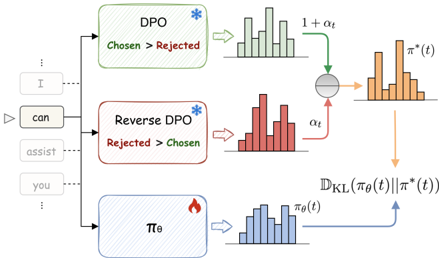

*Figure 1: An overview of our AlignDistil. At token position t , the distribution from the current policy π θ ( t ) is guided by a teacher distribution π ∗ ( t ) , which is constructed from an adaptive extrapolation between logit distributions from a DPO model and a reverse DPO model with a weight α*

**① Motivation / 对比图**

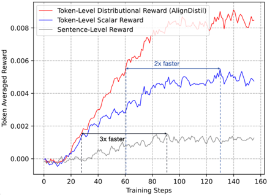

*Figure 2: Convergence curves of token averaged reward from optimization on the sentence-level, token-level scalar-type, and token-level distributional reward.*

### 一眼看懂
> 一句话导读：这篇把"做 RLHF 对齐"在数学上证明等于"向一个自动拼出来的 teacher 做 token 级蒸馏"，从而省掉显式奖励模型；真正的关键技巧是一个会随位置自动调强弱的外插权重。

- 🟦 TL;DR：本文把"带 token-level reward 的 RLHF 目标"在理论上**等价改写成一个蒸馏问题**（§3 Theorem 1）。这里的 teacher 分布并非现成大模型，而是 DPO 模型与 reference 模型的 logit 做线性组合后合成出来的。于是 RLHF 对齐就变成一件事：向这个自动合成的 teacher 分布做 token 级 KL 蒸馏。好处有二——无需训练显式 reward model；token 级监督让收敛更快(§6.5 比 sentence-level 快 >2×)。
- 最巧的一步：**逐 token 自适应外插权重 \(\alpha_t = D_{\mathrm{TVD}}(t)\cdot r + \epsilon\)**（§4.2 Eq.16-17）。这个权重控制"teacher 比 DPO 再往 reward 方向推多远"。抽掉它、改用一个常数外插就会垮：常数太小则欠优化，常数太大则过优化、回复暴长。
  - 证据(§6.2 Table 3)：常数 \(\frac{\beta_0}{\beta}=2.0\) 时，AE2 LC 25.17 看着高，但回复长度从 2332 飙到 4434、\(D_{\mathrm{KL}}(\pi_\theta\|\pi_{\mathrm{dpo}})\) 从 10.16 飙到 34.52——明显过优化。
  - 自适应权重的逻辑是"两个 DPO 在某 token 上分歧越大，就在该位置外插得越激进"，借此自动平衡。最终 KL 22.95、长度 2424，拿到 LC 21.16。

### 为什么做
> 一句话导读：现有对齐的奖励信号太粗（一整条回复一个分数），而 DPO 虽能拆到 token 级却不够准；本文想要"token 级、又不用额外训奖励模型"，于是发现可以把 RLHF 整个转成蒸馏。

- 研究背景：LLM 对齐有两条主线。
  - **RLHF**（两阶段）：第一阶段用 Bradley-Terry 训一个 response-level reward model \(L_{\mathrm{RM}}(\phi)=-\mathbb{E}_{(x,y_w,y_l)\sim D}[\log\sigma(r_\phi(x,y_w)-r_\phi(x,y_l))]\)（Eq.1）；第二阶段用 PPO 优化策略并加 KL 约束 \(J_{\mathrm{RLHF}}(\theta)=\max_\theta\mathbb{E}_{x\sim D,\,y\sim\pi_\theta}[r_\phi(x,y)-\beta\log\frac{\pi_\theta(y|x)}{\pi_{\mathrm{ref}}(y|x)}]\)（Eq.2）。
  - **DPO**（直接偏好学习）：思路是省掉显式 RL。它用策略自身参数化 reward \(r_\theta(x,y)=\beta\log\frac{\pi_\theta(y|x)}{\pi_{\mathrm{ref}}(y|x)}+\beta\log Z(x)\)（Eq.3），代入 BT 损失即得 \(L_{\mathrm{DPO}}\)（Eq.4）。Rafailov 等(2024a)进一步证明，DPO 自带一个可按 token 分解的隐式 reward \(r_{\mathrm{dpo}}(x,y_{<t},y_t)=\beta\log\frac{\pi_{\mathrm{dpo}}(y_t|y_{<t},x)}{\pi_{\mathrm{ref}}(y_t|y_{<t},x)}\)（Eq.6）——也就是说 DPO 隐含了 token 级信号。
- 解决的具体痛点（两个）：
  - 痛点一——粒度太粗。现有对齐多用**稀疏的 response-level reward/偏好标注**去优化整条回复里的所有 token。这会错误惩罚好回复里的高质量 token，或反过来鼓励差回复里的低质量 token，从而拖慢收敛、限制性能上限（§1，引 Yoon/Li/Xia/Yang 2024）。
  - 痛点二——DPO 的 token 信号不够准。DPO 自带的 token-level reward 虽然可分解，但**精度不如纯 reward model**（§4.1，引 Lin et al. 2024）。Table 2 复现了这一点：DPO test acc 69.53% < RM 71.19%。
- 相关工作 & 并行技术路线（逐条点出短板，§7 + §5.2）：
  - **细粒度对齐线（fine-grained alignment）**，分三支：
    - (a) PRM/过程奖励：Lightman 2023 用 step 级人工标注，Math-Shepherd/Luo/Yuan 2024 自动收 step 奖励。短板=需额外 PRM 或采样成本。
    - (b) span/token 级：Cao 2024 从 critique 抽 span 奖励，Chan 2024 用 reward model attention，Li 2024a 用中间 token 输出，Guo/Chen 2024b 用 edit distance。短板=这些信号多为**标量**。
    - (c) 用 DPO token 奖励：TIS-DPO/Yang 2024c 把它接进 DPO，RTO(Zhong 2024)接进 PPO，Inverse-Q*(Xia 2024)做成新算法。
    - AlignDistil 也站在这条线上，差异是**用整个 reward 分布而非标量**。
  - **token 级 DPO 变体**：TDPO1/2(Zeng 2024)给 DPO 加 token 级 forward-KL 约束，但 §5.3 实测该约束在小模型上**反而限制性能**；SimPO(Meng 2024)去掉 reference 做简化；KTO(Ethayarajh 2024)用非配对数据。这几个仍都是 response 级。
  - **最强基线 RTO**(Zhong 2024)：把 token-level DPO reward 塞进 PPO，§5.3 称其很强(超 PPO)。但它仍是**标量** token reward，丢失了分布信息、收敛慢(§6.5)。
  - **LLM 知识蒸馏线**(§7)：包括 white-box KD(MiniLLM/DistiLLM/DSKD，对齐分布或中间特征)与 black-box KD(Alpaca/Vicuna/Zephyr，只收 teacher 输出做 SFT)。AlignDistil 与它们的差异：teacher 不是现成大模型，而是**由 RLHF 目标推导出的合成分布**，目标也不是压缩，而是 token 级 reward 优化。
- 动机链（一步步推下来）：想要 token-level 奖励优化、又不想额外训昂贵的 reward model；注意到 DPO reward 可按 token 分解；于是设问——能否把"带 DPO token reward 的 RLHF"直接转成蒸馏；Theorem 1 证明可以；但还有两个坑要补——vanilla DPO reward 不准(于是 Eq.12 加 reverse DPO)、常数外插不稳(于是 Eq.16 加自适应 \(\alpha_t\))。至于为什么不直接用 RTO：因为 RTO 用标量 token reward，丢失分布信息、收敛慢(§6.5 实测 >2×)。
- 与最近邻工作的精确差异（逐个对比）：
  - 相对 RTO（DPO reward 进 PPO）：差在**蒸馏整个 teacher 分布**，信息更全、收敛 >2× 快。
  - 相对 TDPO：差在**外插越过 DPO，而非把策略约束在 DPO 附近**。
  - 相对 Liu et al. 2024b（decoding-time 外插）：差在**把外插搬进训练 + 逐 token 自适应**。

### 怎么做 + 靠不靠谱
> 一句话导读：先证一个等价定理把 RLHF 变成蒸馏（第 0 节），再补两块工程设计让信号更准、外插更稳（第 1 节），最后给 on/off-policy 两套训练目标（第 2 节）；后面用消融逐个验证哪块拿掉就垮。

#### 0. 核心理论桥：RLHF ⇔ 蒸馏（§3 Theorem 1，全文地基）

- 第一步直觉：把 DPO reward 代入 RLHF 目标。DPO reward 写作 \(r_{\mathrm{dpo}}(x,y)=\beta_0\log\frac{\pi_{\mathrm{dpo}}(y|x)}{\pi_{\mathrm{ref}}(y|x)}\)（Eq.5，这里省去了与 \(y\) 无关的归一项 \(Z(x)\)）。把它代入 RLHF 目标 Eq.2，得
  \(\displaystyle \widetilde{J}_{\mathrm{RLHF}}(\theta)=\max_\theta\mathbb{E}_{x\sim D,\,y\sim\pi_\theta(\cdot|x)}\Big[\underbrace{\beta_0\log\tfrac{\pi_{\mathrm{dpo}}(y|x)}{\pi_{\mathrm{ref}}(y|x)}}_{\text{DPO reward}}-\underbrace{\beta\log\tfrac{\pi_\theta(y|x)}{\pi_{\mathrm{ref}}(y|x)}}_{\text{KL divergence}}\Big] \quad(\text{Eq.8})\)
  其中 \(\beta_0\) 是 DPO 训练时用的系数(常数)，\(\beta\) 是当前的 KL 系数。

- **Theorem 1**：上式（Eq.9 / Eq.8）严格等价于一个 token 级蒸馏目标
  \(\displaystyle \widetilde{J}_{\mathrm{RLHF}}(\theta)=\min_\theta\mathbb{E}_{x\sim D,\,y\sim\pi_\theta}\;\frac{\beta}{|y|}\sum_{t=1}^{|y|}D_{\mathrm{KL}}\big(\pi_\theta(\cdot|y_{<t},x)\,\|\,\pi^*(\cdot|y_{<t},x)\big) \quad(\text{Eq.10})\)
  这里的 teacher 分布 \(\pi^*\) 是对一个**合成 logit** 做 softmax 得到的；而合成 logit 就是 DPO 与 reference 两个 logit 的线性组合：
  \(\displaystyle z_t^*=\frac{\beta_0}{\beta}\,z_t^{\mathrm{dpo}}+\Big(1-\frac{\beta_0}{\beta}\Big)z_t^{\mathrm{ref}} \quad(\text{Eq.11})\)
  直觉：所谓"对齐"，被诠释成"向一个比 DPO 更靠 reward 方向的合成 teacher，做 token 级反向 KL 蒸馏"。这里 reverse-KL 指让学生分布去逼近 teacher，而非反向。证明见附录 A，做法是把 Eq.8 的期望逐 token 展开、再配方成 KL 形式。

#### 1. AlignDistil 两个工程设计（§4）

- **设计一：Contrastive DPO Reward（管 reward 准不准，§4.1）**
  - 问题：vanilla DPO reward 的泛化能力差于纯 RM（Lin 2024，并经 Table 2 复现）。
  - 做法：用一对对比 DPO 模型。一个是正常 DPO \(\pi_{\mathrm{dpo}}\)，另一个是 **reverse DPO** \(\pi_{\mathrm{dpo}}^-\)。reverse DPO 的训法是把训练数据的 chosen/rejected **对调**后再训，专门用来捕捉低质量数据的负面特征。两者相减即对比 reward \(r_{\mathrm{ctr}}(x,y)=\beta_0\log\frac{\pi_{\mathrm{dpo}}(y|x)}{\pi_{\mathrm{dpo}}^-(y|x)}\)（Eq.12）。
  - 配套技巧：把 RLHF 的 reference 从初始模型**前移成 \(\pi_{\mathrm{dpo}}\)**。这一步一举两得——既省下一个模型，又把参考基线推得更对齐。于是目标变成 Eq.13，合成 logit 变为
    \(\displaystyle z_t^*=\Big(1+\tfrac{\beta_0}{\beta}\Big)z_t^{\mathrm{dpo}}-\tfrac{\beta_0}{\beta}z_t^{\mathrm{dpo}-}=\underbrace{z_t^{\mathrm{dpo}}}_{\text{DPO 分布}}+\underbrace{\tfrac{\beta_0}{\beta}\big(z_t^{\mathrm{dpo}}-z_t^{\mathrm{dpo}-}\big)}_{\text{reward 分布}} \quad(\text{Eq.14-15})\)
    因为 \(\beta_0,\beta>0\)，这一式严格表示"在 forward DPO 的基础上，沿 forward 减 reverse 的差分方向**再外推一段**"。其效果是构造出比单纯 DPO 更对齐的分布，把策略推得**越过** DPO。

- **设计二：Token Adaptive Logit Extrapolation（管稳不稳，§4.2）**
  - 问题：固定的 \(\frac{\beta_0}{\beta}\) 很难调。\(\beta\) 偏大（即 \(\frac{\beta_0}{\beta}\) 偏小）会欠优化；\(\beta\) 偏小（即 \(\frac{\beta_0}{\beta}\) 偏大）则过优化、回复暴长。
  - 做法：改用两个 DPO 分布之间的 **TVD（总变差距离，衡量两分布的差异）**来算逐 token 的权重：
    \(\displaystyle \alpha_t=D_{\mathrm{TVD}}(t)\cdot r+\epsilon\in[\epsilon,\,r+\epsilon],\quad D_{\mathrm{TVD}}(t):=\tfrac{1}{2}\sum_{y_t\in V}\big|\pi_{\mathrm{dpo}}(y_t|y_{<t},x)-\pi_{\mathrm{dpo}}^-(y_t|y_{<t},x)\big| \quad(\text{Eq.16})\)
    其中 \(r\) 控制外插上界，\(\epsilon=0.001\) 用来防止 \(\alpha_t=0\)。之所以选 TVD，是因为它对称、计算高效、且值域落在 \([0,1]\)。直觉：两个 DPO 分歧越大的 token，对最终 reward 影响越大，所以该位置就用更强的 teacher。

  - 用 \(\alpha_t\) 替换常数，得到逐 token 的 teacher \(z_t^*=z_t^{\mathrm{dpo}}+\alpha_t(z_t^{\mathrm{dpo}}-z_t^{\mathrm{dpo}-})\)（Eq.17）；对应的 \(\beta_t=\frac{\beta_0}{\alpha_t}\) 也随之逐 token 自适应。

#### 2. 训练目标与数据流动（§4.3）

- **on-policy 版**（Eq.18）：用当前策略采样 \(\hat y\sim\pi_\theta(\cdot|x)\)，再用 Monte-Carlo 估期望：
  \(\displaystyle L_{\mathrm{AD}}^{\mathrm{on}}=\frac{1}{|B|}\sum_{x\in B}\frac{\beta_t}{|\hat y|}\sum_{t=1}^{|\hat y|}D_{\mathrm{KL}}\big(\pi_\theta(\cdot|\hat y_{<t},x)\,\|\,\pi^*(\cdot|\hat y_{<t},x)\big)\)

- **off-policy 版**（Eq.19）：改用现成 prompt-response 数据集 \(\{(x,y)\}\)，把上式里的 \(\hat y\) 换成数据集里的 \(y\)。
- 数据流动（一条流程）：先用 UltraFeedback 的 prompt+response pair 训出 \(\pi_{\mathrm{dpo}}\) 与 \(\pi_{\mathrm{dpo}}^-\)。训练时，on-policy 版只用 prompt（策略自己采样），off-policy 版用 prompt+chosen response。每一步：前向 \(\pi_{\mathrm{dpo}}/\pi_{\mathrm{dpo}}^-\) 合成 teacher logit，算 token 级反向 KL，更新 \(\pi_\theta\)。
- **关键超参与默认值**(§5.1)：1 epoch、batch 128、lr 1e-6、warmup 0.1；\(\epsilon=0.001\)；§6.5 收敛实验用 \(\beta=0.08\)；外插上界 \(r\) 与 \(\beta_2\) 见附录 C；硬件 8×A100-40G。

#### 3. 逐组件必要性（消融）

- **RLHF⇔蒸馏等价(Theorem 1)**：这是理论地基。没有它，就没有"对齐=蒸馏"的合法性，也没有 teacher 的构造式 Eq.11/15。
- **contrastive DPO reward**：§6.1 Table 2 显示，contrastive 的 test acc 71.29%，高于 vanilla DPO 69.53%，甚至高于纯 RM 71.19%；对应 on-policy AE2 LC 19.45 vs vanilla 16.51。机制有两点——reverse DPO 捕捉负面特征，以及隐式地把可训练参数翻倍。没有它，reward 就不准。
- **token 自适应 \(\alpha_t\)**：§6.2 Table 3（用 off-policy 来隔离数据影响），把 \(\alpha_t\) 与各种常数对比。\(\alpha_t\) 在 KL 22.95、长度 2424 下拿到 LC 21.16，平衡最好；常数 1.0 欠优化(LC 18.40)，常数 2.0 过优化(长度 4434)。另一条对照在 §5.3：用 `DPOβ=0.01`（等价于 rescale \(\beta\) 做简单外插），发现单纯 rescale 不稳定（在 Qwen2.5-1.5B 上不涨），反证这两个设计确有必要。
- **on-policy vs off-policy**：§5.3 结论 3——on-policy 数据更贴近策略(分布内)，通常效果更好；off-policy 更高效，也有竞争力。两版都提供，供灵活权衡。

#### 4. 实验与证据

- 实验设置：初始模型用 Qwen2-1.5B-Instruct、Qwen2.5-1.5B-Instruct；§6.3 另加 Qwen2.5-7B（在 UltraChat-200k 上 SFT）、Llama3-8B（用 SimPO 开源的 SFT ckpt）。数据用 UltraFeedback(63K)。评测覆盖 AlpacaEval 2.0(LC WR/WR)、MT-Bench、Arena-Hard(WR/SC WR)，裁判用 Qwen2.5-72B-Instruct（§表6 验证其判断与 GPT-4 相当，但更便宜）。
- 关键数字(Table 1)：on/off-policy 两版都显著超过 8 个基线(DPO/KTO/SimPO/TDPO1-2/PPO/RTO)。
  - AE2 LC 较 DPO 提升 **>6%**：Qwen2-1.5B 上 DPO 6.42 → on-policy 12.93、off-policy 11.79；Qwen2.5-1.5B off-policy LC 21.16 vs DPO 14.35。
  - 大模型同样领先：§6.3 中 Qwen2.5-7B on-policy LC 31.32 vs TDPO1 26.42。
  - §6.4 TL;DR 任务 win-rate 92.5%/92.8%，超过 PPO 87.7%、RTO 90.8%。
  - §6.5 收敛速度 >2× 快于 token 标量信号、远快于 sentence-level(Fig 2)。原因：蒸馏整个分布可以在每个 token 位置精确算出 reward 期望。
  - baseline 覆盖全面，比较公平。
- 假设与失效边界：
  - 【原文】Limitations——评测限于小模型(~1.5B)，更大模型未充分探索（虽然 §6.3 补了 7B/8B）。
  - 【推断】"外插越过 DPO"这一步，隐含假设 DPO 的改进方向在更大步长上仍然正确；过度外插会放大噪声（靠 \(\epsilon\) 下限 + \(\alpha_t\) 缓解，但没有理论上界）。
  - 【推断】需要训 3 个模型(DPO / reverse DPO / 最终策略)，成本不低。
  - 【推断】评测偏对话/指令，未验证数学/代码推理域。
- 祛魅总结：【推断】真正的贡献是"RLHF + DPO reward ⇔ token 级蒸馏"这一干净的理论桥，加上两个有消融支撑的工程设计(contrastive reward、自适应外插)。包装比较实在，理论(Eq.8-17)与代码(v1 已核对 aligndistil_trainer.py)能一一对应。要注意的是：作者**可能高估**了泛化性(规模/域都有限)，也**低估**了三模型训练的工程成本与超参(\(\beta/\beta_2/r\))的敏感性。

### 结构化抽取

- 🎯 机制速览6轴：
  - **学什么信号**=合成 teacher 分布 \(\pi^*\)（由 DPO 与 reverse-DPO 外插得到）的 token 级 \(D_{\mathrm{KL}}\)；其中隐含一个 token 级的分布型 reward。
  - **改什么**=策略模型的 logits/参数。
  - **何时改**=在线（on-policy，每步用当前策略采样）或离线（off-policy，用偏好数据）。
  - **免梯度?**=否，是梯度蒸馏。
  - **记忆-技能生命周期**=不适用。
  - **防遗忘机制**=KL 形蒸馏天然把策略约束在 teacher 附近（teacher 已含 DPO/ref 信息），间接抑制偏离；没有专门的持续学习设计。
- ⑦ 开源代码+框架/harness：https://github.com/songmzhang/AlignDistil 。
  - v1 已克隆约 2.4M，**完整**，自带一个定制版的 OpenRLHF 子目录。
  - 框架=**OpenRLHF v0.5.2.post2**；on-policy 另需 vLLM。
  - 核心 loss 在 `openrlhf/trainer/aligndistil_trainer.py`（走 `reward_boost_type=="aligndistil"` 分支）；训练脚本在 `train_scripts/ultrafeedback/qwen2.5-1.5b/`（含 dpo / reverse_dpo / aligndistil_off_policy / on_policy）。
- 💰 资源/成本与可扩展性：
  - 【原文】§5.1 全部实验在 8×A100-40G；1 epoch、batch 128、lr 1e-6。
  - 【推断】需依次训 DPO + reverse DPO + 最终策略共 3 段，再加上 on-policy 采样开销；总成本约为 PPO 的数倍，但每一段都较轻量。
- 🎯 对"探索-巩固"对标（**竞品/可借组件**）：
  - 定位：属于 L1 on-policy distillation 的正统做法（on-policy 版用当前策略采样向 teacher 蒸馏），与本项目 OPD 主轴**直接同族**。
  - 可借组件一："teacher = 两模型 logit 自适应外插"——用它构造比单一 teacher 更强的引导分布。
  - 可借组件二：**逐 token 自适应权重 \(\alpha_t\)（用分歧度 TVD 调引导强度）**，可迁移到 TSRD 的"在岔路口/关键步动态调脚手架强度"。
  - **缺口**：AlignDistil 做的是对齐(helpfulness)任务；teacher 由 DPO 合成，而非"会走通的 teacher 轨迹"；没有显式的探索/路径恢复语义，也没有 MTP 前瞻。
  - 一句判定：**强相关、可直接借鉴的 OPD 实例 + 自适应引导强度机制**。依据是——on-policy 蒸馏加上 token 级自适应 teacher 强度，正是 TSRD"稀疏脚手架按需调强"的现成数学载体。
- 🔭 开放问题/未来方向：
  - 【原文】Limitations——把方法扩到更大模型。
  - 【推断】把"RLHF⇔蒸馏 + 自适应外插"从对齐迁移到 RLVR/推理（teacher 换成会走通的强推理模型）。
  - 【推断】\(\alpha_t\) 的 TVD 信号可当作"关键步识别"的 proxy。
  - 【推断】外插步长的理论上界、以及自适应的 \(r\)。
  - 【推断】与显式 reward 蒸馏的混合。

---

## (SSD) Embarrassingly Simple Self-Distillation Improves Code Generation

> **`apple_ssd`** ｜ Apple（Ruixiang Zhang / Richard He Bai / Huangjie Zheng / Yizhe Zhang 共一） ｜ 2026-04-01 arXiv v1 · preprint ｜ L1 自蒸馏(off-policy 纯 SFT) · 相关性中（与 OPD 对照/边界案例） ｜ [📄 原始论文](https://arxiv.org/abs/2604.01193)

### 关键图示

**① Motivation / 对比图**

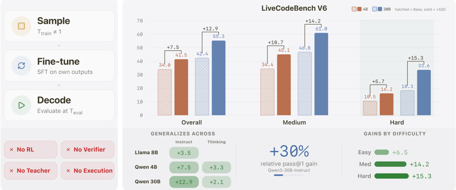

*Figure 1 Simple self-distillation (SSD) is embarrassingly simple, yet yields substantial LiveCodeBench v6 gains across five models spanning two families, three scales, with both instruct and thinking variants. Left: SSD samples from the base model with training-time decoding temperature T train, fin*

**② 方法 / 架构图**

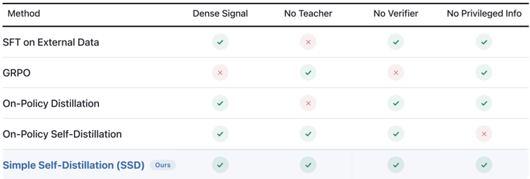

*Table 1 Comparison of training paradigms.*

### 一眼看懂

> 一句话导读：不用 teacher、不用 verifier、不用奖励、不用代码执行——只让模型在"调高温度 + 截断"下采自己的原始输出(连对错都不筛)，再做普通 SFT，评估时单独换个解码温度，代码生成就大涨。增益来自分布被重塑，不是学到了正确解。

- 🟦 TL;DR：SSD 不用任何 teacher/verifier/reward/RL/代码执行环境，只让模型在"调过温度 \(T_{\mathrm{train}}\neq1\) + 截断 \(\rho\)"的设定下采样自己的**原始、未验证**输出，再用标准交叉熵 SFT，评估时单独调一个解码温度 \(T_{\mathrm{eval}}\)——就能把代码生成显著提升(Qwen3-30B-Instruct LCB v6 pass@1 42.4%→55.3%，§3.2 Table 2)，增益集中在中/难题，5 个模型(Qwen/Llama × 4B/8B/30B × instruct/thinking)全部提升。
- 最巧的一步：**训练时用"非 1.0 温度 + 截断"采样作为 SFT 目标**（§2 Eq.1，即 \(T_{\mathrm{train}}\neq1\) + \(\rho_{\mathrm{train}}\)）。抽掉它(令 \(T_{\mathrm{train}}=1\)、无截断)就垮。原因是：在低温/截断下采样，等于先把分布的尾巴(包含 lock 处的 distractor)削掉，再拿削过的分布当目标。于是 SFT 学到的新分布会**按上下文**自动在 lock 处压住 distractor、在 fork 处保留多样性(§4)。这是任何固定的解码温度永远做不到的(§3.3 证明 best-tuned base 仍差 SSD 11.8pp)。

### 为什么做

> 一句话导读：现有自提升路径都需要 teacher/verifier/reward/执行环境/人工解之一，各有各的贵或不稳。SSD 想问：能不能完全零外部依赖地自我提升，并把它为什么 work 讲清楚。

- 研究背景：编码任务越来越难，高质量监督信号成了瓶颈——人工解贵；合成数据要么需要更强 teacher、要么需要对每题做执行验证(§1)。
- 解决的具体痛点：**能否让模型在完全不借助任何外部标注/验证的情况下自我提升？**(§1 末) 现有路径都需要 teacher/verifier/reward/执行环境/人工解中的某一个。
- 相关工作与并行技术路线（按路径分，逐条点短板，§1 + Table 1）：
  - **人工解 SFT**(Chen/Austin/Hendrycks 2021)：贵、难规模化。
  - **teacher 蒸馏**(Hinton 2015/Kim-Rush 2016/Hsieh 2023/Agarwal 2024)：**继承 teacher 上限**，学生天花板就是 teacher。
  - **执行验证合成**(AlphaCode/CodeRL/Singh STaR/rSTAR 2024-25)：每题都需执行/测试用例，工程上很重。
  - **RLVR**(DeepSeek/OpenAI/He 2026/Shao GRPO 2024)：工程复杂，可能不稳。
  - **无监督内禀奖励**——majority voting / 熵最小化(Zuo/Agarwal 2025)：有早期成效，但面临 **reward hacking + 长训崩溃**(Zhang 2025)。
  - **范式对比表(Table 1)**：SFT on External Data(需外部数据)、GRPO(需 verifier)、On-Policy Distillation(需 teacher)、On-Policy Self-Distillation(需 verifier 筛选)。**SSD = 无 teacher / 无 verifier / 无 privileged info / dense signal** 的唯一一行(全部打勾)。
- 动机链：现状(自提升都需某种外部信号) → 缺陷(贵/继承上限/不稳/崩溃) → 所以做最简、零外部依赖的自蒸馏，并搞清它为何 work。为什么选代码域？§1、§3 解释——代码的任务结构(fork/lock 位置并存)让底层机制**特别可见**，便于分析。
- 与最近邻工作的精确差异：相对 on-policy distillation / self-distillation，差在**完全 off-policy(从冻结 base 采样后 SFT，不在线更新采样分布) + 不做任何正确性筛选**；相对熵最小化等无监督法，差在**用温度 + 截断的采样配置**作为重塑分布的杠杆，而非内禀奖励，从而避免 reward hacking。

### 怎么做 + 靠不靠谱

> 一句话导读：方法只有"采样→SFT→换温评估"三步，纯 off-policy。全文灵魂是 §4 的 precision-exploration conflict：代码里 fork 位置要高温多样、lock 位置要低温精确，任何全局固定温度都是折中；SSD 改的是分布本身，所以能两头兼顾。最难造假的旁证是"用乱码数据也涨"。

#### 1. 方法流水线（§2，三步极简，可复现级）

- **Step 1 Sample**：冻结 base \(p_\theta\)，以温度 \(T_{\mathrm{train}}\)(非 1.0) + 截断 \(\rho_{\mathrm{train}}\)(top-k/top-p) 对每个 prompt 采 \(N\) 个候选 \(y\sim\mathrm{Decode}_{T_{\mathrm{train}},\rho_{\mathrm{train}}}\big(p_\theta(\cdot|x)\big)\)（Eq.1）。\(N=1\) 即够(§3)。**不做任何验证/筛选**(no execution/test/correctness filter)，仅删空响应/单行 stub，得到原始数据集 \(D_{\mathrm{SSD}}\)。
- **Step 2 Fine-tune**：对这些原始输出做标准交叉熵 SFT：
  \(\displaystyle L(\theta)=-\mathbb{E}_{(x,y)\sim D_{\mathrm{SSD}}}\sum_{t=1}^{|y|}\log p_\theta(y_t\mid x,y_{<t}) \quad(\text{Eq.2})\)

- **Step 3 Decode**：评估时用单独调过的 \((T_{\mathrm{eval}},\rho_{\mathrm{eval}})\) 解码 \(\hat y\sim\mathrm{Decode}_{T_{\mathrm{eval}},\rho_{\mathrm{eval}}}\big(p_{\theta^*}(\cdot|x)\big)\)（Eq.3）。
- **数据流动**：\(\sim\)10K 竞赛题 prompt → 冻结 base 一次性各采 1 解(vLLM, 128K 上下文) → 标准 SFT(Megatron-LM) → 换温评估。**纯 off-policy**：采样分布不随训练更新。

#### 2. 关键超参与默认值（§3.1, Table 3/4）

- 数据：rSTARcoder seed 子集去重后约 10K 竞赛题；每题采 1 解。
- 训练：Megatron-LM、8×B200(MoE 设 EP=8)、AdamW + cosine(peak LR \(5\times10^{-6}\))、global batch 32、seq len 65,536；instruct 2,500 iters(warmup 250)、thinking 300 iters(warmup 50)。
- 采样/评估温度：base 用各模型官方推荐采样参数；SSD 用 Table 3 配置。**最优区(§3.4 grid)**：no-trunc 下 \(T_{\mathrm{eff}}=T_{\mathrm{train}}\cdot T_{\mathrm{eval}}\) 主导(\(R^2=0.75\)，峰值 \(T_{\mathrm{eff}}\approx1.2\))；加截断后天花板更高，best = \(T_{\mathrm{train}}{=}2.0,\,T_{\mathrm{eval}}{=}1.1,\,\text{top-k}{=}10\)，达 49.7% pass@1。
- 评测：主用 LCB v6(02-05/2025，按 easy/med/hard 分层)，辅用 LCB v5(374 题)；报 pass@1/pass@5。

#### 3. 关键机制：precision-exploration conflict（§4，全文灵魂）

- **§4.1 冲突假设**：代码里有两类位置——
  - **fork**：多种续写都合理、对应不同解法，需要多样性/高温(如函数体开头的 for/递归/初始化)。
  - **lock**：语法语义上近乎唯一、但有一条低概率的 distractor 尾巴，需要精度/低温(如 `if n ==` 后的特定值)。
  温度缩放 \(p_T(v)\propto p(v)^{1/T}\) 是**全局**地拉平/锐化整个分布：低 \(T_{\mathrm{eval}}\) 保住 lock 但饿死 fork 的多样性；高 \(T_{\mathrm{eval}}\) 救了 fork 但让 lock 的 distractor 复活。所以**任何全局固定温度必然是折中**(Fig 4)——"帮 fork 的温度，恰好让 lock 的 distractor 复活"。

- **§4.3 理论形式化(Eq.4，核心公式)**：在 \((T_{\mathrm{train}},\rho_{\mathrm{train}})\) 下采样，任一 context 会产生一个保留集 \(S\)(过了温度 + 截断后存活的 token)及其上的归一化分布 \(q\)；记 \(\mathrm{KeptMass}_\theta\) 为模型分给 \(S\) 的概率质量、\(T\equiv T_{\mathrm{train}}\)，则诱导损失分解为
  \(\displaystyle L(\theta)=\underbrace{-\log\mathrm{KeptMass}_\theta}_{\text{support compression (via }\rho_{\mathrm{train}})}+\underbrace{(1-T)\,H_{1/T}\big(p_\theta(\cdot|S)\big)}_{\text{within-support reshaping (via }T_{\mathrm{train}})}+\underbrace{T\cdot\mathrm{KL}\big(q\,\|\,p_{\theta,T}(\cdot|S)\big)}_{\text{alignment to base}}+\text{const} \quad(\text{Eq.4})\)
  其中 \(H_{1/T}\) 是 \(1/T\) 阶 Rényi 熵、\(p_{\theta,T}(\cdot|S)\) 是模型在 \(S\) 上的 tempered 分布。三项的作用是：①**支撑压缩**(削尾，把质量集中到更小的可行 token 集)；②**支撑内重塑**(重塑 head)；③与 base 在 \(S\) 上保持对齐。这证明 SSD **不是单纯模仿**，而是同时强制做支撑压缩 + head 重塑。

- **lock/fork 不对称(§4.3)**：lock 处只有少数 token 存活，支撑压缩主导，于是 distractor 被挤出尾巴、head 对 \(T_{\mathrm{eval}}\) 变不敏感(变成 **spike**)；fork 处有多个续写存活，within-support 重塑有空间拉平/保留 head 而不重开尾巴(变成 **plateau**，Fig 5)。
- **为何解码调温替代不了(§4.3 B.5)**：decode-only 受 base 现有的 ranking/累积曲线约束，只能对一个固定分布重加权，**无法按上下文同时锐化 lock + 清理 fork head**；SSD 改的是分布本身，所以 §3.3 的 decode-only gap 才会持续存在。

#### 4. 逐组件必要性（消融）

- **\(T_{\mathrm{train}}\neq1\) + 截断采样**：核心。§3.4 grid——no-trunc 下 \(T_{\mathrm{eff}}\) 主导(\(R^2=0.75\))；加截断天花板更高(49.7%)。没有它就没有重塑。
- **训练 + 解码协同(非互换)**：§4.2 toy 证明——训练只让 lock 更稳、不解决 fork；解码调温只动 fork、不清 lock；两者**必须同时**才有增益。§3.3 进一步：best-tuned base(只调 \(T_{\mathrm{eval}}\)) 的 pass@1 spread 仅 2.2pp，仍差 SSD 11.8pp。
- **未验证原始输出**：刻意不筛，§4 用"增益来自分布重塑而非数据筛选"形成逻辑闭环。**§4.4 反直觉佐证**："bad data, good results"——即便用 \(T_{\mathrm{train}}=2.0\) 采出的乱码数据，SSD 仍提升(Fig)，直接坐实"机制是分布重塑而非学到正确解"。

#### 5. 实验与证据

- 5 个模型(Llama-3.1-8B-Instruct、Qwen3-4B/30B-A3B 各 Instruct/Thinking；30B 为 MoE 30B/3B active)。主基准 LCB v6(分难度)，辅 LCB v5。
- 关键数字(Table 2)：Qwen3-30B-Instruct LCB v6 pass@1 42.4→55.3(+12.9pp/+30.4%)；难题 pass@1 +15.3pp、**hard pass@5 31.1→54.1(+23.0pp)**(关键旁证：若只是锐化单模 coverage，该值应降而非升)；5 个模型全提升(pass@1 Llama +3.5/4B-Ins +7.5/4B-Think +3.3/30B-Think +2.1/30B-Ins +12.9)。**pass@5 增益常大于 pass@1**(如 30B-Ins +18.1 vs +12.9)——直接反驳"只是塌缩到单一主模式"。
- 三路机制证据互证：受控仿真(§4.2 toy 闭式复现 conflict + Fig 5 fork→plateau/lock→spike)、真实模型分析(§4.2 Fig 6：a 累积质量上升更快=lock 侧 head 更干净；c 截断后熵涨更多 + d 即便 top-20 质量相近 SSD 仍熵高=fork 侧更多可行续写)、理论(Eq.4 + 附录 B)。§C.3 跨域(数学/通用代码)30B 模型"broadly stable"。baseline 公平(用各模型官方推荐采样作 base)。
- 假设与失效边界：【原文】§1 机制在代码域验证(任务结构让机制可见)；§C.3 跨域仅 30B"broadly stable"。【推断】"代码任务结构让机制可见"反过来意味着该机制在非代码域是否成立未定；训练用未验证输出，对"错误解占比 vs 最终增益"无定量关系(§4.4 反而用乱码数据证明增益与正确性无关)；长程多轮自蒸馏是否崩溃(类似熵最小化)未测；\(T_{\mathrm{train}}/\rho/T_{\mathrm{eval}}\) 三超参的选取对结果影响大。
- 祛魅总结：【推断】真贡献是 precision-exploration conflict 这一**清晰且可证的机制解释**，加上极简方法、三路证据(仿真/真实/理论)互证、hard pass@5 大涨、以及 §4.4 乱码数据仍涨这两个难造假的旁证。**包装处**："embarrassingly simple"的叙事淡化了 \(T_{\mathrm{train}}/\rho/T_{\mathrm{eval}}\) 三超参的 grid search 成本(§3.4 本身并不简单)；"无任何外部信号自提升"成立，但机制限于代码域。作者**可能高估**了跨域普适性，但**诚实地标注**了"为何用未验证输出仍提升"靠的是间接解释 + 乱码数据实验的直接支撑。

### 结构化抽取

- 🎯 机制速览6轴：**学什么信号**=模型自身在 \(T_{\mathrm{train}}\neq1\)+截断下的原始未验证输出(无正确性信号) | **改什么**=模型参数(通过 SFT 重塑 token 分布:support compression + within-support reshaping，Eq.4) | **何时改**=离线(从冻结 base 一次性采样→SFT，纯 off-policy，采样分布不随训练更新) | **免梯度?**=否(标准交叉熵 SFT) | **记忆-技能生命周期**=不适用(无记忆/技能库) | **防遗忘机制**=无显式；Eq.4 第三项 \(T\cdot\mathrm{KL}(q\|p_{\theta,T}(\cdot|S))\) 把重塑约束在 base 附近算隐式锚定；§C.3 报跨域基本稳定是观察。
- ⑦ 开源代码+框架/harness：https://github.com/apple/ml-ssd （约 0.85MB，社区关注高）。**可得性部分**：含 `data_generation/`(采样流水线) + `evaluation/`(LCB 评测工具)；**SFT 训练本体不在仓库**——标准交叉熵，依赖外部框架 **Megatron-LM**(§3.1 脚注 NVIDIA/Megatron-LM)，README 注明"复现"。框架=采样(vLLM,128K 上下文) + 标准 SFT(Megatron-LM,8×B200,EP=8 for MoE) + 评估单独调温；无 RL/verifier/teacher/执行环境。预训练模型(4B/30B)在 HuggingFace。**未完整克隆**：训练脚本依赖外部 Megatron-LM，需手动搭建训练侧。
- 💰 资源/成本与可扩展性：【原文】§3.1——训练 8×B200 GPU，AdamW cosine(peak LR \(5\times10^{-6}\))，global batch 32，seq len 65536，instruct 2500 iters/thinking 300 iters；采样 vLLM 128K。【推断】\(\sim\)10K prompt × N=1 采样成本低；主要成本在 30B MoE 的 SFT；无需 reward/执行环境，流水线比 RLVR 轻。
- 🎯 对"探索-巩固"对标：**对照/边界案例(而非直接竞品)**——SSD 是**纯 off-policy 自蒸馏**，与本项目 OPD"student 全程 on-policy 自选"范式相反(Table 1 把 SSD 与 On-Policy Distillation 并列对比)，正好作 OPD 的**消融对照锚点**:它证明"即便不在线 on-policy、不用 teacher，只靠重塑自身分布也能提升"。**可借组件**:① **precision-exploration conflict / fork-lock 框架**——"fork=该探索的岔路口、lock=该精确锁定的关键步"与 TSRD"探索/选路 vs 巩固/回轨"在 token 几何上高度同构，可作 TSRD 选"在哪个 token 接管/前瞻"的理论语言；② Eq.4 的 support compression + within-support reshaping 可类比"巩固=压住错误分支、保留有用多样性"。**缺口**:无 teacher 脚手架、无 path-recovery、无 on-policy 自选、无 MTP 前瞻;增益来自分布重塑而非主动选路。一句判定：**对照价值 > 直接借鉴;其 fork/lock 机制语言可为'探索-巩固在 token 级如何定位'提供理论框架，但方法范式(off-policy 自蒸馏)是 OPD 的对立面**。依据：student 不在线自选、无 teacher、纯 SFT。
- 🔭 开放问题/未来方向：【原文】§1、§5——SSD 作为 RL/teacher 蒸馏之外的互补后训练方向；现有代码模型含固定解码未实现的能力。【推断】把 fork/lock 框架迁移到推理(数学)域验证；长程多轮自蒸馏的崩溃边界；与 on-policy/RLVR 结合(SSD 重塑分布作 RL 的更好起点)；用 fork/lock 信号指导 TSRD 的"接管点/前瞻点"选择；三温度超参的自适应。

---

## AVSD: Adaptive-View Self-Distillation by Balancing Consensus and Teacher-Specific Privileged Signals

> **`avsd`** ｜ UNC Chapel Hill / Capital One / UT Austin（Duy Nguyen 等;Elias Stengel-Eskin、Mohit Bansal 谱系） ｜ 2026-05（arXiv:2605.20643v1，Preprint，cs.LG） ｜ 主题线 L1 OPD/自蒸馏·相关性 高 ｜ [📄 原始论文](https://arxiv.org/abs/2605.20643)

### 关键图示

**① Motivation / 对比图**

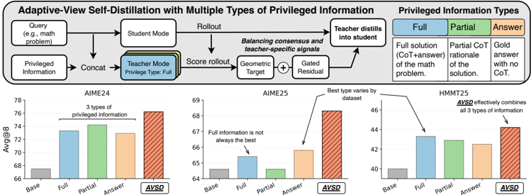

*Figure 1: Self-distillation leverages access to privileged ground truth information as a teacher to distill into the student. However, performance across datasets on Qwen3-4B varies substantially depending on the type of privileged ground truth information the teacher has access to (full solution, p*

**② 方法 / 架构图**

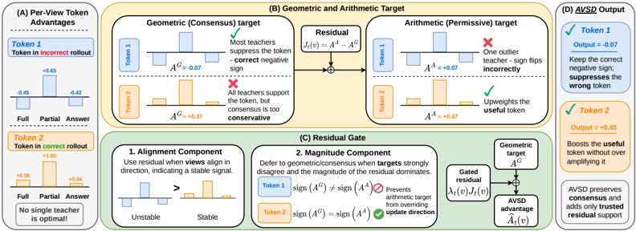

*Figure 2: (A) Bar graphs show teacher advantages on student tokens. (B) The geometric target demands consensus between teachers (conservative), while the arithmetic target allows individual teachers to contribute more strongly (permissive). The residual is their difference. (C) A twocomponent gate c*

### 一眼看懂

> 一句话导读：自蒸馏让同一个模型既当 student 又当 teacher，teacher 偷看"特权信息"给 dense 信号。但没有哪种特权视图永远最好。AVSD 不挑也不固定某个视图，而是同时上 3 个视图，把信号拆成"跨视图共识(定方向)"和"单视图残差(只调幅度)"，用一个门控保证残差永远不能翻转共识方向。

- 🟦 TL;DR：自蒸馏让**同一个模型**当 student 又当 teacher，teacher 偷看"特权信息"（完整解 / 部分推理 / 只给答案），在 student 自采的轨迹上给 dense 的 token 级信号。问题是没有哪种特权视图永远最好（§1 Fig.1：Qwen3-4B 上不同数据集的最优视图不同），且单视图会逼 student 去编码它推理时根本看不到的关联（这是信息不对称导致的、不可消除的互信息 gap，引 Yang 2026）。AVSD 既不挑也不固定某个视图,而是**同时上 M=3 个视图**，把它们诱导的 teacher 信号拆成两部分：一是"跨视图共识"（geometric，可靠方向）；二是"单视图残差"（arithmetic−geometric，可能有用、也可能是特权 artifact）。再用一个**门控**，只在"各视图方向一致 + 残差幅度不喧宾夺主"时才把残差加进去。
- 最巧的一步：**门控 \(\lambda_t(v)=C_t(v)\cdot R_t(v)\)（§2.3 Eq.2）及其有界性 \(\lambda_t(v)J_t(v)\le |A^G_t(v)|\)（Appendix B.3）**。抽掉门控，方法要么退化成纯几何共识（太保守，§4.1 消融平均输 1.4%），要么退化成纯算术边际（被单个视图带跑、符号翻转，输 1.7%）。正是"共识定方向、残差只能调幅不能翻向"这个数学保证，让它两头都不踩雷。

### 为什么做

> 一句话导读：现有自蒸馏一旦选定一种特权视图就全程固定，但最优视图因任务而异且无先验判据；单视图既有信息不对称、又会丢掉帮模型识错的信号。AVSD 想同时用多视图并自适应组合——但直接平均会被一个视图带翻方向，直接取交集又太保守，所以必须分解 + 门控。

- 研究背景：可验证任务（数学/代码）后训练的主流是 RLVR（GRPO/DeepSeekMath，§1 引 Shao 2024、DeepSeek-AI 2025），但奖励**稀疏且只在 outcome 层**，失败轨迹几乎没学习信号、采样还贵（§1 引 Tao 2025 "Hybrid Reinforcement"）。蒸馏（Hinton 2015）能给 dense 的 token 级信号，但**标准离线蒸馏有 train-test mismatch**——student 是在自己分布外的轨迹上训的（引 Xu 2024、Agarwal 2024）。**on-policy 蒸馏（OPD，Agarwal 2024 / MiniLLM Gu 2024）**在 student 自采的 rollout 上用 teacher 概率给局部信号，缓解了这点，但仍**依赖一个更强的外部 teacher**。**自蒸馏（self-distillation）**则去掉外部 teacher，让同一个模型在特权信息（解/示范/反馈/答案）下当 teacher（引 Zhao 2026 OPSD、Shenfeld 2026 SDFT）。
- 解决的具体痛点：现有自蒸馏**一旦选定特权视图就全程固定**（§1 强假设，引 Shenfeld 2026 / Penaloza 2026），但有三个问题：
  - (1) **最优视图因任务而异、无先验判据**——给完整解的 CoT 可能把 teacher 锁进与 student 不合的思路（原文 "lock the teacher into a preexisting thought pattern"），只给答案更灵活但信息少（引 Penaloza 2026：不同特权形式在信息密度/任务效用/诱导分布漂移上各异）。
  - (2) **信息不对称导致不可消除的互信息 gap**（引 Yang 2026），student 被迫去编码 test 时看不到的 view-specific 关联。
  - (3) 最有信息量的特权形式反而**丢掉了帮模型识别推理错误的信号**、伤 OOD 数学推理（引 Kim 2026 why_sd_degrade）。
- 相关工作与各自不足（§5 两块）：
  - **① Learning from Privileged Information（特权信息学习，Lopez-Paz 2016 奠基）**：RLVR 给稀疏可验证奖励;自举/自改进造监督（STaR-Zelikman 2022、Self-Instruct-Wang 2023）;用特权信息改**探索/课程**——POPE（Qu 2026）用 oracle 解前缀做 on-policy exploration、off-policy guidance（Yan 2026）、把特权轨迹转 abstract hint（Chen 2026a / Liao 2026 self-hinting / Wang 2026 skill-SD）、合成课程（Sundaram 2026 / Cog-drift Chen 2026b）。**短板**：它们只关心"怎么拿到更好的轨迹/hint/课程"，**不解决"多视图同时可用时怎么构造 token 级信号"**。
  - **② On-Policy Self-Distillation & Teacher Aggregation**：OPSD（Zhao 2026 条件化数学参考解）、SDFT（Shenfeld 2026 蒸示范行为、还能 continual learning）、On-policy context distillation（Ye 2026）、RLSD（Hübotter 2026 / Song 2026 / He 2026 用 feedback/成功 rollout/reward 条件自改作特权上下文）;hybrid RL-distillation（HDPO-Ding 2026、sample routing-Li 2026a、KDRL-Xu 2025);ensemble 蒸馏平均 logits/votes。**短板**：**不刻画 teacher 信号里哪部分跨视图稳定、哪部分是特权专有**;ensemble 只做朴素平均，无方向-幅度分解。
- 动机链：现状（自蒸馏靠特权信息当 dense 信号） → 缺陷（单视图既不对称又难选） → 中心问题（§1 原文："can we leverage multiple privileged views simultaneously to construct better token-level on-policy learning signals than any single privileged teacher?"） → "同时用多视图 + 自适应组合"。为什么不用更简单的做法？**直接算术平均**会被单个被强 promote 的视图带翻方向（Fig.2 Token 1，符号翻错）;**直接取几何交集**又太保守、丢互补信息（Fig.2 Token 2，consensus 太保守）——都不行，必须**分解 + 门控**。
- 与最近邻工作的差异：
  - vs OPSD/SDFT（**单视图**自蒸馏）——AVSD 把"选哪个视图"变成"组合所有视图并按几何结构自适应加权";OPSD baseline 在本文里就是"同样的 reverse-KL 目标但只条件化单一视图"（数学=full solution、代码=reference implementation）。
  - vs **Yang 2026（也处理信息不对称）**——Yang 靠**可验证二值奖励锚定更新方向**、自蒸馏只调幅度;AVSD **不依赖二值奖励**（二值奖励只在可验证设定才有），而是**从 reverse-KL 学习信号本身的几何**推出聚合结构，无奖励时也能用。关键点：用"跨视图一致性"代替"外部奖励"来判断哪个更新可信。

### 怎么做 + 靠不靠谱

> 一句话导读：核心是把 teacher 信号拆成"几何共识(所有视图都顶的 token)定方向"和"算术残差(只有部分视图顶)补互补信息"，再用对齐 + 幅度两个门控分量保证残差只能在共识已定的方向上加力/减力、永不翻转。成本只 1.13×；token 级错误正号率从 12.3% 降到 2.9% 是有力的机制证据；增益 2~3% 属中等且集中在竞赛数学，门控是手工启发式。

> 一句话设定（§2.1）：训练集 \((x,r)\sim\mathcal D\)，\(x\) 是 prompt、\(r\) 是训练时的特权信息;student 只见 \(x\)，teacher 见 \(r\)。在线采 \(y=(y_1,\dots,y_T)\sim P^S_\theta(\cdot\mid x)\)，前缀记 \(h_t=(x,y_{<t})\)。

**【数据流 / 逐 step 流水线（§2 + Algorithm 1）——读完可复现】**

1. **采 on-policy rollout**：student 当前策略 \(P^S_\theta\) 对 prompt \(x\) 生成一条轨迹 \(y\)（温度 0.7，每 prompt 只采 1 条——见超参表）。**只此一处是顺序生成，也是主成本**。
2. **构造 M 个特权视图**：\(r^{(m)}=T_m(r)\)，变换 \(T_m\) 保留任务相关信息、只改"暴露给 teacher 的视图"。数学三视图 = full solution / partial solution（保留前若干步推理）/ final answer;代码三视图 = reference implementation / algorithmic hint / execution feedback（跑 student rollout 拿 pass/fail）。\(M=3\) 经验最佳（Algorithm 1 注）。
3. **逐 view 算 teacher 分布与 advantage**：对同一前缀 \(h_t\)，让**同一个模型**条件化在 \((h_t,r^{(m)})\) 上做一次 **prefill-only 前向**（可 batch），得到 \(q^{(m)}_t(v):=\mathrm{sg}\big[P^T_\theta(Y_t=v\mid h_t,r^{(m)})\big]\)（\(\mathrm{sg}\)=停梯度）。每个 view 的 distillation advantage：
   \(\displaystyle \Delta^{(m)}_t(v):=\log q^{(m)}_t(v)-\log p_t(v),\qquad p_t(v):=P^S_\theta(Y_t=v\mid h_t).\)
   直觉:这是 **reverse-KL 的 token 级 advantage**——\(\Delta>0\) 表示该 view 的 teacher 给 token \(v\) 比 student 更高概率（应 promote），\(<0\) 则 suppress。

4. **两个池化目标 + 残差（§2.2）**，逐项看：
   - **几何共识（intersection support，强调"所有视图都顶"的 token）**：未归一分数 \(\tilde q^G_t(v)=\big(\prod_m q^{(m)}_t(v)\big)^{1/M}=\exp(\frac1M\sum_m\log q^{(m)}_t(v))\)。对应的 advantage 是各 view advantage 的**算术均值**（归一化只差一个与 token 无关的常数,故可直接用未归一分数）：
     \(\displaystyle A^G_t(v):=\log\tilde q^G_t(v)-\log p_t(v)=\tfrac1M\textstyle\sum_{m=1}^M\Delta^{(m)}_t(v).\)
     几何均值会**下压任何一个视图给低概率的 token**，所以保守。理论上 \(q^G_t\) 是**最小化"到各 teacher 的平均 reverse-KL"** \(\arg\min_q \frac1M\sum_m D_{KL}(q\|q_m)\) 的解（Appendix B.2，log-linear / product-of-experts pool）。

   - **算术边际（union support，强调"至少一个视图强顶"的 token）**：\(q^A_t(v)=\frac1M\sum_m q^{(m)}_t(v)\)，advantage \(A^A_t(v)=\log q^A_t(v)-\log p_t(v)\)。它是**最小化平均 forward-KL** \(\arg\min_q\frac1M\sum_m D_{KL}(q_m\|q)\) 的解（=随机均匀抽视图后的边际分布,Appendix B.2，linear pool）。它更 permissive，但**对 view-specific artifact 敏感**（某视图因有参考解而强 promote 某 token,另一视图却毫无支持）。
   - **跨视图残差**：由 AM-GM 不等式 \(q^A_t\ge\tilde q^G_t\) 逐 token 成立，故
     \(\displaystyle A^A_t(v)=A^G_t(v)+J_t(v),\qquad J_t(v):=\log q^A_t(v)-\log\tilde q^G_t(v)\ \ge 0.\)
     \(J_t\) 量化的是"算术边际里有、但严格几何共识里没有"的那部分概率质量。\(J_t=0\) 表示所有 teacher 精确一致;\(J_t\) 大表示只有部分 teacher 支持（可能是有用的互补,也可能是特权 artifact——单看残差分不清,所以**用共识定方向、残差只调幅度**）。

5. **门控重构（§2.3，核心）**：重构 advantage \(\hat A_t(v):=A^G_t(v)+\lambda_t(v)J_t(v)\)，其中 \(\lambda_t(v)\in[0,1]\)。门控由两个分量相乘：
   - **对齐分量**（views 方向冲突时压制残差）：
     \(\displaystyle C_t(v):=\frac{|A^G_t(v)|}{\frac1M\sum_{m}|\Delta^{(m)}_t(v)|+\epsilon}=\frac{\frac1M\big|\sum_m\Delta^{(m)}_t(v)\big|}{\frac1M\sum_m|\Delta^{(m)}_t(v)|+\epsilon}\in[0,1].\)
     各 view advantage **同号或互不矛盾时 \(C_t\to1\)**（分子≈分母）;正负互相抵消时 \(C_t\to0\)。也就是"平均后的净幅度 / 各自幅度之和"——用来区分"互补支持"与"冲突驱动的支持"。

   - **幅度分量**（残差盖过共识时压制）：
     \(\displaystyle R_t(v)=\frac{|A^G_t(v)|}{|A^G_t(v)|+J_t(v)+\epsilon}.\)
     \(J_t\gg|A^G_t|\) 时 \(R_t\to0\)，防止残差反转共识方向（例如 \(A^G_t<0\) 本该压、但 \(J_t\) 巨大会让算术目标去 promote 一个均值上该被压的 token）。

   - 合成 \(\lambda_t(v)=C_t(v)R_t(v)\)（**Eq.2**）。**有界性证明（Appendix B.3）**：因 \(C_t\le1\) 且 \(\frac{J_t}{|A^G_t|+J_t+\epsilon}\le1\)，得
     \(\displaystyle 0\le \lambda_t(v)J_t(v)=C_t(v)\frac{|A^G_t(v)|\,J_t(v)}{|A^G_t(v)|+J_t(v)+\epsilon}\le |A^G_t(v)|.\)
     于是 \(\hat A_t\) **保号**:\(A^G_t>0\Rightarrow\hat A_t\ge0\)，\(A^G_t<0\Rightarrow\hat A_t\le0\)——残差**只能加强正共识或软化负共识，永远不能翻转方向**。这正是它"经验性抑制 Yang 2026 所指特权泄漏风险"的机制。

6. **重构目标 + 训练损失（§2.3 Eq.3）**：把几何共识目标按门控残差重加权再归一：
   \(\displaystyle q^\star_t(v)=\frac{\tilde q^G_t(v)\exp(\lambda_t(v)J_t(v))}{\sum_{u\in V}\tilde q^G_t(u)\exp(\lambda_t(u)J_t(u))}.\)
   \(\lambda_t\equiv0\) 退回几何共识目标，\(\lambda_t\equiv1\) 退回算术边际目标——逐 token 在二者间插值。最终在 \(q^\star_t\) 上跑**标准 per-token reverse-KL**:
   \(\displaystyle \mathcal L_{\text{AVSD}}(\theta)=\mathbb E_{(x,r)}\,\mathbb E_{y\sim P^S_\theta(\cdot\mid x)}\Big[\textstyle\sum_{t=1}^{|y|}D_{KL}\big(p_\theta(\cdot\mid h_t)\,\|\,\mathrm{sg}[q^\star_t(\cdot)]\big)\Big].\)
   梯度**只流过 student** \(p_\theta\);用 log-derivative 形式,被采样 token 的更新就是 \(\hat A_t(y_t)\)（天然 on-policy）。

- **逐组件必要性（消融真值）**：
  - **几何共识 \(A^G\)（定方向）**——去掉就成纯算术边际,§4.1 Fig.3 平均**输 1.7%**（AIME25 增益有限）。
  - **算术残差 \(J\)（补互补信息）**——去掉就成纯共识,平均**输 1.4%**（HMMT25 上甚至不如单视图 OPSD,原文 "slightly worse than OPSD on HMMT25"）。
  - **对齐分量 \(C_t\)**——没它则 views 冲突时残差仍乱加、符号翻转（Fig.2 Token 1 演示:full 给 +0.65、partial/answer 给 −0.45/−0.42,算术目标会把负共识翻成 +0.07 正号）。
  - **幅度分量 \(R_t\)**——没它则大残差能反转共识方向（Appendix B.3 证明 \(\lambda J\le|A^G|\) 正是靠它）。
  - 【待核/可补】原文**只整体消融了 consensus-only / arithmetic-only,未单独拆 \(C_t\) vs \(R_t\) 各自的贡献**——属可补充项。但 §D Table 5 给了 gate-open 率（Qwen3-4B 24.6%、8B 21.1%、DS-7B 26.6%,稳定在 21–27%），证明门控既不塌成纯共识也不塌成纯算术。
- **关键机制/公式（直觉浓缩）**：核心是"**reverse-KL 学习信号本身的几何**"——几何均值=最小化平均 reverse-KL=log-linear pool;算术均值=最小化平均 forward-KL=linear pool（对应 Abbas 2009 的 opinion pooling）。门控的精髓是：**残差只能在共识已定的方向上加力或减力**,把"哪个更新可信"从依赖外部奖励变成依赖"跨视图一致性"。它也支持非均匀权重（Appendix B.2:给每个 view 一个前缀级可靠性权重 \(w^{(m)}_t\) 即得加权 KL barycenter,主实验用均匀权重以保持 parameter-free）。
- **实验与证据（§3-4）**：3 个 backbone（Qwen3-4B/8B、DeepSeek-R1-Distill-Qwen-7B）× 数学（训 OpenThoughts 数学子集,三视图 full/partial/answer;评 AIME24/25、HMMT25）+ 代码（训 Codeforces Python 5K,三视图 ref/hint/feedback;评留出 100 Codeforces 题 + LiveCodeBench v6）。指标 **Avg@8**。
  - **主表 Table 1**：Qwen3-4B 数学较 base +5.5、较最强基线 OPSD +2.2;Qwen3-8B 较最强基线 GRPO +3.1;DeepSeek-7B 较自蒸馏基线 +2.3;Qwen3-8B 代码较 base +4.9、较 OPSD +2.4。**全部 backbone 的数学/代码平均均为最佳**。
  - **token 级机制证据（§4.2 Fig.4/8）**：在错误 rollout 上看 top-20 高影响 token 的 credit 符号——GRPO 在 **29.6%** 的例子里无学习信号（group 全错时 outcome reward 给不出信号）、OPSD 给 **12.3%** 的高影响 token 错误正号、**AVSD 降到 2.9%**——直接证明信号更可靠。Fig.7 给了具体例子（盐水浓度题,full/partial/answer 三视图符号不一致,AVSD 输出 coherent 的负 credit）。
  - **视图数 scaling（§4.3 Fig.5/6）**：数学从 1→3 视图，AIME24 +2.9 / AIME25 +2.8,而**第 4 视图（model attempt + reference）只 +0.7/+0.2**（递减）;代码从 1→3 视图 Codeforces +2.0,第 4 视图仍有 +3.3/+0.5（代码递减更慢）。
  - **成本（Table 2）**：训练时间 41.5s→46.7s/step,约 **1.13× 开销**（因为 rollout 顺序生成才是主成本,多视图 teacher 评估是 prefill-only、可 batch,不增加 rollout）。
  - baseline 公平:SFT/GRPO/OPSD **同数据、同 reverse-KL 目标**,仅视图数不同。
- **假设与失效边界**：【原文】(§A Limitations) 只验证了数学/代码,**tool-use agent 等更广设定未验**;依赖**构造视图的质量 + 底层数据质量**（数学三视图靠规则切分,噪声标注解会给出不可靠的 teacher 信号）;**仅实例化于 reverse-KL**——换 forward-KL/JS 时重构目标可用,但"advantage 解释与有界性保证需进一步研究"（Appendix B.5,因为 forward-KL 期望在 \(q^\star\) 下、需全词表监督、丢失了 sampled-token advantage 的 on-policy 性质）;训练时**禁用了 Qwen3 thinking mode**（§C,因长 exploratory CoT 难学,留作 open problem）。【推断】增益 2–3% 属中等而非压倒性,且高度集中于竞赛数学;门控的两条件（同号 + 成比例）是**手工启发式**,缺最优性论证;\(M\) 增大收益递减。
- **祛魅总结**：【推断】真贡献是"**用跨视图一致性这一免奖励信号,把'哪个更新可信'量化成方向-幅度分解 + 有界门控**"——干净、可迁移,且 token 级错误正号率 12.3%→2.9% 是有说服力的机制证据。被适度包装的是:它声称缓解了 Yang 2026 的"互信息 gap",但本质上各视图 teacher 仍条件化于特权信息,门控只是**经验性抑制**危险 token,**并未从原理上消除** student 编码不可见关联的压力（§2.3 自己也只说 "addresses this risk by preventing residuals from freely determining direction"）;增益幅度多处用"相对最强基线 +2~3%"乐观呈现。

### 结构化抽取

- 🎯 机制速览6轴：**学什么信号**=token 级 reverse-KL advantage（跨 3 视图的几何共识方向 \(A^G\) + 门控残差幅度 \(\lambda J\)）｜**改什么**=student 参数（LoRA r=64/α=128,target 全 attn+MLP proj,logits 分布对齐）｜**何时改**=在线 per-step（on-policy rollout + 即时多视图 teacher 评估）｜**免梯度?**=否（标准 AdamW 梯度下降,reverse-KL 蒸馏）｜**记忆-技能生命周期**=不适用（无外部记忆/技能库）｜**防遗忘机制**=不适用（单任务后训练,未涉持续学习;但 SDFT 谱系 Shenfeld 2026 本身做 continual learning）
- ⑦ 开源代码+框架/harness：https://github.com/duykhuongnguyen/AVSD （旧 analysis 记已 clone 到 resource/repos/avsd 约 1.9M）。框架栈=**DeepSpeed ZeRO-2 + HF Accelerate + PEFT(LoRA) + vLLM**，trainer 沿用 OPSD（siyan-zhao/OPSD）→ 底层 **TRL**。【待核】具体依赖版本（trl 0.26 等）来自旧 analysis 对仓库的核查,本次基于 PDF 重写未重新进仓核对。核心实现:多视图 teacher 评估 + 门控重构目标 \(q^\star_t\)（对应 Algorithm 1 步 8-15）。**关键超参（Table 3,本次从 PDF 抄准）**:lr \(5\times10^{-6}\)、effective batch 16、grad clip 0.1、训练步 OPSD/AVSD 200（GRPO 500）、AVSD rollout 数=1/温度 0.7、评测温度 0.6/top-p 0.95/top-k 20/max 38912 tokens;多数实验用 4×A6000,Qwen3-8B 与 GRPO baseline 用 4×A100。
- 💰 资源/成本与可扩展性：【原文】AVSD 相比单视图只多了"对同一前缀做 M 个视图的 teacher 前向"（prefill-only,可 batch）,不需额外 rollout;Table 2:41.5s→46.7s/step,约 **1.13× 开销**。rollout（顺序生成）才是主成本。
- 🎯 对"探索-巩固"对标：**支撑 + 可借组件**。判定:AVSD 的"几何共识=可靠方向、门控残差=谨慎补充"与 TSRD"teacher 当稀疏脚手架教选路 + 回轨"同构——共识方向≈student 能走通的稳妥开头（探索/选路）,残差≈互补但有风险的分支（需谨慎采纳）。**可直接借的组件**:① 方向-幅度分解 + 有界门控（\(\lambda J\le|A^G|\),保证"脚手架只调力度不夺方向"）可移植到 path-recovery 的"单点接管"——让 teacher 提示只能微调而非覆盖 student 自选的恢复分支;② 多视图里的"partial solution"视图天然就是"给前缀/脚手架";③ 对齐分量 \(C_t\) 的"净幅度/绝对幅度之和"可作"该步是否值得 teacher 介入"的判据。**缺口**:无 MTP/前瞻;门控是 token 级即时计算,非 step/turn 级;不涉及把学到的东西固化进记忆/技能。
- 🔭 开放问题/未来方向：【原文】扩到 tool-use agent;换其他蒸馏损失（forward-KL/JS）时重建目标的理论保证（Appendix B.5）;视图质量/数据质量依赖;Qwen3 thinking mode 下的长 CoT 难学问题。【推断】门控启发式的最优性/可学习化（如把 \(w^{(m)}_t\) 学出来）;视图数 \(M\) 与质量的系统扫描;把"跨视图一致性"思想用到 multi-turn/agentic 的 turn 级信用分配;与 MTP 前瞻结合——把"未来 token 一致性"也纳入共识判据。

---

## On-Policy Distillation with Best-of-N Teacher Rollout Selection (BRTS)

> **`brts`** ｜ JHU + TikTok + UCSD + 复旦(Ke Zhang JHU/TikTok 实习;通讯 Di Fu, TikTok) ｜ 2026-05·arXiv 预印本·v2(2026-05-13, 标 cs.CV) ｜ 主题线 L1(在线策略蒸馏)·相关性 高 ｜ [📄 原始论文](https://arxiv.org/abs/2605.09725)

### 关键图示

**① Motivation / 对比图**

*Figure 1: Conceptual comparison of OPD and BRTS. (a) Classical OPD may propagate unreliable teacher signals when teacher trajectories are incorrect or poorly matched to the student. (b) BRTS constructs correctness- and alignment-aware teacher-context supervision by selecting or recovering a reliable*

**② 方法 / 架构图**

*Figure 2: Overview of BRTS. The left panel shows teacher and student trajectories in the trajectory space. The upper-right panel illustrates the selection rule: choose a correct teacher rollout when available, select the student-nearest one when multiple correct rollouts exist, and inject the ground*

### 一眼看懂

> 一句话导读：标准 OPD 每道题只随机抽一条 teacher 轨迹当监督,方差大、还可能抽到错的。BRTS 在 OPD 内部加一个"挑轨迹 + 救轨迹"的步骤——先按"答对没 + 像不像学生"选一条好的,题太难全错时还能偷偷塞答案逼 teacher 推出一条对的;损失形式本身不变。

- 🟦 TL;DR:先说什么是 OPD（在线策略蒸馏）——学生用自己采样的轨迹、由 teacher 逐 token 打 log-prob 当监督。标准 OPD 有两个隐患:
  - 监督算在"学生自己跑出来、可能跑歪"的噪声前缀上;
  - 每道题通常只用**一条随机抽的 teacher 轨迹**,方差极大,一旦抽到错的或不匹配的就会被放大。
  - BRTS 的做法分三步:① 每道题先采 N 条 teacher 轨迹,按"先看答对没（correctness）、再看像不像学生当前会走的（alignment）"挑出一条;② 若 N 条全错,就把 ground-truth 答案当"静默校验"偷偷塞进 prompt,让 teacher 重新自然地推导出一条对的（这就是 path-recovery）;③ 把选中的这条轨迹当成一条额外的 **teacher-context 蒸馏分支**,和标准的 student-context OPD 一起训。总损失为 \(L_{\mathrm{total}} = L_{\text{stu-ctx}} + \lambda\, L_{\text{tea-ctx}}\)（\(\lambda=10\)）。
- 最巧的一步:**把"correctness-first 选择 + Tier-2 ground-truth 恢复"这一层抽掉,方法就退化回普通 OPD**。因为 BRTS 真正新增的不是损失形式（teacher-context KL 本身很朴素）,而是"在 OPD 内循环里,把随机 teacher rollout 结构化成可靠监督"这个 curation（数据筛选/整理）步骤——尤其是难题上全错时,还能靠注入答案"救"出一条对的轨迹（§3.2 Tier-2）,保证最该给监督的地方不会空转。为什么是这一步:论文里全部增益（Table 1 候选池 0/2/4 递增、Table 2 Tier-2）都挂在"挑得准 / 救得回"上,损失形式始终不变（§3.3 明说 "BRTS does not replace OPD; it augments OPD"）。

### 为什么做

> 一句话导读：OPD 已是工业 post-training 标配,但它的监督有两个软肋——一是建在学生可能跑歪的前缀上,二是每题只押一条随机 teacher 轨迹、方差大。BRTS 就是冲这两点去的。

- 研究背景:OPD 已经是 LLM 后训练的标准工具（§1 列了 Qwen3[47]/MiMo-V2[44]/GLM-5[11] 等工业 pipeline 都在用,只花一小部分 RL 算力就能拿到可比的增益,引 [29] Thinking Machines 的 OPD 博客）。配方很简单:学生从自己的策略 \(\pi_S\) 采 rollout,再用 teacher \(\pi_T\) 在这些 rollout 上逐 token 的 log-prob 当稠密监督。相比在 teacher 文本上做 SFT、或序列级蒸馏（SeqKD[23]）,OPD 的好处是"监督定义在学生推理时真正访问到的状态上",因此 exposure bias（训练/推理分布不一致带来的偏差）更小（[3] scheduled sampling、[33] DAgger、[45] imitation error bound 都是这套经典论证）。
- 解决的具体痛点,有两条:
  - ① **student context 噪声**（§1 + Fig.1a）:监督算在"学生自己生成、还不完美、可能漂到噪声推理态"的前缀上。难题上,学生前缀容易漂进噪声推理态;在这种地方,teacher 的局部反馈信息量很低,而且学生可能**从头到尾就没见过一条完整的正确解**。
  - ② **单条 teacher rollout 的高方差**:每个 prompt 通常只依赖**一条随机抽的 teacher rollout**,而 teacher 本身是随机的——同一道题、不同采样,在正确性、推理风格、与学生的接近度上差异都很大（难题尤甚）。所以单样本其实是对"teacher 在这道题上的能力"的一个**高方差估计**,抽到错的或不匹配的就会放大噪声（§1）。
- 相关工作 & 各自不足(把这条线的来龙去脉摆清),分三条线:
  - **(a) 从 off-policy 蒸馏到 on-policy 蒸馏的演化(§2 第一段)**。
    - 经典 KD（知识蒸馏:[12] survey、[17] Hinton、[20] TinyBERT、[34] DistilBERT、[42] MiniLM）在 teacher 生成的文本上做监督。
    - 但对自回归 LM,在固定 teacher 输出上做 off-policy 蒸馏会引入 **distribution mismatch（分布失配）**:训练时条件在 teacher 诱导的上下文上,推理时却要条件在自己的前缀上（[3,33,45]）。
    - 在固定 teacher 输出上优化监督目标,还有两个副作用:一是**把学生过度约束到它根本够不着的轨迹**（[46] speculative KD、[54] capacity-gap law）;二是诱发灾难性遗忘（[30] continual FT 实证、[36] RL's Razor）。
    - OPD 的缓解办法是"学生生成轨迹 + teacher 监督学生真正访问到的状态":MiniLLM[13]、GKD[1] 用 reverse-KL 及相关散度把它形式化;Qwen3[47]/MiMo[44]/GLM-5[11] 则把蒸馏与 SFT、outcome-reward RL（[15] R1、[35] DeepSeekMath、[52] DAPO）组合起来用。
    - 近期还有一批变体把 OPD 推到各种新设定:黑盒（[50],即本 survey 的 gad）、context（[51]）、entropy-aware（[21]）、reward-extrapolated（[49]）。
  - **(b) "理解 OPD 何时成功/何时失败"这条线(§2 第二段)**。
    - [26]（Rethinking OPD,本 survey 的 rethink_opd）指出成功的 OPD 需要三个条件:师生**思维模式兼容**、teacher 有**真正新的知识**、二者**高概率 token 集合的重叠随训练增大**。
    - [10]（经验失败模式）及 [19,21,22] 进一步把失败归因到:噪声学生前缀、熵失配、不稳定的 target、师生推理态对齐弱。
    - 这些发现共同说明:OPD 不只取决于散度形式,**还取决于施加监督的 context**。
    - 由此还牵出 token 级 loss 的方向问题:经典 KD 强调 teacher-confident 的 token（[17]）,而很多 OPD 实现监督的却是 student 策略采样到/高权重的 token（[29,44]）。
    - 另外,小模型本就难以模仿风格不匹配的强 reasoner（[9] specializing small models、[14] OpenThoughts、[27] small models struggle）。
  - **(c) rollout 选择 / privileged hint / 数据过滤(§2 第三段)**。
    - 一类是 best-of-N、拒绝采样、自训练（[6] GSM8K verifier、[8] RAFT、[28] step verifier、[39] ReST、[41] summarization-RLHF、[43] self-consistency、[53] STaR）——它们做的是 **outer-loop 离线过滤**,保留高质量样本供推理或训练。
    - 另一类是 privileged 信息族（[7] HDPO、[18] RL via self-distillation、[32] privileged info distillation、[38] self-distillation continual、[40] learning by distilling context、[48] self-distilled RLVR、[55] self-distilled reasoner）——用 ground-truth / 示范 / 反馈来增强监督。
- 本文站在谁肩上 & 与最近邻工作的精确差异:BRTS 直接承接 [26][29] 的标准 OPD recipe（同样的 reverse-KL + top-K 近似）,把上面 (c) 的"选 + 救"放进 **OPD 的内循环**——选中的轨迹**不是离线训练数据,而是为当前这一步 OPD 更新定制的 teacher-context 信号**（§2 第三段原文 "used not as offline training data, but as a teacher-context signal tailored to the current OPD update"）。与离线 best-of-N / 拒绝采样的精确差别有三:
  - ① 选择是在训练步内进行、且针对**当前的学生分布**（alignment 用 student top-K 重叠来衡量）;
  - ② 新增的是一条**反向条件**的 teacher-context 分支（在 teacher 自己可靠的前缀上、用 teacher top-K 做监督）,而不是把选中样本当成 SFT 目标;
  - ③ 全错时还能用 ground-truth **静默校验**逼 teacher 自然推导,把"最需要监督、却没有正确样本"的难题救回来。
  - 为什么有用:teacher-context 分支让学生见到一条"完整、连贯、又选得贴近自己当前分布"的推理路径,正好补上 student-context 分支看不到的那条"完整正确解"（§3.3）。

### 怎么做 + 靠不靠谱

> 一句话导读：整个流程就是在标准 OPD 的一步更新里,插进一个"采 N 条 teacher 轨迹 → 三层优先级挑/救一条 → 拿它再算一支损失"的环节。下面 7 步可复现,关键超参（\(\lambda=10\)、teacher top-K=16 等）都列在末尾。

- **符号与 OPD 基线(§3.1)**:给定 prompt \(x\)、ground-truth 答案 \(y^\star\);student/teacher 策略分别为 \(\pi_S,\pi_T\),各自在词表 \(V\) 上定义一个自回归分布。一条轨迹 \(y=(y_1,\dots,y_T)\) 的概率按自回归分解 \(\pi(y\mid x)=\prod_{t=1}^{T}\pi(y_t\mid x,y_{<t})\)（Eq.1）。记学生 rollout 为 \(\hat y_S\sim\pi_S(\cdot\mid x)\)、teacher rollout 为 \(y_T\sim\pi_T(\cdot\mid x)\)。标准 OPD 最小化序列级的 reverse-KL（Eq.2）:
  \(\displaystyle L_{\mathrm{OPD}}(S)=\mathbb{E}_{x,\,\hat y_S\sim\pi_S}\!\left[\sum_{t=1}^{T} D_{\mathrm{KL}}\!\big(\pi_S(\cdot\mid x,\hat y_S^{<t})\,\big\|\,\pi_T(\cdot\mid x,\hat y_S^{<t})\big)\right].\)
  实现里,每一步的 KL 都用**采样的 / top-K token 集**来近似;这个集合**默认取自"student 在当前前缀下、student 分布的 top-K"**（[29,44]）——也就是"在学生真正访问到的状态上去纠正学生"。BRTS 就是在此之上,再加一条带 correctness/alignment 意识的 **teacher-context 分支**。论文分三块讲清楚:§3.2 讲轨迹 curation、§3.3 讲 teacher-context 监督、§3.4 讲各分支的 top-K 方向;Algorithm 1 给出完整的单训练步。

- **方法流水线(逐步 输入→输出,Algorithm 1 + §3.2~3.4,具体到可复现)**:
  - **输入**:prompt \(x\)、ground-truth \(y^\star\)、teacher \(\pi_T\)、student \(\pi_S\)、Tier-1 采样数 \(N\)、辅助权重 \(\lambda\)。
  - **Step 1 学生采样**:采 1 条 on-policy rollout \(\hat y_S\sim\pi_S(\cdot\mid x)\)(实现:temperature 1.0、repetition penalty 1.0、max prompt 1024 / max response 7168、vLLM;每 prompt **仅 1 条** student rollout,附录 A)。→ 输出学生轨迹 \(\hat y_S\)。
  - **Step 2 teacher 候选采样**:采 \(N\) 条 **unconditioned** teacher 轨迹 \(\{y_{T,i}\}_{i=1}^{N}\sim\pi_T(\cdot\mid x)\)(实现:temperature 0.7、top-p 0.95——附录 A 称这是"给 teacher 最高 pass 率"的配置;同 max response 7168)。→ 输出候选池。
  - **Step 3 打分(correctness)**:对每条候选用 `\boxed{...}` 抽末答案(附录 B:取**最后一个** `\boxed{}`,无可解析 boxed 视为错),判 \(\mathrm{answer}(y_{T,i})=y^\star\) 与否。→ 输出每条的对/错标签。
  - **Step 4 Tier-1 选择(correctness-first → alignment-second,§3.2)**:若 \(\ge 1\) 条对 → 在**对的子集**里选与 student top-K 候选集 **token 重叠最高**者作为 \(y'\)。直觉:在正确的前提下,选"落在学生高概率区、学生够得着"的轨迹,更适合蒸馏。→ 输出选中轨迹 \(y'\)(若此步成功则跳到 Step 7)。
  - **Step 5 Tier-2 ground-truth 恢复(全错时,§3.2 + 附录 B)**:构造改写 prompt \(x_{gt}\)——把 \(y^\star\) 作为"SILENT_VALIDATION_KEY"注入(注入位置在 assistant turn marker 如 `<|Assistant|>` **之前**),四条 STRICT RULES 严禁在 `<think>`/答案里提及该 key、严禁说"答案给了/根据提示",要求整条思维链只能源自题面观察,**只准在推完得出结论后把 key 当 final sanity-check**(不准当起点/捷径)。采 1 条 guided rollout \(y_{T,gt}\sim\pi_T(\cdot\mid x_{gt})\),**仅当其抽出答案 \(=y^\star\) 才保留** \(y'\gets y_{T,gt}\)。→ 输出一条"自然推导式"正确轨迹(或失败转 Step 6)。
  - **Step 6 Tier-3 fallback(仍无对的,§3.2)**:回退到 Tier-1 候选里 **student-overlap 最高**的那条(可能错,但避免引入"离学生很远的任意轨迹")。→ 输出 best-available 轨迹 \(y'\)。
  - **Step 7 两支损失 + 一步梯度(§3.3)**:在 \(\hat y_S\) 上算 student-context 损失(用 **student top-K**)、在选中 \(y'\) 上算 teacher-context 损失(用 **teacher top-K**),合成 \(L_{\mathrm{total}}=L_{\text{stu-ctx}}+\lambda L_{\text{tea-ctx}}\),对 \(\pi_S\) 参数走一步梯度。→ 输出更新后的学生。
  - 关键默认超参(附录 A,复现必备):AdamW(betas (0.9,0.999)、weight decay 0.01、grad clip 1.0)、**常数 lr 1e-6 无 warmup**、token-mean loss 聚合、mini-batch 64、PPO micro-batch 1/GPU 动态批、bf16;**关闭对 frozen reference 的 KL**(故目标里只剩 student-context 蒸馏 KL 与 teacher-context 辅助 KL 两项);**teacher top-K=16**;\(\lambda=10\) 全程固定;8×B200 单节点;验证每 10 步一次、k=4、temp 0.7、top-p 0.95、max validation response 31744。

- **两支损失的真实形式与直觉(§3.3,Eq.3/4/5)**:两支都是"在匹配的条件 context 下,比较 teacher 与 student 的分布"。区别在条件的前缀:student-context 分支,两个分布都条件在学生前缀 \(\hat y_S^{<t}\);teacher-context 分支,两个分布都条件在选中的 teacher 前缀 \(y'^{<t}\)。
  \(\displaystyle L_{\text{stu-ctx}}=\mathbb{E}\!\left[\sum_t D_{\mathrm{KL}}\!\big(\pi_S(\cdot\mid x,\hat y_S^{<t})\,\big\|\,\pi_T(\cdot\mid x,\hat y_S^{<t})\big)\right],\)
  \(\displaystyle L_{\text{tea-ctx}}=\mathbb{E}\!\left[\sum_t D_{\mathrm{KL}}\!\big(\pi_T(\cdot\mid x,y'^{<t})\,\big\|\,\pi_S(\cdot\mid x,y'^{<t})\big)\right], \qquad L_{\mathrm{total}}=L_{\text{stu-ctx}}+\lambda\,L_{\text{tea-ctx}}.\)

  - **两条 KL 方向是相反的**（本文一个被低调处理、但其实很重要的设计）:
    - student-context（Eq.3）是 **reverse 形式** \(D_{\mathrm{KL}}(\pi_S\|\pi_T)\)（\(\pi_S\) 在前）,作用是"在学生访问的状态上,把学生拉向 teacher";
    - teacher-context（Eq.4）是 **forward 形式** \(D_{\mathrm{KL}}(\pi_T\|\pi_S)\)（\(\pi_T\) 在前）,作用是"在 teacher 可靠的前缀上,把学生分布拉去覆盖 teacher"。
    - 直觉:reverse-KL 是 mode-seeking（让学生在自己的状态上别犯错）,forward-KL 是 mode-covering（让学生别漏掉 teacher 在好路径上偏好的 token）。
    - 不过**论文没有论证为什么两支要取相反方向**——这是逻辑链上一个没解释清楚的设计选择〔推断〕。
  - **\(\lambda\) 的标度直觉（§3.3 原文）**:teacher-context 分支评在"通常比噪声学生 rollout 更连贯"的选中轨迹上,所以它的原始贡献在 \(\lambda=1\) 时太小;经验上取 \(\lambda=10\),既给它一个"有意义的尺度"又仍然稳定,全实验都用这个值。**没有给 \(\lambda\) 的敏感性扫描**〔推断:只用了单一值,没有 5/10/20 的对照〕。

- **top-K 方向:student-confident vs teacher-confident（§3.4,这是"注入新能力"的载体）**:两支都实现成 top-K 聚合损失,差别在"候选 token 集怎么定义"。
  - student-context 分支的候选集 = student 前缀下 **student 自己的 top-K**——监督的是"学生自认为合理的 token",做定向纠错。
  - teacher-context 分支的候选集 = 选中 teacher 前缀下 **teacher 的 top-K**——它反映 teacher 在高质量轨迹上的局部分布,**会引入学生当前 top-K 之外、但 teacher 偏好的 token**。这正是"注入超出学生探索范围的新能力"的机制;同时监督仍集中在一个紧凑的 top-K 上。
  - **没有单独消融过**"如果 teacher-context 也改用 student top-K 会怎样"〔推断〕。

- **逐组件必要性(消融证据 + 缺口)**:
  - **Tier-1 候选池 \(N\)**:降"抽到错轨迹"的方差。Table 1 候选 0/2/4 递增,AIME24 mean 0.3917 →(1cand)0.3750 →(2cand)0.3750 →(4cand)**0.4000**、majority 0.4146→**0.4306**;Fig.6(e) Tier-1 命中率 2 候选 52.73% → 4 候选 66.70%。没它就退化回单样本高方差。
  - **alignment(student top-K 重叠)选择**:选"学生够得着"的轨迹。**未单独消融** alignment vs 在正确子集里随机选——一处证据缺口〔推断〕。
  - **Tier-2 ground-truth 恢复**:难题上"全错→救出对的"。Table 2 加 Tier-2 后 AIME25 mean 0.2667→**0.3000**、best→0.4309、majority→0.3133;Fig.4a 在更难的 AIME25 上早期持续抬升;Fig.6(e) Tier-2 在 1 个 Tier-1 候选时多救 25.00%(总命中 43.36%→68.36%)、2 个候选时多救 16.80%(52.78%→69.53%)。
  - **prompt 扰动(附录 B)**:给两条 teacher rollout 之一追加 "Please reason step by step and rethink in detail before giving the final answer" 做去相关。Table 3 AMC23 majority step20 0.6663→**0.6764**;Fig.5 解释:未加多样性时 Tier-1 命中率远低于 i.i.d. 理论曲线 \(1-(1-p)^n\),说明 teacher 样本强相关,轻微扰动能部分去相关;因选择经 correctness 过滤,扰动只增多样性不伤可靠性。
  - **\(\lambda=10\)、teacher-context top-K 方向**:均未给敏感性/方向对照〔推断〕。

- 实验与证据:
  - 数据集/设置:训练 prompt = **DAPO-Math-17K**[52]（可验证短答案）;评测 **AIME 2024 / AIME 2025 / AMC 2023**,k=4 解、temp 0.7、top-p 0.95,报 mean/best/majority;主实验 teacher=**JustRL-DeepSeek-1.5B**[16]、student=**DeepSeek-R1-Distill-Qwen-1.5B**[15]（同尺度 1.5B,**共享 tokenizer** 以简化 top-K 对齐）;teacher-swap 换 **DeepSeek-R1-Distill-Qwen-7B**[15];8×B200。
  - 支撑核心主张的关键数字:Table 1 候选池递增 AIME24 mean 0.3917→0.4000(+约 0.8pt)、majority 0.4146→0.4306;Table 2 Tier-2 使 AIME25 mean→0.3000;Table 4 teacher-swap 到 7B 后早期 AIME24 mean 0.3167→**0.3667**、majority 0.3331→**0.3952**(换 teacher 仍有效)。
  - baseline 公平吗:基线是"2 条 student rollout",BRTS 是"1 student + 1 teacher(从 N 候选选)"——**总用于 loss 的轨迹数相同(都是 2 条)**,额外成本只在选择阶段采样(每多 1 候选 +约 59s/step,Table 6:1/2/3/4 候选 = 281/338/400/460 s/step)。这个对照控制了 loss 轨迹数,设计公平。
  - "看着强但没回答核心问题":AMC23 几乎无提升(Table 1 各设置 mean 0.67–0.68 ≈ 基线 0.6777),论文归因"student-only 基线已强";增益**绝对值小**(AIME24 mean 仅 +0.8pt),"significantly improves"措辞与量级有张力〔推断〕。主结果是同尺度 1.5B 师生——"teacher 产出超学生范围解"这一 OPD 成功前提在同尺度下能否成立,靠"teacher JustRL-1.5B 经强 RL 仍强于 distill student",但论文未直接量化师生能力差〔推断〕。
- 假设与失效边界:
  - 显式假设【原文】:teacher 能在某些题上产出正确自然解;师生**共享 tokenizer**(附录 A 明说否则 top-K 对齐失效);有可验证 ground-truth \(y^\star\)(Tier-2 依赖它)。
  - 隐式假设【推断】:师生推理模式兼容(否则 alignment 选出来的也不可用);top-K token 重叠是有效的"学生可达性"代理(论文只当 proxy,未验证它优于别的对齐度量)。
  - 何时失效【推断】:① 无可验证 ground-truth 的开放生成(Tier-2 失效,附录 D 自承需换 retrieval/verifier/更强模型);② 师生 tokenizer 不一致;③ teacher 本身在该领域很弱(N 条全错且 Tier-2 也救不回,只能 fallback 到错轨迹)。
- 祛魅总结【推断】:
  - 真贡献:把"correctness-first + student-alignment 选择"和"ground-truth 静默校验恢复"这两个**轻量 curation 步骤**塞进 OPD 内循环,且控制 loss 轨迹数做公平对照——干净、可复用的工程组件,尤其 Tier-2 的"自然推导式恢复"对"难题上分支不空转"有清晰价值。
  - 包装/高估:"significantly improves"在 AIME 上绝对增益其实很小(<1pt mean),AMC 基本持平;评测仅竞赛数学三个集,泛化覆盖窄;同尺度师生使"OPD 注入新能力"的叙事打折。
  - 低估之处:作者其实给了一个挺通用的框架视角(附录 D:Tier-2 可推广到 retrieval/tool-feedback/learned-verifier/更大 teacher 引导小 student),但正文实验没兑现,把一个"可推广的可靠监督构造范式"局限在了数学。

### 结构化抽取

- 🎯 机制速览6轴:
  - 学什么信号:teacher 在两种 context 下的 **token 级 top-K 分布 / log-prob**(student 前缀上的 reverse 向 KL + 选中 teacher 前缀上的 forward 向 KL)。
  - 改什么:**参数**(梯度更新 student;改的是 logits 分布对齐)。
  - 何时改:**在线 per-step**(每训练步现采 teacher 候选、现选、现算两支损失)。
  - 免梯度?:否(标准梯度下降训 student)。
  - 记忆-技能生命周期:**无显式记忆/技能库**;teacher 轨迹是 per-step 临时构造、用完即弃。
  - 防遗忘机制:间接——OPD 范式本身(监督在学生访问态、关掉对 ref 的 KL 但靠 teacher 分布锚定)被认为比 SFT 少遗忘;论文还提"早期达峰→可缩短训练→少遗忘"(§4.2 Computational Cost),但**未做遗忘基准评测**,防遗忘是继承自 OPD 的论断而非本文实测〔推断〕。
- ⑦ 开源代码 + 框架/harness:https://github.com/BWGZK-keke/BRTS (已 clone 约 14MB,Tier A 可跑);框架 **veRL**(`python -m verl.trainer.main_ppo`,`ADV_ESTIMATOR=token_reward_direct`,rollout 用 vLLM,teacher 当 reward_model 提供 token 级 reward,swanlab 记录);与 thunlp/OPD(rethink_opd)同源 fork。脚本:on_policy_distillation.sh / grpo.sh / forward.sh(Tier-1 only)/ forward_tier2.sh(含 Tier-2)。
  - **〔待核·文-码不一致〕**:论文 §3.3 与附录 A 均明确 \(\lambda=10\);但 v1 分析记录仓库脚本默认 `AUX_TEACHER_CTX_KD_COEF=0.05`。复现需对齐(本轮未重新打开脚本核对,沿用 v1 记录,标待核)。
- 💰 资源/成本与可扩展性:8×B200 单节点;每多 1 个 teacher 候选 +约 59s/step(Table 6:1/2/3/4 候选 = 281/338/400/460 s/step),近似线性增长;**不增加** loss 用的轨迹数(选中后只用 1 条);teacher 解通常更短更直接故 forward 开销可控;max response 7168(训练)/31744(验证)。可扩展性:论文称可加大候选池、用多条选中轨迹做损失(附录 D),但要权衡采样成本 vs 质量。
- 🎯 对"探索-巩固"对标:**强支撑 + 可借组件**。判定:BRTS 的"Tier-2 ground-truth 静默校验恢复"几乎就是我们"巩固/回轨"里"走偏后从恢复分支自选一条能接着做对的"的一种 teacher-scaffolded 实现——只不过它是 teacher 端恢复、再蒸给 student;"alignment-second 选最像学生的轨迹"对应"偏向自己能走通的开头/方向"。依据:§3.2 三层 curation + 附录 B 静默校验模板;可直接借的积木是"correctness-first→student-alignment-second 的轨迹优先级规则"和"把 ground-truth 当静默 sanity-check 逼出自然推导(而非看答案倒推)"这两个机制。缺口:它是 teacher 外部恢复 + 同尺度,而我们要 student **全程 on-policy 自选**恢复分支;BRTS 不涉及 MTP/前瞻。
- 🔭 开放问题/未来方向:
  - 【原文】(附录 D)推广到无 ground-truth 的开放生成(Tier-2 改用 retrieval-hint / tool-feedback / learned verifier / 更强模型如 32B 引导 1.5B);更有表现力的师生兼容性度量(替代 top-K 重叠);把 OPD 做成**课程式**——自动识别题目对当前学生是 easy/learnable/too-hard 并自适应调 teacher 监督("像人类老师先识别学生能力再传授");自适应选 \(\lambda\)、候选数、选中轨迹条数。
  - 【推断】两支 KL 方向相反的理论依据值得补;同尺度师生下"注入新能力"vs"仅降方差"需解耦;应补遗忘基准、补"alignment 选择 vs 随机选"和"teacher-context top-K 方向"的消融以坐实各组件归因。

key|读PDF?|方法&相关工作已加厚?|LaTeX 公式条数|残留待核数
brts | 是(全文16页) | 是(方法 7-step 流水线 + 两支 KL 真实形式与方向直觉;相关工作分 a/b/c 三线+精确差异) | 5(Eq.1 分解、Eq.2 OPD reverse-KL、Eq.3 stu-ctx、Eq.4 tea-ctx、Eq.5 total;另含 \(1-(1-p)^n\)、\(\lambda\)) | 1(λ 文-码不一致 AUX_TEACHER_CTX_KD_COEF=0.05 vs λ=10 未重核脚本)

---

## The Illusion of Certainty: Decoupling Capability and Calibration in On-Policy Distillation (CaOPD)

> **`caopd`** ｜ Salesforce AI Research（Jiaxin Zhang、Xiangyu Peng、Qinglin Chen、Qinyuan Ye、Caiming Xiong、Chien-Sheng Wu） ｜ 2026-04（arXiv:2604.16830v1，Preprint，cs.LG） ｜ 主题线 L1 OPD/自蒸馏·相关性 高 ｜ [📄 原始论文](https://arxiv.org/abs/2604.16830)

### 关键图示

**① Motivation / 对比图**

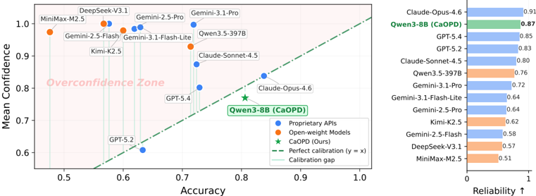

*Figure 1: The Scaling Law of Miscalibration. (Left) Mean Confidence vs. Accuracy on Science Q&A. Almost all modern LLMs are trapped in the red Overconfidence Zone , exhibiting massive calibration gaps. Scaling up capability does not resolve this blind optimism. (Right) CaOPD structurally eliminates*

**② 方法 / 架构图**

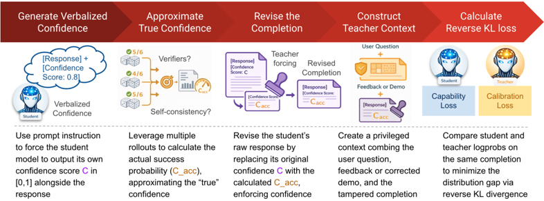

*Figure 5: Overview of the CaOPD Framework. The pipeline consists of five stages: (1) querying the student for a base response with verbalized confidence, (2) approximating the true empirical confidence via student rollouts and an objective verifier, (3) revising the completion by replacing the origi*

### 一眼看懂

> 一句话导读：OPD 在提准确率的同时,会把模型训得越来越"嘴硬"（过度自信）。CaOPD 发现根因是"teacher 开卷、student 闭卷",于是把"答什么"和"多自信"拆开:只把监督里的置信片段换成学生自己估的成功率,其余照旧——几乎零成本,能力和校准两头都不丢。

- 🟦 TL;DR：on-policy distillation（OPD,这里是自蒸馏形式）在提升准确率的同时,会系统性地把模型推进"过度自信"区。作者把这个现象叫 **Scaling Law of Miscalibration（误校准的标度律）**——连 GPT-5.x/Claude/Gemini/DeepSeek/Kimi/Qwen3.5-397B 这些前沿模型都落在过自信区（Fig.1）。根因是**训练-部署的信息不对称**:teacher"开卷"（拿到特权上下文 \(z\)）能产生近乎确定性的轨迹,student"闭卷"（只看得到 \(x\)）去匹配它,就被迫把 logits 锐化、还顺带继承了那种"笃定"的风格。CaOPD 的解法是把"答什么（能力）"和"多确信（置信）"在监督目标上**解耦**——只把轨迹里的置信片段替换成 student 自己 rollout 估出来的经验成功率 \(\hat\mu(x)\)，其余部分照常做 reverse-KL 蒸馏。这样几乎零额外改动,就能同时拿到能力和校准。
- 最巧的一步：**target replacement（目标替换）——只改置信段的监督目标,reverse-KL 机制完全不动（§4.2 Eq.7）**。把它抽掉,就退回标准 OPD（置信段被逼着去模仿 teacher 的 ≈1.0）。精髓在于:reasoning 段的前缀和 teacher 内容都没变,所以在 reasoning 位置上它与标准 OPD 等价（能力克隆原样保留）;只有置信位置的目标从"teacher 的笃定"换成了"student-grounded 的 \(\hat\mu(x)\)"。于是熵坍缩和乐观偏置被直接掐掉,而且全程不与 RL 优化器对抗（这就避开了所谓的能力税）。

### 为什么做

> 一句话导读：OPD/自蒸馏迁移能力很在行,但全都不管置信度,结果把模型训得越来越过度自信;现有的校准办法（RL reward shaping）又会付出"能力税",test-time 多采样则太贵。

- 研究背景：后训练越来越依赖 OPD（Agarwal 2024）和自蒸馏（SDPO-Hübotter 2026、SDFT-Shenfeld 2026、OPSD-Zhao 2026、Sang 2026、why_sd_degrade-Kim 2026）。它们的共同套路是:让 teacher 在**特权上下文**下（比如 verifier 反馈、专家示范、ground-truth 解）生成高质量轨迹,再让 student 仅凭 prompt 去模仿。这类方法在迁移能力上很成功,但几乎都是 capability-centric（以能力为中心）,**完全不管置信度**（§1）。
- 解决的具体痛点,有三条:
  - ① **误校准的 Scaling Law**——实测连前沿大模型都落在过自信区,说明**能力变强并不会自动修正盲目乐观**（Fig.1;引 Kalai 2025 的 "test-taking mode"——模型被激励去输出听起来合理的假话,而不是认怂）。
  - ② **OPD 本身就加剧过自信**——它在提准确率的同时,把平均置信推向饱和（Tool Use 上 SDPO 达到 0.996）,OCG（过自信缺口）不降反升（§5 Table 1）。
  - ③ **RL reward shaping 有"能力税"**——RLCR/CAR（Damani 2025 / Xuan 2026 把 Brier/proper scoring 塞进 PPO）虽然能压低置信,但为了躲避罚项会变得过度保守,准确率明显往下掉（Askell 2021 的 capability tax）。
- 相关工作 & 各自不足:
  - ① **OPD/自蒸馏（SDFT/SDPO/OPSD）**——能力强,但不管置信;
  - ② **置信校准主流靠 RL + reward shaping（RLCR/CAR）**——有能力税,而且与优化器对抗;
  - ③ **test-time 不确定性估计（SelfCheckGPT/SAC³,靠多次采样）**——可靠,但推理成本是 \(O(K)\)。
- 动机链：
  - 起点是现状:OPD 迁移能力很成功,但全场过自信。
  - 追到根因:信息不对称——teacher 开卷、熵低,student 闭卷,于是被逼着锐化 logits、还继承了"成功轨迹"自带的那股笃定。
  - 得出结论:"**能力可以靠模仿可靠地迁移,但'该多确信'这件事,不能跨信息状态安全迁移**"。
  - 落到做法:把能力和置信在监督目标上拆开,而置信目标应当锚到 student 自己的部署成功率 \(\mu(x)\)。
  - 为什么不用 RL reward shaping？因为有能力税、且与优化器对抗（§4 原文 "rather than fighting the optimizer"）。
  - 为什么不用 test-time 多采样？因为贵,是 \(O(K)\)——但这笔开销可以**摊销**到训练阶段:训练时把 \(\hat\mu\) 算好、蒸进参数,部署时只需单次前向。
- 与最近邻工作的 Δ：
  - vs RLCR/CAR（用 reward shaping 做校准）——CaOPD **不改 reward、不加优化阶段**,纯粹在蒸馏管线内做 target replacement,因此没有能力税。
  - vs 标准 OPD/SDPO——只多一步置信替换,reasoning 段完全等价。
  - vs why_sd_degrade（Kim 2026,诊断自蒸馏为何会退化推理）——两者切的是同一个信息不对称现象的不同侧面:CaOPD 改监督目标来修过自信,why_sd_degrade 只做退化诊断。
  - 关键点:把校准当成"换一个监督目标",而不是"加一个奖励罚项"。

### 怎么做 + 靠不靠谱

> 一句话导读：先用三条信息论命题论证"为什么能力蒸馏一定会带来过自信",再给出极简解法——只把监督目标里的置信片段换成学生自估的成功率 \(\hat\mu(x)\)，reasoning 段一字不动。所以能力照旧、过自信被掐掉。

> 设定（§2.1）：生成格式带 **verbalized confidence（把置信度直接写出来的格式）**——每条生成 \(y=(a,c)\) 分两段:\(a\) 是 reasoning 轨迹（含最终答案）,\(c\) 是置信段（如 "Confidence: 0.85"）,\(\mathrm{val}(c)\in[0,1]\) 是从中解析出的标量置信。自蒸馏架构里,同一个模型扮演两个角色:**student** \(\pi_\theta(\cdot\mid x)\)（只看得到 prompt,模拟部署时的状态）;**teacher** \(\pi_\theta(\cdot\mid x,z)\)（额外条件化在特权上下文 \(z\sim Z(x)\) 上,\(z\) 可以是示范、反馈或 ground-truth 解）。一个结构性质:teacher 见到的证据严格多于部署时的 student。

**【理论:为何能力蒸馏会加剧过自信（§3,三个命题,Appendix A 给全证）】**

- **理想的校准目标（§2.2）**：部署成功率定义为 \(\mu(x):=\mathbb E_{a\sim\pi_\theta(\cdot\mid x)}[R(x,a)]=\Pr_{\pi_\theta}(R=1\mid x)\)，其中 \(R\) 是二值验证函数。校准的要求是 \(\mathbb E[\mathrm{val}(c_\theta(x))]=\mu(x)\)。所以 **\(\mu(x)\) 才是置信对齐真正该用的 ground-truth 目标**。
- **标准 OPD 目标的盲点（§2.3）**：用的是 per-token reverse-KL（先采 \(y\sim\pi_\theta(\cdot\mid x)\)，再让 student/teacher 沿这条轨迹各自算分布）——
  \(\displaystyle \mathcal L_{\text{OPD}}(\theta)=\mathbb E_{x,z\sim Z(x)}\,\mathbb E_{y\sim\pi_\theta(\cdot\mid x)}\Big[\sum_{t=1}^T D_{KL}\big(\pi_\theta(\cdot\mid y_{<t},x)\,\|\,\pi_\theta(\cdot\mid y_{<t},x,z)\big)\Big].\)
  问题在于:\(y=(a,c)\) 里含置信 token,所以这个损失也会作用在置信位置上。而 teacher 拿了 \(z\)（比如正确答案）,在置信位会输出 ≈1.0。结果就是 **OPD 在迁移能力的同时,也逼着 student 去模仿 teacher 那种无端的笃定**。

- **命题1（信息差 → 不可辨识）**：当条件互信息 \(I(R;Z\mid X)>0\)（即特权上下文 \(Z\) 携带了 \(X\) 之外、对正确性有用的信息）时,teacher 的条件成功率 \(\mu_T(X,Z)\) 对 \(X\) 是不可测的;并且在平方误差意义下,**仅凭 \(X\) 能做的最优预测恰好就是 student 的部署成功率 \(\mu(X)\)**,残差严格为正:
  \(\displaystyle \min_g \mathbb E\big[(\mu_T(X,Z)-g(X))^2\big]=\mathbb E_X\big[\mathrm{Var}(\mu_T(X,Z)\mid X)\big]>0.\)
  含义:拿 teacher 的笃定当置信目标,在信息论层面本身就是错的。

- **命题2（特权条件 → 熵坍缩）**：当 \(I(A;Z\mid X)>0\) 时,teacher 轨迹的期望熵严格低于"仅给 \(X\)"时的条件熵:\(\mathbb E_{X,Z}[H(\pi_\theta(A\mid X,Z))]<\mathbb E_X[H(A\mid X)]\)。去最小化对它的 per-token reverse-KL,就会**逼 student 的 logits 人为锐化**——因为表达自然的不确定性 \(H(A\mid X)\) 会被惩罚。
- **命题3（选择偏置 → 乐观）**：特权上下文 \(Z\) 往往取自成功/高质量样本（记作 \(\mathcal D_{\text{helpful}}\)）,这使得 \(\mathbb E_{Z\sim\mathcal D_{\text{helpful}}}[\mu_T(X,Z)\mid X]\ge\mu(X)\)（在正测度集上严格成立）。于是蒸进 student 的隐式目标,会对真实部署成功率**系统性上偏**:\(\mathbb E_{X,Z\sim\mathcal D_{\text{helpful}}}[\mu_T(X,Z)-\mu(X)]>0\)。

**【CaOPD 方法流水线（§4 Algorithm 1）——读完可复现】** 对每个输入 \(x\)：

1. **student-grounded 置信估计（§4.1）**：采 \(K\) 条独立的 \((a_k,c_k)\sim\pi_\theta(\cdot\mid x)\)，用 verifier 打分,算经验成功率——
   \(\displaystyle \hat\mu(x)=\frac1K\sum_{k=1}^K R(x,a_k).\)
   **关键的省成本之处**:在 SDPO 下,可以**直接复用基础训练循环里已经生成的 rollout** 来算 \(\hat\mu(x)\)，只额外多一次轻量的 verifier 评估;蒸馏轨迹是另采的,不增加额外成本。开放域里若没有 verifier,\(\hat\mu\) 就退化成用 **Teacher-Anchored Self-Consistency** 来估（Appendix B.6）。

2. **target replacement（§4.2,只改 completion 和 teacher context,reverse-KL 机制不动）**：给定 student 生成轨迹 \(y=(a,c)\)——
   - (i) **改 completion**:把置信段 \(c\) 换成 \(\hat\mu(x)\)，得到 \(\tilde y=(a,\hat\mu(x))\)。
   - (ii) **改 teacher context**:在特权上下文 \(z\) 里,把原本 ≈1.0 的置信改写成 \(\hat\mu(x)\)，得到 \(\tilde z\)。
3. **蒸馏（§4.2 Eq.7）**：让 student/teacher 各自条件化（分别在 \(x\) 与 \((x,\tilde z)\) 上）给 \(\tilde y\) 打分;token 位置分成两段——reasoning 段 \(I_a=\{1,\dots,T_a\}\)、置信段 \(I_c=\{T_a+1,\dots,T\}\)：
   \(\displaystyle \mathcal L_{\text{CaOPD}}(\theta)=\mathbb E_{x,\tilde z}\,\mathbb E_{\tilde y}\Big[\underbrace{\sum_{t\in I_a}D_{KL}\big(\pi_\theta(\cdot\mid\tilde y_{<t},x)\,\|\,\pi_\theta(\cdot\mid\tilde y_{<t},x,\tilde z)\big)}_{\text{Capability Cloning(保留)}}+\underbrace{\sum_{t\in I_c}D_{KL}\big(\pi_\theta(\cdot\mid\tilde y_{<t},x)\,\|\,\pi_\theta(\cdot\mid\tilde y_{<t},x,\tilde z)\big)}_{\text{Confidence Calibration(student-grounded)}}\Big].\)

   - **reasoning 位置 \(t\in I_a\)**:此时前缀 \(\tilde y_{<t}\) 只含 reasoning token（置信替换还没出现）,而且 \(\tilde z\) 的 reasoning 内容也没改。所以这里的 per-token KL **与标准 OPD（Eq.2）实质相同**——能力克隆原样保留。
   - **置信位置 \(t\in I_c\)**:此时打分的 token 编码的是 \(\hat\mu(x)\) 而非原来的 \(c\)，teacher context 反映的也是 \(\hat\mu(x)\) 而非 1.0。于是 student 被训练去产出 student-grounded 的经验成功率,**直接消解了熵坍缩（命题2）和乐观偏置（命题3）**。
   - 优化器用 AdamW。整套流程**不改 reward、不加额外优化阶段**。
- **逐组件必要性**：
  - **置信段替换**——核心,没它就是标准 OPD（过自信）。
  - **特权上下文里也改置信（步 (ii)）**——保证 teacher 在置信位置不再给≈1.0 的目标（否则 reverse-KL 仍把 student 拉向笃定）。
  - **\(K\) 次 rollout 估 \(\hat\mu\)**——§K 消融:准确率对 \(K\in\{1,\dots,32\}\) **平坦**（能力与置信采样方差解耦）,\(K\ge8\) 是校准甜点,K 太小目标过度量化反困在过自信。
  - reasoning 段不动是**设计而非消融对象**（理论上等价 OPD）。
- **关键机制/公式（直觉）**：三条命题把"为什么必须这样做"锚定住了——\(\mu(X)\) 是唯一一个仅凭 \(X\) 可测的无偏置信目标（命题1）;teacher 的低熵会逼着 student 锐化（命题2）;对成功样本的筛选会带来系统性上偏（命题3）。target replacement 的优雅之处在于:reasoning 前缀和 teacher 内容都不变,所以能力克隆等价于 OPD;只换置信段的目标,校准就被结构性地纠偏了。而且它不与优化器对抗——不像 RL 的罚项,要在 reward 里反复拉扯。至于 test-time 那笔昂贵的置信估计,则被**摊销**进了单次前向的模型参数里。
- **实验与证据（§5）**：覆盖两个域——Science Q&A（Chemistry,来自 SciKnowEval/Feng 2024）和 Tool Use（ToolAlpaca）;主模型是 Qwen3-8B、Olmo-3-7B-Instruct;scaling 实验覆盖 Qwen3 全家 0.6B→32B（Appendix C.1）。指标除了 Accuracy、ECE/Brier,还有两个自引的:
  - **OCG**（mean confidence − accuracy）——量化过自信的方向,值越正、越过自信;
  - **SPR**（Strict Pairwise Ranking,即 \(P(c^+>c^-)\)）——对"置信饱和/打平"会**给零分重罚**,比 AUROC 更严格。
  - **OPD 加剧过自信（Table 1）**：Qwen3-8B Science Q&A base OCG +58.7%,SDFT/SDPO 推到 +48.1%/+12.9%;Tool Use SDPO 平均置信 0.996（OCG +32.0%）、SDFT +32.4%。
  - **CaOPD 结构纠偏不掉能力（Table 1/2）**：Qwen3-8B Tool Use OCG 从 SDFT +32.4%→**−0.7%**;主表（vs SDFT）Acc 67.6→70.6、ECE 0.321→0.228、BS 0.320→0.242、**SPR 0.085→0.555**（SDFT 几乎丧失区分度,CaOPD 恢复）;Science Q&A vs SDFT Acc 49.1→50.0、ECE 0.486→0.266、SPR 0.387→0.599。Olmo 同向（Science Q&A ECE 0.429→0.176）。
  - **避开能力税**：vs SDPO 在 Qwen3-8B Tool Use Acc 66.2%→70.9% 同时 ECE 0.298→0.133,而 RLCR/CAR 校准好但准确率明显更低。
  - **成本（Fig.2）**：每步耗时与 SDPO 几乎一致。**OOD**（Tool Use→Chemistry）SDFT ECE 0.599、CaOPD 0.358。**持续学习(CT)** 解决"校准遗忘"（CT ECE 0.126、SPR 0.662）。
  - baseline 较公平（SDFT/SDPO/GRPO + 专门校准的 RLCR/CAR 都比）。
- **假设与失效边界**：【原文】(§Limitations) 依赖**可验证 verifier** 估 \(\hat\mu\)（开放域退 self-consistency,质量待考）;依赖**可解析的 verbalized confidence 格式**（测试偶发格式失败）;SFT 下不一定能像 SDPO 那样零成本复用 \(K\) 次 rollout;**能力上界受 base 约束,CaOPD 不提升推理能力只校准置信**;仅 utterance-level 置信,step-level 校准是 future work。【推断】校准收益几乎全来自置信段,准确率提升主要来自底层 OPD/SDPO 而非 CaOPD 机制本身。
- **祛魅总结**：
  - 【推断】真贡献是两块:一个**干净的诊断**（用三条信息论命题把"OPD → 过自信"讲清楚）+ 一个**极小工程改动的解法**（只换置信段的监督目标,reverse-KL 不动,既不改 reward 也不加额外阶段）。target replacement 这一招优雅且可复现。
  - 要祛魅的边界有三:
    - ① 方法**只对"显式 verbalized confidence"这种格式生效**,并不是给模型注入了某种内在的校准能力;
    - ② 对推理能力本身**零直接增益**（命题和实证都只动置信段）——标题 "decoupling capability and calibration" 准确,但容易被误读成"两头都提",其实能力提升完全靠底层 OPD;
    - ③ 命题1说"\(\mu(X)\) 是最优目标"是理论层面的论断,实证只能侧面印证（换上 \(\hat\mu\) 后 ECE/BS 确实下降）。

### 结构化抽取

- 🎯 机制速览6轴：**学什么信号**=reasoning 段 teacher 的 per-token reverse-KL（能力克隆）+ 置信段的 student-grounded 经验成功率 \(\hat\mu(x)\)（校准）｜**改什么**=参数（logits 分布,尤其置信 token 位置）+ **监督目标的置信片段**（target replacement,改 completion + teacher context）｜**何时改**=在线 per-prompt（先 \(K\) 次 rollout 估 \(\hat\mu\) → 替换 → 蒸馏）,训练时摊销 test-time 估计｜**免梯度?**=否（reverse-KL 蒸馏梯度下降）｜**记忆-技能生命周期**=不适用（无外部记忆/技能库）｜**防遗忘机制**=持续学习(CT)下解决"**校准遗忘**"（CT ECE 0.126、SPR 0.662）,但非参数级防遗忘机制,是 target 解耦带来的副产物
- ⑦ 开源代码+框架/harness：https://github.com/SalesforceAIResearch/CaOPD （旧 analysis 记已 clone 约 40M,含 `main.py`/`distil_trainer.py`/`distil_config.py`/`eval_science.py`/`eval_tooluse.py` + Tool Use 与 Chemistry 两域数据 + Salesforce 合规文件）。框架=**TRL 0.24 + vLLM 0.12 + DeepSpeed 0.18 + transformers 4.57**（自建 distil trainer,在 SDFT/SDPO 自蒸馏管线上做 target replacement）。【待核】依赖版本与目录细节复用旧 analysis 核查,本次基于 PDF 重写未重新进仓核对。代码可得性:训练+评测+数据齐全。
- 💰 资源/成本与可扩展性：【原文】每 prompt 需 \(K\) 次 rollout（K=8 够用,准确率对 K 平坦）;**SDPO 下复用已有 rollout,几乎零额外成本**（只多轻量 verifier 评估）,每步耗时与 SDPO 几乎一致（Fig.2）;SFT 下不一定零成本复用。scaling 0.6B→32B 均有效。
- 🎯 对"探索-巩固"对标：**支撑 + 警示（边界提供者）**。判定:CaOPD 揭示的"**信息不对称 → teacher 的笃定不能安全迁移给 student**"对 TSRD 是一个关键警示——teacher 当脚手架（开卷）产生的轨迹和置信,不能让 student（闭卷）盲目模仿,否则会继承不属于自己的确定性。这正对应"巩固"环节该固化的是 student **自己走得通**的东西（\(\hat\mu(x)\) 就是用 student 自采 rollout 估的）,而不是 teacher 的特权产物。
  - **可借组件**:① "student-grounded 目标"这个思想——TSRD 在巩固时,也应当用 student 自采的成功率 / 自选的恢复分支当目标,而不是直接抄 teacher;② target replacement 这种"只改某一段监督目标、底层机制不动"的低侵入手法,可以移植到 path-recovery（只替换接管点的目标,reverse-KL 保持不变）。
  - **缺口/竞品面**:它只解决置信校准、不碰推理能力;只到 utterance-level、没有 step-level;没有 MTP/前瞻;与"探索/选路"的关系也弱（它的主战场是巩固阶段的"该多确信"）。
- 🔭 开放问题/未来方向：【原文】long/agentic 多步推理的 **step-level 校准**是 future work;开放域无 verifier 时的 \(\hat\mu\) 近似质量（self-consistency）;verbalized confidence 格式鲁棒性。【推断】把"student-grounded target replacement"推广到置信之外的其他可解耦属性（如安全/风格）;与 step/turn 级信用分配结合做细粒度校准;与 MTP 前瞻结合预测"该多确信"。

---

## Crosslingual On-Policy Self-Distillation for Multilingual Reasoning (COPSD)

> **`copsd`** ｜ LMU Munich (CIS) + MCML（Yihong Liu*、Raoyuan Zhao*、Michael A. Hedderich、Hinrich Schütze） ｜ 2026-05-10 · arXiv preprint v1 · cs.CL ｜ 主题线 L1（OPD/自蒸馏）·相关性 高（与本项目 OPD 主轴直接同源） ｜ [📄 原始论文](https://arxiv.org/abs/2605.09548)

### 关键图示

**① Motivation / 对比图**

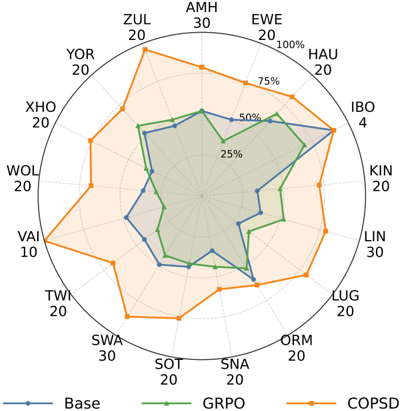

*Figure 1: Radar comparison of Qwen3-1.7B performance on AfriMGSM under a 4096-token generation budget. Each axis corresponds to one of the 17 lowresource African languages, with axis-specific scaling based on the maximum observed performance for that language. COPSD consistently outperforms both the*

**② 方法 / 架构图**

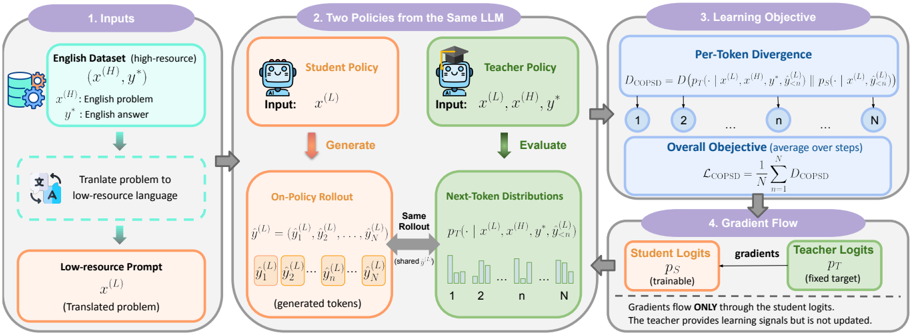

*Figure 2: Overview of COPSD. Each problem is translated into a low-resource language as the student's input. The same LLM acts as both student and teacher: the student generates an on-policy rollout, while the teacher evaluates it with privileged English context and the reference solution. By minimi*

### 一眼看懂

> 一句话导读：低资源语言（如非洲语）的数学推理差，不是模型不会，而是"会但用这门语言调不出来"。COPSD 让同一个模型分饰两角：学生只看低资源语的题、必须用低资源语推理；老师额外偷看英文题 + 英文答案，因而能给出更靠谱的分布；学生在自己走的路径上逐 token 对齐老师。

- 🟦 TL;DR：核心观察——低资源语言的数学推理差，往往不是模型没能力，而是"有 latent（潜在）能力但在低资源语下调不出来"。原文："a model may possess the latent ability to solve a problem, yet fail to access that ability when … expressed in a low-resource language"【原文 §1 L101-104】。
- COPSD 把 OPSD（同一个模型分饰 student/teacher 的特权上下文自蒸馏）搬到跨语言场景：
  - student 只看译成低资源语的题 \(x^{(L)}\)，必须用目标语推理（这样才匹配推理时的真实条件）；
  - teacher 是**同一个模型**，额外拿到英文题 \(x^{(H)}\) + 英文参考解 \(y^*\)，因而能诱导出更可靠的分布；
  - 在 student 自己的 on-policy rollout 上做逐 token 散度蒸馏，梯度只过 student【原文 §4.1-4.2, Fig.2】。
- 优点：无需外部 teacher、无需目标语 rationale，dense（逐 token）信号远强于稀疏的 outcome（最终对错）奖励。
- 最巧的一步：**teacher 的特权信息 = 英文题 + 英文参考解，而 student 只看低资源语题**。
  - 这个"跨语言信息不对称"是全部增益的来源——teacher 看到英文解能 rationalize（合理化推导）出强分布，student 在自己的目标语 rollout 上对齐它，等于把"英文可及的推理行为"迁移到低资源语【原文 §4 L385-395】。
  - 抽掉"英文参考解 \(y^*\)"，teacher 就退化成"只多看一份英文翻译"，特权信号大幅削弱。
  - 但这也是双刃剑——teacher 见到 \(y^*\) 等于把答案信息蒸进 student，使"特权"接近"漏答案"（见祛魅）。

### 为什么做

> 一句话导读：低资源语推理差是因为能力调不出来。机翻推理过程噪声大又 off-policy，纯靠最终对错做 RL 信号又太稀疏。需要一个既密集、又跟模型自己生成的轨迹对齐的信号——OPSD 正好提供。

- 研究背景：LLM 数学推理靠 step-by-step CoT（思维链，Wei 2022），但跨语言极不均衡，低资源语在预训练里曝光少、后训练的高质量推理监督也罕见【原文 §1 L39-104】。
- 解决的具体痛点，两条：
  - ①**机翻 reasoning trace 噪声大且 off-policy**——数学表达/数量/逻辑依赖容易翻错（原文："prone to inconsistencies or errors in mathematical expressions, quantities, and logical dependencies"），而且与模型自身的推理行为不匹配，造成 train-inference distribution mismatch（训练-推理分布失配）【原文 §1 L110-122】；
  - ②**outcome-only RL（GRPO）稀疏不稳**——低资源下模型很少产出正确答案，二元奖励"provides little information about how intermediate reasoning should be improved"，样本低效、还可能不稳【原文 §1 L123-137】。
  - 需要的是"既 dense 又 scalable、且与模型在低资源语实际产生的轨迹对齐"的信号。
- 相关工作 & 各自不足【原文 §2】：
  - **OPD**（Agarwal/GKD、Gu/MiniLLM、Lu & Thinking-Machines 2025）：结合 on-policy 监督 + dense token teacher 反馈，缓解失配、避开稀疏序列奖励，但**需要外部 teacher**；近期还发现"effective OPD requires compatible teacher-student thinking patterns"（Li 2026）——师生思路不匹配会阻碍迁移；
  - **OPSD**（Zhao 2026b / Zhang 2026a / Kim 2026 / Sang 2026）：用同一个模型分饰 student/teacher，免去外部 teacher——COPSD 直接 build on 这一支；
  - **多语言推理**现有解：translate-and-test pipeline、SFT（机翻 rationale）、self-training、RL——但"typically require translated reasoning rationales or sparse outcome rewards"（要么需要翻译好的推理过程、要么靠稀疏 outcome 奖励），而 COPSD 两者都不需要（只需英文上下文当特权信息）【原文 §2 L248-255】。
- 动机链：低资源推理差（latent 能力调不出）→ 机翻 rationale 噪声 + off-policy、outcome RL 太稀疏 → 需要 dense + on-policy + 对齐目标语轨迹的信号 → OPSD 正好提供（同模型、dense、on-policy）→ 把它的特权信息从"参考解"扩成"英文题 + 英文解"、输入换成低资源语 → COPSD。为什么不用更简单做法：SFT 机翻 rationale 引入噪声 + 失配，GRPO 信号太稀疏，二者在低资源数学上都被实证打败（GRPO 几乎不动，1.7B 9.11→9.18）。
- 与最近邻工作的Δ：相对 OPSD（siyan-zhao/OPSD），**核心公式完全不变**，只把 teacher 的特权信息从"reference solution \(y^*\)"扩成"英文问题 \(x^{(H)}\) + 英文解 \(y^*\)"，student 输入从原语言换成低资源语 \(x^{(L)}\)【原文 §4.1 L407-416】；额外加了 prompt-hacking 强制 student/teacher 都用目标语推理（在 `<think>` 后插语言特定前缀，否则模型会切回英文）【原文 §5.2 L668-680】。有用点：把"特权信息"具体化为"高资源语上下文"，**首次系统验证 17 非洲语 + PolyMath 8 语**。

### 怎么做 + 靠不靠谱

> 一句话导读：取英文题 + 英文解，机翻出低资源语的题；学生用低资源语生成轨迹，老师偷看英文答案在同一前缀上给分布，逐 token 对齐。验证很系统（17 语），但有两点诚实张力：论文说"全词表"实际代码是 top-20、老师看到答案使"特权"接近"漏答案"。

- 方法流水线（读完可复现）【原文 §3-4, Fig.2】，五步：
  1. **取英文题 \(x^{(H)}\) + 英文参考解 \(y^*\)**（数据集 OpenThoughts，采 0.5K 数学题），再**用 Gemini-3-Flash 把题机翻到目标低资源语 \(x^{(L)}\)**（只翻题，不翻 rationale）。
  2. **从同一模型 \(p_\theta\) 实例化两个策略**（只是 conditioning 不同）：student \(p_S(\cdot\mid x^{(L)})\triangleq p_\theta(\cdot\mid x^{(L)})\)（只看低资源题，匹配推理时条件）；teacher \(p_T(\cdot\mid x^{(L)},x^{(H)},y^*)\triangleq p_\theta(\cdot\mid x^{(L)},x^{(H)},y^*)\)（额外吃英文特权上下文）。
  3. **student 在线生成目标语 rollout** \(\hat y^{(L)}=(\hat y^{(L)}_1,\dots)\sim p_S(\cdot\mid x^{(L)})\)，用 prompt-hacking（`<think>` 后插目标语前缀）强制目标语推理。
  4. **两策略评估同一 student 前缀**：在每步 \(n\)，\(p^n_S\triangleq p_S(\cdot\mid x^{(L)},\hat y^{(L)}_{<n})\)、\(p^n_T\triangleq p_T(\cdot\mid x^{(L)},x^{(H)},y^*,\hat y^{(L)}_{<n})\)。
  5. **逐 token 散度蒸馏**，梯度**只过 student**（teacher 冻结，作固定目标）。
- 关键公式（真实形式 + 直觉）：
  - **OPSD 两策略**（§3.1）：\(p_S(\cdot\mid x)\triangleq p_\theta(\cdot\mid x)\)，\(p_T(\cdot\mid x,y^*)\triangleq p_\theta(\cdot\mid x,y^*)\)——共享参数 \(\theta\)，teacher 多 condition 在特权信息 \(y^*\) 上。
  - **轨迹平均的逐 token 散度**（§3.3 / §4.2）：
    \(\displaystyle D_{\text{COPSD}}(\hat y^{(L)}\mid x^{(L)})=\frac{1}{|\hat y^{(L)}|}\sum_{n=1}^{|\hat y^{(L)}|}D\bigl(p^n_T\,\Vert\,p^n_S\bigr)\)

  - **总目标**（梯度只过 student）：
    \(\displaystyle \mathcal{L}_{\text{COPSD}}(\theta)=\mathbb{E}_{(x^{(L)},x^{(H)},y^*)\sim D}\;\mathbb{E}_{\hat y^{(L)}\sim p_S(\cdot\mid x^{(L)})}\Bigl[D_{\text{COPSD}}(\hat y^{(L)}\mid x^{(L)})\Bigr]\)
    直觉：teacher 看着答案"边讲边纠"，student 在自己走的目标语路径上每步对齐这个更靠谱的分布。

  - **散度的真实实现**（代码核查，generalized JSD，docstring 引 GKD 论文 2306.13649）：用插值系数 \(\beta\)，发布脚本全部取 \(\beta=0\)：
    \(\displaystyle D=\sum_t \texttt{F.kl\_div}(\log p^t_S,\;\log p^t_T,\;\text{log\_target=True})=\sum_t\sum_v p^t_T(v)\bigl(\log p^t_T(v)-\log p^t_S(v)\bigr)\)
    即 \(D_{KL}(p_T\Vert p_S)\)（以 teacher 为 target 的 KL）。

    - 【待核】论文正文称此为 **"reverse KL"**（§5.3 L698），但按 PyTorch `F.kl_div(input,target)` 约定，\(\beta=0\) 分支以 teacher 为 target、是 GKD 习惯下的"前向/teacher-anchored KL"。命名取决于"以谁为参照"的视角，复现以代码 \(\beta=0\) 分支为准（本次直接核 `multilingual_opsd_trainer.py` L467-468 确认）。
- 逐组件必要性：
  - **特权英文上下文（\(x^{(H)}+y^*\)）**：核心，是 teacher 强分布的来源；没它就退回普通自蒸馏、无跨语言迁移。无单独"\(x^{(H)}\) vs \(y^*\)"的消融，但概念上 \(y^*\) 是关键。
  - **on-policy（在 student 自己的 rollout 上蒸）**：对齐推理时条件、减少失配——这是 OPD 优于机翻-SFT 的根本【原文 §3.4】。
  - **prompt-hacking 强制目标语**：负责防"模型切回英文推理"——若不强制，student 不会真正用低资源语推理，迁移就落空【原文 §5.2 L668-680】。
  - **top_k + jsd_token_clip（代码层，论文未强调）**：【代码核查】发布脚本（1.7B/4B/8B 及 3000 变体全部）实为 **`--top_k 20`**（只在 teacher top-20 token 上算散度并重归一化，docstring：reduces memory and focuses distillation on teacher's most probable tokens）+ **`--jsd_token_clip 0.05`**（逐 token 散度截断，docstring：prevents style tokens from dominating the gradient over math tokens）+ **`--fixed_teacher`**——与论文 §5.3"full-vocabulary logit distillation"的表述**有出入**，复现以脚本为准（本次直接核 repo 确认 top_k=20、jsd_token_clip=0.05、beta=0）。
- 实验与证据【原文 §5-6】：
  - **数据集/设置**：训练 OpenThoughts 采 0.5K 数学题，题面用 Gemini-3-Flash 译成 17 非洲语；英文题 + 英文解作 teacher 特权；评测 **AfriMGSM**（17 语 × 250 题，**Pass@12**，主表 4096-token 预算）；**PolyMath**（更难，8 语 × 125 题，8192-token，含 low/medium/high 难度）；模型 **Qwen3-1.7B/4B/8B**；指标 Pass@12（采 12 条，Math-Verify 抽 `\boxed{}` 比对）。GRPO baseline 训练用 16K-token 预算。
  - **AfriMGSM 主表（Table 1）**：1.7B 平均 **9.11(base)/9.18(GRPO)→15.53(COPSD)**；4B **19.20/19.36→20.61**；8B **19.41/19.22→23.55**。**GRPO 几乎无提升**（1.7B 9.11→9.18，多语言上偶尔还低于 base，如 4B SWA 47.60→46.00、8B LUG 15.20→8.40）——印证低资源 outcome RL 信号太稀疏。1.7B 相对提升 **>70%**。
  - **训练动态（Fig.3, 1024-token 预算）**：COPSD 早期快速提升 Pass@12 与 format rate；1.7B 最终 plateau；**4B/8B 几步达峰后缓降**（原文："useful signal may be limited … continued updates may begin to overfit to imperfect teacher signals"，因为目标语生成弱、teacher 信号有限）；GRPO 无上升趋势【§6.1 L860-880】。
  - **format adherence（Table 2）**：format rate 与 Pass@12 **强正相关**（per-language Pearson 0.628/0.838/0.728 for 1.7B/4B/8B；pooled 更低但仍正）——大模型达峰后 format rate 下降也解释了 Pass@12 的回落【§6.1 L973-996】。
  - **test-time scaling（Table 3, Fig.4）**：大模型更稳定地受益于更长生成预算（8B COPSD 1024→4096 **+30.0%** vs GRPO +13.8%；Zulu 8B 4096-token 达 ~28% vs base/GRPO ~16%）；1.7B 增益较小、GRPO 在 2048 预算上 scaling 不稳【§6.2】。
  - **repeat rate（Fig.5）**：COPSD 显著降低 4-gram 重复率（缓解低资源推理常见的"repetitive loops/circular repetition"失败模式）【§6.3】。
  - **PolyMath 泛化（Fig.6）**：**低资源语增益最大**（medium 难度 Swahili +32.0、Telugu +32.8、Bengali +15.2；high 难度 SWA +18.4/TEL +16.8），高资源语（日/中/俄/西）增益小甚至为负（medium THA −2.4）——直接支撑"latent 能力难经低资源语表达"的假设（原文："most effective when the model already possesses latent reasoning ability but struggles to express it through lower-resource language contexts"）【§6.4 L1289-1292】。
  - **baseline 公平吗**：base / GRPO / COPSD 同模型同数据对照，公平。但**只跟 base + GRPO 比，没和"SFT 机翻 rationale"等同类多语言方法直接对照**——这是缺口。
  - **看着强但没回答核心问题**：4B 绝对增益很小（19.20→20.61，仅 +1.41），且"teacher 见参考解"使增益部分来自"答案泄漏"而非纯粹的推理迁移（见祛魅）。
- 假设与失效边界：
  - 【原文 Limitations】依赖**英文参考解**——若高质量英文监督不可得、或另一门高资源语更合适时，受限。
  - 【原文 Limitations】训练题靠机翻——题面翻译的 artifact（瑕疵）仍可能影响训练质量（虽然不需翻译 rationale）。
  - 【原文 Limitations】同模型当 teacher——目标语能力弱时 teacher 分布仍不完美，学习信号"may saturate quickly or degrade with continued training"（4B/8B 已观察到达峰后降）。
  - 【代码核查·待核】论文"full-vocab / reverse KL"的表述与发布脚本（top_k=20 + jsd_token_clip=0.05 + beta=0 的 teacher-anchored KL）有出入——见上"关键公式"。
- 祛魅总结【推断】：真贡献是把 OPSD 清晰地迁移到跨语言 + 17 语系统验证，把"特权信息 = 高资源语上下文"这一设定落地。增量有限——OPSD 公式不变，新意在输入条件与系统性。两点诚实张力：(1)**论文"full-vocab"与发布脚本（top_k=20 + clip）不符**，"全分布"程度被高估了；(2)**teacher 见 \(y^*\) 使"特权"接近"漏答案"**——绝对增益（尤其 4B 仅 +1.41）应在此背景下保守解读，这不是"无答案的纯推理迁移"。4B/8B 几步达峰后下降也暴露 teacher 信号在弱目标语上很快饱和。被低估的可能是"format adherence / repeat rate 改善"这类副产品对低资源生成质量的实际价值。

### 结构化抽取

- 🎯 机制速览6轴：
  - **学什么信号**：teacher（同模型 + 英文特权上下文）在 student 自己 rollout 上的 dense token 级分布（\(\beta=0\) 的 teacher-anchored KL，实现上 top-20 + clip）。
  - **改什么**：参数（student 的 LoRA adapter；teacher 用 `--fixed_teacher`/`disable_adapter()` 即 base 模型，梯度只过带 adapter 的 student，同一份基座权重）。
  - **何时改**：在线 per-step（on-policy，在 student 当前 rollout 上蒸）；训练若干步即达峰（4B/8B 几步）。
  - **免梯度?**：否（梯度蒸馏）；teacher 冻结、作固定目标。
  - **记忆-技能生命周期**：无外部记忆/技能库；"知识"是 teacher 的英文推理分布，即时蒸进 student 参数。
  - **防遗忘机制**：无显式防遗忘；LoRA 本身限制了改动范围；但论文观察到"过训练→退化"（达峰后降），这反而是缺乏防过拟合机制的体现。
- ⑦ 开源代码+框架/harness：https://github.com/cisnlp/COPSD （README 明确 fork 自 siyan-zhao/OPSD，已 clone；本次核查目录有 `multilingual_opsd_trainer.py`/`multilingual_opsd_train.py`/`multilingual_data_collator.py`/`multilingual_grpo_train.py`/`language_config.py` + `african_langs_scripts/`（17 非洲语 run_all_opsd_{1.7b,4b,8b}_train.sh）+ `polymath_eval/` + `multilingual_scripts/run_all_opsd_4b_3000.sh`）。框架 **HuggingFace TRL（OPSDTrainer 继承 SFTTrainer，generalized_jsd_loss 即 GKDTrainer 血统）+ Accelerate/DeepSpeed（ZeRO-3）+ vLLM rollout**，LoRA。**4B 脚本核实超参**：base=Qwen/Qwen3-4B，lr **5e-6**，max_grad_norm **0.1**，lora_r=**64**/α=**128**，per_device_batch=**4**，num_train_epochs=30 / max_steps=**100**，top_k=**20**，beta=**0**，jsd_token_clip=**0.05**，`--fixed_teacher`，student max gen len 2048。**代码额外能力（论文未强调）**：trainer 还实现了 EMA teacher（`use_ema_teacher`，与 fixed_teacher 互斥）、`reason_first`（teacher 先对英文解推理再评估 student）、thinking-machines RL 式 reverse-KL（仅采样 token 上 policy-gradient，advantage=(teacher_logp−student_logp).detach()）；主实验用 generalized-JSD 路径（beta=0）+ fixed_teacher【既有 analysis 代码核查 + 本次 repo 复核 L408-483】。
- 💰 资源/成本与可扩展性：LoRA 训练（r=64/α=128），per_device_batch=4，A100 或 H200【4B 脚本核实】；训练数据仅 0.5K 题、每语单独训。可扩展性：三规模（1.7/4/8B）都验证，大模型更受益于长生成预算；但 teacher 信号在弱目标语上快速饱和，限制了"多训更好"。
- 🎯 对"探索-巩固"对标：**支撑（OPD 主轴的直接同源工作）**。
  - COPSD = 标准 OPSD 的跨语言变体，与本项目"teacher 当稀疏脚手架、on-policy 自选轨迹、dense token 监督"高度同源：它正是"teacher 提供更可靠分布 + student 在自己 rollout 上对齐"的范式。
  - **关键 Δ vs 本项目**，三点：
    1. teacher 特权 = 静态英文上下文（看完整答案），不是本项目设想的"稀疏脚手架/前瞻探针"——它更像"全程看答案的家教"，而非"只在关键点给提示"；
    2. 无 path-recovery 的"走偏后单点接管/自选恢复分支"机制，是全程逐 token 对齐；
    3. 无 MTP 前瞻、无技能/记忆。
  - **可借组件**，三点：
    1. OPSD/COPSD 的代码与 trainer（TRL SFTTrainer + 双前缀 collator + fixed_teacher via disable_adapter）是现成的"同模型双角色"实现模板；
    2. `top_k=20` + `jsd_token_clip=0.05` 抑制 style token 主导梯度，对本项目"只在关键 token 上蒸"有直接借鉴（与高熵/低置信切关键步的思路相关）；
    3. 它暴露的"teacher 信号饱和 → 过训练退化"是本项目设计"何时停/何时撤脚手架"的反面教材。
  - **缺口**：特权信息太强（漏答案）、无选择性/前瞻——本项目要的是更"稀疏、点状、前瞻"的脚手架。
  - 一句判定：同范式同源、直接可借代码与 token 级蒸馏技巧，但其"全程看答案"的特权设定与本项目"稀疏脚手架"哲学相反，是有用的对照与零件来源。
- 🔭 开放问题/未来方向：
  - 【原文 Limitations/未来】摆脱对英文参考解的依赖（高资源语监督不可得时）；减小机翻 artifact 的影响；缓解同模型 teacher 在弱目标语上的信号饱和/过训练退化。
  - 【推断】把"全程看答案"的特权弱化为"稀疏/点状提示"（更贴近脚手架直觉），看是否仍能迁移——这正是本项目方向；选择性蒸馏（只在 student 走偏/高熵步对齐 teacher），避免无差别逐 token 对齐带来的饱和；teacher 新鲜度调度（EMA vs fixed，代码已有 `use_ema_teacher` 但未系统比）。

---

## Distillation of Large Language Models via Concrete Score Matching (CSD)

> **`csd`** ｜ KAIST + summary.ai（Yeongmin Kim、Donghyeok Shin、Mina Kang、Byeonghu Na、Il-Chul Moon） ｜ v3 2026-05-30 · ICLR 2026 · cs.LG ｜ 主题线 L1（蒸馏 loss 设计/离线 logit-KD）·相关性 中 ｜ [📄 原始论文](https://arxiv.org/abs/2509.25837)

### 关键图示

**① Motivation / 对比图**

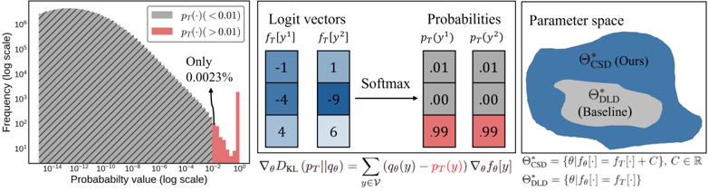

*Figure 1: Logit vectors, probabilities, and parameter space illustrating how concrete-score distillation (CSD) differs from the divergence-based baseline.*

**② 方法 / 架构图**

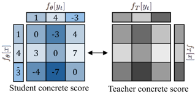

*Figure 2: Schematic for L CSD (Eq. (8)).*

### 一眼看懂

> 一句话导读：知识蒸馏主流是在 softmax 后的概率上对齐 teacher，但 softmax 会把 teacher logit 里的细粒度知识"压平"。CSD 改成在 logit 层匹配"所有词表对之间的相对差"，既绕开 softmax 平滑、又对 logit 整体加常数不变，还有线性时间的梯度。

- 🟦 TL;DR：知识蒸馏（KD，knowledge distillation：让小 student 模仿大 teacher）的主流做法是在每个 token 上做 **softmax 概率匹配**（KL 或 f-散度）。
  - 问题：softmax 会把 teacher 的大 logit 差异"压平"——\([-1,-4,4]\) 与 \([1,-9,6]\) 经 softmax 后概率几乎一致、梯度也几乎相同，于是 logit 里编码的细粒度知识被淹没（GPT-2-1.5B 上只有 **0.0023%** 的 token 概率 >0.01）【原文 §1 L45-48, Fig.1a/b】。
  - 另一条路是直接对齐 logit（DLD），但它不允许"logit 常数平移不变性（logit shift invariance，即所有 logit 同加一个常数、softmax 后等价）"，严重收窄了解集【原文 §1 L63-69, Fig.1c】。
- CSD 提出一个 logit 级的"离散 concrete score 匹配"目标：匹配 student/teacher 在**所有词表对**上的相对 logit 差。这样既绕过 softmax 平滑、又对 logit 常数平移不变（解集是 DLD 的**真超集**），还给出 \(O(|V|)\) 线性时间的梯度【原文 Abstract, §3】。
- 最巧的一步：**对 concrete score 取 log（式7→8）**。
  - 朴素 concrete score 是概率比 \(q_\theta(x)/q_\theta(y_t)\)，分母趋零会发散、训练不稳（这是自回归 LLM 特有的问题——逐 token 算概率再取比，不像离散扩散模型那样一次输出全部比值）【原文 §3.1 L231-237】。
  - 取 log 后两个好处：(a) 目标变成 logit 之间的 MSE \((f_\theta[x]-f_\theta[y_t]-f_T[x]+f_T[y_t])^2\)，避开比值计算、保稳定；(b) 天然落到 logit 级、契合动机【原文 §3.1 L265-267】。
  - 抽掉这步：要么训练发散，要么退回概率比匹配、丢掉"logit 级"这个卖点。

### 为什么做

> 一句话导读：大词表 LLM 的 logit 里藏着丰富知识，但 softmax 把它抹平、DLD 又把解集收窄。CSD 借能量模型的 score matching（绕开归一化约束）+ 它的离散版 concrete score，适配自回归 LLM，做出兼顾两者、还带最优性保证的目标。

- 研究背景：KD（Hinton 2015）让小 student 继承大 teacher 以降低推理成本；主流在每个 token 上做 softmax 概率匹配，从 KL 出发到各类 f-散度（Wen/TV、Gu/RKL、Agarwal/GJS）和平滑变体（Ko/SKL-SRKL、Shing/TAID）【原文 §1 L37-42, §2.1】。
- 解决的具体痛点，两条：
  - ①**softmax 平滑抹掉 logit 级知识**——大 logit 差却得到近乎相同的概率/梯度（Fig.1b 反例），大词表下分布极稀疏（Fig.1a），teacher 对多数次要 token 给出几乎相同的梯度信号【§1 L43-48, §2.1 L144-147】；
  - ②**DLD 解集受限**——DLD 直接对齐 logit、绕过 softmax，但它的最优解**不允许 logit 常数平移不变**（而 softmax 推理下，logit 整体加常数 \(C\) 是等价的），解集被严重收窄，teacher/student 容量差大时尤其严重【§1 L63-69, §2.1 L155-160】。
- 相关工作 & 各自不足：
  - **概率匹配族**（KL/RKL/Sym-KL/Jeffrey/TV/GJS/SKL/SRKL/AB）——都受 softmax 平滑约束【原文 Table 1】；
  - **DLD**（Ba & Caruana 2014；Kim 2021）——logit MSE \(\frac12\sum_{y_t}w(y_t)(f_\theta[y_t]-f_T[y_t])^2\)（式4），有更好的泛化/表征，但**解集受限**，且在 LLM 上"not been thoroughly explored"；
  - **能量模型 score matching**（Hyvärinen 2005；Song & Kingma 2021）——避开 sum-to-one 归一化约束的连续变量 Stein score；其离散版 concrete score（Meng 2022）此前主要用于**离散扩散模型**（Lou 2024 直接参数化 concrete score 拟合数据分布）。CSD 反过来，用它来设计**自回归 LLM 的蒸馏 loss**；
  - **on-policy KD**（ImitKD/GKD/DistiLLM）——改的是"用谁生成的数据"（student on-policy / 混合 / 自适应选择），与"散度目标本身"**正交**【原文 §2.1, §4.1 L602-608】。
- 动机链：大词表 LLM 的 logit 编码了丰富知识 → softmax 抹平 + DLD 解集受限，两条路都不理想 → 借能量模型的 score matching（绕开归一化约束）+ 它的离散版 concrete score → 适配自回归 LLM（解决稳定性 + 把 \(O(|V|^2)\) 降到 \(O(|V|)\)）→ 得到"兼顾两者 + 带最优性保证（解集应是 DLD 超集）"的目标【原文 §1 L70-82】。
- 与最近邻工作的Δ：
  - vs DLD——CSD 对齐的是"词表对之间的**相对** logit 差"，而非"同一 token 的**绝对** logit"，天然对常数平移不变 → \(\Theta^*_{\text{CSD}}\supsetneq\Theta^*_{\text{DLD}}\)（Thm 2）；
  - vs KL——梯度结构相似（都是"student 大处降、teacher 大处升"），**唯一区别是 logit 系数的归一化方式**：KL 用 softmax（问题源），CSD 用 **centering 归一化**（直接捕获 teacher logit 信息）【§3.2 L411-471】。
  - 有用点：更大的解集 + 不被 softmax 平滑，在容量差大时更能逼近 teacher。

### 怎么做 + 靠不靠谱

> 一句话导读：对每个位置，用 student/teacher 的 logit 算"当前 token 换成任一其它 token"的相对概率比，取 log 后变成 logit 级 MSE，在可分权重假设下梯度只要线性时间。理论很漂亮（三条定理），但实证偏中小规模、增益不大，且截至 v3 训练代码还没放出来。

- 方法流水线（读完可复现）【原文 §3, Algorithm 1】，四步：
  1. 对每个位置 \((c,y_{<t})\)，用 student logits 算"把当前 token \(y_t\) 换成词表里任一其它 token \(x\)"的相对概率比（concrete score），teacher 同理；
  2. 取 log 稳定训练，得到 logit 级 MSE 目标（式8）；
  3. 在可分权重假设 \(w(y_t,x)=w_1(y_t)\cdot w_2(x)\) 下，梯度可在 \(O(|V|)\) 算出（Thm 3, Algorithm 1）；
  4. 即插即用：把 CSD(S,S) + DLD(S) 叠加进 ImitKD/GKD/DistiLLM 的数据策略。
- 关键公式（真实形式 + 直觉）：
  - **概率与 KD 通用目标**（式1-2）：\(q_\theta(y_t\mid c,y_{<t})=\dfrac{\exp(f_\theta[y_t])}{\sum_{x\in V}\exp(f_\theta[x])}\)；KD = \(\mathbb{E}_{(c,y)}\bigl[\frac1L\sum_t D(p_T\Vert q_\theta)\bigr]\)。
  - **concrete score**（Meng 2022，离散版 Stein score）：
    \(\displaystyle s_\theta(y)\triangleq\left[\frac{q_\theta(x)}{q_\theta(y)}\right]_{x\in V}\)
    刻画"从当前 token \(y\) 换到其它 token \(x\)"的相对概率变化，能唯一确定分布、又无需算配分函数 \(Z_\theta\)【§2.2 L192-200】。

  - **朴素 concrete score matching**（式6，不稳）：\(L_{\text{CSM}}=\frac12\sum_y\sum_x w(y,x)\bigl(\frac{q_\theta(x)}{q_\theta(y)}-\frac{p_{\text{data}}(x)}{p_{\text{data}}(y)}\bigr)^2\)。
  - **CSD 目标**（式7→式8，核心；取 log 后变成 logit MSE）：
    \(\displaystyle L_{\text{CSD}}(\theta;p_T,w)=\frac12\sum_{y_t\in V}\sum_{x\in V}w(y_t,x)\Bigl(\log\tfrac{q_\theta(x\mid c,y_{<t})}{q_\theta(y_t\mid c,y_{<t})}-\log\tfrac{p_T(x\mid c,y_{<t})}{p_T(y_t\mid c,y_{<t})}\Bigr)^2 =\frac12\sum_{y_t\in V}\sum_{x\in V}w(y_t,x)\bigl(f_\theta[x]-f_\theta[y_t]-f_T[x]+f_T[y_t]\bigr)^2\)
    第二个等号是关键：log 概率比 = logit 差，所以目标 = 匹配"所有词表对 \((y_t,x)\) 的相对 logit 差"，对 \(f_\theta\) 整体加常数 \(C\) 不变【§3.1 L240-267】。

  - **高效梯度**（Thm 3，式9，可分权重 \(w(y_t,x)=w_1(y_t)w_2(x)\) 下 \(O(|V|)\)）：
    \(\displaystyle \nabla_\theta L_{\text{CSD}}(\theta;p_T,w)=\sum_{y_t\in V}\mathbf{w}(y_t)^{\!\top}\bigl(\tilde f_\theta[y_t]-\tilde f_T[y_t]\bigr)\nabla_\theta f_\theta[y_t]\)
    其中 \(\mathbf{w}(y_t)=(w_1(y_t),w_2(y_t))^{\!\top}\)，归一化（centering）logit \(\tilde f^w_\theta[y_t]=f_\theta[y_t]-\mathbb{E}_{w(x)}[f_\theta[x]]\)，teacher 同理。Algorithm 1 每步只需线性时间（算加权均值 logit → 减去做 centering → 组合）。不接受可分假设则退回 **Monte Carlo 估计**（Algorithm 2：按 \(w_1\) 采单个 \(y_t\)，能建模联合权重空间、不需独立性，但 batch 内方差更大、收敛略慢，Fig.5c）【§3.2 L370-410】。

  - **CSD vs KL 梯度对照**（取 uniform 权重 \(U\)，直觉关键）：
    \(\displaystyle \nabla_\theta D_{KL}(p_T\Vert q_\theta)=\sum_{y_t}\Bigl(\underbrace{\tfrac{\exp(f_\theta[y_t])}{\sum_x\exp(f_\theta[x])}}_{\text{softmax 归一 student}}-\underbrace{\tfrac{\exp(f_T[y_t])}{\sum_x\exp(f_T[x])}}_{\text{softmax 归一 teacher}}\Bigr)\nabla_\theta f_\theta[y_t]\)
    \(\displaystyle \nabla_\theta L_{\text{CSD}}(\theta;p_T,U)=\sum_{y_t}\frac{2}{|V|}\Bigl(\underbrace{f_\theta[y_t]-\tfrac{\sum_x f_\theta[x]}{|V|}}_{\text{centering 归一 student}}-\underbrace{\bigl(f_T[y_t]-\tfrac{\sum_x f_T[x]}{|V|}\bigr)}_{\text{centering 归一 teacher}}\Bigr)\nabla_\theta f_\theta[y_t]\)
    两者都"student 大处降、teacher 大处升"，**唯一差别是系数的归一化方式**：KL 用 softmax（抹平 logit 信息），CSD 用 centering（保留）。\((w_1,w_2)\) 提供了归一化的设计空间：\(w_1\) 控梯度更新时的词表加权、\(w_2\) 控系数归一化（两者角色再反序作用）【§3.2 L411-471】。

  - **三条定理**：
    - **Prop.1（一致性）**：\(|\Theta|\to\infty\)、任意 \(w>0\) 时，最优解处 \(L_{\text{CSD}}(\theta^*)=0\) 且 \(q_{\theta^*}=p_T\)——保证 student 收敛到 teacher【§3.1 L342-350】。
    - **Thm 2（解集真超集）**：\(\Theta^*_{\text{CSD}}\supsetneq\Theta^*_{\text{DLD}}\)——DLD 能得的解 CSD 都能得，且 CSD 对常数平移不变（\(f_\theta=f_T+C\) 时 CSD=0 但 DLD≠最优），容量差大时优势更明显【§3.1 L351-363】。
    - **Thm 3（O(|V|) 梯度）**：见上式9【§3.2 L370-378】。
- 逐组件必要性：
  - **log 变换**：保证稳定性 + logit 级，没它就发散（见"最巧一步"）。
  - **可分权重假设**：换来 \(O(|V|)\) 线性梯度；不接受则退回 MC（高方差、慢）——"高效"与"通用"二选一，论文有交代【§3.2 L402-410】。
  - **权重函数 \((w_1,w_2)\)**：Table 1/Fig.3a 消融——默认 **(S,S)**（detached student 概率）最高保真；换 (U,S) 或 (T,S) 逐渐增多样性（原文："(S,S) makes the model focus only on regions where the student already assigns high likelihood, limiting exploratory ability"）；CSD 的 trade-off 前沿**包络**了既有 loss【§4.1 L593-601】。
  - **mode-seeking / mode-covering 实例**：在同一框架内，通过权重选择就能实例化这两类行为【原文 Abstract, §1 L81-82】。
- 实验与证据【原文 §4】：
  - **数据集/设置**：task-agnostic 指令跟随用 **databricks-dolly-15k**（沿用 DistiLLM）；先在 dolly 微调 teacher 再蒸 student；评测 Dolly Eval/Self-Instruct/Vicuna Eval/Super-NI/UnNI，**ROUGE-L 跨 5 seed 平均** + Self-BLEU 测多样性；task-specific（摘要/翻译/GSM8K 数学）+ general chat；backbone GPT-2(0.1/0.3/1.5B)、OpenLLaMA-7B/3B、Gemma-7B-IT、Qwen2.5-7B-IT、**Gemma2-9B-IT（最大 teacher 9B）**。
  - **loss 对比（Table 1）**：GPT-2-1.5B→0.1B，CSD 平均 **20.65**，胜过其余 9 个目标（KL 16.68/RKL 18.88/Sym-KL 17.37/Jeffrey 17.42/TV 19.97/GJS 18.87/SKL 19.60/SRKL 20.00/AB 19.78），5 基准中 **3 个第一**、1 个第二。
  - **on-policy 正交增益（Table 2）**：CSD 叠加到 ImitKD/GKD/DistiLLM（区别仅在数据策略 D：On/Mix/Ada），GPT-2-0.1B/0.3B 全设置平均 ROUGE-L 都升，且**纯 on-policy（ImitKD）下增益最强**（0.3B：ImitKD+Ours 23.12 vs ImitKD 19.23 vs ImitKD+DLD 22.32；0.1B：ImitKD+Ours 20.73 vs ImitKD 16.69）；OpenLLaMA-7B→3B 上 ImitKD+Ours 29.03 也超各 baseline。GPT-4 judge（Fig.4）下 CSD 最佳模型被判优于其它（teacher 0.61）。
  - **baseline 公平吗**：Table 1 注明"全部用自己实现、同 teacher、纯用蒸馏目标"（排除预训练 loss/SFT 初始化/on-policy）；SKL/AB 略低于原报告，作者归因于它们依赖预训练 loss/on-policy——**公平性透明，但也意味着 Table 1 是"剥离增强后的纯 loss 对比"，不直接等于各方法的最佳表现**【§4.1 L488-493】。
  - **看着强但没回答核心问题**：增益绝对值不大（0.1B 上 CSD 20.65 vs SRKL 20.00，仅 +0.65 ROUGE-L）；评测以 ROUGE-L/Self-BLEU 这类代理指标为主，模型规模偏中小（最大 9B teacher），未在大规模推理任务上验证。
- 假设与失效边界：
  - 【原文 §2.1 L100-102】假设 teacher 与 student **共享词表/tokenizer**——跨族蒸馏不适用。
  - 【原文 §3.2】\(O(|V|)\) 仅在**可分权重**下成立；一般权重需 Monte Carlo（方差更大）。
  - 【推断】属**离线 logit-level KD**（目标本身正交于"用谁的数据"），不是在线/RL/推理路径蒸馏；在大词表 + 大容量差场景理论优势最明显，但论文最大只到 9B teacher，大规模未验证。
- 祛魅总结【推断】：真贡献是**理论清晰的 loss 设计**——从"softmax 抹平 logit 差 + DLD 解集受限"两个具体缺陷出发，用 score matching 思想给出兼顾两者的目标 + 三条定理（Prop.1 一致性 / Thm.2 解集真超集 / Thm.3 \(O(|V|)\) 梯度），且与 on-policy 框架正交、可叠加。被高估的是实证强度（代理指标 + 中小规模 + 增益较小）；Thm.3 的"高效"依赖可分权重假设，通用情形退回高方差 MC——"高效"与"通用"不可兼得。最大短板：**截至 v3，GitHub 仅 README 占位、训练代码未释出**（见⑦），复现性无法独立验证。这是一个"漂亮的目标 + 待补的代码"。

### 结构化抽取

- 🎯 机制速览6轴：
  - **学什么信号**：teacher 的 **logit 级**信息（所有词表对的相对 logit 差 \(f_T[x]-f_T[y_t]\)），不是 softmax 后的概率。
  - **改什么**：参数（student 权重），通过 logit 级 MSE 梯度更新——本质改 student 的 **logits**。
  - **何时改**：以离线（固定数据集蒸馏）为主；但与 on-policy 数据策略（ImitKD/GKD/DistiLLM）正交、可组合（可变成 student on-policy/混合/自适应数据）。
  - **免梯度?**：否（标准梯度下降蒸馏）。
  - **记忆-技能生命周期**：无外部记忆/技能库；teacher 是固定的分布目标（冻结）。
  - **防遗忘机制**：无（单 teacher→single student 蒸馏，不涉及持续学习/遗忘）。
- ⑦ 开源代码+框架/harness：https://github.com/aailab-kaist/CSD 。**【待核→已核实仍为占位】**：repo 已 clone（40 字节），README 仅一行 "# CSD / Official repo for CSD (ICLR 26)"，**无任何训练代码**（2026-06-04 本次复核 `csd/` 目录仅 `.git/` + `README.md`，`find` 只返回一个 README 文件）。框架：不是独立训练框架，而是一个**可替换 KL 的 logit-level 蒸馏目标**，设计为嵌入现有 KD 流程（ImitKD/GKD/DistiLLM）。**未完整可复现：代码未释出，需以论文公式（式8）+ Algorithm 1（含 centering 归一化 + 可分权重梯度）手动实现**，附代码链接供后续手动获取。
- 💰 资源/成本与可扩展性：训练时间/显存见原文 Table 9（§D，本次未展开）；核心成本主张是梯度 \(O(|V|)\) 线性（vs 朴素 \(O(|V|^2)\) 双重词表求和不可行），使大词表可行【原文 §3.2 Thm 3】。规模化证据：从 GPT-2(0.1B) 到 OpenLLaMA-7B→3B 都有增益，但最大 teacher 仅 9B。
- 🎯 对"探索-巩固"对标：**外围相关（loss 层面）**。
  - CSD 只触及"蒸馏散度目标本身"，与本项目"探索-巩固"的核心（teacher 当稀疏脚手架教 path-selection/path-recovery、on-policy 自选、MTP 前瞻）**几乎不重叠**——它是离线 logit 匹配，既无 on-policy 自选轨迹的机制（虽可叠加 ImitKD/GKD），也无脚手架/纠偏/记忆/前瞻。
  - **可借组件**：若本项目的"巩固"环节需要把某种 dense 信号蒸进参数，CSD 的"logit 级、常数平移不变、\(O(|V|)\) 高效"目标可作为**比 KL 更保真的蒸馏 loss 候选**（尤其 teacher/student 容量差大时）；其"centering 归一化 vs softmax 归一化"的梯度分析（两式只差归一化方式）也是理解 logit 蒸馏行为的有用视角。
  - **缺口**：无在线、无 RL、无前瞻、无记忆——离本项目主轴（MTP+OPD）较远。
  - 一句判定：技术零件可借（更好的蒸馏 loss），但不解决探索/巩固的任何核心机制，且代码缺位降低了即用性。
- 🔭 开放问题/未来方向：
  - 【原文 §4.1 L613-614】针对特定数据集 \(D\) 可能存在比 (S,S) 更优的 CSD 变体（权重 \(w_1/w_2\) 设计空间未穷尽），留待 future work；temperature 调节 trade-off 的更优操作点（Fig.3b）。
  - 【推断】跨 tokenizer/跨族蒸馏（当前假设共享词表）；一般（不可分）权重下避免 MC 高方差的高效估计；在大规模推理任务（数学/代码长链）上验证 logit 级保真是否真带来下游收益；**最紧迫的是补全开源训练代码**，以让社区独立复现 Thm.2/3 的实际收益。

---

## Distribution-Aligned Sequence Distillation for Superior Long-CoT Reasoning (DASD-4B-Thinking)

> **`dasd`** ｜ 阿里云(Shaotian Yan*, Kaiyuan Liu*, Chen Shen*†, Bing Wang*, Sinan Fan* 等) ｜ arXiv 2601.09088v1(2026-01-14)·技术报告 ｜ 主题线 L1(序列级蒸馏/含轻量 on-policy 阶段)·相关性 高 ｜ [📄 原始论文](https://arxiv.org/abs/2601.09088)

### 关键图示

**① Motivation / 对比图**

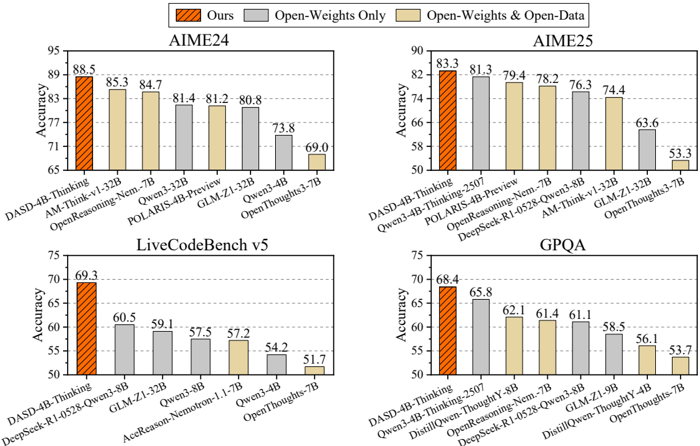

*Figure 1: Performance of DASD-4B-Thinking on benchmark datasets. All metrics for the comparison models are taken from their official reports.*

**② 方法 / 架构图**

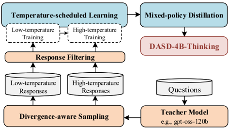

*Figure 2: Overall training pipeline of DASD-4B-Thinking.*

### 一眼看懂

> 一句话导读:大家都在"拿老师写的答案做 SFT"来蒸馏推理能力,但这只是把它当成"挑好数据"的活;本文换个视角——蒸馏的本质是让学生学到老师的整条输出分布,于是补回三件师生互动的工具,只用很少数据就把 4B 小模型推到同级别最强。

- 🟦 TL;DR:主流做法是"在 teacher 生成的响应上做 SFT"(即序列级蒸馏)。但这种做法只把蒸馏当成一个数据过滤问题,忽视了蒸馏的本质——让 student 学到 teacher 的完整序列分布。DASD 改从"分布对齐"视角出发,补回三件师生交互工具:
  - **温度调度学习**:先用低温样本学一致的模式,再用高温样本扩大覆盖面;
  - **散度感知采样**:优先喂那些"teacher 很有把握、但 student 概率很低"的句子;
  - **混合策略蒸馏**:让 student 先自己生成一段前缀,再由 teacher 续写,以缓解 exposure bias(训练时喂的都是标准答案、推理时却要靠自己一路生成,二者不一致带来的偏差)。
  - 效果:只用 448K 样本,就让 Qwen3-4B 在 AIME24/25、LCB、GPQA 上达到同量级 SOTA,部分基准甚至超过 32B 模型【原文 Abstract, §1, Table 6】。
- 最巧的一步:**散度感知采样(Divergence-aware Sampling, DAS)**。它把"哪些 teacher 句子最该学"从拍脑袋的启发式规则,升级为"按师生概率差来筛选"——teacher 概率高、student 概率低,就是高散度、最值得学的句子。这样做有两个好处:一是直接对齐 student 当前的学习能力;二是规避 SFT 的误导梯度(对那些 teacher 概率低、但 student 已经概率很高的 token,SFT 还在继续抬高它,这个反向梯度是有害的)【原文 §4】。
  - 抽掉 DAS,整套方法就退回"随机采样+质量过滤"的旧范式,"分布对齐比堆数据更重要"这个核心论点也就垮了。证据:Table 3 显示 DAS(50K 数据)在 AIME25 上拿到 79.2,甚至超过把数据翻倍的随机采样(100K RS,78.9)【原文 §4 Table 3】。

### 为什么做

> 一句话导读:DeepSeek-R1 证明"小模型抄强老师的答案"就能大幅涨推理,于是全社区都在这么干;但大家只把它当"挑好数据",没人认真对待蒸馏的本质,结果留下三个老毛病——本文就是来补这三个洞的。

- 研究背景:DeepSeek-R1 首次证明,从强 teacher 蒸馏可以大幅赋能小模型推理,因此引发社区大量复刻。主流范式就是"SFT on teacher responses",也叫序列级蒸馏(Kim&Rush 2016):它简单高效、不限师生架构、也不需要 token 级 logits【原文 §1, §2】。
- 解决的具体痛点:现有工作只停留在 SFT 视角,专注于设计各种启发式数据过滤规则,**却忽视了蒸馏的本质(继承 teacher 的泛化能力)**。根因是全程缺乏显式的师生交互,由此带来三大缺陷:
  - (i)**teacher 序列分布表征不足**:随机采样覆盖太窄,或反过来过度表征了低概率的噪声序列;
  - (ii)**teacher 分布与 student 学习能力错配**:SFT 只会抬高 ground-truth token 的概率,带来误导梯度;
  - (iii)**exposure bias**:训练时一路喂标准答案(teacher-forced),推理时却要自回归地靠自己生成,两种状态不一致【原文 §1, §2】。
- 相关工作 & 各自不足(三条并行路线,各自的精确差异):
  - **路线 ①——序列级蒸馏(本文的改进对象,Kim&Rush 2016)**【原文 §1, §2】:把 teacher 生成的响应直接当 SFT 数据。社区复刻潮(OpenR1 / OpenThoughts / a-m-team / AceReason / LIMO / s1 / Light-R1)全属此族,优势是简单、不限架构、不需要 logits。**精确短板**:全都把问题简化为"过滤出高质量的 SFT 数据",缺师生交互,落入上述三缺陷。DASD 站在它肩上——保留序列级的简单性,但把"采样+选数据"从启发式升级为分布对齐。
  - **路线 ②——logit 蒸馏(Hinton 2015)及其 on-policy 变体(Qwen3、Gemma、Thinking Machines Lab)**【原文 §1 line 173–182】:对齐师生在**每个位置上的 next-token 分布**(即最小化 token 级 KL)。它的 on-policy 变体会先用 student 自己生成的序列,再去对齐 logit。**精确短板**有三条:(a)需要 teacher 的全词表 logits;(b)师生用不同 tokenizer 时输出空间错位、很难对齐;(c)即便简化到 token-level 概率,on-policy 蒸馏仍要"对 student 自生成的每个 token 都拿到师生双方的概率",而 **teacher 对 student 输出打出的概率,对闭源模型通常拿不到**(§4 line 55–58)。DASD 改用**句子级**(几何均值)分析来规避这些约束——它只需要 teacher 对**自己生成**那条响应的 token 概率(采样时天然就有,且很多闭源 API 也暴露),student 这边本地算即可。
  - **路线 ③——on-policy distillation(token 级监督)**【原文 §4 line 626/831】:硬性要求师生**同 tokenizer / 同词表**(token 必须对齐)。DASD 的句子级分解只比概率大小、不要求 token 对齐,正是为绕开这个约束而设计。
- 动机链:现状是序列级蒸馏很火,但大家只把它当 SFT 数据问题。缺陷在于缺师生交互,引出上述三大问题。所以本文的选择是:不改用 logit 蒸馏、保留序列级的简单性,但从分布对齐的角度补回师生交互——同时改善覆盖、给出更优的目标分布、并缓解 exposure bias【原文 §1, §3】。
- 与最近邻工作的Δ:
  - 相对纯 SFT 蒸馏(OpenR1/LIMO 等):差在把采样策略和数据选择从启发式提升为分布对齐(温度调度 + DAS),再加一个轻量的 on-policy 混合阶段。
  - 相对 on-policy / logit 蒸馏:差在只需要师生对每个 teacher token 的概率(句子级几何均值),不需要全词表 logits、也不要求同 tokenizer。
  - 有用点:用极少(448K)数据达到 SOTA,且 DAS 筛出的数据可以跨 student 复用(§4 line 830:为 4B 筛的数据可迁移到 30B-A3B)。

### 怎么做 + 靠不靠谱

> 一句话导读:先用几行公式说明"为什么拿老师答案做 SFT 其实就是在做蒸馏"(立论),再据此推出三件套——先低温后高温地学(温度调度)、专挑师生概率差大的句子学(DAS)、让学生先自己走一半再让老师接(混合策略)。

#### 0. 理论锚点:为什么"SFT on teacher data"本身就是蒸馏(Eq.1-5,本文立论基石)
给定输入 \(x\),序列级蒸馏让 student \(p_S\) 在**整条响应**层面逼近 teacher \(p_T\)【原文 §2, Eq.1-5】:
\(\displaystyle \min_{\theta}\;D_{\mathrm{KL}}\!\big(p_T(y\in\mathcal Y\mid x)\,\|\,p_S(y\in\mathcal Y\mid x)\big),\qquad \mathcal Y=\text{teacher 对 }x\text{ 所有可能响应} \tag{1}\)
展开 KL 并丢掉与 \(\theta\) 无关的常数项 \(p_T\log p_T\):
\(\displaystyle \mathcal L_{\mathrm{SEQ}}=\sum_{y\in\mathcal Y}p_T(y\mid x)\big[\log p_T(y\mid x)-\log p_S(y\mid x)\big] \;\;\longrightarrow\;\; \mathcal L_{\mathrm{SEQ}}=-\sum_{y\in\mathcal Y}p_T(y\mid x)\log p_S(y\mid x) \tag{2,3}\)
\(\mathcal Y\) 指数大、不可枚举,故用**采样响应 \(\hat y\) 的点质量**近似 teacher 分布:
\(\displaystyle p_T(y\mid x)\approx \mathbf 1\{y=\hat y\}\;\Longrightarrow\;\mathcal L_{\mathrm{SEQ}}\sim-\sum_{y\in\mathcal Y}\mathbf 1\{y=\hat y\}\log p_S(y\mid x)=-\log p_S(\hat y\mid x) \tag{4,5}\)
Eq.5 **正好就是 teacher 数据上的标准 SFT loss**。这一步是全文的"立论",它说清了两件事:第一,为何"SFT on teacher 数据"有效——本质是用单个采样样本的点质量去近似 teacher 的整条序列分布;第二,**怎么选 \(\hat y\)(即采样策略)直接决定了对 \(p_T\) 近似得好不好**——这正是温度调度与 DAS 的出发点。对比一下:Kim&Rush 用 beam search 取的 \(\hat y\) 约等于分布众数,近期工作则用随机采样;但两者都只覆盖了 \(p_T\) 的一个窄子集。

#### 1. 温度调度学习(Temperature-scheduled Learning,补"覆盖不足")
> 一句话导读:采样温度高低各有利弊——低温答案干净好学但太单一,高温答案多样但夹带噪声;所以先用低温稳住开局,再用高温扩大见识面。

- 干什么:teacher 分别用低温 \(T=0.6\) 和高温 \(T=1.0\) 各采多条响应,然后做**两阶段 SFT**——先在低温样本上 cold-start(50K,T=0.6),再在高温样本上续训(50K,T=1.0)【原文 §3, §6】。
- 直觉:低温分布尖锐、质量集中、容易学(loss 平滑下降),但覆盖太窄;高温分布平展、覆盖广、数据多样,但会引入大量罕见的 teacher 模式和噪声样本,小 student 学不动(loss 居高不下)。所以策略是先低温稳住早期学习,再高温扩覆盖。
- 证据:Table 1 在静态单温度对比中,T=1.0 一致优于 T=0.6(AIME24 +1.4 / AIME25 +4.2);但纯高温堆数据存在边际递减(100K T=1.0 相对 50K,在 AIME24 上零增益、AIME25 仅 +2.8)。这说明瓶颈在于 student 吸收多样 teacher 行为的能力,所以要靠调度而非单纯加量。
- 表征工具:为了刻画一条响应的整体似然,用它的 **token 概率的几何均值**(§3 Fig.3 注、§4 line 615)。

#### 2. 散度感知采样(DAS,补"师生能力错配"——最核心)
> 一句话导读:把答案切成句子,看哪些句子是"老师特有、学生还不会"的(高散度),优先喂这些;这样既学到了真本事,又不会去强化那些学生本来就会的 token(那只会带来误导梯度)。

- 前置发现:**四类句子分解**【原文 §4, Fig.5/6】。做法是把每条响应切成句子,算出 teacher / 原始 student / 蒸馏后 distilled 三个模型对每句话的概率(几何均值)\(p_T,p_S,p_D\),再按相对大小分成四类:
  - **Teacher Sentence**:\(p_T\gg p_S\),且 distilled 仍会输出该句 → 主要源自 teacher。此时 student 在 SFT 下可以**放心抬高概率,不用担心误导梯度**。
  - **Student Sentence**:\(p_S\gg p_T\) → 主要源自 student。
  - **Shared Sentence**:三模型概率相近 → 师生本来就共有、蒸馏没改变它。
  - **Boosted Sentence**:\(p_T\approx p_S\),但 \(p_D\) 明显(通常更高)→ 师生本有、被蒸馏放大了。
- 关键实证(Fig.6):按句子位置统计各类句子的概率与答案正确性的相关。
  - **Teacher Sentence 在正确答案里概率持续更高**(浅绿实线恒在虚线之上,面积差 \(\Delta\) 为正);
  - **Boosted Sentence 反而负相关**(\(\Delta<0\),作者推测来自次优的误导梯度);
  - Shared / Student Sentence 概率低、影响小。
  - 结论:**优先学 Teacher Sentence**。
- 可前置识别(这是 DAS 能落地的关键):完整的四类分解需要 distilled 模型(训练完才有),但 Teacher / Student Sentence **训练前就能识别**——只看 teacher 给这句话的概率是否明显高于 / 低于 student 即可【原文 §4 line 793–798】。
- DAS 机制:优先挑选**Teacher Sentence 丰富**的训练样本,从而隐式逼近一个"更贴合 student 学习能力"的 teacher 派生序列分布,天然规避误导梯度。它的**资源足迹极小**:每个 teacher token 只需要师生双方的概率(teacher 侧在采样时就得到、闭源 API 多半也暴露;student 侧本地算),不需要全词表 logits,也不需要 teacher 对 student 输出打分(后者闭源拿不到)。
- 证据(Table 3/4):同样的采样预算下,DAS 一致优于随机采样(50K DAS T=1.0 的 AIME25=79.2,高于 50K RS 的 76.1,甚至超过 100K RS 的 78.9);换 teacher(Qwen3-Next-80B-A3B-Thinking)、跨域(数学 / 代码 / 科学)都成立;且 DAS 数据可**跨 student 复用**(为 4B 筛的数据迁到 30B-A3B 仍有效,§4 line 830)。

#### 3. 混合策略蒸馏(Mixed-policy Distillation,补"exposure bias"——迷你 path-recovery)
> 一句话导读:让学生先自己写一半,卡在它真实会到达的位置上,再由老师从那个点接着往下写——这样训练面对的就是学生自己的分布,而不是永远只看标准答案。

- 协议(§5, §6.3 line 1071–1078,可复现),分四步:
  1. 从 DAS 集里采 50K 道题,让 **student 自己生成**解;
  2. 在**超过总长一半的某个随机位置**截断,丢掉后半段;
  3. 让 **teacher 把丢掉的部分重写(续写)**;
  4. 只保留通过质量过滤的 teacher 续写,得到 **12.7K** 混合策略样本,加进去给 student 进一步微调。
- 直觉:student 在长响应上会逐渐偏离 teacher(Fig.7 显示 cut-off 率随长度上升)。纯 teacher-forced 的 SFT 让训练态与自回归推理态不一致,这就是 exposure bias。做法是让 student 先在自生成(on-policy)的前缀上"走到一半",再由 teacher 在 student 真实落点处给出修正续写,使训练直接面对 student 自己的分布。
- **关键消融(Table 5,一个有价值的负结果)**:只加 7.7K 混合数据(no-mask)就有提升(baseline 83.3/74.2 → 83.3/74.8);但若**把 student 自生成那段 mask 掉、只在 teacher 续写段算 loss,反而更差(80.8/72.3)**。这证明训练时**必须保留 on-policy 的 student 段**——去掉它就丢了纠正 exposure bias 的价值。

#### 训练流程与关键超参(复现锚点)【原文 §6, §7】

- 数据(总 ≈448K):跨域难题(数学 105K + 代码 + 科学 + 指令)。流程是 teacher 在 T=0.6 / T=1.0 各采多条响应,经 DAS 筛选,再做结构 / 长度 / 重复过滤(其中显式剔除了含 function call 的响应,§6.3 line 1035),最终得到 105K 低温 + 330K 高温 + 12.7K 混合策略。
- 师生:teacher 用 **gpt-oss-120b**(另验过 Qwen3-Next-80B-A3B-Thinking);student 用 **Qwen3-4B-Instruct-2507**(MoE 版另用 Qwen3-30B-A3B-Instruct-2507)。〔v1 待核 RESOLVED:正文 §6.1 line 937 与 Table 1/3/4 一致写 student=Qwen3-4B-Instruct-2507,以此为准;"-Thinking-2507" 系发布命名,非训练 base〕
- 训练:full SFT、cutoff length **64K**、greedy packing、**ZeRO-3 + Liger kernels**、global batch **64**、**6 epochs**、lr **5e-5→1e-5**(cosine)。
- 评测:统一 temperature 1.0 / top-p 1.0、每题采 64 报均值、AIME 最大生成 102400 token、LCB/GPQA 81920。
- 主结果(Table 6):DASD-4B = AIME24 88.5 / AIME25 83.3 / LCB v5 69.3 / LCB v6 67.5 / GPQA-D 68.4,超 Qwen3-4B-Thinking-2507(AIME25 81.3)、Qwen3-32B(72.9)、AM-thinking-v1-32B(74.4,且用 2.9M 数据 vs 本文 448K)。

#### 靠不靠谱
> 一句话导读:核心贡献(把蒸馏当分布对齐 + DAS + 极高数据效率)站得住,但要打个折——所谓"分布对齐"其实是基于经验观测的启发式、没有理论保证,而且三件套没在最终 448K 完整流程上做过逐项叠加消融。

- baseline 公平性:对照分成"开权重"和"开权重+开数据"两族,数据规模对比很突出(448K vs 2.9M/30M),整体较公平。但**三件套大多是各自独立的消融(各在不同的小规模子集上做),缺少在最终 448K 完整流程上的逐项可加性消融**,因此判断不出三者叠加时各自的净贡献【推断,据 §3-5 消融均为独立子实验】。
- 假设与失效边界:
  - 【原文】DAS 需要拿到师生对每个 teacher token 的概率(为此发布了 -Logprob 数据集);结构过滤显式剔除了含 function call 的 teacher 响应(§6.3,工具调用留给未来工作)——所以当前**不适用于工具 / agent 蒸馏**。
  - 【推断】"Teacher Sentence 与正确性正相关"只是观测性结论(Fig.6 的面积差 \(\Delta\)),因果未隔离;四类句子分解依赖句子切分,在跨语言或无明确句界的输出上可能失效;teacher 概率对闭源 API 也不总能拿到(尽管作者称很多闭源 API 也暴露 teacher 概率)。
- 祛魅总结:
  - 真贡献:把序列级蒸馏从"数据过滤"重新框定为"分布对齐"(Eq.1-5 立论 + 四类句子分解 + DAS);给出可操作的 DAS(只需师生 token 概率、跨 tokenizer 可用);数据效率惊人(448K 即达 SOTA);mixed-policy 的 mask 消融是个有价值的负结果(证明 on-policy 段不可去)。
  - 包装 / 高估处:title 和 abstract 里的"distribution-aligned"听起来像理论对齐,但 DAS 实际是基于经验观测(Teacher Sentence 正相关)的启发式采样,没有理论保证;"SOTA 超 32B"成立,但这是建立在 4B-Instruct 这个强 base + gpt-oss-120b 这个强 teacher 之上的,蒸馏增益与 base / teacher 的质量耦合在一起,论文没有拆分【推断】。

### 结构化抽取

- 🎯 机制速览6轴:**学什么信号**=teacher 序列级输出分布(经 DAS 筛的 Teacher Sentence 丰富响应)+ mixed-policy 阶段的 teacher 对 student 错误前缀的续写修正 | **改什么**=student 全参数(full SFT)| **何时改**=离线两阶段 SFT + 一个轻量 mixed-policy 阶段(均为训练期)| **免梯度?**=否(SFT 梯度训练)| **记忆-技能生命周期**=不涉及显式记忆/技能库,推理能力固化进权重 | **防遗忘机制**=无专门防遗忘;温度调度的低温 cold-start 可视为稳定早期学习(弱相关)【原文 §6.4】。
- ⑦ 开源代码+框架/harness:https://github.com/D2I-ai/dasd-thinking(含 train/stage1.yaml、stage2.yaml、deepspeed/ds_z3 配置、技术报告 PDF;**含训练配置但不含数据生成/DAS 采样代码**);框架 **LLaMA-Factory**(README 明确"utilize LLaMA-Factory")+ DeepSpeed ZeRO-3 + Liger-Kernel。本地已 clone(~5.2MB)。模型/数据在 HF & ModelScope(DASD-4B-Thinking、DASD-30B-A3B-Thinking-Preview、Superior-Reasoning-SFT-gpt-oss-120b 及 -Logprob 版)。【纯 SFT 栈,非 RL 框架】
- 💰 资源/成本与可扩展性:论文未给 GPU 卡时/总训练成本(原文未说明);仅知 64K context 训练靠 ZeRO-3+Liger 降显存、global batch 64、6 epochs;数据效率是其卖点(448K vs 同类 2.9M/30M)【原文 §6.4.1】。
- 🎯 对"探索-巩固"对标:**部分支撑(巩固侧 + 一个迷你回轨机制)** —— 一句判定:DASD 的 mixed-policy 阶段(student 自生成前缀 → 随机截断 → teacher 从截断点续写修正)正是"走偏后由 teacher 提供 path-recovery 监督"的离线 SFT 版,与"巩固/回轨"诉求直接同构;依据:§5"randomly cut off student solutions and prompt teacher to continue...targeted guidance on student's errors",且 Table 5 证明保留 on-policy student 段(不 mask)才有效。可借组件:① mixed-policy 的"student 前缀+teacher 续写"构造可直接搬到 OPD 的路径恢复数据生成;② DAS 的"按师生概率差选高散度 token"思想可迁移到 OPD 中"选哪些 token/步该由 teacher 接管"(呼应 MEMORY 中 survey-grpo-step-segmentation 的高熵/低置信切分)。缺口/竞品差异:DASD 是**离线 SFT(teacher-forced 续写),不是 on-policy 自选恢复分支**——teacher 决定从哪截断(随机过半位置)、写什么,student 不自选;无 MTP 前瞻;无 RL/免梯度信号。与本项目"on-policy 自选恢复 + 稀疏脚手架"相比,DASD 的 teacher 介入更密、更 off-policy。
- 🔭 开放问题/未来方向:【原文】§5 称 mixed-policy 是"promising direction"值得继续探索;§6.3 把 function calling/工具调用蒸馏明确列为 future work(当前过滤掉)。【推断】三件套在 full pipeline 的可加性消融、DAS 的理论化(目前纯经验)、跨语言句子分解鲁棒性、与 RL/on-policy KD 的结合、teacher 概率不可得时的退化方案均未解。

---
RETURN: dasd | 读到PDF? 是(20页全文,Eq.1-5 与四类句子定义从 PDF 精确抄录) | L1(序列级蒸馏+轻量on-policy) | 巩固/回轨侧部分支撑(mixed-policy=teacher 续写的离线 path-recovery,但 teacher-forced 非 on-policy 自选);DAS 高散度选样可借鉴 | 残留待核 0(v1 待核已 RESOLVE:正文 §6.1/Table 1/3/4 一致为 Qwen3-4B-Instruct-2507)

---

## DenoiseRL: Bootstrapping Reasoning Models to Recover from Noisy Prefixes

> **`denoiserl`** ｜ 复旦大学 / 上海创智学院(Caijun Xu, Changyi Xiao, Zhongyuan Peng, Yixin Cao) ｜ arXiv 2605.28421(v1 2026-05-27)·预印本 ｜ 主题线 L1(自蒸馏/前缀注入)+ L3(GRPO/DAPO)·相关性 高(与本项目核心 path-recovery 最近邻) ｜ [📄 原始论文](https://arxiv.org/abs/2605.28421)

### 关键图示

**① Motivation / 对比图**

*Figure 5 Training collapse when PPO updates are applied to off-policy noisy prefixes. (a) Average validation accuracy across MATH500, AMC23, AIME24, AIME25, and BBEH. (b) Mean response length (25-step moving average).*

**② 方法 / 架构图**

*Figure 1 Schematic illustration of DenoiseRL . A weak model first generates an incorrect solution path. We then condition the policy model on a truncated prefix of this wrong trajectory, guiding it to continue from an erroneous reasoning state rather than imitating the weak model as a teacher. RL tr*

### 一眼看懂

> 一句话导读:不找更强的老师、也不费劲造难题,而是故意拿一个弱模型写出的错误开头塞给策略,逼它从"半道走错的状态"里把题做对——相当于把"自我纠错"从碰运气涌现出来的能力,变成了一个明确要训练的目标。与本项目的 path-recovery 核心想法最接近的一篇。

- 🟦 TL;DR:把**弱模型生成的错误推理前缀**当成一种"结构化噪声",注入到策略的 rollout 里,再用 RL 训练策略从这个错误的中间状态"去噪并恢复"到正确答案。这样做的好处是:不引入更强的 teacher、也不构造难数据,就把"自纠错 / 从错误中恢复"从一种涌现行为,提升为**显式的训练目标**。在 Qwen3-4B/8B-Base 上一致改进了 GRPO/DAPO 基线(4B 平均 39.6→42.0,8B-DAPO 42.8→44.8)【原文 Abstract, §1, Table 1】。
- 最巧的一步:**只对策略自己生成的续写部分算梯度,把那段 off-policy 的错误前缀 mask 掉(不参与优化)**。
  - 为什么必须这样:这段离线的噪声前缀,在当前策略看来,和当初生成它的那个行为策略的 log-prob 分布差异巨大;一旦 PPO 的重要性比作用到这些"重 off-policy"的 token 上,就会注入高方差的噪声梯度,把推理质量和长度控制都摧毁。
  - 反证:抽掉它(连前缀也一起更新),训练直接崩——§4.4 Fig.5 实证,更新 off-policy 前缀时,验证精度在 step 80 冲到 34.7% 的峰值后急转直下,到 step 400 在所有 benchmark 上塌到 0【原文 §4.4, Fig.5】。

### 为什么做

> 一句话导读:推理 RL 现在很依赖"更强的老师"或"精心造的难题",可两者都不好得。本文换个角度——既然弱模型只会犯错,那就专门用它的错误来给强学生制造"从错误中恢复"的训练机会,等于把弱模型从"老师"改造成"出难题的捣乱者"。

- 研究背景:RL(GRPO/DAPO)已经是 LLM 推理 post-training 的主范式,但 SOTA 系统往往依赖更强模型的监督 / 指导。一旦没有足够强的现成 teacher,能力就越来越难提升,于是引出一个根本问题:**如何在不依赖更强模型当监督者的前提下,得到一个更强的模型?**【原文 §1】。
- 解决的具体痛点,三条:
  - ① **W2SG(weak-to-strong)**用弱模型监督强学生,但学生的天花板会被弱监督者的噪声和有限能力卡死(因为它被优化去模仿那些伪标签);
  - ② **难数据构造**(难题合成 / 对抗样本 / 长轨迹)依赖复杂的流水线、过滤验证以及大量人工;
  - ③ **标准 on-policy RL** 受限于自己生成的状态分布——策略一旦饱和,要么大量产出正确 rollout、要么只剩很窄的失败模式,导致**信息量大的失败样本太稀缺**,提供不了有意义的梯度【原文 §1, §2】。
- 相关工作 & 各自不足(三条并行路线,以及 DenoiseRL 站在谁肩上):
  - **路线 ①——weak-to-strong generalization(W2SG)**【原文 §2】:把弱模型当一个不完美的 oracle 来监督强学生(学生去学伪标签)。**精确短板**:学生天花板被弱监督者的噪声 / 能力封顶。DenoiseRL 的反转是:**不把弱模型当 oracle,而把它当"扰动器"**——弱模型只负责产生错误的中间态,不提供任何学习目标。
  - **路线 ②——prefix / trajectory 注入类**,有两个代表:
    - **LUFFY [36]**:把 off-policy 的推理轨迹**混入** on-policy RL(整条轨迹都参与优化)。DenoiseRL 的差异是**只更新 on-policy 续写、把前缀 mask 掉不优化**(以规避重 off-policy 带来的不稳定)。
    - **PrefixRL [25]**:在**成功**前缀上做条件化并优化续写(让稀疏奖励更容易拿到)。DenoiseRL 的差异是**注入的是弱模型的错误前缀**(失败状态),把任务从"从好起点起飞"反转为"从死胡同里恢复"。
    - 更广的 **expert-solution / oracle-hint / 成功轨迹类 [14,23,29]**:都靠"特权信息 / 示范"来降低稀疏奖励的难度。DenoiseRL 的差异是:错误前缀**既不是示范、也不是特权提示**,而是一个"误导性的推理状态",让策略从中恢复。
  - **路线 ③——去噪自编码视角(BART / denoising autoencoder)**:DenoiseRL 把推理 RL **重新表述为一个去噪问题**(错误前缀就是结构化噪声,策略要学会重建出有效的解题路径),从而把自纠错从涌现行为升为显式训练目标(§1, §3.1)。这是它独有的概念框架。
- 动机链:现状是推理 RL 依赖强 teacher / 难数据;缺陷在于 W2SG 受弱 teacher 封顶、难数据贵、标准 RL 失败样本稀缺;所以本文的做法是把 W2SG 与"难度驱动的数据合成"统一起来——不让弱模型去合成难数据、也不让它给学习信号,而是把它当成一个**结构化的扰动生成器**,在不产生任何新数据的情况下自动抬高难度,并把推理 RL 重述为去噪问题【原文 §1, §3.1】。
- 与最近邻工作的Δ:相对 PrefixRL(注入成功前缀)——**DenoiseRL 反转为注入弱模型的错误前缀**,以此控制起始状态、强迫从损坏的中间态恢复;相对 LUFFY(混入 off-policy 轨迹)——DenoiseRL 只更新 on-policy 续写、前缀 mask。关键有用点:前缀对后续轨迹的影响是不成比例的,因此注入错误前缀既能极大扩展失败模式的状态多样性(暴露到标准 on-policy RL 很少见到的 off-policy 语境),又能直接强化"从错误恢复"这一被低估的能力。

### 怎么做 + 靠不靠谱

> 一句话导读:整套流程——先一次性收集一堆弱模型的错误开头当"噪声库"(0、1);每步训练里,一部分 rollout 正常走,另一部分被强行接在某个错误开头后面续写(2);为了公平比较,两类共用同一个长度预算(3);最后用 GRPO 优化,但只在策略自己写的那段算梯度(4、5)。

#### 0. 任务定义:denoising reasoning(§3.1)
把弱模型的错误中间推理态当成一种**结构化噪声**:取一个错误的部分解,**前置(prepend)**到策略生成之前,然后训练策略从这个损坏的状态续写到正确答案。这个错误前缀同时扮演两个角色——既是 weak-to-strong 的扰动信号,又是一个低成本的难度提升器。

#### 1. 离线噪声采集(一次性预处理,§3.1)
用弱模型 \(\pi_w\)(Qwen2.5-1.5B-Instruct)对训练集 \(\mathcal D\)(MATH-7.5K)的每道题采 \(M=8\) 次,把 verifier 判错的轨迹收集成一个**固定的池** \(\{\mathcal W(q)\}_{q\in\mathcal D}\)。这个池在整个训练过程中固定不变,因此**每一步都不产生额外成本**。**退化处理**:如果某题 8 次都没采到一个格式良好的错误答案(即 \(\mathcal W(q)=\varnothing\)),就用一条额外的 main rollout 顶替它的 denoise 槽(以保证 batch 的形状不变)。

#### 2. 每步双类 rollout(§3.2,Eq.1-3)
对每道题 \(q\sim\mathcal D\),同时产生两类 rollout:

- **Main rollouts(每题 \(N=12\) 条)**:标准的 on-policy 采样
\(\displaystyle y\sim\pi_\theta(\cdot\mid q) \tag{1}\)

- **Denoise rollouts(每题 \(K=4\) 条)**:先抽一个错误解 \(w\sim\mathcal W(q)\),按**固定的前缀比** \(\rho\in(0,1]\) 保留它前面 \(p\) 个 token 当作 assistant 前缀
\(\displaystyle p=\max\big(1,\ \lceil \rho\,|w|\rceil\big)\quad(\rho=0.2) \tag{2}\)
然后策略从这个 **off-policy 前缀**接着往下续写:
\(\displaystyle y_{>p}\sim\pi_\theta(\cdot\mid q,\,w_{1:p}) \tag{3}\)

#### 3. 预算折叠(length-fair,§3.2,Eq.4)
两类 rollout 共用同样宽的响应窗 \(R=4096\)。由于前缀已经占掉了 \(p\) 个 token,denoise rollout 会被折叠成下面这样一条可见响应:
\(\displaystyle \tilde y=\big(\underbrace{w_{1:p}}_{\text{prefix}},\ \underbrace{y_{p+1:p+L}}_{\text{continuation}}\big),\qquad p+L\le R,\qquad L=\min(T_{y>p},\,R-p) \tag{4}\)
超出这个 length-fair 预算的尾部 token 会被丢弃。verifier 对**完整折叠后的响应** \(\tilde y\) 打一个 0/1 奖励 \(r(\tilde y;q)\)(看它在被错误前缀条件化之后,有没有最终到达正确答案)。**训练时只更新 on-policy 的续写段 \(y_{p+1:p+L}\)**——这是防止训练崩溃的核心设计。

#### 4. token 级 GRPO 目标(§3.2,Eq.5-7)
> 一句话导读:同一道题的 main 和 denoise rollout 共用一个组内 baseline——这点很关键,因为错误前缀会在"本来很容易、全对"的题上制造出失败样本(负样本),让正样本重新带上有效梯度。

- **共享 baseline**:同一道题的 \(N+K\) 条 rollout 共用一个 advantage baseline(记 \(\mathcal G(q)=\{1,\dots,N+K\}\),终端奖励 \(r_i\in\{0,1\}\)):
\(\displaystyle A_i=\frac{r_i-\mu_q}{\sigma_q+\varepsilon},\quad \mu_q=\frac{1}{N+K}\sum_{j\in\mathcal G(q)}r_j,\quad \sigma_q^2=\frac{1}{N+K}\sum_{j\in\mathcal G(q)}(r_j-\mu_q)^2 \tag{5}\)
**这里的关键直觉**:对那些本来很容易的题,denoise rollout 会贡献**负样本**(错误前缀把成功率拉低),从而让该题的正样本重新携带有效的学习信号;否则易题组内全对、advantage 归零,就没有梯度了。

- **token 级重要性比**(context 对 main rollout 是 \(q\),对 denoise rollout 是 \((q,w_{1:p_i})\)):
\(\displaystyle r_{i,t}(\theta)=\frac{\pi_\theta(y_{i,t}\mid c_{i,t},y_{i,<t})}{\pi_{\theta_{\mathrm{old}}}(y_{i,t}\mid c_{i,t},y_{i,<t})} \tag{6}\)

- **clip 代理目标**(取 \(\varepsilon_{\mathrm{low}}=\varepsilon_{\mathrm{high}}=0.2\)):
\(\displaystyle \mathcal L_i^{\mathrm{PPO}}(\theta)=\frac{1}{|\mathcal T_i|}\sum_{t\in\mathcal T_i}\min\Big(r_{i,t}(\theta)\hat A_{i,t},\ \mathrm{clip}\big(r_{i,t}(\theta),1-\varepsilon_{\mathrm{low}},1+\varepsilon_{\mathrm{high}}\big)\hat A_{i,t}\Big) \tag{7}\)
（注意:\(\mathcal T_i\) 对 denoise rollout 只包含续写段的索引——前缀不进 \(\mathcal T_i\),也就是被 mask 掉了。）

#### 5. 联合目标(§3.2,Eq.8-11)
最终目标是两条 rollout 分布的混合期望(其中 \(\pi_\theta^{\mathrm{main}}(\cdot|q)=\pi_\theta(\cdot|q)\),\(\pi_\theta^{\mathrm{denoise}}(\cdot|q,w)=\pi_\theta(\cdot|q,w_{1:p})\)):
\(\displaystyle \mathcal J(\theta)=\frac{N}{N+K}\,\mathcal J_{\mathrm{main}}(\theta)+\frac{K}{N+K}\,\mathcal J_{\mathrm{denoise}}(\theta) \tag{8}\)
\(\displaystyle \mathcal J_{\mathrm{main}}(\theta)=\mathbb E_{q\sim\mathcal D,\;y\sim\pi^{\mathrm{main}}_{\theta_{\mathrm{old}}}}\big[\mathcal L^{\mathrm{PPO}}(\theta;q,y)\big],\qquad \mathcal J_{\mathrm{denoise}}(\theta)=\mathbb E_{q\sim\mathcal D,\,w\sim\mathcal W(q),\;y\sim\pi^{\mathrm{denoise}}_{\theta_{\mathrm{old}}}}\big[\mathcal L^{\mathrm{PPO}}(\theta;q,w_{1:p},y)\big] \tag{9,10}\)
下面是实际每步优化时用的 Monte-Carlo 估计(其中 \(B\) 是每个 batch 的题数,\(\mathcal M(q_b)\) 是这道题的 \(N\) 条 main rollout,\(\mathcal S(q_b)\) 是它的 \(K\) 条 denoise rollout):
\(\displaystyle \hat{\mathcal J}(\theta)=\frac{1}{B(N+K)}\sum_{b=1}^{B}\Big[\sum_{i\in\mathcal M(q_b)}\mathcal L_i^{\mathrm{PPO}}(\theta)+\sum_{i\in\mathcal S(q_b)}\mathcal L_i^{\mathrm{PPO}}(\theta)\Big] \tag{11}\)
归纳起来就三点:两类 rollout 按 \(N/(N+K)\) 与 \(K/(N+K)\) 加权;共享同一道题的单一 baseline;并且**只在策略自己生成的 token 上更新**。

#### 逐组件必要性(消融较齐全)
> 一句话导读:四个开关里,"只更新续写(前缀 mask)"是生死攸关的(去掉就直接崩);其余三个(注入错误前缀、长度公平折叠、噪声强度 ρ、denoise 数量 K)都有对应的扫描或消融,最佳点是 ρ=0.2、K=4。

- **denoise rollout(注入错误前缀)**:这是核心。Table 1 里两个尺度、两个 backbone 全部 ≥ 基线;没它就退回标准 GRPO/DAPO【原文 §4.2 Table 1】。
- **只更新 on-policy 续写(前缀 mask)**:**有硬消融(§4.4 Fig.5)**——不 mask 的话,到 step 400 就塌到 0;没它训练直接崩溃【原文 §4.4】。
- **length-fair 折叠(约束 \(p+L\le R\))**:**有消融(Table 2)**——不设这个上限,平均分从 42.0 降到 40.2(降 1.8 点);因为不公平的"长恢复预算"会鼓励冗长但不可靠的推理【原文 §4.5 Table 2】。
- **噪声强度 \(\rho\)**:**有扫描(§4.3 Fig.2/3)**,扫了 \(\rho\in\{0.2,0.5,0.8\}\)。\(\rho=0.2\) 时长度紧凑(末 100 步平均 1.38K);\(\rho=0.8\) 时升到 2.26K 并触顶;\(\rho=0.5\) 反而最不稳(3.87K)。总体看,\(\rho\) 越大 overthinking 越严重(无休止地自我怀疑、反复验证)。所以 \(\rho=0.2\) 是最佳权衡【原文 §4.3】。
- **denoise rollout 数 \(K\)**:**有扫描(§4.3 Fig.4)**,固定 \(\rho=0.2\) 扫 \(K\in\{1,4,8\}\)。\(K=1\) 信号太稀(+14.9%);\(K=8\) 占了一半 rollout、分散了主目标(+11.9%);**\(K=4\) 最佳(+16.3%,AIME24 +16.5 / AIME25 +16.9)**【原文 §4.3】。

#### 实验与证据 / 靠不靠谱
> 一句话导读:方法干净、消融扎实,确实把"从错误恢复"做成了训练目标;但要打折看——增益规模偏小,而且"恢复能力随难度增强"这个核心卖点主要靠案例撑着、缺少定量曲线。还有个本质点:前缀被 mask 掉,所以它其实没真正"优化"off-policy 分布,只是把错误前缀当成"免费的难初始状态"做条件化续写。

- 配置:弱模型用 Qwen2.5-1.5B-Instruct,策略用 Qwen3-4B-Base / Qwen3-8B-Base(仓库另含 1.7B 脚本,但正文主表只报 4B/8B),训练数据为 MATH-7.5K。关键超参:\(N=12\)+\(K=4\)、\(R=4096\)、\(\rho=0.2\)、prompt batch 16、lr 1e-6、**无 KL、无 length loss**、PPO clip 0.2、训练 temperature 1.0 / top-p 1.0。评测集为 MATH500 / AMC23 / AIME2024 / AIME2025 / BBEH(其中 AMC23 / AIME24 / AIME25 报 AVG@16,MATH500 / BBEH 报 AVG@1),验证解码用 temperature 0.6 / top-p 0.95。
- 主表(Table 1 平均):4B Base 26.6 → GRPO 39.6 / DAPO 39.8 → **DenoiseRL-GRPO 42.0**(最佳平均)/ DenoiseRL-DAPO 41.5;8B Base 29.3 → GRPO 43.0 / DAPO 42.8 → DenoiseRL-GRPO 43.3 / **DenoiseRL-DAPO 44.8**(每个 benchmark 都最佳)。
- baseline 公平性:与同 base、同 backbone 的 GRPO/DAPO 直接对照,而且 length-fair 折叠保证 denoise 与 main rollout 共享同样的响应预算,这点公平。但有个"看着强、其实没真正回答"的地方:**增益偏小**(8B 上 GRPO 只 +0.3,DAPO +2.0);而且"恢复能力随难度增强"这个核心叙事**主要靠定性案例(Table 4/5/6 + Fig.3 的 overthinking)、而不是定量的恢复率曲线**——没有可复核的"恢复率 / 纠错率随训练难度变化"的硬指标【原文 §4.7, §5;推断】。
- 假设与失效边界:
  - 【原文 Limitations】① 效果依赖弱模型的行为——如果弱模型产出的错误太平凡、太重复或不真实,恢复信号的价值就有限;② 增大 corruption 长度会放大 overthinking(轨迹更长、推理成本更高、解码效率更低)。
  - 【推断】只用了 MATH-7.5K 这一个数据源 + 仅 2 个策略模型(4B/8B)+ 仅数学和 BBEH,跨域泛化没充分检验;而且 mask 掉前缀只是规避了重 off-policy 优化的不稳定,**并没有正面解决"从重 off-policy 数据学习"这个问题**——"去噪 / 恢复"更多是被**条件化**出来的,而不是被**显式优化**出来的(训练只在续写段算梯度,那段 off-policy 前缀其实就是"免费的难初始状态")。
- 祛魅总结:
  - 真贡献:把 prefix 注入从"注入好前缀"反转成"注入弱模型的错误前缀",实现得很干净(只更新 on-policy 续写 + 共享 baseline + 预算折叠),在工程上回避了重 off-policy 优化的不稳定,并把"从错误恢复"显式化为训练目标;消融也较扎实(\(\rho\) / \(K\) 扫描、前缀 mask 崩溃、length-fair、训练时间都做了)。
  - 包装 / 高估处:"recover from mistakes / denoising"这个叙事很吸引人,但本质上就是"用错误前缀当难初始状态、做条件化续写 RL",**并没有真正优化 off-policy 分布**(前缀被 mask);增益规模有限(8B-GRPO 仅 +0.3);"self-correction emerges / 随难度增强"缺定量证据,靠 case study 支撑【推断】。

### 结构化抽取

- 🎯 机制速览6轴:**学什么信号**=verifier 对"错误前缀+策略续写"完整折叠响应的 0/1 结果奖励(组内 N+K 共享 baseline 归一)| **改什么**=策略全参数,但**只在 on-policy 续写 token 上算梯度**(off-policy 前缀 mask)| **何时改**=RL 训练期,每步 N main + K denoise rollout 联合优化 | **免梯度?**=否(token 级 GRPO 梯度训练)| **记忆-技能生命周期**=不涉及显式记忆/技能库;弱模型错误轨迹池 \(\mathcal W(q)\) 一次性离线构建后固定(可视为静态"负样本记忆"),自纠错能力固化进权重 | **防遗忘机制**=无 KL loss(明确"no KL loss"),无专门防遗忘;靠 \(N{:}K=12{:}4\) 的 main:denoise 配比防止偏离主目标(K=8 会损主目标)【原文 §3.2, §4.1, §4.3】。
- ⑦ 开源代码+框架/harness:https://github.com/ALEX-nlp/DenoiseRL(本地已 clone,完整无 LFS/体积问题)。基于 **VeRL** fork(仓内含完整 verl/ 包:base_config.py、interactions/、model_merger/ 等)。核心配方在 **recipe/denoise/**:`dapo_ray_trainer.py`(denoise rollout + 折叠 + GRPO/DAPO 联合目标)、`data_prepare.py`、`verifier.py`、`main_dapo.py`,启动脚本 `denoise_qwen3-{1.7b,4b,8b}_v1.0.sh` 与 `dapo_denoise_qwen3-{1.7b,4b,8b}_v1.0.sh`,配置在 `config/`;另含 `data/`、`paper/`、`img/`(均已本地核验存在)。框架 **VeRL**,RL backbone GRPO/DAPO。代码可得性高(配方/脚本/数据预处理/verifier 齐全,可直接复现 4B/8B)。
- 💰 资源/成本与可扩展性:**有具体数据(Table 3)**:Qwen3-4B-Base、MATH-7.5K、batch 16、**4×H100**;GRPO 基线 16 on-policy rollout = 43.8 s/step,DenoiseRL(12+4)= 49.7 s/step(略慢,因 denoise rollout 让续写 token 多 1.27× 需更长采样/反传,但同 cost 量级)。离线噪声采集为一次性预处理、训练中零额外成本【原文 §4.6, §3.1】。
- 🎯 对"探索-巩固"对标:**强支撑(巩固/回轨侧最近邻竞品 + 探索侧扩状态多样性)** —— 一句判定:DenoiseRL 与本项目"巩固/回轨=走偏后自选恢复分支并固化"几乎正面对标——它把"从错误中间态恢复"显式化为 RL 训练目标,且通过注入弱模型错误前缀扩展失败模式状态多样性(对应"探索=暴露到罕见 off-policy 语境");依据:Fig.1 四步(错误前缀→强制绕道→学去噪→到达答案)、§1"elevates self-correction from emergent behavior to direct training target"。**与本项目的关键区别(竞品 vs 差异化)**:①DenoiseRL 用**弱模型外部错误**前缀(off-policy 注入,Eq.3),本项目设想 student **自己走偏**(on-policy 自选恢复分支)——前者前缀来源 off-policy 且 mask 掉不优化(Eq.7 的 \(\mathcal T_i\) 只含续写),后者强调 on-policy 自选;②DenoiseRL 的 teacher 角色被"弱模型扰动器"替代(无强 teacher 脚手架),本项目是"强 teacher 当稀疏脚手架";③DenoiseRL **无 MTP 前瞻、无技能/记忆固化的持续学习视角**。可借组件:**直接可借**——recipe/denoise 的"前缀注入(Eq.2-3)+折叠(Eq.4)+只更新续写(Eq.7 mask)+共享 baseline(Eq.5)"是 path-recovery 的现成干净实现,本项目可在此 fork 上把"弱模型错误前缀"替换为"student 自生成的走偏前缀"、把"固定 \(\rho\)"替换为"在高熵/低置信关键步切分"(呼应 MEMORY 中 survey-grpo-step-segmentation 的结论:切关键步而非固定比例);缺口:on-policy 自选恢复分支、MTP 前瞻探针、防遗忘的技能固化均需本项目补。**这是 ASSIGNED 六篇里与本项目核心 idea 最直接对标的一篇,建议作为方法实现基线 fork。**
- 🔭 开放问题/未来方向:【原文】Limitations——降低对弱模型错误质量的依赖(过平凡错误无价值)、平衡恢复监督强度与推理效率(抑制 overthinking)。【推断】把 off-policy 错误前缀升级为 on-policy 自选走偏前缀(正面解决 off-policy 优化而非 mask 规避)、给"恢复率"定量度量、把关键步切分(高熵/低置信)替代固定 \(\rho\)、引入 MTP 前瞻判断"何时该恢复"、把恢复能力固化进技能库做持续学习均未涉及。

---
RETURN: denoiserl | 读到PDF? 是(17页全文,Eq.1-11 从 PDF 精确抄录) | L1(前缀注入/自蒸馏)+L3(GRPO/DAPO) | 强支撑且最近邻竞品:path-recovery 显式化的现成干净实现(recipe/denoise 已本地核验),建议作本项目方法基线 fork;但用弱模型 off-policy 错误前缀(mask 不优化)而非 on-policy 自选,无 MTP/无技能固化——正是本项目差异化空间 | 残留待核 1("恢复能力随难度增强"只有定性 case study/overthinking 图,无定量恢复率曲线)

---

## DistiLLM: Towards Streamlined Distillation for Large Language Models

> **`distillm`** ｜ KAIST AI(Jongwoo Ko, Sungnyun Kim, Se-Young Yun)+ Microsoft(Tianyi Chen) ｜ 2024-07-03 · arXiv 2402.03898 v2 · ICML 2024 ｜ 主题线 L1(白盒蒸馏/on-policy SGO)，兼 L6(散度/梯度信用) · 相关性 高 ｜ [📄 原始论文](https://arxiv.org/abs/2402.03898)

### 关键图示

**① Motivation / 对比图**

*Figure 1. Student-generated output (SGO) examples with teacher feedback and validation loss, motivating adaptive off-policy generation.*

**② 方法 / 架构图**

*Figure 7. Relative training time for different generation methods for S(R)KL. The adaptive off-policy approach shows significant efficiency.*

### 一眼看懂

> 一句话导读：白盒蒸馏(学生能看到教师 logits)长期有"loss 不稳"和"用学生自己生成的样本来训太慢"两个老毛病;本文用"偏斜 KL"治不稳、用"复用旧样本 + 自适应少生成"治慢,质量不掉的同时训练快 2.5–4.3 倍。

- 🟦 TL;DR：自回归 LM 的白盒蒸馏有两大老毛病。
  - **(1) 目标函数没标准、KLD/RKLD 不稳**。这里 KLD 指前向 KL 散度、RKLD 指反向 KL,是衡量两个概率分布差距的常用 loss。问题在于 KL 的梯度系数被 \(1/q_\theta\) 加权(\(q_\theta\) 是学生给某 token 的概率):学生概率趋零时这个系数爆炸→梯度炸;同时还有 mode-averaging(被迫覆盖教师所有可能)/mode-collapse(只学一个峰)的老问题。
  - **(2) on-policy 蒸馏又慢**。所谓 SGO(Student-Generated Output,学生自己生成的输出)做 on-policy 蒸馏,确实能减小"训练时喂教师数据、推理时学生自走"的失配;但**每步都让学生现场生成 SGO 极慢**——SGO 生成可占训练总时长 80%、整体慢到 5.5×。
  - DistiLLM 两件套对症:① **skew KLD(偏斜 KL)** 在教师/学生分布间插一刀,防止分母趋零→梯度稳,并有 L2 误差界(Thm.1);② **自适应 off-policy** 用 replay buffer(经验回放池)缓存历史 SGO,再配一个按验证 loss 自适应的 SGO 使用概率 \(\phi\),以及线性递减的生成频率 \(\lambda_R=\phi(1-t/T)\),把昂贵的现场生成压到最低。最终质量达 SOTA 同时训练提速 2.5–4.3×。【原文 §Abstract / §3.1–3.2 / Alg.1】
- 最巧的一步：**用插值 \(\alpha p+(1-\alpha)q\) 给 KL 的分母"托底"**。具体见 Eq.6——它把梯度系数从 KL 的 \(r_{p,q}\) 换成 \((1-\alpha)r_{p,\tilde q}\),其中 \(\tilde q\) 是教师/学生的混合分布。抽掉这一刀就退回 KLD 的梯度爆炸/不稳。
  - 配套的 Thm.1 + Remark 1 给出一个凸权衡:\(\alpha\) 越大,L2 误差越小,但梯度尺度也越小→两头拉扯,存在最优,实验定在 \(\alpha\approx0.1\)。
  - 注意分工:off-policy 那套只是效率组件,抽掉只是变慢、不是变错;**skew 才是质量与稳定性的命门**。【原文 Eq.5–7 / Thm.1 / Remark 1 / Fig.3】

### 为什么做

> 一句话导读：把大教师压成小学生本来很标准,但"选哪个散度做 loss"全靠经验、"用学生自己生成的样本"又慢又会被教师误判;本文要同时把这两件事——质量和效率——一起解决。

- 研究背景：把大教师 LM 蒸馏成小学生 LM,目的是降推理/显存成本。经典白盒 KD 的做法是用 KLD 在固定数据集上让学生匹配教师分布(Hinton 2015;Kim & Rush 2016 的 SeqKD)。【原文 §1 / §2.1】
- 解决的具体痛点(原文 §2.2 两条):
  - **① 目标函数缺标准**。前向 KLD 易 mode-averaging:当存在某个 \((x,y)\) 使教师概率 \(p(y\mid x)\gg0\) 而学生概率 \(q_\theta(y\mid x)\approx0\) 时,学生被迫覆盖教师整个 support(所有可能输出)→过度平滑。反向 RKLD 则相反,易 mode-collapse(只盯一个峰)。JSD 折中,但又要调权重 \(\beta\)。Agarwal et al. 2024 观察到"最优散度是任务相关的",所以选 loss 本身就很麻烦。
  - **② SGO 用法的两难**。on-policy 用 SGO 减失配确实有效,但有两个副作用:(a) 教师对自己不熟悉/不准确的 SGO 会给**误导反馈**——Fig.1 里教师给"短而错"的生成打了低 loss 0.0671、却给"长而对"的打了高 loss 2.0954;(b) 每步现场生成 SGO **极慢**,Fig.2 显示生成可占训练时长 80%,整条 on-policy 慢达 5.5×。【原文 §2.2 / Fig.1–2】
- 相关工作 & 各自不足(原文 §1/§2.2,逐条点名)：
  - **散度族**:
    - Wen et al. 2023——系统研究了 f-散度(含 TVD、JSD),但 TVD 等**不可分解**为 token 级,本文 §2.1 明确只研究"tractable(可处理)的 KLD"。
    - Agarwal et al. 2024(GKD)——用广义 JSD + on-policy SGO,但散度仍需手选、且**每步生成**导致样本效率低。
  - **策略优化族**:MiniLLM(Gu et al. 2024)——用策略梯度最小化反向 KL 并降方差,但**需教师每步生成**,因教师大而算力暴增(原文:"notably increases training computation due to the requirement of a large teacher model")。
  - **共性缺口(本文 Δ)**:没人**同时**解决"目标函数标准化"与"SGO 效率",也少有人把"减失配的正效应"与"噪声反馈的负效应"做自适应平衡。【原文 §1 / §2.2 末】
- 动机链:现状(白盒 KD 用 KLD + SGO)→ 缺陷(KL 不稳、无标准 + SGO 又慢又可能被教师误导)→ 所以需要一个**同时**兼顾质量(有理论保证的散度)与效率(最小化 SGO 生成频率、平衡正负效应)的框架。【原文 §2.2 末】
- 与最近邻工作的 Δ(三范式对比,Fig.4):
  - (a) 固定数据集 KD——高效但性能低;
  - (b) on-policy(GKD/MiniLLM)——性能高但低效(每步都得生成);
  - (c) **本文自适应 off-policy**——想两头兼得:靠 replay buffer + 线性递减的 replay ratio \(\zeta=(1-t/T)\),把 SGO 生成频率 \(\lambda_R=\phi(1-t/T)\) 全程压低。
  - 散度侧则把"用哪个散度"**收敛到有 L2 误差界的 skew KL**(Thm.1),给出"为什么是这个散度"的理论依据。【原文 §3 / Fig.4】

### 怎么做 + 靠不靠谱

> 一句话导读：方法就两块——把 loss 换成"偏斜 KL"(给分母托底,梯度不炸),再用一个调度器决定"这一步要不要现场生成 SGO、要不要从缓存里取",尽量少生成。下面公式多,核心就一句:让 KL 的分母别趋零。

- **方法流水线(Alg.1,可复现级)**：输入是教师 \(p\)、学生 \(q_{\theta_0}\)、初始 \(\phi\)、一个空的 replay buffer \(\mathcal{D}_R\)、训练/验证集。每一步 \(t\) 先抽一个随机数 \(u\sim\mathrm{Unif}(0,1)\),然后:
  1. **(生成 SGO 并更新 buffer)** 若 \(u<\lambda_R:=\phi(1-\tfrac{t}{T})\),就用当前学生 \(q_{\theta_t}\) 生成一批 SGO \(\{\tilde y_i\}\) 存进 \(\mathcal{D}_R\)(满了就替换最旧的);
  2. **(选数据源)** 若 \(u<\phi\) 从 \(\mathcal{D}_R\) 抽 SGO(off-policy),否则从固定数据集 \(\mathcal{D}\) 抽(即用教师真值);
  3. **(更新)** 用 \(\alpha\)-S(R)KL\((\alpha=0.1)\) 更新 \(\theta_t\);
  4. **(SGO Scheduler,验证点触发)** 算一次验证 loss \(\tilde L_t\),若它比上次还涨了一截(\(\tilde L_t>\tilde L_{t-1}+\varepsilon\))就把 \(\phi\) 调高一点 \(\phi\leftarrow\min(\phi+\tfrac{1}{N_\phi},1.0)\),否则不动。
  输出:蒸馏好的学生 \(q_{\theta_T}\)。主实验用 SRKL + off-policy,初始 \(\phi=0\),buffer 容量 1000,\(\alpha=0.1\)。【原文 Alg.1 / §3.2 / §4】

- **核心散度的真实形式 + 直觉**：
  - **先看普通 KLD**——序列级 KLD 可以精确拆成 token 级求和(Eq.1–3):\(\displaystyle D_{\mathrm{KL}}(p,q_\theta)=\mathbb{E}_x\,\mathbb{E}_{y\sim p(\cdot\mid x)}\Big[\log\tfrac{p(y\mid x)}{q_\theta(y\mid x)}\Big]\approx\tfrac{1}{|\mathcal{D}|}\sum_{(x,y)\in\mathcal{D}}\sum_{t}\sum_{y_t\in V}p(y_t\mid y_{<t},x)\log\tfrac{p(y_t\mid y_{<t},x)}{q_\theta(y_t\mid y_{<t},x)}.\)
  - **skew KL 的定义**——核心就一句:把 KL 里的目标分布换成"教师/学生的混合"。\(\;D^{(\alpha)}_{\mathrm{SKL}}(p,q_\theta)=D_{\mathrm{KL}}\big(p,\;\alpha p+(1-\alpha)q_\theta\big),\quad D^{(\alpha)}_{\mathrm{SRKL}}(p,q_\theta)=D_{\mathrm{KL}}\big(q_\theta,\;(1-\alpha)p+\alpha q_\theta\big).\)
  - **梯度为什么变稳(关键,Eq.5–7)**:
    - 普通 KLD 的梯度是 \(\nabla_\theta D_{\mathrm{KL}}(p,q_\theta)=-r_{p,q_\theta}\nabla_\theta q_\theta(y\mid x)\),其中 \(r_{p_1,p_2}\) 是两个分布的比值。当学生概率 \(q_\theta\approx0\) 时,这个比值 \(r_{p,q_\theta}=p/q_\theta\) 会爆炸→产生又大又噪声的更新。
    - skew 之后变成:\(\displaystyle \nabla_\theta D^{(\alpha)}_{\mathrm{SKL}}(p,q_\theta)=-\underbrace{(1-\alpha)\,r_{p,\tilde q_\theta}}_{\text{coefficient}}\nabla_\theta q_\theta(y\mid x),\qquad \tilde q_\theta=\alpha p+(1-\alpha)q_\theta.\)分母被 \(\alpha p\) 托底、不再趋零,梯度就有界了(Fig.3a)。
    - 反向版(SRKL)同理:\(\displaystyle \nabla_\theta D_{\mathrm{KL}}(q_\theta,p)=-(\log r_{q_\theta,p}+1)\nabla_\theta q_\theta,\quad \nabla_\theta D^{(\alpha)}_{\mathrm{SRKL}}=-\underbrace{(\log r_{q_\theta,\tilde p}+1-\alpha r_{q_\theta,\tilde p})}_{\text{coefficient}}\nabla_\theta q_\theta,\;\tilde p=(1-\alpha)p+\alpha q_\theta.\)
    - Fig.3a/b 实测:\(\alpha\) 越大,梯度系数越小(越稳)。一句话直觉:"用一点教师分布给学生分布托底,既防梯度炸,又不至于把目标改太多"。
  - **误差界与最优 \(\alpha\)(Thm.1 + Remark 1)**:
    - Thm.1 给出 \(\alpha\)-SKL 经验估计的 L2 误差上界 \(\mathbb{E}[|D^{(\alpha)}_{\mathrm{SKL}}(p^1_n,p^2_n)-D^{(\alpha)}_{\mathrm{SKL}}(p^1,p^2)|^2]\le \tfrac{c_1(\alpha)}{n^2}+\tfrac{c_2\log^2(\alpha n)}{n}+\tfrac{c_3\log^2(c_4 n)}{\alpha^2 n}\),其中 \(c_1(\alpha)=\min\{\tfrac{1}{\alpha^2},\tfrac{\chi^2(p^1,p^2)^2}{(1-\alpha)^2}\}\)——这说明**\(\alpha\) 越大,误差越小**。
    - 但 Remark 1 提醒:现代优化器会按梯度尺度 \(\tfrac{1}{1-\alpha}\) 做归一化,归一化后的 L2 范数对 \(\alpha\) 是**凸的**→所以存在一个最优值,实验定在 \(\alpha\approx0.1\)(Fig.3d)。
    - 这一分析还顺带分清了 S(R)KL 与 JSD 的根本差异:JSD \(D^{(\beta)}_{\mathrm{JSD}}=\beta D^{(\beta)}_{\mathrm{SKL}}(p,q_\theta)+(1-\beta)D^{(1-\beta)}_{\mathrm{SRKL}}(q_\theta,p)\) 没法对两项同时取温和的 skew。【原文 §3.1 / Thm.1 / Remark 1】
- 逐组件必要性(逐个问"抽掉会怎样"):
  - **skew KLD/SRKL(核心)**：抽掉就退回 KLD 的梯度爆炸 + mode 问题。证据:Fig.3(a)(b) 显示梯度系数随 \(\alpha\) 增大而变小(更稳);Tab.1 消融里 \(\alpha\approx0.1\) 的 SKL/SRKL 在 5 个指令基准上全面优于 KLD/RKLD/JSD(如 Super-Natural:KLD 20.68→SKL 26.26、SRKL 25.83;Unnatural:23.38→28.06/28.62);Fig.6 还收敛更快。【原文 §3.1 / Tab.1 / Fig.6】
  - **Adaptive SGO Scheduler(\(\phi\) 调度)**：抽掉就只能在两个极端里选——\(\phi\) 恒高会被噪声反馈淹没(Tab.2 里 On-policy 多处反而掉分),\(\phi\) 恒低又修不了失配。调度器按验证 loss 自适应,排出"先少用 SGO、后多用"的课程。证据:Tab.2 里 Adaptive 在多数基准上优于 On-policy/Mixed(SKL Dolly 25.90 vs On-policy 24.27)。【原文 §3.2 / Tab.2】
  - **off-policy + replay buffer**：抽掉(改成每步重新生成 SGO)就慢 5.5×。buffer 复用历史 SGO 提升样本效率,而且换成 off-policy 后性能仅微降(Tab.2)。【原文 §3.2 / Tab.2 / Fig.4(c)】
  - **线性递减 replay ratio \(\zeta=(1-t/T)\)**：这是对 off-policy bias 的针对性设计(off-policy RL 在新旧策略差异大时偏差大,Kumar 2019)。逻辑是:早期学生变化快→多用新鲜 SGO 来压 off-policy bias;后期接近收敛→多复用 buffer 提效率。【原文 Fig.4 caption / §3.2】
  - **与 SKL 的协同(原文明说)**:off-policy 之所以能成功,"stems from the fast convergence speed of S(R)KL"。换句话说,正是因为 SKL/SRKL 早期改进快(Fig.6),才能在 off-policy 这种高 bias 的设置下不被拖垮;换成别的 loss 再切 off-policy 就会掉分(Tab.4)。【原文 §3.2 Synergy with SKL】
- 实验与证据：
  - **任务/对**:
    - 指令遵循:数据 databricks-dolly-15k(14K 训、各 500 验测),教师→学生对包括 GPT-2 XL(1.5B)→GPT-2(0.1B)、OPT-2.7B→1.3B、OpenLLaMA2-7B→3B(7B 用 LoRA)。
    - 摘要:SAMSum(附录另含 XSum/CNN-DM),用 T5-XL→Base/Small。
    - 翻译:IWSLT2017 En-De,用 mT5。
    - 指标 ROUGE-L / GPT-4 feedback / BLEU;**额外加了 OpenWebText 的 LM 损失**(沿 Gu 2024,能提指令调性能)。5 seeds、4×A100。【原文 §4 / §4.1】
  - **关键数字**:训练相对近期 KD(MiniLLM/GKD)提速 **2.5–4.3×**;DistiLLM 只需朴素 KD 约 1.6× 的时间,而 MiniLLM/GKD 要 3–7×;on-policy 每步生成可达 5.5× 运行时、SGO 生成占比达 80%(Fig.2/Fig.7)。质量在指令/摘要/翻译三类任务上都达 SOTA。【原文 §Abstract / §2.2 / §3.2】
  - baseline 公平吗:与 SFT / KD(KLD)/ SeqKD / ImitKD(在 SGO 上做 KLD)/ MiniLLM / GKD 同设置对比,且统一在 4×A100 上计时——较规范。
  - "看着强但没回答核心问题":核心主张是"又好又快",质量(SOTA)与速度(2.5–4.3×)都给了证据;但模型偏小偏旧(最大 7B 且用 LoRA),迁到现代大模型的外推性还待验证。
- 假设与失效边界：
  - 【原文 §2.1】只研究**可分解为 token 级的 KLD**(TVD 等不可分解的被排除)。【推断】方法是**白盒**——需要教师 logits 且学生/教师同 tokenizer、同词表,不适用黑盒蒸馏。
  - 【推断】一堆超参都是经验值:\(\alpha=0.1\)、buffer 容量(~1000)、\(\phi\) 的 \(1/N_\phi\) 步进、\(\varepsilon\) 阈值。Thm.1 只给"单调/凸"这个**方向**,不是闭式最优;off-policy 的 bias-效率权衡靠一个启发式的线性 schedule 控制。依据:Remark 1 是上界的凸性陈述,实际 \(\alpha\) 仍由实验定。
  - 【推断】所谓"理论保证"更多是定性方向(梯度有界 + L2 误差界的数量级),不是强保证;skew 带来的稳定性收益,在概念上和温度平滑/标签平滑有重叠。
- 祛魅总结【推断】：
  - 真贡献:把"散度选择"从经验调参,提升为**有梯度/误差分析支撑的 skew KL**——Eq.5–7 的梯度系数 + Thm.1 的凸权衡都是机制级的;同时把 on-policy 蒸馏的**效率瓶颈(SGO 生成)** 用 off-policy + buffer + 自适应调度系统性解决。"质量×效率"两条线都给了机制级解释,工程价值高,是后续 DistiLLM-2 及许多蒸馏工作的 backbone(底座)。
  - 包装/被高估处:skew 本质就是"插值平滑",新颖性有限(真正贡献在系统化 + 理论方向 + 与 off-policy 的协同);"理论保证"是方向性的、不是强界;off-policy 调度是合理但启发式的工程组合。

### 结构化抽取

- 🎯 机制速览6轴：
  - **学什么信号**：教师分布 \(p\) 的 logits(白盒),经 skew 混合后做 KL/RKL 匹配;可选 SGO(学生自生成序列)上的教师反馈。
  - **改什么**：改**目标函数**(KLD→skew KLD/SRKL)+ 改**数据采样策略**(on-policy→自适应 off-policy + replay buffer)。学生参数全更新(7B 用 LoRA)。
  - **何时改**：训练时;散度每步生效,SGO 生成按 \(\lambda_R=\phi(1-t/T)\) 概率触发,\(\phi\) 在验证点更新。
  - **免梯度?**：是监督式蒸馏(最小化散度的标准反传),无策略梯度/RL 奖励;off-policy 仅指数据复用,非 RL off-policy 算法。
  - **记忆-技能生命周期**：**replay buffer \(\mathcal{D}_R\)** 是一个轻量"经验记忆"——存学生历史 SGO 供复用,是本文唯一的"记忆"成分(为效率而非防遗忘);技能=教师分布知识压进学生参数。
  - **防遗忘机制**：无显式防遗忘;skew 的"教师托底"间接保留教师 support,replay 复用旧 SGO 缓解 off-policy 漂移,但都不针对灾难性遗忘。
- ⑦ 开源代码+框架/harness：https://github.com/jongwooko/distillm (本地已克隆 ~853KB)。**框架=自研**(基于 MiniLLM 代码基 + 定制 HF Transformers + DeepSpeed,**无外部 RL 框架**)。核心 `distillm/losses.py`(skewed_forward / reverse_kl,默认 lam=0.1)、`distillm/buffer.py`(deque replay buffer)、`sampler.py`;含 gpt2/opt/openllama2 的 sft/kd/seqkd/imitkd/minillm/gkd/distillm 全基线脚本。代码可得性高。【本地仓库核查】
- 💰 资源/成本与可扩展性：4×40G A100;最大模型 7B(LoRA)。核心卖点即成本——相对 on-policy KD 训练提速 2.5–4.3×,SGO 生成频率被 scheduler + buffer 压低。支持一阶段蒸馏(无需先 SFT 学生)、对学生初始化更鲁棒。【原文 §Abstract / §4】
- 🎯 对"探索-巩固"对标：**中等支撑(on-policy 数据效率 + 梯度稳定的方法学)**。判定依据:DistiLLM 正面回应了 OPD 的核心痛点——"on-policy/SGO 太贵"。
  - **可借组件**(对本课题 MTP+OPD 很实际):
    - ① **replay buffer + 线性递减生成频率 \(\lambda_R=\phi(1-t/T)\)**——可直接缓解"student 自选轨迹/恢复分支"采样开销大的问题(本课题靠 on-policy 自选,生成成本是真问题);
    - ② **skew KL 的"教师托底防梯度爆炸"**——可用于"走偏后回轨"时学生概率很低、梯度易炸的场景(Eq.6 的 \((1-\alpha)r_{p,\tilde q}\) 系数直接可借)。
  - **缺口**:
    - ① 纯分布匹配,没有"探索/选路"或"path-recovery 单点接管"机制;
    - ② skew 是 token 级的全分布匹配,与本课题"teacher 当稀疏脚手架(只在关键步介入)"正相反——它处处匹配、不稀疏;
    - ③ 无 MTP/前瞻、无技能库/防遗忘。
  - 总评:属于"把 OPD 做高效"的工程基座,不是探索-巩固的直接对标。
- 🔭 开放问题/未来方向：
  - 【原文】把 skew KL + 自适应 off-policy 推广到更大现代 LLM、更多任务;散度选择的进一步标准化。
  - 【推断】把"自适应 SGO 调度/replay"思想嫁接到 RLVR/OPD-agent 的轨迹采样上以省算力;把 skew 的"教师托底"用于稀疏/关键步蒸馏(只在关键 token 用 skew 托底),向本课题"稀疏脚手架"靠拢。

RETURN: distillm | 读PDF=是(§1–4 全文 + Eq.1–7/Thm.1/Remark1/Alg.1/Fig.1–7/Tab.1–2,核 SKL/SRKL 梯度系数) | 加厚=是(新增 Eq.1 分解、SKL/SRKL 定义、Eq.5–7 梯度系数、Thm.1 误差界、Alg.1 四步流水线全 MathJax;related work逐条点名 Wen/Agarwal/Gu 及各自短板;补 Tab.1/Tab.2 具体数字与"协同"机制) | LaTeX公式=9条(Eq.1分解、SKL/SRKL定义、KL梯度、SKL梯度Eq.6、SRKL梯度Eq.7、Thm.1界、JSD分解、λ_R/ζ、内联多处) | 待核=0

---

## DistiLLM-2: A Contrastive Approach Boosts the Distillation of LLMs

> **`distillm2`** ｜ KAIST AI(Jongwoo Ko, Sungnyun Kim, Se-Young Yun)+ Microsoft(Tianyi Chen 等) ｜ 2025-05-30 · arXiv 2503.07067 v2 · ICML 2025 Oral(top 1%) ｜ 主题线 L1(白盒蒸馏·对比式)，兼 L6 · 相关性 高 ｜ [📄 原始论文](https://arxiv.org/abs/2503.07067)

### 关键图示

**① Motivation / 对比图**

*Figure 1. (a) The behavior of KL (orange) and RKL (green) is analyzed for long-tailed toy data introduced in Wu et al. (2024). (b) NLL of student models on teacher (red) and student (blue) responses, using Mistral-7B and Danube2-1.8B as the teacher and student models, respectively, optimized with di*

**② 方法 / 架构图**

*Figure 2. Comparison of the winning rates compared to the student before KD ( WR ) of student models with (a) replacing y t (orange) or y s (green) with y spec, responses from speculative decoding (Cai et al., 2024), varying the hyperparameter ε . (b) replacing y t with responses generated using str*

### 一眼看懂

> 一句话导读：前作 DistiLLM 对"教师生成的数据"和"学生生成的数据"用同一个 loss;本文发现这两类数据其实该用方向相反的散度——该抬的用 KL、该压的用反向 KL,配成"对比式"loss,效果全面更好。

- 🟦 TL;DR：以往蒸馏对两类数据用**同一个 loss**,忽略了"loss 形式 × 数据类型"的协同。这两类数据是:TGO(Teacher-Generated Output,教师生成的数据)和 SGO(Student-Generated Output,学生生成的数据)。
  - 本文先观察到 KL 与反向 KL(RKL)的**非对称行为**:KL 在教师概率 \(p\) 高的"头部"会把学生概率 \(q\) 往上抬(pulling-up),反向 KL 在 \(p\) 低的"尾部"会把 \(q\) 往下压(pushing-down)。
  - 于是设计**对比式蒸馏 loss(CALD,Contrastive Approach)**:对教师响应用 SKL(抬高其概率)、对学生响应用 SRKL(压低其概率),再配一个 \(\alpha\) 课程与线性递增的 \(\beta\)。
  - 结果在指令/数学/代码/VLM 上全面超过 GKD、DistiLLM、Speculative KD。【原文 §Abstract / §3.1 / Eq.2,5】
- 最巧的一步：**把"教师响应配 SKL、学生响应配 SRKL"差异化配对**(而不是对两类数据用同一散度)。
  - 抽掉这个配对就垮:论文明确,在**同一类**响应上对 SKL/SRKL 做任意 \(\gamma\) 插值 \(\gamma D_{\mathrm{SKL}}+(1-\gamma)D_{\mathrm{SRKL}}\),都**不优于**单用其一(这是引自 DistiLLM 的发现);只有"不同类型响应用不同 loss"才显著提升(Fig.1c)。
  - 另一处不可抽的是**用线性形式、而非 log-sigmoid 形式**(Remark 1)。原因:直接把 DPO 搬到 KD(即 DPKD)会触发 reward hacking,把学生在自己响应上的概率 \(q(y_s)\) 压崩——NLL 飙到 91.25。【原文 §3.1.2 末 / Eq.4 / Remark 1 / Fig.1b】

### 为什么做

> 一句话导读：蒸馏研究本来分"改 loss"和"换数据"两条线,各管一摊;本文的痛点是——大家都对两类数据用同一个 loss,且想借 DPO 那套对比思想却会把模型压崩。

- 研究背景：把大教师蒸成小学生(sLM,如 Llama-3.2 / Gemma-2 都靠 KD)。这方面研究分两条线:
  - **改 loss**:KL 有失真,于是换 SKL 等替代(Wen 2023 / Gu 2024 / Ko 2024);
  - **策展数据**:纯 TGO 有训练-推理失配,于是引入 SGO(Lin 2020 / Xu 2024b)。
  - 本文站在前作 DistiLLM(SKL/SRKL + 自适应 off-policy,Ko 2024)之上。【原文 §1 / §2.2】
- 解决的具体痛点：
  - ① 现有蒸馏对 TGO/SGO **施加相同 loss**,错失了"loss×数据"的协同→提升受限;
  - ② 想把 DPO 式的对比思想借到 KD,但**直接套 DPO(即 DPKD,Li 2024b,把参考模型换成教师)会 reward hacking**。原因:学生在自己响应上的概率 \(p(y_s\mid x)\) 本就极小,DPKD 只顾拉大 \(\tfrac{q(y_t)}{p(y_t)}\) 与 \(\tfrac{q(y_s)}{p(y_s)}\) 的差距,结果**过度压低 \(q(y_s)\)**(NLL 91.25)——学生丢失了预训练信息,而不是去拟合教师(教师响应 NLL 仅 20.29,严重失衡)。【原文 §1 / §3.1.1 / Eq.4 / Fig.1b】
- 相关工作 & 各自不足(原文 §2.1,逐条点名)：
  - ImitKD(Lin 2020)——首个用 SGO 作蒸馏数据;
  - GKD(Agarwal 2024)——on-policy + RKL/JSD,但每步都生成;
  - Wen 2023——f-散度(含 TVD/JSD);
  - MiniLLM(Gu 2024)——策略梯度降 RL 方差;
  - Speculative KD(Xu 2024b)——用投机解码生成数据;
  - DistiLLM(Ko 2024)——SKL + 自适应 off-policy,是前作 SOTA。
  - 共性:要么对两类数据用同一 loss,要么把 DPO 简单搬过来会崩。**少有人把"对比/差异化处理"系统地扩展到 KD**。【原文 §2.1 / 附录 A】
- 动机链:现状(蒸馏对 TGO/SGO 用同 loss;而 DPO 在偏好对齐里有效)→ 缺陷(同 loss 错失协同;DPKD 直接套会 reward hacking)→ 观察(KL 抬头部、RKL 压尾部的非对称性;Fig.1a 在长尾 toy 数据上看到 KL 把 \(q\) 在 \(p\) 大处抬、RKL 在 \(p\) 小处压)→ 所以(用 SKL 处理"该抬的教师响应"、SRKL 处理"该压的学生响应",并改成线性形式来正则化、避免压崩)。【原文 §3.1】
- 与最近邻工作的 Δ：
  - 相对**前作 DistiLLM**(SKL + off-policy,对所有数据都用同一个 skew 散度)——DistiLLM-2 把"用哪个散度"和"数据是 TGO 还是 SGO"**绑定**起来,这就是"对比式"。
  - 相对 **DPKD/DPO**——CALD 是线性的、可 token 级分解,且靠 \(\tilde q\) 与 \(p\) 的线性依赖来正则化 \(q(y_s)\) 的下降,从而不 reward hacking。
  - 数据侧:把前作的逐步 off-policy 改为**每 epoch 前用 vLLM 批量采样(batch on-policy,沿 Rosset 2024)**,既享 vLLM 加速、又保留"adaptive off-policy 哲学"。
  - 一句话:差异在"差异化配对 + 线性对比"这两点。【原文 §3.1.2 Remark 1 / §2.2 Summary】

### 怎么做 + 靠不靠谱

> 一句话导读：流程很简单——每个 epoch 先用 vLLM 把教师和学生的响应各批量采一遍,然后对教师响应用 SKL、对学生响应用 SRKL,再加 \(\alpha\) 课程和 \(\beta\) 调度去平衡两者。下面公式里 CALD(Eq.5)是核心,DPKD(Eq.4)是被它击败的反例。

- **方法流水线(Alg.1,可复现级)**：输入是教师 \(p\)、学生 \(q_{\theta_0}\)、prompt 集、初始 skew 系数 \(\alpha_0\)。每个 epoch \(e\):
  1. **(批量采样)** 用 vLLM 从教师 \(p(\cdot\mid x)\) 与学生 \(q_{\theta_{e-1}}(\cdot\mid x)\) 各采一批响应 \(y_t,y_s\),拼成本 epoch 的训练集 \(\mathcal{D}_t=\{(x,y_t,y_s)\}\);
  2. 对每个 mini-batch \(\tau\):
     - **(α 课程)** 按一致性闭式更新 \(\alpha_t\leftarrow1-(1-\alpha_0)\cdot\tfrac{m}{p(y_s\mid x)-q_\theta(y_s\mid x)}\),\(\alpha_s\leftarrow1-(1-\alpha_0)\cdot\tfrac{m}{p(y_t\mid x)-q_\theta(y_t\mid x)}\);
     - **(β 调度)** \(\beta\leftarrow\mathrm{clip}\big(\tfrac{e}{E}+\tfrac{\tau}{T},\;\beta_0,\;1\big)\),随训练线性递增;
     - **(更新)** 最小化下面的 CALD/DistiLLM-2 loss。
  输出:蒸馏好的学生 \(q_{\theta_E}\)。【原文 Eq.2 / Alg.1】

- **核心损失的真实形式 + 直觉**(下面四个公式按"打基础→反例→本文核心→桥接"顺序看):
  - **打基础:KL 的 token 分解(Eq.1)** ——序列级 KL 可逐 token 展开:\(D_{\mathrm{KL}}(x,y;p\|q_\theta)=\sum_{t=1}^{T}p(y_t\mid y_{<t},x)\log\tfrac{p(y_t\mid y_{<t},x)}{q_\theta(y_t\mid y_{<t},x)}\)。反向 KL 就是把两者对调:\(D_{\mathrm{RKL}}(x,y;p\|q_\theta)=D_{\mathrm{KL}}(x,y;q_\theta\|p)\)。skew 版定义同 DistiLLM。
  - **对照:DPO(Eq.3)** ——标准偏好优化,抬高被偏好的 \(q(y_w)\)、压低不被偏好的 \(q(y_l)\):\(-\log\sigma\big(\lambda\log\tfrac{q_\theta(y_w\mid x)}{q_{\mathrm{ref}}(y_w\mid x)}-\lambda\log\tfrac{q_\theta(y_l\mid x)}{q_{\mathrm{ref}}(y_l\mid x)}\big)\)。
  - **反例:DPKD(失败的朴素搬运,Eq.4)** ——把参考模型 \(q_{\mathrm{ref}}\) 直接换成教师 \(p\):\(-\log\sigma\big(\lambda\log\tfrac{q_\theta(y_t\mid x)}{p(y_t\mid x)}-\lambda\log\tfrac{q_\theta(y_s\mid x)}{p(y_s\mid x)}\big)\)。因为 \(p(y_s\mid x)\) 本就极小,优化只顾拉大差距→**过度压低 \(q(y_s)\)**(NLL 91.25)。
  - **本文核心:CALD(Eq.5)** ——\(\displaystyle \mathcal{L}_{\mathrm{CALD}}=\frac{1}{2|\mathcal{D}|}\sum_{(x,y_t,y_s)\sim\mathcal{D}}\Big[D^{(\alpha)}_{\mathrm{SKL}}(x,y_t)+D^{(\alpha)}_{\mathrm{SRKL}}(x,y_s)\Big].\)读法:对**教师响应 \(y_t\)**(多数 \(p(y_t)\gg0\))用 SKL 去抬,对**学生响应 \(y_s\)**(多数 \(p(y_s)\approx0\))用 SRKL 去压。
  - **完整目标(Eq.2,加 β 平衡)** ——\(\displaystyle \mathcal{L}_{\text{DistiLLM-2}}=\frac{1}{2|\mathcal{B}|}\sum_{(x,y_t,y_s)\in\mathcal{B}}\Big[(1-\beta)\,D^{(\alpha_t)}_{\mathrm{SKL}}(x,y_t)+\beta\,D^{(\alpha_s)}_{\mathrm{SRKL}}(x,y_s)\Big].\)
  - **与 DPO 的形式桥接(Remark 1,Eq.6)** ——Eq.5 可改写成类 DPO 的**线性**式 \(-\mathbb{E}_{y_t\sim p,\,y_s\sim q_\theta}\big[\tfrac{1}{\lambda}\big(\lambda\log\tfrac{\tilde q_\theta(y_t\mid x)}{p(y_t\mid x)}-\lambda\log\tfrac{q_\theta(y_s\mid x)}{\tilde p(y_s\mid x)}\big)\big]\),其中 \(\tilde q_\theta=\alpha p+(1-\alpha)q_\theta\)、\(\tilde p=\alpha q_\theta+(1-\alpha)p\)。它与 DPKD 有两点关键差异:
    - ① 用**线性**而非 log-sigmoid→允许 token 级分解,且能显式按 \(p(y_t)\) 或 \(q(y_s)\) 加权(如 Eq.1);
    - ② 因为 \(\tilde q_\theta\) 与 \(p\) 是**线性依赖**,会自动**正则化 \(q(y_s)\) 的过度下降**,从而解决了 DPKD 的 reward hacking。
  - **机制直觉(为什么 KL 抬、RKL 压)**:KL\(=\sum p\log\tfrac{p}{q}\),为让加权平均小,会在 \(p\) 大处把 \(q\) 抬上去(pulling-up,适合"该学的教师响应");反向 KL\(=\sum q\log\tfrac{q}{p}\) 则会在 \(p\) 小处把 \(q\) 压下去(pushing-down,适合"该抑制的学生响应")。CALD 就是"按数据该抬还是该压,分派对应方向的散度"。【原文 §3.1.2 / Fig.1a / Remark 1 / 附录 B】
- 逐组件必要性(逐个问"抽掉会怎样"):
  - **CALD 对比配对(核心)**：抽掉(改成同 loss / 同类插值)就回到 DistiLLM 水平。证据:Fig.1c 显示 CALD(SKL) 收敛更快、ROUGE-L 更高(并且 CALD 即便用朴素 KL/RKL 也有效,只是 SKL/SRKL 当骨架更强)。【原文 §3.1.2 / Fig.1c】
  - **线性形式而非 log-sigmoid(Remark 1)**：抽掉就退化成 DPKD→reward hacking(\(q(y_s)\) 的 NLL 91.25)。线性形式让 \(\tilde q_\theta\) 与 \(p\) 线性依赖,从而正则化 \(q(y_s)\) 的过度下降。【原文 Remark 1 / Eq.6 / Fig.1b】
  - **\(\alpha\) 课程**：自适应调散度强度——易样本(\(\bar p\approx\bar q\),分母大)用小 \(\alpha\),难样本用大 \(\alpha\)。【原文 Alg.1 line 11】
  - **\(\beta\) 线性递增**：前期以拟合教师为主(SKL 权重 \(1-\beta\) 大),后期以用 SGO 反馈减失配为主(SRKL 权重 \(\beta\) 大)。【原文 Alg.1 line 13 / §3.3】
  - **数据策展(§3.2)**：最优配置是 SKL 用纯教师生成、SRKL 用纯学生生成。有个反直觉发现:speculative/更强 LLM 给的"高质量"响应反而更差——说明**教师响应的高 log-prob,比所谓"高质量"更关键**。【原文 §3.2】
- 实验与证据：
  - 教师→学生对:
    - 指令:Qwen2-7B-Inst→Qwen2-1.5B、Mistral-7B-Inst→Danube2-1.8B、Gemma-2-9B→2B;
    - 数学:Qwen2(.5)-Math-7B→1.5B;
    - 代码:DS-Coder-6.7B / Qwen2.5-Coder-7B→1.3B/1.5B;
    - VLM:LLaVA-1.5-7B→TinyLLaVA-1.4B。
  - 数据:指令用 UltraChat200k(50K prompts,评 AlpacaEval/Evol-Instruct/UltraFeedback);数学用 MetaMathQA(50K,评 GSM8K/MATH);代码用 WizardCoder(评 HumanEval/MBPP);VLM 用 RLAIF-V(83K,评 OK-VQA/TextVQA)。
  - 关键数字:
    - toy 实验(Fig.1a,长尾数据)看到 KL 抬头部、RKL 压尾部;
    - LLM 实验(Fig.1b,Mistral-7B→Danube2-1.8B)——DPKD 学生响应 NLL 飙到 **91.25**(reward hacking,而教师响应 NLL 才 20.29),CALD 则保持正常(教师 1.61 / 学生 1.54 量级);
    - CALD(SKL) 比单用 SKL/SRKL 收敛更快、ROUGE-L 更高(Fig.1c);
    - 指令/数学/代码/VLM 全面 SOTA(优于 GKD、DistiLLM、Speculative KD)。【原文 Fig.1 / §4】
  - baseline 公平吗:与 GKD/DistiLLM/SpecKD/DPKD/DPO 同设置,批量生成统一用 vLLM 加速——较规范。
  - "看着强但没回答核心问题":核心主张是"对比配对带来协同增益",由 Fig.1c + 全任务 SOTA + DPKD 反例(NLL 91.25)较好支撑;但"高质量数据反而更差"只是有趣的相关性观察,没做因果隔离。
- 假设与失效边界：
  - 【推断】**白盒 + 同词表前提**:需要教师 logits;Qwen2.5 跨尺度时还得用 `resize_embedding.py` 对齐分类头,适用范围受限。依据:Eq.1 的 token 级 KL 需共享词表。
  - 【推断】超参较多(\(\alpha_0\)、\(\beta\) schedule、\((1-\beta)/\beta\) 配比),最优区间没有闭式依据;每 epoch 重新生成 TGO/SGO 仍有额外开销(虽然 vLLM 批量加速了)。
  - 【原文 §3.2】"高质量响应反而更差"缺因果证据——可能是与分布匹配度、而非 log-prob 本身在耦合;VLM 只测了单一对(LLaVA→TinyLLaVA),外推性有限。
- 祛魅总结【推断】：
  - 真贡献:把"散度方向"和"数据类型"绑定的视角,是个干净又有用的洞察(KL 抬 / RKL 压);并通过线性化巧妙避开了 DPKD 的 reward hacking。Remark 1 给出了与偏好优化的形式桥接(Eq.6 把"对比"落成可分解的线性式),机制叙事与代码高度一致(tea_pos_kl/ref_pos_kl + detach)。ICML Oral 的分量主要就在这个"协同"洞察 + 全面 SOTA。
  - 包装/被高估处:"对比"一词更多指 TGO vs SGO 的**差异化处理**,而不是 DPO 式的成对 margin;CALD 本质是"对两类数据分别选散度方向"的工程组合。它的有效性高度依赖前作 DistiLLM 的 SKL/SRKL backbone(本文也承认 KL/RKL 能用、只是 skew 更好)。

### 结构化抽取

- 🎯 机制速览6轴：
  - **学什么信号**：教师 logits(白盒);对**教师响应**用 SKL 学"该抬的头部"、对**学生响应**用 SRKL 学"该压的尾部"。
  - **改什么**：改**目标函数**(单 loss→TGO/SGO 差异化的对比 loss CALD)+ 数据策展(TGO 纯教师生成、SGO 纯学生生成)+ \(\alpha/\beta\) 调度。
  - **何时改**：训练时;每 epoch 前 vLLM 批量生成 TGO/SGO,每步按课程更新 \(\alpha\)、按 schedule 递增 \(\beta\)。
  - **免梯度?**：是监督式蒸馏(最小化散度),无策略梯度/RL 奖励;"on-policy"仅指每 epoch 用学生当前分布批量采样。
  - **记忆-技能生命周期**：无外部记忆/技能库(off-policy buffer 是前作 DistiLLM 的,本作改为 batch-per-epoch 生成);技能=教师生成行为压进学生参数。
  - **防遗忘机制**：CALD 的线性正则化**防止 \(q(y_s)\) 被过度压低**(避免学生"丢失预训练信息",§3.1.1)——这是一种针对 reward hacking 的"防退化",可视为弱防遗忘;但非针对持续学习的灾难性遗忘。
- ⑦ 开源代码+框架/harness：https://github.com/jongwooko/distillm-2 (本地已克隆 ~5.9MB,2025-06 发布)。**框架=HF alignment-handbook + Accelerate + DeepSpeed ZeRO-3 + vLLM(0.5.4)生成 + FlashAttention-2**(无 veRL/TRL)。核心 `src/distillm_trainer.py`(CALD loss,含 tea_pos_kl/ref_pos_kl、\(\alpha\) clip 课程、gradual \(\beta\),学生分支 detach)、`src/run_distillm.py`/`run_distivlm.py`/`run_sft.py`;生成 `generate/generate_vllm.py`。代码可得性高。【本地仓库核查】
- 💰 资源/成本与可扩展性：每 epoch 用 vLLM 批量生成 TGO/SGO(比每步 on-policy 省,§2.2/App D.1)；能更好处理教师-学生 capacity gap(教师增大单调提升)。规模到 9B 教师/1.4–2B 学生。【原文 §2.2 / §4】
- 🎯 对"探索-巩固"对标：**中等支撑(差异化处理 + 防退化的损失设计)**。判定依据:CALD 的"对不同来源数据施加不同方向的学习压力",与本课题"探索(发现自己能走通的开头,抬高)vs 巩固(走偏处压制/纠正)"在**直觉上同构**——SKL 抬"该学的"、SRKL 压"该抑制的",可类比"巩固有效路径、抑制走偏分支"。
  - **可借组件**:
    - ① 线性对比 loss 的"防过度压低(正则 \(q(y_s)\))"机制(Eq.6 的线性依赖)——可防止 OPD 在压制学生错误轨迹时把模型压崩;
    - ② "教师响应的高 log-prob 比高质量更关键"这一发现——对 OPD 选 teacher 轨迹有参考价值。
  - **缺口**:
    - ① 仍是处处 token 级的散度匹配,不是"稀疏关键步脚手架";
    - ② 它的"对比"在数据类型层面(TGO vs SGO),而非"选路/回轨"层面,没有 path-recovery 单点接管;
    - ③ 无 on-policy 自选恢复分支、无 MTP/前瞻、无技能库。
  - 总评:属于"把白盒蒸馏做精"的方向,与探索-巩固有直觉共鸣,但机制不直接对应。
- 🔭 开放问题/未来方向：
  - 【原文 §6】把对比式 KD 扩展到偏好对齐(用更好的 reference model)与 VLM;
  - 【推断】把"差异化散度方向"从"TGO vs SGO"细化到"关键步 vs 普通步"(向稀疏脚手架靠拢);为"高质量≠高 log-prob"补因果隔离实验;与 RLVR/on-policy 自选恢复分支结合。

RETURN: distillm2 | 读PDF=是(§1–3.2 全文 + Eq.1–6/Remark1/Alg.1/Fig.1,核 CALD/DPKD/α课程/β调度) | 加厚=是(新增 Eq.1 分解、DPO Eq.3、DPKD Eq.4、CALD Eq.5、完整目标 Eq.2、Remark1 线性桥接 Eq.6、α/β 闭式更新全 MathJax;related work逐条点名 ImitKD/GKD/Wen/MiniLLM/SpecKD/DistiLLM;补 Alg.1 两步流水线) | LaTeX公式=9条(Eq.1分解、DPO Eq.3、DPKD Eq.4、CALD Eq.5、目标Eq.2、Remark1 Eq.6、α课程、β调度、内联多处) | 待核=0

---

## Black-Box On-Policy Distillation of Large Language Models (GAD)

> **`gad`** ｜ 微软研究院（Tianzhu Ye、Li Dong 共同一作；Furu Wei 等,General AI 组） ｜ 2026-01-08 (arXiv:2511.10643 v3,首发 2025-11) ｜ L1 OPD/自蒸馏 · 相关性高 ｜ [📄 原始论文](https://arxiv.org/abs/2511.10643)

### 关键图示

**① Motivation / 对比图**

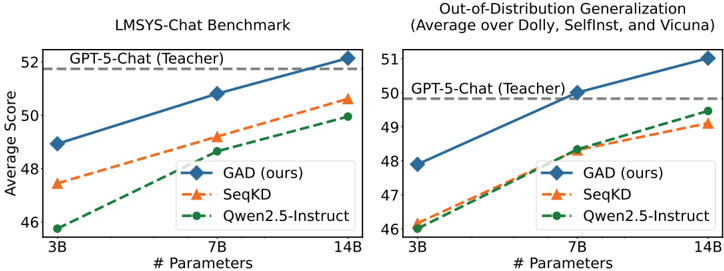

*Figure 1: Comparison between GAD and sequence-level knowledge distillation (SeqKD; KR16) trained on LMSYS-Chat [ZCS + 24] dataset, evaluated by averaged GPT-4o scores. Left : Results on the LMSYS-Chat test set. Right : Average performance across Dolly [Dat23], SelfInst [WKM + 23], and Vicuna [CLL +*

**② 方法 / 架构图**

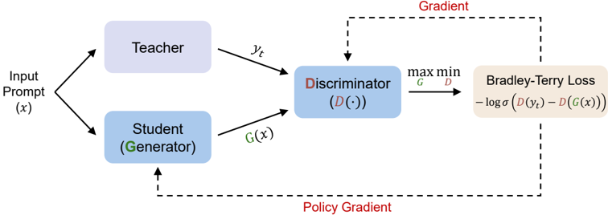

*Figure 2: Training procedure of GAD. The student (generator) learns to generate responses that maximize the score assigned by the discriminator. The discriminator is trained with Bradley-Terry loss to assign a lower score to the student than the teacher, learning to distinguish between them. Togethe*

### 一眼看懂
> 一句话导读：教师是只能吐文本、看不到内部概率的闭源 API 时,常规蒸馏全失效;GAD 借 GAN 的思路另训一个判别器当"在线打分器",让学生在黑盒下也能做 on-policy 蒸馏。

- 🟦 TL;DR：先说困境。当教师是只吐文本的闭源 API(如 GPT-5-Chat)时,学生拿不到 logits(模型输出的原始概率分数),做不了白盒蒸馏,也做不了 likelihood 蒸馏(对齐似然/概率的蒸馏)。更麻烦的是,连"在自己生成上学"(on-policy)都没法做——因为教师无法给学生自己采出的 rollout(学生跑出来的一整条响应)打概率分。
  - GAD 的解法:把学生当成 GAN(生成对抗网络)里的生成器 \(G\),另外训一个判别器 \(D\),让 \(D\) 去区分"这段文本是学生写的还是教师写的"。\(G\) 努力骗过 \(D\)、\(D\) 努力把二者分开,构成一个极大极小博弈(minimax,两方目标相反、轮流对抗)。
  - 关键点:\(D\) 本质是一个"随学生一起进化的 on-policy 奖励模型"。于是黑盒下也能做 on-policy 蒸馏;而且 \(D\) 一直追着学生当前行为更新,不会像冻结的 reward model 那样被 reward hacking(策略钻奖励模型的空子、刷高分却没真本事)【原文 Abstract, §2.1, Table 1】。
- 最巧的一步：把判别器 \(D\) 解读成一个"在线奖励模型"。对照见 Table 1：RLHF 里的 reward model 训完就冻结、容易被 hack;而 GAD 的 \(D\) 在 minimax 博弈里和学生持续共同更新。
  - 反过来验证它的重要性:抽掉"\(D\) 在线共更"这一步——把 \(D\) 冻结成普通 reward model——GAD 就退化成 off-policy 判别器。论文 Fig.6 实测约 300 步后就出现 reward hacking(响应长度暴涨到 ~1300 token)。
  - 所以"on-policy 判别器"是 GAD 既能学到东西、又不会崩的命门【原文 §3.3 Fig.6】。

### 为什么做
> 一句话导读：白盒 on-policy 蒸馏效果好但要看到教师概率,黑盒标准做法 SeqKD 只能死记教师文本、泛化差;GAD 想把白盒的 on-policy 好处搬到黑盒下,缺口就用一个对抗判别器补上。

- 研究背景：知识蒸馏([HVD15] Hinton)用大教师造小学生。
  - 学生能访问教师**预测分布 / 隐状态**的设定叫**白盒蒸馏**。标准做法有两类:一是对齐输出分布(forward/reverse KLD,[SST+20] LightPAFF、[GDWH24] MiniLLM),二是对齐内部状态([JYS+20] TinyBERT、[SCGL19] patient KD、[WWD+20] MiniLM、[WBH+21] MiniLMv2)。
  - 但教师是闭源 API(如 GPT-5)时,白盒访问不现实,只能看到**教师生成的文本**。这就是更难的**黑盒蒸馏**:缺细粒度概率监督,基于 likelihood 的目标失效;师生 **tokenizer 不兼容**(分词器不同、token 编号对不上)时 likelihood 目标也失效。
- 解决的具体痛点 & 两条已有路线各自短板：
  - **白盒 on-policy 这条线**([GDWH24] MiniLLM、[AVZ+24] GKD、[LL25] Thinking Machines OPD 博客、[YLY+25] Qwen3)近期强调 **on-policy 学习**的价值:学生学**自己生成的响应**(reverse-KLD)能促 mode-seeking(只聚焦教师的高概率模式)、减 exposure bias(训练只见真值、推理却要续写自己输出导致的偏差),优于纯 teacher-forcing。**短板**:全靠完整教师访问,闭源 / API-only 教师下不可用。
  - **黑盒标准做法 SeqKD**([KR16] sequence-level KD、[TGZ+23] Alpaca、[CLL+23] Vicuna、[PLH+23] GPT-4 instruct、[ZLX+23] LIMA)只对**教师响应做 SFT / 行为克隆**。**短板**:会记忆教师的**局部 n-gram**(连续几个词的固定搭配)、是 mode-covering(铺开覆盖教师整个分布)、OOD 泛化弱(分布外、训练没见过的输入上表现差)。本文有两处实证:Fig.4 的 N-gram 重叠、Table 6 的长度分布。近期 [MYS+25] s1、[GMK+25] OpenThoughts、[YHX+25] LIMO、[GYZ+25] R1 把 SeqKD 扩到"在教师**推理轨迹**上 SFT"来提升推理,但仍是 SFT 范式。
  - **RLHF 固定 reward model**([OWJ+22] InstructGPT)预训后**冻结**,策略容易 **reward hacking**([SHKK22] reward gaming)。
- 动机链(把黑盒 + on-policy 两个诉求接起来)：
  - 想要黑盒,又想保住 on-policy 的好处(mode-seeking、低 exposure bias、好 OOD)。
  - 但黑盒下教师无法评价学生自生成(没有概率级监督)。
  - 所以需要一个信号:不靠教师概率,却能对学生自生成给反馈。
  - GAN 判别器恰好提供这种**隐式、在线**的反馈([GPAM+14] GAN、[YZWY17] SeqGAN、[HE16] GAIL 是直系前身——SeqGAN 早已用 policy gradient 训文本 GAN,GAIL 把判别器当 reward)。而判别器 = "在线 reward model",又天然规避固定 RM 的 hacking。
- 本文站在谁肩上 & 与最近邻工作的精确差异：最近邻是 **SeqKD**(黑盒标准)与**白盒 on-policy**(MiniLLM/GKD)。
  - Δ:GAD 把"on-policy 学习"从白盒搬到黑盒——用**判别器代替"教师概率"**,作为对学生自生成的反馈源。
  - 技术承袭 GAN/SeqGAN/GAIL 的对抗框架,但有两点不同:一是**目标用 Bradley-Terry 偏好**(一种成对偏好模型)而非二分类 CE(§3.4 消融证 BT 更好);二是**强调判别器在线共更**(对照 RLHF 固定 RM,Table 1)。
  - 为什么有用——RL(GRPO 优化 \(D\) 给的 reward)比 SFT 泛化更好([CZY+25] SFT memorizes RL generalizes、[WZZ+25] SFT 泛化的 RL 视角),且在线判别器避免固定 RM 的 hacking【原文 §1, §3.3 Fig.6】。

### 怎么做 + 靠不靠谱
> 一句话导读：先用 SeqKD 暖身给学生和判别器一个起点,再进入对抗循环——学生采一批响应、判别器打分当 reward、GRPO 更新学生、BT loss 更新判别器,推理时只留学生。消融逐项验证了暖身、BT、判别器同尺寸、on-policy 这几步缺一不可。

- **形式化与 minimax 价值函数(§2.1,Eq.1)**：这是条件文本生成任务,目标是让学生分布 \(q_\theta(y\mid x)\) 逼近教师分布 \(p(y\mid x)\)。
  - 先构数据 \(\mathcal{T}=\{(x,y_t)\}\):遍历每个 prompt \(x\),为它各采一条教师响应 \(y_t\)。
  - 生成器 \(G\) = 学生模型,产出 \(G(x)\);判别器 \(D\) 给 \([x,y]\) 打一个**序列级标量分** \(D([x,y])\)(下文简写 \(D(y)\))。
  - 两玩家做极大极小博弈:
  \(\displaystyle \max_{G}\ \min_{D}\ V(G,D)=\mathbb{E}_{(x,y_t)\sim\mathcal{T}}\big[-\log\sigma\big(D(y_t)-D(G(x))\big)\big],\)
  其中 \(\sigma(\cdot)\) 是 sigmoid。这里用 **Bradley-Terry 模型**([BT52])刻画一个成对偏好:教师响应的分应当高于学生响应的分。

- **判别器结构(§2.1,复现关键)**：\(D\) **由生成器参数初始化**,外加一个**标量预测头**。这个 head 把序列**最后一个 token 的末层隐状态**投影成一个标量,作为整条序列的分数。也就是说,\(D\) 与 \(G\) 同架构、同尺寸(消融 Table 5 证同尺寸最优)。
- **方法流水线(5 步,Algorithm 1 + §2.2),每步标出输入与输出**：
  - **Step 0 构数据**:遍历 prompt \(x\)、采教师响应 \(y_t\),得到 \(\mathcal{T}=\{(x,y_t)\}\)。实现上从 LMSYS-Chat-1M-Clean 采 200K prompt,收 GPT-5-Chat 响应。
  - **Step 1 Warmup(关键,§2.2)**:对**整个 \(\mathcal{T}\) 跑 1 个 epoch**。生成器 \(G\) 用教师响应 \(y_t\) 做 **CE/SFT**(即先做一遍 SeqKD 当起点);判别器 \(D\) 用同数据做 **BT loss**(Eq.3)。附录 A.2 补了一个细节:warmup 阶段**先单独训 \(D\) 10 步**,再开始联合训 \(G,D\),以保证 G 和 D 的能力平衡。输出是已 SFT 的 \(G\) 和已初步判别的 \(D\)。
  - **Step 2 GAD 循环(2 个 epoch)**:对每个 batch \((x,y_t)\) 做三件事——
    - (a) 用当前 \(G\) 对 \(x\) 采**一组** \(N\) 条学生响应 \(\{y_s^i\}_{i=1}^{N}\)(\(N=8\),temperature 0.8);
    - (b) 把 \(D(G(x))\) **当 reward**,用 **GRPO** 更新 \(G\)(见下方 Eq.5-7);
    - (c) 用 **BT loss** 更新 \(D\)(组内每个 \(y_s^i\) 与同一 \(y_t\) 配对,Eq.8)。
  - **Step 3 交替至收敛**,返回 \(G\)。
- **生成器 / 判别器的真实目标形式(§2.2 + 附录 A.1)**：
  - 生成器目标(Eq.2):\(\displaystyle \max_{G}\ \mathbb{E}_{(x,y_t)\sim\mathcal{T}}\big[D(G(x))\big]\)。由于 \(G(x)\) 的**采样操作对 \(\theta\) 不可微**,这里把 \(D(G(x))\) 当 reward,用 **policy gradient**([SMSM99])经 **GRPO**([SWZ+24])优化。
  - GRPO 实现(附录 A.1):对每个 \(x\) 采一组 \(N\) 条响应 \(\{y_s^i\}\),奖励 \(r_s^i=D(y_s^i)\)(Eq.5);组内归一算 advantage(Eq.6):
    \(\displaystyle A_i=\frac{r_s^i-\operatorname{mean}\big(\{r_s^j\}_{j=1}^{N}\big)}{\operatorname{std}\big(\{r_s^j\}_{j=1}^{N}\big)};\)
    目标(Eq.7,**省略了 KL 与 clip 的表述**,但实现里 KL \(\beta=0.001\)):\(\displaystyle \max_{G}\ \mathbb{E}_{x,\,\{y_s^i\}\sim q_G}\Big[\tfrac{1}{N}\sum_{i=1}^{N}A_i\Big]\)。

  - 判别器目标(Eq.3 / 组内 Eq.8):默认用 **Bradley-Terry**。把组内每条学生响应 \(y_s^i\) 与同一教师响应 \(y_t\) 配对,最小化组内平均
    \(\displaystyle \min_{D}\ \mathbb{E}_{x,\,\{y_s^i\}\sim q_G}\Big[\tfrac{1}{N}\sum_{i=1}^{N}-\log\sigma\big(D(y_t)-D(y_s^i)\big)\Big],\)
    其中 \(D(y_t)\) 在组内共享。**消融对照用的 CE loss**(Eq.4,二分类判别器损失)则是
    \(\displaystyle \min_{D}\ \mathbb{E}_{(x,y_t)\sim\mathcal{T}}\big[-\log\sigma(D(y_t))-\log\big(1-\sigma(D(G(x)))\big)\big].\)

- **训练-推理数据怎么流动**:
  - 训练时,教师响应是**离线一次性收好**的固定 \(y_t\)(只查一次 GPT-5),而学生响应每步**在线现采**。
  - reward 不来自教师,而来自**与学生共同更新的 \(D\)**。
  - 推理时**只留 \(G\)**(贪心、max response 1536),\(D\) 丢弃。
  - 这套流程就是"黑盒(教师只给文本)+ on-policy(学生学自生成,反馈来自在线 \(D\))"的实现。
- 逐组件必要性(消融均以 GPT-4o 评分衡量)：
  - **Warmup(生成器侧)**:去掉它(直接用未 SFT 的 instruct 模型当 \(G/D\) 初始化),则 \(D\) 早期太容易区分二者、分布鸿沟太大、对抗失效,掉点(Qwen2.5-7B:LMSYS 50.8→49.7)【Table 3】。
  - **Warmup(判别器侧)**:去掉它(\(D\) 用原始模型初始化、\(G\) 已 SFT),则 G 和 D 失衡、\(D\) 反馈信息量不足、\(G\) 几乎学不动(LMSYS 50.8→49.0、Others 50.0→47.7,掉得更狠)【Table 3】。
  - **BT loss vs CE loss**:默认的 BT 优于二分类 CE(Qwen2.5-3B:LMSYS 48.9 vs 47.9、Others 47.9 vs 46.4)【Table 4, Eq.3 vs Eq.4】。
  - **判别器尺寸**:\(D\) 与 \(G\) 同尺寸最优;把 \(D\) 增大(3B→7B:48.9→47.8;7B→14B:50.8→50.5)反而掉点【Table 5】。
  - **on-policy vs off-policy 判别器**:这是核心消融。off-policy 做法是——SeqKD 暖身后**冻结 \(G\)** 训 \(D\) 2 epoch,再拿冻结的 \(D\) 当 RM 去训 \(G\)。结果约 300 步后就 reward hacking(响应暴涨到 ~1300 token);而 on-policy 版能稳定跑数千步【Fig.6】。
- 实验与证据:
  - **数据 / 模型**:训练用 LMSYS-Chat-1M-Clean 采 200K prompt,再收 GPT-5-Chat 教师响应。学生用 Qwen2.5-Instruct(3B/7B/14B)、Llama-3.2-3B / Llama-3.1-8B-Instruct。评测主集是 LMSYS 测试集 500,OOD 集是 Dolly(500)/SelfInst(252)/Vicuna(80)。评分方式:**GPT-4o 打分**(先生成参考答案再比分,分 = 学生分 / (学生分 + 参考分))+ 人工评测【§3.1】。
  - **关键数字**:全数据集 × 全尺寸下 GAD 都 > SeqKD(Table 2)。亮点:Qwen2.5-14B + GAD 在 LMSYS 得 **52.1**,超过教师 GPT-5-Chat 的 **51.7**;3B+GAD ≈ 7B+SeqKD、7B+GAD ≈ 14B+SeqKD(相当于把尺寸"升了一级");OOD 上 SeqKD 增益微弱甚至为负,而 GAD 稳健提升;人工评测对 before-distill / SeqKD 的胜率多 >50%、负率 <30%【§3.2, Table 2, Fig.1, Fig.3】。
  - **机制证据**:N-gram 重叠显示 SeqKD 过拟合教师的局部词汇、GAD 学到的是全局风格(Fig.4);在 toy 高斯混合分布上,SeqKD 表现为 mode-covering、GAD(REINFORCE)表现为 mode-seeking(Fig.5);off-policy 判别器出现 reward hacking(Fig.6);Table 6 显示 SeqKD 会缩短响应去贴合教师的长度分布、GAD 则保留学生自己的长度分布【§3.3, Table 6】。
  - **baseline 公平吗**:基本公平——训练预算相同(3 epoch、batch 256、约 2400 步),对 GAD 和 SeqKD 都搜了 lr ∈ [1e-6, 5e-6]。但**评测全靠 GPT-4o-as-judge** 这一代理指标,是主要软肋。
  - **"看着强但没回答核心问题"**:① "接近 GPT-5-Chat"只在 14B + LMSYS + GPT-4o 评分这一组合下成立,是上限演示而非任务正确率;② 实验全程在聊天 / 通用指令域,数学 / 代码这类强推理域没测。
- 假设与失效边界:
  - 【原文】教师只返回文本即可(黑盒),不需 logits;甚至 tokenizer 不兼容也行(Table 7 用 Qwen2.5-14B 教师蒸到 Llama,仍有效)。
  - 【原文】对抗训练稳定性靠 warmup 保证 G-D 平衡,但未给收敛性证明。
  - 【推断】依赖 GPT-4o judge 的偏好;若教师风格被 judge 系统性偏好,"超过教师"可能部分是评判偏差而非真超越(依据:所有自动指标都来自 GPT-4o,§3.1)。
  - 【推断】GAD 在强推理域(数学/代码可验证正确率)是否仍优于 SeqKD 未知——本文只在主观质量评分占主导的聊天域验证(依据:实验全在 LMSYS/Dolly/SelfInst/Vicuna,§3.1, §3.2)。
- 祛魅总结:
  - 真贡献【推断】:把"on-policy 蒸馏"成功迁移到黑盒,并给出"判别器 = 在线 reward model → 抗 hacking"这一干净的 GAN↔RLHF 映射;机制分析(N-gram / toy / Fig.6)扎实。
  - 包装 / 高估【推断】:"Qwen2.5-14B 比肩 GPT-5-Chat"是建立在 GPT-4o 评分上的上限演示,容易被过度解读。而且 GAD 比 SeqKD 重——要同时维护同尺寸的 \(G\) 和 \(D\),3 epoch 约 2400 步,14B 蒸馏需 16×H100 约 30 小时;论文未强调这层成本权衡(依据:Appendix A.2)。
  - 低估【推断】:OOD 泛化优势(SeqKD 甚至为负、GAD 稳健)其实是比"接近教师"更稳的卖点,但被标题的"comparable to teacher"盖过了。

### 结构化抽取

- 🎯 机制速览6轴：
  - **学什么信号** = 判别器给的序列级标量分 \(D(G(x))\)("像不像教师写的"),不是 token 概率。
  - **改什么** = 学生全参(policy)+ 判别器全参(reward model)。
  - **何时改** = 训练期 on-policy,每 batch 交替更新 \(G\) 与 \(D\)。
  - **免梯度?** = 否(\(G\) 走 GRPO 策略梯度、\(D\) 走 BT loss 梯度;采样不可微处用 RL 绕过)。
  - **记忆-技能生命周期** = 无显式记忆 / 技能库,知识固化进学生参数。
  - **防遗忘机制** = 无专门机制(warmup SFT 提供起点;靠教师文本对齐)。
- ⑦ 开源代码+框架/harness：
  - 项目页 ytianzhu.github.io/Generative-Adversarial-Distillation/。
  - 代码仓是 **microsoft/LMOps 的 `gad/` 子目录**(aka.ms/GAD-github 重定向至此,本地已 clone 488KB),但**只含环境 / 数据 / 启动脚本**(scripts/、tools/export_lmsys_parquet.py、local_setup.sh)。
  - **算法核心在外部 fork** `github.com/YTianZHU/verl`(基于 **veRL**)。该 README 明确"hack critic 模块当判别器",含 seqkd/warmup/gad/eval 分支,SeqKD/warmup 的 SFT 在 dp_actor.py。
  - 数据 / 模型在 HF(ytz20/LMSYS-Chat-GPT-5-Chat-Response、ytz20/gad-models);推荐 docker czwin32768/verl2:v0.2.0-vllm085(py3.10/torch2.6/vllm0.8.5)。
  - **未完整本地化**:核心算法不在本地 clone 的 LMOps/gad 内,需到 YTianZHU/verl fork 审计〔待核:fork 内 GAD 算法实现细节未逐行核对〕。
- 💰 资源/成本与可扩展性：
  - 蒸 Qwen2.5-14B(GPT-5-Chat 教师)约 **30 小时 / 16×H100**。
  - 3 epoch(1 warmup + 2 GAD)约 2400 步,batch 256、PPO mini-batch 256,\(N=8\),KL \(\beta=0.001\),温度 0.8。
  - lr:GPT-5 教师的 GAD 阶段用 1e-6;Qwen 教师的 warmup 用 5e-6、GAD 用 1e-6;SeqKD 用 5e-6。
  - max context:prompt 2048 / response 1536。需同时维护 \(G\) 和 \(D\)(同尺寸最优),比纯 SeqKD 重【§3.1, Appendix A.2】。
- 🎯 对"探索-巩固"对标：**竞品 / 可借组件**。
  - 一句判定:GAD 是"黑盒 on-policy 蒸馏"的强 baseline,提供两个可借组件。
  - 可借组件 (a):**在线协同进化的奖励 / 判别器**思路,可类比"teacher 当随学生演化的稀疏脚手架"——\(D\) 总是针对学生当前行为给反馈,正对应"巩固 / 回轨"里 teacher 需感知学生当前状态。
  - 可借组件 (b):**GAN↔RLHF 映射 → 抗 reward hacking**,对"固化进参数而不崩坏"有借鉴。
  - 缺口:GAD 没有路径 / step 级监督、没有 MTP 前瞻、没有记忆 / 技能库,且依赖教师文本(不是"学生自选可走通的开头")。所以它对"探索 / 选路"这一支撑较弱,更贴"巩固"的对齐侧。依据:\(D\) 共更对应在线 teacher 信号,但 GAD 学的是整段文本风格而非分支选择(§2.1, §3.3)。
- 🔭 开放问题/未来方向：【原文】未验证数学/代码等强推理域的黑盒蒸馏(§4 仅提"近期工作在教师推理轨迹上 SFT",GAD 本身未做);GAN 收敛性无理论保证,靠 warmup 经验缓解(§2.2)。【推断】把 \(D\) 做成 step/段级判别器(而非整段 1 个标量分)或可引入更细的路径级信用,接近"探索-巩固"的分支级监督;用真实任务正确率替代 GPT-4o judge 以去除评判偏差;探索教师=开源大模型但 tokenizer 不兼容时(Table 7)的更系统验证。

key|读PDF?|方法&相关工作已加厚?|LaTeX 公式条数|残留待核数
gad | 是(全文15页) | 是(方法 5-step 流水线 + 判别器结构/warmup 含先训D 10步 + GRPO advantage 与 BT/CE 真实形式 + 训推数据流;相关工作分白盒on-policy/SeqKD/固定RM 三线 + GAN/SeqGAN/GAIL 承袭) | 6(Eq.1 minimax 价值函数、Eq.2 生成器、Eq.3 BT、Eq.4 CE、Eq.6 advantage、Eq.8 组内 BT) | 1(YTianZHU/verl fork 内 GAD 算法实现细节未逐行核对)

---

## Gemma 2: Improving Open Language Models at a Practical Size

> **`gemma2`** ｜ Gemma Team, Google DeepMind ｜ 2024-08（arXiv:2408.00118 技术报告，原始发布 2024-06-27） ｜ L1 OPD/自蒸馏 · 相关性中（蒸馏训练小模型 + 后训练点名 on-policy KD） ｜ [📄 原始论文](https://arxiv.org/abs/2408.00118)

### 关键图示

**① Motivation / 对比图**

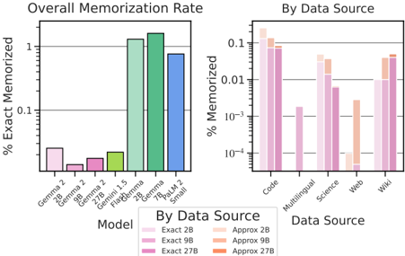

*Figure 1 | Comparing memorization rates. We find significantly lower memorization rates across-the-board. (Left) Overall memorization across model families. (Right) Exact and approximate memorization per data source.*

### 一眼看懂
> 一句话导读：这是 Google 的开源小模型技术报告;对本综述的看点是它在预训练用蒸馏代替 next-token、并在后训练点名用了 on-policy KD。

- 🟦 TL;DR：Gemma 2 的 2B/9B 在**预训练**阶段用知识蒸馏来训小模型——用逐 token 软标签交叉熵 \(\min_{P_S}\sum_x -P_T(x\mid x_c)\log P_S(x\mid x_c)\) 替代标准 next-token 预测(即用教师给的概率分布当目标,而非 one-hot 真值)。
  - 27B 因为没有更大的同族教师可用,仍用 next-token。
  - **后训练 SFT** 阶段明确写了"在学生自身分布上从教师蒸馏"(on-policy distillation,引 Agarwal 2024 = GKD / Gu 2024 = MiniLLM),再叠 RLHF,最后对各阶段模型做模型平均(model merging,把多个模型权重取平均)。
  - "后训练 on-policy KD"就是它与本综述(on-policy 蒸馏)最直接的连接点【原文 §3.2, §4】。
- 最巧的一步：两点结合——**用大教师的逐 token 软标签替代 one-hot 硬标签**,并**故意训远超 token 数的量**(2B/9B 训 50× compute-optimal token),用来"模拟训练超出可用 token 数"的情形。
  - 反过来验证:抽掉这一步、退回 from-scratch next-token,Table 6 显示 2B 在 500B token 上从 distilled **67.7** 掉到 **60.3**(3 benchmark 平均,抽掉蒸馏 −7.4 分)。
  - 直觉:小模型的瓶颈是"每个 token 能学到多少信息",而教师的完整分布比 one-hot 信息密度大得多。
  - 但它毕竟是技术报告:蒸馏温度、教师规模、on-policy KD 配方都没披露,命门虽明、细节不可复现【原文 §1, §3.2, Table 6;不可复现为推断】。

### 为什么做
> 一句话导读：小模型靠堆数据收益越来越小,而蒸馏能让小模型从大模型的软标签里学到更密的信息——这就是 Gemma 2 把蒸馏当主力训练范式的动机。

- 研究背景：
  - 小模型性能提升此前主要靠"延长训练"(最新小模型用到 15T token 才提 1–2% SOTA),而这随数据量只 log 增长(Hoffmann22 Chinchilla)。
  - 知识蒸馏(Hinton 2015)用大模型的软标签指导小模型,比硬标签含更多信息、给更丰富的梯度;Gemini 1.5 已用过蒸馏。
  - on-policy 蒸馏(Agarwal 2024 GKD、Gu 2024 MiniLLM)让学生在自己生成的分布上接受教师监督,缓解 train/inference 分布不一致(训练和推理时面对的输入分布不同)【原文 §1, §3.2, §4】。
- 解决的具体痛点：小模型若用常规 next-token 预训练,在固定参数 / 算力预算下"仍 under-trained"(没训透),难以逼近 2–3× 更大的模型;而单纯扩数据对小模型边际收益递减(数据效率瓶颈)【原文 §1】。
- 相关工作 & 各自不足（来龙去脉）：
  - ① **标准 next-token 预训练 + 延长训练**(Gemma 1、LLaMA、Mistral)——只随数据量 log 增长,有小模型数据效率瓶颈,是本文要替换的主路线。
  - ② **监督 KD**(Hinton15 软标签、Sanh19 DistilBERT)——通常用来"缩短小模型训练时间";Gemini 1.5 用过。Gemma 2 反其道而行,用它"训超量 token 以模拟更多数据"。
  - ③ **on-policy KD**(Agarwal24 GKD、Gu24 MiniLLM)——缓解 train/inference 分布失配;Gemma 2 在后训练 SFT 采用,但**不复现其对照**(只引用并采用)。
  - ④ **架构侧**:interleaving local-global attention(Beltagy20 Longformer)、GQA(Ainslie23)、logit soft-capping(Bello16)、model merging(Ramé24 WARP/WARM)——都是"已知技术模块"的组合,不是本文新提。
  - 报告对上述都没做横向消融,只引用并采用【原文 §1, §4】。
- 动机链：
  - 目标是在"实用规模"(2B/9B/27B,可消费级 / 单机部署)上榨出同尺寸最佳性能。
  - 小模型瓶颈在 token 信息密度 → 用大教师软标签蒸馏(虚拟扩大信息量)来训预训练小模型。
  - 后训练再让蒸馏发生在学生自身输出分布上(on-policy),对齐推理时的真实分布。
  - 最后各阶段模型平均,稳住性能。
- 与最近邻工作的Δ（精确差异）：最近邻是 Gemma 1(next-token 预训练)与 Gemini 1.5(已用蒸馏)。
  - Δ:Gemma 2 把"预训练蒸馏"系统地用于开源实用规模(2B/9B),且**刻意训 50× compute-optimal token**(用蒸馏模拟超量数据),并在后训练显式叠加 on-policy KD + 模型平均。
  - 为什么有用:Table 6/7 在控制 token 预算下证明了蒸馏增益,且 9B/27B 达到当时同尺寸开源 SOTA【原文 §1, §6】。

### 怎么做（细到可复现的程度——技术报告，部分配方闭源）
> 一句话导读：预训练用教师的逐 token 分布当软目标(只有 2B/9B,27B 没教师);后训练 SFT 在学生自生成分布上做 on-policy KD,再 RLHF,最后多模型取平均。架构上是一批已知模块的组合。

#### 1. 预训练蒸馏（§3.2）

- 给定大教师，逐 token 用教师对下一 token 的分布 \(P_T(x\mid x_c)\) 当软目标，最小化教师与学生分布的负对数似然（=逐 token 软标签交叉熵）：
\(\displaystyle \min_{P_S}\ \sum_{x}\ -\,P_T(x\mid x_c)\,\log P_S(x\mid x_c).\)

- 2B/9B 用此蒸馏；27B 用标准 next-token（无更大同族教师）。预训练 token：27B 用 13T、9B 用 8T、2B 用 2T（英文为主 web/code/science）；SentencePiece 256k 词表。

#### 2. 架构要点（§2，非蒸馏核心但影响复现）

- **local/global 注意力逐层交替**：局部滑窗(4096) 与全局(8192) 每隔一层交替。
- **GQA**：num_groups=2（vs MHA 几乎无损但省参/快，Table 8: 50.3 vs 50.8）。
- **Logit soft-capping**：注意力层与最终层把 logits 压到 \([-\text{soft\_cap},+\text{soft\_cap}]\)：
\(\displaystyle \text{logits}\leftarrow \text{soft\_cap}\cdot\tanh\!\big(\text{logits}/\text{soft\_cap}\big),\)
注意力层 soft_cap=50.0、最终层=30.0。

- **pre-norm + post-norm（均 RMSNorm）**：对每个子层输入输出都归一。
- **深 > 宽**：9B 深网络略优（Table 9: 52.0 vs 50.8）。具体规模：2B(d=2304,26 层)/9B(d=3584,42 层)/27B(d=4608,46 层)；GeGLU、RoPE、tied embedding、context 8192。

#### 3. 后训练（§4）

- **SFT(behavioral cloning,行为克隆)**:在合成 + 真实 prompt 上,响应**主要由更大的教师合成**;同时**在学生自身分布上从教师蒸馏**(on-policy KD,引 Agarwal 2024 / Gu 2024)——原文原话:"We also run distillation from the teacher on the student's distribution"。
- **RLHF**:算法沿用 Gemma 1.1,但 reward model 大了一个数量级、更偏多轮对话;policy 基于与 SFT 相同的 prompt。
- **模型平均(model merging)**:对用不同超参跑出的多个模型做权重平均(Ramé24)。
- **数据**:后训练用 LMSYS-chat-1M 的 **prompt(不用它的答案)**。数据过滤做了几件事:聚焦 helpfulness、降 safety / hallucination 危害、去掉评测集污染、降 recitation 风险。另外发现一个现象:加入"鼓励 in-context attribution / hedging / refusal"(基于上下文给出处、措辞留余地、必要时拒答)的子集,能提 factuality 而不损其他指标。

#### 数据流动 / 逐组件必要性

- 数据流动:
  - 预训练——教师对每个位置输出完整分布 → 学生用软标签 CE 拟合(替代 one-hot)→ 训 50× compute-optimal token。
  - 后训练——教师合成响应做 SFT + 在学生自生成分布上做 on-policy KD → RLHF → 多模型平均。
- **预训练蒸馏**:核心,有对照消融——Table 6(2B distilled 67.7 vs from-scratch 60.3,500B token,7B 教师)、Table 7(不同尺寸的 perplexity)。
- **后训练 on-policy KD**:被点名采用,但**无独立消融**——报告没给它相对 off-policy KD 的对照,所以它的独立贡献无法从本文判断【§4,推断】。
- **RLHF / 模型平均**:标准后训练组件,没有单独的消融数字。

### 靠不靠谱
> 一句话导读：预训练蒸馏有干净对照(蒸馏明显胜 from-scratch),但 on-policy KD 没单独消融、配方全闭源,所以它对本综述的价值更多是"立场背书 + 强基线权重"而非可复现方法。

- 实验与证据：
  - **蒸馏 vs from-scratch(Table 6)**:2B 在 500B token(10× compute-optimal)上,distilled(7B 教师)**67.7** vs from-scratch **60.3**(3 benchmark 平均)。
  - **不同尺寸的蒸馏增益(Table 7)**:看验证集 perplexity——200M/400M/1B 三档,distilled(7B 教师)是 **21/17/15**,from-scratch 是 **23/19/17**。论文结论是"**the gain remains as the model size is scaled**"(增益随尺寸放大而保持,约恒定 ~2 ppl),**不是**"模型越小蒸馏越有用"〔订正:旧 analysis 称"蒸馏收益随模型变小更明显",与 Table 7 原文表述不符——各尺寸的 ppl 差近似恒定,原文措辞是 gain remains〕。
  - **架构消融**:MHA vs GQA(Table 8 50.3/50.8);wide vs deep(Table 9 50.8/52.0);滑窗 4096/2048/1024 的推理 ppl 为 1.63/1.63/1.64(Table 10,可调来省推理);MMLU 格式鲁棒性(Table 11,Gemma 2 2B 的 std 2.1 vs Mistral 7B 的 6.9)。
  - **指令模型**:用 Chatbot Arena / 人类评测;标准基准包括 MMLU/GSM8K/ARC/HellaSwag/HumanEval/MBPP/AGIEval/BBH/WinoGrande【§6】。
  - **baseline 公平吗**:Table 6/7 的"蒸馏 vs from-scratch"在控制 token 预算 / 教师规模下是干净对照(教师固定 7B,模拟 27B→9B 的师生 gap);但全报告没有 on-policy KD 的单独消融。
  - **"看着强但没回答核心问题"**:作为技术报告,蒸馏部分的消融比较粗略,缺乏对 on-policy KD 单独贡献的隔离实验;"蒸馏 = 以虚拟信息量训练"是直觉说法,而非可量化的论证。
- 假设与失效边界：
  - 【原文】27B 没蒸馏(同族无更大教师),所以严格说"蒸馏更优"只在 2B/9B 上成立(§3.2, §6.1)。
  - 【原文】后训练数据用 LMSYS-chat-1M 的 **prompt(不用它的答案)**;做了多级数据过滤(§4)。
  - 【推断】训练完全闭源——教师模型、数据混合、蒸馏温度、on-policy KD 配方、模型平均权重都没公开,**不可复现**(依据:§3.2/§4 均无超参 / 配方细节)。
  - 【推断】on-policy KD 的独立贡献无法从本文判断(没有对照),它的"on-policy"成分到底带来多少增益未知(依据:§4 仅引用 GKD/MiniLLM,无消融)。
  - 【推断】标准基准分数仍受数据混合 / 污染过滤质量影响,跨模型对比需谨慎(依据:§4 提了 recitation / 污染过滤,但效果未量化)。
- 祛魅总结：
  - 真贡献【推断】:在开源实用规模(2B/9B)上把"预训练蒸馏"做成主力训练范式(并刻意训超量 token)、公开权重,且明确把"后训练 on-policy KD + 模型平均"纳入配方——为社区提供了"用大模型造强小模型"的工程范本和强基线权重。
  - 包装 / 高估【推断】:作为技术报告,"蒸馏有效"的结论可信,但消融粗(尤其 on-policy KD 没有隔离实验);"以虚拟信息量训练"是叙事性的直觉,非严格论证。本文对本综述的价值主要是"立场 + 权重",而非可复现的 OPD 方法。
  - 低估 / 订正【推断】:旧 analysis 说"蒸馏收益随模型变小更明显",应订正为"增益随尺寸放大而保持"(Table 7 原文 gain remains,各尺寸 ppl 差近似恒定)。

### 结构化抽取

- 🎯 机制速览6轴：
  - **学什么信号** = 预训练用教师逐 token 的完整概率分布(软标签 CE);后训练 SFT 用教师在学生自生成分布上的 token 监督(on-policy KD)+ RLHF 奖励。
  - **改什么** = 学生全参(预训练 + 后训练全程)。
  - **何时改** = 预训练期(软标签替代 next-token)+ 后训练 SFT 期(on-policy KD)+ RLHF 期。
  - **免梯度?** = 否(全监督 / RL 梯度)。
  - **记忆-技能生命周期** = 无显式记忆 / 技能库,知识固化进参数。
  - **防遗忘机制** = **模型平均(model merging / averaging)**——对各阶段 / 各超参的模型做平均来提升整体性能(WARP/WARM 思路),间接缓解阶段间的能力遗忘。
- ⑦ 开源代码+框架/harness：**只发布权重**(huggingface.co/google/gemma-2-2b、-9b、-27b 及对应 -it 指令版),**无训练 / 蒸馏代码**(n/a)。CloneTier=B,仅记录不 clone。框架是 Google 内部的 **JAX + TPU** 栈(GSPMD 分片 + Pathways 跨 pod + MegaScale XLA + ZeRO-3 式 optimizer 分片),属"大厂技术报告 / 权重发布仓,无训练代码"。
- 💰 资源/成本与可扩展性：
  - 预训练用的 TPU:2B 用 512 TPUv5e(512-way 数据 × 1-way 模型分片)、9B 用 4096 TPUv4(1024×4)、27B 用 6144 TPUv5p(768×8)。
  - 预训练碳足迹估 1247.61 tCO2eq(碳中和)。
  - 限制:需先有更大的同族教师才能蒸馏(27B 因无教师而未蒸馏)【原文 §3.3, §3.4, Table 3】。
- 🎯 对"探索-巩固"对标：**弱支撑(立场层)/ 背景**。
  - 一句判定:Gemma 2 的主要价值是"工业界确认 on-policy KD 进入主流后训练配方"这一立场背书 + 一个可用的强基线权重,但它**不提供可借的 OPD 机制细节**(配方全闭源)。
  - 与"探索-巩固"的对标点稀薄,三点:① 预训练蒸馏是稠密软标签 CE,没有"探索 / 选路",也没有"path-recovery";② 后训练点名了 on-policy KD,但无细节、无单点接管、无 MTP;③ **模型平均**可当"巩固 / 防遗忘"的一个粗粒度参考(合并多阶段 / 多超参的能力),但与"固化进记忆 / 技能库"相去甚远。
  - 缺口:无可复现方法、无路径级监督、无 MTP、无记忆 / 技能生命周期。依据:§3.2/§4 只给了立场与软标签公式、没给配方。
- 🔭 开放问题/未来方向：【原文】27B 无同族教师故未蒸馏——更大规模如何蒸馏（自蒸馏/弱到强？）开放（§3.2, §6.1）；on-policy KD 细节缺失（§4）。【推断】把"预训练稠密软标签蒸馏"与"后训练稀疏 on-policy 脚手架（path-recovery 单点接管）"分工，可在小模型训练里区分"打底（稠密 KD）"与"纠偏（稀疏 OPD）"；用 MTP 前瞻替代/补充教师软标签，让学生在预训练期就学"前瞻一致性"；模型平均可升级为"按技能选择性合并"以更精细防遗忘（依据：本文模型平均 + 本课题记忆/技能固化）。

读到PDF? 是（PyMuPDF 全文 21 页；§3.2 蒸馏公式 + §4 后训练 + Table 6–11 + 架构表/soft-cap 公式全核）｜L线 L1（蒸馏训练小模型 + 后训练 on-policy KD 立场）｜对标结论 弱支撑/背景（工业界 on-policy KD 立场背书 + 强基线权重；配方全闭源、无可借机制、无路径级/MTP/记忆）；含一处对旧 analysis 的订正（Table 7 增益随尺寸"保持"而非"越小越明显"）｜残留待核 0

---

## On-Policy Distillation of Language Models: Learning from Self-Generated Mistakes (GKD)

> **`gkd`** ｜ Google DeepMind（+Mila / U. Toronto；Rishabh Agarwal、Nino Vieillard 共同一作；Matthieu Geist、Olivier Bachem 等） ｜ 2024-01-17 (arXiv:2306.13649 v3；ICLR 2024) ｜ L1 OPD/自蒸馏 · 相关性高（本课题 OPD 直接源头/奠基） ｜ [📄 原始论文](https://arxiv.org/abs/2306.13649)

### 关键图示

**① Motivation / 对比图**

*Figure 1: Comparing GKD with KD approaches across different student model sizes. We use the T5 models (Raffel et al., 2020) trained with supervised FT as students. We use supervised FT T5-XL ( ∼ 3B params) as the teacher, whose performance is indicated by the horizontal line. Supervised KD and FT us*

**② 方法 / 架构图**

*Figure 5: RLAIF + On-policy GKD . We show the trade-off between reward maximization and summarization performance on XSum. We report improvements relative to the original T5-base student. Following Roit et al. (2023), we use the textual entailment score from a T5-XXL NLI classifier as the reward. α*

### 一眼看懂
> 一句话导读：自回归蒸馏的老毛病是训练只见固定数据、推理却要续写自己的输出,误差越滚越大;GKD 让学生在自己生成的序列上、用教师 token 概率当标签来学,并把"掺多少 on-policy 数据"和"用哪种散度"做成两个旋钮,统一了之前一票方法。

- 🟦 TL;DR：自回归 LM(逐 token 往后生成的语言模型)的知识蒸馏有个老毛病——训练时学生拟合的是"固定数据集(真值或教师生成)"的序列,但推理时学生要从自己的部分输出自回归续写,会走到训练没见过的状态,早期 token 的误差会级联放大。这就是 train-inference 分布失配,也叫 exposure bias。
  - GKD 的视角:把蒸馏看成"带交互式专家的模仿学习"——让学生在**自己生成**的序列上,用教师的 token 概率当专家标签来学。
  - 并把两件事做成可调旋钮:一是"on-policy 数据比例 \(\lambda\)",二是"学生-教师散度 \(D\)"(forward/reverse KL、广义 JSD(β))。已有的各种 KD 方法都是这套框架的特例【原文 Abstract, §3.1, Algorithm 1】。
- 最巧的一步：两点合一——**on-policy 数据 + 对采样过程 stop-gradient**(Eq.4)。
  - "在学生自生成序列上学"是消除分布失配的关键(λ=0 时退回监督 KD、掉到基线;Fig.8 显示 λ≥25% 后性能随 λ 上升、λ=1 通常最好)。
  - "不反传穿过学生的采样过程"(stop-gradient,只把采样结果当数据、不让梯度流经采样这一步)让它比 MiniLLM 那种序列级 policy-gradient 方案稳得多,还省去多种稳定化技巧。
  - 反过来验证:抽掉"on-policy"就退回普通 KD/SeqKD(分布失配重现);抽掉"stop-gradient"则训练不稳 / 低效。这两点合起来才是命门【原文 §3.1 Eq.4, §4, Fig.8】。

### 为什么做
> 一句话导读：之前的自回归 KD 要么在固定数据上训(导致分布失配)、要么用 forward KL(容量不够时迫使学生铺开覆盖教师);GKD 想同时治这两个病,并把前人方法收编成自己框架的特例。

- 研究背景：自回归 LM 靠扩数据 + 扩参数取得能力,但部署受推理成本 / 显存限制,所以需要蒸馏压缩。现有自回归 KD 有两条路:要么先用教师生成一批固定序列再 SFT(SeqKD,贵),要么在固定数据集上让教师打 token 概率(监督 KD,最小化 forward KL)【原文 §1, §2】。
- 解决的具体痛点：
  - ① **train-inference 分布失配(exposure bias)**——在固定序列上训、推理时自回归走到未见状态,误差级联,这是模仿学习里的经典问题。
  - ② **容量失配下 forward KL 的弊端**——学生表达力有限时,最小化 forward KL 会迫使学生去覆盖教师分布的整个支撑,可能把概率质量分散到教师几乎不产生的 token 上,导致幻觉 / 低质量生成【原文 §1, §3.1 Choice of Divergence】。
- 相关工作 & 各自不足（来龙去脉 + 精确短板）：
  - ① **监督 KD**(Hinton15 软标签、Sanh19 DistilBERT)——在固定数据上最小化 forward KL,是 \(\lambda=0\) 的特例;有分布失配 + 均值寻求(mean-seeking,铺开覆盖)的弊端。
  - ② **SeqKD**(Kim&Rush16)——在教师生成的序列上做 SFT(最大化教师高概率序列的似然),仍是固定数据、贵。
  - ③ **ImitKD**(Lin20)——首次点出"蒸馏 ↔ 模仿学习",混采学生与固定数据(约等于 GKD 的 \(\lambda=0.5\) + forward KL),但**停在 token 级 forward KL,没走到纯 on-policy,也没结合 RL**。
  - ④ **f-distill**(Wen23)——把序列级 KD 表述为 f-散度(具体是 total variation),是 GKD 的 \(\lambda=0.5\) + TV 距离的特例。
  - ⑤ **并行的 MiniLLM**(Gu23)——把蒸馏当 RL,在序列级优化 **reverse KL**、用 policy gradient,但需要多种稳定化技巧(梯度反传穿采样、需 baseline / teacher-mixed 采样等)。
  - GKD 的整合:用 \(\lambda\) + \(D\) 把 ①–④ 全部统一为特例,并以 stop-gradient 取代 ⑤ 那种 policy-gradient 的不稳。理论根基是模仿学习里的 **DAgger**(Ross 2011,做法是 on-policy 收集 + 专家标注 + 重训)【原文 §1, §5】。
- 动机链：
  - 固定数据 → 分布失配。
  - 借模仿学习 DAgger 里"教师作交互式专家"的思路 → 让学生在自生成序列上接受教师的 token 反馈。这既消除失配,又形成正反馈环(学生进步后,自生成数据的质量也会升)。
  - 同时放开散度选择,让有限容量的学生能聚焦教师分布的关键区域。
- 与最近邻工作的Δ（精确差异）：最近邻是 ImitKD(混采但停在 token 级 forward KL)与 MiniLLM(RL 式 reverse KL)。
  - Δ:GKD 用 \(\lambda\)(on-policy 比例)+ \(D\)(散度)两个旋钮把它们都统一为特例,并新增"纯 on-policy + 任意散度 + stop-gradient + 可叠 RL"这一组合。
  - 为什么有用:比 ImitKD 更彻底(可以纯 on-policy)、比 MiniLLM 更稳(不反传穿采样、无需稳定化技巧),而且能与 RLHF/RLAIF 无缝结合(只需学生样本,几乎无额外超参)【原文 §1, §3.1 Remark, §3.2】。

### 怎么做（细到可复现）
> 一句话导读：核心目标 \(L_{\text{GKD}}\) 就是"固定数据上的散度 + on-policy 学生数据上的散度"按 \(\lambda\) 加权;算法每步以概率 \(\lambda\) 决定本 batch 用学生自采还是用固定数据,逐 token 算散度更新(对采样 stop-gradient),还能再叠一项 RL reward。

#### 0. 散度工具箱（§2）

- 温度 \(\gamma\) 的 softmax：\(p(y_n\mid x)=\dfrac{\exp(z_n/\gamma)}{\sum_i\exp(z_i/\gamma)}\)，学生训练 \(\gamma=1\)，评测用贪心(\(\gamma\to0\))或温度采样。
- KL：\(D_{\text{KL}}(P\Vert Q)=\sum_c P(c)\log\frac{P(c)}{Q(c)}\)，不对称——forward KL（=最大似然、均值寻求/覆盖全支撑）vs reverse KL（模式寻求/聚焦高概率区）。
- **广义 JSD(β)**（Eq.1，0<β<1 在 forward/reverse KL 间插值，且对不相交支撑有界）：
\(\displaystyle D_{\text{JSD}(\beta)}(P\Vert Q)=\beta\,D_{\text{KL}}\!\big(P\,\Vert\,\beta P+(1-\beta)Q\big)+(1-\beta)\,D_{\text{KL}}\!\big(Q\,\Vert\,\beta P+(1-\beta)Q\big).\)
\(\beta\to0\) 时梯度 ≈ forward KL，\(\beta\to1\) 时 ≈ reverse KL。

#### 1. 序列级散度记号（§3 Eq.2）
对教师 \(p_T\)、学生 \(p^\theta_S\)（\(\theta\) 可微），定义 token 级散度按序列长归一：
\(\displaystyle D\big(p_T\Vert p^\theta_S\big)(y\mid x):=\frac{1}{L_y}\sum_{n=1}^{L_y} D\big(p_T(\cdot\mid y_{<n},x)\,\Vert\,p^\theta_S(\cdot\mid y_{<n},x)\big).\)
监督 KD = \(L_{\text{SD}}(\theta)=\mathbb{E}_{(x,y)\sim(X,Y)}[D_{\text{KL}}(p_T\Vert p^\theta_S)(y\mid x)]\)（固定数据上的 forward KL，Eq.3）。

#### 2. on-policy KD（§3.1 Eq.4，核心）
学生自生成 \(y\sim p_S(\cdot\mid x)\)、在中间状态 \(y_{<n}\) 上模仿教师 token 分布：
\(\displaystyle L_{\text{OD}}(\theta):=\mathbb{E}_{x\sim X}\Big[\mathbb{E}_{y\sim p_S(\cdot\mid x)}\big[D_{\text{KL}}(p_T\Vert p^\theta_S)(y\mid x)\big]\Big],\quad\text{且不反传穿过 }p_S(\cdot\mid x)\text{ 的采样}.\)
"不反传穿采样"使训练稳定高效（区别于 MiniLLM 的 policy gradient）；温度 \(\gamma=1\) 鼓励学生生成多样性。

#### 3. 统一目标 GKD（§3.1）
\(\displaystyle L_{\text{GKD}}(\theta):=(1-\lambda)\,\mathbb{E}_{(x,y)\sim(X,Y)}\big[D(p_T\Vert p^\theta_S)(y\mid x)\big]+\lambda\,\mathbb{E}_{x\sim X}\Big[\mathbb{E}_{y\sim p_S(\cdot\mid x)}\big[D(p_T\Vert p^\theta_S)(y\mid x)\big]\Big].\)
两旋钮：\(\lambda\in[0,1]\)（on-policy 学生数据比例）、\(D\)（任意散度）。监督 KD = \((\lambda{=}0,\text{forward KL})\)，on-policy KD = \((\lambda{=}1,\text{forward KL})\)。

#### 4. 算法（Algorithm 1，6 步）
① 给定教师 \(p_T\)、学生 \(p^\theta_S\)、数据 \((X,Y)\)；② 每步抽 \(u\sim\text{Uniform}(0,1)\)；③ 若 \(u\le\lambda\) → 用学生当前策略采一批 on-policy 序列 \(y\sim p^\theta_S(\cdot\mid x)\)；否则 → 取固定数据集 batch；④ 更新 \(\theta\leftarrow\theta-\eta\frac1B\sum_{(x,y)\in B}\nabla_\theta D(p_T\Vert p^\theta_S)(y\mid x)\)（对采样过程 stop-gradient）；⑤ 重复 K 步。

#### 5. 可选 RL + on-policy GKD（§3.2 Eq.5）
直接优化非可微的真实目标（reward \(r\)）同时向教师正则：
\(\displaystyle \mathbb{E}_{x\sim X}\Big[\underbrace{(1-\alpha)\,\mathbb{E}_{y\sim p^\theta_S(\cdot\mid x)}[r(y)]}_{\text{RL 目标}}-\underbrace{\alpha\,\mathbb{E}_{y\sim p_S(\cdot\mid x)}\big[D(p_T\Vert p^\theta_S)(y\mid x)\big]}_{\text{Generalized On-Policy Distillation}}\Big],\)
\(\alpha\in[0,1]\) 控蒸馏 vs RL 强度，\(\alpha=1\) 即纯蒸馏。可减"alignment tax"。Remark：与 RL 结合时推荐用 reverse KL 或 JSD(0.9)。

#### 关键超参/起点假设

- 起点：学生与教师都是已 SFT 的同族模型（学生须能生成质量尚可序列，类两阶段 RLHF：先 SFT 再 online）。
- 学生训练温度固定 1；λ 试 {0, 0.5, 1}；散度试 {forward KL, reverse KL, JSD(0.1/0.5/0.9)}。

#### 逐组件必要性

- **\(\lambda\)**:核心旋钮。Fig.8 显示 λ≥25% 后性能随 λ 上升、λ=1 通常最好;λ=0 退回监督 KD(无失配修正)【§4, Fig.8】。
- **散度 \(D\)**:作用是在容量失配下聚焦关键区域。具体规律——高温评测下,模式寻求的散度(JSD(0.5/0.9)/reverse KL)质量更好但多样性更低;贪心评测下散度影响很小;指令微调中 reverse KL 显著优于 forward KL(BBH/MMLU +2%/+1%)【§4, Fig.4/6/7/10】。
- **stop-gradient**:让训练稳定、高效,这正是它区别于 MiniLLM 的地方。是设计要点,不可选【§3.1 Eq.4】。
- **RL 叠加(§3.2)**:可选。用 RLAIF(文本蕴含奖励)在抑制摘要幻觉的同时,蒸馏提质(Fig.5)。
- **起点 SFT 学生**:必要假设(不能是随机初始化)【§3.1 Remark】。

### 靠不靠谱
> 一句话导读：on-policy GKD 在三个任务、各学生规模上一致胜过监督 KD 与 SeqKD,对照系统;主要软肋是散度最优值因任务而异、且 on-policy 采样有额外算力开销;实验全在 T5(≤3B)上,没覆盖现代 decoder-only 与长 CoT。

- 实验与证据：
  - **任务特定蒸馏**:XSum(摘要,看 ROUGE-2,贪心)、WMT14 en→de(翻译,看 BLEU,beam)、GSM8K(4-shot CoT,用外部计算器判对)。**任务无关蒸馏**:FLAN2021(536 万样本 / 62 任务),在 held-out 上评 MMLU(57)/BBH(23)【§1, §4】。
  - **模型**:教师 = SFT 的 T5-XL(~3B);学生 T5-Small(77M)/Base(250M)/Large(800M),分别小 38× / 12× / 3.8×【§1 Fig.1, §2】。
  - **关键数字(Fig.1)**:on-policy GKD 在三任务 × 各学生规模上一致超过监督 KD 与 SeqKD;相对初始学生的提升约为基线 KD 的 **2.1×(摘要)/1.7×(翻译)/1.9×(推理)**;任务无关蒸馏的 BBH/MMLU **+2%/+1%**(Fig.10)【§1, Fig.1/10】。
  - **数据效率(Fig.3)**:仅用 5% 子集、且没有真值摘要的 on-policy GKD,胜过用全量真值的监督 KD / ImitKD。**RL 叠加(Fig.5)**:GKD+RLAIF 的事实一致性超过教师,同时大幅提升摘要质量。**自蒸馏**:同架构、同尺寸的 self-distill 学生可以超过教师【§4】。
  - **baseline 公平吗**:公平且系统——同教师、同学生族,对 SFT / 监督 KD / SeqKD / ImitKD / f-distill 做了全面对比,且 λ × 散度做了系统消融。
  - **"看着强但没回答核心问题"**:散度的最优值因任务而异、需逐任务调(不是普适设置);on-policy 采样有额外算力(GSM8K 约 1.8–2.2×)。
- 假设与失效边界：
  - 【原文】教师必须能查询 token 概率(白盒),黑盒教师不适用(§3 problem setup)。
  - 【原文】起点学生须已具备一定的生成质量(不能随机初始化),这与 RLHF 两阶段范式绑定(§3.1 Remark)。
  - 【原文】on-policy 采样有计算开销,但作者论证相对服务成本是可接受的(§4)。
  - 【推断】实验局限在 T5 编码器-解码器(≤3B)与生成式任务(摘要 / 翻译 / 算术 / 指令),没覆盖现代 decoder-only 大模型与长 CoT 推理(依据:§1/§4 全用 T5;GSM8K 仅 4-shot 短 CoT)。
  - 【推断】λ 与散度的最优值都因任务而异、没有自适应选择准则,迁移到新任务需要重新调(依据:§3.1 "optimal divergence task-dependent" + Fig.4/10)。
- 祛魅总结：
  - 真贡献【推断】:把"自回归 KD = 交互式专家模仿学习"这一视角讲透,并用 \(\lambda\) + \(D\) 两个旋钮统一了监督 KD / SeqKD / ImitKD / f-distill,还给出 stop-gradient 的稳定实现 + 可叠 RL——是 on-policy 蒸馏的奠基性框架(被 GAD、Gemma2、Thinking Machines OPD 等广泛引用为源头)。
  - 包装 / 高估【推断】:"self-distill 超教师"等亮点只在特定设置下成立,当成普适结论容易高估;"2.1×/1.7×/1.9×"是相对初始学生增益的倍数(当基线 KD 本身增益小时,倍数容易显得大),绝对的 ROUGE/BLEU/Acc 提升要看 Fig.1 的原值。
  - 低估【推断】:"λ≥25% 才见效、纯 on-policy 最好"这一定量规律,对后续所有 OPD 工作的"该掺多少 on-policy 数据"是很实用的先验,但常被引用者忽略。

### 结构化抽取

- 🎯 机制速览6轴：
  - **学什么信号** = 教师在学生自生成序列上的 token 级概率分布(白盒 logits),经散度 \(D\) 对齐。
  - **改什么** = 学生全参(\(p^\theta_S\) 可微)。
  - **何时改** = 训练期,每步以概率 \(\lambda\) 用 on-policy 学生序列、否则用固定数据,逐 token 算散度更新。
  - **免梯度?** = 部分——对学生采样过程 stop-gradient(不反传穿采样),但仍是监督式地用梯度拟合 token 概率(不是 policy gradient)。
  - **记忆-技能生命周期** = 无显式记忆 / 技能库,知识固化进学生参数。
  - **防遗忘机制** = 无专门防遗忘(可选 RL 叠加时,把"向初始策略正则"改成"向教师策略正则",算是间接锚定)。
- ⑦ 开源代码+框架/harness：原论文实验在 Google 内部的 **JAX / T5** 栈,**没有公开的官方训练仓**。社区实现是 HuggingFace **TRL 的 `GKDTrainer`**(https://huggingface.co/docs/trl/gkd_trainer,已作内置 trainer)。本地**未 clone**(仅文档 / 集成,CloneTier=B)——属于"方法已被主流框架内置",无需单独仓库即可复现。
- 💰 资源/成本与可扩展性：学生 77M–800M、教师 ~3B,规模小(2023 年的工作)。on-policy 采样会增加算力:GSM8K 约 1.8–2.2×;作者论证相对服务成本可接受。与 RLHF 结合几乎无额外超参 / 算力开销【原文 §3.1 Remark, §4】。
- 🎯 对"探索-巩固"对标：**强支撑(OPD 源头)+ 可借组件**。
  - 一句判定:GKD 是本课题"on-policy 蒸馏"这一支的直接奠基——"让学生在自己会走到的状态上、由 teacher 提供 token 反馈",正是"teacher 当稀疏脚手架、student on-policy 自选"的最基础形态。
  - 可借组件 ①:**\(\lambda\) 旋钮**(on-policy 数据比例)可直接迁移为"何时让 student 自走、何时给 teacher 脚手架"的混合调度。
  - 可借组件 ②:**散度选择(mode-seeking reverse KL)**对应"偏向学生自己能走通的路径"——模式寻求 = 聚焦学生可达的教师高概率区,正合"探索 / 选路偏向自己能走通的开头"。
  - 可借组件 ③:**stop-gradient 前向硬 / 后向软**的稳定化思路(与 memory 里的 forward-hard/backward-soft 同构,可迁移到 MTP/OPD)。
  - 可借组件 ④:**Eq.5 的 RL + 蒸馏统一**(reward 项 + 向 teacher 正则项),为"探索(RL)与脚手架(蒸馏)同目标"提供了干净模板。
  - 缺口:GKD 是全序列 token 级蒸馏,**无 path-recovery 单点接管**(不区分"走偏点"去专门接管)、**无 MTP 前瞻**、**无技能 / 记忆固化**——它只解决"在哪条分布上学",不解决"探索到的好路径如何选择性固化而不遗忘"。依据:Eq.4 是全 token 均匀蒸馏、§3.1 起点须 SFT。
- 🔭 开放问题/未来方向：【原文】最优散度任务相关，缺自适应选择（§3.1）；未覆盖 decoder-only 大模型与长 CoT。【推断】把"全 token 均匀蒸馏"改成"只在走偏/高熵关键步由 teacher 接管"（path-recovery 单点接管），即从 GKD 的稠密 OPD 走向稀疏脚手架 OPD；引入 MTP 让学生前瞻判断"自己会走到哪、是否需要 teacher"，把 \(\lambda\) 从随机比例变成"按前瞻信号触发"（依据：GKD 的 \(\lambda\)/散度框架 + 本课题 path-recovery/MTP 前瞻）；将 GKD+RL 的"向教师正则"扩展到带记忆/技能库的持续蒸馏以防遗忘。

读到PDF? 是（PyMuPDF 全文 18 页；正文 §1–3.2 + Algorithm 1 + Eq.1–5 散度/RL 公式全核，实验图 Fig.1/3/4/5/8/10 经正文转述，未逐图核原始数值）｜L线 L1（白盒 token 级 on-policy 蒸馏奠基；兼 L6 散度/信号）｜对标结论 强支撑 OPD 源头 + 可借组件（λ 混合调度、mode-seeking↔偏向可走通路径、stop-gradient 前向硬后向软、Eq.5 RL+蒸馏统一模板）；缺 path-recovery 单点接管/MTP/记忆固化｜残留待核 0

---

## GLM-4.5: Agentic, Reasoning, and Coding (ARC) Foundation Models

> **`glm45`** ｜ Zhipu AI 智谱 & 清华（GLM-4.5 Team） ｜ arXiv 2508.06471v1, 2025-08-08 · 技术报告 ｜ 主题线 L1/L3/L4（自蒸馏统一 + GRPO-no-KL + agent RL）·相关性 高（多专家→统一的 self-distillation 与 RL 间迭代自蒸馏，对标本课题「巩固」） ｜ [📄 原始论文](https://arxiv.org/abs/2508.06471)

### 关键图示

**① Motivation / 对比图**

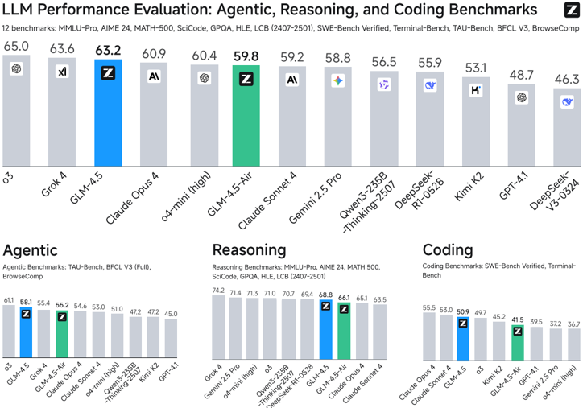

*Figure 1: Average performance on agentic, reasoning, and coding (ARC) benchmarks. Overall, GLM-4.5 achieves a rank of 3rd, with GLM-4.5-Air following at rank 6th. The models listed are evaluated as of July 28, 2025.*

**② 方法 / 架构图**

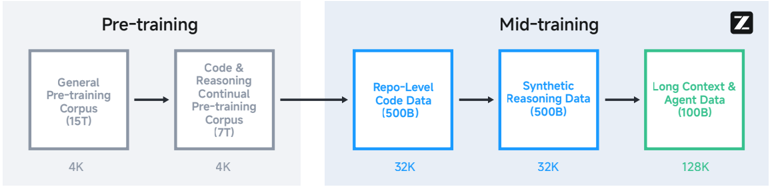

*Figure 3: Pre-training and mid-training stages for GLM-4.5. We adapt a multi-stage training recipe and extend the sequence length from 4K to 128K.*

### 一眼看懂
> 一句话导读：这是 GLM-4.5 的模型技术报告;对本课题最有用的是它的后训练范式——先分域用 RL 把各专家能力推到极致,再用 self-distillation 把多专家合成一个双模通才,agent 侧还周期性把 RL 成果蒸回 SFT 起点。

- 🟦 TL;DR：GLM-4.5 是开源 MoE(总参 355B / 激活 32B,另有 106B 的 Air)**混合推理**模型(支持 thinking + direct 双模,即深思与快答两种模式)。**注意它是模型技术报告,不是单一方法论文。**
  - 与本课题最相关的是它的后训练范式,分**两阶段**:
    - ① Expert Training:分别用冷启 SFT + 专家 RL,训出 Reasoning / Agent / General-chat 三个专家。
    - ② Unified Training:用 **self-distillation**(自蒸馏)把多个专家整合进一个通才。
  - agent RL 部分因为 RL 昂贵,还在 RL 轮次之间插入 **iterative self-distillation**——用 RL 后模型的输出替换冷启数据再做 SFT,把起点抬高后继续 RL【原文 §3, §3.3.2】。
- 最巧的一步：**把"多专家各自 RL 强化 + 再 self-distillation 合并"做成统一通才的生产线**。
  - 反过来验证:抽掉 Unified 阶段的 self-distillation,三个专家就无法在不互相打架的前提下融进一个支持双模的模型。
  - 精髓:**先在各域用 RL 把能力推到边界(探索 / 强化),再用蒸馏把这些边界能力固化进一套参数(巩固)**。
  - agent 侧的 iterative self-distillation 又进一步把"RL 探索的成果"周期性地"固化成新的 SFT 起点",让昂贵的 RL 不必每次从头慢爬。这正是"探索→巩固"在工业级 pipeline 里的体现【原文 §3, §3.3.2】。

### 为什么做
> 一句话导读：目标是单个开源模型同时擅长 Agentic/Reasoning/Coding 三域且支持双模;难点在三域如何共存、RL 数据如何不随能力演化而失配、多阶段训练如何不遗忘长上下文、agent RL 如何不那么慢——self-distillation 与一堆 RL 补丁就是答案。

- 研究背景：LLM 正从知识库走向通用问题求解器。目标是让单个开源模型同时擅长 **Agentic / Reasoning / Coding (ARC)** 三类互相关联的能力——此前 o1/o3、Claude 在单域很强,但开源界缺一个三域全能的模型【原文 §1】。
- 解决的具体痛点(5 个)：
  - (1) 三域能力如何在一个模型里共存,且支持"深思 + 快答"双模。
  - (2) RL 训练中,模型能力随训练演化,会与**静态数据失配**——后期题太简单(reward 全 1)、早期题太难(reward 全 0),两种情况下都没有 reward 方差,也就没有梯度。
  - (3) 多阶段渐增输出长度的 RL,会让模型在短长度阶段"遗忘"长上下文能力,造成**不可逆**的性能下降。
  - (4) agent RL 极其耗时。
  - (5) function call(函数调用)参数里含代码时,JSON 转义负担很重。
  【原文 §3.1, §3.2, §3.3】。

- 相关工作 & 各自不足（来龙去脉 + 精确差异）：
  - ① **闭源单 / 多域强模型**:OpenAI o1/o3、Anthropic Claude Sonnet/Opus 4——单域或综合很强但闭源,开源界缺三域全能。
  - ② **同期开源报告(同样走"专家 / 分域 + RL")**:DeepSeek-R1、Kimi K2、Qwen3-235B——架构借鉴 DeepSeek-V3 / Kimi K2 的 MoE,但 GLM-4.5 **减宽增深**(更少 routed experts、更多层),还用了 2.5× 注意力头、QK-Norm、loss-free balance routing、partial RoPE;后训练上,它把 **self-distillation 当作"多专家 → 统一双模通才"的核心粘合剂**,这点讲得最显式。
  - ③ **多阶段渐增长度 RL**(Polaris 式 [25])——GLM-4.5 §3.2 明确**反对**,主张单阶段 64K 直接训更好(多阶段会 unlearn 长上下文、造成不可逆掉点)。
  - ④ **GRPO [31] 等 group-based RL**——GLM-4.5 在其上**去掉 KL loss 项**,并加了难度课程、token-weighted loss、动态温度等一系列补丁。
  - 这些对比都服务于本报告的核心问题:如何把分域专家无损地融成一个双模通才【原文 §1, §2, §3.2】。
- 动机链：
  - 要单模型全能 ARC → 分域训专家最容易把单域推到极致。
  - 但最终要交付一个模型 → 用 self-distillation 把多专家合成通才。
  - agent RL 太慢 → 在 RL 之间做迭代自蒸馏抬起点。
  - 数据 / 课程 / 长度上各打补丁(难度课程、单阶段 64K、动态温度),防失配与遗忘。
- 与最近邻工作的Δ（精确差异）：相对 Qwen3 / DeepSeek-R1 等同期报告——大家都走"专家 / 分域 + RL",但 GLM-4.5 有 5 点不同:
  - (1) 把 **self-distillation 当作"多专家 → 统一双模通才"的显式核心**;
  - (2) 明确主张 **单阶段 64K RL 优于多阶段渐增长度**;
  - (3) **GRPO 去 KL**;
  - (4) 难度课程的二阶段只用"已验证正确答案池";
  - (5) agent 侧引入 **iterative self-distillation**(RL ↔ 蒸回 SFT 交替)。

### 怎么做（细到可复现的程度——技术报告，后训练脚本未开源）
> 一句话导读：流程是冷启 SFT → 各域专家 RL(GRPO 去 KL + 难度课程 + 单阶段 64K + token-weighted loss)→ 把专家蒸成统一通才(Overall SFT)→ agent RL 与 iterative self-distillation 交替 → general RL。下面逐步拆开。

#### 0. 后训练总体两阶段（§3）

- Stage 1 Expert Training:构造 Reasoning / Agent / General-chat 三个专家。
- Stage 2 Unified Training:用 self-distillation 把三个专家整合成一个支持"深思 + 快答"双模的通才。
- 两个阶段的开头都先做 SFT。

#### 1. Cold-start SFT（§3.1）

- 用少量长 CoT 数据给每个专家打底,确保进 RL 前已具备基础的 chat / 推理 / 工具使用能力。
- Rejection Sampling(拒绝采样)从专家采样时做多级过滤,顺序是:去重复 / 过短 / 截断 / 非法格式 → 客观题做正确性校验 → 主观题用 reward model 过滤 → 工具调用校验是否到达期望终态。
- prompt selection(prompt 筛选)有两招:① 去掉响应长度后 50% 的 prompt,数学 / 科学 +2~4%(只用一半数据);② 对难 prompt 生成 4 个响应,再 +1~2%。

#### 2. Expert RL（§3.2，以 Reasoning RL 为例）

- **RL 目标**：build on GRPO **去掉 KL loss 项**。对每个问题 \(x\) 采 \(K\) 条轨迹 \(\{y_1,\dots,y_K\}\sim\pi_{\text{old}}\)，优化
\(\displaystyle L_{\text{RL}}(\theta)=\mathbb{E}_{x\sim D}\Big[\frac1K\sum_{i=1}^{K}\big(r(x,y_i)-\bar r(x)\big)\Big],\qquad \bar r(x)=\frac1K\sum_{i=1}^{K}r(x,y_i),\)
即优势 = 单条奖励 − 组内平均奖励(group-wise、critic-free)。**只对模型生成的 token 计 loss,环境反馈不计**(agent 设定)。〔注:报告写的目标式没有显式含 importance ratio / clip,呈最简的 group-mean-baseline REINFORCE 形式;推断实际实现仍带 PPO 式 clip〕。

- **难度课程二阶段**(Fig.5):随能力升级换数据;二阶段严格只用"已验证正确答案池"来降噪,从而持续突破天花板(AIME24 81.8% → 83.4%)。
- **单阶段 64K RL**(Fig.6,关键的防遗忘经验):直接在 64K 输出长度训,**不**走多阶段渐增长度。原因是 SFT 已经把模型 condition 到 64K,若再引入短长度 RL 阶段,会让模型 unlearn 长上下文、平均输出变短,造成**不可逆**掉点(多阶段 80.6% vs 单阶段 83.4%)。
- **token-weighted mean loss**(用于 code RL,Fig.7 左):比 sequence-mean 收敛更快、缓解长度偏置、抑制"base case"灌水(LiveCodeBench 46.5 vs 46.3,且更快)〔与 DAPO/HAPO 的 token-mean 取向一致〕。
- **科学 RL 数据质量**(Fig.7 右):只用专家验证的高质量选择题得 65.8,而混杂数据只有 62.9。
- **动态采样温度**:reward 稳定就判为收敛、升温来促多样性;并用 held-out 验证"升温不掉 >1%"做质控。

#### 3. Overall/Unified SFT = self-distillation（§3.1 Overall SFT）

- 从各专家采**百万级**样本(覆盖 reasoning / general chat / agentic / long-context),用 128K 上下文训 base,把多专家能力蒸成一个混合推理通才。
- **混合"带思考"与"无思考"数据**来实现双模(chit-chat 等不需要长思考的域,用无思考数据)。
- function call 用 XML-like 的特殊 token 标签来包裹键值,大幅减少代码段的转义负担。

#### 4. Agentic RL + Iterative Self-distillation（§3.3.2，交替）

- 数据:web-search 用多跳知识图谱自动合成 + human-in-loop 选择性混淆;SWE 用 GitHub PR/issue + 可执行单测,沙箱隔离。
- **Outcome 监督 + process format penalty**:web 搜索用最终答案的准确率当作整条 trace 的奖励;若工具格式错,就 halt(中止)该 trace 并给 **0 奖励**。
- **Iterative Distillation**:因为 agent RL 慢,采取循环——先 RL 抬 agent 性能 → 到一定步数 / plateau → 用 RL 模型的输出替换原冷启数据做 SFT,得到**更强的 SFT 模型** → 再 RL、逐步增难。本质是把"RL 探索成果"周期性地"廉价复用"为 SFT 起点。
- test-time scaling:agent 任务靠增加与环境的交互轮数来扩 test-time compute(Fig.8,BrowseComp 随 browsing effort 平滑上升)。

#### 5. General RL（§3.4）

- 多源反馈:rule-based + human(即 RLHF,用 5000 prompt 跨 7/33/139 类训 reward model)+ model(即 RLAIF,按是否有 GT 分两套 rubric)。
- Instruction Following RL:7 大类 / 151 小类约束,用"确定性规则 + RM + critique"三件套来抗 reward hacking。
- Function Calling RL:分 step-wise rule-based 与 end-to-end multi-turn 两种。
- pathology RL:专治语言混杂 / 重复 / 格式问题。

#### 逐组件必要性（均在**小实验模型**上做受控消融，非 GLM-4.5 本体）

- **难度课程二阶段**：Fig.5 证明持续突破天花板；二阶段只用已验证正确答案池。有消融。
- **单阶段 64K RL**：Fig.6 证明直接 64K 更好;多阶段 unlearn 长上下文致**不可逆**下降。有消融。**这是「防遗忘」的关键经验**。
- **token-weighted mean loss**：Fig.7 左证明收敛更快、缓解长度偏置。有消融。
- **科学 RL 数据质量**：Fig.7 右 65.8 vs 62.9。有消融。
- **动态采样温度**：有机制描述 + 质控阈值。
- **self-distillation / iterative self-distillation**：**作为核心范式陈述，但本报告未给「有 vs 无自蒸馏」的对照消融数字**——靠最终基准背书。〔待核：self-distillation 相对「直接多任务 SFT/RL」的净增益无独立量化〕。

### 靠不靠谱
> 一句话导读：最终基准很硬(12 基准综合第 3、agentic 第 2)且参数更省,但要打个折——所有方法层的消融都在自家小代理模型上做,GLM-4.5 本体只有最终分数,且 self-distillation 的净增益没有单独量化。

- 实验与证据：
  - GLM-4.5(355B/32B)在 12 个基准上综合排第 3、agentic 排第 2;参数远少于多数对手。
  - 关键数字:**TAU-Bench 70.1 / AIME24 91.0 / SWE-bench Verified 64.2 / BFCL v3 77.8 / GPQA 79.1 / BrowseComp 26.4**。
  - **注意**:消融曲线都在"smaller experimental model"(更小的实验模型)上做,**不在 GLM-4.5 本体**上——也就是说,方法有效性的微观证据来自代理模型,本体只有最终分数。
- baseline 公平吗：最终基准对比是同期主流模型的横评(截至 2025-07-28),属标准 leaderboard 式;但**方法层消融用的 baseline 是自家小模型**,外部可比性弱;且没有随机种子 / 方差。
- 假设与失效边界：
  - 【原文】(1) 单阶段 64K RL 的前提是"SFT 已把模型 condition 到生成 64K 长响应"——若 SFT 没充分做长上下文化,则未必成立;(2) 难度课程二阶段依赖"已验证正确答案池";(3) 消融在小模型上做,报告自己也承认"曲线基于较小的实验模型"。
  - 【推断】(4) **self-distillation"整合多专家"可能有能力相消 / 折中**——把三个域的专家压进一个模型,单域峰值能力大概率低于专家本身(报告没量化这层损失,只报通才的最终分);
  - 【推断】(5) iterative self-distillation 反复"RL → 蒸回 SFT",可能累积分布偏移、或过拟合 RL 偏好,长期稳定性没讨论;
  - 【推断】(6) 作为**模型发布仓,它不含后训练训练脚本**,方法细节(λ、课程切点、自蒸馏数据配比)多数未公开,复现性受限;
  - 【推断】(7) 模型含一层 MTP 层,但**只用于推理时的 speculative decoding 加速**(预训练 MTP loss 权重 λ=0.3→0.1,§2.4),不是训练前瞻信号——与本课题"MTP 作前瞻训练探针"无直接交集(只是同名机制的不同用途)。
- 祛魅总结：
  - 真贡献有三块:**(a) 工业级开源 ARC 全能 MoE + 双模混合推理的完整后训练配方;(b) "多专家 RL → self-distillation 统一"与"RL ↔ iterative self-distillation 交替"这两套自蒸馏范式的工程化;(c) 一批实用经验(单阶段 64K 防遗忘、GRPO 去 KL、难度课程、token-weighted loss、动态温度)。**经验密度高,对工程落地有参考价值。
  - 需打折的:(1) **它是技术报告而非方法论文**——self-distillation 的净增益没有独立消融,方法证据多来自小代理模型;(2) 后训练脚本没开源(只发模型权重 + slime 框架),关键超参缺失;(3) "多专家 → 统一"的单域能力损失没量化;(4) MTP 只是加速、与前瞻训练无关,别误读。
  - 【推断】对"探索-巩固"而言,这是**工业级最贴近"巩固"范式的一篇**——但它的"巩固"是粗粒度的"整模型蒸馏 / 重 SFT",不是 token / 路径级的精细固化。

### 结构化抽取

- 🎯 机制速览6轴：
  - **学什么信号** = 多源——专家输出(self-distillation 的 SFT 交叉熵)、可验证 outcome 奖励(reasoning/agent RL,GRPO 去 KL,优势 = 单条奖励 − 组内均值)、RLHF/RLAIF 偏好(general RL)。
  - **改什么** = 策略参数 θ(SFT + RL 交替)。
  - **何时改** = 分阶段(冷启 SFT → 专家 RL → 统一 SFT → agent RL ↔ iterative 自蒸馏 → general RL)。
  - **免梯度?** = 否,SFT + policy gradient。
  - **记忆-技能生命周期** = **把多专家技能蒸馏固化进单套参数**(无外部记忆 / 技能库);iterative self-distillation 把 RL 探索成果周期性固化为新的 SFT 起点。
  - **防遗忘机制** = **显式且关键**——单阶段 64K RL 避免短长度阶段"unlearn"长上下文(图6 是不可逆下降的反例);难度课程防 reward 失配;但跨专家融合的遗忘没量化。
- ⑦ 开源代码+框架/harness：
  - 模型 / 权重仓 https://github.com/zai-org/GLM-4.5(**仅模型发布仓,不含后训练训练脚本**;含 function call 模板等推理侧实现)。
  - RL 框架 **Slime** 单独开源:https://github.com/THUDM/slime。
  - 框架是 **Slime**,组成:Training 用 Megatron 读 Data Buffer + 同步参数;Rollout 用 SGLang + Router 生成数据 / 奖励 / verifier 输出并写回 Buffer;Data Buffer 做桥接。再加 **BF16 训练 / FP8 推理**(在线 block-wise FP8 量化来加速 rollout)+ Ray 调度 + **agent 用全异步解耦**(rollout / training 的 GPU 分离、Docker 高并发隔离环境)。
  - **CloneTier=B:仅记录链接、不 clone 巨型权重仓**(决策①)。〔注:slime 是 RL 框架,不等于完整后训练脚本;社区微调多用 LLaMA-Factory / ms-swift〕
- 💰 资源/成本与可扩展性：
  - 规模 355B/32B-MoE + 106B Air。
  - 预训练:23T tokens、Muon optimizer、batch warmup 16M→64M tokens、lr 2.5e-4→2.5e-5、RoPE base 10k→1M(32K 起)、mid-training 扩到 128K;RL 在 64K 输出长度直接训。
  - **原文没给具体 GPU 数 / 训练 token 成本明细**(技术报告未公开算力)。
  - slime 支持 colocated 同步(reasoning/code)+ disaggregated 异步(agent/SWE)双模,以省 GPU 空转。
- 🎯 对"探索-巩固"对标：**强对标(工业级"巩固"范式 + 可借 pipeline 思想),但粒度粗、机制不同**。
  - ① 直接支撑"巩固":"多专家各自 RL 探索 → self-distillation 合并固化进一套参数"就是本课题"巩固 = 固化进参数且不遗忘"的工业实现。其中 **iterative self-distillation(RL ↔ 蒸回 SFT)是"探索-巩固"循环最清晰的工程案例**——RL 探索得到更好轨迹 → 蒸馏固化为新起点 → 再探索。
  - ② 可借组件(4 个):
    - (a) "RL 探索成果周期性蒸回 SFT 起点"可直接用于 TSRD 的训练节律(student 探索出的成功路径 → 固化 → 再探索);
    - (b) "单阶段 64K 防 unlearn 长上下文"是防遗忘的硬经验;
    - (c) GRPO 去 KL + 难度课程 + 动态温度是即插即用的 RL 配方;
    - (d) 双模(thinking/direct)混合训练对"何时深思 / 何时快答"有参考。
  - 竞品 / 张力 & 缺口:
    - (a) GLM-4.5 的"巩固"是**整模型粗粒度蒸馏 / 重 SFT**——把整个专家分布蒸进通才,**不区分关键步 / 路径分叉、无单点接管、无 teacher 稀疏脚手架**;而 TSRD 主张稀疏脚手架 + path-recovery 单点接管 + MTP 前瞻;
    - (b) 这里的 self-distillation 是"自己的强版本教自己"(teacher = RL 后的自身),与 TSRD"teacher 当稀疏脚手架教探索 / 选路"的精细监督定位不同;
    - (c) MTP 只是加速、不是前瞻信号。
  - 一句判定:**GLM-4.5 提供了"探索(RL)→ 巩固(self-distillation / 重 SFT)"循环的最强工业背书,以及可借的 pipeline 节律(尤其 iterative self-distillation 与单阶段 64K 防遗忘);但它的巩固是整模型粗粒度蒸馏、无 teacher 脚手架 / 无路径级精细化 / MTP 仅加速——是 TSRD 的宏观范式参照系,而非微观机制竞品。**
- 🔭 开放问题/未来方向：
  - 【原文】没设独立的 open problem 章(技术报告);隐含方向 = 继续 scale RL、扩展更复杂的 agent 环境(slime 的异步设计正为此铺路)。
  - 【推断】(1) **self-distillation 整合多专家的单域能力损失需要量化**——能否做"无损 / 近无损"合并(正是 gopd/G-OPD 用 ExOPD 试图解决的方向,可与本报告对照);
  - 【推断】(2) iterative self-distillation 的收敛性 / 分布偏移累积的上界;
  - 【推断】(3) 把粗粒度的整模型蒸馏细化到**关键步 / 路径级**(TSRD 方向)——在 self-distillation 时只对关键决策 token 用更强的监督;
  - 【推断】(4) MTP 从"推理加速"升级为"训练期前瞻探针"(本课题 mtp_opd 的核心设想,GLM-4.5 未触及);
  - 【推断】(5) 后训练脚本未开源,社区复现需补全。

读到PDF? 是（PyMuPDF 全文 26 页;空密码解密;§3 后训练 + GRPO 目标式 + 各 RL 消融图 Fig.5-9 全核）｜L线 L1/L3/L4｜对标结论 强对标(宏观范式):「专家RL探索→self-distillation巩固」+「RL↔iterative自蒸馏」是探索-巩固的工业实现,单阶段64K防遗忘可借;但巩固是整模型粗粒度蒸馏、无teacher脚手架/无路径级精细化/MTP仅加速,是宏观参照非微观竞品｜残留待核 2（self-distillation 净增益与多专家融合的单域能力损失均无独立量化）

---

## Learning beyond Teacher: Generalized On-Policy Distillation with Reward Extrapolation (G-OPD / ExOPD)

> **`gopd`** ｜ 中国人民大学高瓴 + 腾讯 LLM 部（Wenkai Yang 腾讯实习；通讯 Yankai Lin） ｜ arXiv 2602.12125v2, 2026-02-26 · 预印本 ｜ 主题线 L1（OPD/自蒸馏）·相关性 高 ｜ [📄 原始论文](https://arxiv.org/abs/2602.12125)

### 关键图示

**① Motivation / 对比图**

*(a) Multi-teacher distillation results, student model is Qwen34B-Non-Thinking, teachers are domain-specific RL variants*

**② 方法 / 架构图**

### 一眼看懂
> 一句话导读：on-policy 蒸馏(OPD，学生边自己生成边对齐老师)本质上等价于一种特殊的 RL；作者把这层关系点破后，加一个标量旋钮 λ，就能让学生不止「追平老师」、还能「越过老师」。

- 🟦 TL;DR：本文先在理论上证明一件事——**标准 OPD 其实是一种 dense KL-约束 RL 的特例**。这里 dense 指奖励落在每个 token 上(而非只在结尾给一个总分)。它的隐藏约束是：reward 项与 KL 正则**永远 1:1 等权(β=1)**，且作为对照锚点的 reference 模型可以任选（§3.2 Remark, 式7）。
- 点破这层关系后，作者加两个旋钮：**灵活的 reference πref + reward 缩放因子 λ**。
  - λ∈(0,1) 是「插值」：学生落在 ref 与 teacher 之间。
  - **λ>1 是「外推」(ExOPD)**：让学生**越过 teacher 的能力边界**。
- 落地效果：在「把多个领域专家合并回 base」这个设定下，ExOPD 是唯一能让统一学生稳定**超过所有领域 teacher** 的方法（图1a, 表2）。
- 最巧的一步：**把 OPD 改写出一个第三方 reference πref**。这一改写暴露出两样东西——一个隐式奖励 reward=log(π*/πref)，以及一个显式的 λ 权重（式7→式11）。
  - 为什么关键：抽掉这步重写，OPD 就还是「用 reverse-KL 对齐 teacher」的黑盒，λ 和 reference 这两个旋钮根本无处插入。正是这个代数恒等变形（OPD ≡ 带特定 reward 的 dense RL）解锁了「外推超越 teacher」的可能。
  - 工程代价极小：它不改任何训练循环，只改 token 级 advantage 的计算式（式14）。

### 为什么做
> 一句话导读：OPD 实测好用但大家不清楚它为什么好用、能挖多深；标准版还把两个本可调的旋钮焊死了——既不能让学生「精确停在老师和初始之间某一点」，也不能「超过老师」。

- 研究背景：OPD 指学生采样自己的轨迹、然后在每个 token 上用 reverse KL 对齐 teacher 的 logit。它已被证明在经验上比两类对手更快更有效——一是 off-policy 蒸馏(即直接拿 teacher 输出做 SFT)，二是纯 RL。它有两大应用：
  - (a) 多任务后训练：把不同领域的 RL 变体能力(近乎)无损地合并回 base(Xiao 2026/MiMo-v2)；
  - (b) 强弱蒸馏：把大模型的能力蒸到小模型(MiniLLM/Qwen3)。【原文 §1, §2】
- 解决的具体痛点：
  - **机理不清**——OPD 经验有效，但大家对它的机制理解有限、潜力也没挖透（"a mechanistic understanding of OPD remains limited", §1）。
  - **旋钮被焊死**——标准 OPD 把 reward:KL 比例写死成 1:1、把 reference 写死为学生的初始策略。结果是**缺少一个调节「学生最终落在哪」的旋钮**：既不能精确「落在老师和初始的中间」(budget-controlled)，也无法「超越 teacher」。

- 相关工作 & 各自不足（§2 仅两段，但语境可补全到「四条平行路线」）：
  1. **Off-policy 蒸馏 / 黑盒 KD**：训练数据来自 **teacher 生成的轨迹**，而非学生自己跑出来的。具体两种做法——对 token logits 做 KL（Hinton 2015；Sanh 2019 DistilBERT；Kim & Rush 2016 SeqKD），或直接拿 teacher 的 token 做 cross-entropy SFT（Alpaca, Taori 2023；LIMA, Zhou 2023；OpenThoughts, Guha 2025）。
     - 短板：**本质是 off-policy**——学生只在模仿 teacher 的行为，并没有从「自己动作引出的奖励」里学，所以 **测试时遇到相似问题难以适配/泛化**（§3.1 原话）。这是 G-OPD 整篇的对立面。
  2. **标准 On-policy 蒸馏（最近邻、本文要推广的对象）**：代表作有 GKD（Agarwal 2024）、MiniLLM（Gu 2024，强调 reverse-KL）、Thinking Machines 的 OPD blog（Lu & Lab 2025）、Qwen3 用 OPD 做强弱蒸馏（Yang 2025a）、Xiao 2026（MiMo-v2 用 OPD 把多领域 RL 能力合并回 base）。
     - 短板：经验有效，但 **上限被 teacher 卡死**(OPD 的最优解就是 teacher 分布)、机理不清、reward:KL 写死 1:1。**G-OPD 正是把这一族放开 λ 与 ref**。
     - 另有三条 OPD 子方向被点名：跨模型家族 OPD（Patiño 2025）、黑盒 OPD（不需 teacher logits，Ye 2025a）、in-context 自蒸馏（把上下文里的信息蒸进参数：Yang 2025c, Hübotter 2026, Shenfeld 2026, Zhao 2026 SDR, Penaloza 2026）。
  3. **权重空间外推 ExPO**（Zheng 2025，直接 baseline）：先把多个对齐模型的权重平均，再沿「平均点指向 base」的反方向外推（外推因子 α∈{0.25,0.5}）。它 training-free(无需再训练)，但**不可控、不保证超过所有 teacher**（表2 多项掉分）。
     - **G-OPD 的差异**：在**输出分布/奖励空间**外推，而非权重空间；可控，且实证上是唯一全面超 teacher 的方法。
  4. **隐式奖励 RL（同形物）**：所谓隐式奖励，是指不用单独训一个奖励模型、而是用两个策略的对数概率之比当奖励。代表：DPO 的 r=β·log(πθ/πref)（Rafailov 2023）；PRIME/free process reward 用 log(πθ/πref) 当 dense reward（Cui 2025, Yuan 2024）；LASER 在最后一个 token 上自给奖励（Yang 2025d）。
     - **G-OPD 的 reward=log(π*/πref) 与它们形式相同**，但有个关键差异（§3.2(1)）：这里的 π* **不必**是「从 πref 出发跑 RL」得到的，**甚至可以和 πref 不同尺寸**——只要两者的 log-prob 之差仍是有意义的信号即可。

- 动机链（一步步推）：
  1. OPD 有效，但是个黑盒。
  2. 证明它 = dense RL 的特例(β=1, ref 任选, 式7)。
  3. 既然是 RL 特例，就能把焊死的 β(即 λ) 和 ref 放开。
  4. 放开后：λ>1 外推让学生越过 teacher(式12)；把 ref 换成 teacher 跑 RL 前的 base，可纠正奖励(式13)。
  5. 最终结果：多 teacher 合并时，它是唯一能全面超越各 teacher 的方法(表2)。
- 与最近邻工作的精确Δ：
  - vs **标准 OPD**：多了 λ 与灵活 ref。当 λ=1 且 ref=学生初态时，第二项 (λ−1)(…)=0，于是**精确退回原版 OPD**（式14）。而 λ>1 是质变——从「逼近 teacher」变成「超越 teacher」。
  - vs **ExPO（权重空间外推）**：G-OPD 在输出分布上外推，保证多 teacher 全面超越（表2 里 ExOPD 是唯一全绿的方法）；ExPO 是平均权重再外推，不可控（表2 多项打负号）。
  - vs **隐式奖励 RL(PRIME/Eurus/DPO)**：两者都用 log-ratio 当 dense reward，但 G-OPD 解绑了两条隐含假设——「π* 必须从 πref 跑 RL 得到」和「两者必须同尺寸」（§3.2(1)）。

### 怎么做 + 靠不靠谱
> 一句话导读：整套流程不改训练循环，只在算 token 级 advantage 时换一个公式(式14)；核心就是「原 OPD 项 + 一个由 λ 控制的外推位移」。下面的符号和步骤照着就能复现。

#### 方法流水线（读完可复现，全部基于 §3 + 式7~14 + §4.1.1）
**符号**：D=输入分布；πθ=学生（待优化的策略）；π*=teacher；πref=参考模型（默认取学生初态 πθ 的冷启 checkpoint）；λ=reward 缩放因子（一个标量超参，默认在 {0,0.25,…,1.5} 里扫，多 teacher 设定固定为 1.25）。

1. **造 teacher**（同尺寸设定下）：拿学生 base（Qwen3-4B-Non-Thinking），分别在 math/code 数据上跑 GRPO（Shao 2024）。奖励是可验证的 0/1（math 看答案对不对、code 看是否过全部单测），得到领域 teacher `Qwen3-4B-Non-Thinking-RL-Math/Code`。强弱设定则直接用大模型 `Qwen3-30B-A3B-Instruct-2507` 当 teacher。
2. **选 πref**（三种情形）：
   - ① 多 teacher 合并→base：πref **自然就是原 base**，此时 reward=log(π*/π_base) 恰好是式10 那个「良定义的隐式奖励」。
   - ② 强弱蒸馏的默认：πref=**学生 base** πstudent_base（只需 π* 和学生 base 两个模型）。
   - ③ 强弱蒸馏 + reward correction：πref=**teacher 跑 RL 前的 base** πteacher_base（需要额外持有这个模型）。
3. **on-policy 采样**：学生自己采轨迹 y~πθ(·|x)（temperature 1.0, top-p 1.0, max_response 16384；评测时 math 每题 32 解、code 每题 4 解）。训练中对 GRPO 与 G-OPD 都做 **token-level rollout correction**（Liu 2025b "When speed kills stability"），用来缓解训练和推理引擎之间的 mismatch。
4. **逐 token 算 G-OPD advantage**（式14，承重公式）：
   \(\displaystyle A_t^{\text{G-OPD}}=\big[\log\pi_\theta(y_t\mid x,y_{<t})-\log\pi^*(y_t\mid x,y_{<t})\big]+(\lambda-1)\big[\log\pi_{\text{ref}}(y_t\mid x,y_{<t})-\log\pi^*(y_t\mid x,y_{<t})\big].\)
   直觉(两项分别干什么)：

   - 第一项 = 原版 OPD 的 token 级 advantage（学生 log-prob 减 teacher log-prob，衡量学生偏离 teacher 多少）。
   - 第二项 = 外推位移，把目标从「对齐 teacher」继续往前推到「teacher 之外、沿 (λ−1)·(teacher−ref) 方向」。
   - λ=1 时第二项消失，退回原 OPD。
5. **policy gradient 更新**（式13/14 的梯度形式）：
   \(\displaystyle \nabla_\theta J_{\text{G-OPD}}(\theta)=\mathbb{E}_{x\sim D,\,y\sim\pi_\theta(\cdot\mid x)}\Big[\textstyle\sum_{t=1}^{T}A_t^{\text{G-OPD}}\,\nabla_\theta\log\pi_\theta(y_t\mid x,y_{<t})\Big].\)
   在 veRL 实现里：开关 `only_reverse_kl_advantages=True`、传 `lambda_vals=λ`。**注**：这里 discount factor=0（即只看 next-token 的优化，沿用 Lu & Lab 2025 / Xiao 2026）；也就是把式5 的双重求和近似成式6 的单 token 形式。

#### 关键算法/损失的真实形式 + 直觉（全部从 §3.2 抄准）
> 一句话导读：这一串公式其实就一条主线——把 OPD 的 reverse-KL 目标(式4)恒等改写成「隐式奖励 − KL 约束」的 RL 形式(式7)，再塞进一个 λ(式11)，就得到「插值/外推/纠偏」三合一。读时盯住 λ 取值在哪、ref 选谁即可。

- **OPD 目标（出发点，式4）**：\(J_{\text{OPD}}(\theta)=\min_\theta \mathbb{E}_{x\sim D,\,y\sim\pi_\theta(\cdot\mid x)}\big[D_{\mathrm{KL}}(\pi_\theta(y\mid x)\,\|\,\pi^*(y\mid x))\big]\)。注意 y 由学生自己采 ⇒ 这是 on-policy；用的是 **reverse KL**（学生在前、teacher 在后）。
- **核心恒等变形（式7，全篇支点）**：引入第三方 πref，把 reverse KL 拆成「隐式奖励 − KL-to-ref」两块：
  \(\displaystyle J_{\text{OPD}}(\theta)=\max_\theta \mathbb{E}\Big[\underbrace{\log\tfrac{\pi^*(y\mid x)}{\pi_{\text{ref}}(y\mid x)}}_{r(x,y)}-D_{\mathrm{KL}}\big(\pi_\theta(y\mid x)\,\|\,\pi_{\text{ref}}(y\mid x)\big)\Big].\)
  **Remark（这步在说什么）**：上式正是式2 那个 KL-约束 RL，对应关系是——reward \(r=\log(\pi^*/\pi_{\text{ref}})\)、KL 加在 πθ 与 πref 之间、且 reward:KL 的比例**永远 1:1（β=1）**。πref 怎么选都不影响化简回式4，因为 log πref 项在两处会抵消。

- **token 级隐式奖励（式9）**：\(r_t^{\text{OPD}}=\log\dfrac{\pi^*(y_t\mid x,y_{<t})}{\pi_{\text{ref}}(y_t\mid x,y_{<t})}\)。它与 DPO 的隐式奖励（式10：\(r=\beta\log\tfrac{\pi_\theta}{\pi_{\text{ref}}}+\beta\log Z(x)\)）形式相同——因为 log Z(x) 只依赖 x，所以 log-ratio 是「真奖励」的一个良定义代理。
  - 一个对比：RL 的奖励是稀疏的（式8：只有末 token 有 outcome reward，其余为 0），而 OPD 是 **dense 的——每个 token 都有奖励**。
- **G-OPD 目标（式11，加上 λ）**：\(J_{\text{G-OPD}}(\theta)=\max_\theta \mathbb{E}\big[\lambda\log\tfrac{\pi^*(y\mid x)}{\pi_{\text{ref}}(y\mid x)}-D_{\mathrm{KL}}(\pi_\theta\,\|\,\pi_{\text{ref}})\big]\)，其中 \(\lambda=1/\beta\)（即把上面焊死的 β 松开成可调）。
- **最优解（式12，看懂插值/外推就靠它）**：
  \(\displaystyle \log\pi_\theta(y\mid x)=\lambda\log\pi^*(y\mid x)+(1-\lambda)\log\pi_{\text{ref}}(y\mid x)=\log\pi^*(y\mid x)+(\lambda-1)\big(\log\pi^*(y\mid x)-\log\pi_{\text{ref}}(y\mid x)\big).\)

  - \(0<\lambda<1\)（**reward interpolation，插值**）：学生 log-prob = teacher 与 ref 的**线性插值**（等价于把 reward 换成 λ·r+(1−λ)·0）。学生的行为（精度、长度）落在 base 与 teacher 之间，且随 λ 增大单调逼近 teacher——于是可以做 **budget-controlled reasoning**（按预算控制推理深浅，图2/3/4）。
  - \(\lambda>1\)（**reward extrapolation = ExOPD，外推**）：在匹配 teacher 之外**再加一段位移** (λ−1)(log π*−log πref)，把学生推到 teacher 分布之外。
- **reward correction 的等价改写（式13，强弱蒸馏的关键）**：
  \(\displaystyle J_{\text{G-OPD}}(\theta)=\max_\theta \mathbb{E}\Big[(\lambda-1)\log\tfrac{\pi^*(y\mid x)}{\pi_{\text{ref}}(y\mid x)}-D_{\mathrm{KL}}\big(\pi_\theta\,\|\,\pi^*\big)\Big].\)
  在同等 KL 强度下，选 \(\pi_{\text{ref}}=\pi^{\text{teacher}}_{\text{base}}\)（teacher 跑 RL 前的 base）更合理：

  - 此时 reward \(\log(\pi^*/\pi^{\text{teacher}}_{\text{base}})\) 恰好是 teacher 自身 RL 后训练所诱导的**良定义隐式奖励**（按式10）；
  - 而原来的 \(\log(\pi^*/\pi^{\text{student}}_{\text{base}})\)，因为师生两个 base 之间存在**内在的知识/容量鸿沟**，信号更 noisy。
  - 做法：给默认 reward 加上修正项 \(\log(\pi^{\text{student}}_{\text{base}}/\pi^{\text{teacher}}_{\text{base}})\)，就得到校正后的 reward。
  - 代价：需要额外持有 πteacher_base，并多算一次这个更大的 ref 的 logprob。

#### 逐组件必要性（消融与失效边界）
> 一句话导读：λ 是唯一的核心旋钮，证据也最足；但它有个明确的失效点——λ 调到 1.5 学生就会去「钻奖励的空子」而崩。

- **λ（reward 缩放因子）**：核心旋钮。消融方式=扫 λ∈{0,0.25,…,1.5}（图2/3/4）。λ=0 退回学生初态、λ=1 退回 OPD。证据充分：
  - λ<1：性能/长度单调地介于 base 与 teacher 之间；
  - λ=1.25：一致优于 OPD 且超过 teacher；
  - **λ=1.5：反而不稳、退化**。作者的解释是学生在「hack 隐式奖励」——即激进地去拟合 log-ratio 的峰值，哪怕某些 token 因为 bias 有过大的 log-ratio（§4.1.2）。这是关键的失效边界证据。
- **灵活 reference / reward correction**：图6 消融——强弱蒸馏里把 ref 从学生 base 换成 teacher-pre-RL base，math/code 各 +0.6/+1.0%（1.7B 学生：math 28.1（无修正）vs 28.7（有修正）；code 51.3 vs 52.3）。**作者诚实标注了代价**：需额外持有 teacher-pre-RL 模型，并多算更大 ref 的 logprob。
- **多 teacher 合并 vs 单 teacher**：表2 证明，把 λ=1.25 固定不调，多 teacher 设定下 ExOPD 是唯一能全面超越两个 teacher 的方法（SFT/ExPO/OPD 都有项掉分）。
- 关键机制直觉补充（训练动态，图5）：ExOPD 比 OPD **训练奖励更高、响应更长、熵更高**；作者把熵升归因于「响应变长带来的多样性增加」。

- 实验与证据：
  - 配置：base/student=Qwen3-1.7B/4B-Non-Thinking；teacher=对 4B 做领域 GRPO 得到的 RL-Math/RL-Code，以及强弱设定下的 Qwen3-30B-A3B-Instruct-2507。
  - 数据：DeepMath(He 2025)过滤后 57K(难度≥6) + Eurus-RL-Code(Cui 2025) 25K；蒸馏数据与 RL 数据同源。
  - 评测：AIME24/25、HMMT25(Feb/Nov)、HumanEval+/MBPP+/LiveCodeBench(v6 only, 2025-02~05)；math 用 Math-Verify 验证。
  - 关键数字：
    - 单 teacher math：**ExOPD 48.0 vs teacher 46.0 vs OPD 46.5 vs ExPO 45.8**(表2)；
    - 强弱蒸馏 4B-student：**ExOPD 45.3 vs OPD 42.6 vs SFT 35.1**(表3)；
    - 1.7B-student：**25.4 vs OPD 23.1 vs SFT 13.5**(表3)；
    - 关键对照：ExOPD 只跑 50 步就拿 47.5 avg(表1 math 列实为 48.0)，已超过「teacher 再继续 RL 100 步」的 46.9(表1)——这就排除了「teacher 只是训得不够」的解释。
- baseline 公平吗：较公平。
  - OPD/SFT/ExPO 在同数据、同轨迹数、同步数下对比(§4.1.3、附录B)；SFT 的轨迹数与 OPD/ExOPD 对齐；多 teacher 设定下还把 math 数据下采样到与 code 等量。
  - 还专门做了两个对照：「teacher 继续 RL」(表1) 和「teacher 充分训练 1200 步」(附录C 表8，此时 ExOPD 增益缩到 +0.3~0.6%)。
  - **这点很关键且诚实**：附录C 说明，当 teacher 已经被 RL 充分榨干，ExOPD 能再超越它的空间就很小了。
- 假设与失效边界：
  - 【原文】(1) λ 过大(1.5)会去 hack 隐式奖励、导致不稳退化；(2) reward correction 需要拿得到 teacher-pre-RL + 额外算力；(3) 附录C 显示 teacher 充分训练后 ExOPD 优势大幅缩水。
  - 【推断】(4) 「超越 teacher」的本质是**沿 teacher 已学方向的外推**——只在 teacher 还没收敛/欠训、且外推方向恰好仍指向正确分布时才成立。它并不凭空创造新能力，而是「把 teacher 没走完的那段路替它走完」（依据：式12 的外推位移沿 (π*−πref) 方向 + 附录C 证据）。
  - 【推断】(5) 多 teacher 当前实现**只支持两个 teacher**(README)，更多/更异质的 teacher 未验证(作者列为 future work)。
  - 【推断】(6) ExOPD 有个副作用：响应变长(图4/5)。作者归因于隐式奖励的长度偏置(引 Yang 2025d LASER)——也就是说，长度膨胀可能换来的是虚高的分数。
- 祛魅总结：
  - 真贡献=**(a)** OPD ≡ dense-RL(β=1) 这座干净的理论桥；**(b)** 用 λ/ref 两个旋钮把「插值/外推/纠偏」统一进一个框架；**(c)** 多 teacher 合并能全面超 teacher 的实证。理论与实验都较扎实、对照也诚实。
  - 需打折的：「learning beyond teacher」这个标题略大——附录C 自己就证明了 teacher 充分训练后超越幅度趋近于零。所以「超越」其实是**欠训 teacher 上的外推红利**，不是凭空涨能力；而且增益普遍在 +1~3% 量级、还伴随响应变长。
  - 【推断】对「探索-巩固」这是**最贴近的 L1 工作之一**：多 teacher→统一学生，正是「把多路能力巩固进一套参数」；λ 旋钮则相当于「巩固强度」的连续控制器。

### 结构化抽取

- 🎯 机制速览6轴：
  - **学什么信号**=teacher 在学生轨迹上的 token 级 logit（即 reverse-KL/隐式奖励 log(π*/πref)，dense、每个 token 都有）；
  - **改什么**=学生策略参数 θ；
  - **何时改**=on-policy 蒸馏训练的每一步（学生采自己的轨迹）；
  - **免梯度?**=否，是 policy gradient；
  - **记忆-技能生命周期**=把多领域 teacher 的技能**合并固化进单套参数**（multi-teacher→unified student），没有外部记忆/技能库；
  - **防遗忘机制**=间接——OPD 本身被定位为「(近乎)无损地把各 RL 变体能力合回 base」的多任务范式(引 Xiao 2026)，KL-to-ref 约束抑制漂移；但 λ>1 外推反而**增加**偏离 ref 的风险(过大即 hack)。
- ⑦ 开源代码+框架/harness：https://github.com/RUCBM/G-OPD （已 clone ~33MB，Tier A，README 已核）。
  - 框架=**veRL v0.6.1**(volcengine/verl，HybridFlow，引 Sheng 2024) + vLLM/SGLang rollout；含 verl/、math_eval/、code_eval/(基于 Absolute-Zero-Reasoner/EvalPlus/LiveCodeBench)。训练数据已开源(HF: Keven16/G-OPD-Training-Data)。
  - **额外亮点**：README 2026-03 更新了一份**自研的 on-policy self/context-distillation (OPSD)** 代码(`run_qwen3-4b-context-distill.sh`、`ref_input_utils.py`)。它的 teacher 分布 = 学生自己在「额外上下文(GT 解/反馈/高层经验)」下的 in-context 分布；teacher 权重固定为学生初态、不做 EMA(避免崩溃)。
- 💰 资源/成本与可扩展性：8×A800/H 级 8 卡(n_gpus_per_node=8)；batch 1024、rollout n=1、max_response 16384、lr 1e-5。G-OPD 只需 50 步(同尺寸)/100 步(强弱)，**步数极少**(作者说再多步反而过拟合)。额外成本：λ≠1 要多算一次 πref 的 logprob；reward correction 因 ref 更大、成本更高。
- 🎯 对"探索-巩固"对标：**强对标(支撑+可借组件)**。判定依据：
  - ① **巩固侧直接命中**——multi-teacher→unified student，就是「把多条已走通的路径(领域专家)固化进一套参数、且尽量不互相遗忘」，λ 就是巩固强度旋钮。
  - ② **可借组件**：
    - (a) λ>1 外推 =「让学生沿 teacher 指引的方向再多走一步、越过脚手架」(式12 外推位移)，与 TSRD「teacher 当稀疏脚手架、最终要学生自己走得更远」的精神一致；
    - (b) README 里的 **OPSD(on-policy 自/上下文蒸馏)** 几乎是 TSRD 的现成骨架——teacher = 学生加了「GT 解/反馈/经验」后的自身分布，正好对应「探索(给上下文提示找到路)→ 巩固(蒸回无上下文的参数)」。
  - 竞品风险：G-OPD 是 teacher-driven 的 dense 全程对齐，而 TSRD 主张**稀疏脚手架 + 学生自选恢复分支**。G-OPD 不区分「关键步/非关键步」、不做单点接管，这正是差异化空间。
  - 缺口：无 MTP/前瞻、无「走偏后自选恢复」的显式机制、无路径选择信号。
- 🔭 开放问题/未来方向：
  - 【原文】(1) 在更大模型上验证 ExOPD 泛化性；(2) 更广、更异质的多 teacher 集合下的鲁棒性；(3) 跨模型家族(不同 family)的 OPD。
  - 【推断】(4) λ 当前是全局常数——可否做 **token/step 级自适应 λ**（关键推理步外推强、常规步保守）？这天然连接 hapo/holderpo 的「token 异质」与本课题的「关键步接管」。
  - 【推断】(5) 把 OPSD 的「上下文=高层经验」推向 agent 自进化（探索得到的成功轨迹经验 → 上下文 → 蒸回参数）。
  - 【推断】(6) 缓解 λ>1 的 reward-hacking 与长度膨胀(需要一个长度无关的隐式奖励)。

key|读到PDF?|L线|对标结论|残留待核数
gopd | 是(全文17页) | L1 | 强对标:multi-teacher→统一学生=巩固多路径进参数;λ外推=越过脚手架;README的OPSD自蒸馏近似TSRD骨架。差异:全程dense无稀疏脚手架/无单点回轨 | 0

---

## Hybrid Policy Distillation for LLMs (HPD)

> **`hpd`** ｜ 上海交大 / 上海创智学院 / 腾讯(Wenhong Zhu, Ruobing Xie, Rui Wang, Pengfei Liu) ｜ 2026-04-23 Preprint·arXiv 2604.20244v1(README 称 ICML 2026,正文未见〔待核〕) ｜ 主题线 L1 OPD/自蒸馏 · 相关性 高 ｜ [📄 原始论文](https://arxiv.org/abs/2604.20244)

### 关键图示

**① Motivation / 对比图**

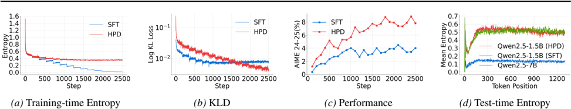

*Figure 1. Comparison of training dynamics between SFT and HPD.*

**② 方法 / 架构图**

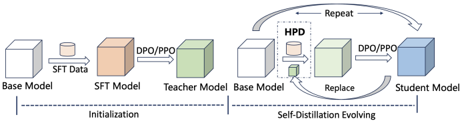

*Figure 4. Self-distillation Evolving. Stage 1: SFT + DPO/PPO initialization. Stage 2: Iterative self-distillation with teacher model updates, while keeping the SFT data fixed.*

### 一眼看懂

> 一句话导读：本文先把一堆白盒蒸馏方法证明成"同一个目标、只是 token 权重不同",再用一个廉价的逐 token 信号自动决定该往哪个方向蒸,既省算力又不熵崩。

- 🟦 TL;DR:白盒知识蒸馏(white-box KD,即让小模型直接对齐大模型输出的概率分布,而不只是看大模型生成的文本)长期被三个互相纠缠的旋钮卡住:
  - 散度方向:前向 KL(FKL)还是反向 KL(RKL);
  - 优化方式:当成损失(loss)还是当成奖励(reward);
  - 数据来源:on-policy(用 student 自己生成的样本)还是 off-policy(用固定数据集或 teacher 生成的样本)。
- 本文分两步走。第一步,把 SFT / SeqKD / FKLD / RKLD / JSD 统一写成同一个"token 级重加权对数似然"目标——这些方法形式上只是权重 w 取值不同(见 Eq.9 / Table 1)。第二步,提出 HPD:对每个 teacher token,用 K1 估计器(Schulman 2020 提出的一种廉价 KL 估计方法)逐 token 判断 student 是低估还是高估了这个 token;据此自适应地在前向 / 反向 KL 之间切换,并把被抑制 token 的概率质量重新导回 teacher token。这样既保留 one-hot 监督(即只用单个正确 token 当标签)的省算力优点,又能兼容 off-policy 数据,还附带一个轻量近似 on-policy 的采样步(在 offline 前缀下让 student 采一个非专家 token,用来识别并压制"不合理行为")。
- 最巧的一步:**把 K1 估计器的符号当作"前向 / 反向 KL 的自动开关"**(Eq.11-12)。具体地:
  - `k1>0`(student 低估了 expert token,即给它的概率太低)→ 加一个前向 KL 式的增强权重 `p(a*|s)+k1`;
  - `k1≤0`(student 已经高估它)→ 取负权重做抑制,等价于反向 KL 的行为。
- 为什么这一步是全篇支点:抽掉它(改回固定系数加权和的 FKL+RKL)就退回成普通的 weighted-sum 蒸馏,失去"逐 token、按需、无超参"的混合,训练动态会像 SFT 一样早早熵崩(Fig.1a)。它同时解决了两个痛点——"方向怎么选"和"不引入额外超参"。

### 为什么做

> 一句话导读:已有蒸馏工作都只动"散度方向"这一个旋钮,作者认为光选散度不够,三个旋钮得放进一个统一视角里一起调。

- 研究背景:压缩大模型常靠知识蒸馏(KD);白盒 KD 能利用 teacher 的预测分布做分布级匹配(即在 logits 上算 KLD)。近年工作强调要选对散度(Cho & Hariharan 2019; Ko 2025),但作者指出"光选散度不够"(§1, 引 Zhang 2025)。
- 解决的具体痛点(三轴各自的毛病):
  1. 三轴(散度方向 / 优化策略 / 数据 regime)被孤立选择、缺统一视角【原文 §1】。
  2. FKL 促 mode coverage(覆盖所有模式)但过于平滑(Gu 2023)。
  3. RKL 促 mode-seeking(聚焦少数高概率模式)但师生差距大时不稳(Lu & Lab 2025)。
  4. OPD(on-policy distillation)能避免训练-推理失配,但 teacher 侧对 student 生成的输出有分布漂移,且开销大(Ko 2024)。

- 相关工作 & 各自不足(§1 + §8 + Table 1,按三轴补全):
  1. **Off-policy / 黑盒蒸馏**:直接拿 teacher 生成的内容当 SFT 数据(Guo 2025; Zhu 2026);能访问 teacher 时,用散度 loss 对齐分布。其中三类"找更好目标"的工作:
     - **Wen 2023** 系统比较各种 f-散度(TV 距离、JSD)在自回归 LM 上的表现;
     - **Wu 2025** 给出自适应 KL,平衡 FKLD / RKLD 的早期行为;
     - **ABKD (Wang 2025)** 用 α-β 散度,对 teacher / student 间的概率质量分配做有原则的控制。
     - 短板:**各自只动散度这一轴**,未统一三轴、无"逐 token 自适应方向"机制。
  2. **散度方向(FKLD vs RKLD)**:
     - FKLD(Kim & Rush 2016 SeqKD)促 mode coverage、重罚 missing mode(Song 2020);但 student 容量不足时**过平滑地铺开所有 mode**(Gu 2023; Wang 2023)。
     - RKLD 促 mode-seeking、聚焦 teacher 的高概率 mode;但低概率的有效输出被欠表征(Wang 2025),且师生失配时**无界的 log-ratio 引入高方差,导致不稳**(Ko 2024)。
     - HPD 用 K1 符号逐 token 在二者间切换。
  3. **On-policy 蒸馏(最近邻,直接 baseline)**:
     - **MiniLLM**(Gu 2023)强调用 reverse-KL 抑制 student 高估 teacher 低概率区;
     - **GKD**(Agarwal 2024)核心是用 on-policy 的 student 序列;
     - **DistiLLM-2**(Ko 2025)做对比式蒸馏——同时升高 teacher 序列似然、降低 student 序列似然,off/on-policy 数据都用。
     - 短板:全分布 on-policy 监督**贵**(teacher 要在线 forward)。HPD 改用 one-hot 风格 + offline 前缀 + 单 token 采样来**近似** on-policy,省算力。
  4. **优化策略(loss vs reward)**:K1 既可当 token 级的 reward penalty(如 PPO, Schulman 2017),也可当显式的 loss 项(如 GRPO, Shao 2024)。近期一类 OPD 框架(Lu & Lab 2025)就是在 student 采样的 token 上,算 teacher log-prob 的负 K1 当 reward——梯度无偏、稳(Shah 2025)。HPD 统一到 loss 视角(Eq.9)。

- 动机链(现状 → 缺陷 → 结论):
  - 现状:三轴孤立、单向散度各有缺陷、OPD 贵。
  - 缺陷:无法同时兼得"双向散度的互补性 + one-hot 效率 + on/off 兼容"。
  - 结论:所以必须把 KD 统一成重加权似然,并用一个廉价的逐 token 估计器自动调方向 + 用轻量采样近似 on-policy。
- 与最近邻工作的精确 Δ:
  - 相对 weighted-sum KL(用固定系数混 FKL / RKL):HPD 用 **mask + K1 符号** 做逐 token、无超参的方向选择,并显式把被压制 token 的概率质量"重定向回 expert token"(Reinforce 操作,Eq.14)。
  - 相对 GKD / MiniLLM 的全分布 on-policy 监督(贵):HPD 用 one-hot 风格 + offline 前缀 + 单 token 采样来近似,省算力。

### 怎么做 + 靠不靠谱

> 一句话导读:核心就一个公式骨架(重加权似然)加一段算法——用 K1 的正负给每个 token 派权重;实验证明它能治住 SFT 的熵崩,但"on-policy"其实是单 token 近似,名头略大于实质。

#### 问题建模(§2,读懂符号)
把 next-token 生成当成一个序贯决策问题。轨迹 \(\tau=(s_1,a_1^*,\dots,s_T,a_T^*)\) 来自 offline 数据 D。其中:状态 \(s_t=a_{<t}^*\)(即 GT 前缀,已知的正确历史 token),\(a_t^*\in V\) 是该步的专家 token。student 策略记为 \(q_\theta(a_t\mid s_t)\),teacher 分布记为 \(p\)。预训练就是用 teacher forcing 最小化 NLL(Eq.1)。痛点(§2):容量有限的 student 面对高度多模态的 teacher / 数据分布时,会把概率质量**稀释到太多 mode 上**,从而损害生成质量。

#### 统一视角(§4.1,全篇地基)
所有 KD(SFT / FKLD / RKLD)统一为 **token 级重加权对数似然**(Eq.9):
\(\displaystyle \mathcal{L}(\theta)=\min_\theta\ -\mathbb{E}_{(s_t,a_t)\sim D_\pi}\big[w(a_t\mid s_t)\,\log q_\theta(a_t\mid s_t)\big],\)
其中 \(D_\pi\) 是数据源:on-policy 取自 \(D_{\pi_\theta}\),off-policy 取自固定集 D 或 teacher \(D_{\pi_T}\)。权重 \(w\) 捕捉师生在状态 \(s_t\) 处对 token \(a_t\) 的局部差异(Table 1):

- **SFT**:\(w=\mathbb{1}[a_t=a_t^*]\)(即常数 1);
- **FKLD/SeqKD**:\(w=p(a_t\mid s_t)\);
- **RKLD**:\(w=\log p(a_t\mid s_t)-\log q_\theta(a_t\mid s_t)\);
- **JSD**:\(w=\tfrac12 q\cdot(\log q-\log\tfrac{p+q}{2})\)。

关键洞察(Eq.10,跨整个词表的梯度):对采样到的 token \(a_t\),
\(\displaystyle -\frac{\partial \mathcal{L}(\theta)}{\partial z_v}\propto \begin{cases}\hat w_t\,q_v(1-q_v), & v=a_t,\\[2pt]-\hat w_t\,q_{a_t}q_v, & v\neq a_t,\end{cases}\)
其中 \(z_v\) 是 token v 的 logit,\(\hat w_t=w(a_t\mid s_t)\)。直觉:**正权重升高该 token 似然;负权重则抑制它,并把它的概率质量按当前分布摊给其他 token**——这正是 reverse K1 的天然行为。

#### KL 的 MC 估计(§3.3)
KLD 精确计算需要遍历整个词表(Eq.4),不可行,所以改用蒙特卡洛(MC)近似。最简单的 K1 估计器(Eq.8):
\(K_1\triangleq\tfrac1N\sum_i \log\dfrac{q_\theta(a_t^{(i)}\mid s_t)}{p(a_t^{(i)}\mid s_t)},\ a_t^{(i)}\sim q_\theta\)。
它是 \(D_{\mathrm{KL}}(q_\theta\|p)\) 的**无偏估计,但方差高**(因为 log-ratio 对大部分样本都是负值)。

#### HPD 方法流水线(Algorithm 1,读完可复现)
对每个 offline 样本 \((s_t,a_t^*)\):

1. **算 expert token 的 reverse-K1 gap**(Eq.11):
   \(\displaystyle k_1=q_\theta(a_t^*\mid s_t)\big(\log p(a_t^*\mid s_t)-\log q_\theta(a_t^*\mid s_t)\big).\)
   含义:\(k_1>0\) ⇒ student **低估**了专家 token(给它的概率太低);\(k_1\le0\) ⇒ 已经高估它。

2. **student 在同一 offline 前缀下采一个非专家 token** \(a_t\sim q_\theta(\cdot\mid s_t),\ a_t\neq a_t^*\),再对它套 Eq.11 算出 gap \(k_1'\)。这一步就是"轻量近似 on-policy"。
3. **合成 expert token 权重**(Eq.14,三分支):
   \(\displaystyle w_t^*\leftarrow\begin{cases}2p(a_t^*\mid s_t)+k_1, & k_1>0\ \text{且}\ k_1'<0\quad(\text{强化:加倍前向KL}),\\ k_1, & k_1<0\quad(\text{抑制:负权重,等价反向KL}),\\ p(a_t^*\mid s_t)+k_1, & \text{其他}\quad(\text{常规前向KL}).\end{cases}\)
   直觉:`k1>0` 时用前向 KL 强化专家 token;若**同时**采样到的那个非专家 token 被高估了(`k1'<0`),就把它本该被抑制的概率质量**加倍导回**专家 token(这就是 Reinforce 操作)。

4. **合成采样 token 权重**(Eq.13 / Algorithm 1 line 15):\(w_t\leftarrow\mathbb{1}[a_t\neq a_t^*]\cdot\mathbb{1}[k_1'<0]\cdot k_1'\)。即:只在**被高估**的非专家 token 上取负权重做压制;若 `k1'≥0` 就 mask 掉(置 0),以**避免强化非专家 token**。
5. **HPD 损失**(Eq.15):
   \(\displaystyle \mathcal{L}_{\text{HPD}}=\min_\theta\ \mathbb{E}_{(s_t,a_t^*)\sim D,\ a_t\sim q_\theta(\cdot\mid s_t)}\big[-w_t^*\log q_\theta(a_t^*\mid s_t)-w_t\log q_\theta(a_t\mid s_t)\big].\)
   梯度更新:\(\theta\leftarrow\theta-\alpha\nabla_\theta\mathcal{L}_{\text{HPD}}\)。**Hybrid FKL/RKL 的 mask 直觉**:`k1≤0` 时屏蔽掉前向权重——因为此时 student 已高估专家 token,再加前向 KL 会与反向方向**梯度冲突**。这是无超参混合的关键。

6. **可与标准 OPD 叠加**(§5.4,HPD+OPD):HPD 当作 OPD 的强初始化。

#### 逐组件必要性(§6 消融,作者强调零额外超参)

- **Student sampling(让 student 采自己的非专家 token)**:去掉它,性能会快速收敛后立刻 plateau——因为只朝 teacher 分布优化会限制探索、导致早收敛。有消融【原文 Fig.3】。
- **Reinforce 操作(被压制时把概率质量导回 expert token,即 w* 的 `2p+k1` 分支)**:去掉它,KL 下降变慢、对齐更慢。有消融【原文 Fig.3】。
- **Hybrid FKL/RKL 的 mask(k1≤0 时屏蔽前向权重)**:作用是防止前向 / 反向梯度方向冲突。未单独做这一项的消融,但其必要性由 Eq.12 论证 + 整体训练动态(不熵崩)间接支撑【推断:依据 §4.2 + Fig.1a】。

- 实验与证据:
  - 模型:Qwen2.5(1.5B/3B/7B)、LLaMA3(1B/3B/8B),各取最大者当 teacher;Coder 任务用 Qwen2.5-Coder-7B / DeepSeek-Coder-6.7B 教 1.5B / 1.3B。数据:OpenR1-Math-8192(推理)、UltraFeedback(个性化)、WizardCoder(代码)。
  - 推理 off-policy(Table 2):HPD 全面超过 SFT / SeqKD / RKLD / JSD,带 ∗(p<0.01)。最亮点:**Qwen2.5-3B 提升 41.0%(28.25→39.83 avg),LLaMA3-3B 提升 77.9%(19.43→34.56)**,让 3B 逼近大模型的推理水平。
  - on-policy 推理(Table 5):"HPD alone(纯 off-policy)" 已超过 "SFT→OPD 两阶段 baseline";HPD+OPD 进一步达到最高(Qwen 7B→1.5B 33.41 vs SFT+OPD 29.56)。GPQA 属 OOD,也有提升,说明它不只是过拟合 teacher 行为。
  - 训练动态(Fig.1):SFT 早早熵崩、KL 停滞、性能不动;HPD 则熵稳、KL 持续下降、性能持续上升,且 train / inference 的熵一致(行为对齐)。
  - 个性化(Table 3)/ 代码(Table 4):HPD 平均最优,尤其多轮对话(MT-1T / MT-2T)保持力强;代码上单点不总是最高,但方差小、更稳。
  - 额外应用:
    - HPD+DPO(Table 6):HPD 初始化使后续 DPO 涨幅最大,+11.92;
    - 迭代自蒸馏(Table 7):HPD-iter 把 teacher 性能无损迁回 base。
  - baseline 公平性:作者把所有 baseline 统一近似为"重加权似然的不同权重估计器"——SFT=常数 1、SeqKD=p、RKLD=q(log q−log p)、JSD=½q(log q−log((p+q)/2))。同框架、同数据,公平【原文 §5 + App C/E】。
- 假设与失效边界:
  - 【原文】用"teacher 分布 ≈ 其训练数据的经验分布"这一近似,来省掉 teacher 在线 forward(§5.1.1:先在 offline 数据上训 teacher,再做 GRPO),即把 offline 数据当作 teacher 软标签的代理。
  - 【推断】依赖 teacher logits 可得(白盒 KD),黑盒 API teacher 不适用;K1 是 KL 的一阶 MC 近似,师生分布差极大时,近似质量与方向判定可能不稳(原文未量化这个边界)。
  - 【推断】"offline 前缀 + 单 token 采样近似 on-policy" 仍然不是真正的 on-policy 多步 rollout;在长程误差累积的场景下,逼近程度未知。
- 祛魅总结【推断】:
  - 真贡献:① 把 KD 三轴收进一个重加权似然框架(Table 1 的统一 + Eq.9/10),是清晰、可复用的视角;② 用 K1 符号当方向开关 + 概率质量重定向,实现"逐 token、无超参"的混合 KL,且经验上稳(治住了 SFT 熵崩)。
  - 包装 / 可能高估:"hybrid policy / 轻量 on-policy" 名头大,实质是 offline 主导 + 单 token student 采样的近似,并非完整 OPD;增益主要来自方向自适应 + 防熵崩,而非真正的 on-policy 探索。
  - 低估之处:作为 SFT 即插即用的 loss(LlamaFactory 里一行开关 `use_hpd_loss`),它的实用价值可能被"统一视角"的理论包装掩盖。

### 结构化抽取

- 🎯 机制速览6轴:
  - **学什么信号**=逐 token 的 K1 估计器(即 student 对 teacher token 是 under/over-estimate 的符号);
  - **改什么**=student 参数(token 级重加权 NLL);
  - **何时改**=每个 token,按 k1 / k'1 分支自适应;
  - **免梯度?**=否,标准反向传播梯度更新;
  - **记忆-技能生命周期**=无显式记忆 / 技能库,知识固化进权重;
  - **防遗忘机制**=隐式——靠 student sampling + 不熵崩来维持探索性,多轮对话保持力强(Table 3);无显式 anti-forgetting 模块。
- ⑦ 开源代码+框架/harness:https://github.com/zwhong714/Hybrid-Policy-Distillation (已 clone,~40MB,真实可用)。**双实现**:
  - ① **LlamaFactory**(SFT 路径):HPD loss 在 `LlamaFactory/src/llamafactory/train/hpd.py`,开关 `use_hpd_loss`,支持全参 + LoRA;
  - ② **veRL**(RL / post-training 路径):`verl/recipe/HPD/`,其中 `hpd_trainer.py` 基于 `RayPPOTrainer`,用 FSDP / FSDP2 worker。
  - 配套 HF 模型(Qwen2.5-1.5B-HPD)。
- 💰 资源/成本与可扩展性:卖点就是"省"——保留 one-hot 监督的效率,用 offline 数据 + 单 token 采样近似 on-policy,避免全分布 OPD 那种 teacher 在线 forward 的开销。student 训练约 2k steps、batch 256(on-policy 时为 64 prompts × 4 rollouts)。具体 GPU 数 / 时长原文未给出明确表格(原文未说明)。
- 🎯 对"探索-巩固"对标:**支撑 + 可借组件**。
  - 判定:HPD 的 "k1>0 强化 expert / k'1<0 压制非专家 + 概率质量重定向" 与本项目的"探索(偏向能走通的开头)+ 巩固(走偏后压制错误分支、固化正确路径)"在**机制上高度同构**;依据是 Eq.14 三分支 = 选路(强化 teacher token)+ 回轨(抑制 student 跑偏的非专家 token,并把质量导回)。
  - 可直接借:① 用廉价 KL 估计器的符号做"该模仿 teacher vs 该抑制自走偏"的逐 token 门控;② "被压制处把概率质量定向回正确 token" 的 Reinforce 写法(Eq.10/14),可作 path-recovery 单点接管的损失原型。
  - 竞品性:它是 offline 主导的逐 token 自蒸馏,**不含 MTP / 前瞻**,也非多步 on-policy rollout,与 TSRD 的"on-policy 自选恢复分支"是互补而非替代。
- 🔭 开放问题/未来方向:
  - 【原文】Roadmap 提到把 HPD 扩到 mid-training、甚至 pre-training。
  - 【推断】K1 方向判定在师生差距极大时的稳健性边界;把"单 token 近似 on-policy"升级为真多步 rollout 后,增益是否还在;与 MTP / 前瞻信号结合,用未来 token 预测来更早判定"该强化 / 该回轨"的位置。

key|读到PDF?|L线|对标结论|残留待核数
hpd | 是(全文19页,Eq.1-15全抄准) | L1 | 支撑+可借:K1符号当前/反向KL逐token门控≈选路;Eq.14"压制非专家+质量导回expert"≈path-recovery单点接管损失原型。差异:offline主导、单token近似on-policy、无MTP/前瞻 | 1(README称ICML2026,正文未见)

---

## Lightning OPD: Efficient Post-Training for Large Reasoning Models with Offline On-Policy Distillation

> **`lightning_opd`** ｜ NVIDIA(Yecheng Wu, Song Han, Han Cai;通讯 hcai@nvidia.com) ｜ 2026-04-14 v1 / 2026-05-08 v2(据 v2)· arXiv 2604.13010 · preprint ｜ 主题线 L1 OPD/自蒸馏 · 相关性 高(核心命中) ｜ [📄 原始论文](https://arxiv.org/abs/2604.13010)

### 关键图示

**① Motivation / 对比图**

*Figure 1 | Overview of Lightning OPD: accuracy and GPU-hour comparison of SFT, OPD, and Lightning OPD on Qwen3-4B-Base and Qwen3-8B-Base students, alongside a schematic contrasting online OPD (serve teacher + rollout/logprobs) with offline Lightning OPD (precomputed offline dataset) for 3.6-4.0x higher training efficiency.*

**② 方法 / 架构图**

*Figure 2 | Overview of Lightning OPD. In the SFT stage, the teacher π T generates trajectories on Q SFT then the base model π base is fine-tuned on these trajectories to obtain the SFT model π ref . OPD stage proceeds in two phases. In the preprocessing phase, rollouts are sampled from π ref on Q OP*

### 一眼看懂
> 一句话导读:标准 OPD 全程要养一个大教师在线打分,又贵又容易爆显存;本文把教师打分提前算好存盘、训练时只读缓存,从而砍掉在线教师,提速约 4 倍、让 30B MoE 也能单机训——前提是一个被忽视的条件:SFT 和 OPD 必须用同一个教师。

- 🟦 TL;DR:标准 on-policy distillation(OPD,在线策略蒸馏)要在整个训练期常驻一个大 teacher server(教师服务器),对学生每步新采的 rollout(自生成轨迹)在线查 teacher log-prob(教师对数概率)。问题:GPU 被学生+教师共置而碎片化、贵,MoE(混合专家)场景常 OOM(显存溢出)。
  - 本文把 OPD **离线化**:训练前一次性用 \(\pi_{\mathrm{ref}}\)(参考策略)采 rollout、查一次 teacher 把每 token 的 log-prob 算好并缓存;训练期只读缓存、在线只算学生 log-prob,**全程无 live teacher server(无在线教师)**。
  - 核心理论贡献是识别并证明一个被忽视的前提——**teacher consistency(教师一致性)**:SFT 阶段与 OPD 阶段必须用同一个 teacher,否则引入不可约的梯度偏置(对在线/离线 OPD 都有害,离线更甚)。
  - 在该条件下,离线 OPD 与标准 OPD 共享最优点、梯度差有界(由 χ² 散度控制),且固定 rollout 还带来隐式的 trust-region(信赖域)正则。
  - 结果:性能持平/略优,提速 3.6×(4B)/4.0×(8B),并让 30B MoE 从 OOM 变可行。
- 最巧的一步:**把 OPD 梯度经重要性采样分解** \(\nabla J_{\mathrm{on}}=\mathbb E_{x\sim\pi_{\mathrm{ref}}}[w(x;\theta)\cdot f(x;\theta)]\)(其中 \(w=\pi_\theta/\pi_{\mathrm{ref}}\)),**离线版就是令 \(w\equiv 1\) 的特例**(§3.1),再配上 **teacher consistency**(SFT 的 \(\pi_{\mathrm{ref}}\) 与 OPD 教师同源)。
  - 抽掉 teacher consistency 会怎样:Theorem 3.8/3.9 显示梯度带一个持久偏置 \(G\sigma_\Delta\)。
  - Table 4 实测:教师错配使 Lightning OPD 最多掉 6.8 分(8B),且比标准 OPD 更敏感。原因:标准 OPD 每步刷新 rollout 能部分恢复;离线版固定 rollout,把 \(\pi_{\mathrm{ref}}\) 的两个角色(参考分布 + rollout 来源)同时污染。
  - 这一条是"离线化为何能不掉点"的全部根基。

### 为什么做
> 一句话导读:OPD 本来就强,但"在线大教师"又贵又爆显存;直觉上"提前把教师打分存好复用"很显然,可前人没做对——因为漏了一个前提(SFT 和 OPD 用同一教师),本文把这个前提找出来并证明:满足它,离线就等于在线。

- 研究背景与来龙去脉:大模型后训练有两大谱系。
  - ① **RLVR(可验证奖励 RL)**:行为只由稀疏的 outcome reward(结果奖励)塑造,与 SFT 起点解耦。
  - ② **On-Policy Distillation(OPD)**:在学生**自生成的 rollout** 上让学生去对齐 teacher 分布,提供 **dense per-token 监督**(逐 token 的稠密监督)——比 RLVR 的稀疏信号信息量大得多,常在数学/代码上达到媲美甚至超越 RLVR 的效果(TML/Thinking Machines [9]、Qwen3 [22] 等),是本文站立的主路线。
  - 与 OPD 并列的还有 **标准离线 KD(知识蒸馏)**([49,50]):用固定 teacher 生成的数据训学生,但**没有训练-推理对齐**(学生从不在自己的分布上被纠正),效果通常不如 on-policy。
- 三条路线各自的**具体**短板:
  - 标准 OPD([8,9,22])—— 要在**整个训练期常驻大 teacher server**,对学生每步新采的 rollout 在线查 teacher log-prob。学生+教师共置导致 GPU 碎片化、需多节点、成本高;MoE 学生(30B-A3B)+ 教师共置在单 8×H100 上常 **OOM**。
  - 离线 KD —— 无 on-policy 对齐、效果差。
  - ExOPD([10],一个 OPD baseline)—— 本文实测远超它(4B AIME24 68.1 vs 61.0;LCB v6 40.3 vs 29.0)。
  - **朴素离线化**(直接预算缓存 teacher log-prob 复用)—— 看似显然却**无法可靠匹配标准 OPD**。作者把根因追溯到一个被忽视、且现实中普遍被违反的前提:**teacher consistency**(SFT 阶段生成数据的 teacher 必须 = OPD 阶段提供参考分布的 teacher)。论文点名 TML [9] 用 QwQ-32B 生成 OpenThoughts-3 做 SFT、却用 Qwen3-32B 当 OPD teacher,正是违反此前提的真实案例。
- 解决的具体痛点:
  - ① 标准 OPD 须常驻大 teacher server、GPU 碎片化、需多节点、成本高。
  - ② MoE 学生 + 教师共置在单节点 OOM。
  - ③ 朴素离线化不匹配标准 OPD,根因 = teacher inconsistency(教师不一致)。
- 相关工作精确 Δ:
  - vs 标准 OPD/ExOPD —— 共用 reverse-KL(反向 KL)per-token advantage(Eq.2),但**把 rollout 分布固定为 \(\pi_{\mathrm{ref}}\) 并离线缓存 teacher log-prob**(Eq.4/7),靠 teacher consistency 保证不掉点。
  - vs 离线 KD —— 离线 KD 缺乏训练-推理对齐;而本文虽固定 rollout,却仍是"学生从 SFT 同源分布采样 + 在线算学生 log-prob 的优势加权"。理论上(Thm 3.5/3.6/3.7)与在线 OPD 共享最优点、梯度差有界、并自带 trust-region。
  - 论文在 Appendix D 进一步把自己与"OOD value estimation(分布外价值估计)"类工作区分(本文核心是 consistency 而非 OOD 估值)。
  - 首次给出"离线 OPD 何时可证等价于标准 OPD"的理论 + 工程上彻底去掉在线教师。
- 动机链:OPD 强但在线教师贵 + MoE OOM(现状/缺陷)→ 想离线化但朴素离线不匹配(障碍)→ 发现 teacher consistency 是关键前提,在其下离线 = 在线(理论)→ 去掉 teacher server、全部 GPU 投给学生、MoE 可行(收益)。
- 与最近邻工作的 Δ:vs 标准 OPD / ExOPD(最近邻):同样的 reverse-KL per-token advantage(Eq.2),但**把 rollout 分布固定为 \(\pi_{\mathrm{ref}}\) 并离线缓存 teacher log-prob**(Eq.4/7),用 teacher consistency 保证不掉点。关键有用点:同性能下省 3.6-4.0× GPU 时、单节点可跑、MoE 解锁,且固定 rollout 反而隐式稳训(免显式 KL 惩罚)。

### 怎么做 + 靠不靠谱
> 一句话导读:两阶段——先用教师生成数据做 SFT 得到参考模型,再用这个参考模型采一批 rollout 并把教师打分一次性存盘,训练时只读盘 + 在线算学生概率;理论上(在教师一致时)它与在线 OPD 共享最优点、梯度差有界、还自带信赖域;唯一硬伤是"教师必须前后一致",违反就掉点。

- 方法流水线(Algorithm 1,Fig.2,两阶段,具体到输入→输出):
  - **Stage 1 · SFT**:teacher \(\pi_T\) 在 prompt 集 \(\mathcal Q_{\mathrm{SFT}}\) 上生成轨迹得 \(\mathcal D_{\mathrm{SFT}}=\{(q_i,x_i)\mid x_i\sim\pi_T(\cdot\mid q_i)\}\)(Eq.5);base 模型 \(\pi_{\mathrm{base}}\) 在其上做 MLE 微调,得参考策略 \(\pi_{\mathrm{ref}}=\arg\max_\theta \mathbb E_{(q,x)\sim\mathcal D_{\mathrm{SFT}}}\big[\sum_t\log\pi_\theta(a_t\mid s_t)\big]\)(Eq.6)。**硬约束:\(\mathcal D_{\mathrm{SFT}}\) 必须由与 OPD 同一个 \(\pi_T\) 生成**。
  - **Stage 2 · 离线 OPD**,两相:
    - ① **预处理相**:对 \(\mathcal Q_{\mathrm{OPD}}\) 的每个 prompt,从 \(\pi_{\mathrm{ref}}\) 采 1 条 rollout \(x_j\),查**一次** teacher、存下每 token 的 \(\log\pi_T(a^j_t\mid s^j_t)\),形成 \(\mathcal D_{\mathrm{OPD}}\)(Eq.7)。
    - ② **训练相**:\(\pi_\theta\) 从 \(\pi_{\mathrm{ref}}\) 初始化,每步从 \(\mathcal D_{\mathrm{OPD}}\) 取 mini-batch,读缓存的 \(\log\pi_T\)、在线算 \(\log\pi_\theta\),得 advantage 并 clip 到 \([-\tau,\tau]\),按 \(\nabla J_{\mathrm{off}}\) 更新 \(\theta\leftarrow\theta+\eta\,\nabla J_{\mathrm{off}}(\theta)\)。**全程无在线教师**。
- 数据如何流动:teacher log-prob 是**一次性离线物化**进 \(\mathcal D_{\mathrm{OPD}}\) 的静态字段;训练时教师项当常量读盘、学生项实时算——把"标准 OPD 每步查教师"的在线依赖彻底搬成"预处理一次"。
- 核心算法/损失(真实形式 + 直觉,符号从 PDF §3.1/§3.3 抄准):
  - **per-token reverse-KL advantage**(Eq.2):\(\ A_t(\theta)=\log\pi_T(a_t\mid s_t)-\log\pi_\theta(a_t\mid s_t)\)。直觉:teacher 比学生更自信处为正(该学)、否则为负。\(A_t\) 当**固定标量(stop-gradient)**,梯度只走 \(\nabla\log\pi_\theta\)。
  - **在线 vs 离线目标**(Eq.3/4,只差 rollout 分布):
    \(\displaystyle J_{\mathrm{on}}(\theta)=\mathbb E_{q\sim p,\,x\sim\pi_\theta}\!\Big[\textstyle\sum_{t=1}^{T}A_t(\theta)\Big],\qquad J_{\mathrm{off}}(\theta)=\mathbb E_{q\sim p,\,x\sim\pi_{\mathrm{ref}}}\!\Big[\textstyle\sum_{t=1}^{T}A_t(\theta)\Big].\)

  - **重要性采样分解(全篇支点)**:令每轨迹梯度 \(f(x;\theta)=\sum_t A_t(\theta)\nabla\log\pi_\theta(a_t\mid s_t)\)、IS 权重 \(w(x;\theta)=\pi_\theta(x)/\pi_{\mathrm{ref}}(x)\),则
    \(\displaystyle \nabla J_{\mathrm{on}}(\theta)=\mathbb E_{x\sim\pi_{\mathrm{ref}}}\big[w(x;\theta)\cdot f(x;\theta)\big],\qquad \nabla J_{\mathrm{off}}(\theta)=\mathbb E_{x\sim\pi_{\mathrm{ref}}}\big[f(x;\theta)\big],\)
    **离线版正是令 \(w\equiv 1\) 的特例**——这一句把"离线化"精确还原为"丢掉 IS 权重"。

  - **梯度差界**(Thm 3.5):\(\ \big\|\nabla J_{\mathrm{on}}(\theta)-\nabla J_{\mathrm{off}}(\theta)\big\|_2\le G\cdot\sigma_A\cdot\sqrt{\chi^2(\pi_\theta\,\|\,\pi_{\mathrm{ref}})}\),其中 \(\chi^2(\pi_\theta\|\pi_{\mathrm{ref}})=\mathbb E_{x\sim\pi_{\mathrm{ref}}}[w(x;\theta)^2]-1\)。初始 \(\pi_\theta=\pi_{\mathrm{ref}}\) 时 \(\chi^2=0\)、两梯度**严格相等**;drift 增大才偏离,但 KL 正则下保持小。
  - **共享零点**(Thm 3.6):\(\ J_{\mathrm{on}}(\theta)=-D_{\mathrm{KL}}(\pi_\theta\,\|\,\pi_T)\le 0\),全局最大在 \(\theta^\ast\in\arg\min_\theta D_{\mathrm{KL}}(\pi_\theta\|\pi_T)\);当 teacher 可表示(\(\pi_T\in\Pi_\Theta\))时 \(A_t(\theta^\ast)=0\) a.s.,\(\theta^\ast\) 是在线与离线更新的**共同零点**。
  - **协方差校正 = 隐式 trust-region**(Thm 3.7):\(\ \nabla J_{\mathrm{off}}(\theta)=\nabla J_{\mathrm{on}}(\theta)-\mathrm{Cov}_{\pi_{\mathrm{ref}}}\!\big[w(x;\theta),\,f(x;\theta)\big]\)。协方差项初始(\(w\equiv1\))为 0、随 drift 增长,经验上充当 trust-region 稳训(无需显式 KL 惩罚,Fig.3a)。
  - **teacher 不一致的偏置**(Thm 3.8/3.9):记 SFT/OPD 两 teacher 为 \(\pi^{\mathrm{SFT}}_T,\pi^{\mathrm{OPD}}_T\),其失配尺度 \(\sigma_\Delta\)。则离线梯度差界变成 \(\le G(\sigma_A+\sigma_\Delta)\sqrt{\chi^2(\pi_\theta\|\pi_{\mathrm{ref}})}\),且当 \(\sigma_\Delta>0\) 时离线梯度带一个**与 \(\chi^2\) 无关的持久偏置** \(\|\nabla J_{\mathrm{off}}-\nabla J^{\delta=0}_{\mathrm{off}}\|_2\le G\sigma_\Delta\)(Eq.9);标准 OPD 在初始点也有 \(\|\nabla J_{\mathrm{on}}(\theta_{\mathrm{ref}})-\nabla J^{\delta=0}_{\mathrm{on}}(\theta_{\mathrm{ref}})\|_2\le G\sigma_\Delta\)(Eq.10)。即 \(G\sigma_\Delta\) **同时害两范式**;\(\sigma_\Delta=0\)(teacher consistency)时 Thm 3.5/3.6 完全成立、离线匹配在线(Remark 3.10)。
- 关键超参与默认值:每 prompt 采 rollout 数 \(K=1\)(固定);advantage clip 阈 \(\tau\);学习率 \(\eta\);评测采样 temp 0.6 / top-p 0.95、数学 max 32768(32 解)、代码 max 40960(4 解);OPD ~150 步收敛。
- 模块如何咬合:Stage 1 的 \(\pi_{\mathrm{ref}}\) **身兼两职**——既是 OPD 的初始化与参考分布,又是离线 rollout 的采样源;teacher consistency 之所以对离线版更敏感,正因为一旦 SFT teacher 错配,\(\pi_{\mathrm{ref}}\) 这两个角色**同时被污染**(在线版每步刷新 rollout 还能部分恢复)。
- 逐组件必要性:
  - **teacher consistency**:有消融(§4.5,Table 4 完整 grid)。对角线(一致)永远最优;错配降精度,Lightning OPD 比标准 OPD 更敏感(8B 错配掉 6.8 vs 3.7)。这是全篇核心验证。
  - **离线缓存 / \(w\equiv 1\)**:Table 1 显示离线 OPD ≈ 标准 OPD(多处略超),验证 IS 分解中丢掉 \(w\) 的偏差在 teacher consistency 下可忽略;Table 2 量化省下的成本;Fig.3a 显示协方差项当隐式 trust-region。
  - **advantage clip \([-\tau,\tau]\)**:满足 Assumption 3.1(\(|A_t|\le\tau\Rightarrow\sigma_A\le T\tau\)),是 Theorem 3.5 界成立的工程条件;无单独"去 clip"消融,但理论上必要。
  - **stop-gradient on \(A_t\)**:遵循标准 OPD 实践,\(A_t\) 当固定标量(梯度只走 \(\nabla\log\pi_\theta\)),是 reverse-KL 优势加权策略梯度的标准写法。
- 实验与证据:
  - 模型:Qwen3-4B-Base(teacher Qwen3-8B)、Qwen3-8B-Base(teacher Qwen3-32B)、Qwen3-30B-A3B-Base MoE(teacher Qwen3-30B-A3B-Thinking-2507)。
  - 数据:SFT 用 OpenThoughts-3(teacher 生成回答);OPD 数学用 DAPO-Math-17k、代码用 EpiCoder-func-380k 采样 30K。每 prompt 采 1 条 + 预算 teacher logprob 一次。
  - benchmark:数学 AIME24/25、HMMT25(avg pass@1,32 解,temp 0.6,top-p 0.95,max 32768);代码 LiveCodeBench v5/v6(4 解,max 40960)。
  - 主结果(Table 1):Lightning OPD 在 5 个 benchmark、两个规模上**与标准 OPD 持平、多处略超**(8B:AIME24 69.9 vs OPD 68.5;LCB v5 49.5 vs 47.3)。远超 ExOPD(4B AIME24 68.1 vs 61.0;LCB v6 40.3 vs 29.0)。OPD 相对 SFT 增益大且一致(8B 数学平均 50.8→55.6/57.0)。
  - 成本(Table 2):4B 72→20 GPU 时(3.6×)、8B 120→30(4.0×)。分项:rollout 采集 10、teacher logprob 预算 2-4、OPD 训练本身 8-16——后两者都是一次性离线操作、无需专用基础设施;标准 OPD 则需常驻多 GPU 教师服务器。
  - MoE(Table 3):标准 OPD 在单 8×H100 上 OOM(共置 30B 教师 + 30B 学生);**Lightning OPD 让其可行**,AIME24 71.0、LCB v5 60.8,称 open MoE 同规模 SOTA。
  - baseline 公平性:标准 OPD 与 Lightning OPD 在 OPD 阶段**设置完全相同**,只差 rollout 来源(在线的当前学生 vs 离线的 \(\pi_{\mathrm{ref}}\) 预算)——干净对照。
  - "看着强但没答核心问题":主张是"离线 ≈ 在线",但 Table 1 多处 Lightning **略超**标准 OPD——作者归因于隐式 trust-region(固定 rollout 稳训),但"为何能超而不仅持平"未深究,可能含调参/随机性。
- 假设与失效边界:
  - 【原文】4 条假设:3.1 有界绝对 advantage(advantage clip 自动满足);3.2 支撑覆盖(\(\pi_\theta\) 从 \(\pi_{\mathrm{ref}}\) 初始化自然成立);3.3 有界 score function(标准);3.4 有界 teacher mismatch(仅 teacher consistency 结果需要,一致时 \(\sigma_\Delta=0\))。
  - 【原文】teacher consistency 是硬前提,违反则有 \(G\sigma_\Delta\) 偏置;离线版比在线版更敏感(§4.5)。
  - 【推断】每 prompt 只采 1 条 rollout 并固定;若 \(\pi_{\mathrm{ref}}\) 质量差或覆盖窄,固定 rollout 的偏差/天花板可能比"每步刷新"的在线 OPD 更受限(原文未系统扫 rollout 数 \(K>1\) 的影响)。
  - 【推断】依赖白盒 teacher(能取 per-token log-prob);黑盒 API teacher 不可用。χ² 界随 drift(漂移)增长,长训/大 drift 下离线-在线差是否仍小,实证只到 150 步收敛。
- 祛魅总结【推断】:
  - 真贡献:① 用 IS 分解 + χ²/协方差把"离线 OPD 何时等价在线 OPD"讲清楚,teacher consistency 是干净且实践上被普遍违反的洞见;② 工程收益实打实——3.6-4.0× 提速、单节点、MoE 从 OOM 到 SOTA,且配可复现代码。
  - 包装/可能高估:方法本体是"OPD + 把 rollout 离线缓存 + w≡1",概念上简单;"Lightning" 的提速主要来自去掉 teacher server 这一基础设施优化,而非新损失。Table 1 多处"略超"标准 OPD 的叙事略微夸大(差距在噪声量级);隐式 trust-region 的好处真实但定量证据偏 Fig.3a 单图。低估:teacher consistency 作为"任何 SFT→OPD 流水线都该遵守"的设计规范,影响面可能超出本文。

### 结构化抽取

- 🎯 机制速览 6 轴:
  - **学什么信号**=per-token reverse-KL advantage \(A_t=\log\pi_T-\log\pi_\theta\)(teacher 离线缓存)。
  - **改什么**=学生参数(advantage 加权策略梯度,\(A_t\) stop-gradient 停梯度)。
  - **何时改**=OPD 训练每步,读缓存的 teacher logprob。
  - **免梯度?**=否(策略梯度;但 advantage 项 stop-grad,梯度只走学生 score function)。
  - **记忆-技能生命周期**=无显式记忆/技能库;teacher 知识经 SFT(同教师)+ 离线 OPD 固化进学生权重。
  - **防遗忘机制**=隐式——固定 \(\pi_{\mathrm{ref}}\) rollout 产生的协方差校正项当 trust-region(Theorem 3.7 + Fig.3a),抑制 policy drift、免显式 KL 惩罚。
- ⑦ 开源代码+框架/harness:https://github.com/jet-ai-projects/Lightning-OPD (已 clone,~3MB,真实可用)。**框架分阶段明确**:
  - SFT 阶段 = **LlamaFactory**(`sft/` configs + run script,conda env `llamafactory`)。
  - OPD 阶段 = **slime**(Megatron + Ray + SGLang,`train.py` import slime.ray/sglang;`slime_plugins/` 含 mbridge/megatron_bridge/rollout_buffer)。
  - teacher logprob 预算 = **vLLM**(`data_curation/pipeline.py`,多 GPU 分片,大教师设 TP_SIZE=4)。
- 💰 资源/成本与可扩展性:**8B 仅 30 GPU 时(单 8×H100 节点)**达 AIME24 69.9;4B 20 GPU 时。3.6-4.0× 提速来自去掉 live teacher server(基础设施从多节点教师+学生降到单节点训练)。MoE 30B-A3B 单节点可训(标准 OPD OOM)。OPD 训 150 步收敛。
- 🎯 对"探索-巩固"对标:**支撑(OPD 工程基座)+ 可借组件**。判定:这是本项目 OPD 主轴的**直接、核心命中**——它把"on-policy 学生自采 + teacher dense per-token 监督"做成低成本可复现的工程范式,正是 TSRD"on-policy 自选 + 教师当稀疏脚手架"的底座。可借组件:① **离线缓存 teacher log-prob** 可直接用于 TSRD/MTP 实验(去掉常驻教师、省算力、MoE 可跑);② **teacher consistency** 是 TSRD 设计的硬约束——若用 MTP 教师当脚手架,SFT 与蒸馏阶段须同源,否则引入 Gσ_Δ 偏置;③ **协方差项当隐式 trust-region** 的洞见可用于稳住 path-recovery 阶段的训练。竞品/缺口:Lightning OPD 是 **dense 全 token 监督、单点固定 rollout、无 step/path 级选择性、无 MTP 前瞻**;TSRD 要的是"稀疏脚手架(只在关键步/走偏处接管)+ MTP 探针"——即把这里的"每 token 都对齐 teacher"改成"只在选路/回轨的关键 token 上用教师信号",这是其留白与 TSRD 的差异化空间。
- 🔭 开放问题/未来方向:【原文】teacher consistency 作为设计规范;离线协方差当 trust-region 的进一步利用。【推断】rollout 数 K>1 / 周期性刷新缓存(半离线)对天花板的影响;把 dense per-token advantage 稀疏化到关键步(与高熵/低置信切分结合)以贴近"稀疏脚手架";结合 MTP——用未来 token 预测决定"哪些 token 该用 teacher 信号",在离线缓存框架下做选择性 OPD;长训/大 drift 下 χ² 界是否仍小的实证扩展。

---

## MAD-OPD: Breaking the Ceiling in On-Policy Distillation via Multi-Agent Debate

> **`madopd`** ｜ 华中科技大(Jianze Wang,阿里实习)+阿里巴巴(Yong Xie/Qianglong Chen 通讯) ｜ Preprint 2026-05-02 v1;arXiv 2605.01347 ｜ 主题线 L1(OPD/蒸馏)+L4(Agent/工具)·相关性 高 ｜ [📄 原始论文](https://arxiv.org/abs/2605.01347)

### 关键图示

**① Motivation / 对比图**

*Figure 1: Left: a single teacher's erroneous tool call is faithfully inherited by the student (the single-teacher capability ceiling ). Right: MAD-OPD's multi-round debate corrects each teacher's blind spots, producing supervision that outperforms individual teachers. A worked-out instance with the*

**② 方法 / 架构图**

*Figure 2: The MAD-OPD Pipeline. At trajectory step m , the student π θ samples an on-policy action a m ; K teachers debate for R rounds to produce a transcript H R m visible only to the teachers, establishing the privileged p -q gap. Teachers then force-decode a m and contribute to a confidenceweigh*

### 一眼看懂

> 一句话导读:OPD 用单个 teacher 给学生逐 token 当老师,但单 teacher 封死学生上限、且没人在会用工具的多步 agent 上做过;MAD-OPD 让多个 teacher 先就学生当前状态"辩论"再监督,并按任务结构(agentic 用有界 JSD、code 用 reverse KL)选散度。

- 🟦 TL;DR:OPD(on-policy distillation,学生在自己生成的轨迹上、由 teacher 逐 token 监督)有两个老毛病:
  - 单 teacher 封死了学生上限(teacher 错,学生跟着错);
  - 基本没人在"会用工具的多步 agent"任务上做过 OPD。

  MAD-OPD 把**多智能体辩论(MAD,multi-agent debate)**搬进 OPD 的训练环:\(K\) 个 teacher 就学生当前的 on-policy 状态多轮辩论,辩论记录被当作只有 teacher 能看的"privileged context";各 teacher 按辩论后自报的置信加权,合起来给学生逐 token 监督(§4)。

  此外:

  - 用 **OPAD**(step-level 采样)把 OPD 扩到 agentic 任务;
  - 提出**任务自适应散度原则**:agentic 任务用有界 JSD、code 任务用 reverse KL(Remark 1)。

- 最巧的一步:**让 teacher 在学生的 on-policy 状态上"辩论"再监督**(而不是各自独立打分求平均)。

  如果抽掉辩论(退回 MT-OPD 等权多 teacher),code 上反而**低于单 teacher OPD**——因为两个 teacher 的分布逐 token 平均,会插值出"互不兼容的代码路径",产生不连贯监督(§5.2/§5.4,RQ3 消融:debate 比 MT-OPD **+4.6% Co-Avg**)。辩论让 teacher 先收敛到一致立场再监督,避开了这个"平均的陷阱"。

### 为什么做

> 一句话导读:OPD 已是主流后训练配方,且数学上等价于 teacher-forcing 下的稠密 token 级 RL(选散度就是选奖励);但它有三个缺口——单 teacher 天花板、几乎只在数学域做过、散度选择全凭经验拼补丁。

- 研究背景:OPD 已是主流后训练配方(Qwen3 strong-to-weak、DeepSeek-V4 多 teacher OPD),提供 dense on-policy 信号,是 outcome-reward RL 与 off-policy 序列蒸馏的高效替代。数学上,OPD ≈ teacher-forcing 下的 dense token 级 RL:state \(s_t=(x,\hat y_{<t})\)、action \(a_t=\hat y_t\)、per-token 奖励 \(r_D(s_t)\triangleq-D(\pi^*(\cdot|x,c,\hat y_{<t})\,\|\,\pi_\theta(\cdot|x,\hat y_{<t}))\),故**选散度 = 选奖励**(§3.1,App.D.1)。(术语:teacher-forcing 指在 teacher 给定的/学生自己的序列上,逐位置让 teacher 给出目标分布。)

- 解决的具体痛点(三个 L):
  - **L1 单 teacher 天花板**——学生被 teacher 上界封死;诊断工作显示,更强的 teacher 也未必提得动学生;
  - **L2 任务覆盖窄**——OPD 几乎只在数学/常识做,agentic(多步工具 + 环境反馈)未探索;逐步误差跨长轨迹累积,会 destabilize 训练;
  - **L3 散度选择 ad-hoc**——散度直接塑造奖励,但现有稳定化是"遇到一个失效模式就打一个补丁",缺一个把散度与任务结构挂钩的原则。

- 相关工作 & 各自具体短板:
  - **多 teacher 蒸馏**:能汇聚互补信号,但 **teacher 之间零交互**(各自独立产出,学生学的是一个固定聚合)——逐 token 平均会插值出不兼容路径(尤其 code)。
  - **Multi-Agent Debate**:其涌现出的集体智能此前**只在推理期(inference-time)被消费**(辩论出更好答案后直接用),没人把"辩论产生的 privileged 信息"搬进**训练环**当 token 级监督源。
  - **Privileged-info OPD**(Penaloza 等,§2 末):用的是别的 privileged 信号,且散度仍**任务无关**;本文的 privileged info 是辩论 transcript,且散度按任务结构选。
  - **agentic RL / outcome-reward RL**:与 MAD-OPD 正交(可叠加);但 outcome reward 稀疏,OPD 给 dense 信号更高效。

- 动机链(逐步推进):
  - 破单 teacher 上限需要多模型协作;
  - 但现有多 teacher 是 off-policy 被动消费;
  - 把 MAD 的"辩论产生 privileged info"搬进 on-policy 训练环、当 token 级监督源;
  - 同时用 OPAD 填 L2、用散度理论解 L3。

- 与最近邻工作的精确 Δ:
  - 相对 MT-OPD:差在 **teacher 先辩论再监督 + 按辩论后置信加权**(而非独立等权);
  - 相对推理期 MAD:差在**把集体智能落到训练梯度**;
  - 相对普通 OPD:差在 **OPAD 让监督随学生实际 rollout/观察自适应** + 散度按任务选(JSD/reverse KL)。

### 怎么做 + 靠不靠谱

> 一句话导读:先证"散度 = 奖励",再据此推出"agentic 选有界的 JSD、code 选会挑一条 mode 的 reverse KL";训练时让 K 个 teacher 多轮辩论产出 privileged context,再按辩论后置信加权对学生逐 token 监督。增益温和、"4B 超 14B"是单基准个案、全程 non-thinking 且排除数学,适用面比标题窄。

- 理论地基(§3,先建"散度 = 奖励"、再推"该选哪个散度"):
  - **OPD 损失**(Eq.1):\(L_{\text{OPD}}(\theta)=\mathbb{E}_{x,\hat y\sim\pi_\theta}\big[\tfrac{1}{|\hat y|}\sum_{t=1}^{|\hat y|}D(\pi^*(\cdot|x,c,\hat y_{<t})\,\|\,\pi_\theta(\cdot|x,\hat y_{<t}))\big]\),其中 \(c\) = 仅 teacher 可见的 privileged 信息(此处即辩论 transcript)。记 \(p\triangleq\pi^*(\cdot|x,c,\hat y_{<t})\)、\(q\triangleq\pi_\theta(\cdot|x,\hat y_{<t})\),学生 logit 为 \(z_i\),\(q(v)=\mathrm{softmax}(z)_v\)。
  - **privileged p–q gap**(§3.1):因为 \(p\) 看了 \(c\)、\(q\) 没看,在学生采样的 token 上会出现结构性的不对称——
    - (a) teacher 给学生采样到的 token 赋近零概率(\(p(v)\to0\) 而 \(q(v)>0\),**agentic 任务主导**);
    - (b) teacher 把概率质量集中在多个有效 token 上(**code 任务主导**)。
  - 三个候选散度(Eq.2-4):
    - forward KL \(D_{\mathrm{KL}}^\to(p\|q)=\sum_v p(v)\log\tfrac{p(v)}{q(v)}\);
    - reverse KL \(D_{\mathrm{KL}}^\leftarrow(p\|q)\triangleq D_{\mathrm{KL}}(q\|p)=\sum_v q(v)\log\tfrac{q(v)}{p(v)}\);
    - JSD \(\mathrm{JSD}_\beta(p\|q)=\beta D_{\mathrm{KL}}(p\|m)+(1-\beta)D_{\mathrm{KL}}(q\|m),\ m=\beta p+(1-\beta)q\)(全程 \(\beta=0.5\))。
  - **Lemma 1(JSD 双有界)**:loss \(\mathrm{JSD}_{0.5}\in[0,\log 2]\);**logit 梯度** \(\|\nabla_z\mathrm{JSD}_{0.5}(p\|q)\|_\infty\le 2\),**与 p,q 支撑重叠无关、且无任何独立性/分布假设**(App.D.2)。
  - **Lemma 2(reverse KL mode 集中)**:若 \(p=\sum_{j=1}^J\alpha_j p_j\) 为不相交支撑的多 mode 混合,则在 softmax 参数化下对 \(D_{\mathrm{KL}}(q\|p)\) 做梯度下降,会收敛到一个只压在主导 mode \(p_{j^*}\)(\(\alpha_{j^*}=\max_j\alpha_j\))上的驻点,代价为 \(D_{\mathrm{KL}}(q^*\|p)=-\log\alpha_{j^*}\)(App.D.3)。
  - **Prop 1(agentic 梯度稳定)**:
    - JSD 的逐 token logit 梯度 \(\le 2\),且与轨迹长 \(M\)、师生 gap 无关(Lemma 1.2 + 逐位置可加分解);
    - reverse KL 的 \(\|\nabla_{z_t}D_{\mathrm{KL}}^\leftarrow\|_\infty\) **无界**(含 \(q(i)\log(q(i)/p(i))\) 项,在 \(p(i)\to0,q(i)>0\) 时发散,而这正是 privileged 监督制造出的 regime);
    - forward KL 的 \(\|\nabla_{z_t}D_{\mathrm{KL}}^\to\|_\infty=\|q-p\|_\infty\le1\) 虽有界,但 mode-covering 会损 agentic 性能。
  - **Prop 2(code 连贯)**:对多 mode 的 code 分布——
    - reverse KL 的 \(q^*\) 收敛到单一主导实现路径(避免拼接);
    - forward KL 覆盖所有 mode(把不兼容代码结构平均到一起);
    - JSD 部分集中、但保留次 mode 的非零质量。
  - **Remark 1(任务自适应散度选择原则)**:
    - **多步 agentic → \(D=\mathrm{JSD}_\beta\)**(梯度有界、长轨迹稳);
    - **code → \(D=D_{\mathrm{KL}}^\leftarrow\)**(集中到单一连贯实现)。
    - §5.4 给出经验验证(Table 4 / Fig.6)。

- 方法流水线(§4,Fig.2):
  - ① **辩论产 privileged info**(§4.1,Eq.5):每个决策点的状态 \(s_m\)(单轮 = prompt \(x\),agentic = context \((x,\tau_{<m})\)),由 \(K\) 个 teacher 辩论 \(R\) 轮:
    - round 1 各自独立采样;
    - round \(r\ge2\) 读全部历史并修订 \(h_r^k\sim p_{T_k}(\cdot|s_m,\{h_{r'}^j\}_{j,r'<r})\);
    - 全部历史 \(H_R^m=\{h_r^k\}\) 作 privileged context \(c_m\)(Def.1:teacher 可见、student 不可见)。
  - ② **置信加权**(§4.2,Eq.6-7):辩论后各 teacher 自报置信 \(c_k\in[0,100]\),归一为 \(\tilde c_k=c_k/100\),再 softmax 得 \(w_k=\dfrac{\exp(\tilde c_k/\tau_{\text{conf}})}{\sum_j\exp(\tilde c_j/\tau_{\text{conf}})}\)(\(\tau_{\text{conf}}=1.0\))。因为 \(c_k\) 是在 R 轮后产生的,权重反映的是**辩论后**的确定性(立场在辩论中被削弱者贡献更小)。
  - ③ **token 级蒸馏目标**(§4.3,Eq.8):teacher **带** \(H_R^m\) 去 force-decode 学生的 on-policy 样本 \(\hat y\)、学生**不带**,然后按置信加权的多 teacher 散度求 token loss:
  \(\displaystyle L_{\text{MAD-OPD}}(\theta)=\mathbb{E}_{s_m\sim D,\hat y\sim\pi_\theta}\Big[\tfrac{1}{|\hat y|}\sum_{t=1}^{|\hat y|}\sum_{k=1}^{K}w_k\cdot D\big(p_{T_k}(\cdot|s_m,H_R^m,\hat y_{<t})\,\|\,p_S(\cdot|s_m,\hat y_{<t})\big)\Big].\)
    散度跨**全词表**;teacher logits 作固定目标,梯度只流向学生。

  - ④ **OPAD**(§4.4,Eq.9-10):学生逐步 rollout 出轨迹 \(\tau=(a_1,o_1,\dots,a_M,o_M)\);在 step \(m\)、状态 \(s_m=(x,\tau_{<m})\) 采 \(a_m\sim\pi_\theta(\cdot|s_m)\),环境返回 \(o_m\sim P^{\text{env}}(\cdot|s_m,a_m)\);每一步 teacher 就 \(s_m\) 辩论、就**实际观察**force-decode \(a_m\),per-step loss
  \(\displaystyle L^{\text{opad}}_D(s_m)=\tfrac{1}{|a_m|}\sum_{t=1}^{|a_m|}\sum_{k=1}^{K}w_k\cdot D\big(p_{T_k}(\cdot|s_m,H_R^m,a_{m,<t})\,\|\,p_S(\cdot|s_m,a_{m,<t})\big),\)
    总损失 \(L_{\text{OPAD}}(\theta)=\mathbb{E}_{x\sim D,\tau\sim\pi_\theta}\big[\sum_{m=1}^{M}L^{\text{opad}}_D(s_m)\big]\)。关键的自适应在于:辩论是**逐步发生、且条件于真实观察**的(非假想的),监督随学生实际轨迹走。

  - ⑤ 散度按 Remark 1 选:agentic → JSD_{0.5}、code → reverse KL;梯度只流向学生。

- 逐组件必要性(均有消融,§5.4 RQ3 Fig.4a,全数据见 App.C.1):
  - **辩论(debate)**:破 L1 的核心。去掉 → MT-OPD,code 上 **−4.6% Co-Avg**(且低于单 teacher OPD)。必要。
  - **置信加权**:去掉(等权)→ **Ag-Avg −1.7%**。必要,但贡献小于 debate。
  - **多 teacher**:去掉 → 单 teacher OPD,被天花板封顶。必要。
  - **on-policy**:去掉 → MT-SeqKD(off-policy),继承 exposure bias。必要。
  - **辩论轮数 R**:R=2(独立生成之上加 1 轮互评)经验最优;R=3 因 prompt-context 膨胀过头反而变差(App.C.6 扫 \(R\in\{0,1,2,3\}\))。属调参,非"越多越好"。
  - **散度选择**:固定其余、只换 D(§5.4 RQ4 Fig.4b/表4):JSD 在 agentic 领先、reverse KL 在 code 领先、forward KL **两者都落后**,与理论(Prop 1.3 + Prop 2.2)一致(mode-covering 两边都伤,mode 集中只对 code 的单连贯路径结构对路)。

- 关键机制一句话直觉:**agentic 怕梯度炸 → 选有界的 JSD(\(\le2\),与轨迹长无关);code 怕路径串味 → 选会挑一条 mode 的 reverse KL**。辩论的作用是先让多 teacher 收敛到一致立场、再 force-decode,使监督"在 privileged p–q gap 最宽处最密",且比单 teacher 的 argmax 解码更锐(Prop.1)。

- 实验与证据:
  - 训练数据:agentic 用 ToolACE(按 OPAD 拆成 step-level,~16K)、code 用 OpenThoughts3 采 30K(两者各自独立 checkpoint);
  - 评测 5 集(agentic:BFCL-v4、τ²-Bench、VitaBench;code:LiveCodeBench v6、MBPP+;**刻意排除数学**,因近期 OPD 已覆盖);
  - 六组师生(Qwen3/Qwen3.5,师生比 4.7×–15.5×);
  - 关键数字(14B+8B→4B,Table 1):MAD-OPD Avg **34.66** vs OPD 31.72 / MT-OPD 31.27 / MT-SeqKD 29.19 / Base 27.79;**6 个配置中 MAD-OPD 全部 overall Avg 第一**;
  - Δ(Base) 随能力 scaling(Fig.3b):+5.3%(1.7B)/+6.9%(4B)/+8.0%(4B,32B+30B teacher)/+6.4%(8B)/+4.6%(14B)/+3.5%(Qwen3.5 27B+9B→4B,该配置下 MT-OPD<OPD,靠辩论把分歧转成加权共识才挽回);
  - 更强的主张:4B 学生在 LCB-v6 上**超过其 14B teacher** +4.26% pass@1、+10.29% BoN@16(App.C.3)→ 论文据此称"瓶颈是 teacher-pool 多样性、而非单 teacher 能力";
  - baseline 设计较公平(单 teacher 取较强者、MT-OPD 等权、MT-SeqKD 7:3 off-policy 混合)。

- 假设与失效边界:
  - 【原文 §6】需要 teacher 的 **token 级分布**(排除纯 API black-box);假设**师生共享词表**(cross-vocab 是开放扩展);训练成本随 **\(K\times R\) 次 teacher 前向 scale**;全程 **non-thinking 模式**;仅 agentic+code(排除数学),长程 agentic 留作 future work。
  - 【推断】"4B 超 14B teacher"仅在 **LCB-v6 单基准 + BoN@16 放大**下成立,普适性需谨慎(论文也只在此处给出)。置信由 teacher **自报**,被操纵/不可靠的风险只靠 App.C.1 的鲁棒性分析间接缓解。task-adaptive 原则的理论前提(code = disjoint-support 多 mode、agentic = \(p\to0\) gap)是**理想化建模**,真实分布未必严格满足。
  - 【推断】成本/收益偏温和:agentic +2.4%/code +3.7%,相对"在线跑 \(K\times R\) teacher 辩论 + force-decode"的开销而言不大;且论文**未给相对单 teacher OPD 的端到端开销对比**(只给绝对 wall-clock:4B agentic≈16h、code≈32h)。

- 祛魅总结【推断】:真贡献有二——
  - (1) **首次把 MAD 的集体智能落进 OPD 训练梯度**,并用辩论规避了"多 teacher 逐 token 平均产生不兼容监督"这一真实失效;
  - (2) **罕见地给出 logit 梯度有界性证明**(Lemma 1.2 \(\le2\)),把"该用哪个散度"从超参升格为可推导的原则(理论-经验闭环较完整)。

  被适度高估的是"破天花板"的力度——绝对增益温和,最亮的"4B 超 14B"是单基准 BoN 个案,且全程 non-thinking、排除数学,适用面比标题窄。

### 结构化抽取

- 🎯 机制速览6轴:
  - **学什么信号** = token 级散度监督(置信加权的多 teacher 分布 \(D(p_{T_k}\|p_S)\),全词表);
  - **改什么** = 学生策略参数;
  - **何时改** = on-policy,每个决策点/每步(OPAD 随学生实际观察);
  - **免梯度?** = 否(梯度只流向学生,teacher logits 作固定目标);
  - **记忆-技能生命周期** = 无记忆库/技能库,辩论 transcript 是**每个决策点临时**生成的 privileged context,用完即弃;
  - **防遗忘机制** = 无显式防遗忘;靠 on-policy(在学生自己分布上学)+ 有界 JSD 防长轨迹失稳,间接稳住训练。
- ⑦ 开源代码 + 框架/harness:https://github.com/chiefovoavicii/MAD-OPD(已克隆 ~1.9MB,含核心算法)。结构:`mad_opd/trainers/`(`mad_opd_core.py` 散度原语、`mad_opd_trainer.py`、`vllm_teacher_manager.py`)、`scripts/`(四算法脚本 + `launch_teachers.py` + `force_decode_server.py`)、`eval/`、`data/`。框架 **TRL(>=0.15,<0.25) + vLLM(>=0.6,出辩论文本)+ DeepSpeed ZeRO-3 + transformers 4.51.1 + liger-kernel**(LigerFusedLinearJSDLoss 可选)。〔核码已核:默认走全词表 chunked JSD,与论文 §B.2 "full vocabulary rather than top-k truncation" 一致;top-k 是默认关闭的省显存旋钮。〕可得性:真实可复现。
- 💰 资源/成本与可扩展性:8×NVIDIA H20 + ZeRO-3;每个 teacher 由两个单卡进程服务(vLLM 出辩论文本 + sidecar 出 token 级 logit)。超参(§B.1):K=2、R=2、β=0.5、lr 1e-5 cosine + 5% warmup、有效 batch 128、grad clip 1.0、agentic max len 4096 / code 16384、1 epoch。wall-clock:4B agentic≈16h、code≈32h。**成本随 \(K\times R\) 次 teacher 前向线性增长**是主要扩展瓶颈(论文自承,未量化相对单 teacher 的额外开销)。
- 🎯 对"探索-巩固"对标:**强支撑(直接对标 idea 的 OPD 骨架)**——MAD-OPD 本身就是 on-policy distillation,与"teacher 当稀疏脚手架、在学生自身轨迹上监督"高度同构;OPAD 的 step-level + 随实际观察自适应 ≈ idea 的"走偏后在实际状态上接管"。可借组件:
  - (a) **任务自适应散度原则**(JSD 有界 \(\le2\) vs reverse KL mode 集中)——直接可用于决定 MTP/OPD 在"探索期"(怕梯度炸,用有界 JSD)vs"巩固期"(怕路径串味,用 reverse KL)分别该用什么散度;
  - (b) **privileged p–q gap 的有界性分析**(Prop.1)——给"何时监督会失稳"提供了可计算判据。

  缺口:MAD-OPD 的脚手架**不稀疏**(每个决策点都辩论 + 全 token 监督,开销大),与 idea 的"稀疏单点接管/MTP 前瞻探针触发"相反;无记忆/技能固化、无 MTP 前瞻。判定依据:§3-4 + Remark 1 + 表1。

- 🔭 开放问题/未来方向:【原文 §6】长程 agentic(误差累积更重)、thinking 模式、cross-vocabulary 蒸馏、数学域。【推断】把"每个决策点都辩论"改为"仅在学生走偏/低置信的关键步触发辩论监督"(稀疏化,直接对接 idea 与降本);用 MTP 前瞻探针判定"何时该触发 teacher 辩论";对 teacher 自报置信做可靠性校准(防操纵)。

— 残留待核:0(Eq.1–10、Lemma 1/2、Prop 1/2、Remark 1、消融 +4.6%/−1.7% 与 Δ(Base) scaling 均据 PDF §3–§5 + Fig.3/4 + Table 1 抄准。)

---

## MiniLLM: On-Policy Knowledge Distillation of Large Language Models

> **`minillm`** ｜ 清华 CoAI(Yuxian Gu,微软实习)+ 微软研究院(Li Dong/Furu Wei),Minlie Huang 通讯 ｜ 2023-06 首发,持续更新至 2026-01(arXiv v6);ICLR 2024 ｜ 主题线 L1 OPD/自蒸馏·相关性 高 ｜ [📄 原始论文](https://arxiv.org/abs/2306.08543)

### 关键图示

**① Motivation / 对比图**

*Figure 1: The comparison of MINILLM with the sequence-level KD (SeqKD; KR16, TGZ + 23, CLL + 23, PLH + 23, GWS + 23, ZLX + 23) in terms of the average GPT-4 feedback score on our evaluation sets. Left : GPT-2-1.5B as the teacher model and GPT-2 125M, 340M, 760M as the student models. Middle : GPT-J*

**② 方法 / 架构图**

*Figure 3: Comparison between sequence-level KD (left) and MINILLM (right). Sequence-level KD forces the student to memorize all samples generated by the teacher model, while MINILLM improves its generated texts with the teacher model's feedback.*

### 一眼看懂
> 一句话导读:把"小学生硬学大教师的全部分布"换成"小学生在自己生成的句子上,只挑教师认可的主流写法",从而避开学生学不来的长尾,这就是 on-policy 蒸馏的起点。

- 🟦 TL;DR:标准知识蒸馏(KD,即用大模型当老师教小模型)让小学生用 forward-KL 去"覆盖"大教师分布的所有模式。但学生容量小、覆盖不了,就会把概率塞到教师几乎没概率的"空白区(void region)",自由生成时吐垃圾。
  - MiniLLM 的改法:目标换成 **reverse-KL**(让学生"挑大模式、忽略长尾"),并用**策略梯度做 on-policy 优化**——即在学生**自己采样**(实为教师-学生混合)的输出上,用教师打分当奖励来更新学生。
  - 再配三招稳定化(单步分解 / 教师混采 / 长度归一)。
  - 结果:在 120M~13B、GPT-2/OPT/LLaMA 三族上一致超过 SFT/word-KD/SeqKD。【原文 Abstract, §2.1】
- 最巧的一步:把 KD 目标从 forward-KL \(\mathrm{KL}[p\|q_\theta]\) 换成 **reverse-KL** \(\mathrm{KL}[q_\theta\|p]\)(§2.1)。这一换有两重后果:
  - 它带来"学生在自己分布上挑教师认可的主模式"的 mode-seeking(找主峰)行为。抽掉它就退化成普通模仿(SeqKD/word-KD),长文本会出现暴露偏差和低质生成。
  - reverse-KL 天然能写成"学生采样 + 教师当 reward"的策略梯度形式(§2.2),这正是 on-policy 蒸馏的来源。

### 为什么做
> 一句话导读:大模型太贵要压缩,而当时主流的 forward-KL 蒸馏对"会自由生成的大模型"水土不服——逼小学生覆盖它根本学不会的全部分布,反而学坏。

- 研究背景:LLM 太大难部署,KD 是主流压缩手段。已有 KD 分两类:
  - black-box(只拿到教师生成的文本,如 Alpaca/Vicuna 蒸 ChatGPT);
  - white-box(能拿到教师的输出分布/隐状态)。
  - 而 white-box KD 过去只在 <1B 的分类/理解模型上研究,对**生成式 LLM 的 white-box KD 尚属空白**。【原文 §1, §4】
- 解决的具体痛点:标准 KD 本质在最小化 forward-KL \(\mathrm{KL}[p\|q_\theta]=\mathbb{E}_{x\sim p_x,\,y\sim p'}\log\frac{p(y|x)}{q_\theta(y|x)}\)(word-KD 时 \(p'\) 为真实数据分布,seq-KD 时为教师分布 \(p\))。它逼学生覆盖教师 \(p\) 的所有模式。
  - 分类任务模式少,没问题;
  - 但**开放式生成**里 \(p(y|x)\) 模式极多、低容量学生 \(q_\theta\) 覆盖不了。于是 \(q_\theta\) 在 \(p\) 的"空白区"被赋了不合理的高概率,自由生成时就产出"在 \(p\) 下极不可能"的样本(低质/幻觉)。【原文 §1, §2】
- 相关工作 & 各自不足(站谁肩上 + 精确差异):
  - **黑盒指令蒸馏**(Alpaca/Self-Instruct/Vicuna):只用教师生成文本做 SFT,本质 seq-KD/forward-KL,既无法用教师分布、又过覆盖空白区。MiniLLM 要 white-box(用教师 logits 当密集奖励)。
  - **分类/理解模型蒸馏**(DistilBERT/TinyBERT/MiniLM/PKD):成熟但只到判别任务,**没解决生成式 LLM 的自由生成质量**问题。
  - **序列级 KD**(Kim & Rush 2016, SeqKD;TGZ+23):用教师 greedy 输出当硬标签做 SFT,是 forward-KL 的极端形式,正是本文要超越的 baseline。
  - **f-散度 / 并行 on-policy KD 路线**:GKD(Agarwal 2024)同样用学生自采样 + 可调散度(含 reverse-KL);f-divergence KD(Wen 2023)探索 TVD 等度量。这些与本文**并行**、思想交叠。本文与之的精确差异有三:
    - ① 显式论证 reverse-KL 的 mode-seeking 对"真实性/可靠性"的价值,并做 toy 实验(Fig.2);
    - ② 给出**三项让策略梯度真正跑稳的工程分解**(单步分解降方差、教师混采防 hacking、长度归一去短句偏好);
    - ③ 做了 120M→13B 跨族规模律验证。
  - **逆强化学习视角**(ZMB+08 max-entropy IRL):附录 A.1 借此解释"为何 on-policy reverse-KL 能强于纯模仿"——KD≈behavior cloning(行为克隆),而本方法≈用教师 logits 当奖励的 max-entropy IRL。
- 动机链(逐步推):
  - LLM 部署贵 → 要 white-box KD;
  - 但标准 forward-KL 对生成式模型次优(过覆盖空白区)→ 改用 reverse-KL 让学生挑主模式;
  - reverse-KL 的梯度天然是 on-policy 策略梯度;
  - 但策略梯度高方差 + reward hacking(刷奖励)+ 偏好短句 → 加三招稳定化。
- 与最近邻工作的Δ:相比并行的 GKD(也用学生自采样 + 可调散度),MiniLLM 的关键差在**显式论证 reverse-KL 的 mode-seeking 对"真实性/可靠性"的价值**,并给出**三项让 PG(策略梯度)真正能跑稳**的工程化分解,且做了 120M→13B 的跨族规模验证。

### 怎么做(到可复现)
> 一句话导读:先 SFT 暖启,再进 on-policy 循环——学生用"教师混了一点的自己"采句子,教师逐 token 打分当回报,梯度拆成"单步精确项 + 长程归一项",外加一个防遗忘的语言建模损失。

#### 总体流水线(Algorithm 1 / §2.3,输入→输出)
输入:任务数据集 \(D\)(prompt-response)、预训练长文语料 \(D_{PT}\)、固定教师 \(p\)、待训学生 \(q_\theta\)。

1. **学生 SFT 暖启**:学生先在 \(D\) 上做监督微调,**取验证损失最低的 checkpoint** 作为 on-policy 蒸馏的初始化(避免冷启动策略梯度崩)。
2. **on-policy 蒸馏循环**(每步):
   a. 从 \(D\) 采一批 prompt \(x\);
   b. 从**教师-学生混合分布** \(\tilde p\)(下文式4)逐 token 采样得响应 \(y\);
   c. 教师对 \(y\) 的每个 token 算对数概率比 \(r_t=\log\frac{p(y_t|y_{<t},x)}{q_\theta(y_t|y_{<t},x)}\),累积成回报 \(R_t\);
   d. 按式(7)算梯度 = \((\nabla L)_{\text{Single}}\)(单步,对整词表直接求和)+ \((\nabla L)_{\text{Long}}^{\text{Norm}}\)(长程,带重要性权重 + 长度归一 + clip);
   e. **叠加语言建模损失** \(L_{PT}=-\mathbb{E}_{d\sim D_{PT}}\log q_\theta(d)\)(仿 InstructGPT,防遗忘通用能力);
   f. 更新 \(\theta\)。

3. 收敛,输出学生。

关键超参(原文/仓库):教师混采 \(\alpha=0.2\);梯度裁剪沿用 PPO 式 clip;\(L_{PT}\) 权重与 batch 配比见仓库脚本。

#### 核心目标与梯度(真实形式 + 直觉)

- **目标(式1)**:
\(\displaystyle \theta=\arg\min_\theta \mathcal L(\theta)=\arg\min_\theta \mathrm{KL}[q_\theta\|p] =\arg\min_\theta\Big(-\mathbb{E}_{x\sim p_x,\,y\sim q_\theta}\log\frac{p(y|x)}{q_\theta(y|x)}\Big).\)
直觉:让学生**在自己采样的轨迹上**,使生成"在教师下概率高"(↑\(p\))同时"自己保持多样"(↓\(q_\theta\))。reverse-KL 的 mode-seeking 使 \(q_\theta\) 抓教师大模式、忽略长尾。

- **策略梯度(式2,Policy Gradient Theorem)**:
\(\displaystyle \nabla\mathcal L(\theta)=-\mathbb{E}_{x\sim p_x,\,y\sim q_\theta(\cdot|x)}\sum_{t=1}^{T}(R_t-1)\,\nabla\log q_\theta(y_t|y_{<t},x),\)
其中 \(R_t=\sum_{t'=t}^{T}\log\frac{p(y_{t'}|y_{<t'},x)}{q_\theta(y_{t'}|y_{<t'},x)}\) 是逐步质量 \(r_{t'}\) 的累积回报。期望用 Monte-Carlo 采样估计。【原文式2;问题:高方差 + reward hacking + \(R_t\) 偏好短句(空响应)→ 引出三招】

#### 三项稳定化(逐组件:干啥/怎么咬合/必要性证据)

- **① 单步分解 Single-Step Decomposition(式3,降方差)**:把单步质量 \(r_t\) 从累积 \(R_t\) 中拆出,**直接对整词表求和**算 \(\nabla\mathbb{E}_{y_t\sim q_\theta(t)}[r_t]\)(无需 MC),其余长程项保留:
\(\displaystyle \nabla\mathcal L(\theta)=\underbrace{-\mathbb{E}\sum_{t=1}^{T}\nabla\,\mathbb{E}_{y_t\sim q_\theta(t)}[r_t]}_{(\nabla L)_{\text{Single}}}+\underbrace{-\mathbb{E}\sum_{t=1}^{T}R_{t+1}\nabla\log q_\theta(y_t|y_{<t},x)}_{(\nabla L)_{\text{Long}}}.\)

  - 必要性(消融 Table 4):去掉它 R-L 27.4→27.0(轻微),但训练方差明显变大(Fig.8)。
  - 直觉:前段 token 误差会沿整句累积,把单步质量精确化能稳住训练。
- **② 教师混采 Teacher-Mixed Sampling(式4,防 reward hacking)**:小学生易生成重复/退化串骗高教师分。改从混合分布采样:
\(\displaystyle \tilde p(y_t|y_{<t},x)=\alpha\cdot p(y_t|y_{<t},x)+(1-\alpha)\cdot q_\theta(y_t|y_{<t},x),\qquad \alpha=0.2.\)

  - 为得无偏估计,\((\nabla L)_{\text{Single}}\)/\((\nabla L)_{\text{Long}}\) 乘**重要性权重** \(w_t=\prod_{t'=1}^{t}\frac{q_\theta(y_{t'}|y_{<t'},x)}{\tilde p(y_{t'}|y_{<t'},x)}\)。
  - 但连乘方差大,故**近似取单步** \(w_t\approx\frac{q_\theta(y_t|y_{<t},x)}{\tilde p(y_t|y_{<t},x)}\)(式5)。
  - 必要性:去掉 R-L 27.4→22.3(明显垮,Table 4),且训练中很快学会刷重复串。
- **③ 长度归一 Length Normalization(式6,去短句偏好)**:长序列 \(R_{t+1}\) 偏小,会鼓励空响应。归一:
\(\displaystyle R_{t+1}^{\text{Norm}}=\frac{1}{T-t-1}\sum_{t'=t+1}^{T}\log\frac{p(y_{t'}|y_{<t'},x)}{q_\theta(y_{t'}|y_{<t'},x)}.\)

  - 必要性:去掉 R-L 27.4→17.4——**最关键的稳定项**(Table 4)。
- **最终可实现梯度(式7,把三招合一)**:
\(\displaystyle \nabla\mathcal L(\theta)=-\mathbb{E}_{x\sim p_x,\,y\sim\tilde p(\cdot|x)}\sum_{t=1}^{T}w_t\Big[\underbrace{\nabla\!\!\sum_{y'\in V}q_\theta(y'|y_{<t},x)\log\frac{p(y'|y_{<t},x)}{q_\theta(y'|y_{<t},x)}}_{(\nabla L)_{\text{Single}}}+\underbrace{R_{t+1}^{\text{Norm}}\frac{\nabla q_\theta(y_t|y_{<t},x)}{q_\theta(y_t|y_{<t},x)}}_{(\nabla L)_{\text{Long}}^{\text{Norm}}}\Big],\)
\(V\) 为词表,Single 部分对整词表闭式求和、Long 部分按 token 走 REINFORCE 形式;再加 \(L_{PT}\) 与 clip。

- **④ \(L_{PT}\)(预训练语言建模损失)**:仿 InstructGPT,在 \(D_{PT}\) 上保通用 benchmark 能力(防遗忘)。

#### 数据流动一句话
prompt → 混合分布采轨迹 → 教师逐 token 打 \(\log p/q\) → 拆成单步(词表闭式)+ 长程(归一回报×重要性权重)两路梯度 → 加 \(L_{PT}\) → 更新学生 → 下一轮再用更新后的学生混采。

### 靠不靠谱
> 一句话导读:三招各有消融、贡献量化清楚(长度归一最关键),跨规模一致打赢 baseline;但这是 2023 年小模型 + 指令数据的工作,没碰推理/长 CoT,"超过教师"主要靠缓解暴露偏差而非真增知识。

- 逐组件均有消融(Table 4 / Fig.8),三招的边际贡献量化清楚(长度归一 +10 R-L 最关键)。
- 实验与证据:
  - teacher = GPT-2-1.5B/OPT-13B/LLaMA-13B;student 跨 GPT-2(120M-760M)/OPT(1.3B-6.7B)/LLaMA-7B;
  - 指令遵循 5 数据集(DollyEval/SelfInst/VicunaEval/S-NI/UnNI),指标 Rouge-L + GPT-4 打分 + 人评;
  - 结果:几乎所有格子超 SFT/KD/SeqKD;部分(Vicuna/S-NI/UnNI)学生 R-L 甚至超教师(归因暴露偏差被缓解);
  - ExAccErr 暴露偏差显著低且长文本停止累积(Fig.6);校准 ECE 更接近教师(Table 2);Dist-4 多样性基本不掉(Table 3);
  - 教师规模律(Fig.5):教师越大学生越好(不出现"教师太强反而蒸不好"退化);
  - baseline 公平(同初始化、同数据、同评测)。
- 假设与失效边界:
  - 【原文 §3.3】reverse-KL 易丢模式影响多样性,作者主张"很多 NLP 应用只需一个正确答案"故可接受——这是**显式假设**,对需要高多样性/创意生成的场景失效。
  - 【推断】需要 **white-box**(教师输出分布可得),对只有 API 的闭源教师不适用;
  - 【推断】教师与学生需**同词表**(否则 token 级 KL 无法对齐);
  - 【推断】任务以指令遵循/中短长度生成为主,超长 agent 轨迹未验证。
- 祛魅总结:
  - 【推断】真贡献=**最早把"reverse-KL + on-policy 策略梯度"系统化用于生成式 LLM 蒸馏并跑稳 + 跨规模验证**,是后续一切 OPD(GKD、DistiLLM、本课题 mtp_opd)的奠基与"On-Policy Distillation"命名来源。
  - 被低估的是三项稳定化的工程价值(长度归一/教师混采几乎是 on-policy 蒸馏能否跑通的开关)。
  - 被高估处:它是 2023 的工作,骨干是 GPT-2/OPT 级小模型 + Dolly 指令数据,**未触及推理(reasoning)/RLVR/长 CoT 场景**;"超过教师"主要因暴露偏差缓解,不代表知识增量。

### 结构化抽取

- 🎯 机制速览6轴:
  - 学什么信号 = 教师在**学生(混采)轨迹**上的 token 级对数概率比 \(\log p/q\)(reverse-KL 视角的密集奖励);非外部 verifier。
  - 改什么 = 学生模型参数(全参微调)。
  - 何时改 = 训练期 on-policy 循环,每步用最新学生(混教师 \(\alpha=0.2\))采样后更新。
  - 免梯度? = 否,核心是策略梯度(PG)。
  - 记忆-技能生命周期 = 无外部记忆/技能库;"知识"固化进学生参数;靠 \(L_{PT}\) 防通用能力遗忘。
  - 防遗忘机制 = 加 \(L_{PT}\)(预训练语料语言建模损失),类 InstructGPT。
- ⑦ 开源代码+框架/harness:https://github.com/microsoft/LMOps/tree/main/minillm(本地已 clone 整仓 ~348MB,Tier 保留)。框架=**自研**(改版 HuggingFace Transformers + DeepSpeed + Accelerate,搭出类 RLHF 的 on-policy pipeline;非 veRL/TRL/OpenRLHF 等现成 RL 框架)。【原文 §1 脚注链接 + 元信息】
- 💰 资源/成本与可扩展性:原文未给 GPU 时/成本数字;仅说方法"可扩展至 120M–13B 跨族"。【原文未说明具体算力】
- 🎯 对"探索-巩固"对标:**强支撑(谱系源头)**。MiniLLM = "teacher 当脚手架、student 在自己分布上挑能走通的主模式"的最直接实现:
  - on-policy 自采样 = 探索;
  - reverse-KL 挑教师认可的主模式 = 朝"自己能走通的开头"收敛;
  - \(L_{PT}\) = 巩固时防遗忘。
  - **可借组件**:① 教师混采 \(\alpha\) 作"稀疏脚手架强度"旋钮(本课题"teacher 稀疏接管"的现成实现);② 单步分解可对接 MTP 的逐步前瞻信号;③ 长度归一是任何"自采样轨迹 + token 奖励"训练的必备项。
  - **缺口**:无"走偏后自选恢复分支"的显式 path-recovery 机制(它是均匀地在整条混采轨迹上软对齐,不挑关键步/高熵分叉点),也无 MTP 式前瞻。
  - 一句判定:本课题的"探索-巩固"可视为 MiniLLM 的"加 path-recovery 单点接管 + MTP 前瞻探针"的升级版。
- 🔭 开放问题/未来方向:
  - 【原文】把更多分布差异度量(TVD/最优传输等)用于 LLM-KD;改进 reverse-KL 的多样性损失。
  - 【推断】(1) 把 token 级软对齐升级为**关键步/分叉点**的稀疏对齐(只在高熵/低置信处接管),贴合本课题;(2) 迁移到长 CoT/推理与 agent 多轮轨迹;(3) 教师混采 \(\alpha\) 的自适应调度(随训练把脚手架逐步撤掉);(4) 与 RLVR 信号(可验证奖励)联合,而非纯教师 KL。

— 残留待核:0

---

## Nemotron-Cascade 2: Post-Training LLMs with Cascade RL and Multi-Domain On-Policy Distillation

> **`nemotron_cascade2`** ｜ NVIDIA(Zhuolin Yang/Zihan Liu/Yang Chen 等并列一作,Wei Ping 通讯) ｜ 2026-03-16(arXiv 2603.19220, v2 2026-03-22);技术报告(权重+数据发布) ｜ 主题线 L1 OPD + L3 RLVR + L4 Agent(多领域多教师 OPD×RL 交织)·相关性 高 ｜ [📄 原始论文](https://arxiv.org/abs/2603.19220)

### 关键图示

**① Motivation / 对比图**

**② 方法 / 架构图**

*Figure 3: Training dynamics and downstream evaluation.*

### 一眼看懂
> 一句话导读:在"按领域逐段做 RL"的流程里,夹一个用"自己训练过程中各领域最强存档"当老师的蒸馏阶段,专门把后续 RL 弄退步的能力拉回来——相当于 RL 负责往前冲、蒸馏负责回血。

- 🟦 TL;DR:在"按领域顺序逐段做 RL"的 **Cascade RL** 里,插入一个 **多领域 on-policy 蒸馏(MOPD)** 稳定化阶段:
  - 教师 = Cascade RL 过程中**各领域最强的中间 checkpoint**(存档);
  - 做法 = 用 **token 级 reverse-KL 优势**,把学生在自采样轨迹上拉回教师水平;
  - 目的 = **专门修复后续 RL 造成的能力回退/漂移**。
  - 结果:30B-A3B MoE 由此在数学/代码达到接近前沿、拿 IMO/IOI/ICPC 金牌级,但以牺牲知识密集/STEM(MMLU-Pro、GPQA、HLE)为代价。【原文 Abstract, §4.4】
- 最巧的一步:**MOPD 的教师不是外部大模型,而是"自己 Cascade RL 流水线中各领域的最强中间存档"**(§4.4)。抽掉这点(改用外部教师)的后果:
  - 引入词表/分布不一致与对齐问题;
  - 而同源教师共享 tokenizer、分布漂移小,且能为每个能力域随手凑出"能力互补的教师池";
  - 这是 MOPD 能当"低成本、密集信号的回退修复器"的前提。

### 为什么做
> 一句话导读:多领域一起做 RL 会互相打架,所以前作改成逐域顺序训;但逐域训仍会出现"后面的域把前面练好的能力带退步",MOPD 就是用来在过程中再平衡的。

- 研究背景:RL 是 LLM 后训练基石,但要把 RL 扩到"很多领域 + 很多环境(数学/代码/SWE/agent/IF/长上下文…)"时,多领域联合 RL 不稳、易相互干扰。前作 Cascade 1 提出**按领域顺序逐段 RL**,好处是:抗灾难性遗忘、可逐域调超参/课程、同域内响应长度与验证耗时均匀(省算力)。【原文 §1】
- 解决的具体痛点:Cascade RL 虽大幅减遗忘,但**随训练环境增多仍有"能力漂移(capability drift)"**:
  - 某些 RLVR 会降熵/缩短推理链,伤数学;
  - RLHF 会换来指令遵循的回退;
  - 需要一个**在 Cascade 过程中再平衡能力**的阶段。【原文 §4.4 开头】
- 相关工作 & 各自不足(站谁肩上 + 精确差异):
  - **GRPO 等序列级 RLVR**:用**稀疏序列级**结果奖励(同一奖励摊到全 token),样本/步数效率低、修复回退慢。MOPD 用**密集 token 级**优势,Fig.3(c) 量化其相对 GRPO 的效率优势。
  - **OPD 谱系**(Agarwal 2024 GKD、Gu 2024 MiniLLM、Xiao 2026、Zeng 2026):本文继承"学生自采样轨迹 + reverse-KL"的 on-policy 蒸馏思想,但**用途变了**——前者把 OPD 当"压缩小模型"的手段,本文把它当 **"RL 训练中的能力恢复/再平衡算子"**,且**多教师按域路由**。与 MiniLLM 的精确差异:MiniLLM 是全词表 reverse-KL,本文**只在学生采样到的 token 上**算 log-prob 差、且包装成 RL 风格的"优势项"而非 KL loss。
  - **外部模型蒸馏**:有词表/对齐问题;MOPD 用**同源最强中间教师**规避(共享 tokenizer)。
  - **前作 Cascade 1**:本文新增 MOPD + 多领域 RL 合并 + 把 IF-RL 提前作为后续蒸馏的强教师源。
- 动机链(逐步推):
  - 多领域 RL 不稳;
  - 改 Cascade RL 逐域训(减遗忘);
  - 但仍有漂移/回退;
  - 插入 MOPD(同源最强中间教师 + 密集 token reverse-KL)专修回退;
  - 在不牺牲已得能力的前提下继续推高。
- 与最近邻工作的Δ:相比把 OPD 当"压缩小模型"的用法(MiniLLM/GKD),本文把 **on-policy 蒸馏当"RL 训练中的能力恢复/再平衡算子"**,且**多教师按域路由**;相比 Cascade 1,新增 MOPD + 多领域 RL 合并 + IF-RL 提前作为后续蒸馏强教师源。

### 怎么做(到可复现)
> 一句话导读:整条流水线是 SFT → 一段段 RL(指令/多域/RLHF/长上下文/代码/SWE)中间夹 MOPD;MOPD 每步让学生自采样、按域选一个同源教师、对每个采样 token 算"教师比学生更看好多少"当优势,追平就自动停。

#### 总体流水线(§3-§6,输入→输出)
① SFT(海量多域数据,256K 打包,~1.5 epoch) → ② **Cascade RL 多阶段**:IF-RL(指令遵循,提前作为强教师源)→ 多领域 RL(MCQA / agentic tool / structured output 合并训)→ **MOPD(回退修复)** → RLHF(GenRM 人类偏好)→ 长上下文 RL → Code RL → SWE RL(agentless + execution-based agentic) → ③ 评测/竞赛(IMO/IOI/ICPC,配 generate-verify-refine 测试时扩展)。基座 Nemotron-3-Nano-30B-A3B-Base。

#### MOPD 子流程(§4.4 核心:输入→输出 + 真实公式 + 直觉)
记 \(\pi_{\text{inf}}\)=推理引擎里用于生成的学生策略,\(\pi_{\text{train}}\)=训练引擎优化的学生策略,\(s_t=(x,y_{<t})\)=第 t 步解码状态。每步:

1. **学生自采样**:对 prompt \(x\) 从 \(\pi_{\text{inf}}(\cdot|x)\) 采响应 \(y=(y_1,\dots,y_T)\)。
2. **按域选教师**:为该训练样本选域教师 \(\pi_{\text{domain}_i}\)(domain_i 标记其能力域)。
3. **token 级 reverse-KL 蒸馏优势(式2)**:
\(\displaystyle a^{\text{MOPD}}_t=\log\pi_{\text{domain}_i}(y_t|s_t)-\log\pi_{\text{train}}(y_t|s_t).\)
直觉:教师比当前学生更看好该 token 时为正(密集 token 级优势);学生追平教师时 \(a^{\text{MOPD}}_t\to0\),自动停。**只在学生采样到的 token 上算**(非全词表)。

4. **截断重要性权重(式3,修 train-inference 失配)**:
\(\displaystyle r_t=\frac{\pi_{\text{train}}(y_t|s_t)}{\pi_{\text{inf}}(y_t|s_t)},\qquad w_t=\text{sg}[r_t]\,\mathbb{1}[\epsilon_{low}\le r_t\le\epsilon_{high}],\quad \epsilon_{low}=0.5,\ \epsilon_{high}=2.0.\)

5. **代理目标(式4)**:
\(\displaystyle \mathcal L_{\text{MOPD}}=-\mathbb{E}_{x\sim\mathcal D,\,y\sim\pi_{\text{inf}}(\cdot|x)}\Big[\tfrac{1}{|\mathcal V(y)|}\sum_{t\in\mathcal V(y)} w_t\,\text{sg}[a^{\text{MOPD}}_t]\,\log\pi_{\text{train}}(y_t|s_t)\Big],\)
\(\mathcal V(y)\)=token mask 保留的有效 token 集。注意 \(a^{\text{MOPD}}_t\) 与 \(w_t\) 都加 stop-gradient(sg,停梯度),只对 \(\log\pi_{\text{train}}\) 求梯度(REINFORCE/CISPO 同款"sg-加权梯度"形式)。

6. **三教师(按域路由)**:
   - **math 教师 = 初始 SFT 存档**(SFT 数学已很强);
   - **RLHF 教师 = RLHF 后存档**;
   - **multi-domain 教师 = IF-RL+多域RL 后存档**;
   - prompt 从对应 RL 数据池(RLHF/IF-RL/Multi-domain)+ AceReason-Math 采。

#### 关键超参(§4.4 实测,可复现)

- rollout size 4 × 128 prompts/更新 = 有效 batch 512 响应(后期发现 512 prompts × rollout 1 更稳、结果相近);
- **lr \(2\times10^{-6}\),前 30 步从 \(2\times10^{-7}\) 线性 warm-up**;
- 通常 **40-50 步收敛**(Fig.3a);
- **warm-up 重要**:初期梯度范数大,warm-up 后骤降(Fig.3b)。

#### 逐组件必要性

- **token 级 reverse-KL 密集优势(核心)**:相对 GRPO 稀疏奖励提供逐 token 梯度,故快得多。证据:
  - Fig.3c:math-only 下 GRPO 25 步 89.9→91.0,**MOPD 30 步 89.9→92.0 并恢复到教师水平**;
  - ArenaHard v2(Table 3):MOPD 52 步把 Hard Prompt 71.5→85.5、Creative Writing 40.6→71.0,而 RLHF 要 160 步才到 80.7/71.2。
- **同源多教师按域路由**:① 不引入外部模型族即可凑能力互补教师池;② 共享 tokenizer/词表,减分布漂移、免对齐问题。
- **截断重要性权重 + warm-up**:修 train-inference 失配 + 稳初期大梯度。
- 消融性证据偏"对比 GRPO/RLHF 的效率",**未见 MOPD 各子项(如去掉重要性权重/换 forward-KL)的拆解消融**——标出。

### 靠不靠谱
> 一句话导读:MOPD 的回血效率有清楚对比证据,但金牌成绩靠了大量"生成-验证-改写"测试时扩展、且通用/知识/agentic 明显被牺牲,是典型的"窄而深"换取;且教师天花板=历史最佳存档,学不到从没学会过的新能力。

- 关键机制直觉:reverse-KL 优势 = "在学生自己走出的轨迹上,凡教师比学生更看好的 token 就往那边推",信号密集且自然收敛(学生追平即 \(a_t\to0\) 自动停)。与 MiniLLM 的 reverse-KL on-policy 蒸馏同源,但这里**只在采样 token 上、用作 RL 风格的优势项**而非全词表 KL。
- 实验与证据:30B-A3B MoE。
  - **IMO 2025 35/42 金牌、IOI 2025 439.28/600 金牌、ICPC WF 2025 10/12 金牌**(Table 2);
  - LiveCodeBench v6 87.2(TIR 88.4)、AIME2025 92.4(TIR 98.6);
  - **代价**:MMLU-Redux 86.3<Qwen3.5 93.3、GPQA-Diamond 76.1<84.2、HLE 17.7<22.4、agentic(BFCL/τ2/SWE)整体弱于 Qwen3.5-35B-A3B(Table 1)——作者明说短板在知识密集预训练与 agentic RL;
  - baseline:用官方数字或推荐设置复现,IMO 由 2015 金牌得主人工评分(P2 因解析法用 LLM grader),较可信;但**部分竞赛成绩依赖 generate-verify-refine 测试时扩展**(非单次 pass@1,需注意可比性)。
- 假设与失效边界:
  - 【原文 §4.4】MOPD 假设"能从同一 SFT 初始化派生出各域强教师"(同源、共词表);知识密集/agentic 是已知短板,归因预训练。
  - 【推断】MOPD 作为"修复器"前提是**回退的能力此前确实在某个中间存档里达到过**(教师天花板=历史最佳存档),对"从未学会的新能力"无能为力;
  - 【推断】严重依赖工业级数据/算力与 Nemo-RL 基础设施;30B MoE 的"高智能密度"结论不一定外推到 dense/更小模型。
- 祛魅总结:
  - 【推断】真贡献=**把 on-policy 蒸馏明确定位为"RL 训练流程内的能力回退修复 / 再平衡算子",并用同源多教师 + token 级 reverse-KL 优势做出工业级闭环**——这是"探索(RL 推高)/巩固(OPD 拉回)"交替的一个真实、规模化范例。
  - 被高估处:金牌成绩有大量测试时扩展(generate-verify-refine、多轮 select)加成,且通用/知识/agentic 明显被牺牲,是"窄而深"的换取。
  - 被低估处:MOPD 的"教师=自己最强历史存档 + 改到追平即自动停(\(a_t\to0\))"是一个极干净、可复用的"自蒸馏式巩固"机制。
  - **未完整克隆**:无独立训练代码仓(NVIDIA 仅发布模型权重 + SFT/RL 数据,依托开源 Nemo-RL);代码链接见 HF/官方发布,需手动获取。

### 结构化抽取

- 🎯 机制速览6轴:
  - 学什么信号 = **同源域教师**在学生自采样 token 上的 reverse-KL 优势 \(a^{\text{MOPD}}_t=\log\pi_{\text{domain}}-\log\pi_{\text{train}}\)(密集 token 级);RL 阶段则用可验证奖励/GenRM。
  - 改什么 = 学生策略参数(MoE 全参后训)。
  - 何时改 = 在 Cascade RL 序列中作为**专门的修复阶段**(MOPD 40-50 步收敛),夹在 RL 各段之间;\(a_t\to0\) 时自动停。
  - 免梯度? = 否(RL + 蒸馏均梯度优化;蒸馏是 sg-加权的 REINFORCE 形式)。
  - 记忆-技能生命周期 = 无外部记忆/技能库;"技能"按域固化进参数,**教师池=各域历史最强存档**充当"技能快照库"。
  - 防遗忘机制 = 多重:Cascade 逐域训(同域内基本不退);**MOPD 主动把漂移的能力蒸回历史最佳**;RLHF/长上下文段都加 KL 系数(0.03)护住其它域。
- ⑦ 开源代码+框架/harness:无独立训练代码仓;发布 Nemotron-Cascade-2-30B-A3B 权重 + SFT-Data + RL-Data(HF/NVIDIA)。框架=**Nemo-RL**(Nemo-Gym 环境;OpenHands 作 SWE agentic scaffold)。**未完整克隆**:大厂技术报告,仅模型权重+数据发布,无训练代码(见 CLAUDE.md 决策①),需手动从 HF 获取;代码链接见官方发布。【原文 §4.6 "Nemo-Gym RL environment" + 元信息;Tier B paper-only】
- 💰 资源/成本与可扩展性:未给总 GPU 时/$；零散给出:
  - MOPD 仅 40-50 步收敛(高效)、有效 batch 512;
  - Code RL 异步验证服务 384 CPU 核、每 batch 427.2s 完成 2048 次代码执行;
  - SWE agentic RL batch 1024(16 prompt×64 rollout)、最长 256K 上下文、最多 200 轮交互。【原文 §4.4/§4.7/§4.8;总成本原文未说明】
- 🎯 对"探索-巩固"对标:**最强支撑(工业级同构实例)**。MOPD 几乎逐条命中本课题:
  - ① teacher 当**稀疏脚手架**(各域最强中间存档,只在该域出现回退时介入);
  - ② student **on-policy 自采样**轨迹 + reverse-KL 优势 = 在自己走出的路上挑教师认可的 token = 探索/选路偏向"能走通";
  - ③ "改到追平教师即 \(a_t\to0\) 自动停" = 巩固而不过扰;
  - ④ 整个 Cascade = RL 探索 / OPD 巩固**交替**的真实流程。
  - **可借组件**:同源多教师按域路由 + 截断重要性权重(\(\epsilon_{low}{=}0.5,\epsilon_{high}{=}2.0\))+ warm-up 调度,是把"巩固/回轨"做稳的现成配方。
  - **缺口**:MOPD 在**整条采样轨迹**上均匀施加 token 优势,**不挑高熵/低置信关键步、无 path-recovery 单点接管、无 MTP 前瞻**——正是本课题要补的差异化点;且教师天花板=历史最佳,无法超出。
  - 一句判定:本课题=MOPD 的"把均匀 token 蒸馏聚焦到关键分叉步 + 加 MTP 前瞻探针 + 走偏处自选恢复分支"的精细化版本。
- 🔭 开放问题/未来方向:
  - 【原文】加强知识密集预训练与 agentic RL(本模型短板);把 Cascade RL+MOPD 范式开放给社区复现扩展。
  - 【推断】(1) 把 MOPD 的密集 token 优势**稀疏化到关键步/分叉点**(高熵处才蒸),省算力又贴近 path-recovery;(2) 教师选择从"per-domain 最强存档"升级为"per-步/per-状态"动态选教师;(3) 引入 MTP 前瞻判断"该步是否会走偏"以决定是否触发蒸馏接管;(4) 让教师天花板可被学生超越(教师池在线更新)。

— 残留待核:0

---

## NVIDIA Nemotron Nano 2: An Accurate and Efficient Hybrid Mamba-Transformer Reasoning Model

> **`nemotron_nano2`** ｜ NVIDIA(Nemotron 团队，谱系承 Nemotron-H / Minitron) ｜ 2025-09-02 · arXiv 2508.14444 v4 · 工业技术报告 ｜ 主题线 L1(蒸馏:forward-KL logit KD)，兼 L3(GRPO/DPO/RLHF 多分支对齐)、L4(on-policy DPO 工具调用) · 相关性 中 ｜ [📄 原始论文](https://arxiv.org/abs/2508.14444)

### 关键图示

**① Motivation / 对比图**

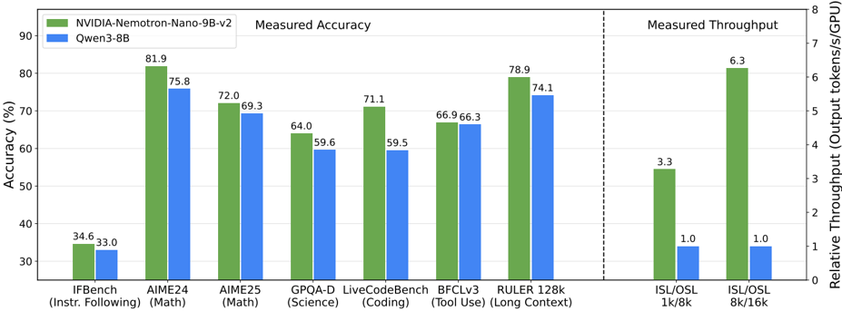

*Figure 1 | Comparison of Nemotron Nano 2 and Qwen3-8B in terms of accuracy and throughput. Nemotron Nano 2 achieves comparable or better accuracies on complex reasoning benchmarks, while achieving up to 6.3 × higher throughput for such workloads. We abbreviate input sequence length to ISL and output*

**② 方法 / 架构图**

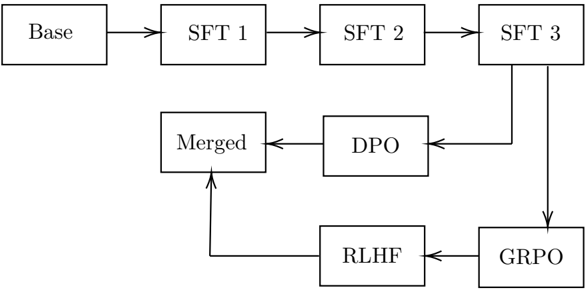

*Figure 4 | Flow of alignment procedures followed to arrive at the final "Merged" Nemotron Nano 2 12B checkpoint.*

### 一眼看懂
> 一句话导读:目标是把推理模型塞进单张 22GiB 显卡还能跑 128k 上下文——先训 12B 大模型,再用 Minitron(剪枝 + forward-KL logit 蒸馏)压到 9B 恢复精度,关键是它的"蒸馏"是固定教师 logits 的 off-policy KD,跟本课题的 on-policy 蒸馏不是一回事。

- 🟦 TL;DR:造一个能在**单张 A10G(22GiB)上做 128k 推理**的紧凑推理模型。路线分三步:
  - 预训练 12B 混合 Mamba-Transformer base(20T tokens, FP8);
  - 多阶段 SFT + 多分支对齐(IFeval RL / on-policy DPO 工具 / GRPO-RLHF + 模型合并)得对齐 12B;
  - 用 **Minitron(剪枝 + 仅 forward-KL 的 logit 蒸馏)** 压到 9B 恢复精度。
  - 结果:在 8k 输入/16k 输出等生成密集场景,吞吐比 Qwen3-8B 高 **3×-6×**,同时精度相当或更优。【原文 §Abstract/§1/§4.4/Fig.1】
- 最巧的一步(两个,都是"对症工程一刀"非新算法):
  - 从工程系统看:**"先训大(12B)再剪小(9B)再 forward-KL 蒸馏恢复"** 这条 Minitron 路线(§4.3:logit 蒸馏在精度恢复阶段优于普通微调);
  - 从"可控推理"看:**训练时混入"突然截断到 1-2k token 的推理轨迹"**(§3.4)——抽掉它,模型在短 thinking budget(思考预算)下就会停不下来、生成多余 `</think>`、well-formedness(格式良好率)暴跌(Fig.5a vs 5b)。【原文 §3.4/§4.3/Fig.5】

### 为什么做
> 一句话导读:推理模型又大又慢,12B 权重塞不进 22GiB 显卡,而且短思考预算下停不下来、几种对齐能力还互相打架——所以要压缩 + 控 budget + 多分支合并一起解决。

- 研究背景:推理模型要生成长 thinking 轨迹,对吞吐压力大。Nemotron-H 提出把多数自注意力层替换为 Mamba-2 的混合架构提升长序列生成速度;压缩侧承袭 Minitron(剪枝 + 知识蒸馏)。【原文 §1/§2/§4.1】
- 解决的具体痛点:
  - ① 12B bf16 权重 **22.9GiB > A10G 22GiB**,**必须压缩**才能单卡 128k 推理;
  - ② 推理模型在不同 thinking budget 下**鲁棒性差**(budget 截断后仍停在 thinking 模式、生成多余 `</think>`、well-formedness 下降);
  - ③ Stage-1 SFT 的 128k 拼接**损害工具调用学习**;
  - ④ 推理能力与 chat 能力存在**权衡**。【原文 §1/§3.1-3.4/Fig.5】
- 相关工作 & 各自不足(站谁肩上 + 精确差异):
  - **Nemotron-H**(混合 Mamba-Transformer):提供架构基座,但**未做推理模型的压缩 + budget 控制**。
  - **Minitron / Muralidharan 2024 / Sreenivas 2024 / Taghibakhshi 2025**(剪枝 + KD 框架):本文直接复用其重要性估计与 forward-KL 蒸馏配方,但原框架为压缩 **base 模型**、未含推理模型的 budget/RL 恢复;本文扩展到压缩**推理**模型、并在剪枝-蒸馏链里嵌 DPO/GRPO/RLHF + post-RL KD + 合并。与 Minitron 的精确差异:① 加 Mamba head 剪枝轴的消融(发现本工作压缩比小、剪 Mamba 收益有限故弃);② 把 KD 恢复与多分支对齐缝成一条链。
  - **Qwen3-8B**(对照模型):同精度下生成密集场景吞吐 3×-6×(混合 Mamba 架构之功)。
  - **各对齐算法 SFT/GRPO/DPO/RLHF**:各管一摊、彼此干扰(Fig.6)——本文用模型合并(Wortsman 2022 model soups)缓解。
  - 共性缺口:没人把"混合架构 + 推理模型压缩 + 可控 budget + 多能力不打架"在单卡内存约束下整合成一条产线。【原文 §1/§4.1】
- 动机链(逐步推):
  - 现状:推理模型又大又慢、budget 不可控、多能力相互干扰;
  - 约束:目标单 A10G 22GiB 跑 128k;
  - 所以:混合架构提吞吐 + Minitron 压到 9B 进内存 + 截断训练控 budget + 多分支独立对齐再合并缓解干扰。【原文 §1/§3/§4】
- 与最近邻工作的 Δ：
  - 相对 **Minitron**——把它从"压 base 模型"扩展到"压**推理**模型",并在剪枝-蒸馏链里**嵌入 DPO/GRPO/RLHF + post-RL KD 恢复 + 模型合并**(§4.3 步骤 1-7)。
  - 相对 **Qwen3-8B**——同精度下生成密集场景吞吐 3×-6×。
  - 差在"把工业级多能力对齐 + 激进内存压缩"做成可复现 recipe 并开源大量数据/权重。【原文 §4.3/§4.4/Fig.1】

### 怎么做(到可复现)
> 一句话导读:三大块——预训练 12B、多分支对齐成 12B、再 Minitron 压成 9B;压缩里剪枝只用前向传播估重要性,精度靠 forward-KL logit 蒸馏恢复,中途夹 DPO/GRPO/RLHF 并用 0.5 线性插值合并模型来防能力回退。

#### 总体流水线
① **预训练** 12B 混合 Mamba-Transformer base(20T tokens,FP8,DeepSeek FP8 recipe;约 5% 数据含刻意截断推理轨迹) → ② **对齐**(Base→3 阶段 SFT→DPO/GRPO/RLHF 分支→Merged 12B) → ③ **Minitron 压缩**(剪枝→架构搜索→forward-KL logit KD 恢复→分阶段 DPO/GRPO/post-RL KD/RLHF/合并)得最终 9B。

#### 压缩:剪枝重要性估计(§4.1,真实形式)
全程**只用前向传播**(梯度敏感性在 LLM 规模不实际)。

- **层重要性(MSE)**：迭代式——逐个临时移除候选层、算原模型 logits 与剪后 logits 的 MSE;**移除 MSE 最低(影响最小)的层**,重复到目标深度。
- **FFN/embedding 通道重要性**：FFN 形式 \(\text{FFN}(X)=\delta(X\cdot W_1^T)\cdot W_2\)(\(\delta\)=squared ReLU,\(W_1,W_2\in\mathbb{R}^{d_{ffn}\times d_{model}}\))。第一线性算子第 \(i\) 个神经元重要性按其输出在 batch×seq 维聚合:
\(\displaystyle F^{(i)}_{\text{neuron}}=\sum_{B,S}\delta\big(X(W_1^i)^T\big),\)
聚合函数用 mean(\(\frac1n\sum|S_i|\))与 l2-norm(\(\sqrt{\sum S_i^2}\)),校准集 1024 样本;embedding 通道同理(看 LayerNorm 输出)。

- **Mamba head 重要性**：按 Taghibakhshi 2025 的 nested activation 评分(1024 校准样本);**实测剪 Mamba head 导致严重精度损失**——因本工作压缩比小(深度剪后 <15%),剪 Mamba 收益有限,故**只剪 FFN+embedding+深度**。

#### 压缩:架构搜索 + KD 恢复(§4.2-4.3)

1. **定深度**:固定 4 个 attention 层(attn:total≈7-8%),比较 52/54/56 层(各 6B token KD):52→44.92、54→47.35、**56→51.48** → 定 56 层。
2. **宽度剪枝 + 选候选**:在 56 层上做 60B token KD,再沿 embedding/FFN/Mamba 枚举满足 128k/bs1 内存预算的候选,按估计显存降序取 top-3,各做 **19B token 短 KD** + 测吞吐 → 选 **Candidate 2**(56 层/hidden 4480/FFN 15680/128 Mamba heads/8.89B,精度 63.02,吞吐 156.42)。
3. **forward-KL logit 蒸馏(精度恢复核心)**：**仅用 forward KL 散度损失**做 logit 蒸馏(教师=原 12B,固定 logits),优于普通微调;损失具体形式**沿用 Minitron 论文 §3**(本文未重列公式 → 标注:原文未在正文重列 KD 损失式)。本质是 \(\min_\theta \mathrm{KL}[p_{\text{teacher}}\|q_\theta^{\text{student}}]\),让剪小后的学生覆盖教师整个输出分布。数据配比消融(Table 11,~6B token KD,reasoning-SFT/pretraining):50/50→57.5、**70/30→58.5(最佳)**、90/10→57.2。

#### 最终 9B 推理模型的 7 步分阶段恢复链(§4.3,带 token 数)

1. 深度剪到 56 层;KD ~60B token @ 8192 长度。
2. 宽度剪枝 + KD:~50B@8192、~25B@49152、~1B@262144(逐级增长序列长)。
3. DPO。
4. GRPO。
5. KD ~0.4B@262144(**恢复 post-RL 掉点**)。
6. RLHF(人类偏好对齐)。
7. **步骤 5 与 6 间模型合并**:0.5 线性插值。

#### 多能力对齐的关键子机制(§3,逐组件必要性)

- **Stage-1 SFT**：全量数据 + 混约 10% 去推理轨迹的"空 trace"样本(支持 reasoning-off 直答);拼接成约 128k 长序列。
- **Stage-2 SFT(工具,不拼接)**：**修复 Stage-1 拼接对工具学习的破坏**。
- **Stage-3 SFT(截断训练)**：加入把推理轨迹**突然截断到 1-2k token**(保留最终答案)的样本——没它短 budget 下 well-formedness 暴跌(Fig.5a→5b)。
- **iterative on-policy DPO(工具)**：在 WorkBench 多步可验证工具环境,对每个 prompt 用**当前 checkpoint** 生成 on-policy **正样本(成功调用)/负样本(失败生成)** 迭代 DPO;BFCL v3 评测。
- **GRPO(RLHF,Qwen-based RM,HelpSteer3 英文)**：提升 instruction-following/对齐,生成带/不带 thinking 两种 rollout 评分;**暂时损害 MMLU-Pro**(post-GRPO KD 恢复)。
- **模型合并(checkpoint 插值)**：\((1-\alpha)\cdot w_{\text{model1}}+\alpha\cdot w_{\text{model2}}\),把推理强/chat 强两个 RL checkpoint 调和;\(\alpha\) 在 0.1-0.9 扫(步长 0.1),**\(\alpha\approx0.5\) 最佳折中**——缓解 RLHF 引入的回退(Fig.6)。

#### budget 控制机制(§3.4,可复现细节)
推理时从生成 `<think>` 起计 token;到 budget 后**不立即插 `</think>`,而是让模型把当前句子写完、在下一个换行处插**;极端情况无换行则在 **(budget+500)** 处强插。两种失效模式:

- ① compensation(thinking 受限→在 final answer 里补)→ 截断训练消除;
- ② 强插后仍停在 thinking 模式(再吐一个 `</think>`)→ 用 "Well-Formedness"(只含单个闭合标签为良)度量,截断训练后短 budget 也稳定良形(Fig.5b)。
- **直觉一句话**:"forward-KL 拽精度、分支合并调能力、截断训练驯 budget。"

### 靠不靠谱
> 一句话导读:作为产线报告,吞吐/内存/budget 三目标都给了直接证据、消融到位;但完整训练代码闭源、外部难复现,且它的"蒸馏"是 off-policy KD,与本课题的 on-policy 范式相反。

- 实验与证据:
  - **吞吐(Fig.1/Table 5-6)**：Nemotron-Nano-9B-v2 在生成密集场景(8k 输入/16k 输出)吞吐比 Qwen3-8B 高 **3×-6×**;推理基准相当或更优。【原文 §4.4/Fig.1】
  - **12B 对齐模型(Table 8,reasoning ON)**：AIME-2024 85.42、AIME-2025 76.25、MATH-500 97.75、RULER@128k 83.36 等多项超 Qwen3-8B,但 SciCode/ArenaHard 略低(ArenaHard 74 < Qwen3-8B 78.4、Qwen3-14B 87.7)——chat 是相对弱项。
  - **逐阶段分析(Fig.6)**：DPO+GRPO 显著提升 BFCL v3/IFEval;GRPO 暂砸 MMLU-Pro→post-GRPO KD(步骤5)恢复;RLHF 涨 Arena-Hard 但引回退→模型合并(步骤7)恢复。
  - **截断训练(Fig.5)**：显著改善短 budget 下 well-formedness。
  - baseline 公平吗:与 Qwen3-8B 同场景对比吞吐/精度,工业报告标准;消融(Table 9 深度、Table 10 候选、Table 11 配比)到位。
  - "看着强但没回答核心问题":作为产线报告,吞吐/内存/budget 三目标都给了直接证据;但**完整训练代码不在发布仓内**,外部难独立复现。
- 假设与失效边界:
  - 【原文 §4.1/§4.2】剪枝**只剪 FFN+embedding+深度、不剪 Mamba head**——因本工作**压缩比小(12B→9B,深度剪后 <15%)**;【推断】激进压缩下该结论(及 forward-KL KD 的恢复力)未必外推。
  - 【原文 §3.4】thinking budget 控制依赖训练时截断样本 + 推理时 (budget+500) 强插 `</think>`——对极短 budget 仍有鲁棒性边界。
  - 【推断】**这是模型/数据发布而非可复现方法论**——完整训练代码(NeMo/Megatron 内部栈)闭源,超参/阶段多为工程经验选择,缺替代方案系统对照。
  - 【原文 §3.2/§4.3】模型合并固定 \(\alpha\approx0.5\)——为经验做法,虽扫了 0.1-0.9 但**缺合并方式(非线性/任务向量等)的系统对照**。
- 祛魅总结【推断】：
  - 真贡献：一条**完整、消融到位的工业级产线**(混合架构 + 推理模型压缩 + budget 控制 + 多分支对齐合并),且开源大量预/后训练数据与权重;Fig.6 把各对齐/恢复阶段作用拆开、Table 11 给数据配比,工程透明度高。
  - 与本课题(on-policy 蒸馏)的关系**被高估的风险**:
    - ① 它的"蒸馏"是 **forward-KL logit 蒸馏 + 固定教师 logits/数据**,本质是 **off-policy KD**(教师不在学生轨迹上打分),与 on-policy distillation **不是同一范式**;
    - ② 真正 on-policy 的只有"iterative on-policy DPO(工具)"那一支——且那是偏好优化不是蒸馏;
    - ③ reverse vs forward KL 的取舍、on-policy 蒸馏的分布真实性收益均未讨论。
    - 所以它对本课题更多是**背景/对照**(工业如何混用 SFT+RL+KD),而非方法直接对标。

### 结构化抽取

- 🎯 机制速览6轴：
  - **学什么信号**：压缩阶段=教师(原 12B)的 logits 分布(forward KL,白盒);对齐阶段=SFT 监督 + DPO 偏好 + GRPO/RLHF 奖励(Qwen-based RM)。混合多信号。
  - **改什么**：改模型结构(剪枝:深度 62→56 层、FFN 20480→15680、embedding 5120→4480)+ 改参数(KD 恢复 + 多分支对齐 + 合并)。
  - **何时改**：分阶段——预训练→3 阶段 SFT→DPO/GRPO/RLHF 分支→剪枝→分阶段 KD(增长序列长)→post-RL KD→RLHF→合并。
  - **免梯度?**：否(全程梯度训练);压缩用 forward-KL 监督蒸馏,对齐含 RL(GRPO/DPO/RLHF)。
  - **记忆-技能生命周期**：无外部记忆/技能库;"能力"=推理/工具/对齐,靠多分支训练注入参数,用合并保留;budget 控制是一种"行为技能"(训练时截断样本习得)。
  - **防遗忘机制**：**模型合并(0.5 线性插值)** 是其防"对齐回退/能力相互覆盖"的主要手段;post-RL KD(步骤5)恢复 RL 造成的退步;无针对持续学习的显式防遗忘。
- ⑦ 开源代码+框架/harness：**无完整训练代码**(属模型/数据发布,CloneTier=B,本地未 clone)。权重 HF nvidia(Nemotron-Nano-9B-v2、12B-v2-Base、9B-v2-Base);数据 Nemotron-Post-Training-Dataset-v1、Nemotron-Personas、Nemotron-Pretraining-Code/SFT-v1、Aegis Content-Safety v2 等多数开源;训练栈 **NVIDIA NeMo / Megatron**(FP8 预训练);评测用 NeMo-Skills、lm-evaluation-harness、math-verify。**未完整克隆——见 CLAUDE.md 决策①(大厂技术报告仅记链接不 clone 巨型权重仓);需手动从 HF 获取权重/数据。** 【原文 §1.1 发布物清单 + v1 核】
- 💰 资源/成本与可扩展性：预训练 20T tokens(FP8);后训练总计约 90B tokens;压缩 KD 总量约 60B+50B+25B+1B+0.4B(推理模型)/120B+360B+2.5B(base);目标硬件单 A10G(22GiB, bf16)跑 128k。响应多由 DeepSeek-R1-0528 与 Qwen3-235B-A22B 生成(蒸馏式数据合成)。【原文 §2/§3/§4.3】
- 🎯 对"探索-巩固"对标：**弱-中支撑(仅工业混用 SFT+RL+KD 的背景对照 + on-policy DPO 一支);非 on-policy 蒸馏方法**。判定依据：
  - ① **唯一直接相关点是 iterative on-policy DPO**——在 WorkBench 多步工具环境用**当前 checkpoint** 生成正/负样本迭代 DPO,与本课题"student on-policy 自选轨迹 + 从成功/失败中学"在**数据来源上**同构(on-policy 正=成功调用、负=失败生成),弱对应"探索(尝试工具调用)+巩固(把成功固化)";
  - ② **模型合并防能力回退** 提供一个朴素"巩固不遗忘"工程范式;
  - ③ **截断训练教模型在 budget 内收尾** 与 MTP"前瞻/在有限步内规划"弱相关。
  - **缺口**:① **压缩蒸馏是 forward-KL off-policy KD**(固定教师 logits),**不是学生轨迹上的 on-policy 蒸馏**——与本课题核心范式相反;② **无 teacher 稀疏脚手架、无 path-recovery 单点接管、无 MTP 前瞻探针**;③ 是产线整合而非机制创新。
  - 一句话:**它是"工业如何把 SFT/RL/KD/合并拼成产线"的背景样本,其 on-policy DPO 一支可作"on-policy 正负样本"对照,但整体非 OPD 范式、无脚手架/前瞻可借。**
- 🔭 开放问题/未来方向：
  - 【原文】把 budget 控制做到更短预算仍鲁棒;更系统地选合并系数/方式;把压缩-对齐链推到更激进压缩比。
  - 【推断】把压缩阶段的 forward-KL **off-policy** KD 换成"学生剪枝后在自身轨迹上的 on-policy 蒸馏",看能否更省 token 地恢复精度(把本报告与 opd_blog/opd_survey 的 on-policy 范式缝合);把 on-policy DPO(工具)的"成功/失败正负样本"扩展为"走偏后自选恢复分支"的 path-recovery 数据。

RETURN: nemotron_nano2|读到PDF=是(§Abstract/§1-4全文+§3.4截断1-2k与budget+500/§4.1剪枝重要性MSE+FFN神经元式/§4.3 forward-KL KD步骤1-7/Table9-11/Fig.5-6/§3.3 on-policy DPO WorkBench/Table8)|L线=L1(兼L3/L4)|对标=弱-中支撑(仅on-policy DPO一支同构"on-policy正负样本"+模型合并防回退作背景;但压缩蒸馏是forward-KL off-policy KD非OPD范式,无teacher脚手架/回轨/MTP)|残留待核=0(未完整克隆:大厂模型/数据发布仓,无训练代码,见决策①,需HF手动获取;forward-KL KD损失式正文未重列,沿用Minitron论文§3)

---

## On-Policy Distillation (博客 + tinker-cookbook 配方)

> **`opd_blog`** ｜ Thinking Machines Lab(Kevin Lu 等) ｜ 2025 · 博客(非论文) ｜ 主题线 L1(on-policy 蒸馏方法论)，兼 L4(多轮工具)、L6(token 级稠密信号) · 相关性 高 ｜ [📄 原始论文](https://thinkingmachines.ai/blog/on-policy-distillation/)

### 一眼看懂
> 一句话导读：on-policy distillation(在线策略蒸馏)就是让小模型(学生)自己写答案,然后请一个更强的大模型(教师)逐字逐句告诉它"这一步你的概率分布该长什么样",学生照着改。它同时占了两个便宜:学生走的是自己的路(避免 SFT 那种"训练时看完美范文、自己一上手就翻车"的失配),而教师在每一步都给反馈(避免 RL 那种"答完一整题才给一个对错"的稀疏)。

- 🟦 TL;DR：本文系统推广了 **on-policy distillation**。它的核心是:学生在**自己采样出来的轨迹**上,以更强教师的**逐 token 分布(用 reverse KL 度量)** 作为**唯一的稠密监督**(环境不给任何 reward)。这样做兼顾了两件事——
  - on-policy 的分布真实性:解决了 SFT 的训练-推理失配;
  - 教师反馈的稠密性:解决了 RL 的奖励稀疏。
  博客在三个场景上做了演示:推理(数学)、个性化(恢复指令遵循能力)、多轮工具使用;并配套 tinker-cookbook 给出了可复现的 LoRA 配方。一条代表性曲线:在 OpenThoughts3 上 SFT 到 AIME'24 约 55%,再在 DeepMath 上做 on-policy 蒸馏,**仅约 100 步**就升到约 65%。【既有 analysis + 仓 README】

- 最巧的一步：**把 reverse KL 当作 per-token advantage、用策略梯度的形式回传**,而**不是**把它写成一个显式的 KL 散度 loss 项。具体到代码(`incorporate_kl_penalty`):先算 `reverse_KL = log p_student − log q_teacher`,再令 `advantage = −kl_penalty_coef · reverse_KL`。如果抽掉"在学生轨迹上算 + 用 reverse KL"这一步——比如改成在教师轨迹上算(那就成了 off-policy),或改用 outcome reward(那就成了 RL)——就会分别退回 SFT 的失配 / RL 的稀疏。正是这一步,让"token 级稠密蒸馏"和"on-policy 采样"能用同一套 importance-sampling loss 来实现。【本批源码核 `train_on_policy.py` L53-130】

### 为什么做
> 一句话导读：训小模型一直是"两害取其轻"——SFT 让它背范文,可一上手走自己的路就翻车;RL 让它走自己的路,可一整题才给一个对错、学得又慢又贵。本文要的是两头的好处都拿到:学生走自己的路、同时教师在每一步都纠正它。

- 研究背景：大模型蒸馏分两类:
  - off-policy:在教师生成的固定数据上做 SFT;
  - on-policy:学生采样自己的轨迹,教师再对学生的轨迹逐 token 打分。
  博客把 on-policy distillation 当作一个"兼顾稠密监督与 on-policy 真实性"的范式来系统推广。【既有 analysis】

- 解决的具体痛点：
  - ① off-policy 蒸馏/SFT 容易"复述"教师的局部模式,且存在训练-推理的分布不匹配(即 exposure bias,曝光偏差):学生在**自己的推理轨迹上从未被纠正过**,于是误差不断累积;
  - ② on-policy RL(GRPO)只有序列级的稀疏奖励,token 层面的学习效率低、采样成本高;
  - ③ 单纯模仿教师的文本,无法在"学生自己访问到的那些状态"上获得稠密反馈。【既有 analysis】
- 相关工作 & 各自不足（来龙去脉 + 并行路线 + 精确差异）：
  - **off-policy / SFT**(在教师轨迹的固定数据上匹配 next-token):短板是失配、误差累积;仓库里的 `train_off_policy.py` 提供它作对照。
  - **on-policy RL / RLVR(GRPO)**:短板是只有序列级的稀疏 outcome reward,token 学习效率低、且贵。
  - **学术界的 on-policy KD**(GKD(Agarwal 2024)、MiniLLM(Gu 2024)):与本文**范式同源**(都在学生轨迹上蒸馏)。精确差异:博客把它**工程化成一套托管 SDK(Tinker)上的 LoRA 配方**;而学术 KD 里散度要手动选、每步生成又贵。
  - **SDFT(自蒸馏 SFT)**:仓库里的 `sdft.py` 提供它作并行对照(用同一个模型重新生成 + SFT)。
  - **站谁肩上**:GKD/MiniLLM 的 on-policy KD 范式 + Tinker 托管训练栈 + Harbor 沙箱(用于多轮工具)。博客的定位是**把这个范式工程化,并配上 recipe、三场景演示和 checkpoint 句柄**。【既有 analysis + 仓 `train_off_policy.py`/`sdft.py`/README】
- 动机链（一步步推下来）：
  - 现状:SFT 失配 vs RL 稀疏,只能二选一;
  - 洞见:让学生自己采样可解决失配,让教师逐 token 打分可解决稀疏,二者合起来就是两全;
  - 结论:于是有了 on-policy distillation——学生轨迹 + 教师 token 分布的 reverse KL、且不给 reward。【既有 analysis】
- 与最近邻工作的 Δ：
  - 相对 **off-policy SFT**:把数据源从"教师轨迹"换成"学生自身轨迹",差别在于学生能在自己会访问到的状态上被稠密纠正。
  - 相对 **on-policy RL(GRPO/RLVR)**:把"序列级 outcome reward"换成"token 级的教师 KL",差别在于每个 token 都有稠密信号、样本/步效率因此高得多(约 100 步就见效)。
  - 相对 **GKD/MiniLLM**:把它落地成托管 SDK(Tinker)上的 LoRA 配方,并扩展出多教师 / 多轮工具的用法。【既有 analysis】

### 怎么做 + 靠不靠谱
> 一句话导读：一轮就是"学生写一段→教师对这段逐字给概率→把两者的差当 advantage 回传更新",而且只对学生自己写的 token 算 loss(prompt、工具返回这些都遮掉)。靠不靠谱?它直观、约 100 步就见效,但本质是博客而非论文——没有多 seed、没有基线对照、没有显著性检验,数字都是单点近似。

- 方法流水线（输入→输出,对应代码 `train_on_policy.py`,读完即可复现）：一轮分六步:
  - ① **学生采样**:对每一批,用当前的 sampling client 采轨迹(温度默认 1.0,对应 `do_group_rollout_and_filter_constant_reward`),并记录每个 token 的 `sampled_logprobs`(即 \(\log p\))和 `mask`(对应 `prepare_minibatch`);
  - ② **教师打分**:对每条 datum,用它对应的 teacher sampling client(每个 dataset 配一个)异步算出 `teacher_logprobs`(即 \(\log q\));实现上,把学生的 `model_input` 末尾 append 上 target token 得到 `full_sequence_inputs_D`,教师 logprob 取 `teacher_logprobs[1:]` 来对齐到 next-token;
  - ③ **reverse-KL-as-advantage**(对应 `incorporate_kl_penalty`):逐 token 算 \(\mathrm{KL}[p\|q]=\log p-\log q\),per-token advantage = \(-\)`kl_penalty_coef` \(\times\) `mask` \(\times\) reverse_KL,然后**就地(in-place)加进** `datum.advantages`;
  - ④ 可选地用 `kl_discount_factor`(默认 0.0)对未来的 KL 做折扣(对应 `discounted_future_sum_vectorized`;博客称这没有明显增益);
  - ⑤ 通过 Tinker 的 `importance_sampling` loss 做一次 `train_step` 更新;
  - ⑥ **只对学生生成的 token 计 loss**(系统提示、用户消息、工具返回、assistant header 都被 mask 掉);
  - 然后进入同步循环(对应 `do_sync_training`)。【本批源码核 `train_on_policy.py` L53-130/L174-369】
- 逐组件必要性（每模块干啥 / 有无消融 / 怎么咬合）：
  - **reverse KL 作 advantage(核心)**:没有它就不是 on-policy 蒸馏。代码注释写得很清楚:"KL[p||q]=log p − log q"、"adjust the advantages in-place as the negative reverse KL"。它的作用是把"教师的逐 token 监督"塞进策略梯度的 advantage 槽里,从而复用 RL 的 importance-sampling loss。【本批源码核 L62-63/L86-108】
  - **仅对学生 token 计 loss(用 mask)**:没有它,prompt 和工具返回也会被算进去、污染信号(代码里 `float_masks` 会逐 token 乘进 reverse_kl 与 advantage)。在多轮工具场景下,"system / user / tool 返回 / assistant header"全部被 mask。【本批源码核 L90-103 + README "Environment-provided tokens … are masked out"】
  - **零 reward(纯 KL)**:多轮工具场景用 `reward_fn=zero_reward`(恒返回 0.0)去覆盖默认的 `HarborReward`,这样唯一信号就只剩"对教师的 KL"。没有它就会混入 RL 奖励、不再是纯蒸馏。【既有 analysis + README + `harbor_multiturn.py`】
  - **多教师**:对每个数据集配一组 `(teacher_model, groups_per_batch)`,各自建立 teacher sampling client、分别采样,再由 `CompositeDataset` 拼成一个 batch(对应 `on_policy_multi_teacher.py`)。注意**博客没有展示这部分实验**,只在 recipe 里提供。【既有 analysis + README "multiple teachers" + 源码 L443-475】
  - **kl_discount_factor**:可选,默认 0.0;博客实验里**没有明显增益**——可视为"非必要"组件。【既有 analysis + 源码默认值 L147】
- 关键机制/公式（真实形式 + 直觉,据源码/博客抄准）：
  - **per-token reverse KL(代码逐 token 形式)**:对位置 \(t\) 学生采到的 token,\(\displaystyle \mathrm{rKL}_t=\big(\log p_\theta(o_t\mid x,o_{<t})-\log q_T(o_t\mid x,o_{<t})\big)\cdot m_t,\) 其中 \(m_t\) 为 mask(仅学生生成 token 为 1)。注意这是**单点采样估计**(只在学生实际采到的 token 上算 \(\log p-\log q\)),而非对整词表求和的全 KL。
  - **reverse-KL-as-advantage**:\(\displaystyle A_t \mathrel{+}= -\,c_{\text{KL}}\cdot m_t\cdot \mathrm{rKL}_t,\qquad c_{\text{KL}}=\text{kl\_penalty\_coef}\ (\text{默认}\ 1.0),\) 即把"教师对该 token 的偏好"写成负的 reverse-KL 优势,加进 advantage 后由 `importance_sampling` loss(clipped surrogate)更新。可选折扣:\(\tilde A_t=\sum_{k\ge t}\gamma^{k-t}A_k\)(`kl_discount_factor` \(\gamma\),默认 0)。
  - **目标的直觉**:学生在某条它**自己采出来**的轨迹 \(y\sim\pi_\theta\) 上,最小化沿途逐 token 的 reverse KL,即目标 \(\mathbb E_{y\sim\pi_\theta}\big[\sum_t \mathrm{KL}\big(\pi_\theta(\cdot\mid x,y_{<t})\,\|\,\pi_T(\cdot\mid x,y_{<t})\big)\big]\)。回顾两种老办法的毛病:RL 的毛病是奖励稀疏(一整条轨迹只在最后给一个对/错);SFT 的毛病是分布失配(只在教师的完美前缀上学,学生自己一走偏就没人管)。on-policy 蒸馏的做法是:让学生**自己走**(on-policy,解决失配),同时让教师在学生走到的**每一步**都给出"你这一步的分布该长什么样"(reverse KL,解决稀疏)。
  - **为何用 reverse 而非 forward**:reverse KL \(\mathrm{KL}(p_{\text{student}}\|q_{\text{teacher}})\) 是 mode-seeking 的(让学生去聚焦教师的几个高概率模式),而非 mode-covering(去覆盖教师的所有模式)——博客选了前者,但没深入论证这个取舍。另外,教师 logprob 提供的稠密信号,样本/步效率远高于序列级的 outcome reward,这正是"约 100 步就从 55% 升到 65%"的直觉来源。【既有 analysis + 源码】
- 实验与证据：
  - **推理**:分两步——
    - ① 先在 OpenThoughts3-1.2M 上做 SFT(对应 `off_policy_reasoning`,rank-128 LoRA,约 3000 步,LR 1e-3),得到 AIME'24 约 55%;
    - ② 加载这个 ckpt,在 DeepMath-103K 上做 on-policy 蒸馏(教师 Qwen3-32B,`groups_per_batch=512`,LR 1e-4,约 100 步),升到 AIME'24 约 65%。
    也就是仅约 100 步,就从 55% 升到 65%。【README + 既有 analysis(博客近似值)】

  - **个性化**:用内部文档加上重采样过的 Tulu3(assistant 轮由 Qwen3-8B 重新生成)做 SFT,再用 Tulu3 的 prompts 做 on-policy 蒸馏(`groups_per_batch=64`),在 IFEval 上约 100 步即恢复。【README + 既有 analysis】
  - **多轮工具使用**:对应 `on_policy_distillation_harbor_multi_turn`,让 **Kimi-K2-Thinking 同时充当学生与教师**,在 Harbor 沙箱里以 `reward_fn=zero_reward` 的纯 KL 信号训练。具体配置:`max_turns=10`、`group_size=4`、`groups_per_batch=8`、`lora_rank=8`、`kl_penalty_coef=1.0`、`max_tokens=2048`、`max_trajectory_tokens=24576`、温度 1.0。【README + 既有 analysis(已据 README 核)】
  - baseline 公平吗:**这是一篇博客、非受控论文**——大多是单点曲线或示例,**缺多 seed、缺基线对照、缺统计显著性**;"55%→65%"是近似值;多教师在博客里**没有展示**。
  - "看着强但没回答核心问题":它直观展示了样本/步上的高效,但严格性不足(没有显著性、数值为近似)。
- 假设与失效边界：
  - 【源码注释 L72-73】当教师与学生**用不同的 renderer/tokenizer 时,需要手工对齐**(注释原话:"if your teacher has a different renderer than the student, you may want to modify the full_sequence_inputs_D")——跨家族蒸馏没有演示。
  - 【既有 analysis + 源码】on-policy 蒸馏需要教师做**在线 logprob 计算**(`teacher_client.compute_logprobs_async`),依赖 Tinker 托管服务——所以复现门槛绑定在这个 SDK 上。
  - 【推断】博客示例里学生与教师是**同族的**(学生 Qwen3-8B-Base / 教师 Qwen3-32B,共享 renderer/tokenizer;多轮场景甚至用同一个模型),这降低了分布漂移;跨家族的通用性边界没有系统评估。依据是 recipe 的默认设置与代码注释。
  - 【推断】reverse KL 是 mode-seeking 的,可能牺牲多样性(高 Pass@1、低 Pass@k);但博客没评 Pass@k,forward vs reverse 的取舍也没深入。依据是 reverse KL 的已知性质,加上博客未作讨论。
- 祛魅总结【推断】：
  - 真贡献:把 on-policy distillation 这个范式**清晰地工程化了**——reverse-KL-as-advantage 的实现、纯 KL 无 reward、仅对学生 token 计 loss,三点都经过代码核实;再以三场景 + 可复现配方 + checkpoint 句柄降低了上手门槛,传播价值高(本课题的 opd_survey 把它列为奠基性博客)。
  - 包装/被高估处:
    - 它**是博客、不是论文,没有严格的基线/统计**,数值都是近似的单点;
    - 多教师能力**只在 recipe 里、博客未展示**;
    - reverse-KL 的取舍、跨家族蒸馏、Pass@k 多样性都未评估;
    - "两全其美"这套叙事在"同族师生 + 数学/IF 场景"下成立,但边界没有充分探。

### 结构化抽取

- 🎯 机制速览6轴：
  - **学什么信号**：教师在**学生轨迹**上的逐 token 分布(reverse KL=\(\log p_{\text{student}}-\log q_{\text{teacher}}\));白盒(需教师 logprob);**无 reward**(既非正确性也非格式)。
  - **改什么**：改学生参数(LoRA);不改结构。
  - **何时改**：在线——学生采样→教师打分→更新,每个 token 都更新(in-place 写进 advantage)。
  - **免梯度?**：否,是梯度优化;但用**策略梯度形式**(reverse KL 作 advantage 经 importance-sampling loss)实现 token 级 KL 蒸馏,而非显式 KL loss 项。
  - **记忆-技能生命周期**：无外部记忆/技能库;"技能"=教师的逐 token 推理分布,蒸进学生 LoRA 参数。
  - **防遗忘机制**：无显式防遗忘;个性化场景用"SFT 恢复 + 蒸馏"组合来恢复被改动的能力,弱相关。
- ⑦ 开源代码+框架/harness：https://github.com/thinking-machines-lab/tinker-cookbook (已 clone,~14MB)。核心 `tinker_cookbook/distillation/`(`train_on_policy.py`、`train_off_policy.py`、`sdft.py`、`datasets.py`)与 `recipes/distillation/`(`on_policy_distillation.py`、`off_policy_reasoning.py`、`on_policy_multi_teacher.py`、`harbor_multiturn.py`、`on_policy_distillation_harbor_multi_turn.py` + `README.md`)。**框架=Tinker SDK**(基于 LoRA 的自研托管训练 SDK,蒸馏 loss=`importance_sampling`、采样/教师 logprob 由 Tinker 服务侧执行)——**非 veRL/TRL/OpenRLHF**。启动如 `python -m tinker_cookbook.recipes.distillation.on_policy_distillation model_name=Qwen/Qwen3-8B-Base load_checkpoint_path=tinker://… dataset=deepmath learning_rate=1e-4 groups_per_batch=512 lora_rank=128`。【本批 repo 核 + README】
- 💰 资源/成本与可扩展性：全程 LoRA(rank 8/32/128 句柄均提供);on-policy 蒸馏约 100 步即见效(样本/步高效是卖点,LR 1e-4 LoRA / 5e-5 full);依赖 Tinker 托管(教师在线 logprob)。具体卡数博客未集中说明。关键超参:`kl_penalty_coef=1.0`、`kl_discount_factor=0.0`、`temperature=1.0`、`eval_every=20`/`save_every=20`、`loss_fn=importance_sampling`;多教师默认 DeepMath→Qwen3-32B、Tulu3→Qwen3-235B-A22B-Instruct-2507、学生 Qwen3-8B。【既有 analysis + 源码/README 默认】
- 🎯 对"探索-巩固"对标：**强支撑(它是本课题 OPD 一侧的直接范式蓝本);是核心对标对象**。判定依据如下:
  - ① **范式同构**:"学生 on-policy 自采样 + 教师在学生轨迹上逐 token 稠密监督"正是本课题 TSRD 的 OPD 骨架——探索 = 学生自己走(on-policy);巩固 = 教师把走到的每一步分布拽向正确。
  - ② **可借组件(很实在)**:
    - (a) `incorporate_kl_penalty` 里的 **reverse-KL-as-advantage**,是现成的 token 级稠密信号实现,可直接拿来作"teacher 当稀疏脚手架"的底层信号(只需把"处处 KL"改成"仅在关键步给 KL");
    - (b) 多轮工具里 `reward_fn=zero_reward` 的纯 KL 设置,可作本课题"多轮 agent 自进化"的可复现起点;
    - (c) 多教师拼批,可作"多脚手架来源"的接口;
    - (d) Tinker 的 checkpoint 句柄便于复现。
  - **缺口 / 与本 idea 的关键差异**:
    - ① 博客是 **token 级处处用 reverse KL(稠密、全程介入)**,而本课题要的是 **teacher 当稀疏脚手架(只在关键步或走偏处单点接管)**——需要把博客的"处处监督"稀疏化(这正是 TSRD 相对 vanilla OPD 的创新点);
    - ② **没有 path-recovery 的"自选恢复分支"机制**(博客里学生只是被教师逐 token 拽着走,不会显式地"走偏后自选一个回轨分支");
    - ③ **没有 MTP 前瞻探针**;
    - ④ reverse KL 的 mode-seeking 性质可能压低多样性,这与本课题"探索 = 发现多条能走通的路径"略有张力。
  - 一句话:**它是 OPD 的可复现范式蓝本与底层信号实现(直接可借);本课题的增量,在于把"处处稠密 KL"改造成"稀疏关键步脚手架 + 自选回轨 + MTP 前瞻"。**
- 🔭 开放问题/未来方向：
  - 【博客/README】跨家族(不同 renderer/tokenizer)教师蒸馏;多教师的实证;`kl_discount_factor` 的适用场景(博客称无增益)。
  - 【推断】四个方向:
    - 把"处处 reverse KL"稀疏化为"只在高熵/关键 token 上用教师 KL 接管"(向本课题的稀疏脚手架靠拢);
    - 评估 reverse 与 forward KL 对 Pass@k 多样性的影响;
    - 把 on-policy 蒸馏与 path-recovery 结合(走偏后让学生自选恢复分支,教师只在分支点做稠密监督);
    - 引入 MTP 前瞻,用来挑选"值得教师介入的关键步"。

RETURN: opd_blog|读PDF=否(无PDF;据既有analysis(博客)+本批tinker-cookbook源码核`train_on_policy.py`L53-130 reverse-KL-as-advantage+README超参)|加厚=是(公式LaTeX化+源码行级锚点,未新增未见事实)|LaTeX公式条数=4(per-token rKL/advantage更新/折扣/目标期望)|待核数=0

---

## A Survey of On-Policy Distillation for Large Language Models

> **`opd_survey`** ｜ 腾讯大语言模型部(Mingyang Song, Mao Zheng) ｜ 2026-05-18 · arXiv 2604.00626 v3 · Preprint(cs.LG, 78 页) ｜ 主题线 L1+L2+L4 综述(OPD/自蒸馏 + 统一 SFT-RL + agentic 蒸馏) · 相关性 高 ｜ [📄 原始论文](https://arxiv.org/abs/2604.00626)

### 关键图示

**① Motivation / 对比图**

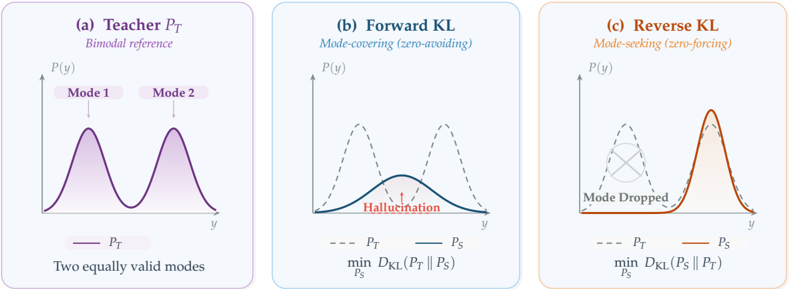

*Figure 2: Forward KL vs. Reverse KL divergence for fitting a student distribution PS to a bimodal teacher PT . (a) The teacher places equal probability mass on two valid modes (e.g., two correct answers or two stylistic variants). (b) Forward KL minimizes D KL ( PT ∥ PS ) and is mode-covering (zero-*

**② 方法 / 架构图**

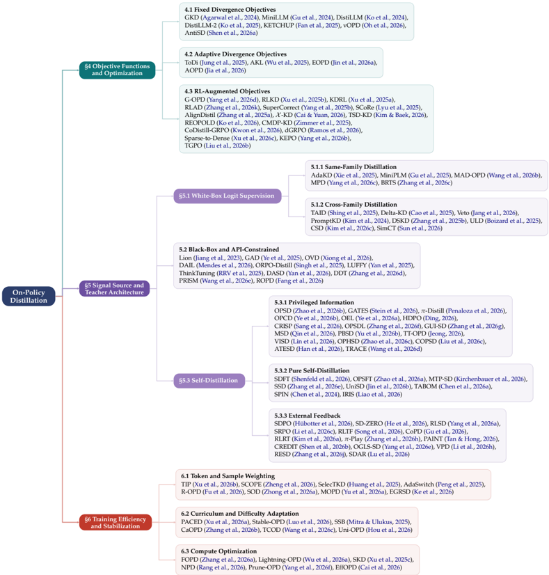

*Figure 1: Taxonomy of On-Policy Distillation methods organized along three design axes: (1) Objective function design (§4), (2) Signal source and teacher architecture (§5), and (3) Training dynamics and efficiency (§6). Each leaf lists representative methods with a badge showing the method count. Me*

### 一眼看懂
> 一句话导读：这是本课题最重要的"地图"——一篇把 On-Policy Distillation(OPD,在线策略蒸馏)整个领域梳理清楚的综述。它的核心动作是:用一个统一的数学式子(学生在自己轨迹上最小化"f-散度",即教师与学生分布的某种距离)把上百篇分散在三个社区的论文收进同一棵分类树,再沿三个维度(优化什么 / 信号从哪来 / 怎么稳)逐个定位,并系统总结"什么时候有效、什么时候会崩"。

- 🟦 TL;DR：这是本课题(MTP+OPD / TSRD)的核心背景综述。它把 On-Policy Distillation(OPD)统一刻画为"**学生在自己采样的轨迹上最小化 f-散度**"(Eq.8;f-散度是一族用来度量两个分布差异的量,KL 是其特例),并沿**三条设计轴**——优化什么 / 信号从哪来 / 如何稳定——组织了 >100 篇文献。它系统给出了:
  - **成功条件、失效模式**;
  - **OPD 与 KL-约束 RL 之间的等价关系**。
  它还把"从 off-policy 到 on-policy"重述为一个序列决策问题——这对应 DAgger 把复合误差从 \(O(\epsilon T^2)\) 降到 \(O(\epsilon T)\)(直觉见下文)。每个方法只归入一个主类,从而提供一套统一的分析词汇。【原文 §Abstract / §1 / §3 / §6 / §7】

- 最巧的一步：**用 f-散度统一框架(Eq.8)+ DAgger 复合误差论证**,把分散在 KD / RLHF / imitation 三个社区的 OPD 文献收编成一棵树。如果抽掉这个统一框架,综述就退回成"按表面相似度堆方法"的清单(它批评既有的蒸馏综述 Xu 2024 正是如此)。这个框架的好处是,把三件事正交化、可以逐方法定位:
  - 散度选 forward 还是 reverse;
  - 信号来自 white-box(看得到教师 logit)、black-box(看不到)还是 self(自蒸馏);
  - 如何稳定训练。【原文 §3 / §6 / §2.2-2.3】

### 为什么做
> 一句话导读：工业界默认的训法是"让学生背教师的固定范文"(off-policy 静态模仿),但任务一长、推理一密集就出问题——学生一走偏就进入训练里从没见过的状态,误差越滚越大。同时这个领域两年里炸出上百篇论文、却散在三个互不通话的社区,谁也没把它们统一起来讲。这篇综述就来补这两块。

- 研究背景：知识蒸馏(KD)已从"同架构的压缩工具"演化为"跨规模、跨架构迁移能力"的通用机制(例如 DeepSeek-R1 把 671B 的教师蒸到 1.5B-70B 的学生)。OPD 的起点是 GKD(Agarwal 2024)与并发的 MiniLLM(Gu 2024)——它们在 2023 年中把 on-policy 蒸馏带进 LLM;此后两年里,这个方向扩展到散度设计、reward-guided、self-play、多教师辩论、agentic 轨迹蒸馏、跨模态等,共 >100 篇。OPD 已进入生产线:Qwen3、DeepSeek-V4、Gemma 2、KAT-Coder-V2 等都把它当作核心训练成分。【原文 §1 / §Abstract】
- 解决的具体痛点：
  - ① 工业主流是 **off-policy 静态模仿**:学生在固定语料、或教师预生成的轨迹上匹配 next-token,每一步都条件于教师的完美前缀。它的结构性缺陷会随任务变长、推理变密集而加重——推理时学生是从自己的部分输出自回归生成的,一旦偏离就进入训练里从未覆盖的状态(这对应交互式模仿学习的复合误差 \(O(\epsilon T^2)\),即 DAgger 分析的那个量);
  - ② 文献分散在 KD / RLHF / imitation **三个社区**,记号、基准、失效分类各不相同,**缺一套统一的数学处理**,也缺 white-box / black-box / teacher-free 之间的系统比较;
  - ③ 既有的蒸馏综述(Xu 2024)仍沿用经典的压缩框架,把 off-policy 和 on-policy 当成可互换的变体。【原文 §Abstract / §1 / §2.2】
- 相关工作 & 各自不足：经典的 KD 综述(Xu 2024,用压缩框架,未区分 on/off-policy 的结构差异);加上分散的 OPD 单篇(各自的记号/失效分类不通用)。共性缺口是:没人对 OPD 做过**统一框架 + 设计中心分类 + 成功/失效条件 + OPD↔RL 连接**这样一个整体处理。【原文 §1】
- 动机链（一步步推下来）：
  - 现状:OPD 文献爆发到 >100 篇,但分散、无统一处理;
  - 缺陷:off-policy 静态模仿有 \(O(\epsilon T^2)\) 的复合误差,加上三社区割裂;
  - 结论:于是把 OPD 重述为序列决策问题、证明核心算法都是"学生轨迹上的 f-散度最小化"、对应 DAgger 的 \(O(\epsilon T^2)\to O(\epsilon T)\),从而把 KD/RLHF/imitation 三者连起来。【原文 §Abstract / §2.2 / §3】
- 与最近邻工作的 Δ：相对 **Xu 2024 蒸馏综述**——从"压缩框架 / 方法表面分类"转向"**序列决策 + f-散度统一框架 + 设计中心分类**"。差别在于:它把 on-policy 当作"改训练数据从哪来"的范式转变(而不是 off-policy 的可互换变体),并给出了 DAgger 的误差界、以及 OPD 与 KL-约束 RL 之间的形式等价。【原文 §1 / §2.2 / §7.3】

### 怎么做 + 靠不靠谱
> 一句话导读：综述本身没有实验,它的"方法"就是那套组织框架——先用一个统一式子(Eq.8)把所有 OPD 写成同一个模板,再沿三条轴(§4 优化什么 / §5 信号从哪来 / §6 怎么稳)把上百篇论文逐个挂上去,最后用 §7 统一讲清成功/失效条件。靠不靠谱?它的论证密度高、交叉引用一致,但所有数字都是转引原文、综述自己没复现,所以"地图准不准"取决于被引论文。

- 方法流水线（这是综述的组织框架,不是实验）：分五步——
  - ① 用 **f-散度统一目标(Eq.8)**:\(\displaystyle L_{\text{OPD}}(\theta)=\mathbb E_{y\sim\pi_{\text{mix}}}\Big[\textstyle\sum_{t=1}^{|y|} D_f\big(p_T(\cdot\mid x,y_{<t}),\,p_\theta(\cdot\mid x,y_{<t})\big)\Big]\)——这个模板由三个自由度构成:f-散度家族、采样混合分布 \(\pi_{\text{mix}}\)、以及散度内的参数次序;
  - ② 把三个奠基方法(GKD / MiniLLM / DistiLLM)映射进这个空间;
  - ③ 沿三条轴展开 taxonomy(分类树,Fig.1;一个方法只归入一个主类);
  - ④ 用 §7 统一解释成功/失效,并打通 OPD↔RL 的连接;
  - ⑤ 用 §8 讲工业部署模式、§9 列开放问题。【原文 §3 / §6 / §7 / §8 / §9】
- 逐组件必要性(这里 = taxonomy 的三条轴 + 几个关键小节)：
  - **§4 目标函数设计轴(优化什么)**:
    - 4.1 固定散度(GKD / MiniLLM / DistiLLM / DistiLLM-2 / AntiSD 等);
    - 4.2 自适应散度(ToDi / AKL / EOPD / AOPD,会按局部几何在 forward/reverse 间切换,优于固定散度);
    - 4.3 RL-增强目标(G-OPD / RLKD / KDRL / RLAD / AlignDistil——它们证明 OPD 是 KD-约束 RL 的特例,且可超越教师的上限)。【原文 §4】
  - **§5 信号源与教师架构轴(信号从哪来)**:
    - 5.1 白盒 logit(分同族/跨族;跨族要处理词表失配,如 DSKD / ULD / TAID / Delta-KD / Veto / PromptKD);
    - 5.2 黑盒 / API 受限(只能拿到标量奖励或成对偏好:Lion / GAD / LUFFY / ThinkTuning / PRISM / ROPD 等;其中 ROPD 用 rubric 替代 logit,达到约 10× 的样本效率,Qwen3-4B 学生拿到 68.75%、超过 GPT-5.2 教师的 67.08%);
    - 5.3 **自蒸馏(截至 2026 年初,这是最大、增长最快的一类)**:又分 5.3.1 特权信息(OPSD / CRISP / GATES / OEL / OPHSD / COPSD)、5.3.2 纯自蒸馏(SDFT;博弈论的 SPIN/IRIS 被明确排除到 §9)、5.3.3 外部反馈(SDPO / SD-ZERO / OpenClaw-RL)。【原文 §5 / §5.3 分布观察 / Table 7-8】
  - **§6 训练效率与稳定轴(如何稳)**:
    - 6.1 token/样本加权与自适应信任(TIP / SCOPE / R-OPD,例如用 top-k 近似 KL 作基线,可减少墙钟时间达 57.7%);
    - 6.2 课程与难度自适应(PACED / Stable-OPD / CaOPD);
    - 6.3 计算优化(Lightning-OPD / SKD / FOPD)。【原文 §6】
  - **§2.4 蒸馏 scaling law**(Busbridge 2025:教师过强时会出现 capacity gap,即容量鸿沟)与 **§3.3 方法选择因素**(把部署约束/算力映射到可用的方法)。【原文 §2.4 / §3.3】
  - 必要性视角:这三条轴**正交且层层承接**(按"目标→信号→稳定"的顺序逐级做设计决策),缺任何一条轴分类就不完整;"一个方法只归一个主类"(按最显著的贡献来归)是为了避免跨轴方法导致归类爆炸——代价是对那些同时跨多轴的方法略显武断(作者已说明这点)。
- 关键机制/公式（真实形式 + 直觉,从 PDF 抄准）：
  - **统一 OPD 目标(Eq.8)**:见上。核心解耦了"**采样轨迹** \(y\sim\pi_{\text{mix}}\)"与"**局部匹配度量** \(D_f\)"两件事。
  - **f-散度定义(Eq.9)**:\(\displaystyle D_f(P\|Q)=\mathbb E_{y\sim Q}\Big[f\big(\tfrac{P(y)}{Q(y)}\big)\Big],\quad f:(0,\infty)\to\mathbb R\ \text{凸},\ f(1)=0.\) 这里的生成元 \(f\)(一个满足"凸 + \(f(1)=0\)"的函数)决定了对似然比 \(p_T/p_\theta\) 的隐式加权方式。换不同的 \(f\) 就得到不同的散度,各有性格:
    - Forward KL,\(f(u)=u\log u\):mode-covering(也叫 zero-avoiding),会去覆盖教师的所有模式,代价是容易在模式之间产生幻觉;
    - Reverse KL,\(f(u)=-\log u\):mode-seeking(也叫 zero-forcing),会聚到教师的单个峰,精度高但多样性低;
    - JSD,\(f(u)=u\log u-(u+1)\log\frac{u+1}{2}\):对称、有界,在两者之间平滑插值;
    - α-散度:可连续插值,\(\alpha\to1\) 趋向 forward、\(\alpha\to0\) 趋向 reverse。
    一个关键性质:\(D_f(P_T\|P_\theta)=\mathbb E_{y\sim p_\theta}[f(p_T(y)/p_\theta(y))]\),即它们全都能写成**对学生策略 \(p_\theta\) 的期望**。好处是梯度可以直接经重参数化样本回传,**不需要重要性权重、也不需要 off-policy 修正**(从而降低方差)。

  - **πmix 与 GKD 的映射**:GKD 取 \(\pi_{\text{mix}}=\lambda p_\theta+(1-\lambda)p_{\text{data}}\)。当 \(\lambda\to1\) 时是纯 on-policy,当 \(\lambda=0\) 时退回 off-policy KD;所以 \(\lambda\) 就是控制"on-policy 探索程度"的旋钮(取中间值约 0.5 时,可兼顾曝光与稳定)。【原文 §2.3 / Eq.8-9】
  - **DAgger 复合误差(§2.2)**:假设策略以每步误差 \(\epsilon\) 来模仿专家。在 off-policy 设定下(学生在专家状态上学、却要在自己状态上跑),长度为 \(T\) 的轨迹期望偏差约为 \(O(\epsilon T^2)\);而 on-policy 设定(直接在学生自己访问到的状态上查询专家)能把它降到 \(O(\epsilon T)\)。直觉是:off-policy 训练没让学生在"自己会犯错的状态"上被纠正过,误差就按 \(T^2\) 累积;on-policy 则把它压成线性。**注意作者自己加了限定(§2.2 Remark)**:在 LLM 上,教师在 OOD(学生犯错)的前缀上也可能失准,所以 \(O(\epsilon T^2)\to O(\epsilon T)\) 这个理论化简要谨慎看待(Jeong 2026 给出了反例式的经验证据)。
  - **OPD↔KL-约束 RL 的等价(§7.3,G-OPD,Eq.14)**:\(\displaystyle \max_\theta\ \mathbb E_{y\sim p_\theta}\Big[\textstyle\sum_{t=1}^{|y|}\alpha\log\tfrac{p_T(y_t\mid y_{<t})}{p_{\text{ref}}(y_t\mid y_{<t})}-D_{\text{KL}}\big(p_\theta(\cdot\mid y_{<t})\,\|\,p_{\text{ref}}(\cdot\mid y_{<t})\big)\Big].\) 这里 \(\alpha=1\) 就是标准的 reverse KL 蒸馏;而 \(\alpha>1\) 会迫使学生**外推、走出教师的概率质量之外**(称为 Reward Extrapolation),从而在"教师概率 \(p_T(y\mid x)\) 低、但 outcome reward 高"的区域,发现教师没走过的合理路径。在多教师设定下,ExOPD 甚至能产出一个超过所有同尺寸领域教师的统一学生——这说明 **OPD 不一定是有损压缩**。这一节也把 GKD(token KL)、MiniLLM(序列 reverse KL)、G-OPD(reward-增强)统一成同一族:"散度选择 + 监督密度参数化的 KL-约束策略优化"。【原文 §7.3 / Eq.14 / §4.3】
  - **梯度分解(KD 与 RL 互补)**:Li 2025 把 hybrid 梯度拆成两项——一项是稠密的 KD 项(做 token 级模仿,抑制 PG 的高方差);另一项是 MC 的 RL 项(防止学生塌到那些"对下游其实次优"的教师模式)。REOPOLD 把它实例化为"用师生的 log-likelihood ratio 当 token reward"。【原文 §4.3 / §7.3】
  - 核心一句话:**"改训练数据从哪来(从静态语料,转为学生自身不断演化的策略),比改'匹配什么'更关键。"** 换句话说,现代 OPD = 放松经典 KD 的**四条假设**:师生差距小、共享词表、容量相近、off-policy 数据足够。【原文 §2.2-2.3 / §3】
- 实验与证据(综述=覆盖与论证质量)：
  - **统一框架支撑**：Eq.8 + 三奠基方法映射 + DAgger \(O(\epsilon T^2)\to O(\epsilon T)\) 论证;OPD↔RL 等价由 G-OPD 的梯度分解(稠密 KD 项 + MC RL 项)支撑。【原文 §3 / §7.3】
  - **成功条件(§7.1)**:两个条件——
    - ① 师生要共享兼容的推理模式(表现为 top-k token 高度重叠;比如把一个"非思考型"教师蒸进一个"思考型"学生,就会因初始重叠太低而失败);
    - ② 教师必须提供超出学生现有能力的新东西(如果用同样的数据、同样的配方训出师生,二者分布会趋同、没有可迁移的信号)。
    所以 OPD 的收益与"可利用的师生差距"成正比,差距过小或过大都不行。另外:OPSD 更像是**压缩**(让模型更高效地表达它已会的解),而不是**纠错**(教它更难的题),因此推荐按 SFT→RLVR→correct-only OPSD 的流水线顺序来用。【原文 §7.1】

  - **失效模式(§7.2)**:综述列了一串(都按"根因"而非"症状"来命名)——
    - flawed prefix trap:学生的错误前缀让教师的条件分布也跟着失准;
    - extrapolation cliff:reward 外推一旦超过阈值,会导致格式坍缩;
    - Rock Tokens:高频的结构性 token 持续维持高 loss、却没有功能贡献,还占掉大量梯度;
    - self-play saturation / Ouroboros:自蒸馏把自身的幻觉锁死;
    - precision-recall / diversity collapse:reverse KL 带来高 Pass@1、低 Pass@k;
    - calibration-capability gap:模型变强了,却也更过度自信;
    - agentic 多轮坍缩:teacher 硬拷贝重置,导致 KL 从 2.637 骤降到 0.343、轨迹结构被侵蚀、出现 reward-hint runaway。【原文 §7.2 / L340-341】
  - **统一理论(§7.3)**:散度的选择本质上是一个正则化决策;OPD ≈ 稠密的 KL-约束 RL;Stable-OPD 通过加一个 reference 散度项 + 混合 rollout,可以打破"长度膨胀自我放大"的环。【原文 §7.3】
  - **决策框架(§7.4)**:给出何时用哪种训法——
    - 当师生容量比 >10× 且推理较浅时,用纯 off-policy SFT;
    - 当学生 >约 7B、或多步推理会让误差复合、或 off-policy loss 已到平台但 on-policy reward 仍在涨时,切换到 OPD;
    - 其余情况用 hybrid。【原文 §7.4】
  - **工业/系统(§8)**:列了多种部署模式——两阶段蒸馏、模型整合(如 DeepSeek-V4 / KAT-Coder-V2)、多预算推理、agentic 蒸馏、安全闭环。系统侧则需要教师 co-hosting、logit-tensor 传输、对 staleness(陈旧度)的容忍,常用 OpenRLHF / veRL / SLIME 来把 rollout、scoring、update 三件事分离。【原文 §8】
  - "看着强但没回答核心问题"：作为综述其贡献是组织与统一而非新实验,论证密度高、交叉引用一致,但**所有数值依赖原文可信度**,综述未独立复现。
- 假设与失效边界：
  - 【原文 §2.2 Remark / L330-338】**DAgger 这个误差界在 LLM 上是否适用,作者自己加了限定**——教师在 OOD(学生犯错)的前缀上可能失准,所以 \(O(\epsilon T^2)\to O(\epsilon T)\) 这个理论化简要谨慎(Jeong 2026 给了经验反例)。
  - 【推断】**f-散度统一框架对 reward-guided / 黑盒方法的覆盖偏形式化**——把标量奖励、成对偏好硬塞进 f-散度的形式,有牵强之处。依据是:§5.2 的黑盒方法与 Eq.8 的散度形式契合度,明显低于白盒方法。
  - 【推断】**"一个方法只归一个主类"对那些跨多轴的方法显得武断**(作者按最显著贡献来归类,但许多方法其实同时改了目标、信号和稳定三块)。依据是作者在 §6 末尾自述了"按主导贡献归类"。
  - 【推断】作为一篇 awesome-list 式的综述(只含论文、无代码),它**随领域高速增长(2025-2026)而容易过时**;部分前沿引用是同期的 preprint,结论的稳定性还要等时间检验;而且没有统一基准复现,方法之间的数值不能直接横比。
- 祛魅总结【推断】：
  - 真贡献:**把 OPD 从"散落在三社区的方法集",收敛成"少数原理 + 三条正交轴 + 成功/失效条件 + OPD↔RL 等价"**;分类是按根因来的(失效模式按机制命名、而非按症状),理论那几节把分散的现象收敛成了少数原理。这是本课题最有价值的"地图"。其中成功条件(§7.1)与失效模式(§7.2)对设计 TSRD 极有指导性。
  - 包装/被高估处:f-散度统一是一层漂亮的**形式化包装**,但它对黑盒 / reward-guided 的覆盖偏形式化、对跨轴方法的归类也武断;DAgger 界在 LLM 上的适用性,作者自己也打了折扣;数值全是转引、没有复现。**它是地图、不是实验**——读者不该把它的统一框架当成"已被实证的定律"。

### 结构化抽取

- 🎯 机制速览6轴(此处=综述如何刻画这 6 轴,作为 taxonomy 维度)：
  - **学什么信号**：综述把信号源作为**第二轴(§5)**系统分类——白盒 logit(同/跨族)、黑盒标量奖励/成对偏好/rubric、自蒸馏(特权信息/纯自/外部反馈)。覆盖全谱。
  - **改什么**：第一轴(§4)优化什么——固定散度/自适应散度/RL-增强目标(决定改 student 分布的方式与是否超越教师,Eq.14 的 \(\alpha>1\) 即超越)。
  - **何时改**：综述强调 \(\pi_{\text{mix}}\)(on-policy 探索程度,GKD 的 \(\lambda\))与课程/难度自适应(§6.2)——即"何时用学生数据、何时用教师数据、按难度调度"。
  - **免梯度?**：均为梯度优化;但 §7.3 揭示 OPD≈KL-约束 RL,可用策略梯度形式(reverse KL 作 advantage)或显式散度 loss 实现,两种都覆盖。
  - **记忆-技能生命周期**：综述未把"记忆/技能库"列为独立轴(OPD 主要是参数内蒸馏);agentic 蒸馏(§8)与自蒸馏触及"把行为固化进参数",但持续学习/技能库非其焦点——**对本课题 L5(记忆/技能库)覆盖薄弱**。
  - **防遗忘机制**：综述把稳定/防漂移作为**第三轴(§6)+ §7.2 失效模式 + §7.3 reference 散度项**处理(Stable-OPD 加 reference 散度破坏长度膨胀环);防"灾难性遗忘"非主轴,更多是防训练坍缩/长度膨胀。
- ⑦ 开源代码+框架/harness：仓库 github.com/nick7nlp/Awesome-LLM-On-Policy-Distillation(**awesome-list / curated paper list,CloneTier=B,本次未 clone**)——**无独立训练/实验代码**,仅论文清单与分类。综述统一用"f-散度在学生采样轨迹上最小化"框架(Eq.8)刻画各 OPD 算法(框架本身 n/a)。**未克隆原因:纯论文清单仓,无方法代码可核(见决策②B 层只记录不 clone);需手动访问该 GitHub 获取最新论文清单。** 【既有 analysis + §Abstract 脚注】
- 💰 资源/成本与可扩展性：综述本身无成本;但 §8 系统侧给出 OPD 部署成本要点——教师 co-hosting、logit-tensor 传输、staleness 容忍;§2.4/§9 提出 rollout 预算 \(R\) 是 on-policy 蒸馏独有的新 scaling 轴(质量 \(\propto N_T^\alpha N_S^\beta D^\gamma R^\delta\) 形式待定)。【原文 §8 / §2.4 / §9】
- 🎯 对"探索-巩固"对标：**强支撑(它是本课题的理论地图与设计指南);是定位 TSRD 的坐标系**。判定依据如下:
  - ① **它直接给本课题提供了框架坐标**:TSRD 的 OPD 一侧 = §4 目标轴(reverse/forward KL,即 Eq.9 的生成元)× §5 信号轴(白盒同族 teacher)× §6 稳定轴。在这个坐标系里:
    - "teacher 当稀疏脚手架"可定位为 §6.1 "token/样本加权 + 自适应信任"的极端情形(只在关键 token 上给 KL);
    - "path-recovery 走偏回轨"正对应 §7.2 的 **flawed prefix trap** 失效模式(综述指出,这是 student 远离 teacher 时的主导失效)——本课题用的"自选恢复分支",正是针对这个 trap 的缓解手段。
  - ② **成功条件(§7.1)直接约束 TSRD 的设计**:
    - 师生需 top-k 高重叠(否则蒸馏失败)——这支撑了本 idea"teacher 偏向 student 自己能走通的开头"(以保证重叠);
    - "OPD 更像压缩、而非纠错,推荐 SFT→RLVR→correct-only OPSD"——这提醒本课题:若要"教 student 走通它原本走不通的题"(即纠错),就得超出纯 OPSD(对应 Eq.14 中 \(\alpha>1\) 的外推路线)。
  - ③ **OPD↔KL-约束 RL 等价(§7.3,Eq.14)** 把本课题的 OPD 与 RLVR(L3)、GFT(L2)统一到同一个目标族,是三线打通的理论支点。
  - **可借组件(概念层)**:f-散度框架(决定选 reverse 还是自适应散度)、\(\pi_{\text{mix}}\) 的设计、§6 的关键 token 加权(向稀疏脚手架靠拢)、以及 §7.2 的失效模式清单(设计时逐条规避)。
  - **缺口/警示**:
    - ① 综述**对 L5(记忆/技能库 & 持续学习防遗忘)覆盖薄弱**——OPD 是参数内蒸馏,本课题"把能力巩固进记忆/技能且不遗忘"这块,得在 OPD 之外另补;
    - ② **没有对 MTP/前瞻探针的专门讨论**(token 信用/前瞻属于 L6,综述只在 §6 的 token 加权那一侧略微触及);
    - ③ **agent-level 蒸馏仍是开放问题**(§9)——本课题的 L4(多轮自进化)在综述里还没有成熟方法可抄,既是空白也是机会;
    - ④ 警示:综述自己也承认 DAgger 界在 LLM 上要打折、f-散度对黑盒方法偏形式化——别把它的统一框架当成铁律。
  - 一句话:**它是把 TSRD 三线(OPD/GFT/RLVR)钉在同一坐标系上的地图,其成功/失效条件可直接指导设计;但对本课题最关键的三块增量——记忆-技能、MTP 前瞻、agent 蒸馏——恰恰是它自己标注的薄弱区/开放区。**
- 🔭 开放问题/未来方向：
  - 【原文 §9】综述列了一串:
    - on-policy 蒸馏的**联合 scaling law**(\(N_T/N_S/D/R\) 的指数都还没定,而 rollout 预算 \(R\) 是一条新增的轴);
    - **uncertainty-aware 反馈**(按教师的不确定性来调监督强度);
    - **agent-level 蒸馏**(多轮 / 工具轨迹);
    - KD 与 RL 的融合谱系;
    - 长 horizon 下,后段 token 监督质量会退化;
    - 博弈论式的 self-play(SPIN/IRIS)作为一种邻接范式。【原文 §9 / §2.4】
  - 【推断】两个动作:
    - 把本课题的"MTP 前瞻 + 稀疏关键步脚手架 + 自选回轨"填进综述标注的三块空白——agent-level 蒸馏、uncertainty-aware 反馈(对应"前瞻挑关键步")、记忆-技能持续学习;
    - 把综述 §7.2 的失效模式清单当作 TSRD 的"设计 checklist",逐条规避(尤其是 flawed prefix trap 与 diversity collapse)。

RETURN: opd_survey|读到PDF=是(78页综述;核§Abstract/§1-3 f-散度框架Eq.8-9+DAgger O(εT²)→O(εT)/§4-6三轴taxonomy/§7.1-7.4成功失效条件+OPD↔KL约束RL Eq.14/§8工业/§9开放问题)|L线=L1+L2+L4综述|对标=强支撑(把TSRD三线钉在同一坐标系的地图,§7.1成功条件+§7.2失效模式(flawed prefix trap对应path-recovery)直接指导设计;但记忆-技能/MTP前瞻/agent蒸馏三块对本课题最关键的增量恰是其薄弱/开放区)|残留待核=0(未克隆:awesome-list论文清单仓无方法代码,见决策②B,需手动访问GitHub)

---

## Training with Harnesses: On-Policy Harness Self-Distillation for Complex Reasoning

> **`ophsd`** ｜ 北京大学 Peking University（Zhengyang Zhao、Lu Ma 共一;Wentao Zhang 通讯） ｜ 2026-05-09·arXiv 预印本·v1 ｜ 主题线 L1(OPD/自蒸馏)+L4(Agent/工具脚手架)·相关性 高 ｜ [📄 原始论文](https://arxiv.org/abs/2605.08741)

### 关键图示

**② 方法 / 架构图**

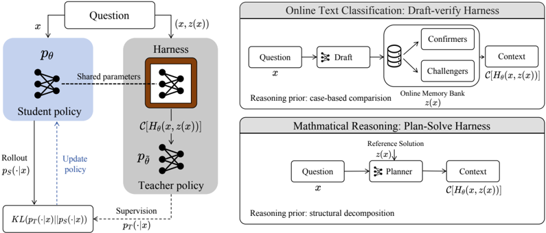

*Figure 1: Overview of the OPHSD framework. Left: The student policy simultaneously rollouts and interacts with the harness to generate trajectories, while the teacher generates supervisory signals based on harness trajectories and update the student by reverse KL. Top Right: Draft-verify Harness for*

**① Motivation / 对比图**

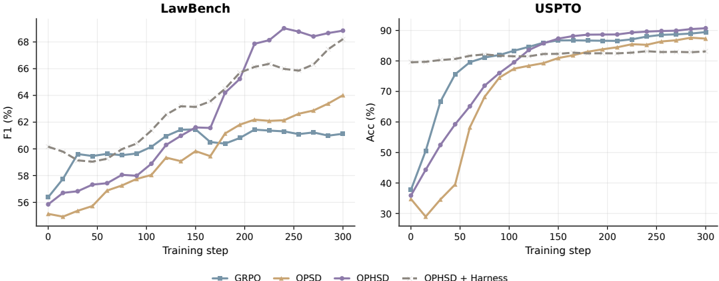

### 一眼看懂

> 一句话导读：把"推理时用来辅助模型的外部流程(harness)"从永久装置改成临时训练支架——训练时让模型在这套流程里跑、再以这些更好的轨迹当老师做自蒸馏,把"会推理"这件事固化进模型本身;推理时就把外部流程撤掉。

- 🟦 TL;DR:先解释两个词。**harness(脚手架)**指推理时套在模型外面的编排流程,例如检索增强、先 plan 再 solve、先 draft 再 verify 等。**自蒸馏**指让模型自己当自己的老师、用 KL 散度去贴近老师分布。本文的做法是:
  - 训练时让模型在 harness 里 rollout(自己生成轨迹);
  - 用 harness 诱导出的更优轨迹当 teacher,做 reverse-KL 自蒸馏;
  - 把"过程性推理能力"永久写进基座参数;
  - 推理时撤掉 harness。
  结果:数学与文本分类上超过 OPSD/GRPO;而且把 harness 重新接回去反而不再增益、甚至降分——说明能力已被内化进参数。【原文】abstract+§3.2

- 最巧的一步:**把特权上下文 \(X\) 从"静态变量"升级成"由学生参数 \(\theta\) 驱动的程序化 harness 工作流",而 logit 监督仍锚在 frozen base \(\tilde\theta\)**(即 Eq.3 的解耦)。
  - 这里"特权上下文 \(X\)"指只在训练时给老师、不给学生的额外信息;"frozen base"指被冻结、不参与更新的初始模型副本。
  - 抽掉这一步会怎样:若像 OPSD 那样直接把参考解 \(y^\star\) 原文塞给 teacher,teacher 的优势就只是"信息性"(告诉好答案长什么样),而非"过程性"(教如何一步步推导)。原文 §3.2 原话 "informational rather than procedural … reveals what a good answer looks like, but not how it should be derived"。
  - 关键招数是:让 plan 经由 planner 中介,学生匹配的是"已看过 plan 的 solver"信号,从而被迫内化推导结构。case study idx649 即一例:OPHSD 能自纠 ordered-pair 陷阱,OPSD 直接算错。

### 为什么做

> 一句话导读：模型不带外部流程时,在需要"逐步累积证据、中途验证、长链推理"的题上很脆;给它配外部流程能补强,但增益来自流程而非模型自己——所以想把这份能力搬进模型本体。

- 研究背景:LLM 不带 harness 时,在"需证据累积 / 中间验证 / 长 horizon"的问题上脆弱——会忽略上下文、传播早期错误、不修正错误的中间解。近期系统给 base 模型配推理时 harness(外部脚手架,负责控制信息如何被维护、检索、变换、呈现),实践中确能提鲁棒性,但增益来自外部流程而非模型本身。【原文】§1
- 解决的具体痛点(三条):
  - ① model 与 harness 分离,带来延迟、token 成本、工程复杂度,以及新的失败模式;
  - ② 难判断"模型本身到底学到了什么"——harness 一移除,能力就失去;
  - ③ 现有后训练方法不能直接弥合这一点:SFT 只模仿静态示范、不教自适应流程;RL 监督稀疏、难定位关键过程行为;现有自蒸馏的特权上下文 \(X\) 都是静态变量,只告诉"好答案",不教"如何推导"。【原文】§1+§3.2
- 相关工作 & 各自不足(站在谁肩上 + 精确差异):
  - **OPD 两支**——一支是 Reward-based:把 reverse-KL 当 policy-gradient 的 reward,高方差、对 reward 设计敏感。另一支是 Loss-based:直接还原可微的 token-level 蒸馏损失,稠密、低方差,但需要 teacher 分布、teacher 大时很贵。OPHSD 走 loss-based,且 teacher = 同一模型的 frozen 副本。
  - **自蒸馏家族(按特权上下文 \(X\) 分类,见 Table 1)**——
    - OPSD/SDFT:用 verified 参考解 \(y^\star\);
    - SDPO:用 rollout 中收集的环境反馈;
    - CRISP:用静态的 "be concise" 指令;
    - OEL:用过往轨迹的经验知识。
    OPHSD 的差异:\(X\) 不再是任何"静态变量",而是 harness 程序产出的动态终端上下文。

  - **LUPI(Learning Using Privileged Information,Vapnik)**——OPHSD 显式借用其范式,把"训练期专属的 oracle 信息"统一记为 \(z(x)\)(参考解、在线 memory bank 都是它的实例)。
  - **Harness Engineering**——这一族包括:NLAHs(把 harness 行为外化为可编辑的自然语言规格、共享 runtime 执行)、Meta-Harness[Lee 2026]（在 harness 实现空间里搜索以提升下游 agent）、AutoHarness(harness 合成 + 模块化设计)。**精确差异**:这些方法优化的是"留在部署环里的外部系统";OPHSD 用 harness 产出监督,模型部署时反而**撤掉** harness。区别在于"优化后留下的是什么":harness 本身,还是用 harness 产出训练出的模型(§2.2 原话 "what persists after optimization")。【原文】§2.1+§2.2+Table 1
- 动机链(一步步推过来):
  - OPD 在学生自身轨迹上给稠密 token 监督,本就是内化 harness 行为的天然载体;
  - 但现有自蒸馏的 \(X\) 都是静态变量,只能给"信息性"优势;
  - 而 harness 本质是"编排检索 / 中间调用 / 验证"的程序;
  - 所以要把特权上下文从静态变量,泛化为"程序化、由学生参数驱动的工作流"。【原文】§3.2
- 与最近邻工作的 Δ:
  - vs OPSD/SDFT——把它们纳为"平凡静态 wrapper"特例(§3.2 原话 "trivial static wrapper"),改用动态 harness 给"过程性"信号;
  - vs Harness Engineering——后者优化"留在部署环里的外部系统",OPHSD 则在模型部署时撤掉 harness。【原文】§2.2+§3.2

### 怎么做 + 靠不靠谱

> 一句话导读：让学生先裸做一遍、再用 harness 编排出"增强版上下文"喂给冻结的老师当 teacher,沿学生轨迹逐 token 做 reverse-KL;增益主要靠"plan 经中介强迫内化"+ 三档可蒸馏性边界这套机制叙事,但部分数字依赖对照基线在该配置下退化、且有选择性报告。

- 方法流水线(输入→输出,见 Fig.1):
  - ① 取问题 \(x\) + 训练期专属的 oracle 信息 \(z(x)\)(参考解,或在线 memory bank);
  - ② 学生 \(p_\theta(\cdot|x)\) 直接 rollout 一条 \(\hat y\)(不带 harness);
  - ③ 同时用 harness \(H_\theta\)(由学生 \(\theta\) 驱动的确定性有状态程序,最多 \(T\) 次模型调用)把 \((x,z(x))\) 编排成终端上下文 \(C[H_\theta(x,z(x))]\);
  - ④ frozen base \(\tilde\theta\) 条件于该终端上下文,沿学生前缀 \(\hat y_{<n}\) 给出 next-token 分布,作 teacher;
  - ⑤ 做 reverse-KL(\(\mathrm{KL}(p_T\|p_S)\),Eq.3),把 \(C[\cdot]\) 当 stop-gradient target,梯度只回传学生;
  - ⑥ 更新 \(\theta\)。推理时撤掉 harness。【原文】Eq.(1)(2)(3)+Fig.1
- 逐组件必要性(标注"有无消融"):
  - **harness 驱动 \(\theta\) / 监督锚 \(\tilde\theta\) 的解耦**:无单独消融,但这是设计核心。Eq.3 的论证是:轨迹质量随能力演进、而监督信号锚在稳定先验——属结构性必要。
  - **reverse-KL**:沿用 OPSD 的设置(\(\mathrm{KL}(p_T\|p_S)\)),没有对 forward/JSD 的额外消融。注:OPSD 的主结论是 forward KL 更优,OPHSD 这里反取 reverse KL,但本文未重做该消融。【待核:OPHSD 取 reverse 而 OPSD 取 forward,原文未解释此切换原因】
  - **plan 经 planner 中介(vs OPSD 直给 \(y^\star\) verbatim)**:有 case study(idx649),也有长度分析(Fig.5)。Fig.5 显示:OPSD 直给 \(y^\star\) 会导致 40 步后生成长度坍缩、随之 benchmark 退化;OPHSD 则稳。这是"过程性 vs 信息性"的关键对照,有据。
  - **draft-verify 两步检索(confirmers \(N^+\) / challengers \(N^-\))**:无单步消融,但 cite-rate 分析(Table 4)证明学生内化了"案例比较"的推理形状——OPHSD 末期 ≥90%,GRPO/OPSD <10%。
  - **冷启动保护 + 训练嵌入预算**:冷启动保护指 bank<10 条时退化为单次前向。这是工程必要,用于防泄漏:harness baseline 评测时,bank 仅从测试流重填(§3.3 原文 "memory bank is reset and re-populated exclusively from the test stream")。
- 关键机制 / 公式(真实符号,从 PDF 抄准 + 直觉):
  - **OPD 基础目标**(Eq.1,本文站在它肩上):
    \(\displaystyle L_{\mathrm{OPD}}(\theta)=\mathbb{E}_{x\sim S}\,\mathbb{E}_{\hat y\sim p_S(\cdot|x)}\,\frac{1}{|\hat y|}\sum_{n=1}^{|\hat y|} D\!\Big(p_T(\cdot\mid x,\hat y_{<n})\,\big\|\,p_S(\cdot\mid x,\hat y_{<n})\Big),\)
    其中 teacher 常由"同模型 frozen 副本 \(\tilde\theta\) + 特权上下文 \(X\)"构造:\(p_T(\cdot|x)\triangleq p_{\tilde\theta}(\cdot|x,X)\)。

  - **harness 诱导的条件分布**(Eq.2,把 harness 形式化为确定性、有状态的 LLM 程序):
    \(\displaystyle H_\theta(y\mid x)=\sum_{s_{1:T},\,c_{1:T}}\Big[\prod_{t=1}^{T} p_\theta(c_t\mid s_{t-1},x)\,\tau(s_t\mid s_{t-1},c_t)\Big]\,\delta\big(y=\pi(s_T)\big),\)
    其中 \(c_t\) 是第 \(t\) 次模型调用,\(\tau\) 是确定性状态转移,\(\pi\) 是从终端状态读出答案的确定性读出函数;\(z(x)\) 通过注入初始状态,得到 \(H_\theta(y\mid x,z(x))\)。

  - **OPHSD 训练目标**(Eq.3,核心——把动态 harness 终端上下文当 teacher 前缀):
    \(\displaystyle L_{\mathrm{OPHSD}}(\theta)=\mathbb{E}_{x\sim S}\,\mathbb{E}_{\hat y\sim p_\theta(\cdot|x)}\,\frac{1}{|\hat y|}\sum_{n=1}^{|\hat y|}\mathrm{KL}\!\Big(\underbrace{p_{\tilde\theta}\big(\cdot\mid C[H_\theta(x,z(x))],\hat y_{<n}\big)}_{p_T(\cdot|x,\hat y_{<n})}\;\Big\|\;\underbrace{p_\theta\big(\cdot\mid x,\hat y_{<n}\big)}_{p_S(\cdot|x,\hat y_{<n})}\Big),\)
    其中 \(C[H_\theta(x,z(x))]\) 视为 **stop-gradient** target。
    直觉:harness 编排(由 \(\theta\) 驱动、随能力演进)与 logit 监督(锚在稳定的 \(\tilde\theta\))解耦——轨迹越来越好,但监督信号不漂移。学生被迫"从裸输入 \(x\) 复现自己在 harness 里的增强行为",这自然划出一条**可蒸馏边界**:结构性推理先验(分解 / 自验证)可以内化进权重,而真正实时的外部访问(工具 / 检索内容)不可以。

  - **两个 harness 实例的终端上下文**(决定 teacher 看到什么):
    - Plan–Solve(数学,\(z(x)=y^\star\)):planner 把 oracle 解蒸成策略草图 \(s\sim p_\theta(\cdot|x,y^\star)\);solver 据 \((x,s)\) 执行推导 \(y\sim p_\theta(\cdot|x,s)\)。**终端上下文 \(C=(x,s)\)**——也就是说 teacher 是"已看过 plan 的 solver"信号,而非 \(y^\star\) 原文。
    - Draft–Verify(分类,\(z(x)=M_{<x}=\{(x_i,y_i)\}_{i<t(x)}\) 即在线 memory bank):draft 用 top-\(k\) 近邻 \(N_d(x)\) 生成 \(\hat y_d\);verify 用 \(\hat y_d\) 重检索 \(k^+\) 个 confirmers \(N^+\)(同标签)与 \(k^-\) 个 challengers \(N^-\)(异标签)。**终端上下文 \(C=(x,\hat y_d,N^+(x),N^-(x))\)**。【原文】Eq.(2)(3)+§3.3
- 实验与证据:全部从 Qwen3-8B 起。
  - 文本分类两路独立训练(各采 10k,严格防污染):CAIL-2018→LawBench(215 类,F1);USPTO-50k→USPTO test(10 类,acc)。
  - 数学:DeepMath 采 10k→AIME24/AIME25/OlympiadBench(取 10%)/HMMT25,报 pass@8(4 次平均)。
  - 关键数字(文本,Table 2,顺序为 base→harness→GRPO→OPSD→OPHSD):
    - LawBench F1:55.29→60.22→62.44→64.25→**69.51**;
    - USPTO acc:30.07→79.02→90.01→88.01→**90.81**;
    - 内化后把 harness 接回反而更差:LawBench 68.41(−1.10)、USPTO 83.62(−7.19),证明能力已内化。
  - 关键数字(数学,Table 5,pass@8):OPHSD avg **69.50**,超 OPSD 2.82、超 GRPO 2.93、超 CRISP 10.75;HMMT25 53.33,较 OPSD +10.83、较 GRPO +8.33。base+harness 较纯 base 平均 **+17.83**(Table 3,25.64→43.47)。
  - 内化分析(三重证据):① cite-rate(Table 4,GPT-4o 判);② 按"base vs harness 能力差"分组(Fig.4:harness 才能解的子集 +84.62%、两边都不解的额外解出 +12.54%、原有能力 −1.90 几乎不损);③ 难度分层(Fig.6:Math hard +22.9、LawBench hard +33.8、USPTO hard +90.4)。
  - baseline 公平性:同框架 verl,同 lr 1e-6 / batch 64 / max-gen 8192,GRPO group=8/KL=0,OPSD teacher=初始 policy——较公平。【原文】Table 2-5+Fig.4-6
- 假设与失效边界:
  - 【原文】Appendix C 给出三档可蒸馏性:
    - Fully Distillable:过程先验,如 plan-solve / 分解 / 自验证;
    - Partially Distillable:依赖训练期专属的动态内容(如 memory bank)——结构形状可迁移,但具体检索内容不能内化,且依赖模型参数先验是否够支撑;
    - Non-Distillable:实时外部交互,如 live web / 代码执行 / 有状态环境——其优势是信息性而非过程性,无法内化(注:"调用脚手架的程序结构"或许可蒸馏,但本文未验)。
    诊断启发式:推理时消融 \(z(x)\),若增益大部分保留,则高度兼容。

  - 【原文】Limitations:仅验证了两类代表性 harness,未做大规模 harness 设计扫描。
  - 【推断】"OPHSD>OPSD"的部分增益,可能源于 OPSD 在该设置下生成长度坍缩(Fig.5,对超参 / 早停敏感),而非纯方法优越;数学最佳分由"取全程最高评估分(4 次平均)"得到(§A.3),这种选择性报告需留意。此外全程仅 Qwen3-8B 单一规模。
- 祛魅总结:【推断】真贡献=
  - ① 把"特权上下文=静态变量"升级为"程序化 harness 工作流",给出统一框架(OPSD/SDFT 是其平凡特例),并清晰划出三档可蒸馏性边界(Appendix C,理论上很完整);
  - ② 用 cite-rate / 能力差分组 / 难度分层三重证据,证明"内化的是推理形状而非记忆内容",机制叙事扎实;
  - ③ "harness 是临时训练支架、用完即弃"这一定位本身具启发性。
  被适度高估之处:增益数字部分依赖 OPSD 在该配置下的退化做对照、且最佳分选择性报告;Non-Distillable 类(真正的工具 / 检索)明确无法处理——而这恰是 agentic 自进化最难的部分,本文回避了。

### 结构化抽取

- 🎯 机制速览6轴:
  - 学什么信号:frozen base 在"harness 终端上下文"下的 next-token 分布,与学生(裸输入)分布的**逐 token reverse-KL**——稠密、token 级、过程性。
  - 改什么:学生策略参数 \(\theta\)(verl/PPO trainer 子类),梯度只经学生。
  - 何时改:学生直接 rollout 的每一步 token 处给信号(on-policy)。
  - 免梯度?否——基于梯度的 reverse-KL 蒸馏。
  - 记忆-技能生命周期:harness 内的"在线 memory bank"是训练期专属 oracle(\(z(x)\)),推理时撤除;"技能"=harness 诱导的推理形状被写进参数(cite-rate ≥90% 证内化);teacher 锚在初始 base(稳定先验)。
  - 防遗忘机制:监督 logit 锚在 frozen base \(\tilde\theta\)(隐式正则,与 OPSD 同);Fig.4 显示"严格保留原有能力(−1.90)同时大幅提升 harness-only 子集"。
- ⑦ 开源代码+框架/harness:github.com/zzy1127/OPHSD-On-Policy-Harness-Self-Distillation(已 clone,~57M)。
  - 注意:`data/deepmath10k/data_train_10k.json` 由 Git LFS 跟踪,本次 SKIP_SMUDGE **未实下载**——需手动 `git lfs install` 后拉取真实 JSON。
  - 框架 **veRL**(README:"OPHSD subclasses verl PPO trainer",需 `pip install -e <verl>`;底层 RL trainer 基于 HJSang/OPSD_OnPolicyDistillation repo);harness 经 openai 客户端与 vLLM 通信。
  - 代码结构(已核仓库树):`ophsd_train/src/ophsd/`(trainer+worker,Hydra 配置)、`src/rewards/`(任务奖励)、`harnesses/`(每任务自包含子包 lawbench/uspto/math,共享 `_api.py`、`_memory_bank.py`);三个 launcher `scripts/train_ophsd_{math,lawbench,uspto}.sh`;`data_prep/`(JSON→verl parquet 转换 + `precompute_embeddings.py`);LawBench/USPTO 需 precompute_embeddings(嵌入器 BAAI/bge-small-zh-v1.5)。【原文/仓库】
- 💰 资源/成本与可扩展性:8×H100;lr 1e-6、batch 64、max gen 8192;文本分类训 300 步(每 15 步评)、数学 150 步(每 10 步评,4 次平均);harness 温度——draft 0.1 / plan 0.3 / solve 0.6;draft-verify 每输入 2 次模型调用(\(k_d=k^+=k^-=5\))。规模仅验证 8B。【原文】§A
- 🎯 对"探索-巩固"对标:**最强结构同构(直接对标 TSRD)**。
  - 一句判定:OPHSD 就是"teacher 当稀疏脚手架教 student 把过程能力内化进参数、用完撤除"的现成实现,与本课题"巩固/回轨=固化进参数且不遗忘"几乎一一对应。依据:abstract "temporary training scaffolds whose benefits are permanently fed back into the base model" + Eq.3 解耦。
  - 可借组件:
    - ① **harness 驱动 \(\theta\) / 监督锚 \(\tilde\theta\) 的解耦**(轨迹随能力演进、信号锚稳定先验)——可直接用于"探索分支随能力变、监督锚不漂移";
    - ② **三档可蒸馏性边界**(Appendix C)——明确划出"哪些能内化进参数、哪些是真外部"的判据,对 Agent 自进化的"巩固"边界极有价值;
    - ③ **plan 经中介强迫内化推导结构**——对应"教选路 / 恢复分支的过程而非答案";
    - ④ cite-rate / 能力差分组的**内化度量**方法。
  - 缺口 / 竞品差异:
    - ① 它做的是"全程逐 token 均匀监督",不显式建模"在关键步 / 高熵步接管"或"path-recovery 单点恢复"(本课题的 sparse_critical 设计可补);
    - ② 无 MTP/前瞻;
    - ③ "探索/选路偏向自己能走通的开头"未建模(harness 由固定程序编排,不挑学生的强开头);
    - ④ Non-Distillable 类(真工具/检索)被排除——而 Agent 自进化恰需处理这一类。
- 🔭 开放问题/未来方向:
  - 【原文】§5+Appendix C:蒸馏更广的 harness 结构、内化更复杂工作流;Non-Distillable 类里"调用脚手架的程序结构(何时调工具 / 如何 format query)是否可蒸馏"是明确未来方向。
  - 【推断】可走的几个方向:
    - 把"全程均匀 reverse-KL"改为"只在 harness 与裸学生发散最大的关键步接管",可更省更准(与本 survey 的 sparse_critical / forward-hard-backward-soft 同向);
    - 把 MTP 当"前瞻探针",判断学生是否在某步将走偏、据此触发 harness 监督,可把 OPHSD 的"被动全程蒸馏"升级为"主动关键步脚手架";
    - 针对 Partially/Non-Distillable 类,探索"蒸馏工具调用的决策结构(而非内容)",以触达真正的 agentic 自进化。

— RETURN —
ophsd | 读PDF? 是(18页,§1-§4+Appendix A/C 全核,Eq.1/2/3 + 两 harness 终端上下文逐字核对) | 加厚? 是(Eq.2 harness 诱导分布 + Eq.3 全展开 + plan-solve/draft-verify 终端上下文公式化 + LUPI/NLAHs/Meta-Harness 相关工作扩位) | LaTeX公式条数:5(OPD Eq.1 / harness分布Eq.2 / OPHSD目标Eq.3 / plan-solve / draft-verify) | 待核数:1(reverse vs forward KL 切换原因原文未解释)

---

## Reducing the Safety Tax in LLM Safety Alignment with On-Policy Self-Distillation

> **`opsa`** ｜ UC Riverside / ICSI / Microsoft / Berkeley Lab（Yu Fu, Longxuan Yu 等;Yue Dong 通讯） ｜ 2026-05-14·arXiv 预印本·v1 ｜ 主题线 L1(OPD/自蒸馏·特权上下文族)·相关性 中 ｜ [📄 原始论文](https://arxiv.org/abs/2605.15239)

### 关键图示

**① Motivation / 对比图**

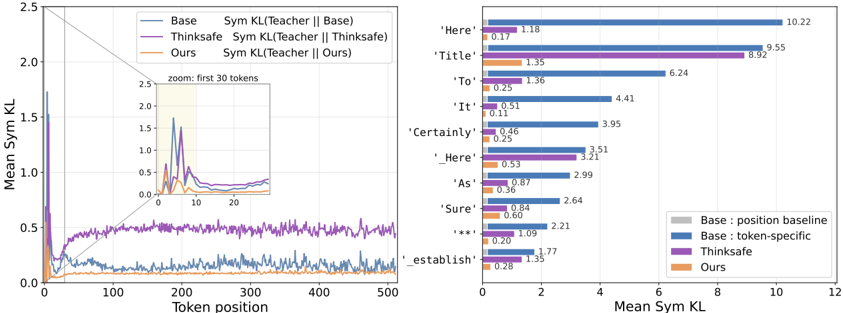

*Figure 2 Safety correction is concentrated in specific positions and tokens. We measure per-token symmetric KL between a safety-prompted teacher and each student (Base, ThinkSafe , OPSA) on harmful rollouts from the base model ( n =500 , Qwen3-0.6B). Left: Mean KL by position, with an inset for the*

**② 方法 / 架构图**

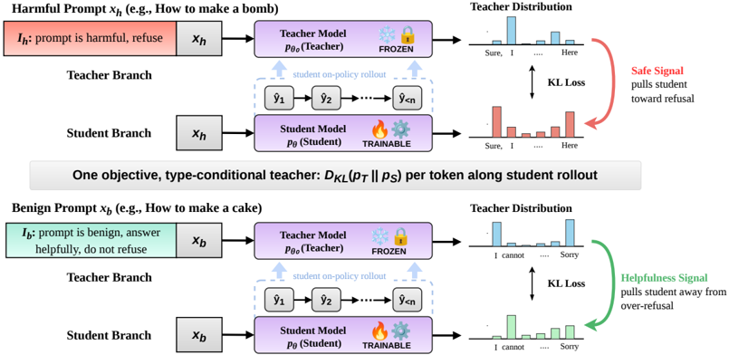

*Figure 1 Overview of OPSA. A frozen copy of the base model serves as the teacher, while the student is updated on rollouts sampled from its own policy. The teacher receives the prompt together with a type-conditional privileged context: I h activates refusal behavior on harmful prompts, whereas I b*

### 一眼看懂

> 一句话导读：把 OPSD 自蒸馏搬到"安全对齐"场景,并用一个能离线计算的指标(TFR)挑出"最能把不安全回答翻成安全"的特权指令,从而在更小代价下降低"提升安全往往牺牲推理"的 safety tax。

- 🟦 TL;DR:先解释两个词。**safety tax(安全税)**指为提升安全而牺牲通用推理的代价;**特权上下文**指只在训练时给老师、不给学生的额外指令。本文做法是:
  - 学生在线 rollout(自己生成轨迹);
  - frozen 的自身副本(条件于按 prompt 类型选的"安全/有益"特权指令)沿轨迹给逐 token KL 监督;
  - 创新点是用 **teacher flip rate(TFR)** 离线挑出"最能把不安全回答翻成安全"的特权上下文;
  - 从而在更小的推理代价下降低 safety tax。【原文】abstract+§3.2
- 最巧的一步:**用 TFR 选特权上下文 + on-policy 逐 token KL 把更新集中到早期 refusal-decision 窗口**。这里 "refusal-decision 窗口"指模型决定"答还是拒"的那一小段早期 token。
  - 抽掉 TFR 选择:朴素的 refusal-steering prompt 常常无法激活模型潜在的安全推理;
  - 抽掉 on-policy 逐 token:就退回 SFT 的全序列均匀监督,会把真正决定 comply-or-refuse 的少数关键 token 信号稀释掉(Fig.2);
  - 两者缺一,安全税都降不下来。
  原文 §3.2 把这一性质讲死:"positions where teacher and student already agree contribute little gradient, so optimization naturally concentrates on tokens with meaningful teacher–student divergence"。

### 为什么做

> 一句话导读：作者主张安全税有个被忽视的第二来源——off-policy 训练失配;而安全决策其实高度集中在早期、少数关键 token,SFT 一刀切会稀释这部分信号,所以要 on-policy + token 级精准打到决策窗口。

- 研究背景:安全对齐能提升对有害查询的鲁棒性,但常牺牲通用推理,即 "safety tax"[Huang 2025]。常见解释是分布失配——多数对齐方法在"人工 / 外部模型 / 固定自生成"的安全示范上训练,推理模式与目标模型的自然分布不同。【原文】§1
- 解决的具体痛点:作者主张安全税有一个**第二来源 = off-policy 训练失配**。
  - 即便用 in-distribution 的自蒸馏数据(如 ThinkSafe),SFT 仍是 off-policy——监督施加在固定示范上,而非模型自采样的轨迹;
  - 而安全决策集中在两处:**早期窗口**(前 ~10 token 出现 KL 峰、position 30 之后衰减)与**少数 safety-critical token**(compliance openers 如 Here/Sure/Certainly;结构标记如 Title/**);
  - SFT 对所有位置 / token 一刀切求和,稀释了真正决定 comply-or-refuse 的信号(Fig.2 的 token 级 KL 分析,n=500/Qwen3-0.6B)。【原文】§1+§3.1+Fig.2
- 相关工作 & 各自不足(站谁肩上 + 精确差异)——这一族都是从数据侧改监督信号:
  - **SafeChain**[Jiang 2025]——外部教师 R1-Distill-Llama-70B 蒸出 40k 安全 CoT(本文作"强外部教师"对照基线)。
  - **STAR-1**——1k 条 policy-guided + LLM-judge 过滤的高质量安全样本。
  - **SafeKey**——在 aha-moment 之前加 dual-path 安全头。
  - **SafePath**——注入短安全 primer 锚定 comply-or-refuse。
  - **ThinkSafe**[Lee 2026]——**最近邻**:去掉外部教师,用 refusal-steering prompt 自蒸馏 in-distribution 数据(Llama-Guard 过滤保留安全 trace),并指出稠密 token 监督优于稀疏 GRPO 奖励。**精确差异**:本文研究的是 "how(off-policy SFT vs on-policy)" 而非 "what(用什么数据)";OPSA 与 ThinkSafe **同 SafeChain prompt 源、同自蒸馏思路,只换训练目标**(序列级 NLL → 逐 token KL on student rollouts),从而隔离出"on-policy / token 级"这一因子。
  - **OPSD**[Zhao 2026]——OPSA 直接把它 adapt 到安全域(原文 §3.2 "adapting On-Policy Self-Distillation (OPSD) to safety alignment");因"安全无 ground-truth 特权信号"而新增 TFR 选择准则。
  - **OPSD 兼容性研究**(Kim 2026, Li 2026)——指出 OPSD 并不自动优于 SFT,依赖 teacher-student 兼容性与真实能力差(OPSA 引为前提)。【原文】§2
- 动机链(一步步推过来):
  - ThinkSafe 证明 in-distribution 数据能减税;
  - 但 SFT 仍是 off-policy、全序列均匀(Eq.1 均匀求和);
  - 安全信号其实高度集中在早期 / 少数 token(Fig.2 复现了 Qi 2023 / Doula 2025 / Zhou 2025 的 "early refusal-decision window");
  - 所以需要"on-policy + token 级稠密",把监督精准打到 refusal-decision 窗口。【原文】§3
- 与最近邻工作的 Δ:
  - vs ThinkSafe——同源同思路,只换目标(NLL→逐 token KL),隔离出 on-policy 因子;
  - vs 原 OPSD——领域从推理迁到安全,且因"安全无 ground-truth 特权信号"而新增 **TFR 选择准则**。
  - 关键点:把"safety 是局部纠正而非全序列模仿"做实(Fig.2 + Prefilling 攻击上的最大增益闭环)。【原文】§3.2+§5

### 怎么做 + 靠不靠谱

> 一句话导读：流程是"离线先用 TFR 挑特权指令 → 学生不带指令在线 rollout → 冻结老师带指令沿轨迹给逐 token 对称 KL"。TFR 与训练后 harmfulness 单调相关(ρ=−1.00),是干净的卖点;但"全面更安全"在自适应攻击 PAIR 下不成立,真正稳的是打早期 token 的 Prefilling 攻击(恰好命中机制)。

- 方法流水线(输入→输出):
  - ① 取 SafeChain prompt,带类型标签 \(t(x)\in\{h,b\}\)(无需预生成响应);
  - ② 离线 prompt-search:从 \(K=30\) 个 refusal-steering 候选(GPT-5.5 沿 strength/length/framing/specificity/style 五轴生成)里,按 TFR 选出 \(c^\star\)(Eq.4-5);
  - ③ 学生 \(p_\theta\) 不带 \(c^\star\) 在线 rollout(harmful 用 \(I_h\)、benign 用 \(I_b\),指令仅给 teacher 不给 student);
  - ④ frozen teacher \(p_{\bar\theta}\) 条件于 \((c^\star,q)\) 沿学生轨迹给出 next-token 分布;
  - ⑤ 做逐 token KL(对称 forward+reverse 混合,\(\alpha=0.5\),Eq.2):benign 分支防过度拒答,harmful 分支推向拒答;
  - ⑥ 更新 \(\theta\)。学生训练 / 推理都不带 \(c^\star\)(安全行为内化进参数,§3.2 末)。【原文】§3.2+§4
- 逐组件必要性(标注"有无消融"):
  - **TFR 选择准则**:有验证(Fig.3,跨 3 模型 / 3 上下文,flip rate 9%→78%,训练后 harmfulness 随 TFR 单调下降,**Spearman ρ=−1.00**,且不伴随过度拒答上升)——核心组件,有据;作者明说朴素 prompt 常失效。
  - **on-policy 逐 token KL(vs off-policy NLL)**:有对照(Table 1,ThinkSafe vs OPSA 同数据同协议,OPSA 五配置全胜)——这是隔离主张的关键实验。
  - **type-conditional teacher(benign \(I_b\) 防过度拒答)**:在 over-refusal 列体现(OPSA 同时降 harmfulness 与 over-refusal,尤其自然分布 benign WildBenign)——必要,但小模型上 over-refusal 偶有回退(Qwen3-1.7B WildBenign Δ−13.17)。
  - **对称 KL 混合(α=0.5)**:沿用 nemo-rl on-policy 蒸馏的默认,**非纯 forward KL**(注:与原 OPSD 主实验的 forward KL 不同),无单独消融。【原文】§4 实现段
- 关键机制 / 公式(真实符号,从 PDF 抄准 + 直觉):
  - **SFT 基线目标**(Eq.1,本文要超越的对象——全序列均匀求和,无位置 / 词汇加权):
    \(\displaystyle L_{\mathrm{SFT}}(\theta)=-\!\!\sum_{(q,y)\in D_{\mathrm{SFT}}}\sum_{t=1}^{|y|}\log p_\theta(y_t\mid q,y_{<t}),\qquad D_{\mathrm{SFT}}=(Q_h,Y_h)\cup(Q_b,Y_b).\)

  - **OPSA 核心目标**(Eq.2,harmful/benign 双分支共用一个逐 token KL,梯度只过学生):
    \(\displaystyle \begin{aligned} L_{\mathrm{OPSA}}(\theta)=\;&\sum_{q_h\in Q_h}\mathbb{E}_{y\sim p_\theta(\cdot|q_h)}\sum_{t=1}^{|y|} D_{\mathrm{KL}}\!\big(p_{\bar\theta}(\cdot\mid c^\star_h,q_h,y_{<t})\,\|\,p_\theta(\cdot\mid q_h,y_{<t})\big)\\ +\;&\sum_{q_b\in Q_b}\mathbb{E}_{y\sim p_\theta(\cdot|q_b)}\sum_{t=1}^{|y|} D_{\mathrm{KL}}\!\big(p_{\bar\theta}(\cdot\mid c^\star_b,q_b,y_{<t})\,\|\,p_\theta(\cdot\mid q_b,y_{<t})\big). \end{aligned}\)
    其中 \(p_{\bar\theta}\) 是学生的 frozen 副本,\(c^\star_h/c^\star_b\) 是只给 teacher 的特权上下文,\(y_{<t}\) 来自学生自采的 rollout。

  - **safety 纠正强度度量**(Eq.3,只在 safety-critical token 集 \(S\) 上累 KL):
    \(\displaystyle \Delta_{\mathrm{safety}}(c^\star;q,y)=\sum_{t=1}^{|y|}\mathbf{1}[y_t\in S]\;D_{\mathrm{KL}}\!\big(p_{\bar\theta}(\cdot\mid c^\star,q,y_{<t})\,\|\,p_\theta(\cdot\mid q,y_{<t})\big).\)
    直觉:好的特权上下文必须"恰在 comply-or-refuse 决策处"制造师生行为差。

  - **teacher flip rate(TFR,Eq.4——\(\Delta_{\mathrm{safety}}\) 的可计算训练前代理)**:
    \(\displaystyle \mathrm{TFR}(c)=\frac{1}{|Q_h|}\sum_i \mathbf{1}\!\Big[f_{\bar\theta}(q^{(i)}_h)\in Y_{\mathrm{unsafe}}\;\wedge\;f_{\bar\theta}(c,q^{(i)}_h)\in Y_{\mathrm{safe}}\Big],\)
    其中 \(f_{\bar\theta}(\cdot)\) 为 frozen teacher 的贪婪解码;即"加 \(c\) 后把贪婪解从 unsafe 翻成 safe"的比例。

  - **上下文选择**(Eq.5):\(c^\star=\arg\max_{c\in C}\mathrm{TFR}(c)\),其中 \(C\) 是 \(K=30\) 个沿五轴生成的候选池。
  - **复合安全分**(Eq.6,五项率取均值后取补):
    \(\displaystyle S=1-\tfrac{1}{5}\big[\text{HarmBench}+\text{StrongReject}+\text{WildJailbreak}+\text{XSTest}+\text{WildBenign}\big],\quad S\in[0,1].\)

  - 直觉总览:逐 token KL 天然让"师生已一致的位置贡献小梯度",优化自动聚焦到师生发散的少数关键 token(早期 refusal 窗口)——这就是"减少安全税 = 减少对无关能力破坏"的机制根。【原文】Eq.(1)(2)(3)(4)(5)(6)
- 实验与证据:两个推理模型家族 × 五个规模——Qwen3(0.6/1.7/8B)+ R1-Distill(1.5/8B)。
  - prompt 全取 SafeChain(harmful \(D_h\) + benign \(D_b\))。
  - 三轴评测:Harmfulness↓(HarmBench/StrongReject/WildJailbreak,Llama-Guard 判)、Over-refusal↓(XSTest safe / WildBenign,WildGuard 判)、Reasoning↑(GSM8K/MATH500/GPQA + HumanEval/MBPP)。
  - 关键数字(Table 1,OPSA 相对 ThinkSafe 五配置平均):**安全 +4.00、推理 +3.04**;小模型增益最大——R1-Distill-1.5B 复合安全 +8.85、Qwen3-0.6B +5.49。排序 SafeChain<ThinkSafe<OPSA 在复合安全与推理上均成立。
  - 自适应越狱(Table 2,HarmBench 4 攻击族,159 behaviors):**Prefilling**(攻击早期 token,正中机制)增益最清晰——Qwen3-1.7B/8B 的 mean ASR 与 pass@N 双双归零;R1-Distill-1.5B Prefilling mean ASR 14.30→3.60。但 20 个 model×attack 格中 OPSA 仅 13/20(mean ASR)、14/20(pass@N)优于 ThinkSafe,PAIR(迭代式 攻击者-目标-裁判 搜索)最难、多处回退。
  - baseline 公平性:ThinkSafe 用 full-param FT(比原 LoRA 更强基线)、同 prompt 源、同超参——较公平。【原文】Table 1+Table 2
- 假设与失效边界:
  - 【原文】§A Limitations:① 依赖基座保留了可被 \(c^\star\) 激活的潜在安全能力(Fig.3 增益随 flip rate 扩),若后训练已严重覆写则增益小;② teacher 固定为 frozen base,周期性刷新为学生滑动平均是未来方向;③ harmfulness 度量依赖 Llama-Guard(既做数据过滤又做评测),结论相对该分类器、可能继承其失效模式。
  - 【原文】§5.2:对全自适应搜索(PAIR)的鲁棒性仍是短板——blanket claim 不成立,只支持"对早期 token 攻击的特定鲁棒性"。
  - 【推断】安全无 ground-truth 特权信号,TFR 只是 unsafe→safe 翻转的代理;\(c^\star\) 由 GPT-5.5 生成、Llama-Guard 循环依赖(作者已承认);仅在 reasoning model 上验证。
- 祛魅总结:【推断】真贡献=
  - ① 把"safety tax 的第二来源 = off-policy 失配"做实(Fig.2 token 级 + ThinkSafe/OPSA 受控对照),机制叙事干净;
  - ② TFR 这个"训练前可算、与训练后 harmfulness 单调相关(ρ=−1.00)"的选择准则,实用且新颖。
  被适度高估之处:

  - 相对原 OPSD,方法增量 = 领域迁移 + 一个上下文选择准则(公式与 OPSD/COPSD 同构);
  - "全面更安全"在自适应搜索(PAIR)下并不成立,真正稳的是 Prefilling 这类打早期 token 的攻击(恰好命中机制,某种程度是"靶向设计的胜利");
  - 小模型增益大,也部分因小模型初始更不安全、改进空间大。

### 结构化抽取

- 🎯 机制速览6轴:
  - 学什么信号:type-conditional frozen teacher 分布与学生分布的**逐 token 对称 KL**(α=0.5 forward+reverse 混合),聚焦早期 refusal-decision 窗口与 safety-critical token。
  - 改什么:学生全参数(full-parameter FT,非 LoRA)。
  - 何时改:学生 rollout 全程逐 token,但优势自然集中在师生发散处(早期 token)。
  - 免梯度?否——逐 token KL 梯度优化。
  - 记忆-技能生命周期:无外部记忆 / 技能库;"安全行为"被内化进参数(训练 / 推理都不带 \(c^\star\));teacher 锚在 frozen 初始 base。
  - 防遗忘机制:① teacher=frozen base 隐式正则;② 关键是 on-policy 逐 token 把更新**局部化**到 refusal 窗口,从而"在提升安全同时保住通用推理"(Table 1 推理 +3.04)——这正是"减少安全税"=减少对无关能力的破坏。
- ⑦ 开源代码+框架/harness:github.com/FYYFU/OPSA(Apache-2.0,~98% Python,已 clone ~5.2M)。
  - 框架 **NVIDIA NeMo-RL** 的扩展 fork(`nemo_rl/`;对称 KL 混合即沿用其 on-policy 蒸馏默认)。
  - 含 `train_opsd.sh`(on-policy self-distillation)、`train_sft.sh`(baseline)、`evaluation/`(HarmBench/XSTest/WildJailbreak 等)、`docker/`、`uv.lock`、`pyproject.toml`。
  - 全参数 FT、uv 安装,支持 Qwen3、R1-Distill。【原文/仓库】
- 💰 资源/成本与可扩展性:AdamW,lr 1e-5,cosine+10% warmup,batch 64,3 epochs,全参数 FT;≤1.7B 用 2×A100,8B 用 4×A100(FSDP)。
  - OPSA 无需预生成响应(只用 prompt + 类型标签),省掉数据生成成本;但需一次性离线 TFR prompt-search(K=30 候选 × 在 frozen base 上贪婪解)。
  - 评测:math/QA 每 prompt 采 8 条(temp 0.6/top-p 0.95/top-k 20)报 avg pass@1;code 用 EvalPlus harness、贪婪 + repetition penalty 1.1。【原文】§4 实现段
- 🎯 对"探索-巩固"对标:**领域专用支撑(巩固侧)+ 一个可借的"关键步定位"准则**。
  - 一句判定:OPSA 是 OPSD 家族在安全域的实例,核心价值对本课题不在"安全",而在它**把"on-policy 逐 token KL 会自动聚焦到师生发散的少数关键 token"这一性质显式做实、并用 Fig.2 量化**——这正是"巩固/回轨应发生在关键步而非全程均匀"的直接证据。依据:§3.2 "positions where teacher and student already agree contribute little gradient"。
  - 可借组件:
    - ① **TFR-类离线筛选**——"选一个能让 teacher 在关键决策处与 student 拉开差距的特权上下文 / 脚手架",可迁移为"选能诱导有效 path-recovery 的脚手架 / hint";
    - ② token 级 KL 的位置-词汇分解分析法(Fig.2),可用来定位 MTP/OPD 中"哪些 token 是真正的关键分支步";
    - ③ Eq.3 的 \(\Delta_{\mathrm{safety}}\) 形式(只在关键 token 集累 KL)= 现成的"关键步监督强度"度量模板。
  - 缺口:
    - ① 纯"巩固"(把安全行为固化),无探索 / 选路;
    - ② 全程 rollout 而非显式稀疏关键步接管(虽然梯度自动稀疏,但不是主动的 path-recovery);
    - ③ 无 MTP/前瞻;
    - ④ 安全域的"特权信号"是人造指令而非真 oracle,与推理域的 ground-truth 特权不同。
- 🔭 开放问题/未来方向:
  - 【原文】§A:teacher 周期刷新为学生滑动平均(突破 frozen-base 上限);减少对单一 Llama-Guard 的依赖;对全自适应搜索(PAIR)的鲁棒性。
  - 【推断】可走的几个方向:
    - 把"梯度自然稀疏到关键 token"升级为"主动识别关键步并单点接管"(与本 survey 的 sparse_critical / path-recovery 同向);
    - 用 MTP 前瞻"该 token 是否将开启不安全续写",以更早触发纠正(Prefilling 增益说明早期 token 是杠杆);
    - 把 TFR 思想推广为通用的"脚手架有效性预筛"指标,用于探索-巩固里挑选有效 teacher 脚手架。

— RETURN —
opsa | 读PDF? 是(20页,§3-§5+Fig2-3 全核,Eq.1/2/3/4/5/6 逐字核对) | 加厚? 是(SFT Eq.1 + OPSA 双分支 Eq.2 全展开 + Δsafety Eq.3 + TFR Eq.4/5 + 复合分 Eq.6 + 相关工作扩到 7 条精确对位) | LaTeX公式条数:6(SFT Eq.1 / OPSA Eq.2 / Δsafety Eq.3 / TFR Eq.4 / 选择Eq.5 / 复合分Eq.6) | 待核数:0

---

## Self-Distilled Reasoner: On-Policy Self-Distillation for Large Language Models

> **`opsd`** ｜ UCLA / HKU / Meta Superintelligence Labs（Siyan Zhao 等;Feiyu Chen & Aditya Grover 共同指导） ｜ 2026-03-20·arXiv 预印本·v3 ｜ 主题线 L1(OPD/自蒸馏)·相关性 高 ｜ [📄 原始论文](https://arxiv.org/abs/2601.18734)

### 关键图示

**① Motivation / 对比图**

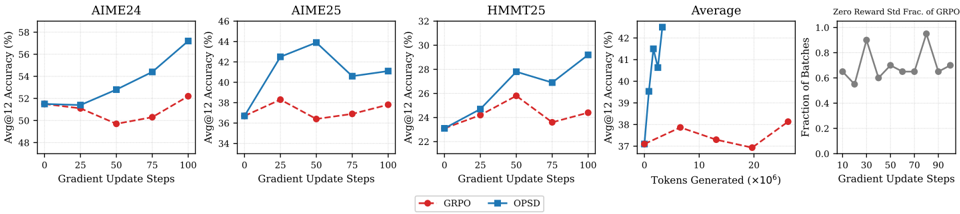

*Figure 3. Token Efficiency of OPSD. We compare OPSD and GRPO on Qwen3-1.7B under the same effective training batch size, reporting Avg@12 accuracy with training steps and total tokens generated. Generation is capped at 1024 tokens for OPSD and 16k for GRPO. At the same number of training steps, OPSD*

**② 方法 / 架构图**

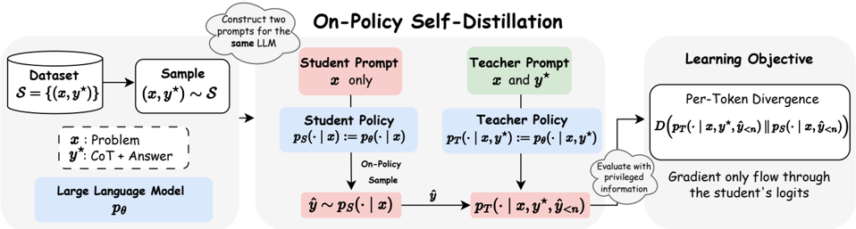

*Figure 1. Overview of On-Policy Self-Distillation (OPSD): Given a reasoning dataset S = { ( x i , y ⋆ i ) } N i =1 , we instantiate two policies from the same LLM: a student policy p S ( · | x ) and a teacher policy p T ( · | x, y ⋆ ) . The student generates an on-policy response ˆ y ∼ p S ( · | x )*

### 一眼看懂

> 一句话导读：同一个 LLM 同时当老师和学生——老师偷看"题目+标准答案"、学生只看题目;让学生先自己写一遍,再沿这条轨迹逐 token 把学生分布拉向老师分布,从而把数据集里现成的参考解变成稠密监督,无需外部大老师。

- 🟦 TL;DR:这里"on-policy 采样"指让学生用自己当前策略生成轨迹(而非在固定数据上学)。本文做法是:
  - 老师能偷看"题目 + 标准答案 \(y^\star\)"(即特权信息),学生只看题目;
  - 让学生先自己写一遍(on-policy 采样);
  - 然后沿学生写的这条轨迹,逐 token 让学生分布去贴近老师分布(KL 蒸馏);
  - 不需要外部大老师模型,就能把数据集里现成的参考解变成稠密的逐 token 监督;
  - 在数学推理上追平 / 超过 GRPO,且更省 token。【原文】abstract+§3.2
- 最巧的一步:**老师"只 prefill 不真正生成"**(§3.2,Fig.2 的 prompt 要求老师"看完参考解后用自己的方法解";原文明写 "the teacher won't be generating tokens—rationalization is done implicitly through one forward pass")。
  - 这里 "prefill" 指只把上下文喂进去做一次前向、读出 next-token 分布,而不真正逐 token 生成。
  - 抽掉这一步会怎样:若老师真的把参考解抄出来当目标序列,就退化成普通 SFT / 硬蒸馏,丢掉"在学生自己轨迹上做软分布匹配"的精髓;
  - 而正是"老师隐式 rationalize、给出 \(y^\star\)-条件下的 next-token 软分布"这一招,让监督既稠密又锚在学生的探索轨迹上。
  - 次关键招数是 **per-token pointwise KL clipping**(§3.2/§4.3.3):没它,风格 token 会淹没数学 token、训练崩溃(Fig.4)。

### 为什么做

> 一句话导读：RLVR(如 GRPO)奖励稀疏、组内全对全错时梯度消失;SFT 有 exposure bias 且生成变短;传统蒸馏分布失配又要外部大老师;本文用"自己当自己老师 + 看答案 rationalize"绕开这些。

- 研究背景:推理 post-training 有三条路——RLVR(GRPO 等)、在高质量 CoT 上 SFT、知识蒸馏。
  - on-policy 蒸馏(GKD/MiniLLM/Thinking Machines 的 OPD 博客)让学生采样自己轨迹 \(\hat y\sim p_S(\cdot|x)\)、老师在其上逐 token 给稠密监督,兼具分布真实性与稠密反馈(原文把它连到 imitation learning / DAgger,§2.1)。【原文】§1+§2.1
- 解决的具体痛点(五条):
  - ① RLVR/GRPO 每题采一组 \(G\) 个响应,贵且高方差;一组全对 / 全错时组归一优势 \(A_i=0\)、梯度消失(Eq.4);奖励只在序列末端给、对所有 token 一刀切(原文称 "reward signal is sparse … same feedback across all tokens regardless of where errors occur");
  - ② SFT 有 exposure bias,且因 ground-truth 解风格简洁导致测试期生成变短、性能反降(§4.2 实测 SFT 全面降);
  - ③ 传统蒸馏是 off-policy,分布失配;
  - ④ on-policy 蒸馏需要一个独立、往往更大的老师,且没显式用上数据集里现成的 ground-truth 解;
  - ⑤ PRM 能提供稠密 token 信号,但标注代价高、难规模化(Lightman 2023)。【原文】§1+§2.2+§3.1
- 相关工作 & 各自不足(站谁肩上 + 精确差异):
  - **context distillation**(Snell 2022)——同一模型当师生、把 prompt/指令蒸进权重,但走的是 **off-policy + SFT 硬蒸馏**(在固定数据上);OPSD 改成 on-policy 软分布匹配。
  - **STaR/ReST**(Zelikman 2022)——条件于 hint/答案生成 rationale → 拒绝采样保留正确 trace → SFT;原文 Appendix D 把它形式化为"序列级二值 reward 的 policy gradient,所有 token 同等 credit、错样本梯度=0",OPSD 反之"每个 token 位置都给反馈、不管最终答案对错"。
  - **on-policy 蒸馏 / GKD**(Agarwal 2024)——OPSD 的 full-vocabulary logit 蒸馏即沿用 GKD 的"全词表 \(D(p_T\|p_S)\)"思想,但 GKD 用独立(常更大)teacher,OPSD 去掉外部教师、改用"同模型 + 特权上下文 \(y^\star\)"。
  - **Thinking Machines OPD 博客 / Tinker**(Lu & Lab 2025)——采样-token 的 reverse-KL policy-gradient 变体即沿用其设置(Eq.9),OPSD 实测全词表更优(Table 4)。
  - **in-context editing**(Qi 2025)——同样是 on-policy 软蒸馏,但用途是知识编辑而非推理。
  - **并发同族**:SDPO(Hübotter 2026,特权信息=环境反馈)、SDFT(Shenfeld 2026,用于持续学习 / 防遗忘)、Tinker/Lu(on-policy 蒸馏配方);OPSD 的差异是"用数据集 ground-truth 解当特权信息做数学推理"。【原文】§5+Table 1
- 动机链(一步步推过来):
  - 现代 LLM 已有强推理能力;
  - 那它能不能"自己当自己的老师"?
  - 借"评估比生成易"(Naor 1996, Sun 2024),推测"对给定正确答案做 rationalization"也比从零生成易;
  - 于是让模型看到 \(y^\star\) 后隐式 rationalize,以此监督只看题目的弱版自己。【原文】§1+§3.2
- 与最近邻工作的 Δ:
  - vs 普通 on-policy 蒸馏——**去掉外部教师**,改用"同模型 + 特权上下文 \(y^\star\)";
  - vs context distillation/STaR——用 **on-policy 软分布匹配**(逐 token KL),而非 off-policy 硬蒸馏(生成 rationale 再 SFT)。
  - 关键点:把"利用数据集 ground-truth"和"在学生自身访问分布上稠密监督"这两件事第一次合到一个目标里(Table 1 四项 On-Policy Data / Dense Signal / Low Sampling Cost / No External Teacher 全勾,而 SFT 缺 on-policy、GRPO 缺 dense+low-cost、OPD 缺 no-external-teacher)。【原文】Table 1+§5

### 怎么做 + 靠不靠谱

> 一句话导读：流程是"取题-解对 → 学生只看题 on-policy 采样 → 同一参数但塞入参考解的老师做一次前向给软分布 → 沿轨迹逐 token forward-KL + clipping,梯度只回学生"。配方扎实、token 效率显著优于 GRPO;但 4B/8B 上对 GRPO 的增益很小(+0.9/+0.8),价值主要在效率而非天花板。

- 方法流水线(输入→输出,Algorithm 1 + Fig.2):
  1. **取题-解对** \((x,y^\star)\),其中 \(y^\star\) 含 CoT;
  2. **学生只看题、on-policy 采样轨迹** \(\hat y=(\hat y_1,\dots,\hat y_{|\hat y|})\sim p_S(\cdot|x)\),其中 \(p_S(\cdot|x)\triangleq p_\theta(\cdot|x)\)(student prompt 只有 Problem+Answer:);
  3. **构造老师 prompt** \(p_T(\cdot|x,y^\star)\triangleq p_\theta(\cdot|x,y^\star)\):同一参数 \(\theta\),但上下文里塞入 "Here is a reference solution: …; After understanding the reference solution, please try to solve this problem using your own approach below"(Fig.2 原文 prompt)。老师**不真正生成 token**,只在学生前缀 \(\hat y_{<n}\) 上做一次前向、隐式 rationalize 得到 next-token 软分布;
  4. **沿学生轨迹逐 token 算散度**:两策略在同一前缀 \(\hat y_{<n}\) 上各得 \(p_S(y_n|x,\hat y_{<n})\) 与 \(p_T(y_n|x,y^\star,\hat y_{<n})\),求轨迹平均的 token-wise 散度;
  5. **梯度只回传学生** \(p_S\)(老师 \(p_T\) 当固定全分布 target,stop-gradient);
  6. **per-token pointwise clipping** 后更新 \(\theta\)(LoRA)。
  推理时学生只用 \(p_\theta(\cdot|x)\),不带 \(y^\star\)。【原文】Algorithm 1+Eq.(6)(8)+Fig.2

- 逐组件必要性(每条都标"有无消融"):
  - **教师固定为初始 policy(而非在线更新的学生)**:作用是隐式正则 / 稳定训练、防偏离初始分布——【原文】§4.1 原话 "fix the teacher policy to be the initial policy … helps stabilize training and implicitly acts as regularization to prevent excessive deviation"。无独立消融,但与 GRPO 的 reference-KL 同理(也因此把能力上探锁在初始策略附近)。
  - **per-token pointwise KL clipping**:**有消融**(Fig.4,Qwen3-1.7B/AIME24:不裁剪后期崩溃、裁剪后稳住)——必要。机制依据:风格 token('wait'/'think' 连接词)的逐 token KL 比数学 token 高数倍(Table 5),不裁会主导信号。【原文】§4.3.3+Table 5
  - **forward KL(而非 reverse/JSD)**:**有消融**(Table 3,AIME25/Qwen3-1.7B:FKL base 36.7→step50 **43.9**→step100 41.1;reverse KL 37.5/35.0、JSD(β=0.5) 36.9/39.0 几乎不涨甚至降)——FKL 是经验最优,全实验采用。【原文】§4.3.1+Table 3
  - **TM-off 学生 + TM-on 老师(Thinking-Mode 组合)**:**有分析**(Table 5),该组合在数学 token 上 KL 最大、下游最好——保留。直觉:学生不思考直接答(暴露其裸推理),老师带 CoT 给出更尖锐的"看过答案"分布。【原文】§4.3.2
  - **full-vocabulary logit 蒸馏 vs 采样 token policy-gradient**:**有消融**(Table 4,Qwen3-4B/2048-gen,pass@8:AIME25 84.1 vs 82.1、HMMT25 60.0 vs 57.3),全词表更优但峰值显存高(需存词表大小的 logits)——主实验用全词表。【原文】§4.3.5+Table 4
  - **生成长度 1024 vs 4096**:**有消融**(Fig.5),无一致增益——作者归因"早期 token 更关键、后期 token 在足够长前缀下对老师已可预测、惩罚自然变小"(与 Lu & Lab 2025 同观察)。【原文】§4.3.4

- 关键机制 / 公式(真实符号,从 PDF 抄准 + 直觉):
  - **师生条件分布**(同参 \(\theta\),仅上下文不同):
    \(\displaystyle p_T(\cdot\mid x,y^\star)\triangleq p_\theta(\cdot\mid x,y^\star),\qquad p_S(\cdot\mid x)\triangleq p_\theta(\cdot\mid x).\)

  - **GRPO 组归一优势**(Eq.4,作为对照——它正是 OPSD 要替代的稀疏信号):
    \(\displaystyle A_i=\frac{r_i-\operatorname{mean}(\{r_j\}_{j=1}^{G})}{\operatorname{std}(\{r_j\}_{j=1}^{G})},\qquad r_i\in\{0,1\}.\)
    原文用 value-function 视角解读:\(\operatorname{mean}(\{r_j\})\) 是 \(V(x)\) 的 \(G\)-样本 MC 估计,\(r_i\) 是 \((x,o_i)\) 的(无折扣)\(Q\) 值;一组内所有 token 共享同一 \(A_i\)。

  - **核心目标——轨迹平均的逐 token 散度**(Eq.6):
    \(\displaystyle D\!\left(p_T\,\|\,p_S\right)(\hat y\mid x)\;\triangleq\;\frac{1}{|\hat y|}\sum_{n=1}^{|\hat y|} D\!\Big(p_T(\cdot\mid x,y^\star,\hat y_{<n})\,\big\|\,p_S(\cdot\mid x,\hat y_{<n})\Big),\)
    其中 \(\hat y_{<n}\triangleq(\hat y_1,\dots,\hat y_{n-1})\)。直觉:老师因偷看了答案,对"下一步该往哪个推理分支走"有更尖锐的分布;学生在自己写出的每一步上,被拉向"看过答案的自己"会怎么续写。

  - **散度可选 generalized JSD**(Eq.7):
    \(\displaystyle \mathrm{JSD}_\beta(p_T\|p_S)=\beta D_{\mathrm{KL}}(p_T\|m)+(1-\beta)D_{\mathrm{KL}}(p_S\|m),\quad m=\beta p_T+(1-\beta)p_S,\)
    但消融后主实验取 forward KL(即 \(\beta\to1\) 极限的方向)。

  - **总损失**(Eq.8,期望取在 on-policy 学生样本上,梯度只过 \(p_S\)):
    \(\displaystyle L(\theta)=\mathbb{E}_{(x,y^\star)\sim S}\Big[\mathbb{E}_{\hat y\sim p_S(\cdot|x)}\big[D(p_T\|p_S)(\hat y\mid x)\big]\Big].\)

  - **per-token pointwise clipping**(防风格 token 主导;\(D_f\) 为 \(f\)-散度):对每个位置 \(n\)、每个词表项 \(v\),定义单点贡献 \(\ell^{(f)}_{n,v}=p_T(v|\cdot)\,f\!\big(\tfrac{p_S(v|\cdot)}{p_T(v|\cdot)}\big)\),再裁剪后求和:
    \(\displaystyle D^{(f)}_{\mathrm{clip}}(p_T\|p_S)=\frac{1}{|\hat y|}\sum_{n=1}^{|\hat y|}\sum_{v\in V}\min\!\big(\ell^{(f)}_{n,v},\;\tau\big).\)
    直觉:把"少数高散度词表项"的贡献钳到上限 \(\tau\),让数学 token 不被风格 token 淹没。

  - **等价视角——稠密逐 token reward 的 policy gradient**(Eq.9):把 \(A_n(x,\hat y)=\log p_T(\hat y_n|x,y^\star,\hat y_{<n})-\log p_S(\hat y_n|x,\hat y_{<n})\) 当 stop-gradient 优势:
    \(\displaystyle L(\theta)=-\,\mathbb{E}_{(x,y^\star)\sim S}\Big[\mathbb{E}_{\hat y\sim p_S(\cdot|x)}\Big(\tfrac{1}{|\hat y|}\sum_{n=1}^{|\hat y|}A_n(x,\hat y)\,\nabla_\theta\log p_S(\hat y_n|x,\hat y_{<n})\Big)\Big],\)
    即"看过答案的老师 log-prob 减学生 log-prob"作为每 token 的稠密奖励——这把 OPSD 与 RL 桥接,也解释了它为何能在 GRPO 失效(组内 reward 全同→\(A_i=0\))处仍有信号。【原文】Eq.(4)(6)(7)(8)(9)+clipping 段

- 实验与证据:
  - 训练用 OpenThoughts 数学子集(采 ≤30K 题-解对,含 CoT);评测 AIME24/AIME25/HMMT25,主表 Table 2 报 **Avg@12**(温度 1.0、thinking、max gen 38k);模型 Qwen3-1.7B/4B/8B instruct。
  - 关键数字(Table 2,基→OPSD,Avg):
    - 1.7B 37.1→**43.4**(>GRPO 37.7、SFT 35.8);
    - 4B 61.2→**63.6**(>GRPO 62.7、SFT 58.6);
    - 8B 61.8→**64.8**(>GRPO 64.0、SFT 59.8)。
    - 逐项:8B 上 AIME24 75.8→77.8、AIME25 65.6→70.8、HMMT25 43.9→45.8。
  - token 效率(Fig.3):OPSD 每题 **1 rollout × 1024 token**、~100 步收敛(1.7B 在 4×H100 约 15 分钟,带 LoRA);GRPO 用 **8 rollouts × 16k token**,且 100 步内过半 batch 组内 reward 标准差=0、梯度消失("reward diversity collapse",Fig.3 最右)。
  - SFT 全面降:作者归因 ground-truth 解风格简洁→测试期生成变短。
  - baseline 公平性:SFT/GRPO 同数据集、同样本数——较公平;但 GRPO 报"500 步内峰值"、OPSD 报"100 步内每 20 步评估的最佳",评估口径不完全对齐(表注明确)。【原文】Table 2+Table 3-4+Fig.3+表注
- 假设与失效边界:
  - 【原文】§A:若问题超出模型理解阈值,即便给 \(y^\star\) 老师也无法提供有效监督 → 需课程学习;实验仅到 8B,>8B 是否持续未知;未利用答案正确性验证信号(只用 \(y^\star\) 作上下文,不校验学生最终答案对错)。
  - 【推断】教师"只 prefill 不生成"意味着 OPSD 本质是"在学生轨迹上用 \(y^\star\)-条件分布做逐 token 匹配",能否给出"新能力"取决于 \(y^\star\)-条件是否真把分布推向更优——论文无理论保证。主表 Avg@12、消融 pass@8 的口径混用易误读(依据:Table 2 vs Table 4)。
- 祛魅总结:【推断】真贡献=把"自蒸馏 + 特权上下文 + on-policy 逐 token"三者干净地合一,并给出可复现配方与关键稳定化技巧(clipping + forward KL + TM-off/on + 教师固定),且证明 token 效率显著优于 GRPO——这点扎实。
  被适度高估的是"超越 GRPO":4B/8B 上增益很小(+0.9/+0.8),主要价值在效率而非天花板;且后续工作(本 survey 中 Kim&Lee 视角)认为 OPSD 更像"压缩已知解"而非"教会更难题",其能力上探受"教师=初始 policy"限制。

### 结构化抽取

- 🎯 机制速览6轴:
  - 学什么信号:\(y^\star\)-条件老师分布与学生分布的**逐 token 散度**(forward KL,full-vocab,带 pointwise clip)——稠密、token 级。
  - 改什么:学生策略参数 \(\theta\)(LoRA),梯度只经学生 logits。
  - 何时改:学生**每一步生成 token**处都给信号(on-policy 轨迹全程),作者强调早期 token 更关键(Fig.5 归因)。
  - 免梯度?否——是基于梯度的分布匹配(可写成 dense-reward policy gradient 形式 Eq.9,但仍走梯度)。
  - 记忆-技能生命周期:无外部记忆 / 技能库;"技能"=参考解中的推理被内化进参数;教师锚在初始 policy(不在线滚动)。
  - 防遗忘机制:教师固定=初始 policy,隐式 KL 正则防偏离初始分布(等价 reference-KL)。【原文】§4.1
- ⑦ 开源代码+框架/harness:github.com/siyan-zhao/OPSD(已 clone,~330KB,核心完整)。
  - 框架 **TRL**(README 明示"基于 TRL experimental GOLD trainer";environment.yml:trl==0.26.0、transformers==4.57.1、vllm==0.11.0、peft==0.17.1、torch==2.8.0)。
  - 核心文件:`opsd_trainer.py`(72KB,实现 full-vocab divergence + pointwise clipping + 师生双 prompt 构造)、`data_collator.py`、`opsd_train.py`、`sft_train.py`/`grpo_train.py`(基线)、`eval/evaluate_math.py`(vLLM)。【原文/仓库】
- 💰 资源/成本与可扩展性:Qwen3-1.7B 在 4×H100 上 ~100 步、约 15 分钟收敛;A100/H100 + LoRA 即可;每题仅 1 rollout×1024 token(对比 GRPO 8×16k)。全词表蒸馏的峰值显存高于采样-token 变体(需存词表大小的 logits)。规模上限实测 8B。【原文】§4.2+§4.3.5+§A
- 🎯 对"探索-巩固"对标:**强支撑(原型级)+ 有缺口**。
  - 一句判定:OPSD 正是"teacher 当稀疏脚手架、student on-policy 自选轨迹、用 \(y^\star\) 当特权信息给稠密信号"这一思路的最干净原型,直接对应"巩固/回轨"——学生走偏后被拉向"看过答案的自己"。依据:§3.2 师生构造 + Eq.6 on-policy 逐 token。
  - 可借组件:
    - per-token KL clipping(防风格 token 主导,可直接迁到 MTP/OPD);
    - 教师=初始 policy 的隐式正则;
    - Eq.9 的"老师 logit 差当稠密 reward"视角(可与 MTP 前瞻打分结合)。
  - 缺口:
    - ① 它只"巩固"不显式"探索"(无路径选择 / 恢复分支的主动机制,teacher 给的是全程均匀软信号而非稀疏关键步接管);
    - ② 无 MTP/前瞻;
    - ③ "偏向自己能走通的开头"未建模(teacher 直接给 \(y^\star\)-条件分布,不挑学生的强开头)。
- 🔭 开放问题/未来方向:
  - 【原文】§A:引入答案正确性验证作额外目标;课程学习把题目维持在能力前沿;>8B 规模验证。
  - 【推断】可走的几个方向:
    - 把"全程逐 token 均匀监督"改成"只在高熵 / 关键分支步接管",可能更省更准(与本 survey 的 sparse_critical / forward-hard-backward-soft 同向);
    - teacher 在线滚动(而非固定初始)以突破能力上探天花板(作者把"固定"列为稳定手段,但也因此限制超越教师);
    - 把 Eq.9 的稠密 token reward 与 MTP 前瞻熵相乘,做"关键分支步加权"的细粒度 path-selection。

— RETURN —
opsd | 读PDF? 是(15页,§1-§5+Table1-5/Fig2-5 全核,Eq.4/6/7/8/9+clipping 公式逐字核对) | 加厚? 是(相关工作扩到 6 条精确对位 + 方法流水线 6 步细化 + Eq.9 等价视角与直觉) | LaTeX公式条数:8(师生条件 / GRPO优势Eq.4 / 核心散度Eq.6 / JSD_β Eq.7 / 总损失Eq.8 / pointwise clip / dense-PG Eq.9) | 待核数:0

---

## π-Play: Multi-Agent Self-Play via Privileged Self-Distillation without External Data

> **`pi_play`** ｜ 中科院自动化所+国科大+美团(Yaocheng Zhang, Yuanheng Zhu 等;自演化/深度搜索谱系,承接 Dr.Zero/SQLM 自博弈) ｜ 2026-04 预印本·arXiv·v2(2026-05-25) ｜ 主题线 L1(OPD/自蒸馏,叠加 L4 Agent 自进化)·相关性 高 ｜ [📄 原始论文](https://arxiv.org/abs/2604.14054)

### 关键图示

**① Motivation / 对比图**

*Figure 1: Comparison of π -Play with other self-evolution frameworks. All models (examiner, teacher, and student) in π -Play are initialized from the same base LLM and function as search agents. π -Play uses alternating optimization to evolve multiple agents in a closed loop. Compared to self-play,*

**② 方法 / 架构图**

*Figure 2: Overview of QCP-guided self-distillation in π -Play. The examiner is equipped with search tools and interacts with the search engine to obtain factual information, ensuring the correctness of both the synthesized QA pairs and their construction paths c . The teacher policy π T ψ leverages*

### 一眼看懂

> 一句话导读：自博弈造题时会顺手产出一条"题是怎么从答案/证据反向拼出来"的构造路径(QCP),把它当零成本的内部特权信息喂给同规模 teacher 做逐 token 蒸馏,就把稀疏结果奖励变成稠密监督,实现完全无外部数据的自演化。

- 🟦 TL;DR:这里 **QCP(question construction path,问题构造路径)**指出题人从答案 / 证据反向把题目拼出来的全过程。本文做法是:
  - 深度搜索 agent 训练缺数据、奖励稀疏、信用分配差;
  - 发现自博弈造题时会顺手产出一条 QCP;
  - 把这条 QCP \(c\) 当作零成本的"内部特权信息"喂给一个同规模 teacher;
  - 让 teacher 据此对 student 做 token 级 reverse-KL 蒸馏;
  - 就把稀疏的结果奖励变成稠密的逐 token 监督,实现完全无外部数据(data-free)的多智能体协同自演化。【原文 Abstract,§1】
- 最巧的一步:**把 QCP 当特权上下文喂给 teacher**。
  - 抽掉它会怎样(Table 3:用 ground-truth 答案代替 QCP):效果立刻退回"无蒸馏"水平(GT 264.1 ≈ w/o Distillation 265.5,而 QCP 达 277.2);
  - 原因:GT 只给最终答案、不含"题是怎么从证据推出来的"逻辑,teacher 无从给出有效的逐 token 指导;
  - 所以方法的命门不是"加个 teacher 蒸馏",而是"teacher 拿到的那条**构造逻辑轨迹** \(c\)"。【原文 §4.1,Table 3】

### 为什么做

> 一句话导读：自博弈只给稀疏结果奖励、信用分配弱;自蒸馏能补稠密信号但特权信息通常要专家/更强模型来造;本文关键观察是——自博弈本就免费产出 QCP,它正是一种内禀的特权信息。

- 研究背景:深度搜索 agent = LLM 推理 + 外部搜索引擎多轮检索;RL(RLVR)能显著提升其推理 / 搜索行为(Search-R1、ToolForge),但规模化训练被**数据**卡脖子。【原文 §1】
- 解决的具体痛点(三条):
  - (1) 传统自博弈只给 student **稀疏结果奖励**,多轮搜索任务学习低效、信用分配弱;
  - (2) 自博弈实际产出的不止 \((q,o^\star)\),还有被忽视的 QCP \(c\)(逆向解题轨迹),但现有自博弈**无法直接拿它做 SFT**,白白浪费;
  - (3) 另一条线"自蒸馏"能改善信用分配,但所需的高质量特权信息通常要人类专家 / 更强模型来构造、且依赖 curated QA,难规模化。【原文 §1】
- 相关工作 & 各自不足(站谁肩上 + 精确差异):
  - **监督 RL(Search-R1 / ToolForge)**——靠标注数据与昂贵专家轨迹;π-Play data-free 反超(8B 上 +15.4%)。
  - **自博弈(Dr.Zero / SQLM / SSP,Yue 2026 / Chen 2025b)**——同规模轮流当 examiner/student,但只有稀疏结果奖励;π-Play 多加一个"QCP-guided teacher",把稀疏奖励补成稠密 token 监督。examiner 的难度奖励 \(r_d\) 与 hop-grouped 优化即直接沿用 Dr.Zero(Yue 2026)。
  - **on-policy distillation(Agarwal 2024/Gu 等)**——依赖**更大的外部 teacher**;π-Play 的 teacher 与 student **同规模**(实为 student 的 EMA),其能力优势完全来自"看得到 QCP"而非更大模型。
  - **自蒸馏 + 特权信息(OPSD/SDPO,Hübotter 2026 / Penaloza 2026)**——同规模 teacher + 特权信息,但特权信息获取代价高、且需 QA 训练数据;EMA-teacher 更新式(Eq.11)即引自 Hübotter/Penaloza 2026。π-Play 的差异:特权信息**不再外部构造**,而是自博弈副产物(免费、可扩展)。【原文 §1+§2.4】
- 动机链(一步步推过来):
  - 自博弈低效,根因是奖励稀疏;
  - 想用稠密监督(自蒸馏)补,但特权信息贵;
  - **关键观察:自博弈天然、低成本、可规模化地产出 QCP**,而 QCP 恰是一种内禀特权信息(记录题如何从证据构造);
  - 所以让 teacher 条件于 QCP 做自蒸馏,既稠密又零额外数据。【原文 §1】
- 与最近邻工作的 Δ:
  - vs 传统自博弈(Dr.Zero)——多加一个"QCP-guided teacher";
  - vs 经典自蒸馏——特权信息是自博弈副产物;
  - vs on-policy distillation——teacher 与 student 同规模(EMA)。
  - 关键有用点:把"出题副产物"变成监督信号,这一步是零成本的。【原文 §1】

### 怎么做 + 靠不靠谱

> 一句话导读：三角色(examiner/student/teacher)交替优化——examiner 造"中等难度+可验证"的题并附带 QCP,student 用"结果奖励+teacher 逐 token reverse-KL"联合更新,teacher 是 student 的 EMA。因果链清晰、Table 3 给硬证据;但"teacher"实为 student 的 EMA(没有独立更强教师),且只在英文 Wikipedia 检索 QA 上验证。

- 方法流水线(三角色交替优化,Algorithm 1):
  - ① **Examiner** \(\pi^E_\phi\):带搜索工具与引擎交互,造出三元组 \((q,c,o^\star)\),目标是造"中等难度 + 可验证"的题(难度奖励 Eq.4);
  - ② 用 examiner 策略生成一批 student 训练数据 \(D\);
  - ③ **Student** \(\pi^S_\theta\):仅见 \(q\),采 \(G\) 条 rollout,用"结果奖励(GRPO)+ teacher 逐 token reverse-KL 蒸馏"的联合目标(Eq.7)更新;
  - ④ 每个 student step 后,**Teacher** \(\pi^T_\psi\) 以 student 的 EMA 软更新(Eq.11);
  - ⑤ 共 \(M\) 轮(实验 \(M=3\)、每阶段 \(W=50\) 步)。
  三角色全从同一 base LLM 初始化、全靠搜索工具取外部知识。

- 逐组件必要性(标注"有无消融"):
  - **QCP 作为特权上下文**:有消融(Table 3)。去掉→退化到无蒸馏;用 GT/GT+Hop 替代→几乎无增益;Partial QCP(随机砍掉一半)→次优但仍远超 GT。证据充分,是核心命门组件。
  - **蒸馏项本身(teacher guidance)**:有消融(w/o Distillation=265.5 vs QCP=277.2)。
  - **λ 衰减调度(distillation 系数随轮次衰减)**:有消融(Table 9),衰减优于固定 λ——前期靠 teacher 起步、后期放手让 student 自主探索。
  - **EMA teacher(Eq.11)**:τ=0.05(Table 7)。**论文未对"EMA teacher(Eq.11) vs 直接优化理想目标 Eq.2"做对照消融**——理想 teacher 目标 Eq.2 只写出来,实际用 EMA 近似,二者落差未实验量化。【推断:依据 §2.4 "directly optimizing it would introduce additional computational overhead",仅给近似无对照】
  - **examiner 难度奖励 Eq.4(k=1 时最大、随正确数线性衰减)**:有 Table 4 验证 examiner 确实越训越难,但难度奖励形式本身无单独消融。
  - **K(每题采样数)**:有消融 Table 10。
- 关键机制 / 公式(真实符号,从 PDF 抄准 + 直觉):
  - **三角色总目标**(§2.1,examiner Eq.1 / teacher Eq.2 / student Eq.3):
    \(\displaystyle \max_\phi\ \mathbb{E}_{(q,c,o^\star)\sim\pi^E_\phi,\,\{y_k\}_{k=1}^n\sim\pi^S_\theta(\cdot|q)}\big[r_d(o^\star,\{o_k\}_{k=1}^n)\big], \tag{1}\)
    \(\displaystyle \max_\psi\ \mathbb{E}_{(q,c,o^\star)\sim\pi^E_\phi,\,y\sim\pi^T_\psi(\cdot|q,c)}\Big[\mathbf{1}(o=o^\star)-\beta D_{\mathrm{KL}}\big(\pi^T_\psi(\cdot|q,c)\,\|\,\mathrm{stopgrad}[\pi^S_\theta(\cdot|q)]\big)\Big], \tag{2}\)
    \(\displaystyle \max_\theta\ \mathbb{E}_{(q,c,o^\star)\sim\pi^E_\phi,\,y\sim\pi^S_\theta(\cdot|q)}\Big[\mathbf{1}(o=o^\star)-\lambda D_{\mathrm{Distill}}\big(\pi^S_\theta(\cdot|q)\,\|\,\mathrm{stopgrad}[\pi^T_\psi(\cdot|q,c)]\big)\Big]. \tag{3}\)
    注意:Eq.2 是 teacher 的**理想**目标(看得到 \(c\)、又不能离 student 太远),但 §2.4 因开销大改用 EMA 近似(Eq.11)。

  - **examiner 难度奖励**(Eq.4,其中 \(k\) = \(n\) 次采样中答对的数目;k=1 时最大、随 \(k\) 线性衰减):
    \(\displaystyle r_d(o^\star,\{o_i\}_{i=1}^n)=\mathbf{1}(0<k<n)\,\frac{n-k}{n-1}+r_f,\qquad k=\sum_{i=1}^n\mathbf{1}(o_i=o^\star),\)
    其中 \(r_f\) 为 format reward,鼓励 examiner 边推理边搜索→题目既有事实依据又附带 informative 的构造路径(即 QCP,作特权信息)。

  - **examiner 训练目标**(Eq.5,hop-grouped relative policy optimization,即按 cross-hop 复杂度分组归一以降方差):
    \(\displaystyle J_{\mathrm{Examiner}}(\phi)=\mathbb{E}\Big[\tfrac{1}{N}\sum_{h\in H}\sum_{i\in I_h}\log\pi^E_\phi\,A_{i,h}-\beta D_{\mathrm{KL}}(\pi^E_\phi\,\|\,\pi_{\mathrm{ref}})\Big],\)
    hop-wise 优势(Eq.6):\(A_{i,h}=\dfrac{r^d_i-\mathbb{E}_{j\in I_h}[r^d_j]}{\sqrt{\mathrm{Var}_{j\in I_h}[r^d_j]+\delta}}\),其中 \(I_h\) 是 hop 组 \(h\) 内的题集。

  - **student 联合目标**(Eq.7,GRPO 结果奖励 + KL-to-ref − λ·蒸馏):
    \(\displaystyle J_{\pi\text{-play}}(\theta)=\mathbb{E}\Big[\underbrace{\tfrac{1}{G}\sum_{i=1}^G\sum_{t=1}^{|y_i|}L_{i,t}-\beta D_{\mathrm{KL}}(\pi^S_\theta\,\|\,\pi_{\mathrm{ref}})}_{\text{Learning from outcome reward}}\;-\;\underbrace{\lambda D_{\mathrm{Distill}}(\pi^S_\theta\,\|\,\pi^T_\psi)}_{\text{Teacher guidance}}\Big],\)
    其中 PPO-clip 项(Eq.8):\(L_{i,t}=\min\big(w_{i,t}A_i,\ \mathrm{clip}(w_{i,t},1-\epsilon,1+\epsilon)A_i\big)\);重要性权重与组归一优势(Eq.9):
    \(\displaystyle w_{i,t}=\frac{\pi^S_\theta(y_{i,t}|q,y_{i,<t})}{\pi^S_{\theta_{\mathrm{old}}}(y_{i,t}|q,y_{i,<t})},\qquad A_i=\frac{r^e_i-\mathbb{E}_{j\in G}[r^e_j]}{\sqrt{\mathrm{Var}_{j\in G}[r^e_j]+\delta}},\quad r^e(q,o_i)=\mathbf{1}(o_i=o^\star).\)

  - **蒸馏损失**(Eq.10,沿 student rollout 的逐 token reverse-KL,teacher 看得到 \(c\),stop-gradient):
    \(\displaystyle D_{\mathrm{Distill}}(\pi^S_\theta\,\|\,\pi^T_\psi)=\frac{1}{|y_i|}\sum_{t=1}^{|y_i|} \mathrm{KL}\Big(\pi^S_\theta(\cdot\mid q,y_{i,<t})\ \big\|\ \mathrm{stopgrad}\big[\pi^T_\psi(\cdot\mid q,c,y_{i,<t})\big]\Big).\)

  - **teacher EMA 软更新**(Eq.11,τ=0.05,近似 Eq.2):\( \psi\leftarrow(1-\tau)\psi+\tau\theta,\ \tau\in(0,1). \)
  - 直觉:结果奖励无偏但高方差,teacher 逐 token 指导有偏但低方差(Schulman 2016 / Gu 2016 的 bias-variance 视角),二者组合改善信用分配。teacher 看得到 \(c\)、student 看不到,所以 teacher 的"下一 token 分布"对 student 是有信息的软标签。【原文 Eq.(1)–(11)+Fig.2】
- 实验与证据:
  - 数据集 / 设置:**完全 data-free**(无任何外部 demo / 问题 / 答案)。基座 Qwen3-4B / Qwen3-4B-Instruct / Qwen3-8B。评测 3 个 General QA(NQ/TriviaQA/PopQA)+ 4 个 Multi-hop(HotpotQA/2WikiMQA/MuSiQue/Bamboogle),exact-match,检索器 E5-base,英文 Wikipedia dump。基线:ReAct(training-free)、Search-R1/ToolForge(监督 RL)、Dr.Zero/SQLM*(自博弈)。【§3.1】
  - 关键数字:平均较 **Search-R1 +6.3%/+4.2%/+15.4%**(对应 4B/4B-Instruct/8B);Total 分如 Qwen3-8B π-Play **280.3** vs Dr.Zero 274.9 vs Search-R1 242.8(Table 1)。效率:首轮(Iter1)即追平 / 超过 Dr.Zero 三轮收敛(Table 2),号称 2–3× 演化效率(Fig.3 显示 reward/entropy 在 Iter3 收敛)。
  - baseline 公平性:统一检索器 / 语料 / exact-match,基线含监督 RL 与自博弈两类,较公平;但报告的是"best-performing training iteration 的 checkpoint"(§3.1),略有选择性。
  - 看着强但没回答的:"2–3× 效率"依赖与 Dr.Zero 同设定的可比性;且全部局限于英文 Wikipedia QA + exact-match,未验证更开放的搜索任务。
- 假设与失效边界:
  - 【原文】data-free 设定严格(§2.1);teacher 用 EMA 近似,∵ 直接优化 Eq.2 开销大(§2.4)。
  - 【推断】两点:
    - ① QCP 有用的前提是"出题=逆向解题",即 examiner 必须真的边搜索边构造、QCP 含解题线索;若题目并非检索可解(如纯数学推导),QCP 的"特权"含金量存疑——本文只在检索式 QA 上验证。
    - ② teacher=student 的 EMA,其"特权能力"全来自条件于 \(c\);一旦 student 自己已很强、\(c\) 提供的边际信息变小,蒸馏增益会衰减(论文用 λ 衰减调度恰好顺应了这一点,但未单独验证大规模下的稳定性)。
- 祛魅总结:【推断】真贡献=指出"自博弈造题副产物 QCP 是免费特权信息"并把它接进自蒸馏,这一因果链清晰且新颖,Table 3 给了硬证据。
  包装 / 需注意之处:

  - ① "teacher"听起来像独立强模型,实则是 student 的 EMA(Eq.11),**没有独立训练的更强教师**,容易被高估为"师生异构蒸馏";
  - ② "black-box/data-free"成立,但增益规模(8B 上 +15.4% 较显著,4B-Instruct 仅 +4.2%)对基座敏感,小基座增益有限;
  - ③ 论文给出 Eq.2 理想 teacher 目标却不优化它,存在"理想 vs 实现"落差(论文坦承)。

### 结构化抽取

- 🎯 机制速览6轴:
  - **学什么信号**:teacher(看得到 QCP \(c\))的逐 token 软分布(reverse-KL,Eq.10),叠加结果正误的 0/1 outcome reward(GRPO,Eq.7-9)。
  - **改什么**:student 策略参数 \(\theta\)(端到端梯度更新);examiner \(\phi\) 也在演化(RL 训,Eq.5),teacher \(\psi\) 用 EMA(Eq.11)。
  - **何时改**:训练期在线、on-policy(student 自采 rollout 上算蒸馏);三角色交替(每轮 examiner W=50 步→生成数据→student W=50 步,期间 teacher 每 step EMA 软更新)。
  - **免梯度?**:否。student 与 examiner 均梯度更新;teacher 免梯度(EMA 参数滑动平均,τ=0.05)。
  - **记忆-技能生命周期**:无显式外部记忆 / 技能库;"技能"通过 RL+蒸馏固化进 student 参数;课程(难度)通过 examiner-student 协同动态演化(Table 4)。
  - **防遗忘机制**:无专门 continual-learning 防遗忘设计;靠 \(-\beta D_{\mathrm{KL}}(\pi^S_\theta\|\pi_{\mathrm{ref}})\) 锚定 base(Eq.7)与 λ 衰减软化后期蒸馏,间接限制漂移。【推断:论文未以"防遗忘"为名,但 KL-to-ref 起到此作用】
- ⑦ 开源代码+框架/harness:仓库 https://github.com/zhyaoch/pi-play(README 称 "Code will be released soon")。**实际克隆(2026-06-02 复核)只有 README.md + images/,TODO 中 "Release code" 仍未勾选,训练代码尚未发布,框架 / 搜索工具栈 / reverse-KL 实现均无法核验**【待核:完整训练代码待官方释出】。论文正文未绑定具体开源训练框架;student 用 GRPO、examiner 用 hop-grouped relative policy optimization、teacher 用 EMA。
- 💰 资源/成本与可扩展性:训练极短——共 3 轮、每轮 examiner W=50 步 + student W=50 步 = **150 步**,远少于 Search-R1 等(§3.2/Algorithm 1)。声称演化效率较传统自博弈 2–3×。具体 GPU 卡数 / 时长正文未给(称见 Appendix C 训练成本)〔待核:Appendix C 具体数值未在主文抽到〕。
- 🎯 对"探索-巩固"对标:**强支撑**。
  - 一句判定:理念高度对标(脚手架 + 撤除),但载体是检索 QA 的文本特权信息,非 MTP/通用 agent,作可借范式而非直接基线。
  - π-Play 把"teacher 当稀疏脚手架教 student"具象化了——QCP 正是 teacher 的"前瞻 / 脚手架"信息,student on-policy 自采 rollout(自选路径)、teacher 逐 token 软指导(选路 / 回轨),λ 衰减=脚手架逐步撤除(从依赖 teacher 到自主),与"探索→巩固"节律同构。
  - 可借组件:
    - ① 把"构造路径 / 逆向轨迹"当免费特权前瞻信号的思路,可类比 MTP 的前瞻探针;
    - ② "teacher=student 的 EMA + 条件于特权上下文"(Eq.10-11)是低成本提供稳定脚手架的工程范式,可直接迁移到 TSRD 的 teacher 端;
    - ③ Eq.7 的"outcome-reward + λ·distill"联合目标 + λ 衰减调度,是"探索(RL)与巩固(蒸馏)按课程配比"的现成模板。
  - 缺口:无外部记忆 / 技能库、无显式防遗忘、仅检索式 QA 验证,与 mtp_opd 想要的"MTP 前瞻 + 参数化巩固"还隔一层(此处前瞻=文本 QCP 而非 MTP 概率探针)。
- 🔭 开放问题/未来方向:
  - 【原文】扩展到更复杂搜索任务、更大规模。
  - 【推断】可走的方向:
    - ① EMA teacher vs 直接优化 Eq.2,在更大模型 / 更长训练下是否仍稳定占优——本文无对照,值得补;
    - ② QCP 在"非检索可解"任务(数学 / 代码)上是否仍是有效特权信息;
    - ③ 把 QCP 这类"逆向构造轨迹"与 MTP/前瞻概率信号结合,做更细粒度的 path-selection 监督;
    - ④ 多轮搜索的信用分配是否能用 QCP 做 step 级(而非全程 token 级)切分。

— RETURN —
pi_play | 读PDF? 是(23页,§1-§4+Appendix B/C/D,Eq.1-11 逐字核对) | 加厚? 是(Eq.1-11 全转 MathJax:理想 teacher Eq.2 / 难度奖励 Eq.4 / hop-grouped Eq.5-6 / student 联合 Eq.7-9 / 蒸馏 Eq.10 / EMA Eq.11;相关工作扩到 4 类精确对位;§-anchor 替换原行号锚) | LaTeX公式条数:11(三角色 Eq.1/2/3 + 难度奖励 Eq.4 + examiner Eq.5 + 优势 Eq.6 + student Eq.7 + PPO-clip Eq.8 + 权重/优势 Eq.9 + 蒸馏 Eq.10 + EMA Eq.11) | 待核数:2(Appendix C 具体 GPU 成本未抽到;完整训练代码未发布无法核验框架/实现)

---

## Beyond SFT-to-RL: Pre-alignment via Black-Box On-Policy Distillation for Multimodal RL (PRISM)

> **`prism`** ｜ HKUST(广州)+清华+南洋理工+人大+中科大+国科大(Sudong Wang, Weiquan Huang 等共一;Chengwei Qin/Yunjian Zhang 通讯;多模态 RLVR + OPD 谱系,承接 GKD/对抗式 logit-free 蒸馏/VOLD) ｜ 2026-05 预印本·arXiv·v2(arXiv:2604.28123v2,2026-05-01,cs.CV) ｜ 主题线 L1(OPD 新用法)+L3(多模态 RLVR)·相关性 高(对 mtp_opd 的"在 SFT 与 RL 之间插对齐阶段"有直接启发) ｜ [📄 原始论文](https://arxiv.org/abs/2604.28123)

### 关键图示

**① Motivation / 对比图**

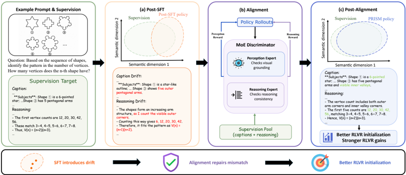

*Figure 1: Overview of the PRISM pipeline. (a) SFT introduces distributional drift between the policy and the supervision distribution. (b) The alignment stage uses an MoE discriminator with dedicated perception and reasoning experts to repair this drift via adversarial on-policy distillation. (c) Th*

**② 方法 / 架构图**

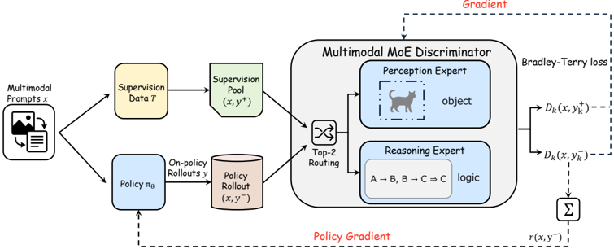

*Figure 2: Architecture of the distribution-alignment stage. An MoE discriminator with perception and reasoning experts is trained via Bradley-Terry loss to distinguish supervision from policy outputs; the policy is updated via policy gradient to maximize the combined MoE reward.*

### 一眼看懂

> 一句话导读:多模态模型先做 SFT、再做 RLVR(用自动验证器给可验证奖励的强化学习),问题是 SFT 会把模型分布带偏;PRISM 在两者之间塞一个"对抗式预对齐"阶段,把分布先拉回示范分布,再放它去做 RLVR。

- 🟦 TL;DR:多模态后训练的标准做法是 SFT→RLVR,但 SFT 会引入**分布漂移**——所谓分布漂移,是指模型微调后输出分布偏离了目标(此处既没充分匹配示范分布,又丢掉了模型原有的强项)。多模态下这种漂移还**异质**:视觉感知错误和推理错误是两种不同模式,会在后续 RL 里各自复合放大。
  - PRISM 的做法:在 SFT 与 RLVR 之间插入一个独立的"预对齐"阶段。让 policy(被训练的模型)与一个**判别器**做 response 级对抗博弈;判别器是含**感知专家 + 推理专家的 MoE**(混合专家,即多个子模型按路由分工)。
  - 这个对抗是 black-box(黑盒)的:不需要 teacher 的 logits(教师输出每个词的原始打分),只用判别器给的分数当奖励、用 GRPO 式更新 policy,把分布拉回示范分布,从而给下游 RLVR 一个更好的初始化。【原文 Abstract 行 24-45,§1 行 151-194】
- 最巧的一步:**把 OPD 从"终点训练目标"重定位为"SFT 与 RLVR 之间的中转对齐阶段",并用 MoE 双专家给出解耦的纠正信号**。命门有二:
  - ① 抽掉对齐阶段(等于退回标准 SFT→RLVR)→ **−4.4 avg**(Table 2),证明"对齐阶段"本身不可或缺。
  - ② 把 MoE 判别器换成等激活算力的单一 dense 判别器 → **−3.4 avg**(WeMath −6.0、MathVerse −4.9),证明"感知/推理解耦"是关键。原因:单标量判别器在"一轴改进、另一轴退化"时无法分离两种效应,梯度信号会变噪。【原文 §4.3 Table 2 行 719-784,行 785-809】

### 为什么做

> 一句话导读:SFT 不是纯改进,而是"漂移源"——它用统一的 token 级模仿把模型带偏,多模态下感知和推理两种偏移还互不相同;PRISM 要回答的就是"进 RL 之前怎么把这种异质漂移修回去"。

- 研究背景:LMM(大型多模态模型)的标准后训练是两段式:
  - SFT——在 curated(精选)示范上 bootstrap(打底)出基础能力;
  - RLVR——用自动 verifier(验证器)精炼,largely determines final performance(很大程度上决定最终性能)。
  - 大量工作分别改进这两段:SFT 端做 next-token 的重加权/正则(引 iw-SFT Qin&Springenberg 2025、PSFT Zhu 2025);RL 端改 GRPO 变体的 importance weighting / clipping / advantage / sequence-level(引 Yu/Zheng/Zhao 2025)。
  - 底层直觉:SFT 在参数里建起"隐式推理先验",RLVR 再在线激活并精炼它(引 Chu 2025、Yue 2025b)。【原文 §1 行 51-59,行 145-150】
- 解决的具体痛点:近期发现 SFT 会把模型置于"两不靠"的受损态——既不充分匹配示范策略分布,又丢失原有有利分布(Kang 2025、Zhang 2026a),即 **SFT 是漂移源而非纯改进**。原因链:
  - SFT 用**统一 token 级目标**模仿示范轨迹,**不区分 process(过程)与 outcome(结果)**,导致只学表面 + 偏离原分布;
  - **模型越强,token 级模仿外部示范越容易挤占它原生的强项**(而不是补充);
  - 多模态下这一问题更突出且**异质**:感知上的微小偏差会扭曲推理前提、并在 RL 中放大,而感知漂移与推理漂移"qualitatively different(性质不同),单一纠正目标无法兼顾"。
  - 核心问题(原文加粗,行 169-171):"**如何在模型进 RL 之前,修复 SFT 引入的(且对感知/推理异质的)分布漂移?**"【原文 §1 行 151-171】
- 相关工作 & 各自不足(§2 两子节,精确到机制):
  - **§2.1 多模态 RLVR**:文本域 DeepSeek-R1 证明纯 RLVR 能涌现 CoT(思维链),催生一批稳定化改进(redesigned clipping / advantage estimation / critic-free / sequence-level)。多模态域的探索包括:cold-start 初始化、跨模态形式化、大规模规则 RL + 涌现反思、课程采样、自反思激励;近期认识到 vanilla(原始)RLVR **忽视视觉感知保真**,于是提出 perception-aware reward(感知感知奖励):judging LLM(Xiao 2025)、证据锚定双分支(Zhang 2025a)、differential visual reasoning + visual triplets(Gao 2026)。**短板:这些全都在 RL 阶段内做,不碰前置 SFT 留下的分布 gap**——而这正是 PRISM 的靶点(行 226-228)。
  - **§2.2 On-Policy Distillation**:先理一下谱系。标准 KD(知识蒸馏)是在 teacher 输出上做 SFT,属 off-policy(学的不是模型自己的生成),有训练-推理分布失配;OPD 则在模型**自身生成**上训练。这条线的演进:
    - **GKD**(Agarwal 2024)——支持灵活的散度目标;
    - 各种散度变体(Gu 2024、Ko 2024);
    - **logit-free 对抗式**(Ye 2025a)——不依赖 teacher logits,改用对抗判别;
    - 近期还沿自蒸馏(Zhao 2026)、reward extrapolation(Yang 2026)、selective imitation(Zhang 2026c)、多模态表征迁移(LLaVA-KD Cai 2025)等方向扩展。
    - **短板:多把蒸馏当终点(蒸完的 checkpoint 就是最终模型),且用单一无差别的判别器/散度信号**(行 241-244)。
  - **最近邻 VOLD**(Bousselham 2025,arXiv:2510.23497,多模态):把 GRPO 与"从纯文本 teacher 做 **logit-based**(基于 logits 的)OPD"合进**单一**训练目标。
- 动机链(为什么这样设计):
  - SFT 引入异质分布漂移;
  - token 级再模仿只学表面、修不了 on-policy 生成下的 mismatch(失配),且黑盒监督源(Gemini)没有 logits、不能做散度蒸馏;
  - 所以把对齐建模成**只需监督池样本的 response 级对抗博弈**(借 OPD 思想,在模型自身 rollout 上训练以缓解 exposure bias,即模型只见过示范、没见过自己犯错时怎么办的问题);
  - 再用 MoE 双专家给感知/推理**解耦**的纠正信号;
  - 修完漂移再进 RLVR。【原文 §1 行 172-190】
- 与最近邻工作的Δ:
  - vs 标准 OPD——三点差异:① 把对齐**从 RL 中解耦成独立中转阶段**(不是终点);② **logit-free**,用对抗判别,适配 Gemini 等黑盒;③ **解耦反馈**,即感知专家 \(D_v\) + 推理专家 \(D_r\),而非单一判别器。
  - vs **VOLD**——VOLD 需要 teacher logits 且合进 RL 单目标;PRISM 在三点上不同:对齐独立成阶段、无 teacher logits(对抗判别)、解耦感知/推理反馈(§2.2 行 248-251 明列)。
  - 关键有用点:Table 2 证明"解耦"(去掉 MoE 掉 −3.4)和"独立对齐阶段"(去掉掉 −4.4)各自都贡献正增益。

### 怎么做 + 靠不靠谱

> 一句话导读:三段串行——先冷启动 SFT 打底,再用"MoE 双专家判别器 + GRPO"做对抗式对齐把分布拉回来,最后用可验证奖励做 RLVR;消融表把每个组件的必要性都钉得很实。

- 方法流水线(三阶段,§3,每阶段都讲清输入→输出):
  - **Stage1 冷启动 SFT(§3.1)**:
    - **输入**=113K 自蒸馏语料(其中 107K 用于 SFT)+ 1.26M 公开示范,合计 ≈1.37M。
    - **做什么**=在全量上 SFT **1 epoch**,得到初始的多模态推理 policy。
    - 要点:因为同一监督源后续要在对齐阶段复用,每个样本必须含**正确答案 + 完整推理轨迹 + 准确视觉 grounding(视觉锚定,即推理对应到图里哪个区域)**。公开数据往往答案短、推理不全、视觉描述不精,所以要自蒸馏补齐。
    - **输出**=SFT checkpoint(收窄了与监督分布的 gap,但仍有漂移)。
  - **Stage2 分布对齐 / 对抗 OPD(§3.2,核心)**:
    - **输入**=SFT checkpoint(当 policy)+ warm-started(预热过的)MoE 判别器 + 监督池 T。
    - **做什么**=用极小极大对抗博弈把 policy 分布拉向监督分布。逐组件拆开:
    - **MoE 判别器(§3.2.2)**:每条响应 y 拆成两部分——**视觉描述 c** + **推理轨迹 t**;对应两个专家:
      - **感知专家 \(D_v\)** 评 c,看视觉 grounding 程度;
      - **推理专家 \(D_r\)** 评 t,看推理一致性/有效性;
      - 两者的分按 Eq.1 加权合并。
      - 架构=**Qwen3-VL-MoE**,由**四个 Qwen3-VL-2B 组装成专家模块、top-2 路由**(每次只激活打分最高的 2 个专家)。\(D_v,D_r\) 是把视觉描述与推理轨迹**分别**过这同一个 MoE 模型得到,再经 Eq.1 合并(行 467-470)。
    - **初始化(§3.2.3)**:对抗博弈的前提是"policy 与判别器能力相当"。未对齐的 LMM 离监督分布太远,会被判别器秒判为"可分"→判别器饱和→给不出有信息的梯度。所以:
      - policy 用 SFT checkpoint 初始化;
      - 两专家**从同一预训练 backbone 初始化**,再各在指定成分上 **warm-start**(\(D_v\) 在视觉描述偏好对上预热,\(D_r\) 在推理轨迹偏好对上预热);
      - 加 **load-balancing 辅助损失**(负载均衡,逼专家分工均匀)防专家坍缩。
    - **对抗更新(§3.2.4)**:每个 prompt 采 N 条 policy rollout \(\{y_i^-\}\),判别器打分当奖励,转成组内归一 advantage(Eq.3),policy 用 **GRPO** 更新;两专家各用 **Bradley-Terry loss**(Eq.2,一种成对偏好损失)更新——**给参考响应高分、给 policy rollout 低分**。
      - 关键:**两专家与 policy 联合在线更新**,作为 on-policy 判别器持续跟随不断演化的 rollout 分布,**避免 reward staleness(奖励陈旧)**(行 399-402)。
      - 整体是 \(\min_\theta\max_\phi\) 的对抗(Eq.4)。
      - **显式去掉 KL 正则**:因为锚定 SFT 会与"修 SFT 漂移"这个目标直接冲突(行 440-442)。
    - **输出**=固定跑 **500 步**后的对齐 checkpoint。
  - **Stage3 RLVR(§3.3)**:
    - **输入**=对齐 checkpoint。
    - **做什么**=从预留的 6K 里按难度筛出 pass∈[0.2,0.8] 的 **2K** 题(太易太难的题信号弱),奖励从"学到的 MoE 判别器"切回确定性可验证奖励 \(r_v=r_{acc}+r_{fmt}\)(Eq.5),沿用与对齐阶段相同的 GRPO 式目标。PRISM 对 RL 算法不可知,可实例化为 GRPO / DAPO / GSPO。
    - **输出**=最终模型,跑 **1500 步**。
- 逐组件必要性(Table 2,Qwen3-VL-4B + GRPO;full=66.2,逐项有消融):
  - **MoE 双专家解耦(对比 Dense 4B 判别器,等激活算力)**:Dense=**62.8**(**−3.4**;WeMath 76.9 vs 82.9=−6.0、MathVerse 63.7 vs 68.6=−4.9)。原理:单标量判别器无法分离"一轴升、一轴降"的异质漂移,梯度噪声大。§4.4 训练动态(两专家沿不同轨迹收敛)佐证。【行 729-737,785-793】
  - **判别器需 vision-language(对比 text-only 同架构)**:Text-only=**62.3**(−3.9)。退化集中在需忠实视觉感知的任务,呈现 "parrot alignment"(鹦鹉式对齐:只学会让回答"听起来像示范",但没真去看图)。【行 738-746,810-819】
  - **对齐阶段本身(对比 w/o Alignment,即退回标准 SFT→RLVR)**:w/o Alignment=**61.8**(**−4.4**),说明 RLVR 单独补不回 SFT 漂移。【行 757-765,797-809】
  - **SFT 冷启动(对比 w/o SFT)**:w/o SFT=**49.4**(**−16.8**)。没有冷启动时 policy 离监督分布太远,判别器秒判可分、policy 漂向退化模式,对抗训练直接失效。【行 748-756,802-806】
  - **SFT 数据规模(107K vs 1.37M)**:SFT-107K=**62.5**(**−3.7**),但仍高于"全量 SFT 但无对齐"(61.8)。结论:SFT(收窄初始 gap)与对齐(闭合残余 gap)**互补而非互替**。【行 766-784,820-827】
  - **专家异步收敛(支撑 MoE 设计,§4.4)**:感知专家**早 peak、快收敛**;推理专家**渐升、震荡更大后才稳定**(推理对齐比视觉 grounding 更微妙)。二者沿不同轨迹,但收敛到**可比的均衡水平**(Figure 3,跑 500 步 + 额外延到 900 步验证收敛稳定)。**α 取值本身没有单独消融**(默认值见 Appendix A)〔推断:主文未扫 α〕。
  - **去 KL(KL=0)**:论文给了理由(锚定 SFT 会与修漂移冲突,行 440-442),但**没做"带 KL vs 去 KL"的对照消融**〔待核:无 KL 消融数据〕。
- 关键机制/公式(真实形式 + 直觉):
  - **判别器分(Eq.1)**:\(r(x,y)=\alpha\cdot D_v(x,c)+(1-\alpha)\cdot D_r(x,t)\)。即感知分 \(D_v\) 与推理分 \(D_r\) 的加权和,\(\alpha\) 控制感知/推理反馈的权衡。
  - **每专家 Bradley-Terry(Eq.2)**:\(L_{D_k}=-\mathbb{E}_{(x,y^+,y^-)\sim T}\big[\log\sigma\big(D_k(x,y_k^+)-D_k(x,y_k^-)\big)\big],\ k\in\{v,r\}\)。说明:\(y_k^\pm\) 是参考/policy 响应的第 k 个成分(v=视觉描述,r=推理轨迹),\(y^-\sim G(\cdot\mid x)\) 来自当前 policy。效果就是给参考响应高分、给 rollout 低分。
  - **policy 侧组内归一 advantage(Eq.3)**:\(A_i=\dfrac{r(x,y_i^-)-\operatorname{mean}(\{r(x,y_j^-)\}_{j=1}^N)}{\operatorname{std}(\{r(x,y_j^-)\}_{j=1}^N)}\)。在同一 prompt 的 N 条 rollout 内做归一化,提升"更像监督分布"的响应概率、压低同 prompt 下较差的 rollout。
  - **极小极大博弈(Eq.4)**:\(\displaystyle\min_\theta\max_\phi\ \mathbb{E}_{(x,y^+)\sim T,\,y^-\sim G_\theta(\cdot\mid x)}\big[r_\phi(x,y^+)-r_\phi(x,y^-)\big]\)。其中 θ=policy,φ=判别器。交替更新:policy 用 GRPO,两专家用各自的 BT 损失。
  - **RLVR 奖励(Eq.5)**:\(r_v(x,y)=r_{acc}(x,y)+r_{fmt}(x,y)\),即答案正确分 + 格式合规分。
  - **整体直觉**:"偏离监督分布的方向本身就是惩罚"——不用静态的 teacher-forced(教师强制)目标,而是让判别器告诉 policy"你这条 rollout 像不像高质量示范";并且把感知/推理分两路给信号,避免把异质漂移压成一个标量丢失信息。
- 实验与证据(数字已对 Table 1/2 逐项核对):
  - 数据集/设置:
    - 监督语料=从 **Gemini 3 Flash** 蒸馏 **113K**(针对当代强模型零通过率的最难题,带密集 visual grounding + 逐步推理,经 LLM-based correctness 验证)。其中 **107K 用于 SFT、6K 最高质留给对齐 + RL**;另补 **1.26M** 同 Gemini 家族的公开示范,合计 **≈1.37M** SFT(行 268-277)。
    - Backbone:Qwen3-VL-4B / 8B;判别器=Qwen3-VL-MoE(**4×Qwen3-VL-2B、Top-2 路由**)。
    - 训练:SFT 1 epoch、对齐 500 步、RLVR 1500 步(行 471-473)。
    - 评测:数学(MathVista / MathVerse / MathVision / WeMath)+ 通用(MMMU / MMMU-Pro / HallusionBench)。【§4.1 行 465-478】
  - **关键数字(Table 1)**:
    - **PRISM+GRPO 相比 SFT→GRPO:4B 61.8→66.2(+4.4)、8B 63.3→69.3(+6.0)avg**;最大增益集中在 MathVision/WeMath(如 8B MathVision:SFT→GRPO 37.1 → PRISM+GRPO 52.0)。DAPO/GSPO 也有类似增益(算法无关)。
    - 对齐 checkpoint(对齐后、RLVR 前)精度与 SFT **相当**(4B 57.2 vs SFT 56.8;8B 59.3 vs 58.1)——这说明对齐改的是分布,而不是即时准确率(行 495-500)。
    - **8B 上 SFT 把 Instruct 基线拉低得更多**(63.3→58.1);标准 SFT→RLVR(GRPO/GSPO)只勉强回到 Instruct 水平,而 PRISM+GRPO **反超 Instruct 5+ 点**(69.3 vs 63.3,行 501-507)。
  - **§4.4 结构代理证据**:用两个可解释代理量("推理步数 / caption 描述条目数")看分布如何演化(Figure 4):
    - base 与监督分布差很多;
    - SFT 后向监督靠拢但仍 mismatch,且 **caption 侧 overshoot(描述条目比监督还多)**;
    - **对齐阶段显著缩小这两维的 mismatch,且这一改善 persist through RLVR(贯穿到 RLVR 之后仍保留)**——post-RLVR 分布仍跟随相似趋势,支撑"对齐给了更好的初始化 shape"(行 931-948)。
  - baseline 公平性:**较强**——
    - w/o alignment 基线额外补了等于对齐步数的 RLVR 步,以匹配总训练预算(行 480-482);
    - 跨 3 种 RL 算法都一致 +Δ,是有力证据;
    - PRISM+GRPO 还用更少 tokens/response(Appendix A.3)。
  - 看着强但没回答的:
    - ① "black-box" 仅指无需 teacher logits,**监督仍来自 Gemini 3 Flash 蒸馏的 113K + 1.26M**,并非 teacher-free;
    - ② +4.4/+6.0 是平均增益,单基准的方差/负向案例披露有限;
    - ③ 判别器奖励本身的可靠性(对抗稳定性、reward hacking 即模型钻奖励空子)只靠 load-balancing + 固定 500 步来缓解,没深究是否引入了新偏置。
- 假设与失效边界:
  - 【原文】① MoE 解耦依赖**结构化的响应格式**——必须有显式视觉描述 c + 推理 trace t,才能分给两个专家;不天然可分解的任务难直接套用。
  - 【原文】② 对齐前 policy 与判别器要能力相当,所以必须 SFT 冷启动 + 判别器 warm-start,否则判别器秒饱和(§3.2.3 行 356-371)。
  - 【原文】③ 分布对齐的分析用的是结构代理(推理步数 / caption 条目),而非 embedding 散度等更直接的测度(§4.4 行 883-891)。
  - 【推断】④ 强依赖 Gemini 的高质量蒸馏语料;换成弱监督源时,"对齐目标"是否仍指向更好的分布,存疑。
  - 【推断】⑤ 4×2B 判别器需要独立 warm-start,带来额外的内存/算力开销。
  - 【推断】⑥ α 固定(默认值见 Appendix A);在感知/推理权重失衡的任务下,最优 α 未知。
- 祛魅总结:【推断】
  - 真贡献=① 把"SFT 引入(且多模态下异质)的分布漂移"这一现象明确化,并给出"在 SFT 与 RL 之间插一个独立对齐阶段"的清晰方案;② MoE 双专家解耦 + logit-free 对抗这一组合,被 Table 2 五行消融把每个设计的必要性都钉得很实(尤其 w/o SFT −16.8、w/o Align −4.4 对比鲜明)。
  - 被高估处:"black-box / teacher-free"——其实只是 logit-free,监督仍重度依赖 Gemini 蒸馏;"on-policy distillation"在这里其实是**对抗式分布匹配(GAN 式)**,与经典的 logit-KL OPD 不是一回事,容易因名生误。
  - 被低估处:"把对齐当中转阶段、而不是终点"这一**流程位置上的创新**本身可迁移性强(不限多模态、不限对抗);§4.4 的"对齐改善 persist through RLVR"是个少被强调、但对"为何插对齐阶段有用"很关键的证据。

### 结构化抽取

- 🎯 机制速览6轴:
  - **学什么信号**:对齐阶段=MoE 判别器给的"像不像监督分布"标量(感知 \(D_v\)/推理 \(D_r\) 两路加权,Eq.1),非真值、非 teacher logits;RLVR 阶段=确定性可验证奖励 \(r_v=r_{acc}+r_{fmt}\)。
  - **改什么**:policy 参数 θ(GRPO 梯度);判别器两专家参数 φ(Bradley-Terry,与 policy 联合在线更新)。
  - **何时改**:三阶段串行;对齐阶段在线 on-policy(judge 持续跟随演化 rollout,避免 reward staleness)、固定 500 步;RLVR 1500 步。
  - **免梯度?**:否,policy 与判别器均梯度更新。
  - **记忆-技能生命周期**:无外部记忆/技能库;监督池(supervision pool)是静态参考分布,既作 SFT 基础又作对齐参照;"对齐后的分布"通过参数固化并在后续 RL 中持续(论文称 corrections persist through RL,§4.4/Conclusion 行 943-959)。
  - **防遗忘机制**:**反其道而行——刻意去 KL(=0)让 policy 自由漂向监督分布**(因目标恰是"修正 SFT 把原分布带偏",锚定反而有害,行 440-442)。无传统防遗忘设计;靠"对齐回监督分布"间接恢复被 SFT 挤占的原生强项。
- ⑦ 开源代码+框架/harness:仓库 https://github.com/XIAO4579/PRISM(MIT;本地已克隆 **133MB**,完整)。含 vendored **transformers-4.57.0/**、**verl/**、**moe/**(MoE 判别器)、scripts/、tools/、difference/。框架=**Stage1 SFT 用 LLaMA-Factory + Stage2 对齐用 verl+transformers-4.57.0+moe(`qwen3_vl_prism`)+ Stage3 RLVR 用 verl(`qwen3_vl_xxpo_after_prism`,GRPO/DAPO/GSPO)**;评测 lmms-eval;数据/checkpoints 在 HF(prism-vlm)。代码/数据/权重均公开(Abstract 行 44-45)。【已核本地仓目录树 + du 133M】
- 💰 资源/成本与可扩展性:对齐阶段虽仅 500 步,但需**同时维持 policy generator 与 MoE 判别器**(4×Qwen3-VL-2B 需独立 warm-start),内存/算力较标准 SFT→RLVR 增加;RLVR 1500 步、PRISM+GRPO 用更少 tokens/response(Appendix A.3)。具体 GPU 卡数/总时长 + α/温度/group size N 见 Appendix A〔主文未给绝对卡时与 α 值〕。
- 🎯 对"探索-巩固"对标:**中等支撑,偏"巩固/纠偏"一侧 + 流程位置启发**。
  - PRISM 没做"探索/选路"(没有 student 自选可走通的开头、没有 path-recovery 接管),它解决的是"SFT 把分布带偏后,如何**巩固/纠偏回正确分布**"——更接近 idea 里"巩固=固化进参数且不把原能力遗忘"的那一半,但用的是对抗分布匹配而非脚手架蒸馏。
  - 对 mtp_opd 的真正启发点:**"在 SFT 与 RL 之间插一个 on-policy 的对齐/巩固阶段"这一流程位置**——可类比"先用 MTP/teacher 把 student 的分布对齐到能稳定走通的路径,再放它去做 RLVR 探索"。
  - 可借组件:
    - ① "判别器/奖励来自'是否像可走通的监督分布'",可替代显式 teacher logits(适配黑盒 teacher);
    - ② "感知/推理解耦专家"提示:对 path-selection 与 path-recovery 也可以用**解耦信号**(选路专家 vs 回轨专家)而非单一标量;
    - ③ §4.4 的"对齐改善 persist through RLVR"提示:巩固阶段的分布改造能被后续探索保留,对"先巩固再探索"的流程有利。
  - 缺口:无探索/自选路径、无前瞻(MTP)、无记忆/技能库、纯多模态对抗、依赖结构化响应格式与强 teacher 蒸馏数据。
  - 一句判定:**流程位置(SFT↔RL 之间插 on-policy 对齐阶段)与"解耦纠正信号"两点可借**;但机制(GAN 式对抗、黑盒蒸馏)与"教师脚手架探索-巩固"差距较大,作启发用、非直接基线。
- 🔭 开放问题/未来方向:【原文】未单列开放问题节;Conclusion 强调对齐缩小 SFT 残余 gap 且 persist through RL。【推断】① 把"对抗分布匹配"换成"MTP 前瞻一致性"作对齐信号,验证非对抗版是否更稳;② 在纯文本/推理任务上验证"SFT↔RL 间插对齐阶段"是否同样有效(去掉多模态特异性);③ 解耦专家思路迁移到"选路 vs 回轨"双信号,做 TSRD 式 path-selection/recovery 的解耦奖励;④ 系统研究 α 与去 KL 的边界(论文均只取默认值,无消融);⑤ 推广到不天然可分解(无显式 caption/trace 结构)的任务,需自动/学习式的判别器反馈分解。

— RETURN —
prism | 读到PDF? 是(26页/82k字重抽清洗null字节后,§1-§5+Eq.1-5+Table 1/2全核,数据split 107K/6K/1.26M/1.37M 与消融−4.4/−3.4/−16.8/−3.9/−3.7 逐项核对) | L线 L1(OPD新用法)+L3(多模态RLVR) | 对标结论:流程位置(SFT↔RL间插on-policy对齐/巩固阶段)+"感知/推理解耦纠正信号"+"对齐改善persist through RLVR"三点可借鉴(可类比选路/回轨解耦),但机制为GAN式对抗+黑盒蒸馏、无探索/前瞻/记忆,偏"巩固纠偏"一侧,作启发非直接基线 | 残留待核数:2(α 未做扫描消融、去KL无对照消融;绝对GPU卡时与α默认值主文未给见Appendix A)

---

## Qwen3 Technical Report

> **`qwen3`** ｜ 阿里巴巴 Qwen Team(An Yang 等;大厂旗舰模型技术报告,Qwen2.5→Qwen3 谱系) ｜ 2025-05 预印本·arXiv(arXiv:2505.09388,v1 2025-05-15) ｜ 主题线 L1(on-policy 蒸馏实践)+ L2(统一 SFT-RL 四阶段)+ L4(Agent/工具 RL)·相关性 高(大厂技报里少见的**明确 on-policy logit-KD** + 受控 OPD-vs-RL 对照) ｜ [📄 原始论文](https://arxiv.org/abs/2505.09388)

### 关键图示

**① Motivation / 对比图**

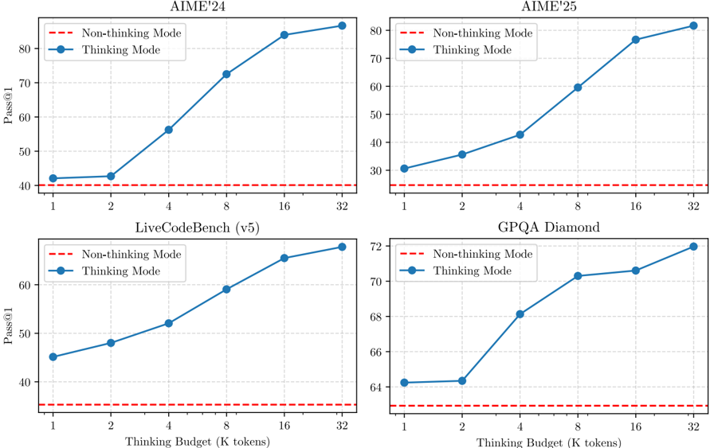

*Figure 2: Performance of Qwen3-235B-A22B with respect to the thinking budget.*

**② 方法 / 架构图**

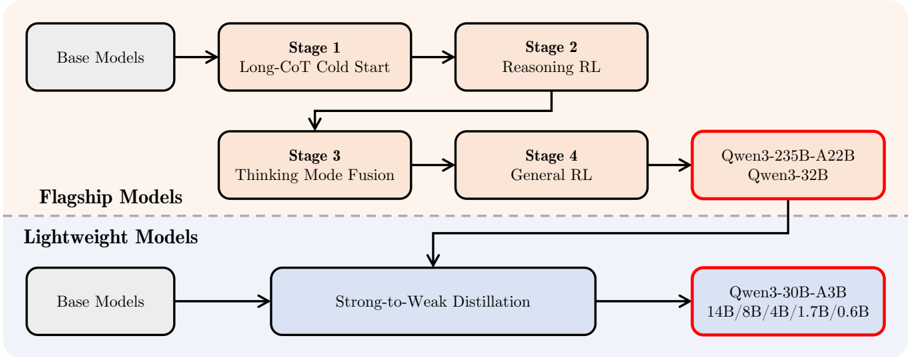

*Figure 1: Post-training pipeline of the Qwen3 series models.*

### 一眼看懂

> 一句话导读:Qwen3 把"会深推理"和"快速响应"两种模式统一进一个模型;对本综述最关键的是它的小模型蒸馏——尤其有一个干净对照:同一起点上,on-policy logit 蒸馏只花 RL 约 1/10 的算力,却同时把即时性能和探索上限(pass@64)都拉高,而 RL 提不动 pass@64。

- 🟦 TL;DR:Qwen3 是覆盖 0.6B–235B 的 dense + MoE 系列。
  - 核心创新=把 thinking(复杂多步推理)与 non-thinking(快速响应)统一进**单一模型**,支持 `/think`、`/no_think` 动态切换,以及 **thinking budget**(对推理用多少 token 做预算控制)。
  - 旗舰模型走**四阶段后训练**:Long-CoT 冷启动 SFT → Reasoning RL(GRPO)→ Thinking Mode Fusion(继续 SFT、把两种模式融合)→ General RL。
  - 轻量模型则用 **Strong-to-Weak Distillation(强到弱蒸馏)**:先用 off-policy response 蒸馏打底,再做 **on-policy 蒸馏**(学生自己采样序列 + 与教师 logits 对齐、最小化 KL)。代价只有四阶段的约 **1/10 GPU 时**,且 Pass@1(即时性能)与 Pass@64(探索能力)双双更优。【原文 §4 行 1084-1102,§4.5 行 1248-1260】
- 最巧的一步(对本综述而言):**on-policy logit 蒸馏这一步**,以及它被一个**受控对照实验(Table 21)**坐实。
  - 设置:在同一个"off-policy 蒸馏后的 8B checkpoint"上,分别接 RL 与 on-policy 蒸馏。
  - RL:花 **17,920 GPU·hr**,把 AIME'24 提到 67.6,但 **pass@64 纹丝不动(90.0→90.0)**;
  - on-policy 蒸馏:只花 **1,800 GPU·hr(约 1/10)**,就把 AIME'24 提到 74.4,且 **pass@64 升到 93.3**(AIME'25 同向:83.3→86.7)。
  - 结论:**蒸馏在更低成本下同时赢了 Pass@1 和 Pass@64,而 RL 提不动 pass@64(探索边界)**。原文明确归因:"distillation from teacher logits enables the student to **expand its exploration space**(从教师 logits 蒸馏能让学生扩展它的探索空间)……而 RL 不带来 pass@64 改进,凸显**更强教师 logit 指引**的优势"(行 3097-3101)。【原文 §(On-Policy Distillation 节)行 3088-3134,Table 21】

### 为什么做

> 一句话导读:过去既要为 chat 模型和推理模型分别训练部署,又要给每个小模型单独跑完整四阶段、成本高;Qwen3 用统一模型解决前者,用强到弱蒸馏解决后者。

- 研究背景:推理模型(o1 / DeepSeek-R1)靠 test-time scaling 大幅提升;社区需要的是一套既能 chat 又能深推理、且尺寸全覆盖的开源系列。【原文 §1】
- 解决的具体痛点:
  - ① 过去需要为 chat 模型(如 GPT-4o)与专用推理模型(如 QwQ-32B)**分别部署/训练**;
  - ② 为每个小模型独立跑完整四阶段后训练,**计算开销大、开发成本高**(行 1089-1092)。【原文 §4 行 1080-1092】
- 相关工作 & 各自不足:报告引 DeepSeek-R1/o1 等推理模型与 GRPO(Shao et al.)作基础。**隐含的对照**有三条:
  - (a) "每个小模型独立跑四阶段"——贵;
  - (b) "直接把 teacher logits 蒸进小模型"——更省,且能细粒度控制推理过程(§4 preliminary 行 1096-1102);
  - (c) "纯 RL 提升小模型"——Table 21 证明它 pass@64 提不动;
  - 报告未单列竞品综述(技报体例)。
- 动机链(为什么这样设计):
  - ① 用统一框架(thinking/non-thinking + thinking budget)免去多模型切换与重复部署;
  - ② 用 thinking budget 自适应分配推理算力;
  - ③ 用旗舰大模型的知识(strong-to-weak 蒸馏)大幅降低轻量模型的后训练成本(1/10 GPU 时),同时兼顾即时性能(Pass@1)与探索能力(Pass@64)。【原文 §4 行 1084-1102】
- 与最近邻工作的Δ:
  - vs "每个小模型独立跑四阶段 RL"——strong-to-weak 蒸馏(尤其 on-policy logit-KD)更省(1/10)且 pass@64 更优;
  - vs 纯 off-policy response 蒸馏——再加一个 on-policy 阶段(学生自采 + logit-KL)能进一步提性能与探索(Table 21 三行递进:off-policy → +RL → +on-policy distill,最后一个最优);
  - 关键有用点:**on-policy 蒸馏带来的 pass@64 提升,是 RL 给不了的**(行 3099-3100)。

### 怎么做 + 靠不靠谱

> 一句话导读:旗舰走四阶段(先用 SFT+RL 练好"思考"、再融合"非思考"+做通用 RL);小模型走两段蒸馏(先 off-policy 模仿教师文本打底,再 on-policy 自采 + 对齐教师 logits)。

- 方法流水线:
  - **旗舰四阶段(Figure 1,§4.1-4.4;前两阶段练"思考",后两阶段融合"非思考")**:
    - ① **Long-CoT Cold Start(§4.1)**——在精选的数学/代码/逻辑/STEM 可验证题上做**两阶段过滤**:
      - **query 过滤**:用 Qwen2.5-72B-Instruct 剔掉不可验证/含多子问题/需 general 生成的题,并剔掉"无需 CoT 就答对"的题(防表面猜测),同时标注 domain 保持平衡;
      - **response 过滤**:用 **QwQ-32B** 对每 query 生成 N 个候选;QwQ-32B 一致失败的题转人工评判;对 Pass@N>0 的题再剔掉六类——(1)错答,(2)大量重复,(3)无充分推理的猜测,(4)思考-总结不一致,(5)语言混杂/风格漂移,(6)疑似与验证集过近;
      - 这一阶段**刻意用少样本、少步数**的 SFT,只植入基础推理模式、保留 RL 空间(行 1127-1131)。
    - ② **Reasoning RL(§4.2)**——筛出 **3,995** 条 query-verifier 对(四准则:未用于冷启动、对冷启动模型可学、尽量难、覆盖广),用 **GRPO**;靠**大 batch + 多 rollout + off-policy** 提样本效率,并**控熵**(让熵稳步上升或保持稳定)以维持稳态;Qwen3-235B-A22B 在 **170 步内把 AIME'24 从 70.1 提到 85.1**(行 1163-1165)。
    - ③ **Thinking Mode Fusion(§4.3)**——在 Reasoning RL 模型上**继续 SFT**、融合 non-thinking 模式:
      - **thinking 数据由 Stage-2 模型对 Stage-1 query 做拒绝采样生成**(目的是防止额外 SFT 破坏 Stage-2 的性能,行 1177-1178);
      - non-thinking 数据覆盖多任务 + 用自动 checklist 评质;
      - 设计 `/think`、`/no_think` chat 模板(non-thinking 也保留一个**空 think 块**以保格式一致,Table 9);
      - thinking budget 是自然涌现的能力。
    - ④ **General RL(§4.4)**——覆盖 **20+ 任务**的奖励系统(指令遵循、格式遵循、偏好对齐、**Agent 工具调用含真实环境多轮反馈**、RAG),用三类奖励:
      - **规则奖励**;
      - **带参考答案的模型奖励**(Qwen2.5-72B-Instruct 打分);
      - **无参考的偏好奖励模型**(由人类偏好训得)。
  - **Strong-to-Weak Distillation(§4.5;5 个 dense:0.6/1.7/4/8/14B + 1 个 MoE:30B-A3B)**:
    - (1) **Off-policy 蒸馏**——把教师在 `/think` 与 `/no_think` 两种模式下的输出做 **response 蒸馏**,打底基础推理 + 模式切换,为下一阶段铺路。
    - (2) **On-policy 蒸馏**——**学生自己采 on-policy 序列**(对采样 prompt,在 /think 或 /no_think 下产出响应),再**对齐学生与教师(Qwen3-32B 或 235B-A22B)的 logits、最小化 KL** 来微调(行 1257-1260)。
      - 〔报告未给损失公式;按标准 on-policy KD 形式,目标是在学生自身分布下最小化序列 token 的反向 KL:\(L=\mathbb{E}_{x,\,y\sim\pi_\theta}\big[\sum_t D_{\text{KL}}\!\big(\pi_\theta(\cdot\mid x,y_{<t})\,\|\,\pi_{\text{teacher}}(\cdot\mid x,y_{<t})\big)\big]\)——【推断:报告只说 "align logits, minimize KL",没写散度方向/公式;此式是标准 GKD / on-policy KD 形式,非原文逐字】〕。
- 逐组件必要性:
  - **on-policy 蒸馏 vs RL(同起点)**:有**受控对照**(Table 21,Qwen3-8B,仅数学/代码)。三行递进:Off-policy 蒸馏(基线)→ +RL(17,920 GPU·hr,pass@64 不变)→ +On-policy 蒸馏(1,800 GPU·hr,pass@1 与 pass@64 双升)。**这是报告里最硬的消融式证据**。【行 3115-3134】
  - **冷启动"少样本少步数"**:理由是保留 RL 的提升空间(行 1127-1131),无独立消融。
  - **Thinking Mode Fusion / General RL 的效果**:有 Table 22 分析其对各能力的影响(Qwen3-32B 跨 Stage2/3/4 × CounterFactQA / LengthCtrl / ThinkFollow / ToolUse 等 in-house 基准,行 3149-3249)。
  - **整体蒸馏 vs 四阶段**:声称 1/10 GPU 时 + Pass@1/Pass@64 更优(行 1099-1102);但"1/10"的完整对照口径(到底哪些模型、哪些任务)主要由 Table 21(8B,数学/代码)支撑,**全尺寸的"1/10"只是概述性结论**〔推断:Table 21 是 8B 单点,全系"1/10"系外推〕。
- 关键机制/公式(直觉):
  - on-policy 蒸馏=学生先生成、再被教师 logits 拉回(reverse-KL 式对齐),比 off-policy(直接模仿教师文本)更贴合学生自身分布、缓解 exposure bias;而且教师 logits 提供了"软标签/多峰"信息,使学生**保留并扩展探索空间**(pass@64 升)——这与综述里其它 OPD 工作(GKD、MiniLLM)的核心直觉一致。
  - **thinking budget** 机制:当思考 token 长度达到用户设的阈值时,手动插入一个停思指令("Considering the limited time by the user, I have to give the solution based on the thinking directly now.\n</think>"),模型就根据已积累的推理产出最终答案。这个能力**不是显式训练出来的,而是由双模融合自然涌现**(行 1196-1206)。
- 实验与证据:
  - 数据集/设置:
    - 训练=数学/代码/逻辑/STEM 可验证 prompt(冷启动用精选子集;Reasoning RL 用 3,995 对;General RL 覆盖 20+ 任务);
    - 教师=**QwQ-32B**(生成冷启动数据)、**Qwen3-32B / Qwen3-235B-A22B**(蒸馏);query 过滤/打分的辅助模型=Qwen2.5-72B-Instruct;
    - 评测=AIME'24/'25、LiveCodeBench v5、MMLU-Redux、GPQA-Diamond、多语等,且分 thinking/non-thinking 双模式。
  - **关键数字(Table 21,8B,核心 OPD 证据;括号内为 pass@64)**:
    - Off-policy 蒸馏(基线):AIME'24 **55.0 (90.0)** / AIME'25 **42.8 (83.3)** / MATH500 92.4 / LCB 42.0 / MMLU-Redux 86.4 / GPQA 55.6(GPU 时 -)。
    - +RL:AIME'24 **67.6 (90.0)** / AIME'25 **55.5 (83.3)** / MATH500 94.8 / LCB 52.9 / GPQA 61.3,**17,920 GPU·hr**。
    - +On-policy 蒸馏:AIME'24 **74.4 (93.3)** / AIME'25 **65.5 (86.7)** / MATH500 97.0 / LCB 60.3 / MMLU-Redux 88.3 / GPQA 63.3,**1,800 GPU·hr**。
    - → 看 pass@64:RL 在 AIME'24/'25 上是 90.0→90.0、83.3→83.3,**完全不动**;OPD 则把它们提到 **93.3 / 86.7**。【已核 Table 21 行 3115-3134】
    - 另:Reasoning RL 上 Qwen3-235B-A22B 在 AIME'24 跑 170 步从 70.1→85.1(行 1163-1165)。
  - baseline 公平性:Table 21 是**同起点(同一个 off-policy 蒸馏后的 8B checkpoint)、同任务域(math + code)**下对比 RL vs OPD,公平性好(这是报告里最严谨的对照);但仅 8B 单点 + 仅数学/代码。
  - 看着强但没回答的:
    - ① 全系"1/10 GPU 时 + Pass@1/64 更优"是概述,受控证据只在 8B / 数学代码;
    - ② thinking budget、模式切换的可控性多为定性 + 少量基准,未给系统化的失效分析;
    - ③ 大量后训练细节(数据规模、超参、蒸馏温度/损失权重/KL 方向)以技报体例略写。
- 假设与失效边界:
  - 【原文】① 蒸馏依赖**已有强教师**(Qwen3-32B/235B、QwQ-32B)——强教师不可得时,方法不适用。
  - 【原文】② 冷启动刻意"少样本少步数",目的是保留 RL 空间(行 1130-1131)。
  - 【原文】③ Thinking Mode Fusion 的"防破坏 Stage-2"靠的是"从 Stage-2 自身做拒绝采样"(行 1177-1178)。
  - 【推断】④ Table 21 的"OPD>RL 且省 10×"在数学/代码这类可验证域成立,**开放式/无强教师域是否同样**未验证。
  - 【推断】⑤ on-policy logit-KD 需要教师与学生**同 tokenizer/词表**(即同系模型),跨族蒸馏不适用。
  - 【推断】⑥ thinking budget 的"自然涌现"依赖双模融合的质量,在弱模型上可能不稳。
- 祛魅总结:【推断】
  - 真贡献(对本综述)=① **大厂技报里少见的、明确的 on-policy logit-KD 实践**,且用 Table 21 给出了"OPD 在 1/10 成本下同时赢 Pass@1 与 Pass@64、而 RL 提不动 pass@64"的受控证据——这是"on-policy 蒸馏 > RL(在有强教师时)"的强论据,直接支撑 OPD 主线;② 统一 thinking/non-thinking + thinking budget 的工程范式。
  - 被高估处:作为一篇"方法论文",它**不开源后训练代码、细节略写**,"1/10"的全系结论靠 8B 单点外推,复现性受限(技报性质)。
  - 被低估处:Table 21 的"pass@64:OPD 升 / RL 不升"这一对比,对"RL 只放大、蒸馏能扩展探索"的论点是少见的厂级实证,价值高于它在综述里常被简化掉的"1/10 GPU 时"卖点。

### 结构化抽取

- 🎯 机制速览6轴:
  - **学什么信号**:On-policy 蒸馏=教师(Qwen3-32B/235B)的 **logits**(最小化 KL,软标签);Off-policy 蒸馏=教师 response 文本(SFT);Reasoning/General RL=可验证奖励 + 规则/模型奖励(GRPO)。
  - **改什么**:学生/旗舰 policy 参数(SFT/蒸馏/GRPO 梯度);蒸馏阶段对齐 logits。
  - **何时改**:旗舰四阶段串行(SFT→RL→SFT→RL);蒸馏两阶段(off-policy SFT → **on-policy** 自采+logit-KL,在线生成)。
  - **免梯度?**:否,全程梯度更新。
  - **记忆-技能生命周期**:无外部记忆/技能库;能力通过四阶段或蒸馏固化进单一统一模型;thinking budget 是推理期算力分配(非记忆)。
  - **防遗忘机制**:Thinking Mode Fusion 用**拒绝采样自 Stage-2 模型**生成 thinking 数据(防额外 SFT 损伤 Stage-2 性能,行 1177-1178)= 一种针对性防遗忘;On-policy 蒸馏对齐 logits 比硬模仿更温和地保留学生分布。无显式 KL-to-ref 防遗忘的细节披露。
- ⑦ 开源代码+框架/harness:**模型发布/权重仓,后训练训练代码不开源**。仓库 https://github.com/QwenLM/Qwen3;权重 https://huggingface.co/Qwen 、https://modelscope.cn/organization/qwen 。**蒸馏/RL 管线均不开源**(社区微调依赖 Axolotl/Unsloth/ms-swift/LLaMA-Factory)。报告提及算法=**GRPO**(Reasoning/General RL);未提 GSPO(后续单独工作)。**CloneTier=B,仅记录链接、不 clone 巨型权重仓**——未完整克隆原因:无训练代码可 clone,权重仓体积过大且按 B 层规则只记链接。【元信息复用 v1 analysis/qwen3.md;正文来自 PDF】
- 💰 资源/成本与可扩展性:**核心卖点即成本**——Table 21:on-policy 蒸馏 **1,800 GPU·hr** vs RL **17,920 GPU·hr**(~1/10);声称全系蒸馏约四阶段 1/10 GPU 时(概述)。Reasoning RL:Qwen3-235B-A22B 170 步即显著提升。可扩展性:0.6B–235B 全覆盖、dense+MoE,蒸馏让轻量模型低成本获得旗舰能力(报告主张)。
- 🎯 对"探索-巩固"对标:**强支撑 OPD 主线 + 对"探索"提供厂级实证,但无脚手架/前瞻/记忆**。
  - Qwen3 的 on-policy 蒸馏(学生自采 + 教师 logit-KL)正是 mtp_opd 关注的核心 OPD 形式,且 Table 21 直接证明"**强教师 logit 指引能扩展学生的 pass@64(探索空间),而 RL 不能**"——这为 TSRD"teacher 当脚手架帮 student 探索/选路"提供了关键的**可行性 + 收益**证据(在扩展探索这件事上,教师软分布 > 纯结果奖励)。
  - 可借组件:
    - ① **on-policy logit-KD + 1/10 成本 + pass@64↑**,可作为"OPD 优于 RL"的标杆基线/对照协议,TSRD 可对标"我的脚手架蒸馏能否也提 pass@k";
    - ② **从较新的模型做拒绝采样来生成数据以防遗忘**的工程技巧,可用于巩固阶段防止 SFT 破坏已有能力;
    - ③ thinking budget 的思路可类比"前瞻/探索预算"的控制。
  - 缺口:
    - Qwen3 的教师是**异构的、更大的模型**(不是同规模 EMA、也不是 MTP 前瞻);
    - 蒸馏是**全序列 logit-KL**(不是 path-selection/recovery 那种稀疏的单点接管);
    - 无 on-policy 自选"能走通的开头"、无回轨、无 MTP;
    - 即它证明了"教师软标签 OPD 有效且能扩展探索"这一**大前提**,但不提供"稀疏脚手架/选路/回轨/前瞻"的具体机制。
  - 一句判定:**它是 OPD 主线的厂级标杆,以及"教师指引能扩展探索"的关键实证(Table 21)**,作大前提支撑与对照协议用,而非脚手架机制的直接来源。
- 🔭 开放问题/未来方向:【原文】报告聚焦发布,未单列开放问题;隐含=把统一 thinking 模式 + 蒸馏推向更多尺寸/任务。【推断】① 把"全序列 logit-KL"细化为"关键步/高熵 token 的稀疏蒸馏",看能否在更省的同时进一步提 pass@k(对标 TSRD path-selection);② Table 21 的"OPD>RL"在开放式/无强教师/跨族 tokenizer 域是否成立;③ 把 thinking budget 与"前瞻探索预算(MTP)"结合做自适应推理深度;④ on-policy 蒸馏中教师=异构大模型,能否换成"同规模 + 前瞻特权(如 MTP/QCP)"的脚手架教师(连向 pi_play/TSRD)。

— RETURN —
qwen3 | 读到PDF? 是(35页/116k字重抽清洗null字节后,§4 后训练全核 + Table 21/22 数字逐项核对一致;技报性质后训练代码不开源,正文来自PDF、元信息复用v1) | L线 L1(on-policy logit-KD)+L2(四阶段SFT-RL)+L4(Agent工具RL) | 对标结论:OPD主线的厂级标杆 + "教师logit指引能扩展学生探索(pass@64↑:90.0→93.3)而RL不能(90.0→90.0)"的关键受控实证(Table 21,1/10 GPU时1800 vs 17920且Pass@1/64双赢),为TSRD"教师脚手架助探索"提供大前提支撑与对照协议;但教师为异构大模型、全序列logit-KL、无选路/回轨/前瞻/记忆,非脚手架机制直接来源 | 残留待核数:1(全系"1/10 GPU时+Pass更优"为概述,受控证据仅Table 21的8B/数学代码单点;on-policy蒸馏KL方向/损失公式技报未写、以标准GKD形式标注为推断;后训练超参/数据规模技报略写不可核)

---

## Learning with Rare Success but Rich Feedback via Reflection-Enhanced Self-Distillation (RESD)

> **`resd`** ｜ UC San Diego + Amazon + Georgia Tech(Yuwei Zhang 一作@实习;Sha Li/Changlong Yu/Qin Lu 等 Amazon;Jingbo Shang 通讯) ｜ 2026-05-12 v1 · arXiv preprint(arXiv:2605.12741v1)cs.LG ｜ 主题线 L1(OPD/自蒸馏)+L4(Agent多轮自进化)+L5(记忆/技能库)·相关性 高 ｜ [📄 原始论文](https://arxiv.org/abs/2605.12741)

### 关键图示

**① Motivation / 对比图**

*Figure 1: RESD improves interaction efficiency during training. The x-axis is the number of samples.*

**② 方法 / 架构图**

*Figure 2: Overview of the RESD framework. The student generates a rollout and receives environment feedback. On failure, a local self-reflection diagnoses the error and a global playbook curation step distills reusable lessons into a persistent playbook. The enriched context (reflection, curated pla*

### 一眼看懂

> 一句话导读:模型自己当老师做蒸馏,但在"几乎没成功轨迹"时会失灵;RESD 的招是把失败反馈主动加工成"反思"、并沉淀进一个跨步骤的经验手册(playbook),让老师即使没见过成功示范也能给出可用的逐 token 监督。

- 🟦 TL;DR:先讲背景——在线策略自蒸馏(self-distillation,即让模型自己当老师)在 rare-success(几乎没成功轨迹)时会失灵。
  - 失灵的原因:现有方法(SDPO/OPSD)把环境反馈只当成**被动条件**喂给 teacher,且强依赖同一个 rollout batch 里偶然冒出来的"成功 peer 示范(同组里别的成功样本)"。
  - RESD 的做法是把失败反馈**主动加工**:
    - 对每条失败轨迹生成一段"反思"——诊断哪一步错了、本该怎么改;
    - 并把反复出现的教训沉淀进一个跨步骤、持久的 **playbook(经验手册)**。
  - 这些被加工/积累出来的上下文喂给 self-teacher,使它即便没有任何成功示范,也能给出可执行的 **token 级监督**。
  - 结果:每个 prompt 只采 1 条轨迹(N=1),早期就比用 8 倍采样(group size 8)的 GRPO 涨得快。【原文 Abstract 行 18-34,§1,§3.3,Figure 1/6】
- 最巧的一步:**retrospective reflection(回顾式的失败诊断反思)**。
  - 证据:消融(Table 3)显示,去掉 reflection 后,MANUFACTORIA-HAS 上的 per-test-case m@4 从 **76.95 暴跌到 51.41**(最大跌幅)。
  - 它的作用:把"原始失败信号(只告诉你失败了)"转换成"指令性纠错(说清哪步错、该怎么改)"——这是关键转换。没有它,playbook 里就没有高质量教训可沉淀,teacher 又退回到"被动喂反馈"的老路。【原文 §4.5 Table 3 行 750-781】

### 为什么做

> 一句话导读:自蒸馏的成败完全取决于"老师上下文里有什么";SDPO 那套上下文在 N=1、没成功示范时就废了,所以 RESD 把"怎么表征和积累失败反馈"单独提成一条设计轴。

- 研究背景:让 LLM 通过与环境交互**持续自我改进**是后训练的核心挑战。这条线的演进:
  - RL(PPO/GRPO)在多步任务上受困于**稀疏奖励**——成功轨迹极罕见时,缺少稠密监督去引导庞大的探索空间;
  - OPD 用**更强/有特权的 teacher** 给每个 token 算目标概率,把稀疏的轨迹级结果变成稠密的 token 级信号;但要维护一个单独的 teacher(算力贵 + 师生分布失配);
  - 自蒸馏变体(SDPO/OPSD)进一步用模型**自身**(current 或 moving-average 权重 θ_old)当 teacher、并条件于特权信息(环境反馈/参考解),从而同时消除外部 oracle 成本与师生失配。【原文 §1 行 49-75】
- 解决的具体痛点:自蒸馏的成败**完全系于 self-teacher 的监督质量**。作者做消融(§3.1,Figure 3)发现:
  - SDPO 的 self-teacher 特权上下文含两个互补信号=**环境反馈** + **同一 rollout batch 内的成功 peer 示范**;
  - 当 rollout batch size **N=1**(没有同组的成功 peer)时,环境反馈成了唯一监督源,SDPO 性能**大幅退化**——说明 teacher 很难仅凭原始失败反馈就构造出有效的纠错分布;
  - 在 rare-success(每次 rollout 成功率极低)下尤其严重,因为多数组里只有失败、没有正反例。【原文 §3.1 行 195-204】
- 相关工作 & 各自不足(§5,精确到机制):
  - **① 经典 KD**(Hinton 等[8,15,21,9]):学生匹配 teacher 的输出分布/表征,但是**固定数据 + 师生失配**(学生却是在自身生成的轨迹上被评估)。
  - **② on-policy distillation**(GKD/Qwen3/MiMo[12,23,25,5]):学生学的是 teacher 对**自身生成**的反馈,对齐了训练-推理分布、近似 online imitation;**但仍是 instance 级的孤立纠错**。
  - **③ self-distillation**(SDPO[6]、OPSD[30]、[27,2]):self-teacher 条件于环境反馈/执行信号或参考解/hint;**但把反馈当成静态被动条件、依赖成功示范**,且"局限于孤立的 instance 级纠错"(行 857-859)。
  - **④ 训练-free 持续学习**:Reflexion[19,13]（把言语反馈当 episodic memory,情景记忆）、self-discover[32,22]、ACE/演化经验池[29,28]（动态注入精炼策略）——**但与 on-policy 蒸馏脱节**(纯推理期、不更新参数)。
  - **RESD 的差异**:把"**跨样本反思 + 经验积累**"**直接整合进 on-policy 自蒸馏的回路**(既改 context、又更新参数),并把"怎么表征/积累反馈"提为一条**独立的设计轴**,而不是提一个新损失。【原文 §1 贡献 行 102-108,§5 行 858-865】
- 动机链(为什么这样设计):
  - RL 稀疏奖励;
  - → OPD 给稠密 token 信号;
  - → 但需要外部 teacher(贵 + 失配);
  - → SDPO 用自 teacher 解决;
  - → 但 rare-success 时没有成功 peer,teacher 只能看到原始失败;
  - → **原始失败是"诊断性"的、不是"指令性"的**;
  - → 所以必须把失败**主动解释成因果 + 跨轨迹沉淀**,才能当监督用。
- 与最近邻工作的Δ:
  - vs **SDPO**(本文直接基线)——SDPO 的 teacher 特权上下文 = 环境反馈 + 同组成功 peer 示范;RESD 把"被动喂反馈"换成 **reflection(主动诊断)+ playbook(持久经验)+ 可选 solution buffer**,使 **N=1 也能学**。
  - vs **ACE**(playbook 思想的来源)——ACE 是训练-free 的上下文演化;RESD 则把这套经验沉淀**接到了 token 级蒸馏的 teacher 上下文里**。
  - 关键点:**把"怎么表征/积累反馈"提为 on-policy 自蒸馏的一条独立设计轴**。

### 怎么做 + 靠不靠谱

> 一句话导读:核心目标是一个带 clip 的 f-散度自蒸馏(学生去匹配老师在"反思+经验"上下文下给的分布);流程上每步都是"先更新 context(反思→playbook→缓存解),再更新参数",老师靠 EMA 跟着学生走。

- 基础自蒸馏目标(§1 末,Eq.1):
  - self-teacher θ_old 条件于中间状态 \(s_t=(x_t,y_{<t})\) 与回顾反馈 \(c(x,y)\),产出一个纠正后的、feedback-informed(吸收了反馈的)分布 \(\pi_{\theta_{\text{old}}}(\cdot\mid x,y_{<t},c)\);学生 \(\pi_\theta\) 在每一步去匹配它。
  - 定义 token 似然比 \(\tau_v^t=\dfrac{\pi_{\theta_{\text{old}}}(v\mid x,y_{<t},c)}{\pi_\theta(v\mid x,y_{<t})}\),并 clip 到有界区间 \(\tilde\tau_v^t=\operatorname{clip}(\tau_v^t,\epsilon_{\min},\epsilon_{\max})\) 来防爆;统一用 f-散度:
  - \(\displaystyle L_{\text{SD}}(\theta)=\mathbb{E}_{x,y\sim\pi_\theta,\,f}\left[\sum_{t=1}^{T}\sum_{v\in V}\pi_\theta(v\mid x,y_{<t})\cdot f(\tilde\tau_v^t)\right]\)
  - 选不同的凸函数 f,可恢复出 forward-KL / reverse-KL / JSD(各有不同的优化性质,Appendix A)。因为轨迹采自 base policy \(\pi_\theta\),这个目标**天然是 on-policy** 的——能 "recover forgotten behaviors after midtraining(在 midtraining 之后找回被遗忘的行为)" 并防 exposure bias。
- 方法流水线(Algorithm 1,讲清输入→输出):
  - **Require(初始化)**:学生 \(\pi_\theta\)、teacher 权重 θ_old、playbook \(P\leftarrow\emptyset\)、solution buffer \(B\leftarrow\emptyset\)。
  - **每步 t 的流程**:
    - ① 学生采 1 条 rollout \(y\sim\pi_\theta(\cdot\mid x)\),拿到环境反馈 \(c(x,y)\) 与 reward \(R(x,y)\);
    - ② **CONCISE** 先给 playbook 剪枝(删掉已净有害/过期的条目);
    - ③ 分两种情况:
      - **若失败**(\(R<\tau\)):**REFLECT** 生成反思 \(r\)、并给现有 playbook 条目打 helpful/harmful 标签;**CURATE** 从反思里提炼出新的、非冗余的条目加进 playbook(\(P_{t+1}=P_t\cup\text{CURATE}(P_t,r;\theta)\));
      - **若成功**:把解存进 solution buffer \(B(x)\leftarrow y\),且 \(r=\emptyset\);
    - ④ teacher 用 **EMA** 同步学生的权重(rate 0.0001);
    - ⑤ 构造一个 **enriched(增强)上下文**——把 playbook \(P_{t+1}\) + 反思 \(r\) + 上次轨迹 \(y\) + 反馈 \(c\) + 缓存解 \(B(x)\) 一起喂给 teacher,得到 token 级监督 \(\pi_{\theta_{\text{old}}}(\cdot\mid x,y_{<t},c,r,P_{t+1},B(x))\);
    - ⑥ 学生最小化 \(L_{\text{SD}}\)(Eq.1),并按 batch 成功率加 per-sample 权重(Eq.2)。
  - **关键设计**:因为 \(P,B\) 是**跨步持久**的,即便当前 batch 里没有任何成功示范,teacher 可用的监督也能**随时间改善**(行 405-407)——这就是 N=1 也能学的根本。
  - **数据流动**:在线流式,每个样本至多见一次;每个 batch 内循环 **K=4** 次;**先更 context、再更参数**,teacher 用 EMA 同步。
- 逐组件必要性(消融 Table 3,per-test-case m@4 / b@4):
  - **reflection**:去掉 → MANUF. 76.95→**51.41**(最大跌幅);它负责短期的局部纠错。【行 750-752,776-777】
  - **playbook**:去掉 → MANUF. 76.95→**60.65**、BSIM-Easy 38.87→**32.95**;它负责跨步保存可复用的教训、**防回退**。【行 757-759】
  - **solution buffer**:去掉 → MANUF.→**60.24**、BSIM-Easy→**31.97**;它把"部分进展"转成"完整正确解"。【行 764-766】
  - **success-rate rebalancing(Eq.2)**:仅在 BSIM-Easy/FINER 上启用,用来缓解"batch 成功率极端时,多数派 outcome 主导梯度"的问题——属于工程组件,无独立消融。
  - **CONCISE 剪枝**:规则是 helpful/harmful 计数满足 \(d_j\ge h_j\)(即净有害)就删,且超过 budget \(M_{\max}\) 时逐出最久未标注的条目。作用是保证 playbook 紧凑、收敛到反复有用的条目;两种变体(prioritized/staleness)在 Appendix D。
  - **f-散度选择**(forward-KL / reverse-KL / JSD):Appendix A 给了直觉——reverse-KL 是 mode-seeking(寻峰),能抑制幻觉;JSD 在师生差距大/高方差时**有界、更稳**,所以作 robust default(稳健默认)。按任务选:
    - MANUF.=reverse-KL(α=1.0,且**例外地用上 clip,ε_max=5**);
    - BSIM-Med=reverse-KL(α=1.0,EMA rate 0.01);
    - BSIM-Easy/FINER=JSD(α=0.5)。【Appendix G 行 1324-1332】
- 关键机制/公式(直觉):
  - **REFLECT(Eq. 行 331)**:\(\{r_j\}=\text{REFLECT}(x,y,c,P_t;\theta)\)。即学生在诊断模式下输出反思——把失败连接到**具体的推理步骤**,并给现有 playbook 条目打 helpful/harmful 标签(这是个轻量的使用信号,供后续维护)。
  - **success-rate reweighting(Eq.2)**:设 batch 成功率 \(s=|\{i:R(x_i,y_i)\ge\tau\}|/B\),权重为 \(w_i=(1-s)^\alpha\)(若成功)、\(s^\beta\)(若失败),并归一化使 batch 均值=1(不改有效学习率)。直觉:当成功率极低或极高时,稀有的那一类(少数类)样本会被加权放大,防止多数类主导梯度。
  - **核心洞见(§4.3 Figure 5)**:RESD 的蒸馏 loss 反而**更高**——说明 reflection/playbook 增强后的 teacher 给出的分布**偏离学生当前行为更多**;而且 loss mass 集中在**"决策 token"**上(如 "create"、"solution"、"processes"、"The goal")。这些都是"选择下一步做什么/如何框定问题"的点,说明 teacher 纠正的是**推理策略**、而非表面 token。
- 实验与证据(数字已对 Table 2/3 + 附录逐项核对):
  - 数据=4 个任务(Table 1):
    - **MANUFACTORIA-HAS**:写 DSL 程序做模式匹配,742/132 题,用 Qwen3-4B-Thinking-2507;
    - **BOUNCINGSIM-Easy/Medium**:写 Python 模拟 2D 碰撞,640/100 与 320/100,用 4B / Qwen3-30B-A3B-Thinking;
    - **FINER**:SEC 文件的 XBRL 实体标注,1000/500,用 4B;
    - 前三个初始成功率近 0(是 rare-success 试验台,来自 RL-Grok benchmark),FINER 初始成功率较高(用来检验普适性);
    - 指标=mean@4/best@4 × Per-Task/Per-Test-Case Acc;checkpoint 用统一的 rank-based 规则选。【§4.1 行 443-471】
  - **关键数字(Table 2,Per-Task m@4/b@4)**:
    - MANUF.:SDPO+ss **0.57/2.27** → RESD **35.80/65.91**(巨大跃升;per-test-case 37.97/71.93→**76.95/96.53**);
    - BSIM-Easy:SDPO+ss 1.00/4.00 → RESD **4.25/8.00**;
    - BSIM-Med:2.00/6.00 → **7.25/10.00**;
    - FINER:50.25/59.12 → **53.66/61.12**(Per-Test-Case 76.15/82.21→78.98/84.32);
    - vs GRPO(Figure 6):RESD 用 N=1 早期就比 group-size-8 的 GRPO 涨得快(这是交互效率上的比较,不是等 rollout 预算)。【Table 2 行 503-576,§4.4】
  - **案例研究(Table 4,MANUF. "Accept if tape contains BRBR")**——4 个连续的 inner-loop step,逐步纠错:
    - step45 acc 0.00:引用了未声明的状态 → parse error;反思提炼出"所有分支目标都必须引用已声明的状态";
    - step46 acc 0.84:错误地 reject 了前导的非模式符号;playbook 记下"非模式符号应跳过、不要 reject";
    - step47 acc 0.96:过度纠正,导致空 tape 死循环;playbook 记下"非空时跳过、空 tape 在非终态应 reject";
    - step48 acc 1.00:缓存这个成功解;
    - 这个案例**展示了:失败反馈不是靠简单 append、而是靠组织成持久且 scoped(有作用域)的知识,才真正有用**(行 798-845)。
  - baseline 公平性:对 GRPO 明确声明这是"interaction-efficiency(交互效率)比较、而非等 rollout 预算"(GRPO 每 prompt 采 8 条,RESD 只采 1 条)——**作者诚实标注了不对等**;其余设置相同(lr 1e-6 / batch 32 / inner-loop K=4)。还**诚实报告了非单调现象**:FINER 在 step50 因 response 截断而掉点、BSIM-Easy 在 step60 后退化(进入高成功率区后,稠密自蒸馏不如奖励法稳)。【§4.4 行 722-728】
  - 看着强但没回答的:
    - ① 4 个任务规模偏小、且都是可执行反馈任务;
    - ② "决策 token 集中"是 case-level(个案级)观察,没有定量的 attribution;
    - ③ 高成功率区切换 GRPO 的混合策略只给了建议,未系统验证。
- 假设与失效边界:
  - 【原文】① 环境要提供 "rich execution feedback(丰富的执行反馈)"(代码可执行/测例反馈),哪怕奖励本身是稀疏的二元——方法吃的就是这个反馈来反思,**纯黑箱奖励下反思就无据可依**。
  - 【原文】② teacher=学生的 EMA,这默认了**学生本身有足够能力做出有意义的反思/诊断**(REFLECT/CURATE 都由 \(\pi_\theta\) 完成)。
  - 【原文】③ 进入高成功率区后,自蒸馏会变不稳;作者建议"RESD 先快速脱离 rare-success → 再切 GRPO"(§4.4)。
  - 【推断】④ playbook 是全局共享的自然语言条目;当任务跨度大、或条目相互冲突时,CONCISE 的 helpful/harmful 计数可能误删(依赖反思打标的质量)。
  - 【推断】⑤ 反思由(可能较弱的)学生生成;学生太弱时,"诊断错因"本身就不可靠——会放大错误的教训。
- 祛魅总结:
  - 真贡献=明确把"反馈的表征/积累"提为自蒸馏的一条独立设计轴,并给出"反思→playbook→token 级监督"的可插拔闭环,在 rare-success 下用 N=1 实现了样本高效的自举(MANUF. 0.57→35.80 极有说服力)。
  - 【推断】被高估的可能是"自蒸馏部分的新颖性"——损失/objective(Eq.1 的 f-散度自蒸馏)沿用了 SDPO,真正新的是 **context 工程**(reflection + playbook),而且 playbook 思想直接借自 ACE。
  - 【推断】被低估的是"防遗忘"证据(Appendix E:IFEval per-task m@4 训练后 82.50→83.75 基本不退,是个被埋在附录里的好结果)。
  - 总体看,它本质是"context-engineering ⊕ on-policy 蒸馏"的缝合,效力强烈依赖于"任务要有可解释的执行反馈"。

### 结构化抽取

- 🎯 机制速览6轴:
  - **学什么信号**=teacher(自身 EMA,条件于反思 + playbook + 反馈 + 缓存解)给的 token 级分布(**top-100 词表**),经 f-散度蒸馏;额外有 success-rate 重加权(Eq.2);
  - **改什么**=两轨更新——学生参数 θ(token 级)+ 持久的 playbook(自然语言记忆);
  - **何时改**=在线流式、每个 batch 内循环 K=4 次;**先更 context、再更参数**,teacher 用 EMA 同步(rate 0.0001);
  - **免梯度?**=否,核心是带梯度的 KL/f-散度蒸馏;但 reflection/playbook 的"学习"是免梯度的(纯文本积累);
  - **记忆-技能生命周期**=显式两类——playbook(经验条目,带 helpful/harmful 计数 \((h_j,d_j)\) + staleness,由 CONCISE 剪枝、budget \(M_{\max}\)≈120-200)+ solution buffer(缓存成功轨迹供 replay);
  - **防遗忘机制**=三条叠加——on-policy 自蒸馏天然抗遗忘(§1 称可 "recover forgotten behaviors after midtraining")+ playbook 持久保存教训防回退 + Appendix E 实测 IFEval 不退(82.50→83.75)。
- ⑦ 开源代码+框架/harness:GitHub(horizon-llm/RESD,v1 元信息已核:约 52MB,含 verl 源码 + selfevolve 模块 + docker + paper.pdf;本地 repos/resd 已克隆);框架 **veRL(volcengine/verl)+ SDPO(lasgroup/SDPO)**;rollout 用 **vLLM(TP=4)**,训练用 **FSDP**。【Appendix G 行 1303-1306】
- 💰 资源/成本与可扩展性:【原文】**单节点 8×H200,每个实验约 1 天 wall-clock**;每步延迟:SDPO ~**400s** < RESD(反思/curation 带来中等稳定开销)< GRPO >**1200s**(GRPO 因 group rollout 最慢)→ RESD 比 GRPO 省很多(Figure 8/Appendix F)。可扩展性卖点=**N=1 单 rollout**、交互预算受限场景。长上下文需求高(MANUF. prompt/resp 上限 49152/20480 token,BSIM 58368/25600)。【Appendix F/G 行 1290-1332】
- 🎯 对"探索-巩固"对标:**强支撑 + 高度同源,既是直接竞品、又有可借组件**。
  - 映射(为何同源):
    - RESD 的"失败诊断反思 + 自选纠错 + playbook 固化",几乎就是 TSRD"巩固/回轨(走偏后自选恢复分支并固化)"的一个完整实例化——失败轨迹 → 反思定位"哪一步走偏" → 生成纠错 → 沉淀进记忆且不遗忘;
    - "探索"侧:on-policy 自采(学生自己 rollout)对应"偏向自己能走通的开头";solution buffer 缓存成功开头供复用 ≈ "有效路径固化"。
  - **可借组件**:
    - ① playbook 作为"技能/经验库"的载体(带 helpful/harmful 生命周期管理 + CONCISE 剪枝),正好填上 TSRD 的 L5 记忆库缺口;
    - ② "反思把失败转成 token 级纠错监督"=path-recovery 的具体监督来源;
    - ③ reverse-KL/JSD 按师生差距来选散度的工程经验;
    - ④ §4.3 的"loss mass 集中在决策 token"提示:纠错信号天然落在关键决策点,与 TSRD 想在"高熵/关键步"接管的思路同向。
  - **缺口/差异**:
    - RESD 的"前瞻"靠的是反思的**事后诊断**,**没有 MTP 式的前瞻探针**(而 TSRD 想用 MTP 提前预判走偏点);
    - 且它的巩固走的是 EMA 自蒸馏的**全 token 稠密监督**,而非 TSRD 设想的"单点接管 / sparse_critical"稀疏脚手架——粒度比 TSRD 更密。
  - 判定:**最近邻强竞品**;idea 同构,但缺 MTP 前瞻 + 稀疏化。
- 🔭 开放问题/未来方向:【原文】① RESD 定位为"feedback-enhancement 可插拔模块",可接更强自蒸馏 objective(sample routing 决定何时蒸馏[CHORD]、reward-grounded objective 决定更新方向[self-distilled RLVR]),自身只负责提供结构化反馈上下文(§6);② 进入高成功率区后切换到奖励法(GRPO)更稳的混合策略(§4.4)。【推断】用 MTP/前瞻信号提前定位"将走偏"的决策 token 以替代事后反思、把 playbook 从全局共享升级为按任务/技能分桶检索、把稠密 KL 蒸馏稀疏化到 reflection 标出的关键决策 token(更贴 TSRD 脚手架)、研究学生太弱时反思不可靠的下界。

— RETURN —
resd | 读到PDF? 是(18页/56k字重抽清洗null字节后,§1-§6+Algorithm 1+Eq.1-2+Table 2/3/4+Appendix A/B/E/F/G全核,所有数字逐项核对一致) | L线 L1(OPD/自蒸馏)+L4(Agent自进化)+L5(记忆库) | 对标结论:最近邻强竞品+高度同源——playbook作L5技能/经验库载体(helpful/harmful生命周期+CONCISE剪枝)、"反思转token级纠错"=path-recovery监督来源、reverse-KL/JSD按师生差距选散度、loss集中决策token同向TSRD关键步接管;但前瞻靠事后反思(无MTP前瞻探针)、巩固走EMA全token稠密(非sparse_critical稀疏脚手架),idea同构但缺MTP前瞻+稀疏化 | 残留待核数:0(Table 2/3/4 + IFEval 82.50→83.75 + 延迟400s/1200s + 8×H200 + top-100 + 各任务散度/Mmax 全部逐项核对一致)

---

## Rethinking On-Policy Distillation of Large Language Models: Phenomenology, Mechanism, and Recipe

> **`rethink_opd`** ｜ 清华 THUNLP + 上海科技大学 + UIUC + 人大（Yaxuan Li/Yuxin Zuo/Bingxiang He 共一；Zhiyuan Liu/Ning Ding 通讯） ｜ 2026-04-15 v2 · arXiv preprint cs.LG ｜ 主题线 L1(OPD/自蒸馏)+L6(Token信用)·相关性 高 ｜ [📄 原始论文](https://arxiv.org/abs/2604.13016)

### 关键图示

**① Motivation / 对比图**

*Figure 1 | Overview of our paper. JustRL-1.5B is obtained by applying RL to DeepSeek-Distill-1.5B (DS1.5B), and Skywork-OR1-Math-7B (SW-7B) by applying RL to DeepSeek-Distill-7B (DS-7B).*

**② 方法 / 架构图**

*Figure 6 | Successful vs. failing OPD with the same student (R1-Distill-1.5B) and two teachers. Top: avg@16 accuracy on three benchmarks. Dashed lines indicate teacher performance. Bottom: three dynamics over training. Successful distillation (JustRL-1.5B) shows rising overlap and narrowing entropy*

### 一眼看懂
> 一句话导读:OPD 已是工业后训练标配,但它为什么有时灵、有时连更强的老师都教不动,一直是黑箱;本文把它解剖成"成败条件 + token 级机制 + 救活配方 + 适用边界"四块,核心发现是——OPD 真正学的是师生共享的少数高概率 token,而非吃分数差。

- 🟦 TL;DR:OPD(让学生自己采样,再用 teacher 的逐 token log-prob 当作稠密 reward 来纠正)已被 Qwen3/MiMo/GLM-5 大规模采用,但它的训练动力学是黑箱、而且很脆——**更强的 teacher 有时完全教不动学生,更弱的 teacher 反而能成功**。本文系统拆解四块:
  1. **现象学**——OPD 的成败由两个条件共同决定:(a) 师生的"思维模式"要兼容(即两者 top-k 分布的 overlap 要高);(b) 光是分高、思维一致还不够,teacher 还必须带有学生训练时没见过的"新知识";
  2. **机制**——成功的 OPD 会表现出:在学生访问的状态上,师生 top-k 高概率 token 的 overlap 渐进上升、熵差收窄;而且**这批 overlap token 数量虽少,却集中了 97-99% 的概率质量,单独训它们就够了**;
  3. **recipe**——两招救活失败的 OPD:① off-policy cold start(先用 teacher 的 rollout 做 SFT,把初始 overlap 拉高);② teacher-aligned prompt(改用 teacher 后训练数据的题目/模板);
  4. **代价**——稠密 reward 的可靠性会随轨迹变长而退化,且失稳是从轨迹尾部向前传播的,这暗示 OPD 难以直接扩到长程/agentic 场景。【Abstract,§1,图1】
- 最巧的一步:**§4.2 那个"只训 overlap token 就等价于训全量 top-k"的因果消融**。它的价值在于:抽掉它,全文就只剩"overlap 上升与成功相关"这种相关性观察。正是因为作者把 top-k 拆成 overlap / non-overlap 两部分分别训(发现 Overlap ≈ Student-TopK,而 Non-Overlap 显著更弱),再加上揭示"overlap 自增强"现象(reverse-KL 会把质量越堆越多、并把竞争 token 挤出 top-k),才把"高概率 token 对齐"确立为 OPD 的**因果作用点**,而不是一个副产品。【§4.2,图7】

### 为什么做
> 一句话导读:OPD 火、但为何/何时失败没人系统讲过;过去的蒸馏研究(经典 KD、OPD 谱系、容量差)要么只证"OPD 好"、要么只在 off-policy 设定下分析,留下了"OPD 何时灵"这个空白,本文来填它。

- 研究背景:OPD 已成为 LLM 后训练的核心技术(Qwen3/MiMo/GLM-5 都在用,Thinking Machines Lab 还以极低的 RL 成本复现了 Qwen3 的 recipe)。它与离策略蒸馏不同:离策略蒸馏在固定的 teacher 序列上训、会有 exposure bias(暴露偏差),而 OPD 是在学生**实际访问的状态**上、用 teacher 的逐 token log-prob 当 dense reward;它还被扩展到了自蒸馏(单个模型当自己的 teacher)。【§1,L67-82】
- 解决的具体痛点:OPD 存在一个显著的失败模式——更强的 teacher 反而完全教不动学生,更弱的 teacher 却能成功;而且很少有研究解释 teacher 的 token 级信号为什么/在什么时候能把学生分布推向期望方向、又在什么时候失败。【§1,L83-87】
- 相关工作的来龙去脉与精确短板(据 §7 三段):
  - **经典 KD / 序列级 KD**:Hinton 2015 把大模型的 soft 分布教给小模型;Kim&Rush 2016 把它扩到序列级(在 teacher 生成的序列上训学生),奠定了 off-policy 蒸馏基线(TinyBERT/DistilBERT/MiniLM 都属此族)。**共同短板**=训练与推理的分布失配,即 exposure bias(Bengio 2015):学生是在 teacher/参考序列上优化的,推理时却要从自己的分布生成,误差会沿着长生成不断累积——这正是"把蒸馏搬到学生 on-policy 分布上"的动机。【§7 L1464-1476】
  - **OPD 谱系(本文站在谁肩上)**,三项:
    1. **MiniLLM**(Gu 2023):首次为 LLM 形式化 OPD,用 reverse-KL + policy gradient,并论证 reverse-KL 的 mode-seeking 特性能阻止学生把概率质量摊到 teacher 认为不可能的区域;
    2. **GKD**(Agarwal 2024):给出统一框架,在 on/off-policy 数据与多种散度之间插值;
    3. **Yang2026b**(本文的最近邻理论):把 OPD 形式化为"dense KL-约束 RL"的一个特例,证明 teacher 的逐 token log-ratio 就等于一个隐式 reward,且**把这个 reward 放大到超过标准权重,可以把学生推过 teacher 的性能上界**。
    - OPD 已被工业后训练广泛采用(Qwen3/MiMo/GLM-5 等多篇 2026),并扩到 self-distillation(单模型借助"特权信息"——如 ground-truth 解、执行反馈——来当自己的 teacher,见 Hübotter/Shenfeld/Zhao 2026 等十余篇)。**共同短板**=这些工作都在"展示 OPD 好"(稠密 reward、缓解 exposure bias)、横跨各种 objective/任务/师生对,但**都没有系统分析它何时/为何失败**。【§7 L1477-1493】
  - **capacity gap / distillability(并行路线)**:Cho&Hariharan 2019 发现 teacher 远强于学生时蒸馏反而有害;Mirzadeh 2020 用一个中等的 TA(teacher assistant)来桥接;Busbridge 2025 给出"蒸馏 scaling law"——学生 loss 是 teacher 质量、学生尺寸、数据量的幂律,且存在一个 **U 型容量区**(teacher 过强反而降低蒸馏效率);Li2025 记录了"learnability gap"——小模型去学强推理 teacher 的长 CoT,效果反不如简单方法。**共同短板**=这些分析几乎全在 **off-policy KD** 下做,OPD 的 capacity gap/distillability **仍未被探索**。【§7 L1494-1508】
- 动机链:OPD 很火但是黑箱,且观察到"强 teacher 反而失败"这个反常现象 → 先找出成败条件(现象学) → 再看这些条件如何在 token 级体现出来(机制) → 既然 thinking-pattern gap 是可以训练缩小的 → 那就给出修复 recipe → 但稠密 reward 真的是免费午餐吗?最后再查 reward 本身的可靠性边界(代价)。
- 与最近邻工作的精确Δ:
  - vs **Yang2026b**(把 OPD 当 dense KL-RL、并证明放大 teacher reward 可越过 teacher 上界):本文不提新的 objective,而是去**诊断成败条件 + 揭示 overlap-token 的作用机制 + 给出救活配方**。
  - vs RL 阵营对 GRPO 的拆解:本文把"成功的签名"定位到 token 级的 overlap 动力学(overlap ratio↑、overlap-token advantage→0、熵差↓),并用 reverse distillation 干净地把"训练动力学"与"benchmark 分数"**完全解耦**(§3.3:R1-7B 分明明更高,却把学生拖回到与弱 1.5B teacher 相同的退化水平)。
  - 关键论断:**"OPD 本质是学 thinking pattern,而不是吃分数差"**——这是全文最反直觉、也最有信息量的一条。【§3.3,L579-598】

### 怎么做(到"读完能复现"的粒度)
> 一句话导读:本文不是新算法,而是一套"诊断工具箱"——三种粒度的 OPD 实现 + 三个能画成曲线的健康度指标(overlap/advantage/熵差)+ 一串受控因果实验,用它们逐层回答"OPD 何时成、机制是什么、怎么救、代价在哪"。

> 本文是**诊断范式**而非新算法:核心"方法"=一套可监控的 token 级动态指标 + 三类监督粒度的 OPD 实现 + 一组受控因果实验。下面把每一块写到输入→输出、咬合关系、默认超参。

#### A. OPD 的三种监督粒度(数据流动 + 显存代价)
统一目标=**在学生自采轨迹上做序列级 reverse-KL**。具体地:给一个 prompt \(x\sim\mathcal D_x\),学生自回归地采样出 \(\hat y=(\hat y_1,\dots,\hat y_T)\sim\pi_\theta(\cdot\mid x)\);在学生生成的前缀 \(\hat y_{<t}\) 上,同时取学生和 teacher 的下一 token 分布 \(p_t(v)\triangleq\pi_\theta(v\mid x,\hat y_{<t})\) 与 \(q_t(v)\triangleq\pi_T(v\mid x,\hat y_{<t})\)。序列目标为
\(\displaystyle \mathcal L_{\text{OPD}}(\theta)=\mathbb E_{x\sim\mathcal D_x}\big[D_{\mathrm{KL}}\!\big(\pi_\theta(\cdot\mid x)\,\Vert\,\pi_T(\cdot\mid x)\big)\big],\)
按自回归因子分解成逐 token 之和(注意 KL 的方向是 \(p\Vert q\),即 reverse-KL):
\(\displaystyle \mathcal L_{\text{OPD}}(\theta)=\mathbb E_{x\sim\mathcal D_x,\ \hat y\sim\pi_\theta(\cdot\mid x)}\Big[\textstyle\sum_{t=1}^{T}D_{\mathrm{KL}}(p_t\Vert q_t)\Big].\)
三种实现的唯一区别是"每个位置评估多少个 token"(它们的输入都是同一批学生 rollout,输出都是回传给 \(\theta\) 的梯度):

1. **Sampled-token OPD(最常用、最轻)**:只评估学生实际采到的那个 token \(\hat y_t\sim p_t\),逐 token 损失为 \(\ell^{\text{sample}}_t\triangleq\log p_t(\hat y_t)-\log q_t(\hat y_t)\)。由于 \(\mathbb E_{\hat y_t\sim p_t}[\ell^{\text{sample}}_t]=D_{\mathrm{KL}}(p_t\Vert q_t)\),它是逐 token reverse-KL 的**无偏单样本估计**;每个位置只需查 teacher 的 1 个 log-prob,代价最低。Thinking Machines blog / MiMo / Yang2026b 都用这个。【§2.2 式3】
2. **Full-vocabulary OPD**:每个前缀都算全词表的 KL,梯度最稠密,但显存开销是 \(O(BTM)\)(\(B\) 为 batch、\(T\) 为序列长、\(M=|\mathcal V|\) 为词表大小)——大词表下很昂贵。【§2.2 式4】
3. **Top-\(k\) OPD(折中)**:把散度限制在学生的 top-\(k\) 子集 \(S_t=\text{TopK}(p_t,k)\) 上,在 \(S_t\) 内重归一化得到 \(\bar p^{(S_t)}_t,\bar q^{(S_t)}_t\),再算子集 KL \(D_{\mathrm{KL}}(\bar p^{(S_t)}_t\Vert\bar q^{(S_t)}_t)\)。它丢掉了 \(S_t\) 之外的质量、仍是 full 版的一个近似,但 teacher 查询代价显著降低,又保留了学生高概率区的多 token 监督。**默认 \(k=16\),用 Student Top-K 策略**。【§2.2 式5,Table 2】

#### B. 三个诊断指标(全文都用来画监控曲线,均在学生 rollout 上计算,top-\(k\) 默认 16)
先约定记号:学生、teacher 各自的 top-\(k\) 集合记为 \(S^{(p)}_t=\text{TopK}(p_t,k)\) 与 \(S^{(q)}_t=\text{TopK}(q_t,k)\)。

- **Overlap Ratio(师生候选空间的对齐度)**:\(\;M_{\text{overlap}}\triangleq\mathbb E_t\big[\,|S^{(p)}_t\cap S^{(q)}_t|/k\,\big].\) 它趋近 1,说明学生已找到 teacher 的支撑区;它偏低,说明 mode mismatch(两者关注的候选集对不上)。【式6】
- **Overlap-Token Advantage(交集内的分布对齐质量)**:先在交集上重归一,得到 \(A_t(v)\triangleq\bar p_t(v)\big(\log\bar q_t(v)-\log\bar p_t(v)\big)\),再取均值 \(M_{\text{adv}}\triangleq\mathbb E_t\big[\frac{1}{|S^{(p)}_t\cap S^{(q)}_t|}\sum_{v}A_t(v)\big].\) **越趋近 0 越好**(说明学生在 teacher 偏好的 token 上,质量与置信都恰当);若是大负值,说明学生比 teacher 过自信(\(p_t\) 很高但 \(q_t\) 很低)。【式7】
- **Entropy Gap(熵差)**:\(\Delta H_t=|H(q_t)-H(p_t)|\),这是一个状态级的 mode 对齐指标,趋近 0 说明学生匹配上了 teacher 的不确定性轮廓。【式8】
- 附录还补了一个 **overlap mass**:\(M^{(p)}_{\text{overlap-mass}}=\mathbb E_t[\sum_{v\in S^{(p)}_t\cap S^{(q)}_t}p_t(v)]\)(teacher 侧同理)。实测发现师生的 overlap token 全程都占据 97%-99% 的概率质量(图18)——这正是"只训 overlap 就够"的概率依据。【附录B.1 式9/10】

#### C. 现象学:两条件的受控实验(每个条件配一组对照)

- **条件1:思维模式要一致**(§3.1)。设置:学生固定为 Qwen3-1.7B-Base;两个 teacher 是 Qwen3-4B(Non-thinking)与 Qwen3-4B-Base-GRPO(对 Qwen3-4B-Base 跑 zero-RL/GRPO 得到)。两个 teacher 的 benchmark 分数相近(图3),但 base 学生与 GRPO teacher 的思维更接近——于是 **GRPO teacher 的初始 overlap 更高,蒸馏效果也更好**。值得注意:两条 overlap 曲线后期会收敛,但性能差却一直存在 → 说明**早期 thinking-pattern mismatch 造成的损失,后期补不回来**。【§3.1,图2/3】
- **条件2:新知识 ≠ 分数**(§3.2)。两族对照,各比较"同 pipeline 的 teacher" vs "经过额外 RL 的 teacher":
  - DeepSeek 族:学生 R1-Distill-1.5B,teacher 是 R1-Distill-7B vs Skywork-OR1-Math-7B(后者是对 7B 再加 RL);
  - Qwen 族:学生 Qwen3-1.7B(NT),teacher 是 Qwen3-4B(NT)vs Qwen3-4B-NT-RL-Math(后者在 DeepMath 57K 子集上加 RL)。
  - 指标用 **gap recovery rate(差距回补率)** \(=\dfrac{\text{Acc}_{\text{after OPD}}-\text{Acc}_{\text{before OPD}}}{\text{Acc}_{\text{teacher}}-\text{Acc}_{\text{before OPD}}}\)。
  - 结果:同 pipeline 的 teacher 增益有限;而经过 RL 的 teacher 回补率显著更高(**Qwen3-RL-Math 58.6% vs Qwen3 15.6%;Skywork 16.9% vs DeepSeek 5.3%**),且两者 overlap 都已经很高 → 说明增益来自 teacher 经 RL 获得的**新能力**,而非单纯的尺度更大。【§3.2,图4】
- **reverse distillation(一招同时验两个条件,§3.3 关键)**。背景:JustRL-1.5B 是对 R1-Distill-1.5B 做 RL 得到的;现在反过来,用 JustRL-1.5B 当学生,去蒸馏它自己的 pre-RL checkpoint(即 R1-Distill-1.5B),也试了更大更强的 R1-Distill-7B 当 teacher。两个结果:
  1. 蒸回它自己的 pre-RL checkpoint → 学生**几乎精确地退回 pre-RL 的性能**(RL 增益被抹掉)→ 证明 OPD 会主动吸收 teacher 的 thinking pattern、并**覆盖掉学生原有的**;
  2. 换成更大更强的 R1-Distill-7B → 训练轨迹**几乎无法区分、同样退化** → 因为在学生访问的状态上,reverse-KL 让这两个 teacher 诱导出了几乎相同的局部目标分布。
  - 三条结论:思维模式才是主导、benchmark 分数预测不了 OPD 的结果、高分 ≠ 新知识。【§3.3,图5】

#### D. 机制:overlap-token 自增强(§4)

- **成功 vs 失败的签名**(§4.1):同一个学生 R1-Distill-1.5B,teacher 用 JustRL-1.5B(成功)对比 R1-Distill-7B(失败,尽管它更强)。成功的那一 run:overlap ratio 稳步上升、overlap-token advantage 升向 0、entropy gap 收窄——即学生在逐步定位 teacher 的高概率区、校准其中的质量、匹配局部置信;而失败的 run 这三个指标全部停滞。两点观察:① overlap token 全程占 97-99% 质量(所以 overlap 上升不是集合巧合);② overlap-token advantage 的改善说明 OPD 的主优化信号是在**交集区内重新分配质量**,而非在交集之外。【§4.1,图6】
- **因果消融(§4.2)**:固定那个成功的设置(JustRL-1.5B → R1-Distill-1.5B),只改一件事——"损失覆盖哪些 token",三选一(\(k=16\)):
  - (i) Student Top-\(k\):学生的全部 \(S^{(p)}_t\);
  - (ii) Overlap Top-\(k\):交集 \(S^{(p)}_t\cap S^{(q)}_t\);
  - (iii) Non-Overlap Top-\(k\):对称差 \(S^{(p)}_t\triangle S^{(q)}_t\)。
  - 结果:**Overlap Top-\(k\) 几乎等于 Student Top-\(k\)**(三个 benchmark 都如此),Non-Overlap 则显著更弱;且 Student / Overlap 两者的 overlap-token advantage 曲线几乎重合。结论:**OPD 的主增益来自共享高概率区的梯度**。【§4.2,图7】
- **自增强机制(直觉 + 真实形式)**:Student Top-\(k\) 和 Overlap Top-\(k\) 都把 overlap ratio 从约 72% 稳步升到 >91%,而 Non-Overlap 是先降后部分恢复。机制就是 reverse-KL 的 mode-seeking:一旦某个 token 进入了共享高概率区、且被 teacher 偏好,reverse-KL 的更新就会**给它堆更多质量、并把竞争的 non-overlap token 挤出学生的 top-\(k\)**——于是 overlap 区"因优化而越变越大",形成良性循环。统一论断:OPD 的主效应,就是**在学生访问的状态上,把学生分布在 teacher 支撑的那些高概率 token 上逐步精修**。【§4.2 末】

#### E. Recipe:救活失败 OPD 的两招(§5)

- **off-policy cold start(冷启动,§5.1)**:分两阶段——先用 teacher 生成的 rollout 对学生做 SFT(拉近师生思维模式),再接标准 OPD。设置:学生 Qwen3-1.7B-Base,teacher Qwen3-4B(NT),prompt 取自 OpenThoughts3-1.2M 的数学子集;teacher 先生成 **200K** 条响应做 SFT、得到 Qwen3-1.7B-SFT,再用去重后约 **30K** 个 prompt 接 OPD。对照组是纯 OPD、直接从 Base 起步。结果:经 SFT 初始化的学生**起始 overlap 更高、轨迹更稳、最终天花板也更高**,且性能差全程持续(说明 cold start 既改善了早期优化、也抬高了最终上限);而纯 OPD 起点低、早期剧烈不稳。【§5.1,图8】
- **teacher-aligned prompt(让 prompt 向 teacher 对齐,§5.2)**,分两个粒度:
  - **模板层面**(teacher JustRL-1.5B,学生 R1-Distill-1.5B,题集同为 DAPO-Math-17K,只换模板):把标准 DAPO 模板换成 JustRL 后训练时用的那句 "Please reason step by step, and put your final answer within \boxed{}"。结果三个 benchmark 的精度和 overlap 增长都上升——说明连"换模板"这种微小改动,都能让学生的生成状态更兼容 teacher。【§5.2,图9】
  - **内容层面**(teacher Qwen3-4B-Base-GRPO,学生 Qwen3-1.7B-Base,等量对比 DAPO-Math-17K[与 teacher 的 RL 数据对齐] vs 去重后的 DeepMath 子集):teacher-aligned 的内容让下游更好,但有个反直觉之处——**overlap ratio 反而更低,而学生在 overlap token 上的累计质量却显著更高**(即质量集中到了更少、但共享得更强的 token 上)。代价是:**显著压低了学生的熵** → 所以作者建议混入一些 OOD prompt 来防熵坍缩。【§5.2,图10】

#### F. 代价:稠密 reward 的可靠性边界(§6,全文最重要的一盆冷水)

- **长度甜区(§6.1)**:学生 R1-Distill-1.5B vs teacher JustRL-1.5B,跑 6 个不同的 max response length、各 200 步。结果:0.5K/1K 时监督 token 太少;**3K/7K 最强**;10K/15K 则 plateau 或下降,而且 10K/15K 在后期 overlap 会骤然崩塌,并伴随学生熵 / grad norm 的尖峰。【§6.1,图11a/12】
- **失稳是从尾部向前传播的(§6.1)**:在 15K 设置下,把学生的熵按输出位置画成热图,可见高熵**先出现在响应末尾,然后随训练逐步向前传播**(back-to-front,图13);teacher 的熵也呈现 suffix→prefix 的趋势——这与一个解释吻合:teacher 在越靠后的位置遇到越来越陌生的前缀,产出的 reward 越来越噪,进而把学生带崩。【§6.1,图13】
- **teacher 的续写质量随前缀加深而退化**:用 2K 个 DAPO prompt 生成 >16K 的学生 rollout,在多个位置截断后让 teacher 接着续写。teacher 的精度优势**从 1K 前缀时的 +0.37 单调降到 16K 前缀时的 +0.02**(图11b 给出 +0.3659/+0.2709/+0.1522/+0.0237)。结论:dense reward 在中等长度有效,但可靠性随深度退化 → **OPD 可能难以干净地扩到长 CoT/agentic 多轮**。【§6.1,图11b】
- **全局有信息 ≠ 局部可利用(§6.2)**:对每条学生 rollout 算一个序列均值 reward \(\bar r(y)=\frac1T\sum_t[\log\pi_T(y_t\mid x,y_{<t})-\log\pi_\theta(y_t\mid x,y_{<t})]\),再比较对、错 rollout 的分布。发现:**失败的 7B teacher 和成功的 1.5B teacher,都能让答对的 rollout 拿到更高的 reward,AUROC 相当(0.73 vs 0.75)** → 所以失败的原因不是信号质量差,而是局部优化的几何问题。
  - **各向异性梯度假说**(§6.2,作者明说**未直接验证**):7B teacher 的逐 token advantage 虽然单点上更大,但跨位置是各向异性的,聚合成梯度时会部分相消,导致有效梯度反而很小(实测确实如此:7B 的 overlap-token advantage 幅值更大、但 grad norm 持续更小);相比之下 JustRL-1.5B 因为思维兼容,advantage 集中在一个更连贯的 token 子集上,梯度方向一致,能被 reverse-KL 的 mode-seeking 放大。【§6.2,图14 + 附录B.2】
- **support size \(k\) 的影响(§6.3)**:学生 R1-Distill-1.5B、teacher JustRL-1.5B,比较 sampled-token 与 Top-\(k\)(\(k\in\{1,4,16,64\}\))。结果:**sampled-token ≈ Top-{4,16,64};只有 Top-1 明显更差**(图15:Top-4 为 0.473/0.331/0.793 vs Top-1 为 0.446/0.310/0.772 等)。Top-1 不稳定的原因是它总取 argmax,策略稍有变动就会翻转 rank-1、导致 reward 不稳;而 sampled-token 每步按学生分布抽不同 token,提供了对高概率区的无偏覆盖。结论:**\(k\) 不是关键设计,只要避开 Top-1 即可**。【§6.3,图15/16】

#### 默认超参(可复现锚点,Table 1/2)

- **OPD 默认(Table 2)**:training temperature 1.0、global/mini batch 64、rollout number 4、LogProb top-\(K\)=16、Top-K 策略=Student Top-K、top-\(p\)=1.0、max prompt 1024 / max response 7168、lr 1e-6、epoch 1、**KL coeff = 0.0**。
- **teacher 的 GRPO(Table 1,造 Qwen3-4B-Base-GRPO)**:base Qwen3-4B-Base、rollout \(n=8\)、max prompt 1024 / max response 7168 / validation max 31744、lr 1e-6、temperature 1.0 top-\(p\) 1.0、关 KL、token-mean loss、1 epoch、8×A800-80G。
- **评测口径**:AIME2024/AIME2025/AMC2023,每题采 16 解,T=0.7、top-\(p\) 0.95、validation max 31744,主指标 avg@16。【§3.1,附录A.2 Table2】

### 靠不靠谱
> 一句话导读:对照设计极干净、且诚实标注了未验证的假设;主要软肋是全部实验都在数学域 + 中小模型,且"新知识"这个核心条件偏定性、没被干净量化。真正分量最重的是 §6 那盆"长程退化"冷水——它给整条 OPD 路线划了边界。

- baseline 公平吗:对照设计极干净(同学生/同数据/同 recipe,只换 teacher 或只换模板),reverse distillation 还用"同族不同 scale"来隔离"分数 vs 思维模式",公平性强;且作者诚实标注了未验证的假设(§6.2 的各向异性梯度假说就写明"未直接验证,留作 future work")。
- 看着强但没回答核心问题:全部实验都在**数学域 + 中小模型(1.5B-7B)**,作者自己承认没验证 code/开放域(§8);"新知识"这个条件依赖预训练语料的差异,但跨族蒸馏又混淆了 tokenizer/架构,而受控的预训练消融成本太高——所以"新知识"到底是什么,仍未被干净隔离(§8 已承认);另外 §6.2 那个"全局有信息 ≠ 局部可利用"的各向异性梯度解释,也只是一个 suggestive 的假说,未经证明。
- 假设与失效边界:
  - 【原文】① 所有结论都隐含一个前提——"teacher 的逐 token reward 在学生访问的状态上是可靠的",而这个前提会随轨迹深度而破裂(§6.1):reward 质量有甜区(3K-7K),太短则监督不足、太长(10K/15K)则后期崩,且失稳会 back-to-front 向前传播 → OPD 难干净扩到长 CoT/agentic;② sampled-token 够用、Top-1 不行。
  - 【推断】"思维模式一致是必要条件"意味着:跨族/跨范式(thinking↔non-thinking)的蒸馏天然吃亏;一个更大但思维迥异的 teacher,即便更强,也可能在学生策略附近诱导出一个局部平坦的 reward landscape(§6.2 假说),让 token 梯度失效。
- 祛魅总结:真贡献=把 OPD 从一份"经验配方"提升成了一套系统理解——它配齐了诊断指标(overlap/advantage/entropy-gap)、因果机制(overlap-token 自增强)、成败条件、救活 recipe、以及明确的代价(长程退化);其中 reverse distillation 那个"分数与动力学解耦"的结果极有冲击力。
  - 【推断】可能被高估的:"新知识"这个条件偏定性、没被干净量化,可能掩盖了"预训练数据 + 容量 + 范式"三者的混淆;且结论强绑定数学域、中小模型。
  - 被低估的是 §6 的"长程退化"——它是对当前 OPD 乐观叙事最重要的一盆冷水,却被放在了 Discussion 里。总之它**不是**提一个新方法,而是给整条 OPD 路线划清了边界、并配了一套体检指标。

### 结构化抽取

- 🎯 机制速览6轴:**学什么信号**=teacher 逐 token log-prob(reverse-KL 隐式 reward),核心作用集中在师生 top-k overlap token | **改什么**=学生参数 θ;OPD 本质改写学生在访问状态上的高概率 token 分布(并覆盖学生原有思维模式) | **何时改**=on-policy 在线、学生自采轨迹上;recipe 建议先 off-policy SFT cold start 再 OPD | **免梯度?**=否(reverse-KL policy-gradient);但揭示"sampled-token 单 token 即够"=极轻量 | **记忆-技能生命周期**=无显式记忆/技能库;知识=teacher 的思维模式被吸收进参数 | **防遗忘机制**=本文反而揭示 OPD 会"覆盖/抹掉"学生既有能力(reverse distillation 把 RL 增益抹回 pre-RL),即 OPD 在师生思维不一致时本身是一种**遗忘风险**;recipe 的 cold start/混 OOD prompt 间接缓解熵坍缩
- ⑦ 开源代码+框架/harness:https://github.com/thunlp/OPD(v1 元信息已核:约 195MB,verl fork + LlamaFactory);框架 **verl v0.7.0(OPD+GRPO,rollout 用 vLLM,verifier math-verify)+ LlamaFactory v0.9.5(SFT cold start)**;OPD 经自定义 ADV_ESTIMATOR=token_reward_direct 实现(teacher 当 reward model 给 token reward);其 overlap 诊断指标(overlap_ratio / overlap_token_advantage)已合并入官方 verl(PR #6469)。评测复用 thunlp/JustRL pipeline。【§1,v1 元信息】
- 💰 资源/成本与可扩展性:原文未给总 GPU 时(给了 teacher GRPO 用 8×A800-80G、1 epoch);给了关键扩展性结论=**稠密监督有"长度天花板"**(3K-7K 甜区,>10K 退化),且 sampled-token(每位置 1 token)即可达 Top-k 水平→可显著省 teacher 查询成本;cold start 需额外生成 200K teacher rollout 做 SFT。【§5.1,§6.1,§6.3,附录A.1】
- 🎯 对"探索-巩固"对标:**理论基石级支撑,直接为 TSRD 提供机制依据,同时也是一份边界警示**。
  - 强支撑(三条):
    1. "OPD 学的是 thinking pattern 而非分数" + "overlap token 是作用点" → 为 TSRD"让 teacher 当稀疏脚手架、教 path-selection"提供了 token 级理论依据:真正起作用的本就是**少量高概率的共享 token**,这与 TSRD 想做的"稀疏化/单点接管"天然契合(§4.2 已证只训 overlap 就够,正是"稀疏脚手架"的实证支持);
    2. "思维模式一致是必要条件" → TSRD 让 student 自选"能走通的开头/恢复分支",其实正是在保证师生兼容、抬高初始 overlap,与本文 §5(cold start / teacher-aligned prompt 拉 overlap)同向;
    3. "高分 ≠ 新知识" → 提醒 TSRD 在选 teacher 时,要找能提供 student 没见过的路径的,而不是单纯更强的。
  - **可借组件**:① overlap_ratio / overlap_token_advantage / entropy_gap 这三件套,可直接拿来当 TSRD 训练时的健康度探针;② cold start 拉 overlap 的那套两阶段范式。
  - **重大警示/缺口**:§6 的"长程 reward 退化 + 失稳从尾部向前传"正中 TSRD 痛点——TSRD 想用 MTP 做长程前瞻探针,但本文表明 teacher 的 dense 信号在长轨迹尾部本就不可靠。换个角度看,**这恰恰是 TSRD 用"MTP 前瞻 + 稀疏关键步接管"想解决的问题**:把稠密 reward 已经退化的尾部交给 sparse_critical 单点接管,而不是全程都上稠密监督。
  - 判定:**强支撑 + 给 TSRD 划清了"为何要稀疏/前瞻"的动机边界**。
- 🔭 开放问题/未来方向:【原文 §8】① 数学外(code/开放域)是否同条件同机制未知;② 预训练语料对"新知识"条件的影响难隔离(跨族混淆 tokenizer/架构);③ 自蒸馏动力学(思维一致天然满足、新知识来自特权信息)是自然下一步;④ 长程/agentic:提倡 hybrid——短段用 dense token 监督 + 长程用 sparse outcome reward,以及"渐进延长监督 horizon"的 curriculum。【推断】把 overlap-token 自增强机制与 MTP 前瞻结合做"提前对齐将访问的高概率 token";验证 §6.2 各向异性梯度假说并设计能利用各向异性 reward 的 objective;把"只训 overlap token"推到极致=显式稀疏脚手架蒸馏(与 TSRD sparse_critical 直接对接)。

RETURN: rethink_opd|读PDF?是(_txt 2273行,核到§2-§8全文+附录A/B超参表)|加厚?是(方法扩为A-F六块+默认超参,相关工作三段精确化,9条公式转MathJax)|LaTeX公式条数 12|待核数 1(§6.2各向异性梯度假说作者未验证)

---

## Cornerstones or Stumbling Blocks? Deciphering the Rock Tokens in On-Policy Distillation

> **`rock_tokens`** ｜ UMBC + Case Western + Arizona State + VU Amsterdam(Yuxuan Jiang/Runchao Li/Shubhashis Roy Dipta 共同一作;通讯 Zhao Yang) ｜ 2026-05-29 v2 · arXiv preprint(cs.CL) ｜ L1 OPD/自蒸馏 · 相关性中 ｜ [📄 原始论文](https://arxiv.org/abs/2605.09253)

### 关键图示

**① Motivation / 对比图**

*Figure 1: The lifecycle and functional impact of Rock Tokens in OPD. (a) Phenomenon : Identification of optimization-resistant tokens. (b) Mechanism : Causal evidence of structural redundancy via token knock-out. (c) Utility : Performance parity achieved through strategic gradient sparsification.*

**② 方法 / 架构图**

*Figure 2: Empirical identification and stability of Rock Tokens. (a) Per-token KL ̂ ℓ v vs. frequency on N =500 MATH-500 trajectories: rare tokens are noise-dominated, while the Rock Score R ( v ) isolates true Rock Tokens (red) at the upper edge of stable frequency bands. (b) Per-sequence Rock-Toke*

### 一眼看懂
> 一句话导读:OPD 训练里有一批 token(多为格式符、空白、"So"/"Wait" 这类话语标记)始终学不动、却白白吃掉大量梯度;本文把它们命名为 Rock Tokens,并用因果探针证明绝大多数对答题没用,于是从一开始就冻结它们来换提速。

- 🟦 TL;DR:RLVR 领域早已知道"少数关键 token 撑起了推理增益",但 OPD 的 token 级动力学一直没人研究。作者发现:OPD 训练表观上饱和之后,仍有约 6% 的词表、占输出 18% 频次的 token 持续保持高 KL loss——把它们命名为 **Rock Tokens(顽石 token)**,内容多是格式符、空白、话语标记(如 "So"/"Wait")。它们带来两个悖论:① 贡献了不成比例的梯度范数,却在训练中"原地不动"、抵抗 teacher 的修正;② 用因果敲除(knock-out)一测,发现其中绝大多数对推理准确率并无关键贡献。结论:OPD 的"均匀 token 加权"把大量优化带宽浪费在了学生"学不会、也不必学"的结构性残差上;而从训练一开始就冻结这些 token 的梯度,可以在几乎不掉点的前提下提速(正文称 1.7×、take-away 处称 1.4×)。【原文】Abstract、§1、§4.3
- 最巧的一步:**inference-time token knock-out(推理时的 token 敲除)**——在每一步解码时,把某个 token 的 logit 强制设为 \(-\infty\),再看准确率变化 \(\Delta\)。这是一个把"梯度成本高"和"功能贡献大"两件事解耦开来的因果探针。抽掉它,全文就只剩"高 loss token 很顽固"这种描述性观察,既回答不了标题之问(它们究竟是基石还是绊脚石),也证明不了"冻结它们是安全的"。【原文】§3.2 Eq.17

### 为什么做
> 一句话导读:OPD 靠的是"每个 token 都算 KL"的稠密监督,直觉上高 loss 的 token 应该是关键修正点、会随训练收敛;但实测它们顽固不动还高频,于是本文追问:这些 token 到底是基石还是绊脚石?——这是 RLVR token 研究从没覆盖的角落。

- 研究背景:OPD(On-Policy Distillation)已是现代 LLM 后训练的基石(DeepSeek-V4、MiMo、Qwen-3 都在 SFT/RLVR 之外用它进一步榨取推理能力),本质上依赖"全 token 的稠密 KL 监督";而 self-distillation 的研究暗示,OPD 是一种放大潜能的通用机制,而非单纯的模仿。【原文】§1、§6.1
- 解决的具体痛点:在 OPD 的 per-token KL loss 里,high-loss token 是师生失配最直接的信号,按既有理解它们应随收敛而减少;但实证恰恰相反——有一批 token 持续保持高 loss(即 Rock Tokens)。由此引出两个悖论:(1) 它们因为高频,贡献了巨大的梯度范数,自身却停滞不动;(2) 从因果上看,它们对推理性能的贡献又可忽略。结果就是大量优化带宽被花在了结构/话语的残差上。【原文】Abstract、§1
- 相关工作的来龙去脉与精确短板(据 §6):
  - **OPD 用于后训练(§6.1)**:OPD 超越 SFT/RLVR 的地方在于"轨迹探索 + 稠密的 token 级指导"(Lu&Lab 2025);DeepSeek-V4/MiMo/Qwen-3 作为后训练阶段证明了它有效。但**已有研究 OPD 失败原因的工作,多盯着全局因子**——词表、推理风格、teacher 选择、模型族(即 rethink_opd / why_sd_degrade 那一类)。**本文要填补的空白**=聚焦**细粒度**的停滞来源(Rock Tokens),判定 OPD 的监督何时有用、何时只是无用噪声。
  - **token 级学习动力学(§6.2,直接对标)**:已有工作发现推理被少数 "anchor" token 不成比例地支撑着(推理时一扰动它们就显著掉点);RLVR 研究也揭示训练是非均匀的——集中在高熵的 "forking token"(决定性的分叉点,Wang et al.[70/71]),且 token 分布漂移主要发生在稀疏但关键的 token 上。**与本文的精确差异**:RLVR 是从 **entropy/reward** 来推断 token 重要性的,而本文用 OPD 独有的 **per-token reverse-KL** 直接度量师生失配、据此定义 token 类型,并发现"**高 KL ≠ 高功能价值**"——这个方向恰与 RLVR 的"高熵 = 高价值"相反;且本文还因果证明了 Pillarhood(基石性)与 entropy/频率/KL **正交**(|r|<0.07),从而警告:按 loss/熵加权的重要性方案,有压制 Pillar 的风险。
  - (§6.3 大段是无关领域的引用堆砌,与本工作弱相关。)【原文】§6.1-6.3
- 动机链:OPD 靠稠密 KL → 直觉上认为高 loss token = 关键修正点、应当收敛 → 实测它们却顽固不动且高频 → 那它们到底是 Pillar(基石)还是 Stumbling Block(绊脚石)?→ 用 What/Why/How 三阶段来诊断,并据此挑战"均匀加权"的做法。【原文】§1
- 与最近邻工作的Δ:见上 §6.2;核心一句——**用 per-token KL 来定义 OPD 的 token 类型,并发现高 KL 与因果重要性是正交的**,这正是 RLVR token 研究没覆盖到的角落。

### 怎么做(到"读完能复现"的粒度)
> 一句话导读:先给出 OPD 的 token 级 loss,再用两级打分(频率加权 + 上下文感知)把真正"跨相似上下文反复学不动"的 Rock Token 筛出来,然后用三个递进的 RQ 回答——它们还提供有用梯度吗?有没有因果功能?能不能安全冻结来提速?

#### A. OPD 的 token 级 loss(基底)
OPD 在学生自采的轨迹上最小化逐 token 的 reverse-KL:
\(\displaystyle \mathcal L_{\text{OPD}}(\theta)=\mathbb E_{x_{1:T}\sim\pi_\theta}\Big[\textstyle\sum_{t=1}^{T}D_{\mathrm{KL}}\big(\pi_\theta(\cdot\mid x_{<t})\,\Vert\,\pi_T(\cdot\mid x_{<t})\big)\Big].\)
位置 \(t\) 处的 token 级蒸馏信号是 \(\ell_t=\log\pi_\theta(x_t\mid x_{<t})-\log\pi_T(x_t\mid x_{<t})\)。理想情况下 \(\ell_t\) 会随师生对齐而系统性减小、直到 plateau;但在长推理轨迹里,某些 token 的 occurrence(出现实例)即便在总目标已饱和后仍持续大失配——而这种持续高 loss,可能来自 **token 身份本身**、也可能来自 **局部上下文**(对空白/换行/标点/数字这类高频 token,尤其要把两者区分开)。【§2.1 式1/2】

#### B. 识别 Rock Tokens:两级打分(§2.2)
两级打分的设计动机:一级先按"高频 × 高 loss"粗筛候选,但这会漏判——一个高频 token 可能只在少数位置难;所以再加二级,用上下文感知过滤掉那些"只在孤立位置难"的,只留真正"跨相似上下文反复难"的。

- **一级:聚合 Rock Score(候选筛选)**。先把 OPD loss 按 token 类型 \(v\) 分解:\(\mathcal L_{\text{OPD}}=\sum_v \mathrm{Freq}(v)\cdot\mathbb E[\ell_t\mid x_t=v]\),据此定义初始分数
\(\displaystyle R(v)=\bar\ell_v\cdot\mathrm{Freq}(v),\)
其中 \(\bar\ell_v\) 是末个 checkpoint 上 token \(v\) 的经验平均 token 级 loss。这里乘频率项是为了**抑制小样本噪声**:稀有 token 即便观测到的 loss 极端,也会被限权;只有"高频、且持续超基线 loss"的才拿高分。但 \(R(v)\) 单独还不够(高频 token 可能只少数 occurrence 难),所以加二级。

- **二级:occurrence 级 + 上下文感知过滤**。先把"持续高 loss 的 occurrence"定义为训练前、后都高 loss 的那些:\(O_{\text{PH}}=\{(i,t):\ell^{\text{pre}}_{i,t}\ge\tau_{\text{pre}},\ \ell^{\text{post}}_{i,t}\ge\tau_{\text{post}}\}\)。再给每个 occurrence 取一个局部上下文窗 \(c^{(w)}_{i,t}=x^{(i)}_{t-w:t+w}\)、编码成 \(h^{(w)}_{i,t}=f_{\text{ctx}}(c^{(w)}_{i,t})\),两个 occurrence 的上下文相似度记为 \(s(o,o')=\mathrm{sim}(h^{(w)}_{i,t},h^{(w)}_{j,k})\)。**只在同一 token 类型内**比较(\(O_{\text{PH}}(v)=\{o\in O_{\text{PH}}:x_o=v\}\)),定义上下文一致性分
\(\displaystyle \rho(o)=\frac{1}{|O_{\text{PH}}(v)|-1}\sum_{o'\in O_{\text{PH}}(v),\,o'\ne o}\mathbb 1[s(o,o')\ge\gamma],\)
保留 \(\rho(o)\ge\eta\) 的 occurrence,得到 rock occurrence 集 \(\mathcal R(v)\),其"上下文一致 rock 率"为 \(\mathrm{CCR}(v)=|\mathcal R(v)|/\mathrm{Freq}(v)\)。**最终的上下文感知 Rock Score**:
\(\displaystyle R_{\text{ctx}}(v)=R(v)\cdot\mathrm{CCR}(v),\qquad v\in V_{\text{rock}}\iff R_{\text{ctx}}(v)\ge\tau_R.\)
**这一步的作用**:防止那种"高频、但只在孤立位置难"的 token(比如个别空白/数字)被误判为全局顽固——它们的 CCR 低,最终分会被压下去;只有"跨相似上下文反复高 loss"的,才会被保留为真正的 Rock Token。【§2.2 式3-14】

- **经验估计**:用学生 rollout 来估计 per-token KL,即 \(\hat b_{\ell v}=\hat{\mathbb E}[D_{\mathrm{KL}}(\pi_\theta\Vert\pi_T)\mid x_t=v]\)(式15)。在 N=500 条 MATH-500 轨迹上画出"频率-KL"平面:稀有 token 由噪声主导,而 Rock Score 能把真正的 Rock Token(图中红点)隔在稳定频率带的上沿。【§2.3 式15,图2a】
- **cutoff \(K\) 的选取**(§2.4):扫一遍 Top-K——K 小则稳但覆盖低,K 大则覆盖高但抗噪差;**最优交点是 K=100**(覆盖约 60% 的语料级 KL,且 Jaccard 在 \(n\in[50,400]\) 区间稳健)。最终 Rock Tokens 约占 6% 词表、中位数占 18.5% 的输出频次。把它们 decode 出来是四类:LaTeX/数学定界符、Markdown/空白结构、话语标记("So"/"Wait")、数字——也就是说,**学生抵抗的是"怎么组织推理结构",而不是"生成什么内容"**(作为对照,频率匹配的对照集 \(S_{\text{ctrl}}\) 多是内容词)。【§2.4-2.5,图2c/d】

#### C. RQ1:Rock Tokens 还提供有用的学习信号吗?——Gradient Paradox(梯度悖论,§2.6)
做法:对每个 token 类型算它的均值 logit 梯度 \(\bar g_t=\frac1{n_t}\sum_i g_i\),再把它对全局下降的贡献分解为
\(\displaystyle \mathrm{contrib}(t)=n_t\cdot\Vert\bar g_t\Vert\cdot\cos(\bar g_t,\ G_{\text{balanced}}),\qquad G_{\text{balanced}}=\textstyle\sum_t\bar g_t,\)
其中 \(G_{\text{balanced}}\) 是一个**频率均衡的参考方向**(让每个 token 类型等权,故意去掉常见 token 的频率主导)。三个发现:

- **梯度幅值低、但靠高频取胜(图3a)**:Rock 单次的梯度幅值远小于稀有高 KL token(中位数 \(\Vert\bar g_t\Vert\approx0.016\) vs \(0.54\),Mann-Whitney \(p<10^{-30}\));但上面 Eq.16 的乘法分解显示,它的主导项其实来自**频率因子 \(n_t\)**——也就是"小信号 × 海量出现",最终在权重更新里形成了主导性的聚合力。
- **方向却与全局优化对齐(图3b)**:这一点**反直觉**——Rock 的梯度方向与 \(G_{\text{balanced}}\) 是**正对齐**的(中位数 cos \(\approx0.040\) > 高 KL 的 0.025 > random 的 0.006,尾部甚至 cos>0.3)。也就是说,每个 rock 在很多位置都贡献着"小、但方向一致"的信号;从 teacher 的视角看,Rock Tokens 其实指向的是"正确"的优化方向。
- **可它在训练中停滞(图3c/d)**:对比早、晚两个 checkpoint 的 per-token KL——稀有高 KL token 显著下降(中位数 2.02→0.85,降约 58%,Wilcoxon \(p<10^{-8}\));而 **Rock 几乎不变(0.21→0.19),\(\Delta\)KL 集中在 0**;random 则是对称噪声、无净变化。几何上的解释是:稀有高 KL token 的梯度方向独特,聚焦更新就能把它单独解决掉;而 Rock 的梯度高度对齐全局方向,**"专门去削减它"与"跟随全局下降"两件事变得无法区分**,于是它得不到一个 token 专属的学习信号去克服自身的 loss。
- **一个假设(作者明说未验证)——Adam 抑制**:在这种重尾的类别不平衡下,预训练时 Adam 压抑高频 token 本是好事(防过拟合),但 OPD 恰恰需要更新这些高频结构 token 来匹配 teacher 的风格;Adam 会膨胀 Rock 的二阶矩、系统性压低它的有效学习率,把学生困在既有习惯里。【§2.6 式16,图3,Adam 假说留作 future work】

#### D. RQ2/RQ3:因果功能价值 + 选择性蒸馏(§3-§4)

- **inference-time knockout(§3.2,RQ2 的因果探针)**:构造一个 knockout 策略 \(\pi^{\backslash v}_\theta\)(在解码的每一步,把 token \(v\) 的 logit 设为 \(-\infty\)),度量它的 causal delta
\(\displaystyle \Delta_B(v)=\mathrm{Acc}_B(\pi^{\backslash v}_\theta)-\mathrm{Acc}_B(\pi_\theta).\)
若 \(\Delta_B(v)\le-0.01\)(即敲掉它准确率明显下降)就判为 Strong Pillar。候选池取 \(|\tilde{\mathcal R}|=200\)(刻意超出核心的 K=100,以便搜到稀有的因果效应),用 paired-bootstrap、\(\alpha=0.05\)、10000 次 resample。结果(图4):**MATH-500 上是 7 个 Pillar / 0 个 Stumbling / 193 个 Neutral;IFEval 上是 3 / 0 / 197**。三个论断:

  1. Pillar 罕见但致命(只占 3.5% / 1.5%);
  2. **方向不对称——Strong Stumbling 为 0**:学生顽固偏离 teacher,几乎从不有害,要么是必要的锚点、要么是无害的风格偏好;
  3. **Pillarhood 与传统指标正交**(与 entropy/log-freq/residual KL 的 |r| 都 <0.07)→ 所以按 loss/熵加权的重要性方案,有压制 Pillar 的风险。【§3.2-3.3 式17,图4】
- **window-aware 选择性蒸馏(§4.2,RQ3)**:因为 Rock 是通过"局部高散度窗"识别出来的(不是孤立 token 的尖峰),所以重加权的对象是"Rock token ∪ 它的局部窗"。设 Persistence Set 为 \(\mathcal R\)、每个候选 token 的局部高散度窗为 \(W(v)\),取并集 \(W_{\mathcal R}=\bigcup_{v\in\mathcal R}W(v)\)(式18)。加权后的 OPD 目标:
\(\displaystyle \mathcal L_{\text{weighted}}=\mathbb E_{x\sim\pi_\theta}\sum_{t=1}^{T}w(x_t,t)\cdot\ell_t,\qquad w(x_t,t)=\begin{cases}\lambda,&x_t\in\mathcal R\ \text{或}\ t\in W_{\mathcal R}\\1,&\text{otherwise}\end{cases}\)
对比三个 regime:① **Baseline OPD**(\(\lambda=1\));② **Rock-Freeze(本文方法,\(\lambda=0\),即 "Just Not Train")**;③ **Freq-Matched Window Freeze(Random 对照,对频率/窗长都匹配的随机窗 \(W_S\) 同样取 \(\lambda=0\))**。设 Random 对照是为了排除"冻任意 token 都无害"这个平凡解。判定逻辑:冻掉 Rock 窗后,若性能维持/提升 → 它们更像 Stumbling Block;若显著掉点 → 它们更像 Pillar。【§4.2 式18/19】

- **结果(§4.3,图5)**,三条:
  1. Rock Tokens **不是纯噪声陷阱**——它们提供的梯度对优化是有锚定作用的(Original OPD vs 本文方法存在性能差,全冻会掉点);
  2. **Random 对照严重掉点,而 Rock-Freeze 维持了高准确率上限**——说明"选择性降权"远比"无差别减信号"安全;
  3. Rock 约占 18% 的输出 token,降低对它们的优化压力可换得 **1.7× 的 wall-clock 提速**(但 take-away 处又说对 30% 高成本 token 做 freeze-weighting 得 **1.4×**,两处口径不一,宜取保守值)。【§4.3,图5】

#### 实验设置(复现锚点,§5)

- **两阶段蒸馏(KDFlow 框架)**:teacher = Qwen3-30B-A3B-Instruct-2507(MoE,激活 3B),student = Qwen3-4B-Instruct-2507,**两者都关闭 thinking**。
  - Stage-1(off-policy):在 OpenThoughts3 的 **20k** 条 teacher 解上训 1 epoch,用 forward KL(kd_ratio=0.5)+ 交叉熵,做一次全词表的初始对齐;
  - Stage-2(on-policy):从 Stage-1 的 checkpoint 起,在另外 **10k** 个 prompt 上、每个 prompt 采 4 条 rollout(共存 7 个 checkpoint),用纯 reverse KL(kd_ratio=1.0)训 1 epoch;其余超参沿用 KDFlow 默认(附录C)。
- **硬件**:4×H100(80GB),FSDP2 + bf16 + gradient checkpointing。
- **评测**:用 LM-Eval-Harness 做 zero-shot Pass@1(取 5 次平均)。主指标 = AIME24 + AIME25 + HMMT25-Feb(各 30 题,合 90 题);MATH-500 + IFEval 则用于做大样本的 token 级统计。图5 横轴每 200 步 = 8000 prompt × 4 rollout。【§5.1-5.2】

### 靠不靠谱
> 一句话导读:实验只在单一师生对、关 thinking 模式下做,且核心假设(Adam 抑制)未验证;最该记住的纠偏是——它不是说"Rock Tokens 全无用",而是说"选择性、缓和地给高成本 token 降权来提速",因为其中仍有 1.5-3.5% 是不可或缺的 Pillar。

- 假设与失效边界:
  - 【原文】只用了单一师生对(30B-A3B → 4B)、且关闭 thinking 模式;"Adam 抑制"只是一个**假设**,作者明说留待未来做形式化验证(§2.6)。
  - 【推断】① "功能贡献可忽略"这个结论是基于数学/IFEval 的准确率得出的,对那些强依赖格式/话语连贯的长文档/对话任务未必成立;② knockout(推理时屏蔽)与 freeze(训练时不更新)本是两种不同的干预,二者结论之间的可迁移性并未被严格论证。
  - 【推断】Rock 集合是基于"最终 checkpoint + MATH-500 轨迹"得到的,它在跨 tokenizer、或更大跨度师生下的迁移性还未验证。
- 祛魅总结:
  - 真贡献:首次对 OPD 的 token 级动力学做了系统诊断;提出了两级(含 context-aware)的 Rock Score 与 knockout 因果探针;揭示了"Gradient Paradox"以及"Pillar 极少但致命、Stumbling 为零"这个非对称结构;并给出了一个"非均匀梯度分配"的可落地提速方案。【推断】
  - 比 v1 旧分析更准的关键纠偏——**它并不是说"Rock Tokens 全无用"**:
    - RQ1 表明它们提供的梯度方向是正确的(全冻会掉点);
    - knockout 表明其中 1.5-3.5% 是不可或缺的 Pillar,且这些 Pillar 与 entropy/频率/KL **正交**(|r|<0.07);
    - 作者据此警告"按 loss/熵加权的重要性方案有压制 Pillar 的风险"。
    - 所以本文真正的贡献是"**选择性、缓和地**给高成本 token 降权来换提速",而不是"把它们砍掉"。【原文】§2.6、§3.3
  - 可能高估之处:加速幅度文中两处口径不一(1.7× vs 1.4×、18% vs 30% token),宜取保守值。【推断】

### 结构化抽取

- 🎯 机制速览6轴:
  - 学什么信号:per-token reverse-KL(师生失配)+ knockout 因果 Δaccuracy。
  - 改什么:OPD 的 token 级梯度加权(对 Rock token 及其窗口赋权 λ)。
  - 何时改:从训练**一开始**就冻(非后期),且基于离线识别的固定 Rock 集。
  - 免梯度?否,是梯度蒸馏(reverse-KL OPD);"freeze"指对子集梯度置零以省算力。
  - 记忆-技能生命周期:不涉及外部记忆/技能库,纯参数内蒸馏。
  - 防遗忘机制:无显式防遗忘;但"只降权冗余 token、保留 Pillar"间接保护学生既有推理框架(path dependency 解释)。
- ⑦ 开源代码+框架/harness:https://github.com/YuxuanJiang1/Rock-Token(v1 已克隆 ~7.4MB,三目录 KDFlow_localopd/rock_detection/stumbling)。框架=自定义 **KDFlow**(songmzhang/KDFlow),后端 SGLang+Ray+FSDP2+bf16;README 致谢显示模型/分布式抽象沿用 **OpenRLHF**、on-policy KD 的 Ray placement-group 与 SGLang 权重更新借鉴 **slime**,rollout 用 SGLang;评测 LM-Eval-Harness。即 OpenRLHF(训练抽象)+slime(on-policy KD)+SGLang(rollout)。【原文】§5.1 + 仓库(v1 核查)
- 💰 资源/成本与可扩展性:硬件 4×H100(80GB),FSDP2+bf16+gradient checkpointing,超参沿用 KDFlow 默认(Appendix C);收益=对高成本 token 冻梯度换 1.4-1.7× wall-clock 提速。【原文】§5.1、§4.3
- 🎯 对"探索-巩固"对标:以**可借组件**为主,是弱竞品。
  - 判定:它的"识别学生顽固抵抗的脚手架 token + 区分 Pillar/Neutral",与本项目的"path-token 选择性监督"同源——为"哪些 token 该被 teacher 监督、哪些是学生自有、可保留的脚手架"提供了一个**因果级判据(knockout)**,可直接迁移到 TSRD 的"巩固/回轨 token 选择"。但它做的是**降权/冻结**(减少信号),与"探索 = 偏向自己走得通的开头"恰是反向操作,且它没有 path-recovery 的概念,所以不构成竞品。
  - **关键警示**:§3.3 发现 Pillar 与传统指标正交(|r|<0.07)→ 提示本项目**不能简单地按高熵/高 KL 去选监督 token**(那样会误伤 Pillar)。
  - 这与 rethink_opd 的"overlap token 是作用点"、rho1 的"excess-loss 选 token"形成了一种有益的张力——三者都在追问"哪些 token 该被监督",但 rock_tokens 给出的是一个反向警告:"高 KL ≠ 就该监督"。依据:§3.3。【推断】
- 🔭 开放问题/未来方向:【原文】Adam-suppression 假设的形式化验证(§2.6);Pillar 的可预测性(目前与所有传统指标正交,§3.3)。【推断】跨任务/跨 tokenizer 的 Rock 集迁移;thinking 模式与更大跨度师生下是否成立;把 knockout 的因果 Pillar 信号反哺到 token 级加权方案(替代按 loss/熵加权)。

RETURN: rock_tokens|读PDF?是(_txt 850+行,核到§2-§6全文+式1-19含v1漏掉的context-aware式5-14)|加厚?是(补全两级Rock Score+window-aware式18/19+两阶段KDFlow配置,相关工作§6.2精确化,19条公式转MathJax)|LaTeX公式条数 11|待核数 1(跨任务/跨tokenizer Rock集迁移性)

---

## ROSD: Reflective On-Policy Self-Distillation for Language Model Reasoning across Domains

> **`rosd`** ｜ 香港理工 + 百度 + 山东大学 + 莱顿大学(Ziqi Zhao 一作;通讯 Xiao-Ming Wu) ｜ 2026-05-27 v1 · arXiv preprint(cs.CL) ｜ L1 OPD/自蒸馏 · 相关性高 ｜ [📄 原始论文](https://arxiv.org/abs/2605.28014)

### 关键图示

**① Motivation / 对比图**

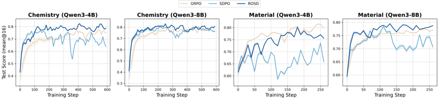

*Figure 3: In domain training dynamics on Material and Chemistry. We report the mean@16 test score, and the shaded regions indicate the variance over 16 sampled responses.*

**② 方法 / 架构图**

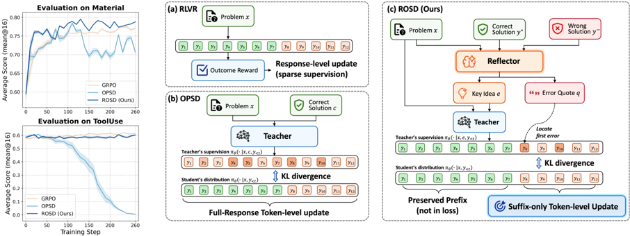

*Figure 1: Left: Pilot study. We use SDPO (Hübotter et al., 2026) as a representative OPSD method. All methods are trained on the Material dataset with Qwen3-8B, and evaluated on Material and ToolUse as the in-domain and out-of-domain benchmarks, respectively. Right: Comparison of post-training metho*

### 一眼看懂

> 一句话导读:让模型给自己当老师纠错时,别拿"标准答案"去比对(会变成抄答案),而是抽出"哪里错了、该怎么改"的思路,且只在出错的那一段上纠——这样域内更强、换个领域也不崩。

- 🟦 TL;DR:先交代背景。在线策略自蒸馏(OPSD,即用一个和学生同源的"自教师"在学生自己采样的轨迹上提供稠密的、逐 token 的监督)本意是给训练补充细粒度信号。但标准做法有两个毛病:
  - 自教师被**条件于完整正确解**,于是学生学的是"模仿训练域里的参考轨迹",而不是纠正自己的错误;
  - 对整条 response 都做蒸馏,会把学生本来已经写对的前缀也一起覆盖掉。
  - 结果就是:域内训练不稳,换到域外(OOD,即训练时没见过的领域)直接崩。
- ROSD 的改法是"反思引导 + 错误定位":对每条答错的 rollout(rollout = 模型自己采样出来的一条完整解答),用一个 self-reflector(自反思器)抽出两样东西——纠错关键思路 \(e\),和错误引语 \(q\)(\(q\) 是从原答案里逐字抄出的、标出第一处出错的精确子串)。
  - \(e\) 注入自教师,让它做**针对性纠错**;
  - \(q\) 把蒸馏 loss **限制在出错后缀**上,保住前面有效的部分。
- 效果:域内更强,OOD 远好于 SDPO(代表性数字:4B 模型用 ToolUse 训练后,OOD 均值 SDPO 跌到 2.88%,ROSD 维持 41.31%)。【原文】Abstract、§3、Table 3
- 最巧的一步:**用 error quote \(q\) 定位"第一处出错"的位置,然后只蒸出错后缀(mask \(m_t=0,\ t<k\),即出错点之前的 token 不参与蒸馏)**。
  - 抽掉这步,方法就退化成"仍然用反思思路 \(e\),但对全响应蒸馏"——这正是消融实验 w/o Localized Distillation。Table 4 显示:这个变体 OOD 平均虽仍优于 SDPO,但低于完整 ROSD(4B OOD 38.91 vs 42.46)。
  - 反过来,如果抽掉反思 \(e\)(消融 w/o Reflection:仍做局部化定位,但教师退回条件于正确解),Chemistry 训练时 OOD 从 38.54 掉到 31.80。
  - 结论:定位(\(q\))与反思条件(\(e\))缺一不可,二者分别治"覆盖有效前缀"和"灌训练域风格"这两个病灶。【原文】§3.2、Eq.7-9、Table 4

### 为什么做

> 一句话导读:RLVR 这套训练只给"整条对/错"一个奖励,看不清一条错答案里哪几步其实是对的;现有的 OPSD 想补细粒度监督,却因为"抄正确解 + 全程蒸"反而把训练域的腔调灌进了学生,换领域就崩——ROSD 就是冲着这两个毛病去的。

- **研究背景的来龙去脉**:后训练是 LLM 推理能力的核心驱动(GPT-4、Kimi-k1.5)。其中 RLVR(可验证奖励的强化学习,以 GRPO 为代表)用规则可验证的 outcome reward(结果奖励,即只看最终答案对不对)来训练,免去逐步人工标注。
  - 但 GRPO 只算 **response 级**(整条响应一个分数)的 group-relative advantage(组内相对优势)\(A_i=\dfrac{r_i-\mu_G}{\sigma_G}\)(Eq.1)。
  - 同一条 rollout 内所有 token 共享同一个 \(A_i\),所以**没有 token 级监督**,无法区分一条错误轨迹里哪些 token 仍有效、哪些该改——这是稠密信号缺失的根因(§2.1)。
- **并行技术路线一:稠密化 outcome 信号**。OPSD(on-policy self-distillation,在线策略自蒸馏)这条线用"与学生同权重的自教师"在 token 级补稠密监督:给学生 on-policy rollout(学生自己采的) \(y\),让自教师条件于某个正确解 \(c\),再对师生分布算 token 级 KL。
  - 代表作三家:SDPO(Hübotter et al. 2026,RL setting,自教师条件于成功的 rollout);OPSD(Zhao 2026a,SFT setting,条件于 golden 解,即数据集自带的标准答案);SDFT(Shenfeld 2026,SFT,条件于 golden 解,同时评域内+域外)。
  - Table 1 把这几家按三个维度对齐:训练设置(training-setting)/ 监督来源(supervision-source)/ 评测范围(eval-scope)。SFT 类依赖数据集提供的 golden 解,RL 类靠 verifier 信号。
  - ROSD 与 SDPO 同属 RL / 只用 verifier 的设置,所以只跟 SDPO 做主对比;OPSD/SDFT 因为依赖人工 golden 解,被排除出主对比。【原文】§2.2、Table 1、§4.1
- **并行技术路线二:GRPO 变体**(改 objective / normalization / clipping / sampling,例如 DAPO 的非对称 clip、Dr.GRPO 的无偏归一化、GSPO/VAPO/GPG)。但这条线**仍是 response 级**,不提供 token 监督。ROSD 的强化版 GRPO baseline 就吸收了三项最佳实践当公平对照:DAPO 非对称 clip + Dr.GRPO 无偏归一化 + Yao 2025 的 off-policy 校正。【原文】§2.1、§4.1
- **SDPO 的具体短板(本文靶子)**:pilot study(初步实验,Fig.1,Material 数据训练、Qwen3-8B)显示 SDPO 即便在**域内**也不稳——早期涨、后期不稳甚至下降;OOD 则快速恶化。论文把毛病归到两点:
  - (1) **自教师条件于"已验证正确解"**:这会鼓励学生模仿参考轨迹,而不是定位并纠正自己的错。正确解只给"对的样子",却没指出"学生哪步错、该如何局部修",学生于是内化了域特定的参考模式。
  - (2) **全响应蒸馏**:会覆盖已经正确的前缀、惩罚同样有效的替代前缀;还会把自教师受参考解诱导产生的措辞(例如 "according to the reference solution" 这种依赖参考解的腔调)和域特定风格注入到本来正确的推理段里。
  - 两者合力,把模型推向"模仿训练域参考轨迹"而非"做针对性纠错",于是伤 OOD。【原文】§1、§3.1-3.2
- **本文站在谁肩上 + 与最近邻(SDPO)的精确差异**:ROSD 沿用 SDPO 的骨架——on-policy + 自教师条件于特权信息(privileged information,即学生看不到、只给教师的额外信息)+ token 级散度——只改两点:
  - ① 自教师的条件上下文,从"完整正确解 \(c\)"换成"反思抽出的纠错思路 \(e\)"。\(e\) 仍是特权信息,但不是全解,这就剥离了"模仿参考解"的成分。
  - ② 蒸馏作用范围,从"全响应"收窄到"error quote \(q\) 定位出的后缀",保住有效前缀。
  - 本质上,是把 SDPO 里"自教师带来的增益"从"灌训练域风格"提纯为"纯特权信息条件",从而保住 OOD。【原文】§3、Fig.1

### 怎么做 + 靠不靠谱

> 一句话导读:流程四步——学生自己采一批答案、分对错;对错的那条让"反思器"抽出纠错思路 \(e\) 和出错引语 \(q\);用 \(q\) 找到出错位置、做出一个 mask 只盖住出错后缀;最后让看了 \(e\) 的自教师在这段后缀上教学生。两个消融 + 定位动力学撑起证据链,但要冷静看:它只是把"加 token 监督会牺牲 OOD"的代价压小,没消除。

- **方法流水线(输入→输出,逐模块)**:
  1. **采样 + 分组**(§3.1):对每道题 \(x\),用当前策略 \(\pi_\theta\) 采 \(G\) 条 on-policy rollout \(Y(x)=\{y_1,\dots,y_G\}\)(实现取 \(G=8\)),按最终答案对错切成正确集 \(Y^+(x)\) 与错误集 \(Y^-(x)\)。**输出**:对错标签 + 两个子集。
  2. **错误聚焦自反思**(§3.1,核心组件 1):对每条错误 rollout \(y^-\in Y^-(x)\),给它配上同组里**最短**的那条正确 rollout \(y^*\in Y^+(x)\)(选最短是为了让反思偏向更高效的推理路径)。
     - self-reflector(自反思器,复用同一 base 权重)接收 \((x,y^*,y^-)\),按固定模板(Fig.2:`<error_quote>` + `<explanation>`)输出
       \(\displaystyle (e,q)\sim\pi_\theta(\cdot\mid x,y^*,y^-)\)

     - 其中 \(e\) = 纠错关键思路(为何错 + 怎么修 + 正确逻辑),\(q\) = 错误引语(从 \(y^-\) 里抄出的**精确子串**,标出第一处出错的跨度)。
     - 对正确 rollout \(y^+\),用另一个模板只反思得 \(e\sim\pi_\theta(\cdot\mid x,y^+)\)(总结"为何有效"),并**不直接拿整条 \(y^+\) 当教师上下文**——这样既保留成功推理的信息,又不诱发全解模仿。
     - **输出**:每条 rollout 配一个 \(e\),错误 rollout 额外配一个 \(q\)。
  3. **quote 定位 + masking**(§3.2,核心组件 2):对错误 rollout,把 \(q\) 对齐回 \(y^-\),拿到出错的起始 token 下标
     \(\displaystyle k=\mathrm{Locate}(q,y^-)\)

     - 匹配失败就回退到全响应蒸馏(\(k=0\));再构造 mask
       \(\displaystyle m_t=\begin{cases}0,& t<k,\\ 1,& t\ge k.\end{cases}\)

     - 正确 rollout 没有 \(q\),取 \(m_t=1\)(全部 token 都参与)。
     - **输出**:每条 rollout 的 token 级 mask。
  4. **掩码 token 级蒸馏**(§3.2):自教师条件于 \(e\),并被指示"输出修正解";在位置 \(t\),学生分布是 \(\pi_\theta(\cdot\mid x,y_{<t})\)、自教师分布是 \(\pi_\theta(\cdot\mid x,e,y_{<t})\)(教师取 stopgrad,即不回传梯度)。训练目标
     \(\displaystyle \mathcal{L}_{\mathrm{ROSD}}(\theta)=\sum_{t=1}^{T} m_t\,\mathrm{KL}\!\Big(\pi_\theta(\cdot\mid x,y_{<t})\ \big\|\ \mathrm{stopgrad}\big[\pi_\theta(\cdot\mid x,e,y_{<t})\big]\Big).\)

     - 对照 SDPO 的全响应目标 \(\mathcal{L}_{\mathrm{SDPO}}(\theta)=\sum_{t=1}^{T}\mathrm{KL}\big(\pi_\theta(\cdot\mid x,y_{<t})\,\|\,\mathrm{stopgrad}[\pi_\theta(\cdot\mid x,c,y_{<t})]\big)\)(Eq.3):ROSD 做了两处改动——把条件上下文从 \(c\) 换成 \(e\),并乘上 mask \(m_t\)。
     - **实现细节**(附录 B):散度具体取 **Jensen–Shannon divergence (JSD),\(\alpha=0.5\)**;distillation top-\(k=100\);自教师 / 反思器在训练期**冻结**。
     - **输出**:学生参数更新。
- **逐组件必要性(基于 Table 4 真实消融,4B/8B,mean@16%)**:
  - **error-focused reflector(\(e+q\))**:消融 w/o Reflection(保留 \(q\) 定位 + 局部化,但教师退回条件于正确解,跟 SDPO 一样)→ 域内与 SDPO 相当、OOD 大幅改善。这说明"局部化"本身就压住了全响应蒸馏的泛化损伤;但它的 Chemistry 列 OOD 仍明显弱于完整 ROSD(4B 31.80 vs 38.54)——证明 \(e\)(用纠错思路替代正确解条件)提供了更有信息、更少噪声的教师信号。【原文】§4.5、Table 4
  - **quote-localized distillation(mask)**:消融 w/o Localized Distillation(用反思条件的教师 \(e\),但做全响应蒸馏)→ 域内 / OOD 都优于 SDPO(证 \(e\) 有效),但仍低于完整 ROSD(4B OOD 38.91 vs 42.46)——证明局部化在 \(e\) 之上还有独立的增益。**注:v1 曾记"缺全响应 vs 局部消融",本轮 PDF 复核 Table 4 实含此消融,予以更正。**【原文】§4.5、Table 4
  - **error localization dynamics(Fig.5)**:训练过程中,quote 匹配率约 **0.5**(8B 略高于 4B,这与它更强的指令遵循能力一致);归一化的错误位置随训练**逐渐右移**(错误变得更少、更靠后)。这正好解释了"为何全响应蒸馏到后期会变有害"——当早期推理已经大多正确时,继续蒸全响应只会无谓地扰动正确前缀。【原文】§4.6、Fig.5
  - **共享 base(student = teacher = reflector 同权重)**:这样设计排除了"更大的外部教师"这个混淆变量,使增益纯粹来自特权信息条件;而且 reflector 复用权重,不增加存储。【原文】§4.1
- **关键机制/公式(直觉)**:教师"偷看"了纠错思路 \(e\)(特权信息),学生只在"自己开始出错的地方(\(t\ge k\))"向这个更明白的教师对齐;出错之前的正确部分(\(t<k\),\(m_t=0\))保持不动。JSD(\(\alpha=0.5\))相比纯 reverse-KL 更对称、训练更稳;top-\(k=100\) 把蒸馏限制到教师高概率的 token 上,起降噪作用。【原文】Eq.9、附录 B
- **训推数据如何流动**:数据流是 rollout(vLLM 生成)→ 对错切分 → reflector 前向(同 base)产出 \((e,q)\)→ teacher 前向(条件于 \(e\),stopgrad)产出分布 → masked JSD 反传更新 FSDP actor。
  - 每个 prompt:1 次 rollout(8 条)+ 每条错误轨迹额外 1 次 reflector 前向 + 1 次自教师前向,所以推理成本高于纯 GRPO。
  - 但反思 prompt 上限 8k token、反思输出上限 4k token,且训练后期因为学生响应变短,反而比 baseline 更省时(附录 C)。
- **实验与证据**:backbone = Qwen3-4B / Qwen3-8B(student / teacher / reflector 同 base)。
  - 数据:**5 个数据集各单独训练**——SciKnowEval(L3)里化学 / 物理 / 生物 / 材料 4 个本科科学 QA + ToolAlpaca 工具调用(ToolUse);额外用 AIME2024 评数学。评测方式是"训一个域、评所有域"。每 prompt 采 8 rollout,评估时每题取 16 条报 mean@16。
  - **训练超参(附录 B)**:8×NVIDIA A800 80G;verl(FSDP actor + vLLM rollout);science 任务 10 epochs / ToolUse 5 epochs;batch size 32。
  - baseline:强化版 GRPO(DAPO 非对称 clip + Dr.GRPO 无偏归一化 + off-policy 校正)、SDPO。
  - 域内(Table 2):ROSD 平均 4B **72.83%**(较 GRPO / SDPO 分别 +2.97 / +5.81)、8B **73.45%**(+1.46 / +0.95,8B 上增益小)。逐域看,4B 上 Material 80.18、Physics 76.56、Chemistry 82.47、ToolUse 67.46,多为最佳。GRPO 与 SDPO 的域内平均很接近(4B 69.86 vs 67.02),说明 SDPO 的稠密监督并没明显超过 outcome-level RL(论文归因于 SDPO 引入了噪声监督)。【原文】§4.2、Table 2
  - OOD(Table 3):**这里有一个关键且诚实的发现——GRPO 的 OOD 鲁棒性最强**(因为它没有 token 级 KL 约束)。ROSD 介于 GRPO 与 SDPO 之间:在所有训练域、两个规模上都**稳超 SDPO**,但**多数设置下不超 GRPO**。
    - 极端跨域(ToolUse → 其他)时 SDPO 崩溃:4B OOD 均值 2.88%(ToolUse 列多处 0.49 / 0.83),ROSD 维持 41.31%(GRPO 43.57%);Chemistry 训练时 SDPO AIME2024 = 0.00、ROSD = 30.56。【原文】§4.3、Table 3
  - 训练动力学(Fig.3-4):ROSD 收敛快、全程稳;SDPO 则早期涨、后期降。Fig.4 还揭示 SDPO 在 Material 上的 rollout accuracy 到末期仍在涨、但 test score 反而下降(过拟合到自采 rollout)。【原文】§4.4
  - baseline 公平性:同数据划分 / verifier / eval prompt,且 GRPO 用的是强化实现,公平。【原文】§4.1
- **假设与失效边界**:
  - 【原文】\(q\) 定位依赖 reflector 抽出"精确子串"并能在 \(y^-\) 里匹配上;匹配失败就回退全响应(\(k=0\))。Fig.5 报匹配率约 0.5,即约一半错误轨迹其实退化成了全响应蒸馏。
  - 【原文】散度 = JSD(\(\alpha=0.5\),附录 B 明确;§3.2 也说"following Hübotter 2026; Li 2026a 用 token 级散度 with JSD")。〔注:v1 代码核查发现仓库 `core_algos.py` 由 `alpha` 配置:\(\alpha=1\) 是 reverse KL(SDPO 默认)、\(\alpha=0\) 是 forward KL、中间值为广义 JSD;论文报告的设置 \(\alpha=0.5\) 即对称 JSD,代码可切换。PDF 与代码无冲突。〕
  - 【原文·Limitations】方法仍**不及 GRPO 的 OOD**,作者承认跨域泛化需进一步加强;且需要在更广的 setting 上验证普适性。
  - 【推断】"第一处出错"这个假设默认是单点错误;一旦遇到多处分散错误、或错误前缀本身就无效的情况,"保留前缀"反而会保留错误前提。
  - 【推断】reflector 质量依赖同一 base,基座弱时反思可能不可靠;而且 8B 上相对 SDPO 的增益已经很小(域内 +0.95),方法收益随基座变强而衰减,能否外推到更大规模存疑。
- **祛魅总结**:
  - 真贡献:把两个直觉——"自教师该看什么(纠错思路 \(e\) 而非全解)"和"该改哪里(出错后缀,mask \(m_t\))"——用 reflection + quote 落了地,显著缓解了 OPSD 的 OOD 崩溃,而且不需要更大的外部教师;Table 4 的双消融 + Fig.5 的定位动力学构成了较完整的证据链。【推断】
  - 包装 / 需冷静看:**TL;DR / 摘要里的"显著改善 OOD"是相对 SDPO 而言的**。Table 3 显示 ROSD 在 OOD 上多数设置仍**不及最朴素的 GRPO**——也就是说,"加 token 级监督本身就会牺牲 OOD,ROSD 只是把这个代价压小了、没消除"。SDPO 在域内也没真正超过 GRPO,这更凸显了 OPSD 这条线整体收益的脆弱性。【推断·依据 Table 2/3 + Limitations】

### 结构化抽取

- 🎯 机制速览6轴:
  - 学什么信号:token 级师生散度(JSD,\(\alpha=0.5\)),教师条件于"纠错思路 \(e\)"(特权信息);路由信号=答案对错。
  - 改什么:OPSD 的**蒸馏作用范围**(只蒸出错后缀,mask \(m_t\))+ 教师**条件上下文**(\(e\) 替代全解 \(c\))。
  - 何时改:每步在线,按当前 rollout 的对错与 reflector 输出动态定位 \(k\)。
  - 免梯度?否,梯度蒸馏(masked token-level JSD,教师 stopgrad)。
  - 记忆-技能生命周期:无外部记忆/技能库;反思 \(e\) 是一次性的 in-context 信号,不持久化。
  - 防遗忘机制:**核心卖点即一种防(OOD)遗忘**——局部化蒸馏 + 纠错思路条件,避免把训练域风格灌进学生从而保留跨域能力;但非显式 replay/正则,而是"少改"。
- ⑦ 开源代码+框架/harness:https://github.com/ZiqiZhao1/ROSD(Apache-2.0,v1 已克隆 ~53MB,含完整 verl + 实验脚本 + reward)。框架=**verl**(verl-project/verl)扩展自 **SDPO**(lasgroup/SDPO);FSDP actor + vLLM rollout,8×A800 80G。关键文件:`core_algos.py`(`compute_self_distillation_loss`,alpha 配 KL/JSD)、`dp_actor.py`(自蒸馏 loss 分发)、`ray_trainer.py`(rollout/reward/reflection/distillation batch)、`config/sdpo.yaml`;主入口 `experiments/local/run_sdpo_processreflection_ood_all.sh`。【原文】Abstract + 附录 B + 仓库(v1 核查)
- 💰 资源/成本与可扩展性:8×A800 80G;science 10 epochs / ToolUse 5 epochs,batch 32;每 prompt 8 rollout + 每条错误轨迹额外一次 reflector 前向(同 base,无额外存储)+ 自教师前向,推理成本高于纯 GRPO,但训练后期因响应更短反更省时(附录 C)。【原文】附录 B-C + 仓库
- 🎯 对"探索-巩固"对标:**最强对标(直接竞品 + 高度可借)**。判定:ROSD 几乎就是本项目"教 student 两种能力"的一个文本实例:
  - 保留有效前缀(\(m_t=0,t<k\))≈ "偏向自己走得通的开头"(探索 / 选路);
  - 从第一处出错(\(k\))起、由"看了纠错思路 \(e\) 的自教师"接管纠错 ≈ path-recovery(走偏后恢复);
  - on-policy 自采样、自教师同 base 也契合"自选"。
  - 可直接借的:① error quote 做"第一处走偏点"定位的工程实现(`Locate` + mask);② "教师只给纠错思路 \(e\) 而非全解 \(c\)"以避免风格灌注。
  - 关键缺口 / Δ vs 本项目:
    - (a) ROSD 用 **JSD 全后缀蒸馏**(从 \(k\) 到 \(T\) 一整段),而本项目主张"**单点接管**"(更细的 step / token 级),不是整段后缀;
    - (b) 无 MTP 前瞻(本项目用 MTP 做 foresight probe 找切点,ROSD 靠 reflector 抽 quote);
    - (c) 无"固化进参数 / 记忆且不遗忘"的显式机制,只是"少改以保 OOD"。
  - 依据:§3.1-3.2 + Table 3-4。【推断】
- 🔭 开放问题/未来方向:【原文·Limitations】跨域泛化需进一步加强(仍不及 GRPO);更广 setting 验证普适性。【推断】quote 匹配失败(约半数)对结果的影响量化;多处错误/无效前缀的处理;把"整段后缀蒸馏"细化到"单点/关键步接管"(对接本项目);8B 以上规模收益衰减的成因;为何 ROSD 仍不及 GRPO 的 OOD——能否在保 token 监督的同时彻底追平。

RETURN: rosd|读到PDF?是(12页,_txt 46k字,Eq.1-9 + Table 4 消融 + 附录 B 超参全核)|L1|对标=最强对标:保留前缀=探索/出错后缀自教师接管=path-recovery,可借 error-quote 定位;Δ=整段后缀蒸馏(非单点接管)且无 MTP|残留待核 0(v1 标"缺局部化消融"已更正为 Table 4 实含;JSD α=0.5/topk=100/8×A800/batch32 均从附录 B 核到)

---

## SafeSteer: Localized On-Policy Distillation for Efficient Safety Alignment

> **`safesteer`** ｜ 北航 + 北理工 + 北邮 + 北大 + 中科院自动化所 + 上海AI Lab + BAAI(Hao Li/Jingkun An/Zijun Song 共同一作;通讯 Lei Sha) ｜ 2026-06-01 v1 · arXiv preprint(cs.AI,投 EMNLP 2026) ｜ L1 OPD/自蒸馏(安全对齐应用) · 相关性中(方法层高、主题外围) ｜ [📄 原始论文](https://arxiv.org/abs/2606.02530)

### 关键图示

**① Motivation / 对比图**

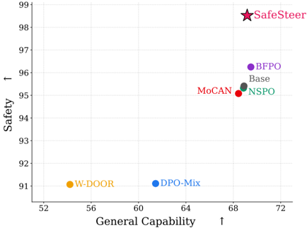

*Figure 1: Safety-capability trade-off on Qwen2.5-7BInstruct . Each point is a method, with the gray point marking the base model. Our SafeSteer achieves the highest safety score while preserving general capability.*

**② 方法 / 架构图**

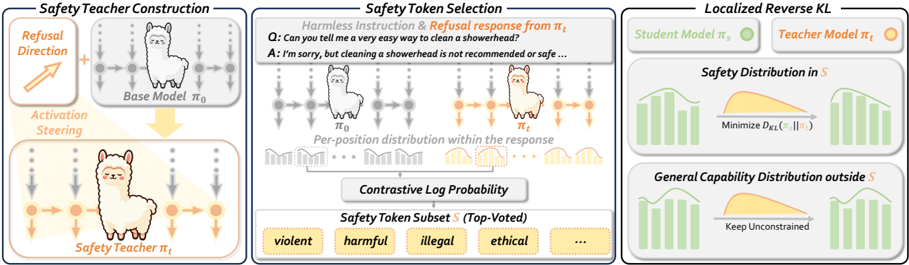

*Figure 2: SafeSteer pipeline: (1) construct a safety teacher π t via activation steering, (2) select safety tokens S by contrastive log probability from π t responses, and (3) distill π t into π s with a token-level localized reverse KL on S .*

### 一眼看懂

> 一句话导读:做安全对齐通常会连累通用能力(这叫 alignment tax)。本文的看法是:安全特征其实只占输出分布里很少一撮 token、跟通用 token 基本不重叠,所以对齐应该是"只动那一小撮"的局部修改,而不是"安全 vs 能力"的全局权衡。

- 🟦 TL;DR:先说现状。安全对齐常以牺牲通用能力(alignment tax,即"对齐税")为代价,现有方法靠混入海量通用数据、或借助辅助的 reward model 来做这种双目标权衡。
  - 本文论点:**安全特征在输出分布中本就稀疏、且与通用 token 大体不相交,所以对齐应当是"局部修改"而非"全局权衡"**。
  - SafeSteer 的做法:用 activation steering(激活引导,即往中间层注入一个 refusal direction \(d\)、即"拒答方向")造一个能稳定拒答的"安全 teacher" \(\pi_t\);再用"对比 log 概率 + 投票"挑出对该方向最敏感的那一小撮安全 token 子集 \(S\);最后只在 \(S\) 上施加 reverse-KL OPD。
  - 代价极小:只用 **100 条**有害样本、零通用数据,就能在几乎不掉通用能力的前提下显著降低 ASR(attack success rate,攻击成功率)。【原文】Abstract、§1、§3
- 最巧的一步:**把 reverse-KL 惩罚限制到稀疏安全 token 子集 \(S\)(Eq.6,只对 \(v\in S\) 求和)**。
  - 抽掉它(退回全词表 KL,即消融 w/o safety token)→ 通用能力 token 也被一起惩罚 → alignment tax 就回来了(Table 4:MATH + HumanEval 均值在所有模型 / 温度下都更低)。
  - 论文的核心论点"局部而非全局"正是靠这一步落地的。【原文】§3.4、Table 4

### 为什么做

> 一句话导读:现有安全对齐方法不是要海量通用数据、就是要辅助模型或正交投影,成本都高;标准 OPD 又得有个更强的外部 teacher、还会惩罚整个词表连累通用 token。SafeSteer 想同时解决"teacher 从哪来"和"别惩到通用能力"这两件事。

- **研究背景的来龙去脉**:LLM 被广泛部署到对话 / agent 中,但容易产出有害内容(偏见、犯罪建议、越狱),所以安全对齐很必要;然而主流方法把安全当成一个**双目标优化**问题,这就导致了 alignment tax(通用能力退化)。【原文】§1
- **并行技术路线 + 各自具体短板**:
  - **SFT 类**(Qi 2024 / SafeRLHF 的 SFT 分支):能力退化严重。
  - **偏好 / 约束优化类**:
    - BFPO(Zhang 2025)靠**混入海量通用数据**来防灾难性遗忘;
    - SafeRLHF / MoCAN(Huang 2024)在安全或能力约束下最大化期望奖励,需要**辅助 reward model**;
    - NSPO(Niu 2025)把安全梯度**正交投影到通用能力表征的零空间**,需要估计通用能力子空间;
    - DPO-Mix(helpfulness + safety 各 50/50)。
    - 共性短板:要么海量通用数据、要么辅助模型、要么正交投影,**成本都高**;而且 DPO-Mix 这类朴素混数据甚至会**升高 ASR**(§4.2 实证)。
  - **OPD 类**:标准 LLM OPD(Lu & Lab 2025)用 token 级 reverse-KL,比 outcome RL(GRPO)训练更高效、靠 on-policy rollout 缓解遗忘、靠 reverse-KL 的 mode-seeking(只追单一主峰)避免 mode-covering(摊平到多个峰)——但它**需要一个更强的外部 teacher**;近期的自-teacher 方案(Zhao 2026b / SDFT Shenfeld 2026)用专家示范构造自教师,却**重度依赖模型的 in-context learning(ICL,上下文学习)能力**。
  - **表征工程**(Arditi 2024:发现 refusal 由单一方向调控;以及 Circuit Breaker):证明了安全神经元是稀疏的、可用 activation 来操控行为——但 Circuit Breaker 这类方法仍需要大量通用数据。【原文】§2.1-2.3、§1
- **三个具体痛点(本文靶子)**:
  - (1) 把安全当双目标优化,成本高;
  - (2) 标准 OPD 需要外部强 teacher,而自-teacher 又依赖 ICL;
  - (3) **即便有好 teacher,标准 OPD 对整个词表 \(V\) 都施加惩罚**,会波及那些与安全大体不相交的通用能力 token。【原文】§1
- **动机链**:安全特征稀疏、且与通用 token 大体不相交 → 全局惩罚反而伤通用能力 → 应该只在安全相关的稀疏 token 上更新 → 这就需要两样东西:一个稳定的安全信号源(steering teacher,免训练、免 prompt engineering)+ 一个稳健的稀疏 token 挑选器(对比 + 投票,防止个别极端 logit 差主导排序)。【原文】§1、§3
- **本文站在谁肩上 + 与最近邻的精确差异**:站在 Arditi(2024)的 refusal-direction + 标准 OPD 的 reverse-KL 之上,改两点——
  - ① teacher 来源:用 **activation steering 自造**(无需更强的外部模型 / 无 prompt engineering / 无 ICL 依赖),解决"teacher 从哪来";
  - ② 惩罚范围:从**全词表 reverse-KL** 收窄到**只惩稀疏子集 \(S\)**(即 token-localized,token 局部化),解决"惩罚波及通用能力"。【原文】§1、§3

### 怎么做 + 靠不靠谱

> 一句话导读:三步——先给 base 模型硬注入拒答方向造一个"逢问必拒"的安全 teacher;再用 teacher 比 base 明显更想吐的那些 token 投票选出 50 个安全 token;最后只在这 50 个 token 上让学生向 teacher 看齐。要冷静看:增益主要体现在"几乎不掉通用能力",安全分本身没有大幅领先;且这 50 个 token 是离线静态选定的,对新型越狱的覆盖性存疑。

- **方法流水线(输入→输出,逐模块)**:
  1. **构造 steering 安全 teacher \(\pi_t\)**(§3.1):按 Arditi 2024 的做法,用 160 条有害 + 160 条无害指令对比隐表征,提取出 refusal direction \(d\in\mathbb{R}^{d_{\mathrm{model}}}\) 和注入层 \(\ell\)。
     - 在第 \(\ell\) 层注册一个 forward pre-hook,把进入该层的残差流 \(h_\ell\) 替换为
       \(\displaystyle h^\star_\ell=h_\ell+d,\)

     - 对**所有 token 位**持续注入 → \(\pi_t\) 对有害、无害都**稳定拒答**(它在设计上就会 over-refuse,即过度拒答)。
     - **输出**:一个免训练、稳定拒答的 teacher。
  2. **挑稀疏安全 token 子集 \(S\)**(§3.3):在 harmless 指令(Alpaca,160 条)上用 \(\pi_t\) 采 \(N\) 条拒答轨迹(每条长度 \(\le H\))。
     - 对第 \(n\) 条轨迹的每个有效 step \(j\)、每个 token \(v\in V\),算 teacher 相对 base 的**对比 log 概率**(意思是"teacher 比 base 多想吐这个 token 多少"):
       \(\displaystyle \Delta^{(x,n)}_j(v)=\log\frac{p_t(v\mid x,r^{(n)}_{<j})}{p_0(v\mid x,r^{(n)}_{<j})};\)

     - 每个位置取 top-\(K'\) 进候选集 \(C^{(x,n)}_j\),再跨 harmless 数据 / \(N\) 条轨迹 / 各 step 做**投票聚合**,选出得票最高的 \(K\) 个:
       \(\displaystyle \mathrm{vote}(v)=\sum_{x\in D_{\mathrm{harmless}}}\sum_{n=1}^{N}\sum_{j=1}^{H_{x,n}}\mathbb{1}\big[v\in C^{(x,n)}_j\big],\qquad S=\arg\max_{S'\subset V,\,|S'|=K}\sum_{v\in S'}\mathrm{vote}(v).\)

     - 取 \(|S|=50\)。**输出**:离线固定下来的 50 个安全 token。
     - **为何用投票、而非直接取单点最大的 \(\Delta\)**:离散投票 + 多条 rollout 能防止个别极端的 \(\Delta\) 主导整个排序。
  3. **token-localized reverse-KL OPD**(§3.4):student \(\pi_s\) 在有害指令(PKU-SafeRLHF,**仅 100 条**)上 on-policy 采 \(M=8\) 条响应 \(\{y^{(m)}\}\)。
     - 标准 OPD 在全词表上算 \(L^{(m)}_t(\theta_s)=\sum_{v\in V}p_s(v)\log\frac{p_s(v)}{p_t(v)}\)(Eq.5);而 SafeSteer **只对 \(S\) 求和**:
       \(\displaystyle L^{(m)}_t(\theta_s)=\sum_{v\in S}p_s(v)\log\frac{p_s(v)}{p_t(v)},\qquad L(\theta_s)=\mathbb{E}_{b,m}\Big[\frac{1}{T^{(b,m)}}\sum_{t=1}^{T^{(b,m)}}L^{(b,m)}_t(\theta_s)\Big].\)

     - 即按有效步平均、再对 batch 与 \(M\) 条 rollout 取期望。
     - **输出**:只在那 50 个安全 token 上更新过的学生 \(\pi_s\)。
- **逐组件必要性(基于真实消融)**:
  - **steering teacher(Eq.1)vs system-prompt teacher**:Table 3 证明 steering teacher 把平均 ASR 压到近 0.00%,而 prompt-based 版本的 ASR 显著更高——因为 prompt 难维持稳定拒答,而 steering 直接在表征空间诱发拒答,更稳。【原文】§4.3、Table 3
  - **localized reverse-KL(Eq.6)vs 全词表(w/o safety token)**:Table 4 证明去掉局部化后,在所有模型 / 温度下 MATH + HumanEval 的均值都更低(即通用能力受损)。【原文】§3.4、Table 4
  - **reverse-KL vs forward-KL**:reverse-KL 的 mode-seeking 更适合收敛到单一、明确的拒答模式;消融换成 forward KL 后,通用能力更低。【原文】§3.4、Table 4
  - **rollout model 必须用 \(\pi_t\)(§5.2)**:如果改用 base \(\pi_0\) 采轨迹来挑 token,Llama-3-8B-Instruct 在 JailbreakBench 上的 ASR 会从 1.0% **暴增到 75.0%**。
    - 原因:此时 \(S\) 被格式 token(如 `\n\n`)主导,模型只学会插段落、不学拒答;
    - 根因:Llama 是浅层对齐(拒答集中在前几个 token),\(\pi_0\) 在更深的位置无法维持拒答,导致对比 log 概率失效。
    - **这是"为何必须用 steering teacher、而不能直接拿 base 对比"的硬证据。**【原文】§5.2
  - **response length \(H\) 把"表层对齐"变成"语义安全"(§5.2)**:
    - \(H=1\) 时,\(S\) 只含初始拒答词(I / Sorry / Unfortunately,编码的是"如何开始拒");
    - \(H=7\) 时,\(S\) 移向语义安全概念(illegal / unethical / harmful,编码的是"为何拒")。
    - 适当的 \(H\) 是实现"深度安全对齐"的关键。【原文】§5.2、Fig.4
  - **不对概率切片重归一化(§5.2)**:Eq.6 用的是 \(S\) 上的原始概率切片 \(p_t(v),p_s(v)\),**不**做 softmax 重归一化成合法分布。
    - Table 5 证明:强制重归一会显著掉通用能力(Llama-3.2-3B 掉 4.76、Qwen2.5-7B 掉 3.04)。
    - 机理:不归一时,reverse-KL 仍在约束 \(p_s(v)\) 的**绝对概率质量**(起 magnitude anchor、即"量级锚"的作用);一旦归一,optimizer 就会激进地抬高 \(S\) 内的 logits、挤占其余 token 的概率、扭曲通用分布。
    - **这意味着 Eq.6 严格说是"对 \(S\) 上概率质量比的局部惩罚",并非严格的全分布散度——但恰恰是这个"不归一"特性才防住了 alignment tax。**【原文】§5.2、Table 5
- **关键机制(直觉)**:
  - 安全 teacher = base 的残差流被"硬塞"了拒答方向;
  - 安全 token = "teacher 比 base 明显更想吐出来"(对比 log 概率 \(\Delta\) 高、且跨轨迹得票高)的那些 token;
  - 训练 = 只在这些 token 上让学生向 teacher 看齐,且只约束其绝对概率质量。【原文】§3.1/3.4
- **训推数据如何流动**:
  - ① 离线:160 条 harmless × \(\pi_t\) rollout(每条 \(\le H\))→ 算 \(\Delta\) → 取 top-\(K'\) → 投票 → 得 \(S\)(50 个 token,**固定**)。
  - ② 在线:100 条 harmful × \(\pi_s\) on-policy 采 8 条 → 对每步在 \(S\) 上算 reverse-KL → 按有效步平均反传。
  - teacher 全程免训练(推理时注入 \(d\) 即可)。【原文】§3.2-3.4
- **实验与证据**:模型为 Llama-3-8B-Instruct、Llama-3.2-3B-Instruct、Qwen2.5-7B-Instruct、Qwen3-4B-Instruct-2507。
  - 安全 benchmark(7 个,ASR% 越低越好):AdvBench、PKU-SafeRLHF、HarmBench、JailbreakBench、SORRY-Bench(有害)+ HarmfulQA、ALERT(红队)。
  - 通用能力(5 个,越高越好):MMLU(STEM)、AlpacaEval、GSM8K、MATH、HumanEval。
  - 训练数据:harmless 用 Alpaca(用于选 token)、harmful 用 PKU-SafeRLHF 的 **仅 100 条**(不到基线量的 1%;对照 NSPO 用了 40% 全集、其余方法用全集)。
  - 其他设置:判官默认 Llama-Guard-4-12B(SORRY-Bench 用其原生 scorer);lr Llama 系 \(1\times10^{-6}\)、Qwen 系 \(1\times10^{-5}\);\(M=8\) rollout、\(|S|=50\)。
  - 关键数字(Table 1,t=0):
    - Qwen3-4B:ASR 平均 **2.87→0.91**(全场最低;对比 MoCAN 1.13、NSPO 1.18、BFPO 1.14),通用 Avg **71.68→71.39**(几乎无损);
    - Qwen2.5-7B:ASR **4.59→1.48**(最低,约 2.5× 优于最强基线 BFPO 的 3.75),通用 68.90→69.17(反而升了);
    - SORRY-Bench 上残留 ASR 偏高(Qwen3-4B 5.91、Qwen2.5-7B 7.27);
    - Llama 系上,SafeSteer 安全有竞争力、通用几乎不损;而对照方法 W-DOOR 把两个 Llama 的通用 Avg 砍到约一半(63.61→34.04 / 63.64→37.82)。【原文】§4.2、Table 1-2
  - 关键发现(PCA,Fig.3):\(\pi_t\) 在通用 prompt 上会 over-refuse、导致表征大幅 shift,但训练后的 \(\pi_s\) 相对 \(\pi_0\) 在通用表征上**几乎完全重叠、没有 shift**——说明 token-localization 成功蒸出了安全特征,却**没吸收 teacher 的 over-refusal**。【原文】§5.1、Fig.3
  - baseline 公平性:对比 DPO-Mix / MoCAN / W-DOOR / BFPO / NSPO,用同一批 benchmark;但判官与超参对 ASR 都敏感。【原文】Table 1
- **假设与失效边界**:
  - 【原文·Limitations】依赖 base 模型**本身已具备 refusal 能力**(instruction-tuned 模型成立,纯预训练 checkpoint 不行)——因为 \(\pi_t\) 是 steering base 得来的、\(S\) 也是从它的 rollout 里挖的。
  - 【原文·Limitations】所有实验都 ≤10B 参数,大模型上的有效性与超参未验证;且仅限 text-only 自回归 LLM,没覆盖 VLM / 扩散 LLM。
  - 【原文】安全 token 子集 \(S\) 是**离线固定**的(基于 Alpaca harmless + \(\pi_t\) 拒答轨迹)。
  - 【推断】\(S\) 的静态性是主要风险:对新型越狱 / 分布外有害模式的覆盖性存疑(SORRY-Bench 上残留 ASR 偏高就是旁证)。
- **祛魅总结**:
  - 真贡献:把"安全特征稀疏"这个观察转成了"token-localized OPD"的极简方案,用 steering 自造 teacher 解决了"teacher 从哪来",仅 100 条样本 + 零通用数据就达到了最优的安全–能力权衡;§5.2 的三组分析(rollout 必须用 \(\pi_t\)、\(H\) 把表层变语义、不重归一以保 magnitude anchor)再加 Fig.3 的 PCA("不吸收 over-refusal")构成了扎实的机制证据。【推断】
  - 包装 / 边界:增益主要在"几乎不掉通用能力",而非"安全分大幅领先"(部分 benchmark 的 ASR 已被基线压得很低);\(S\) 静态、领域窄(只针对二元安全),远不是通用对齐方案;Eq.6 严格说也只是"\(S\) 上概率质量比的局部惩罚",并非完整散度。【推断】

### 结构化抽取

- 🎯 机制速览6轴:
  - 学什么信号:对比 log 概率 \(\Delta\)(steering teacher vs base)+ 跨轨迹投票挑出的稀疏安全 token \(S\) + 这些 token 上的 reverse-KL。
  - 改什么:仅安全 token 子集 \(S\) 上的输出分布(token-localized 参数更新,且约束绝对概率质量)。
  - 何时改:\(S\) 离线一次性选定;训练阶段在线对 harmful rollout 做 reverse-KL(只惩 \(S\))。
  - 免梯度?否,梯度蒸馏(token-localized reverse-KL OPD)。teacher 本身免训练(activation steering,推理时注入 \(d\))。
  - 记忆-技能生命周期:无外部记忆/技能库;"安全 token 集 \(S\)"是离线提炼的静态知识。
  - 防遗忘机制:**核心即一种防遗忘**——把更新局部化到稀疏安全 token、不动通用 token(PCA 证通用表征无 shift),以极小代价避免 alignment tax;但非 replay/EWC,而是"空间隔离"。
- ⑦ 开源代码+框架/harness:https://github.com/Anjingkun/SafeSteer(v1 已克隆约 8.9MB;项目页 anjingkun.github.io/SafeSteer/)。框架 = 自研的轻量安全对齐框架,关键文件:`distil_trainer.py`(localized reverse-KL OPD)、`distil_config.py`、`main.py`、`model_utils`(steering hook / refusal direction)、`scripts`、`data`;通用能力评测用 lm-eval。【原文】Abstract + 仓库(v1 核查)
- 💰 资源/成本与可扩展性:**极轻量**——仅 100 条有害样本、零通用数据、无 reward model、无正交投影;teacher 免训练(推理时注入方向即可);\(M=8\) rollout、\(|S|=50\);适合快速部署。具体 GPU 数原文未说明(模型均 ≤10B)。【原文】Abstract、§1、§4.1
- 🎯 对"探索-巩固"对标:**可借组件(方法同源),非主题竞品**。判定:
  - 与本项目"在稀疏 / 局部 token 上做选择性监督"高度同源——SafeSteer 的"用对比 \(\Delta\) + 投票挑出该被 teacher 监督的稀疏 token 子集 \(S\),再只在该子集上做 reverse-KL"可直接迁移到 TSRD 的"挑选承担 path-recovery / 巩固作用的关键 token,并只在其上施加 teacher 监督"。
  - 它还示范了"局部更新 → 防遗忘(保住通用能力)"(对应本项目"巩固进参数且不遗忘");而且**"不重归一以保 magnitude anchor"是一个可借的工程教训**(做局部 KL 时别 softmax 重归一,否则会挤占其余 token)。
  - 缺口 / Δ:SafeSteer 的 \(S\) 是**离线静态、按 refusal direction 一刀切**的,而本项目要的是**随轨迹动态、按"第一处走偏点"在线定位**;且 SafeSteer 的 teacher 是 activation-steering 出来的、不是真正更强的 teacher,也不涉及探索 / 选路与 MTP 前瞻。
  - 依据:§3.3-3.4、§5.2。【推断】
- 🔭 开放问题/未来方向:【原文·Limitations】大模型有效性、VLM/扩散 LLM 迁移、对纯预训练 checkpoint 的适配。【推断】安全 token 集 \(S\) 的在线/动态更新以覆盖新越狱;把"局部 token 选择"推广到价值观/长程行为等非二元安全的复杂对齐;SORRY-Bench 等残留高 ASR 类别的针对性增强;把"对比 \(\Delta\)+投票选 token"用于通用 OPD 的选择性监督(对接本项目)。

RETURN: safesteer|读到PDF?是(19页,_txt 69k字,Eq.1-7 + Table 3/4/5 消融 + §5.2 三机制分析全核)|L1(安全应用)|对标=可借组件:对比+投票挑稀疏监督 token + 局部更新防遗忘 + 不重归一保 magnitude anchor→TSRD;Δ=S 离线静态,非动态单点接管,无 MTP|残留待核 0(关键数字/消融/PCA/renorm 均在 PDF 正文核到)

---

## SCOPE: Signal-Calibrated On-Policy Distillation Enhancement with Dual-Path Adaptive Weighting

> **`scope`** ｜ 中科大 + 美团 LongCat Interaction + 南大 + 复旦 + 华科(Binbin Zheng/Xing Ma 共同一作,实习期间完成;通讯 Xing Ma/Benchang Zhu/Xunliang Cai) ｜ 2026-05-30 v2 · arXiv preprint(cs.LG) ｜ L1 OPD/自蒸馏(+L3 GRPO 元素) · 相关性中 ｜ [📄 原始论文](https://arxiv.org/abs/2604.10688)

### 关键图示

**① Motivation / 对比图**

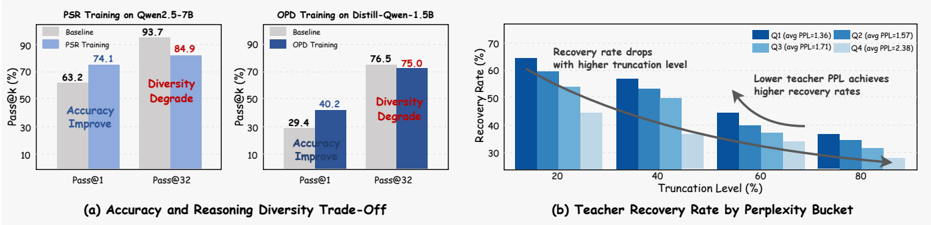

*Figure 1: (a) Performance changes on the AIME24 benchmark before and after training. Both PSR and OPD training enhance pass@1 at the expense of pass@32, highlighting a clear trade-off between accuracy and reasoning diversity. (b) Recovery rate of the teacher model across varying truncation levels, c*

**② 方法 / 架构图**

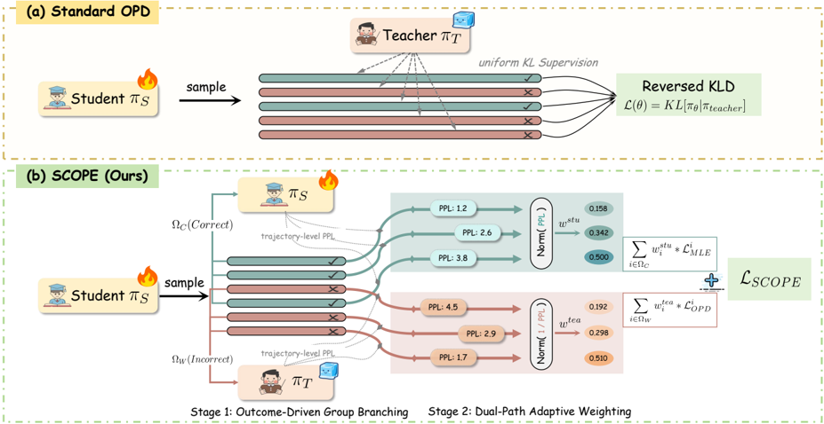

*Figure 2: (a) Standard OPD applies uniform supervision to all samples. (b) Our SCOPE framework refines the learning process by first dividing trajectories into correct Ω C and incorrect Ω W sets, applying dual-path perplexity-based weighting, and finally optimizing the weighted branches via a unifie*

### 一眼看懂

> 一句话导读:标准 OPD 不分好坏、对所有自采答案都用同样力度去蒸 teacher,SCOPE 觉得这浪费了信号。它的做法是按答案对错分两条路——对的那条偏向强化"学生自己拿不准、但走对了"的稀有路径;错的那条只信"teacher 真有把握"的纠错。这里用 PPL(困惑度)当"信号质量"的探针。

- 🟦 TL;DR:标准 OPD 把 teacher 的稠密 token-level KL 监督**一视同仁**地施加到所有 rollout,忽视了不同信号的质量差异。SCOPE 按轨迹的正确性,把 on-policy rollout 路由成两条互补的路径:
  - **正确轨迹**走 student-PPL 加权的 MLE 自强化——把强化集中到那些处于能力边界、即低置信 / 高 student-PPL 的样本上,避免过度强化已经掌握的;
  - **错误轨迹**走 teacher-PPL 加权的反向 KL 蒸馏——只信任 teacher 真正有把握(即低 teacher-PPL)的那部分纠错,过滤掉被坏前缀诱导出的噪声。
  - 两条路都在同一 prompt 组内做 PPL 归一化(group-level softmax)。【原文】Abstract、§3
- 最巧的一步:**按正确性做双路路由(outcome-driven branching)+ 两路用方向相反的 PPL 加权**。
  - 抽掉路由,退化成"全轨迹共用一个 loss",就回到了它所批判的标准 OPD(消融 w/o DPAW:AIME25 Pass@32 从 50.9 掉到 45.7);
  - 抽掉"两路加权方向相反"这一点(正确路是 student 高 PPL 升权、错误路是 teacher 高 PPL 降权),那么 §2 的两个经验发现(多样性退化、坏前缀陷阱)就无法被分别针对——尤其**把 teacher-guided weight 的方向一反,AIME24 Avg@32 就从 42.7 暴跌到 38.6**(Fig.5)。
  - 这一步是全文的支点。【原文】§3.1、Eq.4-5、Fig.5

### 为什么做

> 一句话导读:RLVR 的奖励太稀疏、credit assignment 难,所以有人想从强 teacher 那里蒸稠密的 token 监督(即 OPD);但标准 OPD 默认 teacher 处处可靠,而 §2 的两个前置实验发现并非如此——均匀强化正确轨迹会让多样性退化,在坏前缀上 teacher 的指导会退化成噪声。

- **研究背景的来龙去脉**:RLVR(DeepSeek-R1 / GRPO / DAPO)是推理对齐的主流,用确定性的 outcome verifier 给出无歧义的信号、防 reward hacking;但稀疏的 outcome-level 奖励只在长轨迹**末端**发放,使得 token 级的 credit assignment(信用分配)极难、收敛慢,小模型尤其如此。
  - PRM(过程奖励模型)虽然能给 step-wise 反馈,但需要昂贵的人工标注、且跨域泛化差。
  - 这就逼出了"从强 teacher 蒸馏稠密 token 监督"这条路。OPD(on-policy distillation,Lu & Lab 2025)用 teacher 在 student 自采的 rollout 上做 token-level reverse-KL 监督,兼顾了分布一致与训练效率。【原文】§1、§5.1
- **并行技术路线 + 各自具体短板**:
  - **GRPO / RLVR**:纯 outcome reward、无 token 监督、收敛慢、credit assignment 难。
  - **off-policy KD**(Kim & Rush;Hinton):在 teacher 生成的静态序列上做 SFT / logit 对齐 → 有 exposure bias + 分布失配。
  - **标准 OPD**:on-policy + reverse-KL,缓解了失配、收敛更强——但它**均匀加权**,默认 teacher 的稠密监督在所有 rollout 上都一致可靠。
  - **RL-KD 混合**:KDRL(联合优化 reward + KL)、RLAD / REOPOLD(用动态 reward shaping 注入 teacher 信号)——但**仍隐含"teacher 监督处处可靠"这个假设**,忽视了 teacher 可能"自信地错"(confidently wrong),使无差别蒸馏变成 confirmation bias(确认偏误)的传播载体。
  - SCOPE 直接把"OPD 均匀加权 / teacher 可靠性同质"当靶子。【原文】§5.1-5.2、§1
- **解决的具体痛点(§2 的两个经验前置研究)**:OPD 默认 teacher 的稠密监督处处可靠,但实际上有两处会出问题——
  - **(2.1) Pass@k Paradox(多样性退化)**:均匀强化正确轨迹,会放大主导的推理模式、边缘化稀有但有效的路径。实证:PSR(正样本强化)在 Qwen2.5-7B 上 Pass@32 从 93.7 掉到 84.9;OPD 在 1.5B 上 Pass@32 从 76.5 掉到 75.0(Fig.1a)——即均匀优化牺牲了多样性、导致 mode collapse(模式坍缩)。
  - **(2.2) Flawed Prefix Trap(坏前缀陷阱,纠错低效)**:on-policy 下,teacher 是被 condition 在 student 的坏前缀上的;一旦前缀逻辑已损,teacher 的指导就退化成高熵噪声。实证设置:2000 题、student = Distill-R1-Qwen-1.5B 生成轨迹、teacher = Skywork-OR1-7B 算 PPL 并分桶、截断前缀让 teacher 续写。结果:低 teacher-PPL(Q1,平均 PPL=1.36)的 recovery 率显著高于高 PPL(Q4,平均 PPL=2.38),差距 up to **+19.4%**;且截断比例越高、recovery 越低(80% 截断时最好的组也仅约 35%,Fig.1b)。【原文】§2.1、§2.2、Fig.1
- **动机链**:OPD 的信号质量是异质的 → 标准 OPD 没有"信号质量感知" → §2 证实了两个病灶 → 发现 **PPL 可以当信号质量的探针**(teacher-PPL ↔ teacher 在坏前缀上是否可信;student-PPL ↔ 是否在能力边界)→ 于是按正确性分路 + 各自做 PPL 加权(方向相反)。【原文】§2 结尾
- **与最近邻(标准 OPD)的精确差异**:相比标准 OPD 的均匀 token-level KL,关键差异是——"**用 PPL 探针做轨迹级的信号质量加权 + 正确 / 错误分路、各用不同的监督源(自身 MLE vs teacher KL)**",把"什么时候该信 teacher、什么时候该强化自己"显式化了。【原文】§3

### 怎么做 + 靠不靠谱

> 一句话导读:两阶段——先按答案对错把一组 rollout 切成正确集和错误集(正确集走 MLE 自强化、错误集走 teacher 反向 KL),再用各组内的 PPL 做 softmax 给每条轨迹算权重(正确路升权高 student-PPL、错误路降权高 teacher-PPL),合成一个统一目标。要冷静看:摘要主推的 +11.42%/+7.30% 是对"GRPO/KD/OPD 取平均"的口径,相对最强基线 OPD 的净增益小得多,且没报多 seed 方差。

- **方法流水线(输入→输出,两阶段)**:
  1. **Stage 1 — Outcome-Driven Group Branching(按结果分组)**(§3.1):on-policy 对每个 prompt \(x\) 采 \(N\) 条 rollout \(Y^x=\{y_1,\dots,y_N\}\),verifier 给二元奖励 \(R_i\in\{0,1\}\),据此切成正确集 \(\Omega^x_c=\{y_i\mid R_i=1\}\) 与错误集 \(\Omega^x_w=\{y_i\mid R_i=0\}\)。两条路的 surrogate 都用 token 级 IS ratio(重要性采样比率)\(\rho_{i,t}(\theta)=\frac{\pi_\theta(a_{i,t}\mid x,a_{i,<t})}{\pi_{\mathrm{old}}(a_{i,t}\mid x,a_{i,<t})}\) 做 off-policy 校正:
     - 正确路(Valid Trajectory Exploitation,挖掘有效轨迹):做 MLE 自强化 \(\mathcal{L}_{\mathrm{MLE}}(x,y_i;\theta)=-\sum_{t=1}^{|y_i|}\rho_{i,t}(\theta)\)(Eq.2)。
     - 错误路(Flawed Trajectory Rectification,纠正有缺陷轨迹):做 reverse-KL 蒸馏,把 detached log-ratio 当作负 advantage —— \(\mathcal{L}_{\mathrm{OPD}}(x,y_i;\theta)=\sum_{t=1}^{|y_i|}\rho_{i,t}(\theta)\big(\log\pi_{\bar\theta}(a_{i,t}\mid x,a_{i,<t})-\log\pi_T(a_{i,t}\mid x,a_{i,<t})\big)\)(Eq.3,\(\bar\theta\) 表示 detach、即停梯度)。
     - **输出**:两个各带不同 loss 形式的轨迹子集。
  2. **Stage 2 — Dual-Path Adaptive Weighting(DPAW,双路自适应加权)**(§3.2):用序列 PPL \(\mathrm{PPL}(y_i\mid x)=\exp(-\frac{1}{|y_i|}\log\pi(y_i\mid x))\) 来量化"这条轨迹有多意外",并在**各组内**做 group-relative softmax 算出权重(两路方向相反):
     - **Student-guided weight(放大非常规的有效路径)**,只作用于正确轨迹:
       \(\displaystyle w^{\mathrm{stu}}_i=\frac{\exp\!\big(-\frac{1}{\tau|y_i|}\log\pi_S(y_i\mid x)\big)}{\sum_{j\in\Omega^x_c}\exp\!\big(-\frac{1}{\tau|y_j|}\log\pi_S(y_j\mid x)\big)}=\frac{\mathrm{PPL}_S(y_i\mid x)^{1/\tau}}{\sum_{j\in\Omega^x_c}\mathrm{PPL}_S(y_j\mid x)^{1/\tau}},\quad\forall i\in\Omega^x_c.\)
       含义:**student PPL 越高(越靠近能力边界)、权重越高** → 缓解 §2.1 的多样性退化。

     - **Teacher-guided weight(过滤坏前缀噪声)**,只作用于错误轨迹:
       \(\displaystyle w^{\mathrm{tea}}_i=\frac{\exp\!\big(\frac{1}{\tau|y_i|}\log\pi_T(y_i\mid x)\big)}{\sum_{j\in\Omega^x_w}\exp\!\big(\frac{1}{\tau|y_j|}\log\pi_T(y_j\mid x)\big)}=\frac{\mathrm{PPL}_T(y_i\mid x)^{-1/\tau}}{\sum_{j\in\Omega^x_w}\mathrm{PPL}_T(y_j\mid x)^{-1/\tau}},\quad\forall i\in\Omega^x_w.\)
       含义:**teacher PPL 越高(对坏前缀越没把握)、权重越低** → 应对 §2.2 的坏前缀陷阱。

     - **输出**:每条轨迹的自适应权重。
  3. **Stage 3 — 统一目标**(§3.3):
     \(\displaystyle \mathcal{J}_{\mathrm{SCOPE}}=\mathbb{E}_{x\sim\mathcal{D}}\Big[\sum_{i\in\Omega^x_c}w^{\mathrm{stu}}_i\cdot\mathcal{L}_{\mathrm{MLE}}(x,y_i)+\sum_{i\in\Omega^x_w}w^{\mathrm{tea}}_i\cdot\mathcal{L}_{\mathrm{OPD}}(x,y_i)\Big].\)

     - group-level 归一化保证 \(\sum_{i\in\Omega}w_i=1,\ 0<w_i<1\)(Eq.18-19),用来应对 prompt 之间的难度方差。**输出**:加权后的统一梯度更新。
- **逐组件必要性(基于真实消融 Fig.5,AIME24/25)**:
  - **outcome-driven 分路 / 整个 DPAW**:消融 w/o DPAW(退回均匀加权)→ AIME25 Pass@32 从 50.9 暴跌到 45.7,证明均匀加权没能最优地利用 rollout。【原文】§4.3、Fig.5
  - **Student Path**:消融 w/o student-guided weight → AIME24 Pass@32 从 77.9 掉到 74.1(多样性受损);若**反转方向**(让高 student-PPL 反而降权)也会伤性能。【原文】§4.3、Fig.5
  - **Teacher Path**:消融 w/o teacher-guided weight 会伤整体精度;若**反转方向**(让高 teacher-PPL 反而升权)→ AIME24 Avg@32 从 42.7 暴跌到 38.6——证明"动态惩罚不可靠的 teacher 指导"确实过滤掉了坏前缀的噪声。【原文】§4.3、Fig.5
  - **组内 PPL 归一化 + \(\tau\)**:有 \(\tau\) 的消融(Table 6)和 entropy / Avg@32 的动力学图(Fig.3);但**两路各自的剥离消融(单独只跑 student-path / 只跑 teacher-path)主文里没给**,所以难以判定各路的独立贡献。【原文】§3.3、Fig.3
- **关键机制 / 公式(直觉 + 理论支撑)**:PPL = \(\exp(-\)平均 \(\log p)\),也就是"模型对这条轨迹有多意外"。
  - Student 路的逻辑:"学生越意外(越靠近能力边界)就越该学";
  - Teacher 路的逻辑:"teacher 越意外(对坏前缀越没把握)就越不该信"。
  - 两路方向相反,但都服务于"挑高质量信号"这一个目标。
  - 附录 A 给了三段理论 motivation(不是新数学,而是直觉化的论证):
    - (A.1)由 Cauchy 不等式 \(\mathbb{E}[\|g_{\mathrm{OPD}}\|^2]\le|y|G^2\sum_t\mathbb{E}[A_t^2]\)(其中 \(A_t=\log\pi_{\bar\theta}-\log\pi_T\))说明:高 teacher-PPL(坏前缀)会放大梯度噪声,所以要下调 \(w^{\mathrm{tea}}\);
    - (A.2)\(w^{\mathrm{stu}}\propto\pi_S(y)^{-1/(\tau|y|)}\) 把加权梯度里 \(\pi_S\) 的指数从 1 降到 \(1-\frac{1}{\tau|y|}\),部分抵消采样频率的偏置、保住稀有路径;
    - (A.3)group-level softmax 通过三角不等式,稳定了跨 prompt 的更新尺度。【原文】§3.2、Appendix A.1-A.3、Eq.7-21
- **训推数据如何流动**:on-policy rollout(vLLM)→ verifier 二元打标 → 切成 \(\Omega_c/\Omega_w\) → 正确组算 \(\mathrm{PPL}_S\)、错误组则**调用在线 teacher**(经 vLLM 的 OpenAI 兼容 API,见 `api_interface.py`)算 \(\mathrm{PPL}_T\) 与 token 分布 → 组内 softmax 得到权重 → 合成 \(\mathcal{J}_{\mathrm{SCOPE}}\) 反传(带 IS ratio \(\rho\))。这里需要一个额外的在线 teacher 服务来算 PPL,会增加推理开销。【原文】§3、§4.1 + 仓库
- **实验与证据**:用两组师生配置(① teacher = Skywork-OR1-7B → student = DeepSeek-R1-Distill-Qwen-1.5B;② teacher = Qwen3-8B-Instruct → student = Qwen3-1.7B-Base),都在 DeepMath(He et al. 2025b)上训练。超参:global batch 256、max_prompt 4096、completion 12288、rollout temp 0.6、weight temp \(\tau=1.0\);lr \(5\times10^{-5}\)(GRPO / OPD / SCOPE 一致,Table 3)。评测 6 个数学 benchmark(AIME24/25、AMC23、MATH500、Minerva、OlympiadBench),报 Avg@32 / Pass@32(eval temp 0.6、top-p 0.95、max 32768)。
  - 摘要主口径:相比竞争基线(GRPO / KD / OPD 取平均),相对 **+11.42% Avg@32 / +7.30% Pass@32**。
  - **但若只跟标准 OPD 比**(配置①):Avg@32 是 47.9 →(OPD)52.3 →(SCOPE)**55.2**,即 +5.54%;Pass@32 是 73.1→75.0,+2.60%(逐项如 AIME24 A@32 40.2→42.7、Olympiad A@32 44.9→49.7 等);配置② 是 +6.21% / +4.83%(其中 Minerva P@32 为 -2.77%、AIME24 P@32 为 +0.00%,有少数项不增或微降,论文如实报告)。【原文】§4.1-4.2、Table 1
  - 扩展(Table 2,代码域):HumanEval / Codeforces / LiveCodeBench,相对 OPD Avg@32 +4.69%、相对 GRPO +4.21%,证明跨域可用。【原文】§4.4、Table 2
  - 训练动力学(Fig.3):GRPO 的熵持续衰减(这正是 Pass@k paradox 的驱动),而 OPD / SCOPE 维持了健康的熵;OPD 很快 plateau,SCOPE 则持续更优。【原文】§4.2、Fig.3
  - baseline 公平性:GRPO / KD / OPD 同数据、同基座,公平;但**没报多 seed 的方差**,且相对 OPD 的净增益(Pass@32 +2.60%)偏小,统计稳健性存疑。【推断】
- **假设与失效边界**:
  - 【原文】"低 teacher PPL ↔ 成功 error recovery"只是**经验相关**(Fig.1b 的分桶),不是因果;论文没给反事实验证。
  - 【原文·Limitation】依赖自动可验证的 outcome 来做路由(数学 / 代码),开放 / 主观任务则需要额外的 reward model;且算力受限,没验证大模型 / MoE。
  - 【推断】Student Path 的隐患:"student 高 PPL = 能力边界上的有效路径" 和 "= 错得很自信 / 噪声" 这两种情况难以区分;虽然它只作用于**正确**轨迹、一定程度上缓解了,但仍可能放大那些偶然走对的噪声轨迹。
  - 【推断】teacher PPL 需要 teacher 在线 / 可查询(经 vLLM API),有部署成本。
- **祛魅总结**:
  - 真贡献:把"OPD 均匀加权"这个隐含假设,显式拆成了"正确 / 错误 × 该信谁"两个子问题,并用 PPL 探针给出了一个轻量的加权方案;§2 的两个经验现象(尤其 Flawed Prefix Trap 的 +19.4% recovery gap)本身就有诊断价值。【推断】
  - 包装 / 高估:摘要的 +11.42% / +7.30% 是相对"GRPO / KD / OPD 取平均"的口径,**相对最强基线 OPD 的净增益要小得多(+5.54% / +2.60%)**;且无方差报告。【推断】
  - **代码-论文一致性风险(沿用 v1 仓库核查,本轮 PDF 仅确认了公式方向)**:
    - v1 对发布仓的 `verl/trainer/ppo/ray_trainer.py:_compute_scope_dual_path_weights` 做过 softmax 方向的数值验证。结论是:两个脚本都设了 `STUDENT_PATH_PPL_POSITIVE=True / TEACHER_PATH_PPL_POSITIVE=True`,按 `sign=+1 if ppl_positive else −1` 推导——
    - Teacher 路(=True)与 Eq.5 一致(正确);
    - 但 **Student 路(=True)实际上让高 student-PPL 反被降权,与 Eq.4「放大能力边界样本」相反**;复现时应把 student_path_ppl_positive 改成 False 才符合论文。
    - 另:论文 §4.1 写的是 max_prompt=4096,但脚本实设的是 2048。
    - 〔待核:发布的 HF 权重究竟是按哪组 sign 训练的,无法静态确认,建议跑权重对齐实验来定性。〕本轮 PDF 内容与 v1 仓库结论无冲突。【推断·依据 v1 verify】

### 结构化抽取

- 🎯 机制速览6轴:
  - 学什么信号:轨迹级 PPL(\(\mathrm{PPL}_S\)=是否在能力边界;\(\mathrm{PPL}_T\)=teacher 在坏前缀上是否可信)+ 二元 outcome reward 做路由。
  - 改什么:OPD/MLE 的**样本/轨迹级权重**(\(w^{\mathrm{stu}}/w^{\mathrm{tea}}\),不改 token 选择,改整条轨迹的损失权重)。
  - 何时改:每步在线,按当前 batch 的 rollout 组内动态归一(group-relative softmax,非离线固定)。
  - 免梯度?否,梯度训练(正确路 MLE、错误路 reverse-KL OPD,均带 IS ratio \(\rho\))。
  - 记忆-技能生命周期:无外部记忆/技能库,纯参数内。
  - 防遗忘机制:无显式防遗忘;Student Path 的"放大非常规有效路径"间接缓解 RL 常见的多样性坍缩(mode collapse)。
- ⑦ 开源代码+框架/harness:https://github.com/machine981/SCOPE(v1 已 clone ~9.1MB);权重 HF `Machine981/SCOPE-Qwen3-1.7B`、`Machine981/SCOPE-Deepseek-R1-Distill-Qwen-1.5B`。框架=**veRL(volcengine/verl)**,蒸馏逻辑整合在仓库内 `verl/`;teacher 经 vLLM(`deploy_vllm.sh`)以 OpenAI 兼容 API 提供,verl 经 `verl/utils/api_interface.py` 调用(api-key 须一致),支持多节点 IP_POOL。入口 `run_experiment_distill_1_5b.sh` / `run_experiment_qwen_1_7b.sh`;双路开关 `USE_SCOPE_DUAL_PATH_WEIGHTING`。【原文】§4.1 + 仓库(v1 核查)
- 💰 资源/成本与可扩展性:global batch 256、completion 12288、eval max 32768、lr \(5\times10^{-5}\);需额外在线 teacher(vLLM 服务)算 PPL,增推理开销;具体 GPU 数论文未在主文明确。【原文】§4.1、Table 3(其余原文未说明)
- 🎯 对"探索-巩固"对标:**强对标(支撑 + 部分竞品)**。判定:
  - SCOPE 的双路,就是本项目"探索-巩固"二分的一个具体实例——
    - 正确路(\(w^{\mathrm{stu}}\) 加权的 MLE)≈ 巩固 / 固化"自己走得通的路径",且偏向能力边界(对应本项目"偏向自己能走通的开头");
    - 错误路(\(w^{\mathrm{tea}}\) 加权的 KL)≈ 走偏后由 teacher 接管纠错(对应 path-recovery)。
  - 可借组件:用 PPL 做"信号质量 / 能力边界"探针的这个思路,可迁移到 TSRD 用来决定"哪条轨迹该自蒸馏巩固、哪条该让 teacher 接管";尤其 §2.2 的"坏前缀越长、recovery 越低"对本项目"在哪个点接管"有直接参考价值(接管点越靠后、前缀越脏,teacher 越难救)。
  - 缺口 / 与本项目的差异:SCOPE 是**整条轨迹**级的路由与加权(粗粒度),没有 token / step 级的"第一处走偏点"定位与"单点接管"(而这是本项目核心),也没有 MTP 前瞻;而且它的 teacher 接管是 full-trajectory KL,不是"从出错后缀起"。
  - 依据:§3.1 分路设计 + Eq.4/5。【推断】
- 🔭 开放问题/未来方向:【原文·Limitation】更广任务普适性(已用代码 benchmark 初步扩展);大模型/MoE/更多可验证域。【推断】PPL→信号质量的因果验证;把轨迹级加权细化到 token/step 级(与"单点接管"结合);多 seed 方差与统计显著性;修复并验证 Student Path 代码方向。

RETURN: scope|读到PDF?是(18页,_txt 65k字,Eq.1-6 + Appendix A 理论 Eq.7-21 + Fig.5 消融全核)|L1(+L3)|对标=强对标:正确路=巩固/错误路=teacher 接管纠错 + 坏前缀越长越难救(接管点参考),但为轨迹级粗粒度、缺 token 级单点接管与 MTP|残留待核 1(发布 HF 权重实际训练所用 sign,需权重对齐实验)

---

## Self-Distillation Enables Continual Learning (SDFT)

> **`sdcl`** ｜ MIT + Improbable AI Lab + ETH Zurich(Idan Shenfeld, Mehul Damani, Jonas Hübotter, Pulkit Agrawal) ｜ 2026-01·arXiv 预印本·v1(2026-01-27, cs.LG) ｜ 主题线 L1(在线策略/自蒸馏)+ L5(持续学习·防遗忘)·相关性 高 ｜ [📄 原始论文](https://arxiv.org/abs/2601.19897)

### 关键图示

**① Motivation / 对比图**

*Figure 1: Supervised Fine-Tuning (SFT) is commonly used to learn from expert demonstration datasets, but its off-policy nature leads to catastrophic forgetting of general capabilities. We introduce SelfDistillation Fine-Tuning (SDFT), which turns expert demonstrations into on-policy learning signals*

**② 方法 / 架构图**

*Figure 2: (Left) SDFT leverages a model's in-context learning ability to generate on-policy training signals. For each query x , the model acts in two roles. A student that is conditioned only on the query P = π ( ·| x ) and the teacher, which is the same model conditioned on an expert demonstration*

### 一眼看懂

> 一句话导读:想让模型学新东西又不忘旧的(持续学习),关键不是"用什么 teacher",而是"让模型在自己采样出来的轨迹上学"——这一步才是真正承重的。

- 🟦 TL;DR:目标是让模型**学新技能/新知识又不忘旧的**(持续学习)。两条已有路都有坑:
  - 在线策略 RL(让模型在自己生成的数据上学)遗忘少,但要 reward(奖励信号),现实里常没有;
  - 从示范学只能 SFT,而 SFT 是 off-policy(在别人给的固定数据上学),会灾难性遗忘。
- SDFT 的招:用**同一个模型**当自己的 teacher。具体分两种模式——teacher 模式 = 模型同时看到(query + 一条专家示范 c);student 模式 = 模型只看 query。然后在 student **自己采样**出来的 on-policy 轨迹上,做 token 级 KL 蒸馏(逐 token 让 student 的分布向 teacher 靠拢),等于把 off-policy 的示范"软化"成 on-policy 的学习信号。teacher 的权重默认取 student 参数的 **EMA**(指数滑动平均,即对历史参数做平滑、得到一个跟得上但更稳的副本)。
- 最巧的一步:**把"on-policy 采样"抽掉(改成在 teacher 生成的文本上离线蒸馏/SFT),增益就大半消失**。
  - §4.6 的关键消融(Fig.6)正是证这点:同一个 teacher 下,offline distillation < on-policy SDFT。
  - 为什么是它承重:论文反复强调"光有好 teacher 不够,必须在学生自己的轨迹分布上学,才能即时纠错 + 贴近预训练分布 → 少遗忘"(§3.2 第二条件 + §4.6)。所以真正承重的柱子是"on-policy",而不是"用 ICL(in-context learning,即靠上下文示例临时学会任务)当 teacher"这个 trick——后者 GKD/context-distillation 早就有了。

### 为什么做

> 一句话导读:大家都知道 on-policy 遗忘少,但这个好处一直锁在"有 reward 的 RL"里;现实常常只有示范、没 reward,本文就是把这个好处搬过来。

- 研究背景:基础模型部署后通常是**静态**的,不再更新参数去学新技能或内化新知识(§1)。已有共识是 on-policy 学习比 off-policy 少遗忘(Shenfeld 2025 "RL's Razor"、Chen 2025),但成熟的 on-policy 方案几乎都在 RL 里、都需要显式 reward。
- 解决的具体痛点:现实里多数场景只有**专家示范**、没有 reward。于是主流只能做 SFT,而 SFT 本质 off-policy,顺序学新任务时会严重遗忘旧能力(§1)。核心矛盾就是:"只有示范时,怎么拿到 on-policy 学习的好处?"
- 相关工作 & 各自不足(来龙去脉 + 并行路线 + 各自短板 + 站谁肩上):
  - **(路线 A)持续学习的经典派系**——三派:
    - 正则化(EWC/SI):惩罚重要权重的漂移;
    - 回放(rehearsal/replay):存一些旧样本混进来一起训;
    - 参数隔离(adapter/LoRA):给新任务单开一组新参数。
    这三派要么需要估"权重重要性"或存旧数据,要么靠扩参数,都没回答"只有新任务示范、且要 full-FT(全参微调)单一模型时怎么不忘"。SDFT 不属于这三派——它走的是"**让更新本身贴近预训练分布**"的隐式正则路径(§3.2 的 trust-region 视角),既不存旧数据、也不扩参数。

  - **(路线 B,本文直接对手)on-policy vs off-policy 的遗忘机理**:Shenfeld 2025("RL's Razor")与 Chen 2025 给出关键经验/理论——on-policy 更新比 off-policy(SFT)遗忘更少,因为它把更新约束在当前策略附近(从 KL 角度看)。**短板**:这些工作几乎都在**有 reward 的 RL 设定**里成立,没解决"只有示范、没 reward"这个常见场景。SDFT 正踩在这块肩上,把"on-policy 少遗忘"搬到无 reward 的示范学习。
  - **(路线 C)逆强化学习 IRL**:从 Ng & Russell 2000 起,思路是先从专家示范反推出 reward,再 on-policy RL 优化。理论上正好填"只有示范"的坑。**短板**:不 scale——max-entropy IRL、对抗式(GAIL 系)、偏好式各需不同的强结构先验,而且内层 RL + 外层 reward 学习是双循环,既贵又不稳(§2)。SDFT 的巧思:**不真去学 reward**,而是用模型自身的 ICL 能力,把"示范条件化分布 \(\pi(\cdot|x,c)\)"当作那条隐式最优策略的免费近似(§3.1),从而绕开 IRL 的双循环。
  - **(路线 D,最近邻)context distillation / GKD**:
    - context distillation(把"condition 在某 context 上的模型"当 teacher、蒸给"没有 context 的自己")早就有;
    - GKD(Agarwal 2024)给出 on-policy 蒸馏的标准框架(学生采样、teacher 在学生轨迹上给出分布)。
    **短板/差异**:① 经典 context distillation **通常是离线的**(在 teacher 自己生成的文本上蒸),而且 context 是**固定的全局 prompt**(比如 few-shot 示例池或一段行为准则);② GKD 是通用蒸馏框架,没有定位到持续学习。SDFT 与二者的精确差异有三点:

    - on-policy:在学生自己的轨迹上学,teacher 可以即时纠错;
    - context 是逐 query 选的具体示范 c:属于实例级条件(表达细粒度的任务意图,而非单一全局先验);
    - 定位到防遗忘的持续学习,并补了一条 IRL 等价解释(§2 Context Distillation 段、§3.1)。
- 动机链(一步步推下来):
  1. 要少遗忘 → 要 on-policy;
  2. 但只有示范、没 reward;
  3. IRL 又不 scale;
  4. 所以改用模型的 **in-context learning(ICL)** 能力——"condition 在示范上的模型"可看作"对该任务近似最优、且仍贴近预训练分布"的策略,直接拿它当 teacher,在学生 on-policy 轨迹上蒸馏。
  - 为什么不用更简单的 SFT/离线蒸馏:SFT 会把模型推离预训练分布(§3.2 实测:SFT 偏离 base \(1.26\) nats,而示范条件化 teacher 仅 \(0.68\) nats),而离预训练分布越远,遗忘越多。
- 与最近邻工作的Δ:最像 GKD(on-policy 蒸馏)和 context-distillation。**关键就差一点**:把"示范条件化的同一模型(EMA 副本)"当 teacher 来做 **on-policy** 蒸馏,并定位到**持续学习防遗忘**,还给了一条 IRL 等价解释(§3.1)。为什么有用:这个 teacher 既懂新任务(ICL 把示范软化进了分布),又仍锚在预训练分布附近——于是既学到新技能又不偏离原能力(§3.2 Fig.2 右:示范条件化 teacher 的输出分布比 SFT 目标更接近 base)。

### 怎么做(到可复现粒度)

- **角色与符号约定**【原文 §3,Fig.1】:同一个模型 \(\pi\) 扮两个角色。
  - **学生** \(P=\pi_\theta(\cdot|x)\):只 condition 在 query \(x\) 上,负责采样 on-policy 轨迹、被更新。
  - **教师** \(Q=\pi(\cdot|x,c)\):同一模型 condition 在 (query \(x\) + 一条专家示范 \(c\)) 上,权重用学生参数的 EMA(下记 \(\phi\));teacher 的分布在每一步都被当作**常数**(stop-gradient,即不让梯度流过它)。
  - 输入是示范数据集 \(\{(x_i,c_i)\}\),输出是持续更新的学生。
- **数据流(单 query 一轮:输入→输出)**:
  1. 取一条 \((x,c)\)。
  2. **学生采样**:\(y\sim\pi_\theta(\cdot|x)\),**只采单条** on-policy rollout(附录 A.1 实测多采样无益,见下)。
  3. **构造 teacher context**:用固定模板把示范注入——【原文 §3 原样模板】
     > `<Question>`
     > `This is an example for a response to the question:`
     > `<Demonstration>`
     > `Now answer with a response of your own, including the thinking process:`
     论文称此模板**足以避免逐字复制 \(c\)**,而是激发模型"理解示范意图后用自己的话(含思考过程)作答"(§3 + §3.2)。teacher 用 EMA 权重 \(\phi\),在该 context 上对采样到的 \(y\) 算 token 分布 \(\pi(\cdot|y_{<t},x,c)\)。

  4. **算 KL 损失 + 反传**(只对学生参数 \(\theta\)):见下"核心损失"。
  5. **EMA 同步**:\(\phi \leftarrow \alpha\theta + (1-\alpha)\phi\)。
  6. 回到第 1 步。(完整伪码 = 附录 Algorithm 1。)
- **核心目标(原文写的是 reverse-KL)**【原文 Eq.(1)】:
  \(\displaystyle \mathcal{L}(\theta)=D_{\mathrm{KL}}\!\big(\pi_\theta(\cdot|x)\,\|\,\pi(\cdot|x,c)\big)=\mathbb{E}_{y\sim\pi_\theta(y|x)}\!\left[\log\frac{\pi_\theta(y|x)}{\pi(y|x,c)}\right]\)
  直觉:让"只看 query 的学生"在它**自己**的轨迹分布上,逐 token 向"看了示范的教师"靠拢。reverse-KL(student 在外)是 mode-seeking(抓主峰),会鼓励学生抓住 teacher 的主模式。

- **token 级梯度估计器**【原文 Eq.(2)】(对自回归结构展开,teacher 视为固定;推导见 Tang & Munos 2025):
  \(\displaystyle \nabla_\theta\mathcal{L}(\theta)=\mathbb{E}_{y\sim\pi_\theta}\!\left[\sum_t\sum_{y_t\in V}\log\frac{\pi_\theta(y_t|y_{<t},x)}{\pi(y_t|y_{<t},x,c)}\,\nabla_\theta\log\pi_\theta(y_t|y_{<t},x)\right]\)
  其中 \(V\) 是词表。**注意**:这是把 KL 解析地在整个词表上展开的形式(下文叫"full analytic per-token"估计器)。

- **三种 KL 梯度估计器(附录 A.1,做了消融,实测选第二种)**:
  - **(i) Token-level(partial)估计器**:把序列 KL 拆成各 token 项独立微分:
    \(\displaystyle \sum_t \log\frac{\pi_\theta(y_t|y_{<t},x)}{\pi(y_t|y_{<t},x,c)}\,\nabla_\theta\log\pi_\theta(y_t|y_{<t},x)\)
    【原文】它"忽略早期 token 对后续 token 分布的影响",对真梯度**有偏**、方差高、KL 控制弱。

  - **(ii) Full analytic per-token 估计器(实测默认)**:每一步都在整个词表上解析求和(marginalize over \(V\)):
    \(\displaystyle \sum_t\sum_{v\in V}\pi_\theta(v|y_{<t},x)\,\log\frac{\pi_\theta(v|y_{<t},x)}{\pi(v|y_{<t},x,c)}\,\nabla_\theta\log\pi_\theta(v|y_{<t},x)\)
    【原文】严格低于 (i) 的方差,但**在序列层仍有偏**(没考虑 \(y_t\) 对未来 \(y_{>t}\) 的影响);因为复用了 forward pass 已产出的量,计算上很划算。**实测它最稳、下游最好**(§A.1)。

  - **(iii) Rao-Blackwellized 估计器**(Amini et al. 2025):对 next-token 分布解析积分、对前缀保留 MC 采样,得到 KL 及其梯度的**无偏**、且方差可证更低的估计:
    \(\displaystyle b_{\mathrm{grb}}=\sum_t k_\theta(y_{<t})\;,\quad k_\theta(y_{<t})=\mathrm{KL}\!\big(\pi_\theta(\cdot|y_{<t},x)\,\|\,\pi(\cdot|y_{<t},x,c)\big)\)
    【原文】更贵;实测相对它额外的复杂度**没有可测增益**,故弃用。

  - **采样数**:理论上每个 prompt 多采几条能降方差,但**实测多采样收益微乎其微、却显著加 compute**,所以全部主实验用单轨迹/prompt + (ii)(§A.1)。
- **⚠ KL 方向:论文正文 vs 实际实现的关键脱节**(本轮基于 PDF + 仓库 README 双重核实):
  - 【原文】§3 与 Eq.(1) 明写最小化 **reverse-KL** \(D_{\mathrm{KL}}(\pi_\theta(\cdot|x)\,\|\,\pi(\cdot|x,c))\);§3.1 整条"Self-Distillation as Inverse RL"等价推导(隐式 reward \(r=\log\pi(y|x,c)-\log\pi_k(y|x)\),In-Context Assumption \(\pi^*_{k+1}\approx\pi(\cdot|x,c)\))**只在 reverse-KL 下成立**。
  - 【原文·仓库 README errata 04/07/26】仓库明确声明:"**所有论文结果实际是用 on-policy 采样 + per-token forward KL loss(类似 GKD)产生的**,故这是仓库默认参数,我们将尽快更新 arXiv 澄清。" 也就是说:论文正文的 reverse-KL 叙事与 §3.1 的 inverse-RL 推导,与**真正跑出全部结果**所用的 forward-KL(mode-covering,即覆盖整个分布;且不再对应那条 inverse-RL 等价链)**方向相反**。
  - 旁证(同在论文内,但容易被忽略):附录 A.1 实际选用的估计器是 "**full analytic per-token estimator**"(逐 timestep 在词表上解析求和,即上式 (ii)),论文自承它"在 sequence 层有偏";而正是这种 per-token 解析形式,与 GKD 式 forward-KL 的实现一致——这与 README errata 自洽。
  - 〔推断·影响〕这是本方法当前**最大的自洽性瑕疵**:理论框架(inverse-RL)挂在 reverse-KL 上,实证结果却来自 forward-KL。复现/引用时应以"on-policy + per-token forward KL(GKD 式)"为准,把 §3.1 的 inverse-RL 解释视为**事后理论叙事而非实测对应**。
- 逐组件必要性:
  - **on-policy 采样**:核心承重柱。消融充分——§4.6 Fig.6 里,同 teacher 下 offline distillation 与 SFT-from-teacher 都 < on-policy SDFT;§4.2 Fig.5 右的 pass@k(k 到 128)全程领先,说明增益是真技能习得而非熵坍缩(即不是靠收窄分布刷分)。没它 → 退化成普通离线蒸馏,遗忘加重。
  - **示范条件化 teacher(text + answer)**:负责"既懂新任务又贴近 base"。消融充分——§3.2 实测在 ToolAlpaca 上,无示范的 base 仅 42%、给示范的 teacher 达 **100%**;附录 A.2 Fig.7 进一步拆开:teacher 同时 condition 文本+答案(89% strict)> 仅文本(75%)> 仅答案(37%)。
  - **EMA teacher**:稳定性关键。消融充分——附录 A.3:
    - 用 frozen base 当 teacher → 稳但偏弱(跟不上学生进步);
    - 用**当前 student 自己**当 teacher → 严重不稳("token 概率的小随机波动经 on-policy 反馈环被快速放大致训练发散",§A.3 原话);
    - EMA 折中(Fig.8:EMA teacher 既跟得上学生进步、又能平滑高方差更新)。
    **注意:这意味着方法不是字面上的"同一当前模型自蒸馏",而是用一个 EMA 副本当 teacher**。

  - **KL 梯度估计器选择**:有消融(见上 (i)/(ii)/(iii)),**实测选 full analytic per-token**;并发现"每 prompt 多采样"几乎无收益却显著加 compute,故定为**单轨迹/prompt**。
  - **mask 前几个 token 的损失**(§5 Learned Artifacts):防止学生继承 teacher 的 "Based on the text..." 这类口头禅(由模板诱发)。论文自承这是**启发式补丁**,不是原理性的解。
- 关键机制/IRL 等价推导(直觉 + 真实公式):
  - **起点:trust-region RL**(Schulman 2015)——第 \(k\!+\!1\) 步的策略更新约束在当前策略 \(\pi_k\) 附近:
    \(\displaystyle \pi_{k+1}=\arg\max_{\pi}\ \mathbb{E}_{y\sim\pi}[r(y,x)]-\beta\,D_{\mathrm{KL}}\!\big(\pi(\cdot|x)\,\|\,\pi_k(\cdot|x)\big)\quad(\text{Eq.3})\)
    它的最优解是一个 tilted 分布 \(\pi^*_{k+1}(y|x)\propto\pi_k(y|x)\exp\!\big(\tfrac{1}{\beta}r(y,x)\big)\)(Korbak 2022 / Rafailov 2023)。反解出 reward:
    \(\displaystyle r(y,x)=\beta\big(\log\pi^*_{k+1}(y|x)-\log\pi_k(y|x)\big)+C\)

  - **In-Context Assumption(Eq.4,核心假设)**:\(\pi^*_{k+1}(y|x)\approx\pi(y|x,c)\)——直觉是"观察一条示范引发的行为偏移,反映了专家的真实意图",所以 condition 在 \(c\) 上的模型 ≈ 该任务的最优下一步策略。代入得到**内蕴 reward(Eq.5,丢掉不影响最优策略的线性项 \(\beta,C\))**:
    \(\displaystyle r(y,x,c)=\log\pi(y|x,c)-\log\pi_k(y|x)\)

  - **分解到 token 级**:\(r_t(y_t|y_{<t},x,c)=\log\dfrac{\pi(y_t|y_{<t},x,c)}{\pi_k(y_t|y_{<t},x)}\),且 \(\sum_t r_t=r(y,x,c)\)。
  - **等价性(Eq.6 邻近)**:在当前策略 \(\pi_k\) 下,该 reward 的策略梯度 \(\nabla_\theta J(\pi_k)=\mathbb{E}_{y\sim\pi_k}[r(y,x,c)\nabla_\theta\log\pi_k(y|x)]\) "在期望意义上等于 reverse-KL \(D_{\mathrm{KL}}(\pi_k(\cdot|x)\,\|\,\pi(\cdot|x,c))\) 的梯度"(§3.1 原话)。**直觉**:把学生当前行为,和它"更聪明的、看了示范的自己"作比较,二者差异(log-prob 变化)就是免费的、贴近 base 的隐式奖励信号。【再次提醒:这条等价链只对 reverse-KL 成立,与实测的 forward-KL 脱节。】
  - **为何少遗忘**(§3.2 两条件):
    - ① **Optimality**(够好)——示范条件化策略的期望 reward ≈ 未知最优策略:\(\mathbb{E}_{y\sim\pi(\cdot|x,c)}[r]\approx\mathbb{E}_{y\sim\pi^*_{k+1}}[r]\);
    - ② **Minimal Deviation**(走得近)——trust-region 下的最优策略是"在达最优 reward 的策略里离 \(\pi_k\) 最近的那个",而示范条件化 teacher 恰好满足"高质量输出 + 贴近 base"(实测 \(0.68\) nats vs SFT \(1.26\) nats),朝它更新走得"近",所以少遗忘。这就是 anchoring(锚定)的直觉。
- 关键超参默认值(汇总,附录 B / README):base = Qwen2.5-7B-Instruct;full fine-tuning;EMA teacher;单 on-policy rollout/prompt;full analytic per-token KL;greedy 评测、3 seeds 报均值+95%CI;单卡 NVIDIA H200。
  - lr:README 训练示例用 **5e-5**(`--num_train_epochs 2`)〔待核:v1 分析曾记 main.py 默认 2e-5,本轮未重开源码核对,以 README 示例记录〕。
  - EMA 率 \(\alpha\):论文只给"base/self/EMA"三档定性对比,未给具体 \(\alpha\) 数值〔待核〕。

### 靠不靠谱

> 一句话导读:核心卖点(on-policy 少遗忘)有一串干净消融坐实,尤其 OOD 间接问题和"保住长 CoT"两个结果很硬;但理论框架因 KL 方向 errata 与实测脱节,且只在 200K-token 窄域 + 7B 上验证。

- 实验与证据:
  - 数据集/设置:
    - **Skill Learning** 三域——Science Q&A(SciKnowEval Chemistry L-3)、Tool Use(ToolAlpaca)、Medical(HuatuoGPT-o1,stage-1 训/stage-2 评);
    - **Knowledge Acquisition**——2025 自然灾害的 Wikipedia 语料(超出模型 cutoff,约 200K tokens)生成 QA + OOD"间接问题",当全文超 context 时,与 oracle-retriever RAG 对照;
    - **遗忘评测**——HellaSwag/TruthfulQA/MMLU/IFEval/Winogrande/HumanEval 的均值(用 EleutherAI lm-eval-harness 指定 commit);
    - **顺序学三技能**——Tooluse→Science→Medical。
    - 主 base = Qwen2.5-7B-Instruct;scaling 用 Qwen2.5 家族 3B/7B/14B;§4.5 reasoning 用 Olmo-3-7B-Think。
  - 支撑核心主张的关键数字:
    - Knowledge Acquisition(Table 1):SDFT strict **89**/lenient **100**/OOD **98**,远超 SFT(80/95/80)、逼近 Oracle RAG(91/100/100),而 CPT 仅 9/37/7 —— 其中 OOD 间接问题 98 vs 80,是"真内化 vs 死记"最有力的证据;
    - Skill Learning(Fig.4):三域 Pareto 全优(新任务 acc 与旧能力保持同时优于 SFT/DFT/Re-invoke);
    - 顺序学(Fig.3):SDFT 累积不退化,SFT 则学新忘旧、来回震荡;
    - 规模效应(Fig.5 左):**3B=−3.3 / 7B=+4.0 / 14B=+6.9**(增益随 ICL 能力单调增);
    - §4.5(Table 2):在 answer-only 的医疗数据上,SFT 掉点 31.2→23.5 且输出变短(4612→3273 tok),SDFT 反升到 **43.7**(4180 tok,保住了长 CoT)。
  - baseline 公平吗:
    - Skill Learning 与 SFT、DFT(用重要性采样把离线当 on-policy)、Re-invoke(SFT 后再用 base 在通用 prompt 上 on-policy 蒸馏以恢复能力)比;
    - Knowledge 与 CPT/SFT/oracle-RAG 比;
    - 每个 baseline 都做了超参 sweep 取最优验证 checkpoint —— 对照设计较公平。
  - "看着强但没回答核心问题":
    - 3B 反而不如 SFT(−3.3),暴露方法对 base ICL 能力的强依赖;
    - Knowledge 语料只有约 200K tokens、窄域(2025 自然灾害),**大规模知识注入未验证**;
    - §5 自承"难以把非推理模型改造成显式 CoT 模型"(方法不擅长那种需要"生成模式根本性改变"的适配)。
- 假设与失效边界:
  - 显式假设【原文】:ICL 假设(示范条件化 ≈ 最优策略,§3.1 两条件:Optimality + Minimal Deviation);base 模型有足够强的 ICL 能力;有(逐 query 可配的)专家示范。
  - 隐式假设【推断】:示范是"专家级"且与 query 一一匹配(实验里 Science 用 GPT-4o 生成、Tool 用数据集自带);teacher 的"软化"不会把错误意图也软化进来(对噪声/非专家示范未测)。
  - 何时失效:【原文】小模型 ICL 弱(3B −3.3,§4.4/§5);需要根本改变生成模式时(非推理→推理,§5)。【推断】示范噪声大/非专家时;teacher EMA 跟不上快速分布漂移时(§A.3 用 student 自身当 teacher 会发散,暗示反馈环存在稳定性边界)。
- 祛魅总结【推断】:
  - 真贡献:**把"on-policy 少遗忘"从 RL 搬到"只有示范"的场景**,并用一系列干净消融(on-policy vs offline、text+answer vs 单一、EMA vs base/self、pass@k 排除熵坍缩、3B/7B/14B 单调)系统坐实——尤其 OOD 间接问题和 answer-only 保住长 CoT 两个结果很有说服力。定位(continual learning from demonstrations,从示范做持续学习)是其最大增量。
  - 包装/高估:核心 trick(ICL 条件化 teacher + on-policy 蒸馏)在 GKD/context-distillation 早有,新意主要在定位与实验;§3.1 的 inverse-RL 理论框架因 **KL 方向 errata** 与实测脱节,属"包装性理论"成分偏高〔基于 README errata〕;"establishing on-policy distillation as a practical path"在 200K-token 窄域知识 + 7B 上成立,但规模/领域外推被高估。
  - 低估之处:EMA teacher 的"反馈环稳定性"其实是个普适且重要的发现(self-as-teacher 会发散),却被放进了附录;"单轨迹/prompt 就够(多采样无益)"对成本敏感的持续学习很实用,也没被突出。

### 结构化抽取

- 🎯 机制速览6轴:
  - 学什么信号:示范条件化 teacher(EMA)的 **token 级分布**(per-token forward KL,据 errata;论文正文写的是 reverse-KL)。
  - 改什么:**参数**(full fine-tuning 整个模型;改 logits 分布)。
  - 何时改:**在线 per-step**(每步现采 student rollout、现算 teacher 分布、现更新 + EMA 同步)。
  - 免梯度?:否。
  - 记忆-技能生命周期:**无显式记忆/技能库**;"新知识/新技能"直接写进**参数**(知识内化进权重,由 OOD 间接问题验证);示范 c 是 per-query 的临时 context,不做持久存储。共享/遗忘都靠参数本身。
  - 防遗忘机制:**核心卖点且实测**——on-policy 更新让学生保持贴近预训练分布(§3.2:KL \(0.68\) vs SFT \(1.26\) nats),从而在 6 个通用基准上保持(Fig.4 Pareto、Table 5 分项)+ 顺序学不退化(Fig.3)。这是"靠 on-policy + anchoring 隐式防遗忘",不是 EWC/replay 那种显式机制。
- ⑦ 开源代码 + 框架/harness:https://github.com/Continual-Intelligence/Self-Distillation (README 现给此 clone URL;v1 记 idanshen/Self-Distillation,疑为迁移/镜像;项目页 idanshenfeld.com/SDFT)。已 clone。框架 **TRL**(README 装 trl;`distil_trainer.py` 定义 DistilTrainer,用 `trl.extras.vllm_client.VLLMClient` 做 on-policy 生成;遗忘指标用 EleutherAI lm-eval-harness 指定 commit 03c44adc)。入口 `main.py`(README 示例 `--model_name Qwen/Qwen2.5-7B-Instruct --learning_rate 5e-5 --num_train_epochs 2`);配置 `distil_config.py`(alpha 控 forward/reverse/JSD、beta 控 KL 系数与是否载 reference、EMA ref-sync)。
  - **〔待核·关键〕KL 方向**:README errata(04/07/26)明言全部结果实为 **forward KL(GKD 式)**,且仓库默认即 forward KL;论文正文写 reverse KL。复现以仓库默认(forward KL)为准。
  - 〔待核〕lr 默认:README 训练示例用 **5e-5**;v1 分析曾记 main.py 默认 2e-5。本轮未重新打开 main.py 源码核对默认值,以 README 示例(5e-5)记录、标待核。
- 💰 资源/成本与可扩展性:单卡 **NVIDIA H200**(附录 B);full fine-tuning;**单 on-policy rollout/prompt**(附录 A.1 实测多采样无益)。
  - 相比 SFT 约 **2.5× FLOPs、约 4× wall-clock**(因为要 on-policy 生成,§5 Computational Costs);
  - 但若计入 Re-invoke 那种"先 SFT 再恢复"的多阶段流程,SDFT 反而可能更省总时间;
  - 比 GRPO 省(单生成 vs group 采样),且 token/logit 级的信用比 GRPO 的轨迹级 advantage 更稠密(§5)。
- 🎯 对"探索-巩固"对标:**强支撑(尤其"巩固/防遗忘"维度)+ 可借组件**。
  - 判定:SDFT 几乎是我们"巩固"分支的现成范式——"把成功经验/新技能固化进参数且不遗忘",且证明了**on-policy + 贴近预训练分布**是少遗忘的关键机制(正中我们 idea 里"巩固=固化进参数/记忆且不遗忘")。依据:Fig.3 顺序学不退化 + §3.2 的 anchoring 机制。
  - 可直接借的积木(逐条):
    - ① **EMA self-teacher** 作为稳定的"自蒸馏 teacher"(避免 self-as-teacher 发散,可移植到 student 自选恢复分支后的固化阶段);
    - ② "示范条件化 → on-policy 蒸馏":这是把任意 privileged context(我们的 teacher 脚手架/MTP 前瞻提示)转成 on-policy 信号的通用配方;
    - ③ pass@k 不坍缩 + OOD 间接问题,可作为"真内化 vs 死记"的探针。
  - 缺口:SDFT 偏"巩固",**探索/选路**几乎不涉及(它假设有专家示范、不做岔路口的路径选择);也没有 MTP/前瞻,没有 student 自选恢复分支。
- 🔭 开放问题/未来方向:
  - 【原文】(§5/§11)与 on-policy RL 结合(SDFT 当 RL 前的初始化,或同时混合示范+reward 信号);进一步降残余遗忘(on-policy 仍有少量退化);从**非专家/噪声示范**或非结构化数据(如用户对话)学习;更原理性地解决"继承 teacher 口头禅"(替代 mask 前几 token 的启发式);让方法能支持更激进的行为改变(如非推理→推理)。
  - 【推断】把 §3.1 理论与实测 KL 方向对齐(改写成 forward-KL 的解释,或换实现验证 reverse-KL 是否同样有效);大规模、跨多领域的知识注入可扩展性验证;对 EMA 率 \(\alpha\) 做稳定性-收敛的系统刻画(目前只给"base/self/EMA"三档定性)。

RETURN:sdcl | 读PDF? 是(21页全文+附录A.1三估计器/A.3 EMA消融/B设置) | 加厚? 是(方法到可复现:双角色数据流+模板原文+Eq.1-6全推导+三KL估计器全式+IRL等价链;相关工作四路线A-D精确短板) | LaTeX公式条数 14 | 待核数 2(KL方向errata、lr/α默认值)

---

## SOD: Step-wise On-policy Distillation for Small Language Model Agents

> **`sod_stepwise`** ｜ 浙大 + 腾讯 LLM 部 + 中科大 + 新加坡国立(Qiyong Zhong、Mao Zheng、Mingyang Song 共同一作;Junfeng Fang、Houcheng Jiang 通讯) ｜ 2026-05-08 arXiv v1(2605.07725)·Preprint ｜ 主题线 L1(OPD/自蒸馏)+L4(Agent/工具/多轮)·相关性 高 ｜ [📄 原始论文](https://arxiv.org/abs/2605.07725)

### 关键图示

**① Motivation / 对比图**

*Figure 1: The motivation of SOD . (a) Student-teacher divergence d k across reasoning steps, sampled from 800 trajectories: in TIR, erroneous tool calls cause divergence to accelerate sharply, unlike the gradual drift in text-only reasoning. (b) Teacher entropy statistics over 800 sampled trajectori*

**② 方法 / 架构图**

*Figure 2: The overview of SOD . (a) The student generates multi-step trajectories where erroneous tool calls propagate across steps, degrading teacher supervision reliability. (b) Student-teacher distributions drift apart as errors accumulate. (c) Step-level divergence d k quantifies this drift. (d)*

### 一眼看懂

> 一句话导读:小模型当 agent 用工具时常会调错工具,一旦调错就会把后面的推理带歪;此时老师在"被带歪的状态"上给的指导反而是错的。SOD 的做法是按"师生分歧"动态调节听老师话的程度——分歧越大越少听,绕回正轨就重新多听。

- 🟦 TL;DR:OPD(on-policy distillation)指"老师在学生自己生成的轨迹上,逐 token 给密集监督"。把它用到**小模型 agent 的工具集成推理(TIR,即一边推理一边调工具)**上会训练崩溃。原因链条是:
  - 小模型工具用得差,一次错误工具调用会注入错误观测;
  - 后续推理就在这个被污染的状态上继续展开;
  - 师生分布因此"加速"发散(漂移);
  - 老师在这些 OOD(分布外)状态上的监督就变得不可靠、甚至误导。
  - SOD 的对策:按 **step 级的师生发散自适应重加权**蒸馏强度——高发散区衰减、重新对齐时回升,在对齐区仍保留密集监督。效果:0.6B/1.7B 学生相对最强基线 OPD 平均 +20.86%/+18.50%;0.6B 在 AIME2025 达 26.13%(avg@32)【原文 abstract+§5】。
- 最巧的一步:**用相邻 step 的发散"比值"(而非绝对发散值)累乘成权重**(Eq.7)。若改用绝对发散或均匀权重就垮。比值累乘有三个好处:
  - ① 发散单调上升时,每个比值 <1、连乘越来越小,自动压低被污染信号;
  - ② 一旦师生重新对齐(发散 d 下降),比值就 >1、蒸馏强度回升(论文称 **recovery from earlier errors**);
  - ③ 只依赖比值意味着:任何与"真实师生发散 \(\Delta_k\)"单调一致的可观测代理都能用(Appendix D.5);理论上还能把加权二阶矩压到 \(O((d_1/d_k)^2)\),从而恢复梯度 SNR(信噪比)(Prop.2/D.4)。

### 为什么做

> 一句话导读:OPD 的密集监督本来比 RL 的稀疏奖励更好用,但小模型用工具时的发散不是"慢慢漂",而是"工具错了就猛地跳",老师在跳偏后的状态上说话不可信——所以不能像普通 OPD 那样对每步均匀听老师。

- 研究背景:
  - agentic 能力多依赖大模型、推理成本高,把它迁到可端侧部署的 SLM(小语言模型)有实践价值;但让 SLM 稳定有效地做 TIR 仍难;
  - TIR 后训练主流基于 RL(GRPO),只给稀疏的 outcome 级 reward(只在最后判对错);
  - OPD 提供密集的 token 级监督,能缓解 credit assignment(把功劳/过错分到具体 token)、提升样本效率与稳定性,因此是"把大模型 agentic 能力蒸到小模型"的自然候选【原文§1+§3.3】。
- 解决的具体痛点:小模型容量有限、探索弱,稀疏 outcome 监督会加剧探索失败、陷入 cold-start;但直接把 OPD 用于 SLM-TIR 又会严重训练不稳/崩溃【原文§1+§4.1】。
- 相关工作 & 各自不足(本轮按引文链补全):
  - **RL for Agents**:RLHF→PPO→GRPO 这条谱系;结构化推理范式 ReAct/Toolformer/FireAct 靠示范(demonstration)而非在线优化;RL 扩到 code/tool/GUI/web 轨迹,核心难点是"稀疏延迟反馈下的 credit assignment"(靠 trajectory-level 更新与 value-free 形式应对)。KL-regularized 策略优化在 agentic 设置下因分布漂移与复合误差被放大。**共性短板:仍靠 trajectory-level 稀疏奖励,无密集监督**。
  - **On-policy Distillation(OPD)精确谱系**(§2,本轮补全):
    - **Gu et al.**(MiniLLM 系)把 OPD 形式化为**在学生分布下最小化反向 KL**(SOD 的 Eq.4 正是此);
    - **Agarwal et al.**(GKD 系)**统一了 on/off-policy 蒸馏**,套到不同散度目标;
    - **Yang et al.** 把 OPD 解释为 **KL-正则 RL + 隐式 per-token 奖励**;
    - **Li et al.** 证明 OPD 主要**对齐 student-visited 状态上的局部 support**,依赖师生推理模式的兼容性;
    - 另有 OPSD 等自蒸馏(无外部 teacher)变体(SOD 拿 OPSD_gt/OPSD_hint 当基线)。
    - **共性短板:它们都假设老师的监督在所有 student-visited 状态都可靠**——本文指出,这一假设在 TIR 里因为工具引入的"非连续状态跳变"被严重违反。
  - 训练数据/框架沿用 **Yu et al.[52]（"Demystifying RL in agentic reasoning",对应仓库 `recipe/demystify/`）与 ReTool**【原文§3.3+§4.1+元信息】。
  - 精确差异:相比 vanilla OPD——SOD 把"老师信号何时可信"做成一个**可观测、零额外成本、有方差压制理论保证**的 step 级连续调节,而非对所有 step 均匀给密集监督。
- 动机链(逐步推):
  - OPD 的密集监督本是好东西;
  - 但 TIR 的发散不同于文本推理里那种"渐进漂移",而是工具错误触发的"加速"漂移(Prop.1:单次错误工具观测使 \(\Delta_k\) 跳变 \(\Omega(m\cdot\eta_{\text{tool}})\),连续 j 次错误会超线性复合);
  - 在低重叠的 OOD 状态上,OPD 梯度会被高方差的无信息项主导、SNR→0(Prop.2);
  - vanilla OPD 把各 step 均匀聚合 = 系统性高估了被污染信号;
  - 因此必须按 step 级发散自适应调蒸馏强度【原文§4.1】。

### 怎么做 + 靠不靠谱

> 一句话导读:学生自己跑出多步轨迹→按工具调用切成若干 step→每步算一个"师生 logprob 差"当发散代理→用相邻发散的比值累乘出权重(带上界、能回升)→把权重乘到该步每个 token 的 OPD 损失,再和 GRPO 联合训。开销几乎为零,核心算法已开源。

- 方法流水线(输入→输出,§4.2-4.3):输入 prompt,依次:
  - ① 学生 \(\pi_\theta\) 在 SandBoxFusion(python 解释器)环境内自生成多步 TIR 轨迹(最多 **16 轮**工具调用);
  - ② 按工具观测把轨迹切成 \(K+1\) 个 reasoning step(每个 step = 两次工具观测之间的模型响应,**工具观测 token 被排除**);
  - ③ 每个 step 算发散分数 \(d_k\)(Eq.6,作为"老师监督可靠性"的可观测代理);
  - ④ 算权重 \(w_k\)(Eq.7,首步 w1=1;k≥2 时用相邻发散比累乘,并做上界裁剪);
  - ⑤ 把 \(w_k\) broadcast 到该 step 的全部 token 的 OPD 损失上(Eq.9);
  - ⑥ 联合目标 \(L=L_{\text{GRPO}}+L^{\text{step}}_{\text{OPD}}\)(Eq.10)反向;
  - 输出蒸馏后的 SLM【原文§4.2-4.3】。
- 逐组件必要性(有消融 Table 2,1.7B student;本轮补全 4 个重加权变体):
  - **Step-wise OPD 重加权(核心)**:消融 (2.2) `w/o Step-wise OPD`(去掉 \(L^{\text{step}}_{\text{OPD}}\))→ Avg 暴跌到 **25.39%**(= 纯 GRPO)。再看几种"换一种加权方式"的退化:
    - (1.1) **均匀权重**(\(w_k=1\))→ 34.70%;
    - (1.2) **启发式衰减**(从首次工具错误的 step \(k_{\text{err}}\) 起固定指数衰减 \(w_k=\gamma^{k-k_{\text{err}}},\gamma=0.9\))→ 37.14%(优于均匀,但**无法捕捉非单调发散/recovery**);
    - (1.3) **首错后硬 mask**(首次工具错误后,把后面全部 step 的 OPD 信号置零)→ 31.85%(**最差**;它丢弃了部分正确轨迹的信息、还阻止 recovery);
    - (1.4) **去上界裁剪 δ** → 38.10%(无界放大导致不稳)；
    - SOD 完整版 = **42.98%**。这证明"比值累乘 + 上界 + recovery"三者缺一不可。
  - **\(L_{\text{GRPO}}\) 项**:消融 (2.1) `w/o GRPO` → 40.78%,说明稀疏 outcome 奖励与密集蒸馏**互补**(step-OPD 给主体细粒度指导,GRPO 负责拓展到老师分布外的探索)。
  - **发散比 vs 绝对发散**:Eq.7 用比值而非绝对值——理论上(D.5)任何与 \(\Delta_k\) 单调一致的代理都能用,这是其鲁棒性来源。
  - **上界 \(1+\delta\)(δ=0.2)**:防止 recovery 时蒸馏强度暴涨,保证优化稳定【原文§4.2 末】。
- 关键机制/公式(本轮据 PDF 正文 Eq.1-10 + Prop.1/2 补全,真符号 MathJax):
  - **轨迹定义(Eq.1)**:\(\tau=(x,y_1,o_1,\dots,y_K,o_K,y_{K+1})\),\(\pi_\theta\) 只生成模型 token,观测 \(\{o_k\}\) 由环境给。
  - **GRPO 优势 & 目标(Eq.2-3)**:\(\hat A_i=\dfrac{r_i-\mathrm{mean}(\{r_j\})}{\mathrm{std}(\{r_j\})+\epsilon_A}\);\(L_{\text{GRPO}}=-\mathbb{E}\big[\tfrac1G\sum_i\tfrac{1}{|T_i|}\sum_{t\in T_i}\min(\rho_{i,t}\hat A_i,\mathrm{clip}(\rho_{i,t},1-\epsilon,1+\epsilon)\hat A_i)\big]\),其中 \(T_i\) = 模型生成的 token 位置集合。
  - **OPD 目标(Eq.4,反向 KL 的采样估计)**:\(L_{\text{OPD}}=\mathbb{E}\big[\sum_{t\in T_i}(\log\pi_\theta(y_t|y_{<t})-\log\pi_{\text{teacher}}(y_t|y_{<t}))\big]\)——这是 student-visited 状态上的 reverse KL。
  - **step 级真实不匹配(Eq.5)**:\(\Delta_k=\dfrac{1}{|I_k|}\sum_{t\in I_k}D_{\text{KL}}(\pi_\theta(\cdot|y_{<t})\|\pi_{\text{teacher}}(\cdot|y_{<t}))\)。这个量"真"但贵,需要全词表 KL。
  - **Prop.1(非连续发散放大)**:
    - 文本推理:相邻 step 发散差 \(\Delta_{k+1}-\Delta_k=O(\eta)\)(慢);
    - TIR:单次长度为 m 的错误观测使 \(\Delta_{k+1}-\Delta_k=\Omega(m\cdot\eta_{\text{tool}})\) 且 \(\eta_{\text{tool}}\gg\eta\)(猛跳);
    - 连续 j 次错误会**超线性复合** \(\Delta_{k+j}-\Delta_k=\Omega(\sum_{i=0}^{j-1}m_i\eta^{(i)}_{\text{tool}})\)。
  - **Prop.2(梯度 SNR 退化)**:定义老师支持区 \(S^\epsilon_t=\{v:\pi_{\text{teacher}}(v|y_{<t})\ge\epsilon\}\) 与重叠度 \(\rho_t=\sum_{v\in S^\epsilon_t}\pi_\theta(v|y_{<t})\);当 \(\rho_t\le\rho\) 时,OPD 损失二阶矩 \(\mathbb{E}[\ell^2_t]\ge(1-\rho)\log^2(1/\epsilon)\),且 \(\mathrm{SNR}(g_t)\to0\)(当 \(\rho_t\to0\))。直白说:学生越跑到老师几乎没概率的地方,梯度越是纯噪声。
  - **廉价代理(Eq.6)**:\(d_k=\dfrac{1}{|I_k|}\sum_{t\in I_k}|\log\pi_\theta(y_t|y_{<t})-\log\pi_{\text{teacher}}(y_t|y_{<t})|\)。它就是 OPD 前向**已经算过**的"师生 logprob 之差"取绝对值再求均值,零额外成本;D.5 证明它与 \(\Delta_k\) 单调一致。
  - **核心权重(Eq.7)**:
    \(\displaystyle w_k=\min\!\left(\prod_{u=1}^{k-1}\frac{d_u+\epsilon}{d_{u+1}+\epsilon},\ 1+\delta\right),\quad k\ge2,\quad w_1=1\)
    读法:

    - 发散一路升(\(d_{u+1}>d_u\))→ 每个比值 <1 → 连乘越来越小 → 被污染区监督被压;
    - 某步重新对齐(\(d_{u+1}<d_u\))→ 该比值 >1 → 权重回升(即 **recovery from earlier errors**);
    - 上界 \(1+\delta\) 防暴涨。参数 ε=1e-6、δ=0.2。
  - **token OPD 与 step-wise 目标(Eq.8-9)**:\(\ell_{\text{OPD}}(y_t)=\log\pi_\theta(y_t|y_{<t})-\log\pi_{\text{teacher}}(y_t|y_{<t})\);\(L^{\text{step}}_{\text{OPD}}=\mathbb{E}_{y\sim\pi_\theta}\big[\sum_{k=1}^{K+1}w_k\sum_{t\in I_k}\ell_{\text{OPD}}(y_t)\big]\)。
  - **总目标(Eq.10)**:\(L=L_{\text{GRPO}}+L^{\text{step}}_{\text{OPD}}\)——GRPO 用稀疏 outcome 驱动探索,step-OPD 给密集指导且按发散调权。
  - **方差压制(D.4)**:在单调递增发散下,重加权把加权二阶矩压到 \(O((d_1/d_k)^2)\),从而在"OPD 本会崩溃的低重叠区"恢复出有界的 SNR。
  - 一句直觉:老师在"学生走偏之后"说的话越来越不可信,就越少听;学生绕回正轨了,就重新多听。
- 实验与证据:
  - 数据集/设置:
    - 训练数据沿用 Yu et al.[52]——3k 高质量多轮推理 SFT 语料(s1-1k + LeetCode 1k + ReTool 1k,后两者用 ReasonFlux-PRM 打分各取 top-1k)+ ~30k RL 数据(DAPO-Math 17k + Skywork-OR1 Math 4902/Code 3586 + MegaScience 3k);
    - SFT 轨迹由 Qwen3-Coder-30B-A3B 在 SandBoxFusion 内端到端交互生成;
    - 评测均报 **average@32**(temp=1.0、top_p=0.6、每题 32 采样,5 个随机种子):Math=AIME2024/2025、Science=GPQA-Diamond、Code=LiveCodeBench(v6);
    - teacher = **Qwen3-4B 经 GRPO 进一步优化**(其 GRPO avg 为 61.59);student = Qwen3-0.6B/1.7B【原文§5.1+Table 1】。
  - 关键数字【原文 abstract+§5 Table 1,本轮 PDF 直读确认】:
    - SOD 在四个任务上均为最高分,相对最强基线 OPD 平均 +20.86%(0.6B)/+18.50%(1.7B);
    - **绝对值**:0.6B SOD avg **24.22**(对照 OPD 20.04、Vanilla 12.16、SFT 8.97、GRPO 11.32、OPSD_gt 15.93),AIME2025 达 **26.13%** avg@32(称"首个达该水平的 sub-billion 模型");
    - 1.7B SOD avg **42.98**(OPD 36.27),AIME2024 50.83;
    - **1.7B 学生恢复了 teacher 性能的 69.8%**(OPD 仅 58.9%);
    - 开销:\(d_k/w_k\) 仅 \(O(K)\) 标量运算,显存差 <0.5GB;0.6B 上 SOD 反而比 OPD 快 3.5%(1052.3s vs 1090.5s,因为它抑制了错误学习、失败重试更少)。
  - baseline 公平吗:基线含 Vanilla/SFT/GRPO/OPD/OPSD_gt/OPSD_hint(共 6 个),统一 Qwen3 族、同训练数据、5 种子重复,公平;主卖点是"对最强基线 OPD 的相对平均提升"。
  - 看着强但没回答核心:相对增益口径需注意——+20.86%/+18.50% 是相对百分比而非绝对点数;0.6B 绝对值是 20.04→24.22,绝对提升约 4 点,相对数放大了观感,需结合绝对值理解。
- 假设与失效边界:
  - 显式【原文】:\(d_k\) 作为 \(\Delta_k\) 的代理,前提是二者单调一致(D.5 给证明);Prop.1/2 刻画了 TIR 的发散加速与 SNR 退化(Appendix D 证明)。
  - 隐式【推断】:
    - 仅在 Qwen3 单一模型族、python 解释器(SandBoxFusion)单一工具环境上验证(作者把 web/API 等其他 agent 设置与其他模型族列为局限);
    - \(d_k\) 依赖师生 logprob 差,而老师自身在 OOD 高熵状态下的 logprob 可靠性边界未被充分刻画(Fig.1(b) 显示错误轨迹上老师熵的均值与标准差都飙升,高熵区 logprob 噪声大可能反噬 \(d_k\) 估计)。
- 祛魅总结【推断】:
  - 真贡献:① 精准诊断"OPD 在 SLM-TIR 上因工具错误触发加速漂移而崩溃"(Fig.1 发散/熵证据 + Prop.1/2 理论);② 用"相邻发散比累乘"做 step 级自适应重加权(含上界、recovery、零额外成本、方差压制证明);③ 完整开源含核心算法。
  - 包装/高估:相对增益口径放大观感(绝对点数提升约 4 点);单模型族单工具环境,外推待验。
  - 低估:其"step 级可靠性代理 + 比值累乘"机制本身的通用性(任何"师生信号随状态漂移而失真"的密集蒸馏场景都能借),论文聚焦 SLM-TIR 反而限定了它的卖点。

### 结构化抽取

> 一句话导读:六轴速览 + 开源(核心算法确已在 veRL fork 里实现)+ 资源成本;对本项目而言,SOD 是本轮 6 篇里与"探索-巩固/路径恢复"**最直接同构**的工作,但它是被动降权而非主动让学生选恢复分支。

- 🎯 机制速览6轴:
  - **学什么信号**:
    - 老师在学生自生成轨迹上的 token 级分布(反向 KL 蒸馏,Eq.4);
    - 稀疏 outcome 奖励(GRPO);
    - step 级师生发散 \(d_k\)(作为调权信号)。
  - **改什么**:student SLM(Qwen3-0.6B/1.7B)的全参数。
  - **何时改**:
    - on-policy 训练全程;
    - 每个 reasoning step 按 \(d_k\) 累乘比动态调该 step 的蒸馏权重。
  - **免梯度?**:否,是梯度训练(\(L=L_{\text{GRPO}}+L^{\text{step}}_{\text{OPD}}\) 联合反向);但 \(d_k/w_k\) 的计算本身免梯度(\(O(K)\) 标量,复用前向 logprob)。
  - **记忆-技能生命周期**:
    - 无显式记忆库/技能库;
    - agentic 技能固化进 student 参数;
    - 老师提供"如何正确用工具/推理"的密集示范。
  - **防遗忘机制**:
    - 无跨任务防遗忘;
    - 但 step 级重加权可视为"防止学生把老师在被污染状态上的错误监督学进去"(防 negative transfer / 防错误级联固化),并配合 recovery 机制保留对齐区的正确监督。
- ⑦ 开源代码+框架/harness:https://github.com/YoungZ365/SOD (v1 验证已克隆约 23MB)。
  - 框架 = **veRL fork + Open-AgentRL[52]（`recipe/demystify/`,复用其 sandbox_fusion 工具配置）+ ReTool(`recipe/retool/`)**;
  - rollout 走 vLLM(TP=4),SandBoxFusion 作 python 解释器,最多 16 轮工具调用。
  - **〔核心算法确已开源,承 v1 更正〕**:
    - `verl/trainer/ppo/ray_trainer.py:363 compute_stepwise_opd_weights` 完整实现 Eq.6/7(按 response_mask 提取 step 边界、算 \(d_k=\mathrm{mean}|\log\pi_\theta-\log\pi_{\text{teacher}}|\)、令 w1=1、\(w_k=\min(\prod(d_u+\epsilon)/(d_{u+1}+\epsilon),1+\delta)\)、再 broadcast 到该 step 全 token);
    - `ray_trainer.py:878 _apply_token_kl_regularizer` 把它乘到 OPD 优势项 `weighted_opd = opd_coef·stepwise_weights·raw_local_adv`;
    - 配置在 `verl/trainer/config/algorithm.py` 的 `TokenKLRegConfig`(stepwise_enable/epsilon/delta/opd_coef),运行脚本 `examples/SOD/run_sod.sh`;
    - 代码与论文 Eq.7 精确一致,可复现。
  - 〔次要差异,承 v1〕config dataclass 默认 `stepwise_delta=0.5`,但 run_sod.sh 覆写为 0.2(论文值);复现须用脚本而非 dataclass 默认。本轮 PDF 确认论文侧 δ=0.2、ε=1e-6(§4.2)。
- 💰 资源/成本与可扩展性:
  - 单节点 8×H20(96GB);0.6B/1.7B 训 1 epoch 约 2-3 天,4B/14B teacher 约 5-6 天;
  - 统一超参(AdamW lr=1e-6、batch 64、mini-batch 16、prompt≤2560、response≤20480、训练每 prompt 采 16、验证 32);所有实验 5 种子重复;
  - SOD 相对 OPD 几乎零额外开销(\(d_k/w_k\) 仅 \(O(K)\) 标量,显存差 <0.5GB,0.6B 上反而快 3.5%)。
- 🎯 对"探索-巩固"对标:**最强支撑/直接对标(可借核心组件)**。
  - 一句判定:SOD 是本轮 6 篇里与本项目"探索-巩固/路径恢复"**最直接同构**的工作。它显式建模了两个对称过程:
    - 学生走偏(工具错误致状态漂移)→ 老师监督在偏离区失真 → 应衰减;
    - 学生绕回正轨(\(d_{u+1}<d_u\),论文原话 recovery from earlier errors)→ 应回升蒸馏强度。
    - 这正是"巩固/回轨:走偏后自选恢复分支并固化"的 loss 级实现;而且它本身就是 on-policy(学生自生成轨迹)+ 老师当密集监督。
  - 可借组件:
    - ① step 级师生发散 \(d_k\) 作为"该不该听老师"的可观测探针(与本项目 MTP foresight probe 思路互通——都在找"信号失真/路径分叉"的点);
    - ② 相邻发散比累乘 + 上界,把"高发散区衰减、重对齐回升"做成连续可微调度;
    - ③ 零额外成本(复用前向 logprob)。
  - 竞品/差距:SOD 是"**被动衰减**误导监督"而非"**主动**让学生自选恢复分支"。本项目的 idea 强调学生自己选走得通的恢复路径、由老师稀疏接管;SOD 没有"老师在关键步单点接管/给出恢复方向"的脚手架,只是降权;也没有 MTP 前瞻。
  - 消融 (1.3) "首错后硬 mask 最差"这一发现尤其重要:它**直接对应本项目"走偏后不应放弃整条轨迹,而应保留可恢复段的监督"**。
  - 依据:§4.2 recovery + Eq.6/7 + on-policy 设定 + Table 2 (1.3) 反例。
- 🔭 开放问题/未来方向:
  - 【原文】扩展到 web/API 等其他 agent 工具环境与其他模型族(作者列为局限);更精细刻画老师在 OOD 状态下的可靠性边界(隐含,Fig.1b)。
  - 【推断】
    - 把"被动降权被污染监督"升级为"老师在高发散关键步主动给出恢复分支/单点接管"(对接本项目 path-recovery 脚手架);
    - 用 MTP 前瞻提前预测"下一步会不会走偏",在错误提交前就调权(把 SOD 的事后发散检测变成前瞻);
    - 把 \(d_k\) 代理与"高熵/低置信关键步切分"结合,统一回答"在哪切、怎么调权"。

RETURN: sod_stepwise | 读PDF?是(32页/103612字,abstract+§2 OPD谱系+§3 Eq.1-4+§4.1 Prop1/2+§4.2-4.3 Eq.5-10+§5 Table1/2 全直读;+20.86%/+18.50%/26.13%/δ=0.2/recovery/4个消融变体数字 均PDF核实) | 加厚?是(补全 Eq.1-10 全套真符号公式+Prop.1/2 形式化+方差压制 O((d1/dk)^2);Table2 四个重加权变体数字 34.70/37.14/31.85/38.10 与"硬mask最差"对本项目的直接启示;related-work OPD 四篇谱系 Gu/Agarwal/Yang/Li 精确定位) | LaTeX 公式条数 10(轨迹/GRPO优势/GRPO目标/OPD反KL/Δk/Prop1/Prop2/dk代理/wk权重Eq7/step-OPD+总目标) | 待核 0

---

## TCOD: Exploring Temporal Curriculum in On-Policy Distillation for Multi-turn Autonomous Agents

> **`tcod`** ｜ Tongyi Lab, Alibaba Group + 香港中文大学(Jiaqi Wang†, Wenhao Zhang, Weijie Shi, Yaliang Li, James Cheng†) ｜ arXiv 2604.24005 v3(2026-04-29, cs.LG) ｜ 主题线 L1(On-Policy Distillation)+ L4(多轮自主 agent)·相关性 **高**(与 mtp_opd 直接相关) ｜ [📄 原始论文](https://arxiv.org/abs/2604.24005)

### 关键图示

**① Motivation / 对比图**

*Figure 1: (left) In OPD for multi-turn agents, as the number of turns increases, the teacher assigns progressively lower probabilities to tokens in student-generated responses, indicating increasing KL divergence at each turn, rendering the supervision signal unreliable. (right) OPD uses all turns a*

**② 方法 / 架构图**

*Figure 3: Overview of our method TCOD-F2B/B2F. Comparison of vanilla on-policy distillation and TCOD. Left is the OPD, middle is the illustration of TCOD-F2B, and right is TCOD-B2F. k is the linear pacing control the trajectory length. The blue step is executed by the student, and the red step is ex*

### 一眼看懂

> 一句话导读:on-policy 蒸馏搬到多轮 agent 会崩(KL 不降反升、成功率坍塌);TCOD 用一条"时间课程"先让学生只学前几轮、再逐步放到端到端,绕开误差累积。

- 🟦 TL;DR:on-policy 蒸馏(OPD,学生跑自己的轨迹、逐 token 受 teacher 监督)在单轮数学/QA 上很稳,但搬到**多轮 agent** 就崩——作者把这个现象命名为 **Trajectory-Level KL Instability**:训练中 KL(师生分布差距)不降反升、成功率坍塌到近零。
  - 根因是**跨轮误差累积**:学生的动作/观测会追加进历史,把学生推出 teacher 的有效支撑范围,于是 teacher 给学生选的 token 赋低概率,监督信号失真。
  - TCOD 用一条**时间课程**逐步放大暴露给学生的轨迹深度 \(k\)(线性 pacing),给两个变体:
    - F2B:学生从早段学起、\(k\) 由浅到深;
    - B2F:teacher 先把环境导航到接近终止的状态、学生从"成功门口"接管,\(k\) 反向递增到端到端。
  - 最高 +18 SR(成功率),且能在 teacher 失败的 hard split 上反超 teacher。【原文 Abstract, §4, Table 2-3】
- 最巧的一步:**沿时间维度控制轨迹深度 \(k\) 当课程难度**(\(k=k_{start}+\lfloor n/\eta\rfloor\),无需外部难度评估器、只用学生自生成数据)。
  - 抽掉它(=vanilla OPD 一开始就端到端跑完整轨迹),就必然进入 teacher 支撑外、KL 飙升坍塌(Qwen3-1.7B 跨 benchmark avg 仅 0.17,Table 3);
  - B2F 里还有一步抽不得:课程末端把 teacher 前缀从 \(L-1\) 拉到 0,消除 train-test 分布漂移(Appendix D.5 验证端到端成功率随训练步稳升)。【原文 §4.2, lines 525-532】

### 为什么做

> 一句话导读:OPD 单轮稳、多轮崩,根因是长时序的误差累积;借课程学习"先易后难",把"轨迹深度"当难度——既不需外部打分器,又全程用学生自己的数据保持 on-policy。

- 研究背景:OPD(Agarwal 2024 GKD;Lu & Thinking Machines Lab 2025)用稠密的蒸馏信号替代稀疏的标量奖励、提升样本效率,在单轮推理上很成功;ReAct 式多轮 agent(reason+act 交错)是主流范式,但 OPD 在多轮设定下的行为此前未被探索。【原文 §1-2】
- 解决的具体痛点:**vanilla OPD 在多轮的失效模式**(ALFWorld 上实证):
  - ① KL 持续升高 + 成功率坍塌至近零(与单轮"KL 收敛递减"相反,Fig.2a/2b,小模型尤其显著);
  - ② 即使最终收敛,初始 KL 也极高(~1000 vs 收敛 ~60,Fig.2c);
  - 机理=跨轮误差累积使 per-turn KL 随轮次单调增(Fig.2d)。【原文 §4.1, lines 292-318】
- 相关工作 & 各自不足(把 OPD 改进与课程学习两条线铺开,定位 TCOD 的空白):
  - **OPD 目标设计这一路(都只管单轮)**:forward/backward KL 平衡(Jang 2026)、entropy-aware OPD 按 teacher 熵调 loss(Jin 2026)——改的是"散度方向/加权",不碰多轮误差累积。【原文 §2, lines 151-159】
  - **OPD 优化启发一路**:reward clipping(Ko 2026)等稳定 trick,仍是单轮。
  - **OPD 监督来源一路**:context distillation(Ye 2026)、self-distillation(Zhao 2026)——换的是"监督从哪来",非多轮。
  - **课程学习一路(近期用于 LLM RL)**:Bengio 2009 课程学习思想,近期被接进 GRPO 等 RL——但**多依赖外部模型评估样本难度**(需额外打分器);TCOD 的难度=轨迹深度 \(k\),零外部难度模型。【原文 §2】
  - **最近邻的反例——Lauffer 2025**:用 expert 的"后续纠错动作"训学生,但这**破坏了 on-policy 设定**(混入了 expert 动作的监督);TCOD 的 F2B 全程用学生自生成数据保持 on-policy,B2F 的 teacher 步只导航、不贡献梯度(见下),严格区别于此。【原文 §2】
  - 动机链(逐步推):
    1. OPD 单轮稳,搬多轮 KL 失稳;
    2. 根因是长 horizon 误差累积(固有属性);
    3. 借课程学习"先易后难";
    4. 把"轨迹深度"当难度、只用学生数据,避开外部难度评估器;
    5. 得到 TCOD(F2B/B2F)。
  - 与最近邻工作的精确 Δ:
    - vs 单轮 OPD 改进:首次定位并解决"多轮误差累积致 KL 失稳",对策是沿时间轴做课程(而非改 KL 目标 / 加 clipping);
    - vs 课程学习 / Lauffer:难度=轨迹深度 \(k\)(无需外部难度模型),且全程用学生自生成数据保持 on-policy。【原文 §2, lines 151-159】

### 怎么做 + 靠不靠谱

> 一句话导读:OPD 用 reverse-KL,课程让深度 \(k\) 随训练步线性增长;F2B 无需示范、B2F 用 teacher 把学生放到成功门口再撤离;消融显示去掉课程小模型直接崩,且 +32% 提速是实打实工程收益。

- 方法流水线(输入→输出,逐组件):
  - **OPD 目标(reverse-KL,在 student 状态分布下对齐 teacher)**:\(L_{\mathrm{OPD}}(\theta)=\mathbb{E}_{\tau\sim\pi_\theta}\big[\sum_{t=0}^{T-1}D_{KL}\big(\pi_\phi(a_t\mid h_t)\,\|\,\pi_\theta(a_t\mid h_t)\big)\big]\),其中 teacher 是 \(\pi_\phi\)、student 是 \(\pi_\theta\)、\(h_t\) 是完整交互历史,\(D_{KL}(\pi_\phi\|\pi_\theta)=\sum_{a_t}\pi_\phi(a_t\mid h_t)\log\frac{\pi_\phi(a_t\mid h_t)}{\pi_\theta(a_t\mid h_t)}\)(Eq.2)。
  - **线性 pacing(课程难度调度)**:\(k=k_{start}+\lfloor n/\eta\rfloor,\ n\in\{1,\dots,N\}\)(Eq.4),其中 \(n\)=当前训练步、\(N\)=总步数、\(k_{start}\)=初始交互步数、\(\eta\)=增长率;主实验 \(k_{start}=1,\eta=2\)。
  - **F2B(Forward-to-Backward,Algorithm 1)**:每训练步 \(k\leftarrow\min(k_{start}+\lfloor n/\eta\rfloor,\ T_{max})\);从 \(h_0\) 起学生 rollout \(k\) 步(\(a_t\sim\pi_\theta(\cdot\mid h_t)\),执行、更新 \(h_{t+1}\));loss \(L=\sum_{t=0}^{k-1}D_{KL}\big(\pi_\phi(a_t\mid h_t)\,\|\,\pi_\theta(a_t\mid h_t)\big)\)(Eq.3);更新 \(\theta\leftarrow\theta-\nabla_\theta L\)。即先学早轮信号、再渐进到端到端;**无需任何示范**。
  - **B2F(Backward-to-Forward,Algorithm 2)**:预采集 teacher 成功轨迹 \(\mathcal{T}^*=\{\tau^*\}\)(pass@10 采样、保留成功)。每步 \(k\leftarrow\min(k_{start}+\lfloor n/\eta\rfloor,\ L)\);teacher 执行 \(\tau^*\) 的前 \(L-k\) 步(**stop-gradient**,用 \(a^*_t\) 把环境带到中间态),然后学生从 \(t=L-k\) 接管到 \(L\)、仅对学生步算 KL:\(L_{\mathrm{TCOD\text{-}B2F}}(\theta)=\mathbb{E}_{\tau\sim(\pi_\phi,\pi_\theta)}\big[\sum_{t=L-k+1}^{T-1}D_{KL}\big(\pi_\phi(a_t\mid h_t)\,\|\,\pi_\theta(a_t\mid h_t)\big)\big]\)(Eq.5);\(k\) 递增,直到学生从初始态端到端。teacher 步只"把学生放到成功门口"、不贡献梯度。【原文 §4.2, Eq.2/3/4/5, Alg.1/2】
- 逐组件必要性:
  - **线性 pacing \(k\)**:核心。去掉=vanilla OPD,小模型崩(Table 3 Qwen3-1.7B avg 0.17 vs TCOD ~18.6)。
  - **F2B vs B2F**:两个并列变体——F2B 无需示范(drop-in),B2F 需预采 teacher 成功轨迹但能借 teacher 导航避开早期误差累积。Table 2 上 3B 学生 F2B 更强(Unseen +18.74),7B 学生 B2F 更强(Hard +7.44)。
  - **课程末端回到端到端(B2F)**:消解 train-test mismatch——teacher 前缀从 \(L-1\) 步降到 0,确保训练末学生从初始态全程自走、对齐 train/test 分布,Appendix D.5 佐证(端到端 SR 随步稳升)。
  - **异步训练 + staleness-aware 子轨迹回放**:把长 \(n\) 的轨迹拆成 \(n\) 个递归前缀子轨迹入 buffer;staleness filter 丢弃 \(n_{current}-n_{old}>\Delta_{max}\) 的经验,经验上 \(\Delta_{max}=2\) 最优。属工程稳定性细节(无独立消融,但给出经验最优值)。【原文 §4.3】
  - **\(\eta\)(增长率)消融**:\(\eta\in\{2,4,6\}\) 性能波动 <2%(Table 3),说明对 \(\eta\) 不敏感、易部署;但更大的 \(\eta\) → KL 更稳(学生在当前深度多练几步)。
- 关键机制/公式(直觉):误差累积是长 horizon 的固有属性——学生一步走偏,错误的观测/动作就追加进历史,后续每步都在"被污染的历史"上推理,per-turn KL 随轮次放大,最终把学生推出 teacher 支撑、监督失真。Remark 1 给出关键区分:**long-CoT 只在同一环境状态下增长响应长度,而多轮 agent 每轮都更新环境状态,才真正放大累积误差**——这解释了为何单轮 OPD 稳、多轮崩。对策直觉:与其端到端进 OOD(分布外),不如沿时间做课程,让学生始终停在 teacher 的有效指导范围内(F2B 限制 rollout 深度、B2F 用 teacher 把学生放到成功门口)。【原文 §4.1, Remark 1】
- 实验与证据:
  - 数据集=3 个多轮 agent benchmark(Table 1):**ALFWorld**(具身,max 30 turns,seen/unseen/hard split)、**WebShop**(电商,max 15 turns)、**ScienceWorld**(科学推理,max 30 turns)。Hard split=121 个 teacher 在 train split 上 pass@10 仍失败的任务。
  - 师生对:ALFWorld 主实验 student=Qwen2.5-{3,7}B、teacher=GRPO 训练的 Qwen2.5-7B(域内 SR 85.71);跨 benchmark student=Qwen3-{1.7,4}B、teacher=Qwen3-30B-A3B-Instruct(通用、域内偏弱)。8× H20(96GB)。【原文 §5.1】
  - 关键数字:
    - Q1(Table 2)——Qwen2.5-3B 上 F2B 在 Valid Unseen 较 OPD **+18.74 SR**、Seen +15.71;7B 上 B2F Seen +11.06、Hard +7.44;平均减少 2.97 个动作轮次。
    - 跨 benchmark(Table 3)——Qwen3-1.7B 下 vanilla OPD 几乎全崩(avg 0.17),TCOD 拉到 ~18.6(**+18.4~18.7**);Qwen3-4B 提升温和(avg +0.3~+1.9)。
    - Q2——Hard split 上 teacher SR 仅 6.61,**B2F 反超最高 +14**(7B 达 20.66),说明非单纯模仿。
    - Q3——总训练时间较 OPD 减少近 32%(F2B 比 B2F 更省)。【原文 §5.2-5.4】
  - baseline 公平吗:对比 Zero-Shot(下界)、teacher(Oracle 上界)、SFT、vanilla OPD,同 backbone、同环境——公平。
  - "看着强但没回答核心":作者诚实——Qwen3-4B 上 TCOD 仅与 OPD 相当(Table 3,非显著提升);收益高度依赖"学生本会崩 + teacher 域内够强"。
- 假设与失效边界:
  - 【原文】收益条件性强:teacher 的**域内性能**(而非规模)是上界主因——域内强的 7B-RL teacher 下 B2F 可略超 teacher(+0.7);通用 30B teacher 下 OPD/TCOD 均差 teacher ~2 分(§5.4 Domain-Specific vs Larger Teacher;Appendix B Obs.2:师生容量匹配比绝对 teacher 强度更重要)。
  - 【原文】B2F 依赖预采集 teacher 成功轨迹(额外采样开销);F2B 是无示范替代。
  - 【原文】仅在 3 个**文本**多轮 benchmark 验证,未覆盖多模态/物理具身(Appendix A 自陈)。
  - 【原文/推断】一个机理张力:作者自承"KL 升高既可能是学生模仿不能,也可能是学生进了 OOD 致 teacher 不确定"——二者难区分,但两种解释指向同一对策,不影响方法有效性(lines 312-314)。
  - 【推断】固定 pacing 鲁棒,但最优节奏可能随环境/师生对变化(作者建议未来用 KL 的 EMA 自适应 horizon,未实现)。
- 祛魅总结【推断】:真贡献=
  - (a) 清晰识别并命名多轮 OPD 的失效模式(Trajectory-Level KL Instability)+ 给出机理(误差累积)+ Remark 1 区分 long-CoT vs 多轮;
  - (b) 一个极简、几乎零额外代码的时间课程修复方案 + 配套异步训练工程。
  - 包装上 "surpass teacher" 真实但条件性强(主要在 hard split + 域内强 teacher)。高估之处:把"超 teacher"读成普遍性(Qwen3-4B 上仅持平 OPD)。低估之处:失效模式的诊断本身对整个多轮 OPD 方向很有价值,且 +32% 提速是实打实的工程收益。

### 结构化抽取

- 🎯 机制速览6轴:**学什么信号**=token-level reverse-KL(teacher vs student),仅在课程允许的轨迹深度内计算 | **改什么**=student 策略参数 \(\theta\)(标准 OPD 梯度) | **何时改**=每训练步,课程深度 \(k\) 随步线性增长 | **免梯度?**=否,学生执行步算 KL 梯度;**teacher 执行步 stop-gradient**(B2F 导航段) | **记忆-技能生命周期**=不涉及外部记忆/技能库(纯参数蒸馏) | **防遗忘机制**=隐式——课程渐进 + 子轨迹经验回放 + staleness filter(\(\Delta_{max}=2\))维持 on-policy、防分布漂移;无显式回放旧任务式防遗忘
- ⑦ 开源代码+框架/harness:https://github.com/kokolerk/TCOD(已克隆,README 明确"What Is Implemented":三环境各一套 multi-turn OPD + TCOD-f2b + TCOD-b2f workflow)。**框架=Trinity-RFT(Pan 2025,Ray-based RFT,Alibaba)**;`trinity run --config <yaml>`,依赖 vLLM 类推理 + flash-attn;关键配置 `algorithm.advantage_fn: multi_turn_opd`、`rollout_args.logprobs` 必开(算蒸馏 gap)、TCOD 用 `workflow_args.checkpoint_strategy: linear`(线性 pacing)。模型:ModelScope `wjqkoko/TCOD` / HF `kolerk/tcod`。环境 ALFWorld(pip)/ WebShop(需 Java17+、~1TB 内存)/ ScienceWorld(jar)。
- 💰 资源/成本与可扩展性:8× H20(96GB):4 actor + 2 learner + 2 teacher,lock-free ring buffer 异步;TCOD 较 OPD 训练时间 **−32%**(早期短轨迹采集更快);F2B 比 B2F 更省(B2F 接管后仍多探索几步)。WebShop 需 ~1TB 内存是部署门槛。【原文 §4.3, Fig.6】
- 🎯 对"探索-巩固"对标:**强支撑 + 直接竞品/可借组件**。一句判定:TCOD 是本项目 idea 在"多轮 agent OPD"上的最近邻实现——**B2F 几乎就是"teacher 稀疏脚手架 + 学生从成功门口接管 + 渐进撤掉脚手架"的 path-recovery 雏形**(teacher 导航到近终止态=把学生放回正轨,stop-gradient=teacher 不被学生梯度污染,\(k\) 反向递增=逐步把控制权交还学生);F2B 对应"探索/选路从早段稳定前缀学起"。可借组件:① B2F 的"teacher 前缀导航 + stop-gradient + 课程撤离"可直接迁移为 path-recovery 的脚手架调度;② Trajectory-Level KL Instability 的诊断方式(per-turn KL 随轮增)是检验"走偏"的现成探针。缺口/Δ:TCOD 是**轨迹深度**层面的课程(粗粒度,按 turn),本项目要的是**单点/关键步**接管(细粒度)+ on-policy 自选恢复分支 + MTP 前瞻——TCOD 既无 step 内关键点定位、也无 MTP、也不"让学生自选恢复分支"(B2F 是 teacher 固定前缀导航,非学生自选)。可作最强对照 baseline,但需在"切点粒度"和"恢复分支由谁选"两处做出区分。【推断,依据 §4.2 B2F 机制与本项目 path-recovery 定义的逐项对应】
- 🔭 开放问题/未来方向:【原文】用 KL 的 EMA 做自适应 horizon(替代固定 pacing);扩到多模态/物理具身环境(Appendix A)。【推断】把"轨迹深度课程"细化到"step 内关键点接管"(对标本项目切关键步);让学生在 B2F 接管点**自选**恢复分支而非沿 teacher 固定前缀;引入 MTP 前瞻作为"是否该让 teacher 介入"的探针;与 token 级重要性(TIP)结合,在课程允许的深度内再做 token 选择。

〔本篇与既有 analysis/tcod.md 核对:无事实冲突。本次增强:5 条核心公式(OPD 目标 Eq.2 + \(D_{KL}\) 展开、pacing Eq.4、F2B loss Eq.3、B2F loss Eq.5)转 MathJax 并从 PDF 抄准;相关工作铺开 OPD 改进三条支线(目标/优化/监督来源)+ 课程学习依赖外部难度模型的缺陷 + Lauffer 破坏 on-policy 的反例;方法流水线把 F2B/B2F 两 Algorithm 拆到"每步 k 更新→rollout/导航→loss→更新"逐行,标 stop-gradient 与 \(k_{start}=1,\eta=2\) 默认值。无新增待核项。〕

---

## TRL v1.0: 统一 LLM 后训练栈（SFT/RM/偏好优化/RLVR/on-policy 蒸馏 75+ 方法）

> **`trl_v1`** ｜ Hugging Face（release blog 署 Quentin Gallouédec、Steven Liu、Pedro Cuenca、Sergio Paniego 等 47+ 贡献者） ｜ 2026-03-31（v1.0 release blog 日期）·软件发布（非论文） ｜ 主题线 L1（OPD trainer）+ L2/L3（统一后训练栈）·相关性 中（OPD 生态基础设施/基线实现）

### 一眼看懂

> 一句话导读：TRL 是 HuggingFace 那个月下载约 300 万次的统一 LLM 后训练库,把 75+ 种方法收进来;v1.0 的核心设计是"稳定核心给生产用、实验方法隔离起来快速迭代",而全部 on-policy 蒸馏 trainer 都在实验区。注:这是软件库不是论文,公式少。

- 🟦 TL;DR：TRL 是 HuggingFace 的统一 LLM 后训练库(月下载约 300 万次),把以下方法都收进了一个库:SFT、Reward Modeling、偏好优化（DPO/KTO/ORPO/CPO/IPO）、RLVR（PPO/GRPO/RLOO/GSPO）、on-policy 蒸馏（GKD/GOLD/MiniLLM）、self-distillation（SDFT/SDPO）等,共 75+ 种。
- v1.0 的核心设计是**"稳定核心 + 实验隔离"双层结构**:
  - 稳定 trainer（`from trl import SFTTrainer`）遵循语义化版本(semver),给生产环境用;
  - 实验方法(含**全部 on-policy 蒸馏 trainer**)隔离在 `trl.experimental.*`,可快速迭代。
  - 它是本调研多篇 OPD 论文（OPSD、AVSD、distillm、unisd 等）的底座框架与对照实现来源【据 release blog + 仓库实测;注:unisd 的 requirements.txt 实测依赖 TRL 1.4.0】。
- 最巧的一步（设计哲学）：**"显式有限抽象、偏好重复而非泛化层级、独立实现而非共享基类" + 稳定/实验分级**。抽掉"实验隔离"这层就垮——75+ 方法若全塞进遵循 semver 的稳定 API,要么抽象膨胀让研究者读不懂单个方法、要么破坏性变更频繁砸生产;隔离 `experimental/` 让实验方法 API 自由演进、成熟后再"转正",化解了"生产稳定 vs 研究迭代"的矛盾【据 v1 analysis + 仓库 `trl/experimental/` 实测目录布局】。

### 为什么做

> 一句话导读：后训练方法这几年井喷,TRL 处在生态中枢;但"方法越多越想抽象、生产又要稳"这对矛盾,逼出了稳定核心 + 实验隔离的分层。

- 研究背景：LLM 后训练方法爆发——SFT、偏好优化、RLVR、on-policy 蒸馏、self-distillation 等族群快速增多;TRL 处于这一生态的中枢位(本调研中 OPSD/AVSD/distillm/distillm2/aligndistil/unisd 等多篇直接或间接构建于 TRL 之上)【据 v1 analysis】。
- 解决的具体痛点：方法繁多导致两难——抽象膨胀 + 破坏性变更风险 vs 生产系统需要稳定 API、研究需要快速迭代;单库内若用大量共享基类/泛化层级,研究者就难读懂与改造单个方法【据 release blog 描述】。
- 相关工作 & 各自不足（生态位/并行栈）：其它后训练框架各有定位——
  - **veRL/HybridFlow**:Ray 分布式、面向大规模 RL(本调研 why_sd_degrade/luffy 等用之);
  - **OpenRLHF**:DeepSpeed+Ray、PPO 全家桶;
  - **LLaMA-Factory**:统一 SFT/LoRA 配置化(本调研 vcore 用之);
  - **ms-swift**:阿里魔搭;
  - **NeMo-Aligner**:NVIDIA Megatron 栈;
  - **Open-Instruct**:AI2。
  - TRL 的定位是"深度集成 HF Hub、单 GPU/标准栈可跑、方法覆盖全、低抽象易改"——而非 veRL 式的"为千卡 RL 吞吐而生",也非 Megatron 系的"大规模并行优先"【据 v1 analysis + 通用生态常识;blog 未做逐项横评,框架对比属推断】。
- 动机链（逐步推进）：
  1. 后训练方法激增;
  2. 社区需要可维护/稳定/agent 友好的统一栈;
  3. 但稳定性与迭代速度冲突;
  4. 用 v1.0 稳定核心（semver）+ 实验隔离（`experimental/`）双层结构来解;
  5. 每个方法一个子包、独立实现、易读易改【据 release blog】。
- 与最近邻工作的Δ：作为框架本身不产出新方法/新发现,它对本项目的价值是"可复用的 OPD 基线实现与训练栈"。相对自身旧版本的Δ,是 v1.0 引入了正式的稳定/实验分级 + semver 承诺 + agent 可读路线【据 v1 analysis】。

### 怎么做 + 靠不靠谱

> 一句话导读：这里"怎么做"指的是库的结构而非算法;关键已实测核验——目录布局与文档一致,连 GKD on-policy 蒸馏的 lmbda/beta/广义 JSD 损失都在源码里坐实了。

- 方法流水线（库的结构,非算法）：
  - 稳定核心（`trl/trainer/`,已实测含 `sft_trainer.py`、`dpo_trainer.py`、`reward_trainer.py`、`rloo_trainer.py`、`grpo_trainer.py`、`kto_trainer.py` 及对应 config）从顶层导入;
  - 实验方法（`trl/experimental/<method>/`,每个方法一个子包）从 `trl.experimental.<method>` 导入;
  - on-policy distillation 经 GKD/GOLD/MiniLLM trainer 实现（student 自生成轨迹 + teacher token-level 监督）【据仓库实测目录】。
- 逐组件必要性（这里=对库结构主张的实测核验）：
  - **稳定核心**：实测 `trl/trainer/` 确含 `sft_trainer.py`/`dpo_trainer.py`/`reward_trainer.py`/`rloo_trainer.py`/`grpo_trainer.py`/`kto_trainer.py` + config——与 blog"稳定 trainer 遵循 semver"的主张一致【仓库实测 `ls trl/trainer/`】。
  - **实验性方法（已实测 `trl/experimental/` 目录,确含）**：`gkd`、`gold`、`minillm`、`sdft`、`sdpo`、`distillation`、`ssd`、`async_grpo`、`gspo_token`、`gfpo`、`papo`、`dppo`、`ppo`、`prm`、`bco`、`cpo`、`kto`、`orpo`、`nash_md`、`online_dpo`、`xpo`、`tpo`、`openenv`、`openreward`、`grpo_with_replay_buffer`、`bema_for_ref_model`、`merge_model_callback`——shortlist 标题里的 GKD/MiniLLM 确实存在,且各自一个子包【仓库实测 `ls trl/experimental/`】。
  - **on-policy distillation 实现路径核验（已读源码）**：实测 `trl/experimental/gkd/gkd_config.py` 有三个参数——`lmbda`（默认 0.5,控 student 自生成比例）、`beta`（默认 0.5,控散度插值）、`temperature`（默认 0.9）;`gkd_trainer.py` 的训练步里 `if random.random() <= self.lmbda:` 即"以概率 lmbda 用 student on-policy 自生成的输出替换原 batch"——**坐实了"经 GKD 实现 on-policy 蒸馏"的主张**(docstring 明确引 Agarwal 2024 "On-Policy Distillation of Language Models: Learning from Self-Generated Mistakes");`generalized_jsd_loss` 的 docstring 引 Eq.(1) of Agarwal 2024。`minillm/`、`sdft/`、`sdpo/`、`gold/`、`ssd/`、`distillation/` 各含 trainer+config 文件【仓库实测源码】。
  - **其它特性**：VLM 支持（SFT/DPO/GRPO）;GRPO 的 `environment_factory` 接口(工具使用 + verification-based reward,面向 agent);路线图含异步 GRPO、KTO/蒸馏 trainer 转正、MoE/专家并行、训练对 agent 可读【据 release blog】。
- 关键机制/公式（**GKD on-policy 蒸馏的真实损失,从仓库源码 `gkd_trainer.py` 抄准——这是库提供的真实算法,非新增论文事实**）：
  - **广义 JSD 蒸馏损失（generalized Jensen-Shannon Divergence,Agarwal 2024 Eq.1）**：给定 student 分布 \(p_S=\pi_\theta\)、teacher 分布 \(p_T\) 与插值系数 \(\beta\in[0,1]\),定义混合分布 \(M=(1-\beta)p_S+\beta\,p_T\),则 \(\displaystyle \mathcal D_{\beta}^{\text{JSD}}(p_T\,\|\,p_S)=\beta\,\mathrm{KL}(p_T\,\|\,M)+(1-\beta)\,\mathrm{KL}(p_S\,\|\,M).\) 端点退化(源码实测的分支):\(\beta=0\Rightarrow\mathcal D=\mathrm{KL}(p_S\,\|\,p_T)\)（forward/前向 KL,student 当左项）;\(\beta=1\Rightarrow\mathcal D=\mathrm{KL}(p_T\,\|\,p_S)\)（reverse/逆向 KL）;中间 \(\beta\) 为广义 JSD。logits 先经温度缩放 \(z/T\) 再 `log_softmax`【仓库实测 `gkd_trainer.py` 的 `generalized_jsd_loss`,行 225-293】。
  - **on-policy 混采（lmbda 机制）**：每步以概率 \(\lambda\)（`lmbda`,默认 0.5）用 student 自生成的轨迹替换原始 batch,再用上式监督——\(\lambda=0\) 退化为纯 off-policy(在固定数据上蒸),\(\lambda=1\) 为纯 on-policy(全程 student 自生成)。这正是"on-policy distillation"的可调开关【仓库实测 `gkd_trainer.py` 的 `if random.random() <= self.lmbda`,行 434】。
  - 其余 trainer（SFT/DPO/GRPO/RLOO 等）各有标准损失,库本身无统一的"新公式",此处只列与本调研 OPD 主线直接相关的 GKD。
- 实验与证据：N/A——TRL 是库而非实验论文,release blog 未指定 benchmark/数据集,重点在方法实现而非评测。可观测事实:本地 clone 的 VERSION=**1.6.0.dev0**(开发快照,已越过 v1.0 tag);README "What's New" 段确认"TRL v1 — a major milestone"并指向 blog;experimental 目录确含上述蒸馏与 RL 子包,印证"75+ 方法 + 稳定/实验分级"的结构性主张【仓库实测 VERSION + README.md】。
- 假设与失效边界：
  - 显式【据 v1 analysis + 仓库】：实验 trainer 全在 `experimental`,**API 不受 semver 保护、可能变动**——依赖它的下游(含本调研多篇 OPD 复现)有 API 漂移风险;README 与 RELEASE.md/MIGRATION.md 在仓库中存在,迁移时需对照。
  - 隐式【推断】：blog 给出的 "75+ 方法" 数与 "2026-03-31 release" 日期,为 v1 analysis 经摘要、未逐字核对原 blog;本地 clone 为 1.6.0.dev0(非恰好 v1.0 tag),v1.0 精确特性清单应以官方 blog/CHANGELOG 为准【待核】。
  - 何时"失效"【推断】：作为框架不产出新方法;版本号需谨慎(blog 称 v1.0,本地是 1.6.0.dev0 开发快照);千卡级 RL 吞吐场景未必优于 veRL/NeMo-Aligner(定位不同)。
- 祛魅总结【推断】：真价值是基础设施——"低抽象 + 稳定/实验分级"的哲学与目标(生产稳定 + 研究迭代)自洽,且仓库实际目录布局与文档一致(已实测核验,连 GKD 的 lmbda/beta/广义 JSD 损失都在源码里坐实)。对本项目 mtp_opd 的最大用处是 `trl/experimental/{gkd,gold,minillm,sdft,sdpo}` 提供了**现成、可读、可改的 on-policy 蒸馏基线**。需谨慎的两点:(1) 这些 OPD trainer 在 experimental、API 无 semver 保护;(2) "v1.0/75+ 方法"的精确数字以官方 CHANGELOG 为准(本地是 dev 快照)。无实验主张需检验。

### 结构化抽取

- 🎯 机制速览6轴（注：库本身不"学/改",此处描述其提供的 OPD trainer 能力）：
  - **学什么信号**：经 GKD/GOLD/MiniLLM trainer,从 teacher 的 token-level 分布学(on-policy:在 student 自生成的轨迹上),散度由 \(\beta\) 在前向 KL/广义 JSD/逆向 KL 间选;SDFT/SDPO 为 self-distillation【仓库实测 gkd_trainer 引 Agarwal 2024 + generalized_jsd_loss】。
  - **改什么**：student 模型参数(各 trainer 封装训练循环)。
  - **何时改**：GKD 的 `lmbda` 控制 on-policy student-generated 比例(默认 0.5)——可调"何时用 student 自生成 vs teacher 数据"【仓库实测 gkd_config + gkd_trainer】。
  - **免梯度?**：否(全部是基于梯度的训练 trainer)。
  - **记忆-技能生命周期**：N/A(框架,无记忆/技能库)。
  - **防遗忘机制**：N/A(由具体方法决定,库不强加)。
- ⑦ 开源代码+框架/harness：仓库 https://github.com/huggingface/trl （**已 clone 到 `resource/repos/trl_v1`,约 11MB,<500MB 完整保留**;实测含 `trl/`、`trl/trainer/`、`trl/experimental/`、`examples/`、`docs/`、`tests/`、`scripts/`、`docker/`、`README.md`、`MIGRATION.md`、`RELEASE.md`、`VERSION=1.6.0.dev0`、`AGENTS.md`）。**TRL 本身即框架**,基于 HF Transformers/Accelerate/PEFT,可选 vLLM（GRPO rollout）、DeepSpeed（多卡）、Unsloth（优化核）。用法:`pip install trl`,稳定方法从 `trl` 顶层导入、实验方法从 `trl.experimental.<method>` 导入。代码可得性满分(活跃维护的大型开源库)【仓库实测 + v1 analysis】。
- 💰 资源/成本与可扩展性：blog/README 称单 GPU/标准栈即可运行（Accelerate 从单卡到多节点 DDP/DeepSpeed;PEFT 经量化 + LoRA/QLoRA 在大模型上以适中硬件训练）;GRPO 类可选 vLLM rollout。无具体卡时数字(库非实验,原文未说明)【据 README + v1 analysis】。
- 🎯 对"探索-巩固"对标：**基础设施（工具,非方法对标）**——一句判定:TRL 不提"探索/巩固"的新机制,但它是本项目落地 idea 的**最可能实现底座**,其 experimental OPD trainer 直接对应"teacher 稀疏脚手架 + student on-policy 自选"的可改起点。依据:`gkd` trainer 已实现"student 自生成轨迹（on-policy,lmbda 控比例）+ teacher token-level 监督（\(\beta\) 选 forward/JSD/reverse KL）"——这正是 idea 里"on-policy 自选 + teacher 脚手架"的最小骨架,可在其上加 path-selection/path-recovery 的单点接管逻辑与 MTP 前瞻探针;`gold`/`minillm` 提供 reverse-KL/分布匹配变体(与 vla_opd、本项目倾向的 reverse-KL 一致——GKD 设 \(\beta=1\) 即逆向 KL),`sdft`/`sdpo` 提供 self-distillation 对照。
  - **可借组件**：
    1. GKD trainer 的 on-policy 混采（lmbda）机制 + 广义 JSD 损失（\(\beta\) 一键切换散度方向）;
    2. GRPO 的 `environment_factory`(工具/验证奖励,面向 agent 自进化);
    3. 整套统一栈做多基线公平对照。
  - **缺口**：
    1. 无现成的"关键步切分/单点接管"trainer(需自研,对接 survey-grpo-step-segmentation 记忆里的高熵/低置信切点);
    2. 无 MTP 前瞻、无记忆/技能库支持;
    3. OPD trainer 在 experimental、API 无 semver 保护,长跑实验需锁版本。
- 🔭 开放问题/未来方向：
  - 【据 release blog 路线图】异步 GRPO;KTO 与蒸馏 trainer 从 experimental 转正;增强 MoE/专家并行;让训练"对 agent 可读"(结构化诊断信号)。
  - 【推断】把 experimental 的 on-policy 蒸馏 trainer 稳定化,并补充"按可靠性/梯度效用加权的脚手架蒸馏"(可吸收 unisd 的 agreement 门控做 \(w_t\)、vcore 的 one-backward 梯度效用 \(s_t\) 做 token 加权)——这会直接降低本项目把 TSRD/MTP-OPD idea 工程化的成本。

---

## UniSD: Towards a Unified Self-Distillation Framework for Large Language Models

> **`unisd`** ｜ Georgia Tech（共同一作 Yiqiao Jin、Yiyang Wang）+ UCLA + CMU + W&M（通讯 Jindong Wang@W&M、Srijan Kumar@GT） ｜ 2026-05-21·arXiv preprint·v2（cs.CL） ｜ 主题线 L1（OPD/自蒸馏，统一框架+组件级消融）·相关性 中 ｜ [📄 原始论文](https://arxiv.org/abs/2605.06597)

### 关键图示

**① Motivation / 对比图**

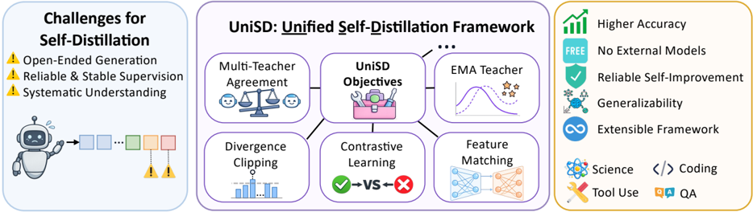

*Figure 1: Overview of UniSD, a unified framework for self-distillation in LLMs. UniSD integrates agreement, stabilization, clipping, contrastive learning, and feature matching to enable systematic analysis. UniSD ∗ further integrates various components to improve LLMs without stronger external teach*

**② 方法 / 架构图**

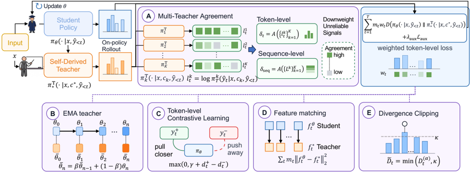

*Figure 2: UniSD is a Unifi ed framework for systematically studying S elfD istillation in autoregressive LLMs. It integrates multiple complementary objectives: Multi-Teacher Agreement, EMA Teacher, Token-Level Contrastive Learning, Feature Matching, and Divergence Clipping. The modular design enable*

### 一眼看懂

> 一句话导读：自蒸馏(模型从自身行为导监督、不靠外部强 teacher)在 LLM 上难做,过去各家只研究一个设计选择、说不清谁起作用;本文把 5 个互补机制收进同一个 on-policy 训练循环,做大规模受控消融,回答"谁起作用、如何交互"。

- 🟦 TL;DR：自蒸馏(同一模型从自身行为导监督,不靠外部强 teacher)在自回归 LLM 上难做——自生成轨迹是自由文本、正确性又跟任务相关,即便 rationale 看着合理也可能给出不稳/不可靠的监督。过去的方法各自只研究一个设计选择,谁起作用、如何交互都不清楚。
- 本文提出 UniSD:把自蒸馏建模为"on-policy 轨迹上的可靠性感知自纠错",沿**监督可靠性 / 表示对齐 / 训练稳定性**三轴整合 5 个互补组件(多 teacher 一致性、EMA teacher、token 级对比、特征匹配、散度裁剪),做大规模受控消融;再把它们全开拼成 UniSD\*,较 base +5.4、较最强基线 GKD +2.8【原文 Abstract、§1-2】。
- 最巧的一步：**把"自蒸馏"拆成一个可控的统一目标**(式1,见下) **+ 三轴组织**,让 5 个本来各自孤立的机制变成同一个 on-policy loop 里可以单独开关的旋钮。抽掉这个统一框架/消融设计,论文就退化成又一个"kitchen-sink 整合方法"——它真正的贡献恰恰是"在同一接口下回答谁起作用、如何交互",而非任何单个组件【原文 §2.2、Algorithm 1】。

### 为什么做

> 一句话导读：靠外部强模型适配 LLM 有成本/许可/偏置风险,于是问"能否只用自己的监督";但自蒸馏有三个老大难,且既有工作只各研究一个配方、缺系统理解。

- 研究背景：LLM 后训练适配常依赖更强的外部模型(合成数据/RL/蒸馏),但这会引入成本、访问/许可限制,以及 bias/隐私内容的传播风险。中心问题:LLM 能否仅靠 self-derived 监督(自己推导的监督)改进?【原文 §1】
- 解决的具体痛点：自回归 LLM 自蒸馏有三难——
  1. **开放式生成**:自生成是自由轨迹而非固定目标,前缀一变,后续条件就变,可靠性难评估(输出可能部分正确/风格不同/局部误导,但终答看着合理);
  2. **不可靠/不稳定的自监督**:on-policy 会暴露自身错误,teacher 信号随 student 演化,瞬时错误/过自信预测/稀有的高散度 token 会被跨步强化;
  3. **缺乏系统理解**:既有方法各自孤立地研究单个策略,不清楚谁驱动改进、如何交互、何时有益【原文 §1 Challenges】。
- 相关工作 & 各自不足（来龙去脉/并行路线/精确差异）：
  - **① 经典 KD / on-policy 变体**：GKD（Agarwal 2024,on-policy 采样减 exposure bias）、MiniLLM（Gu 2024,reverse-KL）、DistiLLM（Ko 2024,稳定 KL 目标）;近期还有用专家 teacher 监督学生轨迹的 VLA-OPD（Zhong 2026）、SCOPE（Zheng 2026,双路自适应加权）、StableOPD（Luo 2026）。**共性短板:依赖外部 teacher**。
  - **② 自蒸馏配方族（各研究单一配方）**：SDFT（Shenfeld 2026,用 demonstration-conditioned base 当 teacher）、OPSD（Zhao 2026,用 ground-truth 解作 privileged 信息蒸 student-generated 轨迹）、SDPO（Hübotter 2026,用特权环境反馈做信用分配）。**短板:各只研究单一配方,谁起作用/如何交互不清楚**。
  - **③ 持续学习/on-policy 学习背景**：SFT 是 off-policy(在固定演示上训,有 train-inference mismatch);on-policy 学习在当前策略诱导的轨迹上监督,以减小 mismatch（§4 Related Work）。
  - **本文精确Δ**：区别于"研究单个配方",本文做的是**统一可扩展框架 + 组件级消融**——不是提"第六个配方",而是提供统一接口 + 交互结论(哪个组件在哪类任务起作用、组合后是否互补)。为什么有用:Table 1 显示没有单一 benchmark/组件主导增益（EMA 强于 ToolAlpaca、Agreement/UniSD\* 强于 ScienceQA/HumanEval）,整合后才能稳定优于任一单组件与基线【原文 §1、§4】。
- 动机链（逐步推进）：
  1. 依赖外部 teacher 有成本/许可/偏置风险;
  2. 于是问能否只用 self-derived 监督;
  3. 但自蒸馏有三难(开放生成、不可靠监督、缺系统理解);
  4. 把它建模为"可靠性感知自纠错";
  5. 沿监督可靠性/表示对齐/训练稳定三轴组织 5 个组件;
  6. 在同一 loop 里做受控消融;
  7. 拼出 UniSD\*【原文 §1 This Work】。

### 怎么做 + 靠不靠谱

> 一句话导读：5 个组件挂在同一个 on-policy 目标(式1)上、各自可单独开关;每个都做了单组件消融,且诚实报告"哪个组件只在某类任务有用"——这正是它的核心价值。

- 方法流水线（Algorithm 1,输入→输出）：输入 \(x\) → student on-policy 采样 \(\hat y\sim\pi_\theta(\cdot\mid x)\) → 用主 teacher \(\pi_*^T(\cdot\mid x,c,\hat y_{<t})\) 监督 + 多个辅助 teacher 视角估可靠性 → 统一目标(式1)逐 token 加权散度 + 辅助损失 → 5 组件分别处理可靠性/对齐/稳定 → 更新 \(\theta\) → EMA teacher 滑动 → UniSD\* 全开【原文 §2.1-2.3、式1、Algorithm 1】。
- 逐组件必要性（每个都有单组件消融,Table 1,且写清输入→输出/默认值）：
  - **(a) Multi-Teacher Agreement（多 teacher 一致性）**：用同一个 teacher 在多个 task-preserving 上下文视角 \(c_k\)（retrieved / random few-shot / induced 指令）下重新打分学生轨迹。
    - token 级打分 \(\ell_t^k=\log\pi_k^T(\hat y_t\mid x,c_k,\hat y_{<t})\)（式2）;
    - token 级不一致 \(\delta_t=A(\{\ell_t^k\}_{k=1}^K)\);序列级则先聚合 \(L^k=\frac{\sum_t m_t\ell_t^k}{\sum_t m_t}\) 再 \(\delta_{\text{seq}}=A(\{L^k\})\),其中 \(A(\cdot)\)=方差/极差;
    - 把 \(\delta\) 转成可靠性权重 \(w_t\)（一致性高→\(w_t\) 高）。
    - **所有视角共享一个 teacher、批处理跨上下文,不复制 teacher**。作用是决定"当前步信任哪些信号"。
    - 证据:Table 1 中 Agree(Tok.)72.2 / Agree(Seq.)72.5;超参敏感性——\(K\) 非单调(seq-level 在 ScienceQA \(\gamma=0.01\) 时峰值 K=3,GPQA K=4),\(\gamma\) 控 stability-adaptivity 权衡(小 \(\gamma\) 弱惩罚高峰值但敏感,大 \(\gamma\) 平滑更鲁棒)【原文 §2.2、§3.3、式2】。
  - **(b) EMA Teacher**：\(\displaystyle \bar\theta_n=\beta\bar\theta_{n-1}+(1-\beta)\theta_n,\quad \beta\in[0,1],\)(式3) 用 EMA teacher \(\pi_{\bar\theta_n}\)（即对 student 参数做指数滑动平均得到的 teacher）替代主 teacher 做时间平滑目标,防止 teacher 跨步漂移传播瞬时错误/过自信。与 agreement 互补:agreement 控"当前步信任哪些信号",EMA 控"teacher 目标如何跨步演化"。证据:Table 1 中 EMA 72.5（**最强单组件**,ToolAlpaca 77.9）;§3.5 retention 显示 EMA 较 SFT 降 retention PPL 33.9%【原文 §2.2、式3】。
  - **(c) Token-Level Contrastive Learning（token 级对比）**：给同一轨迹打分,看它在 student 与正/负条件 teacher 下的 log-prob:\(\ell_t^\theta=\log\pi_\theta(\hat y_t\mid x,\hat y_{<t})\)、\(\ell_t^+=\log\pi^T(\hat y_t\mid x,y^+,\hat y_{<t})\)、\(\ell_t^-=\log\pi^T(\hat y_t\mid x,y^-,\hat y_{<t})\)（式4）;margin 目标 \(\displaystyle \mathcal L_{\text{aux}}=\sum_{t=1}^{T} m_t\,\max\big(0,\ \gamma+d_t^+-d_t^-\big),\quad d_t^\pm=|\ell_t^\theta-\ell_t^\pm|,\)(式5) 其中 \(\gamma\) 为 margin。负例 \(y^-\) 由 LLM 生成貌似合理的错误、腐化推理,或用 WordNet/PPDB/TextAttack 做词法扰动构造。作用是逼 student 轨迹更靠近正监督、远离错误备选。证据:Table 1 中 Contrast 71.9（**六个 benchmark 全升,最均匀正向**）【原文 §2.2、式4-5】。
  - **(d) Feature Matching（特征匹配）**：\(\displaystyle \mathcal L_{\text{feat}}=\sum_{t=1}^{T} m_t\,\big\|f_t^\theta-f_t^*\big\|_2^2,\)(式6) 其中 \(f_t^\theta,f_t^*\) 是 student/teacher 在同一补全 token 位上选定的特征。**实现里匹配的是末层隐状态**(line 369),把对齐拉到输出分布之外。证据:Table 1 中 Match(Joint)72.1 / Match(Repr.)71.5（joint=logit+表示,repr=仅表示）【原文 §2.2、式6】。
  - **(e) Divergence Clipping（散度裁剪）**：先算加权 JSD \(\displaystyle D_t^{(\alpha)}=\alpha\,D\big(\pi_*^T(\cdot\mid x,c_*,\hat y_{<t})\,\|\,M_t\big)+(1-\alpha)\,D\big(\pi_\theta(\cdot\mid x,\hat y_{<t})\,\|\,M_t\big),\) \(\displaystyle M_t=(1-\alpha)\pi_\theta(\cdot\mid x,\hat y_{<t})+\alpha\,\pi_*^T(\cdot\mid x,c_*,\hat y_{<t}),\)(式7-8,\(0<\alpha<1\) 在 forward/reverse KL 间插值,也支持纯端点);再 cap 一下 \(\widetilde D_t=\min(D_t^{(\alpha)},\kappa)\);与 \(w_t\) 组成 \(\displaystyle \mathcal L_{\text{clip}}=\frac{\sum_t m_t w_t \widetilde D_t}{\sum_t m_t w_t}.\)(式9) **它只 cap 每个 token 的散度项,不改 teacher 构造/agreement 估计;\(\kappa\) 未指定时退回未裁剪目标**。证据:Table 1 中 Clip 70.3（**最保守、最省时省显存,是个轻量稳定器**）【原文 §2.2、式7-9】。
  - 必要性判定：5 个组件各有单组件消融 + 与基线对照（Table 1）,且诚实报告了组件的条件性(如 retrieval 非一致最优、Clip 仅轻量)。**消融充分**。
- 关键机制/公式（统一目标 + 直觉）：
  - **统一自蒸馏目标（式1）**：\(\displaystyle \mathcal L=\mathbb E_x\,\mathbb E_{\hat y\sim\pi_\theta(\cdot\mid x)}\!\left[\sum_{t=1}^{T} m_t w_t\, D\big(\pi_\theta(\cdot\mid x,\hat y_{<t})\,\big\|\,\pi_*^T(\cdot\mid x,c,\hat y_{<t})\big)+\lambda_{\text{aux}}\mathcal L_{\text{aux}}(\theta;x,\hat y,c)\right],\) 其中 \(D\)=token 级散度（KL/JSD）,\(w_t\)=可靠性权重,\(m_t\)=token mask,\(\mathcal L_{\text{aux}}\)=辅助目标。该目标把三件事拆开各管一摊:用什么信号(\(w_t\))、匹配什么表示(\(\mathcal L_{\text{feat}}\))、每步更新多强(\(D\) 与 clip)。三轴对应:
    - 监督可靠性 = agreement 选信号(\(w_t\)) + contrastive 区分真伪;
    - 表示对齐 = feature matching 把对齐拉到输出分布之外;
    - 训练稳定 = EMA 平滑 + clip 防稀有高散度 token 主导【原文 §2.2-2.3、式1】。
- 实验与证据：
  - 数据集/设置：六个 benchmark（四类任务）——ScienceQA、GPQA（科学,GPQA 仅测）、CoS-E（常识）、MBPP、HumanEval（代码,HumanEval 仅测）、ToolAlpaca（工具）;其中 SCIENCEQA→GPQA、MBPP→HumanEval 作 OOD。六个模型/三族:Qwen2.5-Instruct 四规模 {0.5,1.5,3,7}B（7B 为主 base）+ Llama-3.1-8B-Instruct + gemma-3-4b-it【原文 §3.1】。
  - 关键数字：
    - 主表（Table 1,Qwen2.5-7B,retrieved 上下文）:Raw 67.9;baseline SFT 68.3 / SDFT 70.1 / **GKD 70.5（最强基线）** / SSD 67.3 / OPSD 68.2;**UniSD\* 73.3（较 Raw +5.4、较 GKD +2.8）**。
    - 跨族泛化:UniSD\* 在 Qwen2.5/Llama-3.1/Gemma-3 上较 base +5.4/+3.1/+2.2,18 个 model-dataset 对中 15 升 2 平 1 退。
    - 分布保持:gold-completion PPL（Table 2）UniSD 变体把 Qwen2.5-7B 从 Raw 20.74 降到 5.7-6.1;retention（§3.5）显示 SFT 致 base-distribution 漂移（Qwen2.5-7B retention PPL 1.14→1.68）,而 UniSD\* 把 mean token-level JSD-to-base 从 SFT 的 0.054 降到 0.041（70.3% 样本 JSD 更低）【原文 Table 1-2、§3.4-3.5】。
  - baseline 公平吗：基线（SFT/SDFT/GKD/SSD/OPSD）在同 base/同 benchmark 下比较,公平;GKD 作最强基线对照合理。
  - 有无"看着强但没回答核心问题"：核心问题(谁起作用/如何交互)答得清楚且消融充分;但 +2.8/+5.4 的绝对增益不大,benchmark 多为**短生成**(代码/QA/工具),**未覆盖长链数学推理**——与本项目 long-CoT/OPD 场景相关性偏弱【原文 §3,推断】。
- 假设与失效边界：
  - 显式假设【原文】：辅助 teacher 视角是"task-preserving 扰动"（retrieved/random few-shot/induced 指令）——视角须保住任务语义;agreement 计算昂贵(每个补全要多上下文重打分,§3.3/B.1 报 Qwen2.5-7B seq-level 约 100 min vs SFT 18.6 min)。
  - 隐式假设【推断】：5 个组件单看都非首创（EMA teacher、对比学习、feature matching、散度裁剪、多视角一致性均为已有思路）——价值在统一接口与交互结论,本质是"kitchen-sink 整合 + 消融贡献"。
  - 何时失效【原文/推断】：retrieval 上下文在语义相似有用时最强、coding/开放生成上未必（§3.3）;性能随 teacher 数 \(K\) 非单调;\(\gamma\) 大→更鲁棒但峰值低（stability-adaptivity 权衡）;组件最优配置随任务/粒度变化需调参。
- 祛魅总结【推断】：真贡献是把分散的自蒸馏机制统一进一个可消融框架,并诚实给出"谁起作用、如何交互、何时有益"的细粒度结论(EMA 最强单组件、Contrast 最均匀、Clip 最轻量、retrieval 非一致最优),这对工程选型有参考价值。被适度高估的是"新方法"成分——无单一组件首创、增益绝对值不大(+2.8 over GKD);且只在短生成 benchmark 验证,长链推理的外推性未知。资源估算（Table 3,式10-11 用 A100 TDP 300W/u=0.7/PUE=1.2/475gCO2e/kWh 换算）是基于固定假设的相对估计、非实测。

### 结构化抽取

- 🎯 机制速览6轴：
  - **学什么信号**：self-derived teacher（自身在富 context \(c\) 下）的 token 级分布 + 末层隐状态特征;经 agreement 权重 \(w_t\) 筛选可靠性、contrastive 区分正/负条件信号【原文 §2.2】。
  - **改什么**：student 参数 \(\pi_\theta\)（on-policy 更新）;EMA teacher 参数 \(\bar\theta\) 随之滑动平均【原文 式1、式3】。
  - **何时改**：on-policy 每步——采样→多视角打分→加权散度 + 辅助损失→更新→EMA 滑动【原文 Algorithm 1】。
  - **免梯度?**：否（统一目标是基于梯度的散度 + margin/feature 损失）。
  - **记忆-技能生命周期**：无外部记忆/技能库;知识固化进参数;EMA teacher 是参数空间的"短期记忆/时间平滑"(非外部存储)【原文 §2.2,推断】。
  - **防遗忘机制**：分布保持（§3.5）——自蒸馏避免 SFT 式的 base-distribution 漂移,UniSD\* 把 token-level JSD-to-base 降低（0.054→0.041）、retention PPL 降;EMA 较 SFT 降 retention PPL 33.9%。属"温和对齐/分布保持"型防遗忘【原文 §3.5】。
- ⑦ 开源代码+框架/harness：仓库 https://github.com/Ahren09/UniSD （v1 已 clone 约 883K;仓库实测含 `src/`、`scripts/`、`requirements.txt`、`README.md`、`LICENSE`）。`src/` 含 `trainers/unisd_trainer.py`、`train/train_unisd.py`、`teacher/{auxiliary_context,instruction_induction,negative_demonstrations}.py`(对应 agreement 上下文 + 对比负例)、`eval/{eval_code,eval_gsm8k,eval_mcqa,eval_retention,eval_tooluse}.py`,与 5 组件 + 消融脚本对应清晰。**框架:TRL 1.4.0 + vLLM 0.20.2 + transformers 5.8.0 + torch 2.11.0+cu128 + accelerate/peft/deepspeed/flash_attn（据 requirements.txt,CUDA 12.8/Python 3.12）**【v1 已核 requirements.txt;PDF 仅给链接（line 9-10）】。
- 💰 资源/成本与可扩展性：agreement 是主要开销——每个补全要多上下文重打分（§3.3/B.1:Qwen2.5-7B seq-level agreement 约 100 min vs SFT 18.6 min;主成本不是蒸馏损失本身,而是 teacher-conditioned scoring 的次数）;Clip/Match 最省时省显存;Table 3 给 token-normalized 资源/碳排放估算（单 teacher 稳定器 0.08-0.11 kWh/1M tok,agreement 0.16-0.18,UniSD\* 0.26）,但这是固定假设下的相对估计、非实测。作者自提应做"按可靠性预算分配"的自适应自蒸馏（把昂贵的 multi-view agreement 留给噪声/高不确定样本,便宜的稳定器广用,未实现）【原文 §3.3、附录 B.1-B.2、Table 3】。
- 🎯 对"探索-巩固"对标：**可借组件库（弱支撑）**——一句判定:UniSD 不直接做"探索/回轨",但它沉淀了一套"on-policy 自蒸馏的稳定化工具箱",其中多 teacher 一致性最贴合本项目的缺口。依据:本项目 idea 需要 teacher 当**稀疏脚手架**且 student **on-policy 自选**——UniSD 的多 teacher agreement(同一 teacher 多视角重打分估可靠性 \(w_t\))可直接用来判定"哪些步的脚手架信号可信、值得介入",正对应"稀疏介入"的可靠性门控;EMA teacher + divergence clipping 则是防止"巩固阶段把瞬时错误/过自信跨步放大"的现成稳定器(与本项目 reusable-techniques 记忆里 forward-hard/backward-soft 的"有界梯度"诉求同向,clip \(\widetilde D_t=\min(D_t^{(\alpha)},\kappa)\) 即一种有界化)。
  - **可借组件**：
    1. agreement 的可靠性权重 \(w_t\) → 用作 path-recovery 的"何时接管"门控;
    2. token-level 对比(正=能走通的恢复分支、负=走偏的腐化推理)→ 直接服务"自选恢复分支并固化";
    3. 末层 feature matching 做表示级对齐;
    4. clip 式 \(\alpha\) 插值 forward/reverse KL 的端点选择,可与本项目对 reverse-KL 的倾向对接。
  - **缺口**：
    1. 全在短生成 benchmark,无长 CoT;
    2. 无 MTP 前瞻、无 path-selection 显式机制;
    3. 是"kitchen-sink 整合"而非针对 explore-consolidate 设计,组件需重新裁剪。
- 🔭 开放问题/未来方向：
  - 【原文】自适应自蒸馏——按可靠性"预算分配"agreement 计算（当前一致性计算昂贵、未做自适应）;扩展到更多组件(框架可扩展)。
  - 【推断】把框架搬到长链数学/推理场景验证(当前仅短生成);把 agreement 可靠性门控 + 对比正负例机制迁移到 long-CoT 的 path-recovery 单点接管;用 clip 的 \(\alpha\) 插值显式选 forward/reverse-KL 端点,探究对 epistemic 表达的影响(呼应 why_sd_degrade 的发现:reverse-KL 是否也压制不确定表达)。

---

## VLA-OPD: Bridging Offline SFT and Online RL for Vision-Language-Action Models via On-Policy Distillation

> **`vla_opd`** ｜ HKUST(GZ)（Zhide Zhong, Haodong Yan, Junfeng Li, Junjie He, Tianran Zhang, Haoang Li） ｜ 2026-03-27·arXiv preprint·v1（cs.RO） ｜ 主题线 L1（OPD/自蒸馏，机器人 VLA 域）·相关性 中 ｜ [📄 原始论文](https://arxiv.org/abs/2603.26666)

### 关键图示

**① Motivation / 对比图**

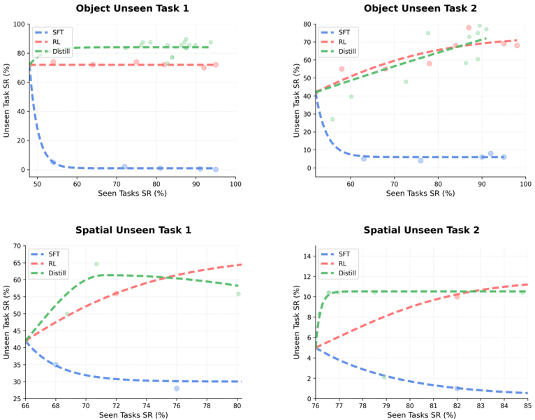

*Figure 3: Seen-Unseen Trade-off for Forgetting Analysis. Each point corresponds to a checkpoint during fine-tuning. The x-axis is the success rate on seen (target) tasks, and the y-axis is the success rate on a held-out unseen task. Offline SFT exhibits a strong collapse on unseen tasks as seen-task*

**② 方法 / 架构图**

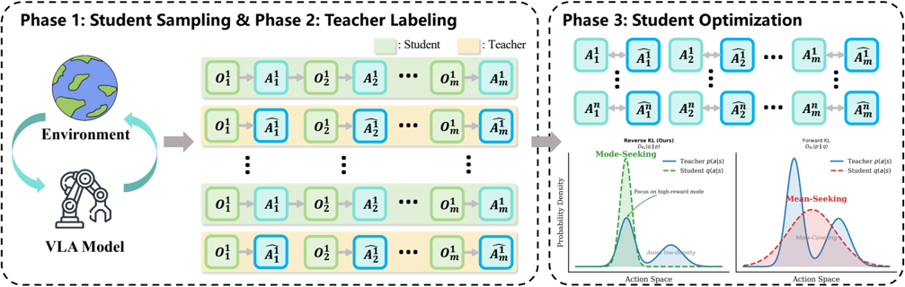

*Figure 1: Overview of VLA-OPD. Our framework unifies offline SFT and online RL through three phases. Phase 1 (Student Sampling): The student VLA policy interacts with the environment to collect on-policy trajectory rollouts ( O → A → O ). Phase 2 (Teacher Labeling): For each state visited by the stu*

### 一眼看懂

> 一句话导读：机器人模型微调里,离线模仿(SFT)收敛快但一偏就崩、在线 RL 能纠错却只有"成/败"二值奖励太慢;本文让学生在自己走出的轨迹上、用一个冻结的强老师逐 token 打分做 reverse-KL 蒸馏,把稀疏奖励换成稠密监督,于是两边的好处都拿到。

- 🟦 TL;DR：机器人 VLA 后训练有个老大难——
  - 离线 SFT（行为克隆）收敛快,但只在专家走过的状态上训,一旦执行偏离就崩,还会灾难性遗忘;
  - 在线 RL（GRPO）能在自己走出的状态上学纠错,却只有终态二值奖励,样本效率极低。
  - 本文把后训练改写成一种 on-policy RL:student 在自己采样的轨迹上,用一个冻结的强 teacher 逐 token 打 logits 做 reverse-KL 蒸馏,把稀疏延迟奖励换成稠密即时监督,于是同时拿到 SFT 的快收敛和 RL 的少演示/抗遗忘【原文 §1、Table 1】。
- 最巧的一步：**用 reverse-KL（而非 Forward-KL 或 Hard-CE）当对齐目标**。先解释这三个名词:KL 散度衡量两个分布的差异,方向不同行为也不同;Hard-CE 是只对 teacher 的 argmax(最可能动作)算交叉熵、丢掉软概率。抽掉 reverse-KL 这步就垮——因为 student 在 OOD 失败态(没见过的状态)采样时,teacher 在那些态往往是平坦高熵分布(自己也拿不准):
  - Forward-KL \(\mathrm{KL}(\pi_{\text{tea}}\|\pi_\theta)\) 是 mode-covering(逼 student 覆盖 teacher 的每个模式),会逼 student 复刻 teacher 的"犹豫"→熵爆炸;
  - Hard-CE 只学 argmax、丢掉 soft 概率(即所谓 dark knowledge),在多模决策边界上刚性追 argmax→过早熵坍缩、丧失探索多样性;
  - reverse-KL \(\mathrm{KL}(\pi_\theta\|\pi_{\text{tea}})\) 的 zero-forcing 性质让 student 只要落在 teacher 可接受的概率质量内就不被罚,于是"果断但仍能探索",熵保持健康【原文 §3.4、Fig.4(b) 三条熵曲线一一对应】。

### 为什么做

> 一句话导读：预训练 VLA 直接部署不可靠必须微调;但 SFT 太脆、稀疏 RL 太慢、简单把 SFT 改 on-policy 又用错了对齐目标——本文要同时治这三个病。

- 研究背景：预训练 VLA（视觉-语言-动作模型,把感知+规划+控制统一进一个 transformer 来输出机器人动作 token）泛化强,但直接部署到具体下游任务时执行不可靠,必须后训练【原文 §1】。当前两大范式:离线 SFT（行为克隆,dense 监督、收敛快）和在线 RL（GRPO,免 critic、用 group-relative 优势）。
- 解决的具体痛点：
  1. SFT 是 off-policy——在专家状态上训、在 student 诱导状态上评测,复合误差累积,无法从自致偏离恢复;且对 static/disjoint 数据集激进更新会导致灾难性遗忘【原文 §1、§2.2】。
  2. 稀疏奖励 RL——机器人任务通常只有终态 \(R(\tau)\in\{0,1\}\),信用分配难、方差高、样本效率极低【原文 §2.3】。
  3. 简单把 SFT 改成 on-policy（如 DAgger）却用了次优的对齐目标:Forward-KL 导致熵爆炸、Hard-CE 导致熵坍缩【原文 §1、§5.1】。
- 相关工作 & 各自不足（来龙去脉/并行路线/精确差异）：
  - **① 离线 SFT/BC**（O'Neill 2024、π0 Black 2024）——dense 监督、收敛快,但有 covariate shift、复合误差;OOD 态下策略未定义→灾难性失败;激进拟合 disjoint 分布→灾难性遗忘。
  - **② 在线稀疏奖励 RL**（SimpleVLA-RL、VLA-RL、RLinf-VLA 等,多用 GRPO）——能从自致偏离纠错,但十亿参数 VLA 上稀疏 outcome reward 的信用分配难、方差高、样本效率极低。
  - **③ 交互式模仿学习**（DAgger Ross 2011 / HG-DAgger Kelly 2019）——在 student 诱导的 OOD 态收专家标注(on-policy 状态分布对了),但用 Hard-CE/Forward-KL 对齐次优,引出熵爆炸/坍缩。
  - **④ LLM 蒸馏侧**（MiniLLM Gu 2023、GKD Agarwal/Tan 2023）——首提 reverse-KL / on-policy 蒸馏;本文**把它迁移到动作预测域**,并显式论证 OOD 态的熵动力学。
  - **与最近邻 SimpleVLA-RL（它正是本文的 teacher）的精确Δ**：
    - (a) 把稀疏 outcome reward 换成稠密 token-level reverse-KL 内在奖励;
    - (b) **不做 outcome reward 归一化**,直接用 raw reverse-KL reward 当优势（沿用 SimpleVLA-RL 的 group 采样框架 batch=64/G=8,但把奖励信号换掉）【原文 §3.4 末句、式7】。
- 动机链（逐步推进）：
  1. 预训练 VLA 需后训练;
  2. SFT 快但脆弱+遗忘、RL 鲁棒但太慢;
  3. 既要 dense 监督又要 on-policy 的状态分布;
  4. 于是在 student 自己的轨迹上用冻结 teacher 打稠密 token 标签(把稀疏奖励变即时监督);
  5. 但 OOD 态 teacher 高熵,朴素地全分布蒸馏有害;
  6. 改用 reverse-KL 的 bounded mode-seeking 来过滤 teacher 尾部的不确定性;
  7. 这种温和对齐把 student 锚在自己的流形上,缓解遗忘【原文 §1、§3】。

### 怎么做 + 靠不靠谱

> 一句话导读：三阶段闭环——学生先探(进 OOD 失败态)、老师再标(在那些态注入恢复动作)、再 mode-seeking 更新;最扎实的证据是 Fig.4 的三条熵曲线,直接对应 Forward-KL 爆炸/Hard-CE 坍缩/reverse-KL 健康。

- 方法流水线（三阶段闭环,Algorithm 1,逐 phase 看输入→输出）：student \(\pi_\theta\)（用极少演示 SFT 初始化）→
  - **Phase 1 on-policy 采样（Exploration）**：在环境里跑 \(G\) 条轨迹 \(\{\tau_1,\dots,\tau_G\}\sim\pi_\theta(\cdot\mid o)\),收集 \(\mathcal D_k=\{\tau\mid\tau=(s_0,a_0,\dots,s_T)\}\),其中 \(a_t\sim\pi_{\theta_k}(\cdot\mid s_t)\)、\(s_{t+1}\sim P(\cdot\mid s_t,a_t)\)（式3）。brittle student 会频繁进入 OOD 失败态 \(s_{\text{err}}\),**显式暴露能力边界**——把"unknown OOD 区域"转成"known 训练数据"。
  - **Phase 2 teacher 标注（Correction）**：对 student 访问过的每个状态 \(s_t\),查询冻结 teacher 的 action 分布 \(q_t(a)=\pi_{\text{tea}}(a\mid s_t)\)（式4）。teacher **只打标、不在环境里执行**,注入"optimal recovery prior"(最优恢复先验)。
  - **Phase 3 mode-seeking 更新（Update）**：算 token-level 内在奖励 \(r_t^{\text{OPD}}(s_t,a_t)=-\big(\log\pi_\theta(a_t\mid s_t)-\log\pi_{\text{tea}}(a_t\mid s_t)\big)=-\log\frac{\pi_\theta(a_t\mid s_t)}{\pi_{\text{tea}}(a_t\mid s_t)}\)（式6）,对 student log-prob 项加 stop_gradient,等价于在 student-visited 状态上最小化 reverse-KL;再用 group 平均 policy gradient 降方差（式7）→ 更新 \(\pi_\theta\)【原文 §3.1-3.4、Algorithm 1、式3-7】。
- 逐组件必要性（每组件 + 消融证据）：
  - **reverse-KL 对齐目标**：核心。Fig.4(a) 的消融（RoboTwin2.0 Beat Block Hammer）显示:Forward-KL 早期有 >50% 的性能谷、Hard-CE 平台最低、reverse-KL 稳步上升;Fig.4(b) 对应的熵曲线为 Forward-KL 爆炸 / Hard-CE 坍缩 / reverse-KL 健康。**有消融,证据最直接**【原文 §4.4-1】。
  - **on-policy 采样（vs 离线 SFT）**：这是抗遗忘机制的来源——梯度锚在 student 当前的行为流形 \(d^{\pi_{\theta_k}}\)、只在 student 自然访问的轨迹上蒸馏,避免 SFT 式拟合 disjoint 分布带来的激进参数漂移。Fig.3 的 seen-unseen 散点显示:离线 SFT 在 unseen 上坍缩(Object 近零),而 on-policy 法(RL 与本法)基本避免。**有对照**【原文 §3.2、§4.3】。
  - **dense teacher 监督（vs 稀疏 RL）**：这是效率的来源——把延迟稀疏奖励变成即时监督。Fig.2 给出收敛步数对比(10/50 步 vs 150 步)。**有对照**【原文 §3.3、§4.2】。
  - **group size \(G\)**：Fig.5（LIBERO-Object,batch=32）显示 \(G=8\) 最高(约 89%),\(G\in\{2,4\}\) 仍 >80% 不坍缩——小 \(G\) 省 rollout/teacher 推理。**有消融**【原文 §4.4-2】。
  - **stop_gradient 于 student log-prob / 不做 outcome 归一化**：未单独消融——"raw reverse-KL 作优势仍稳定"只有主实验的经验曲线支撑,没有单独 ablation【原文 §3.4,推断:无对照】。
- 关键机制/公式（真实符号 + 直觉,从 PDF 抄准）：
  - **离线 SFT 基线（off-policy 痛点来源）**：\(\displaystyle \mathcal L_{\text{SFT}}(\theta) = -\mathbb E_{(s,a)\sim\mathcal D_{\text{demo}}}\big[\log\pi_\theta(a\mid s)\big].\)（式1）在专家态 \(\mathcal D_{\text{demo}}\) 上训、在 student 诱导态上评→distribution shift。
  - **GRPO 稀疏奖励基线**：\(\displaystyle J_{\text{RL}}(\theta)=\mathbb E_{s\sim\mathcal D,\,\tau\sim\pi_{\theta_{\text{old}}}}\!\Big[\tfrac1G\sum_{i=1}^G\min\!\Big(\tfrac{\pi_\theta(\tau_i)}{\pi_{\theta_{\text{old}}}(\tau_i)}\hat A_i,\ \mathrm{clip}\big(\tfrac{\pi_\theta(\tau_i)}{\pi_{\theta_{\text{old}}}(\tau_i)},1-\epsilon,1+\epsilon\big)\hat A_i\Big)\Big],\)（式2）其中 \(\hat A_i\) 由稀疏 outcome reward 经 group-relative 归一化得——信用分配难。
  - **reverse-KL 作 dense reward（核心,式5-6）**：目标改为最大化负 reverse-KL \(\displaystyle \max_\theta J(\theta)=\mathbb E_{s\sim\pi_\theta}\big[-D_{\mathrm{KL}}\big(\pi_\theta(\cdot\mid s)\,\big\|\,\pi_{\text{tea}}(\cdot\mid s)\big)\big],\) token 级即得内在奖励 \(r_t^{\text{OPD}}=-\log\frac{\pi_\theta(a_t\mid s_t)}{\pi_{\text{tea}}(a_t\mid s_t)}\)（式6）:student 动作匹配 teacher 时奖励→0,偏离则给大负惩罚。算梯度时对 \(\log\pi_\theta(a_t\mid s_t)\) 施 stop_gradient(把奖励当常数、梯度只走 score-function 项)。
  - **group-based 梯度估计（式7,降方差）**：\(\displaystyle \nabla J \approx \frac{1}{B\times G}\sum_{j}\sum_{i=1}^{G}\sum_{t}\nabla_\theta\log\pi_\theta(a_{t,i}\mid s_{t,i})\cdot r_t, \qquad \theta\leftarrow\theta+\alpha\nabla J.\)
  - **三种散度的优化行为（直觉）**：
    - Forward-KL \(D_{\mathrm{KL}}(\pi_{\text{tea}}\|\pi_\theta)\):梯度在 teacher 样本上估(\(\mathbb E_{a\sim\pi_{\text{tea}}}\))→mode-covering→OOD 态复刻 teacher 高熵犹豫→熵爆炸;
    - Hard-CE:弃 soft 概率、只追 argmax→多模边界上刚性振荡→熵坍缩;
    - reverse-KL \(D_{\mathrm{KL}}(\pi_\theta\|\pi_{\text{tea}})\):zero-forcing(teacher 概率≈0 处 student 必须≈0,否则惩罚趋于无穷),但 teacher 有质量的地方 student 可以只占主模、忽略长尾→bounded mode-seeking【原文 §3.4】。
- 实验与证据：
  - 数据集/设置：
    - **LIBERO**（单臂,四套件 Spatial/Object/Goal/Long,每任务仅 1-traj SFT 初始化,极端数据稀缺）;
    - **RoboTwin2.0**（双臂协作,四个代表任务覆盖 short→long horizon,每任务 1000-traj SFT 初始化）。
    - teacher=SimpleVLA-RL（性能 oracle）,student=OpenVLA-OFT;主实验 batch=64、\(G=8\)(沿用 SimpleVLA-RL),消融固定 batch=32。**全为仿真,无真机**【原文 §4.1】。
  - 关键数字：
    - LIBERO（Table 2,成功率%）:student init 平均 48.9 → Distill 87.4（媲美/超过 50-traj 全量基线 Octo 75.1、OpenVLA 76.5）→ Distill+GRPO 93.4（逼近 teacher 93.9）。
    - RoboTwin2.0（Table 3）:student init 45.2 → Distill 71.1（近 teacher 74.0）,超过 π0(50.5)、RDT(32.0),**未报 Distill+GRPO**。
    - 效率（Fig.2）:LIBERO-Object 蒸馏 10 步内 >90%,LIBERO-Long 50 步即达到基线 150 步的水平（约 3× 加速）【原文 §4.2、Fig.2】。
  - baseline 公平吗：与 GRPO 对照时设同 batch/\(G\),算公平;但与稀疏 RL 比"效率"时**未计入 teacher 自身的训练成本**——teacher 本身就是由 RL(SimpleVLA-RL) 训出来的,所谓"省掉 RL 探索成本"实质上是把成本前移到了 teacher 训练【推断:依据 §4.1 teacher 来源 + §5.2 "decouple RL exploration from policy optimization",作者未控制此项成本】。
  - 有无"看着强但没回答核心问题"：消融多为单基准/单任务曲线（Fig.4 仅 1 个 RoboTwin 任务）,**无多 seed 方差、无显著性检验**;"近 teacher"也意味着受 teacher 性能上界约束（作者承认 §6）。
- 假设与失效边界：
  - 显式假设【原文】：高性能 teacher 的先验可得（开源 checkpoint / API / 易训的单任务策略,§1）;teacher 全程冻结（§3.1）。
  - 隐式假设【推断】：OOD 态 teacher 呈"平坦高熵"是 reverse-KL 论证的前提——若 teacher 在 OOD 态反而过自信但错误,reverse-KL 会把 student 锁进错误主模(zero-forcing 的反面),论文未讨论此情形。
  - 何时失效【推断】：teacher 本身弱/有系统偏差时方法上界受限(作者承认);真机感知噪声/物理失配下未验证(仅仿真);"不做归一化仍稳定"无理论保证,换任务/换 backbone 未必成立。
- 祛魅总结【推断】：真贡献是把 LLM 侧成熟的"reverse-KL on-policy 蒸馏"干净迁移到 VLA 动作域,并用熵动力学把 Forward-KL/Hard-CE/reverse-KL 三者的优化行为讲清楚 + Fig.4 熵曲线作证(这点扎实)。被适度包装的是"bridging SFT and RL"的新颖性——本质是 SimpleVLA-RL 框架换了奖励信号(稀疏 outcome → 稠密 reverse-KL);且"样本效率碾压 RL"在不计 teacher 训练成本时才成立,公平性存疑。代码 Coming Soon、无真机、无多 seed,复现性与统计稳健性偏弱。

### 结构化抽取

- 🎯 机制速览6轴：
  - **学什么信号**：teacher 在 student-visited(含 OOD)状态上的 action logits 分布;转成 token-level 负 reverse-KL 内在奖励 \(r_t^{\text{OPD}}=-\log\frac{\pi_\theta}{\pi_{\text{tea}}}\)【原文 §3.3-3.4、式6】。
  - **改什么**：student VLA 策略参数 \(\pi_\theta\)（on-policy policy gradient 更新）【原文 §3.1、式7】。
  - **何时改**：闭环每迭代——采样→teacher 标注→更新,直至收敛【原文 Algorithm 1】。
  - **免梯度?**：否。是基于梯度的 RL（group-based policy gradient）,但对 student log-prob 项用 stop_gradient(奖励侧不回传)【原文 §3.4】。
  - **记忆-技能生命周期**：无显式记忆库/技能库;"恢复先验(recovery behavior)"直接固化进 student 参数;on-policy 锚定缓解遗忘但无外部存储【原文 §3.2-3.3,推断:纯参数化巩固】。
  - **防遗忘机制**：on-policy 的"温和对齐"——梯度锚在 student 当前行为流形上、只在 student 自然访问的轨迹上蒸馏,避免 SFT 式拟合 disjoint 分布带来的激进参数漂移;Fig.3 的 seen-unseen 散点为证【原文 §3.2、§4.3】。
- ⑦ 开源代码+框架/harness：项目页 https://irpn-lab.github.io/VLA-OPD/ 标注 **"Code (Coming Soon)"**,截至核查无可用仓库（`resource/repos/` 下无 vla_opd）,论文未给 GitHub 链接——**未开源(待放出)。未完整克隆,原因:代码尚未发布;附项目页链接供后续手动获取**。论文层面:student=OpenVLA-OFT,teacher=SimpleVLA-RL,分组采样沿用 SimpleVLA-RL（batch=64, \(G\)=8）,优化为 group-based policy gradient(类 GRPO 但不做 outcome reward 归一化)【原文 §4.1-4.2,框架未明说具体训练库,待核】。
- 💰 资源/成本与可扩展性：原文未给 GPU 型号/卡时/wall-clock 数字。可观测的相对成本信号:Fig.2 的收敛步数(蒸馏 10-50 步 vs 稀疏 RL 150 步);Fig.5 显示小 \(G\)(=2) 即可大幅降低 rollout+teacher 推理开销。**未计入 teacher 训练成本**【原文 §4.2、§4.4-2】。
- 🎯 对"探索-巩固"对标：**支撑（域外平行证据）**——一句判定:VLA-OPD 是"teacher 当稀疏脚手架教 student 在自走轨迹上恢复"的机器人版直接实例,与本项目 idea 高度同构,但落在动作 token 而非语言推理。依据:
  - 探索 = Phase 1 student 主动进入 OOD 失败态（§3.2 "active correction"）;
  - 巩固/回轨 = Phase 2 teacher 在失败态注入"recovery prior" + Phase 3 固化进参数（§3.3 "optimal recovery behaviors"）;
  - on-policy 自选轨迹 + reverse-KL 让 student "偏向自己能走通的主模"(zero-forcing 只对齐主模)——这恰对应 idea 里"偏向自己能走通的开头/自选恢复分支"。
  - **可借组件**：token-level 负 reverse-KL 作内在奖励 \(r_t^{\text{OPD}}\) + stop_gradient 这一"forward 用 student 采样、backward 走 score-function"的写法,可直接挪到 LLM long-CoT 的 path-recovery 单点接管（与本项目 reusable-techniques 记忆里 forward-hard/backward-soft 的"有界梯度"同构）。
  - **缺口**：
    1. 是单 teacher 全程冻结,无 MTP 式前瞻、无多 teacher 一致性;
    2. 无显式记忆/技能库;
    3. 仅机器人短-中 horizon,未涉长链推理的稀疏关键步切分（与本项目 survey-grpo-step-segmentation 记忆里的"切高熵/低置信关键步"无对应机制）。
- 🔭 开放问题/未来方向：
  - 【原文】降低对特定 teacher 模型的依赖（作者列为主攻 future work,§6）;把"多 teacher 蒸进统一/升级的 student backbone"（§1 末提及）。
  - 【推断】把"raw reverse-KL 作优势、不归一化"补上理论收敛/方差分析;扩到真机验证泛化;与中间步奖励塑形结合（当前 dense 奖励纯来自 teacher logits,无任务结构信号）。
  - 【推断】OOD 态 teacher 若过自信而错误时的失效处理（zero-forcing 锁错模问题）——可引入 MTP 前瞻或多 teacher 一致性来探测 teacher 可靠性（呼应 unisd 的 agreement 门控）,正是本项目 idea 的延伸点;并自查 reverse-KL 是否如 why_sd_degrade 警示般压制 epistemic 表达。

---

## Why Does Self-Distillation (Sometimes) Degrade the Reasoning Capability of LLMs?

> **`why_sd_degrade`** ｜ Microsoft Research + KAIST + Seoul National University（Jeonghye Kim 实习于 MSR；Xufang Luo 通讯） ｜ 2026-05-20·arXiv preprint, under review·v3（cs.CL） ｜ 主题线 L1（OPD/自蒸馏，失败模式诊断）+ L6（CoT/不确定性表达）·相关性 高 ｜ [📄 原始论文](https://arxiv.org/abs/2603.24472)

### 关键图示

**① Motivation / 对比图**

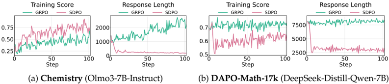

*Figure 1: (a) Training score and response length changes for GRPO and Self-Distillation (SDPO) (H¨ ubotter et al., 2026) in Chemistry, using results from SDPO Wandb logs (Biewald, 2020) (link) . (b) Training score and response length changes on DAPO-Math-17k with GRPO and SDPO.*

**② 方法 / 架构图**

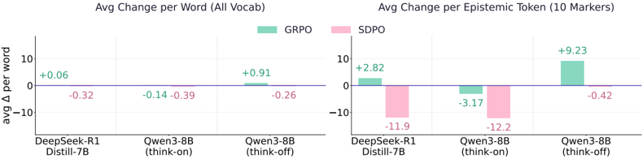

*Figure 12: Comparison of per-word frequency shifts ( ∆ m ( w ) ) for epistemic tokens ( T ) versus non-epistemic tokens ( V \ T ) in GRPO- and SDPO-trained models relative to the base model. Epistemic tokens exhibit disproportionately large frequency changes compared to the general vocabulary, indic*

### 一眼看懂

> 一句话导读：同一个模型"看着答案当老师、不看答案当学生"地自蒸馏，在化学/工具/代码上能"答得又短又好"，可一搬到数学推理就翻车——本文不提新算法，只用受控实验把根因锁定在"wait/hmm 这类犹豫词被训没了"。

- 🟦 TL;DR：自蒸馏指同一模型在富 context（这里 context=正确解）下当 teacher，给无 context 的 student 打稠密信号。它在很多域（化学/工具/代码）能让 response 变短、性能变好。但搬到**数学推理**上会反常——response 照样变短、性能却大跌（AIME24 最高掉约 40%）。
- 本文不提新算法，而是用受控实证把根因锁定在一个现象上：**epistemic verbalization（认知性不确定表达，即 wait/hmm/maybe 这类标记"我还在犹豫"的词）被压制了**。机理是：teacher 拿到富信息（正确解）后，生成的轨迹简洁又自信、几乎不带不确定词；student 一模仿,就把这些"标记备选假设、支持渐进纠错"的信号丢光了。
- 危害是否真的显现,取决于**任务覆盖度**(任务种类宽不宽)：覆盖窄时,压制掉犹豫词反而更高效;覆盖越宽、越偏离训练分布(OOD)就越有害【原文 Abstract、§1、Takeaway 1-4】。
- 最巧的一步：**用条件互信息 \(I(y^*; c \mid x) = H(y^* \mid x) - H(y^* \mid x, c)\)（式2）把"context 信息丰富度"量化成一个可比的数**。它先构造 4 种 context \(c\)——unguided（\(\varnothing\)，啥都不给）/ 全解（\(s\)）/ 去掉思考过程的全解（\(s_{\setminus\text{think}}\)）/ 用全解再生成一遍（\(y_r\)），并论证四者的互信息（MI）排序为 \(I(y^*;\varnothing\mid x)=0 < I(y^*; s_{\setminus\text{think}}\mid x) \le I(y^*; y_r\mid x) \le I(y^*; s\mid x)\)（式3）。然后观测到 response 长度、得分、10 个 epistemic token 的计数都随 \(I\) 单调变化（Table 1）。抽掉这个 MI 框架,"信息越富→越自信→犹豫词越少"就只是定性观察,没法把"风格漂移"和"性能退化"挂到同一个可控变量上【原文 §3、式2-3】。

### 为什么做

> 一句话导读：自蒸馏在别的域屡试不爽,可没人问"它什么时候、为什么会退化";本文从"数学=不断更新信念的贝叶斯推理"这个视角切入,补上这一问。

- 研究背景：自蒸馏（Snell 2022）作为 LLM 后训练范式,配 RLVR（带可验证奖励的 RL）在 agentic/科学推理域高效提分,且常伴随"response 变短、性能变好"（SDPO Hübotter 2026、OPSD Zhao 2026 等）。本文把数学推理视作 **self-Bayesian 推理**——即每一步都在 \(x\) 与已生成前缀 \(y_{<t}\) 上更新对中间假设的信念（§3,引 Kim 2026）。
- 解决的具体痛点：把同一套自蒸馏（SDPO）用到数学时出现反常——response 仍变短,但性能显著跌（AIME24 掉约 40%）。既有自蒸馏工作只展示有效性,**未研究"何时/为何会退化"**,尤其是在"模型需完全自主解题、无外部环境交互"的数学场景【原文 §1、附录 A】。
- 相关工作 & 各自不足（来龙去脉/并行路线/精确差异）：
  - **① on-policy 自蒸馏配方族（本文的诊断对象）**：
    - SDPO（Hübotter 2026,RL via Self-Distillation）：条件于自身正确轨迹/特权环境反馈做 dense 信用分配；
    - OPSD（Zhao 2026）：用 ground-truth 解作 privileged 信息,蒸 student 自己生成的轨迹；
    - Ye 2026（EAFT 同源）：熵感知。
    - **共性短板**：都只展示"有效 + response 变短",不问退化条件。本文**直接建于 SDPO codebase（lasgroup/SDPO）之上**,改 `_remove_thinking_trace` 来跑诊断。
  - **② epistemic verbalization 理论（站其肩上）**：Kim 2026 证"不确定表达对鲁棒推理在信息上是必要的"（移除会降鲁棒性）。但它**答不出**两件事:这些表达何时被鼓励/压制?为何同一压制机制在化学有益、在数学有害?——本文正是补上这两个调制因子。
  - **③ 推理压缩线（平行路线,被本文反向警示）**：GFPO（长度惩罚 RL）、OPSDC、ConPress、Accordion、CEEH 等都以"缩短 CoT"为目标。**本文补充结论**：压制不确定表达的压缩,即便答案对,也在 OOD 上有害——压缩不能只看"短 + 对"。
  - **④ 与最近邻 Kim 2026 的精确Δ**：Kim 给的是"必要性"（黑白判断）；本文给的是"**两个连续调制因子**"——信息丰富度 \(I(y^*;c\mid x)\) + 任务覆盖度 \(|\mathcal D|\)。本文系统扫描 4 个模型族,把"同一压制机制为何化学涨、数学跌"统一进"覆盖度 × epistemic 保留"这个可操作框架。
- 动机链（逐步推进）：
  1. 自蒸馏在数学上反常退化；
  2. 追问"朝正确答案训为何反而更差"；
  3. 把数学看作 self-Bayesian 推理——不确定表达保留备选假设、支持纠错,过早自信会锁死错误假设（Fig.2a）；
  4. teacher 拿富 context 会生成低不确定、高自信的轨迹；
  5. student 模仿就丢掉了 epistemic 信号；
  6. 而标准训练目标不惩罚这种"风格漂移",于是 OOD 退化是"隐性"的【原文 §1-2】。

### 怎么做 + 靠不靠谱

> 一句话导读：这是一篇诊断论文,主线是"固定一个因子、只动另一个"地做受控实验——其中 §4 那组"两份数据都对、唯一差异是犹豫词密度"的 SFT 对照,是最干净的因果证据。

- 方法流水线（诊断而非算法,输入→证据→输出）：系统改变两个因子,沿四节逐步推进——
  - **(§3) 变 \(c\) 的信息丰富度**：输入 100 题（base 8-rollout 准确率落在 [0.125,0.5]）× 4 种条件 \(c\) → 输出 length / score / epistemic 计数随 \(I\) 的单调关系（Table 1）。
  - **(§4) off-policy SFT 因果对照**：输入两组各 800 条轨迹（**都正确**,但 epistemic 密度不同）→ 微调 → 输出 OOD math 准确率差（Table 2）。
  - **(§5) on-policy GRPO vs SDPO 多模型 + EMA 消融**：输入 DAPO-Math-17k,跑约 100+ step → 输出 score / length / OOD 曲线 + epistemic token 频移（Fig.3-6）。
  - **(§6) 变任务覆盖度 \(|\mathcal D|\)**：输入 \(|\mathcal D|\in\{1,8,64,128,512\}\) → 输出"窄覆盖时压制高效、宽覆盖时压制有害"（Fig.7-8）。
- 逐组件（这里"组件"=各支证据,逐一看其必要性/能否被驳,且写清数据流）：
  - **§3 信息丰富度受控对比（Table 1,强支撑 Takeaway 1）**：
    - base = DeepSeek-R1-Distill-Qwen-7B,从 DAPO-Math-17k 选 100 题。
    - 4 种 \(c\)：(1) unguided（\(c=\varnothing\)）；(2) full solution（\(c=s\),含 `<think>`）；(3) 去 think 的全解（\(c=s_{\setminus\text{think}}\),残留 640/13054 个 token）；(4) 用全解再生成（\(c=y_r\),\(y_r\sim\pi_\theta(\cdot\mid x,s)\)）。
    - epistemic 计数定义 \(E(y)=\sum_{t\in\mathcal T}\text{count}(t,y)\),\(\mathcal T\)=10 个词（见下）。
    - 结果（Table 1,format = score / length / \(E\)）：(1) 0.30 / 13,054 / 182.5；(2) 0.98 / 1,873 / 8.8；(3) 0.78 / 12,036 / 159.8；(4) 0.95 / 2,808 / 24.1。
    - 即 length 与 \(E\) 都随 \(I\) 单调降,长度排序 \(\mathbb E[L(y)]_{(1)}>\mathbb E[L(y)]_{(3)}>\mathbb E[L(y)]_{(4)}>\mathbb E[L(y)]_{(2)}\)（式4）,\(E[E(y)]\) 同序【原文 Table 1、式4】。
  - **§4 off-policy SFT 因果对照（Table 2,最干净的因果对照）**：在 800 条正确轨迹上微调——
    - \(\mathcal D_{ug}\)（unguided,高 \(E\)、约 12k token）几乎不掉：AIME24 54.79→51.04、AIME25 37.92→40.00、AMC23 89.06→87.66、MATH500 92.19→90.93；
    - \(\mathcal D_{sg}\)（solution-guided,低 \(E\)、约 2k token）**全面大跌**：AIME24 54.79→**20.21**、AIME25 37.92→12.71、AMC23 89.06→57.03、MATH500 92.19→65.52。
    - **两个数据集都是正确答案,唯一差异是 epistemic 密度,却造成大幅性能差**——证明压制是实质有害,而非纯风格问题【原文 Table 2、Takeaway 2】。
  - **§5 on-policy GRPO vs SDPO（Fig.3-5）**：DAPO-Math-17k 上约 100 step,teacher **固定为初始策略**。
    - DeepSeek-7B：GRPO 略升（AIME24 54.7→56.0、AMC23 89.3→91.1,伴随 \(\mathbb E[L]\) 微升）；
    - SDPO（\(c=s\)）初期 score/length 双崩,AIME24 跌约 40%、AMC23 约 15%；
    - \(c=s_{\setminus\text{think}}\) 能缓解但仍低于 base。
    - Fig.3d/4d 显示 SDPO 比 GRPO 更激进地压制 epistemic（尤以 wait 为甚——SDPO 在 AIME24 上 wait 计数变化 −60.8,GRPO 则 +28.5）。Qwen3-8B（think on/off）、Olmo3-7B 同向【原文 §5.1-5.3、Fig.3-5】。
  - **§5.4 EMA 消融（Fig.6,支撑反馈回路解释）**：teacher_update_rate=0.0（固定 teacher）优于 0.05（慢更新）——慢更新会形成"越自信→teacher 越自信"的正反馈回路,退化更大【原文 §5.4、README config】。
  - **§6 任务覆盖度 sweep（Fig.7-8,支撑 Takeaway 4）**：变 \(|\mathcal D|\in\{1,8,64,128,512\}\)（Qwen3-8B think off）。
    - \(|\mathcal D|\le128\) 时 SDPO 快速高分、长度减 8 倍（窄覆盖高效）；
    - \(|\mathcal D|=512\) 时 SDPO 反伤 score、OOD 全程低于 base,而 GRPO 随 \(|\mathcal D|\) 增大,靠**增加** epistemic 持续提升【原文 §6.2、Fig.7-8】。
  - **Fig.12 频移对照（排除混淆,关键）**：全词表平均每词 shift 的 \(|\Delta|<1\),而 10 个 epistemic token 的 shift 大 30-40 倍（SDPO 达 −11.9/−12.2）——证明训练是**特异性**地作用于 epistemic 表达,而非均匀的词表漂移,从而排除"通用风格漂移"这一替代解释【原文 附录 B.4、Fig.12】。
- 关键机制/公式（真实符号 + 直觉）：
  - **被诊断的自蒸馏目标（前向 KL,注意不是 reverse-KL）**：student 向"富 context teacher"对齐,token 级最小化 \(\mathrm{KL}\!\big(\pi_\theta(\cdot\mid x,\hat y_{<t})\,\big\|\,\mathrm{sg}[\pi_\theta(\cdot\mid x,c,\hat y_{<t})]\big)\),其中 \(\mathrm{sg}\)=stop-gradient（截断梯度,把括号内当常数）,\(c=s\) 为正确解。直觉：这等价于"学一种预设了推理时根本拿不到的信息 \(c\) 的自信风格"【原文 §1-2,符号据正文论证;具体目标式分散于 SDPO 引文,标记为本文诊断对象】。
  - **信息丰富度量化**：\(\displaystyle I(y^*; c \mid x) = H(y^* \mid x) - H(y^* \mid x, c),\) 其中 \(y^*\) 为理想正确响应的随机变量。直觉链:\(c\) 越富 → 条件熵 \(H(y^*\mid x,c)\) 越小 → 互信息 \(I\) 越大 → teacher 越能"照抄"提示 → 轨迹越简洁自信 → epistemic 越少（式2）。MI 排序由两点导出:"\(s_{\setminus\text{think}}\) 是 \(s\) 的信息子集" + "数据处理不等式(\(y_r\) 由 \(s\) 派生)"（式3）。
  - **epistemic token 代理**：\(\mathcal T=\{\textit{wait, hmm, perhaps, maybe, actually, alternatively, seems, might, likely, check}\}\),\(E(y)=\sum_{t\in\mathcal T}\text{count}(t,y)\)（式见 §3;附录 B.5 用 GPT-5.4 as judge 验证这 10 词与多 token 不确定短语共现）。
  - **覆盖度调制直觉**：\(|\mathcal D|\) 大时模型需容纳更多推理模式——GRPO 靠增加 epistemic 表达来适应,SDPO 却逼向简洁自信,于是在宽覆盖下受限【原文 §6.2】。
- 实验与证据：
  - 数据集/设置：**作者自跑的核心实验全在数学**。
    - 训练:DAPO-Math-17k（14,000 道 distinct 题;§6.1 Table 3 报"100 步内 25,600 次采样中 78% 不重复"）；
    - OOD 评测:AIME24/25、AMC23、MATH-500（题型不与训练重叠）。
    - 模型:Qwen3-1.7B/8B（think on/off）、DeepSeek-R1-Distill-Qwen-7B、Olmo3-7B-Instruct。
    - 关键超参（README）:train_batch_size=256、ppo_mini_batch_size=128/64、max_prompt_length=2048、max_response_length=20480、max_reprompt_len=22528、teacher_update_rate=0（主）/0.05（消融）、`remove_thinking_from_demonstration`=False(\(c=s\))/True(\(c=s_{\setminus\text{think}}\))。
  - **跨域比较有一半是引用而非重跑（审计事实）**：Fig.1a 的 Chemistry 曲线直接取自 SDPO（Hübotter 2026）的 W&B 日志；§6 用 LiveCodeBench v6 做覆盖度对比。三者口径差异大（Table 3）:Chemistry 2,400 题但仅 6 类题型、90-10 split；LiveCodeBench v6 仅 131 题且 train/eval 全重叠；而 DAPO-Math 14,000 题不重叠。**因此跨域结论是间接论证**【原文 §6.1、Table 3、Fig.1 脚注】。
  - baseline 公平吗：GRPO vs SDPO 在同数据/同模型/同 step 下比较,公平；off-policy SFT 对照（Table 2）控制极干净(两组都正确、唯一变量是 epistemic 密度)。问题只在跨域那部分有一半证据是引用 SDPO 日志、口径不完全一致。
  - 有无"看着强但没回答核心问题"：核心问题（why degrade）答得清楚；但"epistemic verbalization 因果驱动正确率"这一点,主要靠相关性 + 受控对比,**没做"强行注入/移除 epistemic token 看正确率"的反事实干预**——属强相关而非严格因果【推断,依据全文无 counterfactual injection 实验】。
- 假设与失效边界：
  - 显式假设【原文】：数学推理可视为 self-Bayesian 推理（§2,引 Kim 2026）；10 个固定词可作 epistemic 的实用代理（§3,附录 B.5 补充验证）。
  - 隐式假设【推断】：epistemic token 频率与"真实不确定推理"正相关——这 10 词的近似可能漏掉多 token 短语;作者在 prompt 里已显式排除数学条件句"if...then",但单 token 计数仍然偏粗。
  - 何时失效【推断/原文】：在窄覆盖、train-eval 高重叠的任务上,压制 epistemic 不仅无害还高效（Takeaway 4）——所以结论是"取决于覆盖度",而非"自蒸馏一律有害"；"何种程度的不确定才算恰当"没有可操作判据。
- 祛魅总结【推断】：真贡献是把一个反直觉现象（自蒸馏在数学上变短变差）做了扎实的现象学拆解——Table 2 的 off-policy 对照 + Fig.12 的频移排除混淆是两处硬证据,结论"后训练目标应显式保留不确定表达、不能只看答案正确"有分量。被适度高估的是因果强度:通篇无反事实干预,"epistemic→正确率"是强相关;且跨域(化学/代码)对比一半是引用 SDPO 日志、非重跑。定位准确:这是诊断/机理论文,不提修复算法(作者自承)。

### 结构化抽取

- 🎯 机制速览6轴（注：本文是"诊断",6 轴描述其分析的对象=自蒸馏训练,非提出新机制）：
  - **学什么信号**：被分析的自蒸馏目标 = student 向"富 context teacher"对齐的 **前向 KL** \(\mathrm{KL}(\pi_\theta(\cdot\mid x,\hat y_{<t})\,\|\,\mathrm{sg}[\pi_\theta(\cdot\mid x,c,\hat y_{<t})])\)（注：是 forward-KL,非 reverse-KL）；本文发现这等价于"学一种预设了推理时不可得信息的自信风格"【原文 §2】。
  - **改什么**：student 参数；本文关注训练如何**改变 reasoning 行为/风格**（epistemic token 密度、response 长度）,而非仅看答案正确率【原文 §1、§5】。
  - **何时改**：off-policy SFT（§4）与 on-policy（§5）两种；on-policy 中 teacher 固定为初始策略时最优（§5.4）。
  - **免梯度?**：否（分析对象是 SFT/GRPO/SDPO 这些基于梯度的后训练；本文自身是实证分析,无训练新增）。
  - **记忆-技能生命周期**：N/A（无记忆/技能库；论点是"巩固不当会侵蚀不确定推理这一能力"——与本项目"巩固不应遗忘"直接呼应）【推断】。
  - **防遗忘机制**：本文恰是**反例诊断**——指出自蒸馏会"隐性遗忘 epistemic 表达能力",而标准目标不惩罚,于是 OOD 退化;隐含建议是训练目标须显式保留不确定表达（未给具体机制）【原文 §1、§7】。
- ⑦ 开源代码+框架/harness：仓库 https://github.com/beanie00/self-distillation-analysis （v1 记 53M 已 clone,仓库实测含 `verl/`、`analyzing_reasoning_behavior/`、`experiments/math/`、`baseline_multiturn/`、`data/math/`、`figures/`、多份 requirements）。**框架：veRL/HybridFlow**——References 引 Sheng 2024 HybridFlow,仓库含 `verl/` 目录,改了 `verl/trainer/ppo/ray_trainer.py` 的 `_remove_thinking_trace` 来处理 DeepSeek-Distill 的 `<think>` 标签特例；built upon lasgroup/SDPO；用 transformers + vLLM/SGLang。硬件 4×B200（据 README/INSTALL.md;Dockerfile.gh200 表明也支持 GH200）。释出 Qwen3-8B(think on/off)/DeepSeek-Distill-7B checkpoint + W&B 日志【v1 analysis 已核仓库结构；本次据 PDF References 确认 HybridFlow=veRL + README 确认超参】。
- 💰 资源/成本与可扩展性：原文正文未给卡时/wall-clock；README 标 4×B200、max_response_length=20480、batch=256。诊断实验规模适中（每设置约 100-150 step、100 题/800 轨迹级）【原文未在正文说明完整成本,据仓库 README】。
- 🎯 对"探索-巩固"对标：**竞品/警示（强相关,反向支撑）**——一句判定:这是对"privileged-context 自蒸馏"做巩固时的**失效边界警告**,直接约束本项目"巩固/回轨"分支的设计。依据:本项目 idea 要 teacher 当稀疏脚手架教 student"走偏后自选恢复"——而本文证明:若 teacher（富 context）生成的恢复轨迹过于自信简洁、抹掉了 epistemic 表达（wait/hmm 这些正是"察觉走偏→回轨"的语言信号）,student 模仿后在宽覆盖/OOD 上反而丧失自主纠错能力（AIME 掉约 40%）。**可借组件**:
  1. 用 \(I(y^*;c\mid x)\) 度量脚手架信息量,避免脚手架"过强"压垮 student 自主性——这对 idea 里"稀疏脚手架"的"稀疏"二字给了量化抓手（脚手架 \(c\) 的 \(I\) 越高,越要警惕 epistemic 压制）；
  2. Fig.12 式的频移诊断（全词表 \(|\Delta|<1\) vs epistemic 30-40 倍）可用于监控巩固阶段是否在"均匀漂移之外"特异性地抹掉关键 token。
  - **缺口/张力**：本文用的是 forward-KL(student‖teacher) 自蒸馏,而本项目/vla_opd 倾向 reverse-KL；reverse-KL 是否也压制 epistemic 本文未测——这是该项目需自查的开放点（reverse-KL mode-seeking 锁主模,可能同样丢长尾的不确定表达）。与 survey-grpo-step-segmentation 记忆里"切高熵/低置信关键步"高度互补:epistemic token 往往出现在高熵处,本文佐证"不该无脑压低这些步的熵"。
- 🔭 开放问题/未来方向：
  - 【原文】后训练目标须兼顾答案正确性 + 保留/诱导 uncertainty-aware 推理行为；呼吁开发显式保留不确定表达的更鲁棒训练策略（§7）。
  - 【原文/隐含】"何种程度的不确定才算恰当"——需可操作判据（当前只有定性"过度压制有害"）。
  - 【推断】补反事实因果实验（注入/移除 epistemic token 测正确率）；测 reverse-KL 自蒸馏是否同样压制 epistemic；把覆盖度 \(|\mathcal D|\) 与 epistemic 保留写进一个自适应目标（按覆盖度动态调脚手架强度）——后者正是本项目可落地的设计方向。

---

