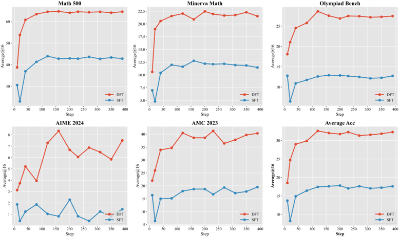
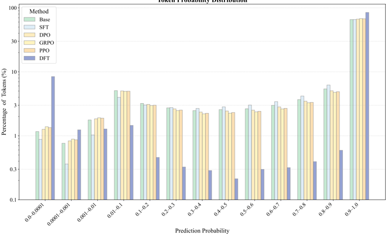
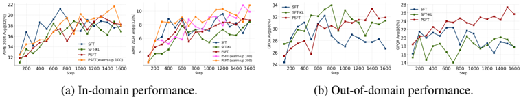
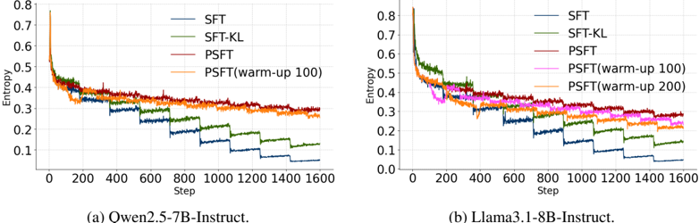
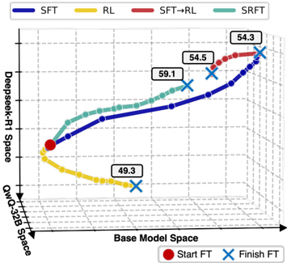
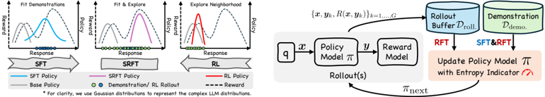
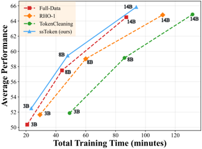
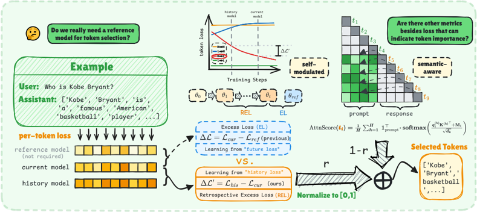

# L2 · 统一 SFT-RL · 奖励微调 (GFT 类)

> 本主题 20 篇,完整精读如下(右侧目录可跳到具体论文)。

## AMFT: Aligning LLM Reasoners by Meta-Learning the Optimal Imitation-Exploration Balance

> **`amft`** ｜ 清华大学电子工程系（Lixuan He, Jie Feng, Yong Li） ｜ 2025-08-09 arXiv v1 · Preprint under review ｜ L2 统一SFT-RL · 相关性高（与"探索-巩固"概念同构） ｜ [📄 原始论文](https://arxiv.org/abs/2508.06944)

### 关键图示

**① Motivation / 对比图**

*Figure 2: AMFT learning dynamics vs. sequential baselines on math benchmarks. The left y-axis shows validation accuracy (%), while the right y-axis shows the adaptive weight µ . AMFT (solid blue) achieves a superior learning curve by dynamically adjusting µ (red dash-dotted), avoiding the difficult*

**② 方法 / 架构图**

*Figure 1: Overview of AMFT's motivation and framework.*

### 一眼看懂

- 🟦 TL;DR：与其"SFT→RL"两阶段或靠启发式硬切换，AMFT 把 SFT 和 RL 揉进**单阶段单循环**，并把"模仿(SFT) vs 探索(RL)的配比 µ∈[0,1]"当成**可学习参数**，用 meta-gradient 以"最大化最终验证集表现"为元目标**前瞻式**地学这个 µ（§3.2 Eq.4-6）。数学/视觉推理上自称 new SOTA、OOD 泛化更好(§4.2 Table 2 ID 61.3/OOD 63.3；§4.3 Table 3)。
- 最巧的一步：**把 µ 当可学习参数、用 meta-gradient `∇_µ U(θ)` 前瞻优化**（Eq.5）。抽掉它(消融 w/o Meta-Gradient，Table 4)数学 ID 61.3→57.0、OOD 63.3→60.5，退化成纯熵启发式(=反应式)。它是 AMFT 区别于 SRFT/SASR/DyME 等所有"反应式启发式"的唯一关键点——回答的是"现在这样配比，对若干步之后的最终性能是否最优"，而非只看当下噪声信号。

### 为什么做

- 研究背景：LLM 推理后训练主流是 SFT→RL 两阶段（§1、§2.3）。SFT 擅长模仿但困于静态数据集、倾向记忆、OOD 差；RL 探索强、泛化好但样本低效、稀疏奖励下不稳，on-policy 受基模上界限制。最关键的是**阶段间目标突变导致灾难性遗忘**（RL 覆盖 SFT 学到的结构知识，§1、§2.2）。
- 解决的具体痛点：现有单阶段统一方法（SRFT 用 entropy、SuperRL 用 reward density、SASR 用 gradient norm、DyME 用 generation correctness、LUFFY 用固定 off-policy 比例）**都是反应式(reactive)**——依赖短期含噪启发式做被动调整或硬切换，缺前瞻性（§1、Table 1 系统对比）。
- 相关工作 & 各自不足：见 Table 1——SRFT(熵可能不与性能相关)；SuperRL/DyME(二元开关，中等 reward density 不理想)；SASR(梯度范数只是学习稳定性代理)；LUFFY(固定 off-policy 比例)；SFT→RL(灾难性遗忘、低效)。AMFT 是**首个用 meta-gradient 直接优化长期性能**的连续配比方法。
- 动机链：现状(两阶段/反应式单阶段)→缺陷(遗忘 + 反应式不前瞻)→所以把配比 µ 升格为可学习参数、用 meta-gradient 前瞻优化。为什么不用更简单的固定/手调 µ 或熵启发式？§3.2 论证固定 µ 难最优；熵等启发式只是 short-term proxy，不直接对齐"最终性能"目标。
- 与最近邻工作的Δ：相对 SRFT（同为单阶段连续加权，但用熵），差在**用 meta-gradient 替换熵作为主控信号**（熵在 AMFT 里降级为辅助短期纠偏，Eq.6 第三项）；相对 SFT→RL，差在**单循环混合 batch + 动态 µ 平滑过渡**而非阶段突变。

### 怎么做 + 靠不靠谱

- 方法流水线（§3，Algorithm 1）：① 简短 **SFT warm-up**(W 步) 提供稳定初始化 → ② 主循环每步取 SFT batch(算 LSFT) + on-policy rollouts(算 LRL，用 **PPO-clip 目标**，Algorithm 1 行5)→ ③ **更新 µ**：周期性算 meta-gradient `g_µ=∇_µ U(θt)`(验证集，Eq.4-5) + 每步算熵启发式 `g_H=H*−H(π_θ)`，`µ_{t+1}=clip(µ_t+η_µ g_µ+η_H g_H, µmin, µmax)`(Eq.6)→ ④ 用新 µ 算统一损失 `L_total=(1−µ)·L_RL + µ·L_SFT`(Eq.3) 更新 θ 和 value function ϕ。
- 逐组件必要性（消融 Table 4，三件套缺一不可）：
  - **meta-gradient**：w/o 后数学 ID 61.3→57.0；负责前瞻性、性能上限。
  - **熵启发式**：w/o Entropy(Meta-only) 数学 61.3→55.0（掉最多），且 §4.2 称去掉它会训练不稳——负责短期稳定/防坍塌。
  - **SFT warm-up**：w/o 后 61.3→56.2；负责稳定初始化、目标熵 H* 的初始值来源。
  - 三者都有显著且方向一致的掉点，必要性论证较充分。
- 关键机制/公式（直觉）：µ 是"模仿-探索旋钮"。**长期 meta-gradient**：把 µ 当参数，用单步内层更新近似 `∂θ/∂µ`（Eq.5，one-step 近似，避免完整 Jacobian-vector），问"µ 往哪挪能让未来验证奖励更高"。**短期熵**：熵过高(发散)→增 µ 收敛到模仿；熵过低(将坍塌)→减 µ 鼓励探索。§3.4 理论：µ·LSFT 是动态 KL 惩罚 `D_KL(π_demo‖π_θ)` 的代理(NLL 最小化 ≡ 该 KL 最小化，差一常数熵项)，于是 µ = 这个 KL 约束的**时变 Lagrange 乘子**——比 RLHF 固定 KL 惩罚更原则化。
- 实验与证据：数学基模 **Qwen2.5-Math-7B**，数据 OpenR1-Math-46k-8192；视觉基模 **LLaMA-3.2-Vision-11B**，数据 General Points / V-IRL。所有 RL 方法训 500 步、PPO、8 rollouts/prompt（§4.1，公平性控制）。关键数字：Table 2 数学 ID Avg **61.3**(超 SRFT 59.5)、OOD Avg **63.3**(超 SRFT 62.5)；Table 3 视觉 General Points ID 72.1/OOD-Rule 45.8、V-IRL ID 95.2/OOD 71.4，全面超 SFT/RL/RL-from-SFT/LUFFY；Table 5 效率——达标所需 steps/SFT 样本/RL rollouts 更少。Fig 3 显示纯 RL 快速熵坍塌，AMFT 维持高熵高奖励。baseline 覆盖 SFT/RL/两阶段 + SRFT/LUFFY/TAPO/ReLIFT 等单阶段 SOTA，较公平。**注意**：RL-only baseline 是 GRPO(Table 2 "RLGRPO")，但 AMFT 统一损失里 LRL 用的是 **PPO-clip**(Algorithm 1 + value function ϕ)——v1 误记为"RL 部分用 GRPO"，实为 PPO。
- 假设与失效边界：【原文】§3.4 SFT≈KL 正则的推导是 intuitive sketch，完整推导在附录。【推断】meta-gradient 的 one-step 近似(Eq.5)假设单步展开足够代表长期影响，方差/偏差未在正文量化；长期 meta-gradient 与短期熵两信号可能冲突，η_µ/η_H 鲁棒性未知；"new SOTA"为 preprint 自述、未评审。
- 祛魅总结：【推断】真贡献是把"SFT/RL = 同一目标下两种互补 reward 信号(隐式 path-level + 显式 outcome)"的统一视角 + **meta-gradient 学习配比**这一前瞻机制，且消融扎实。包装处：①"前瞻式 > 反应式"主要靠与 SRFT 等的**端到端对比**间接支撑，缺把 meta-gradient 直接对位某反应式信号的 head-to-head 控制实验，因果归因强度中等；②"new SOTA"未评审；③ **代码 404 不可得**使所有实现细节(η_µ/η_H、validation batch 构造、meta-gradient 具体近似实现、稳定性)无法独立核实，这是最大的可信度折扣。作者**高估**了归因确定性，**低估**(或未充分讨论)了 meta-gradient 的计算开销与方差。

### 结构化抽取

- 🎯 机制速览6轴：**学什么信号**=两路——(a)隐式 path-level reward(SFT/专家轨迹) + (b)显式 outcome reward(RLVR 正确性)；外加 meta 层学"两者配比 µ" | **改什么**=策略参数 θ（通过动态加权的统一损失）+ 一个标量超参 µ | **何时改**=在线 per-step(µ 每步更新，meta-gradient 周期性估) | **免梯度?**=否(双层梯度优化，含 meta-gradient) | **记忆-技能生命周期**=不适用(无外部记忆/技能库) | **防遗忘机制**=核心卖点——µ·LSFT 作动态 KL 锚定把策略拉向专家分布，meta-controller 自动保留足够 SFT 引导以防 RL 阶段灾难性遗忘(§4.2 明确归因 OOD 不掉点于此)。
- ⑦ 开源代码+框架/harness：论文声明 https://github.com/hlxtsyj/AMFT 。**可得性=404 不可得**：直连 + 代理(127.0.0.1:7897) `git ls-remote` 均 "Repository not found"，api.github.com 返回 404，本地无 clone。任务清单的 `TSYJ-He/AMFT` 同样 404。框架=【待核，仓库不可得】方法层面建立在 PPO-clip(RL) + SFT 加权损失 + meta-gradient 控制器；无法确认具体 RL 框架(verl/TRL/oat 等)。
- 💰 资源/成本与可扩展性：【原文】§4.1 所有 RL 方法训 500 步、8 rollouts/prompt；Table 5 报达标所需 steps/样本/rollouts(AMFT 更省)。【推断】meta-gradient 需额外 validation batch 前向 + 二阶/近似计算，单步成本高于普通混合损失，但论文未给具体 GPU·h；规模仅验证到 7B/11B。
- 🎯 对"探索-巩固"对标：**最强概念同构者**——AMFT 的"模仿(SFT/path-level) vs 探索(RL/outcome) 的动态配比"几乎是 TSRD"探索(选路)+巩固(回轨固化)"在**损失加权层**的直接对应：µ 大=巩固/锚定专家路径，µ 小=探索新解。**可借组件**：① meta-gradient 前瞻调权可迁移到"何时该让 student 自探索、何时该用 teacher 脚手架"的调度；② SFT≈动态 KL 锚定(§3.4)与本项目"巩固=固化进参数且不遗忘"同理。**缺口/差异**：AMFT 在**全局标量 µ** 层调度，不是 TSRD 的"**岔路口/关键步**单点接管 + path-recovery"那种 token/step 级稀疏脚手架；teacher 只以静态 SFT 数据出现，无"会走通的 teacher 轨迹按需注入"。一句判定：**概念同构、强相关，是'探索-巩固'在统一损失视角下的最佳类比，但调度粒度(全局 µ vs 单步脚手架)是关键差异，可借机制不可直接照搬**。依据：µ 是序列级单标量，无 per-step 路径选择/恢复语义。
- 🔭 开放问题/未来方向：【原文】Appendix E 进一步研究 controller(正文未展开)。【推断】把全局 µ 细化到 per-step/per-token 的前瞻配比(逼近 TSRD 的单点接管)；meta-gradient 方差/开销的系统分析；引入"会走通的 teacher 轨迹"作为 path-level 信号源(而非仅静态 SFT)；代码开源以供复现(当前最大障碍)。

---

## ASFT: Anchored Supervised Fine-Tuning

> **`asft`** ｜ 南方科技大学 / 北京大学 / 上海AI Lab（He Zhu, Junyou Su, Peng Lai 共一，通讯 Guanhua Chen） ｜ 2026-02-01 arXiv v3 · ICLR 2026 ｜ L2 统一SFT-RL·奖励微调(GFT类) · 相关性高 ｜ [📄 原始论文](https://arxiv.org/abs/2509.23753)

### 关键图示

**① Motivation / 对比图**

*Figure 1: Training dynamics comparison across fine-tuning methods on medical knowledge tasks. Left : MMLUaccuracy (out-of-domain evaluation); Center : MedMCQA accuracy (in-domain evaluation); Right : KL divergence from base model. DFT exhibits severe distributional drift (high KL divergence) while A*

**② 方法 / 架构图**

*Figure 3: Comparison of model performance across three benchmarks (MedQA, MMLU, MedMCQA) for five models (LLaMA-2-7B, LLaMA-2-70B, Qwen2.5-7B, Qwen2.5-32B, Qwen2.5-72B) using four fine-tuning strategies (Base, SFT, DFT, ASFT). Each subplot shows the scores for a specific benchmark, highlighting the*

### 一眼看懂

- 🟦 TL;DR：DFT(用 `sg[π_θ]` 给交叉熵重加权的 SFT 变体)在推理域好用、在知识域(如医疗)**不稳**。ASFT 用 **reward-weighted regression(RWR) 框架**证明 DFT 等价于一个特定 auxiliary 分布选择、给出比 SFT **可证更紧**的 RL 下界，但**缺分布锚定→渐进漂移**(KL 持续增大)才是其不稳根因；于是只加一项**轻量 forward-KL 锚定**(把策略约束在 base 附近)就同时保住紧界优势和稳定性(§4，Eq.6)。数学 100k 较 base +17.89(142%)、医疗 10k 较 SFT +8.28(24.8%)，仅需全 RL 约 3% 算力。
- 最巧的一步：**forward-KL 锚定项 `λ·D_KL(π_base‖π_θ)`**（Eq.6，base‖policy 方向）。抽掉它就退回 DFT——§5.2 Table 1 知识域 DFT 在 10k 反而较 base **掉 2.19 点**(MMLU 30.52→26.69)、ASFT 加锚定后反而 +10.65(MMLU→46.37)。且方向必须 forward(mode-covering)：§5.3 消融 forward > reverse，reverse(mode-seeking)会致坍塌。

### 为什么做

- 研究背景：后训练在 SFT(off-policy 模仿,高效但易记忆、泛化弱)与 RL(on-policy,泛化好但贵且不稳)间存在根本权衡(§1)。一批工作从 RL 视角重审 SFT——DFT(Wu et al. 2025a)指出标准 SFT 的隐式 reward `r_SFT=I[y=y*]/π_θ` 在 π_θ→0 时**方差无界**,用 `L_DFT=−sg[π_θ]·log π_θ`(Eq.3)概率重加权修复,推理域显著提升。
- 解决的具体痛点：①**DFT 效果域相关**——推理域好,知识密集任务(医疗 MedMCQA/MMLU)**不稳**,且启发式重加权**缺理论依据**(§1)。②作者用 RWR 诊断根因:DFT 对应特定 auxiliary 分布(Eq.4),给可证更紧下界(Theorem 1),但**缺分布锚定**→渐进漂移(q 越来越集中在高 π_θ 轨迹,形成正反馈)→下界越来越松、重要性权重方差越来越大→失稳(§4.1 Key Finding 3)。
- 相关工作 & 各自不足：SFT(稳但松的 RL 下界,Proposition 1,易记忆);RL(紧但贵不稳);importance-weighted SFT(Qin&Springenberg 2025)、proximal SFT(Zhu et al. 2025)、DFT——ASFT 的Δ:**把 auxiliary 分布本身锚定到 base**,在保留紧界的同时控方差。
- 动机链：现状(DFT 紧但漂移)→缺陷(知识域 KL 漂移失稳)→所以加轻量 KL 锚定(就是把 RL 的 KL 惩罚搬进 SFT)。为什么不用更简单的 SFT+KL？§5.2/Table 1 显示 SFT+KL 几乎不涨甚至掉点(它没有 DFT 的紧界重加权)——必须 **DFT 重加权(管紧) + KL 锚定(管稳)** 二者皆有。
- 与最近邻工作的Δ：相对 DFT(最近邻),差在**加 forward-KL 锚定 + RWR 理论解释**;相对 SFT+KL,差在**保留 DFT 的概率重加权紧界**(SFT+KL 无紧界);相对 AMFT 等动态 µ 方法,ASFT 是**静态轻量正则**而非 meta 学习配比。

### 怎么做 + 靠不靠谱

- 方法流水线（§4）：① RWR 框架下证 SFT 是 RL 下界(Prop.1)、auxiliary 分布 q 决定下界紧度与稳定性(Eq.2) → ② 证 DFT = 特定 q(Eq.4)、给严格更紧下界(Theorem 1,当 `Var(π_θ)>0` on D+) → ③ 诊断 DFT 漂移(不等式 `u≥1+log u` 仅 u=π_θ/q=1 即 π_θ 在 D+ 上恒定时取等,训练中 π_θ 越来越非均匀→下界越来越松) → ④ **ASFT = L_DFT + λ·E[D_KL(π_base‖π_θ)]**(Eq.6),token 级实现(序列权重按位置归一分摊)。
- 逐组件必要性：
  - **DFT 概率重加权(管紧)**：提供比 SFT 更紧的下界(Theorem 1),推理域增益主来源。
  - **forward-KL 锚定(管稳)**：§5.2 知识域必需(无它 DFT 掉点);§5.3 方向必须 forward(mode-covering 防坍塌、维持 base 广分布),reverse 会 mode-seeking 坍塌。理论上 KL 项不改下界结构(保紧)只控方差(防指数增长)。
  - **λ**：本 ICLR 版默认 **0.05**(§5.1,数学/医疗同);代码同时实现 sft/dft/sft+kl/asft 四 mode 便于消融。【版本差异:旧 train_v2 代码默认 0.1、bf16 推荐 0.03;本 PDF 统一用 0.05】
  - 消融(§5.3)还含 lr/batch 鲁棒性分析。
- 关键机制/公式（直觉）：DFT 重加权 `sg[π_θ]·(−log π_θ)`——模型对正确轨迹当前概率越高,该样本权重越大→把学习集中到"已有点会、再推一把就稳"的样本。KL 锚定 `D_KL(π_base‖π_θ)`——把策略拉回 base 的 trust region,阻止 q 退化到只盯少数高概率样本(防 effective sample size 萎缩)。紧界 + 锚定 = 既贴近最优又不跑偏(正是 RL 里 KL 惩罚的作用)。
- 实验与证据：基模 **LLaMA-2-7B**(医疗,刻意选它避数据污染) + **Qwen2.5-7B**(数学+医疗)。数据:数学 **NuminaMath CoT**(10k/30k/100k)、医疗 **MedMCQA**(10k/30k/100k);测 Math500/Minerva/Olympiad/AIME24/AMC23 与 MedQA/MMLU/MedMCQA。关键数字(Table 1):数学 100k ASFT 较 base **+17.89**(vs DFT +13.43),AMC23 36.72 vs DFT 27.19;医疗 10k ASFT 较 base +10.65(DFT 反 −2.19),且跨 10k/30k/100k 稳定(+10.65/+10.63/+8.60);效率仅全 RL ~3% 算力。Fig 1 直接展示:DFT 的 KL 持续飙升(漂移),ASFT KL 平稳且 ID/OOD 双高。baseline=SFT/SFT+KL/DFT,公平。证据链完整:理论(更紧界+漂移诊断)→Fig 1(DFT KL 飙升)→Table 1(医疗 DFT 失稳而 ASFT 稳)直接对应理论预测。
- 假设与失效边界：【原文】§3.2 假设 sparse reward `R=I[y=y*]` 且 `supp(π_θ)⊆supp(π_ref)`;Theorem 1 需 `Var(π_θ)>0` on D+(故推理域因变量大而更受益)。【推断】仅 2 个 7B 基模(LLaMA-2/Qwen2.5),规模/家族覆盖有限;λ 跨域/精度需手调(本版 0.05、旧版 0.1/0.03),"轻量锚定"并非完全免调;**摘要提 code generation 但 Table 1 只报数学+医疗**,代码域结果在本版正文未见(待核附录)。
- 祛魅总结：【推断】真贡献是 **RWR 统一框架** + "DFT 紧但缺锚定→漂移"的清晰诊断 + 一行 KL 修复,理论与实验(Fig 1 KL 飙升 vs 平稳)咬合扎实。**包装/局限**:ASFT 本质是"DFT + 已知的 KL 正则",机制新颖性更多在**理论解释**而非机制本身(SFT+KL 早存在,论文也列为基线);λ 敏感性说明"轻量"有限;仅 7B 两基模。作者**诚实**地把 SFT+KL 列为基线并证明其不足(凸显紧界+锚定缺一不可),未明显高估。

### 结构化抽取

- 🎯 机制速览6轴：**学什么信号**=专家示范的概率重加权交叉熵(`sg[π_θ]·log π_θ`,token 级)+ 对 base 的 KL 锚定 | **改什么**=策略参数(SFT 损失重塑) | **何时改**=离线(off-policy SFT,固定数据集,无在线采样) | **免梯度?**=否(梯度 SFT) | **记忆-技能生命周期**=不适用 | **防遗忘机制**=核心——`D_KL(π_base‖π_θ)` forward-KL(mode-covering)把策略锚在 base 的 trust region,显式防分布漂移/坍塌、维持 base 广分布(§5.3 理论 + Fig 1 经验)。
- ⑦ 开源代码+框架/harness：https://github.com/zhuchichi56/ASFT （v1 已克隆约 54MB,**完整**;数据 HF chichi56/ASFT）。框架=自定义 HF Trainer + DeepSpeed(ZeRO-2/3) + PEFT/LoRA;新增 **veRL(FSDP2) 分支**(数值更稳,README 推荐优先);**已合入 LLaMA-Factory 主分支**。核心 loss `train_v2.py`(mode∈{sft,dft,sft+kl,asft})。【注:本 ICLR 版 λ=0.05;旧代码默认 0.1、bf16 推荐 0.03,存在版本差异】
- 💰 资源/成本与可扩展性：【原文】§5.1——数学 max len 2048/batch 256/lr 5e-5/1 epoch,医疗 max len 512/batch 64/lr 2e-5/3 epoch,均 AdamW cosine warmup 0.1;ASFT 仅比 SFT 多一个 KL 惩罚项,§1 称只需全 RL **~3%** 算力。可扩展性:SFT 级效率 + RL 级泛化。
- 🎯 对"探索-巩固"对标：**巩固/防遗忘侧的强相关者(竞品+可借组件)**——ASFT 的 "DFT 重加权(把学习集中到学生快会的样本)+ KL 锚定(不跑偏 base)" 正对应 TSRD"**巩固=把成功经验固化进参数且不遗忘**":重加权≈"固化学生够得着的成功路径",forward-KL 锚定≈"不遗忘"。**可借组件**:① RWR 框架可作"SFT/重加权/RL 谁更紧"的统一分析语言;② forward-KL(mode-covering)防漂移机制可直接用于 OPD/TSRD 巩固阶段的防遗忘;③ `sg[π_θ]` 重加权(forward-hard/backward-soft 同族的 stop-gradient 用法)与本项目记忆里的 reusable technique 一致。**缺口**:纯 off-policy SFT,无探索/选路、无 path-recovery、无 on-policy 自选、无 teacher 脚手架。一句判定：**强相关于"巩固/防遗忘"这一维,KL 锚定与重加权可直接借入 OPD 巩固阶段;但缺探索侧机制,只覆盖'探索-巩固'的后半**。依据:方法无任何在线探索或路径选择,纯重加权 SFT + 静态锚定。
- 🔭 开放问题/未来方向：【原文】§5.3 后续——KL 方向/超参的更细分析;ASFT 作 DAPO/GRPO 更优初始化(v1 提及)。【推断】把静态 λ 升级为动态(逼近 AMFT 的可学习配比);RWR 框架扩到 on-policy/带探索的设置;代码域结果补全;更大规模/家族验证;与 on-policy 蒸馏结合作"巩固"模块。

---

## Beyond Log Likelihood: Probability-Based Objectives for Supervised Fine-Tuning across the Model Capability Continuum

> **`beyond_loglik`** ｜ UIUC（共一 Gaotang Li、Ruizhong Qiu、Xiusi Chen；Heng Ji、Hanghang Tong） ｜ 2026-05（arXiv:2510.00526v3；ICML 2026，PMLR 306） ｜ 主题线 L2 统一SFT-RL/SFT损失设计·相关性 中 ｜ [📄 原始论文](https://arxiv.org/abs/2510.00526)

### 关键图示

**① Motivation / 对比图**

*Figure 1. Motivating model-strong SFT result on math reasoning. For the objective family f α ( p ) = (1 -p α ) /α , where α → 0 recovers NLL ( -log p ). Prior-leaning objectives with α = 1 and α = 10 substantially improve average accuracy over NLL.*

**② 方法 / 架构图**

*Figure 2. The model capability continuum of SFT objectives in Post-Training. At the model-strong (MS) end, where base models already encode extensive priors (e.g., Llama 3 reports 25% math pretraining tokens (Grattafiori et al., 2024)), prior-leaning objectives that downweight low-probability tokens*

### 一眼看懂

- 🟦 TL;DR：SFT 默认用 NLL（−log p），大家把"SFT 泛化差"归咎于模仿范式。本文说不对——病根是 NLL 这个**默认目标**：NLL 只在"从零训练小分类"才最优，后训练时 base 已有先验、监督序列长且含噪，逼模型逐 token 复刻冗长 CoT 反而伤泛化。把 NLL 推广成参数族 f_α(p)=(1−p^α)/α，并提出统一刻画——**模型能力连续谱**：base 先验强（数学）时下调低概率 token 的 prior-leaning 目标（如 −p）持续胜 NLL（+15.75）；先验弱（figfont 谜题）时 NLL 主导；中间（医疗）两者难分。
- 最巧的一步：**梯度权重 W_f(p)=−f'(p)·p·(1−p) 的凸凹分析（Lemma 3.1 + Prop 3.2）**。抽掉它就只剩"换损失有时更好"的经验观察；正是 W_f 把"凸目标(−log p)峰值在[0,0.5]强调低概率 token=prior-averse / 凹目标(−p)峰值在[0.5,1]强调高概率 token=prior-leaning"讲清楚，才把一堆散落的损失（−p、focal、entropic matching、均匀重加权）统一进同一谱系并预测它们何时该用。

### 为什么做

- 研究背景：SFT 是 LLM 后训练标准做法，但**泛化常受限**，普遍归因于"模仿学习范式本身"（§1，引 Chu 2025）。
- 解决的具体痛点：把锅甩给"模仿范式"**忽略了默认目标 NLL 本身**。NLL 在从零训练分类上经典最优（Cox 1958 等），但后训练范式不同：base 已编码任务先验且通常 well-calibrated，监督是上千 token 的长 CoT 且可能含噪——**要求 base 逐 token 复刻会伤泛化**。而 RL 启发的各种 SFT 改进各自在某些域有效，但**缺乏"何时用哪种目标"的统一刻画**。
- 相关工作 & 各自不足：① 从 RL 视角改 SFT——把 SFT/DPO 看隐式 reward learning（小 lr+散度目标）、引入 importance sampling、PPO-style clip 约束 drift、**均匀重加权梯度系数（Wu 2026，等价本文 −p）**——各自有效但**不知何时失效**；② 其他 SFT 损失（MSE/focal/Huber/entropic distribution matching）——本文框架可统一解释为 prior-leaning。
- 动机链：现状（SFT 泛化差，归咎模仿范式，默认用 NLL）→ 缺陷（NLL 的最优性假设在后训练被违反，且无"何时用何损失"的统一理论）→ 所以提 f_α 族 + 能力连续谱。为什么不直接推一个"更好的损失"？作者明确**不主张单一万能损失**（§1），而是建立"何时用何损失"的认识论框架——因为实证发现损失好坏会随 base 能力**反转**（MS 端 −p 赢、MW 端 NLL 赢）。
- 与最近邻工作的Δ：vs Wu 2026（均匀重加权，等价 −p）——本文证明这种 prior-leaning 更新**只在 MS 端有效、MW 端会害**，把单点结论纳入连续谱；vs 各种 SFT 损失工作——提供**首个 capability-based 的统一刻画**（W_f 凸凹）。关键点：损失选择不是绝对优劣，而是与 base 先验强度的匹配。

### 怎么做 + 靠不靠谱

- 方法流水线（这是**分析/认识论框架**而非新算法）：① 统一框架——把 SFT 目标写成 L_f=E[f(p_θ(y|x))]，f 可微非增（Eq.2）；f_α(p)=(1−p^α)/α，α→0 退化 NLL、α=1 即 −p（=最大化期望平均预测准确率），α≥1 凹/0≤α≤1 凸（Eq.3）；② 凸凹归类——W_f(p)=p^α(1−p)，Prop 3.2 证凹目标 W_f 峰在[0.5,1]（prior-leaning）、凸目标峰在[0,0.5]（prior-averse），据此定义 prior-leaning/prior-averse（Def 3.3）；③ 能力连续谱三段——MS（先验强，如数学）用 prior-leaning、MW（无先验，如 figfont）用 NLL、MI（医疗）两者难分；④ 能力位置量化——用"训练集平均预测概率"（数学 0.76–0.81、医疗~0.50、figfont~0.01）；⑤ 理论——梯度流下给充分条件：MS 端 −p 损失下降更大、MW 端 NLL 更大。
- 逐组件必要性：**W_f 凸凹分析**（理论核心，没它无法预测谱位置）；**hard-thresholding 变体 L_HT(I)**（Eq.4，只在概率区间 I 内更新）——是关键**消融工具**，§5.1 Fig.5 用它隔离各概率段贡献，发现"低概率 token 一致有害 + 只训 top10% token 所有目标都超标准 SFT"；**训练集平均似然作能力代理**——§5.3 验证与定性预期吻合且随谱反转。整篇是"理论预测→多设定实证验证"，消融充分（27 benchmark）。
- 关键机制/公式（直觉）：W_f(p)=−f'(p)·p·(1−p) 决定每个 token 贡献多少梯度。NLL 的 W_f→(1−p) 强压低概率 token（逼模型从所有 token 尤其错处广泛学）；−p 的 W_f=p(1−p) 低概率信号迅速衰减（只精炼高置信 token）；−log(1−p) 的 W_f=p 完全偏高概率。直觉：base 强时低概率 token 多是噪声（§5.1 实证"低概率 token 主要作为噪声"），该 de-emphasize；base 弱时低概率 token 多是该学的错处，该强调。
- 实验与证据：8 backbone（LLaMA-3.1-3B/8B、3.2-3B、DeepSeekMath-7B、Qwen2.5-Math-1.5B/7B、Qwen2.5-1.5B~32B、Qwen2.5-Coder-7B）×27 benchmark/7 域。锚点：MS=NuminaMath(数学)、MI=m23k(医疗)、MW=Reasoning Gym figfont。**关键数字**：MS（Table 1）−p 与阈值化 −log p 一致超 NLL，Qwen2.5-Math-1.5B 17.00→32.75（**+15.75**）；MI（Table 2）−p 与 −log p 几乎相同（差异在统计波动内，如 LLaMA-3.1-8B 47.23 vs 45.89）；MW（Table 3）−log p 一致大幅超 −p，−p 的 Exact Match 常为 0；通用指令微调（Fig.4）固定数据只变规模 3B→14B，偏好从 NLL 平滑转向 −p（单设定内复现连续谱）；编码/低资源多语分别复现 MS/MW 端。
- 假设与失效边界：【原文】MI 区"无单一最优"——改善应转向数据/监督质量而非损失（§4.2）；能力位置靠**训练后用训练集似然量化**（§3，非先验可操作）。【推断】最大说服力来自实证规模（8×27），但"训练集平均似然"需事后估计，落地时仍需试；MI（最常见的中等先验任务）反而给不出明确建议，实践指导有限。
- 祛魅总结：【推断】真贡献是 **"无单一最优 SFT 损失，取决于 base 能力"这一统一认识论框架** + W_f 凸凹这把刀把散落损失归一 + 大规模实证的连续谱（含单设定规模扫描的内部复现）。**作者很诚实地不包装成新算法**（§positioning 明说"establish a principled account of when and why"而非 best loss）。要祛魅的是其落地价值：**它不是新损失、不给先验可操作的选择准则**——价值在解释而非可直接拿来用的方法；与 OPD 的关系是**间接**：其"prior-leaning 下调低概率 token"与 token 加权/重要性采样相通，但本文是固定 ground-truth SFT 设定，OPD 是 student-on-policy + teacher 分布监督，不能直接套。

### 结构化抽取

- 🎯 机制速览6轴：**学什么信号**=ground-truth 序列的 token 概率（经 f 变换，不同 f 改变各概率段 token 的梯度权重）｜**改什么**=参数 + **SFT 训练目标 f 本身**（−log p / −p / 阈值化 / hard-threshold）｜**何时改**=离线 SFT（训练目标层面，非 per-step 动态）｜**免梯度?**=否（标准 SFT 梯度下降，只改损失函数形状）｜**记忆-技能生命周期**=不适用｜**防遗忘机制**=不适用（间接：prior-leaning 少改 base 已会的低概率 token，可视为"少破坏已有先验"，但非持续学习防遗忘）
- ⑦ 开源代码+框架/harness：https://github.com/GaotangLi/Beyond-Log-Likelihood 。框架=**VeRL**（旧 analysis 记 `main_verl`，目录含 `scripts/{training,evaluation,ablation,one_click}`、`data`、`evaluations`，覆盖 27 benchmark）。【待核】框架与目录细节复用旧 analysis 对仓库的核查，本次未重新进仓核对。复现=固定数据/评测协议、仅改 SFT 目标即可；hard-thresholding 变体用于消融。
- 💰 资源/成本与可扩展性：【原文未明确给单次训练成本】实验规模大（8 backbone×27 benchmark×7 域 + 规模扫描 3B→32B）。方法本身**零额外成本**（只换损失函数，不增采样/不增阶段）。
- 🎯 对"探索-巩固"对标：**可借组件（机制层启发）**。判定：本文与 OPD/TSRD **非同设定**（固定 ground-truth SFT），但其核心洞察——"**base 先验强时该 de-emphasize 低概率 token、少破坏已会的**"——对"巩固"环节有直接启发：巩固有效行为时应保护 base 已掌握的稳妥路径（高概率段），而把学习信号集中在少数关键 token。**可借组件**：① W_f 凸凹这把"该强调哪类 token"的分析刀，可移植到 TSRD 判断"path-recovery 时该改哪些 token 的 logits"；② hard-thresholding 按概率分位隔离 token 贡献的消融法。**缺口/差异**：无 on-policy、无 teacher 分布、无 step/path 信用分配、无 MTP；其结论建立在固定监督序列上，TSRD 是 student 自采轨迹 + teacher 脚手架，需谨慎迁移（OPD 的"低概率 token"语义不同于固定 ground-truth 的低概率 token）。
- 🔭 开放问题/未来方向：【原文】MI 区改善应转向数据/监督质量（§4.2）；MW 进步靠更强/更有针对性监督或其他注入知识方式（§4.2）。【推断】先验可操作的目标选择准则（免事后估计似然）；把连续谱思想推广到 on-policy/OPD 的 token 加权；MI 区的损失之外的杠杆；与 RL/蒸馏的 token 级信用分配统一在 W_f 框架下。

---

## On-Policy RL Meets Off-Policy Experts: Harmonizing SFT and RL via Dynamic Weighting (CHORD)

> **`chord`** ｜ 阿里巴巴集团（Wenhao Zhang、Yaliang Li(通讯)、Jingren Zhou 等） ｜ v3 2026-03-17 · ICLR 2026 · cs.LG ｜ 主题线 L2（统一 SFT-RL / GFT 类代表作）·相关性 高 ｜ [📄 原始论文](https://arxiv.org/abs/2508.11408)

### 关键图示

**① Motivation / 对比图**

*Figure 1: We train Qwen2.5-1.5B-Instruct on the Open-R1 dataset and evaluate the performance on a held-out validation set. These results show that the SFT-then-RL training paradigm can yield suboptimal performance compared to pure RL.*

**② 方法 / 架构图**

*Figure 3: An overview of the proposed CHORD framework that unifies SFT and RL, featuring a global coefficient µ and a token-wise weighting function ϕ ( · ) .*

### 一眼看懂

- 🟦 TL;DR：别再把 SFT 当 RL 前面的独立阶段。作者实测 SFT-then-RL 在 instruct 模型上会经历 **"shift-readapt-overfit"(漂移-再适应-过拟合)** 三阶段曲线,且不一定胜过纯 RL【原文 §3.1, Fig.1/2】。CHORD 把 SFT 重构成 on-policy RL 里一个**动态加权的辅助目标**:统一损失 L=(1−μ)·L_GRPO + μ·L_SFT;**全局系数 μ**(带 warmup 的余弦/退火调度)控制专家信号占比从"以模仿为主"平滑过渡到"以探索为主";**token 级权重 φ(p)=p(1−p)**(p 为策略对该专家 token 的概率)对"已很可能(p→1)"或"极不可能(p→0)"的专家 token 下调学习信号,只在 p≈0.5 处学得最多【原文 §3.2-3.3, 式(3)(5)(6)】。
- 最巧的一步：**token 级 φ(p)=p(1−p) 这条抛物线**。光有全局 μ 不够——case study 显示 CHORD-µ 会让模型整体照搬专家的冗长风格、覆盖自身简洁性(μ 缺乏精度)【原文 §3.2 L378-383】。直接用重要性采样(IS,权重 p.detach)又会让熵急剧坍缩(过度强化高概率 token、忽视低概率新 token→过自信),而不加 IS 则熵暴涨(established pattern 被破坏)【原文 §3.3 Fig.5, L423-431】。φ=p(1−p) 同时下调两端,在"模型还不确定"的 token 上集中学习,制造"learning sweet spot"。抽掉 φ:要么熵坍缩、要么熵暴涨,且模型被专家风格整体覆盖——CHORD-φ 的全面最优就垮了。

### 为什么做

- 研究背景：SFT(off-policy,静态专家示范,易过拟合/exposure bias)与 RL(on-policy,直接反馈、泛化好,但探索低效/熵坍缩)是两大后训练范式;常规 SFT-then-RL 直觉上"SFT 学专家模式引导 RL 越过局部最优、RL 缓解 SFT 的 exposure bias"【原文 §1 L32-49】。
- 解决的具体痛点：①SFT-then-RL **不一定胜过纯 RL**(Fig.1,Qwen2.5-1.5B + Open-R1)【原文 §1 L99-101】;②SFT 训练曲线呈 **shift-readapt-overfit**(Fig.2,Qwen2.5-7B + DeepSeek-R1 专家,MATH-500):突然策略漂移掉点(exposure bias 加剧)→再适应专家模式回升→过拟合到有限静态样本、丧失多样性与探索能力【原文 §3.1 L219-232】;③SFT→RL 转换时机高度任务相关(数学上 SFT-best+RL 最好、工具调用上 SFT-light+RL 更好),需大量调参,且两阶段分离本身次优。
- 相关工作 & 各自不足：dataset 混合(SimpleMix)、专家轨迹混进 rollout 组(LUFFY、SRFT)、专家数据引导生成(UFT、BREAD)、按预定/自适应调度交错 RL/SFT 步(SASR、Ma 2025)——SRFT 提 sample-level SFT loss 统一框架。作者强调本文聚焦"已建立自身回答模式的 **instruct 模型**"(比微调 base 更难也更实用)【原文 §1, §3.1】。
- 动机链：SFT-then-RL 二元开关(μ=1→0)太僵硬、经历 shift-readapt-overfit→改成可衰减 μ 调度可在过拟合前平滑退出(类比 scheduled sampling 缓解 exposure bias)→但全局 μ 缺精度(整体照搬专家冗长)→需 token 级 φ 把专家信号集中在"模型不确定"的 token→φ=p(1−p) 同时避熵坍缩(下调 p→1)与避干扰(下调 p→0)。为什么不用更简单做法:固定 μ 一律差于动态 μ(Fig.7);纯 IS 熵坍缩、无 IS 熵暴涨(Fig.5)——所以既要衰减 μ 又要 φ。
- 与最近邻工作的Δ：vs SFT-then-RL——把"独立阶段"变"动态加权辅助目标",μ 连续衰减而非二元开关;vs LUFFY/SRFT(把专家混进 rollout 组)——CHORD 用 expert_mask 区分专家/非专家数据,专家走 SFT 损失、非专家走 GRPO,凸组合;vs SASR(概率交错 SFT/RL 步)——CHORD 是损失级凸组合 + token 级精度。**关键有用点**:φ 提供"选择性吸收"——按任务自适应吸收专家模式(Table 2 长度证据),而非无差别模仿。

### 怎么做 + 靠不靠谱

- 方法流水线【原文 §3, Fig.3】：①一个 batch 混合 RL 任务 prompt + 专家(prompt,response)→②对 RL 任务采 K 条 on-policy rollout、算 reward 与组归一化优势 A→③非专家数据走 GRPO 损失(PPO clipped surrogate),专家数据走 token 级 SFT 损失(−φ(p)·logπ)→④凸组合 L=(1−μ)·L_GRPO + μ·L_SFT,μ 随步数动态调度→⑤更新策略。
- 逐组件必要性：
  - **全局 μ 衰减**：负责"模仿→探索"平滑过渡;Fig.7 消融——固定 μ 一律差于动态 μ、甚至可能不及纯 RL,小固定 μ(0.02)减损但提升不显著【原文 §4 Fig.7】。
  - **token 级 φ=p(1−p)**：负责"防熵坍缩/干扰 + 选择性吸收";Fig.8/9——CHORD-φ(固定 μ=0.1)既防熵过早坍缩、又避免熵暴涨,reward 稳定上升、显著优于纯 RL;用了 φ 后对 μ 选择鲁棒(不再需复杂 μ schedule)。Table 2——CHORD-φ 数学响应长度 2444、工具调用 120(vs CHORD-µ 被拉到专家级冗长 6081)。
  - **expert_mask 区分数据**：负责"哪条走 SFT、哪条走 GRPO";是凸组合的前提。
  - **两个实例(CHORD-µ / CHORD-φ)**:CHORD-µ 只用全局 μ 调度(关 φ),CHORD-φ 启用 φ + μ 取较小常值——论文明示不存在跨所有任务最优的单一 φ,但 p(1−p) 是有效鲁棒实例【原文 §3.3 L470-473 + 既有 analysis 代码核查】。
- 关键机制/公式(直觉)：L=(1−μ)L_GRPO+μL_SFT【式3】;φ(y*_t)=p_t(1−p_t)【式5】——信息论上 p(1−p) 是"生成该 token 这一二元事件"的策略不确定性度量,偏向"模型最不确定"的 token,制造 learning sweet spot【原文 §3.3 L464-469】。L_SFT-IS(式4)是 IS 变体(权重 p.detach,假设分母=1、把专家当 ground-truth 分布),被 φ 取代。
- 实验与证据【原文 §4】：
  - **数据集/设置**:数学——OpenR1-Math-220k(5k SFT/20k RL 无重叠),policy=Qwen2.5-7B-Instruct(与专家 DeepSeek-R1 风格差异显著),评测 AIME24/25/AMC,MMLU-Pro 监控通用推理;工具调用——ToolAce 单轮(5k RL/500 SFT,专家 DeepSeek-R1),policy=LLaMA3.2-3B-Instruct,评测 BFCL(Live/Non-live)【原文 §4.1】。
  - **主表(Table 1)**:CHORD-µ 数学超强基线 SFT-best+RL(AMC +2.4/AIME24 +1.0/AIME25 +1.6),工具调用整体也更好;CHORD-φ 进一步在数学+工具调用全面最优(MMLU-Pro 56.2 显著高、BFCL Overall 78.5)【既有 analysis,基于 Table 1】。
  - **响应长度(Table 2)**:专家 DeepSeek-R1 远长于原模型(数学 6132 vs 659 token);CHORD-µ 被拉到专家级冗长(6081),CHORD-φ 取得更细平衡(2444)——token 级加权使模型按任务**选择性**吸收专家模式。
  - **进一步分析**:换专家源(DeepSeek-R1 vs 风格更近的 Qwen2.5-72B)CHORD 均超基线,偏模仿方法(SFT+RL/CHORD-µ)在专家风格相近时增益更大;扩展非可验证域(RaR-Medicine)CHORD 仍超纯 RL;弱模型(Qwen2.5-3B)上 naive 模仿/SFT+RL 不稳,CHORD-φ 更鲁棒【既有 analysis】。
  - **baseline 公平吗**:基线很全(Original/SFT-light/SFT-best/SFT-light+RL/SFT-best+RL/SASR/纯 RL/LUFFY)。**诚实标注**:为公平,LUFFY 数学用 20k(原论文 45k)、工具调用用 500 SFT(原 5k),并列出原论文分数——透明但意味着 LUFFY 在此非其最佳配置【原文 §4.2 脚注1 L507-509】。
  - **看着强但没回答核心问题**：主实验规模有限(7B/3B/1.5B policy),更大模型 + 异构专家混合是 future work;模式漂移分析主要是经验性的,缺"不同 CoT 模式如何影响学习"的机理理论。
- 假设与失效边界：
  - 【原文】聚焦 instruct 模型(已建立回答模式);base 模型场景未必同理。
  - 【原文 §3.3 L419-422】L_SFT-IS 假设专家数据分母 IS 比为 1(把专家当 ground-truth 分布)——常见但近似。
  - 【原文/推断】μ、φ 配置跨任务/数据/模型会变,无单一普适最优(作者明示);自适应 reward-aware μ 可行但调参重。
  - 【推断】φ=p(1−p) 的"sweet spot"假设"中等概率 token = 最值得学的新信息"——若专家轨迹的关键信息恰落在模型已高概率或极低概率的 token 上,φ 会抑制它(失效边界)。
- 祛魅总结【推断】：真贡献是**"把 SFT 当 RL 动态加权辅助目标"这一统一视角 + 一个简单鲁棒实例(μ 衰减 + φ=p(1−p))**,而非全新算法。论文-代码高度一致(损失公式、μ schedule、φ、expert_mask 均在 `chord_policy_loss.py` 复现),自洽性强,诚实承认 φ 非唯一最优、配置随 setup 变。被高估的可能是"统一视角"的新颖性(SRFT 等已有相关统一框架);被低估的是 **shift-readapt-overfit 的系统刻画**(Fig.2)这一诊断本身的价值——它把"为什么 SFT-then-RL 次优"讲清楚了。规模有限是主要短板。

### 结构化抽取

- 🎯 机制速览6轴：
  - **学什么信号**：on-policy 部分=可验证 reward 的 GRPO 优势;off-policy 部分=专家示范的 token 级 NLL,经 φ(p)=p(1−p) 重加权(只学中等概率 token)。
  - **改什么**：参数(策略 π_θ);通过凸组合损失同时受 RL 梯度与加权 SFT 梯度更新。
  - **何时改**：在线 per-step(RL 训练循环内,每步同时算 GRPO loss + SFT loss);μ 随训练步动态衰减。
  - **免梯度?**：否(全梯度);φ 权重用 sg/detach(p.detach)不反传到权重本身。
  - **记忆-技能生命周期**：专家数据集 D_SFT 是固定 off-policy 示范池(写入:外部专家如 DeepSeek-R1 生成;检索:每 batch 按 expert_data_ratio 采样混入;无遗忘/共享/更新机制)。
  - **防遗忘机制**：μ 衰减 = 防"过拟合专家"(在 overfit 前退出专家影响);φ = 防"established pattern 被破坏(熵暴涨)"与"过自信(熵坍缩)"——两者共同保护模型自身能力不被专家覆盖,可视为一种"防灾难性覆盖"机制。
- ⑦ 开源代码+框架/harness：https://github.com/modelscope/Trinity-RFT 。示例 `examples/mix_chord/`(`mix_chord.yaml` 数学、`mix_chord_toolace.yaml` 工具、`get_openr1_data.py`、README);损失实现 `trinity/algorithm/policy_loss_fn/chord_policy_loss.py`(`MIXCHORDPolicyLossFn` + `SFTPhiLossFn`/`SFTISLossFn`/`SFTLossFn` + `mu_schedule_function`);另有 ms-swift 集成【既有 analysis 代码核查】。框架 **Trinity-RFT(modelscope,基于 veRL 后端 + Ray)**,算法注册名 `mix_chord`,用 `expert_mask` + `expert_data_ratio`(示例 0.20)区分专家/非专家。代码可得性好(损失实现 + 复现脚本 + 超参齐全)。
- 💰 资源/成本与可扩展性：相比纯 RL,额外成本主要是每 batch 多算一次 SFT loss(专家数据 forward),无额外采样。policy 规模 7B/3B/1.5B,仓库默认示例 Qwen2.5-1.5B-Instruct。可扩展性:声称非可验证域(RaR-Medicine)、弱模型(3B)、异构专家均适用,但更大模型未验证(future work)。具体 GPU 数/wall-clock 原文未在正文给出(详见 Appendix A,本次未展开)。
- 🎯 对"探索-巩固"对标：**强支撑 + 高度可借(L2 主线代表作)**。CHORD 直击本项目"巩固/固化"环节的核心矛盾——**如何把外部/专家知识固化进参数而不破坏(遗忘)模型自身已有能力**。其"shift-readapt-overfit"诊断 = "巩固时若无差别覆盖会破坏 established pattern",正是本项目"巩固且不遗忘"要规避的失败模式。**与探索-巩固的精确对标**:(1)μ 衰减 ≈ **脚手架撤除曲线**(从模仿专家→自主探索,与 CBRL 退火、TSRD"撤脚手架"同构);(2)φ=p(1−p) ≈ **选择性巩固**——只在"模型不确定的 token"上吸收专家信号,与本项目"在关键步/高熵处接管"的 path-selection 思路高度同源(MEMORY 记录的"切高熵/低置信关键步"几乎是同一直觉);(3)expert_mask 凸组合 = on-policy 探索与 off-policy 巩固在**同一 batch 内共存**,而非分阶段——这对本项目"边探索边巩固"的设计极有参考价值。**最可借组件**:φ(p)=p(1−p) 的 token 级门控 + μ 调度 + `chord_policy_loss.py` 的现成实现(SFTPhiLossFn/mu_schedule_function),可直接作为"巩固损失"的起点。**Δ/缺口**:CHORD 的专家是静态外部示范池,无 path-recovery 的"走偏后自选恢复分支"、无 MTP 前瞻、无技能/记忆生命周期——它解决"如何吸收已有专家轨迹",不解决"如何发现/生成要巩固的好行为"(那是探索侧)。一句判定:本项目"巩固/防遗忘"环节的最直接可借范式与代码来源,φ+μ 双控是现成模板;但需补上探索侧(脚手架生成、path-recovery、前瞻)。
- 🔭 开放问题/未来方向：
  - 【原文】自适应 reward-aware μ(按 reward 趋势调,但调参重);更大模型 + 异构专家混合;"不同 CoT 模式如何影响学习"的机理理论(当前漂移分析偏经验)。
  - 【推断】φ 的设计空间未穷尽(论文也试过 entropy-based/clipping/focal 变体)——可探索"前瞻感知"的 token 门控(用 MTP 预测未来收益决定该 token 学多少),把 CHORD 的"当前不确定性"φ 升级为"未来价值"φ,直接对接本项目 MTP 前瞻;把静态专家池换成"模型自己探索出的成功轨迹"(self-distillation 闭环),让探索侧产出直接喂给 CHORD 巩固侧。

---

## On the Generalization of SFT: A Reinforcement Learning Perspective with Reward Rectification (DFT / Dynamic Fine-Tuning)

> **`dft_reweight`** ｜ 东南大学·UCLA·上海交大·南洋理工·UC Berkeley·武汉大学·UC Merced 等(Yongliang Wu, Yizhou Zhou 等) ｜ 2026-02-27 · arXiv 2508.05629 v3 · ICLR 2026 ｜ 主题线 L2(统一SFT-RL视角)，兼 L3 · 相关性 高 ｜ [📄 原始论文](https://arxiv.org/abs/2508.05629)

### 关键图示

**① Motivation / 对比图**

*Figure 1: Accuracy progression for Qwen2.5-Math-1.5B across mathematical benchmarks, illustrating faster convergence and better performance achieved by DFT relative to SFT.*

**② 方法 / 架构图**

*Figure 2: Token probability distributions on the training set before training and after fine-tuning with DFT, SFT, and various RL methods. A logarithmic scale is used on the y-axis for clarity.*

### 一眼看懂

- 🟦 TL;DR：把标准 SFT 的梯度用重要性采样改写成"策略梯度"形式后会发现，它隐含的奖励是**稀疏的指示函数(只在精确匹配专家 token 时=1)、且被 1/π_θ(逆概率)加权**——当模型给专家 token 的概率很低时这个权重爆炸→梯度异常大→训练不稳、过拟合稀有精确匹配。修法极简：**给每个 token 的交叉熵损失乘上该 token 的预测概率 π_θ(detach 阻断梯度)**，刚好把 1/π_θ 抵消，使隐含奖励整平为常数 1(类似 RLVR 给所有正确样本统一奖励)。一行代码，在数学/代码/多模态推理上显著超过 SFT。【原文 §Abstract/§3.2-3.3/Eq.5-9】
- 最巧的一步：**乘 π_θ 并 stop-gradient(sg)**。抽掉 sg 就垮——若梯度流过这个概率系数，乘性项会引入额外的"提高自身概率"梯度，不再是"整平奖励"而变成别的目标；§Eq.7 明确 sg 保证"梯度不流过 reward scaling 项 w"。另一个不可抽的是**token 级**(而非句级)加权：整句概率连乘极小、loss 几乎无信息(Table 5 句级 15.75≈base 15.92，几何均值 17.21，token 级 31.58)，必须 token 级才有效——这点与 PPO 的 token 级重要性采样同源。【原文 Eq.7/Eq.9/§4.6 Table 5】

### 为什么做

- 研究背景：SFT(拟合专家 demonstration，类机器人 behavioral cloning)是 LLM 后训练标准范式，简单高效；但"SFT memorizes, RL generalizes"(Chu et al. 2024)——SFT 易过拟合、泛化弱于 RL。RL 泛化好但算力贵、需显式奖励、调参敏感，且在"只有正样本、无负样本/无奖励模型"时不可用。【原文 §1/§2】
- 解决的具体痛点：**SFT 本身能否被根本性改进?** ——尤其在数据只含正样本、无法上 RL 的场景。【原文 §1 末】
- 相关工作 & 各自不足：
  - **混合 SFT+RL(InstructGPT 式 / 交错式)**：丰富了 pipeline 但不改 SFT 本体；需奖励/偏好/负样本。【原文 §2】
  - **DPO / NFT(Chen 2025b 负样本隐式策略)**：仍依赖偏好对或负样本。【原文 §2】
  - **统一 SFT-RL 的理论线(Du et al. 2025 把 RLHF 看作 reward-weighted SFT；Wang 2025a SFT=带隐式奖励的 RL；Qin & Springenberg 2025 iw-SFT 把 SFT 看作 RL 下界并按数据生成策略做重要性加权；GOLD/MixCE)**：建立了 SFT↔RL 的加权联系，但**没给出 SFT 梯度与 offline 策略梯度的精确数学等价**，也没把症结落到"1/π_θ 这一项"。【原文 §2，作者明确这是其 Δ】
  - **Focal Loss 对照(关键洞察)**：DFT 的修改后 CE 形如 −p·log p，而 Focal Loss 是 −(1−p)^γ·log p——**两者加权哲学完全相反**：Focal 降"已分类好"样本权重以强调难例(欠拟合时代)，DFT 降"分类差(低概率)"样本权重以促泛化(过拟合时代)。这个对比是理解 DFT 本质的最佳锚点。【原文 §2 末】
- 动机链：现状(SFT 泛化弱、但很多场景只能用 SFT)→ 数学诊断(Eq.5 用重要性采样把 SFT 梯度写成 on-policy 期望，Eq.6 显出奖励=1[y=y⋆]/π_θ 形式)→ 症结(1/π_θ 在低概率专家 token 处爆炸→大梯度→不稳+过拟合精确匹配)→ 所以(乘回 π_θ 抵消畸变，整平奖励)。【原文 §3.2-3.3】
- 与最近邻工作的 Δ：相对并发的 **iw-SFT(Qin & Springenberg)**——同样从"SFT 是带重要性权重的 RL"出发，但 iw-SFT 按"数据生成策略"加权，DFT 直接定位到 1/π_θ 这一项并用 sg(π_θ) 抵消(附录 A.4 专门讨论与 iw-SFT 的区别)。差在把"加权"的来源精确归到逆概率项，给出更形式化的策略梯度等价(附录 A.2)。【原文 §2/§4.1 末 A.4】

### 怎么做 + 靠不靠谱

- 方法流水线：输入(专家 demonstration {(x,y⋆)}) → 标准前向得每个 target token 的 π_θ(y⋆_t|·) → 把逐 token CE 乘上 **sg(π_θ(y⋆_t|·))** → loss = −Σ_t sg(π_θ(y⋆_t|y⋆_<t,x))·log π_θ(y⋆_t|y⋆_<t,x) → 反向(sg 项视为常数) → 更新。输出：一个泛化更好的 SFT 模型。【原文 Eq.9】
- 逐组件必要性：
  - **乘 π_θ + sg(核心，唯一改动)**：抽掉就退回普通 SFT。理论必要性见 Eq.5→6→7 推导；实证必要性见全表 DFT≫SFT。
  - **token 级 vs 句级(Table 5 消融)**：句级概率连乘数值崩塌、信号极弱(15.75/17.21 ≈ base)，token 级才有用(31.58)。这是一个直接的必要性消融。【原文 §4.6/Table 5】
  - **加权策略对比(Table 5)**：还对比了 GSPO 风格的几何均值句级加权——仍弱。说明"必须 token 级 + 直接乘概率"。【原文 §4.6】
- 关键机制/公式(直觉)：CE 对低概率 token 给最大梯度(要把 π 从很低推高需大更新)；从 RL 视角，这等价于给这些 token 一个 1/π 的巨大"奖励权重"，是病态的。乘上 π_θ 后，有效奖励对所有专家 token 变成 1，相当于"所有正确路径同等对待"，不再对个别低概率参考 token 过度集中。直觉效果(Fig.2)：SFT 把所有概率一律往训练集推(尤其抬低概率 token)；DFT 呈**两极化/双峰**——抬一部分、压另一部分，被压的多是 the/let/逗号/句号这类语法功能词，相当于"别死磕连接词、聚焦实质语义"，是一种正则化。【原文 §3.3/§4.7/Fig.2】
- 实验与证据(四组)：
  - **① 数学 SFT(Table 1)**：NuminaMath-CoT 采 100k 训练，5 个 base(Qwen2.5-Math-1.5B/7B、LLaMA-3.2-3B、LLaMA-3.1-8B、DeepSeekMath-7B)。Qwen2.5-Math-1.5B：DFT 平均 31.58(+15.66 over base)，是 SFT 增益(+2.09)的 **5.9×**；Qwen2.5-Math-7B DFT 37.15(+15.90)是 SFT 的 ~3.8×。关键：SFT 常在难基准上**退化**(如 Qwen2.5-Math-7B AIME24 从 6.68 掉到 2.48、OlympiadBench 1.5B 从 15.88 掉到 12.63)，DFT 反而提升(AIME24→8.56、Olympiad→27.08)。Avg@16、temp=1.0、16 次解码。【原文 §4.1/Table 1】
  - **② offline RL(Table 2，Qwen2.5-Math-1.5B)**：自采 100k×4 response 用 math-verify 筛得 ~140k，构 100k 偏好对训 DPO。DFT 平均 **35.43**，超最佳 offline 基线 RFT(+11.46)、甚至超最强 online 的 GRPO(+3.43)。逐项 AMC23 DFT 48.44(比 GRPO +7.19、比 RFT +17.66)；Minerva 25.16(比 GRPO +6.23、PPO +9.75)。且**不需 reference model / 大 batch**。【原文 §4.2/Table 2】
  - **③ 代码(Table 3)**：UltraFeedback 采 10k 选最高分 response，评 HumanEval/HE+/MultiPL-E。Qwen2.5-Coder-7B DFT 比 SFT 在 HE +12.8、HE+ +11.0、MultiPL-E avg +4.7。【原文 §4.3/Table 3】
  - **④ 多模态(Table 4)**：WeThink 训 Qwen2.5-VL-3B，评 MathVerse/MathVision/WeMath，全面超 base 与 SFT。【原文 §4.4/Table 4】
  - baseline 公平吗：Table 2 各基线(DPO 用 ms-swift lr 1e-6、PPO/GRPO 用 verl lr 1e-6、GRPO n=4)超参与数据构造不同，跨方法平均分比较的可比性需谨慎(各自是否同等调参未完全交代)。【原文 §4.2 实现细节】
  - "看着强但没回答核心问题"：主张是"改进 SFT 的泛化"，证据(难基准上由退化转提升)较切题；但 offline RL 表(DFT>GRPO)更像额外卖点，其公平性弱于主实验。
- 假设与失效边界：
  - 【原文 §4.5 关键失效案例】在 **Natural Questions(事实知识)** 上 SFT 把准确率从 31.24% 提到 36.62%，DFT 反而降到 30.14%——因为 DFT 按模型自身置信度重加权，会**强化已有信念**；当模型缺乏该事实知识时，这种强化反而**阻碍学习**。即 DFT 适合"与模型先验能力对齐的任务(逻辑推理/结构化预测)"，不适合"吸收新事实"。
  - 【原文 §5 Limitations】对**难例/训练数据中欠表示的样本**也可能不利——因为它们初始概率低、被降权。评测范围限于数学/代码，更大模型/更广任务未测。
  - 【原文 §3.2】Eq.6 的"SFT=策略梯度"是**理论透镜(theoretical lens)**而非严格等价：依赖把专家分布当 Dirac、奖励当指示函数等假设；作者明确"RL-style characterization serves solely as a theoretical lens"。
- 祛魅总结【推断】：
  - 真贡献：用 RL 透镜给出一个**优雅且可一行实现**的 SFT 改进，并把症结精确定位到 1/π_θ；Focal Loss 反演的类比(−p log p vs −(1−p)^γ log p)极具说服力地把它放进"过拟合时代的目标设计"叙事。实证覆盖数学/代码/多模态 + offline RL，分量足。
  - 包装/等价视角：所谓"隐含奖励病态"本质等价于"加权 CE 的梯度对低概率 token 敏感"这一已知事实；DFT 可被无须诉诸 RL 地理解为"**按模型置信度重加权 SFT / focal-loss 的反向版**"。RL 透镜提供了漂亮动机，但机制有多重等价解释，"competitive with PPO/GRPO"在不同设定下未必稳健。

### 结构化抽取

- 🎯 机制速览6轴：
  - **学什么信号**：每个 target token 的**预测概率 π_θ(y⋆_t|·)** 作为乘性权重(detach)；奖励隐式=常数 1。不用外部奖励/教师 logits/负样本。
  - **改什么**：只改**损失函数**(CE × sg(prob))；模型/数据/流程同标准 SFT。
  - **何时改**：训练时(每步用当前 π_θ 算系数)；推理无改动。
  - **免梯度?**：是 SFT 范式、无 RL rollout、无 reference model、无大 batch；理论上是 offline 策略梯度的"整流版"。
  - **记忆-技能生命周期**：纯参数内"巩固"，无外部记忆/技能库；偏"更稳地把推理技能写进参数"。
  - **防遗忘机制**：无显式防遗忘设计。注意与同族 EAFT 的对照——EAFT 用**熵**门控显式防遗忘，DFT 用**概率**加权主打泛化；且 EAFT 论文实测 DFT 的遗忘缓解效果常差于 SFT(因概率无法区分"该学的低概率"vs"冲突的低概率")。【推断，依据 eaft.md/Table1】
- ⑦ 开源代码+框架/harness：https://github.com/yongliang-wu/DFT (v1 记录已克隆 ~66MB)。**框架=veRL**(FSDP SFT 训练器 `verl/verl/trainer/fsdp_dft_trainer.py`，v1 核到第 369–371 行即 detach 概率重加权：`probs=softmax(logits); coeff=probs.gather(labels); loss=loss*coeff.detach()`)+ Liger + bf16；评测沿用 Qwen2.5-Math 官方 pipeline；多模态用 LLaMA-Factory + VLMEvalKit。生态：TRL、LLaMA-Factory(`examples/extras/dft`)、ms-swift(`examples/train/full/dft.sh`)均一行启用。代码可得性高。【原文 §4.1/§4.4 + v1 仓库核查】
- 💰 资源/成本与可扩展性：成本 ≈ 标准 SFT(只多一次 softmax+gather)；主实验最大 7B、100k 数据、cosine decay、lr 5e-5(LLaMA-3.1-8B 用 2e-5)、batch 256、max_len 2048、1 epoch。offline RL 对照含自采 140k。【原文 §4.1/§4.2】
- 🎯 对"探索-巩固"对标：**中等支撑(巩固侧的损失工具)+ 部分竞品(同为单行 SFT 改造)**。判定依据：DFT 是"巩固时按置信度重加权"的代表，与本课题"forward-hard/backward-soft、按某统计量重加权 CE"同构，**可借组件**=sg(prob) 的 token 级乘性门控可直接用在 MTP/OPD 的巩固损失里。但**关键缺口/反例**：§4.5 证明 DFT 会**强化已有信念**、在"需吸收新知识/走偏后该纠正"的场景反而有害——这恰好与本课题"巩固=固化新有效行为且不遗忘"的目标相冲突(DFT 降低低概率 token 权重 = 降低"模型当前不会、恰恰最该学/最该回轨"的 token 的学习)。因此 DFT 更像"探索-巩固"框架要**警惕/改造**的对象，而非直接拿来用；EAFT 用熵门控正是对 DFT 这一缺陷的修正(更贴近本课题)。它也**无 on-policy 自选/无 path-recovery/无 teacher 脚手架**。
- 🔭 开放问题/未来方向：
  - 【原文 §5】更大模型/更广任务的验证；探索**非均匀 / 质量感知的奖励分配**(给 demonstration 赋不同奖励而非一律=1)。
  - 【推断】与 on-policy 蒸馏结合：用 student 自选轨迹替代固定专家 demonstration，可缓解 §4.5 的"强化错误先验"问题；以及把"概率门控(DFT)"与"熵门控(EAFT)"组合，分别管"泛化"与"防遗忘"。

RETURN: dft_reweight|读到PDF=是(全文+Eq.5-9/Table1-5/§4.5失效案例/§4.7,核到sg与token级)|L线=L2(兼L3)|对标=中等支撑但含反例(sg(prob)门控可借;但DFT强化先验、降权该学token,与"巩固新行为"冲突,需警惕)|残留待核=0

---

## FEST: Boosting RLVR via Randomly Selected Few-Shot Guidance

> **`fest`** ｜ UIUC（Kai Yan、Alexander G. Schwing、Yu-Xiong Wang） ｜ 2026-05-14 (arXiv:2605.15012 v1，标注 Preprint / Ongoing Work) ｜ L2 统一SFT-RL(GFT类) · 相关性中 ｜ [📄 原始论文](https://arxiv.org/abs/2605.15012)

### 关键图示

**① Motivation / 对比图**

*Figure 3: Evolution of SFT trajectory ratios and corresponding Pass@1 performance during HPT replication on the full dataset. The ratio of expert trajectories declines to approximately 2% of total rollouts, yet performance metrics consistently trend upward. This observation provides empirical justif*

**② 方法 / 架构图**

*Ongoing Work 31 Appendix E GRAINGER COLLEGE OF ENGINEERING Figure 1: Overview of our work. We introduce a few-shot demonstration-guided RLVR paradigm to address three primary challenges: the lack of on-demand data, limited expert input, and high overfitting risk. To mitigate, FEST incorporates three*

### 一眼看懂

- 🟦 TL;DR：demonstration-guided RLVR（RL 采样失败时拿 SFT 示范补外部知识）很有效，但要数 K~50K 条精选 SFT 数据，太贵。FEST 证明：只用 **128 条随机**（非精选）抽自 SFT 数据集的示范就能显著超过纯 RLVR——关键是把"用好极少示范"拆成三要素（监督信号 + on-policy 信号 + 防过拟合的衰减权重），而 **semi-online DPO 的梯度恰好天然同时含这三项**（把示范当 preferred y+、agent rollout 当 non-preferred y−）【原文 Abstract, §1, §3.1, Eq.4】。
- 最巧的一步：**梯度分解 Eq.4**——∇L_E = −β·E[σ(β(r⁻−r⁺))·(∇logπ(y⁺)−∇logπ(y⁻))]，三项依次对应监督学习、on-policy、衰减权重。抽掉这一步（即不用 semi-online DPO 的特殊梯度结构，而朴素地把 RL 也加到 gold few-shot 上做 SFT+RL，即"-G"变体）→ HPT-G/ReLIFT-G 在 128-shot 下骤降（HPT-G 平均仅 32.02 vs HPT 38.75，且训练中途崩）。所以"用 DPO 梯度天然提供衰减权重来防极少 gold 数据上的过拟合"是命门【原文 §3.2, §4.1 Table 2】。

### 为什么做

- 研究背景：RLVR（可验证奖励 RL）在数学/代码上很成功，但难题上样本效率低（一批 rollout 全错→advantage=0→无学习信号；DAPO/CISPO 靠重复采样直到成功，平均增 3× 算力）。demonstration-guided RL / unified post-training（LUFFY/SRFT/HPT/ReLIFT/MIFO/CHORD 等）在 RL 失败时引入 SFT 提供外部知识【原文 §1】。
- 解决的具体痛点：SFT 数据昂贵——高质量长链推理示范需精心策划（如 HLE 2500 题动用 1000 名博士），从模型蒸馏又涉合法性/API 成本/model collapse 风险；而"只有答案、无推理过程"的 RL 数据易得（在线论坛挖）。现有方法都用满量精选数据（SuperRL~50K、LUFFY/SRFT 46K、HPT 10K、ReLIFT 8.6K、MIFO 6.4K、CHORD 5K、SASR 2K），且多非随机【原文 §1, Table 1】。
- 相关工作 & 各自不足：① 多目标融合（LUFFY/SRFT/CHORD）——SFT+RL 同时优化，数据需求大；② RL-SFT 切换（HPT/ReLIFT/MIFO/SuperRL）——RL 失败时切 SFT，仍需数 K 精选数据且假设可"按需"补示范；③ 专门 few-shot（LIMOv2）——靠精心策划 pipeline，FEST 不假设这一点。共同不足：都不能用"随机 + 极少"数据【原文 §1, §3.1, Table 1】。
- 动机链：SFT 数据贵 → 想把它压到 128 条且随机 → 但 few-shot 极少数据有三大挑战（无按需数据 / 语义覆盖有限 / 反复多 epoch 过拟合）→ 拆出"用好 few-shot"必须同时满足的三要素 → 找一个天然同时具备三者的损失（semi-online DPO）。
- 与最近邻工作的Δ：最近邻是 HPT/ReLIFT（RL-SFT 切换的统一后训练）。Δ 在于 (1) 数据量从数 K 降到 128 且随机；(2) 用 semi-online DPO 替代"SFT 分支"，因其梯度自带衰减权重→不会像 HPT-G/ReLIFT-G 那样在极少 gold 数据上做 RL 时崩。为什么有用：Eq.4 的 σ(β(r⁻−r⁺)) 权重随训练自动降低对 few-shot 的学习强度，防过拟合（HPT 是手动把 SFT 比例降到 2%，FEST 是梯度内生）【原文 §3.1, §3.2, Remark 3.1】。

### 怎么做 + 靠不靠谱

- 方法流水线（4 步）：① 数据切分：OpenR1-Math-46K 随机抽 128 题作 few-shot D_E（含 expert 推理轨迹），其余作答案-only D_I；② D_I 上跑标准 GRPO（L_I，沿用 HPT/Dr.GRPO 省 KL 与 std）；③ D_E 上跑 **semi-online DPO**（L_E）：示范=preferred y⁺、当前 rollout=non-preferred y⁻；④ 总损失 L = c·L_E + L_I，c 为常数系数【原文 §3.2, Eq.3】。
- 逐组件必要性：
  - **监督信号（L_E 的 y⁺ 项）**：RLVR 二值奖励之外唯一的外部知识来源。去掉→退回纯 RL（39.79，FEST-DPO 41.98 更高）【原文 §3.1, §4.1】。
  - **on-policy 信号（L_E 的 y⁻ 项）**：让模型拿自己 rollout 与示范对比，缓解 exposure bias、起对抗训练作用、扩大极少题目的学习面。SPIN 证明此范式等价对抗训练【原文 §3.1, §3.2】。
  - **衰减权重（σ(β(r⁻−r⁺)) 项）**：防过拟合。反向消融：去掉它（-G 变体直接 SFT+RL）→ HPT-G/ReLIFT-G 中途骤降（§4.1 训练曲线，Appendix D.2）【原文 §3.1, §4.1】。
  - **自适应 β（Eq.5，三档）**：按可解性分 β1（一组全错）/β2（RLVR-可解但本条错）/β3（本条正确），细粒度控制不同来源数据学习强度。是启发式，有 Appendix D.3 超参分析〔待核：附录 D.3 未逐页核〕。
  - **FEST-GRPO 变体（§3.3）**：治 DPO(序列级) vs GRPO(token 级)的 gradient magnitude mismatch。论文证明 semi-online DPO ≈ "REINFORCE(负奖励) + 加权 SFT"，于是把 REINFORCE 部分换成 GRPO 消除失配；这一等价也把 DPO 纳入 HPT 的 unified 框架（Appendix B.3）。有消融：FEST-GRPO 42.36 略高于 FEST-DPO 41.98【原文 §3.3, Table 2, Remark 3.3】。
- 关键机制/公式（直觉）：semi-online DPO 的妙处不在 DPO 本身，而在它对参数求梯度后**正好分解出三要素**（Eq.4）；其中 on-policy + 衰减权重部分功能等价于"负奖励 REINFORCE"（−β·σ(β(r⁻−r⁺))<0），监督部分等价于"正权重加权 SFT"。负奖励 RL 的作用（Zhu et al. [108]）：把概率质量重分配到其他可行解，防过拟合、促鲁棒探索【原文 §3.2, §3.3, Remark 3.4】。
- 实验与证据：
  - **数据/模型**：Qwen2.5-Math-1.5B，OpenR1-Math-46K-8192，128 随机 D_E、其余 D_I；600 步、2×GH200(96GB)；n=8 rollout/题、温度 1.0、max len 8192；AdamW、cosine lr 1e-5→5e-6；global batch 128 题、mini-batch 512 rollouts；报第 600 步（沿用 ReLIFT）。评测 6 个数学基准：AIME25/AMC23/AIME24/MATH-500/OlympiadBench/Minerva，报 Avg@8(均±标准差) 与 Pass@8【原文 §4 Training Recipe, Eval】。
  - **关键数字（Table 2，128-shot）**：FEST-DPO 平均 **41.98**、FEST-GRPO **42.36**，均超 vanilla RL（39.79）、RL-G（40.55）及所有 128-shot 基线（LUFFY 37.90、CHORD-φ 37.56、HPT 38.75、ReLIFT 40.51），且匹配/超用**全量数据**的 SRFT（35.05）；是该稀疏数据条件下**唯一**显著超过纯 RL 的方法。-G 变体崩：HPT-G 32.02、ReLIFT-G 38.19【原文 §4.1, Table 2】。
  - **Pass@8（Table 3，探索潜力）**：FEST-DPO 60.08 / FEST-GRPO 更高 vs RL 59.67 vs RL-G 54.84——证明 RL-G 虽 nominal 准确率不低但 Pass@8 低（过拟合、多样性差、上限低），FEST 保持高探索潜力【原文 §4.1, Table 3】。
  - **baseline 公平吗**：较公平——同 128-shot 约束、多数基线自行复现；但 SRFT 用其官方 ckpt（非开源、不兼容 HPT 代码）、MIFO 直接取其论文数字（未开源），这两项可比性弱。注意：论文自承"纯 RL 在 lr 调优(1e-6→5e-6)后是强 baseline、与全量 ReLIFT 持平"，削弱了部分 demonstration-guided 方法的卖点。
  - **"看着强但没回答核心问题"**：绝对增益不大（+2.2~2.6 分 over RL），真正卖点是"数据 128 vs 数 K"。且"128"这数字是沿用前作 batch size（一 epoch 恰好一步），非对"最少需多少示范"的系统搜索（§4.2 有 shots 缩放但有限）。
- 假设与失效边界：
  - 【原文】单轮交互、序列级奖励（§2 脚注 1）；省略 KL 与 advantage std（沿 HPT/Dr.GRPO，§2）。
  - 【原文】Remark 3.2：长链推理需 β=0.001–0.1（远小于标准 DPO 的 0.1–0.2），因序列长、log-ratio 差异大。
  - 【原文】Remark 3.1：承认 DPO "难翻转偏好/拒答主导"的批评，但辩称本场景是"向 expert 轨迹正则"（类 online TD3+BC），故无害——偏定性辩护。
  - 【推断】仅单模型 Qwen2.5-Math-1.5B、单数据源、纯数学，规模小（自标 Ongoing Work），跨模型/跨域泛化未知（依据：§4 全部实验在 1.5B + OpenR1-Math）。
  - 【推断】自适应 β 三档划分是启发式、依赖经验调参；FEST-DPO 仍需调系数 c（FEST-GRPO 才缓解 gradient mismatch）（依据：§3.2 c 为常数、§3.3 称需 exhaustive tuning c）。
- 祛魅总结：
  - 真贡献【推断】：梯度分解（Eq.4 三要素）+ "semi-online DPO ≈ 负奖励 REINFORCE + 加权 SFT"的形式等价，是论文最扎实部分——把"为什么 128 条随机就够"从经验巧合提升为可解释机制，并把 DPO 纳入 HPT 统一框架。
  - 包装/高估【推断】：标题强调"randomly selected few-shot"很抓眼，但绝对分数增益有限（~+2.5），且"128"非系统最优；"匹配全量数据"主要是对比对象 SRFT（35.05）本身偏弱。
  - 低估【推断】：Pass@8 视角（FEST 保持高探索上限、RL-G 上限塌缩）其实揭示了"在少量 gold 数据上做硬 SFT/RL 会牺牲未来 RL 潜力"这一更普适的训练学，但被"数据效率"叙事盖过。

### 结构化抽取

- 🎯 机制速览6轴：**学什么信号**=两路——D_I 的可验证奖励 advantage（GRPO）+ D_E 的 DPO 偏好信号（示范 y⁺ > rollout y⁻，经 σ(β(r⁻−r⁺)) 加权）｜**改什么**=策略全参（无 critic，semi-online DPO 用 ref policy 算 log-ratio）｜**何时改**=训练期在线，每步同时算 L_E（few-shot）+L_I（answer-only），衰减权重随训练自动降 few-shot 影响｜**免梯度?**=否（GRPO+DPO 都是梯度法）｜**记忆-技能生命周期**=无显式记忆/技能库（128 条 few-shot 是固定外部示范集，知识固化进参数）｜**防遗忘机制**=衰减权重（σ(β(r⁻−r⁺)) 内生 + adaptive β 三档）防对 few-shot 过拟合、保探索多样性（Pass@8 不塌）。
- ⑦ 开源代码+框架/harness：github.com/KaiYan289/FEST。核心 `ternary_dpo/`（基于 **VeRL**，含 verl、setup.py）、`examples/math-1.5b-v3`、`dataset/`、`utils/`、`eval_by_question_results/`。框架=**VeRL**；GRPO 为主 RL 框架，few-shot 用 semi-online DPO；FEST-GRPO 变体把 DPO 的 online 部分换成 GRPO。多数 baseline 自行实现（SRFT/MIFO 例外）。
- 💰 资源/成本与可扩展性：**2×NVIDIA GH200(96GB)，600 步**；n=8 rollout/题、温度 1.0、max len 8192；AdamW、cosine lr 1e-5→5e-6；global batch 128 题、mini-batch 512 rollouts。few-shot 仅 128 条（核心卖点：SFT 数据成本极低）。仅 1.5B 规模验证，更大模型成本未测【原文 §4 Training Recipe】。
- 🎯 对"探索-巩固"对标：**可借组件 + 部分竞品**。一句判定：FEST 的"衰减权重防过拟合 + Pass@8 不塌"直接对应"巩固/固化时不损害未来探索"，其"少量 gold 示范当 preferred、自生成当 non-preferred"也松散对应"teacher 稀疏脚手架 + on-policy 自选"。可借组件：① **σ(β(r⁻−r⁺)) 内生衰减权重**——把"固化进参数"做成随训练自动降权，正是"巩固但不遗忘/不过拟合"的轻量实现；② **adaptive β 按可解性分档**对应"在学生走不通的题上更强地接管 teacher 示范"（β1 全错时最强引导），与 path-recovery 单点接管的精神相通；③ **Pass@8 监控**可作"巩固是否损害探索上限"的诊断指标。缺口：无 MTP/前瞻、无路径级 step 信用、示范是固定外部集而非"学生自选可走通开头"（y⁺ 是 expert 轨迹，非学生自己的成功开头），与"探索/选路"支撑较弱。依据：§3.1 三要素、§4.1 Pass@8 对比。
- 🔭 开放问题/未来方向：【原文】shots 缩放只做了有限搜索（§4.2），"最少需多少示范"未系统回答；附录 D 给完整超参分析〔待核〕。【推断】把"固定 128 expert 示范"换成"学生自己历史里走通过的成功开头"作 y⁺，即可从"教师示范引导"转向"自蒸馏/自巩固"，更贴"探索-巩固"（依据：当前 y⁺=expert 轨迹是外部的，可替换为 on-policy 成功轨迹）；自适应 β 可与"高熵关键步/path-recovery 接管点"结合，在关键步动态增强示范权重；跨模型规模与非数学域的验证（当前仅 1.5B 数学）。

读到PDF? 是（正文 §1–4 + Table 2/3 已读，附录 B/C/D 理论与超参未逐页核）｜L线 L2（统一 SFT-RL，GFT 类）｜对标结论 可借组件（内生衰减权重防过拟合、adaptive β 分档接管、Pass@8 诊断）+ 部分竞品；缺 MTP/路径级、y⁺ 为外部示范非自选开头｜残留待核 2（附录 D.3 超参分析、附录 B 理论等价细节未逐页核）

---

## Towards a Unified View of LLM Post-Training (UPGE / HPT)

> **`hpt_upge`** ｜ 清华大学 C3I (TsinghuaC3I) ｜ 2025-09-05 · arXiv 2509.04419 · preprint ｜ 主题线 L2 统一SFT-RL(GFT类) · 相关性 高 ｜ [📄 原始论文](https://arxiv.org/abs/2509.04419)

### 关键图示

**① Motivation / 对比图**

*Figure 3: GRPO training dynamics of SFT → GRPO on Qwen2.5-Math-1.5B across 50 training epochs. We visualize the model's per-question sampling accuracy throughout the training process.*

**② 方法 / 架构图**

*Figure 1: Illustration of the Unified Policy Gradient Estimator. The ' ∇ ' in the background of the Likelihood Gradient part refers to the calculation of the gradient with respect to the πθ .*

### 一眼看懂

- 🟦 TL;DR:把 SFT 和各种 RL 后训练(PPO/GRPO/REINFORCE/CISPO/GSPO/SRFT/LUFFY)的策略梯度统一写成同一个表达式 **Unified Policy Gradient Estimator(UPGE)`grad_Uni = 𝟙_stable · (1/π_ref) · Â · ∇π_θ`**(四个可互换组件:稳定化掩码、参考策略分母、优势估计、似然梯度)。论证 SFT 与 RL 不是对立范式,而是**同一个共同目标(Eq.1:最大化期望奖励 + 不偏离示范分布的 KL 约束)在不同数据分布假设/bias-variance 权衡下的实例**。据此提出 **Hybrid Post-Training(HPT)**:对每个 question 采 n=8 条 on-policy rollout、用 rule-based verifier 算准确率 P,P>γ 走纯 on-policy RL(Dr.GRPO)、P≤γ 在外部 supervising trajectory 上走纯 SFT,混合损失 `L=αL_RL+βL_SFT`(α,β 由 P 二值开关给)。
- 最巧的一步:**用 on-policy rollout 准确率 P 做实例级(per-question)的 RL/SFT 二值切换门(Eq.10,γ)**。抽掉它,HPT 退化为固定系数 / 预设 schedule 的混合(就是 LUFFY/SRFT 那类),失去"按模型当前在该题上的能力自适应"——而正是这个自适应让 HPT 同时拿到 RL 的探索(能自解→放手探索)和 SFT 的兜底(解不出→给示范),并在 §4.1 拿到最高 large-k Pass@1024。为什么是支点:它把"统一视角"这个理论洞见变成一个**零额外网络、几乎零成本**的可执行算法。

### 为什么做

- 研究背景:RL 让模型在后训练自由探索推理空间(但 "Zero RL" 对弱模型/难任务常因探索不到奖励而失败);SFT 高效拟合高质量示范(但抑制探索、易过拟合、OOD 差)。于是 "SFT→RL" 两阶段成事实标准,但**贵且要精调**。
- 解决的具体痛点:① 已有"SFT loss + RL loss 复合"工作(LUFFY/SRFT/Zhang 等)都把两者当**两个不同目标**,用固定系数/schedule/熵/可学参数去配比,缺"为什么二者能在一个优化过程里结合"的理论分析;② 两阶段范式遗忘 + 僵化、无法按能力/难度自适应。
- 相关工作 & 各自不足:LUFFY(off-policy 混 on-policy,π_ref≡1,固定混合)、SRFT(offline,固定)、PPO/GRPO/DAPO/CISPO/GSPO(纯 RL,各自改 mask / π_ref / 优势)、REINFORCE(1/π_θ 无偏但高方差)。Δ:它们都只是 UPGE 的某个组件取值特例(Table 1),但都没给统一框架,也没给"按表现动态选组件"的算法。
- 动机链:现状(SFT/RL 被当对立、两阶段贵)→ 缺陷(无统一理论 + 无法自适应)→ 把所有后训练梯度统一成 UPGE 四组件 → 证明同源可联合优化 → 导出按 rollout 表现动态混合的 HPT。
- 与最近邻工作的 Δ:vs LUFFY/SRFT(最近邻,且是直接 baseline 与代码基座):LUFFY 用**固定**off-policy/on-policy 混合比,HPT 用 **per-question rollout 准确率动态二值切换**;且 §4.4 实验证明 off-policy RL 其实非必需(SFT/ON 41.9 > Mix/ON 40.3 > OFF/ON 38.1),用普通 SFT 学 offline 数据就够。这个 Δ 关键且有用:动态比固定更贴合"模型在不同题/不同阶段能力不同"的现实(Fig.6 显示弱 1.5B 久居 SFT 区、强 7B 早切 RL)。

### 怎么做 + 靠不靠谱

- 方法流水线(Algorithm 1):每步 t → ① 对 question q 采 n 条 on-policy rollout τ_i∼π_θ → ② verifier 打 0/1,算 P=mean(v(τ_i))(Eq.7-8)→ ③ 按 P 与门限 γ 取 (α,β)=(1,0) if P>γ else (0,1)(Eq.10)→ ④ 算 L_RL(用这 n 条 rollout + 归一优势,Dr.GRPO 形式 Eq.11)与 L_SFT(在外部 supervising trajectory τ⋆ 上,Eq.12)→ ⑤ `L=αL_RL+βL_SFT`,更新 θ。
- 逐组件必要性:
  - **动态门 γ(实例级切换)**:有消融(§4.5,Table 6)。γ=0(只在全错时才 SFT)平均 41.9 最优,> γ=1/8(38.7)、γ=2/8(39.0)→ "盲目加更多 SFT 不一定更好",动态平衡才关键。
  - **on-policy RL 分支(vs 用 off-policy RL 替代)**:有消融(§4.4,Table 5)。SFT/ON(HPT)41.9 > Mix/ON 40.3 > OFF/ON 38.1 → off-policy RL 非必需,SFT 当 offline 学习器已够。
  - **UPGE 四组件(稳定化掩码 / π_ref 分母 / 优势 / 似然梯度)**:是理论分解(Table 1),非可拆消融模块;作者用 §2.3 的 bias-variance 讨论论证每个组件的作用(如 π_ref=1 引入偏置换数值稳定;clip 减方差但引偏置)。【推断:理论分解充分,但 HPT 只实例化了"二值开关"这一个最简实例,四组件的更优组合留作 future work】。
- 关键机制/公式(直觉):从共同目标 Eq.1(`J=E_{π_θ}[r] − μ·KL(π_β‖π_θ)`)求导,经测度变换得 Eq.3-6 的 UPGE;统一优势 `Â_uni = r(RL项) + μ·(π_β/π_θ)(SFT项)`(Eq.4)——SFT 就是优势退化为 π_β/π_θ 重要性比、且 off-policy 常令 π_ref=1 的特例。所以 SFT 与 RL 同源、可联合。
- 实验与证据:
  - 模型:Qwen2.5-Math-7B / 1.5B、LLaMA3.1-8B。6 个数学 benchmark(AIME24/25、AMC、MATH-500、Minerva、Olympiad)+ Qwen 时加 GPQA-Diamond、ARC-c(OOD)。avg@32(AIME/AMC),max gen 8192,8×A800 80GB。
  - 主结果(Table 2,Qwen2.5-Math-7B):HPT avg 52.7(ID)/62.3(OOD),超 SFT(44.5)、GRPO(43.1)、SFT→GRPO(46.5)、LUFFY(49.8)、SRFT(44.2)。**AIME24 比最强 baseline 高 6.9 分(33.0 vs LUFFY 26.1),比 SRFT 高 14.6 分**。Table 3:LLaMA3.1-8B avg 18.2(vs LUFFY 13.2)、Qwen-1.5B avg 41.9(vs LUFFY 34.7)。
  - 探索证据(§4.1,Fig.2,Pass@k 到 1024,bootstrap from 2048 解):带 SFT 的方法 large-k Pass@k 高于纯 GRPO(Limit-of-RLVR 现象);**HPT 在 large-k 上最高**(不只 Pass@1)——同时提升性能与探索边界。Table 4:HPT 比 GRPO/LUFFY 多解的题随难度递增,且基本不丢已会的题(缓解灾难性遗忘)。
  - 训练动态(§4.3):Fig.6 offline 数据占比随训练自动下降(弱模型久居 SFT、强模型早切 RL);Fig.7 HPT 熵持续高于 GRPO;**response length 在 SFT 占比 plateau 后不回退 → 模型把长推理"内化进 policy",RL 只精修不抹除**(anti-forgetting 直接证据)。
  - baseline 公平性:同 backbone、同数据、同 8192 长度;承认 SFT→GRPO 比 HPT 更耗算力却仍被 HPT 超过(对自己不利的比较)。SRFT 因官方代码未公开是自实现复现(已标注)。
- 假设与失效边界:
  - 【原文】UPGE 推导假设 offline 数据"均匀覆盖整个 state-action rollout 空间"才能令 π_ref=1 的重要性比化简成立——作者自承现实数据严重受限、这一条(及 PPO 的 1/π_θold)"在 RL 视角下都不完全理论正当"(§2.3)。
  - 【原文】γ 的最优值依赖 base model 与训练数据特性(Qwen 用 γ=0、LLaMA 用 2/8),非普适常数。
  - 【推断】HPT 需要每 question 既有 supervising trajectory(SFT 监督)又能在线 rollout + verifier——强依赖 **rule-based 可验证任务**(数学);开放域/无 verifier 任务不适用。
  - 【推断】只实例化了二值开关这一最简 HPT;连续 α(P)/β(P) 或更细 token 级混合是否更好未验证。
- 祛魅总结【推断】:
  - 真贡献:① UPGE 是干净、有解释力的统一框架(Table 1 把一堆算法收进四组件),理论价值高且可复用;② HPT 用"rollout 准确率二值门"这一极简实例就刷出强结果,且给出 Pass@k 探索保持 + length 不回退两个有说服力的机制证据。
  - 包装/可能高估:HPT 本体非常简单(就是按对错切 RL/SFT),"Hybrid Post-Training" 名头大于算法新意;增益部分来自 Dr.GRPO + LUFFY 数据基座本身强。off-policy RL 被证非必需,也说明"统一"框架在实践里被压缩成了 SFT+on-policyRL 二选一。低估:UPGE 作为"分析任意后训练算法"的统一记法,其工具价值可能比 HPT 算法本身更持久。

### 结构化抽取

- 🎯 机制速览6轴:**学什么信号**=per-question on-policy rollout 准确率 P(rule-based 0/1 verifier)|**改什么**=单个 policy 模型参数(混合 RL+SFT 梯度)|**何时改**=每步、每 question 按 P vs γ 二值切换|**免梯度?**=否,标准策略梯度 + SFT NLL|**记忆-技能生命周期**=无显式记忆库;"技能"(长推理 routine)从 offline 数据 SFT 内化进 policy,RL 阶段精修|**防遗忘机制**=① 动态混合避免两阶段遗忘;② 实测 response length 在 SFT plateau 后不回退、且基本不丢已会题(Table 4 green counts 不变)——内化而非覆盖。
- ⑦ 开源代码+框架/harness:https://github.com/TsinghuaC3I/Unify-Post-Training (已 clone,~11MB)。**框架=veRL + LUFFY**(repo `hpt/verl` 主要 build upon LUFFY 的 mix_src,FSDP + vLLM rollout;reward 用 deepscaler 的 math_reward;训练脚本 `hpt/scripts/train`、消融 `scripts/ablations`)。数据用 LUFFY 的 Openr1-Math-46k-8192。
- 💰 资源/成本与可扩展性:8×NVIDIA A800 80GB;lr 5e-6 AdamW;每 question 8 条 rollout(temp 1.0),max gen 8192。明确比 SFT→GRPO 省(无独立 SFT 前阶段、GRPO↔SFT 切换时省掉部分 rollout)。
- 🎯 对"探索-巩固"对标:**强支撑 + 可借框架**。判定:HPT 的 "P>γ 放手 RL 探索 / P≤γ 给 SFT 示范" 正是本项目"探索(走自己能走通的)+ 巩固(走偏/解不出时教师脚手架接管)"的**最直接、最简洁的算法化身**,且 §4.1 的 large-k Pass@k 最高 + §4.3 length 不回退,实证了"探索能力不被巩固抹除"这一 TSRD 核心诉求。可借:① per-question rollout 准确率当"该探索 vs 该被教"的门控信号,可平移成 TSRD 里"哪些题/哪些 prefix 该让 student 自走、哪些该 teacher 接管";② UPGE 四组件记法可用来统一描述 TSRD 自身的混合损失。竞品/缺口:HPT 是 **question 级**二值切换、**无 teacher logit 蒸馏、无 token/step 级粒度、无 MTP/前瞻**;TSRD 要的是 step/path 级(切关键步、单点 path-recovery)更细粒度的"选路 + 回轨",这正是 HPT 的留白。
- 🔭 开放问题/未来方向:【原文】UPGE 四组件还能构造更优梯度估计(加权平均多个 noisy 估计 / complementary filter);HPT 只是统一后训练的"初步尝试";off-policy RL 的角色待深挖。【推断】把 question 级门控下沉到 step/token 级(结合高熵关键步切分);连续 α(P)/β(P) 取代二值;用 MTP/前瞻预测"该题能否自解"以更早决定 RL/SFT,减少 rollout 开销;非可验证(开放域)任务上如何取 P。

---

## Learning to Reason under Off-Policy Guidance (LUFFY)

> **`luffy`** ｜ 上海AI实验室·西湖大学·南京大学·港中文(Yafu Li 等;Project Lead Yafu Li) ｜ 2025-04-21 v1 → 2025-06-22 v5;NeurIPS 2025;arXiv 2504.14945 ｜ 主题线 L2(统一SFT-RL)+L1(off-policy指导蒸馏)·相关性 高 ｜ [📄 原始论文](https://arxiv.org/abs/2504.14945)

### 关键图示

**① Motivation / 对比图**

*Figure 5: Training dynamics of LUFFY compared with on-policy RL. Left : outcome training rewards; Middle : generation length; Right : generation entropy.*

**② 方法 / 架构图**

*Figure 1: Overview: LUFFY integrates off-policy reasoning traces into reinforcement learning by combining them with on-policy rollouts. Policy shaping emphasizes low-probability but crucial actions, enabling a balance between imitation and exploration for more generalizable reasoning.*

### 一眼看懂

- 🟦 TL;DR:纯 on-policy RL(GRPO)只能在模型"自己已会"的范围里放大,弱模型/难题很快撞天花板;纯 SFT/蒸馏又是死记硬背(behavior cloning),泛化差、熵塌。LUFFY 的做法是把一条**更强 teacher(DeepSeek-R1)的现成正确推理轨迹**和**模型自己采样的 rollout** 塞进同一个 GRPO group 里一起做组内 advantage 归一化——自己全错时 teacher 轨迹(奖励恒正)自然主导信号,自己能解时则保留自我探索;再加一个 policy shaping 函数 f(x)=x/(x+0.1) 专门放大"低概率但关键"动作的梯度、压住熵坍塌(§3.1-3.2)。
- 最巧的一步:**把 off-policy teacher 轨迹混进同一个 group 做组内归一化**。抽掉它(退回普通 GRPO),弱模型上 advantage 全负、学不到任何东西就垮(§实验:on-policy RL 在弱模型/难数据上失败);抽掉 policy shaping(退回线性 shaping),则会因 IS 比率压低关键低概率动作梯度而**熵坍塌、过快收敛**(§3.2,Fig.2/Fig.6)。两者一个负责"能不能学到外部能力",一个负责"学的时候别塌",缺一不可。

### 为什么做

- 研究背景:RLVR(可验证奖励 RL,数学答案对/代码过测才给奖励)让大推理模型涌现多步推理与自反思("aha moment",§摘要/p1)。但 RLVR 本质 **on-policy**——只从模型自己的采样里学,性能受基座自身上界约束(与 limit_rlvr 的结论一致)。
- 解决的具体痛点:① on-policy RL 只能放大已有行为,无法引入真正新的认知能力;弱模型(LLaMA3.1-8B)缺必要基础认知行为,RL 下迅速进入平台期。② 纯 SFT/蒸馏是 behavior cloning,泛化差、易过拟合、致熵坍塌。③ 二者之间缺一个能在"模仿"与"探索"间**动态平衡**的机制。
- 相关工作 & 各自不足:RLVR(R1/o1/Kimi-1.5)受基座封顶;SFT 蒸馏注入外部知识但僵化;此前混合方案缺少"按当前 rollout 成败动态切换"的机制。
- 动机链:on-policy RL 撞基座天花板 → 想引入更强 teacher 轨迹当"认知脚手架" → 但简单拼 SFT+RL 会僵化/熵塌 → 所以要(a)混进同 group 让信号"按需主导"+(b)用 shaping 保护关键动作。
- 与最近邻工作的Δ:相对纯 RLVR,差在**注入了基座外的轨迹**(能破上界);相对纯 SFT/SeqKD,差在**轨迹只在 student 自己失败时主导、成功时退居其次**(on-policy 自适应)+ policy shaping 防熵塌。关键有用点:advantage 组内归一化天然实现了"自己会就探索、不会就模仿"的开关,无需手调权重。

### 怎么做 + 靠不靠谱

- 方法流水线:① 对每个 prompt,准备一条 off-policy teacher 轨迹(带 prefix_mask,奖励恒正)+ 若干条 on-policy rollout;② 二者混入同一 GRPO group 一起算组内 advantage(§3.1,Eq.3 扩展);③ off-policy 项用重要性采样比、on-policy 项用标准策略梯度;④ 对 off-policy IS 比率施加 policy shaping f(x)=x/(x+γ),γ=0.1(§3.2,Eq.6-7);⑤ actor 更新合并 off_pg_loss + SFT 项(-log_prob masked mean)+ 可选 KL,梯度更新 student。
- 逐组件必要性:
  - **Mixed-Policy group 归一化**:负责"破基座上界"。有消融——纯 on-policy RL 在弱模型/难数据上完全失败(§实验),证明其必要。
  - **Policy shaping f(x)=x/(x+0.1)**:负责"防熵坍塌/防过快收敛"。有消融——Fig.6 显示 Mixed-Policy 无 shaping 时早期猛涨但随即熵塌、后期被反超(§3.2),线性 shaping(vanilla)即原始问题来源。
  - **π_old=1 计算简化**:论文为计算效率取 π_old=1,故 off_ratio=exp(log_prob)(代码 mix_core_alg.py)。属工程近似,论文承认可能引入偏差。无单独消融。
- 关键机制/公式(直觉):f(x)=x/(x+γ) 的导数 f′(x)∝1/(x+γ)²,在 x→0(低概率动作)时放大梯度——即"越是模型当前几乎不会、但 teacher 在走的关键动作,越要使劲学",这正是对抗"IS 比率把低概率动作梯度压没→熵塌"的解药(§3.2)。
- 实验与证据:数据 OpenR1-Math-220k 子集(~64k,teacher 轨迹来自 DeepSeek-R1);评测 6 数学竞赛集(AIME24/25、AMC、MATH-500、Minerva、OlympiadBench)+ 3 OOD(ARC-c、GPQA-diamond、MMLU-Pro)。关键数字(Qwen2.5-Math-7B,Table 1):6 数学均值 **50.1**,较此前 RLVR(Oat-Zero 数学 43.7)**+6.4**;3 OOD 均值 **57.8**,较此前最佳 **+6.2**。baseline 较公平(同基座对比 on-policy RLVR、SFT、SeqKD)。OOD 增益佐证"非过拟合模仿"——较好地回答了核心问题。
- 假设与失效边界:
  - 【原文】依赖能拿到**高质量外部 teacher 完整轨迹**(R1);γ=0.1 等超参敏感性在 App. E.4;主要在数学+少数 OOD 验证。
  - 【推断】能力上界实质由 **teacher 决定**——"破基座上界"换来"被 teacher 上界封顶";当 teacher 轨迹质量差/覆盖不到目标题型时应失效。这更接近"引导式蒸馏+RL 混合",而非 limit_rlvr 所指"RL 自主发现新能力"。
  - 【推断】π_old=1 在 rollout 与训练分布差距大时偏差会被放大,长程/多轮场景未验证。
- 祛魅总结【推断】:真贡献是**用"同 group 归一化"这一极简机制实现了模仿/探索的自动切换**,且代码与公式逐项可核,工程可复现性强(这是相对很多混合方法的实打实优势)。被(社区/标题)略微高估的是"突破基座上界"的叙事——它确实突破了"基座自采样上界",但代价是引入了 teacher,本质是把 teacher 的能力蒸进来,而非凭空长出新能力;low-probability 关键动作的 shaping 思想是其可迁移的真内核。

### 结构化抽取

- 🎯 机制速览6轴:**学什么信号**=token 级(off-policy teacher 轨迹的 IS-加权策略梯度 + on-policy advantage);**改什么**=策略参数(actor)；**何时改**=每个 group 内按 rollout 成败动态(自己全错→teacher 主导);**免梯度?**=否,核心就是梯度(且专门 reshape 梯度幅度);**记忆-技能生命周期**=无显式记忆/技能库,teacher 轨迹是一次性脚手架(扩展版用 ExGRPO 做经验回放,属同仓后续工作);**防遗忘机制**=policy shaping 防熵塌即间接防"探索能力遗忘",但无显式防灾难遗忘模块。
- ⑦ 开源代码+框架/harness:https://github.com/ElliottYan/LUFFY(已克隆 ~36MB)。框架 **veRL**(volcengine/verl)底座,rollout 用 vLLM;核心改动在 `luffy/verl/verl/mix_src`(mix_actor.py / mix_core_alg.py / mix_trainer.py / mix_vllm_rollout.py);评测用 Math-Verify。仓内还含后续工作 ExGRPO。可得性:完整、真实、可复现,方法实现与公式逐项可核。
- 💰 资源/成本与可扩展性:温度 1.0、max_response_length 8192、rollout batch 128 / update batch 64(Qwen2.5-Math-7B-Zero 设置,§实验)。需预先用 R1 生成 teacher 轨迹(离线一次性成本);训练侧与标准 GRPO 同量级。多基座(7B/1.5B/Instruct/LLaMA-8B)均验证。
- 🎯 对"探索-巩固"对标:**强支撑(且是最近邻竞品)**——LUFFY 几乎就是 idea 的一个已实现版本:teacher 轨迹=稀疏脚手架,"自己失败时模仿 teacher 选路"=探索/选路,"自己成功时保留自采样"=偏向自己走得通的开头;policy shaping 放大低概率关键动作 ≈ "走偏时定向保护恢复分支"。可借组件:(a) **同 group 混入 off-policy 轨迹做归一化**这一极简切换机制;(b) **f(x)=x/(x+γ) 对低概率关键动作的梯度放大**(可直接用于 MTP 前瞻处"关键步"的信用加权)。缺口:LUFFY 是**整条 teacher 轨迹**注入,非 idea 设想的"稀疏单点脚手架/局部接管";teacher 轨迹给的是 prefix 级,不含"前瞻探针"。判定依据:§3.1-3.2 + 代码 mix_src。
- 🔭 开放问题/未来方向:【原文】把 LUFFY 扩到更广领域/模态、进一步精化 policy shaping(§摘要末/Conclusion);teacher 轨迹质量与覆盖的系统消融未做。【推断】把"整条轨迹注入"细化为"仅在 student 走偏的关键步注入单步 teacher 监督"(更接近稀疏脚手架,省 teacher 成本);用 MTP 前瞻信号判定"何时该让 teacher 接管";π_old=1 近似在长程多轮下的偏差修正。

---

## NFT: Bridging Supervised Learning and Reinforcement Learning in Math Reasoning

> **`nft`** ｜ Tsinghua · NVIDIA · UIUC · Stanford(Huayu Chen, Kaiwen Zheng, Qinsheng Zhang, Ganqu Cui, Lifan Yuan, …, Jun Zhu*, Haoxiang Wang) ｜ 2026-03-01 · arXiv 2505.18116 v3 · ICLR 2026 ｜ 主题线 L2(统一 SFT-RL/GFT 类)，兼 L3(RLVR/GRPO) · 相关性 高 ｜ [📄 原始论文](https://arxiv.org/abs/2505.18116)

### 关键图示

**① Motivation / 对比图**

*Figure 1: A spectrum of online algorithms for LLM fine-tuning. NFT bridges reinforcement learning and supervised learning methods through the leverage of negative feedback via supervision.*

**② 方法 / 架构图**

*Figure 2: Illustration of the NFT algorithm. Data Collection: An LLM π generates answers to a set of math questions. Generation results are split into two sub-datasets based on their answer correctness. Policy Optimization: By constructing an implicit policy for modeling negative data, NFT enables d*

### 一眼看懂

- 🟦 TL;DR：人们普遍认为"从错误中自我反思"是 RL 的专利、监督学习(SL)只会记正样本。本文用一个 Bayes 分解反驳：生成策略 π 可拆成"正策略 π+"与"负策略 π−"，且二者被一条线性关系锁死 `rq·π+ + (1−rq)·π− = π_old`(rq=该题正确率)。于是把**负策略隐式重参数化为目标正策略** `π−_θ=(π_old−rq·π+_θ)/(1−rq)`——对负样本做最大似然，等于在直接优化 π+_θ。这样纯 SL(取名 NFT，Negative-aware Fine-Tuning)也能"利用负样本"，全程只存一份模型。理论上证明 **on-policy 时 NFT 的梯度与 GRPO 完全相等**(Prop.4.2)，实证上 7B 略超 DAPO(51.7 vs 51.2)、32B 与 DAPO 基本持平(59.2 vs 59.9)。【原文 §Abstract/§3.2/§4/Table 1】
- 最巧的一步：**隐式负策略重参数化**(Eq.7 的耦合 → π−_θ 用 π+_θ 表达)。抽掉它就退回 RFT(只在正样本上微调、丢掉所有负样本)——而 RFT 正是被诟病"学不会反思"的那个 baseline。正是这一步让"在负样本上算 loss"可以反向传播去**塑造正策略**，从而把负样本的信息榨出来。【原文 §3.2/Theorem 3.1】

### 为什么做

- 研究背景：LLM 数学推理近年的跃升，靠的是从"模仿(用参考答案 SFT)"转向"自我改进(只需题目 + 二元 verifier 判对错，模型自采样自纠错)"。RL(PPO/GRPO/DAPO)被视作这套 verification-driven 训练的天然载体。【原文 §1】
- 解决的具体痛点：① SL 一侧的代表 RFT(拒绝采样微调:采样→verifier 留对的→在对的上 SFT)**完全丢弃负样本**，被普遍当作"SL 落后 RL"的根因；② "自我反思是 RL 专属、SL 天生不能从错误学"这一论断缺乏理论澄清；③ SL 与 RL(尤其 GRPO)之间到底是什么关系不清楚。【原文 §1/§3.1 Discussion】
- 相关工作 & 各自不足：RFT(Dong 2023/Yuan 2023，只强化已会的、不反思错误)；GRPO(Shao 2024，组内相对优势 + 长度归一化的免 critic PPO)与 DAPO(Yu 2025，去 KL/熵正则、解耦 clip)——能用负样本但被当作"RL 才有的本事"；DPO(用策略网络隐式参数化奖励模型)与视觉生成里"用生成网络隐式定义条件/残差模型"——思想同源(都靠隐式定义的模型做直接优化)，但没人把它用到"从负样本反推正策略"。共性缺口:没人在**纯 SL 框架内**实现可与 RL 比肩的负样本利用。【原文 §1/§2.1/§3.1】
- 动机链：现状("自我改进 = RL 专属"成主流叙事，SL 只配做模仿)→ 质疑(SL 真不能从负样本学吗? 若能，SL 与 RL 的差距是不是只来自"会不会用负样本"而非 RL 本身更优?)→ 数学发现(Bayes 把 π 拆成 π+/π−，二者线性耦合 → 学负样本可塑造正策略)→ 所以(造 NFT:隐式负策略 + 正样本 MLE，纯 SL 也能反思)。【原文 §1/§3】
- 与最近邻工作的 Δ：相对 **RFT**——NFT 多了"在负样本上做隐式负似然比的 MLE"这一项(Eq.9/10 的 `(1−r)` 分支)，差在**把负样本从"丢弃"变成"可监督信号"**，这正是 NFT 超过 RFT 的全部增益来源(消融:32B 上 RFT 贡献总增益的 ~80%、负样本贡献剩余 20%)。相对 **GRPO/DAPO**——NFT 从 MLE 出发、GRPO 从 PG 出发，但 Prop.4.2 证明 on-policy 下二者梯度**恒等**；唯一差异在 off-policy:GRPO 把偏离 πold 的梯度**硬置零**(clip)，NFT 用**软衰减**(Fig.4)。差在"提供一个 SL 视角去解释 GRPO 为何 work"(尤其组内归一化在 NFT 里是自动出现的)。【原文 §4/Prop.4.1-4.2/§5.3】

### 怎么做 + 靠不靠谱

- 方法流水线(Algorithm 1，在线迭代)：输入(LLM π、题集 q1:N、verifier) → ① **数据收集**:对每题采 K 个答案、verifier 判 0/1，记录每题正确率 r̂q=mean{r1:K} 与 token 级 πold 似然 → ② **prompt 过滤**:只留 0<rq<1 的题(全对/全错无梯度信息) → ③ 构造 token 级似然比:正样本 `Rt_θ=π+_θ/πold`，负样本换成隐式负似然比 `Rt_θ=(1−r̂q·Rt_θ)/(1−r̂q)`，再用 **straight-through max** 把它裁到下界 ϵ(保对数参数为正、梯度可回传) → ④ 最大似然更新 `θ←θ+λ∇Σ_t log Rt_θ`，按 ω(q) 给难题(低 rq)更高权重 → ⑤ π←π+_θ 进入下一轮。【原文 Algorithm 1/Eq.9-10】
- 逐组件必要性：
  - **隐式负策略重参数化(核心)**：没它→退回 RFT，负样本白丢。Theorem 3.1 保证(理想数据/容量下)在负样本上做 MLE 的最优解恰为真 π+。【原文 §3.2/Theorem 3.1】
  - **token 级 loss(不是序列级)**：序列似然 ∝ 答案长度，方差大、数值不稳；改为把每个 token 当独立单元求和(承袭 PPO/DAPO)。没它→训练不稳。**无单独消融**(作为标准设计直接采用)。【原文 §3.3 "Token-level loss"】
  - **负似然比的 straight-through 裁剪(下界 ϵ)**：负 loss 里有 log，其参数 `(1−r̂q·Rt_θ)/(1−r̂q)` 必须>0；未优化时可能变负→训练坍缩。强制下界 ϵ、用直通梯度保流。没它→可能崩。【原文 §3.3 "Clipping negative likelihood ratio"】
  - **prompt 加权 ω(q)**：给难题更高权重，聚焦信息量大的样本；且选 `ω(q)=√((1−rq)/rq)` 时正好让 NFT 梯度对齐 GRPO，选 `ω(q)=1−rq` 对齐 Dr.GRPO。**有消融**(Fig.9):三种权重(1 / 1−rq / √((1−rq)/rq))性能相近，√ 形略好。【原文 §3.3/§5.4/Fig.9】
  - **prompt 过滤(去全对/全错)**：全对/全错题 advantage=0、无梯度，留着浪费算力。标准 GRPO 式做法。【原文 Algorithm 1 L8】
- 关键机制/公式(直觉)：核心是一条守恒式——某题你采 K 个答案，正确率 rq，那么"全部生成"= rq 份"正确生成分布 π+" + (1−rq) 份"错误生成分布 π−"。既然 π(全部) 和 rq 都已知，π+ 和 π− 就一损俱损:学 π− 等于反着学 π+。所以**错误答案不是噪声，它和正确答案是同一枚硬币的两面**，把"压低错误"翻译成"抬高正确"。Prop.4.1 进一步把 NFT 与 GRPO 的梯度逐项写出:二者在 on-policy(Rt_θ=1)处**完全相同**，连 GRPO 那个"看似经验技巧"的组内归一化(advantage 标准化)在 NFT loss 里都是**自动冒出来的**(因为 √((1−rq)/rq) 这个权重 = 归一化优势的尺度)。直觉:"SL 和 RL 在二元反馈下其实是一回事，差别只在如何处理 off-policy 漂移。"【原文 §3.2/§4/Fig.4】
- 实验与证据：
  - **算法对比(Table 1，同数据/同基础设施/同通用超参)**：7B(Qwen2.5-Math-7B base 31.6)——NFT 51.7 > DAPO 51.2 > Dr.GRPO 49.8 > GRPO 49.5 > DPO 48.9 > RFT 48.3。32B(base 29.6)——DAPO 59.9 ≳ NFT 59.2 ≫ RFT 52.8。即 7B 略超 SOTA RL、32B 基本持平(略低 0.7)。【原文 Table 1/§5.2】
  - **训练动态(Fig.6/Fig.8)**：NFT 收敛速度与最终性能与 DAPO 相当(3-4 次独立运行报 mean±std)；**熵曲线**——RFT 随训练熵下降(越练越保守)，而 NFT 与 DAPO 都熵上升(更多探索)，这被作者认为是 NFT>RFT 的潜在原因。【原文 §5.2-5.3/Fig.6/Fig.8】
  - **负样本贡献(Fig.7，32B)**：正样本(RFT 部分)贡献最优模型总增益的 ~80%，负样本贡献剩余 ~20%，且**模型越大负样本越重要**(7B→32B 间 RFT/NFT 差距随训练拉开更快)——作者解释:大模型已记得够好，"反思错误"成了新瓶颈。【原文 §5.3/Fig.7/Fig.11】
  - baseline 公平吗：所有算法用**相同 DAPO-Math-17k 训练集、相同基础设施、相同通用超参**，归因清晰，是本文方法学最扎实处；NFT 在实现上直接 fork DAPO 环境、继承其绝大多数超参，进一步降低了"实现 trick 差异"的混淆。
  - "看着强但没回答核心问题"：核心问题"SL 能否匹敌 RL"被正面回答(能)；但**性能本身不是卖点**(32B 还略低)，真贡献是"统一视角"——这一点论文坦诚。
- 假设与失效边界：
  - 【原文 §3.2/Theorem 3.1】等价/最优性证明依赖"**无限数据 + 无限模型容量**"理想假设。
  - 【原文 §4/Prop.4.2】"NFT=GRPO"严格只在 **on-policy(Rt_θ=1)** 成立；off-policy 下二者按不同裁剪策略分道扬镳，NFT 的软衰减**无收敛性理论保证**(纯经验)。
  - 【原文 §3.2 "Continuous Reward"】作者称 NFT 可直接推广到连续奖励 r∈[0,1](Appendix B)，但**正文实验只做二元奖励 + 整数答案数学题**。
  - 【推断】仅在**数学推理 + 答案可二元验证**场景验证；对开放式/不可验证/非二元奖励任务是否成立未实测。依据:训练集 DAPO-Math-17k 全是整数答案数学题、6 个评测基准全是数学。
  - 【推断】负似然比裁剪下界 ϵ 是数值稳定的关键超参，取值不当(过小)可能仍坍缩;论文给默认值但未系统扫 ϵ 的稳健区间。
- 祛魅总结【推断】：
  - 真贡献：**理论统一**——Bayes 分解 → 隐式重参数化 → Theorem 3.1 → on-policy 梯度等价(Prop.4.2)这条链清晰、有解释力，并顺带"解释了 GRPO 组内归一化为何 work"(它在 SL 视角下是自动出现的归一化优势)。这是把"SL vs RL"之争收敛为"是否利用负样本 + 如何处理 off-policy"两个具体维度的漂亮结果。"负样本利用是 RFT↔RL 差距主因"的归因有受控实验支撑。
  - 包装/被高估处：**"self-reflection(自我反思)"一词偏宣传**——本质是"在负样本上做带符号的隐式似然更新"，与人直觉的"反思"语义不完全对应(作者也只在引言用力)。**性能增益有限**:32B 仅与 DAPO 持平甚至略低，"匹配/超过 SOTA RL"在 7B 成立、32B 是"持平"。等价性是 on-policy 的、依赖理想容量假设，off-policy 行为仍是经验性的。

### 结构化抽取

- 🎯 机制速览6轴：
  - **学什么信号**：verifier 的二元 0/1 正误标签(无奖励模型、无教师 logits)；正样本走正似然比、负样本走隐式负似然比，本质是带符号的最大似然。属"自我改进/self-distillation 味道的 SL"，但论文定位为统一 SL-RL。
  - **改什么**：只改**训练目标/loss**(RFT 的纯正样本 MLE → NFT 的正+隐式负 MLE)；模型参数全量更新，单模型。
  - **何时改**：在线迭代——每轮自采样 K 答案→过滤→更新→π←π+_θ 进入下一轮(on-policy 收集 + 可 off-policy 多步更新)。
  - **免梯度?**：否，是梯度优化(最大似然反传)；但**不需要 critic/value 模型、不需要 reference 模型**(单模型，πold 似然在采样时预存)，内存开销极小——这是它相对 PPO 的省。
  - **记忆-技能生命周期**：无外部记忆/技能库;"技能"=数学推理能力，靠在线 SL 在 base 已有能力上放大并固化进参数。无显式持续学习机制。
  - **防遗忘机制**：无显式防遗忘(且明确去掉 KL/熵正则，对齐 DAPO);靠 on-policy 自采样使分布不至于剧烈漂移，但不针对灾难性遗忘。
- ⑦ 开源代码+框架/harness：https://github.com/NVlabs/NFT (完整开源，本地已 clone)。核心文件 `main_nft.py`、`ray_nft_trainer.py`、`dp_actor.py`(NFT loss)、`experience_maker.py`、`verifier.py`；脚本 `train_7B.sh`/`train_32B.sh`、`eval_local_7B/32B.sh`、`download_data.sh`。**框架=VeRL**(volcengine/verl，fork 自官方 DAPO 环境、固定 commit) + FSDP + Ray。关键超参(README/脚本):`neg_weight`(1.0=NFT / 0.0=RFT / −1.0=DAPO;32B 建议试 0.5)、`normalize`(1=Dr.GRPO 对齐 / 2=标准 GRPO 对齐)、`ratio_type`(token/sequence)、`clamp_negative/clamp_positive`(隐式负/正似然比的 straight-through 裁剪下界，默认 1.0/0.0)。权重 HF nvidia/NFT-7B、nvidia/NFT-32B。代码可得性高。【v1 仓库核查 + 本批 repo ls】
- 💰 资源/成本与可扩展性：7B 用 4×8 H100，32B 用 16×8 H100；约 5,000 梯度步、batch 512、生成温度 1.0、训练集 DAPO-Math-17k。单模型(无 critic/ref)使内存友好。【原文 §5.1 + v1 仓库核】
- 🎯 对"探索-巩固"对标：**中等支撑(巩固层的统一信号视角)+ 可借的"负样本=可监督信号"机制；非脚手架/回轨范式**。判定依据：① **巩固对标**——NFT 的"在负样本上做隐式 MLE 去塑造正策略"与本课题"巩固=把走通的有效路径固化进参数"高度同构:它把"压低错误分支"重写为"抬高正确分支"，正是一种**单模型、免 teacher 的自巩固**。② **探索对标**——熵曲线证据(NFT 像 RL 一样熵上升、RFT 熵下降)支撑"利用负反馈→更多探索"，与"探索=发现自己能走通的路径"弱相关。**可借组件**:Bayes 耦合 `rq·π+ + (1−rq)·π−=π_old` 给"path-recovery(走偏后回轨)"提供一个干净的数学接口——把"恢复分支"看作 π+、"走偏分支"看作 π−，用隐式重参数化在不引入 teacher 的情况下从失败轨迹学回轨信号;`neg_weight` 旋钮可调"对失败分支的惩罚强度"。**缺口**:① **无 teacher 脚手架/无蒸馏**(纯 self-improvement SL，与 OPD 的"教师稠密信号"正交);② 信号是**序列/token 级二元正误**，非"关键步稀疏接管"——没有"只在走偏的那一步介入"的稀疏性;③ **无 MTP/前瞻、无记忆/技能库**;④ on-policy 等价性是它与 OPD 的桥(都可写成"由散度/监督密度参数化的目标族"，见 opd_survey §7.3 把 NFT/DPO 归为同族)，但 NFT 本身不做学生轨迹上的教师 KL。一句话:**它是"用负样本自巩固"的极简基座，可作回轨信号的数学接口，但不提供脚手架与前瞻。**
- 🔭 开放问题/未来方向：
  - 【原文】把 NFT 推广到连续奖励/非二元反馈(Appendix B 给了理论但缺实验)；理解 off-policy 软衰减裁剪的最优性;为何大模型更依赖负样本(§5.3 给观察未给理论)。
  - 【推断】把"隐式负策略"嫁接到 OPD:在学生自采样轨迹上，用教师 KL 定义"正/负方向"再做隐式重参数化，得到一个"teacher 引导的负样本利用"——介于 NFT(无 teacher)与 on-policy 蒸馏(有 teacher)之间;把 `ω(q)` 难度加权换成"关键步/高熵 token 加权"，向稀疏脚手架靠拢。

RETURN: nft|读到PDF=是(§Abstract/§1-4全文+Eq.5-10/Theorem3.1/Prop.4.1-4.2/Algorithm1/Table1/Fig.4/Fig.6-9)|L线=L2(兼L3)|对标=中等支撑(负样本隐式重参数化=单模型自巩固,Bayes耦合可作回轨数学接口,on-policy时=GRPO是与OPD的桥;但无teacher脚手架/无稀疏关键步/无MTP)|残留待核=0

---

## On-Policy Supervised Fine-Tuning for Efficient Reasoning

> **`on_policy_sft`** ｜ 东方理工(EIT,宁波)·香港理工·Paris Dauphine-PSL·上海交大·腾讯混元AI Lab·LMU 慕尼黑(Anhao Zhao, Ziyang Chen, Junlong Tong, …, Wenjie Li, Xiaoyu Shen*) ｜ 2026-02-13 · arXiv 2602.13407 v1 (Preprint Feb 17, 2026) ｜ 主题线 L2(统一 SFT-RL/GFT 类)，兼 L1(on-policy 自蒸馏味)、L6(高效推理/token) · 相关性 高 ｜ [📄 原始论文](https://arxiv.org/abs/2602.13407)

### 关键图示

**① Motivation / 对比图**

*Figure 1. On-Policy SFT achieves a state-of-the-art accuracy-length trade-off on DeepSeek-R1-1.5B, reducing CoT length by approximately 80% while slightly improving accuracy.*

**② 方法 / 架构图**

*Figure 2. Performance-efficiency trade-offs of on-policy SFT and baseline methods under varying generation token budgets.*

### 一眼看懂

- 🟦 TL;DR：做"高效推理"(缩短 CoT 但保准确率)时，大家习惯把带长度惩罚的多奖励塞进 GRPO，结果训练不稳、精度-效率权衡次优。本文做原理化简:高效推理有两条 RLHF 没有的性质——正确性与长度**都直接可验证**、且本质是**多奖励**问题。据此论证 GRPO 里(1)**KL 正则冗余**(无学习型奖励模型⇒无 reward over-optimization 之忧)、(2)**组内归一化失配**(多奖励下会放大无信息样本梯度、并混淆不同奖励组成)。把这两项删掉、长度惩罚简化为"截断"(超长响应给零奖励),GRPO 目标就**退化为在自生成数据上做交叉熵 SFT**——该数据天然按"正确+简洁(未被截断)"过滤。取名 **on-policy SFT**。极简却在 5 个数学基准定义 accuracy-efficiency Pareto 前沿:CoT 缩短约 80%、精度持平,训练显存/墙钟降约 50%、收敛快约 70%。【原文 §Abstract/§3/Fig.1】
- 最巧的一步：**论证三处化简后 PG 目标≡过滤式 SFT**(去 KL + 去组内归一化 + 截断奖励 → reward-free MLE)。抽掉这一步(即保留 KL/归一化/复杂长度奖励)就退回原版多奖励 GRPO 的病态——训练不稳、权衡次优。这一刀把"高效推理需要复杂 RL"祛魅为"其实是个在 on-policy 数据上的简单 SFT"。但**真正的功臣其实是 on-policy 数据本身**(§5.2 消融:同样的过滤式 SFT 目标，换成 off-policy 固定数据就大幅掉点)——所以"最巧的一步"在叙事上是化简、在机理上是"保持 on-policy 重采样"。【原文 §3/§5.2/Fig.6】

### 为什么做

- 研究背景：LRM 多用 GRPO 系 RL 训练并产生很长 CoT，推理开销大。"高效推理"方向涌现大量工作，在奖励里叠长度惩罚/简洁奖励(ThinkPrune、O1-Pruner、L1、LASER 等),且 RLen 与权重 γ(o|q) 的设计日趋复杂(按正确性/难度条件激活、用组内 mean/median/max 长度统计)。这些可统一写为 `REff = RAcc + γ(o|q)·RLen`(Eq.3)。【原文 §1/§2】
- 解决的具体痛点：① RL-based 高效推理虽大幅缩 CoT，但常伴随随任务复杂度变化的**精度下降**，得到次优权衡;② 叠多奖励(正确+简洁)联合优化使**训练不稳、收敛慢、对超参敏感**;③ 复杂奖励塑形被不加甄别地沿用，与高效推理的内在结构未必对齐。【原文 §1/§3】
- 相关工作 & 各自不足：多奖励 GRPO 高效推理族(O1-Pruner/L1/ThinkPrune/LASER/ER-RL 等，复杂 RLen+γ→不稳、权衡次优);training-free 压缩(CoD/DEER/CRST，省事但压缩有限);SFT-based 高效推理(在固定数据上 SFT，但**off-policy⇒掉点**,见 §5.2)。共性缺口:没人指出"高效推理的复杂 RL 其实可化简成 on-policy 过滤式 SFT"、也没人把增益正确归因到 on-policy 数据而非奖励塑形。【原文 §1/§2/§4/§5.2】
- 动机链：现状(高效推理=往 GRPO 塞复杂长度奖励)→ 质疑(把 GRPO 不加甄别套到高效推理上合理吗?)→ 原理分析(发现 KL 冗余 + 组内归一化失配两处错配)→ 化简(去两项 + 截断奖励 ⇒ PG 目标≡过滤式 SFT)→ 所以(直接做 on-policy SFT,更简单、更省、Pareto 更优)。【原文 §1/§3】
- 与最近邻工作的 Δ：相对**多奖励 GRPO 族**——on-policy SFT 删掉 KL、删掉组内归一化、把长度奖励简化成截断,差在**用最简过滤式 SFT 替代复杂奖励塑形**,且证明二者在该简化奖励族下等价。相对 **SFT-based 高效推理**——同是 reward-free SFT 目标，差在**坚持 on-policy 重采样**(每轮用当前策略重新采),§5.2 证明这正是 SFT-baseline 掉点而 on-policy SFT 不掉点的根因。相对 **on-policy 蒸馏(opd_blog 等)**——本文**显式自我归入 on-policy 数据范式**(正文 §5.2/Appendix K 引 Lu & Lab 2025 等),但**无 teacher**:它是"自己当自己的过滤器"的自蒸馏味 SFT，而非教师 KL 蒸馏。【原文 §3/§5.2/Appendix K】

### 怎么做 + 靠不靠谱

- 方法流水线：输入(当前策略 + 数学题集) → ① **Rollout**:对每题采 N(默认 8，脚本含 32)条回答(温度 1.0) → ② **评分+过滤**:verifier 判对错;**截断式奖励**使超 max_response_length 的响应得零奖励(即被当作"错误")→ `_data_filter` 按 uid 分组:**丢错误、留全部正确响应**;query 全错则整条丢;保留数对 dp_size 取整 → ③ **训练**:把 verl PPO actor 的 PG 损失换成交叉熵 `−log_prob` 的 token-mean(无 advantage、无 clip、`use_kl_loss=False`) → ④ 同分布训练-评测(训练与评测用同 prompt 模板,避免漂移混淆) → 迭代。【原文 §3.3/§5.3 + v1 仓库核】
- 逐组件必要性：
  - **on-policy 重采样(真正的核心)**：没它(改 off-policy 固定数据)→ §5.2 消融显示"只温和缩短长度且精度大幅下降"，而 on-policy SFT 快速缩短且保精度。**有消融(Fig.6)**——这是全文最关键的对照。【原文 §5.2/Fig.6】
  - **去 KL 正则**：没它→维护 πref 的显存/算力开销 + 过度约束更新;且高效推理无学习型奖励模型，KL 防 over-optimization 的本意失效。【原文 §3.1】
  - **去组内归一化**：没它(保留)→ 多奖励下放大无信息样本梯度、混淆奖励组成(举例:奖励向量 (0,1)/(0,0) 与 (1,1)/(0,0) 归一化后得**相同** advantage (−0.7071,0.7071)，尽管组成根本不同)。【原文 §3.1】
  - **截断奖励(最简长度惩罚)**：用"超长即零奖励"代替复杂 RLen,据 Liu 2025a"最简截断已够"。它是"简洁性过滤"的**间接实现**——超长响应落入"错误"被 `_data_filter` 丢弃。**注意**:仓库 `_data_filter` 并不显式按 length 字段筛(length 被提取但代码注释"not used"),简洁性靠截断奖励间接达成(v1 已核实)。【原文 §3.1/v1 仓库核】
  - **length bias correction**：训练指南之一;**有消融**(Appendix,"with/without length bias correction")——称其必要以稳长度控制。【原文 §5.3/Appendix】
  - **rollout 温度=1.0**：指南——温度≠1 会让 rollout 偏离 πθold 而**变成 off-policy**(Appendix 推导 Eq.42-43);且低温(0.3/0.6)导致过度缩短+掉点。**有消融(Fig.7)**。【原文 §5.3/Appendix J】
- 关键机制/公式(直觉)：高效推理里"对错"和"长短"都能直接量出来、不用学奖励模型,所以 RLHF 那套防奖励作弊的 KL 没用武之地;而组内归一化是为单奖励设计的，碰到"对错+长短"两个奖励混在一起再标准化，就会把信息丢掉(同一个标准化 advantage 对应完全不同的奖励组成)。把这两个累赘删掉、长度惩罚退化成"超长直接判零分",策略梯度目标就只剩"在自己采的、且(对+不超长)的轨迹上做最大似然"——这正是 SFT。**但论文诚实地指出**(§5.2):真正让它 work 的不是"化简成 SFT"这个形式，而是"数据始终来自当前策略"(on-policy)——同样的 SFT 目标喂固定数据(off-policy)就崩。直觉:"复杂奖励是障眼法,on-policy 数据才是药效。"另:Appendix K 受 on-policy 蒸馏启发，造了个**诊断工具**——把 base 的 CoT 前缀喂给高效模型做 teacher forcing，在每个位置量两者 next-token 分布的 KL，KL 大的 token 就是"把模型带向冗长推理的元凶"(Fig.14 词云)。【原文 §3/§5.2/Appendix K】
- 实验与证据：
  - **核心结果(Table 1/Fig.1)**：1.5B——Acc 59.9%/Pass@N 73.6%(略超原模型 59.0/73.5),平均生成长度 10,178→2,186 token(约 80% 缩短),Eff=2.74% > 最强 RL baseline 2.55%。7B——Eff=2.97%(最高),长度较原模型缩约 70%。不同长度预算下持续在 Pareto 前沿,优于 ThinkPrune/O1-Pruner/L1/LASER 等。【原文 §Abstract/Table 1/Fig.1】
  - **训练侧**：每步显存与墙钟约降 50%,收敛较 RL 快约 70%;长度控制更稳(多次生成长度方差更低)。【原文 §Abstract/§1】
  - **机制消融(§5.2/Fig.6)**：off-policy 变体(同采样/过滤、匹配总题量、固定数据训 7 轮≈350 步)只温和缩短且大幅掉点;on-policy SFT 快速收敛保精度 ⇒ **增益主因是 on-policy 数据**，与"RL 之效来自 on-policy 数据而非复杂算法"的近期发现一致(引 Shenfeld 2026/Zhao 2026/Hübotter 2026)。【原文 §5.2/Fig.6】
  - baseline 公平吗：与 10 个 baseline(training-free/SFT-based/RL-based 三类)在同 5 基准对比,**同分布训练-评测**设计排除 prompt 不匹配混淆,较规范。
  - "看着强但没回答核心问题"：核心(化简成 SFT + Pareto 前沿 + on-policy 是主因)都给了证据;但 Eff 等综合指标定义对结论敏感,跨方法可比性需谨慎。
- 假设与失效边界：
  - 【原文 §3.1】"等价于 SFT"依赖一串简化前提(去 KL、去归一化、**截断式**长度奖励)——是"在某一特定简化奖励族下成立",非对任意长度奖励普适。
  - 【原文 §5.3/Appendix J】温度必须=1.0 才保持 on-policy;温度≠1 即变 off-policy(Eq.42-43),低温还会过度缩短掉点。
  - 【推断】仅在**数学推理、可验证正确性**场景验证;对开放式/不可验证任务不适用(其"正确性直接可验证"前提失效⇒KL 冗余论也失效)。依据:全部 5 基准为数学、reward 靠 verifier。
  - 【原文 §1 + 推断】"截断奖励"的 max length 是关键超参——过紧牺牲难题精度(论文承认精度随任务复杂度有边际下降风险)。
  - 【推断/已核】仓库 as-shipped 与论文叙述的"简洁性过滤"实现方式有表述落差:仓库靠**截断奖励间接实现**,而非显式 length 过滤器(读者易误以为有专门长度筛)。
- 祛魅总结【推断】：
  - 真贡献：**祛魅 + 极简 + 正确归因**三连。"两处错配"论证(KL 冗余、组内归一化在多奖励下歧义)清晰且有举例((0,1)/(0,0) vs (1,1)/(0,0) 同 advantage)。把高效推理的复杂 RL 化简成过滤式 SFT、并用 §5.2 把功劳**诚实地归给 on-policy 数据而非化简形式本身**——这种自我祛魅(承认"不是我的 SFT 形式厉害，是 on-policy 数据厉害")在 SFT-RL 统一线里很有价值。Appendix K 的"低效 token 诊断"是有用的副产品。
  - 包装/被高估处："GRPO 退化为 SFT"易被读成普适结论，实则**绑定特定简化奖励族**;"conciseness 过滤"在论文与代码间的实现落差容易误导;真正的 novelty 更多是"祛魅 + 归因",方法本身(过滤式 on-policy SFT)与 RFT/on-policy SFT 系工作高度同源(本文与 NFT/RFT/psft 等同属一族)。

### 结构化抽取

- 🎯 机制速览6轴：
  - **学什么信号**：verifier 的正确性 + 截断式长度信号(超长判零);无奖励模型、无教师 logits。过滤后对保留轨迹做交叉熵(reward-free)。属"自蒸馏味的过滤式 on-policy SFT"。
  - **改什么**：只改训练目标(GRPO 的 PG loss → 交叉熵)+ 数据来源(坚持 on-policy 重采样);模型全量更新。
  - **何时改**：在线迭代——每轮用当前策略 rollout→过滤→交叉熵更新→进入下一轮。
  - **免梯度?**：损失侧无策略梯度/无 advantage/无 clip(就是 NLL),但仍是梯度优化;**去掉了 ref 模型**(省显存)。
  - **记忆-技能生命周期**：无外部记忆/技能库;"技能"=简洁正确的推理路径,固化进参数。无持续学习机制。
  - **防遗忘机制**：无显式防遗忘(且去掉 KL-to-ref);靠 on-policy 重采样维持分布不漂移。
- ⑦ 开源代码+框架/harness：https://github.com/EIT-NLP/On-Policy-SFT (`opsft/` 子目录，已开源，本地已 clone)。**框架=veRL**(基于 verl 改造) + FSDP + vLLM rollout。recipe 在 `opsft/recipe/On_Policy_SFT/`:`dp_actor.py`(PG loss 换成交叉熵)、`on_policy_sft_trainer.py`(on-policy 流程 + `_data_filter`)、`main_on_policy_sft.py`、`fsdp_workers.py`、`config/on_policy_sft_trainer.yaml`。入口 `bash examples/On_Policy_SFT.sh`。关键超参(脚本):LR=1e-6、MAX_GEN_LENGTH=3500、ROLLOUT_N=32、temperature=1、batch=32、use_kl_loss=False、loss_agg_mode=token-mean、total_epochs=2、2×GPU。数据:内置 DeepScaleR/GSM8K/OpenThoughts3 train.parquet + 8 个评测 benchmark parquet。代码可得性高。【v1 仓库核查 + 本批 repo ls】
- 💰 资源/成本与可扩展性：核心卖点即成本——相对 RL 每步显存与墙钟降约 50%、收敛快约 70%;backbone R1-Distill-Qwen-1.5B/7B;脚本默认 2×GPU、LR=1e-6、total_epochs=2。【原文 §Abstract/§1 + v1 脚本】
- 🎯 对"探索-巩固"对标：**中-强支撑(巩固层:on-policy 数据是巩固之钥 + 低效 token 诊断接近"关键步")+ 可借诊断工具;非脚手架/蒸馏方法**。判定依据：① **巩固对标**——on-policy SFT 把"在自己采的、走通且简洁的轨迹上做 MLE"作为巩固,与本课题"巩固=固化走通的有效路径"高度一致;§5.2"on-policy 数据是主因"为本课题"student on-policy 自选轨迹再固化"提供直接证据(off-policy 固定数据会掉点⇒必须 on-policy)。② **"低效 token 诊断工具"(Appendix K)≈关键步定位**——用 base 与高效模型在同前缀上的 next-token KL 找"把模型带偏向冗长的元凶 token",这与本课题"识别关键步/path-recovery 的单点接管位置"在机制上同构(都是用分布差异定位关键 token)。③ 截断奖励=对"走偏成冗长路径"的惩罚，弱对应"巩固简洁路径、抑制冗余试探"。**可借组件**:(a) on-policy 重采样 + 正确性过滤的极简巩固管线(去 KL/去归一化省显存);(b) **Appendix K 的 token 级 KL 诊断**可直接迁移为"用 teacher 与 student 的 next-token 散度定位关键步/低效步"，再对这些步做稀疏脚手架介入。**缺口**:① **无 teacher、无蒸馏**(自己当过滤器，非教师 KL);② 信号是**序列级正确性 + 长度**,过滤是粗粒度的"留对的整条",**非 token 级稀疏关键步介入**(虽然 Appendix K 有诊断，但训练 loss 仍是整条 NLL);③ **无 MTP/前瞻、无记忆/技能库**;④ 只针对"高效推理"(缩短)，不针对"走通新难题"——按 opd_survey §7.1 的话,这类 correct-only on-policy 训练更像**压缩**而非**纠错**,与本课题"教 student 走通自己走不通的开头"目标不同。一句话:**它给"on-policy 自巩固"提供了最干净的证据与一个可借的关键步诊断工具，但缺 teacher 脚手架、稀疏接管与前瞻。**
- 🔭 开放问题/未来方向：
  - 【原文 §1 末】未来高效推理应重简单+原理而非堆算法复杂度;把化简思路推广到更多任务。
  - 【推断】把 Appendix K 的"token 级 KL 诊断"从"找低效 token"升级为"找关键步并做 teacher 稀疏介入"，把本文(自蒸馏、整条过滤)与 OPD(teacher、token 级 KL)缝合;研究截断 max length 与任务难度的自适应,避免难题精度下滑;把"on-policy 是主因"与 MTP 前瞻结合,前瞻挑选最值得重采样的 prompt。

RETURN: on_policy_sft|读到PDF=是(§Abstract/§1-3/§5.2-5.3全文+Eq.1-3/Table1/Fig.1/Fig.6+Appendix K诊断工具+Eq.42-43温度off-policy)|L线=L2(兼L1/L6)|对标=中-强支撑(on-policy数据是巩固主因的硬证据,AppdxK的token级KL诊断≈关键步定位可借;但无teacher脚手架/粗粒度整条过滤非稀疏接管/无MTP,且correct-only更像压缩非纠错)|残留待核=0

---

## Prefix-RFT: Blending Supervised and Reinforcement Fine-Tuning with Prefix Sampling

> **`prefix_rft`** ｜ 爱丁堡 ILCC + 复旦 + 阿里 Qwen + StepFun + UvA ILLC(Zeyu Huang 等;SFT-RL 统一谱系,与 LUFFY/UFT/ReLIFT 同期并列) ｜ ICML 2026(PMLR 306)·arXiv·v3(2026-05-15) ｜ 主题线 L2(统一 SFT-RL)·相关性 高 ｜ [📄 原始论文](https://arxiv.org/abs/2507.01679)

### 关键图示

**① Motivation / 对比图**

*(a) Training trajectories on the Train 2 k . The figure highlights the distinct learning objectives and paradigms of SFT and RFT, and indicates that Prefix-RFT effectively blends both methods regarding training objectives.*

**② 方法 / 架构图**

*Figure 1. Given a problem and a demonstration, a prefix is sampled to guide the online continuation. The concatenated sequence y n is mixed with other online rollouts to perform RFT-style training.*

### 一眼看懂

- 🟦 TL;DR:SFT(模仿示范,泛化差)和 RFT(奖励驱动,依赖初始策略、难突破上界)各有短板。本文从一条 demonstration 里**采一段前缀(off-policy)当起步提示,让当前策略续写(on-policy)**,把"前缀+续写"拼成一条混合轨迹,和普通 on-policy rollout 一起进 RFT 更新——用同一套 PPO advantage/clip 处理。等于在单阶段内把 SFT 的过程监督和 RFT 的目标导向探索揉到一起:沿可靠路径起步、但保留探索更优续写的自由。【原文 Abstract 行 14-27,§3 行 290-309】
- 最巧的一步:**让前缀 token 也参与梯度、但用整条混合轨迹的 advantage 来加权(而非固定 SFT 权重)**。Table 8 给了三组对照证明这是命门:① Freeze Prefix(前缀不回传梯度)→ 45.4,几乎等于纯 RFT(45.5),说明"显式从前缀学习"不可或缺;② Static Weight(给前缀固定 0.001 权重,类 UFT)→ 43.8,远逊;③ Ours(advantage 加权)→ 51.8。所以巧点不是"给个前缀",而是"前缀的学习强度由轨迹级 advantage 动态决定"——好前缀(让混合轨迹得高奖励)自动被强化。【原文 §A.3 行 1946-1956,Table 8 行 1962-2022】

### 为什么做

- 研究背景:LLM 后训练两范式——SFT(在 curated 标注数据上模仿,简单、能注入知识)与 RFT(奖励驱动,o1/DeepSeek-R1 证明能解竞赛数学/代码)。【原文 §1 行 28-54】
- 解决的具体痛点:① SFT 是 behavior cloning,泛化/鲁棒性差;② RFT 奖励稀疏、token 级信用分配难(易致 language mixing 等异常),且效果**强依赖初始策略**,被质疑只是"打磨已有能力"而非提升上界;③ 二者通常被当两个独立串行阶段,缺形式化统一框架。【原文 §1 行 55-83】
- 相关工作 & 各自不足(均作 baseline):**LUFFY**——把**整条** demonstration 混入 on-policy RFT(限制自主探索、未能显著推高上界);**UFT**——先采前缀、对前缀用固定小权重 SFT loss + 续写用 RFT loss(静态权重,本文证明逊于动态);**ReLIFT**——分阶段交错 SFT/RFT,SFT 专攻 RFT 解不出的难题(需精细调参);**RL w/ SFT Loss**——直接在 RFT 中混 SFT loss(本文证明 counterproductive,梯度被支配)。【原文 §3 行 395-411,§4 行 423-462】
- 动机链:SFT 注入知识扩边界但泛化差 + RFT 提能力但被初始策略锁死 → 二者互补 → 中心问题:如何**形式化融合** SFT 的过程监督与 RFT 的目标导向优化,既起步可靠又保留探索?→ 先给统一视角,再以"前缀采样"实例化。【原文 §1 行 72-87,§2】
- 与最近邻工作的Δ:vs LUFFY——只给**前缀**而非整条 demo,保留 RFT 解题目标与"受约束的自主性"(沿可靠开头起步但可探索更优续写),实测唯一能推高 pass@2048 上界;vs UFT——前缀权重**动态(轨迹 advantage)**而非静态 0.001(Table 8:43.8→51.8);vs SFT+RFT 两阶段——单阶段、且 SFT 监督只施加在"最需要的地方"(难题/不确定 token)。关键有用点:advantage 加权让"高价值前缀获更大梯度权重"(行 350-353),把过程监督的强度与结果挂钩。【原文 §3 行 395-411,§5 pass@k 行 606-626】

### 怎么做 + 靠不靠谱

- 方法流水线(§3 行 295-337):① 给定 prompt x 与 demonstration y*;② 标准 RFT 先用当前策略 πθold 生成 N−1 条纯 on-policy rollout;③ 第 N 条:把 y* 截成前缀 y*_<L,用 πθold 续写 y_≥L,拼成混合轨迹 y(N)(**不额外加轨迹,rollout 预算与标准 RFT 一致**——一条普通 rollout 被替换为前缀引导的混合 rollout);④ 全部 N 条一起估 prefix-aware advantage;⑤ actor 用带前缀分支的 PPO 更新(前缀 token 与续写 token 都用 W^PPO=Iclip·Â·r 加权,Eq.3),叠加熵约束裁剪 + 前缀长度余弦衰减调度。
- 逐组件必要性(Table 8 / Fig.6,均在 Qwen2.5-Math-7B):
  - **前缀回传梯度(vs Freeze)**:有消融。Freeze=45.4≈RFT 45.5 → 不学前缀=白做。【行 1946】
  - **熵约束裁剪(只更 top-k% 高熵前缀 token)**:有消融。Update All(不裁剪)=45.7,仅边际增益且 **rollout 长度爆炸**(undesirable dynamics)→ 裁剪必要。原理:πoff 远离当前策略,前缀 token 的 πθ 概率普遍低、梯度可比 on-policy 大几个数量级(Table 4),不裁会让模型只学示范表面特征(如长度)。【行 1947-1948,§A.4 行 2028-2038】
  - **动态 advantage 加权(vs Static 0.001)**:有消融。Static=43.8 vs Ours=51.8 → 动态加权关键。【行 1949-1952】
  - **"增益是否只来自裁剪技巧"对照**:把 top-20% 裁剪用到普通 RFT 的 on-policy rollout(RFT+On-policy Clip)=43.8≈naive RFT → 增益来自"从前缀学习",非裁剪本身。【行 1953-1956】
  - **DR-PO 变体对照**(从前缀起 rollout 但不计入 loss、且 N=8 条都来自同一前缀)=33.8(差),∵ 训练(有引导)与推理(无引导)分布漂移严重。【行 1957-1960】
  - **前缀长度余弦衰减调度(vs Uniform)**:有消融(Fig.6b)。缓解"只学开头 token"的位置偏置 + 内置课程(从"几乎给全 demo"过渡到"几乎纯 RFT",对应 SFT→RFT 配方)。默认 high=0.95、low 从 0.95 余弦衰减到近 0(行 1603)。【§6 行 1106-1119,§A.4 行 2071-2082】
- 关键机制/公式(直觉):统一视角(§2)——SFT 是 advantage 隐式≡1 的策略梯度;PG 用 advantage 加权;PPO 再加 per-token clip。三者都是"对序列 log-prob 施加梯度",只是权重不同(Eq.1 推导)。Prefix-RFT 即令前缀/续写 token 共用 W^PPO 权重(Eq.2-3),把 SFT 与 RFT 统一成"同一梯度结构的不同 advantage 加权"。熵裁剪的数学直觉:示范 token 的目标 logit 梯度 |∂ℓ/∂z| = 1−p_a*,低熵 token 要么已匹配(梯度≈0)要么自信错配(尖锐覆写),只留高熵 token(模型不确定处)。【§2 行 205-214,§A.4 行 2034-2037】
- 实验与证据:
  - 数据集/设置:训练=OpenR1-Math-220K 的长度过滤子集(沿用 LUFFY/Yan et al.)约 **46k 题**,每题配一条 **DeepSeek-R1 生成的 demonstration**(前缀来源)。主基座 **Qwen2.5-Math-7B**;另在 Qwen2.5-Math-1.5B / LLaMA-3.1-8B / Qwen3-1.7B-base 验证(Table 6)。评测 6 数学(AIME24/25、AMC、MATH-500、Minerva、Olympiad)+ 3 通用(ARC-c、GPQA*、MMLU-Pro);另用 **pass@2048(n=2048 采样)** 评估推理边界扩展。【§4 行 412-422】
  - 关键数字(Table 1,Qwen2.5-Math-7B):Prefix-RFT 数学均值 **51.8**,超 RFT(45.5)、SFT(44.1)、SFT+RFT(48.2)、UFT(44.2)、ReLIFT(47.8),≈/略超 LUFFY(50.1);通用域均值 58.4 最高。**pass@2048**:唯一把上界推高的方法——AIME24/25 上较 base 提升 **+6.67 个百分点**;RFT 在 k=2048 几乎贴 base(无法提上界),SFT 在大 k 反而退化(行 612-626)。【Table 1 行 593-604,§5 行 606-626】
  - baseline 公平性:**强**——RFT/SFT/RFT w/ SFT Loss/SFT+RFT/UFT/ReLIFT/LUFFY 全部同基座同数据(46k+R1 demo),仅"如何用 off-policy 数据"不同(行 425-432);并提供显著性检验(Table 5)。
  - 看着强但没回答的:与 LUFFY 在均值上**仅持平**(51.8 vs 50.1),核心卖点其实是"pass@2048 上界"与"简单可插拔",而非均值碾压;且主战场是数学(可验证奖励),代码仅作迁移性补充(Table 3)。
- 假设与失效边界:【原文】实验主要限于"可靠 outcome reward 的可验证推理"(数学);代码生成只作迁移性证据;依赖外部 demonstration——无 demo 即退化为纯 RFT;多候选 demo 的系统化选择留作 future work(§8 行 1272-1282)。【推断】① 前缀质量直接决定上限——若 demo 本身次优/与任务错位,advantage 加权虽能下调其权重但仍受限(论文 demo 数量/质量消融显示鲁棒,但极端低质未测);② top-k% 高熵阈值(默认 20%)与前缀长度区间为关键超参,默认值"在所测模型上鲁棒"但跨域最优值未系统给(§A.4 行 2082);③ 开放式生成/噪声奖励场景未验证。
- 祛魅总结:【推断】真贡献=① 一个干净的统一视角(SFT=A≡1 的 PG 特例)+ ② 把它实例化成"前缀引导的混合轨迹 + advantage 加权 + 熵裁剪 + 余弦长度调度"这一**简单可插拔**配方,且 Table 8 五组对照把每个设计的必要性钉得很实。被高估处:相对 LUFFY 的均值优势很小,"超越所有 baseline"主要靠 pass@2048 上界这一指标(对 k/温度敏感);被低估处:"同 rollout 预算下融合 SFT/RFT"的工程简洁性(只改一条 rollout)其实是落地友好的真亮点。

### 结构化抽取

- 🎯 机制速览6轴:
  - **学什么信号**:结果奖励(verifier 0/1)经 GRPO/Dr.GRPO 组内归一的 advantage;前缀(示范)token 与续写 token 共用此 advantage 加权(prefix-aware),无独立 teacher 软标签。
  - **改什么**:策略参数 θ(端到端 PPO 梯度);前缀 token 只对 top-k% 高熵者回传梯度。
  - **何时改**:单阶段在线训练;前缀长度 low 边界随训练余弦衰减(课程:前期多给 demo→后期近纯 RFT)。
  - **免梯度?**:否,全程梯度更新。
  - **记忆-技能生命周期**:无外部记忆/技能库;"技能/路径"通过混合轨迹强化固化进参数;demonstration 是外部静态知识源(off-policy 池),非可写记忆。
  - **防遗忘机制**:无显式防遗忘;熵裁剪 + PPO clip 限制"被示范尖锐覆写"间接保护原策略;余弦衰减让后期回归 on-policy 减少对 demo 的过拟合。【推断:论文以"避免梯度支配/分布漂移"立论,非"防遗忘"】
- ⑦ 开源代码+框架/harness:仓库 https://github.com/ZeroYuHuang/prefix_rft(本地已克隆 ~9.1MB,完整)。**框架 = veRL**,全部实现集中在 `recipe/prefix_rft/`:core_algos.py(prefix-aware advantage:`compute_grpo_prefix_outcome_advantage`/`compute_dr_grpo_prefix_outcome_advantage`)、dp_actor.py(熵 reshaper:off_adv_reshaper 做 entropy/entropy_low/random masking)、ray_trainer.py、rl_dataset.py、templates.py、scheduler/(cosine_decay 控制器)。关键算法可逐行核验。【已核本地仓 recipe/prefix_rft 文件树】
- 💰 资源/成本与可扩展性:与标准 RFT **同 rollout 预算**(一条 rollout 被替换为混合 rollout,不增轨迹,行 302-305),故额外训练开销低——这是相对 ReLIFT(分阶段)/SFT+RFT(两阶段)的成本优势。具体 GPU 卡数/时长正文未给(称见 Appendix A.2)〔原文未在主文给出绝对算力数字〕。
- 🎯 对"探索-巩固"对标:**强支撑,且机制非常贴近**。Prefix-RFT 的"前缀=可靠起步路径(off-policy 引导)+ 续写=自主探索(on-policy)"几乎就是 idea 里"teacher 当稀疏脚手架:偏向自己能走通的开头(探索/选路)+ 走偏后自选恢复(巩固/回轨)"的直接实例——余弦衰减的前缀长度=脚手架从"给大半路径"逐步撤到"几乎不给",对应"巩固后撤除"。可借组件:① **prefix-aware advantage**(前缀 token 用整条轨迹结果反推其价值)可直接迁移到 TSRD 的"选路偏好"建模;② **熵约束裁剪**(只在高熵/不确定处吃示范监督)与本项目记忆里"切高熵/低置信关键步、path-recovery 单点接管"高度同构,是现成的"在哪里施加脚手架监督"的工程答案;③ 余弦长度调度=课程化撤脚手架。缺口:前瞻信号是文本 demo 而非 MTP 概率探针;无记忆/技能库与防遗忘;前缀是静态外部 demo 而非"自己能走通的开头"(student 自生成)——若要对标 TSRD 的"on-policy 自选开头",需把 prefix 来源从外部 demo 换成 student 自采高分前缀。一句判定:**最贴近"探索-巩固"机制的直接基线/可借框架**(尤其熵裁剪选点 + advantage 加权选路),差距在"前瞻载体(文本 vs MTP)"与"前缀来源(外部 demo vs 自生成)"。
- 🔭 开放问题/未来方向:【原文】① 推广到开放式生成与噪声奖励设置;② 多候选 demonstration 的系统化选择(目前靠 advantage 隐式加权);③ 更广域(已试代码,Table 3)迁移(§8 行 1272-1282)。【推断】① 把前缀来源换成 student 自采的高分前缀(self-prefix),做真正"自选可走通开头"的 on-policy 版,直接对标 TSRD;② 熵裁剪的"高熵=该学的关键 token"假设可与 MTP 前瞻熵结合,做更精的 path-selection 信用分配;③ 前缀长度调度的课程可与难度自适应(难题给更长前缀)联动,论文已观察"难题从 demo 学得更多"但未做自适应长度。

— RETURN —
prefix_rft | 读到PDF? 是(17页/72k字,§1-§8+Appendix A.1-A.4 全核,Table 1/6/8 数字核对) | L线 L2(SFT-RL统一) | 对标结论:最贴近"探索-巩固"机制的直接基线/可借框架(前缀=可靠起步、续写=自主探索、余弦衰减=撤脚手架;熵裁剪选点+advantage加权选路与本项目"切高熵关键步/path-recovery"同构),差距在前瞻载体(文本demo vs MTP)与前缀来源(外部demo vs 自生成) | 残留待核数:0(v1"pass@2024"已更正为 n=2048/pass@2048;绝对算力数字原文未在主文给)

---

## Proximal Supervised Fine-Tuning (PSFT)

> **`psft`** ｜ 上海交大 + 上海创智学院 + 腾讯大模型部 + 澳门大学(Wenhong Zhu, Ruobing Xie, Pengfei Liu 等;SFT-RL 统一/改进版 SFT 谱系,与 iw-SFT/DFT/Prefix-RFT 同族) ｜ ICLR 2026·arXiv·v2(2026-04-12) ｜ 主题线 L2(统一 SFT-RL 视角下的"改进版 SFT")·相关性 高 ｜ [📄 原始论文](https://arxiv.org/abs/2508.17784)

### 关键图示

**① Motivation / 对比图**

*Figure 2: Training dynamics of in-domain/out-of-domain performance in SFT experiments. In each subfigure, Qwen2.5-7B-Instruct is shown on the left, and Llama3.1-8B-Instruct on the right.*

**② 方法 / 架构图**

*Figure 1: Training dynamics of entropy. Each epoch contains 178 steps.*

### 一眼看懂

- 🟦 TL;DR:普通 SFT 是 behavior cloning,泛化差、还会**熵坍缩**(约 150 步后熵骤降),把后续 RL 的探索空间压没。PSFT 把 SFT 重新看成"**advantage 恒为正(A=1)、采样自固定离线数据集**的策略梯度特例",于是可以借 TRPO/PPO 的信任域思想给它套上 PPO 式 clipped surrogate(用 r_t=π_θ/π_θold 的重要性比 + 非对称 clip),把每步更新限制在策略附近。代价是 in-domain 略低于普通 SFT,换来明显更强的 OOD 泛化、不熵坍缩、以及作为后续 RL/DPO 起点更优。【原文 Abstract 行 10-23,§3 行 147-200】
- 最巧的一步:**把 advantage 设为常数 A=1,再套 PPO 的非对称 clip**。这一步等价于"给每个 demo token 的最大似然推力封顶"——梯度分析(Eq.7)显示:当离线数据分布偏离模型分布很多(r_t>1+ε)时,这些 token **梯度直接置零**,从而不被"硬覆写"。抽掉 clip 就退回普通 SFT(熵坍缩 + 泛化垮);抽掉"A=1"它就不再是 SFT 而变成需要真 advantage 的 RL。两者缺一不可——clip 是机制,A=1 是把 SFT 纳入 PG 框架的桥。【原文 §2.1 行 106-108,§3 Eq.6-7 行 156-196】

### 为什么做

- 研究背景:RL(PPO/GRPO)在推理任务上产出高质量长 CoT 轨迹;社区大量用 SFT(一种蒸馏)把这些轨迹的推理能力注入模型,因其比 RL 简单高效。【原文 §1 行 26-34】
- 解决的具体痛点:① SFT=behavior cloning,数据次优或与预训练分布失配时会引发**过大的策略更新**、损害原有能力(泛化差);② SFT 易致**熵坍缩**,削弱探索、约束后续 RL(SFT 常作 RL 冷启动,但过度依赖会把探索能力磨没)。核心挑战:同时改善 SFT 模型的泛化与探索。【原文 §1 行 35-47】
- 相关工作 & 各自不足:**iw-SFT**(Qin & Springenberg 2025)——把标准 SFT 重释为 RL 目标的**松下界**,用重要性重加权收紧下界(偏好轨迹更高权);**DFT**(Wu et al. 2025)——把 SFT 看成**有缺陷的策略梯度**,用基于概率的重加权改善目标性能。二者都聚焦"提升 target 性能/收紧界",而 **PSFT 聚焦"防熵坍缩 + 保泛化 + 给后续 RL 留空间"**(行 1037-1039)。另有 SFT-KL(在 loss 加 KL 约束,系数 0.5)作直接对照基线。【原文 §6 行 1025-1039,§4.1 行 213-216】
- 动机链:SFT 伤泛化/垮探索 ∵ 对每个 demo token 施加**无界**最大似然推力 → 借 TRPO/PPO 信任域把这股推力用重要性比裁剪封顶 → 既保留模仿、又把更新限制在策略附近 → 不引入显式 KL/reference 也能保熵 + 保原有能力 + 给 RL 留空间。【原文 §1 行 47-51,§3 行 166-168】
- 与最近邻工作的Δ:vs 普通 SFT——加 clip 信任域(非对称 ε),A=1;vs SFT-KL——**靠 trust-region(裁剪)而非显式 KL/reference 锚定**(KL 把策略拴在初始 ref 上、限制可从离线数据学到的知识;裁剪只在 token 级封顶,π_θold 还能动态演化);vs iw-SFT/DFT——它们重加权所有 token 以收紧/修正 PG,PSFT 用 clip **置零**远偏 token 的梯度且强调"留 RL 空间/防熵坍缩"。关键有用点:Eq.7 的梯度门控(r>1+ε 置零)直接对应"不被次优 demo 硬覆写",这是泛化与防熵坍缩的来源。

### 怎么做 + 靠不靠谱

- 方法流水线(§3):① 把 SFT 改写为带重要性比裁剪的代理目标(Eq.6):L_PSFT=E_{(s,a)∼D}[min(r_t, clip(r_t, 1−ε, 1+ε))],advantage 恒正(A=1)、(s,a) 采自离线数据集 D;② **非对称 clip**:ε=0.2 或 0.28(实验主用 clip_ratio_high=0.28,与 DAPO clip-higher 同思路鼓励探索),use_kl=False、kl_coef=0(靠 trust-region 非显式 KL);③ **π_θold 动态更新**(每 4/8/16 步刷新一次,fixed 不更新会限制可学知识);④ 可选 **warm-up SFT** 先把 π_θold 对齐到 D 的分布(改善 in-domain);⑤ 效果:训练全程不熵坍缩、保持生成多样性。
- 逐组件必要性:
  - **clip 信任域(vs 普通 SFT / SFT-KL)**:有对照(Table 1 + Figure 1 熵曲线)。普通 SFT/SFT-KL 每 epoch 后熵骤降(过拟合),PSFT 熵曲线平滑。【行 224-230】
  - **A=1(SFT 纳入 PG 的桥)**:理论推导(§2.1 行 106-108),代码内联实现(adv=ones)——非实验消融,但与"SFT=A≡1 的 PG"一致,且 reproducibility 声明明说"给序列所有 advantage 赋常数即可"(行 1068-1069)。
  - **π_θold 动态更新频率**:有消融(Table 6,§5.3)。**no-upd(fixed ref)= 差**(AIME24 13.02,仅略超 base);**upd.16=21.56、upd.8=19.38、upd.4=22.50**;vs SFT=22.08。结论:动态更新是必要的;更频繁(每 4 步)in-domain 增益最大,但小 batch+高 lr 提 in-domain 的同时**因高波动牺牲泛化**——故主实验取 upd.8(in-domain 与 OOD 的折中)。【行 1005-1020,Table 6 行 969-1004】
  - **warm-up**:有对照(Finding 3,Table 1)。warm-up 让 in-domain 稳步提升、可反超普通 SFT(Qwen in-domain 均值 warm-up 48.17 > SFT 47.99 > PSFT 46.98);更长 warm-up 更高 in-domain。【行 426-429】
  - **非对称 clip(high>low)**:取 0.28,与 DAPO clip-higher 同思路(行 198-199)——但 high vs 对称的单独消融未单列〔推断:有 clip 值消融 Figure 8,但 high/low 非对称性本身未隔离对照〕。
- 关键机制/公式(直觉):SFT=A≡1、采样自固定 D 的 PG 特例(§2.1)。PSFT 把 PPO 的 soft trust region(clip r_t 在 1±ε)搬到监督设定——clip 不是为修正 off-policy 分布偏移(SFT 没有 advantage 估计问题),而是当**正则器限制 token 概率的剧烈变化 + 重加权梯度**(行 169-173 明确"PSFT 不是 PG-RL,clip 主要作正则")。Eq.7 梯度门控直觉:模型已同意的 token 推力小;模型强烈不同意(远偏)的 token 推力被置零,避免"次优 demo 把原能力硬覆写"——这正是保泛化 + 防熵坍缩的来源。
- 实验与证据:
  - 数据集/设置:SFT 阶段训练用 **OpenR1-Math-8192** long-CoT(§4.1.1 明示);RL 阶段用 **DAPO-MATH-17k**(DAPO clip-higher 0.28,称"GPPO 的稳定变体")。基座 **Qwen2.5-7B-Instruct、Llama3.1-8B-Instruct**。in-domain=AIME-24/25、AMC(avg@32)、MATH-500、Olympiad、Minerva(avg@8);OOD=GPQA、ARC-C、TruthfulQA、IFEval(avg@8)、MMLU-Pro、SuperGPQA、HeadQA(pass@1)。推理长度 10,240(IFEval 4,096),top-p 0.95,温度 0.7。另覆盖 human-value alignment(Qwen3-4B-Base + UltraFeedback,后接 DPO)与多模态(Qwen2.5-VL,后接 GRPO)。【§4.1-4.4 行 209-216,440】
  - 关键数字(Table 1,Qwen2.5-7B-Instruct,均已核对行号):**in-domain PSFT 略低于 SFT**——AIME-24 SFT 22.08 / PSFT 19.38 / warm-up 22.92(行 257-261);in-domain 6 项均值 SFT 47.99 / PSFT 46.98 / warm-up 48.17(行 323-327)。**OOD PSFT 明显更优**——OOD 7 项均值 SFT 57.90 / PSFT 61.26(行 412-416);**IFEval SFT 54.42 / PSFT 73.03**(行 401-406,SFT 严重损伤指令遵循,PSFT 基本保住 base 的 73.94);TruthfulQA 63.14→67.16。Llama3.1-8B 同向:OOD 均值 SFT 50.49 / PSFT 59.25(行 417-421)。**作为 RL 起点更优(Table 2)**:PSFT→GRPO 在 in-domain 与 OOD 均超 SFT→GRPO。普适性:PSFT→DPO 降 alignment tax(行 656)、PSFT→GRPO 多模态保泛化而 SFT 退化。
  - baseline 公平性:**强且诚实**——SFT、SFT-KL(KL 系数 0.5)、PSFT、PSFT-warm-up 同基座同数据;**论文如实报告 in-domain 略逊普通 SFT**,不做选择性汇报(这与"凭空领先"相反)。
  - 看着强但没回答的:in-domain 略降是真实代价(追求纯 in-domain 峰值者不利);"留 RL 空间"的优势(Table 2)虽明显,但 RL 阶段用 DAPO+DAPO-MATH-17k,与 SFT 阶段数据不同,起点-终点的归因略复杂。
- 假设与失效边界:【原文】① 离线数据所有 token 视为"correct"(A>0,简化 A=1)——若数据含错误/噪声 demo,A=1 的假设不再合理;② ε=0.2/0.28,更大 ε→大梯度(行 199);③ π_θold 需动态更新(fixed 差,§5.3);④ warm-up 是可选项,改善 in-domain。【推断】⑤ in-domain 拟合略逊普通 SFT,不适合"只要 in-domain 峰值"场景;⑥ 高频更新(每 4 步)提 in-domain 但伤泛化(高波动),最优频率任务相关、论文经验取 8;⑦ "信任域=保泛化"的因果在数学/对齐/多模态三域验证,但更工业级/更大模型未试(Conclusion 自陈)。
- 祛魅总结:【推断】真贡献=① 一个干净的理论联系(SFT=A≡1 的 PG)+ ② 据此把 PPO clip 搬进 SFT 这一**极简改动**(reproducibility 声明:主流 RL 框架"rollout 换成 demo + advantage 赋常数"即可),并**诚实报告 in-domain 略逊、OOD 全面提升 + 不熵坍缩 + RL 起点更优**的完整权衡。被高估处:与 iw-SFT/DFT 同属"SFT-as-PG 重加权/约束"一族,**理论新意有限**(A=1 视角 DFT/Prefix-RFT 都用过),PSFT 的差异主要在"用 clip 置零远偏 token 而非重加权"+"强调防熵坍缩/留 RL 空间"。被低估处:IFEval 上 54.42→73.03 这种"防 SFT 把指令遵循能力打没"的实用价值很大,且 Table 2 的"RL 起点更优"对 SFT→RL 流水线有直接工程意义。

### 结构化抽取

- 🎯 机制速览6轴:
  - **学什么信号**:离线 demonstration 的 ground-truth token(交叉熵/最大似然),但 advantage 恒=1、且 token 级梯度被信任域裁剪门控;无 teacher logits、无奖励。
  - **改什么**:policy 参数 θ(裁剪后的最大似然梯度,Eq.7);π_θold 动态滚动更新(copy 快照,非梯度)。
  - **何时改**:离线 SFT 阶段(非在线 RL);π_θold 每 4/8/16 步刷新;可选 warm-up 先对齐 π_θold。
  - **免梯度?**:否,θ 梯度更新(但远偏 token r>1+ε 梯度置零)。
  - **记忆-技能生命周期**:无外部记忆/技能库;离线数据 D 是静态知识源;"技能"通过受约束的模仿固化进参数,刻意**留出后续 RL 优化空间**(不把熵学没)。
  - **防遗忘机制**:**核心卖点即"防 SFT 遗忘原有能力"**——靠 trust-region 裁剪(Eq.7 置零远偏 token 梯度)限制策略漂移、防熵坍缩,从而保住预训练/通用能力(OOD 全面提升、IFEval 不被打垮即证据)。非跨任务持续学习式防遗忘,而是"单次 SFT 不灾难性覆写原分布"。
- ⑦ 开源代码+框架/harness:仓库 https://github.com/zwhong714/PSFT(本地已克隆 **23MB**,完整)。框架=**veRL**,实现在 `verl/recipe/psft/`(main_psft.py、psft_ray_trainer.py、config/psft_trainer.yaml、run_psft.sh / run_sft.sh);adv_estimator=psft 内联于 ray_trainer.py(adv=ones_like·mask)。模型权重在 HF(`wh-zhu/psft-*`)。reproducibility 声明:主流 RL 框架最小改动即可(rollout 换 demo + advantage 赋常数)。【已核本地仓 verl/recipe/psft 文件树 + du 23M;v1 已逐行核 adv 内联分支】
- 💰 资源/成本与可扩展性:SFT 阶段成本与普通 SFT 同量级(只是 loss 加裁剪 + 维护 π_θold 快照);batch 256、mini-batch 16/32(对应 upd.16/8)、lr 1e-6。绝对 GPU 卡时主文未给(见 Appendix C)〔原文未在主文给绝对算力〕。可扩展性:数学/对齐/多模态三域 + Qwen/Llama 双族验证,工业级/更大模型留作 future work。
- 🎯 对"探索-巩固"对标:**强支撑"巩固"一侧 + 保探索的前置条件**。PSFT 解决的正是 idea 里"巩固=固化进参数**且不遗忘**"的核心痛点——它给出"如何在 SFT 阶段把(教师)demonstration 固化进 student 而不灾难性覆写原能力/不熵坍缩"的极简答案,这对 TSRD 的"巩固/回轨固化"阶段直接可用。与"探索"的关系是**前置使能**:不熵坍缩=给后续 on-policy 探索留空间(Table 2 RL 起点更优)。可借组件:① **A=1 + PPO clip** 这一"受约束模仿"目标可直接替换 TSRD 巩固阶段的普通 SFT,防止教师脚手架把 student 原有可走通路径覆写掉;② Eq.7 的**梯度门控**(远偏 token 置零)与本项目"forward-hard/backward-soft 解耦"哲学相通(都用"有界/受限梯度"避免破坏性更新),可类比"巩固时只固化与现有策略不冲突的部分";③ "防熵坍缩=保探索空间"的指标可作 TSRD 巩固阶段的健康度监控。缺口:PSFT 是**纯离线模仿**,无 on-policy 自采、无 teacher 软标签(只有 ground-truth token)、无 path-selection/recovery、无前瞻——它只管"模仿得温和不伤身",不管"探索/选路"。一句判定:**"巩固不遗忘"这一半的强可借基线**(受约束模仿 + 梯度门控 + 防熵坍缩保探索空间),与本项目 forward-hard/backward-soft 哲学同构,但不覆盖"探索/选路/前瞻"另一半。
- 🔭 开放问题/未来方向:【原文】在更多样、工业级数据集与模型上验证 PSFT 的普适性(Conclusion 行 1062-1063)。【推断】① 把 A=1 放松为"教师/前瞻给的软 advantage",使巩固阶段也能区分 demo token 的重要性(向 on-policy 蒸馏过渡);② 把"远偏 token 置零"与"高熵/低置信关键步切分"结合,做选择性巩固(只固化关键步);③ 噪声/含错 demo 下 A=1 假设失效时的鲁棒变体;④ π_θold 更新频率的自适应(in-domain vs OOD 权衡)而非固定 8;⑤ 与 MTP 前瞻信号结合,把"信任域裁剪"扩展到"前瞻一致的 token 才放行"。

— RETURN —
psft | 读到PDF? 是(23页/66k字,§1-§7+§5.3消融+Appendix声明全核,Table 1/2/6 数字逐项核对) | L线 L2(SFT-RL统一/改进版SFT) | 对标结论:"巩固不遗忘"这一半的强可借基线——A=1+PPO clip受约束模仿+Eq.7梯度门控(远偏token置零)与本项目forward-hard/backward-soft哲学同构,防熵坍缩=保探索空间可作巩固健康度指标;但纯离线模仿、无on-policy/软标签/选路/前瞻,不覆盖"探索"另一半 | 残留待核数:0(v1"取update.8"已补正:Table 6 中 upd.4 in-domain 最高22.50,主实验取upd.8是in-domain/OOD折中;绝对GPU卡时主文未给见Appendix)

---

## A Minimalist Approach to LLM Reasoning: from Rejection Sampling to Reinforce (RAFT / RAFT++ / Reinforce-Rej)

> **`raft_reinforce_rej`** ｜ Salesforce AI Research + UIUC（Wei Xiong, Hanze Dong 共一通讯；Nan Jiang, Tong Zhang, Caiming Xiong） ｜ 2025-06-12 v2 · arXiv preprint cs.LG ｜ 主题线 L2(统一SFT-RL)+L3(RLVR/GRPO)·相关性 高 ｜ [📄 原始论文](https://arxiv.org/abs/2504.11343)

### 关键图示

**① Motivation / 对比图**

*Figure 1: The learning dynamics of RAFT and RAFT++, initialized from Qwen2.5-Math-7B-base (left) and LLaMA-3.2-3B-instruct (right). The y-axis is the average@16 accuracy, that is further averaged on MATH500, Minerva Math, and Olympiad Bench. We also plot the best model of GRPO, PPO, and Iterative DP*

**② 方法 / 架构图**

*Figure 4: Ablation study on the components of GRPO and Reinforce-type algorithms with LLaMA-3.2-3Binstruct. We compare GRPO with other Reinforce-based variants to isolate the effects of removing incorrect samples, correct samples, and applying normalization. Removing incorrect samples ('Remove all w*

### 一眼看懂

- 🟦 TL;DR:大家默认"用上负样本的 RL(GRPO/PPO)一定比只用正样本的 SFT 类(拒绝采样 RAFT)强"。本文把 GRPO 拆开做对照实验,发现:(1) 最简单的拒绝采样 RAFT(只在自己采样出的正确答案上做 SFT)与 GRPO 差距小得惊人,早期还收敛更快;(2) GRPO 真正的增益不是来自奖励归一化(减均值/除标准差),而是来自**隐式丢掉了"整组全错"的 prompt**;(3) 据此提出 Reinforce-Rej——一个只过滤掉"全对"和"全错"两类 prompt 的极简 policy gradient,KL 效率和稳定性都更好。【原文 Abstract,§5】
- 最巧的一步:**"Remove all wrong"这一步**。抽掉它,GRPO 相对 vanilla Reinforce 的优势基本消失(§5.1 图4:去掉全错样本带来 reward 最大增益,而去掉全对样本几乎没用)。本文的核心论点(归一化无关、过滤才是关键)整个建立在这个对照上。

### 为什么做

- 研究背景:RLVR(可验证奖励的 RL)成为提升 LLM 数学推理的主流;GRPO 因 DeepSeek-R1 走红被默认采用,但其算法细节"largely undocumented",成功到底来自算法本身还是路径依赖不清楚。【§1,L52-57】
- 解决的具体痛点:① GRPO 相对 vanilla Reinforce 的增益来源不明(归一化 vs 隐式过滤)。② 普遍信念"负样本让 RL 远超只用正样本的 SFT"在作者初步实验里站不住(gap 很小,RAFT 早期还更快)。③ 究竟是"算法设计"还是"样本选择"在起作用,缺系统拆解。【§1,L65-89】
- 相关工作 & 各自不足:Reinforce 系简化(ReMax/RLOO/GRPO/Reinforce++)各做局部改动但未回答"GRPO 为何强";RAFT/拒绝采样(Dong 2023)简单可解释但被当二等基线;数据过滤工作(RIP、Policy Filtration 等)多是**训练前一次性**剔题,而本文强调**在线、逐轮**过滤。【§2,L97-120】
- 动机链:GRPO 火但黑箱 → 默认"负样本=强"未经检验 → 做控制实验逐一隔离 GRPO 组件 → 发现过滤(尤其去全错)才是关键、归一化无关 → 提出最小变体 Reinforce-Rej + 重新抬高 RAFT 作为可解释基线。
- 与最近邻工作的Δ:vs Dr.GRPO/DAPO(也在改 GRPO 的归一化/clip)——本文不提新损失技巧,而是用**消融拆穿"归一化贡献"这个被默认的来源**,把功劳归给"隐式数据过滤";vs 传统数据过滤——把一次性剔题改成**在线按组(all-correct/all-wrong)动态过滤**。差异关键点:把"算法 vs 数据"之争用对照实验定性,结论是"样本选择 > 算法设计"。【§5.1,L89】

### 怎么做 + 靠不靠谱

- 方法流水线(以 Reinforce-Rej 为主线):① πθold 对每个 prompt 采 n 个回答;② verifier(Math-Verify)给二元 reward r∈{−1,+1};③ **按组过滤**:丢弃"全对"和"全错"的 prompt 组(其余进训练);④ 在保留样本上做带 importance-sampling+clip 的 token 级 policy gradient(式5),**不做 std 归一化**;⑤ 迭代。RAFT/RAFT++ 则是只保留正样本做 SFT(式1)、RAFT++ 额外加 IS+clip(式6)。【§3-§5.1】
- 逐组件必要性(本文本身就是一篇大消融,设计6个 Reinforce 变体对照,§5.1 图4):
  - Remove all wrong(去全错):**最关键**,带来 reward 最大增益;没它则等同 vanilla Reinforce,增益消失。【L704-708】
  - Remove all correct(去全对):单独几乎无用(reward "still not satisfactory")。【L708】
  - Remove both(=Reinforce-Rej):entropy/KL 更稳、reward 略好,兼顾探索。【L710-720】
  - Mean-Zero(减均值):**有害**——抬高 KL、不涨 reward。【L712-714】
  - Normalize Std(除标准差):在 Remove both 之上"minimal additional benefit"——证明归一化不是关键。【L714-716】
  - RAFT++ 的 clip:**必要**——去掉 clip(只 IS 不 clip)反而比 vanilla RAFT 更差(§5 图2),作者归因于 πθ/πθold 偏离 1 时无界更新破坏 on-policy 假设。【L475-482】
- 关键机制/公式(直觉):RAFT=在"自采正例"上做 SFT;Reinforce 二元奖励可理解为"在正例上 fine-tune + 在负例上 unlearning";当负信号只由"最终答案对错"定义、太粗时,unlearning 比 fine-tune 更不稳——这是 RAFT 有时反超 vanilla Reinforce 的直觉(LLaMA 上 Reinforce 24.2 < RAFT++ 27.6)。【L418-422,表1】
- 实验与证据:数据 NuminaMath(~860k);模型 Qwen2.5-Math-7B-base 与 LLaMA-3.2-3B-instruct;评测 MATH500 / Minerva / OlympiadBench,指标 avg@16(T=1.0,4096 token)。**关键数字(Qwen,表1)**:Base 23.6 → RAFT 52.3、RAFT++ 56.1、GRPO 56.3、Reinforce-Rej 56.4、PPO 52.5、iter-DPO 48.8。即 Reinforce-Rej≈GRPO,RAFT++ 仅差 0.2。LLaMA 上 Reinforce-Rej 28.5≈GRPO 28.4。学习曲线(图1/3):RAFT++ 早期快但 ~100 步后熵坍缩、被 GRPO 反超;Clip-Higher(ε2=0.28)能稳熵、让 RAFT++ 后期回升。【表1,§5,图1-3】
- baseline 公平吗:作者声明对所有算法"fully optimizing hyper-parameters"调到各自最优,且共享 GRPO 脚本配置,公平性较好;有意去掉 AIME(只30题、噪声大)用 avg@16 多基准,降低单点噪声。【表1 caption,L395-401】
- 看着强但没回答核心问题:规模偏小(3B/7B、单数据集数学域、4096 token 短上下文),"过滤>归一化"的结论是否在更大模型/长 CoT/agentic 设定下成立未验证【推断】;只用二元答案级奖励,作者自己也指出"负样本太粗"是 unlearning 不稳的根因,但没给出更细粒度负信号的方案(留作 future work)。
- 假设与失效边界:【原文】负样本由"最终答案对错"二值定义,粒度粗(L418);任务限定数学推理、verifier 可靠。【推断】当一个 prompt 组里既无正例也无负例(全对/全错)时本就被丢,说明方法依赖"组内有正有负"的混合,在极难/极易题占多数(rare-success 或饱和)时可用样本会锐减——这与 RESD 关注的 rare-success 退化是同一软肋;熵坍缩结论依赖"只用正样本"这一设定。
- 祛魅总结:真贡献=用干净对照把"GRPO 增益来源"从"归一化"重新归因到"隐式过滤(尤其去全错)",并把被低估的 RAFT 抬成强基线、给出极简 Reinforce-Rej。【推断】被高估的可能是"普适性"——结论很可能是 Qwen-Math/NuminaMath 这类"基座已会、RL 主要在收敛分布"场景的产物;被低估的是 RAFT 作为"自蒸馏/自采 SFT"的地位。它**没有**提出让模型学到新能力的机制(与 rl_plus 关心的 capability boundary 正交)。

### 结构化抽取

- 🎯 机制速览6轴:**学什么信号**=verifier 二元答案奖励(±1),按 prompt 组聚合 | **改什么**=策略参数 θ(on-policy/近 on-policy 更新) | **何时改**=在线逐轮,先过滤(去全对+全错组)后更新 | **免梯度?**=RAFT/RAFT++=纯 SFT 即免 RL 梯度(只对正例做 MLE);Reinforce-Rej=要 policy gradient,但比 PPO 少一个 critic | **记忆-技能生命周期**=无显式记忆/技能库,知识固化进参数 | **防遗忘机制**=无专门机制;靠 clip + 去全错维持熵/探索、间接防分布坍缩(熵坍缩=一种"遗忘多样性")
- ⑦ 开源代码+框架/harness:https://github.com/RLHFlow/Minimal-RL ;框架 **veRL**(内置 verl 源码,入口 verl.trainer.main_ppo,FSDP+vLLM);脚本 run_raft / run_raftpp / run_reinforce_rej / run_grpo / run_ppo,vanilla 通过 policy_loss=vanilla 切换,RAFT++ 用 policy_loss=plusplus(脚本目录见 v1 元信息已核)。【L91,L289】
- 💰 资源/成本与可扩展性:原文未给 GPU 时/卡数。可推断的成本特征:RAFT/RAFT++ 省一个 critic 网络(比 PPO 轻),Reinforce-Rej 也无 critic;n=4 采样、1024 prompts/iter、mini-batch 512、lr 1e-6、max 4096 token。【L298-304】卖点之一即"lightweight"。
- 🎯 对"探索-巩固"对标:**竞品偏分析、可借组件强**。与 TSRD 的关系:本文的"去全错组"对应"student 当前完全走不通的题先别学"(避免在无正例可锚的失败上做不稳定 unlearning),与"teacher 偏向给 student 能走通的开头"的探索直觉同向;"只在正例上 SFT(RAFT)→ 熵快速坍缩"反向印证了 TSRD 需要保留探索/负信号才能不过早巩固。可借:**在线按组过滤(all-correct/all-wrong gating)**作为 OPD/path-recovery 的样本选择闸门。缺口:本文负信号太粗(仅答案级),与 TSRD 想要的"token/步级 path-recovery 信号"差一个粒度——正是本文 future work 喊话的方向。判定:**强支撑性参考(样本选择维度),非直接竞品**。
- 🔭 开放问题/未来方向:【原文】呼吁设计"more principled / fine-grained 的负样本纳入机制",而非不加区分地用负反馈(Abstract、Conclusion L873-876)。【推断】把"全错组"进一步细分(部分步骤正确的负样本可作 path-recovery 监督)、在长 CoT/agentic/更大模型上验证"过滤>归一化"是否仍成立、把在线组过滤与 token 级 dense 信号(OPD teacher logprob)结合。

---

## RL-PLUS: Countering Capability Boundary Collapse of LLMs in Reinforcement Learning with Hybrid-policy Optimization

> **`rl_plus`** ｜ 北京大学 + 阿里通义实验室 + University of Alberta（Yihong Dong、Xue Jiang 一作@通义实习；Zhi Jin、Ge Li、Yongbin Li 等） ｜ arXiv 2508.00222（v5 2026-04-15；标注 Preprint July 2025）· cs.AI ｜ 主题线 L2(统一SFT-RL)+L3(RLVR/GRPO)·相关性 较高 ｜ [📄 原始论文](https://arxiv.org/abs/2508.00222)

### 关键图示

**① Motivation / 对比图**

*(a) Collapse problem of capability boundaries in LLMs after RLVR training. (b) Benefits of our RL-PLUS.*

**② 方法 / 架构图**

*Figure 2: Training dynamics of RL-PLUS and other baselines.*

### 一眼看懂

- 🟦 TL;DR:纯 on-policy RLVR(如 GRPO)会"收窄"基座能解的问题集——pass@1 升但 pass@128 反而低于基座(capability boundary collapse,因为巨大动作空间+稀疏奖励逼模型只做"向内利用"而非"向外探索")。RL-PLUS 用混合策略把外部数据(SFT 示范)稳定吸进 RL:① **Multiple Importance Sampling(MIS)** 把外部样本当作"旧策略 πθold 与未知外部策略 πω 的混合",分母用 πθ_old + πω(贝叶斯估计 πω≈½πθold+½均匀分布),πθold 充当"方差护栏"使比值有界,解决分布失配;② **Exploration-Based Advantage(focal 式)** 给"正确但当前策略概率低"的 token 放大优势(权重 (1−detach(πθ))^γ),逼模型关注低概率正确路径;③ **去掉 clip**(clip 会压制高信息低概率事件的梯度=正想学的新知识)。结果:6 个数学基准 SOTA、6 个 OOD 任务领先、pass@k 曲线全程高于基座(真突破天花板)。【Abstract,§3,图1】
- 最巧的一步:**MIS 的分母构造(式4:2πθ /(πω+πθold))**。抽掉它(消融"−MIS",Table4)平均从 53.4 暴跌到 45.5(=退回普通 GRPO 水平)——它是把"从外部 off-policy 数据稳定学习"变得可行的关键;没它,要么用 on-policy 代理(系统偏差 Lemma A.5)、要么用纯 off-policy 权重(支撑失配 A.6 + 高方差 A.7),都会让外部数据吸收失败。πθold 在分母里"即使 πω 很差比值也有界"(Theorem 3.1)是整个方法稳定性的支柱。

### 为什么做

- 研究背景:RLVR(o1/DeepSeek-R1/Kimi)靠可验证奖励驱动 LLM 延展 CoT、自发反思与探索,被视为通向更强 AI 的路径。【§1,L34-42】
- 解决的具体痛点:多项工作(Havrilla 2024、Shao 2024、Yue 2025a)指出现行 RLVR 不能让模型获得**新**推理能力,只复用基座已有模式——pass@1 升、pass@128 反低于基座(图1a),即可解问题集被收窄(**capability boundary collapse**);根因=解空间巨大+奖励稀疏,长链单步出错即清零整条轨迹奖励,模型被迫"向内利用"而非"向外探索";伴随 entropy collapse(熵坍缩,过度确定、丧失探索)。【§1,§2.2,L43-106】
- 相关工作 & 各自不足:① on-policy RLVR(GRPO/PRIME-Zero 隐式过程奖励/Oat-Zero 简化 advantage)——受限基座知识、boundary+entropy collapse;② 混合 SFT-RL:顺序 SFT→RL(InstructGPT)易**灾难性遗忘**+低效;统一/交错框架(ReLIFT 交替 RL 与难题在线微调、LUFFY 混合策略选择性模仿高质量外部轨迹、TAPO 注入抽象"思维模式"、SASR/SuperRL 自适应切换 SFT/RL)——常依赖复杂可能不稳的启发式;"GRPO w/ SFT Loss"简单相加反而掉点;UFT 统一 SFT-RL 加速收敛但未显式解决"稳定 off-policy 更新 + 同时导向新解探索"。【§2.2,L207-251】
- 动机链(用孔子"学而不思则罔,思而不学则殆"作隐喻):当前 RLVR="思而不学"(只想不学外部知识),SFT="学而不思"(只模仿不内化、遇新题脆)→需既能稳定从外部 off-policy 数据"学"、又能显式激励"思"出低概率但正确路径的混合策略。两大挑战:① 分布失配(标准 IS 不够:on-policy 代理有系统偏差,纯 off-policy 高方差+支撑失配,且 πω 未知);② 高效提取外部数据价值(模型天生偏好高概率 token,但新知识常藏在被忽略的低概率正确 token)。【§1,§2.2 Motivation】
- 与最近邻工作的Δ:vs LUFFY(并发,也混合策略用外部轨迹)——LUFFY 把外部策略概率近似为 1(当完美 oracle);RL-PLUS 用贝叶斯估计 πω≈½πθold+½U,消融(Table4 "πθ/πθω with Our Policy Estimation" 47.5 vs naive 变体)证明这比 oracle/πθold 近似各高 ~3 点。vs SFT+GRPO——RL-PLUS 平均 +5.2 点,且 OOD 不退化(SFT 系在 OOD 编程任务严重退化)。vs DAPO/Dr.GRPO 等纯 on-policy 改进——它们仍在基座内,RL-PLUS 靠外部数据+低概率探索突破 pass@k 天花板。关键 Δ:**用 MIS 把"稳定吸收外部数据"理论化(有界方差),并用 focal 式 advantage 显式奖励低概率正确路径**——同时解决"稳定学"和"激励思"。

### 怎么做 + 靠不靠谱

- 方法流水线:① 准备外部静态数据集 De(高质量示范/解题轨迹)+ 内部 on-policy rollout Do;② 内部项:标准 GRPO policy gradient(式1 的 ri,t·Ai,负责稳住并精炼已有能力);③ 外部项:对每个外部 token 算 MIS 比率 rm(式4,分母 πω+πθold,πω 用贝叶斯均值 ½πθold+½U 估计)× Exploration advantage Ac(式5-6,标准化 reward × focal 权重 (1−detach(πθ))^γ);④ 复合目标(式7)= 内部利用 + 外部探索;⑤ **去 clip**(让低概率高信息事件梯度不被压);⑥ γ=0.5 默认。【§3.1-3.3】
- 逐组件必要性(消融 Table4 充分):
  - **MIS**:去掉→53.4→45.5(回到 GRPO 水平),最大跌幅——稳定吸收外部知识的核心。【L985-986】
  - **Exploration-Based Advantage**:去掉→53.4→50.9,−2.5 点——高效探索低概率正确路径的贡献。【L983-984】
  - **πω 贝叶斯估计**:vs πθold 近似(41.7)、vs oracle≈1(LUFFY 式,44.6),用本文估计 47.5,各 +~3 点。【Table4,L987-992】
  - **去 clip**:论证(§3.3 + 附录梯度分析 L1630-1677:梯度 ∝ Ai·(1−pt)^γ,pt→0 权重→1、pt→1 权重→0,即聚焦低概率正确动作)——clip 会砍掉正想要的低概率事件梯度;无独立数值消融但有理论支撑。
  - **detach/stop-gradient**(式6):focal 权重里 detach(πθ) 防梯度经概率回传,增训练稳定性——工程性必要项。
  - **γ 超参**(§附录 图6):不敏感但 γ=0.5 峰值;任何 γ 都超 GRPO。
- 关键机制/公式(直觉):MIS 分母 = 旧策略 + 外部策略的混合,因为旧策略 πθold 被刻意保持接近 πθ,所以即便外部策略 πω 烂到天上,比值也有上界(方差护栏,Theorem 3.1)——这是把"理论正确但高方差的 off-policy"驯服成"可稳定训练"的关键。focal 权重 (1−πθ)^γ:模型对某正确外部 token 越没把握(πθ 小)权重越大→把优势信号放大到"被忽视的低概率正确区域"。
- 实验与证据:基座 Qwen2.5-Math-7B(主)+ LLaMA-3.1-8B / DeepSeek-Math-7B / Qwen2.5-Math-1.5B(泛化);ID 基准 AIME24/25、AMC、MATH-500、Minerva、Olympiad;OOD 基准 HumanEval/LeetCode/LiveCodeBench(编程)+ ARC-c/GPQA-diamond/MMLU-Pro(科学 QA)。**关键数字**:ID 平均 RL-PLUS 53.4 > LUFFY 50.1 > ReLIFT 49.4 > TAPO 49.5 > SFT+GRPO 48.2 > GRPO 45.5;OOD 平均 48.8 > GRPO 44.9(+3.9 over 次优);跨族相对增益最高 +69.2%。pass@k(图1b/图3):RL-PLUS 全程 > 基座(真突破天花板),而 GRPO 在大 k 处被基座反超。训练动态(图2):baseline 熵坍缩到≈0(丧失探索),naive 直接塞外部数据→"熵爆炸"(输出混乱),RL-PLUS 熵不归零(保留探索潜力)、response length 稳增。【Table1/2/3,图1-3】
- baseline 公平吗:同基座 Qwen2.5-Math-7B 横扫十余 baseline(含并发 LUFFY/ReLIFT/TAPO),且专设 "SFT/GRPO/GRPO w-SFT Loss/SFT+GRPO" 四个直接对照隔离"外部知识 vs 自探索 vs 二者结合",公平性强;pass@k 与熵动态正面回应了"是否真扩边界"的核心问题(不是只刷 pass@1)。
- 看着强但没回答核心问题:**外部数据 De 的质量/来源是前提**——论文核心收益来自"稳定吸收高质量外部示范",但对 De 的依赖与其构造(用什么 teacher/数据生成)在正文着墨少,这本质上把"能否突破边界"外包给了"外部数据有多好";"突破基座天花板"严格说是"突破基座 + 注入了外部数据所含的新知识",并非凭空产生新能力(与 rethink_opd"高分≠新知识、需 teacher 带新知识"异曲同工)。
- 假设与失效边界:【原文】① 需要静态外部数据集 De(含正确轨迹);② πω 未知,用 ½πθold+½U 贝叶斯估计(假设"具体代理 vs 最大不确定"各 ½ 先验);③ 主实验数学域 + Qwen2.5-Math-7B,泛化在 4 个模型上验证。【推断】MIS 方差护栏依赖"πθold 始终接近 πθ"——若训练中策略漂移过大(长训/大步去 clip),护栏可能松动;focal 权重对"正确但低概率"的判定依赖 reward 正确性,若 verifier 噪声大或外部数据含错误轨迹,会把错误低概率路径也放大;去 clip 在外部数据差时可能放大不稳(naive 塞外部数据已现"熵爆炸",RL-PLUS 靠 MIS 压住,但边界未充分探)。
- 祛魅总结:真贡献=① 把"capability boundary collapse"用 pass@k 清晰刻画并给出有理论支撑(有界方差 MIS)的混合策略解;② focal 式 exploration advantage 显式奖励低概率正确路径,配合去 clip,实证 pass@k 突破基座。【推断】被高估的可能是"突破天花板"的叙事——更准确说是"高效注入外部数据所含知识 + 保住探索熵",新能力来自外部数据而非算法本身凭空创造;被低估的是 MIS 的方差护栏这一可迁移的稳定性工具(比 LUFFY oracle 近似更 principled)。它是混合 SFT-RL 谱系里"理论 + 探索"结合较好的一篇,但收益与外部数据质量强绑定。

### 结构化抽取

- 🎯 机制速览6轴:**学什么信号**=verifier 二元 reward → GRPO 组相对 advantage(内部)+ MIS 加权的外部数据 advantage,focal 重加权低概率正确 token | **改什么**=策略参数 θ;复合目标 = 内部利用项 + 外部探索项 | **何时改**=在线 RLVR,内外数据同批次联合优化(无 clip) | **免梯度?**=否(policy gradient);但 focal 权重内用 detach/stop-gradient 阻断概率项回传 | **记忆-技能生命周期**=无显式记忆/技能库;外部知识=静态数据集 De 经 MIS 吸收进参数 | **防遗忘机制**=核心针对"capability boundary collapse(=一种探索能力遗忘)";靠"内部利用项稳住已有能力 + 不归零的熵 + MIS 稳定融合"避免顺序 SFT→RL 的灾难性遗忘
- ⑦ 开源代码+框架/harness:https://github.com/YihongDong/RL-PLUS(v1 元信息已核:含 rl_plus/{deepscaler,verl,scripts,setup.py}、exp_scripts/、eval_scripts/、data/);框架 **VeRL + DeepScaleR**。【§1 脚注 L49】
- 💰 资源/成本与可扩展性:原文未给 GPU 时/卡数;训练 600 步级别(图2 横轴);在 4 个模型族(1.5B-8B)验证泛化。可推断成本=常规 7B RLVR 量级 + 外部数据生成开销;去 clip + MIS 不增显著算力。【§4,Table3】
- 🎯 对"探索-巩固"对标:**强支撑(探索侧),直接同源于 path-recovery,可借组件多**。映射:RL-PLUS 的"capability boundary collapse + 向内利用 vs 向外探索"正是 TSRD"探索/选路"要对抗的失败模式;其 **focal 式 exploration advantage(放大"正确但低概率"路径)** 与 TSRD"path-recovery:走偏后自选恢复分支并固化低概率但正确的恢复路径"高度同源——都在显式奖励"模型自己不容易走到、但正确"的路径。**可借组件**:① **MIS 方差护栏(πθold 在分母兜底)**——若 TSRD 用 teacher/外部恢复轨迹做 path-recovery 监督,MIS 是比 oracle 近似更稳的融合工具(直接可用于"把 teacher 的恢复分支当外部 off-policy 数据稳定吸收");② **focal (1−πθ)^γ 重加权**——可用于 TSRD 给"低概率关键恢复 token"加权(与 rho1 excess-loss、entropy 的 token 异质性思路互补);③ **detach/stop-gradient 在权重项**——与项目 memory 记录的"forward-hard/backward-soft 解耦"signature 同构(权重值参与前向、梯度被截断),是稳定性可迁移技巧;④ pass@k 作为"是否真扩了可恢复路径集"的评测。**缺口/差异**:RL-PLUS 是 RLVR + 外部静态数据,无 teacher token 级 dense 监督(不是蒸馏)、无 on-policy 自蒸馏、无 MTP 前瞻、无记忆库;其"外部数据"是预备好的静态集,而 TSRD 想要 teacher 在线当稀疏脚手架动态给恢复分支。判定:**探索/path-recovery 侧的强方法参考 + 多个可直接移植的稳定性组件(MIS 护栏、focal 重加权、stop-grad)**。
- 🔭 开放问题/未来方向:【原文】Conclusion 强调 pass@k 与训练动态证明突破天花板;γ 仍有细调空间(附录 图6);未设详尽 Future Work。【推断】把静态外部数据 De 换成 teacher 在线生成的恢复分支(向 on-policy/OPD 靠拢)、把 MIS 护栏用于稳定 OPD/自蒸馏中的 off-policy 成分、把 focal exploration advantage 与 MTP 前瞻结合(用前瞻定位"将走偏需恢复"的低概率正确 token 优先放大)、研究"突破边界"中外部数据质量的下界与 verifier 噪声鲁棒性。

---

## SED-SFT: Selectively Encouraging Diversity in Supervised Fine-Tuning

> **`sed_sft`** ｜ 腾讯 WeChat AI(Yijie Chen*、Yijin Liu*、Fandong Meng) ｜ 2026-02-07 arXiv 2602.07464(v1, cs.CL)·预印本 ｜ 主题线 L2(统一 SFT-RL/为 RL 保探索)+L6(token 信用)·相关性 中 ｜ [📄 原始论文](https://arxiv.org/abs/2602.07464)

### 关键图示

**① Motivation / 对比图**

*Figure 1: The comparison of Cross-Entropy, pure diversity-encouraging, and SED-SFT. The dashed line token boxes indicate the tokens will be masked in SED-SFT, i.e. , the tokens with low exploration space. SED-SFT achieves a balance between accuracy and diversity by avoiding encouraging the masked to*

**② 方法 / 架构图**

*Figure 2: The heatmap for the probability of the labels on each position. The case is a simple math problem and evaluated on Qwen-0.5B*

### 一眼看懂

- 🟦 TL;DR:标准 SFT 的交叉熵(CE)把概率全压向唯一正确路径→**mode collapse**(生成多样性塌缩),限制后续 RL 的探索效率。SED-SFT 在 CE 之上加一个**选择性的"多样性鼓励项"**:对"探索空间大"的 token(用 Top-k 累积概率判定),加一个把 ground-truth 概率往 0.5(最大熵点)推的二次惩罚;对"探索空间小"的 token(固定连接词/结构 token,本就高置信)用掩码跳过、不鼓励。结果 RL 后相对 CE 平均仅 +1.20(Qwen2.5-Math-7B)/+2.06(Llama-3.2-3B)。
- 最巧的一步:**Top-k 累积概率掩码 Mt**(选择性地只对高探索空间 token 施加多样性鼓励)。抽掉它(SED-SFT w/o mask),RL 后 Qwen 56.60(满配 57.20)、Llama 35.10(满配 37.71)——介于 CE 与满配之间,说明"选择性"贡献了约一半增量。核心 insight:**盲目鼓励多样性有害**(对结构 token 鼓励多样性既无必要又掉精度),掩码是把"多样性"与"精度"调平衡的关键。【原文】§2.2、§3、Table 1

### 为什么做

- 研究背景:LLM 后训练主流是 SFT→RL。SFT 用 CE 把概率推向 target label,隐式压制多样性(O'Mahony 2024);这种多样性塌缩严重限制后续 RL 的探索空间。已有改进要么只作用在 RL 阶段(不适用 SFT),要么 SFT 阶段的 trade-off 在 RL 后补不回来。【原文】§1
- 解决的具体痛点:RL 阶段的熵控制方法(Wang 2025 的 80/20 高熵 token、Cui 2025 熵机制)不适用 SFT——SFT 的 mode collapse 由 token 级 CE 拟合诱发,机制不同。而现有 SFT 改法各有缺陷(见下)。【原文】§1、§6
- 相关工作 & 各自不足:三条线——(1) **RL Policy Integration**:DFT(Wu 2025)用置信度重加权防过大梯度保探索;ASFT(Zhu 2025a)在 DFT 上修偏移但需引 reference model、成本高。此线调更新方向但**不从根本上增多样性、反而可能压探索空间**,限制后续 RL。(2) **Diversity Modeling**:GEM(Li 2024)在目标里加 reverse-KL+熵直接鼓励多样,但**忽视 token 间差异**,在高精度任务(数学)上掉点。(3) **Selective Gradient Updating**:CTF(Ruan 2025)需预先定重要更新位置,依赖先验/高成本算法,通用性差。【原文】§6
- 动机链:CE 致 mode collapse → 限制 RL 探索 → 既有改法要么不管 SFT 要么 trade-off 补不回 → 但"盲目鼓励多样性"也有害(case study:结构 token 探索空间小、置信度远高于均值)→ 所以应**选择性**地只对探索空间大的 token 鼓励多样性。
- 与最近邻工作的Δ:vs GEM——不再对所有 token 一视同仁鼓励多样性,而用 Top-k 掩码**选择性**施加(故在数学这类高精度任务上不掉点);vs DFT——DFT SFT 阶段强但压探索空间致 RL 后垫底,SED-SFT 反过来保探索空间换 RL 后增益;vs CTF——掩码用可观测的 Top-k 累积概率自动判定,不需高成本先验。关键差别:**用 Top-k 累积概率这个廉价代理来"选择性"地定位该不该鼓励多样性的 token**。

### 怎么做 + 靠不靠谱

- 方法流水线:仅替换 SFT 目标,其余 SFT/RL 全保持一致。
  1. **Top-k 掩码 Mt**:PTop-k(t)=前 k 个最高概率之和;Mt=1[PTop-k(t)<τ];阈值 τ=该批训练样本累积概率集合 P 的 (1−r) 分位数(r=掩码比例)。
  2. **多样性鼓励函数** LDE(p)=(p−1/2)²(受 CHORD 启发的二次惩罚,p=ground-truth token 概率);p=0.5 处最小、p=1 或 0 处最大,把概率往 0.5 推。
  3. **总损失** L=Σt[−log πθ(y*t)+λ·Mt·LDE(πθ(y*t))],所有实验 λ=1。
  4. 走标准 SFT→RL:SFT 后用 verl GRPO 做 RL。【原文】§3
- 逐组件必要性:
  - **掩码 Mt**:做了消融(SED-SFT w/o mask,Table 1)——去掉后 RL 增量减半,必要性成立。
  - **k>1**:Table 3 敏感性——k=1 时 34.68 < k=2 的 37.71,k=3 为 36.89;论文解释 k=1 区分度高但看不到替代路径,k 太大趋均匀失区分力,故 k=2/3。
  - **r>0.5**:Table 3——r=0.2 时 34.18 反低于 CE 35.65,r=0.5 时 35.73,r=0.7 最高 37.71,r=0.8 回落 35.68;故 r 须 >0.5,最佳 0.7。
  - 消融较完整(掩码 + k + r 都测了),但**只在 Llama 上做敏感性**、未给多 seed 方差。【原文】Table 1/3、§5.2
- 关键机制/公式(直觉):把 SFT 视为策略更新、y* 选择视为二值事件,则 ground-truth 概率 p 决定更新幅度;LDE 把 p 推向 0.5 等于在二值事件下推向最大熵,从而把概率质量分给替代路径。Top-k 累积概率作为"token 探索空间"的可观测代理(对语义等价分支鲁棒,Kuhn 2023)。【原文】§2.2、§2.3、§3
- 实验与证据:
  - **数据集**:SFT=Micomind 采 20,000 条(lr 2e-5、DeepSpeed stage-2,沿用 GEM);RL=MATH(Level 1)训练切分,每 prompt 用 Qwen2.5-Math-7B-Instruct 采 8 次、过滤全对/全错(类离线 DAPO),从 5,000 得 **2,069** 条;verl GRPO,batch 256,余默认。评测 8 个数学基准(遵循 Qwen2.5-Math 框架):AIME24/25、AMC23、GSM8K、MATH500、GAOKAO-en、OlympiadBench、College-MATH(前三 Avg@8 temp 0.7,余采样 1 次 temp 1.0)。骨干 Qwen2.5-Math-7B-Instruct、Llama-3.2-3B-Instruct;全程 8×H20。【原文】§4.1、§4.2
  - **关键数字**(Table 1,RL 后 8 基准均值):Qwen CE 56.00→SED-SFT **57.20(+1.20)**;Llama CE 35.65→**37.71(+2.06)**。w/o mask:Qwen 56.60、Llama 35.10(介于 CE 与满配)。**SFT 阶段自身**:SED-SFT 几乎不优于甚至略低于 CE(Qwen SFT 42.29 vs CE 43.33;Llama 22.04 vs CE 22.25);而 DFT SFT 阶段大幅领先(Qwen 54.24/Llama 25.43)但**RL 后反而垫底**(Qwen 55.36/Llama 30.95)。多样性(Self-BLEU↓,Table 2):SED-SFT 35.57 < GEM 38.53 < CE 43.12 < DFT 51.26。【原文】Table 1/2
  - **baseline 公平吗**:所有方法仅变 SFT 目标、其余训练评测全一致(§4.1),口径严格对齐,公平。
  - **看着强但没回答核心问题?**:核心主张"SFT 多样性→RL 收益"由"SED-SFT SFT 阶段 Self-BLEU 最低且 SFT 精度不掉、RL 后最高"+"DFT 反例(SFT 强 RL 弱)"双向支撑,逻辑链成立;但**绝对增量仅 1~2 点**,且 SFT 阶段自身几乎无收益,卖点完全押在"传导到 RL"这一间接链路。【推断】
- 假设与失效边界:
  - 【原文】方法定位为数学推理任务(§1 "focuses primarily on mathematical reasoning")。
  - 【推断】隐含假设"Top-k 累积概率高=探索空间小=不该鼓励多样性"——对语义等价分支多的 token 可能误判;λ=1 固定、未扫;只两个骨干、RL 仅 MATH-L1 单数据集、无多 seed 方差,跨域/跨规模稳健性未验证。
  - 【待核/已验证】**代码与论文实现差异**(来自既有 analysis 对 clone 仓库的核查):仓库 `utils/sed_triton_loss.py` 中 SEDLoss 默认 `entropy_penalty_scale=0.2`(即 λ=0.2,非论文 λ=1),掩码用固定 `cumsum_threshold=0.95` 而非论文的 (1−r) 分位数自适应阈值;分位数/动态掩码分支声明了但 forward 默认走固定阈值。复现论文配置需自行对齐 λ 与阈值策略。
- 祛魅总结:真贡献=**指出"盲目鼓励多样性有害"并用 Top-k 累积概率掩码做"选择性鼓励"**,case study + 消融 + 敏感性较扎实。包装/局限:(1) 本质是 **GEM/CHORD 思路 + Top-k 累积概率掩码的工程化变体**,核心新意仅在"选择性掩码";(2) 增量仅 1~2 点,SFT 阶段自身不如 CE,卖点押在间接链路;(3) 证据面窄(两骨干、单 RL 数据集、无方差);(4) 代码默认超参与论文不一致,易致复现偏差(见上)。【推断】

### 结构化抽取

- 🎯 机制速览6轴:**学什么信号**=CE(拟合 ground-truth)+ 选择性的"把高探索空间 token 概率推向 0.5"的熵正则｜**改什么**=SFT 阶段策略参数(改的是 SFT 损失,非数据/架构)｜**何时改**=SFT 阶段(目标替换),下游 RL 不变｜**免梯度?**=否(SFT 梯度训练)｜**记忆-技能生命周期**=无记忆/技能库概念｜**防遗忘机制**=无显式防遗忘;但其"保多样性/保探索空间"目标间接缓解 SFT 对预训练分布的过度收窄(可视为弱"防塌缩")。【原文】§3
- ⑦ 开源代码+框架/harness:https://github.com/pppa2019/SED-SFT(已 clone ~15MB)。框架=**自带 torch/transformers/DeepSpeed ZeRO-2 SFT trainer**(`sft_trainer_v2.py`+`train.py`)+ **verl GRPO**(仓库内 `verl/` 子目录)做 RL。核心损失 `utils/sed_triton_loss.py`(SEDLoss,Triton 实现 CE+(p−0.5)²+Top-k 累积掩码),另含 `ce_triton_loss.py`/`gem_triton_loss.py` 对照;脚本在 `train_scripts/`。代码核心可定位可复现,但默认超参与论文不一致(见失效边界)。【原文】GitHub + 既有 analysis 对 clone 的核查
- 💰 资源/成本与可扩展性:论文称多样性鼓励项相对 CE 计算开销**几乎可忽略**(Triton 核实现);全程 8×H20;SFT 20k 样本、RL 仅 2,069 条,数据成本低。【原文】§3、§4.1
- 🎯 对"探索-巩固"对标:**弱-中支撑,落在"探索/保探索空间"这一侧,但不涉 teacher 蒸馏也不涉 path-recovery**。SED-SFT 关心"SFT 阶段别把探索空间压死、给后续 RL 留探索余地"——对应 idea 的"探索=保留有效路径/分支的可能性";它对"探索空间大的 token"选择性保多样性,与 idea"切关键步/在高熵处接管"有**机制同构**(都在做 token 级的选择性处理,只是这里鼓励多样性、idea 是做 path-recovery)。**可借组件**:(a) **Top-k 累积概率掩码**可作"识别该不该在某 token 上探索/接管"的廉价门控,直接可移植到 MTP/OPD 的 token 级信用或 path-selection;(b)"SFT 阶段保探索空间→不损害后续可塑性"这一原则支持 idea 的"巩固不应损害继续学习的能力(防遗忘的另一面)"。**缺口/差异**:无 teacher 脚手架、无 on-policy 自选、无 path-recovery、无 MTP 前瞻;它是纯 SFT 损失正则,与 idea 的"teacher 教两能力"关系间接。一句判定:**"保探索空间不损可塑性"的弱对标 + Top-k 掩码这个可借的 token 级门控,但本身与 OPD/path-recovery 关系间接,作机制借鉴而非直接竞品**。【推断,依据 §2.2/§3 vs idea】
- 🔭 开放问题/未来方向:【原文】结论未列明确 future work(仅总结贡献)。【推断】(1) 扩到数学外的任务域验证"选择性多样性"的普适性;(2) 把固定 λ=1 改为自适应(按 token 探索空间动态调权);(3) 对齐代码默认超参与论文配置;(4) 把 Top-k 掩码与 RL 阶段的熵控制(80/20、熵机制)联动,做 SFT-RL 全程一致的探索空间管理;(5) 报多 seed 方差以确证 1~2 点增量的显著性。

RETURN:sed_sft | 读到PDF? 是(8页全文+全表Table1-3+全相关工作+附录heatmap说明) | L2(+L6) | 对标=弱-中,"保探索空间不损可塑性"弱对标+Top-k掩码可借作token级门控,但与OPD/path-recovery关系间接 | 残留待核 1(代码默认λ=0.2/固定阈值与论文λ=1/分位数不一致,已记录待对齐)

---

## SRFT: A Single-Stage Method with Supervised and Reinforcement Fine-Tuning for Reasoning

> **`srft`** ｜ 中科院自动化所/国科大 + 美团 + 上海交大(通讯 Dongbin Zhao 团队;Yuqian Fu、Tinghong Chen 共同一作) ｜ 2025-06-24 arXiv v1·ICLR 2026·OpenReview n6E0r6kQWQ ｜ 主题线 L2(统一SFT-RL/GFT类)·相关性 高 ｜ [📄 原始论文](https://arxiv.org/abs/2506.19767)

### 关键图示

**① Motivation / 对比图**

*Figure 3: Learning dynamics during different fine-tuning paradigms in three-dimensional probability space. The number denotes the final performance of each training process.*

**② 方法 / 架构图**

### 一眼看懂

- 🟦 TL;DR:把 SFT 和 RL 塞进**单阶段同一个 loss** 一起训(不再先 SFT 再 RL 两段),用"当前策略熵"做开关自适应调两者权重——熵高(不确定)时压低 demonstration 模仿、保探索,正样本 RL 项熵高时加权维持探索。基于 LUFFY 的混合策略 off-policy RL 改造,Qwen2.5-Math-7B 上平均 59.1%,比 zero-RL 基线在 5 个数学基准 +9.0%、3 个 OOD 基准 +10.9%【原文 abstract+§5.2+结论】。
- 最巧的一步:**熵感知权重 + 单阶段融合**。抽掉熵权重退化为 LUFFY 式 SFT+RL 朴素相加(§3.2.2 的 L_SFT+RL=L_SFT+L_RL),论文主张正是"靠熵动态在模仿/探索间按需定权"。但需注意:论文给 SFT 权重 `exp(−H)`(熵高减弱模仿),开源代码实际用 `exp(+H)`(熵高加强模仿),方向相反【待核,见结构化抽取】——所以"最巧"这步的方向性在论文与代码间未对齐,是该工作最大的自洽裂缝。

### 为什么做

- 研究背景:LLM 推理后训练里 SFT 与 RL 如何最优结合是核心未解问题;传统两阶段串行(SFT 做指令跟随→RL 做对齐/推理)把二者当独立阶段【原文§1】。
- 解决的具体痛点:① 两阶段串行——SFT 易记忆模式而非真推理、过拟合数据集;RL 样本效率低、探索难、易 mode collapse【原文§1】。② 集成不足→误差传播、限制 RL 提升;过度依赖 demonstration→过拟合、约束探索。如何在"SFT 知识蒸馏"与"RL 策略优化"之间定权重是痛点【原文§1 末】。
- 相关工作 & 各自不足:LUFFY(off-policy RL/混合策略,直接被 SRFT 当底座)、ReLIFT(交错 RL 与对最难题在线 fine-tune)、TAPO(GRPO 内融结构化外部知识)、SimpleRL-Zero/OpenReasoner-Zero/PRIME-Zero(各类 zero-RL)。论文把这些归为"或两阶段、或动态切换",未在熵视角下系统定权【原文§1+§5.1 baseline 列表】。
- 动机链:两阶段各有缺陷(SFT 过拟合/RL 探索难)→ 单阶段融合更优但难定权(集成不足 vs 过度依赖 demo)→ 从熵视角做机理分析发现"SFT 全局粗调、RL 选择性细调、熵是有效性指标"→ 所以用熵感知权重在单阶段内自适应平衡【原文§1 Key Findings+§3】。
- 与最近邻工作(LUFFY)的Δ:LUFFY 把 demonstration 直接拼进 on-policy rollout group 做混合策略 GRPO(SRFT 的 Eq.6/7 优势估计沿用此),Δ 在于 SRFT **额外加了两个熵感知自适应权重**(demo 的 SFT 项 `0.5·exp(−H)`、self-rollout 正样本项 `0.1·exp(+H)`)+ 显式把 self-rollout RL 按正/负样本拆分(Eq.11)。为什么有用:论文称熵动态揭示训练机制,据此定权能在"熵高保探索 / 熵低强模仿"间动态平衡,避免 demo 与当前策略分布失配导致的退化【原文§4.1-4.2】。

### 怎么做 + 靠不靠谱

- 方法流水线:输入 prompt → ① 当前策略 πθ 生成 8 条 on-policy rollout(max 8192 token)→ ② 把 demonstration(DeepSeek-R1 生成的 OpenR1-Math 高质量解)拼进 rollout group 组成异构 batch Gaug.,组内统一算 group-norm advantage(Eq.7)→ ③ 四路 loss 合成单阶段反向:demo-SFT(熵权 `w_SFT=0.5·sg(exp(−H))`,Eq.8)+ demo-RL(LUFFY 式 off-policy,设 πβ=1、去 clip,Eq.9)+ self-rollout 正样本(熵权 `w_RL=0.1·sg(exp(+H))`,Eq.12)+ self-rollout 负样本(likelihood 最小化,Eq.12)→ 输出更新后的 πθ【原文§4.1-4.3 Eq.5-13】。
- 逐组件必要性:
  - **demo-SFT 熵权 `0.5·exp(−H)`**:负责"粗粒度行为策略逼近";论文称没它则 demo 与当前策略分布失配会致性能退化(Eq.8 上下文)。无单独消融该系数/方向的表(正文未见独立消融表)→**标出:熵权方向与系数缺独立消融**。
  - **demo-RL(off-policy,πβ=1 去 clip)**:负责"细粒度行为策略学习";沿用 LUFFY,设 πβ=1 避免 tokenization 复杂度、去 clip 因 πβ=1 时 clip 失衡【原文§4.1】。
  - **self-rollout 正/负拆分 + 正样本熵权 `0.1·exp(+H)`**:论文观察 binary 奖励{1,−1}下 RL 目标可自然拆成正样本(似 SFT 的 max-likelihood)+ 负样本(likelihood 最小化);self-exploration 致熵快速下降损探索,故对正样本项用 `exp(+H)` 维持探索多样性【原文§4.2 Eq.11-12】。
  - **单阶段 vs 两阶段**:有对照(Table 1:SFT→RL=52.5 > RL=49.4 > SFT=47.3 > RL→SFT=37.4;§3.2.2 Fig.5 单阶段 SFT+RL 训练效率优于 SFT→RL)——该对照支撑"单阶段更优"。
- 关键机制/公式(直觉):核心是两个"stop-grad 的指数熵权"当软开关。直觉:熵 H 是策略不确定性;`exp(−H)` 随熵升高而**减小**(论文用于 SFT:不确定时少模仿)、`exp(+H)` 随熵升高而**增大**(用于 RL 正样本:不确定时多保探索)。stop_grad 保证权重只调幅度不回传梯度。总 loss = demo-SFT + demo-RL + self-rollout-RL 三块(Eq.13,self-rollout 内含正负两项)。
- 实验与证据:
  - 数据集/设置:训练用 OpenR1-Math-46k-8192(OpenR1-Math-220k 的 46k 子集,源自 NuminaMath 1.5,DeepSeek-R1 生成解,经 Math-Verify 过滤去掉 >8192 token 与不可验证项);基座 Qwen2.5-Math-7B;8 rollout/prompt、500 训练步【原文§5.1】。
  - 关键实验+数字:5 个数学基准(AIME24/AMC 用 avg@32,Minerva/Olympiad/MATH500 用 pass@1)平均 **59.1**,较最佳 RL 基线 +9.0、较 SFT 方法 +4.8、较 SFT+RL 方法 +3.4;3 个 OOD 基准(ARC-C/GPQA-D/MMLU-Pro,选项乱序防泄漏)平均 **62.5**,较最佳基线 +4.7【原文§5.2 Table 2】。abstract/结论的"+9.0%/+10.9%"口径是**对 zero-RL 基线**(非对 Table 中最佳 SFT+RL 基线)【原文 abstract+结论 L1074-1075】。
  - baseline 公平吗:含 LUFFY/ReLIFT/TAPO 等同期强基线,且 LUFFY/SRFT 用同一 46k 数据集,基座统一 Qwen2.5-Math-7B,较公平;但部分 zero-RL 基线(SimpleRL/ORZ/PRIME)用不同/更大训练集(24k~150k),"对 zero-RL +9.0/+10.9"的口径混入了数据规模差异。
  - 看着强但没回答核心:"熵权各项贡献"缺独立消融表(正文未见拆解 `0.5·exp(−H)` / `0.1·exp(+H)` 各自增益),故"增益来自熵感知"vs"来自单阶段融合(LUFFY 已有)"的归因不够干净。
- 假设与失效边界:
  - 显式【原文】:依赖高质量 demonstration(Limitations 明说"假设可获高质量 demo,imperfect demo 待研究");设 πβ=1 简化(off-the-shelf 数据无需重算 behavior policy 概率)。
  - 隐式【推断】:仅 Qwen2.5-Math-7B 单基座 + OpenR1-46k 单训练集,跨模型族/跨数据未验证(依据:§5.1 仅此一配置);熵权的指数形式是"basic exponential",论文自承简单(Limitations)。
- 祛魅总结【推断】:真贡献=熵视角的 SFT/RL 机理分析(SFT 全局粗调 vs RL 选择性细调、单阶段优于串行、熵作指标)+ 在 LUFFY 上加两个熵自适应权重的工程实现。包装/高估:① abstract 的"+9.0/+10.9"是对 zero-RL 而非对最强基线(对最强 SFT+RL 仅 +3.4/+4.7),相对弱基线放大了观感;② "熵感知"机制的 SFT 权重方向在论文(exp−H)与开源代码(exp+H)间相反且作者未澄清,削弱"熵如何调度模仿"叙事的可信度。低估:单阶段融合的训练效率优势(Fig.5/6)论证较扎实但 abstract 未突出。

### 结构化抽取

- 🎯 机制速览6轴:
  - **学什么信号**:demonstration 的 token 级 NLL(SFT 模仿)+ on-policy rollout 的 group-norm advantage(RL,二值奖励{1,−1})+ 当前策略熵 H(πθ)作为调权信号。
  - **改什么**:同一策略模型 πθ 全参数(单 loss 反向)。
  - **何时改**:单阶段训练全程,500 步;每步按当前熵动态调 SFT/RL 权重。
  - **免梯度?**:否——是梯度训练(SFT+RL 联合 loss);熵权用 stop_grad 仅阻断"权重自身"的梯度,主 loss 仍正常回传。
  - **记忆-技能生命周期**:无显式记忆/技能库;"技能"即固化进 πθ 参数;demonstration 提供外部专家轨迹做粗粒度逼近,self-rollout 做细粒度精修。
  - **防遗忘机制**:单阶段融合本身缓解"RL 阶段灾难性遗忘 SFT 知识"(§3.2.2 指出两阶段 SFT→RL 的 RL 段会遗忘 SFT 知识致 transient 退化);熵感知权重防 demo 过拟合/RL 过早熵坍缩。无显式 KL-to-SFT 正则(kl_loss_coef=0)。
- ⑦ 开源代码+框架/harness:https://github.com/fyqqyf/SRFT (Tier A,v1 验证已克隆约 2.4MB,代码完整)。框架 **veRL + vLLM**(rollout/评测),底座沿用 **LUFFY 的 mix_src 结构** 与 deepscaler 奖励。核心实现 `srft/verl/verl/mix_src/`(`mix_core_alg.py` 的 `compute_token_on_off_policy_loss`、`mix_actor.py` loss 组装)。模型权重 HF `Yuqian-Fu/SRFT`。
  - **〔待核/已 flagged 的 paper-code 符号差异〕**(承 v1):论文 Eq.8 写 SFT 权重 `exp(−H)`,而开源代码 `mix_core_alg.py` 实为 `entropy_exp_coeff = entropy.exp().detach()`(即 `exp(+H)`),方向相反——以代码为准则"熵高加强模仿",与论文叙述(熵高减弱模仿)矛盾,作者未澄清(可能论文笔误或代码 bug)。RL 侧 `exp(+H)` 则 paper-code 一致。0.5/0.1 系数一致。本轮 PDF 已二次确认论文侧确为 `exp(−H)`(§4.1 Eq.8 L566 原文)。
  - adaptive temperature(可学习 log_alpha 对齐 target entropy,类 SAC)是代码可选项、**默认关闭**(`use_adaptive_temperature: False`),非核心组件;论文正文未把它列入方法/贡献(Limitations 只说"future work 可探索 adaptive entropy scheduling")。
- 💰 资源/成本与可扩展性:训练 64×A100(脚本 n_gpus_per_node=8、nnodes=4),500 步;8 rollout/prompt,max_prompt=1024/max_response=8192,actor lr=1e-6,train_batch=128/ppo_mini_batch=64,kl_loss_coef=0、entropy_coeff=0.001,sft_loss_coef=-0.5,tp=2,use_dynamic_bsz【元信息+v1 脚本核】。仅单基座单数据集验证,跨规模可扩展性原文未说明。
- 🎯 对"探索-巩固"对标:**支撑/可借组件**。一句判定:SRFT 是"统一 SFT-RL"线里与本项目 idea 最贴近的一类——它用**熵**当信号在"模仿专家(巩固)"与"自探索(探索)"间动态定权,正是"探索-巩固"的一种 loss 级实现;可借组件=熵感知自适应权重(把 H 当探索/利用调度的连续旋钮),以及"正样本 RL≈on-policy SFT"的拆解直觉(Eq.11)对设计 teacher 脚手架的稀疏监督有参考。依据:§4.1-4.2 熵权设计 + §3.1.1 "RL 在初始邻域做选择性细调"恰对应"偏向自己能走通的开头"的 on-policy 自选。缺口:SRFT 全程 dense 融合,无"稀疏脚手架/单点接管/走偏后自选恢复分支"机制;teacher 信号是整段 demonstration 而非关键步介入;无 MTP/前瞻。
- 🔭 开放问题/未来方向:【原文】熵利用目前仅"basic exponential weighting",可探索 adaptive entropy scheduling / 多时间尺度熵分析;假设高质量 demo,可研究 imperfect demonstration 训练(Limitations)。【推断】解决 paper-code 的 `exp(±H)` 符号矛盾(关乎"熵如何调度模仿"的正确方向);把熵感知权重从"整段 demo 均匀施加"细化到"按关键步/高熵 token 选择性施加",更接近稀疏脚手架;跨模型族/跨数据集泛化验证。

RETURN: srft | 读到PDF?是(22页/85100字) | L2(统一SFT-RL/GFT类,旁及L3) | 对标=支撑+可借熵感知探索-巩固调权组件,缺稀疏脚手架/单点接管/MTP | 残留待核1(paper-code `exp(−H)` vs `exp(+H)` SFT权重符号矛盾,作者未澄清)

---

## ssToken: Self-modulated and Semantic-aware Token Selection for LLM Fine-tuning

> **`sstoken`** ｜ 上海交大 + 上海创智学院(Xiaohan Qin, Xiaoxing Wang…通讯 Junchi Yan) ｜ arXiv 2510.18250 v1(2025-10-21, cs.AI)·ICLR 2026 ｜ 主题线 L2(统一 SFT 视角的 token 级数据选择,偏 SFT 侧)·相关性 中 ｜ [📄 原始论文](https://arxiv.org/abs/2510.18250)

### 关键图示

**① Motivation / 对比图**

*Figure 2: Average performance vs. total training time across different methods.*

**② 方法 / 架构图**

### 一眼看懂

- 🟦 TL;DR:SFT 里"不是所有 token 都值得学"。现有 token 选择(RHO-1/TokenCleaning)有两个痛点:要额外训/借一个 reference model,且只看 loss。ssToken 两招:① 用"当前模型 vs 自己历史 checkpoint"的 loss 下降量(Retrospective Excess Loss, REL)当自调制信号,免掉 reference model;② 加一个基于注意力的"语义重要性"分(response token 对 prompt 的注意力总和)。两分归一后线性融合(γ=0.5),取 top-ρ token 算 loss、其余 mask。四个基座(3B~14B)平均分都最优。【原文 §3, Table 1】
- 最巧的一步:把 RHO-1 的 Excess Loss(对外部 reference)翻成 REL(对自己历史)——`REL=L_θhis−L_θ=log(P_θ/P_θhis)`【原文 Eq.3】。抽掉它就退回"需要 reference model"的老范式,卖点(免 reference)直接没了。语义分(注意力)是第二根支柱,抽掉它就退化成纯 loss 选择,QA 类任务增益大幅缩水。两根都要才有协同。【原文 §4.3, Fig.3a】

### 为什么做

- 研究背景:SFT 阶段"数据质量 > 数量"已成共识;但即便做过样本级清洗,高质量数据里仍有 **token 级噪声**(无关/冗余片段)。RHO-1 首次做 token 级选择并大幅超 full-data;TokenCleaning 在 SFT 场景进一步优化(fixed-model / self-evolving)。【原文 §1-2】
- 解决的具体痛点:现有 token 选择两大局限——(1) **需训练或访问额外 reference model**:直接借更强同 tokenizer 模型不总可行,单独训 reference 增成本,且 reference 质量显著影响选择效果(引 Pang 2025);(2) **只靠 loss 信息**:token loss 反映预测不确定性,不必然反映语境中的语义重要性;频繁但语义无信息的 token 可能与任务关键 token 有相近 excess loss,loss-only 易误删有信息内容。【原文 §1, lines 48-51 / 122-127】
- 相关工作 & 各自不足:RHO-1=token 级选择开山,但需 reference + 只看 loss;TokenCleaning=SFT 场景两种清洗策略,同样需 reference;样本级选择(DS²/Superfiltering 等)粒度太粗。【原文 §2】
- 动机链:数据质量决定 SFT → 样本级清洗后仍有 token 级噪声 → token 级选择有效但依赖 reference + 只看 loss → 用"自己的历史模型"当天然 teacher(免 reference)+ 用注意力补语义信号 → ssToken。
- 与最近邻工作的Δ:vs RHO-1/TokenCleaning,两点关键差异:① reference model → history model(EMA 可更新,提供更稳的长程指引,且零额外训练);② 单 loss 信号 → loss + 注意力语义双信号。差在"免 reference + 正交语义轴",有用是因为两信号互补、QA 任务上语义轴带来额外增益。【原文 §1 contributions, §4.2】

### 怎么做 + 靠不靠谱

- 方法流水线:输入一个 SFT 样本(prompt+response)→ ① 对每个 response token 算 REL(当前模型 loss − 历史模型 loss)→ ② forward 时用 hook 取目标层注意力,算该 token 对 prompt 的注意力总和 AttnScore → ③ REL 在样本内 min-max 归一到[0,1],AttnScore 天然∈[0,1] → ④ `Score=γ·Norm(REL)+(1−γ)·AttnScore`(γ=0.5)→ ⑤ 取 top-ρ token,只对它们算 NLL loss、其余 mask → 输出梯度。【原文 §3.2-3.4, Eq.3/7/8/9/10】
- 逐组件必要性:
  - **REL(自调制)**:负责"免 reference 地找可学 token"。没它就退回需 reference 的老路。消融 γ=1(纯 REL)已超 full-data。【原文 Fig.3a】
  - **AttnScore(语义感知)**:负责补 loss 看不到的语义/指令相关性。没它(γ=1)在 QA 任务上增益缩小;消融 γ=0(纯注意力)也超 full-data。【原文 §4.2, Fig.3a】
  - **融合 γ**:有消融(γ∈{0,0.25,0.5,0.75,1}),中间值最好、两极(纯一个信号)都次之 → 证明两信号互补且都必要。【原文 §4.3, Fig.3a】
  - **比例 ρ**:有消融(ρ∈{0,0.2,…,1}),3B/8B 峰值在 0.6,14B 峰值在 0.8(连同 Random/RHO-1/TokenCleaning 也都在 0.8 达峰)。【原文 §4.3 + lines 853-855】
  - **层选择**:Appendix B 消融早/中/深层,结论"深层更好"(语义抽象随层加深)——属经验消融。【原文 §3.3, lines 326-333】
  - **EMA 更新历史模型**:标注为"(Optional)",非必需;基线可直接用 SFT 前的 base 当历史模型。【原文 Eq.4】
- 关键机制/公式(直觉):REL 与 RHO-1 的 Excess Loss 方向相反——EL 学"未来 loss"(对一个更强 reference),REL 学"历史 loss"(对自己更弱的过去);若当前模型相对历史在某 token 上 loss 大降,该 token 更可能"可学且有信息"。AttnScore 直觉:SFT 里所有 response token 都注意固定长 prompt,而 prompt 编码任务/指令,故 response token 对 prompt 的注意力强度=任务相关性代理;用因果 mask 下"别的 token 对目标 token"的注意力会引入位置偏置,所以专取"response→prompt"方向。【原文 §3.2-3.3】
- 实验与证据:
  - 数据池:从 5 个常用 SFT 集(Flan v2 / OpenAssistant / Stanford Alpaca / Dolly / WizardLM,共 300k)采 50k;reference 基线在 DS² 筛出的 10k 高质子集上训。【原文 §4.1, lines 388-408】
  - 评测 10 个通用基准:TriviaQA / TruthfulQA / MMLU / ARC-C / ARC-E / TyDiQA / Winogrande / HellaSwag / LogiQA / AGIEval,用 lm-eval-harness。基座 4 个:LLaMA-3.2-3B、LLaMA-3.1-8B、Qwen-2.5-7B、Qwen-2.5-14B。【原文 Table 1】
  - 关键数字:ssToken 四基座平均分均最优,相对 full-data +4.3% / +3.4% / +1.3% / +2.1%(3B/8B/7B/14B);相对 prior token 方法最高 +2.8%【原文 §1, lines 165-167, 735-737】。增益集中在 TyDiQA / TriviaQA / AGIEval 等需指令遵循的 QA(归功于注意力分量);MMLU/ARC 等知识密集任务 token 选择基本无提升【原文 lines 743-755】。RHO-1/TokenCleaning 在 Qwen 系上仅与 full-data 持平甚至更差,而 ssToken 跨族稳定【原文 lines 737-742】。
  - baseline 公平吗:同一基座下所有方法用相同 ρ;reference 基线给了 10k 高质子集训 reference——公平。一个隐性不平:ssToken 多算注意力(虽轻量),且 REL 需维护历史模型副本(显存/状态成本未量化)。
  - "看着强但没回答核心":不省训练时间——被 mask 的 token 仍走 forward,故 token 选择类方法都不减训练时间(作者诚实承认,Fig.2)【原文 lines 798-804】;卖点是"省掉 reference 训练时间"。
- 假设与失效边界:
  - 【原文】训练早期 history=current,REL 近似随机(作者明说,lines 266-268)。
  - 【原文】只在通用指令 SFT 验证,未触及长 CoT 推理蒸馏。
  - 【推断】AttnScore 只取"response→prompt"总注意力,长 prompt / 多轮 / 工具调用场景的有效性未验证;层选择(深层更好)依赖经验消融,跨架构未必稳。
  - 【推断】"无 reference"非完全免费:EMA 历史模型需额外参数副本,显存成本论文未充分量化。
- 祛魅总结【推断】:真贡献=两个工程性改进(REL 替 reference + 注意力语义轴),组合后跨四基座稳定小幅提升、且免掉 reference 训练。包装上"自调制/语义感知"听着大,本质仍是 RHO-1 式"top-ρ token + loss mask"范式的增量补丁。高估:把它当"普适显著提升"——Qwen-7B 仅 +1.3%、单项(TruthfulQA)有时反低于 BASE/FULL。低估:免 reference 这点在工程上很实用,降低了 token 选择的落地门槛。

### 结构化抽取

- 🎯 机制速览6轴:**学什么信号**=token 级 REL(自己 vs 历史的 loss 下降)+ response→prompt 注意力强度 | **改什么**=哪些 token 进 SFT loss(top-ρ 选择 + mask) | **何时改**=每个训练 step 在线评估(REL 依赖当前/历史 checkpoint) | **免梯度?**=否,被选 token 走标准 NLL 梯度;选择本身免梯度(基于 loss/注意力打分) | **记忆-技能生命周期**=不涉及(纯单轮 SFT 数据加权) | **防遗忘机制**=无(单阶段 SFT)
- ⑦ 开源代码+框架/harness:https://github.com/jianke0604/ssToken(已克隆 ~2.8MB,代码完整可跑);框架=**自写训练脚本 + FSDP**(支持 LoRA)+ hook 重算注意力兼容 FlashAttention + EleutherAI lm-evaluation-harness 评测。关键文件 `scripts/{calculate_token_loss.py, finetune_with_hook.py, generate_token_label.py, finetune.py}`,代码中 `combined=ratio·diff_norm+(1−ratio)·resp2prompt_scores`(ratio=γ)、`data_prop`=ρ,与论文 Eq.9/10 一致。
- 💰 资源/成本与可扩展性:训练用 3B~14B 模型;**不减训练时间**(mask token 仍走 forward),卖点是省掉 reference 训练;注意力用 hook 重算"目标层",引入边际开销;EMA 历史模型副本的显存成本原文未说明。【原文 §4.2 + lines 798-812】
- 🎯 对"探索-巩固"对标:**可借组件(弱)**。一句判定:ssToken 是 SFT 侧的 token 选择,与本项目"teacher 稀疏脚手架 + on-policy 自选路径"不在一个范式,但其"REL=用自己历史当天然 teacher"思路与"探索阶段偏向自己能走通的开头"有微弱同构,且"注意力定位语义关键 token"可作"切关键步"的候选信号之一。依据:它是 off-policy SFT 数据加权,不含 on-policy rollout、不含 teacher 监督、不含记忆/技能,故只能作边缘借鉴而非竞品。【推断,依据范式差异】
- 🔭 开放问题/未来方向:【原文】ρ 非普适、依赖手调,作者建议把 ρ 的优化集成进算法、按训练进度/容量/数据质量自适应(lines 875-883)。【推断】把 REL+注意力双信号迁移到长 CoT / on-policy 蒸馏的 token 选择(与 TIP 的"熵×散度"两轴可对照);验证注意力语义轴在多轮/工具调用场景是否还成立;量化 EMA 历史模型的真实显存成本。

〔本篇与既有 analysis/sstoken.md 核对:v1 footnote 称"14B 用 0.8 是误读"——经 PDF §4.2(lines 731-732)与 §4.3(lines 853-855)核实,**14B 确实用 ρ=0.8**(且同基座下所有对照方法亦在 0.8 达峰),v1 footnote 有误,本篇已更正。〕

---

## SuperRL: Reinforcement Learning with Supervision to Boost Language Model Reasoning

> **`superrl`** ｜ 北大 + UIUC + 微软(Yihao Liu, Shuocheng Li, Lang Cao, Yuhang Xie 共同一作;通讯 Mengyu Zhou) ｜ arXiv 2506.01096 v2(2025-08-08, cs.AI)·Preprint under review ｜ 主题线 L2(统一 SFT-RL)+ L3(RLVR/GRPO)·相关性 中高 ｜ [📄 原始论文](https://arxiv.org/abs/2506.01096)

### 关键图示

**① Motivation / 对比图**

*Figure 2: Analysis of SFT Activation Patterns and Efficiency. Left: The histogram shows the count of supervised fine-tuning (SFT) activations per 100 training steps for two datasets: Metamath and LIMO . Most SFT activations in both cases occur in the early phase of training (0-100 steps), with LIMO*

**② 方法 / 架构图**

*Figure 1: Overview of SuperRL . SuperRL is a unified training framework that adaptively combines RL and SFT based on reward signal. During training, for each input, the model samples multiple rollouts and computes their rewards. If at least one trajectory receives a nonzero reward, standard RL updat*

### 一眼看懂

- 🟦 TL;DR:RLVR 在稀疏奖励下常因"一个 prompt 的所有 rollout 都拿零奖励"而无梯度可学。SuperRL 在 RL 流程内做**实例级 reward-gated 切换**:只要某 prompt 有任一 rollout 拿到非零奖励就走标准 policy gradient(PPO/GRPO);若全 rollout 失败(无信号)就回退到对该 prompt 的高质量离线示范做 SFT。免超参、即插即用。【原文 §3, Fig.1】
- 最巧的一步:用"是否存在非零奖励"这一**免超参的二值门** `c(x)=1[max_k R(x,ỹ_k)>0]` 当自动开关——`L_SuperRL=(1−c)·L_SFT + c·L_PG`(Eq 3.2)。抽掉这个门(退回纯 RL)则在稀疏任务/全失败 prompt 上直接断梯度训练停滞;抽掉离线示范则无回退可用。门是核心,但它"太宽松"也正是失效根源(见失效边界)。【原文 §3.2】

### 为什么做

- 研究背景:LLM 推理任务常备有大量高质量离线数据(专家标注 / R1 蒸馏轨迹)。RL(R1 的 GRPO)能 test-time scaling 出强推理,但纯在线 RL 是 on-policy,只能从当前策略采样,难利用分布外离线数据。【原文 §1】
- 解决的具体痛点:(1) 纯在线 RL/PPO/GRPO 在**稀疏奖励**下 rollout 罕有成功轨迹 → 拿不到可靠梯度,训练停滞/坍塌;(2) 纯 SFT 只记忆正例,无从错误/负例学习的机制;(3) 两阶段 SFT→RL(RLHF 范式)在 RL 阶段灾难性遗忘 SFT 知识,样本/算力低效,且过拟合离线轨迹+狭窄 RL 目标损泛化。【原文 §1, lines 41-59】
- 相关工作 & 各自不足:InstructGPT/DeepSeek-R1/Qwen3 都用"先 SFT 后 RL"的分阶段策略——但分阶段会遗忘 + 低效;GRPO 去 critic 简化 PPO,但低奖励区仍会偏离预训练行为。【原文 §2.2-2.3】
- 动机链:推理任务有富离线数据但 RL 用不上 → 稀疏奖励下 RL 全失败无梯度 → 分阶段 SFT+RL 又遗忘/低效 → 把 SFT 与 RL 在**实例级**统一,信号不足时回退离线监督 → SuperRL。
- 与最近邻工作的Δ:vs 分阶段 SFT→RL,关键差异=不分阶段、由**数据本身(rollout 是否成功)**逐实例决定走 RL 还是 SFT,只在在线信号缺失时注入监督。vs 软融合两 loss(后述变体),关键差异=主方法是确定性二值门、免超参,避开调权/学习权重的不稳定。【原文 §2.3, §3.1】

### 怎么做 + 靠不靠谱

- 方法流水线(主方法 SuperRLActor):输入一个 prompt → ① 采样 K 条 rollout、算各自 reward → ② 门 `c(x)=1[max_k R>0]` → ③ 若 c=1(有任一成功)走 `L_PG`(标准 GRPO/PPO 的 policy-gradient surrogate g(r_k,A_k))→ 若 c=0(全失败)走 `L_SFT`(对离线示范 y* 的交叉熵)→ 输出梯度更新。二选一,不融合。【原文 §3.2, Eq.1/2/3.2】
- 逐组件必要性:
  - **reward-gated 二值门**:核心。无消融意义上的"去掉"——去掉就是纯 RL(本身就是 baseline,被全面对比)。门触发统计有报告(见下,Table 4 / Fig.2)。
  - **离线示范集 Y_SFT(x)**:回退落点,无它则无回退;依赖每个 prompt 都备有高质量示范。
  - **两个软化变体(有对照消融,Table 5)**:① **Hybrid-Adv-Gated**——门改为"任一轨迹 advantage>0 才走 RL"(`c_A(x)=1[max_k A_k>0]`),更挑剔(基线 b(x) 会抵消恒定 shaping 项),专治 shaping 噪声/误导奖励;② **Hybrid-Log-Sigma**——去二值门,用两个可学习 log-variance σ_pg/σ_sft 软融合 `L=e^{−2σ_pg}L_PG+e^{−2σ_sft}L_SFT+σ_pg+σ_sft`,每个 mini-batch 混合示范与 rollout。两变体均与主方法对照——结论:主方法在多数设置赢两变体(vs Adv-Gated 在 28/42 train-test 对上≥;碾压 Log-Sigma 几乎全部)。【原文 §3.3, §4.4, Table 5】
- 关键机制/公式(直觉):把"有没有奖励信号"当"有没有学习潜力"的可靠代理;solvable 案例交给 RL 探索,failure 模式交给监督兜底;无需手调启发式或奖励密度估计。Adv-Gated 更挑剔是因为 advantage 减去 baseline 后,dense 但无信息的 shaping 奖励会被抵消(A_k=0)→ 关门回退 SFT,防止在"看着正但次优"轨迹上做无用 RL。【原文 §3.1, §3.3】
- 实验与证据:
  - 数据集:稠密奖励(GSM8K、MetaMath)+ 稀疏奖励(OpenR1-Math、PRM12K)+ LIMO(817 题、人工筛高难)+ AIME24/25 + HiTab(跨域表格推理)。backbone 跨族(正文未在主表逐一标注规模;Appendix 给设置)。SFT/SFT+RL 基线用相同数据/lr/上下文长度。【原文 §4.1, Table 1-2】
  - 关键数字(Table 1,5 训练集×7 测试集=35 transfer 对):**SuperRL 仅在 24/35 对上严格优于纯 RL,10 对更差,1 对持平**【原文 lines 270-271】。GSM8K 训练:SuperRL 78.86 vs RL 72.29(+6.6pp),LIMO 迁移 53.46 vs RL 23.58(大涨);PRM12K 上提升达 +29.9pp【原文 lines 505-507】。Table 4 报告各数据集 SFT 触发次数:OpenR1=728 / PRM12K=484 / HiTab=270 / LIMO=247 / Metamath=40 / GSM8K=19,与 SuperRL 得分呈强负相关 **r=−0.86, p=0.028**(越难越多回退、增益越大)【原文 Table 4, lines 709-712】。Fig.2 显示 SFT 触发集中在训练早期(0-100 步)、随策略改进逐步淡出。
  - baseline 公平吗:基线给了相同数据/lr/上下文,且对比了纯 RL、纯 SFT、两阶段 SFT+RL 与两个自家变体——较公平。
  - **看着强但没回答核心 / 反例诚实**:论文罕见地诚实报告失效——**LIMO 与 HiTab 上 SuperRL 反而不如纯 RL**(Table 1-2)。LIMO:数据仅 817 条、超稀疏低多样,门"太宽松"把微小奖励当成功、过早关掉 SFT 兜底(Adv-Gated 反超);HiTab:R1 蒸馏+RFT 筛出的轨迹需更久 SFT 吸收,门一见成功就切 RL、错过学表格推理启发式(两阶段 SFT+RL 在此最优)。【原文 §4.2, §4.4, lines 509-522, 581-593, 947-963】
- 假设与失效边界:
  - 【原文】门 c(x) 在"奖励噪声且超稀疏"(LIMO)或"任务结构需持续监督"(HiTab 表格推理)时失效;此时 Adv-Gated 或两阶段更优(lines 964-968)。
  - 【原文】回退依赖每个 prompt 都备有高质量离线示范(y*)。
  - 【原文/推断】门"太宽松":只要 max reward>0 就走 RL,严格全零才回退(代码 eps=1e-8)——回退频率高度依赖奖励稀疏度。论文已用 Table 4/Fig.2 报告触发统计(此点 v1 误判为"未报告",本篇更正)。
  - 【原文】熵稳定是双刃剑:多数数据集 SuperRL 降熵方差(稳),但 LIMO/HiTab 上过度抑制熵→欠探索(Table 3, lines 680-691)。
- 祛魅总结【推断】:真贡献=一个极简、免超参的实例级 reward-gated 回退规则,在"奖励稀疏度与示范丰富度搭配适中"时稳健优于纯 RL/SFT/两阶段。包装上"unified framework"措辞偏大——本质是"全失败就 SFT、否则 RL"的一行切换。高估:把它当普适增益(35 对里输 10 对、两个数据集反不如纯 RL)。低估:它对失效案例的诚实分析很有价值,且 r=−0.86 的"越难越回退、增益越大"是其设计合理性的强证据。增益幅度多为稳健改进(GSM8K +6.6pp)而非数量级(PRM12K 个例 +29.9pp 例外)。

### 结构化抽取

- 🎯 机制速览6轴:**学什么信号**=rollout 是否成功(二值门)决定用 RL(group advantage)还是 SFT(离线示范交叉熵) | **改什么**=策略参数,按门选择 PG 损失或 SFT 损失 | **何时改**=每个训练实例(per-prompt)在线判定 | **免梯度?**=否,两路都是梯度更新;"切换决策"本身免梯度(只看 reward 符号) | **记忆-技能生命周期**=不涉及(无外部记忆/技能库) | **防遗忘机制**=隐式——不分阶段、RL 与 SFT 在同一 loop 内逐实例交织,避免两阶段 RL 阶段对 SFT 知识的灾难遗忘(这是其相对两阶段的卖点之一)
- ⑦ 开源代码+框架/harness:https://github.com/microsoft/SuperRL 。**框架=veRL(volcengine v0.5.0)**;仓库仅核心组件(`actor/{SuperRLActor.py, HybridAdvGatedActor.py, HybridLogSigmaActor.py}`、`dataset/`、`reward/`、`data_preprocess/`),**非完整训练框架**,README 明确需把组件拷入官方 verl v0.5.0+ 对应目录(改 reward_score/actor 选择)才能跑(已克隆并核对目录结构 ✓)。三 actor 通过 `actor_type` 选用,adv_estimator=grpo,FSDP + 梯度检查点。
- 💰 资源/成本与可扩展性:跨多模型规模实验(Appendix);核心开销=RLVR 采样 K rollout + 偶发 SFT;门免超参故无额外调参成本。具体卡数/显存原文正文未详列(在 Appendix)。【原文未在正文说明】
- 🎯 对"探索-巩固"对标:**支撑(部分同构)+ 竞品基线**。一句判定:SuperRL 的"全失败→回退离线示范监督"与本项目"信号不足时回退 teacher 监督/path-recovery"思路同构,可作"粗粒度二值回退"的对照基线;但它是**整条轨迹**层面的硬切换(prompt 级),缺乏本项目所需的"走偏后单点接管 + on-policy 自选恢复分支"的细粒度,且离线示范是固定专家轨迹而非学生自生成。依据:门只在严格全零时触发、对"部分有信号"的中间情形无细粒度调节(论文自陈)。可借组件=reward-gated 回退作为 path-recovery 的最简实现 + r=−0.86 这种"难度↔回退量"诊断方式。缺口=无 step 级/token 级接管、无 MTP 前瞻、无记忆固化。
- 🔭 开放问题/未来方向:【原文】学一个 data-driven 的门控调度,同时适配奖励稀疏度与示范密度,统一 SuperRL 与两阶段 SFT+RL 的优点(lines 600-601);结合 reward- 与 advantage-based 信号或更 domain-aware 的切换策略(lines 977-979)。【推断】把硬门换成 step/token 级软接管(对标本项目 path-recovery);在 agentic 多轮场景验证(目前仅单轮数学/表格);量化离线示范质量对回退收益的影响。

〔本篇与既有 analysis/superrl.md 核对并更正:① v1 称"回退触发率/SFT-RL 占比未充分报告"——**有误**,PDF Table 4 给各数据集 SFT 触发次数 + r=−0.86 相关、Fig.2 给触发时序,本篇已据原文补正。② v1 仅以 GSM8K 78.86 为亮点,**遗漏关键反例**:35 transfer 对中 SuperRL 仅赢 24、输 10,且 LIMO/HiTab 反不如纯 RL——本篇据 §4.2/§4.4 补全。③ 主目标的"统一 loss + 二值门"形式(Eq 3.2)与 v1"二选一不融合"一致,无冲突。仓库 verl v0.5.0 集成式核实无误。〕

---

## TRAPO: Trust-Region Adaptive Policy Optimization

> **`trapo`** ｜ 清华大学 CoAI 组 + Ant Group(Mingyu Su, Jian Guan, Yuxian Gu, Minlie Huang, Hongning Wang;通讯 黄民烈/王宏宁) ｜ arXiv 2512.17636 v1(2025-12-19, cs.LG)·README/OpenReview 标注 ICLR 2026 ｜ 主题线 L2(统一 SFT-RL,实例级)+ L4(前缀脚手架)·相关性 **高** ｜ [📄 原始论文](https://arxiv.org/abs/2512.17636)

### 关键图示

**① Motivation / 对比图**

*Figure 3: An illustrative experiment showing the training dynamics during SFT. Panel (a) shows snapshots of learnt target policy at four consecutive training phases, corresponding to training steps of 0, 50, 100, and 1000, respectively. Panel (b) presents the KL divergence curve along with the chang*

**② 方法 / 架构图**

*Figure 1: An overview of our TRAPO framework, which synergistically combines two key components: Trust-Region SFT (TrSFT) and Adaptive Expert Guidance. Left: By clipping the gradient weight with a trust-region parameter α , TrSFT prevents exploding gradients on low-probability tokens, ensuring a sta*

### 一眼看懂

- 🟦 TL;DR:两阶段 SFT→RL 有根本矛盾——SFT 把模型锁进刻板模仿、抑制 RL 探索且引发遗忘。TRAPO 在**每个训练实例内**交织 SFT 与 RL:只对专家轨迹**前缀**做 SFT、其后由目标策略自行 rollout 补全做 RL。关键稳定器 **Trust-Region SFT(TrSFT)**:把标准 SFT 梯度权重 `1/p_θ` 改成 `1/max(p_θ,α)`——信赖域内信任标准 SFT(激进模仿),域外用常数 `1/α` 压制梯度,把 forward-KL 的 mode-covering 转成 reverse-KL 式 mode-seeking。再用 **micro-group 采样**按累计回报自适应分配前缀长度。5 个数学 benchmark 均值超 SFT/RL/SFT-then-RL。【原文 Abstract, §2】
- 最巧的一步:**TrSFT 的 `1/max(p_θ,α)` 信赖域裁剪**(Eq 3 + Prop.1)。抽掉它(=朴素地把标准 SFT loss 与 RL loss 直接相加)直接**灾难崩溃**——较纯 RL 低 18+ 分(消融 Table 2:micro-group + 标准 SFT loss = 32.3 vs 纯 RL 50.4)。原因:标准 SFT 的 mode-covering 给专家无支撑的"空洞区"分配概率,在实例级交织时立即产出退化 rollout 毒化探索。**⚠️ 但这个"最巧的一步"在公开代码里没找到实现(见⑦,重大复现存疑)。**

### 为什么做

- 研究背景:o1/R1 等里程碑后,主流后训练是两阶段 SFT→RL(SFT 先教模仿专家、RL 再 trial-and-error 锐化推理)。【原文 §1】
- 解决的具体痛点:两阶段根本不一致——(1) SFT 把模型锁进刻板模仿、抑制 RL 所需探索;(2) SFT 易致灾难遗忘,使 RL 难用预训练知识。更低 SFT loss ≠ 更好 RL 起点,过度 SFT 反把模型推出适合 RL 的区域且无即时信号。论文实证:**朴素地把 SFT loss + RL loss 直接相加→灾难崩溃**(较纯 RL 低 18+ 分)。根因:标准 SFT(min forward-KL)的 mode-covering 给专家无支撑空洞区赋概率→重复/退化解码→在实例级交织时立即毒化探索。【原文 §1, §2.2, §3.3】
- 相关工作 & 各自不足:RL for reasoning(PPO/GRPO/DAPO/Dr.GRPO/VAPO);SFT+RL 结合——直接加权两 loss(SRFT 按 token 熵调权、AMFT meta-gradient 学权、HPT 按 rollout 二值选)、或 RL 流水线内插 SFT(ReLIFT 跨 batch 交替、**LUFFY 把 1 条专家轨迹混进 7 条 online 用重要性比校准**);**最相近 Prefix-RFT**(Huang 2025)采样前缀引导、用熵选专家 token 做 SFT。TRAPO 自称首个**理论**研究 SFT+RL 目标结合挑战并给解。【原文 §1, §3.1】
- 动机链:两阶段 SFT→RL 不一致(锁模仿 + 遗忘)→实例级交织(只 SFT 前缀、其后 RL 补全)→但朴素相加崩溃(mode-covering 致空洞区)→TrSFT 信赖域裁剪(转 mode-seeking)+ micro-group 按需给最小前缀→TRAPO。
- 与最近邻工作的Δ:vs LUFFY(off-policy 重要性比混专家轨迹),关键差异=TrSFT 信赖域裁剪(理论上转 reverse-KL)+ 按累计回报自适应前缀长度;vs Prefix-RFT(固定前缀 + 熵选 token),关键差异=micro-group 按 prompt 难度动态分配前缀。【原文 §3.1】**(注:这两项 Δ 正是公开代码中缺失的部分——见⑦。)**

### 怎么做 + 靠不靠谱

- 方法流水线:对每 prompt → ① 先无引导自探索 rollout(L_1=0)→ ② 若前面微组平均回报 < 阈值 t_i,则注入长度比 L_i 的专家前缀再采 n_i 个补全(L 递增)→ ③ 目标策略补全 → ④ 补全部分用标准 GRPO、专家前缀部分用 **TrSFT loss**,全轨迹联合优化。【原文 §2, Algorithm 1】
- 逐组件必要性(消融 Table 2):
  - **TrSFT**:核心稳定器。同一 micro-group 骨架下,TrSFT(56.6) vs LUFFY loss(53.6) vs 标准 SFT loss(32.3,崩溃)→ 把稳定结合的功劳归给 TrSFT。
  - **micro-group 采样**:单独已超 GRPO(52.7 vs 50.4)。
  - **联合优化(前缀 SFT + 补全 RL)**:整体框架。
  - **〔代码核对发现:TrSFT 与 micro-group 阈值机制在公开代码中均未见实现——消融结论无法从所见代码复现,见⑦〕**
- 关键机制/公式(直觉):
  - **TrSFT(Eq 3)**:标准 SFT 梯度权重 `1/p_θ(y_n|·)` 在专家 token 落在远离当前策略模式时会爆炸(GMM pilot:先把策略推进"空洞区"再慢修正)。TrSFT 改为 `1/max(p_θ,α)`:p_θ≥α 用标准 SFT 激进模仿;p_θ<α 用常数 `1/α` 压制梯度、只追专家主模式。**Prop.1**(KKT 推导):最优解 `p*_T(c)=p_E(c)/λ`(若 p_E(c)>αλ)否则 0,λ=Σ_{c∈S(λ)}p_E(c)——剪掉专家低概率区、对主模式重标定,把目标从 forward-KL 的 mode-covering 转向 reverse-KL 的 mode-seeking。
  - **Micro-group(§2.3)**:每 prompt 顺序建 N 微组,各由 (前缀长度比 L_i, 回报阈值 t_i, 采样预算 n_i) 决定。0=L_1<L_2<…<L_N=1(L_1=0 保证恒从无引导自探索起,L_N=1 可给完整专家路径)。"仅在需要时给最小引导"。
  - 另一直觉(Fig.2 pilot):越长专家前缀稳步提升准确率并激发 backtracking / backward chaining 等高级推理行为。
- 实验与证据:
  - 训练:OpenR1-Math-46k-8192(DeepSeek-R1 生成、已验证的数学推理轨迹),额外为每题配一条 OpenR1-Math-200k 轨迹增多样性。基座 Qwen2.5-Math-7B(主);另在 Qwen2.5-7B-Instruct 验证通用性。pilot 用 Qwen2.5-3B-Instruct + DeepSeek-R1 前缀。【原文 §3.1】
  - 超参:GRPO **without KL penalty**;batch 128、恒定 lr 5e-6;组大小 8 划 4 微组 {4,2,1,1},L=(0,0.2,0.5,1.0),t=(−1,0.5,0.7,0.9),**α=0.1**。【原文 §3.1, lines 409-418】
  - 评测:5 数学=AIME2024、AMC、MATH-500、Minerva、OlympiadBench(AIME/AMC 报 avg@32,其余 pass@1);2 通用=ARC-c、MMLU-Pro(pass@1)。
  - 关键数字(Table 1,Qwen2.5-Math-7B):5 数学均值 **TRAPO 56.6**,较 SFT(50.3) **+6.3**、纯 GRPO(50.4) **+6.2**、SFT-then-RL(54.3) **+2.3**,超 ReLIFT(53.4)/LUFFY(55.5)。通用域均值 68.3 居首。**注意单 benchmark 上 TRAPO 常非最优**(AIME2024 TRAPO 28.3 < Oat-Zero 33.4、SFT-then-RL 33.5),优势在综合均值。消融 Table 2:朴素 SFT loss 崩溃 32.3。Fig.4:TRAPO 全程更高 reward、早期快速增长生成长度、长期稳在较高 policy entropy(保留探索)。Fig.6 pass@k:纯 GRPO 大 k 下被 base 反超(RL 只筛既有解空间),TRAPO 随 k 强 scaling(扩展底层解空间)。【原文 §3.2】
  - baseline 公平吗:同基座、同数据,对比 Pure-RL 家族(GRPO/PRIME-Zero/SimpleRL-Zero/ORZ/Oat-Zero)+ External-Guidance 家族(SFT/SFT-then-RL/LUFFY/ReLIFT)——较公平。
  - "看着强但没回答核心":单 benchmark 上常非最优(综合均值才赢),"strong new paradigm"措辞需结合此细节看;且全部训练数据来自 R1 蒸馏轨迹,多样性受限。
- 假设与失效边界:
  - 【原文】仅在数学推理(+少量通用 QA)验证;训练数据全来自 DeepSeek-R1 蒸馏轨迹,多样性受限。
  - 【原文】α、各微组 (L_i,t_i,n_i) 为手调超参。
  - 【推断/代码核对】正文 GRPO "without KL penalty",但仓库默认 `use_kl_loss:True, kl_loss_coef:0.001, low_var_kl`——**需脚本覆盖才与论文一致**(已核 `config/mix_ppo_trainer.yaml`)。
  - 【推断】TrSFT 的 α 与信赖域机制在专家分布与目标策略差异极大时(如跨域)是否仍稳,未验证。
- 祛魅总结【推断】:**真贡献(在论文层面)**=(a) 把"朴素 SFT+RL 相加会崩"实证清楚 + 归因到 mode-covering;(b) TrSFT 的理论(Prop.1 forward→reverse KL 转变)与 micro-group 的"按需最小引导"设计。**但最大问题在代码层面**:两项签名贡献(TrSFT 信赖域裁剪、micro-group 回报阈值调度)在公开仓库中均**未见实现**——公开代码实际跑的是 LUFFY 式 off-policy GRPO + 固定/step-based 前缀。因此论文结论的可复现性存疑:**包装上"theoretically grounded trust-region"很重,但开源代码兑现不了**。高估:把它当"已开源可复现的新范式"——签名方法缺失。低估:TrSFT 的理论分析(mode-covering→空洞区→信赖域裁剪→reverse-KL)本身对"为何 SFT+RL 直接相加会崩"有真实解释力,即便代码没兑现。

### 结构化抽取

- 🎯 机制速览6轴:**学什么信号**=专家前缀(TrSFT loss,信赖域裁剪)+ 自补全(GRPO advantage) | **改什么**=策略参数,前缀段与补全段联合优化 | **何时改**=每个训练实例(per-prompt micro-group),按累计回报动态注入前缀 | **免梯度?**=否,前缀走 TrSFT 梯度、补全走 GRPO 梯度 | **记忆-技能生命周期**=不涉及外部记忆/技能库(纯参数) | **防遗忘机制**=显式动机——实例级交织避免两阶段 SFT 的灾难遗忘 + TrSFT 信赖域保留预训练强项(论文主张;Fig.4 较高稳态 entropy + 通用域不退化 68.3 佐证)
- ⑦ 开源代码+框架/harness:https://github.com/Su-my/TRAPO(已克隆 6.0MB,README 标注 ICLR 2026)。**框架=基于 LUFFY 改造的 verl GRPO**;`luffy/verl/verl/trapo_src/{mix_actor.py, mix_core_alg.py, mix_vllm_rollout.py, mix_trainer.py, config/mix_ppo_trainer.yaml}`;脚本 `exp_scripts/{train_on_policy.sh, train_trapo.sh}`。
  - **⚠️ 重大代码-论文不一致(已逐文件独立核实,非沿用 v1)**:
    1. **TrSFT 的 `1/max(p_θ,α)` 信赖域裁剪未在任何 .py 中实现**——repo-wide grep "trust/trsft" 仅命中 README.md 散文,代码无对应。前缀 SFT loss 由 `mix_core_alg.py::compute_sft_pure_loss` 实现,即 `sft_losses=-log_prob`(标准 NLL/forward-KL SFT),再以 `sft_loss_coef` 加权与 GRPO 相加(`mix_actor.py` L118-148 `use_sft_multitask_loss` 分支)。
    2. **micro-group 的回报阈值 t_i 调度未实现**——无 `return_threshold`/`micro_group` 阈值逻辑;前缀由 `mix_vllm_rollout.py` 的 `prefix_strategy`(random/linear/linear_max/reverse_linear/fix,**step-based 窗口**)控制,非按累计回报。
    3. **`train_trapo.sh` 实际用 `use_off_policy_loss=True`**(LUFFY 式 `off_ratio=exp(log_prob)/clamp(exp(log_prob.detach()),min=0.1)`)+ 固定 `min/max_prefix_ratio=1.0`,既非 TrSFT 路径、也非 SFT-multitask 路径。
    4. KL 配置默认 `use_kl_loss:True/kl_loss_coef:0.001/low_var_kl`,与正文"without KL penalty"冲突,需脚本覆盖。
  - **结论:公开代码=LUFFY 基座(off-policy GRPO + 固定/step-based 前缀),TRAPO 的两项签名新增在所见已提交代码中缺失。复现需谨慎;签名方法可能在未公开分支或私有脚本中。** 代码链接见上供手动核查。
- 💰 资源/成本与可扩展性:Qwen2.5-Math-7B 量级;batch 128、组大小 8;具体卡数原文未在正文详列(Appendix C.2)。【原文 §3.1】
- 🎯 对"探索-巩固"对标:**强支撑(论文 idea 层面)+ 对照基线,但代码不可直接复用**。一句判定:TRAPO 的"只对专家前缀做 SFT 脚手架 + 其后学生 on-policy 自探索补全 + 按难度给最小前缀"正是本项目"teacher 稀疏脚手架 + path-selection/recovery"在数学推理上的实例级实现——**micro-group 的"无引导自探索→失败则递增专家前缀"对应 path-recovery 的渐进接管**,TrSFT 的"只追专家主模式、剪掉空洞区"对应"巩固时固化进参数而不被无支撑模式污染"。可借组件(理论):① TrSFT 的 `1/max(p_θ,α)` 信赖域裁剪思路可移植为"巩固阶段稳定固化"的梯度处理;② "按累计回报自适应前缀长度"可作 path-recovery 的接管粒度调度。**Δ/缺口**:(a) 前缀是 teacher **固定**轨迹的前缀,非学生**自选**恢复分支(本项目要 on-policy 自选);(b) 切点是"前缀长度比"(粗,按 token 数),非 TIP 式关键步定位;(c) 无 MTP 前瞻;(d) **最关键——签名方法未开源,无法直接拿代码做 baseline**,只能按论文重新实现。【推断,依据 §2 机制与本项目 idea 的对应 + ⑦ 代码核实】
- 🔭 开放问题/未来方向:【原文】未明确列 future work 专节(结论强调"新范式")。【推断】① 把 teacher 固定前缀换成学生 on-policy 自选恢复分支(本项目方向);② 把"前缀长度比"切点细化为 TIP 式关键步/Q3 点定位;③ 引入 MTP 前瞻决定"何时注入前缀";④ **补齐并开源 TrSFT + micro-group 的真实实现**(当前最大复现障碍);⑤ 验证 α 信赖域在跨域/非数学任务的稳定性。

---

## VCORE: Variance-Controlled Optimization-based Reweighting for Chain-of-Thought Supervision

> **`vcore`** ｜ 上海交通大学 & 香港中文大学（深圳）（Xuan Gong、Senmiao Wang、Hanbo Huang、Ruoyu Sun、Shiyu Liang 通讯） ｜ 2026-04-18·arXiv 2510.27462·v2（cs.CL，ACL ARR） ｜ 主题线 L2（统一 SFT-RL / token 加权）+ L6（CoT/token 信用）·相关性 中 ｜ [📄 原始论文](https://arxiv.org/abs/2510.27462)

### 关键图示

**① Motivation / 对比图**

*Figure 1: Overview of VCORE. Compared to the standard cross-entropy loss, VCORE approaches long-CoT SFT from an optimization perspective and adjusts token weights according to their gradient utility, thereby enabling more effective use of supervision signals and improving generalization.*

**② 方法 / 架构图**

*Figure 2: Component Analysis and Ablation. (a) Impact of supervised set size on in-domain (Olympiad) and out-of-domain (SGPQA-1k) accuracy for VCORE|DFT ; (b) Hyperparameters: reweighting temperature τ and probing scale ϵ . All results use Qwen3-4B. Metrics are accuracy (%) on Olympiad (in-domain) a*

### 一眼看懂

- 🟦 TL;DR：长 CoT SFT（在 teacher 蒸馏的长推理迹上做监督微调）里，标准交叉熵对所有 token 等权——但很多 token 要么过易要么过歧义、学习价值低，自动蒸馏的长 CoT（动辄 >1k token）还常含幻觉/错位的 spurious token，等权让噪声主导梯度。VCORE 把 token 加权形式化为一个约束优化：**在单步 SGD 下使期望 loss 下降最大、且加权分布 q 与均匀分布 u 的 KL(q‖u)≤δ**，闭式解是 Gibbs 分布 q\*∝exp(τ·gradient-utility)，再配一个 one-backward 探针估 utility + 方差控制系数 α 稳训练。不依赖 teacher 引导/置信阈值/熵过滤，在综合均值与中小模型上稳定优于 SFT/DFT/iw-SFT【原文 Abstract、§3-4】。
- 最巧的一步：**one-backward forward-mode probing trick**。抽掉它方法就不可行——梯度效用 s_t=⟨∇L,∇ℓ_t⟩ 朴素估计需每个 token 一次 backward（长序列上算不动）。VCORE 另抽一个 mini-batch B' 算均匀权下降方向 ∇L_{B'}，沿该方向做小扰动 ε 测每 token loss 变化，其极限 = s_t（无偏），**仅 1 次 backward + 1 次 forward 就覆盖全部 token，无二阶梯度/hook**【原文 §4.1、式（probing）、line 369-385】。

### 为什么做

- 研究背景：长 CoT SFT（从 teacher 蒸馏推理迹）是增强 LLM 推理的轻量有效路线，常作后续 RL 的初始化；但多数工作重数据配方与工程，**优化算法层留白**【原文 §1】。
- 解决的具体痛点：均匀加权两大缺陷——(1) 并非所有 token 都值得学，过易/过歧义的 next-token 预测梯度价值低、浪费更新拖慢收敛；(2) 自动蒸馏的长 CoT 含幻觉/错位 spurious token，均匀加权让噪声主导梯度、损害泛化。已有 reweighting（DFT/iw-SFT）依赖 1/π_θ 或 RL 目标下界的重要性加权，而非直接从训练时梯度信息出发【原文 §1-2】。
- 相关工作 & 各自不足：① DFT（Wu 2025）——把标准 SFT 重解读为含隐式 1/π_θ 重要性因子的 policy-gradient，过度加权低概率 token，故乘 token 概率纠正；② iw-SFT（Qin&Springenberg 2025）——证 curated 数据上 SFT 优化某 RL 目标下界、按相对参考/当前策略的重要性加权收紧界。**二者均 RL-motivated**；VCORE 区别：**optimization-driven**，从单步 SGD 一阶下降动力学直接导权重 + 显式方差控制【原文 §1、§3、line 169-182】。
- 动机链：长 CoT SFT 优化层留白→均匀加权浪费易 token + 被 spurious token 噪声主导→能否用优化驱动而非启发式给 token 加权→把加权写成"单步 SGD 下降最大 + KL(q‖u)≤δ"约束优化→闭式 Gibbs 解→朴素估 utility 太贵→one-backward 探针→Gibbs 重加权改变更新方差→方差控制 α 对齐【原文 §3-4】。
- 与最近邻工作的Δ：相对 DFT/iw-SFT 的Δ——它们从 RL 目标/重要性采样出发（1/π_θ 或目标下界），VCORE 从**纯优化（一阶下降对齐）**出发，把 token 价值定义为"其梯度与全局下降方向的对齐度"s_t=⟨∇L,∇ℓ_t⟩，并显式加方差控制。为什么有用：综合均值 VCORE 31.03 > DFT 29.99 > iw-SFT 28.35，且作为 RL 初始化 RL 后更强（Obs 7）。

### 怎么做 + 靠不靠谱

- 方法流水线（Algorithm 1，对每条轨迹/每 batch）：(1) 一阶 Taylor 展开期望 loss 下降，定义 token 梯度效用 s_t=⟨∇L,∇ℓ_t⟩ → (2) 在单纯形上 max Σq(t)s_t s.t. KL(q‖u)≤δ，闭式解 Gibbs q\*(t)∝exp(τ s_t)（τ→0 退均匀、τ→∞ 集中最高效用）→ (3) 另抽 mini-batch B' 用 one-backward forward-mode 探针无偏估 s_t → (4) 乘方差控制系数 α=√(V_u/V_q) 把重加权更新方差对齐到均匀加权 → θ←θ−η E_{(x,y),t~q\*}[∇(α·ℓ_t)]【原文 §4.1-4.2、式、line 327-419】。
- 逐组件必要性：
  - **Gibbs 最优加权（§4.1）**：核心信号。由约束优化闭式导出（非启发式），消融把增益拆给它【原文 §4.1】。
  - **one-backward 探针**：效率使能组件。无它则 s_t 估计需逐 token backward 不可行；代价是每步额外一个 batch B' 的一次前/后向（实际每步成本约翻倍，**论文未给端到端 wall-clock 对比**）【原文 §4.1，推断：成本翻倍无计时】。
  - **Variance-Controlled 缩放 α（§4.2）**：必要稳定器。**Fig.3 消融：无 scaling 时 loss 频繁尖峰、有 scaling 平滑收敛**（line 1100 明确"variance control is not optional but essential"）。q 越尖/序列越长 α 越小以稳训练，q 平衡时 α≈1【原文 §4.2、Fig.3】。
- 关键机制/公式（直觉）："信用分配 = 梯度该去哪"。把 token 价值定义为其梯度与全局下降方向的对齐度 s_t——对齐高的 token 最能降总 loss、应优先；约束 KL(q‖u)≤δ 防过度集中致不稳；Gibbs 是该约束优化的唯一闭式解。方差控制：重加权把更新方差从 V_u 改成 V_q，α=√(V_u/V_q) 把它拉回，避免尖锐 q/长序列下方差爆炸【原文 §3-4】。
- 实验与证据：
  - 数据集/设置：训练（仅留 DeepSeek-R1 生成、过滤正确性的 CoT）——数学 OpenMathReasoning、代码 OpenCodeReasoning 的 C++ 子集；Qwen3 每域 3.2k（math CoT 均长 3155、code 2861），LLaMA 每域 32k。评测 In-domain：AIME(24+25)、OlympiadBench-math、LiveCodeBench v6、OJBench；Out-of-domain：R-Bench-T、SuperGPQA-1k。基座 Qwen3-{4,8,32}B、LLaMA-3.1-8B-Instruct（弱模型补充 Qwen3-1.7B、Mistral-7B-Instruct-v0.3）。指标 Pass@1（greedy，max_gen 8192），vLLM v1。**全程 LoRA**（Qwen3 rank8/lr2e-5、LLaMA rank64/lr2e-4，alpha=2×rank，1 epoch），硬件 4×RTX PRO 6000 Blackwell【原文 §5、line 877-884】。
  - 关键数字：主结果（Table 1）平均分 **VCORE 31.03 > DFT 29.99 > SFT 28.97 > Random 28.78 > iw-SFT 28.35**。中小模型增益更明显：**LLaMA-3.1-8B ID/OOD 从 DFT 5.54/7.17 升到 11.38/9.59**；Qwen3-4B 从 32.49/32.49 升到 36.09/32.87。**作为 RL 初始化（Obs 7，Table 4）**：Qwen3-4B/8B 用 VCORE 初始化后 GRPO 200 步，RL 后均超 DFT（即便 RL 前略低）。**简单任务退化（Obs 8，Table 5）**：长 CoT SFT 在 GSM8K（短链）略降、在 MATH500（深链）升【原文 Table 1/4/5、line 877-1213】。
  - baseline 公平吗：DFT/iw-SFT/SFT/Random 在同训练集/同基座/同 LoRA 设置比较，公平。
  - 有无"看着强但没回答核心问题"：**并非全面碾压**——Qwen3-8B 上 VCORE OOD-avg 35.26 < DFT 37.29；Qwen3-32B 上 VCORE 45.93 < DFT 49.57（**大模型上 DFT 更强**）。VCORE 优势集中在 ID/OOD 综合平均与中小模型（作者归因：VCORE 按 population loss 重加权，模型已强或 CoT 与目标失配时增益有限）。"strongest overall" 的措辞需结合此细节理解【原文 §5（v1 已核）】。
- 假设与失效边界：
  - 显式假设【原文】：理论建立在单步一阶 Taylor + SGD 假设；one-backward 探针的无偏性依赖沿均匀下降方向的小扰动极限。
  - 隐式假设【推断】：实际用 AdamW 而非 SGD，理论与实现的一致性论文未严格讨论；reweighting 可能过度强调"泄露最终答案的 spurious 模式"、放大数据集 artifact/标注偏置（作者自陈，建议加 dropout masking/answer prefix control）。
  - 何时失效【原文/推断】：模型已强（大模型 32B）或 CoT 与目标失配时增益有限（不及 DFT）；GSM8K 这类短链简单任务上长 CoT SFT 反而略降（Obs 8）；max_gen 限 8192 对长 CoT 可能偏短；全程 LoRA 未做全参 SFT 验证。
- 祛魅总结【推断】：真贡献是给"长 CoT SFT 的 token 加权"一个干净的优化理论推导（约束优化→Gibbs 闭式→one-backward 无偏估计→方差对齐），且 one-backward 探针确实把"每 token 梯度效用"做到了可算（这是工程亮点），方差控制的必要性有 Fig.3 硬证据。被适度包装的是"strongest overall"——大模型上输给 DFT、优势集中在综合均值与中小模型；理论用 SGD 而实现用 AdamW 的 gap 未讨论；one-backward 每步成本约翻倍却无端到端计时。定位清晰：SFT 阶段的 token reweighting，与 DFT/iw-SFT 同类竞争。

### 结构化抽取

- 🎯 机制速览6轴：
  - **学什么信号**：token 梯度效用 s_t=⟨∇L,∇ℓ_t⟩（该 token 梯度与全局下降方向的对齐度）——纯从训练时梯度信息读出，**不靠 teacher 引导/置信阈值/熵过滤**【原文 §4.1】。
  - **改什么**：SFT 阶段每 token 的 loss 权重（经 Gibbs q\* + 方差控制 α 重加权交叉熵）；模型参数随之更新【原文 §4】。
  - **何时改**：SFT 训练阶段、每 batch 动态计算 q\* 与 α（介入 loss）【原文 Algorithm 1】。
  - **免梯度?**：否（本质是梯度方法；且额外用 one-backward 探针估梯度效用）。
  - **记忆-技能生命周期**：N/A（无记忆/技能库；纯 SFT 损失重加权，知识固化进参数）【推断】。
  - **防遗忘机制**：无专门防遗忘设计；但 KL(q‖u)≤δ 约束防权重过度集中、方差控制防训练发散，间接稳化（非以防遗忘为目标）【原文 §4，推断】。
- ⑦ 开源代码+框架/harness：仓库 https://github.com/coder-gx/VCORE （v1 记 ~219MB，含仓库内 paper_pdf）。**框架：LLaMA-Factory（Zheng 2024）+ 定制 transformers 4.52.4**——Gibbs 加权 + one-backward 探针 + 方差控制实现于定制 transformers 训练循环（reweighting 介入 SFT 阶段 loss）；训练 LoRA + AdamW + cosine，推理 vLLM v1；硬件 4×RTX PRO 6000 Blackwell【原文 line 877-884 确认 LLaMA-Factory；v1 已核仓库含定制 transformers】。
- 💰 资源/成本与可扩展性：硬件 4×RTX PRO 6000 Blackwell，1 epoch LoRA。**one-backward trick 使每步约多一个 batch B' 的前/后向（成本约翻倍），但论文未给端到端 wall-clock 对比**；对 τ/ε（Fig.2b）、batch/lr（Table 3）、训练集规模 4k→32k（Fig.2a）鲁棒（大集略降因质量/风格混杂）【原文 §5、line 877-884，端到端计时原文未说明】。
- 🎯 对"探索-巩固"对标：**可借组件（中等，偏巩固侧的信用分配）**——一句判定：VCORE 不做探索/回轨，但它把"哪些 token 值得固化"做成了无需 teacher 的可算信号，正对本项目"巩固/固化进参数"阶段的 token 信用分配缺口。依据：本项目 idea 要把"走通的有效路径"巩固进参数且不被噪声污染——VCORE 的梯度效用 s_t 提供了一个"对齐全局下降方向"的 token 重要性度量，可用来在 path-recovery 后**只重加权真正推动学习的恢复步、抑制 spurious token**（与 survey-grpo-step-segmentation 记忆里"切高熵/低置信关键步"互补：VCORE 是从梯度对齐而非熵来定关键 token）。**可借组件**：(1) one-backward forward-mode 探针——一次前/后向估全 token 梯度效用，可低成本嵌入任何 SFT/蒸馏阶段做 token 加权；(2) 约束优化→Gibbs 闭式的推导范式可复用于"加权脚手架蒸馏"（把 teacher 信号按梯度效用重加权）；(3) 方差控制 α 防长序列重加权发散——对长 CoT 巩固尤其有用。**缺口**：(1) 是 off-policy SFT 阶段方法，无 on-policy 自选轨迹（与本项目 on-policy 核心不符）；(2) 无 teacher 脚手架（恰相反，去 teacher 化）；(3) 无 path-selection/recovery 显式机制、无 MTP 前瞻；(4) 大模型上增益有限。
- 🔭 开放问题/未来方向：
  - 【原文】更多样数据/其它 reasoning 模型生成的 CoT（当前仅 DeepSeek 蒸馏的 OpenMath/OpenCode）；加 dropout masking / answer prefix control 正则防过度强调泄露答案的 spurious 模式；全参 SFT 验证（当前仅 LoRA）。
  - 【推断】把 one-backward 梯度效用从 off-policy SFT 推广到 on-policy 蒸馏（在 student 自采样轨迹上按梯度效用重加权脚手架信号），是与本项目 OPD 路线对接的直接方向；补端到端 wall-clock 计时；讨论 SGD 理论与 AdamW 实现的一致性。

---

