# L3 · RLVR · GRPO 家族推理训练

> 本主题 29 篇,完整精读如下(右侧目录可跳到具体论文)。

## AMPO: Adaptive Multi-Guidance Policy Optimization for Diverse Exploration

> **`ampo`** ｜ 同济 / 香港理工 / 上海AI Lab / 新加坡国立 / 电子科大（Xiaoyang Yuan 等，通讯 Yi Bin） ｜ 2025-10-09 arXiv v2 ｜ L3 RLVR/GRPO家族 + L1 Mixed-Policy蒸馏 · 相关性高（与"探索-巩固/按需脚手架"强相关） ｜ [📄 原始论文](https://arxiv.org/abs/2510.02227)

### 关键图示

**① Motivation / 对比图**

**② 方法 / 架构图**

*Figure 1: The AMPO training framework. It enhances exploration by adaptively replacing on-policy failures with external solutions from a Multi-Guidance Pool only when sparse rewards occur. The selection of external guidance is prioritized based on the Policy Model's comprehension score for each opti*

### 一眼看懂

- 🟦 TL;DR：on-policy RLVR(GRPO) 的探索被困在模型自身知识边界内，难题持续全失败→稀疏奖励→训练不稳。AMPO 在 GRPO 之上：**只在某 query 整组采样全失败时**(guidance-on-demand)，才从一个**多教师池**里挑正确解替换掉失败样本；挑哪条不看"哪个教师最强"，而看**"哪条对学生最易吸收"**(学生顺着该教师推理生成正确答案的几何平均概率最高，§3.3 Eq.5)。用 4 个 7B 级同伴教师 + 仅 8.5k 数据，媲美单一更强教师(DeepSeek-R1)+46k 数据(§4.2)，且全程保持更高 entropy。
- 最巧的一步：**guidance-on-demand 触发条件——只在 on-policy 整组全部 \(R(o_i)<\tau\) 时才替换**（§3.2 Eq.3-4）。抽掉它(改成静态注入)就垮——会无差别灌入学生本可自己解出的题，扼杀自探索、降低 entropy；正是"仅在自探索失败才兜底"既保证每步都有正确解可学、又最大化自探索价值。其次关键是 Eq.5 的可理解度选择(易吸收 > 最正确)。

### 为什么做

- 研究背景：RLVR(可验证奖励 RL)是提升 LLM LongCoT 推理的有效范式(§1)，比 SFT 更能在数学等复杂域学到稳健推理。但 on-policy GRPO 的探索受限于自身知识边界(Yue/Gandhi 2025)，能精炼已有技能却难获取远超初始能力的新知识；"capacity-difficulty mismatch"(Yu 2025a/Liu 2025e)导致难题持续失败、稀疏奖励、训练不稳。
- 解决的具体痛点（§2 Mixed-Policy RL 段，两条）：①**多依赖单一教师**——限制学习多样性，把单教师固有偏置/风格带进学生(Tian/Xu 2025)；②**静态数据整合**——不看模型当前需求与"可理解度"，无差别注入外部解，可能注入学生根本吸收不了的解法，浪费且扰动训练。
- 相关工作 & 并行技术路线（每条具体短板，§2 三段）：
  - **KD 蒸馏推理线**：OpenR1/OpenThought/AM 用 DeepSeek-R1 蒸大量示范数据 SFT 小模型；Tian/Xu 2025 指出单教师**限制学习视角、降解题多样性、束缚探索深广度**→提多教师聚合(Beyer 2022 的 KD 多教师思想)。但 KD via SFT 被批**促记忆而非真正理解**(Chu 2025)→训练分布外性能差。
  - **RLVR 线**：GRPO/RLVR 激励模型自主发展推理，但 on-policy 把模型困在固有知识边界、主要放大已有能力(Yue/Gandhi 2025) + capacity-difficulty mismatch。
  - **Mixed-Policy RL 线(最近邻)**：把强教师 off-policy 轨迹混入 on-policy——(a) **LUFFY**(Yan 2025，混专家数据进 rollout，沿用其 shaping `f(x)=x/(x+0.1)`)；(b) 交织 RL/SFT(Ma 2025)；(c) external guidance 作 prompt(Liu 2025b/Wu 2025)；(d) SFT 目标作 RL 辅助损失(Fu/Zhang 2025)。两大共性短板：**单教师 + 静态注入**。AMPO 的Δ：Multi-Guidance Pool 替单教师 + 自适应可理解度机制替静态注入。
- 动机链：现状(单教师 + 静态注入)→缺陷(多样性受限 + 注入学生吸收不了的解)→所以多教师(借 KD 多教师思想) + 按需(只在全失败触发) + 按可理解度选路。为什么不用单一更强教师 SFT？§2 论证 SFT 促记忆、OOD 差，且单教师限制探索广度。
- 与最近邻工作的精确差异：相对 LUFFY（最近邻，单教师 Mixed-Policy，沿用其 shaping），差在**多教师池 + on-demand 触发 + 可理解度选路**三点；相对多教师 SFT 蒸馏，差在**保持 on-policy 自探索 + 仅兜底**而非全程灌入。

### 怎么做 + 靠不靠谱
#### 0. 基座 GRPO（§3.1）
\(\pi_{\theta_{\mathrm{old}}}\) 对 query \(q\) 采 \(G\) 个解，组内归一化算 advantage：
\[ A_{i,t}=\frac{R(o_i)-\mathrm{mean}(\{R(o_i)\}_{i=1}^{G})}{\mathrm{std}(\{R(o_i)\}_{i=1}^{G})} \quad(\text{Eq.1}) \]
\(R(\cdot)\) 是 rule-based verifier(二值正确性)。目标(本文实现)：
\[ J_{\mathrm{GRPO}}(\pi_\theta)=\frac{1}{G}\sum_{i=1}^{G}\frac{1}{|o_i|}\sum_{t=1}^{|o_i|}\min\big[r_{i,t}A_{i,t},\,\mathrm{clip}(r_{i,t},1-\epsilon,1+\epsilon)A_{i,t}\big] \quad(\text{Eq.2}) \]
其中重要性比 \(r_{i,t}=\frac{\pi_\theta(o_{i,t}|q,o_{i,<t})}{\pi_{\theta_{\mathrm{old}}}(o_{i,t}|q,o_{i,<t})}\)。随 Yu/Yan 2025 **省略 KL 项**。

#### 1. 自适应多教师替换（§3.2，guidance-on-demand）

- 预构建 **Multi-Guidance Pool** \(P_G\)：多个不同教师对题目的**正确** off-policy 解。
- 触发判据：\(\pi_{\theta_{\mathrm{old}}}\) 先采 \(G\) 个解；若**全部** reward 低于阈值 \(\tau\) 则置替换标志
  \[ I=\begin{cases}\text{True}&\text{if }R(o_i)<\tau,\ \forall i\in\{1,\dots,G\}\\ \text{False}&\text{otherwise}\end{cases} \quad(\text{Eq.3}) \]
  即"只有一条 on-policy 解都不对"时才兜底。

- 若 \(I=\text{True}\)：随机选 \(k\) 个错误 on-policy 解，用按可理解度选出的 top-\(k\) off-policy 解替换，\(k=\min(k_0,N_g)\)(\(k_0\)=目标替换数，\(N_g\)=池中可用解数)，形成增广 batch
  \[ G_{\mathrm{aug}}=\begin{cases}\{o_i\sim\pi_{\theta_{\mathrm{old}}}\}_{i=1}^{N_{\mathrm{on}}}\cup\{o_j\in P_G\}_{j=1}^{N_{\mathrm{off}}}&\text{if }I=\text{True}\\ \{o_i\sim\pi_{\theta_{\mathrm{old}}}\}_{i=1}^{G}&\text{otherwise}\end{cases} \quad(\text{Eq.4}) \]
  \(N_{\mathrm{on}}=G-k\)、\(N_{\mathrm{off}}=k\)。保证每步都有正确解可学，同时优先自探索路径。

#### 2. 可理解度选路（§3.3，核心创新之二）

- 设池中一条 off-policy 解 \(o_{\mathrm{off}}=(z_{\mathrm{off}},y)\)(教师推理 \(z_{\mathrm{off}}\) + 答案 \(y\))；构造修正轨迹 \(o^*=(z_{\mathrm{off}},y^*)\)(把答案换成 ground-truth \(y^*\))。
- **Probability Reward \(r_p\)** = 学生顺着 \(z_{\mathrm{off}}\) 生成正确答案 token 的几何平均概率(用平均对数概率算并裁剪到 [0,1])：
  \[ r_p(o_{\mathrm{off}})=\mathrm{clip}\Big(\exp\big(\tfrac{1}{|y^*|}\sum_{\tau_i\in y^*}\log\pi_\theta(\tau_i|z_{\mathrm{off}},y^*_{<i})\big),\,0,\,1\Big) \quad(\text{Eq.5}) \]

- 直觉：\(r_p\) 高 = 教师推理与学生内部知识表征更对齐 = 更易吸收 = 脚手架搭在学生够得着的高度。按 \(r_p\) 排序取 top-\(k\)；并列时**取更短(更简洁)路径**当 tie-breaker。需配 format reward 以提取 \(y\)(§A.1.3)。

#### 3. 混合策略优化（§3.4）

- 增广 batch \(G_{\mathrm{aug}}\) 内统一归一化算 advantage：
  \[ \hat A_{i,t}=\frac{R(o_i)-\mathrm{mean}(\{R(o_i)|o_i\in G_{\mathrm{aug}}\})}{\mathrm{std}(\{R(o_i)|o_i\in G_{\mathrm{aug}}\})} \quad(\text{Eq.6}) \]

- 混合目标(off-policy 教师策略记 \(\pi_{\phi_j}\))：
  \[ J_{\mathrm{Mixed}}(\theta)=\underbrace{\frac{1}{N_{\mathrm{off}}}\sum_{j=1}^{N_{\mathrm{off}}}\frac{1}{|o_j|}\sum_{t=1}^{|o_j|}\mathrm{CLIP}\big(f(\hat r_{j,t}),\hat A_{j,t},\epsilon\big)}_{\text{off-policy（序列级聚合）}}+\underbrace{\frac{1}{T_{\mathrm{on}}}\sum_{i=1}^{N_{\mathrm{on}}}\sum_{t=1}^{|o_i|}\mathrm{CLIP}\big(r_{i,t},\hat A_{i,t},\epsilon\big)}_{\text{on-policy（token 级聚合）}} \quad(\text{Eq.7}) \]
  其中 \(\mathrm{CLIP}(r,A,\epsilon)=\min[r A,\mathrm{clip}(r,1-\epsilon,1+\epsilon)A]\)；off-policy 重要性比 \(\hat r_{j,t}=\frac{\pi_\theta(o_{j,t}|q,o_{j,<t})}{\pi_{\phi_j}(o_{j,t}|q,o_{j,<t})}\)、on-policy \(r_{i,t}=\frac{\pi_\theta}{\pi_{\theta_{\mathrm{old}}}}\)；\(T_{\mathrm{on}}=\sum_i|o_i|\)；shaping \(f(x)=\frac{x}{x+0.1}\)(沿用 LUFFY)。

- **聚合粒度设计(§3.4 明确)**：off-policy 用**序列级**(每条教师解等权)，因不同教师序列长度不一，token 级等权会让长序列主导梯度引入 bias；on-policy 用 token 级(DAPO 式)。\(N_{\mathrm{off}}=0\) 时无缝退化为 GRPO。

#### 4. 逐组件必要性

- **Adaptive Multi-Guidance Replacement(on-demand 触发)**：核心，§4 与静态注入/LUFFY 对比 + 保持高 entropy 佐证；没它退化为静态蒸馏。
- **Comprehension-based Selection(\(r_p\))**：选学生最易吸收的教师路径；论文做选择策略消融(\(r_p\) vs 随机/最强)；平局取更短路径。
- **多教师池**：§4 分析教师池组成影响；"4 同伴 ≈ 单 R1+46k"是数据效率主张支撑。
- **off-policy 序列级聚合**：§3.4 明确论证；代码 `compute_token_on_seq_off_policy_loss` 确证。

#### 5. 实验与证据

- 教师池 4 个 7B 级 LongCoT(AceReason-Nemotron-1.1-7B、DeepSeek-R1-Distill-Qwen-7B、OpenR1-Qwen-7B、Qwen3-8B-thinking)；训练数据 8.5k(从 OpenR1-Math-46k 多教师 curation)；基模主 Qwen2.5-7B-Ins，另 Qwen2.5-1.5B-Ins、LLaMA3.2-8B-Ins。6 数学 ID + 3 OOD(ARC-c/GPQA*/MMLU-Pro)，AIME/AMC 报 Avg@32 其余 Pass@1，temp 0.6。
- 关键数字(Table 1)：相比 GRPO 数学平均 **+4.3%**、OOD **+12.2%**；在 1.5B/Llama 上同样优于 GRPO(Llama3.2-8B OOD 38.9→**56.9**、ID 16.6→24.5)。提升 Pass@k、训练全程更高 entropy(未坍塌)。
- **关键 caveat(已核 PDF Table 1)**：Qwen2.5-7B 主表上 AMPO **ID Avg 40.4** 略低于 SFT+GRPO(42.7)、LUFFY(41.0)，但 **OOD Avg 64.2 最高**(超 LUFFY 58.0、SFT+GRPO 62.7)。其核心卖点是**数据效率(8.5k vs 46k) + OOD + entropy**而非绝对刷 ID 分。baseline 含 SFT(32k)/GRPO(8.5k)/SFT+GRPO/LUFFY(46k)，公平。
- 假设与失效边界：【原文】§3.1 省略 KL 项(随 Yu/Yan 2025)；需现成多教师 + format reward 以提取答案。【推断】教师池需 4 个现成强教师，构建/采样成本不小；阈值 \(\tau\)、替换数 \(k_0\) 为超参，跨任务自适应性未验；主验证集中数学+少量 OOD。
- **理论-实现关系(已重新核真实代码，比 v1 更精确)**：`mix_core_alg.py` 的 off-policy 重要性比有两条路径——(a) 传入 `target_probs`(教师概率，dataset key `target_ds_qwen_7b_probs`)时 line 234 `off_ratio=exp(log_prob)/(target_probs+1e-6)=π_θ/π_φ`，**与 Eq.7 一致**；(b) `target_probs is None` 时 line 213+222 `off_ratio=exp(log_prob)` 经 `p_div_p_0.1` 整形为 `π_θ/(π_θ+0.1)`，**教师概率不进入 ratio**(退化成 LUFFY 式学生概率 shaping)。`mix_actor.py:223` 仅在 `'target_probs' in data` 时才传该字段；`rl_dataset_with_target.py:210-232` 显示数据若含该 key 则加载、否则 `target_probs` 全填 -1。`train_ampo.sh:33` 设 `off_policy_reshape="p_div_p_0.1"`，其 `TRAIN_FILE=openr1_math_4longcots.parquet` **未随仓库提供**(克隆 `data/` 仅含 validation parquet)，故**无法从克隆确认默认训练数据是否含 `target_ds_qwen_7b_probs`**：若含→走 (a) 与论文一致；若不含→走 (b) 与 Eq.7 不等价。【待核：默认训练 parquet 是否含教师概率字段】——v1 断言"默认必跑 (b)、与 Eq.7 矛盾"过强；准确表述应是"两条路径并存，取决于训练数据是否带教师概率，克隆无法判定默认走哪条"。
- 祛魅总结：【推断】真贡献是把 KD 的"多教师 + 可理解度"思想干净地搬进 Mixed-Policy RLVR，on-demand 触发 + \(r_p\) 选择 + 数据效率对比(8.5k≈46k)说服力强。**包装/缺口**：① Eq.7 重要性校正 `π_θ/π_φj` 是否真执行取决于训练数据是否预存教师概率，克隆未带该数据→读者按公式理解可能与实际跑的代码错位(真实的理论-实现可核性缺口)；②"+4.3%/+12.2%"是相对 GRPO，相对 LUFFY/SFT+GRPO 的 **ID 优势不明显甚至略低**，卖点实为数据效率与 OOD。作者在重要性采样叙述与默认配置的一致性上**留了可核性缺口**。

### 结构化抽取

- 🎯 机制速览6轴：**学什么信号**=多教师正确解轨迹(off-policy) + 自身 rollout(on-policy)，按可理解度 \(r_p\) 选择；优化用 verifiable reward 的 GRPO advantage | **改什么**=策略参数(混合策略梯度) | **何时改**=在线 per-step(每个 GRPO 更新步按需替换) | **免梯度?**=否(策略梯度) | **记忆-技能生命周期**=Multi-Guidance Pool 是静态预构建的教师解库(写入=离线 curation，检索=按 \(r_p\) top-k，无遗忘/共享)——近似"外部技能/示范库"但不在线更新 | **防遗忘机制**=无显式；靠 on-demand 仅兜底 + 保持高 entropy 间接维持探索多样性。
- ⑦ 开源代码+框架/harness：https://github.com/SII-Enigma/AMPO （**已克隆约 163M，完整**：含 data/(仅 validation parquet)、exp_scripts/(train_ampo.sh)、eval_scripts/、figures/）。框架=**verl**，GRPO 的 Mixed-Policy 扩展。核心改动 `ampo/verl/verl/adaptive_mix_src/`(`mix_core_alg.py` 含两条 off-policy ratio 路径 line 212-234、`mix_actor.py`、`mix_dapo_trainer.py`、`mix_fsdp_worker.py`、`rl_dataset_with_target.py`)；FSDP 或 Megatron，vllm/sglang rollout。**未完整**：默认训练数据 `openr1_math_4longcots.parquet` 未随仓库提供，需手动获取/重新 curation。
- 💰 资源/成本与可扩展性：【原文】超参在 Appendix A.1.4。【推断】需预先用 4 个 7B 教师对 46k 题采样并 curation 出 8.5k 解池(一次性离线成本，若走 Eq.7 (a) 路径还需预存教师 token 概率)；训练本体是 7B GRPO + 每步少量额外 off-policy 前向算 \(r_p\)；数据效率高(8.5k)但教师池构建非零成本。
- 🎯 对"探索-巩固"对标：**最强支撑/可直接借鉴者之一**——AMPO 的"on-demand 仅在自探索全失败时才注入 + 按可理解度选学生够得着的教师路径"几乎是 TSRD"**稀疏脚手架 + 探索(选路)+ 路径恢复**"的现成 RL 实现：替换失败样本 = path-recovery 兜底；\(r_p\) 选"学生差一点就能自己走到"的路径 = 脚手架搭在够得着的高度；保持高 entropy = 保探索。**可借组件**：① guidance-on-demand 触发逻辑；② Probability Reward \(r_p\) 作"可吸收性/接管点"度量；③ off-policy 序列级等权聚合。**缺口/差异**：AMPO 用**整条教师正确解替换整条失败解**(response 级)，不是 TSRD 的"**单点接管 + 自选恢复分支**"(step 级 path-recovery)；student 不"自选"恢复路径而是被给定 top-k 教师解；无 MTP 前瞻。一句判定：**强相关、机制可直接借鉴的 RLVR 落地，但接管粒度(整条 vs 单步)是与 TSRD 的关键差异**。依据：替换发生在 response 级、由 \(r_p\) 选定而非 student 自选恢复分支。
- 🔭 开放问题/未来方向：【原文】§1 末——引导替换数量 \(k\) 与教师池组成的影响是 future research 方向。【推断】把 response 级替换细化到 step 级单点接管(逼近 TSRD path-recovery)；让 student 自选恢复分支而非给定 top-k；统一/公开 Eq.7 与默认脚本的重要性采样配置(含教师概率数据)；\(\tau/k_0\) 的任务自适应；教师池在线更新(向"技能库持续学习"靠拢)。

---

## BAPO: Stabilizing Off-Policy Reinforcement Learning for LLMs via Balanced Policy Optimization with Adaptive Clipping

> **`bapo`** ｜ 复旦 FudanNLP / 上海稷迹智锋 / 上海创新研究院（共一 Zhiheng Xi、Xin Guo;通讯 Tao Gui、Qi Zhang、黄萱菁） ｜ 2025-10（arXiv:2510.18927v1，cs.LG） ｜ 主题线 L3 RLVR/GRPO·相关性 中 ｜ [📄 原始论文](https://arxiv.org/abs/2510.18927)

### 关键图示

**① Motivation / 对比图**

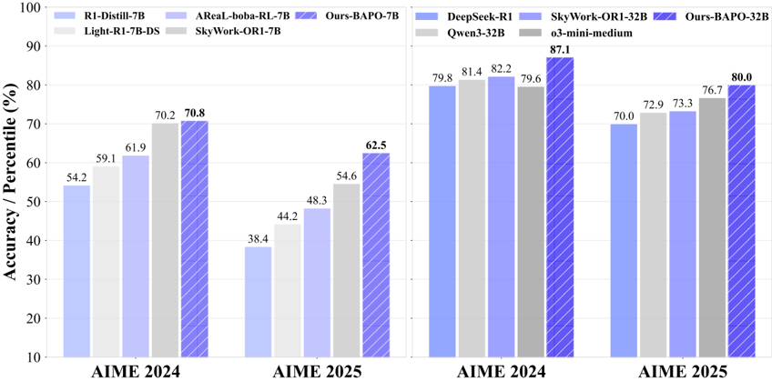

*Figure 1 | Performance of BAlanced Policy Optimization with Adaptive Clipping (BAPO).*

**② 方法 / 架构图**

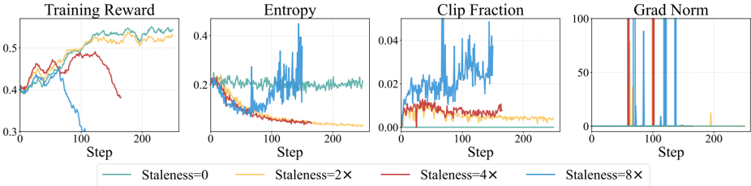

*Figure 2 | Preliminary results with different data staleness. As the staleness increases, the model suffers from unstable optimization, decreasing entropy, and even a sudden collapse in training.*

### 一眼看懂

- 🟦 TL;DR：用过期数据训 LLM 的 **off-policy RL**（rollout 行为策略 ≠ 训练目标策略,经验复用 experience replay / partial rollout）样本效率高、容忍 staleness,但数据越陈旧越容易**梯度爆炸 + 熵崩溃**（Fig.2:GRPO 在 staleness 0/2/4/8× 下熵骤降、grad norm 飙、训练崩）。BAPO 先诊断两个根因——(i) **负优势样本在数量和梯度贡献上都压倒正样本**;(ii) **固定对称裁剪系统性挡掉"增熵更新"**（Entropy-Clip Rule）——再据此**每个 batch 动态搜裁剪上下界 \((c_{\text{low}},c_{\text{high}})\)**，让"正 token 对策略梯度损失的贡献占比"达到目标 \(\rho_0\)，从而既防爆炸又保熵。
- 最巧的一步：**把"正 token 贡献占比 \(\ge\rho_0\)"当作可观测的自适应调节目标（§4.2 Eq.8）**。抽掉它,BAPO 就退回 DAPO 式的固定非对称裁剪——而 §4.1 验证实验恰恰说明固定阈值"僵硬、需手调、缺乏适应"（"relatively rigid and manually specified"）。是这个"占比目标 + 动态搜界"让裁剪窗能 per-batch 自调,省掉手工调参。

### 为什么做

- 研究背景：RL 已是对齐/强化 LLM（推理 Guo 2025、代码 Anthropic 2025、agentic Bai 2025-Kimi K2）的核心范式。其中 **off-policy RL**（Arnal 2025、Roux 2025）样本效率高、容忍 staleness,契合现代基础设施（**partial rollout**:超长轨迹切段、超 budget 的部分存 replay buffer 后续续跑,Fu 2025 / Kimi Team 2025）,适合超长/难任务（§1）。
- 解决的具体痛点：直接把 off-policy RL 套到 LLM 上,随 staleness 增大出现**优化不稳、梯度爆炸、甚至崩溃,同时策略熵骤降**（Fig.2 用 GRPO 复现:staleness↑ → 熵降更剧、被裁 token 更多、训练更不稳）;on-policy 则全程稳定。已有非对称裁剪（Clip-Higher/DAPO-Yu 2025、Asymmetric REINFORCE-Arnal 2025、target-entropy-He 2025、80/20 高熵 token-Wang 2025a、DCPO-Yang 2025b）**靠手动固定阈值**,僵硬。
- 相关工作 & 各自不足（§6）：
  - **DAPO/Clip-Higher（Yu 2025）**——把裁剪上界设 1.28,纳入更多低概率正 token、稳熵;但**只放宽上界、不抑制负 token 主导**,且固定阈值。
  - **高熵 token 子集（Wang 2025a）**——只训 top20% 最高熵 token 保探索;**target-entropy（He 2025）**——把熵拉到目标值。思路相近但**各自固定策略**。
  - **熵稳定性系列（Cui 2025、Cheng 2025 entropy perspective、Liu 2025、Zheng 2025）**——系统研究怎么维持熵稳定。
  - **off-policy 非对称裁剪（Roux 2025、Arnal 2025）**——引入非对称裁剪平衡正负奖励。
  - **最像的 DCPO（Yang 2025b）**——按 **token 先验概率**调 **token 级**裁剪;但 BAPO 自称取"**整体优化视角**":从损失贡献失衡 + Entropy-Clip Rule 出发动态调**全局**裁剪界,且做了更大规模实验。
- 动机链（§3 实证 + 理论双线）：现状（off-policy RL 高效但 LLM 上易崩）→ **诊断一(失衡)**：§3 Fig.4 显示正样本在数量和损失贡献上都是少数,归因两点——难题上轨迹更长→负样本 token 更多（Fig.6 负样本平均长度更长）+ 训练早期能力不足→负样本比例高;且低概率负 token 累积（\(\pi_\theta(y_t)\to0\) 使 log 项→\(-\infty\)）触发梯度爆炸 → **诊断二(熵崩)**：推导 Entropy-Clip Rule（见下）→ §4.1 验证实验（Fig.7:增 \(c_{\text{high}}\) 纳入低概率正 token 提性能+抑熵降;放宽 \(c_{\text{low}}\) 纳入低概率负 token 反而降性能+加速熵崩）→ "用占比目标驱动的自适应裁剪"。为什么不用固定非对称裁剪？§4.1 试过 Clip=[0.8,1.5]/[0.8,1.2]/[0.5,1.2]——僵硬、需手调、单一阈值不能 per-batch 适应难度变化。
- 与最近邻工作的Δ：vs DAPO/Clip-Higher——BAPO **同时**动态调上下界（\(c_{\text{high}}\) 纳入低概率正 token 增熵、\(c_{\text{low}}\) 过滤低概率负 token 防爆炸）,且由"正 token 贡献占比 \(\rho_0\)"自适应驱动而非固定;vs DCPO——从损失贡献失衡的**全局视角**调全局裁剪界,并配 **Entropy-Clip Rule** 理论。关键点:把"该裁多少"从手工超参变成"满足贡献占比"的可搜索量。

### 怎么做 + 靠不靠谱

> 基础设定（§2）：prompt \(x\)，response \(\boldsymbol y=(y_1,\dots,y_T)\)，\(\pi_\theta(\boldsymbol y\mid x)=\prod_t\pi_\theta(y_t\mid x,\boldsymbol y_{<t})\)。RL 目标 \(J(\theta)=\mathbb E_{x,\boldsymbol y\sim\pi_\theta}[R(x,\boldsymbol y)]\)，policy gradient \(\nabla_\theta J=\mathbb E[\sum_t\nabla_\theta\log\pi_\theta(y_t)\cdot A_t]\)。PPO 代理目标用 importance weight \(r_t=\frac{\pi_\theta(y_t\mid x,\boldsymbol y_{<t})}{\pi_{\theta_{\text{rollout}}}(y_t\mid x,\boldsymbol y_{<t})}\) 修正分布失配:
> \[ J_{\text{PPO}}(\theta)=\mathbb E_{x,\boldsymbol y\sim\pi_{\theta_{\text{rollout}}}}\Big[\textstyle\sum_{t=1}^T\min\big(r_t A_t,\ \mathrm{clip}(r_t,1-\varepsilon,1+\varepsilon)A_t\big)\Big]. \]

**【两条诊断的形式化】**

- **失衡（§3 Eq.5）**：把 PG 按正负 advantage 拆开,裁剪体现为指示函数——
  \[ \nabla J_{\text{PPO}}=\underbrace{\sum_{A_t>0}\pi_\theta(y_t)\,\mathbb I\{r_t<1+\varepsilon\}\,A_t\,\nabla\log\pi_\theta(y_t)}_{\text{正 token}}+\underbrace{\sum_{A_t<0}\pi_\theta(y_t)\,\mathbb I\{r_t>1-\varepsilon\}\,A_t\,\nabla\log\pi_\theta(y_t)}_{\text{负 token}}. \]
  上界 \(1+\varepsilon\) 把**低概率正 token（\(r_t\) 偏大）挡在外**,下界 \(1-\varepsilon\) 让低概率负 token 留下并累积。

- **Entropy-Clip Rule（§3 Eq.6,Appendix B 证明）**：熵变近似为对数概率与"裁后 advantage"的负协方差——
  \[ \Delta H(\pi_\theta)\approx -\eta\cdot\mathrm{Cov}_{\boldsymbol y\sim\pi_\theta}\big[\log\pi_\theta(y_t\mid x,\boldsymbol y_{<t}),\ A_t\cdot\mathcal X(y_t)+C\big], \]
  其中 \(C\) 为常数,\(\mathcal X(y_t)=1\) 当（\(A_t>0\) 且 \(r_t<1+\epsilon\)）或（\(A_t<0\) 且 \(r_t>1-\epsilon\)）即"该 token 未被裁",否则 0。**直觉**:更新"正高概率 + 负低概率"token 会**锐化分布、降熵**;更新"负高概率 + 正低概率"token 会**平滑分布、增熵**。Fig.5/10 实证:IS 权重偏离 1（极高或极低）的 token 往往是低概率 token 且高熵——固定对称裁剪 [0.8,1.2] 把大量低概率正 token 挡在外,**系统性排除增熵更新→熵持续下降→探索能力枯竭**。BAPO 据此扩 \(c_{\text{high}}\) 把这些正 token 放回来。

**【BAPO 算法流水线（§4.2 Algorithm 1）——读完可复现】**

1. **采样**：更新 rollout 策略 \(\pi_{\theta_{\text{rollout}}}\leftarrow\pi_\theta\);从第 \(s\) 个 batch 采 \(G\) 条 response \(\{\boldsymbol y_i\}\sim\pi_{\theta_{\text{rollout}}}(\cdot\mid x)\);算 reward 与 advantage（GRPO group-relative）。
2. **对每个 staleness 层动态搜裁剪界**（核心循环）：初始化 \(c_{\text{low}}=a^-,\ c_{\text{high}}=a^+\);**while（正 token 贡献 \(\rho<\rho_0\) 且 \(c_{\text{low}}+\delta_2\le b^-\)）**：若 \(c_{\text{high}}+\delta_1\le b^+\) 则 **先增 \(c_{\text{high}}\)**（步长 \(\delta_1\)）,到顶后再增 \(c_{\text{low}}\)（步长 \(\delta_2\)）。目标占比定义（**Eq.8**）：
   \[ \frac{\big|\sum_{A_t>0}\pi_{\theta_{\text{rollout}}}(y_t)\cdot\min(r_tA_t,\mathrm{clip}(r_t,0,c_{\text{high}})A_t)\big|}{\big|\sum_{A_t}\pi_{\theta_{\text{rollout}}}(y_t)\cdot\min(r_tA_t,\mathrm{clip}(r_t,c_{\text{low}},c_{\text{high}})A_t)\big|}\ \ge\ \rho_0. \]
   即"正 token 对 PG 损失的贡献绝对值 / 全部 token 的贡献绝对值"要达到 \(\rho_0\)。

3. **更新**：用搜到的 \((c_{\text{low}},c_{\text{high}})\) 跑非对称裁剪的 PPO/GRPO 目标
   \[ J_{\text{BAPO}}(\theta)=\mathbb E_{\boldsymbol y\sim\pi_{\theta_{\text{rollout}}}}\Big[\textstyle\sum_t\min\big(r_tA_t,\ \mathrm{clip}(r_t,c_{\text{low}},c_{\text{high}})A_t\big)\Big]. \]

- **逐组件必要性（§4.1 Fig.7 验证 + §4.3 Fig.8/9 训练动态）**：
  - **\(c_{\text{high}}\) 上调**——Fig.7（Clip=[0.8,1.5] vs [0.8,1.2]）:纳入低概率正 token **提性能 + 抑熵降**。
  - **\(c_{\text{low}}\) 上调（收紧下界过滤负 token）**——Fig.7 反向验证:放宽 \(c_{\text{low}}\)（[0.5,1.2]）反而**降性能 + 加速熵崩**,所以方向是"收紧下界过滤低概率负 token"。
  - **\(\rho_0\) 目标**——Fig.8 显示训练中上下界都在波动（证确实自适应,不是固定值）;**防熵失控**（设正 token 目标占比、避免熵无控增长）+ **防 tail degradation**（过拟合易题却答不了难题,Ding 2025）。
  - 三重收益（§4.2 原文）:①平衡正负贡献防爆炸;②纳入低概率正、过滤低概率负→保熵;③设占比上限→防正 token 淹没损失 + 防 tail degradation。
- **关键机制/公式（直觉）**：见上 Entropy-Clip Rule。机制图 Fig.3:GRPO 对称固定裁剪 → 强化高概率正 + 过罚低概率负 → 分布锐化、熵崩;BAPO 按正 token 损失贡献动态调 \(c_{\text{high}}/c_{\text{low}}\) → 排掉过负 token、放回被裁的正 token → 分布更平滑、熵稳。与 prior work 的连接（§4.3）:Clip-Higher（1.28）、80/20 高熵 token、target-entropy 都可视为"用某种方式纳入低概率正 token / 稳熵"的特例。
- **实验与证据（§5）**：RL 数据 **SkyWork-OR1-RL-Data**;评测 **AIME24/25**（16 rollouts 平均）。backbone:R1-Distill-Qwen-7B/32B、OctoThinker-Llama3.2-3B-Long-Zero,外加自训两个 SFT 起点 **BP-Math-7B/32B**（Qwen2.5-Math 微调）。
  - **主表 Table 1**：BP-Math-7B(BAPO) AIME24/25 = **70.8/62.5**（超 SkyWork-OR1-7B 70.2/54.6,AIME25 **+7.9**;超自家 GRPO 起点 69.2/59.2）;BP-Math-32B(BAPO) = **87.1/80.0**（超 Qwen3-32B 81.4/72.9 即 +5.7/+7.1、超 SkyWork-OR1-32B +4.9/+6.7;超 DeepSeek-R1-671B 79.8/70.0 即 +7.3/+10.0;比肩 o3-mini-medium 79.6/76.7）。
  - **Llama（Table 2）**：GRPO→BAPO,AIME24 2.5%→5.4%、AIME25 2.9%→5.8%、MATH 58.4%→66.0%。
  - **稳定性**：不同 staleness（Fig.11:staleness 2/4 下均超 baseline 与 clip-higher）、partial rollout（Fig.12:budget 2k/4k 下 reward 更高、熵更稳）均比 GRPO 稳。
- **假设与失效边界**：【原文】超参 \(\rho_0=0.4\)、可移动区间 \(a^-=0.6/b^-=0.9/a^+=1.2/b^+=3.0\)、步长 \(\delta_1=0.05/\delta_2=0.02\)"**未精调**"（§5.1,原文 "not finely tuned"）;预备/验证用 R1-Distill-7B、max len 8k、lr \(2\times10^{-6}\)、temp 0.6;BP-Math 主实验 max len 64k;评测 16 rollouts 平均。【推断】**核心评测只在 AIME24/25 两个小测试集**,Llama 才补 MATH,泛化证据弱;与 SkyWork 的对比依赖自训强起点 BP-Math,且 BAPO 相对自家 GRPO 在 32B 上增益小（AIME24 84.6→87.1）,削弱"方法本身"的归因;\(\rho_0\)/区间/步长的鲁棒性未系统扫描。
- **祛魅总结**：【推断】真贡献是 **Entropy-Clip Rule 这条把"裁剪→挡增熵更新→熵崩溃"讲通的理论** + "用正 token 贡献占比作自适应目标"这一干净的工程化。被包装的是算法增量——它与既有非对称裁剪家族（Clip-Higher/KL-Cov/CE-GPPO/80-20/DCPO）**同源**,新意主要在"占比驱动 + 理论解释"。主结果用"超 DeepSeek-R1/o3-mini"做标题党,但那部分靠强 SFT 起点 BP-Math。**重要不一致**：旧 analysis 核查指出**开源代码 `recipe/bapo/policy_loss.py` 的搜索顺序与论文 Algorithm 1 相反**（代码先调 \(c_{\text{low}}\) 再 \(c_{\text{high}}\);论文先 \(c_{\text{high}}\) 后 \(c_{\text{low}}\)）,且代码含 dual-clip（clip_ratio_c=3.0,对应论文 \(b^+=3.0\)）——复现以代码为准,但这是方法描述与实现的不一致。

### 结构化抽取

- 🎯 机制速览6轴：**学什么信号**=token 级 advantage（GRPO group-relative）+ 正/负 token 对策略梯度损失的贡献占比（用于调裁剪界）｜**改什么**=策略参数 + **裁剪上下界 \((c_{\text{low}},c_{\text{high}})\) 这一优化超参**（per-batch 动态搜索）｜**何时改**=在线 per-step（每 batch 搜界 + 更新）｜**免梯度?**=否（PPO/GRPO 梯度上升）｜**记忆-技能生命周期**=不适用｜**防遗忘机制**=不适用（间接:保熵防探索退化/tail degradation,但非持续学习意义的防遗忘）
- ⑦ 开源代码+框架/harness：https://github.com/WooooDyy/BAPO （旧 analysis 记已 clone 约 5.2MB）。框架=**veRL**，以 **GRPO** 为基础算法（`python -m verl.trainer.main_ppo` 主循环,方法在 `recipe/bapo`）。【待核】仓库默认 config（`bapo_trainer.yaml`/`run_bapo_example.sh`）是**示例值非论文值**（旧 analysis 已核:adv_ratio_target=1、ratio_lower 0.6→0.8 等）,复现论文数字需手动改回论文超参（\(\rho_0=0.4,a^-=0.6,b^-=0.9,a^+=1.2,b^+=3.0,\delta_1=0.05,\delta_2=0.02\)）;且代码搜索顺序与 Algorithm 1 相反（见祛魅）。本次基于 PDF 重写未重新进仓核对。
- 💰 资源/成本与可扩展性：【原文】预备/验证 R1-Distill-7B、max len 8k、lr 2e-6、temp 0.6;staleness 实验 SkyWork-OR1-RL、max len 32k;BP-Math 主实验 max len 64k。staleness 经 `ppo_epoch` 经验复用 + partial rollout 引入。每 step 多一次裁剪界搜索（轻量,在已算好的 advantage 上做,无额外前向）。
- 🎯 对"探索-巩固"对标：**竞品/边缘相关**。判定:BAPO 与 OPD/蒸馏**无直接关系**（纯 RLVR 裁剪稳定化）,对 TSRD 的价值是**间接借鉴**——其 Entropy-Clip Rule 解释了"为什么 off-policy/经验回放训练会熵崩溃",这对 TSRD 若用 partial rollout / teacher 轨迹回放（off-policy 成分）时**保持探索性**有参考;"保正 token、过滤负 token"的占比思想也可类比"巩固有效路径、不过度惩罚走偏分支"。**缺口**:信用分配仍是 outcome 级 group advantage（同轨迹所有 token 同一 \(A\)）,无 step/path 级,无蒸馏/teacher 脚手架/记忆,无 MTP。
- 🔭 开放问题/未来方向：【原文】"为 LLM RL 社区提供关键洞见"（§7,未给具体 future work）。【推断】\(\rho_0\)/区间/步长的自适应或学习化;扩到更广基准（非 AIME）;把 Entropy-Clip Rule 用于 agentic/multi-turn 的熵管理;统一代码与论文 Algorithm 1 的搜索顺序不一致。

---

## From Reasoning to Agentic: Credit Assignment in Reinforcement Learning for Large Language Models

> **`ca_survey`** ｜ Chenchen Zhang（独立研究者,单作者 survey） ｜ 2026-04（arXiv:2604.09459v2，cs.CL） ｜ 主题线 L3 RLVR/信用分配（综述）·相关性 中 ｜ [📄 原始论文](https://arxiv.org/abs/2604.09459)

### 关键图示

**① Motivation / 对比图**

*Figure 1: Evolution of RL for LLMs and the corresponding credit assignment challenges. Each phase introduces longer trajectories, more complex environments, and harder credit assignment problems. The shift from reasoning to agentic RL represents a qualitative leap in CA difficulty.*

**② 方法 / 架构图**

*Figure 2: Two-dimensional taxonomy of credit assignment methods for LLM RL, organized by assignment granularity (vertical) and computational methodology (horizontal). Blue: primarily reasoning RL; Red: primarily agentic RL; Purple: multi-agent. The dashed arrow indicates the evolutionary trend from*

### 一眼看懂

- 🟦 TL;DR：一篇以"**信用分配(credit assignment, CA)**"为中心透镜重审 LLM RL 的综述。CA = 把稀疏的 outcome 奖励分配到具体 token/segment/step/turn/agent。核心产物:把 2024–2026 初的 **47 篇方法（41 core + 6 adjacent enabler）**按**粒度 × 方法学二维分类**（Fig.2/3）,配机器可读清单、reporting checklist、benchmark 协议 + 方法选择决策树。判断:reasoning CA 正成熟化（收敛到 PRM + critic-free group comparison）,agentic CA 催生真正新方法（hindsight counterfactual、privileged asymmetric critic、turn-level MDP）。
- 最巧的一步（综述层面）：**"PRM 本质就是 CA"这一概念澄清（§2.5 boxed）**——把 PRM 文献（Math-Shepherd/OmegaPRM/PURE）和 CA 文献（VinePPO/SPRO/SCAR）统一成"同一问题的两个视角"。抽掉这个统一视角,整篇就只是方法罗列;正是它让"reasoning CA 已成熟"的判断站得住（PRM 密集=step 级 CA 密集）。

### 为什么做

- 研究背景：LLM RL 两波——**reasoning RL**（DeepSeek-R1/o1,单条 CoT \(L\sim10^3\)–\(3\times10^4\) token,1 turn,纯 outcome 奖励）→ **agentic RL**（多轮环境交互,\(T\sim10\)–\(100+\) turn,\(L\sim10^5\)–\(10^6\) token,稀疏 terminal 奖励）。经典 RL 已有 CA 工具箱（TD/GAE、return decomposition RUDDER、hindsight HCA、counterfactual/difference reward）,是 LLM 方法的基础（§2.5）。
- 解决的具体痛点（survey 要填的 gap）：
  - ① **Episode 级方法（GRPO/REINFORCE）给每 token 同一 advantage**,轨迹一长就失效。多粒度动作层级(§2.2 Eq.1):\(\tau=[\text{Turn}_1,\dots,\text{Turn}_T]=[\text{Seg}_{1,1},\dots]=[a_{1,1,1},\dots]\)（Episode⊃Turn⊃Segment⊃Token）。GRPO advantage（§2.3 Eq.2）:
    \[ \hat A^{\text{GRPO}}_i=R(\tau_i)-\frac1G\sum_{j=1}^G R(\tau_j), \]
    每 token 同一 \(\hat A_i\)。reasoning RL（\(L\sim10^3\)，1 turn）尚可（关键决策少）;agentic RL（\(L\sim10^5\)，100+ turn）把"选对 API"和"格式化输出"赋同样信用 → 信噪比崩。形式化:REINFORCE 梯度方差 \(\propto(R(\tau)-b)^2\)，同一 baseline 用于全 \(T\) 动作时总方差 \(O(T\cdot\mathrm{Var}[R])\)，**\(T=100\) 时每动作信噪比约差 100×** → "echo trap"（Wang 2025d:agentic 模型在 episode 级信用下收敛到重复行为）。

  - ② **agentic 使 CA 双层级化**（先判哪个 turn 关键,再判 turn 内哪些 token 重要）+ 随机转移/部分可观测/超长 horizon。
  - ③ **现有相邻综述不够**（Pignatelli 2023 只覆盖经典 RL;Zhang 2025a agentic 100 页综述把 CA 当子话题）——**无人系统覆盖 reasoning+agentic 两个 regime 的 CA**。
- 相关工作 & 各自不足：见上③——要么只经典 RL,要么 CA 是附属,**缺专门、跨两 regime 的 CA 综述**。
- 动机链：现状（LLM RL 从 reasoning 演进到 agentic,CA 是核心难题）→ 缺陷（无统一 CA 透镜的综述 + episode 级方法在长 horizon 失效）→ 做专门 CA 综述 + 可复用产物（清单/checklist/benchmark 协议/决策树）。
- 与最近邻工作的Δ：vs Pignatelli 2023（前 LLM CA）——补 LLM 时代;vs Zhang 2025a（agentic 综述）——以 CA 为唯一透镜并跨 reasoning+agentic,且论证"为何 agentic 比 reasoning 的 CA 更难、催生哪些新技术"。关键点:把所有方法（含 PRM）都拉到"如何把稀疏奖励分配到动作"这一统一问题下。

### 怎么做 + 靠不靠谱（= taxonomy 与覆盖）

**【二维正交分类（§2.4,核心贡献,Fig.2 网格 / Fig.3 层级树）】** 覆盖 2024-01~2026-04 的 47 篇（41 core + 6 adjacent）。

- **粒度轴（在什么层级分配信用）**:**Token**（生成内单个 token）/ **Segment**（语义跨度,如一个推理步）/ **Step-Turn**（一个完整 LLM 响应或工具调用周期）/ **Multi-Agent**（协作 agent 间分解）。
- **方法学轴（如何算信用）**:**Monte Carlo (MC)**（从中间状态 rollout）/ **Temporal Difference + value**（学值函数 + bootstrap,GAE）/ **Model-based / LLM-as-Critic**（LLM 自身给中间状态自然语言评价,**论文强调它无经典 RL 对应、是 LLM-native 新轴**）/ **Game-theoretic**（Shapley、counterfactual baseline）/ **Information-theoretic**（信息增益、熵）。

**【方法填格（Fig.2/3,真实条目）】**

- **Reasoning RL**:Token 级——VinePPO(MC)、RED(redistribution)、T-REG(self-gen)、From r to Q*(implicit);Segment 级——SPO(MC)、SCAR(Shapley)、TEMPO(tree-TD);Step 级——PURE(PRM/min-form)、SPRO(masked adv)、CAPO(LLM-critic)、HICRA(hierarchy,planning vs procedural)、PRL(entropy)、InT(intervention)、FinePO(fine PRM)、ACPO(attribution)。
- **Agentic RL**:Turn-level PRM——AgentPRM(TD+GAE)、SWEET-RL(privileged asymmetric critic)、Turn-PPO(turn MDP)、SORL(bias-corr)、TARL(LLM-judge)、ITPO(implicit);Hindsight/Counterfactual——HCAPO(hindsight+generative verification)、C3(LOO)、CCPO(causal)、CriticSearch(retrospective);Critic-Free/Step——GiGPO(group-in-group)、POAD(action decomp)、CARL(entropy)、iStar(implicit DPO)、IGPO(info-theoretic);Hierarchical——ArCHer(TD hierarchy/off-policy critic)、PilotRL(progressive)、StepAgent(IRL)。
- **Multi-Agent**:M-GRPO(hierarchical)、SHARP(Shapley)、MAPPA(per-action PRM)、Dr.MAS(agent-wise adv)、LLM-MCA(LLM-critic)、QLLM(LLM-gen)。
- **Adjacent enablers（6 篇,#36–41）**:SPA-RL、Agent Lightning、RAGEN、SCRIBE、PRS、AdaptSeg。

**【经典→LLM 映射（§2.5）】**

- **TD/GAE**:\(\hat A^{\text{GAE}(\gamma,\lambda)}_t=\sum_{l=0}^\infty(\gamma\lambda)^l\delta_{t+l},\ \delta_t=r_t+\gamma V(s_{t+1})-V(s_t)\) → learned critics（ArCHer、AgentPRM）。
- **return decomposition（RUDDER）**:\(c_t=\hat R(s_{0:t})-\hat R(s_{0:t-1})\) → reward redistribution（RED token 级、SPA-RL MLP 进度、IGPO 信息增益）。
- **hindsight（HCA）**:用未来结果重估过去动作 → retrospective（HCAPO 基于 generative verification）。
- **counterfactual / difference reward**:与默认动作对比 → leave-one-out（C3、CCPO turn 级 LOO）与 Shapley（SCAR）。
- **唯一无经典对应的是 LLM-as-Critic**（LLM 给中间状态自然语言评价,Xie 2025/Zhou 2025/Qu 2025）。
- **PRM=CA（§2.5 boxed)**:PRM 给每步 \(r_i\) 打分 = 对 terminal \(R(\tau)\) 做 step 级分解 → PRM 文献(Math-Shepherd/OmegaPRM/PURE) 与 CA 文献(VinePPO/SPRO/SCAR) 是同一问题两视角。
- **RL 算法的 CA 谱（§2.6)**:REINFORCE/GRPO=episode 级（最粗,GRPO 用 group baseline \(\hat A_i=R(\tau_i)-\frac1G\sum_j R(\tau_j)\) 免 critic）;PPO=token 级 via learned critic（细但近似,值网难训）;DPO=隐式 token 级（"From r to Q*" 证 DPO 隐学 token Q 值,iStar/ITPO 据此抽 step 信用）;RLOO/REINFORCE++=仍 episode 级。

**【综合判断（覆盖范围/gaps,对应"实验与证据"）】**

- **reasoning CA 正收敛到 process reward model + critic-free group comparison（成熟化,evidence [SE]）**;**agentic CA 催生真正新方法——hindsight counterfactual(HCAPO)、privileged asymmetric critic(SWEET-RL)、turn-level MDP 重构(Turn-PPO),无 reasoning RL 先例（[LS]）**。Fig.2 网格直观显示方法从 reasoning（左上密集,token/segment 细粒度）→ agentic（右下,step/turn 粗但环境感知）迁移;**step/turn 级聚类最密**（LLM agent 自然粒度）;**multi-agent 与超长 horizon 最薄弱**。五条 takeaway 都标了 evidence level（[SE]强实证/[LS]有限但暗示/[AS]作者综合）。
- **§7 systematic comparison**:按计算成本/是否需辅助模型/适用场景/实证性能比较各方法（含 GRPO-family meta-comparison）。
- **三类可复用产物**:① **机器可读 47 方法清单**（taxonomy 标签/baseline family（G/P/D/O/T）/evidence level（S/L/A）/主 benchmark,将以 CSV/JSON 发布,§B Table 10）;② **reporting checklist**（§C Table 11,已对 HICRA/GiGPO/M-GRPO 三篇验证找系统 gap:0/41 报 GPU-hours、2/41 报方差/CI、0/41 有 compute-controlled baseline）;③ **benchmark 协议规范**（任务族、元数据要求、**controlled bifurcation tasks** 受控分叉任务）+ **方法选择决策树**（Fig.4/Table 8,§9）。
- **假设与失效边界（§9.4 自陈局限）**：【原文】**单作者**（所有筛选/分类/evidence 编码单人执行,释出 screening log 供核验）;preprint 易变（snapshot 2026-04,方法/结果/标题可能变）;cross-paper 数字非受控对比;core/adjacent 与 reasoning/agentic 边界有判断空间;multi-agent CA、超长 horizon、exploration 与 credit 互作用是开放前沿。【推断】部分被引方法（2026 的 HCAPO/C3/CCPO 等,3 篇 counterfactual 同一周 2026-03 出）极新、evidence level 参差,"成熟化"判断对早期方法可能偏乐观;机器可读清单"发表时发布",截 snapshot 未必齐全。
- **祛魅总结**：【推断】真贡献是 **"PRM=CA"的统一透镜 + 跨 reasoning/agentic 的二维分类网格 + 可复用产物（清单/checklist/决策树）**,对快速定位方法、选 baseline、找相邻工作很实用。要祛魅的是:**它是索引+分类+标准化提案,无新方法、无新实验**;"reasoning CA 已成熟"这类判断是综述作者的归纳判断（单作者、对极新方法可能乐观,且已标 evidence level 自陈不确定性）;机器可读清单截 snapshot 未必齐全;仓库是 living list 已超出论文 snapshot。

### 结构化抽取

- 🎯 机制速览6轴（对综述=其 taxonomy 覆盖的机制谱）：**学什么信号**=覆盖全谱——outcome 奖励再分配到 token/segment/step/turn/agent（MC rollout / TD value / LLM-critic 评价 / Shapley-counterfactual / 信息增益-熵）｜**改什么**=综述对象多为"改 advantage/reward 的分配"（policy gradient 的信用）,含 learned critic / PRM / group baseline｜**何时改**=覆盖 in-training（per-step/per-turn 的 CA 计算）｜**免梯度?**=不适用（综述本身）;覆盖的方法多为梯度 RL,少数 critic-free（group comparison）｜**记忆-技能生命周期**=不适用（但 §9.3 提"CA 与 memory":对存储/检索/更新 summary 等记忆动作如何分信用是开放问题,需类比 eligibility trace 扩到语义记忆）｜**防遗忘机制**=不适用
- ⑦ 开源代码+框架/harness：列表 https://github.com/xxzcc/Awesome-Credit-Assignment-in-LLM-RL （旧 analysis 已核:旧 KEYS 的 `xxzcc/Awesome-Credit-Assignment` 是 404,此为正确仓库名;MIT,living list,2026.05 又加 agentic/coding-agent/uncertainty-control/multi-agent 新论文）。内容=`README.md`（分类表）+ `gen_figures.py`（生成 taxonomy 网格图与树图）+ `assets/`。**框架=不适用**——是论文清单 + 分类可视化脚本,非训练代码。【待核】仓库细节复用旧 analysis 核查;机器可读 CSV/JSON 清单论文称"发表时发布",需留意是否已上传。
- 💰 资源/成本与可扩展性：原文未说明（综述无训练）。§7 做 systematic comparison（按计算成本/是否需辅助模型/适用场景/实证性能比较各方法,含 GRPO-family meta-comparison）;§9.2 提出"**computation-signal trade-off / CA efficiency frontier**"——固定算力下"更多 rollout + 粗 episode 信用(GRPO)" vs "更少 rollout + 细信用(VinePPO/HCAPO)",猜测随轨迹变长应偏向细信用,但无系统答案。
- 🎯 对"探索-巩固"对标：**索引/定位工具（上位框架）**。判定:CA（把稀疏 outcome 奖励分配到 token/step/turn）正是 TSRD"path-selection / path-recovery 细粒度信用分配"的**上位框架**——TSRD 的"单点接管/在关键步给信号"本质是 step/segment 级 CA。**可借**:① 用其二维分类（粒度×方法学）给 TSRD 定位（属 step/segment 级 + LLM-as-Critic 或 counterfactual 一类）;② 从其 47 篇里挑 baseline（如 VinePPO/SPO/SCAR/PURE/HICRA/HCAPO/SWEET-RL/GiGPO）与相邻工作;③ §9 benchmark 协议的 **controlled bifurcation tasks（受控分叉任务）** 思想很契合"选路/回轨"的评测设计;④ reporting checklist 可用于自查 TSRD 论文（报 GPU-hours/方差/compute-controlled baseline）;⑤ §9.2 "CA 与 exploration 结合"（IGPO 用信息论框信用,信用最不确定处正是该探索处）与 TSRD 选路高度相关。**缺口**:本身不涉及蒸馏/OPD/MTP/path-recovery 的具体机制,只是地图不是方法。
- 🔭 开放问题/未来方向：【原文】(§9) multi-agent credit（可扩展分解/通信信用/部分可观测）、超长 horizon CA、exploration 与 credit 互作用、CA-memory、reasoning→agentic 技术迁移（VinePPO vine 扩到 turn 边界、PURE min-form 扩 turn-PRM、HICRA planning-procedural 扩 agentic）、formal guarantees（多数方法无收敛保证,仅 VinePPO/PURE/CCPO 有部分）是开放前沿;给 roadmap（Classical RL → Reasoning RL → Agentic RL → Future Multi-Agent）。【推断】把"controlled bifurcation tasks"做成标准 path-selection/recovery 评测;统一 PRM 与蒸馏 token 级信号在 CA 框架下;MTP 前瞻作为一种新的 CA 信号（用未来 token 可预测性给当前步分配信用,可纳入 information-theoretic 轴）。

---

## Context Bootstrapped Reinforcement Learning (CBRL)

> **`cbrl`** ｜ UC Santa Barbara + Cisco Research（Saaket Agashe、Jayanth Srinivasa、Gaowen Liu、Ramana Kompella、Xin Eric Wang） ｜ 2026-03-19 · arXiv preprint v1 · cs.LG ｜ 主题线 L3（RLVR/GRPO）兼 L6（探索引导）·相关性 高 ｜ [📄 原始论文](https://arxiv.org/abs/2603.18953)

### 关键图示

**① Motivation / 对比图**

*Figure 4. Training reward curves for CBRL and baseline across three settings: Q Programming with GRPO (left), Word Sorting with GRPO (center), and Word Sorting with RLOO (right). Shaded regions indicate pi > 0.25 (high injection). CBRL achieves higher early reward by guiding the model toward success*

**② 方法 / 架构图**

*Figure 1. Overview of the Context Bootstrapped Reinforcement Learning (CBRL) framework. (a) The injection probability annealing schedule. At each timestep t , training batches consist of samples without few shots and samples with few shots, with the proportion governed by pi , which decreases linear*

### 一眼看懂

- 🟦 TL;DR：RLVR 的死穴是"探索低效"——模型在新推理模式/陌生领域里几乎产不出正确 rollout，一组全错则 GRPO 组内优势坍缩为 0、无梯度、卡在 reward 平台期【原文 §1 L23-27, §5.1 L468-471】。CBRL 的做法极简：把 few-shot 示范当"临时脚手架"，训练早期以高概率（\(p_{\text{start}}\approx0.5\)）随机前置到 prompt 帮模型蒙对、拿到学习信号，再按线性课程把注入概率退火到 0，逼模型把推理模式"内化"而非依赖示范【原文 §2, Algorithm 1】。只改训练**输入分布**，不动 RL 目标/损失/优化器，故算法无关、推理零开销【原文 §2.4 L141-146】。
- 最巧的一步：**退火到 0 这一步**。如果一直注入示范（\(p\) 恒定），模型会学成"有示范才会做题"，测试时（无示范）就垮；论文明说"If examples appeared on every prompt, the policy might learn to depend on their presence rather than internalize the demonstrated reasoning patterns"【原文 §2.2 L99-101】。退火 = 隐式课程，把"被引导→独立"压成一条单调下降的概率曲线。抽掉退火，CBRL 退化成普通 few-shot 注入，丧失"内化"主张的核心支撑（Figure 4"退火后不崩"的证据也就无从谈起）。

### 为什么做

- 研究背景：RLVR（可验证奖励强化学习，Lambert/Tülu-3 2024；DeepSeek-R1 2025）已是推理后训练主流，二元 verifier 奖励在数学/代码/工具调用上推动显著进展；GRPO（Shao 2024）用组内归一化去掉 value 网络成为事实标准算法，并被证明能诱发"aha moment"式自反思；后续 zero-RL（SimpleRL-Zoo、DAPO、Liu r1-zero 批判）直接在 base 模型上跑 RLVR 不做 SFT 预热【原文 §1 L18-22, §5.1 L454-467】。
- 解决的具体痛点：当模型可靠产不出正确 rollout 时学习信号极弱（slow/failed convergence）；领域在预训练里欠表示（小众编程语言如 Q）或需要全新推理模式时尤其严重——**一组 rollout 全错→组优势=0→零梯度**（论文把这条机理写得很直白）【原文 §1 L23-27, §5.1 L468-471】。
- 相关工作 & 各自不足【原文 §5.2 L472-494】：把"救活探索"的现有路线分三类——
  - (i) **mixed-policy training**（RL 中交错 SFT 或把部分 on-policy rollout 替换成高质量 off-policy 轨迹，Yan/LUFFY、Zhang）：LUFFY 用"regularized importance sampling"在引入 off-policy 推理轨迹的同时保留自驱探索；但"over-reliance on off-policy data can misguide policy updates toward non-generalizable solution paths"。
  - (ii) **partial supervision / hints**（给 ground-truth 解的片段救活失败 rollout：HINT、GHPO、BREAD）：在 rollout **中途**插入真值片段引导沿正确轨迹走；有效但仍是 off-policy 干预。
  - (iii) **curriculum**（E2H Reasoner 易到难、淡出简单题防过拟合；Absolute Zero 用 code executor 自演化课程并自验答案）：需难度估计或自生成题目等**外部基础设施**。
- 动机链：RLVR 探索低效→零样本无法 bootstrap 新模式→需注入引导；但持续注入会产生依赖→需退火撤除；为什么不用更简单现成做法——mixed-policy 破坏 on-policy 探索动力学、partial supervision 中途干预、curriculum 要外部设施——CBRL 用"ICL 当临时脚手架 + 一个线性退火"同时避开三者代价，且保持完全 on-policy（示范只进 prompt 上下文，不是要模仿的轨迹）【原文 §5.2 L487-494】。
- 与最近邻工作的Δ（论文逐条对照）：
  - vs mixed-policy：CBRL **fully on-policy**，"In-context examples serve as **context** rather than **trajectories to imitate**, preserving the exploration dynamics that enable robust generalization"【§5.2 L487-489】。
  - vs partial supervision：CBRL "does not intervene mid-rollout"，只在 prompt 前缀给完整示范，靠 native ICL 从一开始 bootstrap【§5.2 L489-491】。
  - vs curriculum：CBRL 在**固定分布**上跑 + 单一退火即构成"从被引导到独立"的隐式课程，无需难度估计/题目生成【§5.2 L492-494】。关键有用点：把"获取学习信号"与"破坏探索"解耦——前缀给整段示范不污染 rollout 中段的 on-policy 性。

### 怎么做 + 靠不靠谱

- 方法流水线（读完可复现）【原文 §2, Algorithm 1 L120-139】：三大组件 = ①few-shot 示范库 \(\mathcal{B}\)、②随机注入机制、③退火课程。逐步：
  1. **构造示范库** \(\mathcal{B}\)：每条 \(e\in\mathcal{B}\) 含问题 \(q\)、可选推理轨迹 \(r\)、答案 \(a\)，即三元组 \(\langle q,r,a\rangle\)；来源 = 专家示范 / 更强模型解 / 手工构造【§2.1 L70-73】。Reasoning Gym：每任务 20 条，答案程序化求解、推理由 **GPT-5.2** 生成；Q 编程：50 条**仅含代码、无推理注释**的已验证样本【§3.3 L225-232】。
  2. **每训练步设注入概率** \(p\leftarrow p_i\)（来自退火调度，下一步给公式）。
  3. **逐 prompt 注入**：对 batch 内每个 \(q_i\)，先从 \(\mathcal{B}\) 采 \(k\) 条示范 \(E_i\leftarrow\text{Sample}(\mathcal{B},k)\)，再掷 \(b_i\sim\text{Bernoulli}(p)\)，最后 \(x_i\leftarrow\text{Compose}(b_i,E_i,q_i)\)——若 \(b_i=1\)，把 \(k\) 条示范作为**前置的 user-assistant 对话轮**拼在目标 query 之前（Reasoning Gym 走 chat template，见附录 C.1.1 的 `[User]…[Assistant]<think>…</think><answer>…</answer>` 多轮格式；Q 编程走 raw prompt，把示范题面直接拼接）；若 \(b_i=0\)，只给目标 query + 空 assistant 轮【§2.2 L75-97, Alg.1 L5-10】。
  4. **rollout + 策略更新**：\(\mathcal{D}_t\leftarrow\text{RolloutBatch}(\pi_\theta,\{x_i\})\)，再 \(\pi_\theta\leftarrow\text{PolicyUpdate}(\pi_\theta,\mathcal{D}_t)\)。**奖励只对生成的响应计算**（示范本身不进 reward、不进 loss）【§2.2 L76-77, Alg.1 L11-13】。
  5. **推理时** \(p=0\)、不注入、零额外开销【§2 L67-68】。
- 关键公式（直觉 + 真实形式）：
  - **线性退火调度**（论文唯一显式公式，eq.1）：
    \[
    p_i \;=\; p_{\text{start}} \;+\; \frac{t-1}{T-1}\,\bigl(p_{\text{end}}-p_{\text{start}}\bigr)
    \]
    其中 \(p_{\text{start}}\) 为初始注入概率（典型 0.5~1.0），\(p_{\text{end}}\) 为终值（典型 0.0），\(T\) 为总训练步数，\(t\) 为当前步【原文 §2.3 L103-107】。直觉：一条从 \(p_{\text{start}}\) 线性降到 \(p_{\text{end}}\) 的直线；**退火率随 \(T\) 自动适配任意训练预算**（"automatically adjusts to any training budget \(T\)"）【§2.3 L115-116】。

  - **底层 RL 目标未被改动**（论文不写 GRPO 公式，明示"without altering the underlying RL objective, loss functions, or optimization procedure"【§2.4 L141-143】）；【推断】GRPO 优势仍是组内归一化 \(\hat A_i=(r_i-\text{mean}(\mathbf r))/\text{std}(\mathbf r)\)，CBRL 只换了产生 \(r_i\) 的 prompt 分布——这正是"算法无关"的技术根据。
  - 核心直觉一句话：示范提供的不是"照抄目标"而是"怎么开始尝试"的引导，所以保持 on-policy 探索动力学不被破坏。
- 逐组件必要性：
  - **stochastic 注入（Bernoulli 而非每条都给）**：负责"即便早期也强制独立尝试"，没它模型会学成依赖示范【§2.2 L98-101】。无单独消融，但理由论述清晰。
  - **退火课程**：负责"内化而非依赖"，有 Figure 4（三个 setting 下退火到 0 后性能不崩）+ Figure 3（注入概率消融）双重支撑【§4.2 L317-363】。
  - **初始注入概率 \(p_i\)**：Figure 3 在 ARC-1D（500 步）上做了消融——倒 V 形，\(p_i=0.5\) 峰值（success 0.31），\(p_i=0\)（0.26）、\(p_i=1.0\)（0.23）都更低；过高压制自身探索、过低脚手架不足【§4.2 L433-438】。**这是论文唯一的定量消融**。
  - **bank 采样策略（均匀 vs tag 过滤）**：Reasoning Gym 均匀采样；Q 编程**按 tag**（Array / Dynamic Programming 等）过滤出与当前训练题共享标签的子集后再采【§3.3 L227-232】。没做"均匀 vs 过滤"的对照消融。
- 实验与证据【原文 §4】：
  - **数据集/设置**：Reasoning Gym 5 任务（ARC-1D / Manipulate Matrix / Spell Backward / Word Sorting / Puzzle-24，程序化生成、可控 seed、无限训练数据），骨干 Qwen2.5-3B-Instruct（近零基线，受控）+ Llama-3.2-3B-Instruct（跨族验证）；Q Programming（Hogan 2025 的 678 题 LeetCode 式，542 训/136 测，含 array/search/sort/DP），骨干 **QQwen-7B-Pretrain**（在 Q 语料上预训过的 Qwen，起点更强但 RLVR 前 Q 能力仍弱）【§3.1-3.2 L153-211】。
  - **主结果（Table 1）**：全 10 个 model-environment 对都超 GRPO-only，增益 +1.3%（Spell Backward, Llama 95.67→97.00）~ +22.3%（Word Sorting, Qwen 53.33→75.67）。Qwen 最大增益 Word Sorting（+22.34）、Puzzle-24（48→60.67, +12.67）；Llama 在 ARC-1D（17→25, +8.0）、Manipulate Matrix（3.33→8.33, +5.0）。
  - **Q 编程（Table 2）**：Avg Pass 27.3→43.0%，Success(Pass@1) 5.0→26.3%。值得注意：CBRL 的 Valid Q 率**反低于** GRPO（80.9 vs 89.1）——论文解读：GRPO 主学"写合法 Q 语法"，CBRL 进一步学"用这些构造**真正解题**"【§4.1 L275-279】。
  - **算法无关（Table 3, RLOO）**：Word Sorting 20.33→67.33、Puzzle-24 23→66、Spell Backward 63.67→89.67（RLOO 增益甚至大于 GRPO，作者归因"RLOO's higher-variance gradient estimates"让早期更需引导）；但 ARC-1D（10.33→8.00, −2.3）、Manipulate Matrix（8.67→1.67, −7.0）**反而掉**【§4.2 L282-302】。
  - **训练动态（Figure 4）**：三 setting（Q-GRPO / Word Sorting-GRPO / Word Sorting-RLOO）CBRL 早期 mean reward 显著更高（阴影区 \(p_i>0.25\) 高注入期），退火到 0 后性能不崩【§4.2 L317-363】。
  - **定性（Figure 5）**：CBRL 模型在 Word Sorting 上**显式检索 ASCII 码**（'v'=118、'a'=97）逐字符比较、排序、映射回单词得正确答案，紧贴 few-shot 示范的 step-by-step ASCII 推理范式；baseline 只泛泛提"letter cases"不算码点、给错序【§4.2 L439-451】。
  - **baseline 公平吗**：同骨干、同步数、同超参对照（Table 1 含 zero-shot baseline + few-shot prompting baseline + GRPO + CBRL-GRPO），公平。但只跟"无引导 GRPO/RLOO"比，**未与 LUFFY/HINT/BREAD 等同类引导方法做直接对照**——这是缺口。
  - **看着强但没回答核心问题**：主张"内化"但只给行为层证据（退火后不崩 + 定性 Figure 5 模仿示范的 ASCII 推理），**未给参数/表征层的内化证明**。
- 假设与失效边界：
  - 【原文】RLOO 下 ARC-1D/Manipulate Matrix 退化，作者明说"the effectiveness of CBRL depends on the **match between selected context and task structure**"【§4.2 L314-316】——脚手架与任务结构需匹配，否则有害；task-aware context selection 列为 future work。
  - 【推断】依赖"有合理的 few-shot bank"——bank 质量/覆盖度差时无效（论文用程序化求解或验证过的代码示例，质量有保证）。
  - 【推断】增益对"GRPO 自身已能探索"的任务收益小（Spell Backward Llama 仅 +1.3%）；对零基线任务（Qwen Word Sorting near-zero baseline）收益最大——这是"救活探索"而非"普涨"的方法。
- 祛魅总结【推断】：真贡献是"用 ICL 当临时脚手架 + 退火内化"的组合 + 系统验证（2 模型族×5 任务×2 算法 + 一个真实 DSL），而非算法创新——本质 = 带退火课程的 few-shot prompt 注入，不碰 RL loss。高估了"内化"（只有行为证据）；诚实暴露了 RLOO 两任务退化（脚手架-任务匹配假设）。评测面窄（合成任务 + 单一 DSL，无 AIME/MATH/LiveCodeBench）使规模化/泛化证据有限，是其最大短板。

### 结构化抽取

- 🎯 机制速览6轴：
  - **学什么信号**：可验证二元奖励（Reasoning Gym：format +0.2 / answer +1.0；Q 编程：base = \(\frac{\text{passed tests}}{\text{total tests}}\times w\)，全过 +2.0 bonus，每题≤5 测例、10s 超时）【原文 §3.3 L215-219, Table 13 L811-823】；示范本身不进 loss，只改输入分布。
  - **改什么**：参数（策略 \(\pi_\theta\) 的权重，经 GRPO/RLOO 更新）；**训练时临时改 prompt**（前置示范），但这是临时的、退火到 0。
  - **何时改**：在线 per-step（每训练步做策略更新）；注入概率随步数线性退火。
  - **免梯度?**：否（标准 policy-gradient RL）。
  - **记忆-技能生命周期**：有一个外部 few-shot bank \(\mathcal{B}\)（写入：专家/更强模型/手工构造；检索：均匀采样或按 tag 过滤；**无遗忘/共享/更新机制**——bank 固定）。这是"非参数上下文"而非可演化记忆。
  - **防遗忘机制**：无显式防遗忘；但"退火"本身可视为防"过拟合到示范依赖"的机制（类比 scheduled sampling 缓解 exposure bias）。
- ⑦ 开源代码+框架/harness：https://github.com/context-bootstrapped-rl/cbrl （项目页 https://context-bootstrapped-rl.github.io；既有记录已 clone 约 1.3MB 研究原型）。框架 **verl + vLLM + PyTorch + FSDP**，Hydra 配置；自带 `cbrl/trainers`【既有 analysis「元信息」+ §3.3「FSDP/TP=4」佐证 verl 栈】。【待核】既有 v2 记的精确版本号（verl 0.3.0.post2 / vLLM 0.8.5 / PyTorch 2.6.0）正文未列，以 repo 配置为准。
- 💰 资源/成本与可扩展性：Reasoning Gym——500 步、batch 32、mini-batch 16、micro-batch 4/GPU、lr \(1\times10^{-6}\)、无 warmup、grad clip 1.0、PPO epochs 1、clip ratio \(\epsilon=0.2\)、entropy coef 0.001、KL coef 0.001（`low_var_kl`）、温度 1.0/top-p 1.0、**4×A6000 + TP=4 + FSDP**；CBRL 注入 \(p_{\text{start}}=0.5\to p_{\text{end}}=0\)、\(k=2\) 示范【原文 Table 4/5/8】。Q 编程——batch 64、group/n=8、64 epochs=512 步、entropy coef 0.0、**4×GH200 + TP=4 + FSDP**【Table 10-13】。评测温度 0.6/top-p 0.9、bf16、100 题×3 次（Q 编程×5 次）。**推理零额外开销**（测试时 \(p=0\) 不注入）是核心卖点【§2 L67-68】。可扩展性：声称算法无关、可与其他增强组合；但只在 3B/7B 验证，大模型 + 长程/agentic 设置列为 future work【§7】。
- 🎯 对"探索-巩固"对标：**支撑（prompt 层面的极简对照）**。CBRL = 教师脚手架（few-shot 示范当稀疏脚手架）+ 后撤（退火）的最朴素实现，与 TSRD"探索/选路 + 走偏后引导，再撤除脚手架"直觉高度同构。**关键 Δ**：CBRL 的脚手架是"整段示范放 prompt 前缀"（非参数、上下文级），不触及 per-step token 信用，也无 path-recovery 的"走偏后单点接管"机制——它是"开头给引导"，不是"中途纠偏"。可借组件：**退火调度 \(p_{\text{start}}\to 0\)（eq.1）作为脚手架撤除曲线的现成模板**；作者自己也把"longer-horizon/multi-step/agentic"列为 future work【§7 L516-518】，正是本项目方向的缺口。一句判定：概念同源、机制最浅（prompt 层 vs 本项目要的参数/token 层），是优秀的"极简基线/直觉锚点"而非直接竞品。
- 🔭 开放问题/未来方向：
  - 【原文 §7 L510-519】①注入调度自适应化（按 reward 趋势/成功率调 \(p_i\) 而非固定线性）；②原则化的示范构造/选择（学习式检索自动对齐示范与训练实例）；③扩展到 longer-horizon（多步推理链 + agentic workflow，应对"早期失误→无法发现正确路径"的复合探索难题）；④CBRL × model scale 的交互、与 off-policy 学习组合。
  - 【推断】"内化"的表征层证据缺失——可探测注入退火后模型内部是否真的"编码"了示范模式（probing/representation analysis）；RLOO 两任务退化提示需要"task-aware context selection"，这与本项目 path-selection 直接相关。

---

## CEPO: RLVR Self-Distillation using Contrastive Evidence Policy Optimization

> **`cepo`** ｜ MBZUAI + Linköping + ANU（Ahmed Heakl、Abdelrahman Shaker、Fahad Shahbaz Khan、Salman Khan 等） ｜ 2026-05-19 · arXiv preprint v1 · cs.LG ｜ 主题线 L3（RLVR/GRPO·token 信用）兼 L1（特权自蒸馏）·相关性 高 ｜ [📄 原始论文](https://arxiv.org/abs/2605.19436)

### 关键图示

**① Motivation / 对比图**

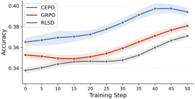

*Figure 1: Accuracy over 50 training steps. CEPO improves faster than GRPO and RLSD, reaching its largest gap around step 40 before partially converging by the final checkpoint.*

**② 方法 / 架构图**

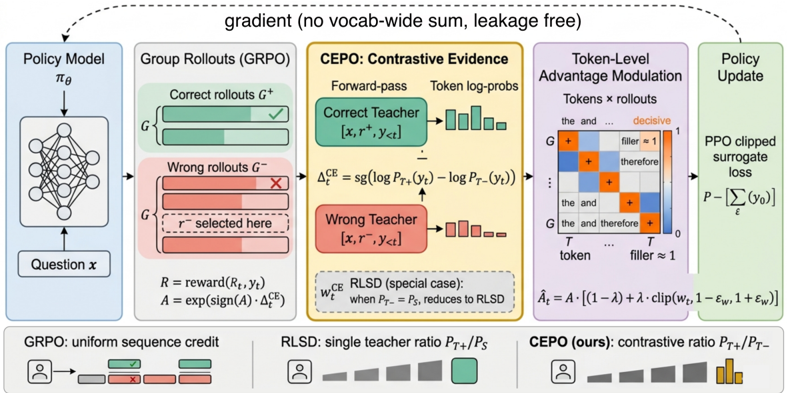

*Figure 2: CEPO training pipeline and its relationship to GRPO and RLSD. Given a question x , the policy π θ produces G rollouts that are partitioned into correct ( G + ) and wrong ( G -) sets by a verifiable reward. CEPO conditions two frozen teachers on a sampled correct rationale r + ∈ G + and rej*

### 一眼看懂

- 🟦 TL;DR：GRPO 给一条正确轨迹里**所有 token 同一个正优势**（错误轨迹同一负信号），把梯度浪费在 filler（连接词/格式/样板）上、低估真正决定成败的少数推理步——"The credit assignment problem, which tokens actually mattered?, is left entirely unresolved"【原文 §1 L75-87】。CEPO 在每个 token 问一个更尖锐的问题：不只"正确答案偏好它吗"，而是"正确答案偏好它**且**错误答案反对它吗"——满足两者=真推理步，皆不满足=filler【原文 Abstract L21-26】。用对比比率 \(P^+_T(y_t)/P^-_T(y_t)\)（正确/错误两个 teacher，错误答案直接取组内已有的**最低分 rejected rollout**）在 stop-gradient 下调制 GRPO 优势的**幅度**，符号仍锚定 verifier【原文 §3.4 式(5)(7)】。
- 最巧的一步：**把分母从 \(P_S\)（学生先验）换成 \(P^-_T\)（错误 teacher）**。这一换，学生先验 \(P_S\) 在 stop-gradient 下被**完全消掉**（"The student prior \(P_S\) cancels entirely"），RLSD 的"fluency confound"（分母反映 base-rate 流畅度而非语义相关，常见 token 无论多被 \(r^+\) 偏好都被压低）从构造上消失【原文 §3.4 L399-401】。抽掉这步就退回 RLSD，而 RLSD 无法区分"正反答案都同等支持的 filler"与"\(r^+\) 支持/\(r^-\) 反对的决定性步"（两者 \(P^+_T/P_S\) ratio 相同时被同等加权）【原文 §3.3 L345-349】。论文自证：当 \(P^-_T(y_t)=P_S(y_t)\) 时 CEPO 精确退回 RLSD【§3.4 Thm 1(iii)】。

### 为什么做

- 研究背景：RLVR 采 rollout、verifier 打分、更新策略；GRPO（Shao/DeepSeekMath [17]）去掉 value 网络、组内归一化得序列级优势，DAPO（[22]）改进探索稳定性，但整族方法都"assign uniform sequence-level advantages"——整条轨迹均匀 credit【原文 §1 L70-77, §2 L217-228】。
- 解决的具体痛点：①GRPO 的 credit assignment 问题（"哪些 token 真重要"完全未解）；②"用 \(r^+\) 当 teacher 做分布匹配"会**信息泄漏**——RLSD（[21]）证明任何把 \(P^+_T\) 当分布目标的散度目标，其梯度都含 vocab-wide 的 \(r\)-条件求和（式3），harmful deviation \(\delta(\theta;r^+)\) 的方差 \(\propto I(Y_t;R^+\mid X)\)，训练后期主导、逼模型编码 \(x\to r^+\) 伪相关，且**不可约**（irreducible）【原文 §1 L94-99, §3.2 L308-310】。
- 相关工作 & 各自不足【原文 §2, Table 1（四维 Priv./Leak-free/Contr./No-Aux.）】：
  - **token 级但无特权信息**：VinePPO（[7]）/SPO（[5]）靠 **Monte Carlo 重模拟**估 token 价值；PRM（[9,16]）训**独立 process reward 网络**——都需昂贵重采样或辅助网络（Table 1 上块，Priv.✗）。
  - **特权自蒸馏但泄漏**：OPSD（[26]，per-token KL 到 \(P^+_T\)）、SDPO（[6]，扩成 JSD + EMA teacher 稳定）、HDPO（[3]，专用于全错 prompt）——Table 1 标 Priv.✓ 但 **Leak-free✗**，§5 实证它们跌破 base 来确认泄漏。
  - **对比方向但离线**：cDPO（[2]，DPO 族）用对比估计找 critical token，但"operates offline on fixed response pairs under a sequence-level implicit reward rather than within the RLVR loop"【§2 L249-252】。
  - **直接前身 RLSD（[21]）**：首个 Priv.✓ + Leak-free✓（停在采样 token + stop-gradient + 用 evidence ratio 只调幅度）；但信号质量有**三缺陷**（fluency confound / asymmetric negative / one-sided evidence，见下）。Table 1 中 CEPO 是唯一四项全 ✓。
- 动机链：GRPO 钝→想用 \(r^+\) 当 dense teacher→但分布匹配会泄漏→RLSD 用 evidence ratio + stop-gradient 解泄漏→但 RLSD 信号有三缺陷：
  - (1) **fluency confound**：分母 \(P_S(y_t)\) 是 base-rate 流畅度非语义相关，常见 token 无论 \(r^+\) 多偏好都被压低；
  - (2) **asymmetric negative**：对错误轨迹，权重 \(P_S/P^+_T\) 惩罚的是"\(r^+\) 本会支持的 token"，间接、缺乏对 \(r^-\) 预测的显式 grounding；
  - (3) **one-sided evidence**：\(P^+_T/P_S\) 区分不了 filler（正反答案都支持）与决定性步（\(r^+\) 支持/\(r^-\) 反对），两者 ratio 相同时被同等加权【§3.3 L339-349】。
  - →所以必须引入对比双参照 \(P^+_T/P^-_T\)。**为什么不用更简单的"对比 KL"**：脚注1 证明 \(\nabla_\theta[D_{KL}(P^+_T\Vert P_S)-D_{KL}(P^-_T\Vert P_S)]\) 会产生 vocab-wide 求和 \(-\sum_v[P^+_T(v)-P^-_T(v)]\nabla_\theta\log P_S(v)\)，与 OPSD 同构的 leakage 缺陷——所以必须用 ratio + stop-gradient 而非两个 KL 相减【原文 §4 脚注1 L639-645】。
- 与最近邻工作的Δ：vs RLSD（最近邻）——唯一区别是把单参照升级为对比双参照，分母 \(P_S\to P^-_T\)；**关键有用点**：\(P^-_T\) 打破 RLSD 的"平局"——错误答案主动反对的 token（\(P^-_T<P_S\)）获得更小分母→更高 credit，恰在语义决定性位置；filler 处 \(P^-_T\approx P^+_T\approx P_S\)→改进消失（Proposition 1）【原文 §3.4 L596-604】。

### 怎么做 + 靠不靠谱

- 方法流水线（读完可复现）【原文 §3.4, Algorithm 1 L352-383, Fig.2】：
  1. **三个共享参数 \(\theta\) 但不同上下文的下一-token 分布**（式2）：学生 \(P_S(y_t)\triangleq\pi_\theta(y_t\mid x,y_{<t})\)；正 teacher \(P^+_T(y_t)\triangleq\pi_\theta(y_t\mid x,r^+,y_{<t})\)（额外条件在正确答案 \(r^+\)）；负 teacher \(P^-_T(y_t)\triangleq\pi_\theta(y_t\mid x,r^-,y_{<t})\)（条件在错误答案 \(r^-\)）。三者**同一份权重**，仅 prompt 不同。
  2. **采 G 条 rollout，算组归一化序列优势**（式1）：\(A^{(i)}=\dfrac{R(x,y^{(i)})-\mu_G}{\sigma_G}\)，按 verifier 把组分成正确组 \(G^+\)、错误组 \(G^-\)。
  3. **构造 \(r^-\)**：\(r^-\leftarrow\text{answer}\bigl(\arg\min_{j\in G^-}R(y^{(j)})\bigr)\)，即**组内最低 reward rollout 的最终答案**（只取答案，不取整条轨迹）；若 \(G^-=\emptyset\) 则令 \(P^-_T\leftarrow P_S\)（退回 RLSD）【Alg.1 L4】。**无额外采样开销**——\(r^-\) 来自已有 rejected rollout。
  4. **逐 token 算对比证据 delta + 调制优势**：对每条轨迹每位置 \(t\)，先算 stop-gradient 的对比 delta（式5），再得 token 级调制优势（式7），代入标准 PPO clipped surrogate 更新 \(\theta\)。
  5. **\(\lambda\) 退火**：从 \(\lambda_0\) 线性降到 0，跨 \(T_{\text{warm}}\) 步（默认 \(\lambda_0=0.5\)、\(T_{\text{warm}}=25\)）。
- 关键公式（真实形式 + 直觉）：
  - **OPSD/SDPO 的泄漏梯度**（式3，问题之源）：
    \[
    \nabla_\theta\mathcal{L}_{\text{OPSD}}=-\sum_{v\in V}P^+_T(v\mid r^+)\,\nabla_\theta\log P_S(v)
    \]
    这个 vocab-wide 求和把 \(r^+\) 直接编进每个梯度方向【§3.2 L302-307】。

  - **RLSD 的修复**（式4）：\(w^{\text{RLSD}}_t=\exp\bigl(\text{sign}(A)\cdot\text{sg}(\log P^+_T(y_t)-\log P_S(y_t))\bigr)\)，\(\hat A^{(i)}_t=A^{(i)}\cdot[(1-\lambda)+\lambda\cdot\text{clip}(w^{\text{RLSD}}_t,1-\epsilon_w,1+\epsilon_w)]\)【§3.2 L317-333】。
  - **CEPO 对比证据 delta**（式5，核心）：
    \[
    \Delta^{CE}_t=\text{sg}\!\left(\log\frac{P^+_T(y_t)}{P^-_T(y_t)}\right)
    \]

  - **贝叶斯解释**（式6，对两个 teacher 用 RLSD Thm 4 相减、\(P_S\) 抵消）：
    \[
    \Delta^{CE}_t=\underbrace{\log\frac{P(r^+\mid x,y_{\le t})}{P(r^+\mid x,y_{<t})}}_{\text{belief update for }r^+}\;-\;\underbrace{\log\frac{P(r^-\mid x,y_{\le t})}{P(r^-\mid x,y_{<t})}}_{\text{belief update for }r^-}
    \]
    直觉：\(\Delta^{CE}_t\) = "token \(y_t\) 把 \(r^+\) 后验抬高多少" − "把 \(r^-\) 后验抬高多少"；决定性步同时支持正确答案 + 反对错误答案→大正值，filler 对两个答案都中性→\(\approx0\)【§3.4 L413-439】。

  - **对比权重 + 调制优势**（式7）：
    \[
    w^{CE}_t=\exp\bigl(\text{sign}(A)\cdot\Delta^{CE}_t\bigr)=\left(\frac{P^+_T(y_t)}{P^-_T(y_t)}\right)^{\text{sign}(A)},\qquad
    \hat A^{(i)}_t=A^{(i)}\cdot\bigl[(1-\lambda)+\lambda\cdot\text{clip}(w^{CE}_t,1-\epsilon_w,1+\epsilon_w)\bigr]
    \]
    注意符号由 \(A\) 锚定（verifier），对比比率只改**幅度**；\(\lambda\) 控对比信号占比，clip 把权重限在 \([1-\epsilon_w,1+\epsilon_w]\)【§3.4 L440-471】。

  - **理论保证**（Theorem 1，证明在附录 A）：(i) **方向锚定**——\(\text{sign}(\hat A_t)=\text{sign}(A)\) 对所有 \(t\)（因 \(w^{CE}_t>0\) 且凸组合保正），特权信息**不能翻转**任何 token 的更新方向；(ii) **leakage-free 梯度**——\(\nabla_\theta\mathcal{L}_{\text{CEPO}}\) 不含 vocab-wide \(r\)-条件求和，\(r^+/r^-\) 只作 stop-gradient 标量在采样 token 进入；(iii) **RLSD 包含**——令 \(P^-_T=P_S\) 精确退回 RLSD【§3.4 L472-481】。
  - **判别锐度**（Proposition 1）：对正确轨迹，\(w^{CE}_t>w^{\text{RLSD}}_t\) **当且仅当** \(P^-_T(y_t)<P_S(y_t)\)（错误答案相对学生先验更不喜欢该 token）；错误轨迹对称（\(P^-_T(y_t)>P_S(y_t)\)）；filler 处 \(P^-_T\approx P^+_T\approx P_S\)→\(w^{CE}_t\approx w^{\text{RLSD}}_t\approx1\)，CEPO 不在无信息位置引入噪声——"filler-token neutrality is therefore not a limitation but a correctness criterion"【§3.4 L580-604】。
- 逐组件必要性：
  - **对比分母 \(P^-_T\)**：核心组件，消 fluency confound；**Table 5 feedback source 消融**——"GT \(r^+\) + peer answer-only \(r^-\)"最优（43.43, +2.26）；"GT \(r^+\) + peer full rollout \(r^-\)"次之（42.74）；两侧都用 full peer rollout（41.99）；只 prefix/suffix 截断反而 <GRPO（40.47/40.60）——截断的推理轨迹给噪声对比信号【§5.1 L737-794】。
  - **stop-gradient**：保证 leakage-free（Thm 1(ii)）+ 方向锚定（Thm 1(i)），无它就泄漏。
  - **\(\lambda\) 退火**：**Figure 3(a)(b)**——常值 \(\lambda=0.5\) 峰值 41.40% >GRPO；\(\lambda=1.0\)（恒定最大、积分压力 50 units vs 25）反而引入噪声变差；线性退火 25 步（从 \(\lambda_0=1.0\)）匹配常值峰值（41.25%），10 步快退接近 25 步——增益"front-loaded"，前 10-25 步贡献主要改进【§5.1 L799-804】。
  - **\(\epsilon_w\)（evidence clip）**：**Figure 3(c)**——\([0.4,0.5]\) 峰值（42.7%，+1.5pp），\(\epsilon_w=0.1\) 太紧退回 GRPO、\(\epsilon_w\ge0.8\) 不约束权重→失稳；推荐 \(\epsilon_w=0.5\)【§5.1 L796-799】。
  - **teacher source**：**Table 4**——**actor-policy teacher 最优**（43.43）>每 25 步同步（42.74）>fixed reference（42.18）；结论：teacher **新鲜度/on-policy 对齐**比"拉大师生分布差"更重要，且 actor 共享权重→无独立参数副本、省显存【§5.1 L719-736】。
- 实验与证据【原文 §4-5】：
  - **数据集/设置**：训练 **Geo3K**（3000 几何题，可验证数值答案）；评测 5 个 held-out 多模态数学基准 DynaMath/LogicVista/MathVision-mini/MMMU/WeMath；模型 **Qwen3-VL-2B/4B-Instruct**，**LoRA（rank 16/α 32, dropout 0）**，仅 **50 步**；AdamW，lr \(1\times10^{-6}\)（CEPO \(5\times10^{-6}\)），cosine decay + 5 步线性 warmup，batch 32，group \(G=8\)，max len 2048，**PPO clip 高 \(\epsilon_{\text{high}}=0.28\)/低 \(\epsilon_{\text{low}}=0.20\)**，无 KL、无 entropy 正则，rule-based 数值 verifier；CEPO 用 \(\lambda_0=0.5\)、25 步退火、\(\epsilon_w=0.5\)【原文 §4 L619-632, Table 6/7】。评测用 lmms-eval，温度 1.0/top-p 1.0/top-k 40/presence penalty 2.0/max 32000 token。
  - **主结果（Table 2）**：2B 平均 CEPO **43.43** vs GRPO 41.17（+2.26pp）、base 39.73、RLSD 40.05、OPSD 34.96、SDPO 35.70；4B CEPO **60.56** vs GRPO 57.43（+3.13pp）、base 58.36、RLSD 58.51。增益最大 LogicVista（4B +6.18 over GRPO）、MathVision-mini（2B +4.94），最小 MMMU（短链知识检索/多选，2B +1.67）——印证"推理链短时对比信号杠杆小"。
  - **最有力实证**：**OPSD/SDPO 跌破未训练 base**（2B 34.96/35.70 vs 39.73；4B 56.23/55.75 vs 58.36，五基准中四个跌破）——直接验证 information leakage 理论预测，且不随规模消失，"structural safety is a practical prerequisite, not a theoretical nicety"【原文 §5 L692-699】。
  - **机理（Figure 4/5）**：训练中正 delta 占比上升、负 delta 占比下降（CEPO 越来越能识别支持正确推理的 token）；token 热图显示 CEPO 把 credit 锐化到关键代数推导（\(x+4=3x-6\)、isolation steps、最终答案）与定位错误的 angle-equality 推断，把 filler 压到近 1，**clip 率更低（49.5% vs RLSD 71.3%）**——更宽有效动态范围，与 Prop.1 一致【§5.2 L835-877】。
  - **baseline 公平吗**：同 LoRA rank、group size、训练步数（Table 7 列出各方法精确超参，含 OPSD \(D_{KL}\)/SDPO \(D_{JS}\)+EMA \(\beta=0.999\)），透明公平【原文 §4 Baselines L633-638】。
  - **看着强但没回答核心问题**：增益绝对值偏小（base→CEPO 仅 +2.2~3.7pp），只跑 **50 步**、单一数据集（Geo3K）、小模型（2/4B）、LoRA——Figure 1 显示 CEPO 早期更快、约 step 40 差距最大、最终**部分收敛**；"长训是否保持优势"未答。
- 假设与失效边界：
  - 【原文】依赖组内同时有正确与错误 rollout 构造 \(r^-\)；全对/全错 prompt 上对比信号退化（\(G^-=\emptyset\) 时退回 RLSD）【§3.4 Alg.1 L364】。
  - 【原文】Prop.1 给出 CEPO > RLSD 的充要条件 \(P^-_T(y_t)<P_S(y_t)\)——只在"错误答案相对学生先验更不喜欢该 token"时锐化；否则两者相同【§3.4 L580-595】。
  - 【推断】只在 Qwen3-VL + Geo3K + 50 步 + LoRA 验证；纯文本/代码/大模型未知（作者自承 future work）；更像"低预算快速收敛优势"而非已证的稳态优势。
  - 【推断】\(r^-\) 只取"最低 reward rollout 的最终答案"，对负参照选择策略敏感（Table 5 prefix/suffix 反而有害）。
- 祛魅总结【推断】：真贡献是**理论 + 实证的闭环**——三条结构保证（方向锚定/leakage-free/RLSD 包含）+ Prop.1（锐度充要条件）+ token 热图 + OPSD/SDPO 退化反例，自洽性强。最有说服力的是"OPSD/SDPO 跌破 base"这个实证反例，把"结构安全是实践前提"从理论变成可观测现象。被高估的是泛化主张（规模/数据/任务都很窄）和绝对增益（+2.2~3.7pp 且部分收敛）；被低估的可能是"对比双参照"作为通用 credit 工具的潜力（目前只在多模态数学验证）。本质是 RLSD 的一个干净增量，而非全新范式。

### 结构化抽取

- 🎯 机制速览6轴：
  - **学什么信号**：可验证二元奖励（rule-based 数值 verifier）给序列优势 \(A\)；**特权信息**（正确答案 \(r^+\) + 组内最低分错误答案 \(r^-\)）经两个 teacher forward 转成 token 级对比 delta \(\Delta^{CE}_t\)，只调制优势幅度、不改符号。
  - **改什么**：参数（LoRA adapter 权重，经 PPO clipped surrogate）+ **logits 层的 credit**（token 级优势 \(\hat A_t\) 重加权）。
  - **何时改**：在线 per-step；\(\lambda\) 随步数线性退火（25 步）。
  - **免梯度?**：否（policy-gradient RL）；但 teacher 信号 stop-gradient，只当标量进入。
  - **记忆-技能生命周期**：无外部记忆/技能库；\(r^-\) 是 per-batch 即时从组内 rejected rollout 取（写入→用完即弃，无检索/遗忘/共享）。
  - **防遗忘机制**：无显式防遗忘；但 leakage-free 设计本身防"编码 \(x\to r^+\) 伪相关"这种泛化退化。
- ⑦ 开源代码+框架/harness：https://github.com/ahmedheakl/CEPO （既有记录已 clone 约 16MB，含复现脚本 `geo/cepo.sh` 等）。框架 **EasyR1（Zheng 2025 [28]，基于 veRL 的多模态 RLVR 框架）+ FSDP（[27]）+ vLLM（[8]）加速 rollout**【原文 §4 L621, Table 6】。teacher 与 actor 共享权重（仅换 prompt 加 \(r^+/r^-\)），实现上是同一模型三次 forward。
- 💰 资源/成本与可扩展性：CEPO 比 GRPO 多**两次 teacher forward**（\(r^+/r^-\) 各一次），**无额外采样**；Geo3K 50 步 wall-clock GRPO 5h58m → SDPO 6h14m → RLSD 6h15m → **CEPO 6h34m**（多 ~36 分钟，与 RLSD/SDPO 同量级）【原文 Table 3 L607-618, L631-632】。硬件 **NVIDIA RTX6000 Pro Blackwell 100GB**。actor-policy teacher 共享权重→无独立参数副本、省显存【§5.1 L730】。
- 🎯 对"探索-巩固"对标：**可借组件 + 部分竞品**。CEPO 直击"token 级信用分配"——与本项目 L6（Token 信用/前瞻）和"path-selection 偏向自己能走通的开头"在精神上相关：它识别"哪些 token 真正决定成败"。**关键 Δ**：CEPO 是 RLVR 内的 credit 调制（改优势幅度），不是 logit-OPD，也无 path-recovery 的"走偏后接管"——它是"事后给 token 打分"，非"过程中纠偏"。**最可借的是 leakage-free 的 stop-gradient 套路**（特权信息只作 stop-gradient 标量进入，不污染梯度方向）——与本项目 MEMORY 记录的"forward-hard/backward-soft 解耦"同精神，是把"特权/前瞻信号"安全注入而不破坏 on-policy 性的现成模板。另一可借点：**对比双参照**（"\(r^+\) 支持且 \(r^-\) 反对"才算决定性步）可迁移为"用一个负锚点过滤伪关键步"的通用判据。一句判定：机制层高度相关（token 信用 + 特权信号安全注入），但属 RLVR 调制而非蒸馏/记忆，是"可借的技术零件"，非整体竞品。
- 🔭 开放问题/未来方向：
  - 【原文 §6 L890-892】扩展到更大模型、纯文本推理、代码生成。
  - 【推断】全对/全错 prompt 上对比信号退化（当前粗暴退回 RLSD）——可探索"无负参照时的替代信号"；负参照选择策略（目前固定取最低分答案）可学习化；长训稳态优势需验证（50 步太短，且已观察到 step 40 后部分收敛）；对比双参照能否迁移到非数学/多轮 agent 的 token 信用（与本项目 L4/L6 交叉）。

---

## DAPO: An Open-Source LLM Reinforcement Learning System at Scale

> **`dapo`** ｜ ByteDance Seed + 清华 AIR(SIA-Lab) + 港大;通讯 Hao Zhou、Mingxuan Wang ｜ arXiv 2503.14476(v1 2025-03-17，v2 2025-05-20)·技术报告 ｜ 主题线 L3(RLVR/GRPO)·相关性 高 ｜ [📄 原始论文](https://arxiv.org/abs/2503.14476)

### 关键图示

**① Motivation / 对比图**

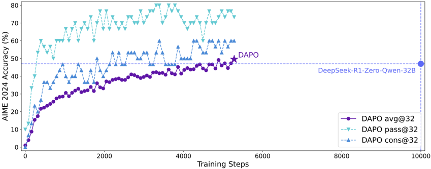

*Figure 1 AIME 2024 scores of DAPO on the Qwen2.5-32B base model, outperforming the previous SoTA DeepSeekR1-Zero-Qwen-32B using 50% training steps. The x-axis represents the gradient update steps.*

**② 方法 / 架构图**

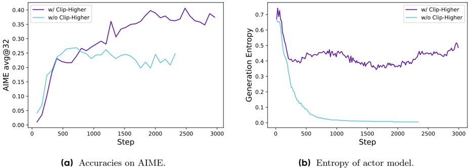

*Figure 2 The accuracy on the AIME test set and the entropy of the actor model's generated probabilities during the RL training process, both before and after applying Clip-Higher strategy.*

### 一眼看懂

- 🟦 TL;DR:朴素 GRPO 在 Qwen2.5-32B base 上跑数学 RL 只到 30 分(AIME 2024),作者诊断出 4 个病灶——熵坍缩、无效梯度、长序列梯度失衡、超长样本奖励噪声——逐一开药(Clip-Higher / Dynamic Sampling / Token-Level Loss / Overlong Reward Shaping),组成 DAPO,把 AIME 提到 50 分且只用一半训练步就超过 DeepSeek-R1-Zero-Qwen-32B(47),并完整开源算法+代码(基于 verl)+数据【原文 Abstract, Fig.1, §1】。
- 最巧的一步:**Dynamic Sampling**(动态采样)。看 Table 1 消融,前面四项技术叠加只到 42,最后加上 Dynamic Sampling 一步直接跳到 50——这一步贡献最大(+8 分),抽掉它整个系统从 SOTA 掉回平庸【原文 §4.2 Table 1】。为什么:它过滤掉组内"全对/全错"(advantage=0、零梯度)的 prompt,保证每个 batch 都是有效梯度,避免随训练推进有效 prompt 数持续缩水(Fig.3b 显示 acc=1 的样本比例一路上升)【原文 §3.2】。

### 为什么做

- 研究背景:test-time scaling(o1/R1)靠长 CoT + 大规模 RL 撑起推理能力革命,RL 是核心引擎;但 SOTA 模型(o1、R1)的算法与配方细节被技术报告藏起来,社区难复现工业级结果【原文 §1】。
- 解决的具体痛点:作者自己在 Qwen2.5-32B base 上跑朴素 GRPO 只得 30 分(远低于 DeepSeek 报告的 47),诊断出朴素 GRPO 有熵坍缩、reward noise、训练不稳定三类问题;且 R1 论文省略了构建可复现大规模 RL 系统所需的工程细节【原文 §1】。
- 相关工作 & 各自不足(来龙去脉 + 并行路线 + 精确差异):
  - **奠基:PPO(Schulman 2017)**【原文 §2.1】。actor-critic 范式,用 GAE 估优势 \(\hat A_t=\sum_{l=0}^{\infty}(\gamma\lambda)^l\delta_{t+l}\),\(\delta_l=R_l+\gamma V(s_{l+1})-V(s_l)\)。短板:需训一个与策略同规模的价值网络 \(V\),显存/算力翻倍;LLM 场景奖励仅在末 token 给出,逐 token 价值难学。DAPO 站在 PPO 的 clip 机制肩上(沿用 clipped surrogate),但去掉 critic。
  - **直系前作:GRPO(DeepSeekMath 2024,源自 §2.2)**【原文 §2.2】。去 critic、用组内相对奖励当 baseline:\(\hat A_{i,t}=\dfrac{r_i-\mathrm{mean}(\{R_i\}_{i=1}^G)}{\mathrm{std}(\{R_i\}_{i=1}^G)}\)。这是 DAPO 的**直接改造对象**——DAPO=GRPO+4 补丁。GRPO 短板:在长 CoT 大规模场景暴露 4 病灶(熵坍缩、零梯度 prompt、sample-level 聚合稀释长序列、截断噪声),且其 objective 在 **sample-level** 聚合(先对每序列内 token 求均、再对样本求均),长序列被稀释。
  - **并行路线 ①——闭源工业系统(o1/R1)**:遥遥领先但训练码与配方不公开;R1 只放权重不放训练码,工程细节缺失。DAPO 的差异化定位正是"把闭源系统达到的水平用全开源算法+码+数据复现出来"。
  - **并行路线 ②——RLHF 范式(Ouyang 2022,§2.3)**:RLHF 用 KL 约束 \(-\beta D_{\mathrm{KL}}(\pi_\theta\|\pi_{\mathrm{ref}})\) 防止偏离初始模型。DAPO 的精确分歧:长 CoT RL 下模型分布**本就应大幅偏移**初始模型,KL 反成累赘,故 DAPO 直接去掉 KL 项(§2.3)。
  - **并行路线 ③——奖励建模(neural RM vs rule-based)**:用神经/过程奖励模型易 reward hacking(§2.4 引 [24–29]),DAPO 改用规则二值结果奖励 \(R(\hat y,y)=+1\,[\text{is\_equivalent}]\,/\,-1\)(§2.4)。
- 动机链:现状(长 CoT RL 是提升推理的核心但闭源)→缺陷(朴素 GRPO 复现只到 30 分且不稳定,工程细节缺失)→所以必须(完全开源一套达 SOTA 的系统:算法+代码+数据,把 4 个关键技术公开)【原文 §1】。
- 与最近邻工作的Δ:相对 GRPO/R1-Zero,差在"把朴素 GRPO 的隐性失败点显式拆成 4 个可独立验证的工程改造并逐项消融",且彻底开源(R1 只放权重不放训练码)。关键有用点:这 4 项是即插即用的解耦补丁,后续被 verl 收为官方 recipe、被社区广泛复用。

### 怎么做 + 靠不靠谱

#### 方法总览(读完可复现)
输入 Qwen2.5-32B base + DAPO-Math-17K(17K 题,作者把 AoPS 等竞赛题答案统一转成整数以便 rule-based 校验)→ 先搭一个**去 KL + 规则二值奖励**的极简 GRPO 底座 → 叠加 4 个解耦补丁 → 输出 AIME 2024 达 50 分的推理模型。下面给每一层的输入→输出、机制、公式真实形式与默认超参。

**底座目标函数(GRPO,作为对照锚点)**【原文 Eq.5】:
\[
J_{\mathrm{GRPO}}(\theta)=\mathbb{E}_{(q,a)\sim\mathcal D,\;\{o_i\}_{i=1}^{G}\sim\pi_{\theta_{\mathrm{old}}}(\cdot|q)}\Bigg[\frac{1}{G}\sum_{i=1}^{G}\frac{1}{|o_i|}\sum_{t=1}^{|o_i|}\Big(\min\big(r_{i,t}(\theta)\hat A_{i,t},\;\mathrm{clip}(r_{i,t}(\theta),1-\varepsilon,1+\varepsilon)\hat A_{i,t}\big)-\beta D_{\mathrm{KL}}(\pi_\theta\|\pi_{\mathrm{ref}})\Big)\Bigg]
\]
其中重要性比 \(r_{i,t}(\theta)=\dfrac{\pi_\theta(o_{i,t}\mid q,o_{i,<t})}{\pi_{\theta_{\mathrm{old}}}(o_{i,t}\mid q,o_{i,<t})}\)【Eq.6】。注意外层 \(\frac1G\sum_i\frac1{|o_i|}\sum_t\) 是 **sample-level 聚合**——这是 §3.3 要修的地方。

**最终 DAPO 目标(四补丁叠加后,Eq.8)**【原文 Eq.8/10/11/12,四式同构、逐步加约束】:
\[
J_{\mathrm{DAPO}}(\theta)=\mathbb{E}_{(q,a)\sim\mathcal D,\;\{o_i\}_{i=1}^{G}\sim\pi_{\theta_{\mathrm{old}}}(\cdot|q)}\Bigg[\frac{1}{\sum_{i=1}^{G}|o_i|}\sum_{i=1}^{G}\sum_{t=1}^{|o_i|}\min\big(r_{i,t}(\theta)\hat A_{i,t},\;\mathrm{clip}(r_{i,t}(\theta),1-\varepsilon_{\mathrm{low}},1+\varepsilon_{\mathrm{high}})\hat A_{i,t}\big)\Bigg]
\]
\[
\text{s.t.}\quad 0<\big|\{o_i\mid \text{is\_equivalent}(a,o_i)\}\big|<G,\qquad \hat A_{i,t}=\frac{R_i-\mathrm{mean}(\{R_i\}_{i=1}^G)}{\mathrm{std}(\{R_i\}_{i=1}^G)}
\]
对照底座式可一眼看出 4 处改动:**(a)** clip 上下界解耦为 \(\varepsilon_{\mathrm{low}},\varepsilon_{\mathrm{high}}\);**(b)** 去掉 \(-\beta D_{\mathrm{KL}}\) 项;**(c)** 外层归一从 \(\frac1G\sum_i\frac1{|o_i|}\) 改为 \(\frac{1}{\sum_i|o_i|}\sum_i\)(token-level);**(d)** 约束 \(0<|\{\text{正确}\}|<G\) 即 Dynamic Sampling 过滤全对/全错。

#### 逐组件必要性(均有 Table 1 累积消融,给机制 + 公式 + 直觉)

- **① Clip-Higher**(+2,36→38)【原文 §3.1, Eq.10, Fig.2/3a】。
  - 干什么:把 PPO-Clip 的对称裁剪 \(\mathrm{clip}(\cdot,1-\varepsilon,1+\varepsilon)\) 解耦为非对称 \(\mathrm{clip}(\cdot,1-\varepsilon_{\mathrm{low}},1+\varepsilon_{\mathrm{high}})\),**只抬高上界 \(\varepsilon_{\mathrm{high}}\)**(默认 \(\varepsilon_{\mathrm{low}}=0.2,\varepsilon_{\mathrm{high}}=0.28\))。
  - 直觉(关键):上裁剪对"已经高概率的 exploitation token"几乎不设限,却把"低概率 exploration token"的上行幅度卡死——因为低概率 token 即使要翻倍也撞不到 \(1+\varepsilon\) 的天花板。放宽 \(\varepsilon_{\mathrm{high}}\) 即给低概率探索 token 解锁上升空间。作者特意**不动 \(\varepsilon_{\mathrm{low}}\)**:抬高下界会把这些 token 概率压到 0,反而坍缩采样空间(§3.1 原话)。
  - 证据:实测被上裁剪 token 的概率 <0.2(Fig.3a),解耦后熵回升(Fig.2b)。没它→熵坍缩、采样近乎同质。
- **② Dynamic Sampling**(+8,42→50,**最大单项**)【原文 §3.2, Eq.11, Fig.3b/6】。
  - 干什么:对每个 prompt 过采样,**过滤掉组内全对(acc=1)或全错(acc=0)的 prompt**,持续采样直到 batch 被"有效 prompt"填满(`buffer size < N` 则 continue,见 Algorithm 1 第 6–8 行)。约束写进目标 s.t. \(0<|\{\text{正确}\}|<G\)。
  - 直觉:组内全对/全错 → 奖励全同 → \(\mathrm{std}=0\) 归一后 \(\hat A_{i,t}=0\) → 零梯度。随训练推进 acc=1 的样本比例单调上升(Fig.3b),有效 prompt 数持续缩水,batch 梯度方差变大、信号被稀释。过滤保证每个 batch 全是有效梯度。
  - 反驳"变慢"质疑:作者澄清它不显著拖慢训练——同步 RL 系统的生成时间本由长尾样本主导,且收敛更快(Fig.6 同性能用更少步达到)。
- **③ Token-Level Loss**(+1,41→42,贡献最小)【原文 §3.3, Eq.12, Fig.4】。
  - 干什么:把 sample-level 聚合 \(\frac1G\sum_i\frac1{|o_i|}\sum_t(\cdot)\) 改为 token-level \(\frac{1}{\sum_i|o_i|}\sum_i\sum_t(\cdot)\)——即对 batch 内**所有 token 求和后按总 token 数归一**,而非先序列内平均再样本间平均。
  - 直觉:sample-level 下每个序列权重相同,长序列里每个 token 的权重被 \(1/|o_i|\) 稀释,导致(i)高质量长样本里的推理模式学不进去,(ii)长样本里的乱码/重复模式罚不动 → 熵和长度不健康膨胀(Fig.4a/b)。token-level 让长序列对梯度有正比贡献,且"某生成模式若改变 reward,就被等强度提升/抑制,与所在响应长度无关"(§3.3 原话)。
  - 作者明说"性能增益较小但提升训练稳定性、让长度更健康增长"。
- **④ Overlong Reward Shaping**(Overlong Filtering +6,30→36;Soft Punishment +3,38→41)【原文 §3.4, Eq.13, Fig.5】。
  - 干什么:两步。(i)**Overlong Filtering**:把被截断(超长)样本的 loss **mask 掉**(不计梯度);(ii)**Soft Overlong Punishment**:在 \([\,L_{\max}-L_{\mathrm{cache}},\,L_{\max}]\) 区间内给长度加一个**软惩罚**,叠加到规则正确性奖励上:
  \[
  R_{\mathrm{length}}(y)=\begin{cases}0,&|y|\le L_{\max}-L_{\mathrm{cache}}\\[4pt]\dfrac{(L_{\max}-L_{\mathrm{cache}})-|y|}{L_{\mathrm{cache}}},&L_{\max}-L_{\mathrm{cache}}<|y|\le L_{\max}\\[6pt]-1,&L_{\max}<|y|\end{cases}
  \]

  - 直觉:若一律对截断样本重罚,会把"推理正确只是太长"的样本错误惩罚,注入 reward 噪声、让模型困惑于"我的推理到底对不对"。先 mask 截断样本消除噪声(Fig.5 精度/熵更稳),再用线性软惩罚温和地把长度往回拉(越长罚越多,撞 \(L_{\max}\) 才给 −1)。默认 \(L_{\max}=16384,\;L_{\mathrm{cache}}=4096\)(即生成上限 20480)。

#### 训练流程(Algorithm 1,逐步)
对 step \(=1..M\):① 从 \(\mathcal D\) 采 batch \(\mathcal D_b\);② \(\pi_{\theta_{\mathrm{old}}}\leftarrow\pi_\theta\);③ 对每题采 \(G\) 个输出 \(\{o_i\}\sim\pi_{\theta_{\mathrm{old}}}\);④ 用规则 \(R\) 算奖励;⑤ **Dynamic Sampling 过滤**全对/全错并入 buffer;⑥ 若 buffer 不满 \(N\) 则 continue(回到 ① 继续采);⑦ 对 buffer 内每个 token 算 \(\hat A_{i,t}\);⑧ 内层 \(\mu\) 次梯度迭代最大化 \(J_{\mathrm{DAPO}}\)(Eq.8)【原文 Algorithm 1】。

#### 关键超参默认值(复现锚点)【原文 §4.1, §4.2】
框架 verl;基座 Qwen2.5-32B base;baseline=朴素 GRPO+组奖励归一。优化器 AdamW、常数 lr \(1\times10^{-6}\)、20 rollout step 线性 warm-up;prompt batch 512、每 prompt \(G=16\) 响应;train mini-batch 512(即每 rollout 做 16 次梯度更新,\(\mu=16\));\(\varepsilon_{\mathrm{low}}=0.2,\;\varepsilon_{\mathrm{high}}=0.28\);\(L_{\max}=16384\) + \(L_{\mathrm{cache}}=4096\) soft punish buffer = 最大生成 20480 token;无 KL、无 reference;评测 temperature 1.0、top-p 0.7,AIME 重复 32 次报 avg@32。

#### 实验与证据 / 靠不靠谱

- 主结果:AIME 2024 约 0%→50%,半数步即超 DeepSeek-R1-Zero-Qwen-32B(47);Table 1 给 4 技术逐项累积消融(30→36→38→41→42→50,最后 +8 来自 Dynamic Sampling)。
- baseline 公平性:同基座(Qwen2.5-32B)同评测对照 R1-Zero-Qwen-32B,公平;但**主结果集中在单一基座 + 单一评测(AIME 2024)**,跨基座/跨任务论文内未验证。"看着强但没回答"的点:50 分是否泛化到非数学/更小模型,论文未答(声称"可迁移到其它任务"但未给证据)【推断,据 §4.1 仅做数学】。
- 假设与失效边界:【原文】去 KL 的前提是"长 CoT RL 下模型分布本应大幅偏离初始模型"(§2.3),故在需要贴近初始模型的对齐场景不适用;规则二值奖励要求任务可验证(数学/代码)。【推断】\(\varepsilon_{\mathrm{high}}=0.28\) 等为经验取值无敏感性分析,换基座/任务可能需重调;在更小/更弱 base 上,Clip-Higher 放宽探索是否仍稳定未知。
- 祛魅总结:真贡献=把朴素 GRPO 的失败点工程化拆解为 4 个可复现补丁 + 彻底开源(算法+码+数据),复现价值极高,这是它被社区奉为标准 recipe 的根本原因。包装/高估处="key techniques that make large-scale RL a success"的普适性主要靠社区后续复现背书,论文内只在数学单域+单基座验证;Token-Level Loss 被列为四大技术之一但实测仅 +1 分,贡献被叙事略微抬高【推断,据 Table 1】。

### 结构化抽取

- 🎯 机制速览6轴:**学什么信号**=规则二值结果奖励(答案对+1/错−1,可验证任务)| **改什么**=策略参数(on-policy 梯度更新)| **何时改**=训练期,每 rollout step 16 次梯度更新 | **免梯度?**=否(全程梯度 RL)| **记忆-技能生命周期**=不涉及(无显式记忆/技能库,能力固化进权重)| **防遗忘机制**=去掉 KL 惩罚(反而主动允许偏离),无专门防遗忘设计【原文 §2.3, §4.1】。
- ⑦ 开源代码+框架/harness:https://github.com/BytedTsinghua-SIA/DAPO(recipe/eval/数据说明;**训练逻辑实现在 verl**:https://github.com/volcengine/verl,DAPO 作为 verl 的一个 recipe);框架 **veRL**(requirements 含 vllm==0.8.3、ray[serve])。本地已 clone(~4.1MB)。【原文 Abstract 脚注 a 明确"built on the verl framework"】
- 💰 资源/成本与可扩展性:论文未给出 GPU 卡时/训练成本的明确数字(原文未说明);仅知 rollout prompt batch 512×16 响应、生成上限 20480 token、Dynamic Sampling 会增加采样量但作者称总训练时间不显著增加(Fig.6 收敛更快)【原文 §4.1-4.2】。
- 🎯 对"探索-巩固"对标:**支撑(探索侧)** —— 一句判定:DAPO 的 Clip-Higher 与 Dynamic Sampling 是"如何在 on-policy RL 中保住探索、不让策略过早确定化"的高质量工程方案,与"探索=发现有效行为/路径"的诉求直接同构;依据:Clip-Higher 专门给低概率探索 token 解锁上行空间(§3.1)、Dynamic Sampling 保证有效梯度即保证持续探索信号(§3.2)。但它**不涉及"巩固/回轨"也不涉及 teacher 脚手架**——纯 on-policy 自演化,无错误前缀注入、无路径恢复目标(对比 denoiserl)。可借组件:去 KL + token 级聚合损失 + Soft Overlong Punishment 可直接搬进任何 GRPO 底座;缺口:无 path-recovery/巩固机制、无 MTP 前瞻、无防遗忘。
- 🔭 开放问题/未来方向:【原文】§4.3 讨论训练动态——长度并非单调上升、训练 reward 与验证精度弱相关(过拟合训练集),提示需结合长度+验证精度共同监控;监控熵需维持在合适区间。【推断】跨基座/跨任务泛化、超参敏感性、与过程奖励或路径级信用分配的结合、在更小模型上的可扩展性均未解。

---
RETURN: dapo | 读到PDF? 是(16页全文,公式从 PDF 精确抄录) | L3(RLVR/GRPO) | 探索侧强支撑(Clip-Higher/Dynamic Sampling 是保探索工程范式),无巩固/回轨/teacher 脚手架,纯 on-policy | 残留待核 0

---

## DeepSeek-R1: Incentivizing Reasoning Capability in LLMs via Reinforcement Learning

> **`deepseek_r1`** ｜ DeepSeek-AI ｜ arXiv 2501.12948(v2 2026-01-04，Nature 版)·2025-01 首发 ｜ 主题线 L3(RLVR/GRPO)+ L1(离线序列级蒸馏对照)·相关性 高 ｜ [📄 原始论文](https://arxiv.org/abs/2501.12948)

### 关键图示

**① Motivation / 对比图**

*Figure 1 | DeepSeek-R1-Zero AIME accuracy during training (left) and average length per response during training (right).*

**② 方法 / 架构图**

*Figure 2 | The multi-stage pipeline of DeepSeek-R1. A detailed background on DeepSeek-V3 Base and DeepSeek-V3 is provided in Supplementary A.1. The models DeepSeek-R1 Dev1, Dev2, and Dev3 represent intermediate checkpoints within this pipeline.*

### 一眼看懂

- 🟦 TL;DR:**R1-Zero** 证明仅靠纯 GRPO + 规则奖励(不经任何 SFT)就能在 base 模型上自演化出推理能力(响应自然变长、涌现反思/"aha moment"),AIME pass@1 从 15.6%→77.9%;**R1** 再用四阶段管线(cold-start SFT → 推理向 RL 加语言一致性奖励 → 拒绝采样扩 SFT(800k)→ 全域 RL 加偏好奖励)修好可读性与通用性;并把 800k 数据**离线 SFT** 蒸馏到小模型,得出"大模型 RL→小模型蒸馏 优于 小模型直接 RL"【原文 Abstract, §2, §3, Appendix F.1】。
- 最巧的一步:**规则奖励 + 只约束格式不约束内容**(R1-Zero 的设计)。抽掉它(改用神经/过程奖励模型,或规定推理步骤),就观察不到"无人类示例约束下自演化出非人类式推理路径"这个核心现象——作者明说刻意不用神经奖励模型(避免 reward hacking)、刻意跳过 SFT(假设人类定义的推理模式会限制探索)【原文 §2.2, §2.3】。为什么:奖励只看答案对错 + 格式,模型在 RL 压力下自由地延长并重组推理(thinking time 单调增长,Fig.1b),涌现自检/反思/换路;一旦约束内容或引入可被 hack 的神经奖励,这种自由探索就被压制。

### 为什么做

- 研究背景:LLM + CoT prompting 在推理上有成效,但严重依赖人工标注 CoT 轨迹做 SFT;test-time scaling(o1)显示拉长推理可显著提升能力;GRPO(源自 DeepSeekMath)提供免 critic 的高效 RL【原文 §1, §2.1】。
- 解决的具体痛点:依赖人工推理轨迹→扩展性差、引入认知偏差、性能被人类示例上限封顶,难探索"非人类式"更优推理路径;传统 SFT-before-RL 可能限制探索;且纯 RL 的 R1-Zero 虽强但可读性差、中英混杂(language mixing)、窄域 RL 致通用能力弱【原文 §1, §3】。
- 相关工作 & 各自不足(来龙去脉 + 精确差异):
  - **CoT prompting(Wei 2022)**:激发推理但**受人类示例上限约束**(只能复现人给的推理模式)。
  - **SFT-on-human-CoT 范式**:引入认知偏差、性能被人类示例封顶,无法探索非人类式更优路径。R1-Zero 的反转:**完全跳过 SFT**(假设人类推理模式限制探索),直接 base 上纯 RL。
  - **神经/过程奖励模型(RM/PRM)**:信号细但**易 reward hacking**且重训成本高——R1-Zero 据此**弃用神经 RM**,只用规则二值奖励(§2.2)。
  - **o1(OpenAI)**:test-time scaling 先驱但**闭源、细节未公开**。R1 的差异:**完整公开四阶段配方与超参 + 系统给出蒸馏 vs 直接 RL 对照**。
  - **算法底座 GRPO(DeepSeekMath 2024)**:R1 直接采用(§2.1),但**此 Nature 版的优势 \(A_i\) 为序列级**(见下 Eq.1/3,无逐 token 下标),与 DeepSeekMath 的逐 token \(\hat A_{i,t}\) 表述不同。
- 动机链:现状(推理靠人标 CoT+SFT)→缺陷(扩展性差、被人类示例封顶、无法探索非人类路径)→所以必须(用最小人工标注、靠纯 RL 自演化激励推理:R1-Zero 跳过 SFT 直接 base 上 RL、奖励只看最终答案;R1 再用少量 cold-start + 多阶段补可读性/通用性)【原文 §1-3】。
- 与最近邻工作的Δ:相对 o1 与 SFT-on-CoT 范式,差在"证明纯 RL 单独即可激励推理(不需 SFT 引导)"+"完整公开四阶段配方"+"系统给出蒸馏 vs 直接 RL 的对照"。有用点:R1-Zero 把"RL 可独立涌现推理"这一假设证实,改变了整个社区的 post-training 范式。

### 怎么做 + 靠不靠谱

#### A. GRPO 框架(§2.1,Eq.1-3,Nature 版=序列级优势)
对每题 \(q\) 从旧策略采 \(G\) 输出 \(\{o_1,\dots,o_G\}\),最大化(注意重要性比与优势均为**整条输出级**,无逐 token \(t\)):
\[
\mathcal J_{\mathrm{GRPO}}(\theta)=\mathbb E_{q\sim P(Q),\,\{o_i\}_{i=1}^{G}\sim\pi_{\theta_{\mathrm{old}}}(O|q)}\frac1G\sum_{i=1}^{G}\Big[\min\Big(\tfrac{\pi_\theta(o_i|q)}{\pi_{\theta_{\mathrm{old}}}(o_i|q)}A_i,\ \mathrm{clip}\big(\tfrac{\pi_\theta(o_i|q)}{\pi_{\theta_{\mathrm{old}}}(o_i|q)},1-\varepsilon,1+\varepsilon\big)A_i\Big)-\beta D_{\mathrm{KL}}(\pi_\theta\|\pi_{\mathrm{ref}})\Big]
\tag{1}
\]
\[
D_{\mathrm{KL}}(\pi_\theta\|\pi_{\mathrm{ref}})=\frac{\pi_{\mathrm{ref}}(o_i|q)}{\pi_\theta(o_i|q)}-\log\frac{\pi_{\mathrm{ref}}(o_i|q)}{\pi_\theta(o_i|q)}-1
\tag{2}
\]
\[
A_i=\frac{r_i-\mathrm{mean}(\{r_1,\dots,r_G\})}{\mathrm{std}(\{r_1,\dots,r_G\})}
\tag{3}
\]

#### B. R1-Zero 奖励设计(§2.2,Eq.4=规则奖励,纯 base 上跑)
**不用任何神经/过程 RM**(避免 reward hacking),只用规则二值:
\[
\mathrm{Reward_{rule}}=\mathrm{Reward_{acc}}+\mathrm{Reward_{format}}
\tag{4}
\]

- **准确率奖励**:答案放进指定格式(如 box),用规则校验对错(数学比对/代码编译器+测试)。
- **格式奖励**:强制把推理与答案分别包进 `<think>...</think>` 与 `<answer>...</answer>`(模板见 Table 1);**只约束结构、不约束内容**——这是涌现非人类式推理的关键。
- 两者**等权**相加。

#### C. R1 四阶段管线(§3,Fig.2,逐阶段输入→输出)
输入 DeepSeek-V3-Base(660B MoE):

1. **Cold Start SFT**:数千条对话式人类对齐长 CoT 数据 SFT → 修可读性起点。
2. **推理向 RL(第一阶段)**:规则奖励(准确率+格式)+ **语言一致性(LC)奖励**;超参 lr 3e-6、KL 系数 0.001、**clip ratio \(\varepsilon=10\)**、temperature 1、每题 16 输出、max length 32768、batch 512、每 400 步换 reference → Dev-2。
   - **LC 奖励(Eq.7)**= CoT 中目标语言词占比,**直接加到最终奖励**:
   \[
   \mathrm{Reward_{language}}=\frac{\mathrm{Num}(\mathrm{Words_{target}})}{\mathrm{Num}(\mathrm{Words})}
   \tag{7}
   \]

3. **拒绝采样 + SFT**:从第一阶段 RL checkpoint 拒绝采样生成推理轨迹、V3 当生成式裁判过滤(混语/长段/代码块)→ 约 600k 推理样本 + V3 管线生成约 200k 非推理样本 = **约 800k** 监督数据 SFT → Dev-3。
4. **全域 RL(第二阶段)**:混合推理(规则奖励)+ 通用数据;通用查询按数据集给 **safety / helpful 偏好奖励**(Eq.5/6,如 \(\mathrm{Reward_{safety}}=\mathrm{RM_{safety}}(\mathrm{Response})\));偏好奖励**仅在最后 400 步引入**(更多步会致 reward hacking,Appendix B.5)→ 最终 R1。
- 另:**R1-Zero** = V3-Base 纯 GRPO(无以上任何 SFT);**R1-Distill** = 把 800k 数据**离线 SFT** 灌进 Qwen/Llama 小模型(纯 SFT 一次性,无 RL)。

#### 逐组件必要性(部分有消融)

- **R1-Zero 纯 RL**:核心对照。AIME 15.6%→77.9%(cons 86.7%),证明 RL 单独可激励推理。没它→无法验证"不需 SFT"这一核心假设【原文 §2.3】。
- **Cold Start SFT**:对照 Dev-1 vs R1-Zero——指令遵循(IF-Eval/ArenaHard)大涨,但因 cold-start 数据量小,AIME 推理略降【原文 §4 Table 3】。
- **LC 奖励**:有消融(Appendix B.6)。加 LC 后语言一致性稳定,代价是基准性能**略降**(作者明说"slight degradation")但更可读、合人类偏好【原文 §3.2.1, Fig.7】。
- **第四阶段全域 RL**:对照——AlpacaEval2.0 +25%、ArenaHard +17%(通用能力补齐);但偏好奖励仅末 400 步引入(更多步致 reward hacking,Appendix B.5)【原文 §3.2.2】。
- **GRPO clip \(\varepsilon\)**:作者强调 clip ratio 关键——过低截断大量 token 梯度损性能,过高致训练不稳(第一阶段 \(\varepsilon=10\))【原文 §3.2.1】。

#### D. 关键超参与成本(复现锚点)【原文 §2.1, §3.2, Appendix B.4】

- R1-Zero:lr 3e-6、KL 0.001、temperature 1、每题 16 输出、max length 32768(8.2k 步后增至 65536)、batch 512(每步 32 题)、每 400 步换 ref、共 10,400 步(约 1.6 epoch)。
- SFT(cold-start/拒绝采样):2-3 epoch、cosine lr 5e-5→5e-6、ctx 32768、batch 128;蒸馏:对应 base 微调 2-3 epoch、ctx 32768、batch 64。
- 评测 MMLU/AIME2024/MATH-500/GPQA/LiveCodeBench/Codeforces/AlpacaEval/ArenaHard。R1-Distill 结果(Table 15):Qwen-32B AIME 72.6、Llama-70B 70.0。

#### 靠不靠谱

- baseline 公平性:**蒸馏 vs 直接 RL 对照(Appendix F.1, Table 16)**——R1-Distill-Qwen-32B(AIME 72.6)显著超 Qwen2.5-32B-Zero(同 base 直接 RL,47.0),但作者自承小模型直接 RL 的算力预算与 R1 不对等(直接 RL "require enormous computational power")。"看着强但没回答"的点:"无约束 RL 优于人类示例"主要靠 R1-Zero 单点对照支撑;"aha moment"为观察性叙述(Table 2、Fig.9b 用"wait"词频),无严格涌现度量【原文 Appendix F.1; 推断据其叙述性证据】。
- 假设与失效边界:【原文】R1-Zero 的可读性/语言混杂问题需 R1 管线人对齐数据补救——故"纯 RL 零人工"不完全成立;偏好奖励模型在可验证任务上会 reward hacking(helpful RM:reward 升而 CodeForces 降,Appendix B.5);规则奖励要求任务可验证(数学/代码/逻辑)。【推断】660B MoE base 的容量是 R1-Zero 自演化成功的隐含前提,小 base 上纯 RL 可能不奏效(Appendix F.1 已暗示小模型直接 RL 性能不及蒸馏);蒸馏为离线序列级 SFT,与在线/on-policy KD 不同。
- 祛魅总结:真贡献=用大规模实证确立"纯 RL 可单独激励推理(R1-Zero)"这一范式级结论 + 完整公开四阶段配方 + 蒸馏 vs 直接 RL 的清晰对照(蒸馏更经济有效,但"超越人类智能边界仍需更强 base + 更大 RL")。包装/高估处:Nature 版强调"obviating human-labeled trajectories",但 R1(非 Zero)仍用了 cold-start + 800k SFT,并非零人工;"self-evolution""aha moment"叙事偏拟人化,缺定量涌现指标;蒸馏"优于直接 RL"的对照中,直接 RL 的算力被有意压低(对照不完全对等,作者已注明)【推断】。

### 结构化抽取

- 🎯 机制速览6轴:**学什么信号**=R1-Zero/推理:规则结果奖励(答案对错+格式);通用:神经偏好奖励(helpful/harmless);+ LC 语言一致性奖励 | **改什么**=策略全参数(R1)/ base 全参数(R1-Zero、蒸馏 SFT)| **何时改**=R1-Zero 纯 RL;R1 四阶段(SFT→RL→SFT→RL);蒸馏=纯 SFT 一次性 | **免梯度?**=否(全程梯度;RL+SFT 均梯度训练)| **记忆-技能生命周期**=不涉及显式记忆/技能库;推理能力固化进权重;"自演化"发现的推理模式被蒸馏进小模型(技能跨模型转移)| **防遗忘机制**=GRPO 带 KL 惩罚(系数 0.001,弱约束 ref);多阶段管线靠混合数据缓解能力遗忘,无专门防遗忘算法【原文 §2-3】。
- ⑦ 开源代码+框架/harness:https://github.com/deepseek-ai/DeepSeek-R1;权重 https://huggingface.co/deepseek-ai 。**该仓为模型/权重发布仓,不含训练代码**(无 GRPO 训练脚本、无四阶段管线实现、无拒绝采样脚本)。框架:训练基础设施在 Appendix B.1 描述为**自研高性能 RL 框架**(不在仓内,A100 预实验 → 64×8 H800 训 660B)。CloneTier=B,仅记录未 clone。GRPO 算法后被 veRL/TRL/OpenRLHF/ms-swift 广泛实现。【未开源训练码,复现依赖论文公式+超参表;本条为模型报告,无训练代码】
- 💰 资源/成本与可扩展性:**论文给出明确成本(Appendix B.4.4, Table 7)**:R1-Zero 64×8 H800 约 198h;R1 同卡约 80h(4 天);SFT 数据 5K GPU 时;总计 **147K H800 GPU 时 ≈ $294K**(R1-Zero 101K/$202K + SFT 5K/$10K + R1 41K/$82K)。蒸馏为纯 SFT,成本远低于 RL;作者明示"小模型直接 RL 需巨大算力且可能不及蒸馏"【原文 Appendix B.4.4】。
- 🎯 对"探索-巩固"对标:**支撑(探索侧的范式奠基) + 蒸馏是巩固的离线 baseline** —— 一句判定:R1-Zero 是"探索=在 RL 压力下自演化发现有效推理路径(反思/换路/自检)"的奠基性实证,直接定义了本项目"探索/选路"要利用的现象;而其 800k 离线 SFT 蒸馏是"把发现的推理能力固化进(小)模型"的最朴素巩固形式,正是本项目 on-policy 蒸馏要超越的 off-policy baseline。依据:§2.3 self-evolution + Fig.1b 长度增长(探索);Appendix F 离线 SFT 蒸馏(巩固/固化)。可借组件:① R1-Zero 的"规则奖励+只约束格式"(Eq.4)是稀疏脚手架最干净的奖励设计参考;②拒绝采样扩 SFT(从 RL checkpoint 采正确轨迹再 SFT)= 一种"巩固自己走通路径"的离线版,可对比本项目 on-policy 自选。缺口/竞品差异:R1 的蒸馏是**离线序列级 SFT(teacher-forced),非 on-policy KD**,无路径恢复/回轨目标、无 MTP 前瞻、teacher(R1)轨迹一次性生成后固定;R1-Zero 是纯探索无 teacher 脚手架。与本项目"teacher 当稀疏脚手架教 student 探索+巩固两能力"相比,R1 是"先大模型自探索→再把结果离线灌给小模型",师生交互弱且非在线。
- 🔭 开放问题/未来方向:【原文】作者明示把"蒸馏小模型 + RL"留给社区(F:"leaving the exploration of the RL stage to the broader research community");"超越人类智能边界仍需更强 base + 更大 RL";偏好奖励的 reward hacking 待解(B.5)。【推断】on-policy/在线蒸馏替代离线 800k SFT、小 base 上纯 RL 的可行性、把自演化的探索与显式的路径恢复/巩固结合、用 MTP 等前瞻信号引导探索均未涉及。

---
RETURN: deepseek_r1 | 读到PDF? 是(86页,读核心方法/蒸馏/成本,公式从正文.txt 精确抄录) | L3(纯RL激励推理)+L1(离线蒸馏对照) | 探索侧奠基性支撑(R1-Zero 自演化=探索范式);蒸馏=off-policy SFT,本项目 on-policy KD 要超越的 baseline;无路径恢复/MTP | 残留待核 0(此 v2 为 Nature 版,GRPO 优势 Eq.1/3 为序列级 \(A_i\),与 DeepSeekMath 逐 token \(\hat A_{i,t}\) 表述不同,已据 PDF 核实;为模型报告无训练代码)

---

## DeepSeekMath: Pushing the Limits of Mathematical Reasoning in Open Language Models (GRPO 起源)

> **`deepseekmath`** ｜ DeepSeek-AI(Zhihong Shao, Peiyi Wang, Qihao Zhu, Runxin Xu, Daya Guo 等) ｜ arXiv 2402.03300(v3 2024-04-27)·2024-02 首发·模型报告 ｜ 主题线 L3(RLVR/GRPO 算法基石)·相关性 高 ｜ [📄 原始论文](https://arxiv.org/abs/2402.03300)

### 关键图示

**① Motivation / 对比图**

*Figure 1 | Top1 accuracy of open-source models on the competition-level MATH benchmark (Hendrycks et al., 2021) without the use of external toolkits and voting techniques.*

**② 方法 / 架构图**

*Figure 4 | Demonstration of PPO and our GRPO. GRPO foregoes the value model, instead estimating the baseline from group scores, significantly reducing training resources.*

### 一眼看懂

- 🟦 TL;DR:首次提出 **GRPO**——用"同题多输出的组内相对奖励"替代 PPO 的价值网络(critic),省去与策略同规模的 critic、大幅降显存算力;并给出一个统一梯度范式把 SFT/RFT/Online-RFT/DPO/PPO/GRPO 归一(差异落在数据源/奖励函数/梯度系数三点)。DeepSeekMath-RL 7B 在 GSM8K=88.2%、MATH=51.7%(纯 CoT、无工具无投票),且仅用 GSM8K/MATH 的 CoT 数据训练却在所有(含 OOD)基准超 DeepSeekMath-Instruct 7B【原文 Abstract, §4, §5.2】。
- 最巧的一步:**用组内多采样的均值/标准差归一作 advantage baseline**(取代价值网络)。抽掉它就退回 PPO,需要训练一个与策略同规模的 critic(显存/算力翻倍),GRPO 的"高效"卖点垮掉。为什么:奖励模型本质衡量的就是"同题不同答案孰优孰劣",所以组内相对奖励天然契合奖励模型的比较性质,可直接充当无偏 baseline,根本不需要再训独立价值网络【原文 §4.1.1】。

### 为什么做

- 研究背景:RL 已被证明能在 SFT 之后进一步提升 LLM 数学推理,该阶段广泛用 PPO(actor-critic);本文在大规模数学语料预训练(120B math tokens,DeepSeekMath-Base/Instruct 7B)基础上引入新 RL 算法【原文 §1, §4】。
- 解决的具体痛点:①PPO 价值模型开销大(需训一个与策略同规模的 critic,巨大显存算力);②稀疏奖励下 critic 难训(LLM 场景通常只在最后一个 token 由奖励模型打分,逐 token 精确价值函数难学);③缺乏对各类后训练方法(RFT/DPO/PPO/GRPO)的统一理论理解框架【原文 §4.1.1, §5.2】。
- 相关工作 & 各自不足(来龙去脉 + 精确差异):
  - **奠基:PPO(Schulman 2017,§4.1.1)**——actor-critic,用 GAE 估优势 \(\hat A_t\) 需价值函数 \(V\) 当 baseline。**精确短板**:critic 与策略同规模,显存/算力翻倍;且 LLM 只在末 token 给奖励,逐 token 精确价值难学。GRPO 站在 PPO 的 clip 机制肩上,但**去掉 critic、用组内均值当 baseline**。
  - **并行路线 ①——RFT / Online-RFT(拒绝采样微调)**:RFT 在 SFT 模型自采的正确响应上 SFT;Online-RFT 实时用当前策略采样。**精确短板**:RFT 离线(数据来自固定 SFT 模型);两者都**不惩罚错误、对所有正确响应等强度强化**(梯度系数恒为正常数)。GRPO 差异:**按奖励值差异化正负梯度系数**——这是 §5.2 实证 GRPO>Online-RFT 的根因。
  - **并行路线 ②——DPO(直接偏好优化)**:用偏好对 \((o^+,o^-)\) 隐式做 RL,无显式奖励。本文把它纳入统一范式(梯度系数见 Eq.14),但它是离线偏好对、与在线 RL 不同族。
  - **并行路线 ③——过程奖励(PRM,Wang 2023b / Lightman 2023 PRM800K)**:信号更细(每步打分),但**标注含约 20% 错误**(§5.2.3),且需额外训过程奖励模型。GRPO 兼容过程监督(§4.1.3)但默认用结果监督。
  - **站位**:GRPO 不否定 PPO 框架,而是在其内部用"组内相对奖励"替换"价值网络 baseline + KL 加奖励"两处,并把 KL 改为**直接加损失**(避免复杂化优势计算)。
- 动机链:现状(SFT 后用 PPO 做 RL 提升数学)→缺陷(critic 贵、稀疏奖励难训、方法零散无统一理解)→所以必须(用组内相对奖励省掉 critic=GRPO;并提供统一范式分析在线/离线、结果/过程监督、单轮/迭代,理解 RL 为何有效)【原文 §4.1, §5.2】。
- 与最近邻工作的Δ:相对 PPO,差在"去掉价值网络、用组内 baseline + KL 直接加损失(而非加奖励)"。相对 RFT/Online-RFT,差在"GRPO 按奖励值差异化调整正负梯度系数"。有用点:GRPO 成为 R1、DAPO 及绝大多数 RLVR 工作的算法基石,被 veRL/TRL/OpenRLHF/ms-swift 广泛实现。

### 怎么做 + 靠不靠谱

#### A. GRPO 目标函数(§4.1.1,Eq.3,读完可实现)
对每题 \(q\),从旧策略 \(\pi_{\theta_{\mathrm{old}}}\) 采一组 \(G\) 个输出 \(\{o_1,\dots,o_G\}\),最大化:
\[
\mathcal J_{\mathrm{GRPO}}(\theta)=\mathbb E_{q\sim P(Q),\,\{o_i\}_{i=1}^{G}\sim\pi_{\theta_{\mathrm{old}}}(O|q)}\frac1G\sum_{i=1}^{G}\frac{1}{|o_i|}\sum_{t=1}^{|o_i|}\Big[\min\Big(\tfrac{\pi_\theta(o_{i,t}|q,o_{i,<t})}{\pi_{\theta_{\mathrm{old}}}(o_{i,t}|q,o_{i,<t})}\hat A_{i,t},\ \mathrm{clip}\big(\tfrac{\pi_\theta(o_{i,t}|q,o_{i,<t})}{\pi_{\theta_{\mathrm{old}}}(o_{i,t}|q,o_{i,<t})},1-\varepsilon,1+\varepsilon\big)\hat A_{i,t}\Big)-\beta D_{\mathrm{KL}}(\pi_\theta\|\pi_{\mathrm{ref}})\Big]
\tag{3}
\]
两处关键设计:(i)优势 \(\hat A_{i,t}\) **只由组内相对奖励**估计(无价值函数),契合奖励模型的比较本质;(ii)KL **直接加损失**(不像 PPO 那样把 KL 加进奖励),避免复杂化 \(\hat A_{i,t}\) 的计算。

#### B. KL 无偏估计器(§4.1.1,Eq.4)
不同于 PPO 在奖励里加 KL,GRPO 用 Schulman(2020)的**保证非负**的无偏估计器:
\[
D_{\mathrm{KL}}\big(\pi_\theta\|\pi_{\mathrm{ref}}\big)=\frac{\pi_{\mathrm{ref}}(o_{i,t}|q,o_{i,<t})}{\pi_\theta(o_{i,t}|q,o_{i,<t})}-\log\frac{\pi_{\mathrm{ref}}(o_{i,t}|q,o_{i,<t})}{\pi_\theta(o_{i,t}|q,o_{i,<t})}-1
\tag{4}
\]
直觉:形如 \(x-\log x-1\geq 0\)(当 \(x=\pi_{\mathrm{ref}}/\pi_\theta\)),恒非负,数值稳定。

#### C. 优势估计两变体

- **结果监督(§4.1.2)**:奖励模型对每条输出打分得 \(\mathbf r=\{r_1,\dots,r_G\}\),组内归一后,**整条输出所有 token 优势相同**:
\[
\hat A_{i,t}=\tilde r_i=\frac{r_i-\mathrm{mean}(\mathbf r)}{\mathrm{std}(\mathbf r)}
\]

- **过程监督(§4.1.3)**:过程奖励模型对每个推理步末 token 打分 \(\{r_i^{\mathrm{index}(j)}\}\)(\(\mathrm{index}(j)\)=第 \(j\) 步末 token 索引),组内归一 \(\tilde r_i^{\mathrm{index}(j)}\);每 token 优势 = **其后续各步标准化奖励之和**(step-aware 信用分配):
\[
\hat A_{i,t}=\sum_{\mathrm{index}(j)\ge t}\tilde r_i^{\mathrm{index}(j)}
\]

- **迭代 RL(§4.1.4)**:随训练用策略采样结果**重训奖励模型**(replay 含 10% 历史数据),再把 reference 设为当前策略、用新奖励模型续训。

#### D. 训练流程(Algorithm 1,逐步)
外层 iteration \(=1..I\):① reference \(\leftarrow\) 当前策略;② 内层 step \(=1..M\):采 batch \(\mathcal D_b\) → \(\pi_{\theta_{\mathrm{old}}}\leftarrow\pi_\theta\) → 每题采 \(G\) 输出 → 奖励模型 \(r_\varphi\) 打分 → 组内相对优势估 \(\hat A_{i,t}\) → 内层 \(\mu\) 次最大化 GRPO 目标;③ 用 replay 持续训 \(r_\varphi\)。

#### E. 统一梯度范式(§5.2.1,Eq.5——本文第二大贡献)
任何训练方法对 \(\theta\) 的梯度可写成统一形式:
\[
\nabla_\theta\mathcal J_{\mathcal A}(\theta)=\mathbb E_{\underbrace{(q,o)\sim\mathcal D}_{\text{Data Source}}}\left(\frac{1}{|o|}\sum_{t=1}^{|o|}\underbrace{GC_{\mathcal A}(q,o,t,\pi_{rf})}_{\text{Gradient Coefficient}}\,\nabla_\theta\log\pi_\theta(o_t|q,o_{<t})\right)
\tag{5}
\]
三组件:**数据源 \(\mathcal D\)**(决定训练数据)、**奖励函数 \(\pi_{rf}\)**(奖励信号源)、**算法 \(\mathcal A\)**(把数据+奖励处理成梯度系数 \(GC\),决定强化/惩罚的幅度)。据此 Table 10 把方法归一:SFT(\(GC\equiv1\),数据=人选 SFT 集)/ RFT(数据=SFT 模型离线采样,Rule 奖励)/ Online-RFT(数据=实时策略采样)/ PPO(Model 奖励)/ GRPO(组采样 + Model 奖励)——**差异仅在这三点**。

#### 逐组件必要性(§5.2 系统对照,均有 Fig.5/6)

- **组内 baseline(去 critic)**:核心,GRPO 与 PPO 比省 critic 仍达 SOTA【原文 §4.1.1, §4.2】。
- **在线 vs 离线**:Online RFT 显著超 RFT(早期相近、后期拉开)——后期 actor 与 SFT 模型差异大,实时采样更有利【原文 §5.2.1, Fig.5】。
- **差异化梯度系数**:GRPO 超 Online RFT,因 GRPO 按奖励值差异化正负梯度(Online RFT 不惩罚错误、等强度强化所有正确)【原文 §5.2.1】。
- **过程监督 vs 结果监督**:GRPO+PS 超 GRPO+OS,细粒度 step-aware 梯度系数有益【原文 §5.2.1, Fig.5】。
- **迭代 RL**:两轮迭代显著提升(尤其第一轮)【原文 §4.1.4, §5.2.1, Fig.6】。

#### F. 关键超参与实验(复现锚点)【原文 §4.2】
RL 基于 DeepSeekMath-Instruct 7B;RL 数据 约 144K GSM8K/MATH CoT 题(故意排除其它 SFT 题以观察 RL 对缺数据基准的影响);奖励模型基于 Base 7B(lr 2e-5);GRPO 超参:策略 lr **1e-6**、**KL β=0.04**、每题 **G=64**、max length **1024**、batch **1024**、每探索阶段策略仅更新一次。结果(Table 5):RL 7B GSM8K **88.2%**、MATH **51.7%**(CoT),超 7B-70B 全部开源 + 多数闭源;仅训 GSM8K/MATH CoT 却在所有(含 OOD 如 MGSM-zh/CMATH/工具集成)基准超 Instruct 7B。

#### 靠不靠谱

- baseline 公平性:GRPO/Online-RFT/RFT/PPO 在同 base 同数据对照(Fig.5),公平;**关键去魅证据(§5.2.2 Fig.7)**:RL 提升 Maj@K 但**不提升 Pass@K**——说明 RL 主要是让输出分布更鲁棒(把正确答案从 TopK 顶上来),而**非提升根本能力**;作者自承可能因只用 SFT 阶段题 + 朴素 nucleus 采样【原文 §5.2.2】。
- 假设与失效边界:【原文】"所有方法 fully TRUST 奖励信号"——但奖励不总可靠(连 PRM800K 都约 20% 标错),复杂任务下会失效,故提出需 weak-to-strong/抗噪奖励算法(§5.2.3);"RL 仅稳定分布而非提升根本能力"在奖励模型不能泛化到 OOD 时尤甚。【推断】结论集中在数学单域、7B 单规模;\(G=64\)、max length 1024 的设定在更长 CoT 下不适用(后续 R1/DAPO 用 32768+);"在线优于离线""GRPO+PS 更优"的可推广性需外部验证(事实上 DAPO 后来指出朴素 GRPO 的熵坍缩问题)。
- 祛魅总结:真贡献=GRPO(省 critic 的高效 RLVR 算法,成为整个领域基石)+ 统一梯度范式(数据源/奖励/梯度系数三分解,解释力强)+ 罕见的诚实去魅(明说 RL 只升 Maj@K 不升 Pass@K=分布锐化非能力提升)。包装/高估处:GRPO 被后续奉为"标准"但本文只在数学 7B 验证,熵坍缩等问题留给 DAPO 等修补;过程监督/迭代 RL 依赖额外过程/迭代奖励模型,工程成本与稳定性本文未深入。注:此模型报告的主要篇幅其实是预训练语料工程(120B math corpus、code training 益处、arXiv 无用),GRPO 只是后半【推断,据全文结构】。

### 结构化抽取

- 🎯 机制速览6轴:**学什么信号**=奖励模型/规则对完整输出(结果监督)或每推理步(过程监督)的标量奖励,组内归一 | **改什么**=策略全参数(on-policy 梯度)| **何时改**=RL 训练期,每探索阶段策略更新一次;可迭代(同时重训奖励模型)| **免梯度?**=否(梯度 RL)| **记忆-技能生命周期**=不涉及显式记忆/技能库,数学推理能力固化进权重 | **防遗忘机制**=GRPO KL 惩罚(β=0.04,直接加损失约束 ref);无专门防遗忘【原文 §4.1】。
- ⑦ 开源代码+框架/harness:https://github.com/deepseek-ai/DeepSeek-Math;模型权重 DeepSeekMath-Base/Instruct/RL 7B(HuggingFace)。**仓库主要为评测/推理脚本与模型发布,GRPO 训练代码不在仓内**(实际 RL 为 DeepSeek 内部代码)。框架 custom/none。GRPO 算法后被 veRL/TRL/OpenRLHF/ms-swift 广泛实现。【训练码未开源,复现依赖论文公式 + 第三方框架;本条为模型报告,无训练代码】
- 💰 资源/成本与可扩展性:论文未给 RL 阶段的 GPU 卡时(原文未说明);GRPO 的核心卖点正是降成本——省掉与策略同规模的价值网络,显著优化 PPO 的显存占用(Abstract"optimizing the memory usage of PPO")。预训练 120B math tokens(独立大成本,与 RL 分离)【原文 Abstract】。
- 🎯 对"探索-巩固"对标:**支撑(探索侧算法底座) + 一个关键警示** —— 一句判定:GRPO 是本项目几乎所有 on-policy RL/蒸馏实验要用的算法地基(探索=策略自采样多输出、按相对奖励强化走得通的路径),其统一范式(数据源/奖励/梯度系数)正好提供了思考"稀疏脚手架如何改梯度系数"的语言;依据:§4.1 组内相对优势 + §5.2.1 梯度系数分解(Eq.5)。**关键警示(对本项目最有价值)**:§5.2.2 实证 RL 只升 Maj@K 不升 Pass@K——若本项目的"探索-巩固"也只是把已有正确路径顶上来而非真正扩展能力边界,就会落入同样陷阱,这正是 denoiserl 等"注入新状态/负样本"工作和本项目"teacher 脚手架扩探索空间"想要突破的点。可借组件:①过程监督的 step-aware 优势 \(\hat A_{i,t}=\sum_{\mathrm{index}(j)\ge t}\tilde r_i^{\mathrm{index}(j)}\) 可迁移为"路径恢复/巩固的逐步信用分配";②迭代 RL(策略进化→奖励模型同步进化)对"持续学习不遗忘"有结构启发。缺口:GRPO 本身无 teacher 脚手架、无路径恢复、无 MTP、无记忆/技能库,纯结果/过程奖励驱动。
- 🔭 开放问题/未来方向:【原文】§5.2.3 三方向——数据源(OOD prompt + tree-search 等高级采样以突破 Pass@K 瓶颈)、算法(抗噪奖励、weak-to-strong 对齐)、奖励函数(泛化性、不确定性建模、高质量过程奖励模型);否则"RL 仅稳定分布而非提升根本能力"。【推断】更大规模/更长 CoT 下的熵坍缩(后被 DAPO 揭示)、把 GRPO 与 on-policy 蒸馏/路径恢复结合、用前瞻(MTP)信号改进探索效率均未涉及。

---
RETURN: deepseekmath | 读到PDF? 是(读GRPO §4 + 统一范式 §5.2,公式从正文.txt 精确抄录) | L3(GRPO 算法基石) | 探索侧算法底座(本项目 RL/蒸馏实验地基);§5.2.2"RL只升Maj@K不升Pass@K"是对"探索-巩固是否真扩能力边界"的关键警示;无teacher脚手架/路径恢复/MTP | 残留待核 0(为模型报告,GRPO 训练代码未开源)

---

## Understanding R1-Zero-Like Training: A Critical Perspective (Dr. GRPO)

> **`dr_grpo`** ｜ Sea AI Lab · NUS · SMU(Zichen Liu, Changyu Chen, Wenjun Li, Penghui Qi 等) ｜ 2025-10-06 · arXiv 2503.20783 v2 · COLM 2025(+ICML 2025 AI4Math Workshop Best Paper 荣誉提名) ｜ 主题线 L3(RLVR/GRPO·训练机理+算法)，兼 L6(token 信用) · 相关性 高 ｜ [📄 原始论文](https://arxiv.org/abs/2503.20783)

### 关键图示

**① Motivation / 对比图**

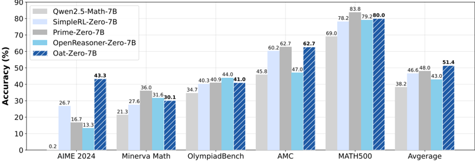

*Figure 2: Model performance comparison. Oat-Zero-7B is RL-tuned with our minimalist recipe described in Sec. 1 (third paragraph). Please see Sec. B for more results.*

**② 方法 / 架构图**

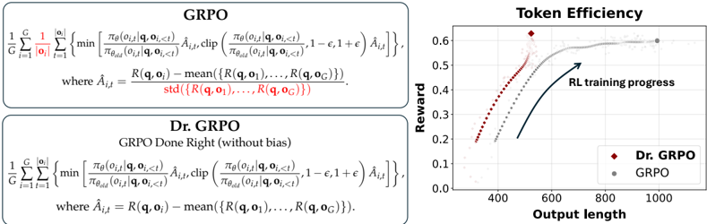

*Figure 1: Left : Dr. GRPO introduces simple yet significant modifications to address the biases in GRPO (Shao et al., 2024), by removing the length and std normalization terms. Right : Our unbiased optimizer effectively prevents the model from generating progressively longer incorrect responses, the*

### 一眼看懂

- 🟦 TL;DR：批判性审视 R1-Zero 范式的两大成分。**(成分一 base 模型)**:Qwen2.5 base **不用对话模板**时性能反而暴涨约 60%(疑似预训练就喂了拼接的 question-answer 文本→"已类 SFT");"Aha moment(自反思)"在多个 base(含 DeepSeek-V3-Base)中**RL 之前就已存在**,并非纯 RL 涌现,且自反思行为与最终准确率**不正相关**。**(成分二 RL 算法)**:GRPO 目标里的 **\(1/|o_i|\)(响应级长度偏置)** 与 **\(\mathrm{std}(R)\)(题目级难度偏置)** 会人为推高响应长度(尤其推长**错误**响应);去掉这两项得到无偏的 **Dr. GRPO**,在不掉推理性能下大幅缩短错误响应、提升 token 效率,并给出 7B 极简 SOTA 配方(AIME24 43.3%,8×A100/27h)。【原文 §Abstract / §2 / §3.1 / Fig.1–2】
- 最巧的一步：**从 GRPO 目标里删掉 \(1/|o_i|\) 与 \(\mathrm{std}(R)\) 两个归一化项**(Fig.1 左)。抽掉这个"删除"就回到 vanilla GRPO 的病态——Fig.4 证明 GRPO 的有效优势 \(a_{i,t}\) 等价于无偏优势 \(\tilde A_{i,t}=R-\mathrm{mean}(R)\) 被 \(1/|o_i|\) 与 \(1/\mathrm{std}(R)\) **重加权**后的版本;对负优势(错误响应),长响应因 \(|o_i|\) 大而被罚得轻→策略偏好"把错误答案拖长"以摊薄惩罚。这是把"RL 长度增长是 feature"重新诊断为"部分是优化 bug"的关键一刀。【原文 §3.1 / Fig.4】

### 为什么做

- 研究背景：DeepSeek-R1-Zero(Guo et al. 2025)证明可不经 SFT、直接对 base 大规模 RL 提升推理,伴随 RL scaling(响应长度持续增长)与"Aha moment"。社区多用 Qwen2.5 + GRPO 复现(SimpleRL-Zero、Open-Reasoner-Zero、PRIME 等)。【原文 §1】
- 解决的具体痛点：厘清 R1-Zero 里**哪些现象是真涌现、哪些是预训练遗留 / 优化假象**;并修掉 GRPO 的优化偏置以提升 token 效率;给一个极简配方。【原文 §1 takeaways】
- 相关工作 & 各自不足(原文 §2.3 / §3.1 末,逐条点名)：
  - **GRPO(Shao et al. 2024)**:组内相对优势 + 长度归一化的免 critic PPO 变体——其 \(1/|o_i|\) 长度归一化与 \(\mathrm{std}(R)\) 题目归一化引入偏置(本文核心批判对象)。
  - **前人对 Aha 的怀疑(Liu et al. 2025b、Yeo et al. 2025)**:已疑"开源 R1 复现里 Aha 是 base 自带",但**没测真正训出 R1-Zero 的 DeepSeek-V3-Base**——本文自托管 685B V3-Base 补上这一块,确认它也有 Aha。
  - **开源 PPO/GRPO 实现普遍有长度 bias(Table 2)**:trl(von Werra)、OpenRLHF(Hu)、verl(Sheng)、SimpleRL-Zero(Zeng)、Open-Reasoner-Zero(Hu)——**全部**用响应长度归一化 loss(`masked_mean`),与 PPO 原始目标 Eq.2 不符;作者推测这源自预训练阶段"按固定上下文长度归一化提数值稳定"的惯性,但 RL 阶段响应长度非常数,引入意外 length bias。【原文 §2.3 / §3.1 末 / Table 2 / Listing 1】
- 动机链：现状(R1-Zero 把"长度增长 + Aha"当 RL 涌现的证据)→ 质疑(① base 是否本就会做题/会自反思? ② 长度增长是真推理需要还是优化 bug?)→ 诊断(base 去模板性能反升 60% + V3-Base 有 Aha → 归因部分站不住;Fig.4 显示 GRPO 优势被长度/std 重加权)→ 所以(去掉两个归一化得无偏 Dr. GRPO;并据 base 分析定极简配方)。【原文 §2–3】
- 与最近邻工作的 Δ：相对**原版 GRPO**——Dr. GRPO 把 token 级 loss 的归一化从"除以本响应长度 \(|o_i|\)"改为"除以常数(生成预算)"、把优势从"减均值再除组内 std"改为"只减均值不除 std",恢复了**无偏的 PPO 风格优势**(蒙特卡洛回报 + 无偏 baseline)。相对其它 R1-Zero 复现——本文不追新算法,而是**批判性归因 + 极简化**。【原文 §3.1–3.2 / Fig.1】

### 怎么做 + 靠不靠谱

- **方法流水线(可复现级)**：输入(base 模型 + 合适模板 + 数学题集) → 每题采一组 \(G\) 个响应 → 用规则验证器(Math-Verify)给 0/1 outcome 奖励 \(R(q,o)=\mathbb{1}[o\text{ 含正确最终答案}]\)(取 \(\beta=0\),**去掉 KL 项**,省 ref 模型显存且对 R1-Zero 可能更好) → 算优势 \(\tilde A=R-\mathrm{mean}(R)\)(**不除 std**) → token 级 loss 用 `masked_sum / 常数(生成预算)` 归一化(**不除 \(|o_i|\)**) → PPO 风格 clip 更新 → 输出。【原文 §3 / Eq.1–3 + 本地代码核】
- **核心目标的真实形式 + 直觉**：
  - RL 目标(token 级 MDP,Eq.1):\(\mathcal{J}(\pi_\theta)=\mathbb{E}_{q\sim p_Q}\big[\mathbb{E}_{o\sim\pi_\theta(\cdot\mid q)}[R(q,o)]-\beta D_{\mathrm{KL}}[\pi_\theta(\cdot\mid q)\|\pi_{\mathrm{ref}}(\cdot\mid q)]\big]\),本文全程取 \(\beta=0\)(规则验证器无分布漂移之虞,可去 KL)。
  - PPO 代理(Eq.2):\(\mathcal{J}_{\mathrm{PPO}}=\mathbb{E}\sum_{t=1}^{|o|}\min\big(\tfrac{\pi_\theta(o_t\mid q,o_{<t})}{\pi_{\theta_{\mathrm{old}}}}\hat A_t,\;\mathrm{clip}(\tfrac{\pi_\theta}{\pi_{\theta_{\mathrm{old}}}},1-\epsilon,1+\epsilon)\hat A_t\big)\)。
  - **GRPO(有偏,Eq.3)**:\[\mathcal{J}_{\mathrm{GRPO}}=\mathbb{E}\,\frac{1}{G}\sum_{i=1}^{G}\frac{1}{|o_i|}\sum_{t=1}^{|o_i|}\min\!\big(\cdots\hat A_{i,t},\,\mathrm{clip}(\cdots)\hat A_{i,t}\big),\quad \hat A_{i,t}=\frac{R(q,o_i)-\mathrm{mean}(\{R(q,o_j)\})}{\mathrm{std}(\{R(q,o_j)\})}.\]
  - **Dr. GRPO(无偏,Fig.1 左)**:删掉 \(\tfrac{1}{|o_i|}\) 与 \(\mathrm{std}(\{R\})\),即 \(\hat A_{i,t}=R(q,o_i)-\mathrm{mean}(\{R(q,o_j)\})\),且 loss 用常数 `MAX_TOKENS`(生成预算)归一化。原文证明:这恰好**恢复 PPO 目标 Eq.2**,优势为"蒙特卡洛回报 + 无偏 baseline"(Sutton & Barto)。
  - **偏置分解(Fig.4,核心机制)**:GRPO 的每 token 有效优势 \(a_{i,t}=\tilde A_{i,t}\cdot\tfrac{1}{|o_i|}\cdot\tfrac{1}{\mathrm{std}(R)}\),其中 \(\tilde A_{i,t}=R(q,o_i)-\mathrm{mean}(R)\)。两个偏置:
    - **响应级长度偏置(来自 \(1/|o_i|\))**:正优势(正确)时短响应每 token 梯度被放大→偏好简短正确;**负优势(错误)时长响应因 \(|o_i|\) 大被罚得轻→偏好把错误答案拖长**(overthinking 的优化根源)。
    - **题目级难度偏置(来自 \(1/\mathrm{std}(R)\))**:std 小的题(太易/太难,奖励几乎全 1 或全 0)被赋过高权重;advantage normalization 本应跨整 batch 算,GRPO 却按题归一化→难度偏置。
  - 直觉:"别让算法因为分母而偏爱长错答或极端难度题"。【原文 §3 / Eq.1–3 / Fig.4】
- 逐组件必要性：
  - **去 \(1/|o_i|\)(Modification 1)**：没它→错误响应被激励变长(overthinking)。本地核 `train_zero_math.py` L288–290:`masked_sum(..., constant_normalizer=generate_max_length) if critic_type=="drgrpo" else masked_mean`。【原文 §3.1/§3.2】
  - **去 \(\mathrm{std}(R)\)(Modification 2)**：没它→难/易题被赋过高权重。本地核 `compute_monte_carlo_advantages` L294–308:`advantages = rewards - values`,仅 grpo 才 `/= (std + 1e-8)`。【原文 §3.1/§3.2】
  - 两处修正各有清晰数学动机(恢复无偏优势),Fig.4 给出"为什么有偏"的图示,是本文最扎实的部分。
- 实验与证据：
  - **极简 SOTA 配方**：Dr. GRPO 对 Qwen2.5-Math-7B 在 MATH lv.3-5 + Qwen-Math 模板上 RL → AIME24 **43.3%**(Fig.2 Oat-Zero-7B Avg 51.4,超 SimpleRL-Zero 38.2 / PRIME 48.0 / OpenReasoner-Zero 43.0),仅 8×A100、27h。【原文 §1 / Fig.2】
  - **算法对比(Fig.5)**：vanilla GRPO 与 Dr. GRPO 的 reward 曲线相近(Plot 1),但 Dr. GRPO **阻止响应长度失控**(Plot 2)、**错误响应长度大幅下降**(Plot 4)、token 效率更高;两者都呈"长度随 reward 增长"的 R1-Zero 趋势(但 GRPO 的增长部分是 bug)。【原文 §3.1 / Fig.5】
  - **base 发现**：Table 1——Qwen2.5-Math-7B 在 No template 下 Avg 38.2,而 **R1 template 下 Avg 暴跌到 0.0**(模板-模型严重不匹配会先破坏能力);No template(38.2)比 4-shot(23.8)高 ~60%。Fig.3:三轴(Question-Answering Ability / Exploration pass@8 / Self-Reflection),所有 base 都"可探索"(pass@8>0,Qwen2.5 最强,甚至超 DeepSeek-V3-Base);DeepSeek-V3-Base 在 R1 模板下也产生相当多自反思("Aha"/"wait",Fig.13)。原文据 pass@8 给出 RL 可行性判据:"if a base policy cannot even sample a single trajectory that leads to the correct final answer, it is impossible for RL to improve"。【原文 §2.1–2.3 / Table 1 / Fig.3】
  - **自反思≠更准**：自托管 DeepSeek-R1-Zero 分析同一批 MATH 题,自反思更频繁,但**与更高准确率不正相关**(§2.3 末 / §F)——削弱"自反思→更强推理"的强主张。【原文 §2.3 / §F】
  - **§2.4 补充**:Math pretraining on Llama-3.2-3B 抬高其 RL 天花板——说明 RL 上限由 base 预训练特性决定。【原文 §2.4 takeaway】
  - baseline 公平吗：算法对比同 base(Qwen2.5-1.5B)、同 R1 模板、同 Math-Verify 0/1 奖励——较公平;base 分析用统一 500 MATH 题 + GPT-4o-mini 判"是否作答格式"。
  - "看着强但没回答核心问题":算法侧(去 bias→省 token 不掉分)直接切题且证据强;base 侧多为观察性/相关性证据。
- 假设与失效边界：
  - 【原文 §2.2】"Qwen2.5 预训练用了 QA 拼接文本(maximize \(\log p_\theta(q;o)\))"是从"去模板性能反升 60%"**反推的假设**(Qwen2.5 数据未公开),非直接数据审计——作者措辞 "we hypothesize"。
  - 【原文 §3 / Hu et al.】假设 **\(\beta=0\)(去 KL)**——因用规则验证器无分布漂移之虞;在用学习型奖励模型时该假设不成立。
  - 【推断】**评测几乎全是数学**——去偏置结论在代码/通用推理上的迁移性未验证。依据:训练/评测集均为 MATH/AIME/AMC/Minerva/Olympiad。
  - 【推断】**去 std 的代价**:std 归一化本意是稳定不同难度题的梯度尺度,移除后在极端难度分布下是否引入新不稳定,论文着墨不多;常数归一化(`generate_max_length`)引入新超参,其取值影响梯度尺度、需配 lr 调(原文 Listing 1 注:"Other constants also work with differences in gradient norm")。
- 祛魅总结【推断】：
  - 真贡献:**算法侧**(Fig.4 的偏置分解 + 两行去偏 + token 效率提升)是干净、可复核、影响广的结果,已被社区广泛引用/采纳;极简 7B 配方提供了强 baseline。**认知侧**祛了"长度增长=推理变强""Aha=RL 涌现""自反思→更准"三个被过度解读的叙事。
  - 包装/证据强度落差:部分批判性结论(尤其 base 归因:"已类 SFT""Aha 早已存在")的**证据强度低于其修辞强度**——多为相关性/定性识别,缺统一量化判据与数据审计。"competitive minimalist SOTA"依赖特定 base(Qwen2.5-Math)与数学域,普适性有限。

### 结构化抽取

- 🎯 机制速览6轴：
  - **学什么信号**：规则验证器(Math-Verify)的 outcome 0/1 奖励 → 蒙特卡洛回报 → 组内减均值的无偏优势 \(\tilde A_{i,t}=R-\mathrm{mean}(R)\)(不除 std);属 RLVR。
  - **改什么**：改 **RL 目标的归一化**(去 \(1/|o_i|\) 与 \(\mathrm{std}(R)\));不改模型结构/数据,只改 advantage 与 loss 归一化。
  - **何时改**：RL 训练时(每步 rollout 后算优势、更新)。
  - **免梯度?**：否——这是策略梯度/PPO 风格 RL,核心就是梯度优化(但去掉 critic/value 模型、去掉 KL ref)。
  - **记忆-技能生命周期**：纯参数内 RL,无外部记忆/技能库;"技能"=推理能力,靠 RL 在 base 已有探索能力上放大。
  - **防遗忘机制**：无(且明确 \(\beta=0\) 去掉了 KL-to-ref 这一最常见的"防漂移"项);本文关注 token 效率而非遗忘。
- ⑦ 开源代码+框架/harness：https://github.com/sail-sg/understand-r1-zero (本地已克隆 ~56MB)。训练入口 `train_zero_math.py`(含 Modification 1 masked_sum 常数归一化、Modification 2 MC 优势不除 std,**本地均核对**);算法包 `understand_r1_zero/`(含 `math_grader.py`)。**框架=自研 Oat**(sail-sg 的模块化 LLM online alignment/RL 框架,底层 vLLM + DeepSpeed),奖励 Math-Verify。资产 HF `sail/Oat-Zero`。代码可得性高。【本地仓库核查】
- 💰 资源/成本与可扩展性：极简配方 8×A100、27h 出 7B SOTA(强调低成本);去 KL 省 ref 模型显存/算力;去 critic(GRPO 本就免 value 模型)。【原文 §1 / §3】
- 🎯 对"探索-巩固"对标：**中-强支撑(机理诊断层)+ 直接可借的训练信号工具**。判定依据:① **token 效率/抑制 overthinking** 与本课题"巩固=固化有效路径而非冗长试错"目标一致——Dr. GRPO 证明"无偏优势能让模型用更短正确路径解题"(Fig.5 Plot 4 错误响应长度下降),对"路径选择/巩固"有直接价值;② **base 已具探索能力(pass@8>0)+ 模板构造探索性 base policy** 的观察支撑本课题"探索=发现自己能走通的开头"——RL/OPD 的探索上限由 base 决定,"偏向自己能走通的开头"有据。**可借组件**:去偏的无偏优势 \(\tilde A=R-\mathrm{mean}(R)\) + 常数归一化,可作 MTP/OPD 的 RL 巩固阶段的稳定信用分配基座(避免长度/难度偏置污染"关键步"的信用)。**缺口**:① 无 teacher 脚手架/无蒸馏(纯 self-play RL);② 无 path-recovery 单点接管、无显式"走偏→回轨"机制(只是统计上缩短错误响应);③ 无 MTP/前瞻、无记忆/技能库;④ "自反思≠更准"的发现对本课题是**警示**——别假设让 student 多自反思就更好,要看是否真提升解题。
- 🔭 开放问题/未来方向：
  - 【原文】把无偏优化推广到代码/通用推理;更系统地量化"自反思 vs 准确率"的关系;理解 base 预训练特性如何决定 RL 上限(§2.4 Llama-3.2-3B 数学续训抬高 RL 天花板)。
  - 【推断】把"去 bias 的信用分配"与"关键步/高熵分支的稀疏信用"结合,让 RL 只在真正影响成败的步上给信号(贴近本课题稀疏脚手架);研究去 std 后对极端难度题的稳定性补丁。

RETURN: dr_grpo | 读PDF=是(§1–3.2 全文 + Eq.1–3/Table1/Table2/Fig.1–5/§2.3 自反思≠更准/§2.4,并本地核 train_zero_math.py 两处修改) | 加厚=是(新增 RL 目标 Eq.1、PPO Eq.2、GRPO Eq.3、Dr.GRPO 优势、Fig.4 偏置分解 \(a_{i,t}=\tilde A/|o_i|/\mathrm{std}\) 全 MathJax;related work 补 Table2 五个有 bug 的开源实现 + Listing1;补 pass@8 RL 可行性判据) | LaTeX公式=7条(RL目标Eq.1、PPO Eq.2、GRPO Eq.3+优势、Dr.GRPO优势、偏置分解 a_{i,t}、奖励 R、内联多处) | 待核=0

---

## The Entropy Mechanism of Reinforcement Learning for Reasoning Language Models

> **`entropy_mechanism`** ｜ 上海 AI Lab / 清华 / UIUC / 北大 / 南大 / CUHK（PRIME-RL 团队，Ganqu Cui、Yuchen Zhang、Jiacheng Chen 等共同一作；Ning Ding/Bowen Zhou/Yu Cheng 通讯） ｜ 2025-05-28 (arXiv:2505.22617 v1，预印本) ｜ L3 RLVR/GRPO · 相关性高 ｜ [📄 原始论文](https://arxiv.org/abs/2505.22617)

### 关键图示

**① Motivation / 对比图**

*Figure 1: Left: Entropy collapse and performance saturation. Over 95% entropy drop/performance gains take place at the early stage of RL training. The model then reaches a plateau with little improvement. Right: The predictable relationship between validation performance and policy entropy. Without*

**② 方法 / 架构图**

*Figure 8: Left: The dynamics of policy entropy (step-wise entropy difference) and covariance during on-policy GRPO training. They show similar trends as expected from the theoretical results. Right: Different prompt groups show distinct covariance behaviors. Easier prompts with higher accuracy have*

### 一眼看懂

- 🟦 TL;DR：在可验证奖励 RL（RLVR）训练推理模型时，策略熵会在头 200 步就急剧坍缩到接近 0，模型变得过度自信、再也探索不动，性能随之触顶——而且这个上限是可预测的：验证性能 \(R\) 与熵 \(H\) 满足经验定律 \(R=-a\exp(H)+b\)，\(H=0\) 时 \(R=-a+b\) 就是天花板【原文 Abstract, §2.4, Fig.1】。本文进一步从动力学上证明"两步间熵变 \(\approx -\eta\,\mathrm{Cov}(\log\pi(a),\,\pi(a)A(a))\)"（即动作 log 概率与其 logit 变化的协方差），而 logit 变化在策略梯度下 \(\propto A\)；于是提出 **Clip-Cov / KL-Cov** 两个只动一小撮"高协方差 token"的简单干预，持续维持探索、突破熵瓶颈【原文 Abstract, §3, §4.2, Listing 1】。
- 最巧的一步：把"调熵"精准化到**协方差**这一个量上。抽掉"只干预高协方差 token"这一步、退回对全局加熵正则/KL 正则——论文 §4.1 实测朴素正则要么压不住坍缩要么过度扰动优化（失效）。而 Clip-Cov/KL-Cov 仅干预 \(2\times10^{-4}\sim2\times10^{-3}\) 比例的 token 就能彻底改变熵曲线，说明少数"pivotal token"主宰了 LLM 的熵（Table 1：Top 0.02% token 平均协方差 5.654，全体均值仅 0.003，差 ~1800×）。所以"用协方差当阈值、只动 pivotal token"是命门【原文 §4.1, §4.2 Table 1, §4.5】。

### 为什么做

- 研究背景：RLVR 被视作后训练算力的下一增长极（数学/代码等有客观奖励的任务上持续提升推理）。RL 的核心是探索-利用权衡（Sutton 1988），策略熵直接度量探索潜力；传统 RL 把"抑制熵下降"当作多数算法必备（Williams&Peng 1991、Williams 1992、Eysenbach&Levine 2021），常用熵正则/KL 正则主动控熵（Ziebart 2008、Schulman 2017b、Haarnoja 2018）【原文 §1, §5】。
- 解决的具体痛点：① LLM 策略熵的典型行为缺乏定量刻画——大家都见过"训练后期过度自信、探索枯竭、性能饱和"，但没规律；② **熵坍缩**：无干预时熵早期急降到 ~0，性能触顶，意味着继续投算力边际收益趋零，直接限制"扩 RL 算力"的价值；③ 朴素熵/KL 正则在 LLM RLVR 上被证明无效（§4.1：熵正则系数小则无效、0.01 则熵爆炸、0.005 能稳但不超 baseline；KL 正则虽稳熵反而降分）【原文 §1, §2.3, §4.1】。
- 相关工作 & 各自不足（来龙去脉）：
  - ① **最大熵 RL / 熵正则**（Ziebart08 IRL、Haarnoja18 SAC、Schulman17b PPO 的熵 bonus）——在传统 RL 里是抗早熟、保探索的必备手段，但本文 §4.1 证明朴素照搬到 LLM RLVR 无效（超参敏感或损性能），这是本文最直接要打破的"默认做法"。
  - ② **RL for LLM 里"是否保留熵正则"的分歧**——Ouyang22(InstructGPT) 保留熵 bonus；而近期 RLVR 主力（Shao24 GRPO/DeepSeekMath、He25、Cui25 PRIME、Hu25、Yu25 DAPO、Liu25）多直接去掉熵/KL 项，本文为"为什么去掉它们也没解决坍缩"给出机理解释。
  - ③ **RL 可预测性 / Scaling**——此前只在非 LLM agent 上研究"策略性能 vs 算力"的 scaling（Hilton23、Rybkin25 ProRL）；Gao22 用 KL 预测 reward 建模 RLHF over-optimization（与本文"用熵预测性能"同思路、且共享"系数随模型尺寸 log-linear"的发现）；但 LLM RLVR 的 entropy-performance 可预测性此前无人系统建。
  - ④ **clip-higher 类调熵 trick**（DAPO，Yu25）——把 PPO 上界 \(\epsilon\) 从 0.2 调到 0.28 间接抬熵；本文把它解释为"实际是在加低协方差 token"，并作为最强 baseline 直接对比。
  - ⑤ **"RL 只是激发 base 已有行为、打不破天花板"之争**（Yue25）——本文 §2.6 条件性支持：若熵坍缩则天花板存在且可预测，但论证天花板源于"熵机制"而非 RL 本身的内禀限制。
- 动机链：熵坍缩可预测地锁死性能上限 → 应当 (1) 给它建一条像 Scaling Law 那样可外推的经验定律（用早期/小模型预测终态），(2) 从优化动力学找坍缩根因，(3) 据此设计能持续注入探索、突破熵瓶颈的可扩展方法【原文 §1, §2】。
- 与最近邻工作的Δ（精确差异）：最近邻是 clip-higher（DAPO）与各种熵正则 trick。Δ 在于本文不只给一个 trick，而是建立"经验定律→动力学根因（协方差）→按根因设计干预"的完整因果链；且把 clip-higher 解释为"实际是在加平均协方差 ~−0.03 的低协方差 token"，而本文直接用协方差当阈值，控熵更精准、可双向（既能抬也能压）【原文 §4.5】。为什么有用：理论→方法→效果闭环比单报 trick 更有说服力，且能定量预测上限。

### 怎么做（细到可复现）
#### 0. 记号与目标（§2.1）

- 输入 prompt \(x\)，LLM 策略 \(\pi_\theta\) 自回归生成 \(y=\{y_1,\dots,y_T\}\)，verifier 给奖励 \(r(y)\)。目标 \(\max_\theta J(\theta)=\mathbb{E}_{x\sim D,\,y\sim\pi_\theta(x)}[r(y)]\)（Eq.1）。
- 策略梯度 \(\nabla_\theta J(\theta)=\mathbb{E}\big[\sum_{t}\nabla_\theta\log\pi_\theta(y_t\mid y_{<t})\,A_t\big]\)（Eq.2）。REINFORCE 取 \(A_t=r(y)\)；GRPO/RLOO 用组内归一 \(A_t=\dfrac{r(y)-\mathrm{mean}(r(y_{1:K}))}{\mathrm{std}(r(y_{1:K}))}\)（Eq.3，每 prompt 采 \(K\) 个响应）；PPO 用 clipped surrogate（Eq.4）。
- **策略熵定义**（Eq.5，token 级、按响应长归一）：\(H(\pi_\theta,D)=-\dfrac{1}{|D|}\sum_{x\in D}\dfrac{1}{|y|}\sum_{t=1}^{|y|}\mathbb{E}_{y_t\sim\pi_\theta}[\log\pi_\theta(y_t\mid y_{<t},x)]\)，逐 batch 计算。

#### 1. 经验定律（§2.3–2.5）：性能与熵的可预测关系

- **现象（Fig.1/2）**：跨 11 个 RL run，头 200 步占 ~73% 熵消耗 + 76% 性能增益；头 800 步占 >93% 增益 + 94% 熵损失——即后 2/3 步只剩边际收益。
- **定律**：\(R=-a\exp(H)+b\)（仅 2 系数拟 >200 数据点）。微分得 \(\dfrac{dR}{dH}=-a\exp(H)\)，故 \(a\)= "把熵换成性能"的转化率，\(-a+b\)（\(H=0\)）= 熵耗尽时的性能天花板。〔注：原文 §2 takeaway 框内排版作 \(R=-a\exp(H+b)\)，但 Fig.1、微分式 \(dR/dH=-a\exp H\) 与各处一致表明真实形式是 \(R=-a\exp(H)+b\)；以 Fig.1 为准〕
- **可外推性两证**：① 用前 36 步（~15%）拟合即可外推 200 步，数学 RMSE 0.9%、代码 1.2%，终步 0.5%/1.9%（Fig.5）；② 系数 \(a,b\) 与模型参数量（去 embedding）呈 **log-linear**（Fig.7），可由小模型外推大模型终态——即"训小模型→预测大模型 RL 后性能、不必真训"。系数与 RL 算法无关（GRPO/RLOO/PRIME/REINFORCE++ 拟合同一曲线，Fig.6），说明 \(a,b\) 是策略模型+数据的内禀属性。

#### 2. 熵动力学理论（§3）：坍缩的根因 = 协方差

- **Lemma 1（softmax 策略的熵差，一阶近似）**：对 tabular softmax 策略 \(\pi_\theta(a\mid s)=\dfrac{\exp(z_{s,a})}{\sum_{a'}\exp(z_{s,a'})}\)（Eq.7），相邻两步熵差
\[
H(\pi^{k+1}_\theta\mid s)-H(\pi^{k}_\theta\mid s)\approx-\,\mathrm{Cov}_{a\sim\pi^k_\theta(\cdot\mid s)}\big(\log\pi^k_\theta(a\mid s),\ z^{k+1}_{s,a}-z^{k}_{s,a}\big).
\]
直觉：动作更新前已是高概率、更新后 logit 又升 → 降熵。

- **Proposition 1（PG 下的 logit 变化）**：vanilla PG 更新 \(z^{k+1}_{s,a}-z^{k}_{s,a}=\eta\,\pi_\theta(a\mid s)\,A(s,a)\)。
- **Theorem 1（PG 下熵变）**：\(H(\pi^{k+1}_\theta\mid s)-H(\pi^{k}_\theta\mid s)\approx-\eta\,\mathrm{Cov}_{a\sim\pi^k_\theta}\big(\log\pi^k_\theta(a\mid s),\ \pi^k_\theta(a\mid s)\,A(s,a)\big)\)。
- **Theorem 2（NPG 下熵变，去掉 \(\pi\) 权重）**：\(\approx-\eta\,\mathrm{Cov}\big(\log\pi^k_\theta(a\mid s),\ A(s,a)\big)\)（KL-Cov 即基于此）。
- **结论**：\(P(a)\) 与 \(A(a)\) 强正相关 → 平均降熵；负相关 → 升熵。即"高概率×高 advantage"的动作被进一步强化、迅速降熵；"稀有×高 advantage"才升熵。
- **实证（§3.3，Fig.8）**：bandit 设定（prompt=state，整条响应=action），按 Eq.8 算组内协方差、Eq.9 按响应长归一 log-prob；实测 \(-d(H)\) 与 \(\mathrm{Cov}(\cdot)\) 曲线高度同步且 \(\mathrm{Cov}\) 全程为正→熵持续降；难题（低准确率）协方差更小（模型未校准），易题协方差更大。

#### 3. 两个干预（§4.2，Listing 1，只改几行 loss）

- **token 级协方差**（Eq.10，对一 batch \(N\) 个 token 的中心化叉积）：
\[
\mathrm{Cov}(y_i)=\Big(\log\pi_\theta(y_i)-\tfrac1N\textstyle\sum_j\log\pi_\theta(y_j)\Big)\cdot\Big(A(y_i)-\tfrac1N\textstyle\sum_j A(y_j)\Big).
\]

- **Clip-Cov**：先按 Eq.10 算协方差，从落在 \([\omega_{\text{low}},\omega_{\text{high}}]\) 区间的高协方差 token 中**随机**选 \(\lfloor r\cdot N\rfloor\) 个（Eq.11），把这些 token **从策略梯度 detach**（停更）：
\[
L_{\text{Clip-Cov}}(\theta)=\begin{cases}\mathbb{E}_t\big[\tfrac{\pi_\theta(y_t\mid y_{<t})}{\pi_{\theta_{\text{old}}}(y_t\mid y_{<t})}A_t\big], & t\notin I_{\text{clip}}\\[4pt]0, & t\in I_{\text{clip}}\end{cases}\quad(\text{Eq.12}).
\]

- **KL-Cov**：取协方差 **Top-\(k\)** 比例 token（Eq.13），对它们额外加"当前策略 ↔ rollout 策略"的 KL 惩罚：
\[
L_{\text{KL-Cov}}(\theta)=\begin{cases}\mathbb{E}_t\big[\tfrac{\pi_\theta}{\pi_{\theta_{\text{old}}}}A_t\big], & t\notin I_{\text{KL}}\\[4pt]\mathbb{E}_t\big[\tfrac{\pi_\theta}{\pi_{\theta_{\text{old}}}}A_t-\beta\,D_{\text{KL}}(\pi_{\theta_{\text{old}}}\Vert\pi_\theta)\big], & t\in I_{\text{KL}}\end{cases}\quad(\text{Eq.14}).
\]

- **数据流动**：rollout 采样 → 算 token-级 \(\log\pi,A\) → Eq.10 算每 token 协方差 → 选 pivotal token 索引集 → 对这撮 token 改写 loss（detach 或加 KL）→ 反传更新全参。整条管线相对 vanilla GRPO 只新增"算协方差 + 选索引 + 改这撮 token 的 loss"几行（伪代码 Listing 1 即官方 veRL `core_algos.py` 的实现原型）。
- **关键超参默认值（§4.3）**：Clip-Cov \(r=2\times10^{-4}\)、\(\omega_{\text{low}}=1,\omega_{\text{high}}=5\)（均 >500× 平均协方差）；KL-Cov \(k=2\times10^{-3}\)(7B)/\(2\times10^{-4}\)(32B)、\(\beta=1\)；DAPO-MATH 训练，batch 256 prompt × 8 响应、温度 1、每 rollout 做 8 次更新、max gen 8192；评测 AIME/AMC 用温度 0.6，其余贪心。

#### 逐组件必要性

- **经验定律 \(R=-a\exp(H)+b\)**：负责"why it matters"——证明性能是用熵换的、上限可预测。跨 Qwen2.5/Mistral/LLaMA/DeepSeek-Math 多族多尺寸（0.5–32B）拟合良好【§2.4, Fig.3–7】。
- **协方差理论**：负责"why 坍缩"。Fig.8 实证 \(\mathrm{Cov}\) 与 \(-d(H)\) 精确同步、全程为正。是 softmax+PG 的一阶分析【§3.3】。
- **Clip-Cov / KL-Cov**：负责"how to fix"。vs vanilla GRPO（坍缩饱和）、vs clip-higher（早期抬熵但后期不稳回落），两干预都更稳且持续提分；KL-Cov 比 Clip-Cov 熵曲线更稳【§4.3–4.4, Fig.11–12】。
- **反向消融**：去掉协方差选择、退回全局熵/KL 正则 → §4.1 实测失效（这是本文的"没它会怎样"）。

### 靠不靠谱

- 实验与证据：
  - **拟合实验（覆盖广）**：4 族 11 base（0.5–32B）、数学+代码、8 公开 benchmark、4 种 RL 算法；Zero 设置从 base 起 RL，veRL 框架，lr 5e-7（policy）/1e-6（PRIME 的隐式 PRM）、KL 系数默认 0、\(\epsilon=0.2\)、batch 256、micro-batch 128、rollout 512 prompt×8 响应、过滤全对/全错 prompt【原文 §2.2】。
  - **Clip-Cov/KL-Cov 主实验（Table 2）**：Qwen2.5-7B/32B，测 MATH500/AIME24/AIME25/AMC/OMNI-MATH/OlympiadBench/Minerva（AIME/AMC 为 avg@32）。**关键数字**：较 GRPO 平均 **7B +2.0%、32B +6.4%**；32B 上 KL-Cov 在 AIME24 36.8（GRPO 21.8）、AIME25 30.8（GRPO 16.2），即 AIME 上 **+15.0%/+14.6%**；KL-Cov 能维持比 baseline 高 10× 的熵，响应长度稳增【原文 §4.3, Table 2, Fig.11】。
  - **baseline 公平吗**：较公平——主 baseline 是 vanilla GRPO 与 GRPO+clip-higher（\(\epsilon\)→0.28），同 DAPO-MATH、同采样预算，且把 clip-higher 的机理拆开对比。
  - **"看着强但没回答核心问题"**：维持熵≠一定更好——§4.5 自承"没观察到干预后熵与性能的明确关系，是否存在最优熵值仍 open"。即方法能提分，但"该维持到多高"无自适应准则。
- 假设与失效边界：
  - 【原文】定律/理论建立在 softmax 策略 + Policy Gradient/Natural PG 上；用可验证任务（数学/代码）避免 reward hacking（§2.1）；Lemma/Prop 均基于 tabular softmax 一阶近似（证明在 Appendix E）。
  - 【原文】§2.6 自承：换不同策略模型（Luo25 ProRL）或用 off-policy 数据（Yan25）会观察到不同熵模式，故可预测性"非普适"。
  - 【原文】§4.5 明确：最优熵值未知；干预后熵与性能无明确单调关系。
  - 【推断】\(R=-a\exp(H)+b\) 是拟合关系而非严格因果，外推到极大算力/更强模型是否仍成立未验证（依据：拟合上限到当前实验规模，§2.4–2.5）。
  - 【推断】协方差理论是局部一阶 tabular 分析，对加了大量工程 trick（各种 clip、长度惩罚）的实际 RLVR 只是近似（依据：§3 推导基于纯 PG/NPG）。
  - 【推断】干预把"调熵正则"换成"调协方差阈值"（\(r,\omega,k,\beta\)），并未消除调参负担，且最优值任务/尺寸相关（依据：§4.3 不同模型用不同 \(k\)）。
- 祛魅总结：
  - 真贡献【推断】：把"熵坍缩"从经验观察升级为定量定律 + 动力学根因（协方差）+ 按根因设计的最小干预，三者由"协方差"一概念贯穿，因果链完整、可复现（已合入官方 veRL）。
  - 包装/高估【推断】："性能上限完全可预测"在已测规模成立，被当作普适 scaling-law 式结论时易高估外推力；干预的提分（7B +2%）在 7B 上并不大，主要亮点在 32B（+6.4%、AIME +15%）。
  - 低估【推断】："只动 \(2\times10^{-4}\sim2\times10^{-3}\) token 就改写熵曲线"这一"pivotal token"现象，其对理解 LLM RL 的意义可能比提分本身更深远，但论文未深挖这些 token 是什么。

### 结构化抽取

- 🎯 机制速览6轴：**学什么信号**=可验证奖励（数学/代码对错）下的 advantage，外加"token 级协方差 \(\mathrm{Cov}(\log\pi,\Delta\text{logit})\)"作为控熵的诊断/干预信号｜**改什么**=策略全参（替换 PPO surrogate loss 的 clip/KL 项）｜**何时改**=训练期在线，每步对当批高协方差 token 施加干预｜**免梯度?**=否（仍是策略梯度 RL；Clip-Cov 对选中 token 局部停梯度=detach，KL-Cov 加 KL 惩罚）｜**记忆-技能生命周期**=无（纯 RL，无记忆/技能库）｜**防遗忘机制**=无显式机制（但"维持探索/抗坍缩"间接缓解过早收敛到单一模式）。
- ⑦ 开源代码+框架/harness：github.com/PRIME-RL/Entropy-Mechanism-of-RL（本地已 clone ~5.9MB，Tier A）；方法**已合入官方 veRL（PR #1830）**，上游 `recipe/entropy/`，可经 `loss_mode=clip_cov`/`kl_cov` 直接用。框架=**veRL**，fork 自 **DAPO recipe**（`recipe/dapo/`），conda env `entropy`（environment.yaml）。代码已审计：`core_algos.py:compute_policy_loss_clip_cov` 在正协方差(lb~ub)token 上随机选 clip_ratio 比例、把校正系数置 0（停更）；`compute_policy_loss_kl_cov` 对协方差 Top-k% token 加 KL 惩罚——与论文 Listing 1/Eq.12/14 一致。运行：`bash recipe/dapo/7b_kl_cov.sh`（单节点）、`recipe/dapo/32b_*.sh`（多节点）。
- 💰 资源/成本与可扩展性：拟合实验跨 0.5–32B、4 RL 算法、8 benchmark，规模大；主干预实验 Qwen2.5-7B/32B、2400+ 步、batch 256、rollout 512×8、max gen 8192。干预本身近乎零额外算力（只改几行 loss、干预 \(\le2\times10^{-3}\) token）。具体 GPU 数/时长原文未说明【原文 §2.2, §4.3；GPU 成本：原文未说明】。
- 🎯 对"探索-巩固"对标：**支撑（机理层）+ 可借组件**。一句判定：本文为"探索"这一支提供了最直接的机理工具——它定量解释了"为什么 on-policy RL 会过早收敛、探索枯竭"，并给出"按协方差精准维持探索"的可移植手段。可借组件：① **协方差阈值控熵**可嵌入 MTP/OPD 的 RL 阶段，防止学生过早锁死到单一路径、保住"自选可走通开头"的多样性；② "**少数 pivotal token 主宰熵**"对"在关键步/高熵步接管"（path-recovery 单点接管）是强支撑（与 memory 里 sparse_critical 同构）；③ Theorem 1/2 把"高概率×高 advantage→降熵"形式化，可作"何时该让 teacher 重新打开探索"的判据。缺口：纯 RL、无 teacher 蒸馏、无 MTP、无巩固/防遗忘机制，只解决"别太快不探索"，不解决"探索到的怎么固化"。依据：§4.5 协方差只控探索强度，§4.2 干预只动 pivotal token。
- 🔭 开放问题/未来方向：【原文】是否存在平衡探索与稳定的最优熵值仍 open（§4.5）；scaling RL 不止于熵最小化（§6）。【推断】把"高协方差/pivotal token"与"高熵关键步/path-recovery 接管点"对齐，可能统一"控熵"与"在关键步注入 teacher 监督"两条线；将协方差诊断用于 on-policy 蒸馏，判断学生在哪些 token 已过度自信、该由 teacher 重新打开探索（依据：本文 pivotal token 现象 + 本课题 path-recovery 单点接管）。

读到PDF? 是（PyMuPDF 全文 22 页；正文 §1–4 + Lemma1/Thm1-2 + Eq.1–14 + Listing 1 全核，附录证明 E.2–E.4 未逐页核）｜L线 L3（RLVR 训练机理+算法；触及 L6 token 信用）｜对标结论 支撑探索支（控熵机理）+ 可借组件（协方差阈值控熵、pivotal token↔path-recovery 接管点、Thm1/2 降熵判据）；缺巩固/蒸馏/MTP｜残留待核 0

---

## Geometric-Mean Policy Optimization (GMPO)

> **`gmpo`** ｜ UCAS / CUHK / HKUST / Microsoft Research（多数实验在 MSR 实习完成） ｜ arXiv 2507.20673v3, 2025-10-18 · ICLR 2026 接收 ｜ 主题线 L3（RLVR/GRPO 稳定性）·相关性 中 ｜ [📄 原始论文](https://arxiv.org/abs/2507.20673)

### 关键图示

**① Motivation / 对比图**

*Figure 6: Sequence-level importance sampling ratios from trajectories that yield positive rewards during GRPO training. Without normalization, these ratios can become highly unstable, especially as the response length increases.*

**② 方法 / 架构图**

*Figure 1: Comparison between GRPO and our GMPO. GRPO optimizes the arithmetic mean of token-level rewards while GMPO the geometric mean (left). When training with GRPO, the important sample ratio ( ρ t ( θ ) = π θ ( o t | q,o <t ) π θ old ( o t | q,o <t ) ) frequently reaches extreme values, leading*

### 一眼看懂

- 🟦 TL;DR：GRPO 优化的是 token 级奖励的**算术平均**,对离群的重要性采样比 \(\rho_{i,t}(\theta)=\frac{\pi_\theta(o_{i,t}\mid q,o_{i,<t})}{\pi_{\theta_{\mathrm{old}}}(o_{i,t}\mid q,o_{i,<t})}\) 极敏感——某些 token 的 \(\rho_{i,t}\) 飙到极值,把整条梯度拽歪,引发激进更新→不稳定甚至崩溃【原文 §1, 图1】。GMPO 即插即用地把算术平均换成**几何平均**(在 log 空间做乘积+裁剪),几何平均天生抗离群、\(\rho\) 分布方差更低,于是能用**比 GRPO/DAPO 大得多的裁剪窗口** \((e^{-0.4},e^{0.4})\) 鼓励探索而仍稳定;7B 上五个数学基准平均 Pass@1 比 GRPO 高 4.1%【原文 摘要, 表1】。
- 最巧的一步：把聚合算子从「算术平均」换成「几何平均」(等价于 log 空间算术平均)。抽掉它就退化回 GRPO——单个极端 \(\rho_{i,t}\) 在乘积/对数和里被「摊薄」(\(1/|o_i|\) 次幂),不再单点主导梯度【原文 §3, 式3/6】。**几何平均这步是整篇的承重墙**：正因为聚合后方差小,才敢放开裁剪窗;裁剪放宽又是性能增益来源。两者是因果链而非独立 trick。

### 为什么做

- 研究背景：test-time scaling 把长 CoT-RL(GRPO 系)推成数学/代码推理主流范式;DeepSeek-R1([Guo 2025a])用可验证奖励证明了 RL 后训练能显著提升推理。但 **RL 训练稳定性本身**研究不足,而它是可靠、可 scale 后训练的前提(§2.1 末句:"the stability of RL for LLMs remains underexplored, yet it is essential")。
- 解决的具体痛点:
  - (1) GRPO 算术平均对离群 \(\rho_{i,t}\hat A_i\) 敏感→激进更新→进一步放大 \(\rho\) 方差→恶性循环、性能退化【§1, §3】;
  - (2) GRPO 用窄 clip \((0.8,1.2)\) 压制离群,副作用是**限制探索、过早确定性策略、熵快速塌缩、性能 plateau**【§1, 引 Yu 2025 DAPO】。两难:要么不稳,要么不敢探索。
- 相关工作 & 各自不足(§2.1 罗列一长串 GRPO 变体,可分几束):
  - **去 critic / 去 surrogate / 去 KL 这束**:GRPO([Shao 2024])去掉昂贵 value model;GPG([Chu 2025])进一步去 surrogate loss、critic、KL 约束;GVPO([Zhang 2025a])给解析 KL-约束权重;INTUITOR([Zhao 2025])用模型自置信度去掉外部 reward;PRIME([Cui 2025a])提供可扩展的隐式过程奖励 RL 框架。
  - **rollout 选择 / 偏置纠正这束**:SRPO([Zhang 2025c])历史重采样、DAPO([Yu 2025])动态采样 + clip-higher、Dr.GRPO([Liu 2025])去长度偏置、OPO([Hao 2025])最优 baseline 降梯度方差;PODS([Xu 2025])只训信息量大的子集、RePO([Li 2025])replay 拉回 off-policy 多样样本、RAFT([Xiong 2025b])只训正样本却能匹敌 GRPO。
  - **reward 塑形 / advantage 估计这束**:EMPO([Zhang 2025b])语义熵、AAPO([Xiong 2025a])advantage 动量、BNPO([Xiao 2025])Beta 分布自适应归一、Seed-GRPO([Chen 2025])按问题不确定性缩放更新、GRPO-lead([Zhang & Zuo 2025])长度依赖准确率/显式惩罚/难度重加权治稀疏奖励。
  - **效率 / 长度控制这束**:CPPO 剪低 advantage、S-GRPO 早退、Ada-GRPO 自适应推理格式、GRPO-λ 在长度惩罚/长度无关奖励间动态切换防崩。
  - **探索 / 熵这束**:80/20 规则([Wang 2025])强调高熵少数 token 主导、entropy-adv([Cheng 2025])熵视角 advantage 增强。
  - **数据这束**:Open-Reasoner-Zero([Hu 2025])129k 课程式数据、Eurus([Yuan 2024])大规模对齐数据 + 新 reward modeling。
  - 作者归纳:**多数变体聚焦采样/优势/奖励塑形,少有人正面攻「训练稳定性」这个根因**——这正是 GMPO 的切入口。
- 动机链：GRPO 强但不稳 → 不稳源于算术平均对离群敏感 → 几何平均对离群天然鲁棒、方差更低 → 用它替换即可既稳又能放开裁剪促探索 → 兼得稳定与探索。
- 本文站在谁肩上 & 与最近邻工作的精确差异：基线/setup 直接承袭 **Dr.GRPO**([Liu 2025])(同训练数据、同评测、忽略对 ref 的 KL 项)。最近邻是 **DeepSeek-R1** 的**序列级**乘积 + 序列级 clip(R1 最大化 \((\prod_t\rho_{i,t})\hat A_i\) 并在序列级 clip)。GMPO 关键差异两点——
  - (i) **token 级裁剪**而非序列级(序列级一旦触发把整条序列**所有** token 梯度清零、丢有效信号;且序列级 \(\rho\) 范围反而更大、更易制造极端梯度,图3 消融证实);
  - (ii) 几何平均带 **\(1/|o_i|\) 幂归一化**(DeepSeek-R1 序列级乘积**无此项**,长响应下 \(\rho\) 爆炸,附录 C 图6 证实)。这两点是「为什么 GMPO 比直接抄 R1 序列级更好用」的答案。

### 怎么做 + 靠不靠谱

- **GRPO 基线目标(§2.2,式1/2)**：对每题 \(q\) 从 \(\pi_{\theta_{\mathrm{old}}}\) 采一组 rollout \(\{o_1,\dots,o_G\}\)、算奖励 \(\{r_1,\dots,r_G\}\),最大化(式1):
  \[
  J_{\mathrm{GRPO}}(\pi_\theta)=\mathbb{E}_{q,\{o_i\}\sim\pi_{\theta_{\mathrm{old}}}}\frac{1}{G}\sum_{i=1}^{G}\frac{1}{|o_i|}\sum_{t=1}^{|o_i|}\Big\{\min\big(\rho_{i,t}(\theta)\hat A_i,\ \mathrm{clip}(\rho_{i,t}(\theta),\epsilon_{\mathrm{low}},\epsilon_{\mathrm{high}})\hat A_i\big)-\beta D_{\mathrm{KL}}(\pi_\theta\|\pi_{\mathrm{ref}})\Big\},
  \]
  其中 \(\rho_{i,t}(\theta)=\frac{\pi_\theta(o_{i,t}\mid q,o_{i,<t})}{\pi_{\theta_{\mathrm{old}}}(o_{i,t}\mid q,o_{i,<t})}\)、\(\hat A_i=\frac{r_i-\operatorname{mean}(\{r_1..r_G\})}{\operatorname{std}(\{r_1..r_G\})}\)。跟 Dr.GRPO 一样**忽略 \(D_{\mathrm{KL}}\) 项**省显存,简化为算术平均形式(式2):\(J^{*}_{\mathrm{GRPO}}=\mathbb{E}\big[\frac{1}{G}\sum_i\frac{1}{|o_i|}\sum_t\rho_{i,t}(\theta)\hat A_i\big]\)。

- **GMPO 目标(§3,式3/4)**：把算术平均换几何平均(式3):
  \[
  J^{*}_{\mathrm{GMPO}}(\pi_\theta)=\mathbb{E}_{q,\{o_i\}\sim\pi_{\theta_{\mathrm{old}}}}\frac{1}{G}\sum_{i=1}^{G}\Big(\prod_{t=1}^{|o_i|}\rho_{i,t}(\theta)\hat A_i\Big)^{\frac{1}{|o_i|}}\!\cdot\mathrm{sgn}(\hat A_i),
  \]
  \(\mathrm{sgn}(\hat A_i)\) 确保优化方向正确(\(\hat A_i>0\) 返 1、否则 −1;因为对负 advantage 取偶/奇次根会丢符号,需显式纠向)。加入 token 级 clip 后的完整目标(式4):
  \[
  J_{\mathrm{GMPO}}(\pi_\theta)=\mathbb{E}\frac{1}{G}\sum_{i=1}^{G}\Big[\prod_{t=1}^{|o_i|}\min\big(\rho_{i,t}(\theta)\hat A_i,\ \mathrm{clip}(\rho_{i,t}(\theta),\epsilon_{\mathrm{low}},\epsilon_{\mathrm{high}})\hat A_i\big)\Big]^{\frac{1}{|o_i|}}\!\cdot\mathrm{sgn}(\hat A_i).
  \]
  **值域收缩(§3 不等式,这是"为何更稳"的第一层证据)**:由 AM-GM,
  \[
  |J^{*}_{\mathrm{GMPO}}|=\mathbb{E}\Big|\tfrac{1}{G}\textstyle\sum_i\big(\prod_t\rho_{i,t}\hat A_i\big)^{1/|o_i|}\Big|\ \le\ \mathbb{E}\Big|\tfrac{1}{G}\textstyle\sum_i\tfrac{1}{|o_i|}\sum_t\rho_{i,t}\hat A_i\Big|=|J^{*}_{\mathrm{GRPO}}|,
  \]
  即 GMPO 目标值域更窄 → 训练方差更低 → 更稳。

- **方法流水线(逐步 输入→输出)**：① 采样组内 \(G\) 条 rollout、算组内相对优势 \(\hat A_i\)(同 GRPO,免 value)→ ② 每条序列内对 token 级 \(\rho_{i,t}\hat A_i\) 取**几何平均**(乘积后开 \(1/|o_i|\) 次幂、乘 \(\mathrm{sgn}(\hat A_i)\))→ ③ token 级裁剪到 \((e^{-0.4},e^{0.4})\)(比 GRPO/DAPO 宽)→ ④ 最大化该目标,按标准 policy gradient 更新。
- **真实实现:全在 log 空间(Algorithm 1,~10 行,复现关键)**：把概率取对数 `new_log_probs, old_log_probs = log(new_probs), log(old_probs)`;算 `sgn_A = +1/−1`;`sgn_A_log_probs_diff = sgn_A * (new_log - old_log)`;**先按 sgn 把对数差 clamp 到 \([-\epsilon,\epsilon]\)**(\(\epsilon=0.4\)),再 `min(原差, clamp 差)`、乘回 sgn_A 得 `log_probs_diff_min`;几何平均 = `exp( sum(log_probs_diff_min[mask]) / mask.sum() )`(即对数和除 token 数再指数 = 乘积开 \(1/|o_i|\) 次幂);`loss = -advantage * importance_sampling_ratio`。→ 乘积/裁剪都在 log 空间做,避免连乘数值下溢/上溢。
- 逐组件必要性(表4 消融,5 行对比,均 Qwen2.5-Math-7B):
  - **几何 vs 算术平均**(行1 GRPO 51.2 → 行5 GMPO 52.7,+1.5%):核心增益来源。
  - **\(1/|o_i|\) 幂归一化**(行4 去归一 52.0 vs 行5 52.7,−0.7%):附录 C 图6 给机理——长响应下序列级 \(\rho\) 随长度爆炸,归一压住。有消融。
  - **裁剪策略**(行2 不裁剪 52.3 / 行3 序列级裁剪 52.6 / 行5 token 级 52.7):性能差异其实**很小(0.1~0.4%)**,但 token 级裁剪让 \(\rho\) 范围最稳(图3)。〔推断〕裁剪方式对最终分数贡献边际,主要价值在稳定性而非精度。
  - **裁剪窗口大小**(表5:\((e^{-0.2},e^{0.2})\) 52.4 / \((e^{-0.4},e^{0.4})\) 52.7 / \((e^{-0.8},e^{0.8})\) 52.1 / \((-\infty,+\infty)\) 52.3):\((e^{-0.4},e^{0.4})\) 是甜点;过宽不稳、过窄抑探索。有消融。
- **关键机制/公式:梯度视角(§3 + 附录 A 引理1-3,这是「为何稳」的数学根)**：两目标的梯度都是"各 token policy gradient \(\hat A_i\nabla_\theta\log\pi_\theta(o_{i,t}\mid q,o_{i,<t})\) 的加权和",差在权重——
  \[
  \nabla_\theta J^{*}_{\mathrm{GRPO}}\big|_{q,o_i}=\frac{1}{G|o_i|}\sum_{t=1}^{|o_i|}\rho_{i,t}(\theta)\cdot\hat A_i\cdot\nabla_\theta\log\pi_\theta(o_{i,t}\mid q,o_{i,<t}),
  \]
  \[
  \nabla_\theta J^{*}_{\mathrm{GMPO}}\big|_{q,o_i}=\frac{1}{G|o_i|}\sum_{t=1}^{|o_i|}\Big(\prod_{k=1}^{|o_i|}\rho_{i,k}(\theta)\Big)^{\frac{1}{|o_i|}}\!\cdot\hat A_i\cdot\nabla_\theta\log\pi_\theta(o_{i,t}\mid q,o_{i,<t}).
  \]
  GRPO 里每 token 权重含**它自己**的 \(\rho_{i,t}\)——一个极端值就让该 token 梯度爆/灭;GMPO 里权重换成**整条序列所有 \(\rho\) 的几何平均** \((\prod_k\rho_{i,k})^{1/|o_i|}\)——任何单个极端 \(\rho\) 经 \(1/|o_i|\) 次幂被强力压缩,给出更均衡的更新信号。(推导用到引理1 \(\nabla_\theta\rho_{i,t}=\rho_{i,t}\nabla_\theta\log\pi_\theta(o_{i,t})\)。)

- 实验与证据:base=Qwen2.5-Math-1.5B/7B、R1-Distill-Qwen-7B、Qwen3-32B(MoE)、Qwen2.5-VL-7B;训练数据 MATH L3-5(8523 题)/DeepScaleR/CountDown/Geometry3K;评测 AIME24/AMC/MATH500/Minerva/OlympiadBench + Geometry3K。关键数字:R1-Distill-7B 上 **63.4 vs GRPO 59.3 (+4.1%)**;MoE Qwen3-32B MATH500 **96.7 vs 94.6 (+2.1%)**;多模态 Geometry3K **54.7 vs 53.3 (+1.4%)**。稳定性证据扎实:图4 显示 GMPO 全程更高熵、更小 KL、更稳梯度;图5(e) CountDown 上 GRPO ~250 步崩溃、GMPO 不崩。
- baseline 公平吗:主对比 GRPO/Dr.GRPO 在**同一套 Dr.GRPO 设置**下跑(每问 8 rollouts、max 3000 token、每轮 1024 rollouts、更新 8 次 batch 128),较公平;表3 与 SOTA(SimpleRL/PRIME/OpenReasoner/Oat-Zero/GPG)对比,GMPO-7B 52.7 居前但与 Oat-Zero-7B(51.4)差距不大、R1-Distill 版 63.4 vs Oat-Zero 61.5。**注意各 SOTA 训练数据/设置不一,非严格同条件**,应谨慎解读「outperform SOTA」。
- 假设与失效边界:【原文】语言任务温度=0 贪心单样本评 Pass@1(§4.1,多模态用 temp 0.5 采 16)——只评了贪心精度,未报多样性。【推断】(1) 增益主要来自「放开裁剪→保熵→不早塌」,若任务本就不易熵塌(如短输出、易题),几何平均优势会缩水;(2) 几何平均对**优势符号**敏感,需 \(\mathrm{sgn}(\hat A_i)\) 显式纠向,隐含「序列级 \(\hat A_i\) 同号」——若未来用 token 级/混合符号优势,几何平均形式需重推;(3) 实测最佳窗口 \((e^{-0.4},e^{0.4})\) 可能依赖模型规模/数据难度,换 setting 需重调。
- 祛魅总结:真贡献=**用一行算子替换换来「稳定×探索」双赢的清晰机理(图4 熵/KL/梯度三件套证据 + 梯度推导)**,且即插即用、可移植到 MoE/多模态——这是扎实的。包装/需打折的:「+4.1%」是在最易熵塌的 R1-Distill 上取的最大值,1.5B/7B-Math 上只 +1.4~1.5%;与 Oat-Zero/Dr.GRPO 等强 baseline 的纯精度差其实**边际**,核心卖点应理解为**稳定性**(尤其 MoE 防崩)而非精度跃升。【推断】对「探索-巩固」而言这是 RL 优化层的稳定器,非蒸馏/记忆机制。

### 结构化抽取

- 🎯 机制速览6轴：**学什么信号**=组内相对优势 \(\hat A_i\)(可验证 0/1 奖励,token 级 \(\rho\) 加权)｜**改什么**=策略参数 \(\theta\)(聚合算子从算术→几何)｜**何时改**=on-policy RL 训练中每步｜**免梯度?**=否,标准 policy gradient｜**记忆-技能生命周期**=无(纯参数更新,不涉记忆/技能库)｜**防遗忘机制**=间接——更小 \(D_{\mathrm{KL}}\)-to-base + 更稳梯度抑制过拟合/漂移(图4c-d),但非显式防遗忘设计。
- ⑦ 开源代码+框架/harness：https://github.com/callsys/GMPO （已 clone ~57MB,Tier A,readme 已核）。框架=**专用仓基于 oat-llm 0.1.3.post1 + vLLM 0.8.4**(构建于 sail-sg/understand-r1-zero / Dr.GRPO 之上,readme 第49行致谢);**另已集成进 veRL**(`volcengine/verl/examples/gmpo_trainer`,readme 第27行)。仓内含 `train_zero_math_gmpo.py`、`train_zero_math_hmpo.py`、scripts/、understand_r1_zero_main/。
- 💰 资源/成本与可扩展性：7B 以下模型在 **8×A800** 训练(§4.1);每问 8 rollouts、max 3000 token、每轮 1024 rollouts、更新 8 次 batch 128。相对 GRPO **无额外计算开销**(仅改聚合算子,log 空间连乘成本可忽略)。已验证可扩到 32B MoE(Qwen3-32B,128 experts/8 激活)。
- 🎯 对"探索-巩固"对标：**可借组件(RL 优化层),非直接对标**。判定依据：GMPO 的「放开裁剪窗 + 几何平均保熵」直接服务于「探索」——若 TSRD 的 student 在 on-policy RL/蒸馏阶段需要更长时间保持探索(不早塌缩到自己已会的开头),GMPO 的稳定器可即插即用接在 OPD/GRPO 之上。但它**不涉及 teacher 脚手架、选路/回轨、记忆固化**,对「巩固」一侧无贡献。缺口:几何平均会摊薄单 token 信号,与 path-recovery「单点关键 token 接管」的诉求**张力相反**(GMPO 想压离群、TSRD 想放大关键点),二者需权衡。
- 🔭 开放问题/未来方向：【原文】结尾仅泛泛说「为更可靠、可 scale 的 RL 系统铺路」,未列具体 open problem。【推断】(1) 几何平均与「高熵关键 token 应被放大」的诉求冲突,能否做**自适应/混合算子**(关键 token 用算术、常规 token 用几何)——正是 holderpo/hapo 在做的方向;(2) 最佳裁剪窗随规模/难度漂移,缺自适应机制;(3) 只在贪心 Pass@1 验证,对多样性/Pass@k 的影响未知。

key|读PDF?|方法&相关工作已加厚?|LaTeX 公式条数|残留待核数
gmpo | 是(全文16页) | 是(GRPO/GMPO 目标 + 值域 AM-GM 不等式 + log 空间 Algorithm 1 逐行 + 梯度对比引理;相关工作把 GRPO 变体分 6 束 + 与 R1 序列级精确差异) | 8(式1 GRPO、式2 GRPO*、式3 GMPO*、式4 GMPO clip、值域不等式、式5 GRPO 梯度、式6 GMPO 梯度、\(\rho\) 定义) | 0

---

## Group Sequence Policy Optimization (GSPO)

> **`gspo`** ｜ Qwen Team, Alibaba（通讯 Chujie Zheng / Bowen Yu） ｜ arXiv 2507.18071v2, 2025-07-28 · 预印本（技术报告体例） ｜ 主题线 L3（RLVR/GRPO 算法）·相关性 中 ｜ [📄 原始论文](https://arxiv.org/abs/2507.18071)

### 关键图示

**① Motivation / 对比图**

*Figure 1: Training curves of a cold-start model fine-tuned from Qwen3-30B-A3B-Base. GSPO possesses remarkably higher training efficiency than GRPO.*

**② 方法 / 架构图**

*Figure 2: Average fractions of clipped tokens over the RL training of GSPO and GRPO.*

### 一眼看懂

- 🟦 TL;DR：GRPO 在 **token 级**做重要性采样校正是「病态(ill-posed)」的——重要性采样的原理要求在行为分布上对**多样本(N≫1)** 取平均，权重 πtar/πbeh 才能完成分布校正；但 GRPO 在**每个 token 位置**用**单一样本**算比值，根本完不成校正，只是注入高方差噪声，噪声随序列变长累积、被 clip 放大，最终在大模型(尤其 MoE)上引发**常不可逆的崩溃**【原文 §3, 式4】。GSPO 改在**序列级**定义（长度归一化的）重要性比 si=(πθ(y)/πθold(y))^(1/|y|)，做序列级裁剪/奖励/优化，使「优化单位 = 奖励单位 = 整条序列」对齐；已用于训练最新 Qwen3【摘要, §4.1, §5】。
- 最巧的一步：**把重要性比的定义单位从 token 提到 sequence，并加 1/|y| 长度归一化**（式7）。抽掉它就是 GRPO。这一步的承重逻辑是「奖励授予整条序列，off-policy 校正就该在序列级做」（§3 末句"the unit of optimization objective should match the unit of reward"）；长度归一化则把不同长度响应的 si 收进统一数值区间、避免少数 token 的似然变化引起 si 剧烈抖动。**对 MoE 这步是救命的**：序列似然 πθ(y) 不像单 token 似然那样因专家路由抖动(每次更新~10% 激活专家变化)而剧烈波动，所以 GSPO 天然免疫 expert-activation volatility，无需 Routing Replay。

### 为什么做

- 研究背景：大规模 RL 是 scale 推理(o1/R1/Qwen3)的关键范式；continued RL 的前提是训练动态稳定，但 SOTA 的 GRPO 在巨型模型上有严重稳定性问题、常灾难性不可逆崩溃【原文 §1，引 Qwen3/MiniMax-M1】。
- 解决的具体痛点：(1) GRPO token 级重要性比**误用**重要性采样原理——单样本无法做分布校正、只注入高方差噪声(§3)；(2) 噪声随序列变长累积、被 clip 放大 → 崩溃后**回滚 checkpoint / 调 clip / 改 query / 延长生成长度均无效**(§3，强陈述);(3) **MoE 雪上加霜**——48 层 Qwen3-30B-A3B 每次更新同一响应约 10% 激活专家变化、越深越显著，使 token 级比值剧烈抖动(§5.3)。

- 相关工作 & 各自不足（§2 Preliminaries 给了 PPO/GRPO 的完整公式，下面补全语境）：
  1. **PPO**(Schulman 2017)：用 πθold 采样、靠 clip 把更新限制在 proximal 区域；目标式1。**短板**（§2 原话）：依赖与 policy 同规模的 **value 模型**——显存/算力重，且效果 hinges on value 估计可靠性，扩到长响应/复杂任务时 value 的可扩展性更难。
  2. **GRPO**(Shao 2024, DeepSeekMath；最近邻、被批判的对象)：去 value，用**组内相对优势**（式3：\(\hat A_i=(r-\text{mean})/\text{std}\)，组内所有 token 共享）替代；竞赛数学/代码 SOTA 基线。**短板**：超大模型不稳、不可逆崩溃（§1/§3 的核心靶子）。
  3. **GRPO + Routing Replay**(Qwen 自己之前的 MoE 补丁，§5.3)：缓存 πθold 的激活专家、在 πθ「重放」同一路由，使 token 级比值的分子分母走同一子网络 → 能正常收敛（图3 证明缺它即崩，reward 从 0.5 跌到 0.25）。**短板**：增内存/通信开销、且**限制 MoE 实际容量**。GSPO 从根上免疫路由抖动 ⇒ 直接删掉这套补丁。
  4. **序列似然作信号的前作**：Zheng 2023（CLICK, sequence likelihood contrastive）——GSPO 的序列级重要性比定义即引自此。
  5. **几何平均/并发路线（本质同源）**：GMPO/几何平均把 token 比在 log 空间取均值再 exp——GSPO 的式7 `si=exp((1/|y|)Σlog(πθ/πθold))` 形式上**正是 token 比的几何平均**；holderpo 后来把 GRPO(算术均 p=1)/GSPO·GMPO(几何均 p→0) 统一为 Hölder p-mean 的特例。差异：GSPO 用**序列级单一裁剪**、明确为「修重要性采样误用」立论，且**实战已上 Qwen3 全量训练**（工程验证更硬）。

- 动机链：GRPO 崩溃 → 根因是 token 级重要性比病态(单样本不能校正分布) → 「优化单位应与奖励单位匹配」 → 奖励是序列级的，故重要性比/裁剪/优化都应放到序列级 → GSPO。
- 与最近邻工作的精确Δ：vs **GRPO**——重要性比从 token→sequence + 长度归一化(式7 vs 式3)，梯度上 GSPO 对一条响应内所有 token **等权**(消除 GRPO 不等权累积的不稳定因子，§4.2)，裁剪窗因 si 定义不同与 GRPO 差一个数量级；vs **GMPO/几何平均**——形式同源(holderpo 已统一为 p→0 极限)，但 GSPO 序列级单裁剪 + Qwen3 工程验证；vs **Routing Replay**——从根上免疫 MoE 路由抖动，直接删掉补丁。

### 怎么做 + 靠不靠谱
#### 方法流水线（读完可复现，全部基于 §2/§4 + 式5/6/7）
**符号**：x=query；{yi}_{i=1}^G=对 x 采的 G 条响应（组大小 G）；πθold=rollout 旧策略；πθ=待优化策略；r(x,y)∈[0,1]=verifier 奖励；|y|=响应 token 数。

1. **组采样 + 组相对优势**（同 GRPO，免 value，式6）：对每个 x 用 πθold 采 G 条响应，整条响应共享同一优势
   \[
   \hat A_i=\frac{r(x,y_i)-\mathrm{mean}\big(\{r(x,y_j)\}_{j=1}^{G}\big)}{\mathrm{std}\big(\{r(x,y_j)\}_{j=1}^{G}\big)}.
   \]

2. **算序列级重要性比**（式7，承重公式 = 长度归一的 token-比几何平均）：
   \[
   s_i(\theta)=\Big(\frac{\pi_\theta(y_i\mid x)}{\pi_{\theta_{\text{old}}}(y_i\mid x)}\Big)^{1/|y_i|}=\exp\!\Big(\frac{1}{|y_i|}\sum_{t=1}^{|y_i|}\log\frac{\pi_\theta(y_{i,t}\mid x,y_{i,<t})}{\pi_{\theta_{\text{old}}}(y_{i,t}\mid x,y_{i,<t})}\Big).
   \]
   直觉：si 度量整条响应从 πθold 到 πθ 偏离了多远，**天然匹配序列级奖励**；1/|y| 把不同长度的 si 收进统一数值区间——否则少数 token 的似然变化会让 si 剧烈抖动、且不同长度需不同裁剪窗(§4.1)。

3. **序列级裁剪 + 优化**（式5，GSPO 主目标）：
   \[
   J_{\text{GSPO}}(\theta)=\mathbb{E}_{x\sim D,\,\{y_i\}\sim\pi_{\theta_{\text{old}}}}\Big[\frac{1}{G}\sum_{i=1}^{G}\min\big(s_i(\theta)\hat A_i,\ \mathrm{clip}(s_i(\theta),1-\varepsilon,1+\varepsilon)\hat A_i\big)\Big].
   \]
   裁剪施于**整条响应**而非单 token。实战裁剪窗 ε：GSPO 用 **3e-4/4e-4**(左/右)，GRPO 用 **0.2/0.27**——因 si 定义不同**差一个数量级**(§5.1)。

4. **mini-batch off-policy**：大 rollout batch 切 4 个 mini-batch 做梯度更新（§5.1），故 y 采自 πθold≠πθ，clip 即为此设。

#### 关键梯度分析（式10 vs 式12，解释「为何稳」）

- **GSPO 梯度**（式10，clip 略）：
  \[
  \nabla_\theta J_{\text{GSPO}}=\mathbb{E}\Big[\frac{1}{G}\sum_i \Big(\tfrac{\pi_\theta(y_i\mid x)}{\pi_{\theta_{\text{old}}}(y_i\mid x)}\Big)^{1/|y_i|}\hat A_i\cdot\frac{1}{|y_i|}\sum_{t=1}^{|y_i|}\nabla_\theta\log\pi_\theta(y_{i,t}\mid x,y_{i,<t})\Big].
  \]
  整条响应里**所有 token 权重压成同一个 si**、等权。

- **GRPO 梯度**（式12）：
  \[
  \nabla_\theta J_{\text{GRPO}}=\mathbb{E}\Big[\frac{1}{G}\sum_i \hat A_i\cdot\frac{1}{|y_i|}\sum_{t=1}^{|y_i|}\frac{\pi_\theta(y_{i,t}\mid x,y_{i,<t})}{\pi_{\theta_{\text{old}}}(y_{i,t}\mid x,y_{i,<t})}\nabla_\theta\log\pi_\theta(y_{i,t}\mid x,y_{i,<t})\Big].
  \]
  每 token 权重是各自的 πθ/πθold（对 \(\hat A_i>0\) 落 (0,1+ε]、对 \(\hat A_i<0\) 落 [1−ε,+∞)），**不可忽略、会累积出不可预测后果**——这就是 GRPO 的不稳定源，GSPO 把它消掉(§4.2)。

#### GSPO-token 变体（§4.3，多轮/agent 需 token 级优势时）

- 构造（式14）：\(s_{i,t}(\theta)=\mathrm{sg}[s_i(\theta)]\cdot\dfrac{\pi_\theta(y_{i,t}\mid x,y_{i,<t})}{\mathrm{sg}[\pi_\theta(y_{i,t}\mid x,y_{i,<t})]}\)，sg[·]=stop-gradient（PyTorch detach）。
- 性质：第二项数值恒=1，故 \(s_{i,t}\) 数值上 ≡ \(s_i\)（前向取序列级数值）；但梯度（式17）走 token 级 \(\nabla_\theta\log\pi_\theta(y_{i,t}\mid\cdot)\)，允许 per-token 优势 \(\hat A_{i,t}\) 定制。当所有 token 优势相同(\(\hat A_{i,t}=\hat A_i\))时与 GSPO 在目标/裁剪/梯度上**完全等价**。
- 〔注：这正是 MEMORY 里「forward-hard/backward-soft、stop-gradient 解耦」签名的实例——**前向取序列级数值、反向走 token 级梯度**〕。

#### 逐组件必要性 + 证据

- **序列级 vs token 级比值**：核心。图1 训练曲线 GSPO 全程稳、GRPO(w/ Routing Replay)在同算力下 reward/AIME24/LCB/CodeForces 均更低。**无传统消融表**(技术报告体例)，靠训练曲线+机理论证。
- **长度归一化 1/|y|**：§4.1 论证不归一会使 si 随长度剧烈波动、不同长度需不同裁剪窗——**未给独立消融数字**，标〔推断〕其必要性主要靠理论论证。
- **免 Routing Replay**：图3 证明 GRPO 去掉 Routing Replay 即崩(reward 0.5→0.25);GSPO 无需它仍稳(图1)——这是 MoE 侧最硬的证据。
- 实验与证据：base=Qwen3-30B-A3B-Base 冷启微调；评测 AIME'24(Pass@1 over 32)、LiveCodeBench(202410-202502, Pass@1 over 8)、CodeForces(Elo)。关键观察：(a) GSPO 同算力下三基准全面优于 GRPO+RoutingReplay(图1);(b) **反直觉现象**——GSPO 裁掉的 token 比例(0.15)比 GRPO(0.0013)高**两个数量级**(图2)，用更少 token 训练却效率更高 → 反证 GRPO token 级梯度本就 noisy、样本利用低效(§5.2);(c) 序列级似然对训练/推理引擎精度差更宽容，可直接用 inference engine 的 likelihood 省去 training engine 重算(利好 partial rollout/多轮/分离式框架，§5.4)。
- baseline 公平吗：GRPO 的裁剪窗「精心调过以保证公平对比」(§5.1)，且对照了 GRPO 有/无 Routing Replay。**但全文无具体最终分数表、无随机种子/方差、无标准消融**——属技术报告而非标准实证论文；「贡献于 Qwen3」是背书而非可复现实验。
- 假设与失效边界：【原文】(1) GSPO 用序列级似然，假设 MoE「始终维持语言建模能力故序列似然不剧烈波动」(§5.3)——此假设若被破坏(如极端分布漂移)未必成立;(2) 裁剪窗与 GRPO 差数量级，需重调。【推断】(3) 序列级等权处理 = **放弃 token 级信用分配的细粒度**——对「关键 token 应被区别对待」的任务(正是 hapo/holderpo 的出发点)，GSPO 反而把信号抹平，作者也因此补了 GSPO-token 变体;(4) 长度归一化对超长/超短响应的极端情形鲁棒性未实测;(5) 无 value、靠组内相对优势，继承 GRPO 在「全对/全错组无方差→无梯度」的难度匹配问题(本文未涉及)。
- 祛魅总结：真贡献=**(a) 一针见血指出 GRPO token 级重要性比的理论病灶(误用重要性采样，式4 的 N≫1 前提被单样本破坏)+ (b) 序列级重写一举免疫 MoE 路由抖动、删掉 Routing Replay 补丁 + (c) Qwen3 量级的工程验证**——影响力大、立论清晰、MoE 救场实用。需打折的：作为技术报告**缺标准消融/方差/最终分数表**，「优于 GRPO」主要靠训练曲线;且与 GMPO/几何平均**本质同源**(holderpo 已统一)，序列级是 token 级几何平均的极限情形，故「全新算法」更应理解为「把聚合算子推到序列极限 + 把 MoE 稳定性讲透」。【推断】对「探索-巩固」是 RL 优化层稳定器，与蒸馏/记忆/前瞻无直接关系。

### 结构化抽取

- 🎯 机制速览6轴：**学什么信号**=组内相对优势 Âi(可验证 0/1 奖励，序列级；整条响应共享)｜**改什么**=策略参数 θ(重要性比/裁剪单位 token→sequence)｜**何时改**=on-policy RL 每步(mini-batch off-policy 更新)｜**免梯度?**=否，policy gradient｜**记忆-技能生命周期**=无｜**防遗忘机制**=间接(序列级稳定性防 MoE 崩溃/不可逆漂移)，非显式防遗忘。
- ⑦ 开源代码+框架/harness：**无独立官方仓**——算法已被社区集成进 **veRL / TRL / ms-swift / ROLL** 等框架(均有 GSPO loss 实现)；论文实验用 **Qwen 内部 RL 设施**(训练 Megatron + 推理 SGLang/vLLM，§5.4)，未开源。CLAUDE 决策：从 PDF 读方法，无 clone 集。〔待核：各框架实现与原文式5/7 的等价性应以具体代码为准〕→ 实为**低风险待核**(多框架已收录，公认正确)。
- 💰 资源/成本与可扩展性：面向**巨型模型/MoE/长响应**的大 rollout batch 场景(§3 动机即此);相对 GRPO 无额外算力，反而**省**(删 Routing Replay 的内存/通信、可省 training-engine 重算 logprob)。已扩到 30B-A3B 及 Qwen3 全系。
- 🎯 对"探索-巩固"对标：**可借组件/竞品(RL 优化层)，非直接对标**。判定依据：① GSPO 让超大/MoE 模型 RL 不崩，是「巩固」阶段的**基础设施保障**——若 TSRD 在大模型上做 on-policy RL/蒸馏，GSPO 是稳定底座;② **GSPO-token 的 stop-gradient 构造(式14)与 MEMORY 记录的「forward-hard/backward-soft 解耦」同构**，是可直接借用的工程模式——可用于「前向走硬的路径选择/序列级量、反向流平滑梯度」;③ **张力**：GSPO 序列级等权会**抹平 token 级信号**，与 path-recovery「单点关键 token 接管」、MTP「关键步前瞻」的诉求方向相反——GSPO 想消除 token 异质带来的不稳定，TSRD 想利用 token 异质。缺口:无 teacher 脚手架、无选路/回轨、无记忆。
- 🔭 开放问题/未来方向：【原文】结尾仅愿景式「以 GSPO 为基石继续 scale RL」，未列具体 open problem。【推断】(1) 序列级 vs token 级的「稳定性 vs 细粒度信用」trade-off——holderpo/hapo 正是回应;(2) GSPO-token 在真多轮/agent RL 的实证缺失(§4.3 仅提动机);(3) 与显式 token 加权(关键步)如何调和而不重新引入不稳定;(4) 缺标准消融/方差，可复现性待社区补。

key|读到PDF?|L线|对标结论|残留待核数
gspo | 是(全文7页正文,全部公式抄准) | L3 | 可借RL优化层稳定底座(MoE防崩);GSPO-token的stop-gradient≡forward-hard/backward-soft可借;与token级信用(path-recovery/MTP)方向相反有张力 | 1(各框架实现等价性,低风险)

---

## Heterogeneous Adaptive Policy Optimization (HAPO): Tailoring Optimization to Every Token's Nature

> **`hapo`** ｜ 北京大学 / 上海 AI Lab / 北航（共一 Zheng Liu、Mengjie Liu；通讯 Wentao Zhang、Conghui He） ｜ arXiv 2509.16591v2, 2026-04-29 · 预印本 ｜ 主题线 L3/L6（token 异质性驱动 RLVR；token 信用）·相关性 中（token 级关键步识别与「选路/关键步」概念相关，但本身非蒸馏/无 teacher） ｜ [📄 原始论文](https://arxiv.org/abs/2509.16591)

### 关键图示

**① Motivation / 对比图**

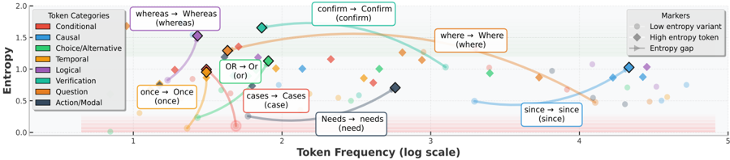

*Figure 2: Dual-Entropy Token Frequency-Entropy Landscape*

**② 方法 / 架构图**

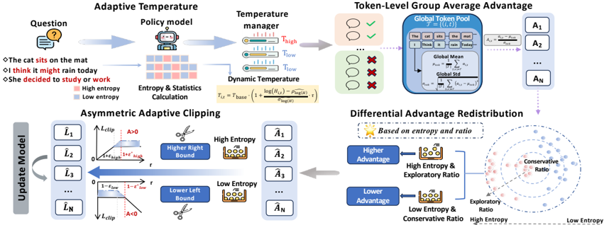

*Figure 1: HAPO's overall framework. HAPO integrates Adaptive Temperature Sampling, Token-Level Group Average Advantage Estimation, Differential Advantage Redistribution and Asymmetric Adaptive Clipping, leveraging entropy as a core optimization driver to achieve fine-grained, token-level optimizatio*

### 一眼看懂

- 🟦 TL;DR：现有 RLVR(GRPO/DAPO)对所有 token **一视同仁**优化，违背语言生成的异质本质——关键推理决策 token 与常规格式 token 角色完全不同。已有用熵的方法只把熵当**离散过滤器或事后 bonus**，核心优化机制没变。HAPO 把 **token 熵升级为贯穿采样/优势/裁剪全流程的连续优化驱动量**，用四个组件对每个 token 做细粒度差异化处理，在 1.5B~14B 多模型、数学/代码/逻辑上一致优于 DAPO（7B 数学 50.04 vs DAPO 46.97）【原文 摘要, 表1, 表4】。
- 最巧的一步：**把熵归一化成一个连续调制信号 ˜h∈[−1,1]，再用「meta 方程 Parameter = Parameter_base·f(˜h)」把它注入采样温度、优势、裁剪界三处**（式5-7）——而非像前作那样只在某一处做离散分组。抽掉这个「连续注入」就退回到 DAPO+熵 bonus 的离散方案。但**承重墙其实是第三个组件 Differential Advantage Redistribution（差分优势再分配，组件C）**：它不只看熵、还**联合用重要性比 r 来判定 token 是否真有明确更新趋势**（高熵且 r 偏离中性区→放大优势；低熵且 r≈1→抑制）。这一步回应了作者最关键的实证发现——「相似熵的 token 优化需求可能截然不同，仅靠熵 reshape 优势是有缺陷的」(§3.3)——是 HAPO 区别于 Archer/Entropy-Adv/EDGE-GRPO 的核心。

### 为什么做

- 研究背景：RLHF/RLVR 是提升 LLM 推理的核心(o1/R1/Qwen3)，但主流算法对所有 token 统一优化、不区分「关键推理路径 token vs 常规模式 token」，与语言生成的异质本质冲突【原文 §1】。
- 解决的具体痛点（系统性实证，§3）：(1) **采样**——温度困境：低温保精度但压制稀有的高熵关键 token、高温增其出现却引噪声(图3);高熵关键 token 本就被系统性欠采样;(2) **优势**——序列级优势忽略序列内 token 异质;DAPO token-mean loss 下**长负样本主导梯度**(负样本显著比正样本长，图4);且发现 token 级优化需求与熵不完全对应(图5);(3) **裁剪**——低熵 token(多为格式符)易撞左界、阻止其降概率;高熵 token(关键推理)易撞右界、限制探索——统一裁剪「保护噪声、约束探索」(图6)。还发现 **「Dual-Entropy 现象」**：同词干 token 在高/低熵区有「孪生」(如 since/Since/(since))——故低熵 token 不能被一刀切丢弃(§3.1)。

- 相关工作 & 各自不足（§1 + §2，按「熵被怎么用」补全为两类）:
  1. **熵当离散过滤器**:**DAPO-with-forking-tokens**(Wang 2025b "Beyond the 80/20 rule")证明只有少数高熵 token 在引导优化、故只优化 top-ρ% 高熵 token(式4：用 \(\mathbb{1}[H_t\ge\tau_\rho]\) 硬门控);**Archer**(Wang 2025a)把 token 二分高/低熵两组、对高熵**放宽 clip 界**鼓励探索(二元离散)。短板:熵只当**离散过滤器**，核心优化机制没变;且 Archer 放宽高熵**左**界反而让高熵关键 token 在负优势主导下概率快速衰减→熵塌缩(HAPO §3.3 反证)。
  2. **熵当优势调节器/事后 bonus**:**Entropy-Adv**(Cheng 2025)把熵当 intrinsic reward 加进优势(式2：\(A^s_{i,t}=A_{i,t}+\psi(H_t)\))鼓励更长推理——但对**负优势的高熵错误 token，熵奖励抵消其负优势、削弱训练信号**(HAPO §3.3 点名的缺陷);**EDGE-GRPO**(Zhang 2025a)用**序列级**熵 reweight 优势偏向 confident 输出。短板:熵被限制为**辅助调节器/事后 bonus**，核心优化机制本身未变，且 EDGE 是序列级非 token 级。
  - 共性缺陷(§1 原话):熵"function as discrete filters" 或 "auxiliary regulator/post-hoc bonus"，"leaving the core optimization mechanics fundamentally unchanged"。HAPO 把熵嵌进采样/优势/裁剪**每一阶段**。

- 动机链：token 角色异质 → 现有统一优化不合理 → 已有用熵者只做离散过滤/事后 bonus → 把熵做成连续函数嵌入采样/优势/裁剪每一阶段 → 细粒度差异化 → 既保精度又保探索。
- 与最近邻工作的精确Δ：vs **DAPO/Archer/Forking**——从「离散二元分组」升级为「熵的连续函数调制」，且**四阶段全覆盖**(采样+优势+裁剪+优势再分配)而非单点;vs **Entropy-Adv**——不把熵当 bonus 加(避免抵消负优势)，而是**联合熵×重要性比**判定再分配(组件C);vs **EDGE-GRPO**——token 级而非序列级;vs **Archer 裁剪**——"反 Archer"：高熵升**右**界、低熵降**左**界(而非 Archer 对高熵放宽左界)。

### 怎么做 + 靠不靠谱
#### 背景公式（§2，对照基线）

- **GRPO**(式1)：组内 G 条采样、序列级优势 \(A_{i,t}=\dfrac{R_i-\mathrm{mean}(\{R_j\})}{\mathrm{std}(\{R_j\})}\)，loss 按序列长度归一 `1/|o_i|`。
- **DAPO**(式3)：改 **token-mean loss**(总 token 数归一 `1/Σ|o_i|`，保长序列梯度) + **clip-higher** 非对称界 \(\epsilon_{\text{high}}>\epsilon_{\text{low}}\)(默认 0.28/0.2)。
- **重要性比**：\(r_{i,t}=\pi_\theta(a_{i,t}\mid s_{i,t})/\pi_{\text{ref}}(a_{i,t}\mid s_{i,t})\)——反映 token 当前优化状态(图5 显示高熵 token 比值分布更宽、偏离 1)。

#### 熵的连续归一化（§4.1，全篇调制信号）
逐 token 熵先做对数平滑 + 减分位数 + 除 std（式5），再**非对称缩放到 [−1,1]**（式6）：
\[
h_{i,t}=\frac{\log(H_{i,t})-Q_\rho(\log H)}{\sigma(\log H)},\qquad
\tilde h_{i,t}=\begin{cases}h_{i,t}/h_{\max}, & h_{i,t}>0,\\ -h_{i,t}/|h_{\min}|, & h_{i,t}\le0,\end{cases}
\]
\(Q_\rho\)=ρ 分位(高/低熵分界，默认 ρ=80% 即关注 top 20% 高熵)。**meta 方程**(式7)：\(\text{Parameter}_{i,t}=\text{Parameter}_{\text{base}}\cdot f(\tilde h_{i,t})\)，把 ˜h 注入温度/优势/裁剪界。

#### 四组件流水线（叠加在 DAPO 上，读完可复现）

1. **A — 自适应温度采样**(§4.2，式8)：rollout 逐 token 在线调温(用上一步 token 统计量算分位/方差)：
   \[
   T_{i,t}=T_{\text{base}}\cdot\Big(1+\frac{\log(H_{i,t})-\hat\rho_{\log H}}{\hat\sigma_{\log H}}\cdot\tau\Big),
   \]
   高熵升温(探索)、低熵降温(连贯)。默认 \(T_{\text{base}}=1.0,\ \tau=0.1\)。

2. **B — token 级组平均优势**(§4.3，式9)：把序列奖励先分到每个 token \(a_{i,t}=r_i\in\{0,1\}\)，再在组内**所有 token**上归一：
   \[
   A_{i,t}=\frac{a_{i,t}-\mu_{\text{tok}}}{\sigma_{\text{tok}}},\quad \mu_{\text{tok}}=\tfrac{1}{|\mathcal{T}|}\sum_{(i,t)\in\mathcal{T}}a_{i,t},\ \mathcal{T}=\{(i,t)\}.
   \]
   使 \(\sum_{(i,t)}\hat A_{i,t}=0\)，消除 token-mean loss 下长负样本梯度偏置，同时保留长序列梯度缩放(长序列贡献更大梯度)——兼得 GRPO 无偏 + DAPO token 粒度。

3. **C — 差分优势再分配**(§4.4，式10-11，承重墙)：定义中性区 \([\gamma_L,\gamma_U]\)(默认 \([1-\epsilon_L/2,\,1+\epsilon_R/2]\))，只在**有明确更新趋势**时改优势：
   \[
   \hat A_{i,t}=\begin{cases}A_{i,t}\cdot(1+\tilde h_{i,t}), & C(\tilde h_{i,t},r_{i,t})\ \text{为真},\\ A_{i,t}, & \text{否则},\end{cases}\qquad
   C(\tilde h_{i,t},r_{i,t})=\begin{cases}r_{i,t}\notin[\gamma_L,\gamma_U], & \tilde h_t>0\ (\text{高熵且比值出中性区→放大}),\\ r_{i,t}\in[\gamma_L,\gamma_U], & \tilde h_t\le0\ (\text{低熵且比值在中性区→抑制}).\end{cases}
   \]
   核心直觉：**熵告诉你 token 重不重要，重要性比 r 告诉你它当前更不更新得动/方向明不明确**——两者结合才精准分配(回应 §3.3「相似熵 token 优化需求可能截然不同」)。

4. **D — 非对称自适应裁剪**(§4.5，式12-13，"反 Archer")：
   \[
   \epsilon_L(i,t)=\begin{cases}\epsilon_L^{\text{base}}(1-\tilde h_{i,t}), & \tilde h_{i,t}\le0\ (\text{低熵→降左界,允许激进降概率压噪声}),\\ \epsilon_L^{\text{base}}, & \tilde h_{i,t}>0,\end{cases}\quad
   \epsilon_R(i,t)=\begin{cases}\epsilon_R^{\text{base}}, & \tilde h_{i,t}\le0,\\ \epsilon_R^{\text{base}}(1+\tilde h_{i,t}), & \tilde h_{i,t}>0\ (\text{高熵→升右界,关键决策点探索}).\end{cases}
   \]
   默认 \(\epsilon_L^{\text{base}}=0.2,\ \epsilon_R^{\text{base}}=0.28\)。全部是 ˜h 的平滑函数，熵在采样时已算，**几乎零额外开销**。

#### 逐组件必要性（Table 4 消融，base DAPO 7B=46.97）
单开 **A 48.85 / B 48.56 / C 48.28 / D 48.02**(各 +1.0~1.9)；A+B 48.74；A+B+C 49.42；**A+B+C+D 全开 50.04**。证据扎实——每个组件单独有效、逐步叠加单调上升，无明显冗余。〔注：单组件中 A(温度) 增益最大、D(裁剪) 最小〕。

- 关键机制/公式（直觉）：核心是「熵告诉你 token **重不重要**，重要性比 r 告诉你它**当前更不更新得动/方向明不明确**」——两者结合才能精准分配优势(组件C 的洞察)。非对称裁剪是「反 Archer」：Archer 对高熵放宽左界，HAPO 发现这反而让高熵关键 token 在负优势主导下概率快速衰减→熵塌缩，故改为高熵升**右**界、低熵降**左**界。
- 实验与证据：base=Qwen2.5-Math-1.5B/7B、Qwen3-8B/14B、LLaMA3.2-3B/3.1-8B-Instruct;训练 DAPO-Math-17K，**32×A100(4 节点)**，verl+vLLM(+SGLang/mcore)，batch 512/mini 32，lr 1e-6;评测 AIME24/25、AMC、MATH500、Minerva、OlympiadBench(每题 8 样、T=0.5 平均);另在 LiveCodeBench + Logic-RL 验证泛化。关键数字：7B 数学 Avg **50.04 vs DAPO 46.97 vs Forking 47.43 vs Archer 45.63**;14B **62.09 vs DAPO 58.06**;LLaMA3.2-3B **27.42 vs DAPO 22.99**(弱模型增益更大);代码 LCB **34.02 vs Forking 31.46**、逻辑 Logic-RL **92.69 vs Forking 90.15**(均超 Forking)。训练动态：HAPO 维持**更长响应+更高熵+更高精度**(图7-10)——即「保探索的同时涨分」。
- baseline 公平吗：较公平——所有方法在**同一 DAPO 设置**(同 clip-higher 0.28/0.2、同 overlong shaping 10240 max + 4096 cache、同数据)下跑，固定超参跨所有模型(展示泛化);对比了 5 个 entropy-based 近作(GRPO/DAPO/Forking/Archer/Entropy-Adv/EDGE-GRPO)。**但**：评测 T=0.5、8 样平均(比贪心更稳)，AIME 仍仅 30 题，单基准 ±2-3 点可能差 1 题;LLaMA 上 AIME25 多为 0~8% 极低区间，增益解读需谨慎。
- 假设与失效边界：【原文】(1) ρ=80% 分位、Tbase=1.0、τ=0.1、中性区=[1−ϵL/2,1+ϵR/2] 等超参固定(附录D 有 ablation);(2) 「高熵=关键推理决策点」是贯穿全文的核心假设。【推断】(3) **「熵=重要性」是相关而非因果**——高熵也可能是模型在格式/无关处的真实不确定(作者自己的 Dual-Entropy 发现正说明熵与语义角色不一一对应)，HAPO 用 r 做二次过滤缓解但未根除;(4) 四组件叠加的超参耦合复杂(温度/中性区/双侧裁剪界)，跨任务迁移可能需重调(虽作者称固定超参，但都在数学/代码/逻辑这类可验证推理域内);(5) 升高熵 token 右界=放任其概率上涨，若该 token 实为错误方向，可能放大错误探索(原文未单独验证「被放大的高熵 token 是否真是有效关键步」);(6) 依赖 token 级熵/比值统计，多轮/agentic 长程下的稳定性未测(全在单轮推理)。
- 祛魅总结：真贡献=**(a) 系统性实证把「token 异质」在采样/优势/裁剪三处的具体病灶讲透(Dual-Entropy、负样本长度偏置、反 Archer 的裁剪洞察)+ (b) 用熵的连续函数(式5-7) + 熵×重要性比联合判据(组件C)，把异质处理嵌入全流程 + (c) 完整四组件消融 + 多规模/多域验证**——工程扎实、消融完整、增益稳定(尤其弱模型)。需打折的：(1) 仍是 **DAPO 之上的精细调参**，不引入新信号/能力，本质是「把 token 权重/温度/裁剪按熵重新分配」;(2) 「熵=关键推理 token」是相关性假设，缺「被放大的高熵 token 确为有效关键步」的因果验证;(3) 增益虽稳但多在 +2~3 点量级，四组件超参耦合是落地复杂度成本。【推断】对「探索-巩固」这是**「关键步识别」侧的相关工作**，但用熵(无 teacher/无前瞻)定位、且无巩固/记忆机制。

### 结构化抽取

- 🎯 机制速览6轴：**学什么信号**=组内相对优势(可验证奖励) + **token 熵**(贯穿采样/优势/裁剪) + **重要性比 r**(组件C 的二次判据)｜**改什么**=策略参数 θ + 采样温度(逐 token)｜**何时改**=on-policy RL 每步(熵在采样时算)｜**免梯度?**=否，policy gradient(DAPO 系)｜**记忆-技能生命周期**=无外部记忆/技能库｜**防遗忘机制**=无显式;但「保高熵关键 token 的探索/防熵塌缩」间接维持能力多样性(图7-10 更高熵更长响应)。
- ⑦ 开源代码+框架/harness：https://github.com/starriver030515/HAPO （已 clone ~8.6MB，README 已核）。框架=**verl + vLLM(+ SGLang/mcore)**，把 token 级策略**叠加进 DAPO**实现;含 recipe/、scripts/install_vllm_sglang_mcore.sh、HF 模型集合。〔注：README 里 arXiv badge 链接误填占位 1234.12345，实际为 2509.16591〕
- 💰 资源/成本与可扩展性：**32×A100(4 节点)**训练;max 10240 token + 4096 cache，batch 512/mini 32。**相对 DAPO 几乎零额外计算开销**(熵采样时已算)。规模验证 1.5B~14B + LLaMA，泛化到代码/逻辑。
- 🎯 对"探索-巩固"对标：**「探索/选路」侧相关、可借组件；「巩固」侧无贡献**。判定依据：① **支撑「探索/选路」**——HAPO 的核心命题「区分关键推理路径 token 与常规 token、在关键决策点鼓励探索」与本课题「探索=发现有效行为/路径」「关键步」直接同频;其「高熵=关键决策点、稀有、易被欠采样/误裁剪」的实证，为 TSRD「在关键步/路径分叉处做文章」提供了 token 级证据基础;② **可借组件**——(a) 「熵×重要性比联合判据」(组件C,式10-11)可借来在 OPD/蒸馏中**定位真正需要 teacher 接管的关键 token**(而非全 token 对齐);(b) 「非对称自适应裁剪」(式12-13)「token 级组平均优势消长度偏置」(式9)是即插即用的稳定性工具;(c) 自适应温度采样(式8)可用于「探索期在关键步升温找替代路径」。**竞品/张力 & 缺口**：(a) HAPO 用**熵(模型自身不确定)** 定位关键步，TSRD 用 **teacher 脚手架 + MTP 前瞻** 定位——前者是模型内省信号、后者是外部监督/前瞻信号，**定位机制不同且 HAPO 缺因果验证**(熵≠真关键步，Dual-Entropy 自证);(b) HAPO **完全无「巩固/回轨」机制**——它不固化探索成果进记忆/技能、不处理「走偏后恢复」，纯属 RL 优化层的 token 加权。一句判定：**HAPO 为「关键步存在且应差异化对待」提供了强 token 级实证与可借的熵×比值定位工具，但其定位靠熵(非 teacher/前瞻、缺因果)、且无任何巩固机制，只能作为 TSRD「探索/选路」侧的优化层补充与对照，不触及「巩固」**。
- 🔭 开放问题/未来方向：【原文】未设独立 open problem 章；隐含方向=超参自适应(附录D ablation)、更多域泛化(已做代码/逻辑)。【推断】(1) 「被 HAPO 放大的高熵 token 是否真是有效关键推理步」需因果/可解释验证——直接决定它能否当「选路」定位器用;(2) 把熵定位换成/融合 **teacher 信号或 MTP 前瞻**——在 teacher 标记的关键步处升温+升右界探索、在恢复分支处做差分优势放大，可把 HAPO 的「自适应」升级为 TSRD 式定向脚手架;(3) 增加「巩固」——把探索到的高价值轨迹/关键步固化进记忆或参数;(4) 多轮/agentic 长程下的 token 异质处理(当前仅单轮推理);(5) 与 holderpo 的 p<0「巩固替代路径」对照——两者都想善待「非主流/犹豫」token，可融合。

key|读到PDF?|L线|对标结论|残留待核数
hapo | 是(PyMuPDF全文24页;Eq.1-13全抄准) | L3/L6 | 「探索/选路」侧强相关:为关键步存在性提供token级实证,熵×重要性比定位(式10-11)+非对称裁剪(式12-13)可借;但靠熵定位(非teacher/前瞻、缺因果)、零巩固机制,仅作TSRD探索侧补充与对照 | 2(熵放大的是否真为有效关键步;AIME小样本统计稳健性)

---

## Hölder Policy Optimisation (HölderPO)

> **`holderpo`** ｜ UCL / 上海交大 / 港科大(广州)，通讯 Jun Wang (UCL) ｜ arXiv 2605.12058v2, 2026-05-21 · 预印本 ｜ 主题线 L3（RLVR/GRPO token 聚合统一框架）·相关性 中（聚合层；p<0 相位与「探索-巩固」有概念呼应） ｜ [📄 原始论文](https://arxiv.org/abs/2605.12058)

### 关键图示

**① Motivation / 对比图**

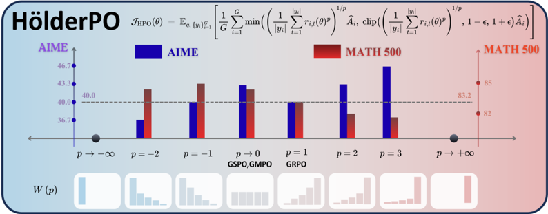

*Figure 1: HölderPO unifies token-level aggregation under a single parameter p . The objective at the top generalises GRPO by replacing its arithmetic mean over token-level importance ratios with the Hölder mean of order p ∈ R , recovering GRPO ( p = 1 ) and GMPO/GSPO ( p → 0 ) as special cases. The*

**② 方法 / 架构图**

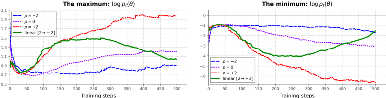

*Figure 2: Token-level importance ratio log ρ t ( θ ) during training. Left and Right track the per-step upper and lower envelopes respectively. As p decreases, the upper envelope drops and the lower envelope rises, tightening the gap monotonically. Our decaying schedule p : 2 →-2 (solid green) thus*

### 一眼看懂

- 🟦 TL;DR：GRPO 系算法把「序列内 token 级重要性比 r_{i,t}=πθ/πθold 聚合成序列级标量」这一步用了**固定算子**——GRPO=算术平均(p=1)、GMPO/GSPO=几何平均(p→0)。HölderPO 把这步统一成 **Hölder p-mean**（p-范数，p∈ℝ 连续谱），用单参数 p 调控「梯度集中(放大稀疏信号) vs 梯度方差(训练稳定)」这对无法被任何固定算子同时兼得的 trade-off；再沿训练时间把 p 从高正值**退火**到负值，无额外开销地兼顾两端。五数学基准平均 54.9%(比 GRPO 相对 +7.2%)，ALFWorld 93.8%(比 GRPO 72.8% 相对 +28.8%)【原文 摘要, 图1, 表2】。
- 最巧的一步：**把 p 扩到全实轴并发现 p<0 是一个先前未被探索的「逆向集中(inverse-concentration / downward concentration)」相位**——它把梯度权重集中到**比值最小**的 token（即模型「犹豫处」），「迫使模型巩固那些非常规但有效的决策点、提升推理多样性」(§3.2 Downward Concentration)。抽掉「p 可负 + 时间轴退火」这步，框架就退化成「在 GRPO 与 GSPO 间选一个静态点」(=PMPO 等并发工作)，失去其独特卖点。承重墙是 **Theorem 1+2 揭示的双向 trade-off**：定理1 证明权重分布的 Shannon 熵在 p=0 最大、|p| 越大越集中(p→+∞ 集中到最大比 token、p→−∞ 集中到最小比 token)；定理2 证明方差界随 p 单调增 → 故「大 p 放大稀疏信号但方差松、小/负 p 收紧方差但削弱稀疏响应」无法两全，逼出动态调度。

### 为什么做

- 研究背景：RLVR(GRPO 系)是 LLM 复杂推理后训练基石(o-series/R1)；GRPO 免 critic、靠组内相对优势，但「轨迹级优势→策略更新」必须先把 token 级比值聚合成序列级标量，这步的固定算子近来受质疑(§1, 引 Liu 2025)。
- 解决的具体痛点：**固定聚合算子施加静态 optimisation landscape**，在不同信号密度的长程任务上出现临界 trade-off——(a) 稠密信号任务(监督分散在大量 token，如 MATH)下 GRPO(p=1)过度放大微小 token 误差→高方差→训练坍塌;(b) 稀疏信号任务(正确性集中在罕见高幅 token，如 AIME)下 GSPO(p→0)过度平滑、压制罕见「aha moment」。实测 AIME24 峰值在 p=3、MATH500 峰值在 p=−1——**无单一静态 p 兼得**(图1, 表1)。

- 相关工作 & 各自不足（§2 三类 + 附录A 的 GRPO 改良生态）:
  1. **token 级聚合算子(最直接对照)**:GRPO(算术均 p=1)/GMPO(Zhao 2025, 几何均)/GSPO(Zheng 2025, 几何均 p→0)——只是连续谱上的**孤立静态点**;**并发 PMPO**(Zhao 2026, 最近邻)——也参数化 power-mean，但两点关键差异:(i) p 只在 **[0,1]**(没碰 p<0 逆向集中相位)、(ii) 按**轨迹**自适应(clip-aware ESS matching)而非沿时间轴。HölderPO 把 p 扩到**全实轴**(含 p<0) + 沿**训练 step** 退火。
  2. **辅助信号 token 重加权(正交,可组合)**:token 熵(Wang 2025a Beyond-80/20、Yu & Li 2026、Simoni 2025 GTPO)、token 概率(Yang 2025b)、隐藏置信贡献(Deng 2025 token hidden reward)、选择性 KL mask(Lin 2025)。这些用**重要性比之外**的信号重加权，与 HölderPO 的 power-mean 聚合**正交**、原则上可叠加(§2 明示)。
  3. **GRPO 改良生态(附录A)**:Dr.GRPO(只 re-center 不除 std)、BNPO(Xiao 2025)、AAPO(Xiong 2025)、SEED-GRPO(语义熵)等——多在优势/裁剪/baseline 上动，不触聚合算子。
  - 共性:固定聚合算子施加**静态优化 landscape**，跨信号密度/训练阶段不适配。

- 动机链：聚合算子是固定的 → 固定算子施加静态 landscape → 不同信号密度/训练阶段需不同集中度 → 用 Hölder p 统一为连续谱 → 发现 p<0 新相位 + 沿时间退火 p → 兼顾早期放大稀疏信号、后期收紧方差。
- 与最近邻工作的精确Δ：vs **GRPO/GMPO/GSPO**——它们是 p=1 与 p→0 两个特例(附录G.2/G.3)，HölderPO 是母框架(图1 顶式);vs **PMPO(最近邻)**——(i) p 扩到全实轴含 p<0(PMPO 限 [0,1]);(ii) 沿训练 step 退火 p 而非按轨迹自适应——让「早期集中放大、后期收紧方差」成为互补的时间分工。表2 中 HölderPO 动态调度 54.9 > PMPO 54.2(7B)、R1-Distill 上 66.4 > PMPO 64.6。

### 怎么做 + 靠不靠谱
#### 方法流水线（读完可复现，§3 + 式1-3 + Thm1-3）
**符号**：x=prompt；yi~πθold=rollout；\(r_{i,t}(\theta)=\dfrac{\pi_\theta(y_{i,t}\mid x,y_{i,<t})}{\pi_{\theta_{\text{old}}}(y_{i,t}\mid x,y_{i,<t})}\)=token 级重要性比；\(\hat A_i\)=组内相对优势(同 GRPO，免 critic)；p=Hölder 阶(标量超参，沿训练退火)。

1. **组采样 + 组相对优势**(同 GRPO)。
2. **Hölder p-mean 聚合**(式1，承重公式)——把 token 比聚合成序列级标量 \(\rho_{i,p}(\theta)\)：
   \[
   \rho_{i,p}(\theta)=\begin{cases}\Big(\dfrac{1}{|y_i|}\sum_{t=1}^{|y_i|}r_{i,t}(\theta)^p\Big)^{1/p}, & p\neq0,\\[6pt]\exp\Big(\dfrac{1}{|y_i|}\sum_{t=1}^{|y_i|}\log r_{i,t}(\theta)\Big), & p=0\ (\text{几何均,p→0 极限,附录G.4}).\end{cases}
   \]

3. **PPO 式序列级 clip 目标**(式2)：
   \[
   J_{H_s}(\theta)=\mathbb{E}_{x,\{y_i\}}\Big[\frac{1}{G}\sum_{i=1}^{G}\min\big(\rho_{i,p}(\theta)\hat A_i,\ \mathrm{clip}(\rho_{i,p}(\theta),1-\epsilon,1+\epsilon)\hat A_i\big)\Big].
   \]
   选序列级 clip 是为控梯度方差(附录D/I.2)。p=1 恢复 GRPO、p→0 恢复 GSPO。

4. **按调度 p(t) 退火**(§3.4)：默认 **linear 2→−2**(也提供 constant/sin/cos/quad/cubic)。单调递减:\(p(0)=p_{\text{high}},\ p(T)=p_{\text{low}},\ p(t_1)\ge p(t_2)\)。
5. **梯度**(式3)：变 p **不改 per-token 对数梯度方向，只重分配权重**：
   \[
   \nabla_\theta\rho_{i,p}(\theta)=\rho_{i,p}(\theta)\sum_{t=1}^{|y_i|}W_{i,t}(p)\,\nabla_\theta\log\pi_\theta(y_{i,t}\mid x,y_{i,<t}),\qquad W_{i,t}(p):=\frac{r_{i,t}(\theta)^p}{\sum_{k=1}^{|y_i|}r_{i,k}(\theta)^p}.
   \]
   \(W_{i,t}(p)\) 是 token 上的概率分布(权重)。

#### 关键理论（直觉 + 真实陈述，§3.2-3.4）

- **Thm 1（梯度集中，Shannon 熵）**：设 yi 至少含两个不同比值 token。则 \(W_i^p\) 的 Shannon 熵在 **p=0 取全局最大**(\(W_i^0=\)Unif/|y|)，随 |p| 增**严格递减**；p→+∞ 集中到 \(T^+=\arg\max_t r_{i,t}\)、p→−∞ 集中到 \(T^-=\arg\min_t r_{i,t}\)。三相位:
  - **Upward Concentration (p>0)**：集中到**高比值** token(置信信号、关键瓶颈步)。长程任务里这类 high-confidence token 稀疏，p>0 放大它们防被均值稀释。
  - **Uniform Dispersion (p→0)**：每 token 等权。
  - **Downward Concentration (p<0)**：反转——集中到**比值<1** 的 token(模型「犹豫」、非常规但有效的决策点)，「迫使模型 consolidate alternative pathways、促推理多样性」(§3.2 原话)。
- **Thm 2（方差界，§3.3）**：设 token 对数梯度有界 \(\|\nabla_\theta\log\pi_\theta\|\le M\)，则
  \[
  \big\|\mathrm{Var}(\hat\nabla_\theta J_{H_s})\big\|\le\frac{M^2}{B}\,\mathbb{E}\big[\hat A_i^2\,\rho_{i,p}^2(\theta)\big],
  \]
  该界**随 p 单调增**。又(Cor.7，假设 token 梯度近似正交)方差本身在某 \(p^*\le0\) 取全局最小(非 −∞)——故 plow 不能太负。

- **集中 vs 稳定的结构性 trade-off**：Thm1+2 ⇒ 大 p 放大稀疏信号但方差界松、小/负 p 收紧方差但削弱稀疏响应，**无固定 p 两全**。
- **Thm 3（动态调度优越性，§3.4）**：任何静态 \(p_{\text{stat}}\) 必牺牲其一——① 早期信号放大:若 yi 有高比值 token \(t^*\)(\(r_{i,t^*}\gg1\))且其余比值常数有界，在 pre-saturation 条件 \(r_{i,t^*}^{p_{\text{high}}}\ll n-1\) 下，从 \(p_{\text{stat}}\) 移到 \(p_{\text{high}}\) 指数放大其梯度权重:\(\dfrac{W_{i,t^*}(p_{\text{high}})}{W_{i,t^*}(p_{\text{stat}})}\ge C\cdot r_{i,t}^{\,p_{\text{high}}-p_{\text{stat}}}\)(式5)；② 后期方差收缩:\(V(p_{\text{low}})<V(p_{\text{stat}})\)(式6，\(V(p):=\mathbb{E}[\hat A_i^2\rho_{i,p}^2]\))。动态 schedule 早期继承 p=+2 的集中、后期收敛到 p=−2 的受控方差，绕过两难。

#### 逐组件必要性（消融与证据）

- **Hölder p 聚合(连续谱)**：核心。消融=静态 p 扫描(表1/2)，确证任务敏感性：稀疏任务偏好高 p(AIME24 p=3→46.7%，破 43.3% 上限)、稠密任务偏好低/负 p(MATH500 p=−1→85.0%)。
- **p<0 逆向集中相位**：本文独有贡献。证据=表2 中 p=−1/−2 在 MATH500/Minerva 等稠密任务上确实最优;机理对应「上调比值<1 的犹豫 token、巩固替代路径」(§3.2)。
- **动态退火调度**：核心增益来源。消融=表2 静态各 p vs Linear(2→−2)——动态 54.9 **严格超过所有静态点**(最好静态 p→0 是 52.6)。Theorem 3 给理论:任何静态 pstat 必牺牲早期放大或后期方差控制之一。
- **调度区间 [phigh,plow] 选择**：§4.4 给三条依据——经验最强配置在 [−2,2]、下界受方差稳定性约束(Cor.7 二阶矩在某 p*≤0 最小而非 −∞)、区间任务相关(数学用 [2,−2]、ALFWorld 用更保守 [1,−1]，因 base 无领域预训练)。**诚实标注了 endpoint 非通用、需按 base 成熟度+信号密度校准**。

- 实验与证据：base=Qwen2.5-Math-1.5B/7B、R1-Distill-Qwen-7B、Qwen3-4B/8B(数学)、Qwen2.5-1.5B-Instruct(agentic);数学训练用 Dr.GRPO recipe(MATH L3-5 8523 题，8 rollouts，max 3000 token，每轮 1024 traj、更新 8 次 batch 128，4×H100);agentic 用 GiGPO protocol(Feng 2025) 在 ALFWorld。评测 temperature=0 贪心单样本 Pass@1。关键数字：7B 五基准 **54.9(Linear 2→−2) vs GRPO 51.2 / GMPO 52.7 / PMPO 54.2**;R1-Distill **66.4 vs GMPO 63.4 / PMPO 64.6**;静态 p=3 在 AIME24 破 43.3→46.7;ALFWorld **93.8%(Linear 1→−1) vs GRPO 72.8% / GMPO 85.9% / GiGPO 86.7%**。
- baseline 公平吗：较公平——「matched configurations」下与 GRPO/Dr.GRPO/GMPO 对比，且表2 列了同期 SOTA(SimpleRL/PRIME/OpenReasoner/Eurus/GPG/Oat-Zero/PMPO)。**但**：(1) 数学评测 temperature=0 贪心单样本 Pass@1，AIME24 仅 30 题——±3% 波动可能只差 1 题，**单点突破(46.7/53.3)统计噪声大**;(2) 与 GMPO/GSPO 的对比中，它们的最优裁剪窗是否同等精调未明说。
- 假设与失效边界：【原文】(1) 调度区间 endpoint 任务/base 相关、非通用(§4.4);(2) 方差最小在某 p*≤0 而非 −∞(Cor.7)，故 plow 不能太负;(3) 早期放大依赖 base「已有强预训练能容忍激进上界」——ALFWorld base 弱故收窄到 [1,−1];(4) 【原文 Limitations】调度引入超参(phigh/plow/decay 形状)需手调、无最优形状的理论刻画;(5) 【原文 Limitations】正向集中相位放大高比值 token ⇒ **更易 reward hacking**(verifier 给假阳时)。【推断】(6) 「任何任务早期都是稀疏信号、后期转稠密」是个**经验假设**(§4.3)，对已 distill/已强的 base 未必成立——R1-Distill 上动态仍赢但静态 p→0 也很强;(7) p<0 放大「最小比值 token」的合理性建立在「比值<1 = 有意义的犹豫/替代决策」这一**解释性假设**上，可能也放大纯噪声 token(原文未做「p<0 放大的到底是有效替代路径还是噪声」的因果验证)——这是其与「探索-巩固」对标时最该警惕的待核点;(8) AIME 小样本下单点突破需更多 seed 复现。
- 祛魅总结：真贡献=**(a) 把 token 聚合算子统一成单参数连续谱(p∈ℝ，式1)，干净地把 GRPO/GMPO/GSPO 收为特例 + (b) 揭示并形式化 p<0 逆向集中相位 + (c) 跨 step 时间退火 p 这一新自由度 + 配套 Theorem 1-3**——理论框架优雅、把「稳定 vs 集中」trade-off 讲透，且延伸到 agentic(ALFWorld)。需打折的：(1) 数学增益的「SOTA/破上限」依赖 AIME 小样本贪心单点，统计稳健性存疑;(2) 整体仍是 **GRPO 之上的聚合层调参**，不引入新信号/新能力，是「把现有 token 权重重新分配得更聪明」;(3) p<0「巩固替代路径」的解释很有想象力但**缺直接因果证据**(放大的是否真是有效替代步;作者 Limitations 也只提 reward hacking 风险)。【推断】对「探索-巩固」是**概念上最有呼应、但机制层仍间接**的一篇。

### 结构化抽取

- 🎯 机制速览6轴：**学什么信号**=组内相对优势 Âi(可验证奖励) + token 级重要性比的 p-加权(信号本身不变，变的是权重分配 W_{i,t}(p))｜**改什么**=策略参数 θ(聚合算子的 p)｜**何时改**=on-policy RL 每步，且 p 本身**沿训练 step 退火**｜**免梯度?**=否，policy gradient｜**记忆-技能生命周期**=无外部记忆/技能库｜**防遗忘机制**=无显式;但 p<0「巩固替代决策路径、促推理多样性」可视为**对探索到的非主流路径的一种软固化**(概念层，非参数/记忆机制)。
- ⑦ 开源代码+框架/harness：https://github.com/YihangChen9/HolderPO （已 clone ~8.8MB，Tier A，README 已核）。框架=**数学侧 oat (sail-sg/oat) + oat-llm 0.1.3.post1 + vLLM 0.8.4**（构建于 understand-r1-zero 数学 grader/数据管线）;**agentic/ALFWorld 实验在 `agentic` 分支、基于 verl-agent (langfengQ/verl-agent)**。两个 loss 变体：`holder`(序列级 p-mean)/`holder_token`(token 级 p-mean);调度 constant/linear/sin/cos/quad/cubic 可选。主仓 `train_zero_math_holder.py` 是 oat PPOLearner 子类。〔注：ALFWorld 代码在分支，主 clone 未含——如需复现 agentic 需另切 `agentic` 分支取 `alfworld/`〕
- 💰 资源/成本与可扩展性：数学全在 **4×H100**;Dr.GRPO recipe(8 rollouts，max 3000 token，每轮 1024 traj，更新 8 次 batch 128)。**相对 GRPO 零额外计算开销**(仅改聚合算子与 p 调度)。规模覆盖 1.5B~8B。
- 🎯 对"探索-巩固"对标：**概念强呼应、机制可借（但需打折）**。判定依据：① **p<0 逆向集中 = 「巩固替代路径」**——原文明言负 p「迫使模型 consolidate alternative pathways、促推理多样性」(§3.2)，这与本课题「巩固/回轨：走偏后自选恢复分支并固化」在**词面和直觉上高度同构**;② **时间退火 = 探索→巩固的训练相位划分**——早期高 p 激进放大稀疏信号(≈探索期发现关键步)、后期负 p 收紧方差+巩固替代路径(≈巩固期)，恰是「先探索后巩固」的 RL 优化层实现(Thm3 给了形式化);③ **可借组件**——「沿训练时间调一个标量 p 来切换集中/分散」(式1+§3.4 调度)是个轻量、零开销、可直接叠加到 OPD/GRPO 的旋钮，可用于 TSRD 的 RL/蒸馏阶段做「探索-巩固」节律控制。**竞品/张力 & 缺口**：(a) HölderPO 是**纯 token 权重重分配**，p<0 放大的是「比值最小的 token」而非「teacher 指出的关键步」——它不区分「有效替代路径」与「噪声」(缺因果验证)，而 TSRD 主张用 **teacher 稀疏脚手架 + MTP 前瞻**来精确定位关键步/恢复分支，二者**定位机制完全不同**(HölderPO 靠重要性比的几何、TSRD 靠 teacher/前瞻信号);(b) 无 teacher、无记忆、无单点接管——「巩固」在此是统计意义的梯度重分配，不是「把成功轨迹固化进记忆/技能库」。一句判定：**可借「时间退火 p、p<0 巩固替代路径」的优化节律思想作为 TSRD 探索-巩固在 RL 层的低成本载体；但其「巩固」无 teacher/前瞻定位、缺因果证据，不能替代 TSRD 的脚手架机制**。
- 🔭 开放问题/未来方向：【原文】(1) 调度 endpoint 的自动校准(当前靠 base 成熟度+信号密度手调，§4.4；Future Work 提自适应 scheduler 从实时指标如 batch 梯度方差/比值离散度调 p);(2) 与辅助信号 token 重加权(熵/置信/KL mask)的正交组合(§2 明示可结合)。【推断】(3) p<0 放大的到底是「有效替代决策」还是噪声——需因果/可解释验证，直接关系到能否当「巩固」机制用;(4) 把 p 调度与 teacher 信号/MTP 前瞻耦合——在关键步局部升 p、在 teacher 标记的恢复分支处用负 p 巩固，可能把 HölderPO 的统计节律升级为 TSRD 式的定向脚手架;(5) agentic 长程任务上 p 调度与 compounding error 的关系仅初探(ALFWorld)，多轮/工具场景待深挖;(6) 数学增益的小样本统计稳健性需多 seed 复现。

key|读到PDF?|L线|对标结论|残留待核数
holderpo | 是(PyMuPDF全文32页;Eq.1-6+Thm1-3全抄准) | L3 | 概念强呼应:p<0逆向集中=巩固替代路径、时间退火=探索→巩固节律(Thm3形式化),可借为RL层低成本旋钮;但靠重要性比几何定位(非teacher/前瞻)、缺「放大的是有效路径还是噪声」因果证据,不能替代TSRD脚手架 | 2(p<0放大有效性的因果证据;AIME小样本统计稳健性)

---

## Does RL Really Incentivize Reasoning Capacity in LLMs Beyond the Base Model?

> **`limit_rlvr`** ｜ 清华 LeapLab·上海交大(Yang Yue 乐洋/Zhiqi Chen 共一,Gao Huang 黄高通讯) ｜ 2025-04-21 v1 → 2025-11-24 v5;arXiv 2504.13837 ｜ 主题线 L3(RLVR/GRPO 能力边界批判性分析)·相关性 高 ｜ [📄 原始论文](https://arxiv.org/abs/2504.13837)

### 关键图示

**① Motivation / 对比图**

*Figure 1: (Left) The effect of current RLVR on LLM's reasoning ability. Search trees are generated by repeated sampling from the base and RLVR-trained models for a given problem. Grey indicates paths that are unlikely to be sampled by the model, while black indicates paths that are likely to be samp*

**② 方法 / 架构图**

*Figure 8: (Top) Different RL algorithms. (Bottom) Different RL training steps. The detailed values for each point at pass@1 and pass@256 are provided in Table 3 and Table 4.*

### 一眼看懂

- 🟦 TL;DR:不提新方法,而是用一把"尺子"去量 RLVR 到底有没有让模型获得 base 没有的新推理能力。尺子是 **pass@k(\(k\) 个采样里有一个对就算解出)在大 \(k\) 时的曲线**——它逼近"模型潜在能解题集合",代表推理**边界**。系统对比多家族×多尺寸×6 种 RLVR 算法×多 benchmark 后发现:RLVR 模型在**小 \(k\) 占优、大 \(k\) 被 base 反超**,且边界**随训练收窄**。结论:当前 RLVR 主要是**把概率质量集中到 base 已能走通的路径上(提采样效率)**,并未引入超越 base 的新能力;而**蒸馏可以**引入新推理模式、真正扩边界(§摘要/§4)。
- 最巧的一步:**选 pass@k 大 \(k\) 当"边界代理"**。抽掉这把尺子(回到 pass@1/平均分),就只能看到"RLVR 涨分",看不到"大 \(k\) 反超"——整个证伪逻辑就垮了。正是"大 \(k\) 反超"这一跨设置高度一致的现象,把"RLVR 引入新能力"证伪(§3.1)。

### 为什么做

- 研究背景与来龙去脉:o1 / DeepSeek-R1 / Kimi-1.5 等推理模型核心驱动是大规模 **RLVR**(可验证奖励:数学答案对 / 代码过单测)。业界类比 Atari/Go 中 RL 能自主发现超越人类的新策略,**普遍相信** RLVR 同样能让 LLM 自主长出超越 base 的新推理模式(枚举、自反思、迭代精炼),视为持续自进化路径(§Intro L118-121)。本文要检验的正是这个被默认为真的乐观叙事。
- 并行评估路线与各自**具体**短板:此前对 RLVR 有效性的度量有几类——① **greedy / nucleus 的 pass@1(平均分)**:只反映平均情形、会**系统性低估**模型潜力,无法刻画推理**边界**(模型"采够多次能不能解出"的集合);② **Best-of-N / 多数投票**:受**投票偏置**影响(多数答案不一定是模型潜力上界),也不直接度量可解集;③ **同期相反观察**(Dang et al. 2025 等):也注意到 RLVR 后 pass@k 下滑,但分析维度单一(本文在 §相关工作 L1097/L1429 明确对比,称自己提供了**更系统**的分布/覆盖度/perplexity/蒸馏对照证据)。本文站在 pass@k(Brown 2024 / Chen 2021 从代码生成迁来)肩上,把它当"潜在可解集的代理"。
- 解决的具体痛点:RLVR 的根本有效性没被严格检验。核心追问:RLVR 是让 LLM 获得了 base 没有的新能力,还是只是更高效地利用了 base 已有的模式?
- 相关工作的精确 Δ:相对"报告 RLVR 涨分"的主流工作,差在**换了度量维度**——从"平均"换到"边界",用大 \(k\) 的 pass@k;相对 Dang et al.(最近邻、也观察到 pass@k 下滑),差在**证据更全**:在多家族×多尺寸×6 算法×多 benchmark 上验证现象普适性 + 用覆盖度与 perplexity 给**机制证据**(RLVR 路径已在 base 分布内)+ 用**蒸馏对照**区分"扩边界 vs 仅提效率"的本质。
- 动机链:想判断 RLVR 是否"超越性"→ 平均分不够、投票有偏 → 用大 \(k\) pass@k 当边界代理 → 把 base 当上界,看 RLVR 曲线是否在**所有 \(k\)** 上不低于 base。

### 怎么做 + 靠不靠谱

- 方法流水线(具体到测什么→怎么测):① 用 pass@k(**无偏低方差估计器**)度量 base 与其 RLVR 后版本在多 benchmark 上的整条 \(k\)-曲线;② 防"蒙对":数学对"易猜中"风险题(如 AIME 数值答案)**人工核查 CoT 正确性**(把 AIME24 30 题过滤到 18 题验证,Fig.13),代码用编译器+单测;③ 定义**采样效率差距 ΔSE** 量化 RL 模型距 base 上界还差多远(Fig.8 top);④ 覆盖度 + perplexity 分析验证 RLVR 路径是否已在 base 采样分布内;⑤ 蒸馏对照区分"蒸馏扩边界 ≠ RLVR 仅提效率"。
- 核心度量/公式(真实形式 + 直觉,符号从 PDF §2 / §A.2 抄准):
  - **无偏低方差 pass@k 估计器**(Eq.2,§A.2,沿用 Chen 2021):对每题采 \(n\ge k\) 个样本、数出正确数 \(c_i\),则
    \[
    \mathrm{pass@}k:=\mathbb E_{x_i\sim D}\!\left[\,1-\frac{\dbinom{n-c_i}{k}}{\dbinom{n}{k}}\,\right].
    \]
    直觉:\(\dbinom{n-c_i}{k}/\dbinom{n}{k}\) 是"随机抽 \(k\) 个全落在错误样本里"的概率,\(1-(\cdot)\) 即"\(k\) 抽里至少一个对"。实验取 \(n\) 为曲线最右端 \(k\)(典型 128/256/1024),可对所有 \(k\le n\) 低方差估计。

  - **边界判别式(证伪逻辑)**:pass@k 在大 \(k\) 时 \(\approx\) "采样足够多次能否撞对",逼近**潜在可解集**。若 RLVR 真扩能力,其 pass@k 应在**所有 \(k\)** 上 \(\ge\) base;若只是把概率质量挪到 base 已能解的路径上,就会"小 \(k\) 赢(更高效)、大 \(k\) 输(可解集反变小)"——正是用来证伪的判别式(§3.1)。
  - **采样效率差距 ΔSE**(§4 / Fig.8):\(\ \Delta_{\mathrm{SE}}=\text{pass@}1_{\,\mathrm{RL}}-\text{pass@}k_{\,\mathrm{base}}\big|_{k=256}\),以 base 的 pass@256 当**上界代理**,衡量 RL 把概率集中得多接近最优;ΔSE 一致偏大=RL 远未触及 base 边界、还有大量"base 能解 RL 没采到"的空间。
  - **perplexity 机制证据**(§4.3 / §C.4):算 RL 输出在 base 模型下的困惑度 \(\mathrm{PPL}_{\mathrm{Base}}(Y_{RL}\mid x)\)(每题 32 解取中位、对前 10 题取均值);随 RL 训练**单调下降** → RLVR 主要是在 base 先验内**锐化分布**,而非扩到 base 之外。
- 逐组件必要性(分析型论文,"组件"=证据支柱):
  - **pass@k 大 \(k\) 曲线**:主结论支柱,跨家族/尺寸/算法/benchmark 一致出现"大 \(k\) 反超"(§3.1),无此则无结论。
  - **覆盖度 + perplexity**:机制支柱,证明"路径已在 base 分布内"(\(\mathrm{PPL}_{\mathrm{Base}}(Y_{RL})\) 递减),是"RLVR 只是更高效采样"的因果佐证。
  - **6 种算法对比(PPO/GRPO/Reinforce++/RLOO/ReMax/DAPO)**:统一在 VeRL、Qwen2.5-Math-7B base、Omni-Math-Rule、去 KL(§4.3 Table 1/3),证明结论**不是某一算法的偶然**——in-domain pass@1 接近但 pass@256 一致被 base 反超(DAPO 在 \(k=256\) 显著下滑、且其 dynamic sampling 多耗 3~6× 样本)。
  - **蒸馏对照**:支撑"蒸馏能扩边界"(distilled 模型 pass@k 整条显著高于 base,Fig.7)——但论文自承这块对照较简略。
  - **v5 熵/温度匹配**:鲁棒性检查——把 RLVR 模型温度提到匹配 base 熵(\(T=0.6\) 起)后,差距缩小但 base 仍占优(Fig.18),说明熵下降是边界收窄的**部分**(非全部)原因;另测增大 rollout 数 \(n\)(8→32)与加 KL(系数 0.001)均不改变"最终被 base 反超"(Fig.16)。
- 实验与证据:数学 zero-RL 起点 LLaMA-3.1-8B、Qwen2.5-7B/14B/32B-Base、Qwen2.5-Math-7B,benchmark GSM8K/MATH500/Minerva/Olympiad/AIME24/AMC23;代码 instruct 起点 + Code-R1;另有视觉推理。v5 新增 Oat-Zero-7B、DAPO-32B(Fig.11)、DeepScaleR 及熵/温度分析。关键发现:① 所有 benchmark/家族**无例外**小 k RLVR 优、大 k base 反超,且 pass@256 覆盖度随训练(GRPO step150/300/450)递减;② perplexity 证 RLVR 路径已在 base 分布内;③ 6 算法 ΔSE 一致偏大(in-domain GRPO 43.9 ~ RLOO 42.6,差异小),DAPO 在 k=256 显著下滑;④ 蒸馏能扩边界。baseline 公平(同 base 对比其 RLVR 版)。
- 假设与失效边界:
  - 【原文】pass@k 以**有限 k(≤256)**代理"真实潜力",极大 k 或更优解码下结论是否变化存开放性(§局限);结论针对"**当前** RLVR 算法/数据规模",论文自身呼吁更好探索机制、更大数据 curation、细粒度 process signal、多轮 agent 交互——即不排除未来 RLVR 范式突破边界。
  - 【推断】"大 k 反超"对采样预算敏感——k=256 是工程代理而非真上界;作者用熵匹配等鲁棒性检查回应,但若有人用极大 k / 更强解码,边界结论的强度可能被削弱(论文也明确这是软结论)。
  - 【推断】蒸馏"扩边界"的对照较简略,且"蒸馏引入的新能力"是否只是 teacher 能力转移(而非 RL 式自主发现)未深究——这恰是本项目要警惕的:OPD/蒸馏扩的是"teacher 已有的边界"。
- 祛魅总结【推断】:真贡献是**用一把更诚实的尺子戳破了"RLVR=自主长出新推理能力"的乐观叙事**,且证据系统、可重复,是该批判最强的实证支撑——这对本项目方向选择是重要的"现实校准"。需要祛魅的反方向是**别把它读成"RLVR 没用"**:论文明确 RLVR **显著提升采样效率/pass@1**(实用价值真实存在),只是不扩边界;且结论严格限定在"当前算法/规模"。对本项目的真正启示:**想扩边界,光靠 on-policy RL 不够,需要引入外部信号(蒸馏/teacher 脚手架)**——这正是 LUFFY/MAD-OPD/本项目 idea 的立足点。

### 结构化抽取

- 🎯 机制速览6轴(本文为分析型,按"它在分析什么"填):**学什么信号**=N/A(不训练,度量 base vs RLVR 的 pass@k);**改什么**=N/A(评测/分析,无新训练);**何时改**=N/A;**免梯度?**=N/A(纯评测,vLLM 多采样);**记忆-技能生命周期**=N/A;**防遗忘机制**=间接相关——"边界随训练收窄"本质是 RLVR 训练**遗忘/丢弃了 base 能解但 RLVR 不再采样的题**(§Fig:pass@256 递减),为本项目"防遗忘"提供了一个反面证据/度量(用 pass@k 覆盖度差监测能力遗忘)。
- ⑦ 开源代码+框架/harness:https://github.com/LeapLabTHU/limit-of-RLVR(已克隆 ~83MB;项目页 limit-of-RLVR.github.io)。含 `code/`(DeepCoder)、`math/`(eval_math_nodes.sh、pass@k.py、examples、install.sh)。框架:**评测/分析为主**,核心是 vLLM 多次采样的 pass@k 评测;被评 RLVR 模型来自 SimpleRL-Zoo/Oat-Zero/DAPO(数学)、Code-R1(代码),训练侧统一 **VeRL**,**非自研训练框架**。可得性:评测脚本完整可复现,不含新方法实现(本就无新方法)。
- 💰 资源/成本与可扩展性:成本主要在"大 k pass@k 的多采样评测"(k 到 256,vLLM 批量采样),跨多模型/benchmark 算力不小但无训练成本。原文未给统一算力数字。
- 🎯 对"探索-巩固"对标:**间接支撑(方向校准 + 度量工具)**——它从反面论证了 idea 的必要性:**纯 on-policy RL 不扩边界,所以需要 teacher 当稀疏脚手架引入外部能力(探索新路径)**;而"边界随训练收窄"正是 idea 中"巩固时要防遗忘"要对抗的现象。可借组件:(a) **pass@k(大 \(k\))覆盖度差**作为度量——可直接用于监测 student 在 OPD/巩固过程中是否"为了学新路径而遗忘已会题"(覆盖度不降才算真巩固);(b) **\(\Delta_{\mathrm{SE}}=\text{pass@}1_{\mathrm{RL}}-\text{pass@}k_{\mathrm{base}}\)** 作为"距 teacher/base 上界还差多远"的量化。缺口:本文无任何"巩固/记忆/技能"机制,纯诊断。判定依据:§摘要 + §3.1 反超现象 + §4 蒸馏对照。
- 🔭 开放问题/未来方向:【原文】更好的探索机制、更大规模数据 curation、细粒度 process-level reward、多轮 agent 交互,以突破当前 RLVR 的边界限制;极大 k / 更优解码下结论是否变化。【推断】把"蒸馏扩边界"与"RL 提效率"组合(正是 LUFFY/MAD-OPD 路线);用 pass@k 覆盖度作为本项目"探索是否真带来新可解题、巩固是否无遗忘"的标准评测协议。

---

## Part I: Tricks or Traps? A Deep Dive into RL for LLM Reasoning (Lite PPO)

> **`lite_ppo`** ｜ Alibaba(ROLL/Future Life Lab)+ 北交大/HKUST/南大/北大/Mila(Weixun Wang 通讯) ｜ 2025-08 v1 → 2025-10-27 v3;arXiv 2508.08221 ｜ 主题线 L3(RLVR/GRPO 算法技巧实证)·相关性 中 ｜ [📄 原始论文](https://arxiv.org/abs/2508.08221)

### 关键图示

**① Motivation / 对比图**

*Figure 1: Left : The proliferation of RL optimization techniques, coupled with diverse initialized models and data, has raised barriers to practical adoption. Right : We establish detailed application guidelines via dissecting internal mechanisms of widely-used tricks, and introduce Lite PPO, a mini*

**② 方法 / 架构图**

*Figure 3: (Top 2 rows): Test accuracy and response length of four model variants: Qwen3-4B-Base , Qwen3-8B-Base , Qwen3-4B , and Qwen3-8B across different data difficulty. Middle 2 rows : Accuracy over training iterations of Base models. The first row presents results of Qwen3-4B-Base . The second r*

### 一眼看懂

- 🟦 TL;DR:2025 年 RL4LLM 的各路 trick(归一化、Clip、loss 聚合、overlong filtering)互相打架(GRPO 说 group 归一化、REINFORCE++ 说 batch 归一化;GRPO 要方差归一化、Dr.GRPO 要去掉;GRPO response-level loss、DAPO token-level)。本文在**同一框架(ROLL)、同一模型、同一数据**下逐一隔离消融每个 trick,发现只需**两项极简组合**就够:① 优势归一化用 **group 均值 + batch 标准差**;② **token-level loss 聚合**。这个组合叫 **Lite PPO**,稳定**超过堆了 5 个组件的 DAPO 和广泛使用的 GRPO**——"简单胜过复杂"(§摘要 L52/L98)。
- 最巧的一步:**控制变量的实验方法论本身**(同框架/同模型/同数据逐一消融)。抽掉它(像现有工作那样各用各的设置),trick 的真实效用就被"实验条件不可比"淹没,结论继续互相矛盾——本文的全部说服力来自"把变量钉死"。就方法而言,**advantage 归一化里的"batch 标准差项"**是最关键的单点(Takeaway 2/3:标准差项是归一化的关键机制;奖励高度集中时去掉标准差反而更稳)。

### 为什么做

- 研究背景与来龙去脉:2025 年 RL4LLM 爆发,数学/代码上 RL 把 LLM 推到预训练之上。围绕"PPO/GRPO 的若干 trick 到底哪个有用"出现一批**互相打架**的主张(§Intro,"contradictory and chaotic"):① **归一化粒度之争**——GRPO(Shao 2024)主张 **group-level** 归一化稳策略,REINFORCE++(Hu 2025)主张 **batch-level** 更好;② **方差归一化要不要**——GRPO 在归一化里**含方差(除 std)**,Dr.GRPO(Liu 2025a)明确**去掉 std**(reward shift without std);③ **loss 聚合粒度之争**——GRPO 用 **response/sequence-level** 聚合,DAPO(Yu 2025)改用 **token-level**;④ DAPO 还叠加 Clip-Higher(解耦上下 clip)、Overlong Reward Shaping、Dynamic Sampling 等组件。本文不发明新算法,而是给这片 trick 丛林做一次"控制变量清算"。
- 各路线/各 trick 的**具体**短板:GRPO/REINFORCE++/Dr.GRPO/DAPO 各自的归一化与聚合主张**都在不同的数据/初始化/规模设置下得出**,彼此**不可比**——无法判断某 trick 到底有用还是只是实验条件红利;DAPO 把 5 个组件堆在一起,但没人逐项剥离过谁真正贡献增益、谁是局部修补;现有结论缺乏标准化使用指南,机制理解碎片化。
- 解决的具体痛点:① trick 多、看似正交,从业者难在特定场景挑有效组合;② 设置不一致导致结论冲突,无法判断每个 trick 的真实贡献与适用范围;③ 缺选型指南、机制理解碎片化。
- 动机链:结论矛盾多半源于条件不可比 → 只要钉死变量(同框架 ROLL / 同模型 Qwen3 / 同数据档位)逐一消融,trick 真实效用会显现 → 大概率只有少数核心 trick(归一化、loss 聚合)真起作用、其余是局部修补 → 提炼选型指南 + 验证"简单胜过复杂"。
- 与最近邻工作的 Δ:相对各 trick 的原始论文(GRPO/REINFORCE++/Dr.GRPO/DAPO),差在**统一基座/数据/框架下的横向公平消融**(把"实验条件"这个混淆变量消掉);相对 **DAPO**(堆 5 组件),差在**做减法**——证明"group 均值 + batch 标准差归一化"+"token-level 聚合"两项 > DAPO 的 5 项,且后者常在峰值后崩溃而 Lite PPO 持续上升。

### 怎么做 + 靠不靠谱

- 方法流水线(控制变量实验方法论本身就是"方法"):① 统一 baseline = **vanilla PPO loss + 无 critic**(用 REINFORCE 式组内优势替代 critic,critic-free);② 在三档难度数据(Easy/Medium/Hard,各 5000,按 GPT-4o 难度分档)、两种规模(4B/8B)、Base 与 aligned 两类模型上,**逐一隔离**评估 Normalization / Clip / Loss 聚合 / Overlong filtering 四类 trick;③ 提炼 Takeaways 与选型指南;④ 把最稳健两项整合成 **Lite PPO**,与 GRPO/DAPO 横向对比验证。
- 核心算法/公式(真实形式 + 直觉,符号从 PDF §2 抄准):
  - **PPO clipped 目标**(Eq.1):\(\ J_{\mathrm{PPO}}(\theta)=\mathbb E_{q,\,o\sim\pi_{\theta_{\mathrm{old}}}}\frac{1}{|o|}\sum_{t=1}^{|o|}\min\!\big(r_t(\theta)A_t,\ \mathrm{clip}(r_t(\theta),1-\epsilon,1+\epsilon)A_t\big)\),其中 \(r_t(\theta)=\dfrac{\pi_\theta(o_t\mid q,o_{<t})}{\pi_{\theta_{\mathrm{old}}}(o_t\mid q,o_{<t})}\)。
  - **GRPO 组内优势**(Eq.2,critic-free 基准):对 prompt \(x\) 的 \(G\) 条响应、奖励 \(\{r_i\}_{i=1}^{G}\),\(\ \hat A_{i,t}=\dfrac{r_i-\mathrm{mean}(\{r_i\}_{i=1}^{G})}{\mathrm{std}(\{r_i\}_{i=1}^{G})}\)。
  - **GRPO 总目标**(Eq.3,含显式 KL):
    \[
    J_{\mathrm{GRPO}}(\theta)=\mathbb E\Big[\tfrac{1}{G}\!\sum_{i=1}^{G}\tfrac{1}{|o_i|}\!\sum_{t=1}^{|o_i|}\min\!\big(r_{i,t}\hat A_{i,t},\,\mathrm{clip}(r_{i,t},1-\epsilon,1+\epsilon)\hat A_{i,t}\big)-\beta D_{\mathrm{KL}}[\pi_\theta\|\pi_{\mathrm{ref}}]\Big].
    \]

  - **Lite PPO 的两项配方**(本文核心产出):① **优势归一化改 group 均值 + batch 标准差**——把 Eq.2 分母从组内 std 换成整 batch 的 std:\(\ \hat A_{i,t}=\dfrac{r_i-\mathrm{mean}_{\mathrm{group}}(\{r_i\})}{\mathrm{std}_{\mathrm{batch}}(\{r\})}\)。直觉:group 均值消 prompt 难度偏置,batch 标准差给更稳全局尺度、压低梯度幅度防过大更新(纯 group-std 小组方差估计噪声大);奖励高度集中时甚至可去 std。② **token-level loss 聚合**——每 token 当独立单位求和(减 length bias),而非序列内先平均。
- 模块如何咬合:Lite PPO = vanilla PPO clipped 目标 + critic-free 组内优势(Eq.2)但**分母改 batch-std、分子用 group-mean**,loss 按 token-level 聚合,**去掉 Clip-Higher / Overlong filtering / Dynamic Sampling**。相对 GRPO 是"换归一化尺度 + 换聚合粒度",相对 DAPO 是"砍掉 3 个组件"。
- 关键超参与默认值:global batch 1024(rollout 128 × 每 prompt 8 响应)、max length 8192、lr 1e-6、top_p 0.99 / top_k 100 / temp 0.99;每难度档 5000 题;规模 4B/8B(各含 Base 与 aligned)。
- 逐组件必要性(本文核心产出就是逐 trick 消融,§4):
  - **优势归一化(group 均值 + batch 标准差)**:Takeaway 2/3——标准差项是归一化关键机制;"group 均值 + batch 标准差"混合最稳健,batch-std 在大规模奖励下更稳;奖励高度集中时可去标准差(§4.1.1-4.1.2)。Lite PPO 取此项。
  - **token-level loss 聚合**:Takeaway 7(§4.3.1)——对 **base/非对齐模型**有效,对**已对齐模型提升有限**。Lite PPO 取此项(因 base 上收益最大)。
  - **Clip-Higher**:Takeaway 4/5/6——对**已对齐模型**促进高质量探索(放宽上界允许 token 概率更大偏离 old policy),小模型上 clip 上界与性能存在"scaling law";但对 base 模型收益有限。**Lite PPO 不取**(因其面向 base)。
  - **Overlong filtering**:对短-中长推理提升准确/清晰,但对长尾收益有限,且**限制小模型生成复杂长尾输出**——故 Lite PPO **取消它**(§摘要/Takeaway)。这是"做减法"的直接体现。
- 关键机制直觉:优势归一化形如 \(\hat A=(r-\mu)/\sigma\)。本文发现:**均值 \(\mu\) 最好按 group 内算**(每个 prompt 的多条响应),**标准差 \(\sigma\) 最好按整个 batch 算**(更稳),纯 group-std 或纯 batch-std 都不如这个"混合"。直觉:group 均值消除 prompt 难度偏置,batch 标准差给一个更稳定的全局尺度,避免小 group 方差估计噪声(§4.1.2)。
- 实验与证据:训练数据(仅开源)SimpleRL-Zoo-Data + DeepMath-103k,按 GPT-4o 难度分三档各 5000(Easy/Medium/Hard),去掉过多 True/False 样本避免"错推理却蒙对答案"的假阳性噪声。评测 6 数学集(MATH-500、OlympiadBench、MinervaMath、AIME24、AIME25、AMC23)。基座 Qwen3-4B/8B 各含 Base 与 aligned。统一超参:global batch 1024(rollout 128×每 prompt 8 响应)、max 8192、lr 1e-6、top_p 0.99/top_k 100/temp 0.99。结果:**Lite PPO(2 项)在 6 基准稳定超 DAPO(5 项:group 归一化+Clip-Higher+Overlong Reward Shaping+token-level+Dynamic Sampling)及 GRPO**;其他策略常在峰值后崩溃,Lite PPO 持续上升。baseline 公平(统一框架/模型/数据是本文最大方法学强项)。
- 假设与失效边界:
  - 【原文】为公平统一仅用 **Qwen3 系列**初始化,结论可能因 LLM family(预训练/架构差异)而变化(作者自陈,§局限);训练数据仅开源数学集、每档 5000、奖励均为可验证数学奖励。
  - 【推断】"两项即够"是 **Qwen3 + 这些数据档位下的结论,非绝对定律**;对代码/通用/更大规模/非 Qwen 家族是否成立**未验证**。Clip 的"scaling law"依赖**小模型观察**,样本面窄。选型指南("base 用 token-level、aligned 用 Clip-Higher")的外推性受单一 family 限制。
- 祛魅总结【推断】:真贡献是**用钉死变量的横向消融给 RL4LLM 的 trick 丛林做了一次"祛魅式清算"**,并给出可操作选型指南——这对工程选型价值真实(尤其"做减法 > 堆组件"、"标准差项才是归一化关键"两点)。需要祛魅的是"Lite PPO 是新方法"的暗示——它**不是新算法,是 ROLL 框架内的一个 recipe/配方**(无独立方法仓库),结论也严格绑定 Qwen3+数学。把它当"普适最优配方"会过度外推;把它当"Qwen3 数学场景下的可靠默认值 + 一套消融方法论"则恰如其分。

### 结构化抽取

- 🎯 机制速览6轴:**学什么信号**=outcome 级可验证奖励(数学答案对错),经优势归一化转 token/response 级;**改什么**=策略参数(actor,critic-free);**何时改**=on-policy RL 每步;**免梯度?**=否(PPO 策略梯度);**记忆-技能生命周期**=无;**防遗忘机制**=无显式;但"其他策略峰值后崩溃、Lite PPO 持续上升"间接说明**极简配方更不易训练失稳/能力回退**(可视为对"巩固稳定性"的工程贡献)。
- ⑦ 开源代码+框架/harness:**recipe in** https://github.com/alibaba/ROLL(无独立方法仓库)。Lite PPO 以 ROLL 框架内 recipe 形式提供;论文本身是基于 ROLL 的系统性复现与实证。框架 **ROLL**(Alibaba LLM RL 平台);统一 baseline = PPO loss + REINFORCE 优势(critic-free)。可得性:方法以 recipe 形式可得,无单独 release,复现需在 ROLL 内按论文超参配置。〔注:本任务说明已指明 lite_ppo 集成于 alibaba/ROLL〕
- 💰 资源/成本与可扩展性:global batch 1024、max 8192、lr 1e-6;规模仅到 8B,数据每档 5000。原文未给 GPU·h。Lite PPO 因去掉 critic + 去掉 overlong filtering,**比 DAPO 更省**(组件更少、训练更稳)。
- 🎯 对"探索-巩固"对标:**弱/工具性支撑**——不直接做探索-巩固,但给本项目两个可借的工程默认:(a) **优势归一化用 group 均值 + batch 标准差 + token-level 聚合**,作为任何 on-policy 训练(含 OPD/MTP-RL)的稳健默认配方,降低"巩固期训练崩溃"风险;(b) **token-level vs response-level、Clip-Higher 对 base/aligned 的差异化结论**——提示本项目在 student(可能是 base 或 aligned)上选 loss 聚合/clip 时要分模型类型。竞品/缺口:无任何蒸馏/teacher/记忆/MTP 成分,纯 RL 配方研究,与 idea 核心几乎正交。判定依据:§4 Takeaways + §摘要"两项极简组合"。
- 🔭 开放问题/未来方向:【原文】题为 "Part I",预告后续;呼吁在更多 LLM family、代码/通用任务、更大规模上验证 trick 的适用范围。【推断】把这套消融方法论搬到 **OPD/蒸馏的散度与归一化选型**(类比 MAD-OPD 的散度选择,但用控制变量量化);验证"group 均值 + batch 标准差"在 mixed-policy(LUFFY 式)下是否仍最稳。

---

## Low-probability Tokens Sustain Exploration in RL with Verifiable Reward (Lp-Reg)

> **`lp_reg`** ｜ 腾讯 LLM Department(Guanhua Huang/Tingqiang Xu 共一,Bo Zhou 通讯;含清华/北大/港中文实习生) ｜ 2025-10 v1 → 2025-11-07 v2;arXiv 2510.03222 ｜ 主题线 L3(RLVR/GRPO 熵崩溃·探索保持)·相关性 中 ｜ [📄 原始论文](https://arxiv.org/abs/2510.03222)

### 关键图示

**① Motivation / 对比图**

*Figure 4: Training dynamics on the Qwen3-14B-Base model. On-policy training exhibits better training stability and testing performance compared to off-policy training.*

**② 方法 / 架构图**

*Figure 3: Continuous scaling over 3, 000 training steps, totaling 81, 204 GPU-hours , for Lp-Reg (on-policy) on the Qwen2.5-32B-Base model.*

### 一眼看懂

- 🟦 TL;DR:RLVR 训久了会"熵崩溃"——策略熵快速衰减、探索消失、性能进平台期。本文指出根因不是"整体熵不够",而是**有价值的低概率探索 token 被 GRPO 系统性惩罚消除**。这些 token 叫 **Reasoning Sparks**(如 "wait"/"however"/"perhaps",开启新推理路径)。做法:构造一个**去噪代理分布 \(\pi_{\text{proxy}}\)**(把概率低于阈值 \(\tau\) 的 token 当噪声丢掉、把质量重归一化到剩下的 token 上,从而放大 spark 的相对概率),再在 GRPO 上加一个**前向 KL 正则 \(D_{\mathrm{KL}}(\pi_{\text{proxy}}\,\|\,\pi_\theta)\)**,但只对"低概率 ∩ 非噪声 ∩ 负优势"**三条件同时满足**的 token 触发,定向阻止 spark 被消除(§4)。Qwen3-14B-Base 五数学集均值 **60.17%**、较 80/20 高熵法 **+2.66%**,且能在基线崩溃的长训练区间持续 scaling 不崩。
- 最巧的一步:**"先用概率阈值滤掉噪声、再保护剩余低概率 token"这一区分 spark/noise 的两步**(而非无差别提熵)。抽掉噪声过滤(对所有低概率 token 一视同仁保护),就退化成"无差别最大化随机性"——会放大噪声、**加速崩溃**(论文实测 GRPO+Entropy Loss 比 baseline 崩得更快,§Abstract/§5.3 移除过滤的消融)。正是"spark 平均概率一贯高于 noise"这一可分性(§Fig.1a/§6.1 统计观察 + Nguyen 2025/Xu 2025"高相对概率 token 更契合上下文"的依据),让定向保护成为可能。

### 为什么做

- 研究背景:RLVR(可验证奖励 RL,数学答案对/代码过测才给奖励)推动复杂推理(OpenAI o1/DeepSeek-R1),但训练常在平台期崩溃,伴随策略熵快速衰减、探索丧失。形式上 RLVR 目标 \(J_{\mathrm{RL}}(\theta)=\mathbb{E}_{(q,a)\sim D,o\sim\pi_\theta(\cdot|q)}[r(o,a)]\)(§3.1 Eq.1),实践用 GRPO 优化。
- 解决的具体痛点:依赖"整体熵"是**间接(correlational)而非因果的**工具——无差别最大化随机性会放大噪声、加速崩溃。真正问题在于**有价值的低概率探索 token 被系统性消除**,这一根因没被现有熵方法精准命中。
- 相关工作 & 各自具体短板(§2 三类):
  - **RL for LLMs / RLVR**:GRPO(Shao 2024)、DAPO(Yu 2025)、VAPO(Yue 2025)等改 clip/归一提稳定性与可扩展性——但都在"分数/稳定性"层面,未触及"低概率 spark 被消除"这一机制根因。
  - **熵崩溃缓解**:高熵"forking token"选择性正则(Wang 2025)、探索位优势放大(Cheng 2025)、改裁剪(Yu/Zhao/Cui/Zheng 2025)、权重裁剪(MiniMax 2025/Su 2025)。**共同短板**:它们"primarily operate by monitoring policy entropy, which is correlational rather than causal to exploration"——监控整体熵而非直接看 NTP 分布,无法区分"有用的低概率 spark"与"无关的低概率 noise",故要么不够、要么放大噪声。
  - **LLM intrinsic confidence**:研究表明 NTP 分布里的相对概率反映模型内在置信,且高相对概率 token 通常更契合上下文(Nguyen 2025 min-p、Xu 2025、Fu 2025);熵最小化(Gao/Agarwal 2025)反向锐化置信以提推理。**本文与之共用洞见**——用模型内在置信在低概率区间**区分 spark vs noise**(而非像熵最小化那样一味锐化或像熵正则那样一味提熵)。
- 动机链:崩溃伴随熵衰减 → 但提整体熵会放大噪声 → 观察到 spark 与 noise 在低概率区间**可分**(spark 平均概率更高)→ 故先滤噪声再定向保护剩余低概率 token。
- 与最近邻工作的精确Δ:相对熵正则/forking-token 选择性更新(Wang 2025),差在**从"整体熵"或"高熵分叉点"下沉到"低概率 token 的语义筛选(spark vs noise)"**,用**前向 KL + 三重门控**做**定向**保护而非无差别提熵——更有针对性、不放大噪声;且明确论证"高熵是探索的劣质代理"。

### 怎么做 + 靠不靠谱

- 基线 GRPO 回顾(§3.2,作为修改起点):优势 \(A_{i,t}=\dfrac{R(o_i)-\mathrm{mean}(G)}{\mathrm{std}(G)}\)(Eq.2,组内 \(G\) 个采样的 reward 归一);概率比 \(r_{i,t}=\dfrac{\pi_\theta(o_{i,t}|q,o_{i,<t})}{\pi_{\theta_{\text{old}}}(o_{i,t}|q,o_{i,<t})}\)(Eq.4);标准 PPO 代理目标带对称裁剪 \([1-\epsilon,1+\epsilon]\) 与 KL 项(Eq.3)。
- 方法流水线(Lp-Reg,集成进 GRPO):
  - ① **构造 \(\pi_{\text{proxy}}\)(两步)**(§4.1):
    - (a) **过滤噪声**——定义"噪声 token"为概率 \(\pi_\theta(o|\cdot)\le\tau\) 者并丢弃。阈值 \(\tau\) 两种:**固定**(常数,如 \(\tau=0.02\));**min-p**(Nguyen 2025,随分布锐度自适应)\(\tau=\kappa\cdot\max_{o'}\pi_\theta(o'|\cdot)\),主实验 \(\kappa=0.02\)。
    - (b) **重归一化**——把丢弃 token 的质量重分到剩余 token(Eq.5):
    \[
    \pi_{\text{proxy}}(o|\cdot)=
    \begin{cases}
    \dfrac{\pi_\theta(o|\cdot)}{\sum_{o'\,:\,\pi_\theta(o'|\cdot)>\tau}\pi_\theta(o'|\cdot)} & \text{if }\pi_\theta(o|\cdot)>\tau\\
    0 & \text{otherwise.}
    \end{cases}
    \]
    直觉:把低相对概率 token 当噪声清零,剩下的"高置信参考"被整体放大——其中真正的 spark(平均概率高于 noise)被保留并相对加权(§Fig.2)。注:proxy 由数据生成策略 \(\pi_{\theta_{\text{old}}}\) 构造(§5.1)。

  - ② **目标函数**(§4.2,Eq.6):第一项 GRPO 策略梯度,但**去掉裁剪下界**(改为 \(\mathrm{clip}(r_{i,t},0,U)\),避免裁掉低概率探索动作)、加大上界 \(U=10\)(数值稳定);第二项 Lp-Reg 惩罚——**仅对三条件同时满足的 token 触发**前向 KL:
  \[
  J_{\text{Lp-Reg}}(\theta)=\mathbb{E}\!\left[\frac{1}{\sum_i|o_i|}\sum_{i=1}^{G}\sum_{t=1}^{|o_i|}\Big(\mathrm{clip}(r_{i,t},0,U)\,A_{i,t}-\beta\cdot\mathbb{I}[\,\cdot\,]\cdot D_{\mathrm{KL}}\big(\pi_{\text{proxy}}(\cdot|q,o_{i,<t})\,\|\,\pi_\theta(\cdot|q,o_{i,<t})\big)\Big)\right],
  \]
  其中指示器 \(\mathbb{I}[\,\cdot\,]\) 同时要求:**低概率** \(\pi_\theta(o_{i,t}|\cdot)<\delta_B^\rho\)(\(\delta_B^\rho\)=当前批 \(B\) 内所有 token 采样概率的最低 \(\rho\) 分位)∧ **非噪声** \(\pi_{\text{proxy}}(o_{i,t}|\cdot)>0\) ∧ **负优势** \(A_{i,t}<0\)。第三条件确保只在"负学习信号"上施正则(防止把正确探索过度惩罚,同时不动正样本更新)。

- 逐组件必要性(消融 §5.3):
  - **噪声过滤阈值 \(\tau\)(min-p)**:关键。去掉过滤(对所有低于 \(\tau\) 的 token 也"fork"进来保护)→ 放大噪声、性能不稳(§5.3 "Importance of Noise Filtering");min-p 动态阈值优于固定阈值(§5.3 + Fig.8,dynamic \(\tau\) > fixed \(\tau\),因 min-p 跨题对模型置信的估计更稳)。
  - **三条件门控**:论文专门逐条测(§4.2 末 + §5.3);缺任一条件保护就失准(对正样本/噪声/高概率 token 误触发)。
  - **前向 KL(方向选择)**:§5.3 + Fig.10 证明 forward KL \(D_{\mathrm{KL}}(\pi_{\text{proxy}}\|\pi_\theta)\) 优于 reverse KL \(D_{\mathrm{KL}}(\pi_\theta\|\pi_{\text{proxy}})\)——因 proxy 只是**启发式参考而非理想目标**:reverse KL 会强迫策略严格模仿 proxy(把它当真理),forward KL 只在"策略快把 proxy 里仍有概率的 token 压到 0"时惩罚,提供**软**正则、保留越过 proxy 探索的自由。
  - **去裁剪下界 + 大上界 \(U\)**:配合放行低概率动作梯度(对称下界会裁掉它们),属机制必要部分。
- 关键机制/公式(直觉):前向 KL \(D_{\mathrm{KL}}(\pi_{\text{proxy}}\|\pi_\theta)=\sum_o \pi_{\text{proxy}}(o)\log\dfrac{\pi_{\text{proxy}}(o)}{\pi_\theta(o)}\),当某 spark 在 proxy 里有概率(\(\pi_{\text{proxy}}>0\))但策略快把它压到 0(\(\pi_\theta\to0\))时,\(\log(\pi_{\text{proxy}}/\pi_\theta)\to\infty\) 给巨大惩罚,把它"拉回来";反之若 proxy 已置零(认定为噪声),则该 token 在 KL 里权重为 0、不被保护。这正是"定向防止 spark 被消除,又不强制策略完全匹配 proxy"(§4.2)。
- 实验与证据:RL 训练 Dapo-Math-17K,max 8192,global batch 256;\(U=10\)、min-p \(\kappa=0.02\)、percentile \(\rho\)(14B \(=1\%\)、32B \(=0.5\%\))。评测 5 数学集(AIME24/25、MATH-500、OlympiadBench、Minerva;AIME24/25 采 16 次 temp 0.6、其余 greedy)。骨干 Qwen3-14B-Base(主)、Qwen2.5-32B-Base。关键数字:Qwen3-14B-Base 五基准均值 **60.17%**,超次优(80/20)**+2.66%**;**稳定性测试 Qwen2.5-32B 训 3000 步、81,204 GPU·h 不崩**。基线 GRPO/GRPO+Entropy Loss/Clip-Higher/80-20/KL-Cov/GSPO,较全面公平。
- 假设与失效边界:
  - 【原文】引入多阈值超参(\(\tau/\kappa\)、\(\rho\) 分位、\(\beta\)、\(U\)),14B/32B 取值不同(\(\rho=1\%/0.5\%\));仅在**数学域**验证。
  - 【推断】核心增益 **+2.66% 属中等增量**,且**大量算力(8 万 GPU·h)主要用于证明"长训练不崩"而非绝对分数跃升**——卖点是"稳定 scaling"而非"刷高分"。"spark vs noise"以**平均概率**统计区分,个例上二者可能重叠,**门控误判的代价未量化**;阈值多→调参负担大、跨骨干泛化稳健性需更多验证。当 spark/noise 概率分布重叠严重(如某些非数学域)时应失效。
  - 【推断】工程不便:主仓为占位 README,实际实现需切到 dev 仓。
- 祛魅总结【推断】:真贡献是**把"防熵崩溃"从"提整体熵"这个钝器,精化成"按语义保护低概率 spark"的精准手术**,机制叙事(观察可分性→去噪 proxy→前向 KL 定向保护)环环相扣、方向选择(forward vs reverse KL)有"proxy 只是启发式参考"的清晰论证,这是相对熵正则的实质进步。需要祛魅的是把它当"性能跃升方法"——它的真价值在**长训练稳定性/持续探索**,绝对增益温和;且阈值多、仅数学域,普适性待证。

### 结构化抽取

- 🎯 机制速览6轴:**学什么信号**=token 级(GRPO 策略梯度 + 对低概率 spark 的前向 KL 保护信号);**改什么**=策略参数(actor);**何时改**=on-policy RL 每步,但保护项**仅在"低概率∩非噪声∩负优势"token 上触发**(选择性);**免梯度?**=否(梯度,且专门"去裁剪下界"以放行低概率动作梯度);**记忆-技能生命周期**=无;**防遗忘机制**=核心就是一种"防遗忘"——**定向防止已学会的探索行为(spark)在训练中被惩罚消除**,可视为"保护探索能力不被巩固过程抹除"的机制(虽非针对参数级灾难遗忘)。
- ⑦ 开源代码+框架/harness:主仓 https://github.com/CarlanLark/Lp-Reg(仅 README 占位,称整合进最新 veRL);**实现在 dev 仓** https://github.com/CarlanLark/Lp-Reg-dev(已克隆 ~4.6MB,**verl** 底座,含 `recipe/lp_reg` 与 `recipe/dapo`)。框架 **verl**(GRPO 基础)。可得性:dev 仓真实可复现;主仓占位需自行切 dev 仓。〔实现以 Lp-Reg-dev 为准〕
- 💰 资源/成本与可扩展性:verl 上 GRPO,lr=1e-6 常数无 warmup,group=8,IS 比率上界 \(U=10\),off-policy mini-batch 32(每 rollout 8 次梯度更新)。算力:14B ~1000 步(8000 GPU·h / 32×H20),32B ~800 步(16000 GPU·h / 64×H20);稳定性测试 32B 训 3000 步、81,204 GPU·h。**算力开销大,主要花在证明长训练不崩**。
- 🎯 对"探索-巩固"对标:**中等支撑(直接服务"探索"侧的保护)**——Lp-Reg 精准对应 idea 中"巩固时别把探索能力练没了":它在 token 级**保护开启新推理路径的关键 spark**,正是"探索=发现有效路径"在 RL 训练中不被消除的机制保障。可借组件:(a) **spark vs noise 的低概率可分性 + min-p 去噪 proxy**——可用于在 OPD/MTP 训练中识别并保护"student 自己摸索出的关键探索 token";(b) **前向 KL 在 \(\pi_\theta\to0\) 时大惩罚的"定向防消除"**思想,可迁移到"防止 student 在巩固 teacher 信号时丢掉自己走得通的探索分支"(直接呼应 idea 的"偏向自己能走通的开头");(c) **三条件门控**(低概率∩非噪声∩负优势)是一个可复用的"何时才介入保护"判据。缺口:无 teacher/无蒸馏/无 MTP 前瞻/无记忆库,纯 RL 内部的探索保持;"巩固/回轨"侧无对应机制。判定依据:§4 三条件门控 + §Abstract spark 定义。
- 🔭 开放问题/未来方向:【原文】更多骨干验证泛化;阈值自适应。【推断】把"spark 保护"从纯 RL 扩到 **OPD/mixed-policy**(保护 student 在受 teacher 监督时仍保留自身关键探索 token,正是 LUFFY policy-shaping 的互补);用 MTP 前瞻判定"哪个低概率 token 真是有效 spark";门控误判代价的量化与跨域(非数学)有效性验证。

— 残留待核:0(Eq.1–6 与 min-p/三条件/forward-vs-reverse KL 论证均据 PDF §3–§5 抄准。)

---

## Magistral(Mistral 首个推理模型与自建可扩展 RLVR 流水线)

> **`magistral`** ｜ Mistral AI ｜ 2025-06-12(arXiv 2506.10910, v1);技术报告(Magistral Small 24B 权重 Apache 2.0) ｜ 主题线 L3 RLVR/GRPO + L6 长 CoT·相关性 中 ｜ [📄 原始论文](https://arxiv.org/abs/2506.10910)

### 关键图示

**① Motivation / 对比图**

*Figure 1: Performance of Magistral Medium on common reasoning benchmarks. We highlight the strength of our proposed RLVR framework, which yields a 50% increase in AIME-24 (pass@1) over the initial Mistral Medium 3 checkpoint, without any cold-start reasoning traces . We compare against analogous res*

**② 方法 / 架构图**

*Figure 3: Online training pipeline. 1) Generators continuously output completions to prompts from input data sources. 2) Whenever a completion is finished, it is sent to the appropriate verifier. 3) Each sequence is sent to a different data parallel group using a pre-set permutation until every data*

### 一眼看懂

- 🟦 TL;DR:Mistral 自底向上、**不依赖任何外部蒸馏轨迹**,只用自家模型+自研异步在线 RL 基础设施,纯 RLVR(改造版 GRPO + 四维奖励整形)把 Mistral Medium 3 训成推理模型 Magistral Medium(AIME-24 pass@1 从 26.8→73.6,近 +47 分)。给出:强制推理语言与用户一致的简单方法、纯文本 RL 不损甚至提升多模态/指令/函数调用的实证、以及一批失败实验(诚实负结果)。【原文 Abstract, §1】
- 最巧的一步:**放宽 trust-region 上界(Clip-Higher,\(\varepsilon_{\text{high}}\) 调到 0.26-0.28)+ 过滤零优势组**(§2.1)。抽掉 Clip-Higher,低概率但可能关键的推理 token 涨不上去 → 熵塌缩、探索被扼杀,纯 RL 难持续涨;过滤全对/全错组则保证每个 batch 都有有效梯度。二者共同支撑"无冷启动、纯 RL 也能持续提升"的核心主张。

### 为什么做

- 研究背景:推理模型(o1/R1)靠长 CoT;DeepSeek-R1 给了 RLVR 配方,但社区多依赖"先蒸馏 R1 轨迹冷启动再 RL"。Mistral 想验证**纯 RL(无任何已有推理模型的蒸馏)能走多远**,并完全用自有栈复现/扩展。【原文 §1】
- 解决的具体痛点:(1) 此前观点(DeepSeek-R1)认为**小模型纯 RL 不如从大模型蒸馏**——本文要挑战;(2) 大规模在线 RL 的基础设施(异步生成、on-policyness 与吞吐的权衡);(3) 推理模型常出现**语言混杂**(英中俄混说);(4) 纯文本 RL 是否会损害多模态/工具能力。【原文 §1, §2.2.4, §7】
- 相关工作 & 各自具体短板:
  - **DeepSeek-R1 / R1-Zero**:给出 RLVR 配方,但其结论是"小模型应优先从大模型蒸馏而非纯 RL"——本文用受控实验**正面反驳**(24B 纯 RL 可达蒸馏版相近、MATH/GPQA 部分更优)。
  - **DAPO(Yu 2025)**:贡献 Clip-Higher、动态采样——本文沿用 Clip-Higher、过滤零优势组,但**明确否定 entropy bonus**(见消融),用调 \(\varepsilon_{\text{high}}\) 代替。
  - **Dr.GRPO / Liu 2025、Hu 2025**:loss/优势归一去偏——本文集成进自己的 GRPO 改造,但在"优势归一方式"上给出**负结果**(三种方式无显著差异)。
  - **共同短板(本文要补的)**:这些工作多在算法点上单点优化,缺一套**端到端、工业级、异步在线**的 RLVR 基础设施 + 系统性的"纯 RL vs 蒸馏 / 跨域泛化 / 对其它能力影响"的受控研究 + 诚实的失败实验记录。
- 动机链:想要自主推理能力 → 不蒸馏、纯 RLVR → 需稳定的 GRPO 改造(去 KL/Clip-Higher/优势归一/过滤零优势)+ 四维奖励 + 异步在线 RL 基础设施 → 验证纯 RL vs 蒸馏、跨域泛化、对其它能力的影响。
- 与最近邻工作的精确Δ:相比 R1"小模型靠蒸馏",Magistral 的 Δ 是**实证"纯 RL 在 24B 小模型上可达蒸馏版相近、部分(MATH/GPQA)更优,且 RL 叠在蒸馏 checkpoint 之上还能再 +5~10 分"**(§6.2, §8);并给出语言一致性奖励、batch=minibatch off-policy 边界等实用小招与负结果。

### 怎么做 + 靠不靠谱

- 方法流水线:① 数据 curation:数学 700k→格式过滤 501k→难度过滤(两阶段,用 RL 训过的更强模型重新评分)38k;代码 35k(测试用例一致性过滤)→ ② 改造 GRPO 在线 RL(见下)+ 四维奖励 → ③ 异步基础设施(Trainer/Generator/Verifier 三类 worker,生成器不停跑、权重经 NCCL 热更新、in-flight 序列不丢)→ ④ 多阶段课程(难度↑、生成长度上限↑、batch↓)→ ⑤ Magistral Medium(纯 RL);Magistral Small(先用 Medium 轨迹 SFT 冷启动再 RL)。【原文 §2-§5】
- GRPO 改造(§2.1,逐项即组件,真实符号):
  - 起点标准 GRPO 目标(§2.1):\(J_{\text{GRPO}}(\theta)=\mathbb{E}_{q,\{o_i\}}\big[\tfrac{1}{G}\sum_i\tfrac{1}{|o_i|}\sum_t\min(r_{i,t}\hat A_{i,t},\ \mathrm{clip}(r_{i,t},1-\varepsilon,1+\varepsilon)\hat A_{i,t})-\beta D_{\mathrm{KL}}[\pi_\theta\|\pi_{\text{ref}}]\big]\),其中 \(r_{i,t}=\pi_\theta(o_{i,t}|q,o_{i,<t})/\pi_{\theta_{\text{old}}}(o_{i,t}|q,o_{i,<t})\),组归一优势 \(\hat A_{i,t}=(r_i-\mu)/\sigma\)。
  - **去 KL 惩罚**(\(\beta=0\)):策略本就大幅偏离,维护 ref 模型不划算 → 直接去掉。
  - **loss 归一**:先把组内所有 token、所有 generation 的 token-wise loss 相加,再除以组内总长度 \(\sum_{i=1}^G|o_i|\)(去组内长度偏置)。
  - **优势归一**:先 \(\hat A_{i,t}=\hat A_i=r_i-\mu\),再在 minibatch 内标准化 \(\hat A_{i,t}^{\text{norm}}=(\hat A_i-\hat A_{\text{mean}})/\hat A_{\text{std}}\)(序列级均值/标准差,Andrychowicz 2020)。
  - **Clip-Higher(放宽上界)**:把上裁阈值升到 \(\varepsilon_{\text{high}}\),给低概率 token 增长空间、提熵促探索(核心);\(\varepsilon_{\text{high}}\) 调在 0.26-0.28 以稳住 group entropy。
  - **过滤零优势组**:全对/全错组优势为 0、无梯度且噪声敏感 → 组 batch 时剔除。
  - 最终改造后 loss(§2.1,把红色修改全合进来):
  \[
  J_{\text{GRPO}}(\theta)=\mathbb{E}_{q,\{o_i\}}\!\left[\frac{1}{\sum_{i=1}^{G}|o_i|}\sum_{i=1}^{G}\sum_{t=1}^{|o_i|}\min\!\Big(r_{i,t}\hat A_{i,t}^{\text{norm}},\ \mathrm{clip}(r_{i,t},1-\varepsilon_{\text{low}},1+\varepsilon_{\text{high}})\,\hat A_{i,t}^{\text{norm}}\Big)\right],
  \]
  约束 \(\ \text{s.t. }\exists\,1\le m<n\le G,\ r_m\neq r_n\)(即只保留"组内有奖励差异"的非平凡组)。注意:相对标准 GRPO,这里**没有 KL 项**、上下裁剪不对称(\(\varepsilon_{\text{low}}\) vs \(\varepsilon_{\text{high}}\))、优势用 minibatch 归一版。

- 四维奖励整形(§2.2,真实数值):
  - **格式**(§2.2.1):必须含 `<think></think>` 且答案段有 `\boxed{}`(代码题为代码块),任一条件不满足 → reward \(=0\) 且不再评分;满足得 **0.1** 进入评分。
  - **正确性**(§2.2.2-3):数学用规则验证器(归一两边、SymPy 比对)、代码编译并跑 ≤20 测试(内存上限);正确额外 **+0.9**(总 1.0)。
  - **长度软惩罚**:接近生成上限时渐扣。
  - **语言一致性**(§2.2.4):把 (problem, thoughts, answer) 三段各去 LaTeX/代码块后,用 fastText 分类器判是否同语言(法/西/意/德/中/俄之一),同语言额外 **+0.1**。
- 逐组件必要性(消融在 §6-§7,含诚实负结果):
  - **Clip-Higher vs entropy bonus**(§7.4.2):entropy bonus 在数学-only 反而降熵、数学+代码混合时熵爆炸;改用调 \(\varepsilon_{\text{high}}\) 更稳——**明确否定 entropy bonus**。
  - **batch=minibatch 且足够大**(§6.3):一个 batch 拆 >2 个 minibatch(更 off-policy)会骤降性能;保持 \(n_{\text{async}}/n_{\text{batch}}\le2\)。
  - **优势归一方式**(§6.4):minibatch/group/none 三种**对最终性能无显著差异**(诚实负结果)。
  - **代码部分奖励**(§7.4.1):按通过测试比例给分→训练更快但**最终略低**(LiveCodeBench -2%),故弃用。
- 关键机制/公式(直觉):二值奖励 + Clip-Higher 让"罕见但有洞见的推理步"有空间被强化;§7.1 用 PCA 发现 **RL 主要沿一个"长度方向"移动权重**,reward 随输出长度对数增长——即"会推理"很大程度是"学会写更长 CoT"。系统提示里 "Be as casual and as long as you want" 能提熵、促探索(§2.2)。
- 实验与证据:Magistral Medium(纯 RL,Table 2):AIME'24 pass@1 26.8→**73.6**(maj@64 90.0)、LiveCodeBench v5 29.1→59.4、GPQA 59.6→70.8。Magistral Small(Table 3):SFT+RL 最优(AIME'24 70.7 > 纯 RL 65.8 > 纯 SFT 65.4)。跨域泛化(Table 5):只训数学也提代码,反之亦然。多模态白吃午餐(§7.2):纯文本 RL 后 MMMU/MathVista 不降反升。函数调用/IFEval 基本不变或微升(Table 6)。baseline 主要对比 DeepSeek-R1 报告值(非完全同设),但纯 RL vs 蒸馏的关键对比是**自家受控实验**(§6.2/§8),较可信。
- 假设与失效边界:【原文】纯 RL 的强结果建立在**强基座(Mistral Medium/Small 3)+ 干净难度适中的数据**上;§6.2 承认代码上纯 RL 略逊蒸馏。【推断】结论依赖工业级算力与自研异步 RL 基础设施;"纯文本 RL 提升多模态"的因果未深究(可能基座多模态本就强);Magistral Medium 权重未开源(只开 Small 24B),核心规模不可独立复现。
- 祛魅总结:【推断】真贡献=**系统级证明"无蒸馏纯 RLVR 在中小模型上也能强,且 RL 可叠加在蒸馏之上再涨" + 一套可工作的 GRPO 改造与四维奖励 + 诚实的失败实验**。被高估处:很多是工程/规模成果,算法点(去 KL/Clip-Higher/过滤零优势)多沿用 DAPO/Dr.GRPO,**原创算法增量有限**;"RL 沿长度方向移动"暗示增益部分来自"写更长"而非更深推理。被低估处:语言一致性奖励、batch=minibatch 的 off-policy 边界、entropy-bonus 不如调 \(\varepsilon_{\text{high}}\) 等工程结论很实用。**未完整克隆**:仅开源 Magistral Small 24B 权重(Apache 2.0,HF),**无训练代码、Medium 权重不公开**;自研异步 RL 系统未释出。

### 结构化抽取

- 🎯 机制速览6轴:
  - 学什么信号 = 二值可验证奖励(数学规则/代码测试)+ 格式(0.1)/长度软惩罚/语言一致性(0.1)三项整形奖励;正确再 +0.9。
  - 改什么 = 策略参数(全参 RL)。
  - 何时改 = 异步在线 RL 训练期(生成器不停跑、权重经 NCCL 热更新,in-flight 序列继续用稍旧 KV-cache);多阶段课程。
  - 免梯度? = 否(GRPO 策略梯度)。
  - 记忆-技能生命周期 = 无外部记忆/技能库;能力固化进参数。
  - 防遗忘机制 = 无显式蒸馏/KL(KL 被去掉,\(\beta=0\));靠"纯文本 RL 不损其它能力"的实证 + 课程;Small 用 10% 通用指令数据保非推理能力。
- ⑦ 开源代码+框架/harness:仅开源 Magistral Small (24B, Apache 2.0) 权重(https://huggingface.co/mistralai/Magistral-Small-2506),**无训练代码**(weights-only / paper-only)。框架=**custom**(自研异步在线 RL 系统:Trainer/Generator/Verifier + NCCL 权重广播)。【原文 §1 脚注 + §3 + 元信息】
- 💰 资源/成本与可扩展性:未给总 GPU 时/$;提及大 GPU 集群、单次权重更新 <5s(NCCL GPU→GPU 广播)、贪心 collation 减 padding 19%。【原文 §3;总成本原文未说明】
- 🎯 对"探索-巩固"对标:**中等支撑(探索侧 + 一条与本课题相关的反证据)**。探索侧:Clip-Higher/系统提示提熵/过滤零优势组,都服务"保持探索、别过早收敛到单一路径",契合"探索=发现有效路径"。**关键相关点**:§8 实证"**先用强教师(Magistral Medium)轨迹 SFT 冷启动、再 RL**"显著优于纯 RL(AIME'25 +约 10 分)——这正是"teacher 脚手架(冷启动)+ 自主探索(RL)"两段式的支撑;但其冷启动是**离线 SFT 整轨蒸馏**,非本课题的 on-policy 稀疏接管。**缺口/区别**:无 reverse-KL on-policy 蒸馏、无 path-recovery、无 MTP、无关键步定位;且去掉了 KL(本课题若要"贴着教师巩固"可能需要保留某种锚)。一句判定:Magistral 给出"教师冷启动 + RL 探索"有效的工业证据,但巩固方式是粗粒度离线 SFT,可被本课题的 on-policy 稀疏脚手架替代/精细化。
- 🔭 开放问题/未来方向:【原文 §9】更优 loss/优化算法、用模型自身推理轨迹 bootstrapping 能拿多少增益、扩到下一量级算力、tool-use/多模态/agent。【推断】(1) 把离线 SFT 冷启动换成 **on-policy 稀疏教师接管**(只在关键分叉步用教师纠偏),减蒸馏成本、避免整轨模仿的暴露偏差;(2) RL 沿"长度方向"移动 → 用 MTP 前瞻判断"是否真需要更长"而非一味加长;(3) 在去 KL 的纯 RL 中引入轻量 reverse-KL 巩固项防漂移。

— 残留待核:0(GRPO 改造最终 loss、\(\hat A_{i,t}=(r_i-\mu)/\sigma\) 与 minibatch 归一、\(\varepsilon_{\text{high}}\)=0.26-0.28、四维奖励 0.1/+0.9/+0.1 均据 PDF §2 抄准;Medium 权重未开源、无训练代码已核。)

---

## MiniMax-M1: Scaling Test-Time Compute Efficiently with Lightning Attention

> **`minimax_m1`** ｜ MiniMax (MiniMax-AI) ｜ 2025-06-16(arXiv 2506.13585, v1);技术报告(开源权重发布) ｜ 主题线 L3 RLVR/GRPO(算法 CISPO)+ L6 长 CoT/前瞻·相关性 高 ｜ [📄 原始论文](https://arxiv.org/abs/2506.13585)

### 关键图示

**① Motivation / 对比图**

*Figure 1 | Left : Benchmark performance comparison of leading commercial and open-weight models across competition-level mathematics, coding, software engineering, agentic tool use, and longcontext understanding tasks. We use the MiniMax-M1-80k model here for MiniMax-M1. Right : Theoretical inferenc*

**② 方法 / 架构图**

*Figure 2 | Comparison of GRPO, DAPO, and our proposed CISPO on AIME 2024, based on Qwen2.532B-base. CISPO outperforms both GRPO and DAPO in terms of performance at the same number of training steps, and achieves comparable performance to DAPO using 50% of the training steps.*

### 一眼看懂

- 🟦 TL;DR:首个开源权重的**大规模混合注意力(MoE + lightning attention)推理模型**(456B 总参/45.9B 激活,原生 1M 上下文,生成 10 万 token 时 FLOPs 仅 DeepSeek-R1 的约 25%)。核心算法 **CISPO**:不像 PPO/GRPO 那样裁剪 token 更新,而是**裁剪重要性采样(IS)权重**,从而**保留所有 token(尤其低概率的"反思/分叉"token)的梯度贡献**,对 DAPO 实现约 2× 加速。全量 RL 在 512×H800 上 3 周完成,约 $53.5 万。【原文 Abstract, §3.1】
- 最巧的一步:**CISPO 把 clip 从"token 更新"移到"IS 权重"**(式4-5)。抽掉它(回到 PPO/GRPO 的 token clip),那些第一次 on-policy 更新后 IS 比值很大的低概率反思 token(However/Wait/Recheck/Aha——推理路径的"岔口")就会被裁掉、在后续 off-policy 更新中拿不到梯度,长 CoT 行为难以涌现(尤其在该混合架构 + 16 轮 off-policy 更新下)。

### 为什么做

- 研究背景:大推理模型(o1/R1)靠 RL 拉长 CoT 提升,但 softmax 注意力的二次复杂度让"持续加长推理"很贵;线性/稀疏注意力等虽多,但**几乎没在大规模推理模型上验证过**(唯一例外 Hunyuan-T1 用 Mamba 但闭源)。MiniMax 要开源一个能高效扩 test-time compute 的大推理模型。【原文 §1】
- 解决的具体痛点:(1) 架构侧——长生成下传统注意力 FLOPs 爆炸;(2) 算法侧——GRPO/DAPO 的 token clip 会**裁掉对稳定熵/可扩展 RL 至关重要的低概率 token**,在混合架构 + 多轮 off-policy 更新下尤其严重;(3) 工程侧——混合架构 RL 训练有训练/推理精度失配等独有坑。【原文 §3.1, §3.2】
- 相关工作 & 各自不足(站谁肩上 + 精确差异):
  - **PPO**(Schulman 2017):用 value model 估优势 + token 级 clip,本文式(1)给出其标准形式;问题是需独立 critic,且 clip 丢低概率 token。
  - **GRPO**(Shao 2024):去 critic、用组内归一优势 `\(\hat A_{i,t}=(R_i-\text{mean}\{R_j\})/\text{std}\{R_j\}\)`(式2)——CISPO 沿用这个优势但**换掉 clip 对象**。
  - **DAPO**(Yu 2025):用 Clip-Higher(提高 clip 上界)缓解低概率 token 被裁——本文实测在"16 轮 off-policy 更新"设定下**不够用**(Fig.2 CISPO 半步追平 DAPO)。CISPO 的 Δ 是**彻底改变 clip 的作用对象**(IS 权重而非 token 更新),不丢任何 token 的梯度。本文还沿用 DAPO 的 dynamic sampling 与 length penalty、去 KL 项。
  - **熵稳定/低概率 token 重要性**(Cui 2025; Wang 2025):支撑"低概率分叉 token 对稳定熵和可扩展 RL 关键"——CISPO 把这一洞察落到算法。
- 动机链:要高效长 CoT → 选混合注意力(省 FLOPs)→ 但该架构 RL 不稳 + token clip 丢关键反思 token → 提 CISPO(clip IS 权重、保全 token 梯度)+ 修精度失配/优化器/重复截断 → 配多域数据课程做大规模 RL。
- 与最近邻工作的Δ:相比 DAPO 在 token clip 框架内"放宽上界",CISPO 的 Δ 是**彻底改变 clip 的作用对象(IS 权重而非 token 更新)**,在保证不丢任何 token 梯度的同时仍约束方差;并首次在混合 MoE+lightning attention 大模型上跑通大规模 RL。

### 怎么做(到可复现)
#### 总体流水线(§2-§5,输入→输出)

1. **持续预训练**:MiniMax-Text-01 再 +7.5T token(STEM/代码/推理占 70%,四阶段把上下文扩到 1M)。
2. **冷启动 SFT**:注入反思型 CoT 行为(数学/代码占 ~60%)。
3. **CISPO 大规模 RL**:多域数据(数学 ~50K、逻辑 SynLogic 53K、竞赛代码 30K、SWE 沙盒、通用域用 GenRM)+ 课程(先 rule-based 可验证、再混通用域,防灾难性遗忘)。
4. **分阶段扩生成长度**:40K→80K(窗口逐级扩 48/56/64/72/80K)。
5. 输出 MiniMax-M1-40k / 80k。

#### CISPO 核心算法(真实形式 + 直觉)

- **起点:带 IS 修正的 PPO(式1)**:
\[
J_{\text{PPO}}(\theta)=\mathbb{E}_{q\sim D,\,o_i\sim\pi_{\theta_{old}}}\Big[\tfrac{1}{|o_i|}\sum_{t=1}^{|o_i|}\min\big(r_{i,t}(\theta)\hat A_{i,t},\,\text{clip}(r_{i,t}(\theta),1{-}\epsilon,1{+}\epsilon)\hat A_{i,t}\big)-\beta D_{KL}(\pi_\theta\|\pi_{\text{ref}})\Big],
\]
IS 权重 `\(r_{i,t}(\theta)=\frac{\pi_\theta(o_{i,t}|q,o_{i,<t})}{\pi_{\theta_{old}}(o_{i,t}|q,o_{i,<t})}\)`。

- **诊断:token clip 的问题**——反思 token(However/Recheck/Wait/Aha,推理"岔口")在 base 概率低,更新后 `\(r_{i,t}\)` 很大,**第一次 on-policy 更新后就被 clip 掉、后续 off-policy 更新拿不到梯度**;混合架构 + 16 轮 off-policy 更新下尤其严重。DAPO 的 Clip-Higher 在此设定下不够用。
- **CISPO 的形式(式3→4→5)**:从带停梯度 IS 修正的 REINFORCE 出发——
\[
J_{\text{REINFORCE}}(\theta)=\mathbb{E}\Big[\tfrac{1}{|o_i|}\sum_{t}\text{sg}(r_{i,t}(\theta))\,\hat A_{i,t}\,\log\pi_\theta(o_{i,t}|q,o_{i,<t})\Big],
\]
**不裁剪 token 更新,改为裁剪 IS 权重**(并采 GRPO 组内优势 + token 级 loss):
\[
J_{\text{CISPO}}(\theta)=\mathbb{E}\Big[\tfrac{1}{\sum_{i=1}^{G}|o_i|}\sum_{i=1}^{G}\sum_{t=1}^{|o_i|}\text{sg}(\hat r_{i,t}(\theta))\,\hat A_{i,t}\,\log\pi_\theta(o_{i,t}|q,o_{i,<t})\Big],\quad \hat r_{i,t}(\theta)=\text{clip}\big(r_{i,t}(\theta),\,1{-}\epsilon^{IS}_{low},\,1{+}\epsilon^{IS}_{high}\big).
\]
**实操:不设 IS 下界**(把 `\(\epsilon^{IS}_{low}\)` 设得很大使下界失效),**只调上界 `\(\epsilon^{IS}_{high}\)`**;无 KL 项;无 IS 权重裁剪时 CISPO 退化为标准策略梯度。**直觉**:`\(\text{sg}(\hat r_{i,t})\)` 当系数乘到 `\(\log\pi_\theta\)` 的梯度上——梯度**方向仍朝该 token**,幅度被 `\([\,\cdot\,,1+\epsilon^{IS}_{high}]\)` 限住,但**不归零**;所以反思/分叉 token 始终参与学习、熵更稳。代价:权重裁剪带来轻微梯度偏置(作者承认),换来全 token 贡献 + 降方差。

- **统一公式(式6-7,把 PPO/GRPO/DAPO/CISPO 写成一家)**:在 CISPO 上加 token-wise mask `\(M_{i,t}\)`:
\[
J_{\text{unify}}(\theta)=\mathbb{E}\Big[\tfrac{1}{\sum_i|o_i|}\sum_{i}\sum_{t}\text{sg}(\hat r_{i,t}(\theta))\,\hat A_{i,t}\,\log\pi_\theta(o_{i,t}|q,o_{i,<t})\,M_{i,t}\Big],
\]
\[
M_{i,t}=\begin{cases}0 & \hat A_{i,t}>0\ \text{且}\ r_{i,t}(\theta)>1+\epsilon_{high}\\ 0 & \hat A_{i,t}<0\ \text{且}\ r_{i,t}(\theta)<1-\epsilon_{low}\\ 1 & \text{otherwise}\end{cases}
\]
PPO/GRPO 是 `\(M_{i,t}\)` 取 PPO trust-region mask 的特例,CISPO 是 `\(M_{i,t}\equiv1\)` 的特例。

#### 混合架构 RL 的四个工程修复(逐项:症状→根因→处方,均带数字)

- **① LM head 升 FP32**(修训练/推理概率失配):训练 vs 推理 kernel 精度差 → 反映在 rolled-out token 概率不一致 → **reward 涨不起来**。逐层定位为 LM output head 的高幅激活;升 FP32 后训练-推理概率相关性 ~0.9x→**0.99x**(Fig.3,Pearson 0.987→0.997)。**小 dense softmax 模型不出现**,混合架构才有。
- **② AdamW 超参**:梯度幅度跨 1e-18~1e-5(多数 <1e-14)、相邻迭代相关弱;VeRL 默认 `\(\beta=(0.9,0.999),\epsilon=10^{-8}\)` 会不收敛 → 改 **`\(\beta_1=0.9,\beta_2=0.95,\epsilon=10^{-15}\)`**。
- **③ 重复检测早停**:复杂 prompt 诱发病态长重复、大梯度毁稳定;一旦进入重复循环 token 概率飙高 → 规则:**连续 3000 token 概率均 >0.99 即截断生成**(防不稳 + 提吞吐)。
- **④ 长度扩展三招**:修长生成下"负样本比正样本长得快→后段堆积负梯度→模式塌缩/乱码"——重复早停 + sample-level/token-level 混合归一 + 降 clip 阈值与 `\(\epsilon^{IS}_{high}\)`。

#### 数据流动一句话
混合架构高效 rollout 采 G 条→GenRM/rule verifier 给奖励→组内归一成优势→对每 token 用 `\(\text{sg}(\)`裁剪 IS 权重`\()\times\)`优势加权 `\(\log\pi_\theta\)` 梯度(全 token 不丢)→16 轮 off-policy 更新→课程逐步混入通用域。

### 靠不靠谱

- 逐组件证据:**CISPO** 消融(Fig.2,Qwen2.5-32B-base/AIME2024 zero-RL):同步数下 CISPO > DAPO > GRPO,且 **CISPO 用 50% 步数即追平 DAPO**(2× 加速)。FP32 修复前后对比(Fig.3)清晰。优化器/重复早停为系统级处方(有现象佐证,非逐项理论拆解)。
- 实验与证据:MiniMax-M1-40k/80k。Table 2:AIME2024 86.0、SWE-bench Verified 56.0、TAU-bench(airline)62.0(超 Gemini-2.5 Pro)、长上下文 MRCR/LongBench 多项超 o3/Claude4。整体超原版 DeepSeek-R1、Qwen3-235B;对 R1-0528 在数学/代码竞赛略逊但 agent/长上下文更强。**"看着强但没回答核心问题"**:CISPO 优势主要在受控小实验给出,大模型上 CISPO 与架构/数据/工程修复深度耦合,难单独归因 CISPO 贡献多少。
- 假设与失效边界:【原文 §3.2】精度失配/优化器敏感等问题是混合 lightning-attention 架构**特有**,dense softmax 小模型不出现 → 这些 recipe 对标准架构未必必要。【推断】CISPO 的"保全 token 梯度"在**强反思先验 + 长 CoT** 设定下收益最大;短输出/无明显反思 token 任务收益可能不明显;结论建立在超大规模工业算力上,小规模复现不一定重现 2× 加速;轻微梯度偏置的长期影响未充分分析。
- 祛魅总结:【推断】真贡献=**CISPO(clip IS 权重以保全所有 token 尤其低概率反思 token 的梯度)**——一个干净、可移植到任意策略梯度框架的算法点子,且坐实"低概率分叉 token 对长 CoT 涌现的重要性";叠加首个开源大混合注意力推理模型的工程闭环。被高估处:很多增益来自架构/长上下文/数据课程,CISPO 单独贡献被打包难拆;$53.5 万、512 H800 门槛使"高效"是相对而非平民可及。被低估处:CISPO 的"用 sg(IS) 当系数、保全梯度"形式与本课题关注的"forward-hard/backward-soft 解耦"思想同构(见对标)。

### 结构化抽取

- 🎯 机制速览6轴:
  - 学什么信号 = 可验证奖励(数学/代码/逻辑 rule-based)+ GenRM(通用域);CISPO 改变的是**怎么用**这些奖励的梯度(保全低概率 token)。
  - 改什么 = 策略参数(MoE 全参 RL)。
  - 何时改 = on-policy RL 训练期,16 轮 off-policy 更新/批;课程式从可验证域逐步混入通用域。
  - 免梯度? = 否(策略梯度 + IS 权重裁剪)。
  - 记忆-技能生命周期 = 无外部记忆/技能库;能力固化进参数;靠课程 + 通用域混入防遗忘。
  - 防遗忘机制 = 数据课程(先可验证后通用,§4 明说"防灾难性遗忘");无显式蒸馏/正则项。
- ⑦ 开源代码+框架/harness:https://github.com/MiniMax-AI/MiniMax-M1(model-release/权重仓,**CISPO 训练代码不在仓内**,本地未 clone,Tier B paper-only;推理支持 vLLM/Transformers)。框架=**自研 RL 系统**(借 lightning attention 高效 rollout;§3.2 明确提 VeRL 默认优化器配置不适用,即知其参照过 veRL)。**未完整克隆**:训练代码未开源,仅模型权重仓,需手动从 HF 获取权重;代码链接见上。【原文 §3.2 提 VeRL 默认配置 + 元信息】
- 💰 资源/成本与可扩展性:**全量 RL = 512×H800 × 3 周 ≈ $53.5 万**(原文明确给出);推理 FLOPs 在 100K 生成长度时 ≈ R1 的 25%(架构优势)。【原文 Abstract, §1, §3】
- 🎯 对"探索-巩固"对标:**中等支撑(探索侧机制 + 思想同构),非巩固/蒸馏直接竞品**。CISPO 对应"探索/选路"侧:**保护低概率分叉 token = 不过早扼杀'可能走通的另一条开头'**,与本课题"探索=发现有效路径、偏向自己能走通的开头"高度契合;Clip-Higher/熵稳定同理。**思想同构**:CISPO 用 `\(\text{sg}(\hat r_{i,t})\)` 当系数、对 `\(\log\pi_\theta\)` 求梯度——保留方向、限制幅度、不归零,正是 MEMORY 里"forward-hard/backward-soft 解耦(前向保留硬操作、反向流有界平滑梯度)"的一个实例,可直接借鉴到 MTP/OPD 的梯度设计。**缺口/区别**:它是纯 RLVR(无 teacher 蒸馏、无 path-recovery、无 MTP),且"保全 token"是全局均匀策略而非针对关键分叉步定位。一句判定:CISPO 是"探索侧不丢分叉 token"的优秀算法原件 + forward-hard/backward-soft 的现成范例,但缺巩固/teacher 脚手架/前瞻三件套。
- 🔭 开放问题/未来方向:【原文 §9】更合适的 loss/优化算法、用模型自身推理轨迹 bootstrapping、扩到下一量级算力、tool-use/多模态/agent。【推断】(1) 把"保全低概率 token"从全局升级为**关键分叉步定向保全**(配高熵检测),省算力且贴 path-recovery;(2) 把 CISPO 的 sg(IS)-加权梯度形式迁移到 on-policy 蒸馏(teacher 概率比当系数),统一 RLVR 与 OPD;(3) 用 MTP 前瞻预测"该低概率 token 是否真是有效分叉"以决定保不保;(4) 轻微梯度偏置的理论刻画。

— 残留待核:0

---

## The Surprising Effectiveness of Negative Reinforcement in LLM Reasoning

> **`negative_reinforce`** ｜ University of Virginia + Princeton PLI(Xinyu Zhu/Mengzhou Xia/Danqi Chen/Yu Meng 等) ｜ 2025-06 首发,v2 2025-10-25;NeurIPS 2025 ｜ 主题线 L3 RLVR/GRPO(机理+算法变体)·相关性 高 ｜ [📄 原始论文](https://arxiv.org/abs/2506.01347)

### 关键图示

**① Motivation / 对比图**

*Figure 1: Decomposing learning signals in RLVR into positive and negative reward components. Positive Sample Reinforcement (PSR) increases the likelihood of correct responses and improves Pass@1, but reduces output diversity and hurts Pass@ k for large k . Negative Sample Reinforcement (NSR) discour*

**② 方法 / 架构图**

*Figure 2: Pass@ k curves of Qwen2.5-Math-7B trained with PPO, GRPO, PSR, and NSR. NSR is comparable to other methods across different k values and outperforms them at k = 256 .*

### 一眼看懂

- 🟦 TL;DR:把 RLVR 的二元学习信号(对+1/错-1)解析地拆成两条独立范式——**PSR(只奖励对的)** vs **NSR(只惩罚错的)**。惊人发现:**只惩罚错的 NSR**,在整个 Pass@k 谱(k 到 256)上一致超过基座,常追平甚至超过 PPO/GRPO;而只奖对的 PSR 提升 Pass@1 但因多样性塌缩,在大 k 处掉到基座以下。token 级梯度分析解释:NSR 压低错 token、把概率**按模型自身先验比例**重分配给其它候选,所以"精修已有知识、不抹掉先验、改对就停手"。据此提出把正奖励降权 λ=0.1 的 **W-REINFORCE**。【原文 Abstract, §3.2, §4】
- 最巧的一步:**NSR 的 token 级梯度把未采样 token 的 logit 抬升量正比于其当前概率 `\(\pi_v\)`**(式8)。抽掉这个"按先验比例"性质(比如换成均匀 entropy bonus),就不能保住模型先验、不能定向探索到"自己原本就觉得对"的候选,NSR 的多样性保持与 Pass@k 优势就垮了(附录 B 用梯度分析证明 entropy bonus 做不到这点)。

### 为什么做

- 研究背景:RLVR(可验证奖励 RL)用二元奖励训推理模型(DeepSeek-R1/Kimi-K1.5),既防 reward hacking 又省人工标注。但它**到底怎么用对/错样本、机理为何有效,仍未被理解**。【原文 §1, §6】
- 解决的具体痛点:多数工作只看 Pass@1/greedy 准确率,忽视了 RL 对模型行为的深层改变(尤其推理时扩展性 Pass@k)。"对样本和错样本各自起什么作用"被纠缠在一起、无法解释。【原文 §1, §2.2】
- 相关工作 & 各自不足(站谁肩上 + 精确差异):
  - **质疑 RLVR 的批评性工作**(Yue 2025):发现 RL 模型在大 k 处反不如基座、RLVR 只是把分布挪向高奖励而非赋予新能力——本文与之**一致并给出成因**(PSR 的塌缩 = 大 k 退化的根因),但 Δ 是给出可操作的 PSR/NSR 解耦 + 梯度级机理 + 一个能同时保 Pass@1/Pass@k 的简单算法。
  - **unlikelihood training**(Welleck 2020 等):同样抑制不良生成,但本文对比指出其**无 NSR 的"按先验比例重分配 + 改对即停"良性性质**(附录 B/C 对照)。
  - **SFT 多样性塌缩**(Chu 2025):平行现象(SFT 侧),本文聚焦 RL 侧、且 PSR 与 SFT 同构(都是抬高观测正样本似然)。
  - **GRPO/PPO**(Shao 2024 / Schulman 2017):用组内归一/clip/KL 稳定训练——§4.3 证明这三项只改梯度幅度不改"PSR 塌缩、NSR 按先验重分配"的方向性结论,故对它们同样适用(把分析从 REINFORCE 推广到 PPO/GRPO)。
  - **去 KL/熵正则的近期实践**(DAPO 等[6,62,69]):支持本文"KL 系数对推理任务可忽略甚至去掉更好"的设定。
- 动机链:RLVR 有效但机理黑箱 → 把目标解析拆成 PSR+NSR 两个子目标(式2-4) → 各自单独训练 + 全 Pass@k 谱评测 → 发现 NSR 反直觉地强 → token 级梯度分析找成因 → 据此设计 W-REINFORCE(降权正奖励)。
- 与最近邻工作的Δ:相比"RL 没赋予新能力"的批评性工作,本文 Δ 是**给出可操作的正/负信号解耦 + 梯度级机理 + 一个能同时保住 Pass@1 和 Pass@k 的简单算法(W-REINFORCE)**,把"负向信号被严重低估"这一点量化坐实。

### 怎么做(到可复现)
#### 形式化拆解(真实形式)

- **RLVR 期望奖励目标(式1)**:`\(L_{\text{RLVR}}(\theta)=-\mathbb{E}_{x\sim D,\,y\sim\pi_\theta(\cdot|x)}[r(x,y)]\)`,`\(r\in\{-1,+1\}\)`,同一响应所有 token 共享同一奖励;PPO/GRPO 实践里再做 batch 内零均值归一。
- **拆成 PSR+NSR(式2-4)**:把期望写成 reward-weighted 似然后按对错分组:
\[
L_{\text{RLVR}}(\theta)=\underbrace{-\mathbb{E}_{x\sim D}\!\!\sum_{y:r=1}\!\pi_\theta(y|x)}_{L_{\text{PSR}}(\theta)}\;\underbrace{-\mathbb{E}_{x\sim D}\!\!\sum_{y:r=-1}\!\!\big(-\pi_\theta(y|x)\big)}_{L_{\text{NSR}}(\theta)},\qquad L_{\text{RLVR}}=L_{\text{PSR}}+L_{\text{NSR}}.
\]
PSR 类似 SFT(抬高正确响应似然),NSR 类似 likelihood-minimization(压低错误响应似然);二者均 **on-policy**(响应从当前模型自采样)。

- **训练协议**:对每个 prompt 选择性地**只用对的(PSR)/只用错的(NSR)** 响应更新策略;因此 PSR/NSR 单 batch 有效样本比 PPO/GRPO 少(作者已说明)。

#### token 级梯度分析(机理核心 + 直觉)
统一损失形式(式6):`\(L(\theta)=-R\cdot\frac1T\sum_t \pi_\theta(y_t|x,y_{<t})=-R\cdot\frac1T\sum_t\frac{\exp(z_{y_t})}{\sum_{v'}\exp(z_{v'})}\)`,`\(R\in\{-1,+1\}\)`,`\(z_v\)` 为 token v 的 logit。对 logit 求梯度(`\(\pi_v=\pi_\theta(v|x,y_{<t})\)`):

- **PSR(式7)**:
\[
-\frac{\partial L_{\text{PSR}}}{\partial z_v}\propto\begin{cases}\pi_v(1-\pi_v) & v=y_t\ (\text{采样 token})\\[2pt] -\pi_{y_t}\pi_v & v\neq y_t\ (\text{未采样})\end{cases}
\]
即**抬采样到的对 token、压所有其它**(含别的正确候选)→ 分布越来越尖、熵塌缩、过拟合到"早期采到的对解"(Fig.5b/Fig.6 左)。

- **NSR(式8)**:
\[
-\frac{\partial L_{\text{NSR}}}{\partial z_v}\propto\begin{cases}-\pi_v(1-\pi_v) & v=y_t\ (\text{采样 token})\\[2pt] \pi_{y_t}\pi_v & v\neq y_t\ (\text{未采样})\end{cases}
\]
即**压采样到的错 token、把概率按 `\(\pi_v\)` 比例抬给其它候选**(Fig.6 右)。三个良性性质:

  1. **保高置信先验**:`\(\pi_{y_t}\to1\)` 时负梯度被 `\((1-\pi_{y_t})\)` 缩小 → 即便错误里含高置信的语法/常识 token,也几乎不动 → 不抹掉预训练学到的高置信先验;
  2. **按先验比例软重排**:抬未采样 token 正比于其当前概率 `\(\pi_v\)` → 定向探索"模型本就觉得可能对"的路径;
  3. **改对即停**:NSR 仅在生成错误时更新,一旦不再犯该错就停止更新该样本 → 隐式正则、**"锁住已掌握的成功经验"不再过拟合**(原文 "locking in successful experiences")。
- **推广到 PPO/GRPO(§4.3)**:PPO/GRPO 在式6 基础上加 (1) clip (2) KL (3) advantage 替代 raw reward。结论:① clip 只限幅度不改方向;② KL 在推理任务系数极小或去掉、影响可忽略;③ advantage `\(A_i=\frac{r_i-\text{mean}(r)}{\text{std}(r)}\)` 只是按符号缩放梯度,保留 raw reward 的符号。故"PSR 塌缩、NSR 按先验重分配"的方向性分析对 PPO/GRPO 仍成立。

#### W-REINFORCE(式9,据机理设计的算法)
对 PSR 项的奖励幅度乘降权因子 `\(\lambda\)` 再与 NSR 合并:
\[
L_{\text{W-REINFORCE}}(\theta)=\underbrace{-\mathbb{E}_{x\sim D}\!\!\sum_{y:r=1}\!\lambda\,\pi_\theta(y|x)}_{\lambda\cdot L_{\text{PSR}}}\;\underbrace{-\mathbb{E}_{x\sim D}\!\!\sum_{y:r=-1}\!\!\big(-\pi_\theta(y|x)\big)}_{L_{\text{NSR}}}.
\]
`\(\lambda=1\)` 退化为 vanilla REINFORCE;实验用 **`\(\lambda=0.1\)`**(强烈偏向 NSR)。直觉:保留少量正向信号撑住小 k 的 Pass@1,主体靠 NSR 维持高熵/大 k 的 Pass@k。

#### 评测协议(Pass@k 无偏估计,式5)
为降方差,每题采 `\(n\ge k\)` 个样本、数对的 `\(c\)` 个,无偏估计 `\(\text{Pass@}k=\mathbb{E}_{x\sim D}\big[1-\binom{n-c}{k}/\binom{n}{k}\big]\)`。Pass@1≈贪心准确率(exploitation),大 k≈多样化正确生成能力(exploration/推理边界)。

- **关键复现配置(§3.1)**:数据=MATH 训练集(7500 题),verl 框架;prompt batch 1024、每 prompt 8 rollouts、训练温度 1.0、max ctx 4096(Qwen2.5-Math-7B)/32768(Qwen3-4B);mini-batch 256、lr 1e-6。评测:Qwen2.5-Math-7B 采 256 样本(T=0.6,top-p=0.95),Qwen3-4B 采 64 样本(T=0.7,top-p=0.8,top-k=20)。

### 靠不靠谱

- 逐组件必要性:① **PSR/NSR 解耦**(核心分析工具)——无它回到纠缠的 RLVR,看不到相反效应;② **全 Pass@k 谱**(k 到 256)——若只看 Pass@1 会误判 PSR≈最好、完全错过 NSR 的大-k 优势(Fig.2-4);③ **W-REINFORCE 的 λ**——λ=1 即差的 vanilla REINFORCE,λ=0.1 取最佳折中(附录 E 有 λ 消融);④ entropy-bonus / unlikelihood 对照(附录 B/C)证明 NSR 的"按先验重分配"不可被简单替代。
- 实验与证据(Qwen2.5-Math-7B,Table 1,关键数):AIME2025 Pass@256——base 46.7、PPO 43.3、GRPO 50.0、PSR 43.3、**NSR 53.3**、**W-REINFORCE 56.7**(最高);MATH Pass@1——PPO/W-REINFORCE 并列最高 76.6、NSR 75.7、PSR 仅 74.1;AMC23 Pass@256——NSR 与 base 并列 100.0、PSR/REINFORCE 仅 92.5。熵动态(Fig.5b):NSR 全程维持接近基座的高熵,PSR 熵快速塌缩,PPO/GRPO 居中(故其大 k 仍低于 base)。**强骨干依赖**:Qwen3-4B 非思考模式下 NSR/GRPO 能激活潜在思考、PSR 完全失败(Fig.3);**Llama-3.1-8B 上所有 RL 都使大-k 退化,NSR 只是退化最少**(Fig.4)——结论高度依赖强先验骨干。baseline 公平(同数据/同框架/同评测;PSR/NSR 有效样本更少已说明)。
- 假设与失效边界:【原文 §3.2 末、Fig.4】结论强烈依赖"骨干本身已编码强推理先验"(Qwen 成立,Llama 基本失效);NSR 在小 k 处可能略弱(§5)。【推断】仅在**可验证二元对错**任务验证(数学),开放式/带 reward model 任务未测;只在 7B 级及以下、MATH 单数据集训练;长 CoT 的逐步信用分配未涉及(仍序列级二元奖励)。
- 祛魅总结:【推断】真贡献=**把"负向信号(惩罚错误)"从被忽视提升为 RLVR 多样性与 Pass@k 的主要驱动力,并给出干净的 token 级梯度机理 + 一行 λ 降权的强基线**。被高估处:W-REINFORCE 的普适性被"Qwen 强先验"撑着,换弱骨干就不灵——本质更像"**精修已有先验**"而非"教会新推理"。被低估处:"改对即停 + 按先验比例重分配"是一个非常干净的"巩固而不遗忘"机制范式,价值超出本文的数学设定。

### 结构化抽取

- 🎯 机制速览6轴:
  - 学什么信号 = 可验证二元对错奖励;但**只用负向(惩罚错误)**那一半(NSR)。
  - 改什么 = 策略模型参数(全参 RL);效果上是 token 级 logit 的定向重分配。
  - 何时改 = on-policy RL 训练期,逐 batch;NSR 仅在生成错误时更新,改对后对该样本停更。
  - 免梯度? = 否,策略梯度/REINFORCE 族。
  - 记忆-技能生命周期 = 无外部记忆;"成功经验"以"改对即停、不再扰动高置信先验"的方式隐式固化进参数。
  - 防遗忘机制 = NSR 内禀性质:负梯度被 `\((1-\pi_{y_t})\)` 缩小 → 不抹掉预训练高置信先验;改对即停 → 不过拟合已掌握样本(防遗忘/防塌缩)。
- ⑦ 开源代码+框架/harness:https://github.com/TianHongZXY/RLVR-Decomposed(本地已 clone,~15MB,Tier A)。框架=**veRL(vendored)**。【原文 §3.1 "using the verl framework" + 元信息】
- 💰 资源/成本与可扩展性:原文未给 GPU 时/成本;训练规模可推(7B 模型 + MATH 7.5K + prompt batch 1024×8 rollout、mini-batch 256、lr 1e-6)。【原文 §3.1;算力数字未说明】
- 🎯 对"探索-巩固"对标:**强支撑 + 直接可借组件**。NSR 三性质几乎是本课题"巩固/回轨"想要的:① "改对即停、锁住成功经验"= 巩固而不过拟合;② "按先验比例重分配、定向探索自己觉得可能对的候选"= 探索/选路偏向"自己能走通的开头";③ "不抹掉高置信先验"= 防遗忘。**可借**:把 W-REINFORCE 的"正奖励降权 λ"思想与 on-policy 蒸馏结合——在走偏(错)处用强负向信号驱动模型自选恢复分支,在已走通处降权/停手以固化。**缺口/竞品面**:纯参数级、序列级二元奖励,**无 teacher 脚手架、无关键步定位、无 MTP 前瞻**;且强依赖 Qwen 先验。一句判定:NSR 提供"巩固=改对即停 + 探索=按先验重分配"的极简机制原型,本课题需补"teacher 稀疏接管 + 高熵分叉点定位 + MTP 探针"。
- 🔭 开放问题/未来方向:【原文 §F】更深理解正负信号平衡、扩展到更多任务/骨干。【推断】(1) 把序列级二元奖励升级为**关键步/分叉点级**负向信号(只在高熵错误步惩罚),贴合 path-recovery 单点接管;(2) 验证弱先验骨干上能否靠 teacher 蒸馏补"先验不足"这一失效边界;(3) 与 reverse-KL on-policy 蒸馏(MiniLLM 族)融合:用教师分布定义"按谁的先验重分配",而非纯学生先验;(4) λ 自适应调度(随掌握程度动态降权正奖励)。

— 残留待核:0

---

## Reinforcement Learning for Reasoning in LLMs with One Training Example

> **`one_shot_rlvr`** ｜ UW · USC · Microsoft · UC Santa Cruz · Georgia Tech(Yiping Wang*, Qing Yang, Zhiyuan Zeng, …, Jianfeng Gao, Weizhu Chen, Shuohang Wang*, Simon S. Du*, Yelong Shen*) ｜ 2025-10-24 · arXiv 2504.20571 v3 · NeurIPS 2025 ｜ 主题线 L3(RLVR/GRPO·数据效率+机理)，兼 L6(自反思/CoT) · 相关性 高 ｜ [📄 原始论文](https://arxiv.org/abs/2504.20571)

### 关键图示

**① Motivation / 对比图**

*Figure 1: RLVR with 1 example (green) can perform as well as using datasets with thousands of examples (blue). Left/Right corresponds to MATH500/Average performance on 6 mathematical reasoning benchmarks (MATH500, AIME24, AMC23, Minerva Math, OlympiadBench, and AIME25). Base model is Qwen2.5-Math-1.*

**② 方法 / 架构图**

*Figure 2: Post-saturation generalization in 1-shot RLVR. The training accuracy of RLVR with π 1 (Left) and π 13 (Middle) saturates before step 100, but their test performance continues improving. On the other hand, the training accuracy for RLVR with 1.2k DSR-sub dataset (Right) still has not satura*

### 一眼看懂

- 🟦 TL;DR：**只用一条训练样本**做 RLVR(GRPO/PPO)，就能把 Qwen2.5-Math-1.5B 的 MATH500 从 36.0%→73.6%、6 数学基准均值从 17.6%→35.7%,几乎追平含该样本的 1.2k DSR 子集(73.6/35.9),甚至 2 样本(74.8/36.6)略超 1.2k 子集、追平 7.5k MATH 全集。配套发现一串现象:post-saturation generalization(训练准确率早早饱和到 100%、测试仍持续涨)、跨类泛化、自反思词频与响应长度上升、增益主要来自 policy gradient loss(区别于 grokking)、适度 entropy loss 助探索。强力支持"RLVR 主要是**激发**base 已有推理潜能、而非**注入**新能力"。【原文 §Abstract / §1 / Fig.1-2 / §4】
- 最巧的一步：**把训练集压到 1 条**这个极限实验设计本身(配 Historical Variance 选样)。抽掉"压到极限"——若仍用千条数据——就观察不到 post-saturation generalization(训练准确率一直没饱和,测试反而先掉,Fig.2 右),也就无法把"数据量"从增益里剥离、无法论证"base 已埋藏能力、RL 只是点火"。**这个极简化才是让机理结论可见的关键**(类似 dr_grpo 用极简配方让偏置可见)。【原文 §3.2.2 / Fig.2】

### 为什么做

- 研究背景：RLVR(规则化二元 outcome reward 做 RL)已大幅推进 LLM 数学推理(o1、DeepSeek-R1、Kimi-1.5),并伴随自反思等认知行为涌现与跨任务泛化。但社区精力多在**算法侧**(PPO/GRPO/DAPO 调稳),**数据侧**(要多少数据、什么数据最有效)相对被忽视。【原文 §1】
- 解决的具体痛点：① RLVR 训练集究竟能压缩到什么极限尚未探明;② 数据质量/数量如何关联自反思、跨任务泛化等经验现象不清楚。最相关前作 LIMR 用 LIM 分数把数据减约 6×仍保性能,但没探"能减到多狠"。【原文 §1】
- 相关工作 & 各自不足（来龙去脉 + 并行路线 + 各自短板 + 站谁肩上 + 最近邻精确差异）：
  - **数据效率/选样**(LIMR(Li 2025) LIM 分数减 6×;LIMO 少样本 SFT)——**最近邻**,精确差异:LIMR 减到 ~6× 就停,本文推到**1 条**,由此暴露只在单样本下可见的 post-saturation。
  - **"base 已具推理能力"系列**(Liu 2025/Yue 2025/Gandhi 2025)——提出"RLVR 激发而非注入"主张,但**未用"单样本即可"这种强证据佐证**;本文给出最锋利的单点实证(1 example ≈ 1.2k ≈ 7.5k)。
  - **算法侧大量工作**(精炼 PPO/GRPO/DAPO 调稳)——与数据效率**正交**;本文表明在固定标准 GRPO 下单样本已足,把焦点从算法转向数据。
  - **站谁肩上**:① GRPO(Shao 2024)/PPO(Schulman 2017)的标准实现(verl pipeline);② "reward signal 的方差对 RL 训练关键"(Razin 等)→ 启发 Historical Variance 选样;③ 自反思/认知行为涌现观察(Gandhi 2025 等)。
  - **共性缺口**:RLVR 的**数据下限**与"激发 vs 注入"机理无人系统回答。【原文 §1 / §2】
- 动机链：现状(RLVR 靠大数据集、增益机理被"涌现"叙事笼统解释)→ 问题("能把训练集减到多少还不掉点?")→ 实验发现(减到 1 条仍≈全集)→ 推断(单样本即可激发⇒能力本就在 base 里⇒RLVR 偏"激发/对齐"非"灌输")→ 所以(把研究重心从算法复杂度转向数据效率与机理)。【原文 §1】
- 与最近邻工作的 Δ：相对 **LIMR**——把"减 6×"推到"减到 1 条",差在**揭示了数据量几乎可被压到零**这一质变,并由此暴露 post-saturation 等只在单样本下可见的现象。相对"base 已具能力"系列——本文给出**最锋利的单点证据**(1 example ≈ 1.2k ≈ 7.5k),且跨模型(Qwen-Math-1.5B/7B、Llama-3.2-3B、R1-Distill)、跨算法(GRPO/PPO)、跨样本一致。【原文 §1 / Fig.1 / §3.3】

### 怎么做 + 靠不靠谱

- 方法流水线（输入→输出,读完即可复现）：输入(base 模型 + 单条数学题 + 二元 verifier) → ① **选样**:先用全集(DSR-sub 1209 条,从 DeepScaleR-Preview 随机取)RLVR 训 \(E\) 个 epoch(实操训 500 步),对每个样本 \(i\) 记录"逐 epoch 训练准确率列表" \(L_i=[s_{i,1},\dots,s_{i,E}]\) → 算其**方差(Historical Variance Score,Eq.1)** → 降序排名(Eq.2),高方差样本如 \(\pi_1/\pi_{13}\) → ② **复制凑 batch**:把单条样本复制到 128 份凑够 batch(verl 的 dataloader `drop_last=True` 要求数据≥batch) → ③ **标准 verl GRPO**:二元 0/1 outcome reward、KL 系数 \(\beta=0.001\)、熵系数 \(\alpha=-0.001\)、rollout 温度 0.6(vLLM)、batch=mini-batch=128、每 prompt 采 8 条→每 rollout 步 8 次梯度更新、max prompt 1024 / response 3072(因 Qwen2.5-Math 上下文 4096) → ④ **评测**用 Qwen2.5-Math 官方 pipeline。【原文 §2 / §3.1 / Appendix B.1】
- 逐组件必要性（每模块干啥 / 有无消融）：
  - **单样本(1-shot)本身**：核心对象。Tab.3 显示**很多样本**(高/中/低方差)单独训练都能涨≥30%(除错标 \(\pi_{1207}\)、超难 \(\pi_{1208}\))——说明这是**普遍现象**而非特例。【原文 §3.2.3 / Tab.3】
  - **Historical Variance Score 选样**：**非必要、非最优**——作者明确说许多中低方差样本也行;它只在 Qwen2.5-Math-7B 上略胜随机选(Tab.4)。**有消融**(隐含于"很多样本都行"的对照)。【原文 §2 脚注 2 / §3.2.3 / Tab.4】
  - **policy gradient loss**：增益**主因**。消融(Tab.5,π1):Row1(无任何 loss)39.8 → Row2(只加 PG loss)71.8/15.4,接近完整 loss;再加 weight decay(Row3 71.4)/KL(Row4)几乎无影响。【原文 §4.1 / Tab.5】
  - **entropy loss(适度)**：助 post-saturation——无熵 loss 时训练准确率饱和点后几乎不再涨;加熵 loss 再涨 MATH500/AIME24(Tab.5 Row5)。**系数过大反而不稳**(Row6,−0.003)。**有消融**。【原文 §4.1 / Fig.5】
  - **复制凑 batch**：纯工程必要(verl `drop_last=True`),非方法贡献。【原文 §3.1 脚注 3】
- 关键机制/公式（真实形式 + 直觉,均从 PDF 抄准）：
  - **Historical Variance Score(Eq.1)**:对样本 \(i\) 在全集 RLVR 的逐 epoch 训练准确率 \(L_i=[s_{i,1},\dots,s_{i,E}]\),取方差 \[v_i := \mathrm{var}(s_{i,1},\dots,s_{i,E}).\] 直觉:某样本训练准确率忽高忽低(方差大),说明它"刚好卡在模型会与不会的边界",反复给出有用的对错信号。
  - **排名(Eq.2)**:定义排列 \(\pi:[N]\to[N]\) 使 \(v_{\pi(1)}\ge\cdots\ge v_{\pi(N)}\),记 \[\pi_j := \pi(j)=\operatorname*{arg\,sort}_{j}\{v_l: l\in[N]\}.\] 作者反复强调这**不是关键**——关键是"几乎任何不太难也没标错的题"都能点火。
  - **GRPO 总损失分解(Appendix B.1,Eq.3)**:\[L_{\text{GRPO}}(\theta)=\mathbb E_{q\sim P(Q),\,\{o_i\}\sim\pi_{\theta_{\text{old}}}}\big[L'_{\text{PG-GRPO}}+\beta\,L'_{\text{KL}}+\alpha\,L'_{\text{Entropy}}\big],\quad \beta>0,\ \alpha<0.\]
  - **policy gradient 项(Eq.4,序列级 clipped surrogate)**:\[L'_{\text{PG-GRPO}}=-\tfrac1G\textstyle\sum_{i=1}^G\min\!\Big(\tfrac{\pi_\theta(o_i\mid q)}{\pi_{\theta_{\text{old}}}(o_i\mid q)}A_i,\ \mathrm{clip}\big(\tfrac{\pi_\theta(o_i\mid q)}{\pi_{\theta_{\text{old}}}(o_i\mid q)},1-\varepsilon,1+\varepsilon\big)A_i\Big).\]
  - **KL 项(Eq.5,k3 近似)**:\[L'_{\text{KL}}=D_{\text{KL}}(\pi_\theta\|\pi_{\theta_{\text{ref}}})=\tfrac{\pi_{\theta_{\text{ref}}}(o_i\mid q)}{\pi_\theta(o_i\mid q)}-\log\tfrac{\pi_{\theta_{\text{ref}}}(o_i\mid q)}{\pi_\theta(o_i\mid q)}-1.\]
  - **组内归一化优势(Eq.6)**:\[A_i=\frac{r_i-\mathrm{mean}(\{r_1,\dots,r_G\})}{\mathrm{std}(\{r_1,\dots,r_G\})},\quad i\in[G],\] reward \(r_i\) 为 0-1 准确率(答对为 1)。
  - **机理直觉**:base(尤其 Qwen-Math)预训练已几乎会做 \(\pi_1\)(Fig.3 显示 base 已能完成除最后一步开立方外的所有关键步,128 次采样中 57.8% 输出 "12.7"/"12.70"),RLVR 只是**把已有的正确推理路径的概率抬上来 + 鼓励探索其它表达**——所以单样本够用、且能跨类泛化(被点火的是"通用推理表达"而非"该题知识")。
  - **post-saturation 的诡异之处**:训到 step1860 时模型对**训练样本**的输出退化成"多语言乱码夹杂正确算式"(Fig.3,cyan 标正确过程),但对**测试样本**的输出仍正常可读、准确率仍 74%。**作者给出的机制(注意:与既有 v2 的"zero-mean advantage 抑制梯度"框法相反)**:之所以饱和后仍能继续涨,是因为训练准确率只到 ~99.x%(非 100%),**偶发错误使该 batch 的 advantage 因组内方差很小而变大、梯度非零**,配合 entropy loss 持续探索——所以 post-saturation 靠的是"残余非零梯度 + 探索",而非"梯度自衰"。【原文 §4.1(offset 117145 处原文:"non-zero gradients (advantage becomes large for batches with wrong responses due to small variance)") / §5 / Fig.3】〔与既有分析的"zero-mean advantage anti-overfitting"提法不一致,以原文此句为准〕
- 实验与证据：
  - **核心并列(Fig.1 / Tab.3)**：1-shot \(\{\pi_{13}\}\)=35.7% ≈ 1.2k DSR-sub=35.9%;2-shot \(\{\pi_1,\pi_{13}\}\)=36.6% ≳ DSR-sub,≈ 7.5k MATH(36.7%)。MATH500:1-shot \(\{\pi_1\}\)=74.0、\(\{\pi_{13}\}\)=74.4 vs DSR-sub 75.2、MATH 75.4(基本追平)。【原文 Fig.1 / Tab.3】
  - **跨模型/算法/样本**：Qwen2.5-Math-1.5B/7B、Llama-3.2-3B-Instruct、R1-Distill-Qwen-1.5B 均见提升;GRPO 与 PPO 均可;Tab.3 多个样本均涨;\(\{\pi_1,\dots,\pi_{16}\}\) > 16 个随机样本。【原文 §3.3 / Abstract / Tab.3】
  - **非数学泛化(Tab.1)**：数学单样本训练竟提升 ARC-Easy/Challenge,且**超过全集 RLVR**(如 \(\{\pi_{13}\}\):ARC-E 55.8 vs MATH 全集 51.6 vs DSR-sub 42.2)。【原文 Tab.1】
  - **entropy-only(Tab.6)**：**只加熵 loss、完全无 outcome reward** 也能涨(1.5B:M500 36.0→63.4),但弱于 format-reward baseline(65.6);Llama/7B 同样(仅前几步)。说明"鼓励探索"本身就有(弱)增益。【原文 §4.2 / Tab.6】
  - **label 鲁棒性(Tab.5 Row11-13)**：把标签从 12.8 改成更精确的 12.7 性能≈;改成"4"(可猜可过拟合的错标)反而最差;改成"9292725"(完全猜不到的错标)居中(≈entropy-only)。说明轻微标签误差无害,但"可过拟合的错标"危害大于"完全错的标"。【原文 §4.2 / Tab.5】
  - baseline 公平吗：与 format-reward baseline(只奖励"能解析出答案")对照以剥离"格式修正"增益,较严谨;全集/子集/单样本用同 pipeline、同模型对比,归因清晰。
  - "看着强但没回答核心问题"：核心(数据可压到 1 条 + 激发非注入)证据非常足;但"为何乱码仍泛化"只给观察 + 上述"残余非零梯度"机制,未给完整理论。
- 假设与失效边界：
  - 【原文 §3.2.3 / Tab.3】**失效样本**:错标(\(\pi_{1207}\))、超难到模型几乎采不到正确答案(\(\pi_{1208}\))——无有效 policy gradient 信号则失效。
  - 【原文 §3.3 / Tab.1 / Appendix C.1】Llama-3.2-3B-Instruct 增益相对有限且 RLVR 过程不稳——暗示**对预训练较弱/非数学专长的 base,"激发"叙事打折**。
  - 【推断】现象集中在 **Qwen2.5-Math 系**(其 base 已在数学语料充分预训练)。"激发已有潜能"在数学潜能本就强的 base 上最成立;对真正缺乏该能力的模型,单样本无从"激发"。依据:跨模型实验里 Qwen-Math 增益最大、Llama 最小。
  - 【推断】**选择阶段不省算力**:Historical Variance Score 需先跑全集 RLVR 500 步才能算,"1-shot 省的"只是 RL 训练阶段的数据,不是端到端算力。依据:§2/§3.1 选样流程。
  - 【原文 §3.2.2 + 推断】post-saturation 下训练样本输出退化为多语言乱码却仍泛化——作者给观察(归因残余非零梯度 + 探索),**机理未充分解释**;过训(>1.4k 步)对超参(熵系数、步数)敏感。
- 祛魅总结【推断】：
  - 真贡献：**数据效率的极限证据**(1 example ≈ 全集)干净、可复核、冲击力强,且跨模型/算法/样本稳健,已成为"base 已具能力、RLVR 是激发"这一观点的标志性实证。post-saturation / 跨类泛化 / 自反思增多等现象丰富,entropy-only 与 label 鲁棒性消融把功劳定位到 policy gradient loss + 探索而非数据量/正则。
  - 包装/被高估处：① **"1-shot 省算力"易被误读**——省的是 RL 数据不是选样算力;② **强依赖 Qwen-Math 系**,通用性有边界;③ "self-reflection 增多"是相关性观察(且 dr_grpo 已指出自反思≠更准),不宜过度解读为"学会反思";④ "single example sufficient"的措辞掩盖了"需是不太难、标对、且 base 已接近会做的题"这些前提(Tab.3 的失效样本)。

### 结构化抽取

- 🎯 机制速览6轴：
  - **学什么信号**：规则验证器的二元 0/1 outcome reward(数学题答案对错);policy gradient(GRPO/PPO)的组内归一化优势 \(A_i\)(Eq.6)驱动。属 RLVR,无教师/无蒸馏。
  - **改什么**：改模型参数(全量 RL 微调);不改结构/不加记忆。本质是"把 base 已有正确推理路径的概率抬高"。
  - **何时改**：在线 RL——每步对单样本采 8 条→算优势→8 次更新;训练可持续到百万次 rollout(单样本采 1024 次/步)。
  - **免梯度?**：否,核心是策略梯度;但揭示"policy gradient loss 是主因、weight decay/KL 可去",且 entropy-only(无 reward)也有弱增益。
  - **记忆-技能生命周期**：无外部记忆/技能库;"技能"=被激发的推理表达,固化进参数。无防遗忘设计——但意外展示 RLVR 抗过拟合性(训练样本被采百万次仍不退化测试性能,机制见上方 post-saturation)。
  - **防遗忘机制**：无显式机制;post-saturation 下"残余非零梯度 + 探索"使其在过拟合训练样本表面形式后仍保持测试泛化。
- ⑦ 开源代码+框架/harness：https://github.com/ypwang61/One-Shot-RLVR (已开源,本地已 clone ~70MB)。**框架=veRL**(改编自 verl + rllm/DeepScaleR,仓库内含完整 `verl/` 目录),算法 GRPO(也验证 PPO);推理 vLLM 0.6.3;评测复用 Qwen2.5-Math 官方 pipeline(`Qwen2.5-Eval/`,latex2sympy)。模型/数据 HF ypwang61/one-shot-rlvr、ypwang61/One-Shot-RLVR-Datasets。关键超参:\(\beta=0.001\)、\(\alpha=-0.001\)、温度 0.6、batch=mini-batch=128、每 prompt 8 rollout、max prompt 1024 / response 3072。代码可得性高。【v1 仓库核查 + 本批 repo ls】
- 💰 资源/成本与可扩展性：单样本复制成 128 凑 batch;1.5B/7B/3B 规模(context 4096);相对全集省 RL **数据**(非选样算力);训练可跑到百万 rollout(单样本)。具体卡数原文未集中说明。【原文 §3.1】
- 🎯 对"探索-巩固"对标：**中-强支撑(机理层:base 蕴含可激发能力 + 探索的价值)+ 警示;非脚手架/蒸馏方法**。判定依据：① **"探索=发现自己能走通的开头"获最强背书**——Fig.3 显示 base 已能完成 \(\pi_1\) 几乎全部关键步、只在最后一步发散,RLVR 把"自己本就能走通的路径"概率抬上来;这与本课题"teacher 偏向 student 自己能走通的开头/student on-policy 自选"的设计**正面共振**:可激发的上限由 base 决定。② **entropy loss 助 post-saturation** 支撑"探索是巩固持续生效的前提"——巩固阶段若不留探索,增益会随训练饱和而停。③ **post-saturation 的抗过拟合(残余非零梯度 + 探索)** 给"巩固而不灾难性遗忘"一个朴素机制提示。**可借组件**:把 1-shot/few-shot 当**探索探针**——用极少"自己几乎能走通"的种子样本点火,再配 MTP 前瞻挑选种子;Historical Variance(卡在会/不会边界,Eq.1)的选样思路可迁移为"挑临界路径/关键步"。**缺口/警示**:① **无 teacher、无蒸馏、无回轨单点接管**(纯 self-play RL);② **无记忆/技能库、无 MTP**;③ **警示一**:增益强依赖 base 已具能力——对"student 走不通的开头"它无能为力,反证了本课题"teacher 脚手架"在 base 能力不足处的必要性;④ **警示二**:post-saturation 下训练样本退化为乱码——提醒"过度巩固单一路径"会侵蚀该路径的可读性/结构,本课题"固化进参数"需防此类塌缩。
- 🔭 开放问题/未来方向：
  - 【原文 §5 / Appendix D.4】更好的数据选择/采集;把结论推广到其它领域与更弱 base;理解 post-saturation 乱码却泛化的机理;探索的更优诱导方式。
  - 【推断】用 MTP 前瞻识别"base 临界可走通"的种子题做 1-shot 点火,再用 teacher 稀疏脚手架补"走不通的开头";把 post-saturation 的"残余非零梯度 + 探索"性质与"巩固防遗忘"显式结合,研究"巩固到何种程度路径开始塌缩"的边界。

RETURN: one_shot_rlvr|读到PDF=是(§Abstract/§1-5全文+Fig.1-3/Tab.1/Tab.3/Tab.5-6/§4.1-4.2机理+Appendix B.1 Eq.1-6损失分解)|L线=L3(兼L6)|对标=中-强支撑(base蕴含可激发能力背书"走通的开头"、探索助巩固;1-shot可作探索探针;但无teacher/回轨/MTP,且强依赖base能力+过巩固致路径塌缩是警示)|残留待核=1(post-saturation抗过拟合机制:原文为"残余非零梯度+探索",与既有v2"zero-mean advantage抑制梯度"提法相反,已据原文§4.1更正并标注)

---

## Open-Reasoner-Zero: An Open Source Approach to Scaling Up Reinforcement Learning on the Base Model

> **`orz`** ｜ StepFun + 清华（Jingcheng Hu 等;沈向洋 Heung-Yeung Shum） ｜ 2025-07-05·arXiv 预印本·v2 ｜ 主题线 L3(RLVR/GRPO·zero-RL 系统)·相关性 低(背景/系统基线) ｜ [📄 原始论文](https://arxiv.org/abs/2503.24290)

### 关键图示

**① Motivation / 对比图**

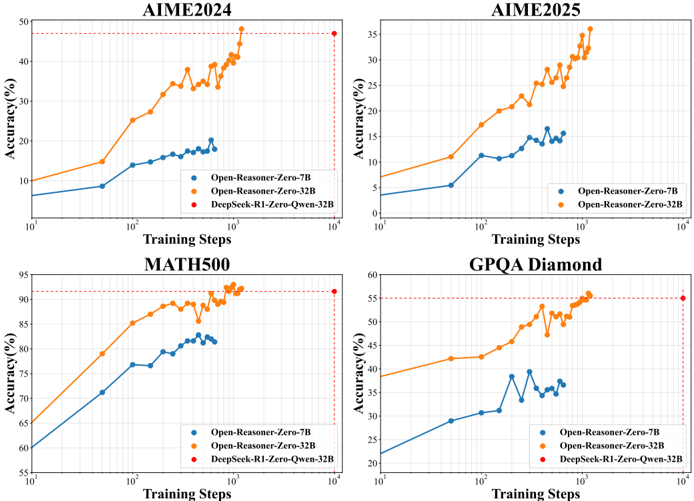

*Figure 1: Evaluation of Open-Reasoner-Zero-{7B, 32B} on benchmarks (averaged on 16 responses) during training. Using the same base model, Qwen2.5-32B base, as DeepSeek-R1-Zero-Qwen32B, Open-Reasoner-Zero-32B achieves superior performance on AIME2024, MATH500, and GPQA Diamond-requiring only a tenth*

**② 方法 / 架构图**

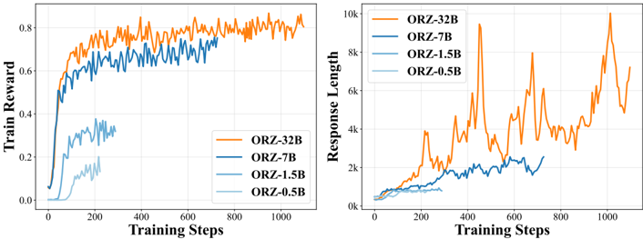

*Figure 2: Train-time Scale up on Train Reward and Response Length of Open-Reasoner-Zero (ORZ) - {0.5B, 1.5B, 7B, 32B}. Train Reward and Response Length increase steadily, demonstrating consistent scalability across model sizes. Interestingly, the ORZ-32B Response Length exhibits fluctuations without*

### 一眼看懂

- 🟦 TL;DR:不用任何花活——直接在 base 模型上跑最朴素的 vanilla PPO + GAE(\(\lambda=\gamma=1\)) + 只看答案对错的二值规则奖励、完全不加 KL 正则——就能稳定地大规模 scale up reasoning RL,性能与响应长度随训练步同步上涨且不饱和,复现了 DeepSeek-R1-Zero 的 scaling 现象;且是首个把代码/数据/各尺寸权重乃至 critic 权重全部开源的 "Reasoner-Zero" 实现。【原文】abstract+§1
- 最巧的一步:**用 PPO(带学到的 critic)而非 GRPO**(§2.2+§3.3)。抽掉 critic——GRPO 无 value network,分不清"真正答对"与"陷在重复 loop 里偶然答对"(原文 §2.2 原话 "struggles to distinguish genuinely correct responses from those occurring within negative patterns"),会误导强化、训练崩溃;而 PPO 学到的 critic 能给重复 token 赋更负的 advantage(Fig.5 定量证明),提供更稳健的 credit assignment。这是全文"为何稳"的核心机制证据。次关键:大规模数据天然降方差,使无偏的 GAE(\(\lambda=\gamma=1\))配置可行(优势简化为 \(\hat A=R-V_\phi\))。

### 为什么做

- 研究背景:o1、DeepSeek-R1-Zero 展示了"训练时间 scaling"——随算力增大,benchmark 性能与响应长度同步持续增长无饱和,并伴随 reflection/"aha"行为;R1-Zero 还证明可直接在 base 上启动 RL(跳过 SFT/蒸馏)。【原文】§1
- 解决的具体痛点:社区缺一个直接在 base 上做大规模 reasoning RL 的、全开源且稳定可扩展的实现;DeepSeek 只简述 pipeline,关键细节(数据、超参、value/advantage 估计、稳定化技巧)不公开;且对"GRPO 因无 value network 易在重复模式上误判、坍缩"缺系统分析与可复现配方。【原文】§1+§2.2
- 相关工作 & 各自不足(站谁肩上 + 精确差异):
  - **DeepSeek-R1-Zero**[2]——直接 base+RL 启动、用 GRPO,但配方黑箱、不开源关键细节;ORZ 全开源 + 改用 PPO + 去 KL + 约 1/10 步追平。
  - **DAPO**[5]——并发 base-RL 系统,匹配 ORZ 的 AIME 但用约 5× 迭代、其他基准更差(Table 1:DAPO* 在 MATH500 仅 71.8、GPQA 16.0,远逊 ORZ 92.2/55.5)。
  - **VAPO**——AIME 更强但 scale 效率低、同迭代预算只到 ORZ 约 60%(value learning 难题拖累)。
  - **Logic-RL / SimpleRL-Zoo / Understanding-R1-Zero**——pilot 配方,验证 base-RL 可行但非全开源大规模。
  - **另一线(先 SFT 蒸馏冷启动再 RL)**——在"已增强推理模型"上做 RL;ORZ 反其道直接 base 起步。
  - **RLHF 主流 / Reasoner 模型**[6,7,2]——默认保留 KL 正则;ORZ 显式去 KL(主张 KL 限制探索),是与主流相反的设计选择。【原文】§1+§4+§2.2
- 动机链:R1-Zero 现象惊人但配方黑箱 → 社区复现 GRPO 频繁崩溃 → 需要一个鲁棒、可扩展、易跟随的 base-model 大规模 RL 实现 + 把 value/advantage 估计讲清楚 → 全开源 democratize。【原文】§1
- 与最近邻工作的Δ:vs DeepSeek-R1-Zero——**全开源 + 用 PPO 而非 GRPO + 去 KL + 仅 1/10 训练步**追平/超过;vs DAPO/VAPO——更简单的算法设计、避开 value learning 难题、scale 效率更高。关键点:证明"极简即最优"(minimal reward 无 format reward → 无 reward hacking 空间)。【原文】Table 1+§4

### 怎么做 + 靠不靠谱

- 方法流水线(输入→输出):① Qwen2.5-{0.5,1.5,7,32}B base + R1-Zero 风格 prompt(要求 `<think>…</think><answer>…</answer>`)→ ② 每步 128 prompt × 每 prompt 64 response(temp/top-p=1.0)→ ③ 仅检查 `<answer>` 与参考答案精确匹配给二值 reward(1/0)→ ④ vanilla PPO + GAE(\(\lambda=\gamma=1\)),严格 on-policy(每次生成对应恰好一次 policy 更新),batch-level advantage 归一化,无 KL → ⑤ 32B 末段加 100 步 annealing(13k 难题,lr 线性衰减到 3e-7)。【原文】§2.3+§B
- 逐组件必要性(标"有无消融"):
  - **PPO over GRPO**:有定量分析(§3.3+Fig.5,PPO 对重复 token 赋更负 advantage;Fig.7 PPO 比 GRPO 稳)——核心,有据。
  - **GAE λ=1(vs 0.95)**:有消融(Fig.3 左),λ=1 reward 快增且稳,0.95 慢且长度坍缩——必要。【原文】§3.2
  - **去 KL(vs KL Loss / KL Reward Shaping)**:有消融(Fig.3 中),去 KL 最优且省显存/省调参(无需加载 reference model、不算其 log-prob)——必要。【原文】§3.2
  - **极简二值 reward(无 format reward)**:有论证(Fig.4 左,base 模型很快学会格式,Correct Fmt Ratio 快速到 1)——必要,且杜绝 reward hacking("minimal design leaves no room for reward hacking")。【原文】§2.2+§3.1
  - **scale up data(ORZ-57k vs MATH-7.5k)**:有消融(Fig.3 右),小数据集早早 plateau——必要。【原文】§3.2
  - **γ=1**:有论证(低 γ 会诱导模型过早终止生成抢即时奖励)——保留。【原文】§2.2
- 关键机制/公式(真实符号,从 PDF 抄准 + 直觉):
  - **轨迹与稀疏奖励**:每个响应 \(o_i\) 是轨迹 \(\tau_i=(s_0,a_0,\dots,s_{T_i-1},a_{T_i-1})\),\(s_t\)=prompt+已生成 token,\(a_t\)=第 \(t\) 个 token;只在末端给二值 reward \(R_i\in\{0,1\}\)(\(r_t=0\) for \(t<T_i-1\),\(r_{T_i-1}=R_i\))。
  - **GAE 一般式**(Eq.1):
    \[ \hat A^{\mathrm{GAE}(\gamma,\lambda)}_t=\sum_{k=0}^{T-t-1}(\gamma\lambda)^k\,\delta_{t+k},\qquad \delta_{t+k}=r_{t+k}+\gamma V_\phi(s_{t+k+1})-V_\phi(s_{t+k}). \]

  - **PPO 策略目标**(Eq.2,clipped surrogate;\(\epsilon=0.2\)):
    \[ J_{\mathrm{PPO}}(\theta)=\mathbb{E}_{\tau\sim\pi_{\theta_{\mathrm{old}}}}\Big[\sum_{t=0}^{T-1}\min\big(\rho_t(\theta)\hat A_t,\;\mathrm{clip}(\rho_t(\theta),1-\epsilon,1+\epsilon)\hat A_t\big)\Big],\quad \rho_t(\theta)=\frac{\pi_\theta(a_t|s_t)}{\pi_{\theta_{\mathrm{old}}}(a_t|s_t)}. \]

  - **value 目标**(Eq.3):\( J_{\mathrm{value}}(\phi)=\tfrac{1}{2}\mathbb{E}_{\tau\sim\pi_{\theta_{\mathrm{old}}}}\big[\sum_{t=0}^{T-1}(V_\phi(s_t)-V^{\mathrm{target}}_t)^2\big]\),其中 \(V^{\mathrm{target}}_t=G_t=\hat A^{\mathrm{GAE}(\gamma,\lambda)}_t+V_\phi(s_t)\)。
  - **λ=γ=1 下的关键简化**(Eq.4-5——全文"为何稳"的算法核心):
    \[ \hat A^{\mathrm{GAE}(\gamma=1,\lambda=1)}_t=R-V_\phi(s_t),\qquad J_{\mathrm{value}}(\phi)=\tfrac{1}{2}\mathbb{E}_{\tau\sim\pi_{\theta_{\mathrm{old}}}}\Big[\sum_{t=0}^{T-1}(V_\phi(s_t)-R)^2\Big], \]
    \(R\) 为单一末端 reward。直觉:这就是"无偏 Monte-Carlo 回报 \(R\) 减 critic 基线 \(V_\phi\)"——本来最高方差(\(\lambda=1\)),但大数据量自然压方差使该无偏配置可行,从而吃满长程依赖;critic 负责把"重复/退化片段"识别出来打低分,在 token 级精确扣分。【原文】Eq.(1)(2)(3)(4)(5)+§3.3

- 实验与证据:base Qwen2.5-{0.5,1.5,7,32}B,直接大规模 RL 跳过 SFT。主结果(Table 1):ORZ-32B AIME2024 **48.1** / AIME2025 36.0 / MATH500 **92.2** / GPQA Dia. **55.5**,vs DeepSeek-R1-Zero-Qwen-32B 47.0/-/91.6/55.0(且仅 ~1/10 步);Table 4 各尺寸单调上升(0.5B→32B);Table 2 泛化 MMLU 84.9 / MMLU_PRO 74.4 超 Qwen2.5-Instruct-32B;Table 3 对蒸馏模型续做(ORZ-R1-Distill-Qwen-14B)超更大的 R1-Distill-Qwen-32B。baseline 公平性:DAPO* 用作者自己 metric 在 released ckpt 上重测(较公平);但"1/10 步"对比 DeepSeek 跨实现/跨数据,严格可比性有限。【原文】Table 1-4+§3.4
- 假设与失效边界:
  - 【原文】§5 未来工作隐含其边界:当前仅数学+少量通用基准;二值 reward 排除证明题等难评测题(数据 curation 显式过滤 proof-oriented problems,并用 LLM 滤极端 pass-rate 样本保持难度平衡)。
  - 【推断】"去 KL 总更好"的结论在 base 模型起点成立,迁移到已对齐/已蒸馏起点时不一定(参见 ProRL 等保留 KL 的反向主张);"PPO>GRPO"的论证主要靠作者自身曲线 + "repeated token 的 advantage"定性/定量分析,非对所有任务/尺度的普适结论;"1/10 步"依赖与 DeepSeek 复现条件可比性(数据、prompt 不同),属同向但非严格控制比较。
- 祛魅总结:【推断】真贡献=最高开放度的 Reasoner-Zero 可复现配方(连 critic 权重都放)+ 对"为何 PPO 比 GRPO 稳"给出 critic-credit-assignment 的定量证据,这是扎实的工程与分析贡献。被适度高估的是"极简即最优"的普适性:它是"在 base 起点 + 大规模数据 + 数学/可验证答案"这一特定配方下成立的结论,换起点/换任务需重验。与本课题(探索-巩固/OPD/MTP)几乎无直接方法关联,仅作 RLVR 系统基线与"训练-时 scaling/reflection 现象"的背景参照。

### 结构化抽取

- 🎯 机制速览6轴:
  - 学什么信号:序列末端二值正确性 reward(规则匹配 `<answer>`)+ critic 学到的 token 级 value \(V_\phi(s_t)\)。
  - 改什么:policy \(\pi_\theta\) 与 critic \(V_\phi\) 两套独立网络参数(不共享权重)。
  - 何时改:每次 rollout 后做一次 on-policy PPO 更新(critic 12 mini-batch/iter)。
  - 免梯度?否——标准 PPO 梯度优化。
  - 记忆-技能生命周期:无外部记忆/技能库;推理"技能"靠 RL 直接在参数里涌现(reflection 模式自发增长,Fig.4 右)。
  - 防遗忘机制:**显式去掉 KL/reference model**(与主流相反),理由是 KL 限制探索;不靠 KL 防遗忘,靠大数据+critic 稳定。【原文】§2.2
- ⑦ 开源代码+框架/harness:github.com/Open-Reasoner-Zero/Open-Reasoner-Zero(本地已克隆 ~92MB,含 `orz/` 包、`playground/` 各尺寸训练脚本如 `orz_32b_ppo.py`、`docker/`、`ORZ_paper.pdf`)。框架 **OpenRLHF + vLLM + DeepSpeed + Ray**(实现 vanilla PPO+GAE 的大规模分布式训练)。HF 放 ORZ-{0.5,1.5,7,32}B + ORZ-R1-Distill-Qwen-14B + critic 权重 + ORZ 数据。代码可得性:完整(同类工作中最高,含 critic 权重)。【原文/仓库】
- 💰 资源/成本与可扩展性:每步 128 prompt×64 response;policy lr 1e-6 / critic lr 5e-6(AdamW,β=[0.9,0.95],无 weight decay,constant+50 步 warmup);32B + annealing 100 步(13k 难题,lr→3e-7);StepFun 提供算力(具体 GPU 数/总卡时论文未明说)。核心卖点即"~1/10 训练步追平 R1-Zero"。【原文】§B
- 🎯 对"探索-巩固"对标:**竞品/背景,非直接组件**。一句判定:ORZ 走的是"纯结果奖励 RLVR + 去 KL 鼓励探索"路线,与本课题"teacher 稀疏脚手架 + on-policy 蒸馏稠密信号"是对立思路(它恰恰主张去掉 reference/KL),只能作为"探索由 RL 自发驱动"的对照与系统基线。依据:§2.2 去 KL 鼓励探索。可借组件:① critic 对"重复/退化片段"的 token 级 devalue(Fig.5)——这与"识别走偏/需回轨的关键步"思路相通,可借来定位 path-recovery 的接管点;② annealing 阶段挖"64 次只对<4 次"的难题做课程——可用于"探索-巩固"的难度调度。缺口:无任何蒸馏/特权信息/MTP,纯 outcome 信号、无过程级巩固。
- 🔭 开放问题/未来方向:
  - 【原文】§5:Data/Model/Test-Time/Scenario 四类 scaling;test-time 提到 multi-turn、value model 评估推理轨迹、multi-agent——可通向 agentic。
  - 【推断】把 ORZ 的"learned critic 定位退化/重复"显式接到 path-recovery(在 critic 打低分的 token 处触发回轨/重选分支),可能把纯 outcome RL 与过程级巩固桥接;"去 KL"结论需在已蒸馏/已对齐起点重验(本课题多从 instruct 模型起步,可能反而需要保留 reference 锚点)。

— RETURN —
orz | 读PDF? 是(21页,§1-§3+Table1-4/Fig2-5 全核,Eq.1/2/3/4/5 逐字核对) | 加厚? 是(GAE Eq.1 + PPO Eq.2 + value Eq.3 + λ=γ=1 简化 Eq.4/5 全列 + 相关工作扩到 7 条精确对位 + 轨迹/稀疏奖励形式化) | LaTeX公式条数:5(GAE Eq.1 / PPO Eq.2 / value Eq.3 / 简化优势Eq.4 / 简化value Eq.5) | 待核数:0

---

## ProRL: Prolonged Reinforcement Learning Expands Reasoning Boundaries in Large Language Models

> **`prorl`** ｜ NVIDIA(Mingjie Liu, Shizhe Diao, Ximing Lu, Jian Hu, Xin Dong, Yejin Choi, Jan Kautz, Yi Dong;长程 RLVR / 推理边界谱系) ｜ 2025-05 预印本·arXiv v1(arXiv:2505.24864v1,2025-05-30)·Under review ｜ 主题线 L3(RLVR/GRPO 训练与稳定化)·相关性 高(长程探索-稳定性,与"探索"一侧直接相关) ｜ [📄 原始论文](https://arxiv.org/abs/2505.24864)

### 关键图示

**① Motivation / 对比图**

*Figure 1: Benefits of prolonged reinforcement learning (ProRL). Left : Pass@1 and Pass@16 scales with ProRL training. Middle : ProRL leads to more novel solutions reflected by higher Creativity Index [12]. Right : Our model greatly surpass base model across diverse tasks.*

**② 方法 / 架构图**

*Figure 2: ProRL training dynamics.*

### 一眼看懂

- 🟦 TL;DR:学界争论"RL 到底是发现新推理能力,还是只放大 base 已潜在的高奖励输出"(后者由 Yue/Dang/Zhao 等用 pass@k 论证)。本文用一套能跑 **2k+ 步不崩**的长程 RL 配方(ProRL = GRPO + DAPO 解耦 clip/动态采样 + **KL 正则 + 周期性把参考策略硬重置为近期在线快照**),在 **136K 五域可验证数据**上训练,证明:在 **base 即使大量采样(pass@128/256)也完全做不出**的任务上(boxnet:base pass@k 全 0.000,RL 模型达 1.000),RL 后能做对,从而主张 RL **确能扩展**推理边界(而非仅放大)——但前提是足够长的训练 + 良好初始化 + base 本来弱的领域。产出 **Nemotron-Research-Reasoning-Qwen-1.5B**(号称当时最强 1.5B 推理模型)。【原文 Abstract 行 14-34,§4.2-4.3,Figure 4-5,Table 3】
- 最巧的一步:**参考策略硬重置(Reference Policy Reset)**。抽掉它,长程 RL 会卡死——因为随训练推进 KL 项**渐主导损失**、policy 更新变小、过早收敛;周期性把 \(\pi_{\text{ref}}\) 硬重置为近期在线快照 \(\pi_\theta\)、并重置优化器状态,就能"在保留 KL 稳定收益的同时持续提升"。它和"保留 KL"是一对:单留 KL 会停滞,单去 KL(DAPO/ORZ 主流做法)会熵坍缩;ProRL 用"KL + 定期重置"两者兼得。【原文 §2.3.1 行 223-228】
  - 注:这是**机制层面**的命门(论文用训练曲线 + 直觉论证),但论文**未做"逐组件剥离"消融**(无 w/o reset / w/o KL 的对照实验),故"最巧一步"的因果强度部分依赖叙述而非受控实验。【推断:全文无 ablation 表】

### 为什么做

- 研究背景:o1/DeepSeek-R1 等推理模型靠 test-time scaling(长 CoT + 探索/验证/回溯)在数学/代码大幅提升,RLVR(针对可验证奖励的 RL)是核心驱动且能缓解 reward hacking。【原文 §1 行 37-47】
- 解决的具体痛点:① 流行观点(Yue et al.[13]、Dang et al.[14]、Zhao et al.[15])认为 RL 不带来超越 base 的新能力,只放大已潜在输出(base 大量采样仍做不出的题,RL 后也不行);② 长程 RL 面临**熵坍缩**与不稳定——输出分布过早变尖、熵骤降、探索受限,而 GRPO 的学习信号**依赖一组多样采样**来估相对优势,熵坍缩使更新偏置、训练停滞;③ 单纯提高采样温度只**延缓**而非阻止熵坍缩(论文实测,行 188-190)。【原文 §1 行 104-114,§2.2.1 行 182-190】
- 相关工作 & 各自不足(精确到论点):
  - **[13] Yue et al.**——用 pass@k 论证 RLVR 不扩展能力(甚至退化);本文反驳其**两个方法论局限**:(1) 过度依赖**数学**这种"预训练+后训练都过度训练"的领域,本就压缩了探索空间;(2) RL 步数太短(typically <几百步,行 114),模型还没充分探索就停。
  - **[14] Dang et al.**——推导 pass@k 上界并观察训练中 pass@k 下降。
  - **[15] Zhao et al.("Echo chamber")**——RL 收敛到主导分布、只放大预训练模式。
  - **去 KL 阵营 [4,7,5,18]（DAPO/ORZ 等）**——主张移除 KL,理由是 CoT 任务模型训练中"自然发散";本文观察到**这一观点多适用于未经 SFT 的 base 模型**,而 ProRL 从**已 SFT、能产连贯 CoT 的良好起点**(DeepSeek-R1-Distill-Qwen-1.5B)出发,此时保留 KL 对稳定与持续熵仍有益(行 218-222)。
  - 关键差异:本文不只改 clip/归一化,而是把"**长程 + 多域 + 稳定化(KL+重置)+ 良好起点**"四者绑定,并用 **Creativity Index**(轨迹与预训练语料 DOLMA 的重叠,越低=越新)+ **base 全 0 任务上 RL 做对**作为"扩展 vs 放大"的更强证据。
- 动机链:质疑"RL 不扩展能力"假设 → 怀疑那是"领域过窄 + 训练过短"两个方法论缺陷所致 → 设计能长跑(2k+ 步)且覆盖五域(数学/代码/STEM/逻辑谜题 Reasoning Gym/指令遵循)的 ProRL,并用稳定化压住熵坍缩 → 验证"扩展边界"与 base 任务能力、训练时长强相关。【原文 §1 行 115-126】
- 与最近邻工作的Δ:vs DAPO/ORZ 等"去 KL"主流——ProRL **反其道保留 KL**,并把适用前提**条件化**("从已能产连贯 CoT 的良好初始化出发"才保 KL);又新增**参考策略重置**解决"KL 项后期主导→更新停滞"。vs [13/14/15]——用 Creativity Index + base 全 0 任务 RL 做对,作"扩展"的更强证据,且诚实给出"只在 base 弱领域扩展、base 强领域 pass@128 反降"的边界。

### 怎么做 + 靠不靠谱

- 方法流水线(§2,输入→输出讲清):
  - **输入**:良好初始化 base \(\pi_\theta\)(DeepSeek-R1-Distill-Qwen-1.5B,已能产连贯 CoT);136K 五域可验证数据(每域配二值或连续奖励)。**输出**:Nemotron-Research-Reasoning-Qwen-1.5B,一个跨域 generalist。
  - **① 基座 GRPO(去 critic)**:
    \[
    L_{\text{GRPO}}(\theta)=\mathbb{E}_{\tau\sim\pi_\theta}\!\left[\min\!\Big(r_\theta(\tau)A(\tau),\ \operatorname{clip}(r_\theta(\tau),1-\epsilon,1+\epsilon)A(\tau)\Big)\right],\quad r_\theta(\tau)=\frac{\pi_\theta(\tau)}{\pi_{\text{old}}(\tau)}
    \]
    优势用组内标准化(去 PPO 的 critic):\(A(\tau)=\dfrac{R_\tau-\operatorname{mean}(\{R_i\}_{i\in G(\tau)})}{\operatorname{std}(\{R_i\}_{i\in G(\tau)})}\)(Eq.2)。

  - **② 叠 DAPO 两组件**(§2.3,抗熵坍缩):
    - **解耦 clip**(Eq.3):上下界拆成独立超参 \(\operatorname{clip}(r_\theta(\tau),1-\epsilon_{\text{low}},1+\epsilon_{\text{high}})\);调高 \(\epsilon_{\text{high}}\)="clip-higher",**抬升低概率 token 的上行空间**、保熵、减 mode collapse(实测有效,行 200-202)。本文取 \(\epsilon_{\text{low}}=0.2,\ \epsilon_{\text{high}}=0.4\)。
    - **动态采样**:过滤掉 acc=0 或 1 的 prompt(无学习信号),聚焦中等难度,维持多样学习信号。
  - **③ 叠 KL 正则**(Eq.4):\(L_{\text{KL-RL}}(\theta)=L_{\text{GRPO}}(\theta)-\beta\,D_{\text{KL}}(\pi_\theta\,\|\,\pi_{\text{ref}})\)。作用三重:维持熵、防 online policy 偏离稳定参考太远、**抑制对 spurious reward 的过拟合**(行 215-217)。
  - **④ 参考策略硬重置**(§2.3.1):验证集(blended validation)停滞/退化时,把 \(\pi_{\text{ref}}\leftarrow\) 近期在线 \(\pi_\theta\) 的快照 + **重置优化器状态**;全程反复应用,避免过早收敛、鼓励长训练。
  - **数据流动 / 何时重置**:用从评测基准混出的 validation set 监控;性能停滞即触发硬重置(既恢复稳定性,又**促进 policy 进一步偏离 base**,行 261-263)。多数训练 response 上限 8k token,**末段提至 16k**(行 264+)。
- 逐组件必要性:**全文无受控 ablation 表**。各组件必要性靠"机制论证 + 训练曲线"支撑:
  - 温度只**延缓**熵坍缩(行 188-190,实测论证,且仍用高温 1.2 抬初始熵);
  - clip-higher 保熵(行 200-202,观察);
  - KL 保熵 + 防漂移 + 抑 spurious-reward 过拟合(行 215-217);
  - 重置防"KL 后期主导→更新趋零→停滞"(行 223-228)。
  - **没有"去掉某组件后掉多少分"的对照实验**——这是方法学明显短板:无法定量归因"重置"vs"仅 KL"vs"仅 DAPO"三者的边际贡献。【推断:全文 grep 无 ablation/无 w/o reset 实验】
- 关键机制/公式(直觉):
  - 核心张力=**熵坍缩 vs 探索预算**。GRPO 需一组多样采样才能估好相对优势 \(A(\tau)\),一旦熵坍缩(分布变尖)就退化为偏置更新、停滞。clip-higher 给低概率 token 更大上行空间(保探索);KL 把策略**拴在稳定参考**附近(防崩);而 KL 久了会"拽太紧"(\(\beta D_{\text{KL}}\) 项主导)使更新趋零——**重置=松开缰绳再系到新位置**(\(\pi_{\text{ref}}\) 跟进 + 优化器清零),故能"长跑且不早收敛"。
  - **pass@k 上界**(引 Dang et al.):上界随期望 pass@1 升、随其方差降;ProRL 把整体分布**右移**(pass@1 提升)足以盖过"分布变尖→方差变化"的负效应,从而在多数复杂任务上 pass@128 也升——但**数学等 base 已饱和领域**例外(见下"诚实反例")。
- 实验与证据:
  - 数据集/设置:自构 **136K** 可验证问题(数学/代码/STEM/逻辑谜题 Reasoning Gym/指令遵循,每类配二值或连续奖励,组成见 Appendix D);基座 **DeepSeek-R1-Distill-Qwen-1.5B**。框架 **veRL**。超参:\(\epsilon_{\text{low}}=0.2,\ \epsilon_{\text{high}}=0.4\)、动态采样过滤 acc∈{0,1}、每 prompt **n=16**、context 8096、**温度 1.2**、**batch 256 / mini-batch 64**(每 rollout 4 次梯度更新)、AdamW 常数 lr **2×10⁻⁶**、**4×8 H100-80GB**、约 **16k GPU·小时**;多数训练 response 上限 8k,末段提 16k。【§3.2 行 250-257】
  - 关键数字 — **增益数值有两套口径(论文内部不一致,已并列记录)**:
    - **§1(行 123-124)**:数学 **+14.7%**、代码 **+13.9%**、逻辑 **+54.8%**、STEM **+25.1%**、指令 **+18.1%**。
    - **§3(行 236-237)**:数学 **+15.7%**、代码 **+14.4%**、STEM **+25.9%**、指令 **+22.0%**、逻辑 **+54.8%**;并超领域专用基线(数学 +4.6%、代码 +6.5%)。
    - 两套差异主要在指令(18.1% vs 22.0%)、数学(14.7% vs 15.7%)、STEM/代码;**原因论文未说明**,本分析以 §3/结果节为准(与 Table 对应)。【已核行 123-124 vs 236-237】〔待核:两套口径差异原文无解释〕
  - **边界扩展最强证据(Figure 5,boxnet OOD)**:base pass@k 在 k=1,2,4,…,256 **全为 0.000**;RL 模型 final 达 **1.000**(intermediate 0.994@128→1.000@256),且 final 在所有 k 上一致 ≥ intermediate(行 1032-1062)。Table 3 数值:base boxnet **0.00**、R1-7B 1.71、Nemotron-1.5B 远超(行 363-379)。
  - **三 regime(Figure 4,关键诚实反例)**:(1) **Diminished**:部分**数学**基准 pass@1 升但 **pass@128 反降**(base 本就强、RL 只是把分布变尖、牺牲多样性,与 [13] 一致,行 992-997);(2) **Plateau**:pass@1/128 都升但**早期即饱和**,ProRL 额外步数收益微(行 1000-1003);(3) **Sustained**:复杂任务(如 coding)随长训练持续提升、真正扩展边界(行 1004-1008)。即**ProRL 并非到处都扩展边界**,只在 base 弱的复杂任务上扩展。§4.2(行 517-527)进一步:边界扩展(pass@128)与 base 初始能力**负相关**——base 高 pass@128 的任务 RL 后边界反而收窄/负增益,base 低 pass@128 的任务 RL 最有效。
  - **新颖性证据**:Creativity Index(对 DOLMA 语料的非重叠度)随训练上升 **3.84→4.42→4.70**(Figure 1 中);base 已熟悉的任务 creativity 低(行 530-535)。
  - baseline 公平性:与同 base(R1-Distill-1.5B)及领域专用基线(DeepScaleR、DeepCoder 等)对比,提供 R1-7B 作灰色参考;较公平。但**仅 1.5B 单规模、单 base**。
  - 看着强但没回答的:① 全程**无组件消融**,稳定化各组件贡献无法定量归因;② "扩展边界"的判定高度依赖 pass@128 与 Creativity Index 两个测度(pass@k 对 k/温度敏感,Creativity Index 是语料重叠代理);③ §1 vs §3 增益数值不一致。
- 假设与失效边界:【原文】① 适用前提="良好初始化(已蒸馏、能产连贯 CoT)的起点",base 模型直接 RL 不在此列(行 218-222);② 边界扩展只在 base 初始弱的领域显著,base 强领域反而 pass@128 退化(Figure 3/4,§4.2);③ KL 项后期会主导→需重置(行 223-224)。【推断】④ 仅 1.5B、单一 base,更大模型/不同起点的可迁移性未验证;⑤ "扩展 vs 放大"结论强度依赖 pass@128(大 k)与 Creativity Index 的稳健性,换测度可能动摇定性结论;⑥ 16k GPU·hr 成本对小团队复现门槛高,且无训练代码、需自行在 veRL 上拼装。
- 祛魅总结:【推断】真贡献=① 以**强反例**(boxnet base 全 0、RL 满分)+ Creativity Index 把"RL 能扩展边界"从口号变成可观测现象,并诚实给出"只在 base 弱领域、Diminished/Plateau/Sustained 三态"的边界条件;② "KL + 参考重置"是长程 RL 实用稳定化配方。被高估处:标题"Prolonged RL Expands Reasoning Boundaries"偏强——实证里数学等领域 pass@128 反降,普适性被三 regime 打折;"扩展边界"对测度敏感。被低估处:对"去 KL 是否普适"的细致反驳(**限定良好初始化前提**)其实调和了 ORZ/DAPO 的对立主张,这一**前提条件化**洞见比标题更有价值。**数值一致性瑕疵**:§1(行 123-124)vs §3(行 236-237)两套增益数不同,原因论文未说明,本分析采 §3。

### 结构化抽取

- 🎯 机制速览6轴:
  - **学什么信号**:可验证结果奖励(二值/连续,跨数学/代码/STEM/逻辑/指令五域),GRPO 组内归一优势 \(A(\tau)\);无 teacher/无 KD。
  - **改什么**:policy 参数 \(\theta\)(GRPO 梯度);参考策略 \(\pi_{\text{ref}}\) 周期性被硬重置(非梯度,是 copy 快照 + 重置优化器)。
  - **何时改**:纯在线 on-policy RL,长达 2k+ 步;重置由 blended validation 停滞触发。
  - **免梯度?**:否,policy 全程梯度更新。
  - **记忆-技能生命周期**:无外部记忆/技能库;多域"技能"通过长程 RL 固化进单一 generalist 参数;\(\pi_{\text{ref}}\) 重置=滚动更新"稳定锚点"。
  - **防遗忘机制**:**KL-to-reference 正则(Eq.4)是核心稳定/防漂移手段**(防偏离稳定参考、抑制对 spurious reward 过拟合);参考重置避免 KL 拽死。这是"防(过快)漂移/防熵坍缩"而非"跨任务防遗忘";多域联合训练间接缓解单域过拟合。
- ⑦ 开源代码+框架/harness:**仅发布模型权重**——https://huggingface.co/nvidia/Nemotron-Research-Reasoning-Qwen-1.5B(Abstract 行 33-34)。**无独立训练代码仓库**(CloneTier=B,只记链接不 clone)。框架=**veRL**(行 250);算法=GRPO + DAPO(解耦 clip + 动态采样)+ KL 正则 + 参考策略重置。复现需依论文超参在 veRL 上自行拼装。【未完整克隆原因:weights-only 无训练代码,无可 clone 的方法仓;权重仓为大模型权重,按 B 层规则只记链接】
- 💰 资源/成本与可扩展性:**4×8 NVIDIA H100-80GB、约 16k GPU·小时**(行 256-257);n=16 rollout、batch 256、2k+ 步、response 上限 8k(末段 16k)。成本较高,小团队复现门槛大;可扩展性=单 1.5B 验证,更大规模未试(论文自陈)。
- 🎯 对"探索-巩固"对标:**支撑"探索"一侧(探索预算/边界扩展),但与"教师脚手架"范式正交**。ProRL 证明的是"给足探索预算 + 压住熵坍缩,RL 能发现 base 走不通的新路径"——这正对应 idea 里"探索=发现有效行为/路径"的可行性论据(且给了"base 弱领域才扩展"的边界条件,对 TSRD 选题域有参考)。但它**没有 teacher、没有脚手架、没有 path-recovery、没有 MTP 前瞻**,巩固靠 KL 锚定 + 参考重置而非教师指导。可借组件:① **参考策略重置**这一"滚动锚点"技巧可直接用于 TSRD 长程训练防停滞;② **KL 保留 + 前提条件化**(良好初始化才保 KL)的洞见,提示"教师脚手架蒸馏 + KL 锚定"在 on-policy 蒸馏中如何设;③ **pass@128 / Creativity Index** 作"是否真扩展(而非放大)"的评测协议,可验证 TSRD 是否教会了新路径(尤其"base 弱领域才扩展"这一规律,提示脚手架若想突破 base 强领域的 Diminished 困境需要新机制)。缺口:无"主动选路/偏向可走通开头"机制(纯靠随机采样 + 高温),无"自选恢复分支"巩固,无前瞻。一句判定:**作"探索可行性 + 长程稳定化技巧 + 边界评测协议"的支撑/工具来源**,而非"探索-巩固"机制的直接基线。
- 🔭 开放问题/未来方向:【原文】long-horizon RL for reasoning 的进一步研究(Abstract/Conclusion);把"扩展边界"推到更难/更 OOD 任务。【推断】① 补做组件消融(隔离 KL / 重置 / clip-higher 的边际贡献),把"最巧一步"从叙述坐实为受控证据;② 扩到更大模型与非蒸馏起点,验证"良好初始化才保 KL"前提的普适性;③ 把"随机采样探索"换成"主动/前瞻引导探索"(如 MTP 前瞻或教师脚手架选路),看能否在 base 强领域也突破 pass@128 的 Diminished 困境;④ 寻找比 pass@128 / Creativity Index 更稳健的"边界扩展"测度。

— RETURN —
prorl | 读到PDF? 是(26页/101k字重抽清洗null字节后,§1-§6+三regime/boxnet/Creativity Index全核,所有超参与§1/§3增益不一致点逐项核对) | L线 L3(长程RLVR/稳定化) | 对标结论:支撑"探索可行性"(给足预算+压熵坍缩能发现base走不通的新路径,boxnet base全0→RL满分;且给出"仅base弱领域才扩展、base强领域pass@128反降"边界条件)并提供参考策略重置/KL前提化/pass@128+CreativityIndex评测协议三件可借工具,但无teacher/脚手架/回轨/前瞻,作支撑与工具来源非直接基线 | 残留待核数:2(全文无组件消融,KL/重置/clip-higher边际贡献未隔离;§1 vs §3 增益数值不一致原文无解释、已并列采§3)

---

## Revisiting Entropy in Reinforcement Learning for Large Reasoning Models

> **`revisit_entropy`** ｜ 天津大学 TJUNLP Lab + 天津师范大学 + 独立研究者（Renren Jin 一作；Deyi Xiong 熊德意 通讯） ｜ 2026-04-19 v3（v1 2025-11-08）· arXiv preprint cs.CL ｜ 主题线 L3(RLVR/GRPO)+L6(Token信用)·相关性 中 ｜ [📄 原始论文](https://arxiv.org/abs/2511.05993)

### 关键图示

**① Motivation / 对比图**

*Figure 1: Evolution of LLM entropy and Avg@64 performance on AIME 2024 during RLVR training. 'AdaEnt-Reg' denotes adaptive entropy regularization.*

**② 方法 / 架构图**

*Figure 5: Evolution of the entropy of LLMs during RLVR training under different methods. 'Ada-Ent-Reg' denotes Adaptive Entropy Regularization.*

### 一眼看懂

- 🟦 TL;DR:RLVR(可验证奖励 RL)训练 LLM 时策略熵常"坍缩"(概率质量集中到少数 token、丧失探索),导致过早收敛。本文做了一次系统性熵体检:① 实证熵与"回答多样性/校准/性能"的关系(发现熵≠性能的可靠代理,二者相关性高度任务相关;熵坍缩越严重模型越过自信/校准越差;**性能可以在不牺牲熵的情况下持续提升**);② 找出影响熵动态的三因素:clip 阈值、off-policy 更新次数、训练数据多样性;③ 理论+实证证明**正优势(positive-advantage)token 是熵坍缩的主因**;④ 据此提出 Positive-Advantage Reweighting——简单地动态调节"正优势 token"的损失权重来调熵,同时保持性能。【Abstract,§1】
- 最巧的一步:**§7.1 的梯度符号分析(式3/4)+ §7.2 的"只训 Adv≥0 vs 只训 Adv≤0"对照**。抽掉它,本文就只是一篇"熵现象观察 + 调参经验"集合;正是这个"正优势 token 推高已采样高概率 token、压低未采样低概率 token→质量集中→熵坍缩"的机制论证,把分散的现象(clip 三因素都通过"改变正/负优势 token 的相对梯度贡献"影响熵)统一起来,并直接导出干预手段(给正优势 token 的 loss 加可调权重 \(\lambda\))。【§7.1-7.2,图5】

### 为什么做

- 研究背景:RLVR(o1/DeepSeek-R1/Kimi k1.5 开创)成为提升 LLM 推理的主流;但越来越多工作发现 RLVR 会驱使熵坍缩——概率质量集中到少数 token,模型越来越偏 exploitation、不再探索新推理路径,过早陷局部最优。【§1,L42-70】
- 解决的具体痛点:已有缓解法众多,但**对 RLVR 中的熵缺乏系统研究**,三个核心问题未答:(1) 熵与性能如何相关?(§5)(2) 何因素(理论+实证)支配熵动态?(§6)(3) 如何有效调熵以提升性能?(§7)【§1,L83-90】
- 相关工作 & 各自不足(来龙去脉,据 §2):
  - **熵作为 RL 探索正则**历史悠久(Ziebart max-ent RL)。
  - **LLM 时代用熵当信号**:Dong/Zhang 等用熵决定 agent 何时求经验指导/补采样;**熵最大化目标**并入 RLVR(Shen 2025;He 2025)以鼓励探索防过早收敛——**短板**=系数难调(大则熵暴涨、小则无效)。
  - **clip 类**:**DAPO Clip-Higher**(Yu 2025)抬高重要性比率上界,防低概率正优势 token 被 clip 掉——**短板**=只缓解、不显式控熵,熵会无控漂移。
  - **协方差类理论切片**:Liu 2025 / **Cui 2025(Clip-Cov、KL-Cov)** 理论指出"log-prob 与 advantage 强正协方差的 token"主导坍缩,据此限制这类 token 更新——**短板**=干预是"限制更新"(硬截断),非连续可调,且只切单一理论切面。
  - **CE-GPPO**(Su 2025):用 stop-gradient **保留被 clip token 的梯度**缓解坍缩(与项目 memory 的 forward-hard/backward-soft 同构)。
  - **只用高熵 token 训**(Wang 2025b);**把熵并入 advantage**(Cheng 2025,Entropy-Adv)。
  - **共同空白**:多是点状缓解或单一理论切片,缺"熵-性能-校准-多样性"全景 + 跨三因素(clip/off-policy/数据)统一实证 + token 级因果归因。【§2,L145-180】
- 动机链:RLVR 强但熵坍缩→缺探索→过早收敛→需先搞清熵与性能到底什么关系(是不是越高越好)→再找熵被什么支配→再定位是哪类 token 在推坍缩→针对该类 token 设计最小干预。
- 与最近邻工作的精确Δ:vs **Cui(Clip-Cov/KL-Cov)**——同样把矛头指向"高协方差/正优势 token",但 Cui 干预="限制这类 token 更新",本文 Pos-Adv-Reweight="给正优势 token 的 loss 乘**可调连续权重 \(\lambda\)**"(更细的连续调控 + stage/epoch/entropy-guided 三种调度);vs **DAPO Clip-Higher**——本文把 Clip-Higher/Lower/Tighter/Free 放进统一 clip 阈值消融,用梯度公式解释为何 Clip-Higher 抗坍缩,且指出 Clip-Higher 不显式控熵会无控漂移,而 Pos-Adv-Reweight 能把熵稳到目标 \(\delta\) 附近。关键 Δ:**把"熵=性能代理"这一常见假设证伪**(Table1 Spearman 高度任务相关:AIME24 Avg@64 0.417、LiveCodeBench −0.894、IF-Eval 0.627),并给出"性能可不牺牲熵而升"的反例(§5.1)。【§5,Table1】

### 怎么做(到"读完能复现"的粒度)
> 本文主体=诊断扫描 + 一个轻量方法 Pos-Adv-Reweight。下面把基底目标、三轴扫描、token 级梯度归因、方法三变体逐一写到可复现。

#### A. 基底:token-level、去 KL 的 GRPO(全文训练用)
对每 prompt \(x\) 采 \(G\) 个响应 \(\{y_i\}\),组相对 advantage \(\hat A_{i,t}\) 用组内 reward 的均值/标准差归一(沿 DAPO 用 token-level loss + 去掉 KL 惩罚):
\[J(\theta)=\mathbb E_{x\sim\mathcal D,\{y_i\}\sim\pi_{\theta_{\text{old}}}}\!\Big[\tfrac{1}{\sum_i|y_i|}\sum_{i=1}^{G}\sum_{t=1}^{|y_i|}\min\!\big(r_{i,t}(\theta)\hat A_{i,t},\ \mathrm{clip}(r_{i,t}(\theta),1-\varepsilon_{\text{low}},1+\varepsilon_{\text{high}})\hat A_{i,t}\big)\Big],\]
其中 \(r_{i,t}(\theta)\) 是重要性比率。熵的定义 \(H(\pi_\theta)\) = \(\pi_\theta\) 的 token 级平均熵;熵正则把目标加项 \(\alpha H(\pi_\theta)\)。【附录A.1】

#### B. 诊断扫描(同模型/同数据,沿三轴)
平台:**Qwen2.5-Math-7B + GRPO + veRL + DAPO-Math-17K**,监测熵、reward、ID/OOD 性能、校准。

- **§5 熵 vs 性能/多样性/校准(证伪"熵=性能")**:① 熵与 N-gram 多样性强正相关(4 设置平均 Spearman 0.8795)——低熵=输出更不多样;② 训练中 response/prompt 熵都降,ID prompt 熵降更快;③ **熵不是可靠性能代理**:Table1 熵-性能 Spearman 高度任务相关(AIME24 Avg@64 0.417、LiveCodeBench −0.894 强负、IF-Eval 0.627 正)→ 取决于任务与评测指标;④ 熵坍缩越重、模型校准越差(过自信);⑤ **性能可不牺牲熵而升**(§5.1,用 Ada-Ent-Reg 把熵稳在训练前水平)。【§5,Table1】
- **§6.1 clip 阈值**:统一比 Clip-Higher / Clip-Lower(\(\varepsilon_{\text{low}}=0.28\)) / Clip-Tighter(\(\varepsilon_{\text{low}}=0.12\)) / Clip-Free(去 clip)。Clip-Higher 抗坍缩甚至升熵;Clip-Lower 坍缩最重;Clip-Tighter 缓解;**Clip-Free 熵第二高、ID/OOD 性能也第二高**(说明 off-policy 更新少时去 clip 不损稳定)。【§6.1】
- **§6.2 off-policy 更新数 \(N_{\text{update}}\in\{1,2,4\}\)**:更多更新放大熵变化、提训练 reward,但 ID Avg@64 增益 <1%、Pass@64 反降(过拟合)。表内:\(N=1\) 熵 0.118、\(N=2\) 熵 0.0229、DAPO(\(N=4\)) 熵 0.479(注:\(N=2\) 反而坍缩最重,\(N=4\) 因 Clip-Higher 熵高)。【§6.2,Table2】
- **§6.3 数据多样性**:多样性越低熵坍缩越重(K-means 选的子集比随机子集熵更低);**约 616 样本 ≈ 17k 样本性能**(数据规模非唯一决定因素,是降本启示)。【§6.3】

#### C. token 级因果归因:正优势 token 是主因(§7,全文支柱)

- **梯度符号分析(§7.1,式3/4)**:对某 token \(v\) 的 logit \(z_v\) 求梯度,符号取决于"该步是否采样到 \(v\) × advantage 正负 × 是否被 clip"。当 \(v\) **未被采样**时(式3):
\[\frac{\partial J(\theta)}{\partial z_v}=\begin{cases}-\,r_t(\theta)\,\pi_\theta(v\mid x,y_{<t})\,\hat A_t,&\hat A_t>0\ \text{且}\ r_t(\theta)<1+\varepsilon_{\text{high}}\\[2pt]0,&\hat A_t>0\ \text{且}\ r_t(\theta)>1+\varepsilon_{\text{high}}\\[2pt]-\,r_t(\theta)\,\pi_\theta(v\mid x,y_{<t})\,\hat A_t,&\hat A_t<0\ \text{且}\ r_t(\theta)>1-\varepsilon_{\text{low}}\\[2pt]0,&\hat A_t<0\ \text{且}\ r_t(\theta)<1-\varepsilon_{\text{low}}\end{cases}\]
当 \(v\) **被采样**时(式4),把 \(\pi_\theta(v)\) 换成 \((1-\pi_\theta(v))\) 且去掉负号:\(\frac{\partial J}{\partial z_v}=r_t(\theta)\,(1-\pi_\theta(v\mid x,y_{<t}))\,\hat A_t\)(同样的 clip 边界归零)。**因 RLVR 做梯度上升**:正优势 → 抬高已采样 token 概率、压低未采样 token;因高概率 token 更易被采样,质量越堆越集中 → **熵坍缩**。负优势反之 → 压高概率已采样 token、抬未采样的 → 抗坍缩。clip 把比率截断时梯度归零,所以 **clip 阈值 = 在调节正/负优势 token 的相对梯度贡献** → 与 §6.1 实证一致。【§7.1,推导见附录E.1】

- **直接实证(§7.2,关键)**:只训 Adv≥0 token vs 只训 Adv≤0 token。**只训 Adv≥0 → 熵坍缩最重(熵 ≈ 0.0146)**;**只训 Adv≤0 → 熵很高(≈ 0.884)**(图5)。对照 Ada-Ent-Reg / Clip-Cov / KL-Cov / Entropy-Adv / Rand-Pos-Clip 同台。这是"正优势 token 主导坍缩"的因果支柱。【§7.2,图5】

#### D. 方法:Positive-Advantage Reweighting(§7.3)
对 advantage \(\hat A>0\) 的 token,其损失乘可调权重 \(\lambda\)(\(\lambda=0\) 即完全不训正优势 token、只用负优势 token)。三种 \(\lambda\) 调度:

1. **Stage-based**:训练分两等阶段;前半 \(\lambda=0\)(只用非正优势 token),后半 \(\lambda\) 线性 0→1。
2. **Epoch-wise**:\(\lambda=(e-1)/(E-1)\)(\(E\) 总 epoch、\(e\) 当前 epoch),逐 epoch 线性升。
3. **Entropy-guided(主推)**:按当前熵自适应——熵超阈值 \(\delta\) 则 \(\lambda+\Delta\) 压熵,否则 \(\lambda-\Delta\) 升熵,把熵稳在 \(\delta\) 附近:
\[\lambda_{k+1}=\begin{cases}\mathrm{clip}(\lambda_k-\Delta,\,0,\,1),&H_k(\pi_\theta)<\delta\\[2pt]\mathrm{clip}(\lambda_k+\Delta,\,0,\,1),&\text{otherwise}\end{cases}\]
默认 \(\delta=0.2\)(与 Ada-Ent-Reg 对齐)、\(\Delta=0.05\)、\(\lambda_0=0\)。结果:Stage/Epoch 版熵先升后降;Entropy-guided 把熵稳在 0.2 附近,且拿到最高 ID Avg@64(45.66),并在 6/7 benchmark 上 Avg@64 超 Clip-Higher。**消融额外发现**:Rand-Pos-Clip(随机把一小撮正优势 token 梯度置零)就已能缓解坍缩且 Avg@64≈Clip-Cov——印证"调正优势 token 的损失权重是有效的控熵手段"。【§7.3,Table2,图5】

#### 数据/模型/评测(复现锚点)

- 模型:Qwen2.5-Math-7B(主)+ Llama-3.1-8B-Instruct(泛化验证,§7.3 末确认结论可迁移);训练 GRPO@veRL@DAPO-Math-17K(token-level loss,去 KL)。
- ID 基准:AIME24/25、MATH500、AMC23、Minerva;OOD 基准:LiveCodeBench(代码)、IF-Eval(指令遵循);指标 Avg@64 / Pass@64。
- 关键数字:Table2 各变体 ID Avg@64 多在 43-45.7(差距小),熵跨度大(0.015~0.88);GRPO(\(N=1\)) ID Avg@64 44.12;Pos-Adv-Reweight(Entropy-guided) 45.66。【Table1/2,§5-7】

### 靠不靠谱

- baseline 公平吗:同模型/同数据/同框架横扫十余变体(clip×4、\(N_{\text{update}}\)×3、数据多档、方法×多),Entropy-guided 与 Ada-Ent-Reg 特意对齐 \(\delta=0.2\) 以可比,公平性强。但**主实验仅 Qwen2.5-Math-7B + 数学训练数据**(Llama-3.1-8B 只作泛化点验,OOD 只是评测不是训练域多样)。
- 看着强但没回答核心问题:Pos-Adv-Reweight 的性能增益其实很小(ID Avg@64 45.66 vs 默认 GRPO 44.12,约 +1.5 点),主卖点更像"能稳熵且不掉点"而非"显著涨点"——价值偏"可控性/诊断"而非"性能突破";"熵不是可靠性能代理"很有用但也意味着调熵本身不直接等于提性能。
- 假设与失效边界:【原文】① 主体基于 GRPO + Qwen2.5-Math-7B + 数学数据;② 梯度分析(式3/4)是"token 未/已采样 + clip 边界"下的近似(推导在附录E.1);③ "性能可不牺牲熵而升"基于把熵稳在训练前水平(\(\delta\) 由 1000 prompt 实测)。【推断】结论强绑定 GRPO 族的 clip+advantage 结构;换 reward 形态(如 OPD 的 teacher token reward 而非二元 advantage)时,"正优势 token 主导坍缩"机制不一定平移——OPD 无显式 advantage 正负之分,熵动态由师生分布对齐主导(见 rethink_opd),二者机制不同。
- 祛魅总结:真贡献=把 RLVR 的熵从"经验调参"提升为"现象全景(熵 vs 多样性/校准/性能)+ 三因素 + 正优势 token 主因的理论-实证闭环",并给出可解释的最小干预 Pos-Adv-Reweight。两个最有用论断:**"熵不是性能的可靠代理(高度任务相关)"**和**"正优势 token 是熵坍缩主因"**。【推断】被高估的是方法本身(增益微弱,更像"可控旋钮");被低估/真有价值的是诊断结论(尤其 §5.2 证伪"熵=性能"、§6.3 "600≈17k 样本")。它是 RLVR 熵线的扎实"综述+体检"型工作,非范式突破。

### 结构化抽取

- 🎯 机制速览6轴:**学什么信号**=verifier 二元奖励→GRPO 组相对 advantage(本文重点是 advantage 的正/负如何经梯度影响熵) | **改什么**=策略参数 θ;干预手段=正优势 token 的损失权重 λ | **何时改**=在线 RLVR;λ 按 stage/epoch/entropy 三种调度动态调整 | **免梯度?**=否(GRPO policy gradient) | **记忆-技能生命周期**=无显式记忆/技能库 | **防遗忘机制**=无;但"防熵坍缩=保探索"间接防"多样性遗忘"(熵坍缩↔过自信/校准变差是本文核心关联)
- ⑦ 开源代码+框架/harness:https://github.com/cordercorder/EntropyRL(v1 元信息已核:约 7.8MB,以 veRL 为底,train_scripts/ 提供 ada_ent_reg.sh、clip_cov.sh、kl_cov.sh、entropy_adv.sh、pos_adv_reweight.sh、rand_pos_clip.sh 等;Clip-Higher/Adv≤0/≥0 等只需对 veRL 小改、未单独给脚本);框架 **veRL(GRPO)**。【§1 脚注,§4】
- 💰 资源/成本与可扩展性:原文未给 GPU 时/卡数。可推断:单模型 7B + GRPO,扫了十余配置(clip×4、Nupdate×3、数据子集多档、方法×多)——总算力不小但单 run 是常规 7B RLVR 规模;§6.3 "616 样本≈17k 样本"是个降本启示。【§6】
- 🎯 对"探索-巩固"对标:**间接支撑(探索侧)+ 可借诊断,非直接竞品**。映射:本文的"探索=高熵=保留多样推理路径"对应 TSRD 的"探索/选路"——其核心警示"正优势 token 推动熵坍缩、过度 exploitation"提醒 TSRD 在"巩固/固化有效路径"时要防止把探索能力一并固化掉(过早熵坍缩=过早巩固)。可借组件:① **token 级正/负优势梯度符号分析(式3/4)**——可迁移用于分析 TSRD 中"哪些 token 的更新在收缩 vs 扩张策略支撑",尤其判断 path-recovery 监督会不会误导致熵坍缩;② **熵≠性能、按任务看相关性**的方法论(评估 TSRD 时别把熵当目标);③ Entropy-guided λ 调度作为"巩固强度"的自适应旋钮思路(熵高时多固化、熵低时松手探索)——与"探索-巩固"的动态平衡天然同构。缺口:本文是纯 RLVR(无 teacher、无蒸馏、无记忆),与 TSRD 的"teacher 脚手架 + MTP 前瞻 + 记忆固化"三要素都不沾;且其机制(advantage 正负)在 OPD 设定下不直接适用。判定:**探索侧的机制参考与诊断工具来源,非方法竞品**。
- 🔭 开放问题/未来方向:【原文】未设独立 Future Work 章;隐含方向=把熵调控与性能解耦后如何"既保探索又稳定提升"、Pos-Adv-Reweight 在更多模型/域的验证。【推断】把"正优势 token 主导坍缩"的分析推广到 OPD/自蒸馏的 token reward 设定(检验是否同样有"某类 token 主导坍缩");把 Entropy-guided λ 与 OPD 的 overlap-token 动力学结合,做"在巩固高概率共享 token 的同时用 λ 守住探索熵"的混合调控;在 TSRD 中用该梯度框架定位 path-recovery 单点接管是否引入熵坍缩。

RETURN: revisit_entropy|读PDF?是(_txt 3400+行,核到§5-§7全文+附录A.1 GRPO目标+式3/4/5)|加厚?是(方法扩为A-D四块+复现锚点,相关工作6条精确化,4条公式转MathJax含分段梯度)|LaTeX公式条数 4|待核数 0

---

## A Survey of Reinforcement Learning for Large Reasoning Models

> **`rl_survey_lrm`** ｜ 清华 + 上海AI Lab + 上海交大 + 北大 + 中科大 + 哈工大 + 华盛顿大学 + 华科 + UCL(40+ 作者;Project Lead Kaiyan Zhang/Yuxin Zuo;通讯 Biqing Qi/Ning Ding/Bowen Zhou) ｜ 2025-10-10 v3 · arXiv 综述(cs.CL) ｜ L3 RLVR/GRPO(综述,横跨 L1-L6) · 相关性中(领域坐标系/背景) ｜ [📄 原始论文](https://arxiv.org/abs/2509.08827)

### 关键图示

**① Motivation / 对比图**

*Figure 2 | RLHF and DPO have been the two predominant RL methodologies for human alignment in recent years. In contrast, RLVR represents an emerging trend in RL for LRMs, significantly enhancing their capacity for complex task solving. The next stage of scaling RL for LLMs remains an open question,*

**② 方法 / 架构图**

*Figure 1 | Overview of the survey. We introduce the foundational components of RL for LRMs, along with open problems, training resources, and applications. Central to this survey is a focus on large-scale interactions between language agents and environments throughout long-term evolution.*

### 一眼看懂

- 🟦 TL;DR:系统综述 DeepSeek-R1 以来"RL for 大型推理模型(LRM)"范式,用一张总图(Fig.1)组织成五层——**基础组件(§3)/ 五对开放争议(§4)/ 训练资源(§5)/ 下游应用(§6)/ 未来方向(§7)**;核心论断:**RLVR(可验证奖励 RL)是区别于 RLHF/DPO(人类对齐)的新 scaling 轴**,把 LLM 转成 LRM,且其向 ASI 的可扩展性是核心开放问题。配套 GitHub Awesome-list 维护文献清单。【原文】Abstract、Fig.1、§1
- 最巧的一步(对综述而言=组织骨架):**五对"X or Y"对立式开放问题(§4)**——Sharpening or Discovery、Generalize or Memorize、Weak or Strong prior、Tricks or Traps、Process or Outcome。抽掉它,综述就退化成"文献罗列";正是这五对争议把海量快速演进的工作结构化成可追踪的分歧坐标系。【原文】§4、Fig.1

### 为什么做

- 研究背景:RL 在 AlphaGo/AlphaZero 时代已证窄而明确奖励可驱动超人表现;LLM 时代先以 RLHF/DPO 做人类对齐(3H)。近期出现 **RL for LRMs**——不止对齐行为,而是直接激励推理本身(OpenAI o1、DeepSeek-R1 两里程碑用 RLVR 诱导长链推理:规划/反思/自纠错,且随训练与推理算力平滑提升)。【原文】§1、§2
- 解决的具体痛点(综述视角):领域(尤其 R1 后)爆发式发展,进一步扩展 RL for LRM 面临算力/算法设计/训练数据/基础设施的基础性约束,亟需重访轨迹、重估方法论、探索通向 ASI 的可扩展策略。【原文】Abstract、§1
- 相关工作 & 各自不足:§2.3 梳理已有相关综述以定位自身(强调本综述聚焦 R1 后、以"语言智能体与环境长期演化中的大规模交互"为核心视角)。【原文】§2.3
- 动机链:领域文献海量且演进极快 → 需坐标系 → 用"组件—争议—资源—应用—未来"五层 + 五对争议组织 → 便于读者建立坐标系并追踪。【原文】Fig.1、§1
- 与最近邻(其他 RL/LLM 综述)的Δ:明确把 **RLVR 从 RLHF/DPO 中切出(Fig.2)** 作为独立新范式,并以"scaling 向 ASI"为主线;覆盖到 agentic/多模态/多智能体/机器人/医疗等外溢应用。【原文】§1、§6

### 怎么做 + 靠不靠谱(=综述 taxonomy 与覆盖)

- 方法流水线(综述结构):§2 预备(RL 定义/o1 以来模型脉络/相关综述)→ §3 基础组件 → §4 五对争议 → §5 训练资源 → §6 应用 → §7 未来方向 → §8 结论;配 Awesome-list。【原文】Fig.1、目录
- 逐组件(各章覆盖内容,本版比 v1 把 §3/§4 细分项写全):
  - **§3 基础组件**:
    - §3.1 奖励设计:**Verifiable**(数学答案对/代码单测过)/ **Generative**(生成式奖励模型)/ **Dense**(逐 token/步骤稠密)/ **Unsupervised**(无监督,如置信度)/ **Reward Shaping**。
    - §3.2 策略优化:**Policy Gradient** / **Critic-Based**(PPO 类)/ **Critic-Free**(GRPO·RLOO 类)/ **Off-Policy** / **Regularization 目标**(KL 约束/熵)。
    - §3.3 采样策略:Dynamic/结构化采样、采样超参。【原文】§3、Fig.1
  - **§4 五对开放争议(每对的具体分歧)**:
    - §4.1 **Sharpening or Discovery**:RL 只锐化 base 已有分布(Limit-of-RLVR/Yue 2025b 的 Pass@K 大 k 被 base 反超、spurious reward 也能涨分、forking token 主导) vs RL 发现新能力(ProRL 长稳 RL 同时提 Pass@1/Pass@K、Yuan 2025c 技能组合)。综述用 **KL 视角统一**:SFT 优化 forward KL \(D_{\mathrm{KL}}(p_{\text{data}}\Vert p_{\text{model}})\)(mode-covering),RL 优化 reverse KL \(D_{\mathrm{KL}}(p_{\text{model}}\Vert p_{\text{reward}})\)(mode-seeking)——前者覆盖所有 mode、后者把质量集中到高 reward 区;争议应转为"何种条件下 sharpening / discovery 主导"。
    - §4.2 **RL vs SFT: Generalize or Memorize**:Chu 2025a "SFT memorizes, RL generalizes";RL-on-math 保留甚至增强 OOD/指令遵循,SFT-on-math 常负迁移/灾难性遗忘(latent-space PCA + KL 诊断);但 RL 非万能(强 overfit/突变分布无效),SFT 加 reweight/trust-region 也能泛化且常更好地为 RL 热身;**统一/交替范式**(LUFFY off-policy trace、单阶段 SFT+RL 克服 long-horizon 样本复杂度、branch rollout 从 expert anchor 衔接两阶段;Ma 2025a:RL 擅巩固已有能力、SFT 擅引入新知识)。
    - §4.3 **Model Prior: Weak or Strong**(base 先验该弱该强)。
    - §4.4 **Training Recipes: Tricks or Traps**(各种 trick 是真增益还是陷阱)。
    - §4.5 **Reward Type: Process or Outcome**(过程奖励 PRM vs 结果奖励 ORM,关 token/step 级信用分配)。【原文】§4
  - **§5 训练资源**:§5.1 静态语料(Math/Code/STEM/Agent/Mixture);§5.2 动态环境(Rule/Code/Game/Ensemble);§5.3 RL 基础设施(OpenRLHF / veRL / AReaL / slime / TRL)。【原文】§5、Fig.1
  - **§6 应用**:Coding、Agentic、Multimodal、Multi-Agent、Robotics、Medical。【原文】§6
  - **§7 未来方向(9 项)**:7.1 Continual RL、7.2 Memory-based RL、7.3 Model-based RL、7.4 Efficient Reasoning、7.5 Latent Space Reasoning、7.6 RL for Pre-training、7.7 RL for Diffusion LLMs、7.8 Scientific Discovery、7.9 Architecture-Algorithm Co-Design。【原文】§7 目录
- 关键机制/核心论断(直觉):RLVR ≠ RLHF/DPO——前者用可验证信号激励推理能力本身,后者用偏好对齐人类;这是不同 scaling 范式(Fig.2)。**RL 与 SFT 的本质区别可归到 KL 方向**(reverse-KL mode-seeking vs forward-KL mode-covering)——这与 OPD 用 reverse-KL 蒸馏的机制同源(见 rethink_opd:OPD = dense KL 约束 RL),故综述虽无 OPD 专章,其 §3.2 正则/off-policy + §4.1 KL 框架已隐含 OPD 的理论坐标。五对争议尚无定论,是当前活跃前沿。【原文】§1、Fig.2、§4.1
- 实验与证据(综述无原创实验):§5 梳理训练资源(静态语料/动态环境)与复用性,§5.3 比较主流基础设施;论断为对现有文献的归纳。【原文】§5
- 假设与失效边界:
  - 【原文】综述聚焦 o1/DeepSeek-R1 发布以来工作(v3 2025-10),范围明确。
  - 【推断】结论依赖所引文献质量;领域演进极快,v3 后工作必然遗漏;五对争议多呈现分歧而少定论性裁决;"RL 通向 ASI"为前瞻论断,缺可证伪具体路径;§5.3 基础设施比较随框架迭代易过时。
- 祛魅总结:
  - 真贡献:为快速演进、文献海量的"RL for LRM"领域提供权威坐标系;五对争议提炼清晰,§7 未来方向(尤其 Continual/Memory-based/Model-based RL)指向性强;Awesome-list 可追踪。【推断】
  - 边界:作为综述不提供新实证;对本项目的价值是"定位与查文献",而非可复现方法。【推断】

### 结构化抽取

- 🎯 机制速览6轴(综述 taxonomy 对应):学什么信号=综述把奖励分为 Verifiable/Generative/Dense/Unsupervised(§3.1);改什么=策略优化谱系 PG/Critic-Based/Critic-Free/Off-Policy/Regularization(§3.2);何时改=采样策略 Dynamic Sampling(§3.3);免梯度?=不适用(综述);记忆-技能生命周期=§7.1 Continual RL / §7.2 Memory-based RL 专章讨论(与本项目 L5 直接对应);防遗忘机制=§7.1 明确讨论 CRL 的 stability-plasticity 平衡、可塑性丧失(Dohare et al. 2024 指深度网络在持续学习中退化),且 §4.2 引 Shenfeld "RL's Razor"——online RL 比 SFT 更好地保留旧知识(=天然防遗忘)。【原文】§3、§4.2、§7.1-7.2
- ⑦ 开源代码+框架/harness:https://github.com/TsinghuaC3I/Awesome-RL-for-LRMs(**awesome-list,仅论文/资源清单,无方法实现代码**,不可运行复现)。综述本身无独立训练框架;§5.3 梳理并比较主流 RL 基础设施 **OpenRLHF / veRL / AReaL / slime / TRL**。【原文】§5.3 + 仓库(v1 核查)
- 💰 资源/成本与可扩展性:综述本身无成本;但全文核心议题之一即"RL for LRM 的 scaling(算力/算法/数据/基础设施约束)向 ASI",§5 讨论训练资源复用性。【原文】Abstract、§5
- 🎯 对"探索-巩固"对标:**坐标系/背景支撑,非方法对标**。判定:它为本项目提供文献定位——(1) **§4.1 Sharpening vs Discovery** 直接关系本项目"探索=发现有效路径"是真发现还是锐化已有分布,且其 reverse-KL mode-seeking 框架与 OPD/TSRD 的机制同源(可直接引为理论背景);(2) **§4.2 Generalize or Memorize** 关系 TSRD 把 SFT(引入新知识)与 RL(巩固/泛化)结合的设计——综述明列"RL 擅巩固、SFT 擅引入新知识"(Ma 2025a)、SFT 热身稳 RL、branch rollout 从 expert anchor 衔接两阶段(与 TSRD path-recovery 从锚点接管同向);(3) **§4.5 Process vs Outcome** 关系 token/step 级信用分配(本项目 path 监督);(4) **§7.1 Continual RL + §7.2 Memory-based RL 正对应本项目 L5(记忆/技能库 & 持续学习防遗忘)与"巩固/固化且不遗忘"**,可作该方向的权威背景与引文来源;(5) §7.5 Latent Space Reasoning、§7.4 Efficient Reasoning 关系 CoT/前瞻。可借:用其 taxonomy 给 SURVEY 的章节定位与术语统一;缺口:不含 OPD/自蒸馏的专门章节(OPD 散见于 §3.2 正则/off-policy 与应用),也无 MTP 前瞻专题。依据:Fig.1、§4、§7。【推断】
- 🔭 开放问题/未来方向:【原文】§4 五对未决争议 + §7 九项未来方向(Continual / Memory-based / Model-based RL、Efficient/Latent Reasoning、RL for Pre-training/Diffusion、Scientific Discovery、Arch-Algo Co-Design);下一阶段 scaling(含 open-ended RL)向 ASI 仍开放。【推断】综述未给五对争议的定论,留待读者按自身场景判断;v3 后(2025-10 至今)的新工作需另行补充。

RETURN: rl_survey_lrm|读PDF?是(综述,_txt 420k字,核到 Fig.1 总图+§3.1/§3.2 细分类+§4 五争议含 §4.1 KL框架/§4.2 统一范式+§7 九方向)|加厚?是(§3/§4 各子项写全、§4.1 forward/reverse-KL 框架转 MathJax、对标补 §4.2 SFT-RL 统一与 path-recovery 同源)|LaTeX公式条数 2|待核数 0

---

## Scaf-GRPO: Scaffolded Group Relative Policy Optimization for Enhancing LLM Reasoning

> **`scaf_grpo`** ｜ HKUST / CUHK / HKU(Xichen Zhang*, Sitong Wu*, …, Jiaya Jia 通讯;*共同一作) ｜ 2026-02·ICLR 2026·v2(2026-02-28, cs.CL) ｜ 主题线 L3(RLVR/GRPO 家族)+ L1(教师引导)·相关性 高 ｜ [📄 原始论文](https://arxiv.org/abs/2510.19807)

### 关键图示

**① Motivation / 对比图**

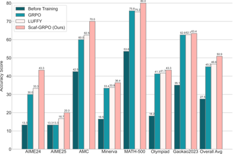

*Figure 1: Scaf-GRPO overcomes the learning cliff with minimal guidance, outperforming vanilla GRPO (Shao et al., 2024) and the prefix-based LUFFY (Yan et al., 2025) across challenging math benchmarks on Qwen2.5-Math-7B. By injecting strategic, hierarchical hints, our method unlocks the model's poten*

**② 方法 / 架构图**

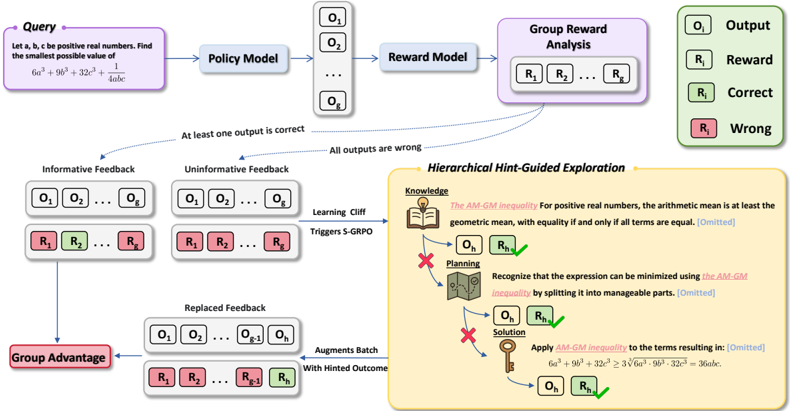

*Figure 3: Overview of the Scaf-GRPO framework. For a given query, the model generates multiple solutions. (Left) If any solution is correct, standard GRPO proceeds. (Right) If all solutions fail (the learning cliff), Scaf-GRPO initiates hierarchical hint-guided exploration. It injects progressively*

### 一眼看懂

- 🟦 TL;DR:RLVR(可验证奖励的 RL,如 DeepSeek-R1 范式)有个"**学习悬崖**"——题目远超当前能力时所有 rollout 全错→GRPO 里这组 advantage \(\hat A_i=\frac{R(o_i)-\mu_G}{\sigma_G+\epsilon_{\mathrm{std}}}\) 因 \(\mu_G=\sigma_G=0\) 而全归零→梯度消失→这些难题对训练"隐形",卡在长尾。Scaf-GRPO 的招:只在**学习真停滞**时,按"知识→规划→解答"三层、由抽象到具体**增量注入 in-prompt 提示**,直到**当前策略 \(\pi_\theta\) 自己**在带提示的 prompt \(q\oplus h^*\) 上采出一条正确轨迹 \(o^*_h\),用它**替换 rollout buffer 里某条失败轨迹**,从而恢复非零 advantage、让学习重启。因为成功轨迹仍是当前策略采的、重要性比率也对"带提示的 prompt"算,所以**全程 on-policy**(不是 teacher 续写 golden 前缀那种 off-policy)。
- 最巧的一步:**抽掉"用 \(\pi_\theta\) 自采样的 \(o^*_h\) 替换失败轨迹、且比率对 \(q\oplus h^*\) 计算"这一步,方法就垮成 off-policy 前缀法**。整个方法不改 GRPO 损失形式(§3.2 明说"does not alter the mathematical form…only modifies the data"),真正的魔法是"提示只进 prompt、答案仍由学生自己产、比率对带提示 prompt 算"——这同时保住了 on-policy 一致性(避免前缀法的师生分布失配)和探索自主性(提示是路标不是铁轨)。为什么是它:Eq.4 那个分段比率(\(o^*_h\) 的比率用 \(q\oplus h^*\) 而非 \(q\))是论文反复强调的"on-policy integrity"所在,附录 F.5 还专门证了用 \(\pi_\theta(\cdot|q)/\pi_{\theta_{\mathrm{old}}}(\cdot|q\oplus h^*)\) 这种失配比率会训崩。

### 为什么做

- **研究背景的来龙去脉**:DeepSeek-R1 确立 RLVR——用外部 verifier 给 outcome-based(对/错)奖励,即可让模型自主习得推理策略,免逐步人工标注(§1/§2)。后续两条线:(a) **稳定性/去偏**(Dr.GRPO、DAPO 改归一化/clip);(b) **更稠密/更省的奖励**(长度惩罚抑 overthinking 如 L1/RECUT;token 级稠密反馈如 Wang 2025a/b 的 dual-token/高熵 minority token)。【原文】§2 RLVR 段
- **解决的具体痛点(学习悬崖,本文靶子)**:超能力题持续全错→零奖励→GRPO advantage 在全零时 \(\mu_G=\sigma_G=0\Rightarrow\hat A_i=0\Rightarrow\) 梯度消失,难题"隐形"形成长尾瓶颈(§1 + Fig.2 实证 Qwen2.5-Math-1.5B 上 vanilla GRPO 在零奖励题上 plateau)。这阻止模型用最难样本提升到更高水平。【原文】§1、Fig.2
- **并行技术路线一(off-policy 教师引导/前缀续写)及各自具体短板**:主流应对学习悬崖是给 student 一段 "golden" 轨迹的**前缀**、让它续写——
  - **LUFFY**(Yan 2025):把整条专家轨迹与多条 model rollout **混在一个 batch**;
  - **Huang 2025**:用 **cosine decay** 调引导前缀长度,且混合 SFT-RL 目标;
  - **StepHint/Zhang 2025a**:给**多级不同长度** hint,从多起点探索;
  - **BREAD/Zhang 2025b**:从 expert anchor 分支 rollout 桥接 SFT&RL。
  两弊:(1) teacher 前缀与 student 后缀**分布失配**(混两个分布的轨迹),要 policy-shaping / 混合 SFT-RL 等**复杂补丁**,引入偏置 + 不稳;(2) "**on-rails**"把模型逼上预定路径,扼杀对替代/更优策略的探索。【原文】§1、§2 off-policy 段

- **动机链**:RLVR 好但难题学不动(悬崖)→ 前缀续写能给正奖励但失配 + 扼杀探索 → 借教育学**脚手架**(Berk & Winsler 1995):仅在停滞时给"会随能力提升撤除的、临时最小分层"引导,且让"题 + 提示"在**同一统一策略**下处理(避失配)、提示只指方向不定路径(保探索)。为何不用更简单的现成做法:前缀法虽现成但破坏 on-policy 一致性、需复杂补丁(§3.2 + 附录 F.5 证失配比率训崩)。【原文】§1、§3.2
- **与最近邻(LUFFY/StepHint 多级 hint)的精确差异**:最像它们,但**关键差一点**——提示**只进 prompt(in-prompt)、答案完全由当前策略自采**,且重要性比率对"带提示 prompt"计算 → 严格 on-policy;而前缀法是把 teacher 的 token 直接拼进轨迹。有用之处:既给了悬崖上缺的正奖励信号,又指向"模型自己够得着的最高效路径",还不引入失配偏置(主结果相对 LUFFY +9.2%、GPQA OOD 与 LUFFY 持平甚至超出,§4.2/Table 6)。【原文】§1、§4.2

### 怎么做 + 靠不靠谱

- **GRPO 前置(§3.1)**:对 prompt \(q\),策略 \(\pi_\theta\) 采 \(N\) 条轨迹 \(G=\{o_1,\dots,o_N\}\),verifier 给终端奖励 \(R(o_i)\);归一化 advantage \(\hat A_i=\frac{R(o_i)-\mu_G}{\sigma_G+\epsilon_{\mathrm{std}}}\);clipped surrogate
  \[\mathcal{J}_{\mathrm{GRPO}}(\theta)=\hat{\mathbb{E}}_{i,t}\Big[\min\big(r_{i,t}(\theta)\hat A_i,\ \mathrm{clip}(r_{i,t}(\theta),1-\epsilon,1+\epsilon)\hat A_i\big)\Big],\quad r_{i,t}(\theta)=\frac{\pi_\theta(o_{i,t}\mid o_{i,<t},q)}{\pi_{\theta_{\mathrm{old}}}(o_{i,t}\mid o_{i,<t},q)}.\]
  全零奖励时 \(\hat A_i\to0\),梯度消失=学习悬崖。【原文】§3.1、Eq.1

- **方法流水线(§3.2 + Fig.3,输入→输出)**:
  1. **输入**:query \(q\);预定义三层提示 \(H=\{H_{\mathrm{knowledge}},H_{\mathrm{planning}},H_{\mathrm{solution}}\}\)(由 DeepSeek-R1 基于 ground-truth 解题步骤**离线一次性**生成,§4.1)。三层语义:\(H_{\mathrm{knowledge}}\) 指关键概念/公式,\(H_{\mathrm{planning}}\) 给高层策略框架,\(H_{\mathrm{solution}}\) 给具体计算步。
  2. **Phase 1 — 诊断 true-hard(guidance exemption period)**:训练前 **15% 步数**纯 on-policy 探索;监控"零奖励 query 被解决的速率",该速率停滞后,仍持续失败的题判 **true-hard**(区别于格式/早期技能不熟的 **pseudo-hard**——多训即可解),才成引导候选。保证"提示只留给真悬崖"。**输出**:true-hard 题集。
  3. **标准 GRPO 步**:对 \(q\) 采一组 \(N\) 条 \(G\);若 \(\ge1\) 条对 → 正常 GRPO(不干预,Eq.5 \(\mathcal{J}_{\mathrm{Scaf}}\equiv\mathcal{J}_{\mathrm{GRPO}}\))。
  4. **Phase 2 — 全错时触发分层引导**:确定性搜索,从最抽象层(Knowledge)起、层内**增量给提示**(\(H_{\mathrm{knowledge}}\to H_{\mathrm{planning}}\to H_{\mathrm{solution}}\)),一旦 \(\pi_\theta\) 在 \(q\oplus h\) 上采出正确解即终止 → 得**最小有效提示 \(h^*\)**(附录 D.1 给算法)。**输出**:\(h^*\) 与一条带提示成功轨迹 \(o^*_h\sim\pi_\theta(\cdot\mid q\oplus h^*)\)。
  5. **on-policy batch 增强**:用 \(o^*_h\) **替换**一条随机失败轨迹 \(o_j\) → \(G_{\mathrm{final}}=(G\setminus\{o_j\})\cup\{o^*_h\}\);advantage 在 \(G_{\mathrm{final}}\) 上重算
     \[\hat A'_i=\frac{R(o'_i)-\mu_{G_{\mathrm{final}}}}{\sigma_{G_{\mathrm{final}}}+\epsilon_{\mathrm{std}}},\qquad o'_i\in G_{\mathrm{final}},\]
     恢复 \(\mu_{G_{\mathrm{final}}}>0\)、非零 \(\hat A'_i\)。损失仍是 GRPO clipped surrogate \(\mathcal{J}_{\mathrm{Scaf\text{-}GRPO}}(\theta)=\hat{\mathbb{E}}_{i,t}[\min(r'_{i,t}\hat A'_i,\mathrm{clip}(r'_{i,t},1-\epsilon,1+\epsilon)\hat A'_i)]\),但**比率分段**(Eq.4):
     \[r'_{i,t}(\theta)=\begin{cases}\dfrac{\pi_\theta(o'_{i,t}\mid o'_{i,<t},q)}{\pi_{\theta_{\mathrm{old}}}(o'_{i,t}\mid o'_{i,<t},q)},& o'_i\in G_{\mathrm{final}}\ \text{且}\ o'_i\ne o^*_h\\[10pt]\dfrac{\pi_\theta(o'_{i,t}\mid o'_{i,<t},q\oplus h^*)}{\pi_{\theta_{\mathrm{old}}}(o'_{i,t}\mid o'_{i,<t},q\oplus h^*)},& o'_i=o^*_h.\end{cases}\]
     普通轨迹比率对 \(q\) 算,\(o^*_h\) 的比率对 \(q\oplus h^*\) 算——保 on-policy 一致性的关键。

  6. KL penalty=0(最大化探索);**输出**:能持续从 true-hard 题学习的策略。
- **逐组件必要性(消融在 Table 2,Qwen2.5-Math-7B,基线 No Guidance=vanilla GRPO 50.9 vs 45.2;降幅为相对 full 的相对值)**:
  - **guidance exemption period(15%)**:防"一开始就给提示→产生 hint 依赖"。消融充分——附录 G.1:从头就 scaffold 掉 **9.2%**;且 10%–40% 区间稳(plateau 49.5–50.9%),故选 15%。
  - **三层 KPS 分层**:每层有独特功能。消融充分——逐层删:w/o Knowledge(P→S)49.2、w/o Planning(K→S)48.6、**w/o Solution(K→P)48.0 降幅最大(−5.7%)**——证三层互补非冗余(抽象层促高阶推理,具体层是必要兜底)。
  - **progressive/hierarchical(抽象→具体)vs Solution-Only**:Solution-Only(直接给最具体提示)48.4(−4.9%)——证"先逼模型啃高阶推理"促更可迁移技能。
  - **incremental chunking(层内增量给)vs Full Hint(一次给整层)**:Full Hint 47.7(**−6.3%,Table 2 降幅最大的一项**)——证最小增量干预对保自主性、防过度依赖最关键。
  - **hint 质量**:§4.3 + 附录 H,用 LLM-as-Judge(accuracy/minimality/clarity/coherence),DeepSeek-R1 生成的 hint 质量高于 Qwen2.5-72B,带来学生 +4% 相对增益。
  - **数据过滤(Too Easy 丢/Too Hard 留/Potentially Solvable 50% 子采样)**:Table 3:filtered 数据对 vanilla GRPO 仅 +0.5% 而对 Scaf-GRPO +6.0%(7B);附录 G.2/Table 12:此过滤比全量 +10.2%。说明"难课程"只在配合 Scaf-GRPO 这种能消化难题的框架时才有效。【原文】§4.3、Table 2-3
- **关键机制/公式(直觉)**:
  - **为何仍是 on-policy**(§3.2 "on-policy integrity"):off-policy 前缀法的比率是 \(\pi_\theta/\pi_\phi\)(从别的策略 \(\phi\) 导入轨迹)需高方差 importance 校正且失配;Scaf-GRPO 的 \(o^*_h\) 直接从当前 \(\pi_\theta\) 采,比率只是"在改过的输入 \(q\oplus h^*\) 上的标准 on-policy 比率"——把当前与旧策略都 condition 在**同一带提示 prompt**,信号更稳。附录 F.5 实证:用 \(\pi_\theta(\cdot|q)/\pi_{\theta_{\mathrm{old}}}(\cdot|q\oplus h^*)\) 这种"分子分母 condition 不一致"的失配比率会训崩。
  - **"最小有效引导促内化"**:用尽可能抽象的提示解出题→逼模型内化推理技能而非记解法(§1/§4 Internalizing skills);Fig.5 展示一道题"靠 Solution 提示对→靠 Planning 对→靠 Knowledge 对→无提示自解"的"毕业"轨迹。【原文】§3.2、§4.4、Fig.5
- **训推数据如何流动**:训练数据派生自 DeepScaleR(40k)按每模型 8 次采样动态过滤(Too Easy 全对丢/Too Hard 全错留/1–7 对的 50% 子采样,附录 B.1)→ 训练中标准 rollout(verl + vLLM)→ 若整组全错则触发确定性 hint 搜索(在 \(q\oplus h\) 上重采)→ 拿 \(o^*_h\) 替换失败轨迹 → \(G_{\mathrm{final}}\) 重算 advantage → 分段比率的 GRPO 更新。hint 一次性离线由 DeepSeek-R1 生成(基于 ground-truth 步骤,附录 B.2/E)。【原文】§4.1、附录 B
- **实验与证据**:
  - 设置:评测 7 基准(pass@1 greedy):AIME24/AIME25/AMC/Minerva/MATH-500/OlympiadBench/GaoKao2023en;OOD 用 **GPQA-Diamond**。模型 5 个:Qwen2.5-Math-7B、Qwen2.5-Math-1.5B、Qwen2.5-7B、Llama-3.2-3B-Instruct(非 Qwen)、DeepSeek-R1-Distill-Qwen-1.5B(长 CoT)。框架 **verl**;训 **10 epochs**;max response 2048(长 CoT 8192);**KL penalty=0**;报 best checkpoint。vanilla GRPO 用本文数据 + 超参,LUFFY 用本文数据 + 其原参,Simple-RL/Oat-Zero 用公开权重。
  - 关键数字:主结果(Qwen2.5-Math-7B,Table 1)整体相对 vanilla GRPO **+12.6%**(50.9 vs 45.2)、相对 LUFFY **+9.2%**;AIME24 pass@1 30.0→**43.3**(相对 +44.3%);相对 Simple-RL +19.5%、Oat-Zero +9.5%。**5 个模型全有正增益**(Llama-3.2-3B 26.1→28.8 +10.3%、长 CoT 1.5B 50.6→53.6 +5.9%、Qwen2.5-7B 41.5→44.9)。OOD(Table 6,GPQA-Diamond):7B 32.3→37.3(相对 vanilla GRPO **+15.5%**、与 LUFFY 持平)、Qwen2.5-7B-Base 33.3→35.8(**+7.5%**,超 LUFFY 34.4)。skill-graduation(Table 4,前 300 步从"hint 依赖→自解"事件数)显著多于 vanilla:1.5B 1123→2670(+137.8%)、7B 434→483(+11.3%)、Llama 577→986(+70.9%)。
  - baseline 公平:vanilla GRPO 同数据同超参(可比);LUFFY 同数据其原参(基本可比);Simple-RL/Oat-Zero 公开权重(口径略不同,作者标注为 "contextualize against optimized public benchmarks")。
  - "看着强但没回答核心问题":主结果多报 **best checkpoint** 而非固定步数(跨方法早停一致性需信任作者实现);消融只到**层级粒度**,**没做"训练题 vs 持出题"的记忆探针**直接排除"学生在 hint 下记住了该题"〔推断:Fig.5 是定性单例,Table 4 graduation 是间接证据,均非记忆探针〕。【原文】§4.1-4.4、Table 1/3/4/6
- **假设与失效边界**:
  - 显式假设【原文】:有可验证答案(verifier,RLVR 前提);有一个**更强教师(DeepSeek-R1)**来生成分层 hint(§4.1);题目可被三层提示"够到"(否则搜索到 Solution 层仍失败 → fallback,论文未细述全失败比例)。
  - 隐式假设【推断】:三层 hint 的语义粒度划分对不同领域普适(论文只在数学验证);"零奖励解决速率停滞"能可靠区分 true/pseudo-hard(阈值/窗口是经验设定)。
  - 何时失效:【原文·Limitations】依赖高质量分层 hint 体系(构造非 trivial);主要面向有 verifier、结构化推理路径的任务(数学),对开放/主观域(创作)不直接适用。【推断】非数学域(代码/通用推理)未验证(GPQA 仅作 OOD 评测、非训练域)。
- **祛魅总结**【推断】:
  - 真贡献:用"in-prompt 分层提示 + 当前策略自采替换 + 比率对带提示 prompt 算"三件,**在不改 GRPO 损失的前提下严格保住 on-policy 一致性地攻克学习悬崖**——对前缀法(LUFFY 等)是干净且概念清晰的改进,消融(逐层、progressive、incremental、exemption、过滤)做得相当扎实,跨 5 模型一致增益增强普适性论断。
  - 包装/高估:"真零外部知识/自主"并不成立——hint 由更强的 DeepSeek-R1 生成,本质仍是教师知识下放;"internalization"靠 graduation 计数和单例图,缺记忆探针硬证;best-checkpoint 报告 + 仅数学域,使"unlocking ability beyond reach"的普适性有夸张空间。
  - 低估之处:"数据难度需配能消化它的框架"(Table 3:难数据只对 Scaf-GRPO 有大增益)其实是对 RLVR 课程设计很有价值的观察;exemption 10–40% 稳的鲁棒性也说明方法对该超参不敏感。
  - 〔待核·论文内部小笔误〕Table 1 标题把非 Qwen 模型写作 "Llama-3.2-8B-Instruct",但 §4.1 Models 与表内行、§4.2 正文均为 **Llama-3.2-3B-Instruct**——应以 3B 为准。

### 结构化抽取

- 🎯 机制速览6轴:
  - 学什么信号:可验证 **结果奖励 \(R\)(对/错)**经 GRPO 组内归一化 advantage \(\hat A'_i\)(轨迹级);提示本身不直接进损失,只改采样输入 \(q\to q\oplus h^*\)。
  - 改什么:**参数**(GRPO 策略更新);训练期还动态改 **prompt**(注入分层 hint)和 **rollout buffer**(\(o^*_h\) 替换失败轨迹)。
  - 何时改:**在线 per-step / 触发式**(仅在某 query 整组全错=学习悬崖时才触发引导;Qwen2.5-Math-7B 上仅 17.4% 样本触发)。
  - 免梯度?:否(标准 GRPO 梯度;引导只是数据增强,损失形式不变)。
  - 记忆-技能生命周期:**无持久记忆/技能库**;三层 hint 是**离线预生成的静态资源**(训练前由 DeepSeek-R1 造好,按需注入);成功轨迹 \(o^*_h\) 用完即弃。技能"固化"靠参数更新。
  - 防遗忘机制:**无显式防遗忘**;KL penalty=0(反而最大化探索)。仅"exemption period 防 hint 依赖"算一种弱意义的"防过拟合到提示"。
- ⑦ 开源代码 + 框架/harness:https://github.com/JIA-Lab-research/Scaf-GRPO (已 clone 约 7.2MB,Tier A,origin 已核)。框架 **veRL 0.4.1.dev**(仓库含 `verl/` 与 `hint_mix_grpo/{main_ppo.py, trainer/, dataset/, config/}`;rollout 用 vLLM;conda env `scaf-grpo`/py3.10)。入口 `train.sh` → `bash sh/hint_mix_grpo/bs256_6k_mix.sh`;baseline/评测在 `sh/{baseline,generation_eval}`。数据集 HuggingFace `hkuzxc/scaf-grpo-dataset`。
- 💰 资源/成本与可扩展性:Qwen2.5-Math-7B 训练 ~73GB peak（vanilla ~72GB,几乎无额外显存,Table 5）；**引导仅 17.4% 样本触发**故吞吐多用于标准生成；到最佳 checkpoint **~12h**(vanilla GRPO 需 ~13h 才到更低峰值 45.2%)——即更省总时间还更高分（50.9%）。max response 2048（长 CoT 8192）；hint 一次性离线生成（DeepSeek-R1）。可扩展性:方法与 GRPO 损失解耦、只改数据,原则上可挂在任意 GRPO 实现上。【原文】§4.4、Table 5
- 🎯 对"探索-巩固"对标:**强支撑(尤其"探索/选路"维度)+ 可借组件 / 部分竞品**。判定:Scaf-GRPO 是我们"探索-巩固"里**探索/选路**思路的最贴近实现之一——它的"路标 vs 铁轨"哲学、"提示只指方向、让 student 自己采出能走通的解"几乎就是我们"岔路口偏向自己能走通的开头/方向 + student 全程 on-policy 自选"的 RLVR 版落地。同时它是 path-recovery 的一种范式:全错(走偏)时,用最小提示帮 student 自采一条对的来"接着做对"。依据:§3.2 on-policy 替换 + Fig.5 毕业轨迹。可直接借的积木:① **触发式干预**(只在整组全错/advantage 坍缩时介入,平时纯自主)——天然契合"只在岔路口/走偏时让 teacher 当稀疏脚手架";② **比率对带提示 prompt 计算**(Eq.4 分段比率)这一保 on-policy 的技术细节,对"student 自选恢复分支后仍要 on-policy 更新"直接可用;③ **exemption period** 防过早依赖脚手架的课程设计;④ **三层抽象→具体 + 增量**作为"最小有效脚手架"的粒度模板。部分竞品:它已占据"教师分层提示 + 保 on-policy + 保探索"这块,与我们 idea 重叠度高,需在"MTP 前瞻探针 + student 自选恢复分支(而非确定性搜索预设三层 hint)+ 自蒸馏固化"上做出区分。缺口:hint 是**预生成静态三层**(非 student 自己发现的恢复分支),且**无 MTP/前瞻**、**无防遗忘/技能库**。
- 🔭 开放问题/未来方向:
  - 【原文·Future Work】自动化 hint 生成提升可扩展性;**adaptive scaffolding**——引导随模型 proficiency 动态调整、个性化学习过程。
  - 【推断】扩到代码/通用推理域;补"训练题 vs 持出题"记忆探针以坐实"内化非记忆";用固定步数而非 best-checkpoint 复核增益;把"预生成静态三层 hint"换成"student 自采/自生成的恢复分支"以更接近真自进化;研究 exemption/温度/组大小等超参的系统鲁棒性。

RETURN: scaf_grpo|读到PDF?是(本轮新抽 29页 _txt 105k字,Eq.1-5 + Table 2/3/4/5/6 消融全核)|L3(+L1)|对标=强支撑(探索/选路)+可借触发式干预/Eq.4 分段比率保 on-policy/exemption/三层增量;Δ=预生成静态 hint(非自采恢复分支),无 MTP/无防遗忘|残留待核 0(Table 1 标题 Llama-3.2-8B 为笔误,正文以 3B 为准)

---

## SimpleRL-Zoo: Investigating and Taming Zero RL for Open Base Models in the Wild

> **`simplerl_zoo`** ｜ HKUST + TikTok + 美团(Weihao Zeng*、Yuzhen Huang*、Qian Liu*、Junxian He 等) ｜ 2025-03-24 arXiv 2503.18892(v3 2025-08-06, cs.LG)·预印本+Notion 博客 ｜ 主题线 L3(RLVR/zero RL 经验研究)·相关性 高 ｜ [📄 原始论文](https://arxiv.org/abs/2503.18892)

### 关键图示

**① Motivation / 对比图**

*Figure 1: Accuracy and response length across training iterations for different models, averaged on GSM8K, MATH500, Minerva Math, OlympiadBench, AIME24, and AMC23. Per-benchmark results are in Figure 11 (Appendix D). All training starts from base models.*

**② 方法 / 架构图**

*Figure 5: The change in reasoning behavior over the training iterations across all models. As described in §2.2, we use GPT-4o to extract and track shifts in reasoning behaviors on OlympiadBench. We focus on four reasoning-related behaviors: 'Backtracking', 'Verification', 'Subgoal Setting', and 'En*

### 一眼看懂

- 🟦 TL;DR:DeepSeek-R1 证明从 base 模型直接做规则奖励的纯 RL("zero RL")能自发涌现长 CoT 与自反思("aha moment"),但社区复现几乎都集中在 Qwen2.5(它本身已强,不代表"野生"base)。本文在 **10 个跨家族/尺寸的 base 模型**上做透明 zero RL(仅正确性二值奖励、**不用 format reward**、所有模型同一组超参),用**认知行为级监控**(GPT-4o 标 Backtracking/Verification 等)把"长度增长"与"真实推理涌现"解耦,系统拆解 zero RL 成败的关键因素。**核心是经验研究 + 配方/工具/模型开源,而非新算法**。
- 最巧的一步:**用 Reasoning Behavior Ratio(GPT-4o 标四类认知行为)而非"响应长度"来判断推理是否真涌现**。抽掉它,就退回"看长度涨=有 aha moment"的表层结论——而本文恰恰证明这是错的(Mistral-7B 长度涨但其实是 incoherent 乱码;多数 Qwen2.5 长度涨但认知行为频率没升)。这个监控维度是本文所有反直觉结论的基础。【原文】§2.2、§2.3、§2.4、Fig.4/5

### 为什么做

- 研究背景:R1/o1/Kimi-k1.5 靠长 CoT + 反思推理;R1 证明从 base 直接纯 RL(规则奖励)可自发涌现长 CoT 与 "aha moment"(zero RL)。但最初在 671B DeepSeek-V3 上演示,社区复现(Zeng 2025a、Yeo 2025、Xie 2025、Hu 2025、DAPO 2025)主要在 Qwen2.5。【原文】§1
- 解决的具体痛点:(1) Qwen2.5 base 因预训练含大量合成数据,**本身已具指令跟随 + backtracking/verification**,不代表"in the wild"的多样 base;(2) 现有分析停留在长度/准确率等**表层指标**,判断不了推理行为是否真变,也没澄清涌现机制;(3) 缺乏对"哪些因素决定 zero RL 成败"的系统研究。【原文】§1、§2
- 相关工作 & 各自不足(并行路线 + 各自短板 + 站谁肩上 + 与最近邻精确差异):
  - **(路线 A,直接奠基)R1-Zero / zero RL 复现**(Zeng 2025a、Hu 2025、Yu 2025/DAPO、Yeo 2025、Xie 2025):证明 base 直接 RL 可涨点。**短板**【原文 §1、§2】——几乎**只在 Qwen2.5**(一个本就含合成数据、已具反思能力的特殊 base)上做,且只看**长度/准确率**等表层指标,无法隔离"模型族"变量、也判断不了推理是否真涌现。本文站其肩上,扩到 **10 个跨家族/尺寸 base** + 加**认知行为监控**。
  - **(路线 B)用关键词追踪反思行为**(Yeo 2025、Xie 2025):用 "wait/recheck" 等关键词频率当反思信号。**短板**【原文 §2.2、Appendix I】——本文论证关键词与高层推理行为(reflection/verification)只**弱相关**,捕捉不到真实涌现(故改用 GPT-4o 按 Gandhi 2025 的认知行为框架标注)。
  - **(路线 C,理论对立面)"RL 只是重排"**(Shao et al. 2024):认为 RL 训练只在原模型分布内重排响应,证据是 pass@k 不随训练提升。**短板/被反驳**【原文 §2.4、Fig.3】——本文用 pass@k gap 随 \(k\) 增大反而**扩大**(13→30 点,\(k\) 到 128)证明是**真正增强而非重排**。
  - **(路线 D)短 CoT SFT cold-start 主流做法**:很多 pipeline 先用短 CoT SFT 冷启动再 RL。**本文反例**【原文 §4】——传统短 CoT SFT 作 cold start 会**限制后续 RL 探索**,SFT 步数越多对 enumeration/verification 损害越大。(注:此结论对"长 CoT 蒸馏冷启动"是否成立有张力,见失效边界。)
  - **与最近邻精确差异**:vs Qwen2.5-only 复现——**跨 10 个家族/尺寸**(隔离"模型族"变量)+ **认知行为监控**(而非长度);vs Shao 2024(重排说)——pass@k gap 随 \(k\) 扩大证真增强。**承重设计就是"多样 base + 认知行为指标 + 透明监控"**。
- 动机链:R1 zero RL 在 671B 上成功 → 社区只在 Qwen2.5 复现且只看表层 → Qwen2.5 不具代表性、表层指标不可靠 → 在 10 个多样 base 上做透明 zero RL + 认知行为监控 → 回答三问(推理如何演化/弱 base 是否也现 aha moment/成败关键因素)。

### 怎么做(到可复现粒度)

- **算法 = GRPO,直接从 base 起训(无 SFT cold start)**【原文 §2.1、附录 A】。本文用 **token-level、length-rectified GRPO** 目标(去掉原始 GRPO 的长度归一项,因其引入长度偏置;这是 adapted veRL 的默认实现,与 Yu 2025/Liu 2025 等并行工作一致):
  \[ \mathcal{J}_{\mathrm{GRPO}}(\theta)=\frac{1}{\sum_{i=1}^{G}|o_i|}\sum_{i=1}^{G}\sum_{t=1}^{|o_i|}\underbrace{\min\!\Big(r_{i,t}(\theta)\hat{A}_i,\ \mathrm{clip}\big(r_{i,t}(\theta);1\!-\!\epsilon,1\!+\!\epsilon\big)\hat{A}_i\Big)}_{\text{Clipped policy update}}\;-\;\underbrace{\beta\,D_{\mathrm{KL}}[\pi_\theta\|\pi_{\mathrm{ref}}]}_{\text{KL penalty}} \]
  其中比率 \(r_{i,t}(\theta)=\dfrac{\pi_\theta(o_{i,t}|q,o_{i,<t})}{\pi_{\theta_{\mathrm{old}}}(o_{i,t}|q,o_{i,<t})}\)。**关键点**:归一化分母是组内**总 token 数** \(\sum_i|o_i|\)(token-level,length-rectified),而非每条响应各自除以 \(|o_i|\)(后者会偏向短响应)。

- **组内相对优势(无 value 网络)**【原文 Eq.2】:对 query \(q\) 采一组 \(O=\{o_1,\dots,o_G\}\),用组内奖励 \(\{r_1,\dots,r_G\}\) 标准化:
  \[ \hat{A}_i=\frac{r_i-\mathrm{mean}(\{r_1,\dots,r_G\})}{\mathrm{std}(\{r_1,\dots,r_G\})} \]
  直觉:衡量 \(o_i\) 比组内平均好多少,省掉 critic。

- **奖励:仅正确性二值(无 format reward)**【原文 §2.1、B.2】:最终答案正确 \(+1\)、错误 \(0\)。**显式不加 format-based 规则**(如强制 `\boxed{}`)——因许多 base 初期跟不上格式约束,format reward 会**惩罚大量正确探索**、压低上限(§3.1)。
- **数据难度分档 + 与模型能力匹配**【原文 §2.1、B.1】:从 GSM8K+MATH 取数据,按 MATH 自带 1–5 难度切三档,各约 8K:**Easy**(GSM8K + MATH lv.1)、**Medium**(MATH lv.1–4)、**Hard**(MATH lv.3–5)。**主实验按 base 能力分配难度**(可复现关键):Easy → Llama-3.1-8B / Mistral-v0.1-7B / DeepSeek-Math-7B;Medium → Qwen2.5-0.5B;Hard → Mistral-Small-24B / Qwen2.5-Math-7B / Qwen2.5-1.5B/7B/14B/32B。难度须与 base 探索能力匹配,否则 zero RL 崩(Mistral-7B 在 Hard 上崩溃)。
- **统一超参 + 弱模型简化 prompt**【原文 B.3】:所有模型同一组超参(刻意隔离模型族变量);**弱指令跟随模型**(Llama-3.1-8B、Mistral-v0.1-7B、Qwen2.5-0.5B/1.5B)用**简单 prompt**(只要 step-by-step),强指令跟随模型用**复杂 prompt**(要求 `\boxed{}`)。两套 prompt 原文(Fig.10):
  > **Simple**: `Question: {input}` / `Answer:` / `Let's think step by step.`
  > **Complex**: system "You are a helpful assistant." + user "{input} Please reason step by step, and put your final answer within \boxed{}." + assistant `{output}`

- **四个监控指标(本文方法论核心,Appendix I)**【原文】:
  1. **Reasoning Behavior Ratio**:用 **GPT-4o** 按 Gandhi 2025 认知行为框架标注响应是否含 **Backtracking / Verification / Subgoal Setting / Enumeration**,报含此类行为的响应比例。(取代弱相关的关键词追踪。)
  2. **Clip Ratio**:被**截断**(超 max context)的响应比例——监控早期"不会停"与坍缩后"重复/超长"。
  3. **Average Stopped Length**:只统计**正常停止**响应的平均长度(剔除未停止响应的干扰,比"平均长度"更可靠)。
  4. **pass@k**:采 \(k\) 条至少一条正确的题目比例——衡量探索能力;pass@k 随训练/随 \(k\) 的变化用来判定"真增强 vs 重排"。
- 逐组件必要性(本文是经验研究,"组件"=关键设计,均有消融/对比支撑):
  - **去 format reward**(§3.1):刚性 format reward(强制 `\boxed{}`)惩罚探索、压低性能上限、诱发 overthinking,许多 base 初期跟不上格式约束 → 用消融(Fig.6,有/无 format reward 对比)支撑"去掉它更好"。
  - **难度匹配**(§3.2):难度须与 base 探索能力匹配,否则 zero RL 失败(Mistral-7B 在 Hard 数据上崩溃,Fig.7)→ 实验支撑。
  - **无 SFT cold start**(§4):传统短 CoT SFT 作 cold start 会限制后续 RL 探索,SFT 步数越多对 enumeration/verification 损害越大 → 对比支撑。
  - **认知行为监控**:Reasoning Behavior Ratio 是诊断工具,论文核对了 GPT-4o 与人工标注一致性(附录 E/I)。三个关键设计都有对应证据。【原文】§3.1、§3.2、§4
- 关键超参默认值(汇总,B.5)【原文】:框架 = **veRL**(adapted);prompt batch size **1,024**;**每 prompt 8 rollouts**;最大 rollout 长度 **8,192**;mini-batch **256**;采样温度 **1.0**;clip ratio \(\epsilon=\mathbf{0.2}\);**KL 系数 \(\beta\)=1e-4(0.5B–14B)/ 1e-3(>14B)**;评测温度 1.0、最大生成 16K、用与训练相同 prompt 模板;多数基准报 pass@1,AIME24 额外报 avg@32。

### 靠不靠谱

- 实验与证据:
  - **数据集**:训练仅 GSM8K + MATH(规则奖励),三档难度各约 8K。模型(10 个):Mistral-7B-v0.1、Mistral-Small-24B、Llama-3.1-8B、DeepSeek-Math-7B、Qwen2.5-{0.5,1.5,7,14,32}B、Qwen2.5-Math-7B。评测:GSM8K、MATH500、Minerva、OlympiadBench、AIME24(Pass@1 与 Avg@32)、AMC23;泛化 IFEVAL、MMLU、GPQA-Diamond。【原文】§2.1、Table 1/2
  - **关键数字**(Table 1,Avg):Mistral-Small-24B 27.6→**49.6**;DeepSeek-Math-7B 11.3→**29.2**(约 3 倍,长度 ~300→1200+);Qwen2.5-32B 45.9→61.9;Qwen2.5-Math-7B 37.2→59.5。**泛化**(Table 2):仅 8K 数学训练却泛化——Mistral-24B IFEval/MMLU/GPQA Avg 25.0→55.3;Llama-3.1-8B 23.6→32.6。**pass@k**(Fig.3,Mistral-24B):iter0 vs iter100 gap 13→30 点(\(k\) 到 128),且 pass@1 与 pass@8 gap 随训练**扩大**(Fig.2)→ 真增强非重排(与 Shao 2024 相反)。**Mistral-7B 反例**:长度涨但 clip ratio 高、是 mixed-language gibberish(Fig.4)→ 长度增长可能"不健康"。【原文】Table 1/2、Fig.2/3/4
  - **baseline 公平吗**:所有模型同一组超参隔离模型族变量(刻意公平);base 用 greedy、SimpleRL-Zoo 用 temp=1.0/top-p=0.95 评测(口径差异已注明 Table 1)。
  - **看着强但没回答核心问题?**:"真增强非重排"由 pass@k gap 随 \(k\) 扩大较强支撑;但 "aha moment 涌现"部分结论建立在 **GPT-4o 自动行为标注**之上(分类一致性/偏差未深入校验,虽核对了人工一致性);"难度须匹配探索能力"是定性结论,缺可操作的量化判据。【推断】
- 假设与失效边界:
  - 【原文】仅数学域(GSM8K+MATH)训练;认知行为分类依赖 GPT-4o;难度匹配是定性结论。
  - 【推断】"SFT cold start 损害探索"与具体 SFT 数据/步数强相关(本文用传统短 CoT SFT),外推到**长 CoT SFT**(如 R1-Distill 数据)需谨慎——这点与"长 CoT 蒸馏可有效冷启动"的主流做法张力很大,失效边界在"SFT 数据类型";GPT-4o 行为分类器的偏差是"aha moment"结论的潜在软肋。
- 祛魅总结:真贡献=**第一个跨 10 个多样 base 的透明 zero RL 经验研究 + 认知行为监控工具 + 一批反直觉发现**(长度≠aha moment、Qwen 外小模型首现 verification 涌现、format reward 害探索、难度须匹配、pass@k 真增强、短 CoT SFT cold start 害探索)。包装/局限:(1) **无新算法**(GRPO + 极简配方,贡献是配方/模型/分析工具/系统经验);(2) 仅数学域、行为分类依赖 GPT-4o 有标注偏差风险;(3)"难度匹配"无量化判据;(4) SFT cold-start 结论外推到长 CoT 需谨慎。**作为透明经验研究价值高,作为方法贡献新意有限**。【推断】

### 结构化抽取

- 🎯 机制速览6轴:**学什么信号**=最终答案正确性二值奖励(GRPO 组内相对 advantage),无 format/过程奖励｜**改什么**=base 模型参数(GRPO 更新,无 SFT)｜**何时改**=在线 zero RL(从 base 直接起训)｜**免梯度?**=否｜**记忆-技能生命周期**=无记忆/技能库;推理技能(认知行为)在 RL 中自发涌现并固化进参数｜**防遗忘机制**=无显式设计;反而发现 SFT cold start 会"占用"探索能力(一种负向的"塑性损失"),且本文证明纯 RL(无 SFT)泛化不降反升(Table 2),即 zero RL 路径本身规避了 SFT 致塑性损失的问题。【原文】§2.1、§4、Table 2
- ⑦ 开源代码+框架/harness:https://github.com/hkust-nlp/simpleRL-reason(已克隆 ~66MB,最新 commit cf1c785,当前版即论文 v1 配方)。框架=**veRL**(仓内自带 `verl/` 目录,pyproject name="verl"),RL 算法 **GRPO**(token-level、length-rectified,见附录 A 脚注)。核心脚本 `train_grpo_math_tune_ray.sh`(Ray 启动)、`eval_math_nodes.sh`、`install.sh`、`launch_gradio.sh`。README 注明旧版 v0 用 OpenRLHF+PPO。模型=HF hkust-nlp/simplerl-zoo collection(10 个)。代码/配方/模型/分析工具齐全可复现。【原文】GitHub + 既有 analysis 对 clone 的核查
- 💰 资源/成本与可扩展性:仅 8K 训练样本即对全部模型显著提升(数据成本极低);GRPO 每 query rollout **8 条**(B.5),max rollout 8,192,prompt batch 1,024/mini-batch 256;统一超参跨 10 模型(0.5B–32B)。原文未给汇总 GPU·小时(附录 B 有设置)。【原文】§2.1、§2.3、B.5
- 🎯 对"探索-巩固"对标:**中支撑,提供"探索质量如何度量与保护"的方法论与多条警示**。本文核心就是"如何让 base 模型在 RL 中**有效探索并固化有效推理行为(认知行为涌现)**"——正对应 idea 的"探索=发现有效行为/路径"+"巩固=固化进参数"。最有价值的对标点:(1) **认知行为监控(Backtracking/Verification)**给 idea 提供了"如何量化 path-recovery/path-selection 是否真涌现"的现成工具——Backtracking/Verification 正是 path-recovery 的行为表征;(2) **"长度≠真推理"**警示——做 MTP/OPD 时不能用响应长度当探索质量代理;(3) **"format reward 害探索""短 CoT SFT cold start 害探索"**支撑 idea"巩固/约束不应损害继续探索的能力(防塑性损失)"——这与 sed_sft/segment_attrib"SFT 别压探索空间"一致,三者互相印证。**可借组件**:GPT-4o 认知行为标注框架 + Clip Ratio/Average Stopped Length 作训练动态监控。**缺口/差异**:是 from-scratch zero RL 非蒸馏(无 teacher 脚手架),无 on-policy 蒸馏的 token 分布信号,无 MTP 前瞻,无显式 path-recovery 机制(靠 RL 自发涌现 backtracking)。一句判定:**"探索质量度量与保护"的中度对标 + 认知行为监控这套可直接借的诊断工具,且"长度≠真推理""约束害探索"对 idea 的探索-巩固设计是重要方法论警示;但无 teacher/MTP,作底座与诊断工具而非直接方法**。【推断,依据 §2.2/§3/§4 vs idea】
- 🔭 开放问题/未来方向:【原文】(隐含)给"难度须匹配探索能力"找可操作的量化判据;更可靠的认知行为度量(减少对 GPT-4o 的依赖);把发现推广到数学外域。【推断】(1) 把认知行为监控接入训练 reward(对 verification/backtracking 行为加权)以主动诱导 path-recovery;(2) 重审"SFT cold start 害探索"在长 CoT 蒸馏下是否成立(对 idea 的"teacher 脚手架冷启动"关系重大);(3) 用 MTP 前瞻或 pass@k 动态作"探索能力-数据难度"匹配的在线判据。

RETURN:simplerl_zoo | 读PDF? 是(37页:全设置/6发现/Table1-2全数值/§2.4认知行为/§3-4关键因素/附录A GRPO目标/B.5全超参/I四指标定义) | 加厚? 是(方法到可复现:length-rectified GRPO目标+组内优势Eq.2转MathJax含r_{i,t}/clip/KL;二值奖励;难度三档与模型匹配表;两套prompt原文;四监控指标精确定义;全超参核出;相关工作四路线A-D精确短板) | LaTeX公式条数 3 | 待核数 0

---

## Skywork Open Reasoner 1 Technical Report

> **`skywork_or1`** ｜ Skywork AI(昆仑万维 Kunlun Inc),Jujie He、Jiacai Liu 共同一作,通讯 Jujie He ｜ 2025-05-29 arXiv v2(2505.22312)·技术报告+Notion 博客 ｜ 主题线 L3(RLVR/长 CoT 模型 RL)·相关性 高 ｜ [📄 原始论文](https://arxiv.org/abs/2505.22312)

### 关键图示

**① Motivation / 对比图**

*Figure 1: The performance curve of Skywork-OR1-32B during RL training for AIME 2024 and AIME 2025. The red stars indicate the selected final checkpoints.*

**② 方法 / 架构图**

*Figure 5: Left: Comparison of From-Scratch vs. Multi-Stage training. Top left: Response length during RL training. Bottom left: AIME24 avg@8 performance at temperature 1 (left y-axis) and cumulative training hours (right y-axis). Multi-stage training achieves the same final accuracy with significant*

### 一眼看懂

- 🟦 TL;DR:面向"已蒸馏的长 CoT 模型"(DeepSeek-R1-Distill 系列)的**高效可扩展 RL 配方**,在改造版 GRPO(命名 **MAGIC** = Multi-stage Adaptive entropy scheduling for GRPO In Convergence)上从 数据/训练策略/损失 三方面组合多项设计并逐组件消融;系统研究**过早熵坍缩**,论证"缓解过早熵坍缩对提升测试性能至关重要"。32B 在 AIME24/25+LiveCodeBench 平均 57.8→72.8(+15.0%)、7B 43.6→57.5(+13.9%),代码/数据/权重全开源【原文 abstract+§1】。
- 最巧的一步:**Adaptive Entropy Control(自适应熵控制)**。它用 target-entropy(tgt-ent=0.2)给策略熵托一个动态下界——抽掉它(或其等价的 clip-higher)则熵过早坍缩、过度 exploitation、测试性能变差(§4.5)。这是把"维持探索"操作化的核心机制,也是全文"熵坍缩研究"的落脚点。

### 为什么做

- 研究背景:DeepSeek-R1 证明 online RL + 简单规则奖励即可大幅提升 base 模型推理(此前 RL 多靠 MCTS/PRM)。R1-Distill 系列生成的长 CoT(AIME24 上平均超 10K token)远长于 Qwen2.5/Llama3.1。已有复现(Logic-RL/Open-Reasoner-Zero/DAPO/VAPO)多聚焦对 **base 模型** RL【原文§1】。
- 解决的具体痛点:① 如何高效、可扩展地用 RL 提升**已做过 SFT 的长 CoT 模型**仍不清楚;② DeepScaleR/Light-R1/DeepCoder 等虽有初步进展,但**未系统拆解各算法组件**在 RL 训练中的独立贡献;③ 训练普遍出现 premature entropy collapse(过早熵坍缩、过度 exploitation),成因与缓解缺系统研究【原文§1】。
- 相关工作 & 各自不足(本轮按引文链补全):
  - **对 base 模型的 zero-RL 复现**:Logic-RL、Open-Reasoner-Zero、**DAPO**(贡献 clip-higher/dynamic sampling/token-level loss,被 MAGIC 部分纳入对照)、**VAPO**——证 RL 有效但**未迁移到长 CoT 蒸馏模型**。
  - **对长 CoT 模型的早期 RL**:**DeepScaleR**(多阶段长度调度 8K→16K→24K,**被 MAGIC 的 Multi-Stage Training 直接借鉴**)、Light-R1、DeepCoder——开始探索但**未系统拆组件**,也未系统研究熵坍缩。
  - **探索-利用/熵**:DeepSeek-Math/GRPO 原始工作给 group-norm + clip + k3-KL;本文把 DAPO 的 clip-higher 当"缓解熵坍缩"的对照手段之一(§4.5),并提出自适应熵控制作为替代。
  - 精确差异:vs DeepScaleR——MAGIC **系统消融了 6 个组件的独立贡献**(数据 mixture/多阶段/advantage mask/高温/自适应熵/无 KL)+ **专门做了熵坍缩的多角度对照研究**(熵坍缩速度 vs 性能、off-policy 影响、batch/温度影响、缓解手段),并得出几个反直觉结论(如"对截断响应加负 advantage 的 advantage mask 反而不利于大 context 长度的 scaling,故不用")。
- 动机链:R1 证明 RL 有效但"对已蒸馏长 CoT 模型怎么做"不清楚 → 已有复现未拆组件贡献、且普遍遇熵坍缩 → 提出 MAGIC 配方并逐组件消融 + 系统研究熵坍缩 → 证"缓解过早熵坍缩=提升测试性能关键" + 全开源【原文§1 末贡献列表】。

### 怎么做 + 靠不靠谱

- 方法流水线(MAGIC,§3.1 三类,输入→输出):输入已蒸馏长 CoT 模型(R1-Distill 7B/32B)→ ① **数据收集**:严格预处理+更准验证器;Offline+Online 过滤(训练前去掉 base 正确率为 0/1 的题;每阶段开始丢弃上阶段已全对的题,保持只训难题)+ **Rejection Sampling**(batch 只保留含非零 advantage 的组,见 \(\tilde T_k\) 定义)→ ② **训练策略**:Multi-Stage Training(逐阶段增大 context \(T\),先短后长 8K→16K→…)；**不用任何 advantage mask**；High-Temperature Sampling(τ=1)；On-Policy Training(7B/32B 严格 on-policy)→ ③ **损失函数**:去掉 GRPO 的 \(1/|y_{ij}|\) 长度归一项→token 级 policy loss + entropy loss；Adaptive Entropy Control(target-entropy 动态调 \(\alpha_k\) 托住熵下界）；No KL Loss → 输出 Skywork-OR1-{Math-7B,7B,32B}【原文§3.1】。
- 逐组件必要性(均有独立消融 §3.2.1-3.2.6):
  - **数据 mixture(§3.2.1)**:严格过滤的 mixture 优于松阈值 baseline mixture(后者只是学得更慢,非更差)——有消融✓。
  - **Multi-Stage(§3.2.2)**:初期省算力、后期保 scalability;同样最终精度但 token 效率显著高(平均长度 12.5K→5.4K)——有消融✓。
  - **Advantage Mask(§3.2.3,关键反直觉)**:对截断响应赋负 advantage 看似合理(避免噪声信号),但实验证其**不利于大 context(如 32K)的 later-stage scaling**,故"we do not employ any advantage mask"(原文 §3.2.3 直引)——有消融✓,结论是"不用"。
  - **High-Temp(§3.2.4)**:τ=1 早期测试精度低但最终增益更大(τ=0.6 时 math 立即/code 很快进入低熵态)——有消融✓。
  - **Adaptive Entropy Control(§3.2.5)**:把熵 lower-bound 在 target-entropy,维持探索与高 plasticity,测试性能稳步升——有消融✓(核心组件)。
  - **No KL Loss(§3.2.6)**:KL 罚在多阶段后期妨碍提升,故去掉——有消融✓。
- 关键机制/公式(本轮据 PDF 正文 Eq.2.1-2.5/3.1 补全,真符号 MathJax):
  - **RL 目标(Eq.2.1)**:\(\max_\pi J(\pi)=\mathbb{E}_{x\sim D}\,\mathbb{E}_{y\sim\pi(\cdot|x)}[r(x,y)]\),batch 级代理(Eq.2.2)。
  - **vanilla PG(Eq.2.3)**:\(L^{\text{PG}}_k(\theta)=-\mathbb{E}\big[\sum_t \tfrac{\pi_\theta(a^t_i|s^t_i)}{\pi_k(a^t_i|s^t_i)}A^{\pi_k}(s^t_i,a^t_i)\big]\)。
  - **GRPO(Eq.2.4)**——MAGIC 的出发点,含长度归一与 k3-KL:
    \[
    L^{\text{GRPO}}_k(\theta)=-\mathbb{E}\Big[\tfrac1M\sum_{i=1}^{M}\tfrac{1}{|y_{ij}|}\sum_{t=0}^{|y_{ij}|-1}\min\big(\rho^t_{ij}A^t_{ij},\ \mathrm{clip}(\rho^t_{ij},1-\varepsilon,1+\varepsilon)A^t_{ij}\big)-\beta D^t_{ij}(\theta)\Big]
    \]
    其中 \(\rho^t_{ij}=\dfrac{\pi_\theta(a^t_{ij}|s^t_{ij})}{\pi_k(a^t_{ij}|s^t_{ij})}\),**k3-KL 罚** \(D^t_{ij}(\theta)=\dfrac{\pi_{\text{ref}}(a^t_{ij}|s^t_{ij})}{\pi_\theta(a^t_{ij}|s^t_{ij})}-\log\dfrac{\pi_{\text{ref}}(a^t_{ij}|s^t_{ij})}{\pi_\theta(a^t_{ij}|s^t_{ij})}-1\),系数 β。

  - **组归一 token 级 advantage(Eq.2.5)**:\(\forall t:\ A^t_{ij}=\dfrac{r(x_i,y_{ij})-\mathrm{mean}(r(x_i,y_{i1}),\dots,r(x_i,y_{iM}))}{\mathrm{std}(\cdots)}\),binary 奖励 \(r\in\{0,1\}\) 由规则验证器给。
  - **Rejection Sampling 集合**:只保留 \(\tilde T_k=\{i\in[N]:\exists j\in[M],\ \hat A_{ij}\ne0\}\)(零优势组不进 batch,避免它们隐式抬高 KL/entropy 罚的相对权重致不稳)。
  - **MAGIC 损失(Eq.3.1,两处关键改动)**:
    \[
    L^{\text{MAGIC}}(\theta)=-\frac{1}{T_k}\sum_{i\in\tilde T_k}\sum_{j=1}^{M}\Big[\sum_{t=0}^{|y_{ij}|-1}\min\big(\rho^t_{ij}A^t_{ij},\mathrm{clip}(\rho^t_{ij},1-\varepsilon,1+\varepsilon)A^t_{ij}\big)+\alpha_k H^t_{ij}(\theta)\Big]
    \]
    ① **去长度归一**:把原 GRPO 的 \(1/|y_{ij}|\) 删掉,改成对**全 batch token** 求平均(\(T_k=\sum_{i\in\tilde T_k}\sum_j|y_{ij}|\) 为 batch 总 token 数),消除长度偏置;② **加 token 级熵项** \(\alpha_k H^t_{ij}(\theta)\),\(H^t_{ij}=H(\pi_\theta(\cdot|s^t_{ij}))\),系数 \(\alpha_k\ge0\) 由自适应熵控制动态调;③ **无 KL**(去掉 Eq.2.4 的 \(\beta D^t_{ij}\) 项)。

  - **Adaptive Entropy Control(§3.2.5,机制)**:引入超参 tgt-ent;\(\alpha_k\) 按"当前熵与 tgt-ent 之差"动态调整,确保当前熵被 tgt-ent **托住下界**(熵跌破下界→自动加大熵奖励系数把它顶回)。直觉:熵=探索度;这是把"clip-higher 等手动 trick"换成"目标熵反馈控制器"。〔主文给的是机制描述与 tgt-ent=0.2,**未给闭式 \(\alpha_k\) 更新方程**,故此处不杜撰其解析式。〕
- 实验与证据:
  - 数据集/设置:训练=自建 mixture(严格难度过滤,含从 NuminaMath-1.5 过滤的 hard 题),对照 DeepScaleR mixture(AIME/AMC/Omni-MATH/STILL);含数学+代码,配 Math Verifiers + Code Sandboxes。评测=AIME24、AIME25、LiveCodeBench(2024-08~2025-02),主指标 avg@K（非 pass@1）。基座=R1-Distill 7B/32B。消融设置(Table 1):batch 64 / mini-batch 32 / group 16 / Entropy Control=tgt-ent 0.2 / KL=No(基于 R1-Distill-Qwen-7B)【原文§6-§8+§3.2】。
  - 关键数字【原文 abstract+§1,本轮 PDF 直读确认】:32B 57.8→72.8(+15.0)、7B 43.6→57.5(+13.9);32B 具体 AIME24 82.2 / AIME25 73.3 / LiveCodeBench 63.0,超 DeepSeek-R1 与 Qwen3-32B(math)、LCB 持平;7B AIME24 70.2 / AIME25 54.6 / LCB 47.6;Math-7B AIME24 69.8 / AIME25 52.3 / LCB 43.6。多阶段:同最终精度但平均长度 12.5K→5.4K、省算力。
  - baseline 公平吗:消融均在自建 mixture + R1-Distill 同基座下做内部对照,公平;但与外部模型(R1/Qwen3-32B)的 SOTA 比较是终点比较,非控制变量。
  - 看着强但没回答核心:工程报告属性强,单个组件多借鉴已有(DeepScaleR 多阶段、DAPO clip-higher),真贡献在"组合+系统消融+熵机理+开源";诸多结论(高温影响大、batch/group 影响小)绑定特定 mixture+R1-Distill 基座。
- 假设与失效边界:
  - 显式【原文】:On-policy mitigates entropy collapse(§4);off-policy(增大 mini-batch/数据复用 \(N_{\text{SGD}}\))加速熵坍缩并劣化性能(§4.4);batch/group 增大对熵动态影响小、温度影响大(§4.3+§3.2.4)。
  - 隐式【推断】:"advantage mask 反而不利 scaling"依赖其多阶段长度调度场景,外推到非多阶段设置需谨慎;tgt-ent=0.2 等关键超参缺跨基座/任务的可迁移性论证;评测面集中 AIME+LiveCodeBench,泛化基准较窄。
  - 一致性瑕疵【原文】:Skywork-OR1-Math-7B 用**两步梯度更新**(非严格 on-policy),与 7B/32B 严格 on-policy 不一致;论文§3.1 自承"此设置先于我们对 off-policy↔熵坍缩关系的完整理解",但靠自适应熵控制仍达强性能——削弱"on-policy 减缓熵坍缩"在 Math-7B 上的纯净性〔本轮 PDF §3.1 已直读确认此细节,原 v1 标"推断"可上调为【原文】〕。
- 祛魅总结【推断】:真贡献=面向长 CoT 模型 RL 的可复现配方(MAGIC)+ 6 组件逐项消融 + 熵坍缩的多角度实证研究(熵坍缩速度 vs 性能、off-policy/温度/batch 对熵的影响、自适应熵 vs clip-higher 缓解)+ 全开源(代码/数据/权重)。包装/高估:abstract 主推 +15/+13.9 与"超 R1/Qwen3-32B",但多数组件是已有 trick 的组合;"高温影响大、batch 影响小"等结论的普适性受限于其特定数据+基座。低估:熵坍缩研究本身(§4)作为独立科学贡献(把"过早熵坍缩→更差性能"做成可观测规律)价值高于单纯刷分。

### 结构化抽取

- 🎯 机制速览6轴:
  - **学什么信号**:规则奖励(binary 0/1,Math Verifier + Code Sandbox)→ 组归一 token 级 advantage(Eq.2.5);辅以熵信号(当前熵 vs target-entropy)调 entropy loss 系数 \(\alpha_k\)。
  - **改什么**:策略模型 \(\pi_\theta\) 全参数(改造版 GRPO/MAGIC 更新)。
  - **何时改**:多阶段 online RL 全程(逐阶段增大 context \(T\):8K→16K→…);每步按熵差动态调熵系数。
  - **免梯度?**:否,梯度策略优化(GRPO 变体)。
  - **记忆-技能生命周期**:无记忆/技能库;能力固化进参数;online+offline 数据过滤动态维持"在难题上训练"。
  - **防遗忘机制**:无显式跨任务防遗忘;去 KL(§3.2.6,KL 罚后期妨碍提升)→不锚定参考策略;靠 on-policy + 自适应熵防"过早熵坍缩/过度 exploitation"(可视为防"探索能力遗忘")。
- ⑦ 开源代码+框架/harness:https://github.com/SkyworkAI/Skywork-OR1 (v1 验证已克隆约 11MB,commit 64e96af)。框架=**veRL 定制 fork**(仓内自带 `verl/` + `or1_scripts/` + `or1_data/`,含 Math/Code 验证器与 code sandbox);RL 算法=改造版 GRPO（MAGIC）。数据 HF `Skywork/Skywork-OR1-RL-Data`;权重 `Skywork-OR1-{Math-7B,7B,32B}`(及 Preview)。代码/数据/权重全开源,可复现性高。
- 💰 资源/成本与可扩展性:多阶段先短后长显著省算力(同最终精度更少累计训练小时,平均响应长度 12.5K→5.4K token);§5 专论训练资源分配(固定算力下提效率 §5.1 / 增算力提性能 §5.2)。具体 GPU 卡数/总卡时正文未以单一数字给出(分散在 §5/§8 及 Fig 的"cumulative training hours")→部分原文未以汇总数列明。
- 🎯 对"探索-巩固"对标:**支撑/可借组件(探索侧)**。一句判定:本文为"探索"提供了可直接借用的工程化机制——**Adaptive Entropy Control 用 target-entropy 给熵托下界**,正是把"维持探索能力/不过早 exploitation"操作化,与本项目"探索=发现有效路径、不要过早收敛到自己已会的开头"高度契合;其"过早熵坍缩→更差性能"的实证(§4)为"巩固阶段也要保留探索"提供经验依据。可借:target-entropy 下界、on-policy 减缓熵坍缩、去长度归一的 token 级 loss、online 难题过滤。缺口:纯 RLVR 配方,无 teacher 蒸馏/无脚手架/无路径恢复/无记忆技能/无 MTP 前瞻;"巩固"仅指参数固化,无防遗忘机制。依据:§3.2.5 自适应熵 + §4 熵坍缩研究。
- 🔭 开放问题/未来方向:【原文】缓解过早熵坍缩对测试性能至关重要(主结论),可继续探索熵控制手段(自适应系数 vs clip-higher)的权衡(§4.5)。【推断】target-entropy 等超参的跨基座/任务可迁移性;把"advantage mask 反而损 scaling"的结论在非多阶段设置下重检;扩展评测面(超出 AIME+LiveCodeBench);把熵下界机制与 teacher 脚手架/OPD 结合,检验"维持探索"是否能让 student 更好地学到"路径恢复"。

RETURN: skywork_or1 | 读PDF?是(40页/102885字,abstract+§1贡献+§2 Eq.2.1-2.5 全policy梯度族+§3.1 MAGIC定义/Eq.3.1+rejection-sampling 集合+§3.2消融结论+§4熵坍缩 全直读;MAGIC 全称"Multi-stage Adaptive entropy scheduling for GRPO In Convergence"已 PDF §3 核实) | 加厚?是(补全 Eq.2.1-2.5/3.1 全套真符号公式含 k3-KL 显式形式、去长度归一+token 级熵项的 MAGIC loss、rejection-sampling \(\tilde T_k\) 定义;related-work 引文链 DAPO/VAPO/DeepScaleR 精确借鉴关系;Math-7B 两步梯度细节升为【原文】) | LaTeX 公式条数 5(RL目标/vanilla PG/GRPO Eq.2.4含k3-KL/组归一advantage Eq.2.5/MAGIC loss Eq.3.1) | 待核 0(Math-7B 两步梯度 本轮 PDF §3.1 已直读坐实,原 v1 残留待核清除)

---

## Spurious Rewards: Rethinking Training Signals in RLVR

> **`spurious_rewards`** ｜ University of Washington / AI2 / UC Berkeley(Rulin Shao、Shuyue Stella Li、Rui Xin、Scott Geng 共同一作;…Nathan Lambert、Sewon Min、Pang Wei Koh、Luke Zettlemoyer) ｜ 2026-02-25 arXiv v2·Preprint ｜ 主题线 L3(RLVR/GRPO 机理)·相关性 高 ｜ [📄 原始论文](https://arxiv.org/abs/2506.10947)

### 关键图示

**① Motivation / 对比图**

*Figure 1. MATH-500 accuracy after 300 steps of RLVR on various training signals. We show that even 'spurious rewards' (e.g., rewarding incorrect labels or with completely random rewards) can yield strong MATH-500 gains on Qwen models. Notably, these reward signals do not work for other models like L*

**② 方法 / 架构图**

*Figure 2. Model performance on MATH and AMC with varied training rewards smoothed over window size of 10 (dotted lines are unsmoothed values). We report pass@1 for MATH and average@8 for AMC. Both Qwen2.5-Math-7B and Qwen2.5-Math-1.5B significantly improve after RLVR on a range of reward signals fro*

### 一眼看懂

- 🟦 TL;DR:在 Qwen2.5-Math 上,即使用**虚假奖励**(随机/格式/错误标签——与正确答案零相关甚至负相关)做 RLVR(GRPO)也能大幅涨分:随机奖励 MATH-500 +21.4%,接近真值的 +29.1%【原文 abstract+§2 Fig.2】。机理:GRPO 的 **clip 项产生与奖励无关的梯度偏置**,系统性放大 base model 中**已有高先验的 token/行为**(如 Qwen 的 code reasoning),而非注入新能力。该效应**强烈依赖模型族**——在 Llama3/OLMo2 上几乎消失甚至掉点。
- 最巧的一步:**clipping bias 推导 + no-clipping 消融**。抽掉"去 clip 实验"(Fig.4)就垮——正是"关掉 clip 后随机奖励的期望梯度为零、不再涨分"(§4)这一对照,把"随机奖励为何有效"从玄学钉死为 GRPO clip 机制的数学产物;没有它,"放大先验"只是猜想。

### 为什么做

- 研究背景:RLVR 已成提升 LLM 数学推理的主流后训练范式(Lambert et al. 2024;DeepSeek-R1;SimpleRL-Zero;DeepScaleR),但增益机理不清;开源社区高度依赖 Qwen2.5-Math 作事实标准 base model,大量"zero-RL"结论建立在这单一模型族上【原文§1】。
- 解决的具体痛点:多数 RLVR 方法只在 Qwen 上验证;社区默认"Qwen 上的增益=真实推理能力提升",忽视预训练先验对 RL 动力学的塑造,可能高估了 RL 算法本身贡献【原文§1+§3 practical warning】。
- 相关工作 & 各自不足(本轮按引文链补全):
  - **"RLVR 只激发潜能、不教新能力"假说族**——本文是这一假说的**极端化压力测试**。前人证据梯度依次为:Wang et al. 2024(用**少量**真值标签即足够,暗示触发潜能);Zuo et al. 2025 **TTRL**(多数投票伪标签做无监督 RL,即**噪声标签**也行);Yue et al. 2025 / Liu et al. 2025 / Gandhi et al. 2025(从 pass@k、推理行为等角度论"RL 收窄而非拓宽能力边界")。本文把梯度推到**连随机/错误奖励都涨**这一端点,是该假说最尖锐的实证【原文§2 末】。
  - **Qwen-only 方法的可复现性隐患**:本文把 **TTRL**(Zuo et al.)与 **One-Shot RL**(Wang et al. 2025b,单样本)纳入"Qwen 涨他族不涨"同一模式,§3+Fig.15(Appendix E)直接复现二者在 Qwen 上匹配真值、在他族失效——指出它们的结论可能是 Qwen 先验伪影而非方法本身【原文§3】。
  - **clip 偏置的并行发现**:Yu et al. 2025(DAPO/clip-higher 系)在**真值奖励**下指出 clip 偏置"减少探索、增加 exploitation";本文把同一 clip 偏置分析**迁移到随机奖励**场景并给出完整推导,二者机理一致(§4 末"echo the intuition of Yu et al.")。
  - 精确差异:vs 上述所有工作——本文**不提任何新训练方案**,而是把"奖励是否需准确"的隐含假设推到极端做**诊断**,并给出"虚假奖励=dummy baseline"的方法论检验标准。
- 动机链:RLVR 增益机理不清 + Qwen 中心化 → 设计从弱到虚假递进的奖励当诊断探针、跨模型族跑 → 发现 Qwen 上虚假奖励也涨、他族不涨 → 推断涨分来自"放大先验"而非"注入能力" → 用 clip 偏置推导 + code reasoning 行为分析 + 干预实验闭环验证【原文 §1-§5】。

### 怎么做 + 靠不靠谱

- 方法流水线(诊断协议,输入→输出):① **奖励梯度链(5 档)**,每档只替换"把 rollout 答案映射到 0/1 奖励"的那个函数,其余超参全固定 → ② 在 DeepScaleR 训练集上跑 **GRPO 300 步**(binary 0/1 奖励、train_batch=128、n_samples_per_prompt=16、micro_train_batch=4、γ=1.0、KL 关闭)→ ③ 同一协议跨 10 个模型(Qwen2.5-Math-7B/1.5B、Qwen2.5-7B/1.5B、Llama3.1-8B(-Instruct)、Llama3.2-3B(-Instruct)、OLMo2-7B(-SFT))→ ④ clip 偏置理论推导(主文 Eq.1/2 + Appendix B 全推导)+ no-clipping 三种消融(Fig.4)→ ⑤ code reasoning 行为追踪 + prompt/RL-based 干预验证(§5)→ 输出:对每档奖励/每个模型的 MATH-500/AMC/AIME 增益曲线 + code 频率曲线【原文§2.1+§4+§5】。
- 5 档奖励的精确定义(可复现关键,§2.2):
  1. **Ground Truth**:rollout 答案经 verifier 与真值匹配则 r=1,否则 0(监督质量上界)。
  2. **Majority Vote**:训练前用 base model 对每题采 **64 条** rollout,取多数答案当伪标签;rollout 匹配该伪标签则 r=1。
  3. **Format**:含**非空** `\boxed{...}` 即 r=1(不看正误;`\boxed{}` 出现在 Qwen2.5-Math 系统提示里,故等价"奖励提示遵循")。
  4. **Random**:与响应无关,以固定概率 γ 给 1(主实验 γ=0.5;Appendix B 验 γ∈{0.001,0.3,0.7} 增益相似仅收敛速度不同;**γ=0 时 loss 恒定、梯度全零**,符合解析预期)。
  5. **(Majority-voted) Incorrect**:先用多数投票标注全集,**只取标签错误的子集**训练,且只奖励"答案匹配该错误伪标签"的 rollout。**专门设计来解耦**"多数投票有效是因标签更可能正确,还是因它是高概率模型输出"——若 incorrect 也涨,说明是后者。为保持与其它档相近的 reward 稀疏度,只奖励**特定**错误答案而非任意错误答案。
- 逐组件必要性:
  - **奖励梯度链(5 档)**:检验"需多少有效监督";Incorrect 档是关键诊断设计(解耦"对 vs 高概率")。
  - **跨模型族对照**:Qwen 涨 / Llama3·OLMo2 不涨(OLMo2 仅 GT +0.4),证"先验依赖";无它则无法排除"虚假奖励普遍有效"【原文 Fig.1/Fig.3】。同族内部行为一致(共享预训练分布);**越大模型越受益于随机奖励**(推测大模型保留更多可被放大的先验)。
  - **no-clipping 消融(Fig.4,因果钉死)**:三变体——(a) 实现里直接关 clip;(b) 把 mini-batch 增到等于 rollout size;(c) 把 rollout size 减到每 rollout 只做一次梯度更新。后两者强制 \(\pi_\theta=\pi_{\text{old}}\Rightarrow\rho_t=1\),从构造上消除 clip 效应。三者下随机奖励**不再稳定涨分**,唯独开 clip(第四面板)稳定涨——直接证 clip 是因果来源。
  - **code reasoning 干预**:prompt("Let's solve this using Python.")与 RL("含 python 字符串即 +1")两路显式抬高 code reasoning→Qwen 涨分,反向印证中介机理。
- 关键机制/公式(本轮据 PDF 正文 Eq.1/2 + Appendix B 全推导补全,真符号 MathJax):
  - **GRPO 目标(Eq.1,省略 KL,因实验关闭 KL)**:
    \[
    J(\theta)=\mathbb{E}_{x\sim D,\,y\sim\pi_{\text{old}}(\cdot|x)}\!\left[\sum_{t=1}^{|y|}\min\!\Big(\rho_t(y;\theta)\,\hat A(x,y),\ \mathrm{clip}\big(\rho_t(y;\theta),\,1-\epsilon_c,\,1+\epsilon_c\big)\hat A(x,y)\Big)\right]
    \]
    其中 \(\rho_t(y;\theta)=\dfrac{\pi_\theta(y_t\mid x,y_{<t})}{\pi_{\text{old}}(y_t\mid x,y_{<t})}\) 是 token 级重要性比,优势 \(\hat A(x,y)=\dfrac{r(x,y)-\bar r_x}{\sigma_x}\)(组内均值 \(\bar r_x\)、组内标准差 \(\sigma_x\))。

  - **随机奖励下期望优势为零(Appendix B.1.1)**:对随机 Bernoulli(γ) 奖励,组内归一化优势之和恒为 0(构造性),且奖励独立于样本 ⇒ \(\mathbb{E}[\hat A]=0\)。
  - **clipping bias 定义(Appendix B.1.2)**:把 clip 引入的额外梯度定义为
    \[
    \mathrm{Bias}(\nabla_\theta J(\theta))=\mathbb{E}_{x,y}[\nabla_\theta J(\theta)]-\mathbb{E}_{x,y}[\nabla_\theta L_{\text{unclipped}}(\theta)]
    \]
    因 \(\mathbb{E}[\hat A]=0\) 且 \(\hat A\) 独立于其它项,**无 clip 项的期望梯度恒为 0**:\(\mathbb{E}_{x,y}[\nabla_\theta L_{\text{unclipped}}]=\mathbb{E}[\hat A]\cdot\mathbb{E}_{x,y}[\tfrac{1}{|y|}\sum_t\nabla_\theta\rho_t]=0\)。故 \(\mathrm{Bias}=\mathbb{E}[\nabla_\theta J]\) 本身。

  - **按 \(\hat A\) 符号分情形求梯度(Appendix B.1.2 核心,记 \(R_\theta=\rho_t\))**:
    \[
    \nabla_\theta J(\theta)=\hat A\cdot
    \begin{cases}
    \nabla_\theta R_\theta, & \hat A\ge 0\ \text{且}\ R_\theta<1+\epsilon_c,\\
    0, & \hat A\ge 0\ \text{且}\ R_\theta>1+\epsilon_c,\\
    0, & \hat A<0\ \text{且}\ R_\theta<1-\epsilon_c,\\
    \nabla_\theta R_\theta, & \hat A<0\ \text{且}\ R_\theta>1-\epsilon_c.
    \end{cases}
    \]
    令 \(\mu=P(\hat A\ge0)\,\mathbb{E}[\hat A\mid\hat A\ge0]=-P(\hat A<0)\,\mathbb{E}[\hat A\mid\hat A<0]>0\)(由 \(\mathbb{E}[\hat A]=0\) 推出此式且 \(\mu\) 恒正)。代回并把不可导点梯度置 0,得**最终 clip 偏置(Eq.2)**:
    \[
    \mathrm{Bias}(\nabla_\theta J)=\mu\cdot\mathbb{E}_{x,y}
    \begin{cases}
    \nabla_\theta R_\theta, & \pi_{\theta,x}(y_t)<\pi_{\text{old},x}(y_t)(1-\epsilon_c),\\
    0, & |R_\theta-1|\le\epsilon_c,\\
    -\nabla_\theta R_\theta, & \pi_{\theta,x}(y_t)>\pi_{\text{old},x}(y_t)(1+\epsilon_c).
    \end{cases}
    \]

  - **直觉(论文 Example,\(\epsilon_c=0.2\))**:相对 clip 阈值在 \([0,1]\) 概率区间内对高/低概率 token 造成**非对称的绝对 clip 范围**。高先验 token(\(\pi_{\text{old}}=0.85\)):上界 \(0.85\times1.02\approx1.02>1\),因 \(\pi_\theta\le1\) **永不可达**→只受非负梯度偏置→持续被推高;低先验 token(\(\pi_{\text{old}}=0.02\)):上界 \(0.02\times1.2=0.024\),稍增即越界→受负偏置被压。**净效果:无论奖励是否有信息,系统性放大已高先验的 token、压低低先验 token**——这就是随机奖励仍能涨分的数学根源。
- 实验与证据:
  - 数据集/设置:训练 DeepScaleR(及其多数投票伪标注/错误标注派生集);评测 MATH-500(pass@1)、AMC(avg@8)、AIME2024/2025;模型见上述 10 个【原文§2.1+§3】。评测沿用 **OpenRLHF 默认评测设置**(原文§2.1 明引 "default evaluation setup in the popular RL framework OpenRLHF")。
  - 关键数字【原文 Fig.1/Fig.2/Table 1,本轮 PDF 直读确认】:Qwen2.5-Math-7B MATH-500——GT +29.1、Majority +27.1、Incorrect +24.1、Random +21.4、Format +13.8/+15.5、某弱奖励 −6.4;AMC 上 Format/Incorrect/Random = +13.8/+24.1/+21.4。AIME2024:Format +10.3 逼近 GT +15.3;AIME2025(题在所有模型知识截止后):GT 明显占优,其余 −0.4~+4.5。跨族:Llama3.1-8B-Instruct 多为负(−6.4/−8.3/−2.1/−11.5),OLMo2-7B 仅 GT +0.4。**code reasoning(Table 1)**:Qwen2.5-Math-7B 含代码答案准确率 **60.9%** vs 无代码 **35.0%**(注:本轮 PDF Table 1 显示 w/Lang=35.0,v1 曾记 28.0,以 PDF Table 1 为准);Qwen2.5-Math-1.5B 52.6 vs 17.2;**反例**:Qwen2.5-7B 含代码反而更低(39.9 vs 61.5)、OLMo2-7B-SFT 21.0 vs 40.0(故称 Bad-Code 模型)。Code 频率:Qwen2.5-Math-7B 基线 **65.0%**,虚假奖励下 15 步内升至 ~90%、随机奖励最高 **95.6%**;Python-reward 干预 20 步内 >99%。**prompt 干预(Table 2)**:强制以 "LET'S SOLVE THIS USING PYTHON." 开头,Qwen2.5-Math-1.5B/7B/Qwen2.5-1.5B 分别 +24.2/+15.0/+10.0,而 Qwen2.5-7B −19.4、Llama3.2-3B-Inst −28.6、Llama3.1-8B-Inst −21.6、OLMo2 −1.2/−2.8。
  - baseline 公平吗:只换奖励函数、固定其余超参,跨族同设置,极公平(本就是诊断对照设计)。
  - 看着强但没回答核心:作者**明确自限**——结论限于"当前开源后训练算力规模"(§2 末),并**不推荐**虚假奖励作训练方案(§2 黑体 Note 与 §1 末重复声明)。code reasoning 是相关性中介证据(论文明说"not a complete explanation",另有 lexical repetition 等行为,Appendix G),未必穷尽全部机理。
- 假设与失效边界:
  - 显式【原文】:结论绑定 Qwen2.5-Math 这一"预训练即含大量含代码数学解"的特殊 base model;限于开源算力规模;γ=0 时梯度全零;**已 RL 后训练的模型几乎无增益(Appendix J)**。
  - 隐式【推断】:clip 偏置推导基于若干简化(省略 KL 项,Eq.1 脚注 2;不可导点梯度取 0,PyTorch 默认);"放大先验"假说外推到通用模型/更大算力需谨慎(依据:Llama/OLMo 不涨 + 作者自限算力)。
- 祛魅总结【推断】:真贡献=用"虚假奖励诊断探针 + clip 偏置完整推导 + 跨族对照 + 干预验证"四证闭环,有力支撑"RLVR 在开源算力规模下主要激发/放大已有潜在能力、而非教新能力",并给出"虚假奖励=dummy baseline"的方法论警示——这是对整个 RLVR/zero-RL 文献的一记重要"祛魅"。包装/高估风险低(作者多处主动自限)。低估:clip 偏置作为"与奖励无关的优化伪影"对**所有** GRPO 工作(含本项目可能用到的 RLVR/OPD 混合)的潜在污染,论文点到但未量化其在真值奖励下的份额。

### 结构化抽取

- 🎯 机制速览6轴:
  - **学什么信号**:本质上"什么都不学新的"——clip 偏置让模型学的是"已高先验的 token/行为"(奖励信号被证可有可无);可观测中介=code reasoning 频率、词汇重复。
  - **改什么**:策略模型 \(\pi_\theta\) 全参数(标准 GRPO 更新),但有效改动方向被 clip 偏置导向高先验区。
  - **何时改**:RLVR 训练全程(300 步);虚假奖励下前 50 步即显著涨。
  - **免梯度?**:否,标准 GRPO 梯度训练。
  - **记忆-技能生命周期**:无记忆/技能库;"能力"被论证为**预训练已存的潜在行为被放大固化**,RLVR 不新增。
  - **防遗忘机制**:不适用/反例——论文恰好揭示 RLVR 在此规模下不引入新知识,故无"新技能需防遗忘"之说;反倒提示 RLVR 可能只是把先验行为推到饱和。
- ⑦ 开源代码+框架/harness:https://github.com/ruixin31/Rethink_RLVR (v1 验证本地已克隆约 259MB,Tier A,代码完整可跑)。模型集合 HF `stellalisy/spurious-rewards`。框架=**OpenRLHF**〔本轮据**实际仓库文件**再确认〕:`code/README.md:25` 自述 "Our codebase is based on TTRL (https://github.com/PRIME-RL/TTRL)";TTRL/PRIME-RL 本身构建在 **OpenRLHF + DeepSpeed** 之上(仓内 `code/ttrl/helper/deepspeed.py`、`ttrl/models/actor.py` 引 OpenRLHF;训练脚本如 `scripts/rlvr_deepscaler_grpo_qwen_random.sh` 用 OpenRLHF 风格 CLI:`--micro_train_batch_size 4`、`--n_samples_per_prompt 16`、`--advantage_estimator "group_norm"`、`--normalize_reward`)。算法主体 **GRPO**(advantage=group_norm)。〔承 v1 更正并已二次坐实:原稿曾误记 veRL,经 README+`ttrl/` 代码+脚本确认为 **OpenRLHF 谱系**,非 veRL。〕奖励函数实现 `ttrl/verifier/qwen/qwen_eval.py`、`ttrl/verifier/auto_verify.py`(`random_reward_fn(rate=0.5)`/`inverse_qwen_reward_fn`/`box_only_format_reward_fn`)。
- 💰 资源/成本与可扩展性:训练 300 步、binary 0-1 奖励、train_batch_size=128、n_samples_per_prompt=16、micro_train_batch_size=4、gamma=1.0;仅改 TASK/REWARD;无 chat template 模型加 `_r1_style` 后缀。环境 python 3.10 + flash_attn 2.7.0.post2。具体 GPU 数原文未在正文集中列(Appendix 含多随机种子复现)。
- 🎯 对"探索-巩固"对标:**竞品/警示(对核心追问直接相关)**。一句判定:本文是本项目"教师脚手架蒸馏是否真教会新能力"这一核心追问的**最尖锐反方证据**——它论证在开源算力规模下 RLVR(乃至 GRPO 类训练)主要是"放大 base 已有高先验行为"而非注入新能力,因此本项目若用 RLVR/on-policy 信号做"巩固",必须警惕**clip 偏置污染**(涨分可能来自先验放大而非真学到"路径恢复")。可借:① 把"虚假奖励 dummy baseline"纳入本项目评估,区分"teacher 脚手架真贡献" vs "GRPO clip 伪影";② 跨模型族验证(勿只用 Qwen);③ clip 偏置的"对高先验 token 非对称放大"提示——若本项目 path-recovery 信号集中在低概率分支,可能被 clip 偏置**系统性压制**,需特别检查。缺口:本文是纯诊断、无任何蒸馏/记忆/技能机制,不提供"巩固"方案。依据:§4 clip 偏置 + §5 先验放大 + §3 跨族失效。
- 🔭 开放问题/未来方向:【原文】未来 RLVR 研究应在非 Qwen 模型上确认、并用虚假奖励作 dummy baseline(§3);OLMo 开放训练数据可助未来研究推理行为起源(§3)。【推断】量化"clip 偏置放大先验"在**真值奖励**增益中所占份额(分离"真学习" vs "先验放大");设计抑制 clip 偏置或对先验不敏感的 RL 目标;把"先验放大"机理迁移到非数学/agent 任务,检验本项目 path-recovery 信号是否也被先验放大所污染。

RETURN: spurious_rewards | 读PDF?是(41页/135430字,abstract+§2 Fig.1/2/Table1/2+§4 clip偏置Eq.1/2+Appendix B 全推导+§5 code reasoning 全直读核实) | 加厚?是(补全 Appendix B 完整 clipping-bias 推导含按 Â 符号分情形与 μ 定义、5 档奖励精确定义、Table1/2 反例数据、related-work 引文链 TTRL/One-Shot/Yu et al. 并行发现;坐实 OpenRLHF 框架 via README+脚本 CLI) | LaTeX 公式条数 6(GRPO目标/优势/bias定义/unclipped期望零/符号分情形梯度/最终bias Eq.2) | 待核 0

---

