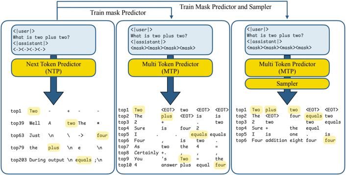
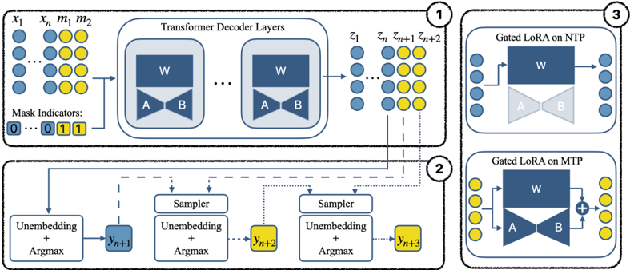
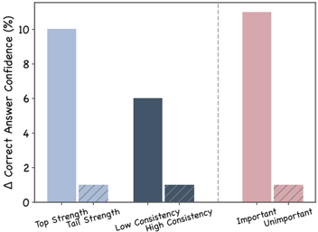
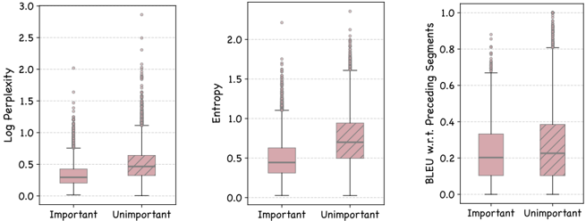
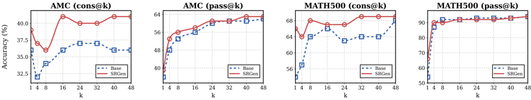
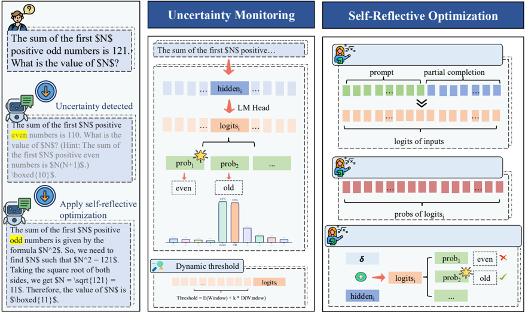

# L6 · 思维链 / Token 级信用 & 前瞻 (MTP)

> 本主题 7 篇,完整精读如下(右侧目录可跳到具体论文)。

## AdaSPEC: Selective Knowledge Distillation for Efficient Speculative Decoders

> **`adaspec`** ｜ UC Berkeley / 清华 / Georgia Tech（Yuezhou Hu*、Jiaxin Guo* 共一，Tuo Zhao 通讯，实习于 Georgia Tech 完成） ｜ 2025-10-22 arXiv v1 · NeurIPS 2025 Spotlight ｜ L6 Token级信用/前瞻 · 相关性中（偏外围） ｜ [📄 原始论文](https://arxiv.org/abs/2510.19779)

### 关键图示

**② 方法 / 架构图**

*Figure 1: Overview of AdaSPEC distillation process : AdaSPEC selects the most training-effective tokens and distills on these tokens.*

**① Motivation / 对比图**

*Figure 2: Comparative analysis of AdaSPEC and DistillSpec performance across multiple metrics on GSM8K (a, c, e) and CNN/Daily Mail (b, d, f) datasets: (a-b) Task-level acceptance rate distributions showing AdaSPEC's superior performance across tasks. (c-d) Logit margin distributions demonstrating A*

### 一眼看懂

- 🟦 TL;DR：投机解码(speculative decoding)里给小 draft 模型做蒸馏时，常规做法是"所有 token 一视同仁地对齐大模型"。AdaSPEC 先训一个同初始化的"参考模型"当难度探针，挑出"draft 现在差、但参考模型证明它学得动"的 token 子集，draft **只在这部分易学 token 上蒸馏**，把有限容量花在刀刃上，token 接受率(acceptance rate)最高 +15%（§4.3 Table 1，如 MBPP optimal-epoch 49.88%→65.12%）。
- 最巧的一步：**用"draft 损失 − 参考模型损失"(ΔL) 而不是"绝对损失"来选 token**（§3 Eq.9）。抽掉它就垮——若直接按绝对损失大小选，会把"loss 大但 draft 根本学不动的硬骨头"也选进来，浪费容量；正是"减去参考基准"把"难度大"与"可学空间大"区分开。消融 Table 2 直接证明：选 top-40%(高 ΔL) 远好于选 bottom-40%，后者甚至低于参考模型。

### 为什么做

- 研究背景：投机解码用小 draft 一次性投机生成多个 token，大 target 并行验证、接受或回退；加速倍率直接取决于 draft 与 target 的"对齐度"——提的 token 越常被接受跳得越多（§2 Eq.3-5）。社区普遍给 draft 做知识蒸馏(KD)来增强对齐，SOTA 基线是 DistillSpec（forward-KL）。
- 解决的具体痛点：①**目标错位**——常规 KD 在所有 token 上最小化 KL，但 SD 真实目标是最大化接受率，低 KL≠高接受率（§1 摘要、Introduction）；②**容量浪费**——draft 容量极小（论文做到 64× 容量差），强行拟合"难学又本就难被接受"的 hard token 会挤占 easy token 的学习预算，甚至导致 loss 不收敛（§1）。
- 相关工作 & 各自不足：DistillSpec（forward-KL 全 token 对齐，目标错位、浪费容量）；EAGLE 系列（改进 draft 特征复用，正交，可叠加，见 §4.6 Table 6）；Rho-1/Lin et al.（§5 明确对比：Rho-1 在预训练里选**更难**的 token，方向与 AdaSPEC **相反**——AdaSPEC 要的是 SD 场景下"剔除难 token"）。
- 动机链：现状(全 token KD)→缺陷(目标与接受率错位 + 小 draft 容量被难 token 挤占)→所以必须只在"易学且学得动"的 token 上蒸馏。为什么不用更简单的"按绝对 loss 阈值过滤"？因为绝对 loss 大可能只是"draft 永远学不会"，过滤标准必须相对一个"该规模能学到的上界"——这就是引入参考模型的理由。
- 与最近邻工作的Δ：相对 DistillSpec，差在**加了一层 token 选择**（ΔL top-k% 掩码，§3 Eq.10）；相对 Rho-1 的"选难 token"，差在**目标反向**（选易 token），因为预训练求泛化、SD 求小模型在容量约束内最大化接受。

### 怎么做 + 靠不靠谱

- 方法流水线（§3 Algorithm 2）：① 先把 target Mp 在下游任务上 fine-tune 成强基线 → ② **参考模型 Mref**（初始化为 draft 的拷贝）用 DistillSpec(forward-KL) 从 Mp 蒸馏，充当"该 draft 规模充分蒸馏能学成什么样"的探针 → ③ 对每 token 算 `ΔL(w)=L_draft(w)−L_ref(w)`（两者均为 `KL(target‖·)`，Eq.7-9）→ ④ 取 ΔL 最大的 top-k%(默认 k=0.4) 组成子集 S → ⑤ draft **仅对 S 内 token** 求蒸馏损失更新（Eq.10），其余 token 忽略。
- 逐组件必要性：
  - **ΔL 选择(选易学 token)**：核心。消融 Table 2，top-40% vs bottom-40%，MBPP draft α 48.22% vs 39.75%（bottom 比参考模型还差）——没它退化为全 token KD。
  - **参考模型**：选择标准的基准来源，没它就只能用绝对 loss（论文未直接做"绝对 loss 选择"的消融，但 §5 与 Rho-1 的对比和 Table 2 间接论证 ΔL 的必要性）。代价是**多训一阶段**（参考模型需完整蒸馏一遍，§A.6 GPU 表）。
  - **forward-KL 作蒸馏目标**：消融 Table 4，换 RKL/TVD 后接受率大跌（TVD 在 GSM8K 仅 9.32%）——说明 forward-KL 对 SD 接受率友好，RKL/TVD 不适配。
  - **k=0.4**：Fig 4 扫 k，低 k(0.2-0.4) 接受率更高，折中取 0.4；**未做跨任务自适应**（局限）。
  - **训练方法消融**(Table 3)：把蒸馏换成直接 fine-tune，token 选择的收益仍在（draft 比参考 +4%），说明选择机制泛化到非蒸馏训练。
- 关键机制/公式（直觉）：ΔL 大 = "draft 现在比已学好的参考差得多 = 还有很大可学空间"；ΔL 小 = "draft 已接近该规模极限，再练榨不出多少"。所以选 ΔL 大的，等于把容量投到边际收益最高处。附录 Listing 2 给出约 100 行实现：override `transformers.Trainer.compute_loss`，per-token `KLDivLoss(reduction='none')`，按 `delta>=torch.quantile(delta,1−k)` 掩码后求和/均值。
- 实验与证据：模型对 Pythia-31M→1.4B、CodeGen-350M→Phi-2（声称最高 64× 容量差，§5）；5 任务 GSM8K/Alpaca/MBPP/CNN-DailyMail/XSUM。**主指标是接受率 α**：Table 1 全任务全配置一致超 DistillSpec（GSM8K 3-epoch 57.58%→62.63%；CodeGen→Phi-2 79.49%→82.79%；MBPP optimal 49.88%→65.12%）。辅证：logit margin 分布右移、token-level KL 左移、case study 显示 AdaSPEC 的错误几乎是 DistillSpec 错误的子集(Fig 3)。端到端 wall-time 仅在 §4.6 Table 5 给出 10~20% 加速（vLLM/A100），且依赖成本系数 c——**主张主要建立在代理指标 α 上**，墙钟加速弱化处理。baseline 仅一个(DistillSpec)，但它确是该线 SOTA，公平。
- 假设与失效边界：【原文】§5 Limitations 自承只用了简单的 loss 相关过滤；要求 draft-target **词表对齐**（KL 需同 vocab，§2 强调 same-family/aligned tokenizer）。【推断】仅适用同族/同 tokenizer 模型对；k 固定，最优 k 可能随任务漂移；多一阶段参考模型训练的净成本(省容量 vs 多训一遍)论文未量化。
- 祛魅总结：【推断】真贡献是把"SD 蒸馏目标(min KL) 与真实目标(max 接受率)错位"讲清楚 + 给出一个极简的 ΔL 选择性过滤解法，且消融扎实。被略微包装的是"15% 提升"——这是接受率(代理指标)的最大单档提升，端到端加速只有 10~20% 且需特定成本系数；"64× 容量差仍有效"也主要在接受率层面，未充分讨论那么小的 draft 实际部署价值。作者**高估**了端到端加速叙事，**低估**了多训一个参考模型的开销讨论。

### 结构化抽取

- 🎯 机制速览6轴：**学什么信号**=token 级 ΔL(draft 蒸馏损失 − 参考模型蒸馏损失) | **改什么**=draft 模型参数(logits 对齐)，通过 token 掩码筛选监督 | **何时改**=离线(两阶段训练，先训参考再训 draft) | **免梯度?**=否(标准梯度下降 KD) | **记忆-技能生命周期**=不适用(无记忆/技能库) | **防遗忘机制**=无显式机制；§4.6 Table 8 提到混合 GSM8K+MBPP 时"保留原能力、遗忘较少"是观察而非专门设计。
- ⑦ 开源代码+框架/harness：https://github.com/yuezhouhu/adaspec —— **可得性受限**：已克隆 main 分支仅含 `README/LICENSE/.gitignore/adaspec.png`，**无 train.py 等训练代码**，核心 `compute_loss` 仅见论文 Appendix A.4 Listing 2。框架=HuggingFace transformers/TRL/Accelerate/DeepSpeed（据 Listing 2 override Trainer.compute_loss 推断）。【待核：仓库是否后续补推训练分支】
- 💰 资源/成本与可扩展性：【原文】§A.6 Table 10：A100 GPU 小时——GSM8K/Alpaca/MBPP 在 1~50h；CNN-DailyMail/XSUM 大得多(60~700h，含 target 微调 + 参考蒸馏 + draft 蒸馏)。需额外完整训练一个参考模型是固定开销。
- 🎯 对"探索-巩固"对标：**可借组件**——"用参考模型损失作基准定义可学性(ΔL)，只在学生够得着的 token 上施压"与 TSRD"脚手架搭在学生够得着的高度"同构；ΔL 选择可类比"path-selection 信号"。**缺口**——AdaSPEC 是离线 KD、纯模仿、无 on-policy 自选、无探索/恢复语义，只覆盖"token 级该不该学"这一维。一句判定：**思想可借(token 级可学性度量)，但范式(离线模仿 SD 加速)与自进化 Agent 相距较远，定位为外围灵感源**。依据：方法全程无策略自采样、无奖励、无记忆。
- 🔭 开放问题/未来方向：【原文】§5——设计更自适应的过滤策略；与 tree-based/multi-step 验证框架(如 EAGLE)集成以同时提升速度与质量。【推断】ΔL 选择能否搬到 reasoning 后训练的 token 级信用分配(选"学生现在差、teacher 证明学得动"的推理步)；k 的任务自适应；跨 tokenizer 的选择性蒸馏。

---

## LightReasoner: Can Small Language Models Teach Large Language Models Reasoning?

> **`lightreasoner`** ｜ 香港大学(HKUDS) / 芝加哥大学(Jingyuan Wang、Yankai Chen 共一,Chao Huang 通讯) ｜ 2025-10 · arXiv 2510.07962 · ACL 2026 ｜ 主题线 L6 思维链/Token信用(兼 L1 自蒸馏,方向反转) · 相关性 高 ｜ [📄 原始论文](https://arxiv.org/abs/2510.07962)

### 关键图示

**① Motivation / 对比图**

*Figure 1: LightReasoner achieves competitive or superior performance compared to SFT while substantially reducing resource consumption.*

**② 方法 / 架构图**

*Table 4: Key differences between Contrastive Decoding (CD) and LightReasoner. ↑ and ↓ indicate whether each attribute improves or reduces the method's practical applicability.*

### 一眼看懂

- 🟦 TL;DR:反直觉地用"小模型(amateur)教大模型(expert)"。在 expert(已有数学能力的大模型)与 amateur(无数学专训的小模型 Qwen2.5-0.5B)的下一-token 分布分歧大(KL 高)处,正是 expert 推理强项发挥的"关键决策步";把这些步上的对比 log-prob 差(`v'_C = log πE − log πA`,即 contrastive-decoding 信号)softmax 成软标签,反过来 LoRA 微调 expert 自己(self-distillation)。卖点:极省(单 H200、0.5h、1000 步、每步 16 样本、99% 更少 token)、无需 ground-truth 标签、无需大模型当老师。
- 最巧的一步:**用 expert-amateur KL 散度做"关键步筛选 + 对比软标签"两件事的耦合**(§2.2-2.3,Eq 3-6)。抽掉对比监督(只在筛出的步上拿 expert 自己的 one-hot/路径微调)→ 平均掉 9.2%;抽掉步筛选(在全 token 上做对比)→ 掉 0.2% 但与对比联用时贡献被放大;**两者同时去掉掉 12.4%(超加性,大于各自之和)**——证明二者是紧耦合系统:没筛选则对比信号被琐碎步稀释,没对比则高价值步无法转成有效信号(Table 6)。这一耦合是全篇支点。

### 为什么做

- 研究背景:LLM 推理增强主流靠 SFT + rejection sampling(生成多候选→ground-truth 过滤→对全 token 统一微调)。CoT 类工作表明推理能力预训练中已潜伏、可被激发。本方法谱系属 contrastive decoding(CD,Li et al. 2022)的"训练化"——原 CD 推理时用 expert−amateur log-prob 差重排序,本文把同一信号转成微调监督。
- 解决的具体痛点:① SFT/拒绝采样**资源密集**(大规模 curated 数据、生成多候选、依赖 GT 过滤);② 对轨迹**所有 token 统一优化**,琐碎步与关键推理步同等对待——而只有约 20% token 真正承载学习价值(§2.2:60% token KLD∈[0,0.1),仅 20% 超 0.4)。
- 相关工作 & 各自不足:Contrastive Decoding(CD,Li 2022 / O'Brien&Lewis 2023)——靠**刚性参数规模差**(OPT-13B vs 125M)制造对比、且只在**推理时**用、不持久(Table 4);SFT(贵、依赖 GT、全 token);GT supervision(人工解,效果弱)。Δ:① 把对比信号从推理时搬到**训练**(持久改进、独立推理);② 用**领域专长差**而非规模差当对比轴(可同尺寸甚至小教大)。
- 动机链:推理能力潜伏可激发(现状)→ SFT 贵+全 token+依赖 GT(缺陷)→ expert-amateur 分歧处=关键步,对比差=免标签教学信号,只在高价值步构样(所以这样)。
- 与最近邻工作的 Δ:vs Contrastive Decoding(最近邻直系):LightReasoner 把 CD 的 expert−amateur 对比从**推理时重排序**变成**训练时软标签自蒸馏**(改进持久、推理时独立);并用领域专长差替代规模差(Table 4/5)。关键有用点:免 GT、免大老师、极省,且能激活 base 模型潜伏推理(非 instruct 模型 GSM8K +28.1%)。

### 怎么做 + 靠不靠谱

- 方法流水线(Algorithm 1,Fig.4):**采样阶段**——① expert/amateur 对同前缀各出分布 πE/πA;② 逐步算 KL(πE‖πA),β-filter 只留 KLD>β 的关键步(Eq 3)；③ 对留下的步构对比软标签:先 α-mask 掉 πE 低置信 token(Eq 4),对 mask 内 token 算 contrast score v'_C=log(πE/πA)(Eq 5),softmax 归一并扩回全词表得 vC(Eq 6)。**微调阶段**——④ LoRA 训 expert 使 πE 匹配 vC,最小化 KL(vC‖πE),等价对 vC 加权的交叉熵(Eq 7-8)。采样 rollout 截到 128 token(早步更稳、少级联错误)。
- 逐组件必要性(均有消融,Table 6 / Fig 7):
  - **Informative step selection(β-filter)**:去掉 → GSM8K −3.0%、平均小降;证明多数步是噪声。
  - **Contrastive supervision(amateur 对比)**:去掉(只在筛出步上微调 expert 自己路径)→ 平均 −9.2%;证明对比是放大 expert 优势、远离 amateur 倾向的核心。
  - **二者联合(超加性)**:全去掉 → −12.4% > 9.2%+0.2%,说明紧耦合互依。
  - **对照基线**:GT supervision(人工解)弱;Rejection SFT(自生成正确轨迹)有增益但仍不及"仅对比监督"变体——印证"模型从自身行为信号学得最好"。
- 关键机制/公式(直觉):KL 高=expert 偏离 amateur 倾向的程度=expert 独特推理发挥处;v'_C=log(πE/πA) 量化 expert 相对优势 margin;α-mask 去尾部噪声;最终把"expert 优于 amateur 的概率质量"当软监督回灌 expert。
- 实验与证据:
  - 模型:Expert ∈ {Qwen2.5-Math-1.5B/7B + 各 Instruct、DeepSeek-R1-Distill-Qwen-1.5B};Amateur 固定 Qwen2.5-0.5B(无数学专训)。监督样本来自 GSM8K 训练集 + CoT 提示。α=0.2、β=0.4、rollout 128 token、1000 步×16 样本。
  - benchmark:GSM8K/MATH/SVAMP/ASDiv/Minerva/OlympiadBench/MMLU-STEM 7 个,zero-shot pass@1(MMLU 5-shot),Qwen2.5-Math toolkit 评测。
  - RQ1(Table 1):跨 5 模型 7 数据集一致提升。**非 instruct 增益大**(Math-1.5B GSM8K +28.1、MATH +25.1——激活潜伏推理);**instruct 模型微弱甚至负**(Math-1.5B-Ins 平均持平 67.7→67.8;Math-7B-Ins 平均 73.2→72.7 反降)。仅训 GSM8K 却跨域涨(MATH/SVAMP/ASDiv)=学到可迁移逻辑结构。
  - RQ2 效率(Table 2/3):vs SFT,**90% 更少时间、80% 更少题、99% 更少 tuned token**,且增益持平/更高(Math-1.5B +11.8% vs SFT +7.7%;0.5h vs 4.0h;0.02M vs 1.77M token)。三省来源:prefix 截断采样、selective token、verifier-free。
  - RQ3(Table 5/Fig 6):**领域专长差是对比主驱动而非规模**——Math-1.5B expert 配同尺寸通用 Qwen2.5-1.5B amateur 仍 +12.1%;**专长差收窄则增益衰减,负专长差(配更强的 Math-1.5B-Instruct 当 amateur)→ 退化甚至大幅负(−42.3 / −27.3)**。
  - baseline 公平性:SFT 走 rejection sampling + GT 过滤(标准强 baseline),同模型同 benchmark,公平;还对比 GT supervision。
  - "看着强但没答核心问题":对 instruct/已对齐模型增益微弱甚至负(Table 1/5),即方法主要在"未充分激发"的 base 模型上有效——这点作者坦诚报告但叙事弱化。
- 假设与失效边界:
  - 【原文】**false positive 风险**:expert/amateur 同走错路时 KL 也大、会混入监督集、强化错误。两道缓解——① 用 GSM8K(步进+基础算术,largely 在 expert 能力内,降系统性失败);② 只采短 prefix(128 token,早步更稳)。
  - 【原文】**依赖 expert-amateur 专长差**:差为负(amateur 更强)时退化(§3.4)。
  - 【推断】只在 expert 已基本会的领域 + 早步稳定假设下成立;难任务/后期步/弱 expert 上 false positive 风险上升,原文未扫这些边界。
  - 【推断】对已对齐 instruct 模型几乎无效(Table 1)——"激活潜伏推理"的红利在已被 RLHF/指令微调充分激发的模型上所剩无几。
- 祛魅总结【推断】:
  - 真贡献:① "用小模型对比信号教大模型 + 只在 KL 高的关键步构样"是省到极致且免 GT 的清晰思路;② 把 CD 从推理时搬到训练时(持久 + 独立推理)+ 用专长差替代规模差,扩大了适用面;③ 效率数字(99% 更少 token、0.5h)很实在。
  - 包装/可能高估:本质是"contrastive decoding 信号 + 关键步筛选 + LoRA 软标签自蒸馏",新意在组合与"小教大"叙事;**增益高度依赖 base 模型有未激发潜力**,对 instruct/已对齐模型基本失效(标题"can SLM teach LLM"在已对齐 LLM 上答案接近"否");跨域泛化只在数学族内验证。低估:作为"无标签、超省、selective token"的推理增强器,在 base 模型冷启动场景的实用价值可能被其学术化包装掩盖。

### 结构化抽取

- 🎯 机制速览6轴:**学什么信号**=expert-amateur 下一-token KL 散度(定位关键步)+ 对比 log-prob 差 v'_C=log(πE/πA)(软标签)|**改什么**=expert 自己的参数(LoRA,self-distillation)|**何时改**=离线两阶段(采样构样→LoRA 微调);只在 KLD>β 的 selective 关键步上改|**免梯度?**=否(LoRA + 软标签 KL/CE 梯度);但免 ground-truth 验证|**记忆-技能生命周期**=无显式记忆库;推理"技能"经对比软标签固化进 expert 权重(持久,区别于 CD 推理时临时对比)|**防遗忘机制**=隐式——只在高价值关键步、用 expert 自身分布派生的软标签微调(grounded in own behavior),改动局部;无显式 anti-forgetting,但 instruct 模型上近乎不变/微降侧面反映其改动保守。
- ⑦ 开源代码+框架/harness:https://github.com/HKUDS/LightReasoner (已 clone,真实可用,中英双语 README)。**框架=自实现轻量 Python 流水线(非 veRL/TRL/OpenRLHF)**:自定义 `SoftLabelKLTrainer(transformers.Trainer)`(LightR_finetuning.py L131)+ **PEFT/LoRA**(get_peft_model)+ HF transformers(requirements 仅 transformers/accelerate/datasets/peft)。采样 LightR_sampling.py;评测用 **Qwen2.5-Math toolkit**(git submodule `evaluation/Qwen2.5-Math`)。
- 💰 资源/成本与可扩展性:单 NVIDIA H200(无推理加速器),1.5B 仅 0.5h、7B 0.75h;1000 步×16 样本;tuned token 仅 0.02M(SFT 1.77-5.95M);采样题 1000(SFT 3952-7153)。极轻量,卖点即省。
- 🎯 对"探索-巩固"对标:**部分支撑(关键步定位)+ 方向反转的竞品**。判定:LightReasoner 的"**用分布分歧定位关键决策步、只在这些步上构样**"与本项目"切关键步(高熵/低置信)而非换行、稀疏脚手架只在关键处接管"在**关键步识别上高度同构**——KL(πE‖πA) 是一个可直接借用的"该步是否关键"的探针(对照 survey-grpo-step-segmentation 记忆:高熵/低置信切关键步)。可借组件:① **expert-amateur KL 当关键步选择器**(免熵阈值,用两模型分歧),可平移为 TSRD 决定"哪些 token 该让教师/MTP 接管";② **对比软标签 v'_C**(只强化 expert 优于 amateur 的概率质量)可作 path-selection 的监督形式。竞品/缺口与方向反转:LightReasoner 是 **expert 自蒸馏(老师=自己,信号来自更弱的 amateur),方向与标准 OPD/teacher-student 相反**;且**无 on-policy 自采(用固定 prefix 采样)、无 MTP 前瞻、无 path-recovery 回轨**——它只"巩固/强化 expert 在关键步的既有优势",不教"走偏后恢复"。对 TSRD 而言它是关键步定位工具的借鉴源,但其"小教大、自蒸馏、免 on-policy"路线与 TSRD 的"教师稀疏脚手架 + on-policy 自选"是不同甚至相反的范式。
- 🔭 开放问题/未来方向:【原文】verifier-free 设计可扩展到无标准答案的领域(解耦学习与结果验证,强化推理过程而非仅结果);最优 expert-amateur 配对(专长差越大越好)。【推断】缓解 false positive(expert/amateur 同错)——可引入第三方校验或 on-policy 正确性信号;对 instruct/已对齐模型的失效如何破(其潜力已被激发);把"关键步 KL 探针"与 MTP 前瞻结合,用未来 token 预测增强关键步判定;扩到数学外领域验证跨域结论是否仍成立。

---

## Your LLM Knows the Future: Uncovering Its Multi-Token Prediction Potential

> **`llm_future_mtp`** ｜ Apple(Mohammad Samragh / Arnav Kundu / David Harrison 共一,Mehrdad Farajtabar 等) ｜ 2025-07-16 v1;ICLR 2026 Workshop on Latent & Implicit Thinking;arXiv 2507.11851 ｜ 主题线 L6(CoT/Token信用&前瞻 MTP)·相关性 高(MTP 主线) ｜ [📄 原始论文](https://arxiv.org/abs/2507.11851)

### 关键图示

**① Motivation / 对比图**

*Apple Confidential-Internal Use Only Figure 1: Autoregressive models implicitly anticipate future tokens. (Left): A pretrained model queried with a prompt plus redundant (-) tokens ranks the correct next token within the top-200. (Middle): Finetuning with <mask> tokens improves structure, pushing co*

**② 方法 / 架构图**

*Figure 3: Components of our MTP model. Box-1 (top-left) shows the autoregressive model augmented with gated LoRA parameters. Box-2 (bottom left) illustrates the sampler head. Box-3 (right) presents the block diagram of the gated LoRA module.*

### 一眼看懂

- 🟦 TL;DR:一个纯**推理加速(speculative)**工作,不是提推理质量/不是蒸馏。关键实证:给预训练 LLM 的 prompt 后面附几个无用占位 token,检查输出 logits,会发现**正确的未来 token 其实已经躺在 top-200 里**(Fig.1 左)——模型隐式"知道未来"。于是在序列尾附 k 个可学习 mask token、用 **gated LoRA**(把下一 token 预测 NTP 和多 token 预测 MTP 分成两条路径,NTP 路径冻结、行为与原模型逐 token 一致)+ 一个轻量 sampler 头 + consistency 损失,轻量 SFT 就把"隐知识"读出来变成并行多 token 生成;代码/数学近 **5×**、对话/知识近 **2.5×** 加速,且"无质量损失"(§摘要/§2)。
- 最巧的一步:**gated LoRA 的二值 mask 隔离 NTP/MTP 两条路径**。抽掉它(用普通 LoRA),NTP token 行为会被 MTP 训练带偏→**质量退化**(Fig.6a:普通 LoRA 的 ARC-Challenge 准确率掉,gated 不掉)。正是这一隔离让"无质量损失"成为**结构性保证**(NTP 路径冻结、输出与原模型相同),而非经验上的侥幸。

### 为什么做

- 研究背景:自回归 LM 推理严格串行(每步一 token),在生成后段(方向/语义已较确定)尤其浪费算力。speculative decoding(Leviathan 2022)用 draft+verifier 加速,但本质仍依赖自回归。
- 解决的具体痛点:现有 MTP/并行生成要么要**重建整套建模+训练流水线**(diffusion LM),要么**用额外 head 但牺牲生成质量**。如何"对现有自回归训练/推理做最小改动"实现高效多 token 生成且不掉质量,是开放问题。
- 相关工作 & 各自不足:已有用额外 token 做 speculative/MTP 的工作(Gerontopoulos 2025、Chen 2024、Liu & Zhu 2024、Xiao 2024),但本文区别是"**训练模型把 mask token 填成未来 token**"(§相关工作 L84-86)。
- 动机链:模型已隐式编码未来(top-200 实证)→ 但没被"读出"→ 加 mask token 训练直接预测可把正确 token 推到 top-10、再加 sampler 进一步精化 → 故无需重建范式,轻量 SFT 即可激活。
- 与最近邻工作的Δ:相对其他 MTP head 方法,差在 **gated LoRA 让 NTP 路径完全不变**(质量无退化是可证的,不是调出来的);相对 speculative decoding,差在不需要独立 draft 模型,MTP 与基模共享主干。

### 怎么做 + 靠不靠谱

- 方法流水线:① 序列尾附 k 个唯一可学习 mask token m_1..m_k(嵌入为可学习向量),从同一前缀联合预测 k 个未来 token(NTP=标准下一 token,MTP=mask 位预测);② decoder 层加 **gated LoRA**,用二值 mask(已知每个位置是否为 mask)区分 NTP/MTP 两条路径,微调只更新 LoRA+sampler、**冻结原 decoder**(§2.1-2.2);③ 轻量两层 MLP **sampler 头**顺序生成 MTP token,每步条件于当前 latent 与上一已采样 token(§2.3);④ 训练加 **latent consistency loss(LCM)** 等辅助损失提升联合 token 连贯性(§2.4 Fig.5);⑤ 推理用 speculative 策略(**quadratic decoding**)让 token "二次方扩展"同时保真(§2.4)。
- 逐组件必要性:
  - **gated LoRA**:核心,有消融——Fig.6a 证明普通 LoRA 掉质量、gated 不掉。
  - **sampler 头**:负责把 top-10 候选精化成连贯序列(Fig.1 右);其必要性由"加 sampler 进一步提升预测排名"佐证,但未见去掉 sampler 的独立对比表(§2.3)。
  - **consistency loss(LCM)**:目的是提升联合生成 token 的 latent 对齐进而提加速(§2.4);论文给出动机与公式,消融力度在正文偏弱(主要作为"提加速"的辅助)。
  - **quadratic decoding**:论文明确证明"二次方解码的接受率 ≥ 线性解码"——线性解码加更多 speculative token 会因整段验证变难而降接受率,二次方解码不会(§2.4 L340-342)。这是加速单调上升的关键。
- 关键机制/公式(直觉):gated LoRA 输出 = 原输出 + g·(LoRA 增量),g 是按"该位置是不是 mask token"的二值门——NTP 位置门关→输出严格等于原模型(故无退化),MTP 位置门开→走多 token 路径。即"用一个开关把改动严格圈在 MTP 路径里"(§2.2 L154-158)。
- 实验与证据:基模 Tulu3-8B(LLaMA-3 家族,Tulu3 数据 SFT),微调预测 **8 个额外 token**;微调数据 Tulu3(~100 万样本,跨问答/数学/编码/对话/科学)。评测以"加速比+质量是否退化"为指标:知识=MMLU/PopQA/TruthfulQA;数学=GSM8k(**2.58×**);编码=HumanEval(代码近 **5.22×**);对话=AlpacaEval/IFEval;安全=XSTest/HarmBench;NTP 质量用 ARC-Challenge zero-shot 验证不退化(Table 1 / Fig.6)。baseline 是同模型 1× 自回归基线,公平。
- 假设与失效边界:
  - 【原文】"无质量损失"严格指 **NTP 路径不变**;加速比单调随 token 数上升(代码/数学≈5×、知识/对话≈2.5×,知识约 2.4× 收敛)。
  - 【推断/局限】**纯加速向**——MTP 输出**不用于提升推理正确率**;把它当"foresight 提升推理质量"的证据要非常谨慎:论文只主张"模型隐式知道未来 token",**未主张知道未来推理结论**。当任务真正需要"想得更对"而非"生成更快"时,本方法不提供任何质量增益(这是把它接到本项目 idea 时最大的边界)。
  - 【推断】仅在 **Tulu3-8B 单一基模 + k=8** 验证;更大模型/更长上下文的扩展性、官方代码缺位导致 sampler 结构/consistency loss/二次扩展算法细节无法独立复核(repo github.com/apple/ml-mtp 返回 404,见下)。
- 祛魅总结【推断】:真贡献是 **"模型隐式知道未来 token"的干净实证 + gated LoRA 把质量无损做成结构性保证**——后者相对其他 MTP head 是实质工程进步(可证而非偶然)。需要祛魅的是"knows the future"这个易引战的标题:它指的是**词面上的未来 token 已在 logits 里**(speculative 可读出),而**不是**"模型预见了正确的推理终点"。本项目把 MTP 当"前瞻探针"时,本文支持"模型对将出现的 token 有隐知识",但不支持"前瞻 = 推理质量提升"——这两件事必须分开。

### 结构化抽取

- 🎯 机制速览6轴:**学什么信号**=token 级监督(MTP 位的下一/未来 token 交叉熵 + sampler 交叉熵 + latent consistency);**改什么**=仅 gated LoRA 参数 + sampler 头(**冻结原 decoder**);**何时改**=离线 SFT 一次性(非在线/非 on-policy);**免梯度?**=否(SFT 梯度,但只更新极少参数);**记忆-技能生命周期**=无记忆/技能库,MTP 能力固化进 LoRA+sampler;**防遗忘机制**=**gated LoRA 冻结 NTP 路径 = 结构性零遗忘**(原能力逐 token 不变,这是其最强点)。
- ⑦ 开源代码+框架/harness:任务清单给的 https://github.com/apple/ml-mtp **返回 404**(api.github.com 与 git clone 均报 Repository not found);Apple ML Research 论文页未挂 GitHub,仅指向 arXiv。**官方代码当前未公开释出**,本分析仅基于 PDF(14 页)。〔代码受限〕(社区相关但非官方:jwkirchenbauer/mtp-lm、Xiaohao-Liu/L-MTP 为他人 MTP 工作,勿混淆。)框架层面:预训练 decoder 上加 gated LoRA + 两层 MLP sampler 做 SFT(无训练框架声明)。
- 💰 资源/成本与可扩展性:基模 Tulu3-8B,只训 LoRA+sampler(参数极少,SFT 成本低);训练用"一次前向并行模拟多个'前 i token + k mask'子 prompt"的技巧提效(§L132)。推理加速 2.5–5×。可扩展性未在更大模型给出。
- 🎯 对"探索-巩固"对标:**弱支撑/工具性**——为 idea 中"MTP 当前瞻探针"提供了**机制基础与实证**(模型隐式知道未来 token、可用轻量 head 读出),且 **gated LoRA 的"冻结主路径 = 零遗忘"思想**对"巩固进参数且不遗忘"高度可借(直接对应 idea 的防遗忘诉求)。竞品/缺口:它**不做选路/不做回轨/不提质量**,与 idea 的"探索=发现有效路径、巩固=固化技能"几乎正交——只能贡献"如何无损地把一个新能力 head 挂到冻结主干上"这一**架构组件**,不能贡献"用前瞻改善推理决策"的核心。判定依据:§摘要(纯加速)+ §2.2(gated LoRA 冻结)+ Fig.1(top-200 实证)。
- 🔭 开放问题/未来方向:【原文】更大模型/更长 k 的扩展;consistency loss 与解码策略的进一步优化(正文散见)。【推断】把"读出未来 token"升级为"用未来 token 的 logits 分布作前瞻信号去**指导当前步的路径选择/信用分配**"(这才接得上本项目);在 on-policy 训练(而非离线 SFT)中用 gated 隔离思想保护已有能力;开源缺位待补,细节需官方代码复核。

---

## RHO-1: Not All Tokens Are What You Need

> **`rho1`** ｜ 厦门大学 / 清华 / 上海AI Lab / Microsoft（Zhenghao Lin、Zhibin Gou 共一@MSRA 实习；Weizhu Chen 等） ｜ NeurIPS 2024（Best Paper Runner-up）· v4 2025-01-08 ｜ 主题线 L6(Token信用/选择)+L1(token级蒸馏先验)·相关性 中（机制同源高） ｜ [📄 原始论文](https://arxiv.org/abs/2404.07965)

### 关键图示

**① Motivation / 对比图**

*Figure 1: We continual pretrain 1B and 7B LMs with 15B OpenWebMath tokens. RHO-1 is trained with our proposed Selective Language Modeling (SLM), while baselines are trained using causal language modeling. SLM improves average few-shot accuracy on GSM8k and MATH by over 16%, achieving the baseline pe*

**② 方法 / 架构图**

*Figure 4: The pipeline of Selective Language Modeling (SLM). SLM optimizes language model performance by concentrating on valuable, clean tokens during pre-training. It involves three steps: (Step 1) Initially, train a reference model on high-quality data. (Step 2) Then, score each token's loss in a*

### 一眼看懂

- 🟦 TL;DR:预训练惯例是对**所有** token 一视同仁施加 next-token 损失。本文主张"语料里并非所有 token 都同等重要",提出 Selective Language Modeling(SLM):先用高质量数据训一个**参考模型(RM)**,用它给每个 token 算 loss;训练目标模型时只在"excess loss = 训练模型 loss − RM loss 最高的 top-k% token"上算损失(其余 token 前向照常进、但不回传损失)。在 15B OpenWebMath 上持续预训练,RHO-1 在 9 个数学任务上少样本精度最高绝对提升 30%、达到 baseline 精度快 5-10×;RHO-1-1B/7B 微调后 MATH 达 40.6%/51.8%,**只用 DeepSeekMath 3% 的预训练 token 就追平它**。【Abstract,图1】
- 最巧的一步:**用参考模型算 excess loss 来选 token(式3-5)**。抽掉"参考模型打分"这一步,SLM 就退化成"按训练模型自身 loss 选高 loss token"——而高 loss 的往往是噪声/不可学的 hard token(§2.1 的 H→H/L→L 噪声类),会选错。正是"excess loss = 当前模型还没学会、但 RM(理想分布)觉得该学"这个**相对量**,才把"高 aleatoric 噪声 token"和"真正可学且对齐目标分布的 token"区分开(§2.2 intuition)。

### 为什么做

- 研究背景:扩规模持续提升 next-token 精度,但"训所有数据"并非最优;文档级数据过滤(启发式/分类器)已是关键,显著提质增效。【§1,L131-137】
- 解决的具体痛点:① 即便严格文档级过滤,语料在 **token 级**仍含噪声(幻觉、高度歧义、难预测 token)——删 token 会改语义、过严过滤丢有用数据且引偏置;② web 分布与下游理想分布不天然对齐;③ 对所有 token 同等施损→在非关键 token 上浪费算力、可能限制模型上限。【§1,L138-147】
- 相关工作 & 各自不足:① 文档级 reference-model 数据选择(Selection-via-Proxy、DoReMi worst-case excess loss 定域权重)——粒度在文档/域,非 token;② **RHO-LOSS**(Mindermann 2022,数学上与 excess loss 等价,用 holdout 小模型选 in-batch 样本)——但 RHO-LOSS 是**样本级、小规模(1K-1M)、任务微调**(MNIST/SST-2),且代理模型训在随机 holdout 上(目的=可约 holdout loss 最小化泛化误差);SLM 是**token 级、大规模(80B token)、预训练**,RM 训在高质量数据上(反映目标分布),且打分函数不限于 excess loss(附录H 有其他);③ BERT 系 token 级策略(selective masking 聚焦重要 token、token dropping 省算力);④ 训练动力学研究(Xia2022 认为 ppl 少变=已学会)——本文修正:存在"hard token resist convergence"的谱系。**作者称自己是首个把 token 级数据选择用于 LLM 预训练**。【附录B.2,L1742-1772】
- 动机链:训所有 token 浪费且受噪声拖累→观察 token loss 训练动力学发现只有少数 token 真在有效下降(26% H→L)→既然多数 token 要么已学会(51% L→L)要么噪声不可学(11% H→H)→那就只在"该学且能学"的 token 上施损→需要一个理想分布的参照来判定→用 RM 算 excess loss 选 top-k%。
- 与最近邻工作的Δ:vs RHO-LOSS(最近邻)——见上,差在 focus(选有用 token vs 推导可约 holdout loss)、代理模型语义(高质量数据 vs 随机 holdout)、尺度粒度(80B token 预训练 vs 1K-1M 样本微调)。vs CLM——SLM 只换损失掩码(top-k% excess-loss token 算损失),其余流程同标准 CLM。关键点:**把"数据选择"从文档级下沉到 token 级,并用相对参照(excess loss)规避"高 loss=噪声"陷阱**。

### 怎么做 + 靠不靠谱

- 方法流水线(SLM 三步,图4):① 在 curated 高质量语料上用标准交叉熵训一个参考模型 RM;② 用 RM 对预训练大语料每个 token 算 reference loss L_RM(式1,=−log P(xi|x<i));③ 训练目标模型时,对每个 token 算 excess loss L∆=Lθ−L_RM(式3),只对 batch 内 excess loss 排名 top-k% 的 token 算交叉熵损失(式4-5,indicator I_k%),其余 token 仍输入前向但损失置零。【§2.2】
- 逐组件必要性(消融较扎实):
  - **参考模型/excess loss**(§2.1 动机 + §3.4):去掉外部高质量 RM→可用"self-referencing"(目标语料上先训个 RM 再选)仍有提升(数学/通用平均 +3.3%,Table3)——说明 RM 必要但可降级为自参照;但纯按自身 loss 选会选到噪声(§2.1)。
  - **token 选择本身**(图6/7 分析):SLM 在"被选 token"上 loss 降更多且与下游性能呈幂律正相关;**未被选 token 的 loss 与下游性能负相关**→证明"降所有 token 的 loss 并非必要"(图7),这是 SLM 有效性的因果证据。
  - **选择比例 k%**(§3.4 图9):~60%(Tinyllama-1.1B)/70%(更大模型)最佳;太高=接近 CLM,太低=丢有用 token。
  - **token 选择的动态性**(图8/14):后期 checkpoint 选的 token 在后期 ppl 更高、前期更低→模型先优化"可学空间大"的 token;观察到选中 token 的 sample-wise "double descent"。
  - 被选 token 内容(§G.1):多与数学相关→SLM 确实在原始语料里聚焦了数学相关部分。
- 关键机制/公式(直觉):excess loss = "训练模型还没学会(Lθ 高)但理想分布认为该会(L_RM 低→RM 学得会)"的差,正好筛出"可学 + 对齐目标分布"的 token;前向仍喂全序列(保持上下文/注意力完整),只在反向掩掉非选 token——所以不破坏语言连贯性,只是把梯度预算集中。
- 实验与证据:数据 15B OpenWebMath(数学持续预训练)/ 80B 通用 token(TinyLlama);模型 TinyLlama-1.1B、7B;评测 9 个数学任务(GSM8K/MATH/SVAMP/ASDiv/MAWPS/TAB/MQA/MMLU-STEM/SAT,少样本 CoT)+ 通用 15 任务。**关键数字**:数学持续预训练 RHO-1-1B 平均 38.1(Tinyllama-CT baseline 21.6,GSM8K +23.4、MATH +11.6);RHO-1-7B 微调后 MATH 51.8、1B 40.6(首个 >40% 的 1B,逼近早期 GPT-4 CoT 42.5%);用 15B token 追平用 500B 的 DeepSeekMath-7B;通用域 80B token 平均 +6.8%(代码/数学增益 >10%);self-reference +3.3%。【Table1/3,§3】
- baseline 公平吗:与 CLM(Tinyllama-CT,同语料同 token 量)直接对比公平;与 DeepSeekMath/LLemma/Minerva 等用 token 量对齐("3% token 追平")论据有力。token 量口径标注清楚(RHO-1 只算被选 token)。
- 看着强但没回答核心问题:作者自承(§C 限制)——① **泛化性**:纯 SLM 会快速收敛到 RM 聚焦的域、未选 token loss 显著上升,目前未见偏置等不良后果,但混入通用预训练损失可能防过拟合(Goodhart),作者建议未来扩 RM 语料;② **可扩展性**:只在 ≤7B 模型、<100B token 验证——很大模型/海量语料可能自然习得"压缩有用数据"的归纳偏置,SLM 增益是否仍在未知;③ RM 必要性——需高质量 RM(可用 self-reference 降级)。这些都是真实未答的核心问题。
- 假设与失效边界:【原文】① 必须有反映"理想/目标分布"的高质量 RM(或可 self-reference);② 验证仅限 ≤7B、<100B token、数学/通用域;③ 纯 SLM 会让未选 token loss 上升、向 RM 的域收敛(§C Generalizability)。【推断】SLM 的 token 选择是**静态/离线**的(RM 固定,excess loss 单向 = ref−train),不像 OPD 那样在学生访问状态上动态对齐——当目标分布与下游任务不一致时,RM 选错 token 的风险会被放大;k% 是启发式定的,跨域可能需重调。
- 祛魅总结:真贡献=① 揭示 token 级 loss 训练动力学(四类 token、噪声 token 抗收敛),挑战"训所有 token"惯例;② 用 excess loss 做 token 级选择,在数学持续预训练上拿到极高 token 效率(3% token 追平 DeepSeekMath)。【推断】被高估的风险:增益可能强绑定"小模型 + 数学窄域 + 有理想 RM"这一甜区(作者自己列为限制);RHO-LOSS 已有 excess-loss 的数学形式,本文创新更多在"token 级 + 预训练规模 + 训练动力学动机"的落地而非全新理论。被低估的是其作为"token 异质性/token 级信用分配"先验的思想价值——这正是后续 token 级蒸馏/加权工作的精神源头之一。

### 结构化抽取

- 🎯 机制速览6轴:**学什么信号**=参考模型给的 token excess loss(ref−train)→选 top-k% token | **改什么**=目标模型参数 θ(只在被选 token 上回传 CLM 损失) | **何时改**=持续预训练阶段;选择随 checkpoint 动态变(每个 batch 按当前 excess loss 排名) | **免梯度?**=N/A(本身是预训练监督学习,非 RL;无策略梯度) | **记忆-技能生命周期**=无显式记忆/技能库 | **防遗忘机制**=无专门机制;反而 §C 指出纯 SLM 会让未选 token loss 上升、向 RM 域收敛(有"窄化/遗忘通用能力"风险),建议混通用预训练损失缓解
- ⑦ 开源代码+框架/harness:https://github.com/microsoft/rho(v1 元信息已核-真实)。**重要边界**:该官方仓**只发布模型权重 + 评测代码**(rho-1/ 下仅 math-evaluation-harness 子模块[本地克隆为空/未初始化] + 复现输出 outputs.zip;README Quick Start 只给 evaluation run_eval.sh cot/tora)——**SLM 持续预训练/微调的训练代码并未开源**,社区需自行按论文 §2 实现 token-level excess-loss masking。故"框架"实质=权重+评测仓,核心训练栈不可核;模型在 HF: microsoft/rho-math-1b/7b-v0.1。约 6.4MB 已 clone。
- 💰 资源/成本与可扩展性:原文未给 GPU 时;核心卖点即**token 效率**(达 baseline 快 5-10×;3% token 追平 DeepSeekMath-7B)。可扩展性作者明确未验证 >7B / >100B token(§C Scalability),是显式开放问题。【图1,§C】
- 🎯 对"探索-巩固"对标:**思想先验级支撑(token 异质性 + token 信用),非方法竞品**。映射:RHO-1 的核心信念"并非所有 token 都该学、要用参照分布选出值得学的 token"与 TSRD 的"token 异质性 / 教 path-selection(哪些 token/步骤值得被脚手架接管)"高度同源;excess loss = ref − train 可视为一种**静态、离线的 token 级蒸馏信号**——把"参考模型(=理想分布的代言)"换成 OPD 里的 teacher,"excess loss 选 token"就对应 OPD 里"teacher 信号决定哪些 token 值得学"。**可借组件**:① excess-loss 式的 token 打分作为"哪些 token 该被脚手架/teacher 接管"的离线先验(便宜、可与 OPD 在线 overlap 信号互补);② "前向喂全序列、反向只在被选 token 回传"的稀疏掩码工程——正合 TSRD "稀疏脚手架/单点接管"的实现范式(不破坏上下文连贯,只集中梯度);③ token loss 训练动力学四分类(H→H 噪声 / H→L 可学)可用于诊断 path-recovery 该针对哪类 token。**缺口/差异**:RHO-1 是**静态离线选择 + 纯预训练监督**,无 on-policy(不在模型自己采样的状态上选)、无 teacher 分布对齐、无 MTP 前瞻、无记忆——与 TSRD 的"on-policy 自选 + teacher 脚手架 + MTP 前瞻"差好几层;且其选择信号是单向 excess loss,缺 OPD 的分布匹配语义。判定:**经典先验工作,提供 token-level 选择/信用的思想与稀疏掩码工程,但非 on-policy/蒸馏直接对标**。
- 🔭 开放问题/未来方向:【原文】① 从 token 级视角改进 LLM 预训练值得深入(Conclusion);② 扩 RM 语料范围 + 扩预训练数据(§C);③ 验证 SLM 能否扩到很大模型/海量数据(§C Scalability);④ 打分函数不限 excess loss,可探索其他(附录H)。【推断】把静态 excess-loss 选择升级为 on-policy 动态选择(在学生采样状态上算,逼近 OPD)、用 teacher 分布替代 RM 做 token 级蒸馏选择、把 token 选择与 MTP 前瞻结合(用前瞻判定"将走偏"的关键 token 优先施损)、研究"选择窄化导致通用能力遗忘"的防护(与持续学习/防遗忘线对接)。

---

## Segment-Level Attribution for Selective Learning of Long Reasoning Traces

> **`segment_attrib`** ｜ University of Southern California(Siyuan Wang、Yanchen Liu、Xiang Ren) ｜ 2026-01-31 arXiv 2602.00425(v1)·ICLR 2026(PDF 页眉标注) ｜ 主题线 L6(CoT/token 信用分配)+L2(选择性 SFT)·相关性 中-高 ｜ [📄 原始论文](https://arxiv.org/abs/2602.00425)

### 关键图示

**① Motivation / 对比图**

*Figure 2: Change ( ∆ ) in correct answer confidence across different segment types.*

**② 方法 / 架构图**

*Figure 3: Log perplexity, entropy and BLEU similarity of important versus unimportant segments.*

### 一眼看懂

- 🟦 TL;DR:长 CoT 里只有一小部分 token 真正帮到答案,大量是重复/截断/废话;直接在全 CoT 上 SFT 会让模型连这些冗余一起学坏。本文用 **integrated gradients(IG,积分梯度)** 量化每个 token 对"预测正确答案"的贡献,聚合成段落级两指标——**强度**(贡献大小)+ **方向一致性**(段内 IG 是否同号)——挑出"高强度 + 中等一致性"的**反思性段落**做 loss-mask 选择性 SFT(只在重要段算交叉熵、其余 mask)。相对 full-CoT SFT,greedy 下准确率最高 +4.7%、长度最多 −18%。
- 最巧的一步:**"中等一致性"这个判据**(而非只看强度)。直觉:段内 token IG **几乎全正或全负(极高一致性)= 浅层/已定方向**(冗余澄清或严重错误探索);**正负混合(中等一致性)= 同时有支持与纠正的反思性推理**,更有学习价值。抽掉一致性维度(消融"只取高强度段",Table 2)→ Acc 仍 46.9 但长度 14715(满配 13506),即一致性主要贡献了**额外的 token 削减而不掉精度**。强度+一致性联合才是完整判据。【原文】§2.3、Fig.2、Table 2

### 为什么做

- 研究背景:大推理模型(o1/R1/Qwen)靠 test-time scaling 生成长 CoT,也成了 cold-start SFT 的监督资源(s1/Muennighoff 2025)。但长 CoT 常上千 token,只有一小部分真贡献,大量是冗余重复/截断(Fig.1 left);冗长无实质反而随长度增长损害推理,且 incorrect CoT 通常比 correct CoT 段更多/token 更多(Fig.1 right-top)。在这种监督上训会让模型学坏冗余行为。【原文】§1
- 解决的具体痛点:已有"识别长链重要部分"的方法各有缺陷——(1) token 级分析(TokenSkip)忽略语义完整性,不构成可解释推理单元;(2) 段落级 perplexity(Cui 2025a)/ entropy(Li 2025b)是**与真实重要性不完全一致的间接指标**,既有假阳(过度强调"让我们一步步算"这类脚手架桥接文本——删它破坏连贯但贡献甚微),也有假阴(漏掉独立验证/中间结论这类低熵、删除不影响流畅但显著提升正确答案概率的段)。【原文】§1
- 相关工作 & 各自不足:基于剪枝的压缩监督(删冗余)往往掉精度;selective SFT(Rho-1,Lin 2024)提供"只在部分 token 算 loss、其余 mask"的框架(本文直接沿用);段切分沿用 Lu 2025 的转折关键词法。【原文】§1、§2.1
- 动机链:长 CoT 大量冗余 → 在其上全量 SFT 学坏冗余 → 需识别真正重要的段 → 但 perplexity/entropy 是间接指标有假阳假阴 → 用 IG 直接度量"段对正确答案预测的影响"(能捕捉直接+间接贡献)+ 用"中等一致性"操作化"反思性推理" → 只在重要段做选择性 SFT。核心实证:**30~40% 的段累计贡献 >80% 的总归因**(correct/incorrect CoT 皆然,Fig.1 CDF)。【原文】§1、§3
- 与最近邻工作的Δ:vs perplexity/entropy 度量——IG 直接归因到"对正确答案的影响",而非用语言不确定性间接代理(§3.1 实证:重要段 perplexity/entropy 反而**更低**,正说明低熵≠不重要,反向打 entropy 度量的脸);vs token 级 IG 选择——本文以**可解释的段**为单位,保语义完整(Table 2:段级 > token 级);vs Rho-1——继承 selective SFT 框架,新意在"IG 归因 + strength/consistency 两指标"的段重要性度量。关键差别:**用 IG 直接归因 + 方向一致性区分"反思性"与"浅层"段**。

### 怎么做 + 靠不靠谱

- 方法流水线:
  1. **切段**:按 "\n\nWait"、"\n\nAlternatively" 等转折关键词把 CoT 切成 {S1..Sn}(完整关键词表见附录 C.2)。
  2. **IG 归因**:IGi(x)=(xi−x'i)·∫∂F/∂xi dα,J 步插值近似(J=50),baseline x'=padding token embedding;token 归因 IG(x)=Σi IGi(x)。用绝对值捕影响幅度(负 IG 可能是必要的探索性推理,不丢)。
  3. **两段级指标**(Eq.3):Strength(S)=Σ|IG|/√N(√N 长度归一防偏长段)+ CoT 内跨段归一化(Eq.4);Consistency(S)=|ΣIG|÷Σ|IG|。
  4. **重要段判据**(Eq.5-7):按归一化 strength 降序取累计 ≥τ 的最小 top-k*,其中 Consistency ≤β 者为重要。
  5. **选择性 SFT**(Eq.9):L=−(1/ΣI(ot))Σt I(ot)·log P(ot),mask 非重要段的 token loss、保留完整轨迹连贯。【原文】§2.2、§2.3
- 逐组件必要性(Table 2 消融,R1-Distill-Qwen-1.5B):
  - **段级 vs token 级**:Our(段级 strength+consistency)46.9/length 13506 > High-Abs-IG Tokens 46.1/14612 > High-Orig-IG Tokens 45.2/14747 → 段级保连贯更优,且绝对 IG 优于原始 IG。
  - **strength+consistency vs 只 strength**:只 High Strength Segments=46.9/14715,加一致性后 length 降到 13506(同 Acc)→ 一致性贡献额外 token 削减。
  - **vs 随机段**:Random Segments 45.1 < Our 46.9 → 归因有效,非随机即可。
  - **vs 剪枝**:Pruned CoT SFT 43.9 < Full CoT SFT 44.8 → 剪枝掉精度,选择性 SFT(保连贯)才涨。消融较完整。【原文】Table 2、§4.3
- 关键机制/公式(直觉):IG 沿 baseline→真实嵌入的直线路径积分梯度,既捕直接也捕间接影响(优于"顺序追加段看答案概率变化"或 leave-one-out——后两者会低估间接贡献且对后文完整时不敏感)。一致性 = 段内净 IG / 总 |IG|,衡量方向是否统一。【原文】§2.1、§2.2
- 实验与证据:
  - **数据集**:训练=LIMO 数学 817 题(R1-Distill 系用 provided CoT,Qwen2.5-7B-Instruct 用自生成——32 候选取最短正确解)。评测——In-domain MATH500/AMC23/AIME24;OOD GPQA-Diamond/Minerva/OlympiadBench。指标 greedy 准确率 + 温度采样(T=0.6)pass@1/pass@6,报平均输出 token 数,max_len 32768。基座 R1-Distill-Qwen-1.5B/7B、Qwen2.5-7B-Instruct;IG 归因模型与训练基座一致,IG_STEPS=50,全参 SFT,max_seq=16384。超参 τ=0.7、β=0.8(贪心搜索,Fig.4)。【原文】§3.2、§4.1
  - **关键数字**(Table 1):**greedy**——1.5B 44.8→**46.9(+4.7%)**,length 16520→13506(**−18.2%**);7B 62.1→64.5(+3.9%)、length −12.3%;Qwen2.5-7B-Inst 44.2→45.6(+3.2%)。**温度采样**——1.5B pass@1 50.9→51.7(**仅 +1.6%**)、pass@6 +1.1%;7B pass@1 65.5→65.8(**仅 +0.5%**)。段分析(§3):重要段(高强度+中等一致性)带最大正确答案置信度增益(Fig.2);重要段 perplexity/entropy 反而更低(Fig.3);不重要段 BLEU 自相似更高、49% 被判截断 vs 重要段 26%。【原文】Table 1/2、§3.1
  - **baseline 公平吗**:与 full-CoT SFT 在相同数据/相同超参下比,且消融控制"选中内容量可比"(随机 33% 段、top 45% token 等),公平。
  - **看着强但没回答核心问题?**:**greedy 下增益明显但温度采样下显著缩水**(7B 仅 +0.5%)——论文归因于采样随机性"抹平训练优势"。这说明部分增益对解码策略敏感,真实可用性打折扣。【原文】§4.2 自述
- 假设与失效边界:
  - 【原文】§4.2 自述:温度采样的随机性会平滑/部分抵消训练优势,故 greedy 增益更明显。
  - 【推断】依赖 IG 假设成立(归因可靠);§3.1"重要段 perplexity/entropy 更低"意味着 strength 与 entropy 度量在某些段上结论相反,可解释性有赖 IG;τ=0.7/β=0.8 由 1.5B 的 confidence-gain 贪心搜索确定后**直接套用所有模型/数据源**(论文称两源搜索结果相似,但论证较弱)。
  - 【推断】仅数学 LIMO 单一训练源、≤7B 规模;IG 需 J=50 步插值,成本不低,论文未量化归因阶段额外算力。
- 祛魅总结:真贡献=**用 IG 直接归因 + strength/consistency 两指标做段级重要性度量**,§3 三类证据(置信度增益、低 perplexity/entropy、低重复率)+ Table 2 消融(段级>token级、strength+consistency>单指标、>各 baseline 度量)较扎实,且"低熵≠不重要"对 entropy 度量是有力反驳。包装/局限:(1) **框架创新有限**——selective SFT + loss mask 直接来自 Rho-1,核心新意仅在度量;(2) **温度采样下增益缩水严重**(7B +0.5%),部分增益对解码敏感;(3) τ/β 跨模型直接复用、IG 算力开销未量化;(4) 单数据源、≤7B,泛化证据有限。【推断】

### 结构化抽取

- 🎯 机制速览6轴:**学什么信号**=token 对"正确答案预测"的 IG 归因,聚合成段级 strength+consistency,筛出重要段做 CE｜**改什么**=SFT 阶段参数(全参),改的是"在哪些 token 上算 loss"(loss-mask)｜**何时改**=SFT 阶段(数据/监督选择层),离线｜**免梯度?**=否(IG 归因需梯度,SFT 也需梯度)｜**记忆-技能生命周期**=无记忆/技能库｜**防遗忘机制**=无显式防遗忘;但选择性 SFT 作为隐式正则(只学重要段、防过拟合冗余),间接保护模型不被冗余 token 带偏。【原文】§2.3
- ⑦ 开源代码+框架/harness:https://github.com/SiyuanWangw/SegmentSelectiveSFT(已克隆 ~81MB)。三阶段脚本齐全:(1) Attribution——`segment_split.py`切段、`grad_analyze.py`算 IG、`get_important_segments.py`按 τ/β 聚合选段、`cal_attribution.sh`串流程;(2) SelectiveSFT——`train_mask.py`(`--mask` 开关,非重要段 labels 置 −100 实现 loss-mask 全参 SFT;requirements 锁 **unsloth==2025.11.3 + trl==0.23.0 + transformers 4.57.1**),`run_train.sh`;(3) Eval——`evaluate.py`/`grader.py`+`latex2sympy/`。框架=**SFT 用 unsloth+trl,归因阶段自写 IG 脚本,评测含 latex2sympy**。代码与方法一致、loss-mask 已确认,复现门槛主要在 IG 算力。【原文】GitHub + 既有 analysis 对 clone 的核查
- 💰 资源/成本与可扩展性:IG 需 J=50 步插值(每 token 算 50 次前/反向),成本不低且论文未量化;全参 SFT,max_seq 16384。训练数据极省(LIMO 817 题)。【原文】§4.1、§2.2
- 🎯 对"探索-巩固"对标:**中-高支撑,直击"巩固时该固化哪些 token/段"这一信用分配问题**。本文的 strength/consistency 度量正是 idea 里"巩固=固化有效路径"时需要回答的"**哪些 token 值得固化进参数**"——而且"中等一致性=反思性推理(混合支持与纠正)= 更值得学",与 idea"path-recovery=走偏后自选恢复分支"高度呼应(纠正性 token 正是 recovery 信号)。论文末尾明说"important segment 识别可推广到 RL 中强调重要内容的策略梯度更新",直接指向 idea 的 token 级稠密信用。**可借组件**:(a) **IG 段级归因**可作"判定哪个段是 path-recovery 关键段"的离线工具,给 MTP/OPD 提供 token/段级稠密信用权重;(b)"strength+consistency"双指标可移植到 RL 的 advantage 加权(强调反思性段);(c)"低熵≠不重要"提醒——做 path-selection/recovery 时不能只用熵/置信度定关键步(与 score/sed 等用熵的做法形成互补/警示)。**缺口/差异**:无 teacher 脚手架、无 on-policy(归因基于已有 CoT)、无 MTP 前瞻;是离线 SFT 监督选择而非在线探索-巩固。一句判定:**"巩固时固化哪些 token"的强对标 + IG 段级归因这个可直接借的稠密信用工具,且"低熵≠不重要"对用熵定关键步的路线是重要警示**。【推断,依据 §2.3/§3.1 + 作者自述 vs idea】
- 🔭 开放问题/未来方向:【原文】important segment 识别可推广到其他场景,如在 RL 中对重要内容强调策略梯度更新(§1 末)。【推断】(1) 把 IG 段级归因接进 RL/OPD 做 advantage 加权,替代纯结果奖励的均匀信用;(2) 降 IG 算力(更少插值步或近似归因);(3) 把 τ/β 改为按模型/数据自适应而非固定复用;(4) 解决温度采样下增益缩水——可能需训练目标显式对采样鲁棒;(5) 与 MTP 前瞻结合:用前瞻分布的变化作为另一种"段重要性"信号交叉验证 IG。

RETURN:segment_attrib | 读到PDF? 是(16页:全方法/IG公式/§3分析/Table1主结果含温度采样/Table2消融/setup) | L6(+L2) | 对标=中-高,"巩固固化哪些token"强对标+IG段级归因可直接借作稠密信用工具+"低熵≠不重要"警示用熵定关键步 | 残留待核 0

---

## Self-Reflective Generation at Test Time (SRGen)

> **`srgen`** ｜ 港科大(广州)/南洋理工/爱丁堡/港城大/港中深(Jian Mu、Qixin Zhang 等;通讯 Yao Shu) ｜ 2025-10-03 arXiv v1(v2 2026-05-29)·预印本未注明会议 ｜ 主题线 L6(思维链/前瞻,测试时)·相关性 中 ｜ [📄 原始论文](https://arxiv.org/abs/2510.02919)

### 关键图示

**① Motivation / 对比图**

*Figure 3: Cons@k and Pass@k accuracy of Qwen2.5-Math-7B on AMC and MATH500*

**② 方法 / 架构图**

*Figure 1: An overview of the Self-Reflective Generation (SRGen) framework. This framework consists of two main stages. (1) Uncertainty Monitoring . A threshold is dynamically computed from the mean and standard deviation of token entropies within a recent history window of size N. (2) Self-Reflectiv*

### 一眼看懂

- 🟦 TL;DR:**零训练的测试时方法**。解码时实时算每个 next-token 的熵,用"滑窗均值+k·标准差"的**动态阈值**逮住高熵 critical token;一旦触发就暂停解码,在投影头前的 hidden state 上**在线优化一个瞬态修正向量 δ**(几步梯度),用修正后的 logits 发射这一个 token 再丢弃 δ——做"主动错误预防"(在错误被提交前把模型引开),而非事后纠正。数学/AIME 类增益显著(DS-R1-Qwen-7B AIME24 +12.0pp),但 AMC/GPQA/EvalPlus 上常仅 +0.2~+2.0pp【原文 abstract+§3+§5.2 Table 2】。
- 最巧的一步:**动态熵阈值 + 瞬态 δ 注入 hidden state**。抽掉"动态阈值"换固定阈值就垮:论文§3.2 明说不同架构/训练范式/规模的熵分布差异大(附录 F),固定阈值无法跨模型可靠定位高熵点;抽掉 δ 的瞬态/局部化(改成持久修正)就退化成普通 activation steering,失去"每次干预只服务当前 critical token"的保真性。

### 为什么做

- 研究背景:LLM 靠长 CoT 解复杂推理,但前向自回归"只能向前、无法回改",CoT 轨迹的保真度决定终答对错;早期 token 错误会级联放大毁掉整条轨迹【原文§1-§2】。
- 解决的具体痛点:现有自纠错都是 **reactive(被动)**——只在错误已产生后才纠。(1) post-hoc 迭代精修(Self-Refine 等):对完整草稿批判重写,开销/延迟随全序列长度线性增长;(2) 训练内生自纠(RL 等):需昂贵训练,且只能在错误片段产出后介入。"主动错误预防"(单次解码内、错误提交前介入)仍空白【原文§2】。
- 相关工作 & 各自不足:Self-Refine(post-hoc,贵);RL 自纠(训练贵 + 被动);测试时方法 SLOT(被引为可叠加/对照)、MI-Peak(对照)。δ 注入思路致谢 Hu et al. 2025(SLOT 系)【原文§2+§3.3】。
- 动机链:前向解码脆弱、错误级联 → 现有纠错都被动且贵(post-hoc 随长度线性 / RL 需训练且产错后才介入)→ 能否单次解码内实时识别+介入潜在错误点、成本最小 → critical token 可由高熵识别 → 在风险点之前局部优化 δ 引开模型【原文§2 末研究问题】。
- 与最近邻工作的Δ:vs Self-Refine——SRGen 不重写完整草稿,只在稀疏高熵点局部介入,开销随干预次数(非序列长度)缩放;vs SLOT/activation steering——SRGen 的 δ 是**瞬态、每 token 优化后即弃**且用动态熵阈值**选择性触发**,而非全程持久向量。为什么有用:把"deliberate"局部化到最关键决策点,理论上以最小成本提升可靠性【原文§4.1 targeted intervention 两理由:效率+质量】。

### 怎么做 + 靠不靠谱

- 方法流水线:输入 prompt → 逐 token 解码,每步:① 算 next-token 分布熵 H_t,维护大小 N 的滑窗求 μ、σ → ② 判 `H_t > μ + k·σ`?否则正常解码 → ③ 是则暂停,δ←0 初始化,内层优化几步最小化混合损失 `L=(1−λ)L_CE+λL_AEM`(L_CE 对已生成前缀施同一 δ 保真、L_AEM 最小化当前步熵)→ ④ 用 δ* 算 `logits'=W(h_{t−1}+δ*)` 发射 y_t,丢弃 δ → 下一 token【原文§3.1-3.3 Algorithm 1】。
- 逐组件必要性:
  - **动态阈值(Eq.3)**:负责跨模型可靠定位 critical token;无它(固定阈值)则因熵分布差异跨模型失效(§3.2,附录 F)。代码另含 `minimal_threshold` 下限。无单独"动态 vs 固定"消融数字在正文(§5.6 只展示被识别的 token)→**标出:动态 vs 固定阈值缺定量消融**。
  - **L_CE 回溯上下文损失(Eq.6)**:对前缀 y<t 施同一 δ,惩罚破坏既有上下文预测的修正(保真度);论文§3.3 明说"blindly 最小化熵会塌到高频但语义空洞的 token",故 L_CE 必要。
  - **L_AEM 前瞻熵最小化(Eq.7)**:最小化当前步熵让决策果断。
  - **瞬态/丢弃 δ**:保证每次干预局部化(§3.3 末);无它则全局副作用。
  - 整体有 λ 消融与 baseline 对照(§5),但各组件(L_CE/L_AEM/动态阈值)的独立 ablation 在正文未见完整表,需查附录。
- 关键机制/公式(直觉):核心是"高熵=犹豫点→局部 deliberate"。δ 是加到投影头前 hidden state 的小修正向量,在线优化它让"当前步更自信(L_AEM)且不破坏前文预测(L_CE)"。**Theorem 1**:混合损失 `(1−λ)L_CE+λL_AEM` 的极小点等价于约束优化 `min L_AEM s.t. L_CE≤ε` 的 Lagrangian,λ 隐式决定保真容忍 ε【原文§4.2 Eq.8-9】。
- 实验与证据:
  - 数据集/设置:数学=AIME2024/AIME2025/HMMT2025/AMC;通用=GPQA;代码=EvalPlus;效率分析在 MATH500。基座 Qwen2.5-Math-7B、DS-R1-Distill-Qwen-7B、DS-R1-Distill-Llama-8B、Qwen3-32B(两架构族、7B~32B、distill/SFT/RL 多后训练)。超参(正文):内层步 T=3、lr=0.01、熵窗 N=25、k=4;解码 T=0.6/top-p=0.95;准确率取 5 次 pass@1 均值【原文§5.1+v1 核】。
  - 关键实验+数字【原文 Table 2,本轮 PDF 直读确认】:Qwen2.5-Math-7B AIME24 14.6→22.0(**+7.4**)、AIME25 +3.3、HMMT25 +2.0、AMC +7.2、GPQA +2.0、EvalPlus +1.9;DS-R1-Qwen-7B AIME24 49.3→61.3(**+12.0**)、AIME25 +7.4、HMMT25 +4.0,但 **AMC 仅 +0.2、GPQA +1.3、EvalPlus +0.6**;DS-R1-Llama-8B AIME24 +5.3、AIME25 +5.3。Self-Refine 在多处为负(如 Qwen2.5-Math-7B HMMT −1.3、AMC −1.6)。
  - baseline 公平吗:主对照 Self-Refine(同基座同解码),公平;且 Self-Refine 多任务负增益,凸显 SRGen 的稳健。效率对照 MI-Peak/SLOT。
  - 看着强但没回答核心:增益高度集中在低基线数学(AIME/HMMT),AMC/GPQA/EvalPlus 多为噪声级(+0.2~+2.0),"通用可靠性提升"泛化弱;Theorem 1 只把加权和重述为 Lagrangian,**不保证 δ 优化出更"正确"的 token,仅更"自信且保真"**——理论新意有限。
- 假设与失效边界:
  - 显式【原文】:前提"token 信息量不同,critical token 可由高熵识别"(§2 末);δ 只在触发时优化、用后即弃(§3.3)。
  - 隐式【推断】:对已低熵的强 RL/distill 模型可能极少触发(熵阈值法依赖有高熵 spike;DS-R1-Qwen-7B 的 AMC/GPQA 几乎无增益与此一致);非数学领域泛化证据弱(GPQA/EvalPlus 微增);"早期 slip 易翻盘"的任务才显著(依据:增益集中在 AIME/HMMT)。
  - **效率张力**【推断+原文】:论文§4.3 称开销 `≈N_act×T×C_bp`、"只随干预次数缩放、不随序列长度"(Eq.10);但 L_CE(Eq.6)需对**整段已生成前缀**重算 NLL,故**单次干预成本随已生成长度增长**——长前缀 + 频繁触发时开销不可忽略,与"只随干预次数缩放"的表述存在张力。
- 祛魅总结【推断】:真贡献=把"动态熵阈值定位 critical token + 在该点在线优化瞬态 hidden-state 修正向量"组合成即插即用测试时框架,且开销远低于 Self-Refine(数学任务证据扎实)。包装/高估:① abstract 的"significantly strengthen reasoning / consistent gains"被非数学任务的噪声级增益打折;② Theorem 1 包装成"principled"但仅是加权和→Lagrangian 的常规重述,不增强"纠错正确性"的保证。低估:动态阈值跨异质模型族的鲁棒性(覆盖两架构族 7B~32B)这一工程价值。

### 结构化抽取

- 🎯 机制速览6轴:
  - **学什么信号**:每步 next-token 分布的熵 H_t(触发信号)+ 已生成前缀的 NLL(L_CE 保真信号)+ 当前步熵(L_AEM 目标)。
  - **改什么**:不改模型权重——只在触发点优化一个加到 hidden state 的瞬态向量 δ∈R^d(投影头前)。
  - **何时改**:纯推理/解码时;仅在 `H_t>μ+k·σ` 的稀疏 critical token 处触发,用后即弃。
  - **免梯度?**:训练免梯度(模型权重零更新),但**推理时有真实反向传播**——每个触发点对 δ 做 T=3 步梯度优化。
  - **记忆-技能生命周期**:无任何记忆/技能库;δ 是"用完即弃"的一次性局部修正,无跨 token/跨样本积累。
  - **防遗忘机制**:不适用(零训练,不改参数,故无遗忘问题);L_CE 起的是"防破坏当前已生成上下文"的瞬时保真作用,非跨任务防遗忘。
- ⑦ 开源代码+框架/harness:https://github.com/2020-qqtcg/SRGen (v1 验证已克隆约 18MB,代码完整可跑)。框架=基于 **HuggingFace Transformers 的即插即用推理框架**(任意 HF 模型可用),含 vLLM/OpenAI 兼容 server(`srgen_server.py`);evaluator 覆盖 AIME/GSM8K/MATH/GPQA。关键实现 `SRGen/tnot_decorator.py`(熵滑窗阈值 `mean_history+K·std_history`、触发逻辑)、`SRGen/base_evaluator.py`(argparse 超参)。硬件 NVIDIA A800-80G。
  - 〔已知差异,承 v1〕代码 argparse **默认** N=20/K=2/lr=0.1,与论文报告 N=25/k=4/lr=0.01 不同;但 README 推荐命令/config 示例正是 N=25/K=4/lr=0.01(与论文一致)——默认值与论文设置不同、推荐设置一致,复现以论文/README 推荐为准。代码含 `--adaptive_entropy`/`--minimal_threshold` 开关印证动态熵阈值机制。
- 💰 资源/成本与可扩展性:零训练,无训练成本。推理开销 ≈N_act×T×C_bp(Eq.10);效率(MATH500/Qwen2.5-Math-7B,100 题,据 v1 已核):wall-clock 约 1025s→1198s、token 7.2w→8.0w,远低于 Self-Refine(约 2316s)与 MI-Peak(约 1744s);可与 SLOT 叠加〔效率绝对秒数本轮因 txt 含 null 字节未在 PDF 重核,引用 v1 数字,标 待核〕。
- 🎯 对"探索-巩固"对标:**正交、松散类比(可借测试时机制)**。一句判定:SRGen 与本项目"探索-巩固"只在"识别生成中的不确定点并干预"这一概念层相通,但它是**推理时 hidden-state 局部修正、零训练、用完即弃**,与"训练时把能力固化进参数/记忆/技能"完全不同方向,不构成探索-巩固的实现也非竞品;真正可借的是"**动态熵阈值定位 critical token**"这一探针机制——可与本项目用 MTP/高熵识别"关键步/路径分叉点"的 foresight probe 互补(都在找该不该介入的点,但 SRGen 在推理时修 hidden state,本项目在训练时由 teacher 脚手架接管)。缺口:无 teacher、无路径恢复分支、无参数固化,δ 不跨步积累。依据:§3.3 δ 用后即弃 + 零训练定位。
- 🔭 开放问题/未来方向:【原文】SRGen 可与训练时(RLHF)和测试时(SLOT)技术组合,叠加获进一步增益(abstract);λ 的调参由 Theorem 1 给出形式化依据。【推断】把"瞬态 δ 局部修正"升级为"跨 critical token 共享/积累的轻量记忆",或与训练时蒸馏结合把"高熵点该如何走"固化进参数(对接本项目 path-recovery);降低 L_CE 对长前缀重算的成本(滑窗近似)以兑现"只随干预次数缩放"的承诺;扩展到非数学领域并解释为何那里增益微弱。

RETURN: srgen | 读到PDF?是(19页/68874字,核心方法+Theorem1+Table2 直读;效率秒数因txt含null字节引用v1) | L6(思维链/前瞻,测试时零训练) | 对标=正交/松散类比,可借"动态熵阈值定位critical token"探针,与MTP foresight互补;非探索-巩固实现 | 残留待核1(效率wall-clock绝对秒数1025/1198/2316s引自v1,本轮PDF因null字节未重核)

---

## TIP: Token Importance in On-Policy Distillation

> **`tip`** ｜ Princeton(通讯 Yuanda Xu)+ 多名共同一作(Hejian Sang, Zhengze Zhou, Ran He, Zhipeng Wang, Alborz Geramifard;部分工业界) ｜ arXiv 2604.14084 v4(2026-05-21, cs.LG)·Preprint ｜ 主题线 L6(Token 信用/前瞻)+ L1(OPD)·相关性 **高**(与 MTP/OPD 直接相关) ｜ [📄 原始论文](https://arxiv.org/abs/2604.14084)

### 关键图示

**① Motivation / 对比图**

*Figure 1: Cross-task summary: average accuracy by selection method. Each panel shows one benchmark; bar height is the mean accuracy (mean@16) averaged across three teacher-student pairs for mathematical reasoning (Qwen3-8B → 4B, Llama-70B → 8B, Qwen2.5-14B → 1.5B) and across two teacher sizes (14B,*

**② 方法 / 架构图**

*Figure 3: Entropy sampling across retention ratios. Accuracy (mean@16) on three benchmarks as a function of retention ratio. Retaining 50% of tokens with entropy-based sampling matches or outperforms the all-token baseline across model pairs. At very low retention, entropy-only selection begins to p*

### 一眼看懂

- 🟦 TL;DR:OPD 里"哪些 token 有学习信号"由两轴决定——学生熵 h_t(学生有多不确定)与师生散度 δ_t(teacher 多不同意)。光看熵是"有效但结构性不完整"的代理:它能抓高熵区(Q1/Q2),但漏掉 **Q3=低熵+高散度=过度自信却错**的 token——这些 token 因低熵而与"已解决 token"(Q4)无法区分,却携带密集纠错信号。用**免参数 Soft-OR 评分** `s_t=ĥ_t+δ̂_t−ĥ_t·δ̂_t`(任一轴非零即非零)做 top-ρ 选择,数学上稳超熵单选,且在 agentic 规划里"只训 20% 的 Q3 token"竟反超全 token OPD。【原文 Abstract, §4-7】
- 最巧的一步:**把 token 重要性放到 (h_t, δ_t) 两轴平面 + 证明熵单轴对 Q3 结构盲(Prop.2)**。抽掉"加入散度轴"这一步,就退回熵单选、Q3 盲区无法恢复——而 Q3 恰是 agentic 任务里最致命的(一个自信的错误承诺=订已关场地/超预算,作废整个计划)。另一精妙处:**选择用 forward-KL、训练 loss 仍用 reverse-KL**——两个方向各司其职,不能混(见下)。【原文 §5, §7.3】

### 为什么做

- 研究背景:OPD(Agarwal 2024、Gu 2025)让学生跑自己的 rollout、逐 token 受 teacher 监督,避免 off-policy 的 train-test 失配。但不是所有 token 信号等价;且 OPD 中 token 重要性由学生自身分布决定,**不能从 teacher 输出预计算**,必须在线评估——这使"选哪些 token 训"与 off-policy 样本选择本质不同。【原文 §1-2】
- 解决的具体痛点:**熵视角结构性不完整**——只用学生熵筛 token,会漏掉"学生自信但与 teacher 严重分歧"的 Q3 位置(过度自信错误)。这类 token 因低熵而与已解决 token(Q4)无法区分,但携带密集纠错信号。【原文 §1, Abstract】
- 相关工作 & 各自不足:课程/重要性采样(Bengio 2009、Katharopoulos 2018 按梯度范数选 batch、Ren 2018 元梯度学权重)都在**样本级**;RL 里 high-entropy "forking tokens"驱动多数梯度(Wang 2025c)、entropy collapse(Cui 2025)、SPINE 只更新决策分叉点;蒸馏里 AdaSwitch 按散度切换师生、Entropy-Aware OPD(Jin 2026)按 teacher 熵调 loss、**AdaKD 的 LATF 按师生 Hellinger 距离 top-r% 选择(divergence-only 视角)**。最相关是 AdaKD,但论文论证 LATF 单独只 +0.04 ROUGE-L(增益来自正交的温度模块 IDTS),且 Q3 不是"大散度 token"的改名——它是**低熵∧高分歧的合取**,两轴诱导不同选择(Table 3 vs Table 8)。【原文 §2】
- 动机链:OPD 逐 token 监督但 token 不等价 → 熵是常用代理但只覆盖高熵区 → 证明熵单调评分对 Q3 结构盲(Prop.2)→ 散度 δ_t 本就是 per-token loss(零额外计算)→ 用免参数 Soft-OR 把两轴并起来恢复 Q3 → TIP。
- 与最近邻工作的Δ:vs AdaKD/LATF(divergence-only),关键差异=Q3 由"低熵 + 高散度"合取定义,并用 budget-matched 对照(Table 8)证明纯按 δ 选在等预算下不及基线、需 5× token 才追上——**是低熵那个合取项让选择在紧预算下高效**;vs 熵单选,关键差异=Soft-OR 恢复 Q3 盲区。有用是因为两轴正交、各抓一类信号,组合后覆盖全部有信息象限。【原文 §2, §7.3】

### 怎么做 + 靠不靠谱

- 方法流水线:OPD 训练中每个 token 位置 → ① 算学生熵 `h_t=H(P_S)/log|V|∈[0,1]`、师生散度 `δ_t=D_KL(P_S‖P_T)`(=per-token loss 本身,零额外计算)→ ② 每 batch 把熵顶 2% clip 掉再 min-max 归一(稳排序)→ ③ 算 Soft-OR `s_t=ĥ_t+δ̂_t−ĥ_t·δ̂_t` → ④ 取 top-ρ token(TopK)→ ⑤ 只对选中 token 算**标准 reverse-KL OPD loss** → 更新 θ。额外成本仅 O(m log m) 排序,可忽略。【原文 §6, Eq.7/8/9】
- 逐组件必要性(消融极充分,Table 2 把三条理论一一映射实验):
  - **熵轴(Q1/Q2 选择)**:Table 3——保留 50% 熵采样在多数 benchmark 匹配/超全 token,峰值显存降至多 47%(Qwen3 72.0→38.1 GB)。去掉则无显存收益。
  - **散度轴(恢复 Q3)**:Table 4——只训 Q3(<10% token)近乎追平全 token(Qwen3 MATH 5.7K token 达 76.1 vs 76.7);Table 5 Soft-OR 稳超熵单选(Qwen3 MATH 50% 79.1 vs 熵 78.6)。去掉散度轴=熵单选,Q3 盲。
  - **Soft-OR 的免参数形式**:`s_t=1−(1−ĥ_t)(1−δ̂_t)`,任一轴非零即非零、无调权系数 → Remark 1 证明它恢复 Q3(s_t≈δ̂_t>0)同时压制 Q4(s_t≈0)、保留 Q1 最高分。
  - **熵 clip 顶 2% + min-max 归一**:稳排序(无独立消融,但作为实现细节明确给出)。
  - **forward-KL 检测器(Q3-only 实验)**:`w^Q3_t=δ^fwd_t·(1−ĥ_t)`,forward-KL 用于排序、reverse-KL 用于训练 loss(见下机制)。
- 关键机制/公式(直觉):
  - **信号-曲率视角**:token 重要性 ∝ ‖g_t‖²/(g_t·H_t·g_t)(Eq.6)。Q3 的分子可大(teacher 强烈反对自信预测),而近确定的学生分布给小 softmax 曲率(Appendix A.1 推导 tr(H)=1−Σp²,近确定时小)→ 故重要;Q4 同样低曲率但师生分歧小、分子近零 → 不重要。**Q3 vs Q4 是信号差异、非熵差异**。
  - **forward vs reverse KL 的方向区分(§7.3,关键且论证清楚)**:用于**排序**的散度是 forward-KL `δ^fwd_t=D_KL(P_T‖P_S)`——理由:学生在某 token 近确定时,reverse-KL 对 teacher 偏好的其它候选不敏感,forward-KL 直接惩罚漏掉的 teacher 概率质量、给出更锐利的 Q3 排序;**训练 loss 仍用标准 reverse-KL**(mode-seeking、数值稳定、前向已算)。不用 forward-KL 当 loss 是因其 mode-covering 偏置会让学生把概率摊到多个 teacher 候选(而 reverse-KL OPD 才是被对比的目标)。【原文 §7.3, lines 629-645】
  - **四象限统计高度不均衡**:Q4 约 40-47%、Q1+Q2 约 40-52%、**Q3 仅 3-15%** 却携带超比例纠错信号。【原文 §4, lines 274-277】
- 实验与证据:
  - 数学:训练 prompt 来自 DAPO;评测 MATH-500(500 题)、AIME 2024/2025(各 30 题),mean@16。三组师生对:**Qwen3-8B(GRPO)→4B**、**Llama-3.3-70B-Instruct→Llama-3.1-8B-Instruct**、**Qwen2.5-14B-Instruct-thinking→Qwen2.5-1.5B-Instruct**(~9× 容量差、reasoning teacher)。【原文 §7.1】
  - Agentic 长程规划:**DeepPlanning**(多日旅行+多商品购物,需主动信息获取/局部约束推理/全局约束优化);师生对 **Qwen3-{14B,32B}→Qwen3-1.7B**(均开 thinking,agentic 数据训 15 epoch);80/20 划分,Avg@16,按个性化硬约束满足比例打分。统一 AdamW + cosine + reverse-KL,lr=1e-6(Qwen3/Qwen2.5)/3e-7(Llama)。
  - 关键数字:Table 5 Soft-OR——Qwen3 MATH 50% 达 **79.1** vs 熵 78.6 vs 基线 76.7;AIME'24 25.7 vs 熵 23.8。Table 4 Q3-only——Qwen3 MATH 5.7K token(<10%)达 76.1≈基线 76.7。**Table 7 DeepPlanning 最亮点:Q3-only 20% 反超全 token OPD(14B:12.6 vs 11.7;32B:13.6 vs 12.8)**。Table 6 top-50% vs bottom-50% by Soft-OR:bottom 信号显著弱(MATH 79.1 vs 72.3)。teacher 熵几乎恒定、对选择无判别力(§7.4)。
  - baseline 公平吗:全 token OPD(100%)作基线,同师生对、同训练配置,只变 token 保留策略——公平;budget-matched 对照(Table 8)排除"Q3=大散度"的平凡解释,严谨。
  - "看着强但没回答核心":数学上 Soft-OR 提升量级有限(MATH 76.7→79.1@50%);真正的强证据是 Q3 盲区的存在性 + DeepPlanning Q3-only 20% 反超(这才是"两轴必要性"的杀手锏)。
- 假设与失效边界:
  - 【原文】作者自陈:最大 teacher 仅 70B、rollout 16K token;象限结构与 Q3 集中是否在万亿参数或极长 agentic tool-calling 流水线下持续,仍开放(§Limitations)。
  - 【原文】理论用 token-separable 近似(忽略跨 token 梯度协方差,Assumption 2)+ β-smoothness;oracle 权重是 population 量、不可直接用(作者诚实标注,用 Soft-OR 作可计算代理)。
  - 【推断】Soft-OR 的 min-max 归一是 batch 内的,batch 组成变化可能影响排序稳定性(故需 clip 顶 2%)。
  - 【推断】省显存卖点实在,但"无额外计算"指排序量可复用已算 logits,非零成本(仍有 clip+归一+top-k 排序)。
- 祛魅总结【推断】:真贡献=(a) 一个清晰的两轴诊断框架 + 严格的"熵单轴对 Q3 结构盲"证明(Prop.2)+ Q3≠大散度的 budget-matched 排除;(b) 一个免参数、零额外计算的 Soft-OR 选择规则。包装上"token importance"听着大,方法本身是对既有熵选择的**增量补丁**(Soft-OR 在数学上提升有限)。高估:把它当"大幅提升 OPD"——数学上多为 +1~3 点。低估:Q3 盲区的诊断 + DeepPlanning 上 20% Q3 反超全 OPD,对"前瞻探针该盯什么"有真实启发(见对标)。

### 结构化抽取

- 🎯 机制速览6轴:**学什么信号**=token 级 (学生熵 h_t, 师生散度 δ_t) 两轴,Soft-OR 组合分 | **改什么**=哪些 token 进 reverse-KL OPD loss(top-ρ 选择) | **何时改**=每个 OPD 训练 step 在线评估(token 重要性依赖学生当前分布,不能预计算) | **免梯度?**=否,被选 token 走标准 reverse-KL OPD 梯度;选择/排序本身免梯度(用熵+散度打分) | **记忆-技能生命周期**=不涉及 | **防遗忘机制**=无(纯 token 选择 + OPD)
- ⑦ 开源代码+框架/harness:https://github.com/HJSang/OPSD_OnPolicyDistillation(**已克隆,本地在 `resource/repos/tip/`**,git remote 已核实指向此仓;为 **TIP/PACED 等共享的通用 OPSD 仓库**,README 列两篇论文,TIP 为在此扩展实现)。**框架=verl**;关键文件 `src/opd/{losses.py, opd_worker.py, opd_trainer.py, batch_builder.py}` + `src/opd/config/opd_trainer.yaml`。`losses.py` 已核对:含 `compute_reverse_kl_loss/compute_forward_kl_loss/compute_jsd_loss`(`LOSS_FN_MAP` 切换训练散度)、`entropy_weighted_sample`(weight=entropy_norm^α·jsd_norm^γ,按权 top-ratio 多项式无放回采样)、`_compute_per_token_entropy_and_jsd`(含 JSD teacher top-K 截断)、`compute_teacher_token_stats`(区分学生 OOD vs 真分叉)。注意:**论文 Q3 实验用 forward-KL 检测器,而仓库通用选择器用归一化 JSD**,二者需对应留意(非"δ_t 就是 reverse-KL")。`opd_worker.py` 做两阶段 teacher/student 显存调度 + chunk 化散度(V=152K 时单 (N,V) float32 ~2.3GB 故分块)+ remove-padding。
- 💰 资源/成本与可扩展性:卖点之一就是省显存——熵 50% 选择峰值显存最多降 47%(Qwen3 72→38.1 GB),更激进保留降至 58%;Q3-only 也显著降显存(Table 4)。支持"在有限 GPU 预算下蒸馏更大模型"(README)。额外计算仅 O(m log m) 排序,可忽略。【原文 Abstract, Table 3-4】
- 🎯 对"探索-巩固"对标:**强支撑(idea 的直接理论弹药)+ 可借组件**。一句判定:TIP 的 **Q3=低熵高散度=过度自信错误** 恰是本项目"teacher 当稀疏脚手架、在学生'走偏但自信'处接管做 path-recovery"最该捕捉的目标——MTP 前瞻探针的一个明确候选职责就是"检测学生自信却将走错的位置"(Q3),而非只看高熵分叉(熵单轴会漏掉它)。可借组件:① 两轴 (h_t, δ_t) 诊断 + Soft-OR 评分可直接作"切关键步/选接管点"的打分函数;② forward-KL 当排序信号、reverse-KL 当训练 loss 的方向区分,是做 token 级蒸馏 loss 时的现成工程经验;③ "Q3 在 agentic 任务里特别集中(单个自信错误作废整个计划)"佐证本项目把 scaffold 聚焦在关键决策点的合理性。Δ/缺口:TIP 只做**被动 token 选择 + 标准 OPD 监督**,不含"学生自选恢复分支"、不含 MTP 前瞻(它用当前 h_t/δ_t,非未来 token 预测)、不含记忆固化;本项目要把"检测 Q3"升级为"在 Q3 点让 teacher 给恢复脚手架 + 学生 on-policy 自选续写"。【推断,依据 §1/§7.3 Q3 定义与本项目 path-recovery + MTP foresight 的对应】
- 🔭 开放问题/未来方向:【原文】象限结构/Q3 集中在万亿参数或极长 agentic tool-calling 流水线下是否持续(§Limitations);两轴框架可推广到 process reward fine-tuning 与 speculative decoding(§8)。【推断】把"检测 Q3"与"在 Q3 点做 path-recovery 脚手架"结合(本项目方向);用 MTP 前瞻替代/补充当前的 δ_t 作为"将走错"的预判信号;与 TCOD 的轨迹深度课程结合,在课程允许深度内再做 Q3 token 选择;研究 Q3 token 的时序动态(对照 EDIS 的熵动力学)。

---

