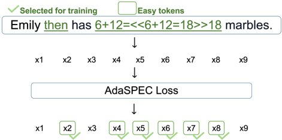
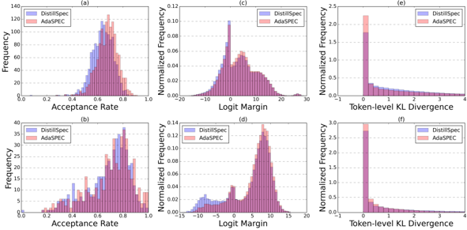

# adaspec — AdaSPEC: Selective Knowledge Distillation for Efficient Speculative Decoders

> **一句话重点 (TL;DR)**：投机解码里给小 draft 模型做蒸馏时，AdaSPEC 不再"所有 token 一视同仁地对齐大模型"，而是先用一个参考模型估出"哪些 token 对 draft 真的学得动"，只在这部分 easy token 上蒸馏，把有限容量花在刀刃上，从而把 token 接受率(acceptance rate)最高提升约 15%。值得看的点：它把"蒸馏目标(最小化全 token KL)与真实目标(最大化接受率)错位"这件事讲得很清楚，并给出一个极简的选择性过滤解法。

**元信息**：arXiv 2510.19779 ｜ UC Berkeley、清华、Georgia Tech（Yuezhou Hu*、Jiaxin Guo* 共一，实习于 Georgia Tech 完成）｜ NeurIPS 2025 (Spotlight)，arXiv v1 2025-10-22 ｜ 主题 投机解码 draft 蒸馏 / 与本项目**外围相关** ｜ 代码 https://github.com/yuezhouhu/adaspec（**受限**：仓库仅含 README/LICENSE/图，无任何训练代码，核心 loss 仅见论文附录 Listing 2）｜ 框架 HuggingFace transformers/TRL/Accelerate/DeepSpeed（两阶段选择性 KD）

## 关键图示

**② 方法 / 架构图**

*Figure 1: Overview of AdaSPEC distillation process : AdaSPEC selects the most training-effective tokens and distills on these tokens.*

**① Motivation / 对比图**

*Figure 2: Comparative analysis of AdaSPEC and DistillSpec performance across multiple metrics on GSM8K (a, c, e) and CNN/Daily Mail (b, d, f) datasets: (a-b) Task-level acceptance rate distributions showing AdaSPEC's superior performance across tasks. (c-d) Logit margin distributions demonstrating A*

## 1. 相关工作与进展(这条线现在做到哪一步)
投机解码(speculative decoding, SD)是当下主流的无损推理加速范式：用一个小 draft 模型"投机"地一次性生成多个 token，再用大 target 模型并行验证、接受或回退。加速倍率直接取决于 draft 与 target 的"对齐度"——draft 提的 token 越常被接受，跳得越多。为提升对齐，社区普遍给 draft 做知识蒸馏(KD)，代表方法是 **DistillSpec**（forward-KL，让 draft 分布逼近 target）。更先进的结构化方案如 **EAGLE** 改进了 draft 的特征复用。AdaSPEC 站在 DistillSpec 这条"用 KD 增强 draft-target 对齐"的线上，并声称可与 EAGLE 等叠加。

## 2. 现有工作存在的问题(本文针对的痛点)

- **目标错位**：常规 KD 在**所有 token** 上最小化 draft↔target 的 KL，但 SD 的真实目标是**最大化接受率**。低 KL 不等于高接受率。
- **容量浪费**：draft 模型容量很小（论文做到最高 64× 容量差），强行去拟合"难学、且本来也很难被接受"的 hard token，会挤占 easy token 的学习预算，导致整体接受率次优，有时 loss 还不收敛。

## 3. Motivation(为什么做这件事)
作者观察到 KD 中各 token 学习难度差异巨大：强行压低 hard token 的 loss，往往是以抬高 easy token 的 loss 为代价。既然 draft 只需要在"足够易提议"的 token 子集上预测对就能拿到接受，那就应该**主动剔除 hard token**，把有限容量集中到 easy token 上，在容量约束内最大化与 target 的对齐。

## 4. 主要灵感 / 核心直觉
核心直觉：**"对 draft 而言有优化潜力的 token"≠"loss 大的 token"**。一个 token 即使当前 loss 大，如果连一个专门蒸馏过的参考模型都学不好，那它就是 draft 学不动的硬骨头，不值得投入。真正该学的，是"draft 现在差、但参考模型证明它学得动"的 token。于是引入一个参考模型作为"难度探针"。

## 5. 主要解决思路(一段话把核心机制讲清)
两阶段：先训一个与 draft 同初始化的**参考模型(reference)**，用 DistillSpec 从 target 蒸馏，让它成为"token 难度分析器"；然后对每个 token 比较"draft 的蒸馏损失"与"参考模型的蒸馏损失"，差值越大说明这个 token 对 draft **越有可学空间(优化潜力大)**，取损失差最大的 top-k% token 组成子集 S，**draft 只在 S 上做蒸馏**，其余 token 直接忽略。

## 6. 方法详解(通俗、分步骤;关键公式用白话解释,必要时给伪代码)
**Step 1 — 参考模型蒸馏 + 难度估计**：reference 初始化为 draft 的拷贝，用 DistillSpec(forward-KL) 从 target 蒸馏。它扮演"如果充分蒸馏，draft 这个规模最多能学成什么样"的上界探针。

**Step 2 — 选择性 draft 蒸馏**：对每个 token w，

- 算 draft 的损失 `L_draft(w)=KL(target‖draft)`、参考模型的损失 `L_ref(w)=KL(target‖ref)`；
- 算损失差 `ΔL(w)=L_draft(w) − L_ref(w)`。白话：ΔL 大 = "draft 现在比已学好的参考差得多" = 这个 token **还有很大可学空间**；ΔL 小 = draft 已接近参考能达到的极限，再练也榨不出多少。
- 选 ΔL 最大的 top-k% token 组成子集 S（默认 **k=0.4**），draft **仅对 S 内 token** 求蒸馏损失。

**工程实现**（据论文 Appendix A.4 Listing 2，约 100 行，override `transformers.Trainer.compute_loss`；**仓库内无可运行代码**）：对每 token 用 `KLDivLoss(reduction='none')`，以 target softmax 为 P，分别算 `actual=KL(P‖draft)`、`ref=KL(P‖ref)`，按 `delta=actual−ref` 取掩码 `delta >= torch.quantile(delta, 1−k)`，只对 masked token 求和(除以 num_items_in_batch)或求均值。可与 EAGLE 叠加。

## 7. 实验数据集

- 任务/数据：GSM8K(算术推理)、Alpaca(指令跟随)、MBPP(代码)、CNN/DailyMail 与 XSUM(摘要)。
- 模型对：Pythia 31M→1.4B、CodeGen-350M→Phi-2(≈2.7B)；声称在最高 **64× 容量差**下仍有效。
- 主指标：acceptance rate α；辅以 block efficiency、wall-time speed-up。
- 超参：lr 多为 3e-4（MBPP/部分任务 1e-5~1e-4），filter fraction **k=0.4**，分 "3-epoch" 与 "optimal-epoch" 两套设置。

## 8. 实验结果与主要发现(关键数字)
一致超过 SOTA 基线 DistillSpec，acceptance rate 在所有任务最高提升约 **15%**：

- GSM8K，Pythia(3-epoch)：57.58% → **62.63%**；
- CodeGen→Phi-2：79.49% → **82.79%**；
- MBPP(optimal-epoch)：49.88% → **65.12%**（提升最大的一档）。
（以上数值已对照论文 _txt 第 287-309 行核实。）

## 9. 结果如何支撑其主张(证据链是否到位)
主张"选择性过滤 > 全 token 蒸馏"由跨任务、跨模型对的 acceptance rate 一致提升支撑，证据较扎实。但需注意：主表汇报的是**接受率这个代理指标**，而非端到端 wall-time 加速——后者的增益还依赖 cost coefficient c（draft 单步与 target 单步的相对成本），论文以 α 为主指标，端到端加速的提升幅度相对弱化。

## 10. 逻辑自洽性(中性评估:哪里站得住、哪里牵强)

- **站得住**："用参考模型的损失作基准来定义可学性(ΔL)，而不是用绝对 loss"这一点逻辑清晰，直接对应"容量约束下的最优分配"直觉，且实验一致支持。
- **牵强/可质疑**：(1) ΔL 大确实代表"差距大"，但是否一定代表"draft 真能补上这个差距"，论文用经验结果回答，缺乏更强的理论保证；(2) 多训一个参考模型本身是额外开销，"省 draft 容量"与"多一阶段训练成本"的净收益论文未充分量化。

## 11. 残留问题 / 局限

- **仅限同族/同词表 draft-target 对**（KL 要求词表对齐）。
- **多一阶段开销**：参考模型需额外完整蒸馏一遍。
- **k 为固定超参**（默认 0.4），跨任务未做自适应，最优 k 可能随任务漂移。
- **代理指标**：提升的是接受率，端到端 wall-time 加速依赖成本系数，主表未以墙钟时间为主。
- **代码不可得**：方法核对只能依据论文附录 Listing 2，无可运行实现可审。
- 属推理加速场景，与 reasoning RL 后训练目标不同；与本项目相关性在于"token-level 选择性蒸馏"这一思想谱系。

## 12. 开源代码与框架(链接 + 框架 + 代码可得性)

- 链接：https://github.com/yuezhouhu/adaspec （OpenReview zNLlglSOwD）。
- **可得性受限**：已 clone 的 main 分支(与 origin/main 一致)仅含 `README.md / LICENSE / .gitignore / adaspec.png`，**无 train.py / utils.py / run.sh 等训练代码**。README 称"实验配置分散在各 git 分支"，但 origin 上并未实际推送这些分支。核心 `compute_loss` 仅见于**论文 Appendix A.4 Listing 2**。
- 框架：HuggingFace transformers / TRL / Accelerate / DeepSpeed（两阶段选择性 KD）。
