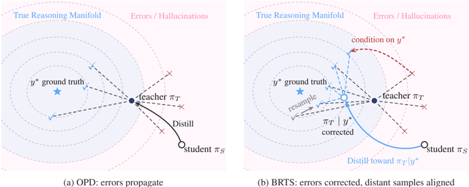
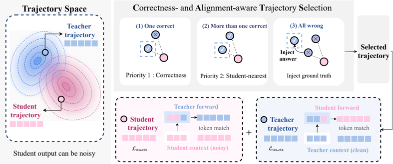

# brts — On-Policy Distillation with Best-of-N Teacher Rollout Selection (BRTS)

> **一句话重点 (TL;DR)**：标准 OPD 每个 prompt 只用一条随机 teacher rollout，方差大、错了还会被放大。BRTS 对每 prompt 采 N 条 teacher 轨迹，按"先正确、再与学生对齐"挑一条；全错时用注入 ground-truth 的提示让 teacher 重新自然推导；选中的轨迹作为额外的 teacher-context 蒸馏分支，与标准 student-context OPD 一起训练。

**元信息**：arXiv:2605.09725v2（2026-05-13，cs.CV）｜ JHU + TikTok + UCSD + 复旦（Ke Zhang JHU/TikTok 实习期间完成；通讯 Di Fu, TikTok）｜ 2026-05 预印本｜ 主题 T1/T2/T4（High）——针对 OPD"单次随机 teacher rollout 高方差/错误/不匹配"，提出 Best-of-N 选择 + ground-truth 引导恢复 + teacher-context 辅助损失，**与 TSRD 的 path-recovery、teacher-scaffolded 思路高度一致**｜ 代码 https://github.com/BWGZK-keke/BRTS （已 clone 约 14MB，基于 verl fork）｜ 框架 veRL（与 thunlp/OPD 同源 fork）。

---

## 关键图示

**① Motivation / 对比图**

*Figure 1: Conceptual comparison of OPD and BRTS. (a) Classical OPD may propagate unreliable teacher signals when teacher trajectories are incorrect or poorly matched to the student. (b) BRTS constructs correctness- and alignment-aware teacher-context supervision by selecting or recovering a reliable*

**② 方法 / 架构图**

*Figure 2: Overview of BRTS. The left panel shows teacher and student trajectories in the trajectory space. The upper-right panel illustrates the selection rule: choose a correct teacher rollout when available, select the student-nearest one when multiple correct rollouts exist, and inject the ground*

## 1. 相关工作与进展

- **OPD 已成 LLM 后训练标准工具**：学生自采样 rollout，用 teacher 逐 token log-prob 作 dense 监督；比 SFT/序列级蒸馏更不易受 exposure bias（监督定义在学生推理时真实访问的状态上）。工业 pipeline（Qwen3、MiMo、GLM-5）已采用，且报告以 RL 一小部分算力获得可比增益。
- 近期工作开始解析 OPD 成败条件（[26] 等）：师生需共享**兼容推理模式**，且 teacher 要能产出**超出学生当前探索范围的、自然推导的正确解**，才能迁移新能力；小模型难以模仿风格不匹配的强 reasoner。
- BRTS 与 best-of-N / rejection sampling / 特权信息（ground-truth、demonstration）方法相关，但**把选择放进 OPD 内循环**而非离线过滤。

## 2. 现有工作存在的问题

- 标准 OPD 在"不完美学生生成、可能漂移到噪声推理状态"的**前缀**上计算 teacher 监督（学生 context 噪声）。
- 且通常每 prompt 只依赖**单次随机 teacher rollout**。teacher 本身随机：同一 prompt 的采样轨迹在正确性、推理风格、与学生接近度上差异大（尤其难题）。**单样本是对 teacher 该 prompt 能力/对齐的高方差估计**；当该样本错误或不匹配时，会产生噪声指导并被放大（Fig.1a）。

## 3. Motivation
不从任意 teacher rollout 学，而是**先识别一条可靠 teacher 轨迹再蒸馏**，作为额外的 teacher-context 监督：既补充标准 student-context 蒸馏（修正学生访问状态），又让学生见到完整可靠的 teacher 推理路径；该分支同时是 **correctness-aware**（防错误样本放大）与 **alignment-aware**（选最接近学生当前分布的轨迹）。

## 4. 主要灵感 / 核心直觉
"与其学一条随机轨迹，不如从一小池里挑最可靠且最像学生能走的那条"——把随机 teacher rollout 变成**结构化监督**。难题上全错时，给 teacher 偷偷看答案逼它产出自然推导（path-recovery），保证最需要监督处分支仍活跃。

## 5. 主要解决思路（一段话讲清核心）
BRTS = **Best-of-N Rollout Teacher Selection**：每 prompt 采 N 条 teacher 轨迹 → 按"correctness first, student-alignment second"选一条（全错则注入 ground-truth 重采恢复，仍不行则回退最相似）；在标准 student-context OPD 损失外，加一条在选中轨迹上的 teacher-context 蒸馏损失，权重 λ 控制。

## 6. 方法详解（通俗、分步骤）
**(A) teacher 轨迹 curation（三层，Algorithm 1）**

1. **Tier-1**：采 N 条 unconditioned teacher 样本，按答案判对错。
2. 若 ≥1 条正确 → 在正确轨迹中选与学生 **top-K overlap 最高**者（alignment）。
3. 若全错 → **Tier-2 ground-truth 引导恢复**：构造修改 prompt x_gt（把 ground-truth 答案作为"静默校验信号"，要求 teacher 给自然推导），采一条 guided rollout，**仅当其答案正确才保留**。
4. 若仍无正确 → fallback 到 Tier-1 中 student-overlap 最高者（虽可能错，但避免引入离学生很远的任意轨迹）。

**(B) teacher-context 监督（Eq.3–5）**

- 保留 student-context 损失（学生前缀上的标准 OPD，**reverse-KL**）：\(\mathcal{L}_{\text{stu-ctx}} = \mathbb{E}\!\left[\sum_t D_{\mathrm{KL}}\!\left(\pi_S(\cdot \mid x, \hat{y}_{<t}) \,\|\, \pi_T(\cdot \mid x, \hat{y}_{<t})\right)\right]\)（Eq.3）。
- 新增 teacher-context 损失（在选中 teacher 前缀 y'_<t 上）：\(\mathcal{L}_{\text{tea-ctx}} = \mathbb{E}\!\left[\sum_t D_{\mathrm{KL}}\!\left(\pi_T(\cdot \mid x, y'_{<t}) \,\|\, \pi_S(\cdot \mid x, y'_{<t})\right)\right]\)（Eq.4）。**〔已核，旧分析未指出〕注意这两条 KL 方向相反**——student-context 是 reverse-KL（π_S 在前），teacher-context 是 forward 方向（π_T 在前），即把学生分布往 teacher 沿可靠路径的局部分布上拉。
- 总损失 \(\mathcal{L}_{\text{total}} = \mathcal{L}_{\text{stu-ctx}} + \lambda \cdot \mathcal{L}_{\text{tea-ctx}}\)（Eq.5）。

**(C) top-K 方向（§3.4）**

- student-context 分支用**学生** top-K 候选（监督学生认为合理的 token）。
- teacher-context 分支用**teacher** 在选中前缀下的 top-K 候选，引入学生当前 top 之外的 teacher-preferred token。

## 7. 实验数据集

- **训练 prompt**：DAPO-Math-17K（teacher-aligned 处理，`dapo-math-17k-processed.parquet`）。
- **评测**：AIME 2024、AIME 2025、AMC 2023，报 mean / best / majority accuracy；默认每题 k=4 解、temp 0.7、top-p 0.95。
- **模型**：主实验 teacher = **JustRL-1.5B**，student = 同尺度 **DeepSeek-R1-Distill-Qwen-1.5B**（论文称 "DeepSeek-1.5B"）；§4.2 teacher-swap 换成 DeepSeek-R1-Distill-Qwen-7B（student 仍 1.5B）。硬件 8×B200。

## 8. 实验结果与主要发现

- **teacher-context 有用**（Table 1）：基线（2 条 student rollout）AIME24 mean 0.3917；BRTS 用 1 student + 1 teacher / **4 候选**达 AIME24 mean **0.400**、best 0.599、majority **0.4306**——**候选池越大、监督越有信息**。
- 难基准增益最大（AIME > AMC）；AMC23 上增益不明显甚至持平（Table 1 AMC23 各设置 mean 0.67–0.68，与基线 0.6777 接近）。
- **Tier-2 ground-truth 恢复**（Table 2）在 Tier-1 解不掉的难 prompt 上进一步补监督。
- Fig.3：BRTS 在训练早期达到比 student-only 基线更高的 majority 峰值。

## 9. 结果如何支撑其主张
主张"选可靠 teacher 轨迹 + 恢复机制能改善 OPD（尤其难题）"。支撑：候选池 0/2/4 的递增对比显示选择确有增益；Tier-2 隔离实验显示恢复在难 prompt 上有效。但增益**绝对值小**（AIME24 mean 0.3917→0.400，约 +0.8 个百分点），且 AMC23 几乎无提升——支撑"难题更受益"的方向性，但量级有限。

## 10. 逻辑自洽性（中性评估）

- 自洽：从"单样本高方差"问题，到"多采样+优先级选择+恢复"的方法，再到候选池/Tier-2 消融，链条清晰；Algorithm 1 与脚本环境变量（n_rollouts、tier1_only、fallback 等）一致。
- 张力点：(a) 增益量级小且基准窄（仅竞赛数学）；(b) teacher-context 用 forward-KL 而 student-context 用 reverse-KL，论文未深入论证方向选择的理由；(c) 主实验师生**同尺度 1.5B**，"teacher 产出超出学生范围的正确解"这一 OPD 成功前提在同尺度下是否成立存疑（teacher JustRL-1.5B 经强 RL，故仍可能强于 distill student）。

## 11. 残留问题 / 局限

- 评测仅 AIME/AMC 竞赛数学，**泛化覆盖窄**；cs.CV 分类标签与实际数学任务不符（疑似投稿分类，待留意）。
- 增益绝对值小，AMC23 基本持平。
- 每 prompt 额外采 N 条 teacher 轨迹 + 可能的 Tier-2 重采，**计算开销**未充分量化。
- **λ 取值存在文-码不一致〔已核〕**：论文 §3.3 明确"λ=10 across all experiments"，而仓库脚本 `on_policy_distillation.sh` 默认 `AUX_TEACHER_CTX_KD_COEF=0.05`；复现需对齐（旧分析仅写 0.05、未指出论文用 10，此为本次新发现的不一致）。

## 12. 开源代码与框架（链接+框架+代码可得性）

- 代码：https://github.com/BWGZK-keke/BRTS （resource/repos/brts，约 14MB；脚本 on_policy_distillation.sh / grpo.sh / forward.sh / forward_tier2.sh）。
- 框架：**veRL**（`python -m verl.trainer.main_ppo`；`ADV_ESTIMATOR=token_reward_direct`；rollout 用 vLLM；reward_model 即 teacher 提供 token 级 reward；swanlab 记录）。与 thunlp/OPD（rethink_opd）同源 fork（env 变量、top_k_strategy、reward_weight_mode 一致）。
- **已核脚本默认值**：N_RESPONSES=2、MAX_RESP_LENGTH=7168、LOG_PROB_TOP_K=16、TOP_K_STRATEGY=only_stu、REWARD_WEIGHT_MODE=student_p、lr 1e-6、FSDP + dynamic batch；teacher_rollout enable=True、n_rollouts=2、fallback=most_similar、tier1_only=False、n_rollouts_hint=1；**AUX_TEACHER_CTX_KD_COEF=0.05（脚本默认；注意论文用 λ=10）**；对负优势无特殊处理。forward.sh = Tier-1 only，forward_tier2.sh = 含 Tier-2。另有 prompt 扰动消融（对第二条 teacher rollout 追加 "rethink" 提示）。
- 代码可得性：方法实现完整可跑，需注意 λ 等超参与论文对齐。
