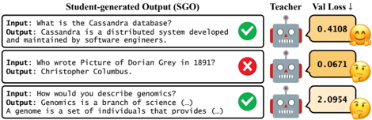
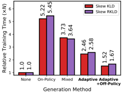

# distillm — DistiLLM: Towards Streamlined Distillation for Large Language Models

> **一句话重点 (TL;DR)**：把自回归 LM 蒸馏的两大痛点分别治理——用有理论保证的 **skew KLD** 替代不稳定的 KLD/RKLD 作目标函数，用带 replay buffer 的**自适应 off-policy 策略**把昂贵的学生生成输出（SGO）生成频率压到最低；在保持/超过 SOTA 蒸馏质量的同时把训练提速 2.5–4.3×。

**元信息**：arXiv 2402.03898 (v2, 2024-07-03) ｜ KAIST AI（Jongwoo Ko, Sungnyun Kim, Se-Young Yun）+ Microsoft（Tianyi Chen）｜ ICML 2024（2024-02 首发）｜ 主题 T1 / High（白盒 LM 蒸馏目标函数 + 训练效率）｜ 代码 https://github.com/jongwooko/distillm（已克隆约 853KB）｜ 框架 自研（沿用 MiniLLM 代码基 + 定制 HF Transformers + DeepSpeed，无外部 RL 框架）。

## 关键图示

**① Motivation / 对比图**

*Figure 1. Student-generated output (SGO) examples with teacher feedback and validation loss, motivating adaptive off-policy generation.*

**② 方法 / 架构图**

*Figure 7. Relative training time for different generation methods for S(R)KL. The adaptive off-policy approach shows significant efficiency.*

## 1. 相关工作与进展

- **白盒 KD**：用 KLD（前向）或 RKLD（反向）让学生匹配教师分布。
- **on-policy / SGO 类**：GKD、MiniLLM 等用**学生生成输出（SGO）**做蒸馏，以缓解训练-推理分布不匹配；但 SGO 生成极慢。
- 散度选择上各方法莫衷一是（KLD vs RKLD vs JSD），缺统一标准。

## 2. 现有工作存在的问题

- **目标函数缺理论支撑**：最优散度任务相关（GKD 观察），KLD 可能梯度爆炸或泛化/收敛性不足。
- **朴素用 SGO 的两大问题**：(i) 教师对不熟悉/不准确的 SGO 给出**误导性反馈**（给短而错的低 loss、给长而对的高 loss）；(ii) **每步都生成 SGO 极低效**——SGO 生成可占训练总时长很大比例（论文报告近期 on-policy 方法慢 3–7×，甚至单独 SGO 生成占 80% 训练时间）。

## 3. Motivation
需要一个**同时**兼顾蒸馏质量与训练效率的框架：用有理论保证的散度修掉目标函数的不稳定，用自适应 off-policy 调度在最小化 SGO 生成频率的前提下，平衡"减小训练-推理不匹配的正效应"与"噪声反馈的负效应"。

## 4. 主要灵感 / 核心直觉

- **混合分布稳梯度**：在教师/学生概率间插值，防止 KL 中分母趋零导致的梯度爆炸——即 skew（偏斜）KLD。
- **SGO 可缓存复用**：训练-推理不匹配的修正不必每步重生成 SGO；早期多用新鲜 SGO 降 bias，后期多复用 buffer 提效率，并随验证 loss 自适应决定生成强度。

## 5. 主要解决思路（一段话讲清核心）
两大组件协同：(1) skew KLD/SRKL——把目标函数从 KL(p,q) 改成 KL(p, αp+(1-α)q)（及反向版），用插值避免分母趋零、提供更稳的梯度，理论上更大 α 降低经验估计的 L2 范数误差，权衡后最优 α≈0.1；(2) 自适应 off-policy——用一个 SGO Scheduler 按验证 loss 自适应增大 SGO 使用概率 φ，并用 replay buffer 存历史 SGO、以线性递减的 replay ratio 控制重新生成的频率。SKL 的快速收敛使 off-policy 能在低 bias 下生效。

## 6. 方法详解（通俗、分步骤）

1. **Skew KLD（SKL / SRKL）**：
   - 前向 D^(α)_SKL(p,q)=KL(p, αp+(1-α)q)；反向 D^(α)_SRKL(p,q)=KL(q, (1-α)p+αq)。
   - 代码（`distillm/losses.py` 第 66–95 行，已核对）：`skewed_forward_kl` 用 `mixed = lam*teacher + (1-lam)*student`、`skewed_reverse_kl` 用 `mixed = (1-lam)*teacher + lam*student`，默认 `lam=0.1`。
   - 性质（Thm.1）：更大 α 降低经验估计的 L2 范数误差；权衡后最优 α≈0.1，优于 KLD/RKLD/JSD。
2. **自适应 off-policy 方法**：
   - **Adaptive SGO Scheduler**：SGO 使用概率 φ 从低（实验初始 φ=0）起，依验证 loss 自适应增大（验证 loss 上升则增 φ）。
   - **Off-policy + replay buffer**：`distillm/buffer.py` 用 `deque(maxlen=capacity)` 存 SGO（实验 capacity≈1000），按线性递减 replay ratio λ_R=φ(1-t/T) 控制生成频率——早期多用当前 SGO 降 bias，后期多复用 buffer 提效率。
3. **协同**：SKL 快速收敛使 off-policy 在低 bias 下生效；默认配置 = SRKL + off-policy + α=0.1。

## 7. 实验数据集

- **指令遵循**：databricks-dolly-15k（14K 训练 + 各 500 验证/测试），评 Dolly/Self-Instruct/Vicuna/Super-Natural/Unnatural；加 OpenWebText 语言建模辅助 loss。
- **文本摘要**：SAMSum（另 XSum、CNN/DM 在附录）。
- **机器翻译**：IWSLT 2017 En-De。
- 指标：ROUGE-L、GPT-4 feedback、BLEU（翻译）。

## 8. 实验结果与主要发现

- **教师→学生对**：GPT-2 XL(1.5B)→GPT-2(0.1B)、OPT-2.7B→1.3B、OpenLLaMA2-7B→3B（7B 用 LoRA）；摘要/翻译用 T5-XL/mT5-XL→T5/mT5-Base/Small。4×40G A100 训练。
- **效率**：相比近期 KD，训练提速 2.5–4.3×；DistiLLM 仅需朴素 KD 的约 1.6× 时间，而 MiniLLM/GKD 需 3–7×。
- **质量**：在指令遵循/摘要/翻译上达到 SOTA 蒸馏性能。
- **额外性质**：支持一阶段蒸馏（无需先 SFT 学生），对学生初始化更鲁棒。

## 9. 结果如何支撑其主张

- "目标函数更稳更好" → 消融中 SKL/SRKL（α≈0.1）优于 KLD/RKLD/JSD，与 Thm.1 的 L2 误差界方向一致。
- "高效" → 训练墙钟时间相对 MiniLLM/GKD 显著下降（2.5–4.3×），由 SGO 生成频率被 scheduler+buffer 压低直接解释。
- "鲁棒/可一阶段" → 跨多组教师-学生对、多任务的稳定增益支撑该主张。

## 10. 逻辑自洽性（中性评估）
两组件目标清晰、与代码一一对应（skew 混合系数、replay deque、φ 调度），机制叙事自洽。值得注意：skew KLD 本质是"插值平滑"，其稳定性收益与温度平滑/标签平滑有概念重叠；"最优 α≈0.1"是经验权衡点，Thm.1 给的是单调方向而非闭式最优。off-policy 的 bias-效率权衡由线性 schedule（而非自适应最优）控制，属工程启发式。整体证据支撑主张，但"理论保证"更多是定性方向性而非强保证。

## 11. 残留问题 / 局限

- **模型规模偏小且偏旧**：主力实验在 GPT-2/OPT/OpenLLaMA2 等老模型，最大 7B 且用 LoRA，现代大模型上的结论需外推。
- **α、φ、capacity 等为经验超参**：最优 α≈0.1、buffer≈1000、φ schedule 均为调出来的，缺自适应最优依据。
- **skew 的概念新颖性有限**：插值平滑与既有平滑技巧重叠，贡献更多在"系统化 + 理论方向 + 与 off-policy 协同"。
- **白盒前提**：需教师 logits（同 tokenizer/词表），不适用黑盒蒸馏。

## 12. 开源代码与框架（链接+框架+代码可得性）

- 仓库 https://github.com/jongwooko/distillm（已克隆，约 853KB）。核心实现在 `distillm/`：`losses.py`（skewed_forward/reverse_kl，lam=0.1）、`buffer.py`（replay deque）、`sampler.py`、`__init__.py`；另有 `minillm/`（沿用的 MiniLLM 代码基）、`scripts/`（gpt2/opt/openllama2 的 sft/kd/seqkd/imitkd/minillm/gkd/distillm 各基线）、`train_minillm.py`、`finetune.py`、`generate.py`、`install.sh`。
- 框架：自研，基于 MiniLLM 代码基 + 定制 HF Transformers（README 注明"based on this commit of HF Transformers by following MiniLLM"，24.08.12 起已解除旧版依赖）+ DeepSpeed；无外部 RL 框架。
- 代码可得性：高（含全部基线复现脚本与核心 loss/buffer 实现，可直接复现）。
