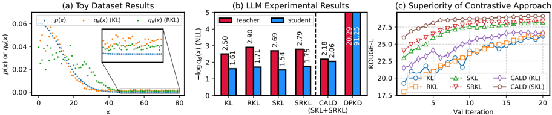
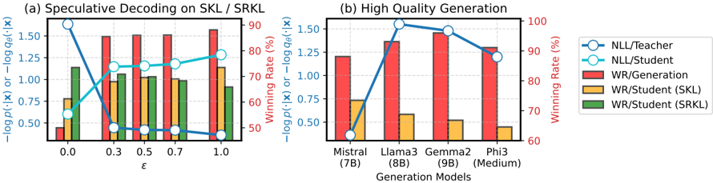

# distillm2 — DistiLLM-2: A Contrastive Approach Boosts the Distillation of LLMs

> **一句话重点 (TL;DR)**：观察到 KL 与 RKL 的非对称行为——KL 在教师生成数据（TGO）上"抬高"、RKL 在学生生成数据（SGO）上"压低"——于是设计对比式蒸馏 loss（CALD）：对教师响应用 SKL、对学生响应用 SRKL，并配 α 课程与 β 线性递增，在指令/数学/代码/VLM 全面超过 GKD、DistiLLM、Speculative KD。

**元信息**：arXiv 2503.07067 (v2, 2025-05-30) ｜ KAIST AI（Jongwoo Ko, Sungnyun Kim, Se-Young Yun）+ Microsoft（Tianyi Chen, Tianyu Ding, Luming Liang, Ilya Zharkov）｜ ICML 2025 Oral（top 1%）｜ 主题 T1 / High ｜ 代码 https://github.com/jongwooko/distillm-2（已克隆约 5.9MB，2025-06 正式发布）｜ 框架 HF alignment-handbook + Accelerate + DeepSpeed ZeRO-3 + vLLM 生成 + FlashAttention-2（无 veRL/TRL）。

## 关键图示

**① Motivation / 对比图**

*Figure 1. (a) The behavior of KL (orange) and RKL (green) is analyzed for long-tailed toy data introduced in Wu et al. (2024). (b) NLL of student models on teacher (red) and student (blue) responses, using Mistral-7B and Danube2-1.8B as the teacher and student models, respectively, optimized with di*

**② 方法 / 架构图**

*Figure 2. Comparison of the winning rates compared to the student before KD ( WR ) of student models with (a) replacing y t (orange) or y s (green) with y spec, responses from speculative decoding (Cai et al., 2024), varying the hyperparameter ε . (b) replacing y t with responses generated using str*

## 1. 相关工作与进展

- **白盒 KD**：DistiLLM（前作）提出 skew KLD（SKL/SRKL）作稳定目标。
- **对比/偏好方法**：DPO 等通过对 chosen/rejected 两类响应施加不同学习策略，在偏好对齐/推理中高效，但少有人扩展到 LLM 蒸馏。
- 此前蒸馏多对 TGO 与 SGO **施加相同 loss**，忽略了"loss 形式 × 数据类型"的协同。

## 2. 现有工作存在的问题

- **单一 loss 难兼顾 TGO/SGO**：用一种散度同时处理两类数据，性能受限。
- **直接把 DPO 套到 KD（DPKD，把参考模型换成教师）易 reward hacking**：因 p(y_s|x) 本身很小，会过度压低 q(y_s|x)（NLL 飙到 91.25），学生丢失预训练信息而非拟合教师。

## 3. Motivation
设计**可扩展的对比式蒸馏**：利用 KL 与 RKL 的非对称行为，对不同类型的响应数据施加不同的 loss，从而捕捉"loss 与数据"的协同，并避免 DPKD 式的 reward hacking。

## 4. 主要灵感 / 核心直觉

- **KL 抬头部、RKL 压尾部**：KL 对 TGO 有 "pulling-up"（在教师概率 p 高的头部抬高学生 q），RKL 对 SGO 有 "pushing-down"（在 p 低的尾部压低 q）。
- **用 SKL/SRKL 而非纯 KL/RKL**：以 DistiLLM 的 skew 版本作 backbone，插值稳梯度。
- **线性而非 log-sigmoid 的对比**：可写成类 DPO 的线性形式，支持 token 级分解与显式加权，并通过混合分布与 p 的线性依赖正则化 q(y_s) 的过度下降，避开 DPKD 的 reward hacking。

## 5. 主要解决思路（一段话讲清核心）
CALD loss：L = 1/(2|D|) Σ [ (1-β)·D^(α_t)_SKL(教师响应 y_t) + β·D^(α_s)_SRKL(学生响应 y_s) ]，即对教师响应用 SKL（抬高其概率）、对学生响应用 SRKL（压低其概率）。两项增强：(a) α 课程——按一致性闭式更新 α（易样本小 α、难样本大 α）；(b) SRKL 系数 β 线性递增——前期主拟合教师、后期主用 SGO 反馈减小训练-推理不匹配。数据策展上对 SKL 用纯教师生成、对 SRKL 用纯学生生成最优。

## 6. 方法详解（通俗、分步骤）

1. **对比 loss（CALD）**：对教师响应施 SKL（`tea_pos_kl`），对学生响应施 SRKL（`ref_pos_kl`），分别乘 (1-β)、β 求和。
   - 代码（`src/distillm_trainer.py` ~1141–1210，已核对）：teacher 项 mix = α₁·teacher + (1-α₁)·student → `tea_pos_kl = Σ p·(log p − log mix)`（SKL，抬高）；student 项 mix = (1-α₂)·teacher + α₂·student.detach() → `ref_pos_kl = Σ q·(log q − log mix)`（SRKL，压低，**学生分支 detach**）。
   - Remark 1 证明 CALD 可改写为类 DPO 的线性形式（增大 \tilde q(y_t)、减小 q(y_s)），但用**线性**而非 log-sigmoid，支持 token 级分解与显式加权，并借 \tilde q 与 p 的线性依赖正则化 q(y_s) 的过度下降，避免 DPKD reward hacking。
2. **α 课程**（代码 `update_alpha`）：`anchor=(1-base_α)·(logp−logq)`，`α=clip(1 − anchor/(p̄−q̄), min=1e-2, max=base_α)`，`base_α₁=base_α₂=0.1`——易样本（p̄≈q̄）小 α、难样本大 α。
3. **β 线性递增**（代码 `gradual_beta`）：`β` 随训练步从小到大（如 1.0→1.5），前期主拟合教师、后期主用 SGO 反馈减小训练-推理不匹配。
4. **数据策展**：对 SKL 用纯教师生成、对 SRKL 用纯学生生成最优——speculative decoding/更强 LLM 的"高质量"响应反而更差，说明**教师响应的高 log-prob 比"高质量"更关键**。每个 epoch 前用 vLLM 批量采集 TGO/SGO（batch on-policy）。

## 7. 实验数据集

- **指令遵循**：UltraChat200k（采 50K prompts），评 AlpacaEval/Evol-Instruct/UltraFeedback（LLM-as-Judge，GPT-4o/4o-mini）。
- **数学**：MetaMathQA（50K）训练，评 GSM8K/MATH。
- **代码**：WizardCoder（Evol-Instruct code）训练，评 HumanEval/MBPP。
- **偏好对齐**：把 SFT 替换为 KD 后接 DPO。
- **VLM**：RLAIF-V-Dataset（83K），评 OK-VQA/TextVQA。

## 8. 实验结果与主要发现

- **教师→学生对**：Qwen2-7B-Inst→Qwen2-1.5B、Mistral-7B-Inst→Danube2-1.8B、Gemma-2-9B-Inst→Gemma-2-2B（指令）；数学用 Qwen2(.5)-Math-7B-Inst→1.5B；代码用 DS-Coder-6.7B/Qwen2.5-Coder-7B→1.3B/1.5B；VLM 用 LLaVA-1.5-7B→TinyLLaVA-1.4B（Qwen2.5 不同尺度需 `resize_embedding.py` 对齐分类头）。
- **结果**：指令/数学/代码/VLM 全面 SOTA，优于 GKD、DistiLLM、Speculative KD。
- **消融**：对比 loss、β 递增、α 课程三组件逐项增益。
- **capacity gap**：能更好处理教师-学生容量差（教师增大单调提升）。

## 9. 结果如何支撑其主张

- "loss×数据协同" → 消融显示对教师用 SKL、对学生用 SRKL 的搭配优于单一 loss 与对称搭配。
- "避免 reward hacking" → 相对 DPKD（NLL 飙到 91.25）CALD 保持正常 NLL，由线性形式 + \tilde q-p 线性依赖的正则化解释。
- "高质量≠高 log-prob" → 数据策展实验中"更强 LLM/speculative"响应反而更差，支撑"教师响应高 log-prob 比质量更关键"的论断。

## 10. 逻辑自洽性（中性评估）
机制叙事与代码高度一致（teacher→SKL/pull-up、student→SRKL/push-down + detach、α clip 课程、gradual β）。Remark 1 的"类 DPO 线性形式"提供了与偏好优化的桥接，但 CALD 本质更接近"对两类数据分别选散度方向"的工程组合，"对比"一词更多指 TGO vs SGO 的差异化处理而非 DPO 式成对 margin。"高质量响应反而更差"是个有趣且反直觉的发现，但其解释（log-prob 主导）属相关性观察，未给因果隔离实验。整体证据扎实、消融完整，结论自洽。

## 11. 残留问题 / 局限

- **白盒 + 同词表前提**：需教师 logits，Qwen2.5 跨尺度还需 resize 分类头，限制适用范围。
- **超参较多**：α 课程的 base_α、β 的递增 schedule、(1-β)/β 配比均需调，最优区间未给闭式依据。
- **"高质量数据反而更差"缺因果证据**：仅相关性观察，可能与分布匹配度而非 log-prob 本身耦合。
- **每 epoch 重生成 TGO/SGO 的成本**：虽用 vLLM 批量加速，但相对纯离线 KD 仍有额外生成开销。
- **VLM 迁移仅单一对**（LLaVA→TinyLLaVA），多模态结论外推性有限。

## 12. 开源代码与框架（链接+框架+代码可得性）

- 仓库 https://github.com/jongwooko/distillm-2（已克隆，约 5.9MB）。核心：`src/distillm_trainer.py`（CALD loss，含 tea_pos_kl/ref_pos_kl、α clip 课程、gradual β，已核对）、`src/run_distillm.py`（LLM）、`src/run_distivlm.py`（VLM）、`src/run_sft.py`、`src/alignment/`；生成 `generate/generate_vllm.py` + `reformat.py`；配置在 `training_configs/`、`accelerate_configs/`。
- 框架：基于 HF **alignment-handbook**（setup.py 注明改编）+ Accelerate + DeepSpeed ZeRO-3 + vLLM(0.5.4) 生成 + FlashAttention-2；启动 `accelerate launch --config_file accelerate_configs/deepspeed_zero3.yaml src/run_distillm.py ...`。无 veRL/TRL。
- 代码可得性：高（trainer、生成、SFT、VLM 入口与配置齐全，可复现各任务）。
