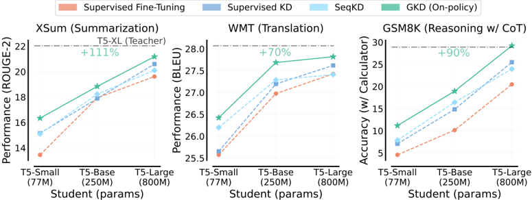
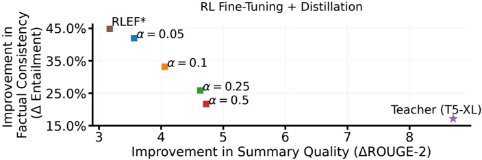

# gkd — On-Policy Distillation of Language Models: Learning from Self-Generated Mistakes (GKD)

> **一句话重点 (TL;DR)**：把自回归 LM 的知识蒸馏当成"交互式专家模仿学习"——让学生在**自己生成**的序列上、用教师的 token 概率作监督，从而消除训练/推理的分布失配；并把散度选择（forward/reverse KL、JSD）与 on-policy 数据比例统一成一个可调框架 GKD。

**元信息**：arXiv 2306.13649（v3, 2024-01-17）｜ Google DeepMind（+Mila / U. Toronto）｜ ICLR 2024 ｜ 主题 T1/T3，相关性 High（白盒 token 级 OPD 的奠基工作之一，本课题 OPD 直接源头）｜ 代码 TRL `GKDTrainer`（无独立官方训练仓，原实验在 Google JAX 栈）｜ 框架 T5/JAX（论文）、TRL（社区集成）。

## 关键图示

**① Motivation / 对比图**

*Figure 1: Comparing GKD with KD approaches across different student model sizes. We use the T5 models (Raffel et al., 2020) trained with supervised FT as students. We use supervised FT T5-XL ( ∼ 3B params) as the teacher, whose performance is indicated by the horizontal line. Supervised KD and FT us*

**② 方法 / 架构图**

*Figure 5: RLAIF + On-policy GKD . We show the trade-off between reward maximization and summarization performance on XSum. We report improvements relative to the original T5-base student. Following Roit et al. (2023), we use the textual entailment score from a T5-XXL NLI classifier as the reward. α*

## 1. 相关工作与进展

- **监督 KD**（Hinton 2015；DistilBERT/Sanh 2019）：学生在固定数据集上拟合教师的 token 级概率分布（最小化 forward KL）。
- **序列级 KD（SeqKD，Kim & Rush 2016）**：先用教师生成高概率序列，再对这些序列做监督微调，等价于"在教师输出上做 SFT"。
- **ImitKD（Lin 2020）**：首次点出蒸馏与模仿学习的联系，混采学生与固定数据，但停在 token 级 forward KL，未走纯 on-policy，也未结合 RL。
- **f-distill（Wen 2023）**：把序列级 KD 表述为 f-散度最小化（用 total variation）。
- **并行工作 MiniLLM（Gu 2023）**：把蒸馏当 RL 问题，序列级优化 reverse KL，用 policy gradient，但需多种稳定化技巧。

## 2. 现有工作存在的问题

1. **训练-推理分布失配（暴露偏差）**：监督 KD / SeqKD 都在固定序列上训练；推理时学生从自身部分输出自回归生成，会进入训练未见状态，早期 token 误差级联放大。
2. **容量失配下 forward KL 的弊端**：学生表达力有限时，最小化 forward KL 迫使学生覆盖教师分布的整个支撑，可能把概率质量分散到教师几乎不产生的 token 上，导致幻觉/低质量生成。

## 3. Motivation
把"在固定数据上学"换成"在学生自己会走到的状态上学"：借鉴模仿学习中 DAgger（Ross 2011）"教师作为交互式专家"的思路，让学生在 **on-policy（自生成）序列**上接受教师 token 概率的反馈；同时放开散度选择，使有限容量的学生能聚焦教师分布的关键区域。

## 4. 主要灵感 / 核心直觉

- 自回归蒸馏 ≈ 带交互式专家的模仿学习；on-policy 数据收集能消除暴露偏差，且学生进步后自己生成的数据质量也随之提升（正反馈环）。
- forward KL（均值寻求）会在高温采样下覆盖教师不产生的 token；reverse KL / 偏 1 的 JSD（模式寻求）能避免低质量生成，但牺牲多样性——最优散度**与任务相关**。

## 5. 主要解决思路(一段话讲清核心)
GKD 用两个旋钮统一所有自回归 KD：**(a) on-policy 数据比例 λ**（每步以概率 λ 用学生自采样序列，否则用固定数据/真值），**(b) 学生-教师 token 分布之间的散度 D**（forward KL / reverse KL / 广义 JSD(β)）。在所选序列上对每个 token 计算 D(教师‖学生) 作为损失（不反传穿过学生采样过程，故稳定且高效）。λ=0、D=forward KL 即退化为监督 KD；λ=1 即纯 on-policy 蒸馏。GKD 还能直接与 RL 微调叠加（式 5），把"向初始策略正则"改为"向教师策略正则"。

## 6. 方法详解(通俗、分步骤)

1. **起点**：学生与教师都是已 SFT 的同族模型（论文用 T5 系；学生须能生成质量尚可的序列）。
2. **每训练步（Algorithm 1）**：抽 u~Uniform(0,1)；若 u≤λ → 用学生当前策略以温度 γ=1 采样一批 on-policy 序列；否则 → 用固定数据集（真值或教师生成）。
3. **计算损失**：对该批序列，逐 token 计算所选散度 D(教师 token 分布 ‖ 学生 token 分布)，对序列长度归一化；**对学生采样过程做 stop-gradient**（只学概率拟合，不学采样）。
4. **更新学生**，重复。
5. **可选 RL 叠加（§3.2）**：目标 = (1−α)·E[r(y)]（RL 奖励）− α·on-policy GKD 散度。α=1 即纯蒸馏。论文用 RLAIF（文本蕴含奖励）抑制摘要幻觉，同时蒸馏提升下游质量。与 RL 集成时建议用 reverse KL 或 JSD(0.9)。
6. **配方**：WMT 用 JSD(0.1)，其余任务用 forward KL；指令微调任务 reverse KL 最佳。

## 7. 实验数据集

- **任务特定蒸馏**：XSum（摘要，ROUGE-2，贪心评测）；WMT14 en→de（翻译，BLEU，beam search）；GSM8K（带 4-shot CoT 的算术推理，外部计算器判对）。
- **任务无关蒸馏（指令微调）**：FLAN2021（536 万样本 / 62 任务），held-out 评测于 MMLU（57 任务）、BBH（23 任务）。
- **模型**：教师 = SFT 的 T5-XL（≈3B）；学生 = T5-Small(77M)/Base(250M)/Large(800M)，分别比教师小 38×/12×/3.8×。

## 8. 实验结果与主要发现

- **总体（Fig.1）**：on-policy GKD 在三任务、各学生规模上一致超过监督 KD 与 SeqKD；相对初始学生的提升约为基线 KD 的 2.1×（摘要）/1.7×（翻译）/1.9×（推理）。
- **散度选择（Fig.4/6/7）**：高温评测下模式寻求散度（JSD(0.5/0.9)、reverse KL）质量更好但多样性更低；贪心评测下散度选择影响很小。指令微调中 reverse KL 显著优于 forward KL（MMLU +2%、BBH +1%）。
- **on-policy 比例（Fig.8）**：当 on-policy 数据占比 ≥25% 后，性能随其增加而提升。
- **数据效率（Fig.3）**：仅用 5% 子集且无真值摘要的 on-policy GKD，胜过用全量真值的监督 KD / ImitKD。
- **RL 叠加（Fig.5）**：GKD+RLAIF 在事实一致性上超过教师，同时大幅提升摘要质量。
- **自蒸馏（Fig.A.11）**：同架构同尺寸 self-distill，学生可超过教师。

## 9. 结果如何支撑其主张

- "消除分布失配"由 on-policy（λ 越大越好）与数据效率结果直接支撑；"散度任务相关"由质量-多样性权衡曲线与指令微调对照支撑；"可与 RL 无缝结合"由 RLAIF 实验支撑。三类任务一致优于 SeqKD/监督 KD，证据链较完整。

## 10. 逻辑自洽性(中性评估)

- 框架自洽：监督 KD/SeqKD/ImitKD/f-distill 都被纳为 GKD 的特例，理论与实验都给出。
- stop-gradient 的"不反传穿过采样"使其比 MiniLLM 等 policy-gradient 方案更稳，作者论证清楚。
- 主要消融（散度×λ）系统完整。

## 11. 残留问题 / 局限

- 实验局限在 **T5 编码器-解码器（≤3B）** 与生成式任务，未覆盖现代 decoder-only 大模型与长 CoT 推理；λ/散度的最优值需逐任务调。
- on-policy 采样有计算开销（GSM8K 约 1.8×–2.2×），尽管作者论证相对服务成本可接受。
- 需要起点学生已具备一定生成质量（非随机初始化），与 RLHF 两阶段范式绑定。
- 教师须可查询 token 概率（白盒），黑盒教师不适用。

## 12. 开源代码与框架(链接+框架+代码可得性)

- 原论文实验在 Google 内部 JAX / T5 栈，**无公开官方训练仓**。
- 社区实现：HuggingFace TRL 的 `GKDTrainer`（https://huggingface.co/docs/trl/gkd_trainer）——已作为内置 trainer。本地**未 clone**（仅文档/集成，CloneTier=B）。
