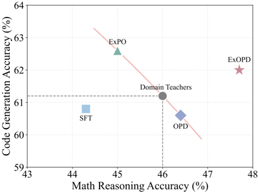
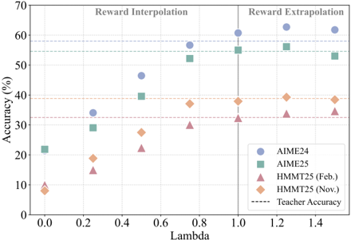

# gopd — Learning beyond Teacher: Generalized On-Policy Distillation with Reward Extrapolation (G-OPD / ExOPD)

> **一句话重点 (TL;DR)**：先在理论上证明 OPD 是"reward 与 KL 永远等权(β=1)、reference 可任选"的 dense KL-约束 RL 特例；再加两个旋钮——**灵活 reference πref** 与 **reward 缩放因子 λ**。λ∈(0,1) 是插值（学生介于 ref 与 teacher 之间），**λ>1 是外推(ExOPD)**，能让学生**越过 teacher 边界**；在多领域专家合并设定下 ExOPD 是唯一能让统一学生稳定超过所有领域 teacher 的方法。

**元信息**：arXiv 2602.12125（v2, 2026-02-26）｜ 中国人民大学高瓴 + 腾讯 LLM 部（Wenkai Yang 腾讯实习完成；通讯 Yankai Lin）｜ 2026-02 预印本 ｜ 主题 T1/T4，相关性 High（为"学生超越 teacher""多 teacher 知识合并"提供可控旋钮，与本课题 OPD+多专家融合高度相关）｜ 代码 https://github.com/RUCBM/G-OPD（已 clone ~33MB，含 verl + math_eval + code_eval）｜ 框架 **veRL v0.6.1**。

## 关键图示

**① Motivation / 对比图**

*(a) Multi-teacher distillation results, student model is Qwen34B-Non-Thinking, teachers are domain-specific RL variants*

**② 方法 / 架构图**

## 1. 相关工作与进展
- **离策略蒸馏（off-policy KD）**：在 teacher 生成轨迹上训学生（logit KL 或 SFT 交叉熵），有效但学生只模仿、不从自身经验学，测试时泛化弱。
- **on-policy 蒸馏（OPD，Agarwal 2024 / MiniLLM Gu 2024）**：学生采样自身轨迹、在每个 token 上对齐 teacher logit（reverse KL），实现 dense on-policy 学习；经验上比离策略蒸馏与 RL 更快更有效（Yang 2025a；Thinking Machines Lab 2025）。
- **应用**：OPD 已被用于(近)无损地把不同领域 RL 变体能力合回原 base（多任务后训练，Xiao 2026），也能大→小蒸馏。
- **相关**：implicit reward（Rafailov 2023, DPO）、权重外推 ExPO（Zheng 2025）。

## 2. 现有工作存在的问题
- OPD 经验有效，但**机理理解有限**，潜力未充分发掘。
- 标准 OPD 把 reward 项与 KL 正则**强制等权(β=1)**、reference **固定为学生初始策略**，缺少调节学生相对 teacher/reference 行为的旋钮（无法控制"落在中间"或"超越 teacher"）。

## 3. Motivation
建立 OPD 与 dense RL 的理论联系，并把标准 OPD 推广为带"灵活 reference + reward 缩放因子"的通用框架，从而能精确控制学生落在 reference 与 teacher 之间、甚至超越 teacher。

## 4. 主要灵感 / 核心直觉
- **关键推导（式 7）**：引入第三方 πref 后，OPD 目标 = max E[ log(π∗/πref) − D_KL(πθ‖πref) ]，恰是 KL-约束 RL（式 2）在 reward r=log(π∗/πref)、β=1 时的特例。
- 该 token 级 reward 与 DPO 的 implicit reward 同形（式 10）；它捕捉从 ref 到 teacher 的对数概率位移，且 π∗ 与 πref 可不同规模。
- 既然 OPD 只是 β=1 的特例，那就把 1/β 暴露成可调 λ：λ>1 等于把 reward 权重"外推"出 teacher。

## 5. 主要解决思路(一段话讲清核心)
G-OPD 目标（式 11）：max E[ **λ**·log(π∗/πref) − D_KL(πθ‖πref) ]，其中 λ=1/β。最优解满足 logπθ = logπ∗ + (λ−1)(logπ∗ − logπref)（式 12）：λ∈(0,1) 为 **reward interpolation**（学生行为/长度介于 ref 与 teacher）；**λ>1 为 reward extrapolation（ExOPD）**，学生额外拟合 (λ−1)(logπ∗−logπref) 这一外推项，可越过 teacher。reference 的选择在 λ≠1 时影响目标：**强→弱蒸馏**里把 πref 从学生 base 换成 teacher 的 pre-RL base（**reward correction**，式 13），reward log(π∗/π^teacher_base) 才是 teacher RL 诱导的良定义 implicit reward，比 log(π∗/π^student_base) 噪声更小。

## 6. 方法详解(通俗、分步骤)
1. **造领域 teacher**：对同一 base（Qwen3-4B-Non-Thinking）分别在 math/code 数据上做 GRPO，得 -RL-Math / -RL-Code 专家。
2. **跑 G-OPD**：在原 student 上扫 λ∈{0,0.25,0.5,0.75,1.0,1.25,1.5}（λ=0 即初始态，λ=1 即标准 OPD）；此设定 reference 自然固定为 student base。
3. **梯度（式 14）**：token 级优势 A_t = (logπθ−logπ∗) + (λ−1)(logπref−logπ∗)；用 discount=0 的 next-token 近似。
4. **多 teacher 合并**：把 math/code 两专家用 ExOPD（固定 **λ=1.25**，不再单独调）合回原 base，得统一学生。
5. **强→弱蒸馏**：teacher = Qwen3-30B-A3B-Instruct-2507，student = Qwen3-1.7B/4B；默认 πref=student base；若有 teacher pre-RL base 则用 reward correction 进一步提升。
6. GRPO 与 G-OPD 都启用 token-level rollout correction 缓解训推失配；基于 veRL。〔核对：代码侧 G-OPD 经 `actor_rollout_ref.actor.policy_loss.lambda_vals`（ExOPD=1.25）在 verl(v0.6.1) `dp_actor.py` 实现，多/单 teacher 分支携带 teacher logits；脚本见 `verl/examples/g_opd/`。〕

## 7. 实验数据集
- **训练**：DeepMath 过滤难度≥6 的 57K（math RL）、Eurus-RL-Code 25K（code RL）；蒸馏数据 = teacher RL 同源数据。
- **math 评测（每题 32 解，avg）**：AIME24、AIME25、HMMT25(February)、HMMT25(November)。
- **code 评测（每题 4 解）**：HumanEval+、MBPP+、LiveCodeBench(v6, 2025-02~05)。Math-Verify 规则验证；温度 1.0、max len 16384。
- **模型**：student=Qwen3-4B/1.7B-Non-Thinking；teacher 为对应 RL 专家或 Qwen3-30B-A3B-Instruct-2507。基线含 SFT（离策略）、标准 OPD、权重外推 ExPO。

## 8. 实验结果与主要发现
- **单 teacher（Fig.2/3/4, Table 2）**：标准 OPD 几乎完全复刻 teacher 的精度与回复长度；插值 λ∈(0,1) 性能/长度随 λ 单调增、介于 base 与 teacher（可做预算可控推理）；**ExOPD λ=1.25 在所有设定一致超过 OPD 与领域 teacher**；λ=1.5 过度外推会失稳掉点（学生 hack implicit reward）。
- **比"teacher 多训"更强（Table 1）**：teacher 续训 100 步 RL 仅 +0.9（46.0→46.9）；ExOPD 仅 50 步达 48.0（+2.0），证明增益非源于 teacher 训得不够。
- **多 teacher 合并（Table 2）**：SFT 次优、OPD 受 teacher 上限封顶、ExPO 不可控；**唯有 ExOPD 产出在所有基准超过两个领域 teacher 的统一学生**（math 47.7、code 62.0）。
- **强→弱（Table 3）**：4B 学生 ExOPD 45.3 vs OPD 42.6（+2.7）、SFT 35.1；1.7B 学生 25.4 vs 23.1。
- **reward correction（Fig.6）**：用 teacher pre-RL base 作 ref 进一步提升（如 28.1→28.7）。
- **训练动态（Fig.5）**：ExOPD 训练 reward 更高、回复更长、熵更高。

## 9. 结果如何支撑其主张
- "OPD=dense RL 特例"由式 7 推导直接给出；"λ>1 超越 teacher"由单/多 teacher 与强→弱三组实验一致支撑；Table 1 排除了"teacher 欠训"的混淆；reward correction 由式 13 推导 + Fig.6 实证。理论-实验闭环较完整。

## 10. 逻辑自洽性(中性评估)
- 理论自洽：式 7→11→12 一以贯之，把 OPD/RL/DPO implicit reward 统一在一个框架。
- 实现与理论对齐（lambda_vals 旋钮、verl 分支）。
- 一处张力：ExOPD 增益伴随**回复变长**（implicit reward 的长度偏置，作者自承），即部分增益可能来自"写更长"而非纯能力提升；λ=1.5 失稳也佐证外推的脆弱性。

## 11. 残留问题 / 局限
- 规模有限（主在 4B/1.7B；30B teacher 但无其 pre-RL 变体，reward correction 用 4B 代理验证）；作者列为 future work：更大模型、更多样领域 teacher、跨模型族。
- ExOPD 最优 λ（1.25）由小范围扫得，跨任务/规模的普适性未验证；过度外推风险需逐设定调。
- reward correction 需访问 teacher 的 pre-RL 变体并多算一份大 reference 的 log-prob，成本与可得性受限。
- 长度偏置可能虚高部分指标，缺长度归一化对照。

## 12. 开源代码与框架(链接+框架+代码可得性)
- https://github.com/RUCBM/G-OPD（已 clone ~33MB，含 `verl/` + `math_eval/` + `code_eval/`）。
- 框架 **veRL v0.6.1**；G-OPD/ExOPD 脚本在 `verl/examples/g_opd/`（`run_qwen3-4b-g-opd*.sh`，`lambda_vals` 控 λ）；math 评测用 Math-Verify。GRPO 与 G-OPD 共享同一 veRL 流程，超参见论文 Appendix B。
