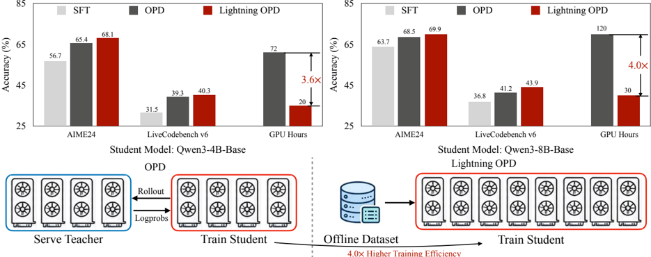
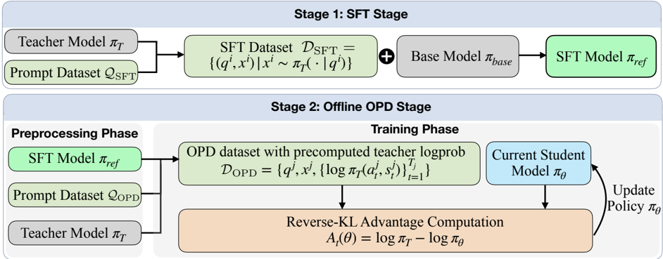

# lightning_opd — Lightning OPD: Efficient Post-Training for Large Reasoning Models with Offline On-Policy Distillation

> **一句话重点 (TL;DR)**：把 on-policy distillation (OPD) 改造为离线版——预先一次性算好并缓存每 token 教师 log-prob 复用，去掉训练期常驻教师 server；关键贡献是识别并证明被忽视的 **teacher consistency**（SFT 与 OPD 必须同一教师）条件，在该条件下离线 OPD 与标准 OPD 共享最优点、梯度差有界且带隐式正则，从而在性能持平/更优的前提下提速 3.6×–4.0×（含让 MoE 教师场景从 OOM 变可行）。

**元信息**：arXiv 2604.13010（v1 2026-04-14，当前 PDF v2 2026-05-08，据 v2 核对）｜ NVIDIA（Yecheng Wu, Song Han, Han Cai；通讯 hcai@nvidia.com）｜ Preprint｜ 主题 OPD，**与本项目 OPD 直接相关、核心命中**｜ 代码 https://github.com/jet-ai-projects/Lightning-OPD （已 clone，约 3.0MB）｜ 框架 slime + slime_plugins（SFT 用 LLaMA-Factory 风格 YAML，教师 log-prob 离线生成用 vLLM）。

## 关键图示

**① Motivation / 对比图**

*Figure 1 | Overview of Lightning OPD: accuracy and GPU-hour comparison of SFT, OPD, and Lightning OPD on Qwen3-4B-Base and Qwen3-8B-Base students, alongside a schematic contrasting online OPD (serve teacher + rollout/logprobs) with offline Lightning OPD (precomputed offline dataset) for 3.6-4.0x higher training efficiency.*

**② 方法 / 架构图**

*Figure 2 | Overview of Lightning OPD. In the SFT stage, the teacher π T generates trajectories on Q SFT then the base model π base is fine-tuned on these trajectories to obtain the SFT model π ref . OPD stage proceeds in two phases. In the preprocessing phase, rollouts are sampled from π ref on Q OP*

## 1. 相关工作与进展
OPD 是有效的 LLM 后训练范式：在学生自生成 rollout 上让学生对齐教师分布（dense per-token 监督），常比离线 KD 收益更强（Thinking Machines Lab、Qwen3 等）。

## 2. 现有工作存在的问题

- 标准 OPD 须在整个训练过程常驻大教师 server，GPU 被学生+教师共置而碎片化、成本高、需多节点；MoE 学生（如 30B-A3B）+教师共置常 OOM、不可行。
- 一个自然想法是离线化（训练前一次性预算并缓存教师 log-prob 复用），但**朴素离线化无法可靠匹配标准 OPD**。论文追溯根因为被忽视的 **teacher consistency**：SFT 阶段与 OPD 阶段必须同一教师，违反则引入不可约梯度偏置（对在线/离线 OPD 都有害、离线更甚）。现实常被违反——如 TML 用 QwQ-32B 生成的 OpenThoughts-3 做 SFT，却用 Qwen3-32B 作 OPD 教师。

## 3. Motivation
若强制 teacher consistency，离线 OPD 在理论上可等价标准 OPD，从而彻底去掉常驻教师 server、把全部 GPU 投入学生训练以大幅提速，并让此前 OOM 的 MoE 教师场景变可行。

## 4. 主要灵感 / 核心直觉
标准 OPD 的梯度可经重要性采样分解为 `∇J_on=E_{x∼π_ref}[w(x;θ)·f(x;θ)]`（w=π_θ/π_ref）；离线版相当于令 w≡1 的特例。在 teacher consistency 下（SFT 得到的 π_ref 与 OPD 教师同源），丢掉重要性权重所引入的偏差有界，且固定 rollout 分布 π_ref 反而带来一种隐式正则、抑制 policy drift——于是离线化既省又稳。

## 5. 主要解决思路(一段话讲清核心)
两阶段：Stage-1 SFT 在与 OPD 同一教师生成的轨迹上 MLE 得 π_ref（teacher consistency）；Stage-2 离线 OPD——从 π_ref 采 rollout 并对教师只查询一次、预算缓存每 token 教师 log-prob 形成 D_OPD，训练阶段全程复用该缓存，无需 live teacher。OPD advantage `A_t=log π_T(a_t|s_t)−log π_θ(a_t|s_t)`（stop-gradient，等价对 reverse-KL 做 dense per-token 监督），训练时 clip 到 [−τ,τ]。

## 6. 方法详解(通俗、分步骤)
设教师 π_T（固定）、学生 π_θ、SFT 参考策略 π_ref。

- **per-token OPD advantage**：`A_t(θ)=log π_T(a_t|s_t)−log π_θ(a_t|s_t)`（教师比学生更自信处为正，反之为负；视作 stop-gradient 标量）。
- **标准 OPD**：`J_on=E_{x∼π_θ}[Σ_t A_t]`（rollout 来自当前学生，需实时教师）。
- **Lightning OPD（离线）**：`J_off=E_{x∼π_ref}[Σ_t A_t]`（rollout 分布固定为 π_ref）。二者共用 advantage、仅响应分布不同；IS 分解显示 `∇J_off` 是 w≡1 特例，teacher consistency 下偏差有界 + 隐式正则。
- **流程**：Stage-1 SFT（D_SFT 须由 OPD 同一教师生成）→ Stage-2 预处理（从 π_ref 采 rollout、对教师只查询一次缓存 log-prob）→ 训练（复用缓存，无 live teacher）。`A_t` clip 到 [−τ,τ]（Alg.1 第13行）。OPD 阶段训 **150 step**（论文称足够收敛）。
- 〔已核-代码〕`slime/backends/megatron_utils/loss.py`（`advantage_estimator=="on_policy_distillation"`）：`advantages=teacher_log_prob−student_log_prob` 逐 token、与 Eq.2 一致、`returns=advantages`。`slime/rollout/on_policy_distillation.py` 用 `is_lightning_opd`/`is_offline_opd` 区分离线缓存 vs 在线查询，离线分支直接读预存 `teacher_log_probs`。SFT=LLaMA-Factory（configs/sft YAML）、OPD=slime（configs/opd 为标准 OPD 含 `deploy_teacher_model`+`--rm-url`；configs/lightning_opd 为离线版，含 4B/8B/30B-A3B 三套）。

## 7. 实验数据集

- 学生/教师配对：Qwen3-4B-Base–Qwen3-8B、Qwen3-8B-Base–Qwen3-32B、Qwen3-30B-A3B-Base（MoE）；均 SFT 初始化。
- SFT 数据：从 **OpenThoughts3-1.2M** 抽 prompt 采 **300K**（〔已核-代码〕`prepare_sft_prompts.py` 默认 `--num-samples 300000`），由各自教师生成响应。
- OPD prompt：两域——数学 **DAPO-Math-17k**（17K 竞赛题）；代码 **EpiCoder-func-380k 的 30K 子集**（function-level）。每 prompt 从 π_ref 仅采单条 response 并一次性预算教师 log-prob。
- 评测：数学 AIME24/AIME25/HMMT2025（每题 32 解，avg pass@1，max len 32768），代码 LiveCodeBench v5/v6（每题 4 解，max len 40960）。temperature 0.6、top-p 0.95。

## 8. 实验结果与主要发现

- 与标准 OPD 在所有基准×规模组合上持平或更优，但 **3.6×–4.0× 提速**——4B 从 72→20 GPU·h（3.6×），8B 从 120→30 GPU·h（4.0×）。
- 8B 在 30 GPU·h 达 AIME24 **69.9%**（SOTA 量级）。
- MoE Qwen3-30B-A3B 在单 8×H100 节点达 AIME24 **71.0%** / LiveCodeBench v5 **60.8%**——而标准 OPD 此设置 **OOM 不可行**（论文表中标 ✗）。

## 9. 结果如何支撑其主张
"离线≈在线"由全基准×规模上持平/更优支撑；"省"由 3.6×–4.0× GPU·h 削减支撑；"让 MoE 可行"由 30B-A3B 单节点跑通（标准 OPD OOM）直接支撑；teacher consistency 的必要性由违反该条件时离线化掉点的对照实验支撑（理论上证明共享最优点 + 梯度差有界 + 隐式正则）。

## 10. 逻辑自洽性(中性评估)
理论（IS 分解、有界偏差、隐式正则）、代码（loss 与 Eq.2 一致、离线/在线分支明确）、实验（持平+提速+MoE 可行）三者闭环自洽。teacher consistency 的提出既有理论刻画又有反例对照，是本文最扎实的贡献点。

## 11. 残留问题 / 局限

- teacher consistency 是硬约束：要求 SFT 与 OPD 同教师，限制了复用第三方 SFT 数据（如直接用 OpenThoughts-3）的灵活性。
- 离线缓存固定 π_ref 的 rollout，OPD 阶段学生若漂移较远，w≡1 近似的偏差是否仍可忽略，依赖 150 step 短训练 + clip + 隐式正则共同保证；更长训练/更大师生差距下的稳健性未充分探索。
- 每 prompt 仅采单条 response，rollout 多样性受限。
- 主实验限于 Qwen3 族数学+代码两域，跨族/跨域泛化未展开。
- Preprint（v2 2026-05），未评审。

## 12. 开源代码与框架(链接+框架+代码可得性)

- 链接：https://github.com/jet-ai-projects/Lightning-OPD （已 clone，约 3.0MB；HF 组织 Lightning-OPD）。含 `slime/`、`slime_plugins/`、`configs/`（sft/opd/lightning_opd/models）、`data_curation/`（pipeline.py、prepare_lightning_opd.py）、`scripts/`（precompute_teacher_logprobs_*.sh、collect_rollouts.sh、serve_teacher_*.sh、generate_sft_data.sh）、`train.py`。
- 框架：slime + slime_plugins；SFT 用 LLaMA-Factory 风格 YAML（含 dataset_info.json）；OPD 配置为 Python（configs/opd 标准 OPD、configs/lightning_opd 离线版含 4B/8B/30B-A3B 三套）；教师 log-prob 离线生成用 vLLM（data_curation/pipeline.py）。代码可得、关键 loss 与离线分支可逐处对照。
