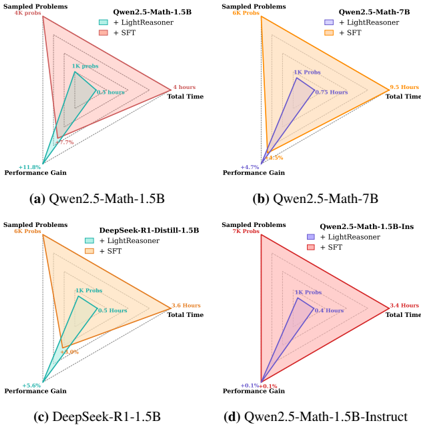
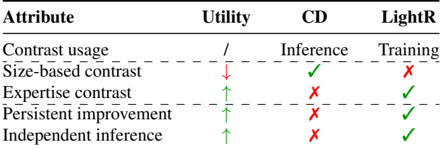

# lightreasoner — LightReasoner: Can Small Language Models Teach Large Language Models Reasoning?

> **一句话重点 (TL;DR)**：用"专家(大)模型 vs 业余(小)模型"的下一-token 分布分歧定位高价值推理时刻，把对比 log-prob 差(contrastive-decoding 信号)蒸成软标签反过来微调专家模型；卖点是极省资源、无需 ground-truth，但精度增益常不及标准 SFT、对已对齐模型几乎无效。

**元信息**：arXiv 2510.07962 ｜ 香港大学 / 芝加哥大学(Jingyuan Wang、Yankai Chen 共一，Chao Huang 通讯) ｜ ACL 2026 / 2025-10 ｜ 主题 对比解码式自蒸馏·无标签推理增强(与 OPD/蒸馏强相关但方向反转，相关性高) ｜ 代码 https://github.com/HKUDS/LightReasoner (已克隆，真实可用，中英双语 README) ｜ 框架 自实现轻量 Python 流水线(非 verl/TRL)

## 关键图示

**① Motivation / 对比图**

*Figure 1: LightReasoner achieves competitive or superior performance compared to SFT while substantially reducing resource consumption.*

**② 方法 / 架构图**

*Table 4: Key differences between Contrastive Decoding (CD) and LightReasoner. ↑ and ↓ indicate whether each attribute improves or reduces the method's practical applicability.*

## 1. 相关工作与进展
LLM 推理增强主流依赖 SFT，常配 rejection sampling：生成多候选 → 用 ground-truth 过滤留正确轨迹 → 对全部 token 统一微调。CoT 类工作早已表明推理能力在预训练中潜伏、可被激发。本文方法谱系属 contrastive decoding(对比解码，Li et al. 2023)的"训练化"——原 CD 在推理时用 expert−amateur log-prob 差重排序，本文把同一对比信号转成微调监督。

## 2. 现有工作存在的问题

- SFT/拒绝采样**资源密集**：需大规模 curated 数据、生成多候选、依赖 ground-truth 过滤。
- 对轨迹**所有 token 统一优化**，把琐碎步骤与关键推理步骤同等对待——而只有一小部分 token 真正承载学习价值。

## 3. Motivation
反直觉命题：小模型(SLM)能否"教"大模型？作者认为，在 expert(LLM)与 amateur(SLM)预测**分歧大**的位置，恰是专家推理强项所在；据此可构造监督信号、无需 ground-truth 标签，且只在少量高价值位置构样以省资源。

## 4. 主要灵感 / 核心直觉
关键直觉(§正文 L1683 起)：expert 与 amateur 的 log-prob 差刻画了"专家偏离业余倾向"的程度——分歧越大，越是专家独特推理能力发挥之处。把这种差当作"教学信号"，等于让专家朝"远离 amateur 式倾向"的方向自我强化。

## 5. 主要解决思路(一段话讲清核心)
两阶段：先在推理轨迹的每个位置比较 expert/amateur 下一-token 分布，用 KL 散度筛出"信息性步骤"，在选中步上以对比分数(log π_E − log π_A，经 plausibility 掩码 + softmax)构造软标签；再用 LoRA 微调专家、最小化该软标签与专家分布的 KL，从而放大专家推理强项。全程只在高价值位置构样、无需 ground-truth。

## 6. 方法详解(通俗、分步骤)

1. **Sampling 阶段**：对每个位置比较 expert/amateur 的下一-token 分布，用 **D_KL(π_E‖π_A) > β** 做"信息性步骤筛选"(§2.3.1，代码实现为 full-vocab KL，`kl_div < beta` 时跳过)；在选中步上用 **plausibility 掩码**(只保留 π_E(a) ≥ α·max π_E 的 token)后，以**对比分数 v'_C(a)=log π_E(a)−log π_A(a)**，softmax 归一化为软标签 v_C(§2.3.2)。〔已核-代码 `LightR_sampling.py` 默认 **α=0.2、β=0.4**(L30-31)，amateur 固定为 **Qwen2.5-0.5B**(论文 L684)〕
2. **Fine-tuning 阶段**：对选中步，Expert 最小化 **D_KL(v_C‖π_E)**(等价于以 v_C 为软目标的交叉熵，§2.3.3)，用 LoRA 微调，放大其推理强项。约 1K 问题级样本即可。

## 7. 实验数据集

- 7 个基准：GSM8K、MATH、Minerva Math、OlympiadBench、SVAMP、ASDiv、MMLU-STEM(MMLU-STEM 为 5-shot，其余 zero-shot)。
- 基模：Qwen2.5-Math-1.5B、Qwen2.5-Math-7B、Qwen2.5-Math-1.5B-Instruct、Qwen2.5-Math-7B-Instruct、DeepSeek-R1-Distill-Qwen-1.5B。amateur 固定 Qwen2.5-0.5B。
- 主指标：zero-shot **pass@1**(Qwen2.5-Math 工具包评测)。〔已核-§3.1〕

## 8. 实验结果与主要发现

- 作者自报(Abstract)：7 基准精度最高 **+28.1%**；时间 **−90%**、采样问题 **−80%**、tuned token **−99%**，全程无 ground-truth。
- 效率对比(Table 2，已核)：Qwen2.5-Math-1.5B LightR +7.7%(0.5h/1K 题/0.02M token) vs SFT +11.8%(4h/4K 题)；7B +4.5%(0.75h) vs SFT +4.7%(9.5h);DeepSeek-R1-Distill-1.5B LightR +5.6% vs SFT +3.0%(此例 LightR 反超 SFT);Qwen2.5-Math-1.5B-Instruct **LightR +0.1% = SFT +0.1%**(均近 0)。
- Fig.6：Expert-Amateur 专业差距越窄，增益越小。

## 9. 结果如何支撑其主张
"极省资源换接近 SFT 增益"这一**效率主张**被 Table 2 充分支撑(时间/token 数量级下降属实)。但"教会推理 / 最高 +28.1%"的**精度主张**支撑较弱：+28.1% 是跨模型×数据集的单点峰值，多数主力配置(1.5B/7B)增益不及 SFT;唯 DeepSeek-Distill 一例反超。故主张应理解为"效率向"而非"精度超越向"。

## 10. 逻辑自洽性(中性评估)
方法内部自洽：把 contrastive decoding 的推理时信号搬到训练时，KL 筛选 + plausibility 掩码 + softmax 软标签链条清晰，代码与公式(2/4/5/6)一致。"无 ground-truth 仍能改进"的可行性由 amateur 提供对照信号支撑，逻辑成立。

## 11. 残留问题 / 局限

- (1)精度增益常不及 SFT(1.5B +7.7% vs +11.8%)，卖点是效率而非精度;标题与"+28.1%"有挑选最优 case 之嫌，需看全表。
- (2)对已对齐/Instruct 模型增益趋近 0(1.5B-Instruct +0.1%)——只修复"未充分激发"的基模，对饱和模型边际收益极小;且增益随 Expert-Amateur 差距收窄而衰减(Fig.6)。
- (3)本质是 contrastive-decoding 信号训练化，creativity 在"反向用弱模型作对照"而非全新机制。
- (4)amateur 选取(多弱、是否同族)对分歧信号质量影响大，论文固定 Qwen2.5-0.5B，鲁棒性边界未充分给出。

## 12. 开源代码与框架(链接+框架+代码可得性)

- 链接：https://github.com/HKUDS/LightReasoner (约 67MB，已 clone;含 `LightR_sampling.py`/`LightR_finetuning.py`/`data_prep.py`/`merge.py`/`evaluation/`/`LRsamples`;README 中英双语，arXiv badge 2510.07962 一致)。HF 有模型 collection。
- 框架：自实现轻量 Python 流水线(requirements Python 3.10+)，非 verl/TRL 重框架;微调用 LoRA;基线评测走 Qwen2.5-Math 工具包。
- 可得性：完整、真实、可复现。
