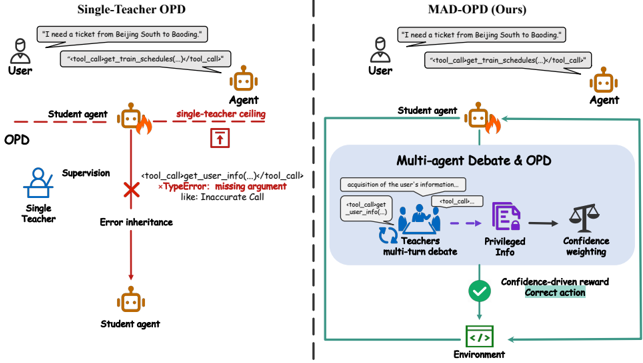
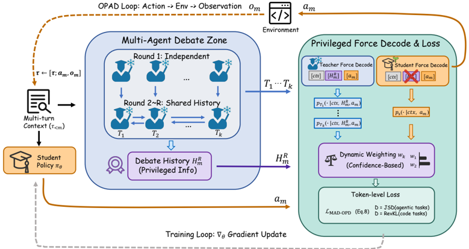

# madopd — MAD-OPD: Breaking the Ceiling in On-Policy Distillation via Multi-Agent Debate

> **一句话重点 (TL;DR)**：把多智能体辩论(MAD)搬进 OPD 训练环，让 K 个 teacher 就 student 的 on-policy 状态多轮辩论、辩论 transcript 作为 privileged context 产生 token 级监督(按辩论后置信加权)，以突破单 teacher 天花板；并以 OPAD(step-level 采样)把 OPD 扩到 agentic 任务，配 task-adaptive 散度原则(agentic 用有界 JSD、代码用 reverse KL)。

**元信息**：arXiv 2605.01347 (v1, 2026-05-02) ｜ 华中科技大(Jianze Wang，阿里实习) + 阿里巴巴；Yong Xie(HUST)、Qianglong Chen(Alibaba)通讯 ｜ Preprint 2026-05 ｜ 主题 OPD/distillation(直接相关) ｜ 代码 https://github.com/chiefovoavicii/MAD-OPD（本地已 clone ~1.9M，含核心算法）｜ 框架 TRL(0.15–0.25) + vLLM + DeepSpeed ZeRO-3 + transformers 4.51.1 + liger-kernel

## 关键图示

**① Motivation / 对比图**

*Figure 1: Left: a single teacher's erroneous tool call is faithfully inherited by the student (the single-teacher capability ceiling ). Right: MAD-OPD's multi-round debate corrects each teacher's blind spots, producing supervision that outperforms individual teachers. A worked-out instance with the*

**② 方法 / 架构图**

*Figure 2: The MAD-OPD Pipeline. At trajectory step m , the student π θ samples an on-policy action a m ; K teachers debate for R rounds to produce a transcript H R m visible only to the teachers, establishing the privileged p -q gap. Teachers then force-decode a m and contribute to a confidenceweigh*

## 1. 相关工作与进展
OPD(on-policy distillation)已成主流后训练配方：student 在自身轨迹上受 token 级 teacher 监督，提供 dense on-policy 信号，是 outcome-reward RL 与 off-policy 序列级蒸馏的高效替代；已用于 Qwen3 strong-to-weak、DeepSeek-V4 多 teacher OPD。近期工作扩展 OPD 以利用 privileged info、reward extrapolation、verifiable reward、context internalization；并有诊断工作研究 OPD 何时失败、reverse-KL 目标的稳定化重构。多智能体侧：multi-agent debate(MAD)经迭代论辩产生超越单体的涌现集体智能，confidence-weighted consensus 可匹配/超过最强单体。多 teacher 蒸馏汇聚互补信号但 teacher 间无交互(独立产出，student 学固定聚合)。

## 2. 现有工作存在的问题(三个 L)
- **L1 单 teacher 能力天花板**：现有 OPD 从单 teacher 蒸馏，student 被该 teacher 上界限制；诊断工作显示即便更强 teacher 也未必能提 student。
- **L2 任务覆盖窄**：OPD 研究集中在数学/常识推理，agentic(多步工具调用 + 环境反馈)几乎未探索；逐步错误跨长轨迹累积、destabilize 训练。
- **L3 散度选择 ad-hoc**：OPD 数学上等价于 dense token 级 RL，散度 D 直接塑造奖励信号；但现有稳定化各 patch 一个失效模式，缺把 D 与任务结构挂钩的原则，散度被当任务无关超参。

## 3. Motivation
突破单 teacher 上限需多模型协作；但现有多 teacher 蒸馏是 off-policy(student 被动消费预算好的信号)，缺对自身 rollout 的实时反应。MAD 的涌现集体智能此前只在推理期消费——把它搬进 on-policy 训练环作 token 级监督源，可同时破 L1，并以专门方法填补 L2、以理论原则解 L3。

## 4. 主要灵感 / 核心直觉
OPD = teacher-forcing 下 dense token 级 RL，per-token 奖励 r_D(s_t)=−D(p‖q)，选散度即选奖励。privileged p–q gap(teacher 见辩论 transcript c、student 不见)在 student 访问态造成结构性不对称：(a) teacher 对 student 采样 token 赋近零概率(p→0 而 q>0，主导 agentic)；(b) teacher 集中在多个有效 token(主导代码)。这恰对应两种散度需求：agentic 需 logit 梯度有界(JSD，Lemma 1.2 worst-case ∥∇_z JSD_0.5∥_∞≤2，与轨迹长 M 和师生 gap 无关；reverse KL 含 q log(q/p) 项在 p→0 时无界、forward KL 有界但 mode-covering 损 agentic)；代码需 mode concentration(reverse KL，Lemma 2 收敛到主导 mode，避免拼接不兼容实现；forward KL/JSD 会拼接)。

## 5. 主要解决思路(一段话讲清核心)
MAD-OPD 在 OPD 训练环每个决策点让 K teacher 就 student on-policy 状态做 R 轮辩论(round 1 独立、之后读全部历史修订)，辩论历史 H_R^m 作 privileged context c；各 teacher 辩论后自报置信 c_k∈[0,100]，softmax(温度 τ_conf=1.0)归一成权重 w_k；teacher 带 c force-decode student 的 on-policy 样本、student 不带 c，按 w_k 加权的散度 D(p_Tk‖p_S) 求 token 级 loss(式 8)，梯度只流 student。按 Remark 1：agentic 用 JSD_β、代码用 reverse KL。OPAD(式 9/10)给 agentic 加 step-level 采样：student 逐步 rollout、环境返回观察、teacher 每步就实际观察辩论 force-decode，监督随 student 实际轨迹自适应。

## 6. 方法详解(通俗、分步骤)
1. **辩论生成 privileged info(§4.1)**：K teacher 对状态 s_m 辩论 R 轮(式 5)，得 H_R^m 作 c(只对 teacher 可见)。
2. **置信加权(§4.2)**：辩论后各 teacher 自报 c_k，式 7 softmax 归一为 w_k；反映 deliberation 后确定性(辩论中立场被削弱者贡献小)。
3. **token 级目标(§4.3，式 8)**：teacher 带 H_R^m force-decode、student 不带；Σ_k w_k·D(p_Tk‖p_S)；**散度跨全词表(full vocabulary)**，teacher logits 作固定目标。
4. **OPAD(§4.4)**：agentic 走 step-level——s_m=(x,τ<m)，student 采 a_m，env 返回 o_m；每步辩论 force-decode a_m，per-step loss(式 9)求和成轨迹 loss(式 10)；条件于实际观察使监督自适应。
5. **散度选择(Remark 1)**：agentic→JSD_β(β=0.5)，代码→reverse KL。

## 7. 实验数据集
- **训练**：agentic 用 ToolACE 按 OPAD 协议拆 step-level(∼16K 实例)；code 用 OpenThoughts3 采 30K 题；agentic/code 训练独立 checkpoint、不共享数据。
- **评测**(五 benchmark，体现 agentic/code 划分)：agentic BFCL-v4、τ²-Bench、VitaBench；code LiveCodeBench v6、MBPP+。排除数学(已被近期 OPD 工作覆盖)。
- **配置**：六组师生(Qwen3 与 Qwen3.5；student 1.7B–14B，teacher 8B–32B，师生比 4.7×–15.5×)；两 Qwen3 对(14B+8B、32B+30B-A3B，30B-A3B 为 Qwen3-30B-A3B-Instruct-2507)+ 一 Qwen3.5 对(27B+9B)。基线：Base、单 teacher OPD(取较强 teacher)、MT-OPD(等权多 teacher 无辩论)、MT-SeqKD(off-policy 7:3 强弱混)。全程 non-thinking 模式；K=2, R=2, β=0.5。

## 8. 实验结果与主要发现
- **(RQ1) 六配置全部 overall Avg 第一**(表 1)。如 14B+8B→4B：MAD-OPD Avg 34.66 vs OPD 31.72 / MT-OPD 31.27 / MT-SeqKD 29.19 / Base 27.79；Ag-Avg 25.69(OPD 23.26)、Co-Avg 48.12(OPD 44.41)，即 agentic +2.4%、code +3.7% 超更强单 teacher OPD。
- **4B 超 14B teacher**(App. C.3)：14B+8B→4B 在 LCB-v6 超其 14B teacher +4.26% pass@1、+10.29% BoN@16，token 成本可比 → 瓶颈是 teacher-pool 多样性而非单 teacher 能力。
- **基线各有结构性失效**：单 teacher OPD 被 teacher 上限封顶；MT-OPD 的 per-token 梯度冲突在 code 上低于单 teacher OPD(两 teacher 分布逐 token 平均会插值不兼容代码路径产生不连贯监督)；MT-SeqKD 继承 off-policy exposure bias。
- **(RQ2) scaling**(图 3)：跨族跨配置泛化，增益随师生能力 scale；Δ(Base) Avg +3.5%~+8.0%。
- **(RQ3) 组件消融**(图 4a)：debate 比 MT-OPD +4.6% Co-Avg；confidence weighting +1.7% Ag-Avg；R=2 为经验最优(R=3 因 prompt-context 膨胀过头)。
- **(RQ4) 散度选择**(图 4b/表 4)：JSD 在 agentic 领先、reverse KL 在 code 领先、forward KL 两者都落后，与 Prop 1.3/2.2 一致；训练动态(图 6)佐证。

## 9. 结果如何支撑其主张
表 1 六配置一致第一直接支撑"破单 teacher 天花板";4B 超 14B teacher 支撑"瓶颈是 teacher-pool 多样性"这一更强主张;组件消融(去 debate/置信/multi-T/on-policy)逐项隔离贡献,支撑各设计非冗余;散度消融(固定其余只换 D)沿 agentic/code 划分翻转,与理论(Prop 1/2、Lemma 1/2)预测一致,理论-经验闭环较完整;BoN@16(App. C.4)补足 pass@1 之外的采样表现。

## 10. 逻辑自洽性(中性评估)
理论(散度有界性/mode 几何)→原则(Remark 1)→方法(辩论+置信+OPAD)→受控消融,链条自洽且有理论支撑(罕见地给出 logit 梯度有界性证明)。需注意:(1) 增益相对成本偏温和——14B+8B→4B 仅 agentic +2.4%/code +3.7%,而训练需在线跑 K×R teacher 辩论 + force-decode,论文也承认"训练成本随 K×R teacher 前向 scale",但未给单 teacher OPD 的端到端开销对比(只给绝对 wall-clock:4B agentic ≈16h、code ≈32h);(2) "4B 超 14B teacher"仅在 LCB-v6 这一基准且为 BoN@16 放大,普适性需谨慎;(3) 置信由 teacher 自报,其可靠性/可被操纵性靠 App. C.1 的鲁棒性分析支撑,属间接;(4) task-adaptive 原则的理论假设(代码=disjoint-support 多 mode、agentic=p→0 gap)是理想化建模。

## 11. 残留问题 / 局限(论文 §6 Limitations)
- **需 teacher token 级分布**:排除 black-box(仅 API)模型。
- **假设师生共享词表**:cross-vocabulary 蒸馏是开放扩展。
- **训练成本随 K×R teacher 前向 scale**:在线辩论 + force-decode 工程/计算开销显著,论文未充分量化相对单 teacher OPD 的额外成本。
- **增益温和**:相对该成本,+2.4/+3.7% 偏小;"4B 超 14B"是单基准 BoN 个案。
- **范围**:仅 agentic + code(排除数学),长程 agentic(误差累积更重)留待 future work;全程 non-thinking 模式。

## 12. 开源代码与框架(链接+框架+代码可得性)
- 仓库 https://github.com/chiefovoavicii/MAD-OPD （本地已 clone ~1.9M）。结构:`mad_opd/trainers/`(`mad_opd_core.py` 核心散度原语、`mad_opd_trainer.py`、`vllm_teacher_manager.py`)、`scripts/`(四算法 `run_opd.sh`/`run_mt_opd.sh`/`run_mad_opd.sh`/`run_mt_seqkd.sh` + `launch_teachers.py` + `force_decode_server.py`)、`eval/`(BFCL/LCB/τ²/Vita/MBPP+)、`data/`。
- **框架**:TRL(`trl>=0.15,<0.25`) + vLLM(`>=0.6`，多 teacher debate 文本服务) + DeepSpeed ZeRO-3 + transformers 4.51.1 + liger-kernel(LigerFusedLinearJSDLoss 可选)。
- **基础设施**(§B.2):8×NVIDIA H20 + ZeRO-3;每 teacher 经两个单卡进程服务——(i) vLLM 出辩论文本,(ii) sidecar 出 token 级 logit 分布。超参(§B.1):K=2,R=2,β=0.5,AdamW(β1=0.9,β2=0.999,wd 0.01),lr 1e-5 cosine + 5% warmup,有效 batch 128,grad clip 1.0,agentic max len 4096 / code 16384,训练 1 epoch,每 10 步存 ckpt。

〔本轮核码——修正前一轮的"差异"判定〕
- **前一轮记的〔核码差异〕(论文称全词表而仓库 JSD 是 top-k 截断)经再核为不成立/被高估**:`mad_opd/trainers/mad_opd_core.py` 的 `generalized_jsd_loss_single` 的 `top_k: Optional[int] = None`,仅当 `top_k is not None and top_k>0 and top_k<vocab` 时才截断(L201);`mad_opd_trainer.py` 中 `self.jsd_top_k = getattr(args,'jsd_top_k',None)` 默认 None,且 `sidecar_top_k=self.jsd_top_k` 也随之为 None → **默认走全词表 chunked JSD,与论文 §B.2"full vocabulary distribution rather than top-k truncation"一致**。`_chunked_jsd` 的 "chunk" 只是对全词表分块以省显存,非 top-k 截断;top-k 是可选 memory 旋钮(默认关)。核心模块注释亦写 "JSD is the default",reverse_kl 经 `divergence='reverse_kl'` 切换。
- 结论:论文与默认实现一致,**无实质描述-实现出入**;前一轮的差异标注应撤销。其余事实(K=2/R=2/β=0.5、8×H20 ZeRO-3、TRL 框架、四算法脚本、16h/32h、师生比、表 1 数值)经再核一致。
