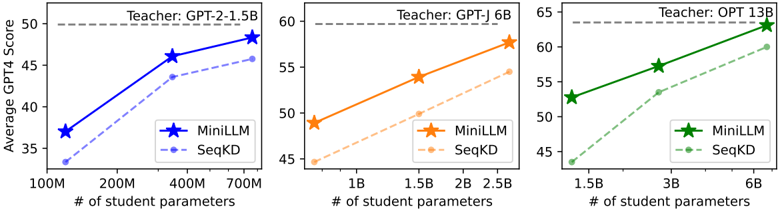
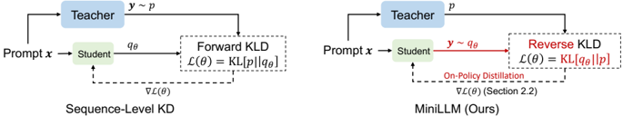

# minillm — MiniLLM: On-Policy Knowledge Distillation of Large Language Models

> **一句话重点 (TL;DR)**：把标准 KD 的 forward KLD 换成 reverse KLD(让小学生 mode-seeking、只学教师主要模式而非长尾)，并用策略梯度做 on-policy 优化；配三项稳定化(单步分解降方差、教师混合采样防 reward hacking、长度归一去短句偏好)，在 120M–13B 跨族一致优于 SFT/word-KD/SeqKD。

**元信息**：arXiv 2306.08543 (v6, 2026-01-31) ｜ 清华 CoAI(Yuxian Gu，微软实习) + 微软研究院(Li Dong、Furu Wei)，Minlie Huang 通讯 ｜ ICLR 2024(2023-06 首发，持续更新至 2026-01) ｜ 主题 T1/High ｜ 代码 microsoft/LMOps 子目录 minillm（本地已 clone 整仓 348MB，Tier 保留）｜ 框架 自研(改版 HF Transformers + DeepSpeed + Accelerate，类 RLHF pipeline)

## 关键图示

**① Motivation / 对比图**

*Figure 1: The comparison of MINILLM with the sequence-level KD (SeqKD; KR16, TGZ + 23, CLL + 23, PLH + 23, GWS + 23, ZLX + 23) in terms of the average GPT-4 feedback score on our evaluation sets. Left : GPT-2-1.5B as the teacher model and GPT-2 125M, 340M, 760M as the student models. Middle : GPT-J*

**② 方法 / 架构图**

*Figure 3: Comparison between sequence-level KD (left) and MINILLM (right). Sequence-level KD forces the student to memorize all samples generated by the teacher model, while MINILLM improves its generated texts with the teacher model's feedback.*

## 1. 相关工作与进展
KD 分两类：black-box(仅教师生成文本可见，近期在 LLM API 蒸馏小模型上很流行)与 white-box(教师输出分布/隐状态可见)。white-box KD 此前主要用于 <1B 的语言理解/分类模型(模仿 logits/隐状态/注意力)；文本生成的标准 KD 是近似最小化 forward KLD(word-level 用教师每步输出作监督，sequence-level/SeqKD 直接训练在教师生成文本上)。分布散度度量(forward KLD、TVD、最优传输、reverse KLD)对文本生成训练影响显著，已有并行工作探索。

## 2. 现有工作存在的问题
随着开源 LLM 兴起，white-box KD 价值上升，但面向生成式 LLM 的 white-box KD 尚未充分探索。标准 KD 本质最小化 \(\mathrm{KL}[p \| q_\theta]\)，迫使学生覆盖教师所有模式。对开放式文本生成，教师分布 p 的模式数远超低容量学生 q_θ 所能表达；最小化 forward KLD 会让学生把概率质量放到 p 的零概率/空白区(zero-forcing 的反面，overestimate void regions)，自由生成时产出低质量、不可能的样本。

## 3. Motivation
改用 \(\mathrm{KL}[q_\theta \| p]\)做蒸馏目标，让学生 mode-seeking——聚焦教师主要模式、对空白区赋低概率，避免学习长尾变体，更适合需要真实性/可靠性的生成场景；并推导其策略梯度形式做 on-policy 优化，使学生在自身能力内生成"教师偏好"的样本，而非死记教师的全部采样。

## 4. 主要灵感 / 核心直觉
计算机视觉与 RL 中 reverse KLD 的 mode-seeking 性质(toy 高斯混合实验，图 2)；可用策略梯度定理把 \(\min \mathrm{KL}[q_\theta \| p]\) 转成 on-policy 优化(R_t = 累计 log p/q 作每步生成质量奖励)。另有逆强化学习(IRL)视角的等价理解(附录 A.1)。On-policy 采样天然缓解 teacher-forcing 带来的 exposure bias。

## 5. 主要解决思路(一段话讲清核心)
目标 \(\min_\theta \mathrm{KL}[q_\theta \| p]\)，用 Policy Gradient Theorem 推梯度(式 2，\(\nabla L = -\mathbb{E}\left[ \sum (R_t - 1) \nabla \log q_\theta \right]\))；因策略梯度高方差、reward hacking、偏好短句，引入三项稳定化：单步分解(把单步 r_t 从 R_t 分离、直接对词表求和算 E[r_t] 降方差)、教师混合采样(\(e_p = \alpha \cdot p + (1-\alpha) \cdot q_\theta,\ \alpha = 0.2\)，抑制退化句、缓解 reward hacking，并用重要性采样修正、近似为单步 importance weight 降方差)、长度归一(对 R_{t+1} 归一消除短句偏好)。最终梯度含 PPO 式 clipping，并叠加 D_PT 上的语言建模 loss 保基准能力；整体流程类 RLHF：先 SFT 初始化，再 on-policy 训练。

## 6. 方法详解(通俗、分步骤)

1. **初始化**：在任务数据 D(Dolly)上 SFT 学生，取最低验证 loss 的 checkpoint。
2. **采样**：从混合分布 ep=α·p+(1−α)·q_θ 采 response(α=0.2)，抑制退化。
3. **算梯度**：(∇L)_Single 直接对整个词表求和算单步质量(降方差)；(∇L)_Long^Norm 用长度归一的 R_{t+1} 加 importance weight \(w_t \approx q_\theta / e_p\)(近似单步以避免连乘方差累积)与 clip(式 7、算法 1)。
4. **保基准能力**：加 \(\nabla L_{\text{PT}} = -\nabla \log q_\theta(d)\)(d 采自预训练语料 D_PT)。
5. **更新**：\(\theta \leftarrow \theta - \eta \cdot \left[ (\nabla L)_{\text{Single}} + (\nabla L)_{\text{Long}}^{\text{Norm}} + \nabla L_{\text{PT}} \right]\)，按验证集 Rouge-L 选 checkpoint。

## 7. 实验数据集

- **训练**：databricks-dolly-15K(过滤超长后约 12.5K 训练 / 1K 验证 / 0.5K 测试)；D_PT：GPT-2 族用 OpenWebText，其余用 RoBERTa 语料。
- **评测**(5 个指令遵循集)：DollyEval(500)、SelfInst(252)、VicunaEval(80)、S-NI(SuperNaturalInstructions，用 [11,+∞] 长子集)、UnNI(从 UnnaturalInstructions 采 10K)。指标：Rouge-L、GPT-4 feedback(仅 Dolly/SelfInst/Vicuna)、人工评测(SelfInst)；另测校准(ECE，SST2/BoolQ)、exposure bias(ExAccErr)、多样性(distinct-4gram + 测试集 LM loss)。temp=1，每 prompt 取 5 次生成均值。
- **模型**：GPT-2(120M/340M/760M，教师 GPT-2-1.5B)、OPT(1.3B/2.7B/6.7B，教师 OPT-13B)、LLaMA-7B(教师 13B)；附录另用 GPT-J 6B 作教师。

## 8. 实验结果与主要发现

- **全范围一致超基线**：120M–13B、三族、5 集、Rouge-L 与 GPT-4 两指标下 MiniLLM 几乎全胜 SFT/word-KD/SeqKD；非 Dolly 集上优势更大(OOD 泛化好)。如 GPT-2-1.5B→120M 在 DollyEval GPT4：MiniLLM 44.7 vs SeqKD 41.2 / KD 40.3 / SFT 38.6。
- **学生有时超教师 Rouge-L**(Vicuna/S-NI/UnNI)：归因于教师 teacher-forcing 的 exposure bias，而 MiniLLM 的 on-policy 采样缓解之。
- **人工评测**(LLaMA-7B←13B)：MiniLLM 人偏好优于所有基线，逼近教师。
- **附加性质**：更低 exposure bias(ExAccErr)、更好校准、长文本表现更优；多样性(distinct-4gram、LM loss)几乎无损。
- **消融**(GPT-2-1.5B→125M)：教师混合采样 + 长度归一对稳定训练关键(去掉则模型快速 reward hacking 生成重复/短/无意义串)；单步分解显著降方差、提升验证/测试分。

## 9. 结果如何支撑其主张
跨 3 族 × 多尺度 × 5 集 × Rouge-L/GPT-4/人工三指标的一致增益支撑"reverse-KLD on-policy KD 更优、可扩展"的核心主张；exposure bias(ExAccErr)、校准(ECE)、长文本与多样性的专门分析分别佐证"mode-seeking 提升正确性/可靠性而不显著损多样性"；三项稳定化的消融直接支撑各自必要性。toy 高斯实验(图 2)与梯度/IRL 推导给出 reverse-KLD 选择的理论动机。

## 10. 逻辑自洽性(中性评估)
方法链(reverse-KLD 动机 → 策略梯度 → 三项降方差/防 hacking/去偏 → 类 RLHF 训练)自洽，消融能逐项验证稳定化项的作用。需注意：(1) 三项稳定化均为近似(单步 importance weight 近似、单步分解、长度归一)，是为可训练性做的工程权衡，可能引入偏差，论文以经验稳定性而非无偏性论证；(2) "学生超教师 Rouge-L"基于 Rouge-L 这一表面重叠度量 + 教师也经 teacher-forcing 微调，结论需谨慎(并非学生能力真超教师)；(3) reverse-KLD 理论上 mode-dropping，作者用 distinct-4gram/LM loss 说明多样性"几乎无损"，但承认对需多样输出的场景这是权衡。

## 11. 残留问题 / 局限

- **无专门 Limitations 章节**：局限需从正文推断。
- **mode-seeking 的多样性代价**：reverse-KLD 本性丢模式；论文以"多数 NLP 应用一个正确响应即够"为由淡化，但对需高覆盖/多样生成的任务并不适用。
- **依赖 white-box 教师**：需教师完整输出分布(全词表 logits)，无法用于仅 API 可见的 black-box 教师；且需教师与学生 tokenizer/词表兼容。
- **稳定化的脆弱性**：去掉教师混合/长度归一即 reward hacking，说明方法对超参(尤其 α=0.2)与稳定化技巧依赖较强。
- **任务/规模范围**：仅指令遵循 + ≤13B，未验证更大模型、推理(数学/代码)或 agentic 任务；评测以 Rouge-L 为主指标，受其表面度量局限。
- **算力开销**：on-policy 需训练中持续采样 + 教师前向算分布，比离线 SeqKD 重。

## 12. 开源代码与框架(链接+框架+代码可得性)

- 仓库 https://github.com/microsoft/LMOps （子目录 `minillm/`）；本地已 clone 整个 LMOps(348MB，<500MB 保留)，MiniLLM 代码在 `resource/repos/minillm/minillm/`，核心算法在 `minillm/minillm/`：`losses.py`(含单步正则 `single_step_reg`、`length_norm`、reverse-KLD 奖励/优势计算)、`trainer.py`、`sampler.py`、`pipelines.py`、`reward.py`、`storages.py`。已被 HuggingFace TRL 收录(`trl/experimental/minillm`)。
- **框架 = 自研(custom)**：基于改版 HF Transformers(`t1101675/transformers@minillm` 分支，加 model/tensor parallel 与 teacher-mixed sampling)+ DeepSpeed + Accelerate；`install.sh` 装定制 transformers/deepspeed/accelerate/peft；`train_minillm.py` + `scripts/` 经 deepspeed 启动。无 veRL/TRL/OpenRLHF 等外部 RL 框架，训练 pipeline 自研(类 RLHF)。
- 训练资源：16×32G V100(小模型可减)，大模型用 tensor parallel(size=4)。基线 SFT / word-level KD / SeqKD。α=0.2 全程固定，按验证 Rouge-L 搜超参。

〔核实结论〕原分析与论文/仓库一致(单步分解/教师混合/长度归一三项、α=0.2、跨族 120M–13B 均核对无误)；本轮补全：论文无独立 Limitations 章(局限改为从 reverse-KLD mode-dropping 与方法假设推断)、消融具体现象(去稳定化即 reward hacking)、white-box 教师依赖等中性局限。无新事实出入。
