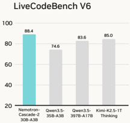
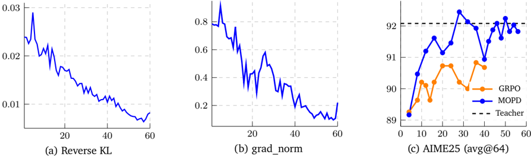

# nemotron_cascade2 — Nemotron-Cascade 2: Post-Training LLMs with Cascade RL and Multi-Domain On-Policy Distillation

> **一句话重点 (TL;DR)**：在按领域顺序的 Cascade RL 中插入一个"多领域 on-policy 蒸馏(MOPD)"稳定化阶段——用各领域最强中间 checkpoint 作教师、以 token 级 reverse-KL 蒸馏优势恢复 RL 造成的回退；30B/3B-激活 MoE 由此在数学/代码达到接近前沿、IMO/IOI 金牌级，但以牺牲通用知识/STEM(MMLU-Pro、GPQA) 为代价。

**元信息**：arXiv 2603.19220 ｜ NVIDIA（Zhuolin Yang*, Zihan Liu*, Yang Chen*, Wenliang Dai*, Boxin Wang*, …, 通讯 Wei Ping*†）｜ 2026-03-16 ｜ 主题 T?/High（多领域/多教师 OPD + RL 交织的工业级范例，与本课题直接相关）｜ 代码 无独立训练代码仓（NVIDIA 模型/数据发布；依托开源 Nemo-RL）｜ 框架 Nemo-RL

## 关键图示

**① Motivation / 对比图**

**② 方法 / 架构图**

*Figure 3: Training dynamics and downstream evaluation.*

## 1. 相关工作与进展
将前沿推理与 agentic 能力压入紧凑模型是后训练核心目标。前作 Nemotron-Cascade 1 提出 **Cascade RL**——按领域顺序逐域 RL 的框架，简化多领域 RL 编排。Cascade 2 基于 Nemotron-3-Nano-30B-A3B-Base(30B MoE, 3B 激活)，引用 on-policy distillation 系谱（Agarwal 2024、Gu 2024、Lu & Lab 2025/Thinking Machines、Xiao 2026、Zeng 2026 等）。

## 2. 现有工作存在的问题
即使 Cascade RL 比任意顺序的顺序 RL 大幅缓解灾难性遗忘，随训练环境增多仍存在能力漂移：某些 RLVR 训练降低熵、缩短推理轨迹从而损害数学；RLHF 优化部分牺牲指令遵循。需要一个额外阶段在 Cascade 过程中**重新平衡**各域能力。

## 3. Motivation
在 Cascade RL 中引入 MOPD 作为稳定化阶段：用各领域最强中间教师在 RL 过程中蒸馏学生，高效恢复 benchmark 回退、巩固能力——以 30B/3B-激活 的紧凑规模逼近前沿开源模型（约少 20× 参数）。

## 4. 主要灵感 / 核心直觉
MOPD 在此设定下有三点吸引力：(1) 教师 checkpoint 直接从 Cascade RL pipeline 里按各 benchmark 类别选最强验证 checkpoint，无需引入外部模型家族即可组成能力多样的教师池；(2) 这些教师源自同一 SFT 初始化，共享 tokenizer/词表，降低分布漂移、避免跨家族对齐；(3) MOPD 提供**稠密 token 级**训练优势，比 GRPO 稀疏序列级 outcome reward 样本/步更高效。

## 5. 主要解决思路(一段话讲清核心)
全程用 GRPO + 严格 on-policy（每轮采一组 rollout 后只做单次梯度更新，IS ratio 恒为 1，并完全移除 KL 项，使 GRPO 退化为 group-normalized REINFORCE + token-level loss）。在 Cascade RL 的特定位置插入 MOPD：学生在 inference 引擎用 π_inf 采样响应，为该样本选一个域教师 π_domain，定义 token 级蒸馏优势 a_t = log π_domain(y_t|s_t) − log π_train(y_t|s_t)（教师比当前策略给该 token 更高概率时为正，训练中收敛到 0），仅在学生采样 token 上计算；因采样/优化策略不一致，加截断重要性权重 w_t = sg[r_t]·1[ε_low≤r_t≤ε_high]（ε_low=0.5, ε_high=2.0），优化 surrogate 损失 L_MOPD（Eq.4）。

## 6. 方法详解(通俗、分步骤)
**总体流程（Figure 2）**：Base → SFT → **IF-RL** → **Multi-domain RL** → **MOPD** → **RLHF** → **Long-context RL** → **Code RL** → **SWE RL**。

- **SFT**：把所有样本打包到 ≤256K token 序列，单阶段训练，约 **1.5 epoch** 达最优。数学含 1.8M tool-calling + 2.6M 非 TIR 样本（响应由 DeepSeek-V3.2/V3.2-Speciale、GPT-OSS-120B 生成）、816K 证明样本；代码约 165K 去重 prompt，教师 GPT-OSS-120B，按测试用例正确性过滤。
- **IF-RL（首阶段）**：用 Nano-v3 的可验证指令数据 + 动态过滤(去掉全对/全错) + overlong penalty；仅 thinking mode、无奖励模型；IFBench 达 83.13%。置于首位原因：IF-RL 会损害 ArenaHard 而后续 RLHF 几乎不损 IF；且早期 IF-RL 产出的强指令遵循模型可作后续 MOPD 的教师。
- **Multi-domain RL**：增强工具调用、STEM 推理、格式遵循。
- **MOPD**：见 §5。三个域教师——**math 教师=初始 SFT checkpoint**（精心策划 SFT 数据使其数学已强）、**RLHF 教师=从 SFT 经 RLHF 的 checkpoint**、**multi-domain 教师=IF-RL + Multi-domain RL 后的 checkpoint**；prompt 从 RLHF/IF-RL/Multi-domain 训练池 + AceReason-Math(数学) 采样。
- **RLHF**：生成式奖励模型；**Long-context RL / Code RL / SWE RL**（含基于执行的 agentic SWE scaffold RL）依次。

**MOPD 超参**：rollout 4 + 每次 128 prompts（有效 batch 512 responses）；或 512 prompts × rollout 1（更稳、结果相近）；lr=2×10⁻⁶，前 30 步从 2×10⁻⁷ 线性 warm-up（warm-up 对稳定关键，初期 grad norm 大）；通常 40–50 步收敛。

## 7. 实验数据集
评测：IMO 2025 / IMO-AnswerBench / IMO-ProofBench、AIME 2025/2026、HMMT Feb25（数学）；IOI 2025、ICPC World Finals 2025、LiveCodeBench v6 / LiveCodeBenchPro 25Q2（代码）；SciCode、MMLU-Redux/Pro、GPQA-Diamond、HLE（知识/STEM）；ArenaHard v2、SWE Verified(OpenHands)（对齐/agentic）。基线：Nemotron-3-Nano-30B-A3B、Nemotron-3-Super-120B-A12B、Qwen3.5-35B-A3B 等。训练数据：已公开 SFT-Data 与 RL-Data 集合。

## 8. 实验结果与主要发现

- **数学/代码（Table 1）**：AIME 2025 92.4 (TIR 98.6)、HMMT Feb25 94.6、IMO-AnswerBench 79.3、IMO-ProofBench 72.9；LiveCodeBench v6 87.2、LCBPro 25Q2 Easy 87.0/Med 27.6；**IMO 2025 35 pts 金牌级、IOI 2025 439.28 金牌级、ICPC WF 2025 解出 10/12**。继 DeepSeek-V3.2-Speciale-671B 之后第二个达 IMO/IOI/ICPC 金牌级的开源权重模型，参数约少 20×。
- **MOPD 效率（核心证据）**：AIME25（Fig.3c），math-only 下 GRPO 25 步 89.9→91.0，**MOPD 30 步达 92.0 并恢复到教师水平**；ArenaHard v2（Table 3），MOPD **52 步** 把 Hard Prompt 71.5→85.5、Creative Writing 40.6→71.0，而 RLHF 需 **160 步** 才到 80.7/71.2。
- **代价（限制性发现）**：在知识/STEM 上**弱于** Qwen3.5-35B-A3B——MMLU-Redux 86.3 vs 93.3、MMLU-Pro 79.8 vs 85.3、GPQA-Diamond 76.1 vs 84.2、HLE 17.7 vs 22.4；SciCode 36.4 也低于 Super-120B(42.1)。即该 pipeline 把能力预算重压在推理/agentic，牺牲了通用知识广度。

## 9. 结果如何支撑其主张
"MOPD 更省步达教师水平"由 AIME25 与 ArenaHard v2 的步数–分数对照直接支撑（dense token 信号 vs 稀疏 outcome reward）；金牌级 IMO/IOI/ICPC 结果支撑"高 intelligence density"。但"恢复回退、维持各域强度"的主张主要由 MOPD 单阶段的局部对照支撑，缺乏"有/无 MOPD 的完整 pipeline 端到端消融"。

## 10. 逻辑自洽性(中性评估)
方法描述与公式自洽，MOPD 的 reverse-KL 优势 + 截断重要性权重设计清晰、超参透明。但有几点需中性看待：(1) 这是技术报告 + 模型发布，**无端到端训练代码**，外部不可完整复现；(2) Cascade RL 的阶段顺序自承"非普适常数、依模型行为动态决定"，本质是经验工程而非可迁移原则；(3) MOPD 与 abstract 措辞"throughout the Cascade RL process"略有出入——Figure 2 实际把 MOPD 作为 Multi-domain RL 之后的**单个稳定化阶段**，而非贯穿全程的并行机制〔原稿"贯穿 Cascade 全程"已据 Figure 2 与 §4.4 修正为定位于特定阶段〕；(4) 知识/STEM 的明显落后说明"接近前沿"仅限数学/代码维度，整体能力画像并不均衡。

## 11. 残留问题 / 局限

- 知识广度(MMLU/GPQA/HLE)显著落后同级 Qwen3.5，pipeline 存在明显能力取舍。
- 缺乏"完整 pipeline 有无 MOPD"的端到端消融，MOPD 贡献多以局部 matched-checkpoint 对照展示。
- 阶段顺序高度经验化、依赖大量内部数据与教师 checkpoint，迁移到其他 base/数据未知。
- 训练代码闭源，仅放模型与数据集，复现门槛高。
- 教师全部源自同一 SFT 初始化，限制了"教师比学生强多少"的上限（无外部更强教师注入）。

## 12. 开源代码与框架(链接+框架+代码可得性)

- 无独立训练代码仓（CloneTier=B，未 clone）。NVIDIA 发布：HF Nemotron-Cascade-2-30B-A3B（后训练模型）、Nemotron-Cascade-2-SFT-Data、Nemotron-Cascade-2-RL-Data。
- 框架：**Nemo-RL**（NVIDIA 开源后训练库，§4.1.2 明确"using the Nemo-RL repository"；环境用 Nemo Gym）。RL 算法 GRPO + 严格 on-policy（单次更新、IS ratio=1、完全移除 KL，退化为 group-normalized REINFORCE + token-level loss）〔原稿曾误记 NeMo-Aligner，已据 §4.1.2 确认为 Nemo-RL〕。
- 论文未随附本工作专用的端到端训练脚本；项目页 https://research.nvidia.com/labs/nemotron/nemotron-cascade-2/ 。
