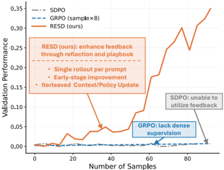
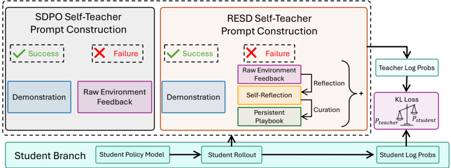

# resd — Learning with Rare Success but Rich Feedback via Reflection-Enhanced Self-Distillation (RESD)

- **arXiv/链接**: arXiv:2605.12741v1 — https://arxiv.org/abs/2605.12741 ；代码 https://github.com/horizon-llm/RESD
- **机构/作者**: Yuwei Zhang、Sha Li、Changlong Yu、Qin Lu、Shuowei Jin、Chengyu Dong、Haoran Liu、Ilgee Hong、Xintong Li、Zhenyu Shi、Bing Yin、Jingbo Shang。机构：UC San Diego、Amazon、Georgia Tech（部分为 Amazon 实习期间完成）。
- **发表/时间**: 2026-05-12（arXiv preprint）
- **主题/相关性**: 在线策略自蒸馏（OPSD/SDPO）在稀疏成功（rare-success）下的改进。与 mtp_opd/TSRD 高度相关——把失败反馈转为可复用的纠错监督（"路径修复"思想），且提出"反思+playbook"为可插拔模块。

## 关键图示

**① Motivation / 对比图**

*Figure 1: RESD improves interaction efficiency during training. The x-axis is the number of samples.*

**② 方法 / 架构图**

*Figure 2: Overview of the RESD framework. The student generates a rollout and receives environment feedback. On failure, a local self-reflection diagnoses the error and a global playbook curation step distills reusable lessons into a persistent playbook. The enriched context (reflection, curated pla*

## 1. 开源代码链接
https://github.com/horizon-llm/RESD （已克隆约 52MB；含 verl 源码、selfevolve 模块、docker、environment.yml；含 paper.pdf）。Notion 博客与项目页见 README。

## 2. 使用框架
基于 veRL（volcengine/verl）与 SDPO（lasgroup/SDPO）。维护两个持久化上下文：**playbook**（受 ACE 思想启发，存储从失败中提炼的可复用经验条目）与**可选的 solution buffer**（缓存成功轨迹）。核心代码在 `selfevolve/` 与 `verl/`。

## 3. 研究背景
让 LLM 通过与环境交互持续自我改进是后训练核心挑战。RL（PPO/GRPO）在多步任务上受困于稀疏奖励；成功轨迹极少时缺乏稠密监督来引导探索。OPD/自蒸馏（SDPO）用同规模"自教师"条件于特权信息，把稀疏的轨迹级结果转为稠密 token 级信号，且消除外部教师与分布失配。

## 4. 当前存在的问题
现有自蒸馏把环境反馈当作"被动条件变量"，严重依赖成功示范。作者通过消融发现：当 rollout batch size N=1（无同组成功 peer 示范）时，SDPO 性能大幅退化——说明教师难以仅凭原始失败反馈构造有效纠错分布。在 rare-success（每 rollout 成功率极低）下尤其严重，因为多数 rollout 组只含失败、无正反例。

## 5. Motivation
问题不在"缺反馈"而在"反馈如何被表示和使用"。原始失败信号往往是诊断性而非指导性的（只说明失败、不说明哪一步导致失败）。需从"被动暴露反馈"转向"主动理解反馈"：(a) 回溯性解释失败轨迹，把最终反馈连到导致失败的中间推理；(b) 跨轨迹保留有用经验（很多失败是同一隐藏规则的重复表现）。

## 6. 主要方法
RESD 在自蒸馏循环中算子化"主动反馈理解"：

- **回溯反思（REFLECT）**：对失败 rollout 生成自然语言反思 r，定位失败的可能原因与本应采取的修正；同时对已有 playbook 条目打 helpful/harmful/neutral 标签。
- **playbook 策展（CURATE/CONCISE）**：playbook 是持久化的自然语言经验条目集；CURATE 由反思生成非冗余新条目，每条维护 (helpful, harmful) 计数；CONCISE 在每次更新前剪枝（删除净 harmful 条目、超预算时驱逐最久未标记条目）。
- **记忆增强自蒸馏**：teacher 经 EMA 与 student 同步，条件于"富化上下文"（playbook P、反思 r、上次 trial y、反馈 c、buffer 解 B(x)）产出 token 级监督；学生最小化统一的 f-散度自蒸馏目标 L_SD（可取 forward/reverse KL 或 JSD），并对成功样本按 batch 成功率施加 per-sample 加权。因 P、B 跨步持久，即使当前 batch 无成功示范，监督也能随训练改善。

## 7. 实验数据集
4 个面向"持续学习/分布外"的任务（带丰富执行反馈但二值稀疏奖励）：MANUFACTORIA-HAS（写 DSL 程序判断输入带是否含目标模式，742 训/132 测）、BOUNCINGSIM-EASY（写 Python 模拟 2-D 多物体弹跳动力学-易，640 训/100 测）、BOUNCINGSIM-MEDIUM（同上-中，320 训/100 测）、FINER（用 XBRL 标签标注 SEC 财报中的金融命名实体，1000 训/500 测）〔已核-论文 Table〕。各任务初始成功率差异大（如 BOUNCINGSIM-MEDIUM/部分任务初始成功率极低、近稀疏成功 regime，其余较高），以考察两种 regime。骨干：Qwen3-4B（多数任务）/ Qwen3-30B（BOUNCINGSIM-MEDIUM，见 selfevolve/ 脚本）。

## 8. 怎么做的(训练/数据/流程)
在线流式（online streaming）协议。训练循环（Algorithm 1）每步：采样 rollout y~π(·|x)→取环境反馈 c 与奖励 R→上下文更新阶段（先 CONCISE 剪枝 P；失败则 REFLECT+CURATE 扩展 playbook，成功则更新 solution buffer 并置 r=∅）→teacher EMA 同步→teacher 条件于富化上下文产出 log-prob→学生最小化 L_SD 更新。实验表明：RESD 显著超过标准自蒸馏基线；仅用单 rollout/prompt 即可比用 8× 样本的 GRPO 更快实现早期提升（交互效率更高）；SDPO+Ref(N=1) 可恢复并超过 SDPO(N=8)，主要靠减少"完全错误"的 prompt 数量。结构化反馈支持从失败中样本高效 bootstrap，奖励优化在成功 rollout 足够后作为互补工具。
