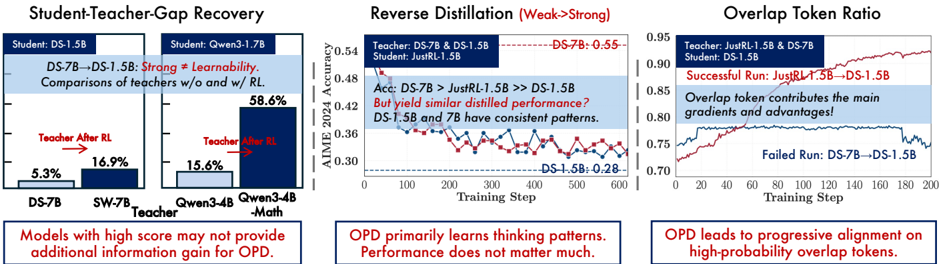
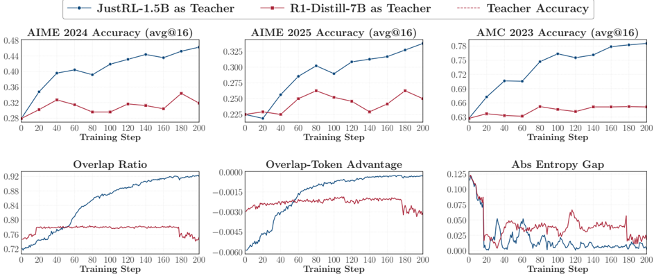

# rethink_opd — Rethinking On-Policy Distillation of Large Language Models: Phenomenology, Mechanism, and Recipe

- **arXiv/链接**: arXiv:2604.13016 (v2, 2026-04-15);代码 https://github.com/thunlp/OPD
- **机构/作者**: 清华大学(THUNLP)+ 上海科技大学 + UIUC + 中国人民大学。Yaxuan Li、Yuxin Zuo、Bingxiang He(共同一作)、Jinqian Zhang、Chaojun Xiao、Cheng Qian、Tianyu Yu、Huan-ang Gao、Wenkai Yang、Zhiyuan Liu、Ning Ding(通讯)。
- **发表/时间**: arXiv 预印本,2026-04;已被 ICML 2026 FoGen Workshop 接收。
- **主题/相关性**: T1, T4(High)。直接研究 OPD 的训练动力学/成败机理,与本项目 OPD 主线高度相关;其"思维模式一致性""高分≠新知识""token 级 overlap 机制""off-policy cold start"等结论可直接为 TSRD 中 path-selection / path-recovery 设计提供理论依据。

## 关键图示

**① Motivation / 对比图**

*Figure 1 | Overview of our paper. JustRL-1.5B is obtained by applying RL to DeepSeek-Distill-1.5B (DS1.5B), and Skywork-OR1-Math-7B (SW-7B) by applying RL to DeepSeek-Distill-7B (DS-7B).*

**② 方法 / 架构图**

*Figure 6 | Successful vs. failing OPD with the same student (R1-Distill-1.5B) and two teachers. Top: avg@16 accuracy on three benchmarks. Dashed lines indicate teacher performance. Bottom: three dynamics over training. Successful distillation (JustRL-1.5B) shows rising overlap and narrowing entropy*

## 1. 开源代码链接
https://github.com/thunlp/OPD(已克隆,约 195MB,含 verl fork + LlamaFactory)。该仓库的 top-k OPD overlap 诊断指标(`distillation/overlap_ratio`、`distillation/overlap_token_advantage`)已合并入官方 verl(PR #6469)。

## 2. 使用框架
主体基于 **verl (v0.7.0)** 做 OPD 与 RL(GRPO);**LlamaFactory (v0.9.5)** 做 SFT(cold start)。rollout 用 vLLM,verifier 用 math-verify。评测复用 thunlp/JustRL 的 pipeline。OPD 通过自定义 `ADV_ESTIMATOR=token_reward_direct` 实现,teacher 作为 reward model 提供 token 级 reward。

## 3. 研究背景
OPD 已成为 LLM 后训练的核心技术(Qwen3、MiMo、GLM-5 均采用),Thinking Machines Lab 也以极低 RL 计算成本复现了 Qwen3 OPD recipe。与离策略蒸馏(在固定 teacher 序列上训练、有 exposure bias)不同,OPD 让学生自采样 rollout,用 teacher 的逐 token log-prob 作为 dense reward,在学生实际访问的状态上修正其行为。但 OPD 的训练动力学仍缺乏理解。

## 4. 当前存在的问题
存在显著失败模式:更强的 teacher 反而可能完全无法提升学生,而更弱的 teacher 却能成功。少有研究解释 teacher 的 token 级信号为何/何时能把学生分布推向期望方向,以及失败的条件。

## 5. Motivation
系统性刻画 OPD 的成败条件(现象学)→ token 级机制 → 可落地的修复 recipe,并揭示 dense 监督的代价(长程/agentic 设定下的可扩展性)。

## 6. 主要方法
分三层递进:

- **现象学(§3)**:提出两条支配 OPD 成败的经验条件——(i) 思维模式一致性(师生 top-k 分布的 overlap ratio 要高,即使 teacher 分数更高,模式不匹配导致初始 overlap 低则训练无法挽回);(ii) 高分≠新知识(若师生用同数据/recipe 训练会收敛到同尺度的相似分布,teacher 缺少可迁移信号;只有 teacher 携带学生未见过的知识时 OPD 才有大增益)。通过 weak-to-strong 反向蒸馏验证:同族 1.5B 与 7B teacher 从学生视角分布上"不可区分",证明 OPD 本质学的是思维模式而非分数。
- **机制(§4)**:定义 Overlap Ratio、Overlap-Token Advantage、Entropy / Entropy Gap 等动态指标。成功 OPD 的签名是 student-visited states 上分布渐进对齐:高概率 token 的 overlap ratio 从约 72% 升到 91%,熵差收窄,共享 top-k token 集中了 97%–99% 的概率质量。失败 run 则 overlap 停滞、熵差持续。进一步证明仅用 overlap token 监督即可匹配 full top-k 性能,说明 overlap 集是 OPD 梯度信号的主要来源。给出三种监督粒度的统一刻画:sampled-token OPD(单样本无偏估计逐 token reverse KL)、full-vocabulary OPD、top-k OPD(在学生 top-k 子集上重归一化后算子集 KL)。
- **Recipe(§5)**:两个互补修复策略——(i) **off-policy cold start**:OPD 前先在 teacher 生成的 rollout 上做 SFT warmup,抬高初始 overlap ratio;(ii) **teacher-aligned prompt selection**:用取自 teacher 后训练数据的 prompt 锐化高概率 token 对齐,但会显著降低学生熵,需要混入 OOD prompt。两者恢复的 run 都呈现与天然成功 run 相同的动态签名。
- **代价(§6)**:reward 质量随轨迹深度系统性退化,不稳定起于靠后 token 并向前传播;即便失败 teacher 其 reward 仍与 rollout 正确性全局相关——说明失败不是信号质量问题,而是局部优化几何(更大 teacher 在学生策略附近诱导出局部平坦的 reward landscape),揭示监督密度与监督可靠性的根本张力,指向当前 OPD 在长程推理/agentic 上的局限。

## 7. 实验数据集

- 训练:DAPO-Math-17K(主)、DeepMath-103K(对比/cold-start 互补 prompt,需对 DAPO-Math-17K 去重)、OpenThoughts3-1.2M 的 math 子集(用于 teacher rollout → 学生 SFT cold start,发布为 OpenThought3-Qwen3-4B 数据集)。
- 评测:AIME 2024、AIME 2025、AMC 2023(math 竞赛级,avg@16)。
- 模型:学生 Qwen3-1.7B / DeepSeek-Distill-1.5B(DS-1.5B);teacher 含 Qwen3-4B(Non-thinking)、Qwen3-4B-Math、DS-7B、JustRL-1.5B(=对 DS-1.5B 做 RL)、Skywork-OR1-Math-7B(SW-7B=对 DS-7B 做 RL)。发布 Qwen3-1.7B-SFT、Qwen3-4B-Base-GRPO 等 checkpoint。

## 8. 怎么做的(训练/数据/流程)

- OPD:`bash on_policy_distillation.sh`,`ADV_ESTIMATOR=token_reward_direct`,teacher 作为 REWARD_MODEL 提供 token 级 reward;关键超参 N_RESPONSES=4、MAX_RESP_LENGTH=7168、`LOG_PROB_TOP_K=16`(置 0 退化为 sampled-token OPD)、`TOP_K_STRATEGY=only_stu`(可选 only_tch/intersection/union/union-intersection)、`REWARD_WEIGHT_MODE=student_p`(可选 teacher_p/none)。
- SFT(cold start):用 `scripts/infer/vllm_rollout.py` 让 teacher(如 Qwen3-4B Non-thinking)对 OpenThoughts3 math prompt 做带 rejection sampling 的 rollout,再用 LlamaFactory 对学生(如 Qwen3-1.7B-Base)做 full SFT。
- RL 对照:GRPO,设 `ADV_ESTIMATOR=grpo` 且 `LOG_PROB_TOP_K=0`(`grpo.sh`)。
- 评测:复用 JustRL 的 gen_vllm.py + grade.py(可开 LLM verifier)。
- 硬件:8×NVIDIA A800 80GB。
- 注意:作者指出 verl v0.7.0 内置 validation 会低估性能 5–7 个百分点,建议 `test_freq=-1` 关闭在训验证、`MAX_VAL_RESP_LENGTH=MAX_RESP_LENGTH`,改用 scripts/val/ 单独评测(v0.8.0 已修)。
