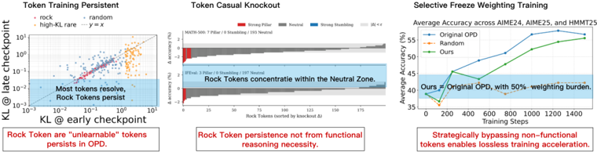
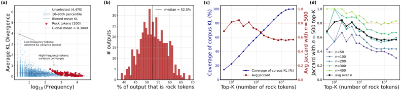

# rock_tokens — Cornerstones or Stumbling Blocks? Deciphering the Rock Tokens in On-Policy Distillation

> **一句话重点 (TL;DR)**：OPD 训练表观饱和后仍有约 6% 词表、占输出 18% 频次的 token 持续高 KL loss（"Rock Tokens"，多为结构/话语脚手架），它们贡献了不成比例的梯度但对实际推理性能功能贡献可忽略；从训练起冻结其梯度可在不掉点下精简对齐（约 1.4× 加速）。

**元信息**：arXiv 2605.09253（v2, 2026-05-29）｜ UMBC + Case Western Reserve + Arizona State + VU Amsterdam（Yuxuan Jiang、Runchao Li、Shubhashis Roy Dipta 共同一作；Dawei Li；通讯 Zhao Yang）｜ Preprint, 2026-05 ｜ 主题 OPD token 级动力学 / T1(Med)（与本项目 token 级监督/梯度分配、path-selection 分析互补）｜ 代码 https://github.com/YuxuanJiang1/Rock-Token（已克隆 ~7.4MB，三目录 `KDFlow_localopd`/`rock_detection`/`stumbling`）｜ 框架 自定义 KDFlow（SGLang+Ray+FSDP2+bf16）

## 关键图示

**① Motivation / 对比图**

*Figure 1: The lifecycle and functional impact of Rock Tokens in OPD. (a) Phenomenon : Identification of optimization-resistant tokens. (b) Mechanism : Causal evidence of structural redundancy via token knock-out. (c) Utility : Performance parity achieved through strategic gradient sparsification.*

**② 方法 / 架构图**

*Figure 2: Empirical identification and stability of Rock Tokens. (a) Per-token KL ̂ ℓ v vs. frequency on N =500 MATH-500 trajectories: rare tokens are noise-dominated, while the Rock Score R ( v ) isolates true Rock Tokens (red) at the upper edge of stable frequency bands. (b) Per-sequence Rock-Toke*

## 1. 相关工作与进展
On-Policy Distillation (OPD) 已成现代 LLM 后训练基石（DeepSeek-V4、MiMo、Qwen-3 等在 SFT/RLVR 之外用它进一步榨取推理性能）。RLVR 侧研究已揭示 token 非等价：少数 critical/高熵"forking tokens"不成比例地驱动推理增益。但 OPD 的 token 级理解仍少被探索——尽管 OPD 本质依赖 dense 全 token 监督。

## 2. 现有工作存在的问题
OPD 的 per-token KL loss 中，high-loss token 是师生失配最直接的信号，按既有理解应随训练收敛而减少。作者实证发现相反现象：即便训练到表观饱和，仍有一批 token 持续高 loss（Rock Tokens），约占词表 **6%**、却占输出 token 频次的多达 **18%**。两大悖论：(1) 因高频，它们贡献了不成比例大份额的总梯度范数，自身却在训练中停滞、抵抗 teacher 修正；(2) 因果干预（token knock-out）显示其对实际推理性能功能贡献可忽略。大量优化带宽花在学生学不会也不必学的结构/话语残差上。

## 3. Motivation
回答标题之问：Rock Tokens 究竟是策略对齐不可或缺的"基石（Pillars）"还是制造冗余的"绊脚石（Stumbling Blocks）"，并据此挑战 OPD 均匀 token 加权的必要性，给出更高效的蒸馏范式。

## 4. 主要灵感 / 核心直觉

- 借鉴 RLVR 的"token 非等价"思路反向追问 OPD：高 loss ≠ 高价值。
- **path dependency 假设**：学生对结构脚手架 token 形成强解码依赖以维持推理流，从而顽固抵抗 teacher 修正——这是一种内部优化偏置，而非缺乏建设性学习信号。
- 用 token knock-out 把"梯度成本"与"功能贡献"解耦验证。

## 5. 主要解决思路(一段话讲清核心)
分 What / Why / How 三阶段拆解 Rock Tokens：先用 Rock Score 在 MATH-500 轨迹上识别它们的身份（What），再用 token knock-out + path dependency 解释其持久性来源（Why），最后从训练一开始就冻结这些 token 的梯度（gradient sparsification）来隔离其真实功能必要性并实现加速（How）。围绕三个研究问题 RQ1（训练中是否仍提供有用信号）、RQ2（持久性是否源于学生 path dependency）、RQ3（从一开始排除会怎样）。

## 6. 方法详解(通俗、分步骤)

- **Rock Score 识别（What）**：per-token KL b_{ℓv} = E[D_KL(πθ‖πT) | x_t=v]（用学生 rollout 估计），在 N=500 MATH-500 轨迹上计算。结合 KL 覆盖（蓝）与跨样本选择稳定性（红）的交点定 **top-K=100**——该边界覆盖约 60% 的语料级 KL 蒸馏负担，且在 n∈[50,400] 下稳定（更大 cutoff 反而退化）。识别出的 Rock Tokens 主要是句法/结构脚手架：格式分隔符、空白符号、高频话语标记（如 "So"、"Wait"）；rare token 则是噪声主导。
- **机制检验（Why）**：用 token knock-out（推理时屏蔽该 token）测功能贡献，按 Δaccuracy 把 token 分为 **Pillar / Neutral / Stumbling**（|Δ|<ε 为 Neutral）。结果绝大多数落在 Neutral（如 MATH-500：7 Pillar / 0 Stumbling / 193 Neutral；IFEval：3 Pillar / 0 Stumbling / 197 Neutral），证明它们既非不可或缺也非有害，而是"冗余"。结论：持久性源于学生主动保护这些 token 以维持推理流的 path dependency。
- **利用（How）**：从训练起冻结这些高成本 token 的梯度（gradient sparsification）。对 30% 高成本 token 做 freeze-weighting 取得 **1.4× wall-clock 加速**且性能持平（performance parity）；对照 Random 冻结则 ΔKL 呈对称噪声、无净变化。

## 7. 实验数据集

- 训练（两阶段蒸馏）：Stage 1 离策略用 **OpenThoughts3 的 20k** teacher 生成解；Stage 2 在线策略从另外 **10k** prompt（位置 20k–30k 切片）采样、分 7 个 checkpoint。
- 评测（LM-Eval-Harness，zero-shot，Pass@1 取 5 次独立运行平均）：竞赛数学 **AIME 24 / AIME 25 / HMMT 25-Feb**（来自 MathArena，各 30 题、合 90 题为主指标）；扩展到 MATH-500、IFEval 以获大样本 token 级统计。
- 模型：teacher = **Qwen3-30B-A3B-Instruct-2507**（MoE，3B active）；student = **Qwen3-4B-Instruct-2507**；师生均关闭 thinking 模式。

## 8. 实验结果与主要发现

- **What**：Rock Score 能从频率-KL 平面上分离出真正的 Rock Tokens（高频高 KL），K=100 是覆盖/稳定的最佳交点（≈60% KL 负担）。
- **Why**：knockout 显示 Rock Tokens 几乎全为 Neutral（极少 Pillar、零 Stumbling），说明它们对推理正确性无关键贡献；学生对其的固守是 path dependency 而非有用信号。
- **How (RQ3)**：从训练起冻结其梯度，ΔKL 分布精确集中于零（Panel d），性能与原 OPD 持平（Fig.5：Original OPD ≈ Ours，Random 控制无效），并获 1.4× 加速。

## 9. 结果如何支撑其主张
"基石 vs 绊脚石"之问由 knockout 的 Pillar/Stumbling/Neutral 分类直接回答（绝大多数 Neutral → 既非基石亦非绊脚石，是冗余）。"挑战均匀加权"由从训练起冻结仍保持 performance parity + 1.4× 加速支撑，逻辑闭合。Random 对照排除了"冻结任意 token 都无害"的平凡解释。

## 10. 逻辑自洽性(中性评估)
三阶段 What→Why→How 因果链清晰；Rock Score 的选择稳定性分析与 knockout 因果证据、freeze 实验三者相互印证。Neutral 主导的结论与"冻结不掉点"自洽。论证为"诊断—解释—利用"标准范式，结论稳健。

## 11. 残留问题 / 局限

- 仅在单一师生对（Qwen3-30B-A3B → Qwen3-4B）、关闭 thinking 模式下验证；对开启 thinking、不同 tokenizer/词表、更大跨度师生的泛化未验证。
- knockout 是推理时屏蔽，与"训练时冻结梯度"是两种不同干预；"功能贡献可忽略"主要基于数学/IFEval 任务的准确率指标，对更依赖格式/话语连贯的任务（长文档、对话）未必成立。
- Rock 检测依赖 MATH-500 轨迹与最终 checkpoint 的 KL，跨任务 Rock 集合的迁移性〔待核〕。
- 1.4× 加速来自对 30% 高成本 token 的 freeze-weighting，与"top-K=100 Rock Tokens"两个口径需注意区分（前者为成本驱动的更宽集合）。

## 12. 开源代码与框架(链接+框架+代码可得性)

- 链接：https://github.com/YuxuanJiang1/Rock-Token（已克隆 ~7.4MB）。三目录：`KDFlow_localopd`（训练框架）、`rock_detection`（Rock token 检测/logit 计算）、`stumbling`（冻结梯度实验）。
- 框架：自定义 **KDFlow**（songmzhang/KDFlow，arXiv:2603.01875）；后端 **SGLang + Ray + FSDP2 + bf16**（requirements: sglang、sglang_router、ray≥2.0、torch≥2.4、ring_flash_attn、peft；docker SGLang 0.5.9 / torch 2.9.1 / CUDA 12.8）；评测 LM-Evaluation-Harness。KDFlow_localopd README 致谢明确：模型封装/分布式抽象沿用 **OpenRLHF**（`model.py` 注 "modified from OpenRLHF/openrlhf/models/actor.py"），on-policy KD 的 Ray placement-group 初始化与 SGLang 权重更新借鉴 **slime**（多处 "following slime" 注释），rollout 用 SGLang。即 OpenRLHF(训练抽象)+slime(on-policy KD)+SGLang(rollout)。
- 可得性：训练/检测/冻结三套实验代码齐备；硬件 4×H100(80GB)，FSDP2+bf16+gradient checkpointing，超参沿用 KDFlow 默认（Appendix C）。
