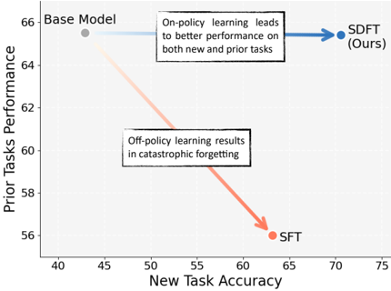
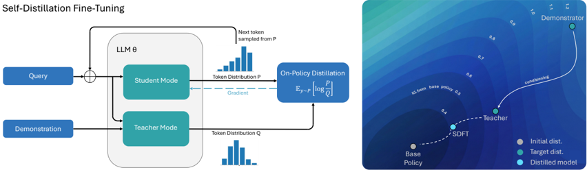

# sdcl — Self-Distillation Enables Continual Learning (SDFT)

> **一句话重点 (TL;DR)**：把"示范条件化的同一模型(EMA)"当自己的 teacher,在 student(只看 query)的 on-policy rollout 上做 token 级 KL 蒸馏,把 off-policy 的专家示范转成 on-policy 学习信号,从而在学新技能/新知识时显著少遗忘——是 privileged-context self-distillation 家族用于持续学习的实例。

**元信息**：arXiv 2601.19897 (v1, 2026-01-27, cs.LG) ｜ MIT + Improbable AI Lab + ETH Zurich(Idan Shenfeld、Mehul Damani、Jonas Hübotter、Pulkit Agrawal) ｜ arXiv 预印本 ｜ 主题 T1(On-Policy Distillation / 持续学习),与本项目 OPD 主线高度同源(privileged 信息=专家示范,与 copsd/opsa 同族) ｜ 代码 github.com/Continual-Intelligence/Self-Distillation(README 现给该 clone URL;主页 idanshenfeld.com/SDFT) ｜ 框架 TRL 0.24.0

## 关键图示

**① Motivation / 对比图**

*Figure 1: Supervised Fine-Tuning (SFT) is commonly used to learn from expert demonstration datasets, but its off-policy nature leads to catastrophic forgetting of general capabilities. We introduce SelfDistillation Fine-Tuning (SDFT), which turns expert demonstrations into on-policy learning signals*

**② 方法 / 架构图**

*Figure 2: (Left) SDFT leverages a model's in-context learning ability to generate on-policy training signals. For each query x , the model acts in two roles. A student that is conditioned only on the query P = π ( ·| x ) and the teacher, which is the same model conditioned on an expert demonstration*

## 1. 相关工作与进展
基础模型部署后静态、难增量学。已有路线:on-policy RL 可减遗忘但需显式 reward(常不可得);从示范学习的主流是 **SFT**(本质 off-policy);IRL(先学 reward 再 on-policy RL)不 scale。本文方法与 GKD、context-distillation/RL-from-distilling-context 同源——核心 trick(条件化 teacher + on-policy 蒸馏)此前已出现,贡献在"用于 continual learning 防遗忘"的定位与系统实验。

## 2. 现有工作存在的问题
- SFT off-policy → 顺序学新任务时旧能力崩(灾难性遗忘)。
- RL 需要 reward,纯示范学习场景没有。
- IRL 类(先学 reward 再 RL)不 scale。

## 3. Motivation
关键观察(图 2 右):把模型 **condition 在专家示范上**得到的 teacher 分布,比直接 SFT 目标分布更接近 base 模型分布——而越接近预训练分布的更新遗忘越少。于是用"示范条件化的同一模型"作 teacher,在 student(只看 query)的 on-policy rollout 上蒸馏,把 off-policy 示范转成 on-policy 信号。

## 4. 主要灵感 / 核心直觉
ICL 把示范"软化"进分布,得到一个既懂新任务、又仍贴近预训练分布的 teacher;在 student 自采样轨迹上对齐到该 teacher,既学到新技能又不偏离原能力。

## 5. 主要解决思路(一段话讲清核心)
对每个 query x:student P=π_θ(·|x);teacher Q=π(·|x, c),c 为用固定 in-context 模板注入的专家示范(作"一个示例",避免逐字复制)。next token 从 P 采样(on-policy),最小化 student 与 teacher 的 token 级 KL。teacher 权重默认取 student 参数的 **EMA**(§3/§4.6 消融,非字面"同一当前模型")。论文形式化论证其等价于 on-policy RL,隐式 reward r(y,x,c)=logπ(y|x,c) − logπ_k(y|x)(§3.1 "Self-Distillation as Inverse RL",ICL 假设 π*_{k+1}≈π(·|x,c))。

## 6. 方法详解(通俗、分步骤)
1. student 只看 query 生成 on-policy rollout;
2. 同一模型(EMA)condition 在 query + 示范上得 teacher 分布;
3. 在 rollout token 上做 token 级 KL,更新 student。
4. **KL 方向(重要修正,见 §10/§11)**:论文正文写**反向 KL(reverse KL)**;但仓库 README(04/07/26 errata)声明**论文全部结果实为 forward KL(GKD 式) per-token 损失**,且仓库默认即 forward KL。配置 `distil_config.py`:`alpha`(0=forward KL〔默认〕、1=reverse KL、中间=JSD)、`beta`(KL 系数,默认 0 即不载 reference model)。`main.py` 默认 base = `Qwen/Qwen2.5-7B-Instruct`,默认 1 epoch、lr 2e-5,**未暴露 alpha CLI 参数 → 走 config 默认 forward KL**。

## 7. 实验数据集
- **Skill Learning(3 域)**:Science Q&A(SciKnowEval Chemistry L-3)、Tool Use(ToolAlpaca)、Medical(HuatuoGPT-o1 stage-1 训练 / stage-2 评测)。
- **Knowledge Acquisition**:2025 年自然灾害 Wikipedia 语料(超模型 cutoff)生成 QA;额外测 OOD"间接问题"考察知识是否真内化;全文超 context window 时与 oracle-retriever RAG 对照。
- **遗忘评测**:HellaSwag/TruthfulQA/MMLU/IFEval/Winogrande/HumanEval 均值。
- **顺序学三技能**:Tooluse→Science→Medical。
- 主实验 base = Qwen2.5-7B-Instruct;scaling 用 Qwen2.5 家族 3B/7B/14B;§4.5 reasoning 用 Olmo-3-7B-Think。

## 8. 实验结果与主要发现
- **Knowledge Acquisition(Table 1)**:SDFT strict **89** / lenient **100** / OOD **98**,远超 SFT(80/95/80),逼近 Oracle RAG(91/100/100);CPT 仅 9/37/7。OOD 间接问题上优势更明显,说明 SDFT 真正内化而非记忆。
- **Skill Learning**:SDFT 在 new-task accuracy 与 prior-task 保持上同时优于 SFT/DFT(Pareto 更优);顺序学三技能不退化。
- **规模效应**(图):**3B = −3.3**(ICL 弱反不如 SFT)、7B = **+4.0**、14B = **+6.9**——增益随 base 模型 ICL 能力增强。
- **§4.5 reasoning(Olmo-3-7B-Think, Table 2)**:无 CoT 标注的 medical answer-only 数据上,SFT 掉点(31.2→23.5)且缩短输出(4612→3273 tokens),SDFT 反升到 **43.7**(4180 tokens)。
- **代价**:约 **2.5× FLOPs**、**~4× wall-clock**(需 on-policy rollout)。
- **图 7 消融**:teacher 同时条件化于"文章+答案"(89% strict)显著优于仅条件化文章(75%)或仅答案(37%)。

## 9. 结果如何支撑其主张
"on-policy 蒸馏防遗忘"由 Skill Learning Pareto 优、顺序学不退化支撑;"真正内化知识"由 OOD 间接问题 98 vs SFT 80 支撑;"依赖 base ICL 能力"由 3B/7B/14B 单调趋势支撑;"对 reasoning 模型保持长 CoT"由 Olmo 实验支撑。支撑较充分,但下述 KL 方向 errata 削弱了"reverse-KL/inverse-RL"理论框架与实证的对应关系。

## 10. 逻辑自洽性(中性评估)
理论(§3.1 把 reverse-KL 蒸馏等价于 on-policy RL/inverse-RL)与方法叙事自洽——**但仅在 reverse KL 假设下成立**。仓库 errata 表明实际跑的是 forward KL,这与 §3.1 的等价性推导**前提不符**:forward KL(GKD 式)是 mode-covering、不再对应论文给出的那条 inverse-RL 等价链。即论文的理论分析与其报告结果所用损失存在方向性脱节(作者已承认并承诺更新 arXiv)。这是本方法当前最大的自洽性瑕疵。增量层面也偏小:核心 trick 此前已在 GKD/context-distillation 出现,贡献主要在定位与实验。

## 11. 残留问题 / 局限
- **〔代码-论文差异,本轮发现,关键〕** 论文正文称 **reverse KL**,但仓库 README(04/07/26)errata 明言"所有论文结果实为 **forward KL(GKD 式)per-token 损失**",且 `distil_config.py` 的 `alpha` 默认 0.0=forward KL、`main.py` 不暴露该参数。⇒ 论文方法描述与实际实现/结果的 KL 方向相反,§3.1 inverse-RL 等价推导的前提(reverse KL)与实测不一致。上一轮分析按论文写"reverse KL",需据 errata 更正。
- teacher 权重为 EMA 而非字面"同一当前模型";`beta=0` 默认不载 reference,KL 约束仅来自 teacher 分布本身。
- 小模型(3B)因 ICL 能力弱反而**劣于 SFT**(−3.3),方法对 base ICL 强依赖,适用范围受限。
- 2.5× FLOPs / 4× wall-clock 的训练成本显著高于 SFT。
- Knowledge Acquisition 语料仅 ~200K tokens 的窄域(2025 自然灾害),泛化到大规模知识注入未验证。

## 12. 开源代码与框架(链接+框架+代码可得性)
- 仓库:README 现给 clone URL `https://github.com/Continual-Intelligence/Self-Distillation`(上一轮记 `github.com/idanshen/Self-Distillation`,可能已迁移/镜像;主页 idanshenfeld.com/SDFT)。本地已 clone。
- 框架:**TRL 0.24.0**(`requirements.txt` 钉死 `trl==0.24.0`)。`distil_trainer.py:157` 定义 `DistilTrainer(BaseTrainer)`,用 `trl.extras.vllm_client.VLLMClient` 做 on-policy 生成。
- 文件:`distil_trainer.py`、`distil_config.py`(alpha/beta/EMA ref-sync 参数)、`main.py`(入口,默认 Qwen2.5-7B-Instruct / lr 2e-5 / 1 epoch)、`eval_science.py`/`eval_tooluse.py`、`data/`。遗忘指标用 EleutherAI lm-evaluation-harness(指定 commit)。
- 代码可得性:Tier A(可跑),覆盖 tooluse/science 训练+评测;但 KL 方向 errata 需复现者注意(默认 forward KL,非论文所写 reverse KL)。
