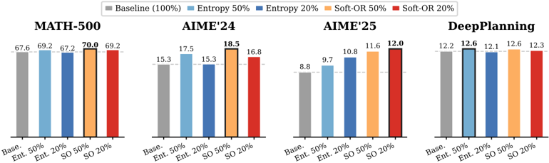
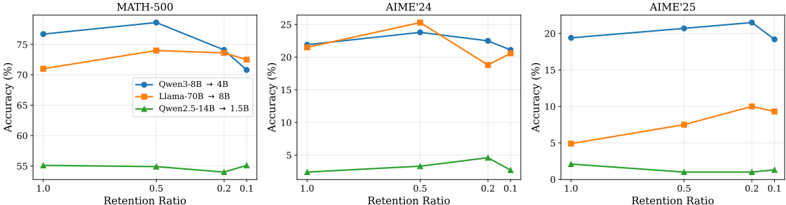

# tip — TIP: Token Importance in On-Policy Distillation

> **一句话重点 (TL;DR)**：OPD 中"哪些 token 有学习信号"由两轴决定——学生熵 ht 与师生散度 δt；熵单轴是有效但结构性不完整的代理，会漏掉"低熵高散度=过度自信错误"的 Q3 盲区；用免参数 Soft-OR 评分把两轴并起来做 top-k token 选择，可在大幅省显存的同时匹配/超过全 token OPD。

**元信息**：arXiv 2604.14084（v4, 2026-05-21，cs.LG）｜ Princeton（通讯 Yuanda Xu）+ 多名共同一作（Hejian Sang、Zhengze Zhou、Ran He、Zhipeng Wang、Alborz Geramifard，部分工业界）｜ Preprint 2026-04 ｜ 主题 OPD 中 token 级重要性选择，与 MTP/OPD 直接相关（"低熵+高散度=过度自信错误"恰是 MTP 前瞻探针可能想捕捉的对象）｜ 代码 https://github.com/HJSang/OPSD_OnPolicyDistillation （已 clone ~390K，**通用 OPSD 仓库**，同挂 TIP/PACED/Sparse-to-Dense，非 TIP 专属，TIP 为在此扩展实现）｜ 框架 verl

## 关键图示

**① Motivation / 对比图**

*Figure 1: Cross-task summary: average accuracy by selection method. Each panel shows one benchmark; bar height is the mean accuracy (mean@16) averaged across three teacher-student pairs for mathematical reasoning (Qwen3-8B → 4B, Llama-70B → 8B, Qwen2.5-14B → 1.5B) and across two teacher sizes (14B,*

**② 方法 / 架构图**

*Figure 3: Entropy sampling across retention ratios. Accuracy (mean@16) on three benchmarks as a function of retention ratio. Retaining 50% of tokens with entropy-based sampling matches or outperforms the all-token baseline across model pairs. At very low retention, entropy-only selection begins to p*

## 1. 相关工作与进展

- **课程学习 / 重要性采样**：Bengio 2009 课程、Kumar 2010 self-paced 按难度排序/加权样本；Katharopoulos 2018 按梯度范数选 mini-batch、Ren 2018 元梯度学样本权重——均在**样本级**。TIP 把粒度推到**序列内单 token**，轴是学生不确定性与师生分歧而非标量难度。
- **off- vs on-policy KD**：序列级 KD（Kim&Rush 2016）训 teacher 生成序列（off-policy）；OPD（Agarwal 2024、Gu 2025）让学生跑自己 rollout、逐 token 监督，避免 train-test 失配。关键：OPD 中 token 重要性由学生自身分布决定，**不能从 teacher 输出预计算**，必须在线评估。
- **token 级重要性**：RL 中 high-entropy "forking tokens" 驱动多数梯度（Wang 2025c）、entropy collapse（Cui 2025）、SPINE 只更新决策分叉点；蒸馏中 AdaSwitch 按散度切换师生引导、Entropy-Aware OPD（Jin 2026）按 teacher 熵调 loss、AdaKD 的 LATF 按 teacher-student Hellinger 距离 top-r% 选择。**最相关是 AdaKD**：但其 LATF 单独只 +0.04 ROUGE-L，主要增益来自正交的温度模块 IDTS；TIP 论证 Q3 不是"大散度 token"的改名，而是低熵∧高分歧的合取（两轴诱导不同选择）。

## 2. 现有工作存在的问题
熵视角结构性不完整：只用学生熵筛 token，会**漏掉"学生自信但与 teacher 严重分歧"的 Q3 位置（低熵高散度，过度自信错误）**——这类 token 因低熵而与"已解决 token"无法区分，但携带密集纠错信号。论文证明（Prop.2）：任何非递减、f(0)=0 的熵单调评分都对 Q3 近乎赋零权。

## 3. Motivation
把 token 重要性放到 (学生熵 ht, 师生散度 δt) 两轴平面系统化，理论证明熵单轴的结构盲区，并给出**免参数、无额外计算**（两轴量在标准 OPD 训练中已算）的补救选择规则。

## 4. 主要灵感 / 核心直觉
信息性 token 来自两个区域：(1) 高学生熵（学生不确定、仍在成形）——熵可检测；(2) 低学生熵但高师生散度（学生自信却错）——熵不可见。从信号-曲率视角看：token 重要性 ∝ ‖梯度‖²/(梯度·Hessian·梯度)，Q3 的 numerator 可大（teacher 强烈反对自信预测），而近确定的学生分布给出小 softmax 曲率，故重要——但 Q4（自信且对）numerator 近零。Q3 vs Q4 是信号差异、非熵差异。

## 5. 主要解决思路(一段话讲清核心)
TIP 是诊断 + 选择规则：把每个 token 按 (ht, δt) 分到四象限（Q1 高熵高散度=最密纠错信号；Q2 高熵低散度=稳定欠自信；Q3 低熵高散度=过度自信盲区；Q4 低熵低散度=已解决可丢）。用**免参数 Soft-OR 评分** st=ĥt+δ̂t−ĥt·δ̂t（两轴 min-max 归一后，任一轴非零即非零）做 top-ρ 选择，只对选中 token 计标准 reverse-KL OPD loss。

## 6. 方法详解(通俗、分步骤)

- **两个轴**（论文 Eq.2/3）：学生熵 ht=H(P_S)/log|V|∈[0,1]；师生散度 δt=D_KL(P_S‖P_T)，即 per-token 训练 loss 本身（无额外计算）。
- **四象限统计高度不均衡**（§4）：Q4 约 40–47% token，Q1+Q2 合计约 40–52%，**Q3 仅 3–15%** 但携带超比例纠错信号。
- **理论三结论**：Prop.1 oracle 权重 w\*_t=φ̄_t/(ηβ M̄_t)（φ̄_t=⟨∇L,μ̄_t⟩，M̄_t=E‖g_t‖²）压制 Q4、对 Q1/Q3 给正权；Prop.2 熵单调评分对 Q3 结构盲；Remark 1 Soft-OR 恢复 Q3 覆盖同时压制 Q4。（Prop.1/2、Remark 1 编号已在论文 §5 + Table 2 逐字核到。）
- **选择 = 训练两种 KL 方向的精确区分（论文 §7.3，关键）**：用于 token **排序/选择**的散度是 **forward KL** δ^fwd_t=D_KL(P_T‖P_S)（理由：学生在某 token 近乎确定时 reverse-KL 对 teacher 偏好的其它候选不敏感，forward KL 直接惩罚漏掉的 teacher 概率质量、给出更锐利的 Q3 排序）；**训练 loss 仍是标准 reverse-KL** D_KL(P_S‖P_T)（Eq.1，mode-seeking、数值稳定、前向已算）。Q3-only 检测器 w^Q3_t=δ^fwd_t·(1−ĥt)。
- **仓库实现的散度轴**：通用 Soft-OR 选择器（`entropy_weighted_sample`/`_compute_per_token_entropy_and_jsd`）用的是**归一化 JSD**（weight=entropy_norm^α · jsd_norm^γ，JSD 支持 teacher top-K 截断减噪），三种**训练**散度 reverse_kl/forward_kl/jsd 经 `LOSS_FN_MAP` 切换；另有 `compute_teacher_token_stats` 区分"学生 OOD（teacher 熵高且 p_T(yt) 低）vs 真分叉点"。即论文 Q3 实验用 forward-KL 检测器、通用选择器用 JSD，两者都不是"δt 就是 reverse-KL"。
- **落地（§6）**：给定保留比 ρ，按 st top-K 选 token；选前对每 batch 熵 clip 顶 2% 再 min-max 归一，稳排序；额外成本仅 O(m log m) 排序，可忽略。

## 7. 实验数据集

- 数学推理：训练 prompt 来自 DAPO；评测 MATH-500（500 题）、AIME 2024/2025（各 30 题），mean@16。三组师生对：**Qwen3-8B(GRPO)→4B**、**Llama-3.3-70B-Instruct→Llama-3.1-8B-Instruct**、**Qwen2.5-14B-Instruct-thinking→Qwen2.5-1.5B-Instruct**（~9× 容量差、reasoning teacher）。
- Agentic 长程规划：DeepPlanning（多日旅行 + 多商品购物，需主动信息获取/局部约束推理/全局约束优化）；师生对 **Qwen3-{14B,32B}→Qwen3-1.7B**（均开 thinking，agentic 规划数据训练，15 epoch）；80/20 划分，Avg@16，按个性化硬约束满足比例打分。
- 训练统一 AdamW + cosine + reverse-KL，lr=1e-6（Qwen3/Qwen2.5）/3e-7（Llama）。

## 8. 实验结果与主要发现

- **Q1/Q2（熵选择，Table 3）**：保留 50% token 的熵采样匹配/超过全 token 基线于多数 benchmark（Qwen3 MATH 76.7→78.6，Llama 71.0→74.0），峰值显存最多降 47%（Qwen3 72.0→38.1 GB）；更激进保留时性能常掉到基线下（印证有信号留在被丢的低熵区）。
- **Q3-only（Table 4）**：只训低熵高散度 token（<10% 全 token），近乎追平全 token 基线（Qwen3 MATH 5.7K token 达 76.1 vs 76.7）。Q3 不是"大散度"——纯按 δt 选在等预算下不及基线、需 5× token 才追上（Appendix B.2 Table 8）。
- **Soft-OR（Table 5）**：数学上稳定优于熵单选（Qwen3 MATH 50% 达 79.1 vs 熵 78.6；AIME'24 25.7 vs 23.8）。top-50% vs bottom-50%（Table 6）证 bottom 信号显著更弱。
- **DeepPlanning（Table 7）**：熵 50% 匹配/超全 token OPD（14B：12.1 vs 11.7）；**最亮点 Q3-only 20% 反超全 token OPD（14B：12.6 vs 11.7；32B：13.6 vs 12.8）**——agentic 任务里单个自信错误（订已关场地/超预算）可作废整个计划，故 Q3 纠错特别集中。
- teacher 熵几乎恒定、对选择无判别力（§7.4）。

## 9. 结果如何支撑其主张
论文用 Table 2 把三条理论结论一一映射到实验：Prop.1→§7.2（Q1/Q2 携带最多信号、去 Q4 提效）、Prop.2→§7.3（熵漏 Q3）、Remark 1→§7.4（组合分恢复 Q3 且超熵单选）。三结论在 3 模型族 × 2 任务域上均被支持；最锐利的是 Q3 盲区——<10% 专门选过度自信的 token 近乎追平全训。DeepPlanning 上 Q3-only 20% 反超全 OPD 是最强的"两轴必要性"证据。

## 10. 逻辑自洽性(中性评估)
逻辑自洽且理论-实验对应工整：两轴诊断→四象限→证明熵盲区→免参数 Soft-OR 补救→分任务验证。forward-KL（选择）vs reverse-KL（训练）的方向区分论证清楚、动机正确，未混淆。oracle 权重是 population 量、不可直接用，作者诚实标注并用 Soft-OR 作可计算代理。Q3 与"大散度"的区分通过 budget-matched 对照（Table 8）切实排除了平凡解释。

## 11. 残留问题 / 局限

- 核心贡献是"诊断 + 选择规则"，方法本身是对既有熵选择的增量补丁（Soft-OR 在数学上提升量级有限，如 MATH-500 76.7→79.1@50%）。
- 共享 OPSD 仓库（同挂 TIP/PACED/Sparse-to-Dense）使复现归属略含糊；论文 Q3 检测用 forward-KL，而仓库通用选择器用 JSD，二者需对应留意。
- 作者自陈局限：最大 teacher 仅 70B、rollout 16K token；象限结构与 Q3 集中是否在万亿参数或极长 agentic tool-calling 流水线下持续，仍开放。
- 省显存卖点实在，但"无额外计算"指排序量可复用已算 logits，非零成本（仍有 clip+归一+top-k 排序）。

## 12. 开源代码与框架(链接+框架+代码可得性)

- 仓库 https://github.com/HJSang/OPSD_OnPolicyDistillation （已 clone，`src/opd/{losses.py,opd_worker.py,opd_trainer.py,batch_builder.py}`）。基于 **verl**：`opd_worker.py` 两阶段 teacher/student 显存调度、chunk 化散度（V=152K 时单 (N,V) float32 ~2.3GB，故分块）、remove-padding；GRPO 与 OPD 并存。
- `losses.py` 已核对：提供 `compute_reverse_kl_loss`/`compute_forward_kl_loss`/`compute_jsd_loss`（`LOSS_FN_MAP` 切换训练散度）、`entropy_weighted_sample`（weight=entropy_norm^α·jsd_norm^γ，按权 top-ratio 多项式无放回采样）、`_compute_per_token_entropy_and_jsd`（含 JSD teacher top-K 截断）、`compute_teacher_token_stats`（teacher 熵 + p_T(yt) 区分 OOD/分叉）。
- 框架栈：torch 2.9 / transformers 4.57 / ray / hydra（`config/opd_trainer.yaml`）。代码与论文核心（两轴选择 + 三种散度 + 显存优化）对应清晰，TIP 为在 OPSD 上的扩展实现。
