# T2 · Tool-Agent / 多轮

> 本主题共 19 篇,完整内容如下(右侧目录可跳转到具体论文)。

## chain_of_agents — Chain-of-Agents: End-to-End Agent Foundation Models via Multi-Agent Distillation and Agentic RL

> **一句话重点 (TL;DR)**：把"多智能体协作"压进单一模型——先用 multi-agent distillation 把 SOTA 多智能体系统（OAgents）的执行轨迹转成 CoA 格式做 agentic SFT 冷启动，再用 agentic RL（DAPO）在可验证任务上优化，得到能原生动态激活不同 tool/role agent 的 Agent Foundation Model（AFM）。本质是组合既有组件的大体量工程 recipe，与 token 级 OPD 不同源。

**元信息**：arXiv 2508.13167（v1，2025-08-06；论文标注 Date: 2025-08-20）｜ OPPO AI Agent Team（30+ 作者，通讯 Wangchunshu Zhou）｜ Preprint ｜ 主题：agent foundation model 训练 recipe（与 OPD/distillation 主线关联较弱——这里的 "distillation" 是 agent-level/sequence-level 轨迹 SFT，不是 token-level on-policy 蒸馏）｜ 代码 https://github.com/OPPO-PersonalAI/Agent_Foundation_Models （Apache-2.0，~61MB，模型权重/数据/训练评测代码全开源）｜ 框架 SFT 用 LLaMA-Factory、RL 用 veRL 跑 DAPO

### 关键图示

**① Motivation / 对比图**

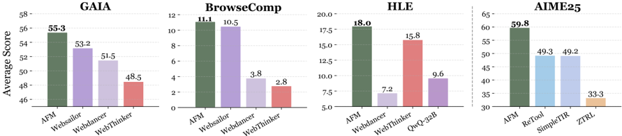

*Figure 1 Performance comparison of AFM with the proposed Chain-of-Action paradigm against state-of-the-art tool-integrated reasoning (TIR) methods on GAIA, BrowseComp, HLE, and AIME25 benchmarks. AFM demonstrates consistent effectiveness across web agent and code agent benchmarks.*

**② 方法 / 架构图**

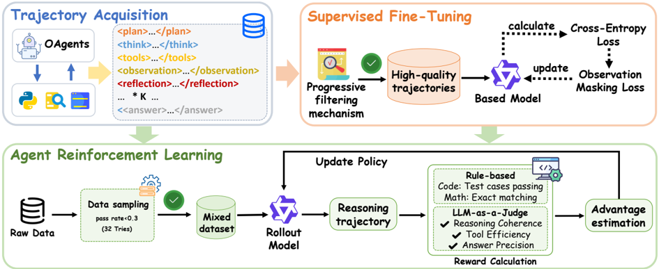

*Figure 4 Overview of the training framework. (I) The SFT stage utilizes reformatted ReAct data with both short and long chains of thought for cold start. (II) The RL stage performs tool-aware rollouts on unused QA pairs and optimizes the policy.*

### 1. 相关工作与进展

- **多智能体系统（MAS）**：靠多个角色/工具的 agent 协作解复杂任务（deep research、vibe coding），性能强但靠人工 prompt/workflow 工程。
- **Tool-Integrated Reasoning（TIR）**：把工具调用显式编进推理（Search-R1、WebThinker），让 LLM 端到端支持 ReAct 式 "think-action-observation"。实证显示 TIR 训练优于纯 prompt 工程的 ReAct agent。
- 但 TIR 只能表达 ReAct 单一轨迹模式，无法端到端训练 LLM 去支持完整 MAS。CoA 想填这个 gap。

### 2. 现有工作存在的问题

1. 手工多智能体 workflow 计算低效（agent 间冗余通信）、难泛化（换域要重做 prompt/workflow 工程）、不可端到端 data-centric 学习。
2. MAS 里的 backbone LLM 通常静态、没针对 agentic（多轮/多工具/多角色）用法训练。
3. TIR 只支持 ReAct（think-action-observation），轨迹表达能力有限。

### 3. Motivation
把多智能体协作建模进**单一模型**：让它端到端、原生地动态激活不同 tool agent（search/crawl/code）与 role-playing agent（think/plan/reflect/verify），像 MAS 那样做多轮多工具求解，同时可被 SFT + RL 直接优化；并大幅削减 MAS 的 agent 间通信 token 开销。

### 4. 主要灵感 / 核心直觉

- 既然 MAS 优于 ReAct，就把 MAS 的"动态角色编排"能力蒸进一个模型，用 system prompt 定义多个 agent、由 Thinking Agent 通过状态转移 \(S_t = f_\theta(S_{t-1}, \phi_{t-1}, o_{t-1})\) 动态激活角色 ϕ_t。
- 蒸馏层级是 **agent-level / sequence-level**（学 MAS 的序列决策模式），而非 word-level 分布——这是它与 token 级 KD/OPD 的本质区别。

### 5. 主要解决思路（一段话讲清核心）
两阶段 recipe：**(I) Multi-Agent Distillation（agentic SFT 冷启动）**——沿用 Shi et al. 的 agentic 任务生成+过滤，让 SOTA 多智能体系统 OAgents 执行这些任务，把成功的多智能体协作过程录成 CoA 兼容轨迹，经四阶段质量过滤后用 LLaMA-Factory 做 SFT（带 observation masking 防环境噪声反传）。**(II) Agentic RL**——在 SFT 未用过的 QA 上做 tool-aware rollout，用 veRL 跑 DAPO，outcome-driven 二元奖励，只选难题训练。

### 6. 方法详解（通俗、分步骤）
**CoA 范式**：role-playing agents（Thinking 编排、Plan 分解、Reflection 自评、Verification 校验）+ tool agents（Search、Crawl、Code Generate）；单次解码过程内由 Thinking Agent 动态编排，保持上下文连续、省去 MAS 的 agent 间通信开销。
**阶段 I 数据生成与四阶段渐进质量过滤**：① 复杂度（<5 agent-tool 交互剔除）② 质量（剔错答/冗余/脏数据）③ reflection enrichment（缺反思的下采样）④ error-correction 上采样（search/QA 中带 `<double_check>` agent 纠错的轨迹）。轨迹格式带 observation masking（O 不计入 loss）。
**阶段 II Agentic RL**：tool-aware rollout + DAPO；reward 用 outcome-driven 二元信号（web agent 用 LLM judge M_j 二元判断、免格式奖励；\(\text{reward} = \text{score}_{\mathrm{answer}} \cdot \text{score}_{\mathrm{format}}\)）；RL 数据选难题（rq≤0.3）。
**backbone**：Qwen2.5-3B/7B/32B-Instruct。整体是组合既有组件（OAgents 蒸馏 + LLaMA-Factory + veRL/DAPO）的工程 recipe，方法学创新点有限。

### 7. 实验数据集
近 20 个 agent benchmark。Web/QA：NQ、TriviaQA、PopQA、HotpotQA、2Wiki、MuSiQue、Bamboogle、GAIA、WebWalker、BrowseComp、HLE 等。Code agent：LiveCodeBench、CodeContests 等。数学：AIME25。RL 数据 setting 同 Search-R1。

### 8. 实验结果与主要发现

- **AFM-32B 多 benchmark SOTA**（Figure 1）：GAIA 55.3%、BrowseComp 11.1%、HLE 18.0%（web agent）；LiveCodeBench v5 47.9%、CodeContests 32.7%（code agent）；AIME2025 59.8%（数学，较此前最佳 TIR 如 ReTool/SimpleTIR 绝对 +10.5%+）。
- **效率**：相比传统多智能体系统，token 消耗减少 84.6%，性能仍有竞争力。
- **7B 版** web agent 上接近用更强 QwQ-32B backbone 的 WebThinker-RL。
- 全开源（模型权重 + 数据 + 训练/评测代码）。

### 9. 结果如何支撑其主张

- "单模型能像 MAS 一样工作" 由跨 web/code/math 近 20 基准的 SOTA 与 84.6% token 削减支撑。
- "端到端可训练" 由两阶段 recipe 本身 + RL 进一步提升支撑。
- **但 SOTA 主张需谨慎**：多数 SOTA 是在**同 backbone（Qwen2.5）受控对比**下成立；跨 backbone 比较（如对比用更强 QwQ-32B 的 WebThinker-RL）应保留。

### 10. 逻辑自洽性（中性评估）
作为系统/工程论文整体自洽、结果扎实、开源完整。方法创新有限——核心是把 OAgents 蒸馏成 CoA 轨迹 + LLaMA-Factory SFT + veRL/DAPO 的组合 recipe，每个组件都是既有的。"distillation"一词在此是 agent-level 轨迹 SFT，与本项目 token-level on-policy 蒸馏不同源，关联较弱。

### 11. 残留问题 / 局限

- SOTA 在跨 backbone 比较下不一定稳健（受控对比多在同 Qwen2.5 backbone）。
- 严重依赖教师 MAS（OAgents）的质量与四阶段过滤的人工启发式（阈值如 <5 交互、rq≤0.3 等）。
- 蒸馏是 sequence-level，无 token 级信用分配；reward 是 outcome 二元信号，过程监督缺失。
- 对本项目（MTP/OPD 方向）参考价值主要在 agentic 数据构造与 observation masking，而非蒸馏机制本身。

### 12. 开源代码与框架（链接 + 框架 + 代码可得性）

- 仓库：https://github.com/OPPO-PersonalAI/Agent_Foundation_Models （Apache-2.0，~61MB clone）。结构：`AFM/`（data / evaluation / models / tool_servers / train）、`LLaMA-Factory/`（SFT）、`verl/`（RL）、tool servers（web search/crawl + code sandbox）。
- 框架：SFT 用 **LLaMA-Factory**；RL 用 **veRL** 跑 **DAPO**；backbone Qwen2.5-3B/7B/32B-Instruct。代码可得性：模型权重、训练数据、训练 + 评测代码全开源，复现条件好（但需自建 tool servers 与较大算力）。

---

## deepdive — DeepDive: Advancing Deep Search Agents with Knowledge Graphs and Multi-Turn RL

> **一句话重点 (TL;DR)**：DeepDive 用知识图谱（KG）随机游走 + 属性模糊化自动合成"难找"deep-search QA，再用端到端多轮 GRPO（带 redundancy penalty 抑制重复查询）训练浏览 agent，DeepDive-32B 在 BrowseComp 上达 15.3%（KG 数据），加半自动 i.i.d. 数据可达 22.2%。

**元信息**：arXiv 2509.10446（v2 2025-10-14，under review）｜ 清华 / Z.AI / 东北大学（Rui Lu*, Zhenyu Hou*, Zihan Wang* 等；Jie Tang、Yuxiao Dong）｜ 主题 T2（deep search agent / 多轮 RL），与 mtp_opd 外围相关（纯多轮 RL 非蒸馏，可作长 horizon 工具调用 agent RL 对照；redundancy penalty / test-time scaling 对 path 多样性有参考价值）｜ 代码 https://github.com/THUDM/DeepDive（仅 KG 数据合成，**不含 RL 训练代码**）｜ 框架 slime（RL）+ 多轮 GRPO

### 关键图示

**① Motivation / 对比图**

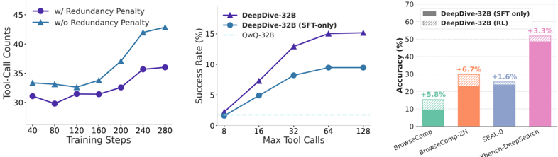

*Figure 1: Left : Adding the redundancy penalty reduces tool call counts during RL training. Middle : DeepDive drives the model's deep search ability with maximum tool calls, which improves performance on BrowseComp. Right : Multi-turn reinforcement learning consistently enhances DeepDive-32B on four*

**② 方法 / 架构图**

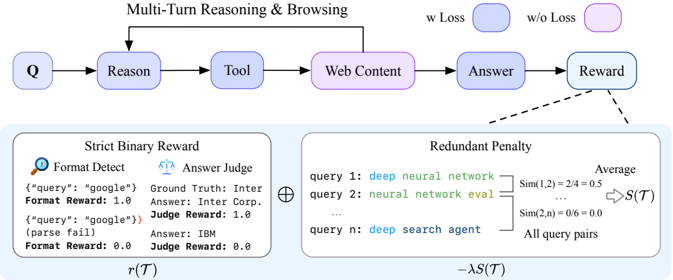

*Figure 4: Overview of multi-turn RL in DeepDive.*

### 1. 相关工作与进展
给 LLM 加浏览工具可成为 deep search agent，对数百在线来源推理检索以定位复杂、难找信息（如 BrowseComp 题目）。R1-Searcher / ReSearch / DeepResearcher 等开源工作主要在 HotpotQA 类多跳 QA 上训练评测；OpenAI DeepResearch 等专有系统遥遥领先。GLM-4.5/4.6 采用了 DeepDive 的数据并贡献其 BrowseComp 强表现。

### 2. 现有工作存在的问题

- **数据太简单**：HotpotQA、2Wiki、Bamboogle、Musique 等靠搜几个清晰实体即可解，不反映真正"hard-to-find"案例；而 BrowseComp 含多个模糊实体（blurry entity）、需长 horizon 推理 + deep search。
- **训练是开放问题**：如何把长 horizon 推理与 deep search 工具使用有效结合仍未解决；即便 DeepSeek-R1 也只做浅层工具调用且易幻觉。

### 3. Motivation
(1) 自动从开放 **知识图谱** 合成复杂、难找问题，补足难数据；(2) 用端到端多轮 RL 提升"长 horizon 推理 + deep search"；(3) 用 redundancy penalty 鼓励多样、减少冗余重复查询。

### 4. 主要灵感 / 核心直觉
KG 天然支持多跳连接、每实体多属性——沿 KG 随机游走可抽出长多跳路径，故意模糊部分属性即可制造"blurry entity"，从而构造刺激长 horizon 推理与 deep search 的难题；同时 deep search 中重复相似查询是浪费，可用查询相似度直接惩罚。

### 5. 主要解决思路(一段话讲清核心)
KG 难数据合成提供训练信号，端到端多轮 GRPO 让 LLM 在真实 web 环境中边搜边推、按最终答案给奖励，redundancy penalty 用 Jaccard 相似度惩罚重复查询以提升搜索多样性与效率。

### 6. 方法详解(通俗、分步骤)

1. **KG 难数据合成**：先按出度区间 [d_min, d_max] 过滤候选节点（出度过高→答案过于流行可预测；过低→难扩展路径）；在 KG 上随机游走抽长多跳路径；再用 LLM 进一步混淆关键线索形成 blurry entity。i.i.d. side study 随机游走参数：k∈[5,9]、d=3、d_min=4、d_max=8（核自 §4），实体混淆用 Gemini-2.5-Pro。
2. **端到端多轮 RL（multi-turn GRPO）**：LLM 与 web 环境交互，按构造 QA 的最终答案给奖励；为促探索保留 KL penalty。
3. **Redundancy penalty**：用 Jaccard 相似度度量任意两次查询的重复程度并惩罚（系数 λ=0.1），鼓励多样高效搜索（图1左：显著减少 RL 训练中工具调用冗余计数）。

### 7. 实验数据集

- 评测：**BrowseComp、BrowseComp-ZH、SEAL-0、Xbench-DeepSearch**（四个 deep search benchmark）。
- 训练数据：摘要/引言称构造 **3,090** 条 KG 自动合成 deep search QA；§实验细则述随机游走流程实际产出 **3,250** 条，随机切分为 **1,016 SFT + 2,234 RL**（RL 用全部 2,234）。另含半自动 i.i.d. 合成数据（side study，用 Gemini-2.5-Pro 混淆实体）。〔3,090 vs 3,250 为论文内部叙述口径差异，已核。〕

### 8. 实验结果与主要发现

- 基模型：GLM-Z1-9B-0414 与 QwQ-32B。SFT 阶段 3 epochs、global batch 32、lr=1e-5、max context 104,800；RL 用 slime、全部 2,234 样本，rollout size=8、每 prompt 16 samples（GRPO），redundancy penalty λ=0.1。训练期 checkpoint 选择用 BrowseComp-266（从 1,266 题随机预采样子集），turn limit 提至 128。
- 结果：DeepDive-32B 在 BrowseComp 达 **15.3%**（KG 数据），超过 WebSailor、Search-o1、DeepSeek-R1-Browse；加半自动 i.i.d. 数据进一步到 **22.2%**。多轮 RL 在四个 benchmark 一致提升（+5.8/+6.7/+1.6/+3.3% 等）。展示工具调用与并行采样的 **test-time scaling**（增大 max tool calls 提升成功率）。做了 n-gram 污染分析（表4）。其数据被 GLM-4.5/4.6 采用。

### 9. 结果如何支撑其主张
四个 benchmark 一致正增益支撑"多轮 RL 有效"；redundancy penalty 的工具调用计数下降图（图1左）支撑"减少冗余"；test-time scaling 曲线支撑"更多工具调用→更高成功率"；n-gram 污染分析回应数据泄漏质疑，间接支撑结果可信度。

### 10. 逻辑自洽性(中性评估)
数据合成→RL 训练→多样性惩罚三段逻辑连贯，benchmark 选择（BrowseComp 系）契合"hard-to-find"主张。但部分增益（如 Xbench +1.6%）幅度较小，且 BrowseComp 绝对值仍偏低（15.3%/22.2%），说明任务远未解决；checkpoint 选择用 266 子集存在一定调参–评测耦合风险。

### 11. 残留问题 / 局限

- 训练数据规模小（RL 仅 2,234 样本），合成数据多样性与难度分布对结果影响未充分隔离。
- BrowseComp 绝对准确率仍低，距专有 DeepResearch 有差距。
- RL 训练代码不在仓内（依赖外部 slime），独立复现需自行接入。
- 3,090 / 3,250 的数据计数口径在论文内不一致（摘要 vs 实验细则），需以实验节为准。

### 12. 开源代码与框架(链接+框架+代码可得性)

- 仓库：https://github.com/THUDM/DeepDive （已 clone，~2.9MB；含 qa_synthetic/（KG 数据合成）、assets/）。**仅含 KG 数据合成代码，不含 RL 训练代码**（训练在外部框架完成）。
- RL 框架：**slime**（THUDM/slime，"LLM post-training framework for RL scaling"，Zhu et al. 2025）；论文 §实验设置明确"we conduct training using the open-source Slime framework with all 2,234 data samples"。多轮 **GRPO** 算法。
- 数据/模型公开：3,090（KG 自动）+ 2,234（RL）+ 半自动 i.i.d. 合成数据；DeepDive 模型。

---

## distill_agent_tools — Distilling LLM Agents into Small Models with Retrieval and Code Tools (Agent Distillation)

> **一句话重点 (TL;DR)**：不只蒸馏教师的"推理"，而是把教师 agent 的完整"think + act（检索/代码工具）"任务求解行为蒸馏到小模型；配两项改进——用 first-thought prefix 提高教师轨迹质量、用 self-consistent action generation 提高学生测试时鲁棒性——使小模型 agent 能匹配甚至超过比它大 2–4× 的 CoT 蒸馏模型。

**元信息**：arXiv 2505.17612 (v2, 2025-11-05) ｜ KAIST / DeepAuto.ai（Minki Kang*, Seanie Lee, Sung Ju Hwang）、UW-Madison（Jongwon Jeong*）、KRAFTON（Jaewoong Cho）｜ NeurIPS 2025 ｜ 主题 T2（agent/tool 蒸馏，离线 SFT 式，非 on-policy，可作 OPD-agent 对照基线）｜ 代码 https://github.com/Nardien/agent-distillation（已克隆约 7.6MB）｜ 框架 smolagents v1.13.0.dev0 + TRL SFT trainer + LoRA；检索环境沿用 Search-R1（pyserini + faiss）。

### 关键图示

**① Motivation / 对比图**

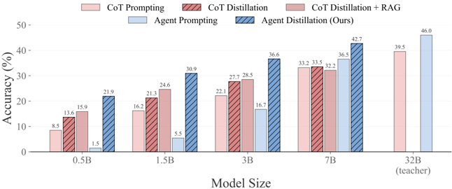

*Figure 1: Performance comparison of different sizes of Qwen2.5-Instruct models [1] on the average accuracy of four factual reasoning tasks (HotpotQA [2], Bamboogle [3], MuSiQue [4], 2WikiMultiHopQA [5]) and four mathematical reasoning tasks (MATH [6], GSM-Hard [7], AIME [8], OlymMATH [9]). Distillat*

**② 方法 / 架构图**

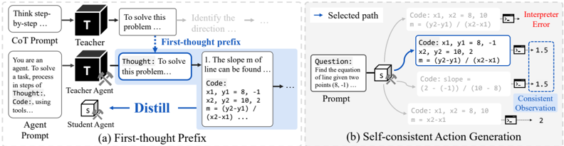

*Figure 3: (a) First-thought Prefix: We prompt teacher with a CoT prompt to induce step-by-step reasoning. The first reasoning step is used as a prefix to generate an agentic trajectory, which is then distilled to a student agent to teach CoT-style reasoning initialization. (b) Self-consistent Action*

### 1. 相关工作与进展

- **CoT 蒸馏**：用教师 LLM 的 Chain-of-Thought trace 通过 next-token 蒸馏把推理能力迁移到小模型（sLM）。
- **检索增强（RAG）**：在蒸馏与推理时引入外部知识，作为公平对比基线。
- **CodeAct 范式**：每步由 Thought–Action（Python 代码）–Observation 组成，本文 agent 形式化沿用之。
- **prefix-attack（jailbreak）**：往模型回答前缀注入内容来引导生成，是 first-thought prefix 的直接灵感来源。
- **majority voting / self-consistency**：对多次采样结果投票提升鲁棒性。

### 2. 现有工作存在的问题

- 纯 CoT 蒸馏在需要**罕见事实知识**或**精确计算**时失效——小模型容易幻觉、算错（如"$100 投资 Apple 2010→2020 值多少"需查历史股价、拆股，再精确计算）。
- 静态推理 trace 模仿无法在测试时获取新知识或保证计算正确。
- 直接让 instruction-tuned 教师（Qwen2.5-32B-Instruct）当 agent 时，其**初始推理质量不佳**，生成的轨迹不够好。
- 小蒸馏 agent 常生成**无效/不可解析的动作**（代码报错、库函数误用），阻碍与环境交互。

### 3. Motivation
迁移的不应只是"推理"，而是 LLM agent 的**完整任务求解行为**（think + act）：让小模型学会用检索工具获取事实、用代码工具精确计算，从而对幻觉更鲁棒、对 OOD 任务泛化更强。核心问题：如何在更小模型中保留 LLM 级问题求解能力。

### 4. 主要灵感 / 核心直觉

- **教师轨迹质量瓶颈在"第一步思考"**：instruction-tuned 教师直接做 agent 时开头推理弱；借 prefix-attack 思路，先用 CoT prompt 诱导教师生成 step-by-step 推理，把这"第一步思考"作为前缀注入教师 agent → 抬高整条轨迹质量。学生推理时不需要该前缀。
- **学生测试时靠采样+投票纠错**：对每步采多条 thought-action（高温 nucleus 采样增多样性），无效动作可由其报错 observation 引导自纠，并对结果 observation 做 majority voting，降低单次无效动作的影响。

### 5. 主要解决思路（一段话讲清核心）
用 first-thought prefix 增强后的教师（Qwen2.5-32B-Instruct）在 smolagents 中对训练问题各采一条"Thought-Action(code/search)-Observation"轨迹，过滤掉答错的，得到约 2,000 条轨迹；用 TRL 的 SFT trainer + LoRA 把这些 agent 轨迹蒸馏进 Qwen2.5-Instruct 小模型（0.5B/1.5B/3B/7B）；测试时小 agent 配 self-consistent action generation（每步采 N=8、温度 0.4，投票），得到实用的 tool-using 小 agent。

### 6. 方法详解（通俗、分步骤）
**Agent Distillation 框架，两条互补改进轴：**

1. **First-thought prefix (ftp)**：用 CoT prompt 诱导教师产生 step-by-step 推理，截取其作为前缀注入教师 agent 的"第一步思考"，再让教师在 smolagents 中续走 reason-act-observe。只用于改善教师轨迹采集，学生推理时不需要。
2. **Self-consistent action generation (sag)**：测试时不用 greedy，对每一步用 nucleus 采样以高温采 N 条 thought-action（主实验 N=8、温度 0.4）；无效动作的报错 observation 反馈回去供后续步自纠；对各条得到的 observation 做 majority voting 选最终动作结果。

**流程**：教师=Qwen2.5-32B-Instruct；学生=Qwen2.5-Instruct 四个尺寸（0.5B/1.5B/3B/7B，蒸馏前已 instruction-tuned）。每题从教师采 1 条轨迹并过滤错误轨迹 → 约 2,000 条训练数据 → LoRA（rank 64，所有线性层）SFT 学生（2 epoch、batch 8、lr 2e-4、4×A100 80GB）→ 测试时学生 agent 配 sag、max steps=5、greedy 主解码。

### 7. 实验数据集

- **训练数据**：1,000 HotPotQA + 2,000 MATH examples（每题采 1 条教师轨迹、过滤错误后约 2,000 条用于蒸馏）。〔已核：训练源含 HotPotQA 与 MATH 两部分，非仅 MATH〕
- **检索环境**：Wikipedia 2018 作知识库（agent 与 RAG 共用），e5-base-v2 做 doc/query embedding；沿用 Search-R1 的 retriever。
- **评测（8 任务，每集限 500 例）**：
  - 事实多跳 QA：HotpotQA（in-domain）、MuSiQue、Bamboogle、2WikiMultiHopQA（OOD）。
  - 数学：MATH500（in-domain）、GSM-Hard、AIME、OlympiadMATH（OOD）。
  - 指标：数学用 exact match；事实用 LLM-as-judge（gpt-4o-mini）。

### 8. 实验结果与主要发现

- **agent 蒸馏全面优于 CoT 蒸馏**，尤其在 OOD 任务上。蒸馏前除 7B 外多数尺寸靠 prompting 无法产生有效 agentic 输出（常出不可解析代码）。
- **跨档匹配**（论文主张）：0.5B agent ≈ 1.5B CoT 蒸馏；1.5B agent ≈ 3B CoT；3B agent 超过 7B CoT；7B agent 甚至超过 32B CoT 教师。
- **逐项数值（Table 2 摘选，Avg. 为 8 任务均值）**：
  - 教师 32B：CoT Prompting 39.54；Agent Prompting 46.00。
  - 7B 学生：CoT Distill 33.54 → Agent Distill 39.85 → +ftp 42.26 → +sag 41.86 → +ftpsag 42.68。
  - 3B 学生：CoT Distill 27.72 → Agent Distill 33.60 → +ftpsag 36.60。
- ftp 与 sag 在 0.5B–7B 全尺寸、跨两域基本稳定提升（但 3B+sag 在 AIME 上掉到 0.0，说明 sag 单用并非处处增益）。

### 9. 结果如何支撑其主张

- "迁移工具使用行为提升泛化" → agent 蒸馏在 4 个 OOD 任务上相对 CoT 蒸馏增益最明显，与"测试时可查事实/算数→对幻觉更鲁棒"的机制一致。
- "小模型匹配更大 CoT 模型" → 表中 7B Agent(ftpsag) 42.68 > 32B CoT 39.54，3B Agent(ftpsag) 36.60 > 7B CoT 33.54，支撑跨档主张。
- ftp/sag 的增量贡献由"Distill → +ftp/+sag/+ftpsag"逐行递增体现，但并非每个单元格都单调（sag 在个别难任务上可能反伤），说明组件增益是平均意义上的。

### 10. 逻辑自洽性（中性评估）
框架自洽、实现干净：ftp 只动教师数据采集、sag 只动学生测试，互不耦合，消融清晰。但"跨档匹配"这种比较高度依赖平均分聚合（8 个异质任务直接平均），单任务上结论不稳（如 AIME 这类小样本基准方差大、出现 0.0/15.6 的剧烈跳变）。sag 用 majority voting 实质是 test-time 多次采样，提升来自额外推理算力而非模型本身能力——与"高效小 agent"的卖点存在一定张力（推理成本被转移到 test-time）。整体是合理的工程组合，机制解释成立但增益的统计稳健性有限。

### 11. 残留问题 / 局限

- **离线 SFT、非 on-policy**：纯模仿教师轨迹，未做 on-policy/RL 矫正，学生在工具调用上的分布漂移未被训练时纠正。
- **sag 的 test-time 成本**：每步采 N=8 条，推理开销显著上升，"小模型省算力"的优势部分被抵消。
- **小样本基准方差大**：AIME/OlympiadMATH 等任务样本少，Avg. 聚合掩盖了单任务的剧烈波动（如 3B+sag AIME=0.0）。
- **依赖外部判分**：事实任务用 gpt-4o-mini 做 LLM-as-judge，引入评测器偏差。
- **教师/检索环境固定**：仅 Wikipedia 2018 + 单一 retriever，真实开放检索下的表现未验证。

### 12. 开源代码与框架（链接+框架+代码可得性）

- 仓库 https://github.com/Nardien/agent-distillation（已克隆，约 7.6MB）。顶层含 `src/smolagents/`（fork 的 smolagents）、`data_processor/{math_dataset,qa_dataset}`、`exps_research/first_thought_prefix`、`scripts/{training,inference}`、`search/`、`serve_vllm.py`、`e2b.toml`。
- 框架：基于 **smolagents v1.13.0.dev0**（logging→可训练轨迹 / training / benchmarking）；训练用 **TRL** SFT trainer + **LoRA**（rank 64）；检索沿用 **Search-R1**（pyserini + faiss-gpu）；代码工具走本地或 e2b 沙箱。
- 资产：HF `agent-distillation/*` 提供教师轨迹（2k baseline 与 first-thought-prefix 两版）与 agent-distilled Qwen2.5-1.5B-Instruct 等模型。
- 代码可得性：高（框架、数据处理、训练/推理脚本、轨迹与模型权重齐全；README TODO 标注 ftp 详细说明待补）。

---

## gigpo — Group-in-Group Policy Optimization for LLM Agent Training (GiGPO)

> **一句话重点 (TL;DR)**：把 GRPO 扩展到长 horizon 多轮 agent——除了像 GRPO 那样按整条轨迹回报算 episode 级相对优势,再利用"组内轨迹常反复经过相同环境状态"这一观察,把同一状态下的不同动作聚成 step 级组算 micro 相对优势,从而**无需额外 rollout、无 critic** 就实现细粒度 step 级信用分配,额外时间成本 <0.002%。

**元信息**：arXiv:2505.10978（v3, 2025-10-28, cs.LG；NeurIPS 2025）｜ 南洋理工 NTU / Skywork AI Singapore（Lang Feng、Zhenghai Xue、Tingcong Liu、Bo An）｜ 主题 多轮 LLM agent 的细粒度 credit assignment / 相关性中（step 级信用分配机制可作 path-level 监督的 critic-free 替代/baseline；但本文纯 RL,无 teacher 蒸馏、无 MTP）｜ 代码 github.com/langfengQ/verl-agent（Apache-2.0，本地已 clone）｜ 框架 verl-agent（veRL 扩展）。

### 关键图示

**① Motivation / 对比图**

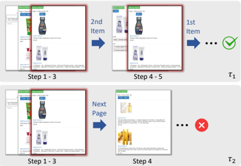

*Figure 3: Illustration of step-level grouping in WebShop. Both τ 1 and τ 2 encounter the same environment state multiple times: a search results page (highlighted by the red border). Top : τ 1 eventually succeeds. Bottom : τ 2 leads to failure.*

**② 方法 / 架构图**

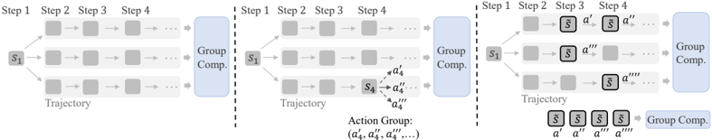

### 1. 相关工作与进展

- **group-based RL(RLOO、GRPO)**:在单轮任务(数学、代码)上很成功——奖励即时、信用分配简单、无需 critic、低显存、稳定。
- **多轮 agent RL**:LLM agent 在外部环境中是长 episode(数十步、数万 token)、奖励稀疏/延迟。
- **已有 step 级信用方案**:actor-critic(PPO、ArCHer、AgentQ)用 value 网络/MCTS;或对每个 state 额外 rollout 新动作。

### 2. 现有工作存在的问题

- **朴素套 group-based RL 到多轮**:把整条轨迹当一个 episode-level 响应(如 RAGEN),组内每步给**同一** advantage,丧失 step 级区分,长 horizon(如 ALFWorld 50 步)下扩展性差。
- **naive step 级信用**:对每个 state 额外 rollout 动作 → 计算代价爆炸。
- **actor-critic**:需额外 value 网络/MCTS,复杂、开销大,失去 group-based RL 的简洁。
- **核心矛盾**:能否**既保留** group-based RL 的优点(critic-free、低显存、稳定)**又引入**细粒度信用分配?

### 3. Motivation
长 horizon 任务里,一个动作的好坏可能很晚才显现,而 episode 级单一 advantage 无法告诉模型"是哪一步走对/走错了"。需要在不增加 rollout、不引入 critic 的前提下,给出 step 级的相对好坏信号。

### 4. 主要灵感 / 核心直觉
关键观察:**同任务同初始条件下,组内许多轨迹因无效动作或循环会反复遇到相同环境状态**(同一网页/房间/游戏场景)。这些共享状态天然就是"对照实验"——在同一状态下不同轨迹采取了不同动作并得到不同后续回报,于是**不用额外 rollout 就能直接比较这些动作的优劣**,做局部(step 级)信用分配。

### 5. 主要解决思路(一段话讲清核心)
GiGPO 嵌套两级相对优势(group-in-group):宏观上,对同一任务采 N 条完整轨迹,按总回报算 episode 级相对优势 A^E(同 vanilla GRPO);微观上,回溯找出组内反复出现的环境状态(anchor state),把"在同一 anchor state 下采取的不同动作"聚成一个 step 级组,组内按各动作的**折扣回报**算 step 级相对优势 A^S;最后线性合并 \(A = A^E + \omega \cdot A^S\)(ω 直接设 1,不调参)。全程 critic-free、无额外 rollout、与原 GRPO 同显存。

### 6. 方法详解(通俗、分步骤)

- **Episode 级(宏观)**:同任务同初始状态采 N 条轨迹,按总回报算 macro 相对优势 A^E,反映整条轨迹的任务完成质量。
- **Step 级(微观)—— Anchor State Grouping(核心创新)**:回溯识别组内跨轨迹/跨时间重复出现的环境状态(anchor state);把所有"在同一 anchor state 下采取的不同动作"聚成一个 step-level group,每个唯一状态构一组。组内对动作算 micro 相对优势 A^S。为捕捉长期影响,对每步关联**折扣回报** R_t(折扣因子 γ∈(0,1]),使早期次优动作得到比后期正确动作更低的折扣回报,产生清晰的偏好排序(例:1st Item > 2nd Item > Next Page)。
- **合并**:\(A = A^E + \omega \cdot A^S\),ω=1(代码 `step_advantage_w` 默认 1.0,未调参)。
- **变体**:GiGPO w/ std 与 w/o std(是否用标准差归一化);**similarity-based 变体**——状态难精确匹配(如 QA)时,用最长匹配子序列相似度阈值(默认 0.95)判定"是否同一状态"。

### 7. 实验数据集

- **长 horizon agent**:ALFWorld(具身家务规划)、WebShop(目标驱动 web 交互)。
- **多轮工具集成推理**:search-augmented QA(沿用 Search-R1 设置,E5 检索器,max turn=4)。
- **base model**:Qwen2.5-1.5B/3B/7B-Instruct。

### 8. 实验结果与主要发现

- **较 GRPO 一致大幅提升**:GiGPO w/o std 在 1.5B 上 ALFWorld +13.3%、WebShop +10.6%;7B 上 +12.6% / +9.1%;QA 3B 42.1%、7B 47.2%。w/ 与 w/o std 均稳超 GRPO 与 RLOO。
- **几乎零额外成本**:GiGPO 特有操作(anchor 分组 + 算 step 优势)单次迭代仅约 0.53s,占总训练时间 **<0.002%**,且与原 GRPO 同显存、同 rollout 预算。
- 报告观察到 emergent reasoning(附录 F)。
- 对照闭源(GPT-4o、Gemini-2.5-Pro)、prompting(ReAct、Reflexion)、RL(PPO/RLOO/GRPO);QA 另比 Search-R1、ZeroSearch、StepSearch 等。

### 9. 结果如何支撑其主张
主张是"在保持 group-based RL 效率的同时引入细粒度信用分配"。两点证据:(1)在三类任务、三种规模上一致超过 GRPO/RLOO,且 w/ 和 w/o std 都成立,说明增益稳健来自机制而非调参;(2)额外时间 <0.002%、同显存,直接支撑"不牺牲效率"。代码核对(`core_gigpo.py`)与论文一致:`compute_gigpo_outcome_advantage` 中 `scores = episode_advantages + step_advantage_w * step_advantages`(默认 1.0),anchor 分组、折扣回报、similarity 变体均实现到位。

### 10. 逻辑自洽性(中性评估)
机制自洽且实现可核(本地代码已审计,与论文 Eq.3/6/7/8 对应)。需保留的批判点:(1)**核心前提是"组内状态确实重复"**——若任务状态空间大、轨迹很少撞到同一状态,step 级组多为 size=1(代码 `summarize_group_size` 正反映这一动态),A^S 退化,增益将缩水;similarity 阈值近似缓解但引入新超参与误聚风险;(2)ω=1 未调参虽显鲁棒,但也意味着两级优势的相对权重未被优化,可能非最优;(3)折扣回报需要环境给出 per-step reward 或可定义,纯稀疏终局奖励下 step 级信号主要靠折扣传播,效果依赖 γ。

### 11. 残留问题 / 局限

- **状态重复假设**:在状态难精确匹配/极少重复的环境中机制退化,论文用相似度阈值兜底但未给失效边界。
- **纯 outcome/环境奖励驱动**:无外部监督或蒸馏,增量集中在 step 级信用分配机制本身,属 GRPO 家族增量改进而非新范式。
- **ω、γ、similarity_thresh** 等超参的系统敏感性分析有限(ω 固定为 1)。
- **评测局限于 ALFWorld/WebShop/QA**,对更开放的真实工具环境(代码执行、长程网页)未验证。

### 12. 开源代码与框架(链接+框架+代码可得性)

- 代码 github.com/langfengQ/verl-agent(Apache-2.0,含 HF 模型 collection);本地已 clone,核心算法在 `gigpo/core_gigpo.py`(已审计)。
- **框架**:`verl-agent` 是 **veRL** 的扩展(pyproject 包名仍为 `verl`)。核心改造是 **step-independent multi-turn rollout**——不简单拼接完整交互历史,而是允许逐步可定制的 per-step 输入结构、history 管理与 memory 模块,支持超长 horizon(ALFWorld 可达 50 步)。
- **配置**:base Qwen2.5-1.5B/3B/7B-Instruct;ALFWorld/WebShop 所有 RL 方法用完全相同超参,rollout group size N=8;QA 用 N=5、max turn=4、E5 检索器;ω=1 不调。

---

## icrl — ICRL: Learning to Internalize Self-Critique with Reinforcement Learning

> **一句话重点 (TL;DR)**：让同一 backbone 用 role-specific prompt 同时当 solver 与 critic 联合 RL，把"有 critique 才能做对"内化为"无 critique 也能做对"——核心是一个把 critique-conditioned 修订轨迹按 token 级 re-weight 比率 \(w_t = \frac{\pi(y_t \mid q)}{\pi(y_t \mid q,c)}\) 迁移到 critique-free 分布的"分布校准"，外加逐角色组内归一化以稳定联合优化。

**元信息**：arXiv 2605.15224v1（2026-05-13）｜ 港科大(GZ)、南京大学、中山大学、NUS、NTU、SAP、Microsoft Research（多机构）｜ Preprint，2026-05｜ 主题 solver-critic 联合 RL / 自我改进，与 OPD/TSRD 间接相关（"critique-conditioned→critique-free 的 token 级 re-weight"与 OPD"教师条件分布→学生无条件分布"形式同构）；不涉及 MTP，非 teacher-student 蒸馏｜ 代码 https://github.com/brick-pid/ICRL ｜ 框架 slime (THUDM, SGLang-native RL) + AgentGym。

### 关键图示

**① Motivation / 对比图**

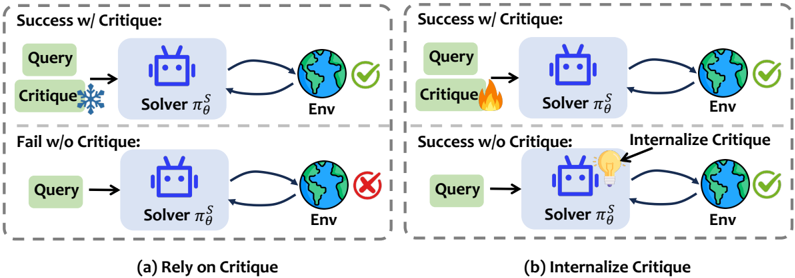

*Figure 1: Critique can turn failed trajectories into successful revisions, while training should internalize such revision behavior into the critique-free solver.*

**② 方法 / 架构图**

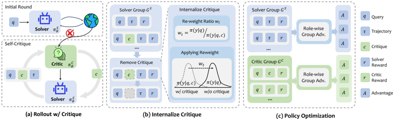

*Figure 2: Overview of the ICRL framework. (1) Rollout with critique alternates solver and critic; (2) Policy optimization jointly trains both solver and critic; (3) Internalizing critique into solver.*

### 1. 相关工作与进展
外部/自我 critique（Self-Refine、Reflexion、CRITIC）常能引导同一模型纠错成功；Critique-GRPO 等用冻结 critic 做 critique-based RL。GRPO 依赖同前缀同分布的组内比较。

### 2. 现有工作存在的问题

- 撤掉 critique 后模型在同一 query 上又失败——能力没被内化。
- 冻结 critic 无法随训练提升反馈质量，solver 进步后 critic 过时、产无关/冗余反馈。
- critique-guided 成功轨迹来自 critique-conditioned 分布 (y|q,c)，直接当 (y|q) 更新会产生有偏估计，强化"依赖 critique"。
- solver 初解、critic 批评、修订解的 prompt 前缀各异，奖励不可直接组内比较。

### 3. Motivation
把 critique 引发的成功转化为无 critique 的 solver 能力（内化），同时让 critic 与 solver 共享 backbone、协同进化使批评质量可学习，并解决联合优化的稳定性。

### 4. 主要灵感 / 核心直觉
修订轨迹虽在 critique 上下文下产生，但其中一部分 token 在 critique-free 分布下本就可信——只把这部分迁移给 solver、下调重度依赖 critique 上下文的 token，即可内化而不强化依赖。critic 的价值应由"实际有用的反馈"（带来奖励提升）而非"听起来合理的反馈"来定义。

### 5. 主要解决思路(一段话讲清核心)
solver 采初解，失败则 critic 产 critique、solver 据此产修订解（最多 K=2 轮）；对修订轨迹去掉 critique 前缀、重视作 (y|q) 的证据，引入 token 级 re-weight 比率 \(w_t = \frac{\pi(y_t \mid q)}{\pi(y_t \mid q,c)}\)（上界 w_max=2）选择性迁移可信 token；solver 组与 critic 组分别做组内归一化（role-wise group advantage）保留各自学习信号；critic 奖励取修订成功记 1 否则等于 solver 奖励的时序提升 \(r(\tau_{i+1}) - r(\tau_i)\)。

### 6. 方法详解(通俗、分步骤)

- **Self-Improving Workflow**：solver 采初解 τ₁；失败→critic 产 critique cᵢ→solver 产修订解 τᵢ₊₁；最多 K 轮（实现 K=2，论文 "set the iteration round to 2 to improve training efficiency"）。
- **奖励**：solver 用任务 outcome reward \(r(\tau) \in [0,1]\)；critic reward=修订成功记 1，否则 \(r(\tau_{i+1}) - r(\tau_i)\)（仅 dense reward 下非零）。
- **Critique-Conditioned Distribution Calibration（核心）**：token 级 \(w_t = \frac{\pi(y_t \mid q)}{\pi(y_t \mid q,c)}\)，只迁移 critique-free 下本就可信的 token、下调依赖 critique 上下文的 token。
- **Role-wise Group Advantage（Eq.5）**：solver 组与 critic 组分别组内归一化。
- **目标（Eq.6）**：\(J = \mathbb{E}\left[ \min(w_t, w_{\max}) \cdot \min\left(\rho_t(\theta)\hat{A},\ \mathrm{clip}(\rho_t, 1\mp\varepsilon)\hat{A}\right) \right]\)，仅 critique-guided 修订 solver 轨迹用 w_t（其余 w_t=1），**w_max=2** 防梯度方差爆炸。
- 〔已核-代码〕`icrl/icrl/rewards.py::_role_group_key/_role_sample_norm` 按 `(group_index, role)` 逐角色组内归一化实现 Eq.5；`generate.py:218-225` 对修订轨迹存 `critic_free_prompt_ids`、把 `exec_sample.tokens` 重绑为"critique-free 前缀+原 response"，w_t 在 slime 损失阶段重算。K=2、w_max=2、env_nums=32 在 `hydra_conf/` 确认。

### 7. 实验数据集
四类任务：(1) Text world ALFWorld；(2) Web 导航 WebShop；(3) 多跳 QA（RAG，HotpotQA/2WikiMultiHop/Bamboogle/MuSiQue，合称 SearchQA）；(4) 数学 MATH500/Minerva/OlympiadBench/AIME24/AMC23。Backbone：Qwen3-4B、Qwen3-8B。算力：agentic/Math 4B 用 2×H100、8B 4×H100；SearchQA 4B 4×H100、8B 8×H100。

### 8. 实验结果与主要发现

- agentic（avg.）：4B **57.0**（vs GRPO 49.2 **+7.8**、vs Critique-GRPO 55.9 **+1.1**）；8B **57.8**（vs GRPO 52.8 **+5.0**、vs Critique-GRPO 56.6 **+1.2**）。
- 数学 8B 平均 **75.3%**（vs GRPO 68.3 +7.0、vs Critique-GRPO 73.3 +2.0；AIME24 50.0→65.1）。
- 摘要 "6.4 points over GRPO on agentic / 7.0 on math" 为跨 backbone 平均口径；逐 backbone agentic 为 +7.8(4B)/+5.0(8B)。
- 消融：去 role-wise 归一化 69.8→68.4；去 re-weight ratio 69.8→67.8（均正贡献，增量适中）。
- test-time 多轮 refinement：ALFWorld 第三轮达 **98%**。critic-swap：学到的 8B critic 在 ALFWorld 约 57 token（WebShop 93.9 token）即匹配/超过 20B/32B 冻结 critic（后者数百 token）。

### 9. 结果如何支撑其主张
"内化"由 critique-free 评测下相对 GRPO 的提升支撑；"分布校准/role-wise 归一化有用"由两项消融的正贡献支撑；"critic 可学习且高效"由 critic-swap 实验（小 critic 用极少 token 匹配大冻结 critic）支撑。但相对最直接对手 Critique-GRPO 的领先仅 +1.1~1.2（agentic），优势有限。

### 10. 逻辑自洽性(中性评估)
方法、公式、代码三者一致，消融定向支撑各组件。但增益的主要来源需谨慎归因：相对 GRPO 的大幅提升中，很大一部分来自 critique-based 范式本身（Critique-GRPO 已拿到大半），ICRL 的两项增量（分布校准 + role-wise 归一化）贡献适中而非数量级。

### 11. 残留问题 / 局限

- 相对 Critique-GRPO 领先有限（agentic +1.1~1.2），核心增益与"是否用 critique 范式"耦合。
- 作者自陈：依赖 critique 做修订，长尾轨迹在同步 RL 下 rollout 慢、可能成吞吐瓶颈；异步训练未探索。
- critic 时序提升奖励仅在 dense reward 下非零，sparse 任务下 critic 信号弱。
- Preprint（2026-05），未评审。

### 12. 开源代码与框架(链接+框架+代码可得性)

- 链接：https://github.com/brick-pid/ICRL 。主体在 `ICRL/` 子目录，README 顶层称 "will host the official implementation"，但实际已含完整训练代码（`train.py`/`train_async.py`、`icrl/`、数据 `data/agentgym`、`data/math`、`data/criticgrpo`）。
- 框架：slime（THUDM SGLang-native RL，内置 `slime/`+`slime_plugins/`）；agentic 环境经 AgentGym 起多 server（默认 32 并行 rollout）；数学沿用 Critique-GRPO 设置；RL 原语 GRPO。
- 代码可得、关键实现（role 分组、critique-free 重绑、超参 hydra 配置）可对照。

---

## latent_agents — Latent Agents: A Post-Training Procedure for Internalized Multi-Agent Debate

> **一句话重点 (TL;DR)**：用"SFT 学辩论结构 + GRPO 把显式辩论压进潜空间"的两阶段微调，把多个 agent 多轮辩论（multi-agent debate）内化进单个 LLM（IMAD），用 Debate 6.3%~21.1% 的 token（5–16× 提效）匹配/超过显式辩论；并发现内化后存在线性可分的"agent 子空间"，可做行为控制。属概念验证级（944 条算术 trace、LoRA）。

**元信息**：arXiv 2604.24881v1（2026-04-27）｜ Boston University（John Seon Keun Yi, Aaron Mueller, Dokyun Lee）｜ ACL 2026 Oral（据 README；论文 PDF 内未见该字样，〔待核-以 README 为准〕）｜ 主题 多智能体辩论的内化/蒸馏，与 TSRD/OPD 间接相关（"内化昂贵外部过程进单模型"的 SFT→RL 两阶段范式、length-annealing 把显式长推理压成隐式潜推理）；不涉及 MTP，非 teacher-student logit 蒸馏，奖励为 outcome+format 非 path 监督｜ 代码 https://github.com/johnsk95/latent_agents ｜ 框架 TRL (GRPOTrainer) + PEFT/LoRA。

### 关键图示

**① Motivation / 对比图**

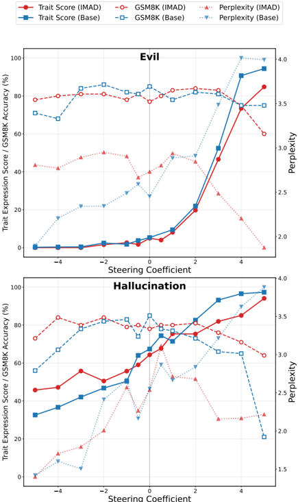

*Figure 3: Agent behavior steering suppressed malicious traits with less damage to task performance. While both models display suppression of evil and hallucination traits when applying negative steering (solid lines), IMAD is more resistant to performance drops when steering at higher positive and n*

**② 方法 / 架构图**

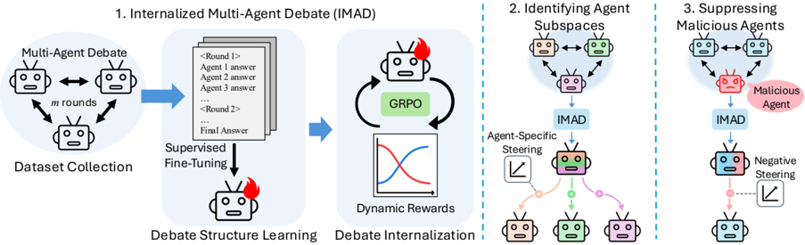

*Figure 1: Overview of the Internalized Multi-Agent Debate (IMAD) Pipeline. 1. We first collect a debate dataset using the standard multi-agent debate protocol on an arithmetic task. Using this dataset, a single LLM agent is trained via supervised fine-tuning to learn the debate structure. The same a*

### 1. 相关工作与进展
Multi-agent debate（Du et al. 2023; Liang et al. 2024）通过多模型多轮对话降幻觉、提升事实准确性。DebateGPT（Subramaniam et al. 2024）仅用最终 consensus 输出蒸馏。length-pruning 借鉴 ThinkPrune（Hou et al. 2025，代码注释明示）。

### 2. 现有工作存在的问题

- 显式辩论 token 开销巨大（多模型多轮 transcript 才给答案）。
- 仅蒸馏最终 consensus（DebateGPT）token 最省但性能普遍不如显式辩论，因丢掉了驱动增益的中间交互。
- 缺乏对"内化后辩论结构是否仍保留、能否被控制"的机制性理解。

### 3. Motivation
用一次性微调投入，换单模型的效率 + 多智能体辩论的推理能力；并探究内化后模型是否学到可恢复的"每个 agent 的表示"，进而用于行为控制（如抑制恶意 agent）。

### 4. 主要灵感 / 核心直觉
辩论的增益来自中间多视角交互而非仅最终结论，所以要在完整 trace 上学结构；学会结构后，用"格式奖励衰减 + 长度上限收缩"逼模型把多视角分析从显式文本转入潜空间，直接产答案。内化后不同 agent 的"声音"应在表示空间留下线性可分的痕迹。

### 5. 主要解决思路(一段话讲清核心)
三阶段 IMAD：(1) 用标准 multi-agent debate（n=3 agents, m=2 rounds, GPT-3.5-turbo 当 agent）在算术题上生成 944 条带结构标签的辩论 trace；(2) 在完整 trace 上做 next-token CE 学辩论格式（SFT）；(3) GRPO 内化，奖励 \(r = w_{\text{fmt}} \cdot R_{\text{fmt}} + w_{\text{clip}} \cdot R(y; l)\)，R_fmt 为结构标签匹配的格式奖励（权重 w_fmt 随训练 1.0→0.05 衰减），R(y;l) 为"正确答案出现在前 l token 内记 1"的长度裁剪奖励（l 随训练 2000→500 退火），两者协同迫使模型把分析压进潜空间。

### 6. 方法详解(通俗、分步骤)

1. **数据收集**：标准 debate（n=3, m=2, GPT-3.5-turbo）在 6 个两位数表达式算术题上生成 transcript；过滤无 majority consensus 的；加结构标签 `<|Agent 1|>`/`<|Round 1|>`/`<|Consensus|>`/`<|endofdebate|>`；共 **944** 条 {Question, Trace, Answer}。
2. **Debate Structure Learning（SFT）**：在完整辩论 trace（非仅最终输出）上做自回归 CE。
3. **RL for Internalization（GRPO）**：\(r = w_{\text{fmt}} \cdot R_{\text{fmt}} + w_{\text{clip}} \cdot R(y; l)\)；w_fmt 1.0→0.05 衰减、l 2000→500 退火，把多视角分析转入潜空间直接产答案。
4. **机制分析**：用 difference-in-means 提取 agent-specific steering vector，发现内化产生线性可分的 agent 子空间；对恶意 agent 子空间做 negative steering 可在保任务性能下抑制有害行为，且内化后比直接 steer base model 更有效。
- 两阶段均用 LoRA；GRPO 阶段从 SFT 的 LoRA checkpoint 起再叠一层 LoRA。

### 7. 实验数据集

- 训练：仅 944 条算术题辩论 trace。
- 评测：GSM8K（多步数学）、MMLU-Pro（多领域多选）、BigBench Hard（多样推理）；各随机采 1000 题，三次运行报均值±标准误。训练仅算术、评测跨域跨格式，测泛化。

### 8. 实验结果与主要发现

- **效率**：所有模型上 IMAD 仅用 Debate 的 **6.3%~21.1%** token（5–16× 提效）。
- LLaMA-3.1-8B-Instruct 上三个 benchmark 全面超 Debate；Mistral-Nemo-12B 在 GSM8K 上超 Debate **18.97** 个百分点；Qwen2.5-7B 增益温和。
- 仅算术训练却能跨域泛化（附录另做多任务扩展数据集，性能更强）。
- DebateGPT（仅最终输出蒸馏）token 最省但性能不及 IMAD，印证保留中间交互的价值。

### 9. 结果如何支撑其主张
"内化保性能+提效"由三 benchmark 上 IMAD 以极少 token 匹配/超 Debate 支撑；"中间交互重要"由 IMAD 超 DebateGPT 支撑；"agent 子空间可控"由 difference-in-means steering 实验（negative steering 抑制恶意 agent、内化后比 base 更有效）支撑。

### 10. 逻辑自洽性(中性评估)
两阶段范式与奖励设计逻辑清晰，机制实验为"内化"提供了表示层证据。但整体属概念验证：训练数据极小（944 条、仅算术、n=3/m=2 最小辩论），增益跨 backbone 差异大（Qwen 仅"温和"），机制结论主要靠 steering 实验单一证据链支撑，泛化主张依赖附录扩展数据。

### 11. 残留问题 / 局限

- 训练数据与规模都很小（944 条算术 trace、LoRA、n=3/m=2），结论可扩展性存疑。
- 增益在不同 backbone 间差异显著（LLaMA/Mistral 强、Qwen 弱），未充分解释。
- 教师辩论用 GPT-3.5-turbo，质量天花板受限；机制结论（agent 子空间可控）证据链较窄。
- ACL 2026 Oral 据 README，论文 PDF 内未见该字样，〔待核〕。

### 12. 开源代码与框架(链接+框架+代码可得性)

- 链接：https://github.com/johnsk95/latent_agents （README 写 ACL 2026 Oral）。含 `sft.py`、`grpo.py`、`grpo_persona.py`、`steering/`、`eval/`、`data/`、`utils/generate_arithmetic*.py`。
- 框架：TRL（`GRPOConfig`/`GRPOTrainer`，trl>=0.11）+ PEFT/LoRA（peft>=0.13）+ transformers>=4.46 + accelerate；length-pruning 注释借鉴 ThinkPrune。
- Backbone：LLaMA-3.1-8B-Instruct、Qwen2.5-7B、Mistral-Nemo-12B。SFT 3–6 epoch、GRPO 2 epoch。代码可得、流程可复现。

---

## meow_tea_taro — A Practitioner's Guide to Multi-turn Agentic Reinforcement Learning

> **一句话重点 (TL;DR)**：把多轮 agentic RL 的设计空间拆成 environment/reward/policy 三支柱做系统受控消融，得出一份可操作配方——"课程(由简到繁) + 稳定化偏置策略(PPO/GRPO 优于无偏 RLOO 与朴素 REINFORCE++) + 验证型稠密奖励(单测通过率远胜模型评判)"。非新算法，是经验研究；框架封装 veRL。

**元信息**：arXiv 2510.01132 (v2, 2025-12-06) ｜ UC San Diego(+ NVIDIA)；Ruiyi Wang, Prithviraj Ammanabrolu ｜ Preprint, under review ｜ 主题 多轮 agentic RL 实证(非新算法)/与 OPD 主线弱相关 ｜ 代码 https://github.com/pearls-lab/meow-tea-taro（Apache-2.0，本地已 clone ~11MB）｜ 框架 封装/vendoring veRL

### 关键图示

**① Motivation / 对比图**

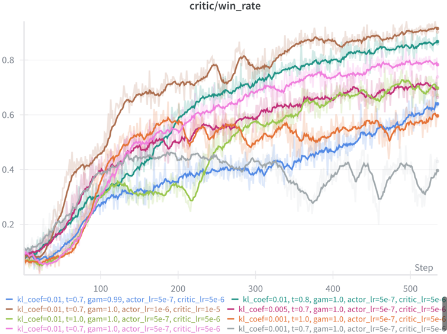

*Figure 2: Training curves for Qwen-1.5B on TextWorld w2-o3-q4 with varying hyperparameters. Parameters shown: KL coefficient (kl coef), rollout temperature (t), actor/critic learning rates, and discount factor (gam).*

**② 方法 / 架构图**

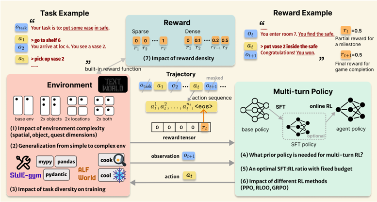

*Figure 1: Illustration of multi-turn agentic RL and the key research questions.*

### 1. 相关工作与进展
单轮 RL(PPO、RLOO、GRPO、DAPO)已为即时响应质量做了大量优化，但它们假设奖励直接跟随单个 action；多轮交互环境只在长序列交互后才揭示结果，打破了单轮方法依赖的 action-reward 耦合。现有多轮 RL 工作进展有限：有的把单轮 QA 交错工具/推理步骤伪装成"多轮"，有的在真交互环境里只用稀疏终局奖励、或把 turn-level advantage 均匀摊到所有 token(无细粒度 credit assignment)。仓库名 "meow-tea-taro" 是 "Multi-turn" 的谐音梗。

### 2. 现有工作存在的问题

- 多轮 RL 框架与定义碎片化，各家结果不可比，对"什么是真多轮 vs 伪多轮"存在混淆。
- 缺乏对 environment/reward/policy 三者如何共同决定多轮性能的系统理解。
- 固定预算下 SFT:RL 最优配比未知；reward 稀疏性 × RL 算法的交互缺系统消融。

### 3. Motivation
回答"让多轮 agentic RL 真正 work 的因素实际是什么"。把设计空间拆成三支柱逐一受控消融，在情境化文本域(TextWorld/ALFWorld)与软件工程(SWE-Gym)上导出可操作 recipe，并区分增益来自"多轮 formulation"本身还是算法启发式。

### 4. 主要灵感 / 核心直觉
把多轮 agentic 任务形式化为 POMDP；agentic 环境只在命令完成(<eos>)时执行并给奖励，故标量奖励 r_t 赋到该 turn 的 <eos> token、其余 action token 奖励为 0、state token 全 mask 不计 loss。对有 advantage 估计的算法(PPO)用 token-level credit assignment + GAE，使前序 token 经 value bootstrapping 获得非零 advantage。隔离"多轮 formulation"与"算法启发式"的方法：对比偏置(PPO/GRPO/REINFORCE++)与无偏(RLOO)策略梯度——若无偏的 RLOO 也涨，则增益来自 formulation 而非 PPO 启发式。

### 5. 主要解决思路(一段话讲清核心)
非新算法，是三支柱受控实证：(1) Environment——沿 world size/object/quest 三维扫复杂度、测简单→复杂泛化、测任务多样性；(2) Policy——SFT 先验对 RL 收敛的影响、固定预算下 SFT:RL 最优配比、偏置 vs 无偏算法对比；(3) Reward——稀疏 vs 稠密 turn-level 奖励、验证型 vs 模型型奖励、奖励粒度。最终汇成 recipe：课程 + 稳定化偏置策略 + 验证型稠密奖励。

### 6. 方法详解(通俗、分步骤)

- **POMDP 形式化**：history h_t=(u,s_0,a_0,…,s_t)，action 是自然语言 token 序列，env.step 返回 next state/reward/done，reward 赋到 <|im_end|>。
- **Multi-turn PPO**：token-level TD δ + GAE 估每 token advantage；Clipped Surrogate 覆盖全轨迹 token。
- **Environment 消融**：TextWorld 程序化生成 w/o/q 三维(如 w2-o3-q4)，ALFWorld 6 类家务，SWE-Gym 5 类(getmoto/pydantic/mypy/pandas/dvc)；改环境复杂度 + 任务多样性混合，固定总数据量公平比较。智能体须从观察自生成可执行 NL 命令(无 admissible action 提示)。
- **Policy 消融**：TextWorld 金标解作 SFT 示范(与 RL 数据不同 seed 防泄漏)；固定 1000 成本单位(假设 SFT 数据贵 RL 的 10×)扫 SFT:RL 配比；对比 PPO/GRPO/RLOO/REINFORCE++。
- **Reward 消融**：TextWorld 用内置函数造 sparse/dense(steps-per-reward)；SWE-Gym 比验证奖励(二元 vs 单测通过比例) vs 模型评判(CodeRM-8B/GPT-4.1)；长程编程用 GRPO 求稳。

### 7. 实验数据集

- **环境**：TextWorld、ALFWorld(文本版，train 训 / valid-unseen 评，6 类)、SWE-Gym(getmoto/pydantic/mypy/pandas/dvc，随机 90 训 25 评)。
- **模型**：Qwen2.5-1.5B-Instruct、Qwen2.5-7B-Instruct、Qwen3-8B；算法 PPO/GRPO/RLOO/REINFORCE++；rollout temp 0.7。
- **指标**：任务成功率(SWE-Gym 用测试套件通过比例)。

### 8. 实验结果与主要发现

- **(1) 随环境复杂度 scaling**(表 1)：base 17%→3%(同扩空间+物体)；PPO 增益从 base 环境 +88% 降到最复杂 +51%；物体复杂度比空间更难。
- **(2) 简→繁泛化**(表 5/6)：训简单环境对复杂环境有显著迁移(w8-o3-q4 训出的迁移最强，把 w8-o12-q4 提 48%，追平直接训该环境)；编程域同样(Easy→Medium +4.8%/Hard +3.6%)。
- **(3) 多任务训练**(表 7/8)：单类型训练即有 12%(ALFWorld)/7%(SWE-Gym)跨类型泛化；混合训练甚至对看似无关任务也增益(4 类混合超单类 pick&place 专家 +19%/全类 +21%)。
- **(4) SFT 先验**(表 9)：60 示范 + 400 RL episode 达 85%，逼近纯 RL 5000 episode 的 88%；跨域 SFT 先验反而有害(快速策略崩溃)。
- **(5) 最优 SFT:RL 配比**(表 9)：纯 SFT 域内强(w2-o3-q4 95%)但泛化差(w4-o6-q8 55%)；甜点是 60 SFT + 400 RL(域内 85%、复杂泛化 59%)。
- **(6) 算法对比**(表 10)：PPO 与 RLOO 均超 base(证增益来自 formulation 非 PPO 启发式)，但 PPO 最稳/样本效率最高(w2-o3-q4 88% vs RLOO 51%；w4-o6-q8 PPO 59% 而 RLOO/REINFORCE++/GRPO 在 1.5B 上崩溃)；REINFORCE++/GRPO 在 TextWorld 增益微弱。
- **(7) 奖励密度**(表 11)：稠密 turn-level 奖励加速训练，但最优密度依算法——PPO 受益于更频繁反馈(41%→58%)，RLOO 对密度不敏感(稳 55%)。
- **验证 vs 模型奖励**(表 12)：SWE-Gym 上稀疏二元验证仅 4.2%≈base，稠密单测比例验证 22%；模型评判 CodeRM-8B 7.2%/GPT-4.1 9.3%，远逊验证奖励。

### 9. 结果如何支撑其主张
七问对应七组受控实验(固定数据量/预算公平比较)，逐条支撑 recipe 三要素：跨复杂度/多样性的迁移表(表 5–8)支撑"课程 + 简→繁泛化"；PPO vs RLOO 的双双增益(表 10)支撑"增益源于多轮 formulation"，PPO/GRPO 优于 RLOO/REINFORCE++ 支撑"稳定化偏置策略"；表 11/12 支撑"验证型稠密奖励优于模型评判"。无偏 RLOO 作对照是隔离启发式贡献的关键设计。

### 10. 逻辑自洽性(中性评估)
作为经验研究内部自洽：每问受控变量、固定预算/数据量、用无偏 RLOO 做隔离对照，方法论谨慎。需注意：(1) 结论高度绑定所测三个文本域 + Qwen 1.5B/7B/8B，跨域可迁移性受限(作者也强调"非单轮简单外推")；(2) "PPO 优于 GRPO/RLOO"与多轮信用分配/value bootstrapping 强相关，GRPO 在 SWE-Gym(稀疏终局)反而有计算优势——即结论是情境相关的(论文已限定 PPO/GRPO 同为偏置方法仅在稀疏奖励下类比)；(3) 多处增益为小样本(SWE-Gym 90 训 25 评)，绝对成功率低(个位数～二十几%)，统计稳健性存疑;(4) SFT 贵 RL 10× 的成本假设是人为设定，影响"最优配比"结论。

### 11. 残留问题 / 局限

- **域窄**：仅 TextWorld/ALFWorld/SWE-Gym 三个文本域 + Qwen 系列；recipe 的跨域/跨模型族泛化未验证。
- **小样本**：SWE-Gym 仅 90 训/25 评、成功率个位数～22%，方差与显著性未充分报告。
- **情境相关结论**：算法优劣随 reward 稀疏度/环境翻转(PPO 在 dense、GRPO 在 SWE-Gym 稀疏更优)，难给单一普适结论。
- **跨域 SFT 先验有害**：换域初始化导致策略崩溃，限制了迁移学习路径。
- **成本假设主观**：SFT:RL 最优配比依赖"SFT 贵 10×"这一设定。
- **非算法贡献**：是"经验法则汇编"，不提供新的可证明算法。

### 12. 开源代码与框架(链接+框架+代码可得性)

- 仓库 https://github.com/pearls-lab/meow-tea-taro （Apache-2.0；本地已 clone ~11MB；★数 〔待核〕，离线无法确认）。结构：`meow_tea_gym/`(环境，含 `SWE-agent/`)、`meow_tea_train/`(训练)、`meow_tea_experiments/`、`recipes/`、`scripts/`、`docs/`(Read the Docs)。
- **框架 = 封装/vendoring veRL**：仓库 `meow_tea_train/verl/` 直接 vendoring veRL；advantage estimator(grpo/rloo/reinforce_plus_plus/reinforce_plus_plus_baseline/grpo_passk/rloo_vectorized/grpo_vectorized 等)在 `meow_tea_train/verl/trainer/ppo/core_algos.py`(`AdvantageEstimator` 枚举 + `register_adv_est`);docker 基于 `hiyouga/verl:ngc-th2.8.0-cu12.9-vllm0.11.0`(README)/`...th2.6.0-cu126-vllm0.8.4...`(docs)。真正"自研"的是环境层(`meow_tea_gym/`)与 environment/reward/policy 三支柱的可配置封装；策略侧 PPO/GRPO/RLOO/REINFORCE++ 均经 veRL 实现。
- 数据/模型权重：论文 Reproducibility 声明承诺随发表开源全部框架/脚本/权重(注：正文为"will release"将来时)。

〔本轮核实/新出入〕

1. 〔修正-时间〕PDF 实为 **arXiv:2510.01132 v2，2025-12-06**(cs.LG)；原分析写"2025-10 preprint"，应更新为 v2/2025-12。
2. 〔确认〕原分析"封装 veRL、非从零自研"的核码订正经仓库再核为真：`meow_tea_train/verl/` 确为 vendored veRL，`core_algos.py` 含完整 advantage estimator 枚举；`meow_tea_gym/` 含 SWE-agent。docker base 与 README 一致(`hiyouga/verl:ngc-th2.8.0-cu12.9-vllm0.11.0`)。
3. 〔补充〕原分析未列 REINFORCE++ 对照与表 9–12 具体数值，本轮补全(含 SFT:RL 甜点 60+400、验证 vs 模型奖励 22% vs 7.2%/9.3%)。
4. 〔待核〕原分析"83★"无法离线确认，标 〔待核〕。

---

## open_agentrl — RLAnything: Forge Environment, Policy, and Reward Model in Completely Dynamic RL System (Open-AgentRL)

> **一句话重点 (TL;DR)**：一个完全动态的闭环 RL 系统,同时进化"环境、策略、生成式奖励模型"三者——策略用 step-wise+outcome 融合反馈训练,奖励模型经一致性反馈联合优化产出可靠 step-wise 监督,环境据策略当前能力自适应调难度;论证优化后的 step-wise 信号优于人工 outcome 标签。

**元信息**：arXiv 2602.02488（v1, 2026-02-02, cs.LG）｜ Gen-Verse（Yinjie Wang, Tianbao Xie, Ke Shen, Mengdi Wang, Ling Yang 通讯）｜ **ICML 2026**（仓库 README 标注"RLAnything (ICML 2026)";论文 PDF 自身未声明 venue）｜ 主题 T2（agentic RL）;**注:本文无 OPD 内容**,与 mtp_opd 仅间接相关——为"agentic 场景下过程信号优于纯结果"的论据,可与 OPD 的过程级反馈思路互补｜ 代码 github.com/Gen-Verse/Open-AgentRL（已 clone,~38M,同仓库另含 DemyAgent;HF 有 Policy & Reward 模型 collection）｜ 框架 veRL（仓库内置 `verl/`）

### 关键图示

**① Motivation / 对比图**

**② 方法 / 架构图**

*Figure 2 | Motivation and takeaways of our RLAnything framework. First, in complex real-world applications, reinforcement learning benefits from integrating step-wise rewards with outcome rewards. Second, the reward model can be jointly optimized with the policy via outcome supervision and self-cons*

### 1. 相关工作与进展
RLVR 提升 LLM 推理;但长轨迹下二元 outcome 奖励监督不足。step-wise 信号常由生成式奖励模型给出(借语言模型推理能力,优于标量奖励模型),但训练这类模型需高质量任务专属监督。环境质量(任务难度与策略能力匹配)对 RL 扩展同样关键,RLVR 中已证训练时调难度可改善策略。三要素——环境、策略、奖励模型——通常被分开处理。

### 2. 现有工作存在的问题
(1) 长轨迹二元 outcome 奖励信号不足;(2) 奖励模型与策略割裂,且生成式奖励模型难获得可靠 step-wise 监督;(3) 环境任务难度与策略当前能力不匹配,影响策略与奖励模型双方训练动态。

### 3. Motivation
是否存在一个同时优化环境、策略、奖励模型、以放大学习信号并强化整个系统的 RL 框架?构建完全动态、闭环优化的系统,让三者互相提供反馈、协同进化,适配任意 LLM/agentic 场景。

### 4. 主要灵感 / 核心直觉
理论驱动:奖励模型质量不仅取决于单步逻辑正确,还取决于其预测该步未来影响的能力(\(A = P(S_{\tau^+} > S_{\tau^-} \mid \cdots)\)。\(\mu = p_+ + p_- > 1\);Theorem 2:任务过难/过易会使 p+、p− 的重要性采样极不平衡、违反 μ 目标。故"调节任务难度"既利策略也利奖励模型训练——这是把"环境自适应"纳入闭环的理论动机。

### 5. 主要解决思路(一段话讲清核心)
RLAnything 三组件闭环 forge(Algorithm 1):策略用 integrated feedback 训练;奖励模型把策略轨迹当训练环境、经 consistency feedback 联合优化;环境据策略 rollout 准确率(落在阈值 α_low=0.2 / α_high=0.8 外时)调难度。三者互为反馈、迭代。

### 6. 方法详解(通俗、分步骤)

1. **策略(Integration Feedback,Eq.1)**:对第 i 步 τ_i,\(S_{\tau_i, j} \in \{-1, 1\}\);step reward R_τi = O_τ + (λ/m)Σ_j S_τi,j(默认 λ=1),融合 outcome 与 step-wise;在同一步 index 上跨轨迹标准化得优势,训策略。
2. \(RS_{\tau_i, j} = R_{\tau_i}\cdot S_{\tau_i, j}\)(R_τi 反映该步整体质量,与单次评估的一致性即监督);跨 j 标准化得优势,训奖励模型的评估推理 r_τi,j。Section 2.3 证此目标提升奖励模型预测未来 outcome 的精度。
3. **环境(Critic Feedback,Eq./§2.4)**:把奖励模型对失败步(S_τi,j=−1)的评估摘要喂给一个 LM(Qwen3-4B 做任务改写),据 acc 提议更难/更易任务 q',并质量门控(变难仅当 α_low<acc(q')<acc(q);变易仅当 acc(q)<acc(q')<α_high)后替换。

### 7. 实验数据集
三类场景:① 计算机使用 agent — OSWorld(策略/奖励 Qwen3-VL-8B-Thinking,任务改写 Qwen3-4B,最大交互步 30;230 in-domain + 139 OOD);② 文本交互游戏 — ALFWorld(策略 Qwen2.5-7B-Instruct,官方 3.5k 训练 / 140 in-domain / 134 OOD,最大步 60);③ coding LLM — LiveCodeBench-V2、CodeContests、LiveBench(同 ALFWorld 的模型组合,无交互环境;奖励模型生成 32 个单元测试判正误,每步采 64 任务×32 解)。

### 8. 实验结果与主要发现
RLAnything 跨三场景每加一个动态组件都一致改善整体并提升 OOD。关键数字:Qwen3-VL-8B-Thinking 在 OSWorld **+9.1%**;Qwen2.5-7B-Instruct 在 ALFWorld **+18.7%**、LiveBench **+11.9%**。核心发现:① 联合优化奖励模型+环境反过来抬高策略收敛精度;② 优化后的 step-wise 奖励信号**优于人工标注 outcome 信号**,且 integrated feedback 对长轨迹任务至关重要;③ 新环境任务可线性扩展,奖励模型在"评估当前步正确性"与"预测 outcome 影响"两方面都变强。

### 9. 结果如何支撑其主张
"三组件协同放大信号"由逐组件消融(每加一个动态组件均提升)支撑;"step-wise 优于人工 outcome"由直接对比支撑,且与 Theorem 1/2(平衡难度→更高 reward precision)呼应;环境自适应的有效性由 Fig.3 中 acc 改善样例(如 0.0→0.25)与 λ 消融佐证。理论(两定理)为"为何要调难度"提供了闭环依据,逻辑链较完整。

### 10. 逻辑自洽性(中性评估)
框架自洽:两定理把"奖励精度"与"任务难度平衡"连成因果,支撑环境自适应进入闭环。但 step reward R_τi 直接把 outcome O_τ 加进每步(Eq.1),使 step-wise 与 outcome 部分耦合,"step-wise 优于 outcome"的对比需在此耦合下解读;奖励模型与环境改写均由 LLM 担任,存在自评/自改写的潜在偏置。与 OPD 主线无直接关联,仅作"过程信号价值"的外部论据。

### 11. 残留问题 / 局限
论文未见独立 Limitations 节(待核附录)。环境改写依赖 LLM 质量与阈值/门控设定;reward precision 理论在 m→∞ 渐近,有限 m 下偏差未充分量化;评测集中在 OSWorld/ALFWorld/coding 三域,泛化到其他 agentic 任务未验。

### 12. 开源代码与框架(链接+框架+代码可得性)
github.com/Gen-Verse/Open-AgentRL(已 clone,~38M,同仓库含 DemyAgent;HF Policy & Reward collection)。框架 **veRL**(仓库内置 `verl/` 目录),GRPO 类 group-based RL;含 `recipe/`、`train/`、`reward/`、按任务的 `alfworld_rl.py`/`coding_rl.py`/`osworld_rl.py` 训练入口与对应 `*_eval.py`,以及 `OSWorld-main/`、`alfworld_master/` 环境;`requirements_rlanything.txt`、`requirements_sglang.txt`、`requirements-npu.txt`。代码可得性高(完整训练/评测/环境脚本齐全)。

---

## openclaw_rl — OpenClaw-RL: Train Any Agent Simply by Talking

> **一句话重点 (TL;DR)**：把每次 agent 交互产生的"next-state 信号"当作在线学习源回收,从中抽 evaluative(标量/更频繁)与 directive(token-level/更富信息但稀疏)两类信号,在一次 hybrid RL 更新中统一;并用 overlap-guided hint selection + logprob-diff clip 稳定 teacher–student 失配下的 OPD,使"agent 越被使用越变强"。

**元信息**：arXiv 2603.10165（v2, 2026-05-11, cs.CL）｜ Gen-Verse（Yinjie Wang*, Xuyang Chen*, Xiaolong Jin*, Mengdi Wang†, Ling Yang† 通讯;含 Princeton 等）｜ 2026 Preprint（Blog yinjjiew.github.io/projects/openclawrl1）｜ 主题 T2（agent RL/工具）,与 mtp_opd 高度相关——把 OPD 显式作为 hybrid RL 的 "directive signal",专门处理 teacher–student 失配下的 OPD 稳定性(overlap-guided hint selection + logprob-diff clip,对应 path-recovery/hint 选择)｜ 代码 github.com/Gen-Verse/OpenClaw-RL（已 clone,~73M）｜ 框架 slime 异步 RL（Megatron 训练 + SGLang serving + PRM）

### 关键图示

**① Motivation / 对比图**

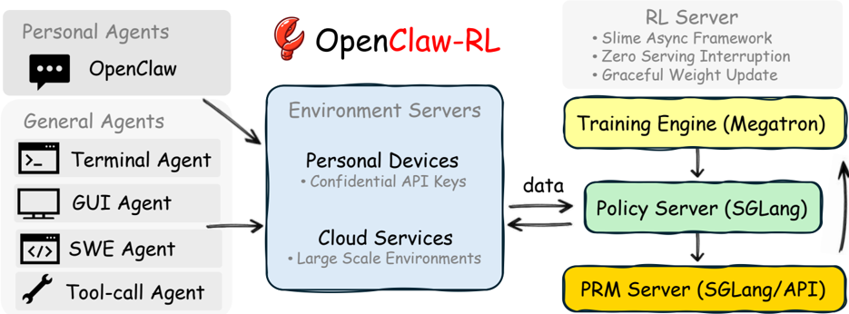

*Figure 1 | OpenClaw-RL infrastructure overview. Interaction streams come from two agent types: Personal Agents (conversational, personalized), hosted on personal devices, and General Agents (terminal, GUI, SWE, and tool-call agents), hosted on cloud services. The collected samples flow into our RL s*

**② 方法 / 架构图**

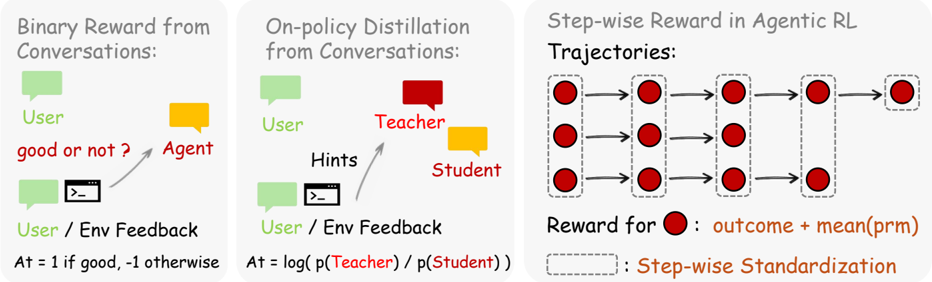

*Figure 3 | Method Overview. For personal agents, we support both binary-reward optimization and on-policy distillation training. In our experiments, we find that their combination yields significant performance gains. For general agentic RL, in addition to standard RLVR, we provide integrated step-w*

### 1. 相关工作与进展
LLM agent 已广泛部署(终端/GUI/SWE/tool-call);交互数据被用于改进 framework、构建 memory(Mem0/Cognee/Letta)、产训练数据,但鲜有把它当**在线、实时**学习源。现有 agentic RL 基础设施(slime [Sheng 2025]、OpenRLHF [Hu 2024]、AReaL [Fu 2025] 等)假设批量预采集数据。方法侧:RLVR 仅能用标量奖励;OPD [Agarwal 2024]、SDPO/SDFT [Hübotter/Shenfeld 2026]、hindsight relabeling 能用结构化纠正信息但都在固定数据集上操作;并发 Buening 2026 直接用 next-state 提示在线改策略,但纠正 hint 仍隐含在 prompt 中。

### 2. 现有工作存在的问题

- **基础设施**:RL server 需灵活对接用户多样且演进的 agent 框架,且优化须异步、不阻塞推理使用。
- **方法学**:RLVR 无法把 directive(纠正性)信号转成策略梯度;OPD/hindsight 虽能用结构化纠正,但只在固定数据集上做。OPD 还因 teacher–student 分布失配 [Li 2026] 训练不稳/失效,低质量 hint 时更严重。

### 3. Motivation
每个 next state(用户回复、工具输出、终端/GUI 状态变化)既隐含评价(re-query=不满、通过测试=成功、错误 trace=失败),又常携带指令信息("你应该先检查文件"在 token 级指明该怎么改)。回收这两类互补信号、统一进一次在线更新,并稳定其中的 OPD 蒸馏。

### 4. 主要灵感 / 核心直觉
evaluative 与 directive 互补:directive 更富信息(token-level)但更稀疏,evaluative 更频繁(标量)。OPD 的 token-level KL 监督(teacher 条件于纠正 hint)恰能承载 directive。稳定 OPD 的关键直觉:若所选纠正 hint 诱导的 teacher 分布与学生在高概率区高度重叠,则蒸馏梯度更 informative、off-policy importance ratio 接近 1,更新更稳。

### 5. 主要解决思路(一段话讲清核心)
基础设施:把 RL 系统扩成 server–client——RL server 把策略包成推理 API,用户终端经 OpenClaw 把交互数据 HTTP 流式回传;独立异步 PRM/Judge server 从 next state 抽 evaluative + directive 信号(不阻塞推理);slime 协调环境 server / PRM / Megatron 训练 / SGLang serving,零 serving 中断、graceful weight update。方法:hybrid RL 目标在单次更新融合 evaluative(RLVR 标量)与 directive(OPD token-level KL,teacher 条件于纠正 hint)两类 loss,配 overlap-guided hint selection 与 logprob-diff clip 稳定。

### 6. 方法详解(通俗、分步骤)

1. **Hybrid RL objective**:directive=OPD(token-level KL)+ evaluative=RLVR(标量奖励),单更新融合(附录 C 证明 OPD 目标即 token-level KL)。
2. **Overlap-guided hint selection**:候选纠正 hint 中,选其诱导 teacher 分布与学生 **top-k token 重叠最大**者(可逐 token 或序列聚合)。
3. **Log-probability-difference clip**:对 token-level logprob 差做 clip,bound 每 token advantage(personal 设置默认 C=1)。
4. **Step-wise / process reward**:通用 agentic RL 整合 outcome + process reward(PRM),强调过程奖励对长 horizon 稀疏奖励 agent 任务的重要性。
- 集成了社区 SDFT、SDPO 等方法到 `openclaw-opd/`。

### 7. 实验数据集

- **Personal agents**:用 LLM 模拟不同职业用户(学生避免 AI 痕迹 / 助教要详细评分 / 教师要友好评语)在 GSM8K 任务上使用 OpenClaw,度量"对齐各用户偏好所需最少 sessions"(连续 3 session 满足偏好即达标)。policy & reward 均 Qwen3-4B-Thinking-2507;用户用 Qwen3-32B 模拟。
- **General agents(Track 2)**:四类真实部署环境,模型分别为 Terminal=Qwen3-8B、GUI=Qwen3VL-8B-Thinking、SWE=Qwen3-4B、Tool-call=Qwen3-4B-SFT(Retool-4B,源自 Zhu 2025);训练数据分别为 SETA RL data / OSWorld-Verified / SWE-Bench-Verified / DAPO RL data;GUI 评在训练集(去 chrome 与 multi-apps),tool-call 评 AIME 2024,terminal/SWE 报窗口内平均 rollout-task acc。声称是首个统一这四类 agent 的开源 RL 框架。
- (注:正文实验未涉及 Qwen3.5;仓库 `openclaw-opd/run_qwen35_4b_openclaw_opd.sh` 与 slime qwen3.5-4B 配置存在,但非论文报告模型。)

### 8. 实验结果与主要发现

- **Personal**(Table 3,最少 sessions↓,5 trials 均值):joint 优化下 Hybrid RL 平均 **10.3** sessions,优于 GRPO 14.1、OPD 单用 29.7、Mem0 14.5、Cognee 14.9;separate 优化下 Hybrid 15.0 仍最优。注:纯 OPD 远差(29.7),增益主要来自 hybrid 融合;joint 优化放大 RL 增益而 memory 类几乎不变。
- **General**:hybrid RL 在四环境均优于纯 RLVR 且更稳定;next-state 信号在长 horizon 稀疏奖励环境尤其有用。
- **消融**:overlap-guided hint selection 与 logprob-diff clip 对效率/稳定性均关键;另有 k 与 support set S_i、PRM、policy/reward 模型组合的消融(§4.8–4.11)。
- 超参:personal lr 1e-5、每 16 样本触发一步;general lr 1e-6、KL 系数 0.01、clip 0.2/0.28、每步 GUI/SWE 采 8 任务、terminal 16、tool-call 32,各 8 samples;GUI/SWE/terminal 最大交互步 30/20/10。

### 9. 结果如何支撑其主张
"越用越强"由 personal 设置的 session-to-align 指标直接度量(Hybrid 最少 sessions)。"directive+evaluative 互补、hybrid 更优"由 hybrid 全面超 GRPO/纯 OPD 支撑(纯 OPD 反而最差,佐证单靠 directive 不稳、需 evaluative 兜底)。"稳定性来自 hint 选择/clip"由 §4.8–4.9 消融支撑。统一框架主张由四环境实跑支撑。

### 10. 逻辑自洽性(中性评估)
infra(slime 异步、server–client、零中断)与 method(hybrid+hint selection+clip)两条创新线自洽,且附录 C 把 OPD 归约为 token-level KL、与 evaluative 路径并列合理。但 personal-agent 评测高度依赖 LLM 模拟用户与硬编码偏好检测器(粗体/列表/长度/暖词),度量"对齐效率"而非真实能力提升,生态效度有限;general-agent 部分环境直接在训练集上评(GUI),需谨慎。

### 11. 残留问题 / 局限
〔待核〕HuggingFace Daily Papers #1 一说——已确认论文正文不含此声明(应出自仓库 README),保留为待核。模拟用户/检测器的生态效度;directive 信号质量依赖 PRM/hint 抽取质量;具体超参与 support set S_i 细节见附录 A。是否在真实人类用户上验证未知。

### 12. 开源代码与框架(链接+框架+代码可得性)
github.com/Gen-Verse/OpenClaw-RL(已 clone,~73M)。框架 **slime(THUDM/slime)异步 RL** 为核心,四解耦异步组件:环境 server、PRM/Judge(SGLang/API)、**Megatron**(策略训练)、**SGLang**(策略 serving);server–client 把模型包成 OpenAI 兼容 API(经 OpenClaw 插件),HTTP 流式回传在线训练,零 serving 中断、graceful weight update;也支持 Tinker 云端/本地 GPU 与 LoRA。三范式:Binary RL / OPD / Combine(Hybrid)。关键子目录:`openclaw-opd/`(OPD,含 topk 蒸馏 loss、qwen3/qwen35 launcher、集成 SDFT/SDPO)、`openclaw-rl/`、`openclaw-combine/`、`openclaw-test/`、`openclaw-tinker/`、`openclaw-fireworks/`;Track-2:`gui-rl/`(及 terminal/swe/toolcall 相关);含 `slime/`、`Megatron-LM/`、`extensions/`。

---

## pi_play — π-Play: Multi-Agent Self-Play via Privileged Self-Distillation without External Data

> **一句话重点 (TL;DR)**：自博弈在造题时天然产出一条 "问题构造路径(QCP)"，本文把它当作零成本的内禀特权信息，让同规模 teacher 据此对 student 做 token 级 reverse-KL 自蒸馏，从而把稀疏奖励自博弈变成稠密反馈的 data-free 自演化。

**元信息**：arXiv 2604.14054（v2 2026-05-25）｜ 中科院自动化所 + 国科大 + 美团 ｜ 2026-04 预印本 ｜ 主题 self-play + self-distillation for 深度搜索 agent，与 TSRD（QCP=foresight/教师脚手架）相关 ｜ 代码 github.com/zhyaoch/pi-play（README 注明 "Code will be released soon"，当前仅 README+images，**训练代码未发布**）｜ 框架 论文未绑定特定开源框架，student 用 GRPO。

### 关键图示

**① Motivation / 对比图**

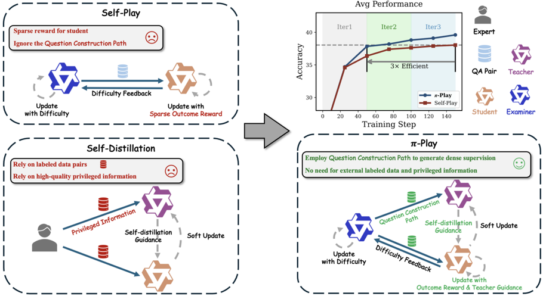

*Figure 1: Comparison of π -Play with other self-evolution frameworks. All models (examiner, teacher, and student) in π -Play are initialized from the same base LLM and function as search agents. π -Play uses alternating optimization to evolve multiple agents in a closed loop. Compared to self-play,*

**② 方法 / 架构图**

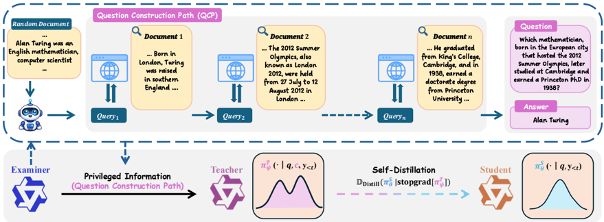

*Figure 2: Overview of QCP-guided self-distillation in π -Play. The examiner is equipped with search tools and interacts with the search engine to obtain factual information, ensuring the correctness of both the synthesized QA pairs and their construction paths c . The teacher policy π T ψ leverages*

### 1. 相关工作与进展
深度搜索 agent 结合 LLM 推理与外部搜索引擎做多轮检索分析；RL 能显著提升其推理与搜索行为（Search-R1、ToolForge 等监督 RL）。自博弈（Dr.Zero、SQLM、SSP）让同规模模型轮流当 examiner/student 以降低数据依赖；自蒸馏可改善 credit assignment，但需高质量特权信息。

### 2. 现有工作存在的问题
(1) 自博弈只给学生**稀疏结果奖励**，多轮搜索任务学习低效、信用分配弱；(2) 自博弈实际产出的不止最终 QA 对 (q,o)，还有被忽视的中间产物——**QCP(c)**，记录从答案反向构造问题的逆向解题过程，但现有自博弈无法直接拿它做 SFT；(3) 自蒸馏所需高质量特权信息获取代价高，且常依赖人类专家/更强模型与 curated QA 数据，难规模化。

### 3. Motivation
关键观察：自博弈天然、低成本、可规模化地产出 QCP，而 QCP 记录了问题如何从事实证据构造而来，正是一种**内禀特权信息**——可让同规模 teacher 在条件于 c 时生成比仅看 q 的 student 更准确的 rollout。由此把自博弈产生的 QCP 直接喂给自蒸馏，无需人类反馈或人工特权数据。

### 4. 主要灵感 / 核心直觉
"造题过程本身就是答案的脚手架"：既然 examiner 是从事实/答案反向构造问题，那条构造轨迹 c 天然包含解题所需的特权线索；用它做 teacher 的额外上下文，就能把稀疏的结果奖励转成稠密的逐 token 监督，而不引入任何外部数据。

### 5. 主要解决思路(一段话讲清核心)
三角色（examiner / teacher / student，均由同一 base LLM 初始化、均为带搜索工具的搜索 agent）交替优化：examiner 造出 (q,c,o)，teacher 条件于特权上下文 c、student 仅见 q；student 在结果奖励 + teacher 的逐 token reverse-KL 蒸馏联合作用下学习，形成 data-free 协同自演化闭环。

### 6. 方法详解(通俗、分步骤)

- **Examiner**：带搜索工具与搜索引擎交互获取事实，生成三元组 (q, c, o)；目标为造出多样且有难度的题（含难度奖励，并 −β·KL 约束；难度奖励随正确预测数线性衰减）。
- **Teacher**：理想目标 Eq.2 兼顾 "生成更准 rollout" 与 "不过度偏离 student"，但**实际实现并不直接优化该目标**，而是把 teacher 参数取为 student 的 **EMA 软更新**：\(\psi \leftarrow (1-\tau)\psi + \tau\theta\quad(\tau=0.05)\)，已核 Table 7），低成本提供稳定且随 student 缓慢演化的监督。
- **Student**：\(-D\big(\pi^S_\theta(\cdot \mid q) \,\big\|\, \mathrm{stopgrad}[\pi^T_\psi(\cdot \mid q, c)]\big)\)。
- **蒸馏权重衰减调度**：用衰减的 **λ**（distillation 系数）逐步弱化教师指导——Qwen3-4B/8B 取 0.03/0.003/0.002，Qwen3-4B-Instruct 取 0.1/0.03/0.03。〔修正：原分析在 §6/§8 误用 "β" 指代蒸馏衰减系数；论文中蒸馏权重为 λ，β 是 examiner 难度奖励/KL 系数——已统一改为 λ〕

### 7. 实验数据集
论文为 data-free 自演化，**不依赖任何外部训练数据**（无人工 demo/问题/答案）。〔已核 PDF §3.1〕

- 基座：Qwen3-4B、Qwen3-4B-Instruct、Qwen3-8B。
- 评测：3 个 one-hop/General QA（NQ、TriviaQA、PopQA）+ 4 个 multi-hop QA（HotpotQA、2WikiMQA、MuSiQue、Bamboogle）；统一 exact-match，检索器 E5-base，语料英文 Wikipedia dump。
- 基线：training-free（ReAct）、监督 RL（Search-R1、ToolForge）、自博弈（Dr.Zero、SQLM*）。

### 8. 实验结果与主要发现

- 流程（Algorithm 1）：每轮先训 examiner 50 步 → 生成学生训练数据 → 训 student 50 步（GRPO + teacher reverse-KL），每个 student step 后 teacher 做 EMA 软更新；共 3 轮 = **150 步**（远少于 Search-R1 等基线）。examiner 默认造 1/2/3/4-hop 比例 4:3:2:1。
- 主结论：data-free 的 π-Play 超过全监督搜索 agent——平均较 Search-R1 **+6.3% / +4.2% / +15.4%**（Qwen3-4B / 4B-Instruct / 8B）；演化效率较传统自博弈提升 **2–3×**（首轮即可媲美 Dr.Zero 三轮收敛值）。〔已核行 838、43/251、1057-1058〕
- 消融：QCP 优于其他特权信息形式（含 ground-truth）；衰减 λ 调度优于固定 λ。

### 9. 结果如何支撑其主张
"QCP=有用特权信息" 由 Table 3 消融支撑（QCP > Partial QCP > 无/替代特权信息）；"高效率" 由首轮即追平 Dr.Zero 三轮收敛、150 步胜全监督基线两点支撑。主张与证据方向一致。

### 10. 逻辑自洽性(中性评估)
内在逻辑自洽：把被忽视的造题副产物变成监督信号是清晰且新颖的因果链。但需注意 teacher 实际只是 student 的 EMA，"教师" 的额外能力完全来自条件于 c 的特权上下文而非独立训练，这与 §2.4 "理想 teacher 目标" 之间存在 "理想 vs 实现" 落差，论文已坦承。

### 11. 残留问题 / 局限

- **代码未发布**：框架/实现细节（搜索工具栈、reverse-KL 具体实现、examiner 难度奖励工程）无法核验，复现性受限。〔待核：完整训练代码待官方释出〕
- 评测局限于英文 Wikipedia QA（one/multi-hop）+ exact-match，未覆盖更开放的搜索任务；检索器/语料固定。
- "2–3× 效率" 的对比依赖与 Dr.Zero 等的同设定可比性。
- EMA teacher 是否在更大规模/更长训练下仍稳定优于直接优化 Eq.2，未做对照。

### 12. 开源代码与框架(链接+框架+代码可得性)

- 仓库：https://github.com/zhyaoch/pi-play（本地已克隆约 1.5MB，**仅含 README 与 images/，代码尚未发布**；TODO：paper 已发布、code 未发布）。
- 框架：论文未在正文绑定特定开源训练框架；student 用 GRPO，teacher 为 EMA 软更新，三角色交替优化。〔待核：框架实现细节待 code 发布确认〕
- 代码可得性：paper-only（"coming soon"）。

---

## rstar2 — rStar2-Agent: Agentic Reasoning Technical Report

> **一句话重点 (TL;DR)**：用"高吞吐代码执行环境 + 抗噪的 GRPO-RoC（Resample-on-Correct）+ 短长度多阶段 RL recipe"，在 64×MI300X、510 步 / 一周内把 Qwen3-14B-Base 推到前沿数学推理，AIME24=80.6/AIME25=69.8/HMMT25=52.7，并在 AIME24/HMMT25 上超过 671B 的 DeepSeek-R1（AIME25 基本持平）。

**元信息**：arXiv 2508.20722（v1, 2025-08-28, cs.CL）｜ Microsoft Research（Ning Shang、Yifei Liu、Yi Zhu、Li Lyna Zhang 等共同一作；Li Lyna Zhang、Mao Yang 为 project leaders / 通讯）｜ 技术报告, 2025-08 ｜ 主题 Agentic RL / 工具调用推理 / T2,T4，Relevance=High（GRPO-RoC 的"正样本筛优 + 负样本保多样"与本项目 path-selection / 高质量正样本+保留失败负样本相关）｜ 代码 https://github.com/microsoft/rStar（已克隆 ~576K，主仓为骨架 + submodule 引用，verl/code-judge 为 git submodule，浅克隆未拉取）｜ 框架 veRL v0.5 + Code Judge + vLLM

### 关键图示

**① Motivation / 对比图**

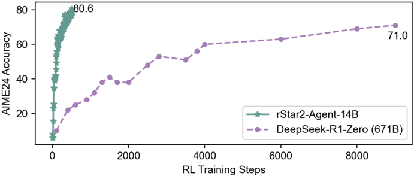

*Figure 1: rStar2-Agent-14B reaches frontier-level math reasoning, comparing AIME24 accuracy versus RL training steps against DeepSeek-R1-Zero (671B).*

**② 方法 / 架构图**

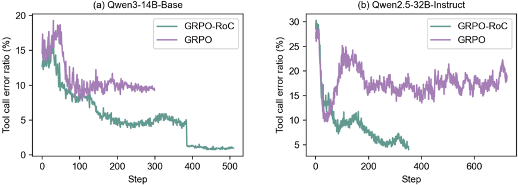

*Figure 4: Proportion of tool calls that contain errors within correctly answered trajectories. Under naive GRPO, the error rate initially decreases but soon plateaus at a significant level. In contrast, our GRPO-RoC continues to reduce tool-related errors with more training steps.*

### 1. 相关工作与进展
让模型"想得更聪明而非更长"需培养自主用工具来推理、验证、从工具反馈学习的能力。本工作以 Python 编码工具 + 解释器作 agentic RL 环境，拓宽动作空间、支持探索替代解与验证中间步骤，补足单纯 long CoT 的内部自反思不足。对比主流把 rollout 长度堆到 16K→48K 的做法，rStar2 走短长度路线。多分支仓：rStar2-Agent 在 main，prior work 在 `rStar-mutualreasoning`、`rStar-math` 分支。

### 2. 现有工作存在的问题
扩展 agentic RL 两大挑战：

- **环境噪声**：编码工具/解释器复杂，模型生成语法/逻辑错误代码时，环境反馈会让其浪费 token 纠错而非推进推理；现有 outcome-only 奖励的 RL 即便中间工具调用失败、只要最终答案对仍给正奖励，导致模型把错误当可接受、产出冗长低质轨迹（论文给出工具错误率随训练步数上升的观察，Qwen2.5-32B≈15%、Qwen3-14B≈10%）。
- **基础设施压力**：单 batch 可触发数万并发工具调用，难构建可靠高吞吐执行环境；agentic rollout 放大标准 RL 系统的 rollout 低效，严重拖慢训练。

### 3. Motivation
通过三项创新使 agentic RL 在规模上有效，从而在有限 GPU（64 张 MI300X）上把 14B 基座在 510 步 / 一周内推到前沿数学推理水平、并超越 671B DeepSeek-R1。

### 4. 主要灵感 / 核心直觉

- **非对称采样**：与其在 reward 里显式惩罚工具错误（易 reward-hacking、不稳），不如在采样层面对正/负轨迹差异化处理——正样本只留最干净的高质量成功轨迹作正监督，负样本均匀 downsample 以保留多样失败模式作负信号。
- **短而聪明**：不堆长度（避免 16K→48K 的高成本与冗长低质），用 8K→12K 短长度逼模型高效推理。
- **SFT 只打底不增推理**：先做 non-reasoning SFT 仅注入指令遵循/工具使用/格式，避免 SFT 过拟合、保持初始响应短。

### 5. 主要解决思路(一段话讲清核心)
三件套：(i) 可靠高吞吐 Python 代码执行环境（Code Judge + Redis + 隔离 worker）缓解高 rollout 成本；(ii) **GRPO-RoC**——在 GRPO 上加 Resample-on-Correct：先 oversample 较大 rollout 组再 downsample 到标准 batch，正轨迹按"工具错误/格式问题最少"筛优、负轨迹均匀下采样，用非对称采样抗稀疏 outcome-only 奖励下的环境噪声；(iii) 低成本训练 recipe——先 non-reasoning SFT，再用 GRPO-RoC 做短长度多阶段 RL（8K→12K→12K，共 3 阶段 510 步）。

### 6. 方法详解(通俗、分步骤)

- **(i) 高效 RL 基础设施**：Code Judge 作工具调用服务器执行模型生成的 Python（Redis + uvicorn + workers，多节点可扩展），应对单 batch 数万并发调用。
- **(ii) GRPO-RoC**：RoC 先 oversample 大组 rollout，再 downsample 到标准 batch；**正轨迹**保留工具错误/格式问题最少的最高质量样本，**负轨迹**均匀 downsample。这种非对称采样保留多样失败模式作负信号、强调高质量成功样本作正监督；相比在 reward 里惩罚工具错误更稳、避免 reward-hacking（从更干净的正样本学习）。
- **(iii) 训练 recipe**：① non-reasoning SFT——用 165K function-call 数据（117K ToolACE-11K + APIGen-MT-5K + Glaive-function-calling-v2-101k 等）仅注入工具格式与指令遵循，不增强推理；② 多阶段 GRPO-RoC：Stage-1 在 8K 长度做简洁训练（响应从约 1K 增长），Stage-2/3 提到 12K 并逐步加难，3 阶段共 510 步。

### 7. 实验数据集

- 基座 **Qwen3-14B-Base**。RL 训练数据（§4.1）：仅保留整数答案题以保 verifier 可靠，从三源收 >100K 候选——**17K** 来自 DAPO 训练集（整数答案子集）、**93K** 来自 AoPS 论坛（经 OpenMathReasoning）、**937** 来自 Project Euler——清洗后得 **42K** 高质量题-答对为最终 RL 训练集（开源 data_preprocess 以 DAPO-17k 为示例入口，论文实际用 42K 复合集）。
- 数学评测：AIME 2024 / 2025、MATH500、HMMT25。泛化评测：GPQA-Diamond（科学）、BFCL v3（agentic 工具）、IFEval、Arena-Hard。

### 8. 实验结果与主要发现

- 数学（pass@1）：rStar2-Agent-14B **AIME24=80.6 / AIME25=69.8 / HMMT25=52.7**。对照 DeepSeek-R1(671B) 79.8/70.0/44.4、o3-mini(medium) 79.6/77.0/53.0、DeepSeek-R1-Zero(671B) 71.0/53.3/46.0、Claude-Opus-4.0(Think) 76.0/69.2/-、QWQ-32B 79.5/65.8/47.5。即 14B 在 AIME24 与 HMMT25 上超 R1-671B，AIME25 基本持平（略低 0.2）。
- 效率：510 步 / 一周 / 64×MI300X 达前沿，响应显著更短。
- 泛化：GPQA-Diamond 超 DeepSeek-V3；BFCL v3、IFEval、Arena-Hard 均有竞争力。
- 消融/观察：GRPO-RoC 提升训练稳定性、避免 reward-hacking；从近零起步即被显著拉升。

### 9. 结果如何支撑其主张
"小模型超大模型 + 高效"由对照表（14B vs 671B/o3-mini）与 510 步/一周直接支撑。"抗噪有效"由 GRPO-RoC 提升稳定性、工具错误率观察与从近零拉升支撑。"短长度足够"由 8K→12K 设置 + 前沿成绩支撑（隐含对照主流 16K→48K）。泛化主张由跨任务结果支撑。需注意 AIME25 上并未严格超过 R1（持平/略低），TL;DR 的"超越"以 AIME24/HMMT25 为主。

### 10. 逻辑自洽性(中性评估)
三创新对应两挑战（基础设施↔环境压力、GRPO-RoC↔环境噪声、recipe↔成本），映射清晰。GRPO-RoC 的"正筛优/负保多样"与"避免 reward-hacking"动机一致。SFT 设为 non-reasoning 与"保持初始响应短/不过拟合"自洽。整体为工程+算法的技术报告，论证连贯。

### 11. 残留问题 / 局限

- 开源迁移版（VERL v0.2→v0.5）尚未完整训出模型（作者注前 50 步差异极小，但未给最终复现成绩）。
- 〔待核〕各阶段精确数据配比、步数划分、学习率等见 §4.3 Multi-Stage RL Training，本次未深读。
- 仅整数答案题以保 verifier，限制了任务多样性；AIME25 未严格超 R1 说明优势未必跨所有 benchmark 一致。
- 单一基座（Qwen3-14B-Base）、单一硬件栈（MI300X）；可靠性高度依赖 Code Judge 工程实现，迁移到其他环境的稳定性未验证。

### 12. 开源代码与框架(链接+框架+代码可得性)

- 链接：https://github.com/microsoft/rStar（main 分支为 rStar2-Agent；浅克隆未拉 submodule）。
- 框架：**veRL v0.5（volcengine/verl）+ Code Judge（0xWJ/code-judge）**；原训练基于 VERL v0.2 + 自研多轮工具框架，开源版迁移到 v0.5。Code Judge：Redis + uvicorn server（:8088, MAX_EXECUTION_TIME=4）+ workers。rollout/推理用 vLLM（`--enable-auto-tool-choice --tool-call-parser hermes`）。安装需 `torch<2.8`、`verl/requirements_sglang.txt`。
- 关键脚本：`data_preprocess/{aime2024,dapo}_rstar2_agent_loop.py`；训练 `examples/run_qwen3-14b_rstar2_agent_weave.sh`（8×A100/H100）；RoC 配置 `augmentation.do_down_sampling=True`、`down_sample_to_n=16`、`reject_equal_reward=True`、`roc_error_ratio=True`（按工具错误率重采正确轨迹）、`roc_answer_format=True`、`min_zero/non_zero_reward_trace_num=2`（保留最少正/负轨迹）；评测 `examples/{aime_eval,math500_eval}.sh`。
- 可得性：代码骨架 + 配置齐备，但 verl/code-judge 为 submodule（需 `git submodule init/update`），且迁移版未训出完整模型，端到端复现有门槛。

---

## score — From Correction to Mastery: Reinforced Distillation of LLM Agents (SCoRe)

> **一句话重点 (TL;DR)**：让小学生 agent **主导**轨迹生成、teacher **只纠正最早一步错误**,学生从"已验证前缀"续写并做短 horizon RL,把行为克隆的累积误差从 O(H²) 降到 O(H);RL 阶段从最早错误前的前缀起 rollout 并用 key-step 稠密奖励缓解稀疏奖励。

**元信息**：arXiv 2509.14257 (v2, 2025-10-09) ｜ 中科大 USTC(Yuanjie Lyu、Tong Xu 通讯) + Independent Researcher(Chengyu Wang 通讯、Jun Huang;原阿里相关) ｜ arXiv 预印本 2025-09(v2 2025-10) ｜ 主题 T2(agent/tool 蒸馏),与 mtp_opd 核心 path-selection + path-recovery / 教师纠正最早错误高度契合 ｜ 代码 github.com/modelscope/easydistill(SCoRe 在 `projects/SCoRe/`,整库 ~221MB) ｜ 框架 自定义工具链(LLaMA-Factory + LangGraph + veRL,非单一框架)

### 关键图示

**① Motivation / 对比图**

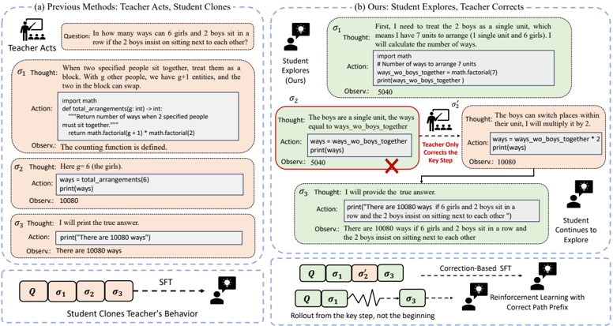

*Figure 1: Comparison between imitation-based distillation and our SCoRe framework. (a) Prior methods clone entire teacher trajectories. (b) Our approach lets the student explore, with the teacher correcting only the earliest error. Correction-based SFT mitigates the compounding errors of pure imitat*

**② 方法 / 架构图**

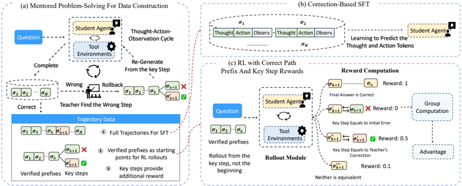

*Figure 2: The SCoRe framework. (a) A student agent attempts a task, and the teacher provides a single-step correction at the first error, creating student-centric training data. (b) The student is initially trained to imitate full solution trajectories via supervised fine-tuning. (c) The student is*

### 1. 相关工作与进展
LLM agent 经 ReAct 式"推理-动作-观测"迭代 + 外部工具(代码解释器、搜索)解复杂任务,但依赖超大昂贵 backbone(GPT-4/Qwen2.5-72B),延迟成本高。Agent Distillation(Kang et al. 2025)把 teacher 行为拆成 [Thought, Action, Observation] 轨迹让小学生模仿。本文构建于 **CodeAct**(action=可执行代码)。

### 2. 现有工作存在的问题
"teacher-acts, student-clones"全轨迹模仿两大 gap:(1) **Reasoning Ability Gap**——小模型难复现 teacher 逻辑分解;(2) **Knowledge Capability Gap**——照搬计划也可能因知识不足无法执行复杂动作。二者源于 emergent abilities,不能完全迁移。更关键:BC 中任一步失败把学生推入 OOD 状态,误差按 **O(H²)** 随 horizon 复合增长(Ross et al. 2011 DAgger 分析)。

### 3. Motivation
让学生**主导**、teacher **最小干预**(只纠最早错误),从而:(a) **Capability Matching**——轨迹复杂度匹配学生当前能力,数据可学;(b) **Deficiency Localization**——"已验证前缀 + 关键步"结构精确暴露弱点。把 teacher-student 分布偏移限制在单步,打破长误差链,累积误差 O(H²)→**O(H)**(论文附录给出 per-step 不等式推导)。

### 4. 主要灵感 / 核心直觉
纠错信号应施加在学生"最早出错"的那一步:此前前缀由学生自己生成(on-distribution),此后从被纠正的步起续写,既保证正确性又把监督定位到学生真实能力边界。

### 5. 主要解决思路(一段话讲清核心)
SCoRe(Student-Centered one-step Reinforcement)三阶段:先用少量 teacher 轨迹冷启动 BC;再让学生独立解题、teacher 只纠最早错误、学生从纠正前缀续写(必要时重复),保留"最小干预"纠正轨迹;最后做短 horizon RL——**从已验证前缀(最早错误前)起 rollout**(缩短 horizon、降梯度方差)并用 **key-step 稠密奖励**。

### 6. 方法详解(通俗、分步骤)

1. **Cold-Start BC**:在少量高质量 teacher 轨迹上 SFT,bootstrap 基础推理-动作技能。
2. **Mentored Problem-Solving (MPS) + SCoRe-SFT**:学生独立做新任务 → teacher 检查并纠正**最早错误** → 学生从纠正后前缀续写;若再错则重复。最终任务成功隐式验证修正正确性。纠正轨迹用于 SFT。
3. **SCoRe-RL** 两创新:(a) 从已验证前缀起 rollout 而非任务开头;(b) **key-step 稠密奖励**:最终答案正确 reward=**1**;关键步等于 teacher 修正 reward=**0.5**;关键步等于初始错误 reward=**0**;都不等价 reward=**0.1**(GRPO 式按组算 advantage)。RL 奖励正误由**轻量验证器 Qwen2.5-7B-Instruct**判语义一致性(注:与评测时用的 72B judge 不同,见 §7)。

### 7. 实验数据集
12 个 benchmark 三类(论文 §4.1 / Table 1–2):

- **数学(4)**:AIME2024、AIME2025、MATH500、OlympiadMath;
- **事实/多跳 QA(4)**:HotpotQA、2WikiMultihopQA、Musique、Bamboogle(开放域 QA 用 token-level F1);
- **agentic 深度搜索(4)**:GAIA、WebWalker、HLE、xBench(WebThinker text-only split)。
- **评测 judge**:math + deep-search 正误由 **Qwen2.5-72B-Instruct** 作 LLM-as-judge(Zheng et al. 2023 范式)判定;QA 用 F1。
- **student**:Table 1(math+factual)= Qwen2.5-7B / Qwen2.5-3B / Llama3.1-8B;Table 2(deep-search)= **Qwen3-8B-Instruct**。评测集组织参考 ARPO,GRPO/ARPO 数值多取自 ARPO 原文。

### 8. 实验结果与主要发现

- **math+factual(Table 1,8 项 Avg)**:Qwen2.5-7B SCoRe-RL = **50.8**(BC=42.5、GRPO=48.4、ARPO=49.3),仅比 72B teacher(51.7)低 **0.9**;较 BC **+8.3**(50.8−42.5,已核)。Qwen2.5-3B SCoRe-RL=46.7(较 BC +8.4);Llama3.1-8B=47.5(较 BC +10.2)。
- **deep-search(Table 2,Qwen3-8B)**:SCoRe-RL Avg = **30.5**,+7.7 over BC、+8.3 over GRPO、超 TIR-Qwen2.5-72B +3.2,部分子项超 teacher;GAIA-Avg 从 27.2 升。
- **消融(Table 3)**:去短 horizon rollout / 去 key-step reward 均掉点,二者齐备最优。Figure 3:hard data 上 SCoRe-RL>SCoRe-SFT。
- 〔待核〕RL 超参(组大小、lr、KL 系数)未在正文给出,见附录 B。

### 9. 结果如何支撑其主张
"逼近 teacher"由 7B 仅低 0.9、部分 deep-search 子项超 teacher 支撑;"O(H²)→O(H) 有益"由短 horizon rollout 消融掉点支撑;"key-step 暴露弱点有益"由 key-step reward 消融掉点 + Figure 3 hard-data 增益支撑;跨 3 个 student 一致较 BC 大幅提升支撑普适性。链条较完整。

### 10. 逻辑自洽性(中性评估)
整体自洽,但有一处**论文内部数值不一致(本轮发现)**:正文 §5 prose 写 7B "+6.3 over GRPO",但 Table 1 GRPO=48.4、SCoRe-RL=50.8,实差仅 **+2.4**,prose 的 +6.3 与自身表格矛盾(上一轮分析直接抄了 prose 的 +6.3,本轮按表格更正为 +2.4)。其余如 +8.3 over BC、deep-search +8.3 over GRPO 与表格自洽。另外:"最终任务成功隐式验证 teacher 修正正确性"是弱验证——任务成功不等于每步修正都正确,可能引入噪声标签;论文未量化误纠率。

### 11. 残留问题 / 局限

- teacher 需 Qwen2.5-72B 级模型生成纠正,蒸馏成本不低;真"小成本"仅指部署期 student。
- RL 奖励验证器(7B)与评测 judge(72B)不同,存在 reward hacking / 训练-评测口径不一致的潜在风险,论文未交叉验证。
- "最早错误"的定位依赖 teacher 判断,错判会污染 SFT/RL 数据;无误纠率量化。
- 论文 prose 与 Table 的 GRPO 增益不一致(见 §10),建议以 Table 为准。
- 〔待核〕RL 完整超参在附录 B。

### 12. 开源代码与框架(链接+框架+代码可得性)

- 仓库:https://github.com/modelscope/easydistill(SCoRe 在 `projects/SCoRe/{MPS, SFT, RL, inference}`;整库 clone ~221MB)。
- 框架(组合工具链,非单一):
  - Cold-start BC / SCoRe-SFT 用 **LLaMA-Factory**(`llamafactory-cli train/api`,README 明列 `pip install llamafactory langgraph`)+ **LangGraph**(agent 轨迹生成,`MPS/graph/{graph.py, graph_repair.py}`)。
  - SCoRe-RL 用 **veRL**(含 `verl/tools/search_tool.py` 工具调用)。
  - 推理 LLaMA-Factory api(`infer_backend: vllm|sglang|huggingface`)。
  - teacher 经 `QWEN25_72B_API_ADDRESS`/`_KEY` 走官方 API 或 `llamafactory-cli api --model_name_or_path Qwen/Qwen2.5-72B` 本地部署。
- 数据流水:`MPS/BC_init_data_gen.py` → `MPS/format/BC_init_llamafatory_format_convert.py` → BC 训练;部署学生 → `MPS/SCoRe_data_gen.py` 生成"学生中心、teacher 仅纠最早错"轨迹 → `SCoRe_SFT_llamafactory_format_convert.py` → SCoRe-SFT;`MPS/format/SCoRe_RL_convert.py` 过滤与 SFT 重叠样本 → verl parquet → `RL/.../run_qwen2.5-7b_agent_distill_tool_agent_mlflow.sh`。
- 数据:种子主要取自 **Tool-Star**(math: NuminaMath、Omni-Math;factual: HotpotQA/2Wiki/WebWalker),共 **35k QA 对**;**20%** 全程 teacher 标注作 BC,**80%** 经 MPS 生成后**对半分**(一半 correction-based SFT、一半 RL);RL 最大 rollout 步数=8。
- 致谢 verl、LLaMA-Factory、ARPO(评测集)、agent-distillation(prompt 灵感)。代码可得性 Tier A。

---

## search_dont_guess — Search, Do not Guess: Teaching Small Language Models to Be Effective Search Agents

> **一句话重点 (TL;DR)**：小模型(SLM)做 search agent 时反而比大模型**更少搜索、更易幻觉**(under-searching),且"自适应搜索"在 SLM 上会掉点(Adaptive Search Trap);本文用 **Always-Search Policy(ASP)** 显式约束"总是搜索、别猜",经 SFT/OPD/Mixed 三种实现把搜索行为蒸进 SLM,使 1.7B 逼近甚至局部超过 8B。

**元信息**：arXiv 2604.04651 (v1, 2026-04-06, cs.AI) ｜ NYU + UIUC + NTU(Yizhou Liu*、Qi Sun*、Yulin Chen、Siyue Zhang、Chen Zhao;*共同一作) ｜ arXiv 预印本 ｜ 主题 agentic RAG / SLM 蒸馏,Relevance=Med(把 **OPD** 作为三训练变体之一与 SFT、Mixed 实测对比,提供 OPD 在"让小模型坚持搜索"上的具体实证) ｜ 代码 github.com/yizhou0409/Agentic-Rag(100% Python) ｜ 框架 检索 E5+BM25 / Search-o1 式迭代 agent / 训练 SFT+OPD+RFT

### 关键图示

**① Motivation / 对比图**

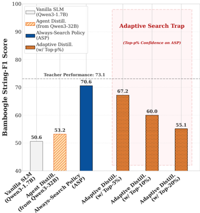

*Figure 1: Left: With Always-Search Policy, the distilled SLM significantly narrows the performance gap with the teacher model. Right: SLMs suffer from adaptive search and ASP is the most effective policy.*

**② 方法 / 架构图**

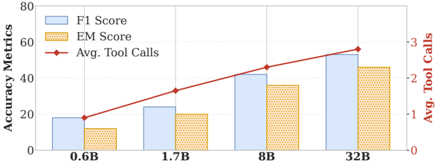

*Figure 2: Scaling of agentic search performance. Small models trail behind in both performance and retrieval capability on HotpotQA.*

### 1. 相关工作与进展
带搜索工具的 agent 是知识密集任务的有效方案,但依赖 ≥7B LLM,部署成本高。近期工作把 agentic 行为蒸到 <4B SLM(Agent Distillation 路线)。本文在此之上做全面评测并提出针对 SLM 的训练 recipe。

### 2. 现有工作存在的问题
全面评测发现:尽管参数知识更少,SLM 反而**更少调用搜索、更易幻觉**(under-searching,Figure 2)。直接蒸 LLM 轨迹效果差——LLM 轨迹常含"I remember…"式不搜索直接答的行为,被 SLM 学坏。更关键:让模型自己决定要不要搜的**自适应搜索在 SLM 上反而掉点**("Adaptive Search Trap")。

### 3. Motivation
作者用 **confidence probe** 检验 SLM 内部知识可靠性:SLM 高置信 query 远少于 teacher。⇒ SLM 不该依赖内部知识"猜",应"总是搜索、别猜"。需要一种训练显式约束搜索行为、强制 grounded 生成。

### 4. 主要灵感 / 核心直觉
对 SLM 而言,"一致地总是搜索"优于"自适应地按置信度决定是否搜索"——后者把不可靠的内部置信引入决策,放大幻觉。把这一先验直接编码进训练目标。

### 5. 主要解决思路(一段话讲清核心)
提出 **Always-Search Policy(ASP)**:训练时显式约束搜索行为,三种实现——(1) **SFT**:只保留"始终用搜索工具获取信息"(剔除"I remember"类)的高质量轨迹做监督;(2) **OPD(on-policy distillation)**:不显式过滤轨迹,而是用 system prompt 要求模型总是搜索,期望 teacher 的 log-prob 分布在 student 自身 rollout 上调控其搜索行为;(3) **Mixed**:先 ASP-SFT 再 OPD 强化。下游再加 **RFT(Rejection Fine-Tuning)** 选择性强化高质量 agentic 行为。整体是工程化 recipe,非新算法。

### 6. 方法详解(通俗、分步骤)

- 推理:Search-o1 式迭代 search agent,检索 = E5(embedding)+ BM25(keyword)双检索,summarizer = Qwen3-32B。
- **ASP-SFT**:从 HotpotQA 采 **18,000** 条 Qwen3-32B teacher 轨迹(String-F1>0.65 保留;且只留"始终搜索"轨迹),**3 epochs、lr 1e-5** 蒸馏。
- **ASP-OPD**:**3,000** 个 HotpotQA 训练题,每题学生采样 **8** 条轨迹,teacher 给 token 分布、最小化 KL,**4 epochs、lr 2e-6**;靠 system prompt 强制搜索而非显式过滤。
- **RFT**:学生自生成 **10,000** 条轨迹(与蒸馏用不同题),**2 epochs、lr 5e-6**,拒绝采样保留高质量行为。

### 7. 实验数据集

- **训练仅用 HotpotQA 训练集**(teacher = **Qwen3-32B**)。
- 评测:结构化多跳 HotpotQA / 2WikiMultiHopQA / Bamboogle / MuSiQue;agentic 信息检索 BrowseComp-plus / Frames / LongSeAL。指标 **String-F1**(也报 EM)。
- 检索器 e5-large-v2 + fullwiki-20210620 语料(BrowseComp-Plus 用 Qwen3-Embedding-8B + 自带语料)。
- 模型:Qwen3-0.6B/1.7B/4B/8B/32B、Llama-3.2-1B/3B。

### 8. 实验结果与主要发现

- **逼近大模型**(Table 1,String-F1):三种 ASP 法均使 1.7B 逼近 Qwen3-8B——HotpotQA 上 Mixed-1.7B = **58.2** ≈ 8B(58.2);**2Wiki 上 OPD-1.7B = 62.9,超过 8B(58.1)**。(注:上一轮已更正"OPD 56.2→62.9"的误读——56.2 是 OPD 的 HotpotQA 分、62.9 是其 2Wiki 分;本轮再核 Table 1 OPD-1.7B 行 = 56.2/62.9/61.4/… 属实。)
- **泛化**:只在 HotpotQA 训练却泛化到 OOD(BrowseComp/Frames/LongSeAL)。
- **搜索频率**(§4.2):vanilla 1.72 → ASP-SFT 2.47 → ASP-OPD 2.84 搜索/题(Vanilla-8B 亦 2.84)。OPD 在多个表上搜索频率最高,是本文 OPD 有效性的具体实证点。
- **噪声鲁棒**(10% 检索失败):vanilla SLM / 普通蒸馏掉 **12.1** 分,ASP 仅掉 **2.3 / 1.7**,显示更强恢复能力。
- **Adaptive Search Trap**:Adaptive Distill(Top-5/10/20% confidence)在 Bamboogle 等上劣于一致搜索的 ASP。

### 9. 结果如何支撑其主张
"SLM under-search"由 Figure 2 + confidence probe 支撑;"一致搜索优于自适应"由 Adaptive Distill 各档掉点支撑;"ASP 让 SLM 逼近 LLM"由 1.7B≈8B、2Wiki OPD>8B 支撑;"更 grounded/抗噪"由噪声实验 2.3/1.7 vs 12.1 支撑。支撑较直接。但"训练仅用 HotpotQA"既是泛化卖点也是局限——单源单任务,泛化结论的可靠性受训练分布单一性限制。

### 10. 逻辑自洽性(中性评估)
recipe 与诊断对齐,叙事自洽。中性看待:(1) 三种 ASP 实现孰优缺乏统一胜者(SFT/OPD/Mixed 在不同 benchmark 互有高低),论文未给清晰选择准则;OPD 的优势主要体现在搜索频率与个别 benchmark,而非全面占优;(2) "总是搜索"在 query 本可由内部知识快速回答时会增加延迟/成本(Table 5 显示 OPD-1.7B 端到端 ~3.1s),论文承认但未量化"过度搜索"代价;(3) 仅 Qwen3 系评测,跨家族结论保守(论文亦自述局限)。

### 11. 残留问题 / 局限

- 训练单一(仅 HotpotQA 单跳/多跳混合),跨域/跨任务训练分布缺失。
- "总是搜索"对简单 query 引入不必要搜索开销,无最优搜索预算分析。
- 检索噪声处理仅做 10% 失败注入的鲁棒性测试,缺更系统的对抗检索机制(论文列为 future work)。
- 评测集中于 Qwen3 家族(Llama-3.2 仅部分),跨架构普适性未充分验证。
- 仓库以语料/检索/推理脚手架为主,SFT/OPD/RFT 训练实现细节相对简略(在 appendix B)。

### 12. 开源代码与框架(链接+框架+代码可得性)

- 仓库:https://github.com/yizhou0409/Agentic-Rag(100% Python)。含 `build_corpus/`(`extract_wiki.py`、`build_e5_corpus.py`、`merge_e5_splits.py`:Wikipedia 语料构建/索引)、`e5_retriever.py` + `bm25_retriever.py`(双检索)、`main.py`(推理 pipeline)、`prompts/`(`default_QA.yaml`、`default_retrieval_summary.yaml`、`free_QA.yaml`)、`utils.py`。
- 框架:检索 E5(embedding)+ BM25(keyword);推理 Search-o1 式迭代 search agent;训练含 SFT、OPD、RFT 三阶段(trainer 实现见 appendix,仓库内偏脚手架)。
- 代码可得性:Tier B——语料/检索/推理可跑,但训练(SFT/OPD/RFT)脚本不完整,复现需补 appendix B 细节。

---

## search_r1 — Search-R1: Training LLMs to Reason and Leverage Search Engines with Reinforcement Learning

> **一句话重点 (TL;DR)**：把搜索引擎调用嵌进 RL 训练循环——用结构化标签做多轮"推理↔检索"交织生成,对检索回来的 token 做 **loss masking**,仅用最简的 **EM 结果奖励**(无过程/格式奖励),即可让 LLM 自发学会"何时检索、检索什么、如何结合检索继续推理"。

**元信息**：arXiv 2503.09516 (v5, 2025-08-05;COLM 2025 会议论文);实证扩展见 arXiv 2505.15117 ｜ UIUC(Bowen Jin、Zhenrui Yue、Dong Wang、Jiawei Han)+ UMass Amherst(Hansi Zeng、Hamed Zamani)+ Google Cloud AI Research(Jinsung Yoon、Sercan Ö. Arık) ｜ 2025-03 首发,COLM 2025 ｜ 主题 T2(agentic/工具调用 RL),与本课题相关:多轮"推理-检索"交织端到端 RL、检索 token loss masking、纯结果奖励——可作 agentic OPD 的对照/底座 ｜ 代码 github.com/PeterGriffinJin/Search-R1(Tier A,~8.3M) ｜ 框架 veRL 定制 fork

### 关键图示

**① Motivation / 对比图**

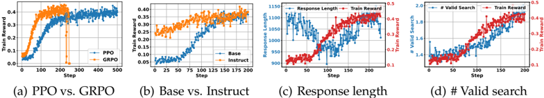

*Figure 2: (a) PPO vs. GRPO: GRPO generally converges faster but may exhibit instability after trained for a number of steps, whereas PPO provides more stable optimization but converges at a slower rate. (b) Base vs. Instruct LLM study: Instruction-tuned LLMs converge faster, but the final performanc*

**② 方法 / 架构图**

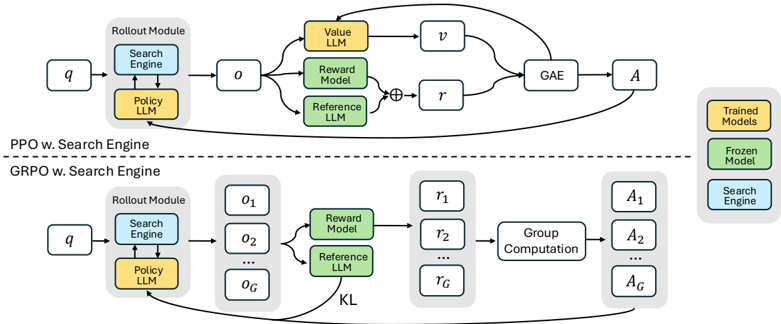

*Figure 1: Demonstration of PPO and GRPO training with the search engine (SEARCH-R1). During the rollout, LLMs can conduct multi-turn interactions with the search engine.*

### 1. 相关工作与进展
LLM 推理时常需外部知识/时效信息。已有两类:(1) **RAG**——单轮"检索→生成",query 质量与多轮交互受限;(2) **搜索当工具**——提示式/SFT 式工具调用泛化差。R1/o1 表明纯结果奖励 RL 能自发涌现推理能力,本文将其扩展到"会调用搜索引擎"的场景。已被 veRL 官方、SkyRL、Thinking Machines Tinker-cookbook 集成复现。

### 2. 现有工作存在的问题
(1) 如何把搜索引擎**稳定地**嵌入 RL 训练循环——检索回来的 token 不应被当作策略生成 token 优化(否则训练不稳);(2) 是否需要复杂过程奖励,还是简单结果奖励即可;(3) 多轮交织检索-推理的结构化建模缺失。

### 3. Motivation
让 LLM 在 RL(规则化结果奖励)中自主学会"何时检索、检索什么、如何结合检索结果继续推理",无需过程监督或检索标注,得到完全开源、可替代 OpenAI DeepResearch 的工具增强推理 RL 方案。

### 4. 主要灵感 / 核心直觉
检索内容是"环境观测"而非策略输出,故须从策略梯度中屏蔽;而最终答案正确与否(EM)已是足够的学习信号,无需精心设计过程奖励——把复杂性留给模型自己在 RL 中涌现。

### 5. 主要解决思路(一段话讲清核心)
用结构化标签把"多轮推理-检索"显式建模,生成遇 `</search>` 即抽 query 调检索、把结果包进 `<information>` 拼回上下文继续生成;在 PPO/GRPO 的 token 级损失上对**检索回来的 token 做 masking**(只对 LLM 生成 token 计损),仅用 EM 结果奖励 + 对 π_ref 的 KL 约束做策略更新。

### 6. 方法详解(通俗、分步骤)

- **多轮交织生成**:结构化标签 `<think></think>`(推理)、`<search></search>`(触发检索的 query)、`<information></information>`(检索返回内容)、`<answer></answer>`(最终答案)。
- **检索 token 的 loss masking**:对 PPO/GRPO token 级损失,只对 LLM 生成 token 计损(I(y_t)=1),检索 token 置 0,避免对外部 token 求梯度致训练不稳。
- **奖励设计**:仅用规则化结果奖励(基于答案 Exact Match),不用过程奖励或格式奖励(论文论证最简奖励已足够)。
- **目标函数**:带 KL 约束(对 π_ref)的策略梯度,兼容 PPO 与 GRPO;**默认 PPO**("Unless stated otherwise, PPO is used as the default RL method")。

### 7. 实验数据集

- **训练**:合并 **NQ + HotpotQA** 训练集。
- **评测(7 QA)**:单跳 NQ、TriviaQA、PopQA;多跳 HotpotQA、2WikiMultiHopQA、Musique、Bamboogle(in-domain=NQ/HotpotQA,余 5 项 OOD)。
- **知识源**:2018 Wikipedia dump;检索器 **E5**(稠密);检索文档数主实验固定 **top-k=3**(另做 k=1/3/5 消融)。指标 **Exact Match(EM)**。
- **模型**:Qwen2.5-3B/7B(Base 与 Instruct);Llama3.2 见后续实证扩展版(2505.15117),COLM 主文仅用 Qwen2.5。

### 8. 实验结果与主要发现

- **主结果(EM,Table 2)**:Qwen2.5-7B Search-R1-base Avg = **0.431** vs RAG **0.304**,相对提升约 24%;Qwen2.5-3B 约 20%(同检索器/语料/训练集/预训练模型设定)。
- **口径差异(论文内)**:摘要写"24%(7B)/20%(3B)";贡献处另给"**41% / 20%**"(同一 setup 下不同 baseline 取法)。两者并存,摘要为主口径。
- **PPO vs GRPO(§5.1)**:GRPO 收敛更快但长训后**奖励坍缩**,PPO 更稳定;两者最终奖励相当。
- **奖励/标签消融**:简单 EM 结果奖励已足够;Base 与 Instruct 模型均能自发学会多轮检索-推理行为。

### 9. 结果如何支撑其主张
"搜索可稳定嵌入 RL"由 loss masking 下训练稳定 + 跨 7 数据集一致增益支撑;"简单结果奖励足够"由无过程奖励仍涨点支撑;"自发涌现检索-推理"由 Base 模型也学会多轮行为支撑。支撑充分。中性提示:24% vs 41% 两口径并存易致引用混淆,需注明 baseline 取法。

### 10. 逻辑自洽性(中性评估)
方法-实验-结论自洽,是该方向的奠基工作之一(被广泛复现佐证其可靠性)。中性看待:(1) EM 作奖励对"语义正确但表述不同"会误判,可能压低真实能力上限并诱导格式拟合(论文未深究 reward hacking);(2) in-domain 仅 NQ/HotpotQA 两源,OOD 增益虽存在但训练分布仍偏窄;(3) 24%/41% 双口径属表述瑕疵,非逻辑硬伤。

### 11. 残留问题 / 局限

- EM 结果奖励的语义盲区(同义/格式差异误判),可能限制上限并引入 reward hacking 空间。
- 检索质量(E5 + 2018 Wikipedia 静态语料)是上界约束;时效性、在线搜索噪声未在主实验充分压测。
- GRPO 长训坍缩问题只描述未给根因/修复方案(留作默认 PPO 规避)。
- 主文仅 Qwen2.5;跨架构(Llama)结果在扩展版(2505.15117),COLM 主文不含。
- 摘要(24%/20%)与贡献(41%/20%)口径不一,引用时须注明。

### 12. 开源代码与框架(链接+框架+代码可得性)

- 仓库:https://github.com/PeterGriffinJin/Search-R1(origin 已核,Tier A,~8.3M)。含仓库内自带 `verl/`(基于 veRL 的定制 fork,见 `VERL_README.md`=HybridFlow/veRL)、`train_ppo.sh`、`train_grpo.sh`、`retrieval_launch.sh`、`search_r1/{llm_agent, search}`(核心逻辑)、`scripts/data_process`(NQ/HotpotQA 数据处理)、`infer.py`。
- 框架:**veRL**(仓库内置定制版);rollout 用 vLLM(0.5.x/0.6.x);支持 PPO、GRPO、REINFORCE 等(默认 PPO);检索支持本地稀疏(BM25)/稠密(E5+ANN)与在线搜索引擎。
- 复现:启动检索服务(`retrieval_launch.sh`)→ NQ+HotpotQA 构造带结构化标签 prompt → veRL 跑 PPO/GRPO rollout(遇 `<search>` 调检索、`<information>` 拼回)→ 仅对生成 token 计损(检索 token masked)→ EM 结果奖励 + KL 约束更新。
- 代码可得性:Tier A(完整可跑,社区多方复现)。

---

## sod_stepwise — SOD: Step-wise On-policy Distillation for Small Language Model Agents

> **一句话重点 (TL;DR)**：把 OPD 用于小模型 agent 的工具集成推理（TIR）会因工具错误触发的"加速分布漂移"而训练崩溃；SOD 按 step 级师生发散自适应重加权蒸馏强度（高发散区衰减、重对齐时回升），在对齐区保留 dense 监督，使 0.6B/1.7B 学生相对最强基线 OPD 平均 +20.86%/+18.50%。

**元信息**：arXiv 2605.07725v1（2026-05-08 Preprint） ｜ 浙大 + 腾讯 LLM 部 + 中科大 + 新加坡国立（Qiyong Zhong、Mao Zheng、Mingyang Song 共同一作；Junfeng Fang、Houcheng Jiang 通讯） ｜ 主题 T1/T2 High（OPD + 小模型 agent TIR + step 级自适应重加权，与本项目 path-recovery / MTP foresight 探针直接呼应） ｜ 代码 https://github.com/YoungZ365/SOD （已克隆约 23MB，基于 verl，含 recipe/examples/docker） ｜ 框架 veRL fork + Open-AgentRL + ReTool agentic 组件

### 关键图示

**① Motivation / 对比图**

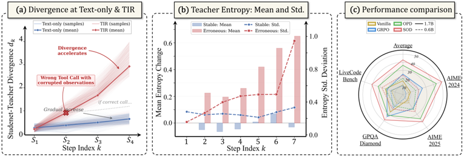

*Figure 1: The motivation of SOD . (a) Student-teacher divergence d k across reasoning steps, sampled from 800 trajectories: in TIR, erroneous tool calls cause divergence to accelerate sharply, unlike the gradual drift in text-only reasoning. (b) Teacher entropy statistics over 800 sampled trajectori*

**② 方法 / 架构图**

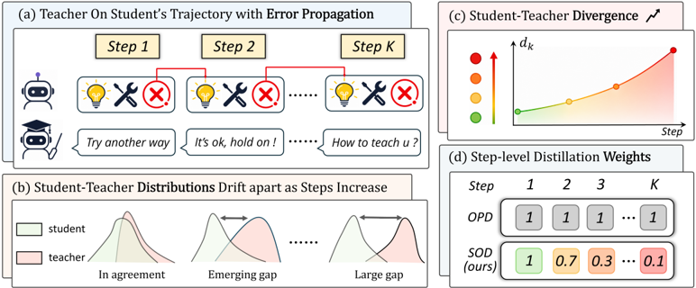

*Figure 2: The overview of SOD . (a) The student generates multi-step trajectories where erroneous tool calls propagate across steps, degrading teacher supervision reliability. (b) Student-teacher distributions drift apart as errors accumulate. (c) Step-level divergence d k quantifies this drift. (d)*

### 1. 相关工作与进展
Agentic 能力多依赖大模型，推理成本高；将其迁移到可端侧部署的 SLM 有实践价值。TIR 后训练主流基于 RL（GRPO），只给稀疏 outcome 级 reward。OPD（on-policy distillation）提供 dense token 级监督，缓解 credit assignment、提升样本效率与稳定性，是把大模型 agentic 能力蒸到小模型的自然候选。训练数据/框架沿用 Yu et al.[52]（"Demystifying RL in agentic reasoning"，对应仓库 `recipe/demystify/`）与 ReTool。

### 2. 现有工作存在的问题
小模型容量有限、探索弱，稀疏 outcome 监督会加剧探索失败、陷入 cold-start。但直接把 OPD 用于 SLM-based TIR 会出现严重训练不稳定/崩溃。根因：TIR 经工具交互引入"非连续状态跳变"——单次错误工具调用注入错误观测，使后续推理在被污染状态上展开；teacher 工具使用准而小模型弱，早期累积多次错误工具调用，状态分布迅速偏离 teacher。在这些 OOD 状态上 teacher 的 token 级监督变得不可靠甚至误导（Fig.1：错误轨迹上 teacher 熵均值与方差在后段急剧增大），错误沿后续推理步级联放大，放大师生发散并诱发不稳定梯度。

### 3. Motivation
区别于文本推理中渐进式的分布漂移，TIR 的发散是由工具错误触发的"加速"漂移。需要按 step 级发散自适应调节蒸馏强度：在对齐良好的状态保留 dense 监督，在高发散状态衰减可能误导的 teacher 信号。

### 4. 主要灵感 / 核心直觉
用相邻 step 的发散比（而非绝对发散值）来调权：发散单调上升时累乘比值 <1、自动压低被污染信号权重；一旦重新对齐（d 下降）则允许蒸馏强度回升。仅依赖比值意味着任何与真实师生发散 ∆k 单调一致的可观测代理 dk 皆可用（Appendix D.5）。

### 5. 主要解决思路(一段话讲清核心)
定义 step-level divergence score d_k 作为 teacher 监督可靠性的可观测代理；据相邻 step 发散比累乘得到每步权重 w_k（上界 1+δ）；把 w_k 作用于该 step 内所有 token 的蒸馏损失，从而在高发散区衰减、在良好对齐区保留 dense 指导。整体目标为 GRPO + 加权 OPD 的联合损失。

### 6. 方法详解(通俗、分步骤)

- d_k：实现为该 step 内 token 的 mean(|log π_θ − log π_teacher|)，作为 teacher 监督可靠性代理。
- 权重（Eq.7）：w_1=1；step k≥2 权重为 1..k−1 各相邻发散比 \((d_u + \varepsilon) / (d_{u+1} + \varepsilon)\) 的**累乘**，并以 1+δ 为上界（δ=0.2，ε=1e−6）。发散单调上升 → 累乘 <1 抑制被污染信号（Appendix D.4 证加权二阶矩被压制 \(O\left((d_1/d_k)^2\right)\)）；d 下降（重对齐）→ 蒸馏强度回升。
- 施加粒度：w_k 作用于该 step 全部 token（非逐 token 均匀施加）。
- 联合目标：\(L = L_{\mathrm{GRPO}} + L_{\mathrm{OPD}}\)（OPD 系基线均用此口径）；开销可忽略（d_k/w_k 复用 OPD 前向已有的师生 logprob，仅 O(K) 标量运算）。

### 7. 实验数据集

- 训练数据（沿用 Yu et al.[52]）：3k 高质量多轮推理 SFT 语料（s1-1k 1k + LeetCode 1k + ReTool 1k，后两者经 ReasonFlux-PRM 打分各取 top-1k）+ ~30k RL 数据（DAPO-Math 17k + Skywork-OR1 Math 4902 / Code 3586 + MegaScience 3k）。SFT 轨迹由 Qwen3-Coder-30B-A3B 在 SandBoxFusion 环境内端到端交互生成。
- 评测（均报 average@32，百分比；temp=1.0、top_p=0.6、每题 32 采样）：Math=AIME 2024/2025、Science=GPQA-Diamond、Code=LiveCodeBench（v6 近期窗）。
- 模型：teacher 为 Qwen3-4B 经 GRPO 在 RL 数据上进一步优化（默认 4B teacher）；student 为 Qwen3-0.6B 与 Qwen3-1.7B。

### 8. 实验结果与主要发现

- 主结果：SOD 在两个 student 上对第二好基线（OPD）相对平均提升 0.6B +20.86%、1.7B +18.50%；四任务均最高分。0.6B student 在 AIME 2025 达 26.13%（average@32），据称为首个达到该水平的 sub-billion 模型。
- 基线含 SFT、GRPO 及多种蒸馏方法（共 6 个，Appendix B.3）；SFT/GRPO 单独均显著弱于蒸馏系。
- 开销（Table 4）：d_k/w_k 仅 O(K) 标量运算，显存差 <0.5GB；0.6B 上 SOD 反而比 OPD 快 3.5%（1052.3s vs 1090.5s，因自适应重加权抑制了错误学习、失败重试更少），1.7B +4.9% 开销（1105.4s vs 1053.6s）。
- 稳定性：错误轨迹后段 teacher 熵均值/方差急剧增大（Fig.1），SOD 重加权压制该区监督，缓解崩溃。

### 9. 结果如何支撑其主张
"OPD 在 SLM-TIR 上不稳"由 Fig.1 的发散/熵证据支撑；"step 级重加权有效"由消融（Table 2 移除 step-wise 退化）与主结果（对 OPD 的 +20.86%/+18.50%）支撑；"开销可忽略"由 Table 4 支撑；理论上加权方差被压制有 Appendix D.4 证明。证据链较完整，5 个随机种子重复增强了可靠性。

### 10. 逻辑自洽性(中性评估)
方法-动机-理论-实验四者自洽：动机（工具错误触发加速漂移）→ 代理 d_k（师生 logprob 差）→ 比值累乘权重（Eq.7）→ 方差压制证明（D.4）→ 代理单调一致性证明（D.5）→ 消融。一个口径需注意：主卖点是"对最强基线 OPD 的相对平均提升"（百分比口径），绝对点数提升（如 0.6B 整体由约 21→24+ 区间）规模较小，相对数放大了观感。

### 11. 残留问题 / 局限

- 模型/工具单一：仅 Qwen3 单一模型族、python 解释器（SandBoxFusion）单一工具环境验证；作者亦将 web/API 等其他 agent 设置与其他模型族列为局限。
- 相对增益口径：+20.86%/+18.50% 为对 OPD 的相对百分比而非绝对点数，需结合绝对值理解。
- d_k 代理依赖师生 logprob 差，teacher 自身在 OOD 状态的 logprob 可靠性边界未充分刻画（高熵区 logprob 噪声大可能反噬 d_k 估计）。

### 12. 开源代码与框架(链接+框架+代码可得性)

- 仓库 https://github.com/YoungZ365/SOD （已克隆约 23MB）。框架：veRL[76] + Open-AgentRL[52]（`recipe/demystify/`，复用其 sandbox_fusion 工具配置）+ ReTool（`recipe/retool/`）；rollout 走 vLLM（TP=4），SandBoxFusion 作 python 解释器、最多 16 轮工具调用。
- **〔重要更正——核心算法已开源〕** 与早前"step-wise 重加权核心损失未在仓库定位到"的判断相反：核心实现确在已发布代码中。`verl/trainer/ppo/ray_trainer.py:363 compute_stepwise_opd_weights` 完整实现 Eq.6/7——按 response_mask 提取 step 边界、`\(d_k = \mathrm{mean}(|\log \pi_\theta - \log \pi_{\mathrm{teacher}}|)\)`、`w_1=1`、`\(w_k = \min\left(\prod_{u=1}^{k-1} \frac{d_u + \varepsilon}{d_{u+1} + \varepsilon},\; 1 + \delta\right)\)`、再 broadcast 到该 step 全部 token；由 `ray_trainer.py:878 _apply_token_kl_regularizer`（line 1622 处调用）将其乘到 OPD 优势项 `\(\mathrm{weighted\_opd} = \mathrm{opd\_coef} \cdot \mathrm{stepwise\_weights} \cdot \mathrm{raw\_local\_adv}\)`。配置见 `verl/trainer/config/algorithm.py` 的 `TokenKLRegConfig`（stepwise_enable/epsilon/delta/opd_coef），运行脚本 `examples/SOD/run_sod.sh` 显式传入 `+algorithm.token_kl_reg.stepwise_*`。代码与论文 Eq.7 精确一致，可复现。
- **〔次要差异〕** 配置 dataclass 默认 `stepwise_delta=0.5`，但 `run_sod.sh` 覆写为 0.2（论文值），复现须用脚本而非 dataclass 默认。
- 训练硬件：单节点 8×H20（96GB）；0.6B/1.7B 1 epoch 约 2–3 天，4B/14B teacher 约 5–6 天；统一超参（AdamW lr=1e-6、batch 64、mini-batch 16、prompt≤2560、response≤20480、训练每 prompt 采 16、验证 32）；所有实验 5 个随机种子重复。

---

## spear — SPEAR: Learn the Ropes, Then Trust the Wins — Self-imitation with Progressive Exploration for Agentic RL

> **一句话重点 (TL;DR)**：针对多轮 agent RL 中机械熵最大化易致不稳定的问题，SPEAR 用"课程化自模仿学习（SIL）+ 内在奖励塑形"在自身经验引导下渐进调节策略熵（早期广探索、后期收敛利用），在 ALFWorld/WebShop/Sokoban/AIME 上稳定提升 GRPO/GiGPO/Dr.BoT，且额外开销仅理论 10%–25%。

**元信息**：arXiv 2509.22601v4（Date 标注 2025-09-22；v4 2025-12-07 cs.LG） ｜ 腾讯优图 Youtu-Agent Team（通讯 yuleiqin/arthurtan@tencent.com） ｜ venue 〔待核：早前分析称"ICLR 2026 接收"，但 PDF 正文/页眉/页脚均无接收声明，全文唯一 ICLR 出现处为 ReAct[4] 的 ICLR 2023 引用；会议接收状态未经一手来源证实，已删除该断言〕 ｜ 主题 T2 agentic RL（自模仿 + 课程化探索管理长程稀疏奖励，replay buffer 存好轨迹做 off-policy 更新——与 OPD"用优质轨迹引导学生"思路相通） ｜ 代码 https://github.com/TencentYoutuResearch/SPEAR （已 clone 约 96MB，含 verl/ + verl-agent/，HF 有模型 collection） ｜ 框架 veRL + verl-agent

### 关键图示

**① Motivation / 对比图**

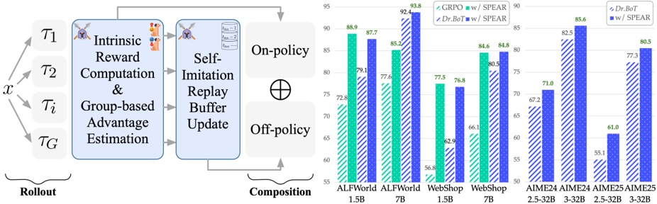

*Figure 1. Our SPEAR harmonizes the curriculum-scheduled self-imitation learning with intrinsic reward shaping for progressive exploration, improving policy performance across agentic tasks.*

**② 方法 / 架构图**

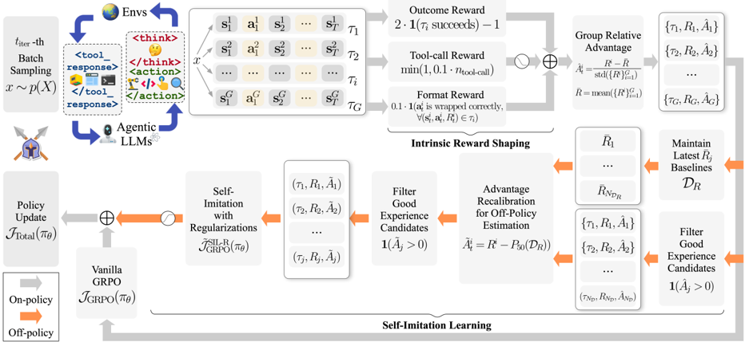

### 1. 相关工作与进展
RL 是磨炼 LLM 长程、稀疏奖励 agent 任务中策略性工具使用能力的主流范式（基于 ReAct 范式，应用含机器人导航、移动助手、web 导航、deep search、GUI），核心难题是探索-利用权衡。已有工作多从策略熵视角刺激探索（熵最大化/正则化技术），也有用 cold-start SFT 或 RL+SFT 混合方案提稳定性。

### 2. 现有工作存在的问题

- 纯熵控制在多轮 agent 中脆弱：环境反馈带来的低概率 token 累积引发严重分布漂移，导致 mode collapse；agent 对多轮交互的不确定性会引起持续熵增长（runaway divergence）或塌缩，训练不稳。
- cold-start SFT / RL+SFT 混合虽提稳定，却限制策略发现 SFT 语料之外的新策略。
- 用 replay buffer 做 off-policy 更新时优势函数需重算、且 off-policy 数据带来不稳定。

### 3. Motivation
能否在策略自身经验引导下平滑调度"何时探索、何时利用"，把策略熵维持在"随时间演化、动态但受控"的区间——早期增大熵做 skill-level 广度探索，后期收敛熵做 action-level 利用/巩固——以实现渐进式探索-利用平衡，而非机械熵最大化。

### 4. 主要灵感 / 核心直觉
"先学规矩，再信战果"（Learn the Ropes, Then Trust the Wins）：前期靠辅助工具使用奖励促频繁工具交互、广探索；待对环境熟悉后再强化对成功轨迹的自模仿利用。用课程调度把这一直觉操作化为跨阶段的两路权重调整。

### 5. 主要解决思路(一段话讲清核心)
在 vanilla SIL（独立 replay buffer 仅存回报超基线的 state-action 对、做 off-policy 更新）基础上，用课程跨阶段联合调节"内在奖励塑形"与"自模仿"两路权重；对 buffer 经验做优势重校准以避免重算优势，并正则化策略更新以稳熵、抑制 reward hacking。训练 batch 同时含 on-policy 与 replay buffer 的 off-policy 数据。

### 6. 方法详解(通俗、分步骤)
基于 group-based RL（类 GRPO）：同一输入生成一组多轮工具交互轨迹 → episode 级奖励计算与优势估计 → 走两条路：

1. **课程调度**：跨阶段联合调"内在奖励塑形"与"自模仿"权重——前期辅助工具使用奖励促 skill-level 探索，后期强化 self-imitation 利用成功轨迹。
2. **优势重校准（advantage recalibration）**：处理 buffer 经验的 off-policy 性质，避免对历史经验重算优势。
3. **策略更新正则化**：稳定熵、缓解 reward hacking / 分布漂移。
数据流：(a) 内在奖励塑形 + 优势估计 + on-policy 更新（类 vanilla GRPO）；(b) 过滤优质轨迹入 replay buffer，经优势重校准 + 正则化做 self-imitation off-policy 更新；课程跨阶段调两路权重以控熵区间。基于 verl-agent 实现多轮 rollout。

### 7. 实验数据集

- agent benchmark：ALFWorld（文本具身交互）、WebShop（网购）。SPEAR 对 GRPO/GiGPO/Dr.BoT 分别带来最高 16.1%/5.1%/8.6%（ALFWorld）与 20.7%/11.8%/13.9%（WebShop）成功率提升。
- Sokoban 视觉推箱子（Qwen2.5-VL-3B-Instruct，Table 5）：SPEAR 把 GRPO 67.1→86.7（+19.6%）、Dr.BoT 76.0→85.4（+9.4%）。
- 数学推理 AIME24/AIME25（带 code interpreter）：SPEAR 对 Dr.BoT 分别 +3.8%/+6.1%。
- 模型：Qwen2.5-1.5B/7B-Instruct、Qwen2.5-32B（code interpreter）、Qwen2.5-VL-3B-Instruct（Sokoban）。
- 开销：理论复杂度仅 +10%~25%，实际每迭代运行时开销可忽略。

### 8. 实验结果与主要发现

- 跨四类任务（文本 agent、视觉 agent、数学+工具）对多个强基线一致提升，验证 plug-and-play 可扩展性。
- 构建并对比强工业基线 Dr.BoT（bag-of-tricks of industrial RL optimizations），SPEAR 在其上仍有正增益，说明增益非来自弱基线。
- 课程化 SIL 把熵维持在受控区间，避免熵塌缩与 runaway divergence（对应 Motivation）。

### 9. 结果如何支撑其主张
"渐进式探索-利用优于机械熵最大化"由跨基线（GRPO/GiGPO/Dr.BoT）一致正增益支撑；"非弱基线红利"由对自建强基线 Dr.BoT 仍有提升支撑；"plug-and-play、低开销"由 +10%~25% 理论复杂度 + 可忽略运行时开销支撑。证据覆盖四类任务，外部效度较好。

### 10. 逻辑自洽性(中性评估)
方法-动机自洽：针对"机械熵最大化不稳"提出"经验引导的受控熵调度"，三项改造（课程、优势重校准、正则化）分别对应稳定性的三个来源（探索-利用时序、off-policy 偏差、熵/hacking）。一个评估张力：SPEAR 由"课程调度 + 优势重校准 + 正则化 + 内在奖励塑形"多组件叠加，论文虽给跨基线增益，但各组件的独立消融与课程超参敏感性需结合附录核验方能判断增益归因。

### 11. 残留问题 / 局限

- venue 状态未经一手证实（见元信息），引用时勿标注会议接收。
- 多组件配方，增益归因到单一机制（课程 vs 优势重校准 vs 正则化）需更细消融支撑。
- 内在奖励塑形依赖"辅助工具使用奖励"的设计，跨环境可迁移性与 reward hacking 风险（虽有正则化缓解）需进一步验证。
- 课程跨阶段权重的调度依赖阶段划分超参，自动化/自适应程度有限。

### 12. 开源代码与框架(链接+框架+代码可得性)

- 仓库 https://github.com/TencentYoutuResearch/SPEAR （已 clone 约 96MB，最新 commit 0edca96）。
- 结构含 `verl/` 与 `verl-agent/` 两个子目录（在 veRL + verl-agent 之上实现）；verl-agent 提供 GiGPO 等 group-based RL 的多轮 agent 扩展。
- README 明确为 curriculum-based SIL 框架，给出 Self-imitation Learning 配置项（`enable_trajectory_replay` 是否启用 self-imitation loss、replay buffer 最大轨迹数等），与论文方法一致。基线含 GRPO、GiGPO、作者构建的强基线 Dr.BoT。HF 有发布模型 collection（yolay/spear-…）。代码可得、配置可定位。

---

## sweet_rl — SWEET-RL: Training Multi-Turn LLM Agents on Collaborative Reasoning Tasks

> **一句话重点 (TL;DR)**：在多轮 agent 任务上，用训练期才可见、actor 看不到的额外信息（最终结果 + 参考解）训练一个非对称的 turn-level critic 做 step 级信用分配；关键设计是"直接用动作 log-prob 参数化 advantage 函数 + Bradley-Terry 目标"，避开在 LLM 上训 value head 损泛化的问题；并配套开源多轮协作 benchmark ColBench。

**元信息**：arXiv 2503.15478（v1, 2025-03-19, cs.LG）｜ FAIR at Meta + UC Berkeley（Yifei Zhou, Song Jiang, Yuandong Tian, Jason Weston, Sergey Levine, Sainbayar Sukhbaatar\*, Xian Li\*）｜ arXiv 2025-03 ｜ 主题 多轮 agent step 级信用分配 + 新 benchmark / 相关性 中高（非对称 critic 用 teacher 特权信息做信用分配，与 TSRD 把 teacher 参考路径/foresight 用于 scaffold/信用分配同构，可作 asymmetric-critic 路线代表 baseline；不涉及 MTP）｜ 代码 https://github.com/facebookresearch/sweet_rl ｜ 框架 OpenRLHF 定制 fork（`YifeiZhou02/collab_openrlhf`，支持 multi-turn DPO + length normalization）

### 关键图示

**① Motivation / 对比图**

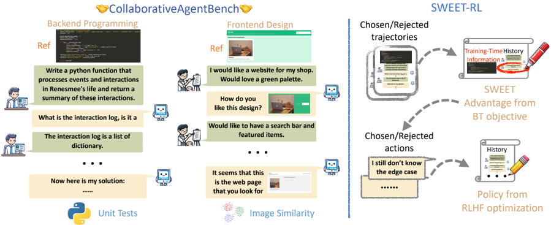

*Figure 1 (Left) Overview of our ColBench including Backend Programming and Frontend Design that supports cheap and reliable evaluation of multi-turn RL algorithms for agents in realistic settings. (Right) The high-level motivation behind SWEET-RL that uses additional training-time information along*

**② 方法 / 架构图**

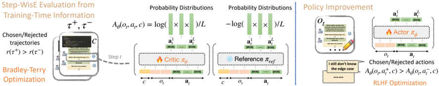

*Figure 2 textbfAn overview of the training procedure of SWEET-RL. At a high level, we first apply Bradley-Terry objective to directly train a step-wise advantage function with access to additional training-time information. Once the advantage function is trained, we perform policy improvement by usi*

### 1. 相关工作与进展
LLM agent 需在真实任务中做多轮交互；要在序列决策任务上拿到最好性能，需直接优化多轮目标（如成功率），比 next-token 预训练只模仿每轮最可能动作更难。现有多轮 RL 路线包括 RAFT/DPO/PPO 系单轮方法外推、value-function/TD-learning、Path Consistency 等。

### 2. 现有工作存在的问题

- 把单轮 RLHF 方法（RAFT/DPO/PPO）直接用于多轮、不做跨轮显式信用分配，长 horizon 下高方差、样本复杂度差。
- value function 学习（TD-learning）需在 LLM 表征上训任务专用 value head，微调数据有限时泛化差（与 next-token 预训练目标差异大）。
- 缺乏同时满足三条件的 benchmark：(1) 任务多样性避免过拟合；(2) 足够复杂挑战推理/泛化；(3) 最小工程开销便于快速原型。现有 benchmark 无一兼具。

### 3. Motivation
利用一个常被忽视的事实：训练期可拿到 actor 推理时拿不到的额外信息（最终 outcome、reference solution）。这种非对称信息可为"信息搜寻型"动作的信用分配提供捷径。

### 4. 主要灵感 / 核心直觉
直接拿训练期额外信息训标量 value 会偏离 next-token 目标、损泛化；故改为**直接学 advantage 函数**（用每轮动作平均 log-prob 参数化）并用偏好（Bradley-Terry）目标对齐 LLM——这比"在 hidden state 上训 value head"更契合预训练 LLM。

### 5. 主要解决思路(一段话讲清核心)
两阶段：先用训练期额外信息 c（actor 不可见）训一个 turn-level critic，直接建模 turn-wise advantage（用动作 log-prob 参数化、BT 轨迹级目标），再把该 advantage 当每轮 reward model 对 actor 做 RLHF 式优化。配套提出 ColBench 多轮协作 benchmark 做评测。

### 6. 方法详解(通俗、分步骤)
两部分贡献：

1. **ColBench（Collaborative Agent Benchmark）**：聚焦 artifact creation 的多轮人机协作任务，含 Backend Programming（写 Python 函数）与 Frontend Design（做网页）。用 LLM 当 human simulator 且给其 reference artifact 以保证忠实模拟；用 functional evaluator（单元测试 / 图像相似度）客观度量产出与参考的相似度。>10k 程序化生成任务，可扩展、可调难度。
2. **SWEET-RL（RL with Step-WisE Evaluation from Training-time information）——两阶段**：
   - 阶段一（训 critic/advantage）：用训练期额外信息 c（如 reference solution，actor 不可见）训 turn-level critic，利用 critic 与 actor 的**非对称观测空间**。**直接建模 turn-wise advantage 函数**（用每轮动作平均 log-prob 参数化），不先学 value 再求 advantage。同任务下取两条轨迹按累积奖励标 chosen/rejected，在轨迹级用 **Bradley-Terry 目标**训该 advantage 函数。
   - 阶段二（policy improvement）：把训好的 advantage 函数当每轮 reward model，对 actor 做 RLHF 式 per-step 优化。

### 7. 实验数据集
ColBench 两任务：Backend Programming、Frontend Design。Backend 数据生成：用 Llama-3.1-70B-Instruct 从 DCLM 抽取片段生成 Python 函数 + 高层描述 + 单元测试，仅保留能过单测的；train 10k、test 1k（test 经作者人工检查）。15k 离线训练轨迹由 Llama-3.1-8B-Instruct 当 agent、Llama-3.1-70B-Instruct 当 human simulator 零样本生成。backbone：Llama-3.1-8B（agent）。

### 8. 实验结果与主要发现

- 相较其他 SOTA 多轮 RL，ColBench 成功率与 win rate 绝对 +6%。
- 使 Llama-3.1-8B 在协作内容创作上匹配/超过 GPT-4o（部分超 o1-mini）。
- baselines 含 RAFT/DPO/PPO 系、value-function/Bellman bootstrapping/Path Consistency 路线，及闭源 GPT-4o、o1-mini。

### 9. 结果如何支撑其主张
在自建 ColBench 上对一组 SOTA 多轮 RL 的一致 +6% 绝对提升，加上匹配 GPT-4o 的端到端表现，支撑"非对称 critic + 直接学 advantage + BT 目标"做 step 级信用分配的有效性。但提升幅度属稳健而非数量级，且评测局限于自家 benchmark。

### 10. 逻辑自洽性(中性评估)
设计自洽：非对称信息→直接学 advantage（避 value head 泛化问题）→BT 目标对齐 LLM→当 reward model 优化 policy。代码框架（OpenRLHF fork 的 multi-turn DPO）与方法的偏好学习目标一致。最大假设依赖在于"训练期可得 reference solution"——这是方法成立的前提，但也是其外推到真实场景的主要限制。

### 11. 残留问题 / 局限

- 增量是"非对称 critic + 直接学 advantage + BT 目标"的组合，依赖训练期可得 reference solution 这一较强假设（真实场景未必有）。
- ColBench 的"人类"用 LLM simulator 近似，且 simulator 依赖 reference artifact，模拟忠实度受 simulator 能力上限约束。
- 提升幅度（+6% 绝对）稳健但非数量级；仅在自建 benchmark 验证，跨 benchmark 泛化未证。
- 与 TSRD 是思路同构（特权信息做信用分配）而非直接可用方案；最大可复用资产是开源 benchmark + 数据。

### 12. 开源代码与框架(链接+框架+代码可得性)

- https://github.com/facebookresearch/sweet_rl （ColBench + SWEET-RL 官方实现）；数据集 https://huggingface.co/datasets/facebook/collaborative_agent_bench 。
- 框架：基于 **OpenRLHF 的定制 fork**（`YifeiZhou02/collab_openrlhf`），改造以支持 multi-turn DPO 与 length normalization（README 训练用 `openrlhf.cli.train_dpo`）。Frontend Design 评测需额外装 GeckoDriver + Firefox（渲染 HTML）。
- 流程：生成任务与离线轨迹 → 构 chosen/rejected 偏好对 → BT 目标训 turn-wise advantage（critic 用训练期信息 c）→ 用 advantage 当 per-turn reward 优化 policy。human simulator 用 Llama-3.1-70B-Instruct。

---

## tcod — TCOD: Exploring Temporal Curriculum in On-Policy Distillation for Multi-turn Autonomous Agents

> **一句话重点 (TL;DR)**：在多轮 agent 场景下 vanilla OPD 会因跨轮误差累积出现"轨迹级 KL 不稳定"（KL 飙升、成功率坍塌），TCOD 用一条时间课程逐步扩大暴露给学生的轨迹深度（F2B 浅到深 / B2F 由 teacher 前缀导航后到前），在保留 OPD 稠密信号的同时稳住训练并最高 +18 分。

**元信息**：arXiv 2604.24005（v3, 2026-04-29，cs.LG）｜ Tongyi Lab, Alibaba Group + 香港中文大学（CUHK）｜ 预印本 2026-04 ｜ 主题 T1(On-Policy Distillation)+T2(多轮自主 agent)，与 mtp_opd 高度相关 ｜ 代码 https://github.com/kokolerk/TCOD （已 clone ~84MB，可运行配置齐全）｜ 框架 Trinity-RFT（Ray-based RFT，Alibaba）

### 关键图示

**① Motivation / 对比图**

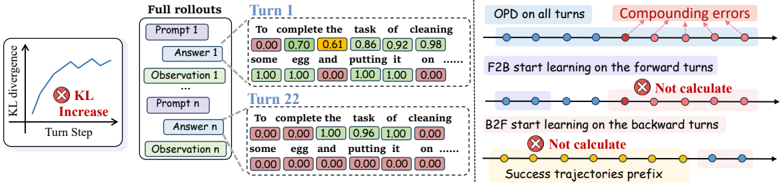

*Figure 1: (left) In OPD for multi-turn agents, as the number of turns increases, the teacher assigns progressively lower probabilities to tokens in student-generated responses, indicating increasing KL divergence at each turn, rendering the supervision signal unreliable. (right) OPD uses all turns a*

**② 方法 / 架构图**

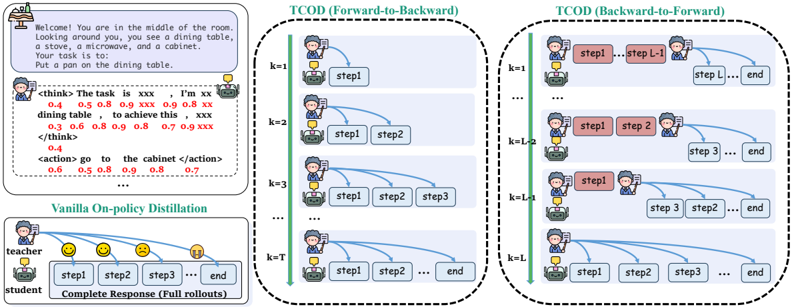

*Figure 3: Overview of our method TCOD-F2B/B2F. Comparison of vanilla on-policy distillation and TCOD. Left is the OPD, middle is the illustration of TCOD-F2B, and right is TCOD-B2F. k is the linear pacing control the trajectory length. The blue step is executed by the student, and the red step is ex*

### 1. 相关工作与进展

- **多轮 LLM agent**：ReAct（reason+act 交错）是主流范式，应用于具身规划、网页导航等交互环境；OpenClaw 等系统推动长程 agent。
- **On-Policy Distillation 及其改进**：OPD（Agarwal 2024 GKD；Lu & Thinking Machines Lab 2025）用稠密蒸馏信号替代稀疏标量奖励、提升样本效率；既有改进集中在目标设计（forward/backward KL 平衡，Jang 2026、Jin 2026 即 entropy-aware OPD）、优化启发（reward clipping，Ko 2026）、监督来源（context distillation、self-distillation）——但均面向**单轮静态**任务。
- **课程学习**（Bengio 2009）：近期被用于 LLM 预训练/后训练与 RL（GRPO），但多依赖**外部模型评估难度**；Lauffer 2025 只用 expert 后续纠错动作训练学生，破坏了 on-policy 设定。TCOD 以"递增轨迹深度"定义难度，只用学生自生成数据，避开外部难度评估器。

### 2. 现有工作存在的问题
作者在 ALFWorld 上实证出 **Trajectory-Level KL Instability（轨迹级 KL 不稳定）**：

- 观察1：训练中 KL 持续**升高**且成功率**坍塌至近零**（与单轮设置 KL 收敛递减相反；Fig.2a/2b，小模型 Qwen3-0.6/1.7B、Qwen2.5-0.5/1.5B 上显著）。
- 观察2：即使最终收敛，初始 KL 极高（~1000 量级 vs 收敛 ~60，Fig.2c）。
- 机理：**跨轮误差累积（compounding error）**——学生动作/观测追加到历史 ht，因果耦合使 per-turn KL 随轮次单调增大（Fig.2d），学生被推出 teacher 有效支撑（support），teacher 对学生 token 赋低概率、监督信号失真。Remark 1 区分：long-CoT 只增长同一环境状态下的响应长度，而多轮 agent 每轮更新环境状态，才真正放大累积误差。

### 3. Motivation
如何在保留 OPD 稠密信号优势的同时，避免长 horizon 累积误差导致的失稳？借鉴课程学习（先易后难）：**控制暴露给学生的轨迹深度**，让学生始终停留在 teacher 有效指导范围内，从短稳定前缀渐进扩展到完整多轮 rollout。

### 4. 主要灵感 / 核心直觉
误差累积是长 horizon 的固有属性；与其一开始就让学生端到端跑完整轨迹（必然进入 teacher 支撑外），不如沿时间维度做课程——要么从轨迹早段学起逐步加深（F2B），要么让 teacher 把环境导航到接近终止状态、学生从"成功门口"接管再逐步前移（B2F）。难度 = 轨迹深度 k，可由训练步线性 pacing 自动调度，无需外部难度评估器。

### 5. 主要解决思路(一段话讲清核心)
TCOD 用线性 pacing \(k = k_{\mathrm{start}} + \lfloor n/\eta \rfloor\)（n 当前步、N 总步、η 控制增长率）沿训练步控制轨迹深度 k，并给出两个仅需极小代码改动的变体：**F2B**（学生 rollout 至多 k 步，k 从小到大，目标只对前 k 步算 token-level KL）；**B2F**（teacher 用预采集成功轨迹 τ\* 执行前 L−k 步把环境导到中间状态、stop-gradient，学生从该状态接管后 k 步并对其算 KL，k 递增直到学生端到端）。学生执行步计算 KL 梯度，teacher 执行步停梯度。

### 6. 方法详解(通俗、分步骤)

- **前置定义**：状态 \(h_t = (o_0, a_0, \ldots, o_{t-1}, a_{t-1}, o_t)\) 为完整交互历史；OPD 目标 \(L_{\mathrm{OPD}} = \mathbb{E}_{\tau \sim \pi_\theta} \sum_t D_{\mathrm{KL}}\big(\pi_\phi(a_t \mid h_t) \,\|\, \pi_\theta(a_t \mid h_t)\big)\)（reverse-KL，teacher πϕ、student πθ）。
- **TCOD-F2B（Algorithm 1）**：每训练步 \(k \leftarrow \min(k_{\mathrm{start}} + \lfloor n/\eta \rfloor,\ T_{\max})\)；学生从 h0 起 rollout k 步；\(L = \sum_{t=0}^{k-1} D_{\mathrm{KL}}(\pi_\phi \,\|\, \pi_\theta)\)；更新 θ。先学早轮信号再端到端，防 horizon 诱发的 KL 坍塌；无需任何示范。
- **TCOD-B2F（Algorithm 2）**：预采集 teacher 成功轨迹 T\*（pass@10 采样，保留成功）；每步 teacher 执行 τ\* 的前 L−k 步（stop-gradient）把环境带到中间状态，学生从 t=L−k 接管到 L，仅对学生步算 KL；k 递增直到学生从初始状态端到端。论文用 Appendix D.5 验证：随训练步 teacher 前缀从 L−1 降到 0，测试集端到端成功率稳步上升，证明课程平滑过渡避免了 train-test 分布漂移。
- **异步训练稳定性细节**：异步 rollout（4×H20 actor）/训练（2×H20 learner）/teacher（2×H20），lock-free ring buffer；**staleness-aware 子轨迹经验回放**——把长度 n 的轨迹拆成 n 个递归前缀子轨迹入 buffer，交互历史封装进 prompt 作结构化上下文；用 staleness filter 丢弃 \(n_{\mathrm{current}} - n_{\mathrm{old}} > \Delta_{\max}\) 的经验，经验上 Δ_max=2 最优。

### 7. 实验数据集
三个多轮 agent benchmark（Table 1）：**ALFWorld**（具身，max 30 turns，含 seen/unseen/hard split）、**WebShop**（电商，max 15 turns，需 ~1TB 内存）、**ScienceWorld**（科学推理，max 30 turns，需 Java/jar）。Hard split = 121 个 teacher 在 train split 上 pass@10 仍失败的任务。师生对：ALFWorld 主实验 student=Qwen2.5-{3,7}B、teacher=GRPO 训练的 Qwen2.5-7B（域内 SR 85.71）；跨 benchmark student=Qwen3-{1.7,4}B、teacher=Qwen3-30B-A3B-Instruct（通用、域内偏弱）。8× H20(96GB)。

### 8. 实验结果与主要发现

- **Q1 缓解 KL 升高 + 提升性能（Table 2，Qwen2.5-7B teacher）**：Qwen2.5-3B 上 F2B 在 Valid Unseen 较 OPD **+18.74 SR**、Seen +15.71；7B 上 B2F Seen +11.06、Hard +7.44。平均减少约 2.97 个动作轮次；KL 曲线更平稳、advantage 收敛更快（Fig.4/5）。
- 跨 benchmark（Table 3，Qwen3-30B teacher）：对 Qwen3-1.7B，vanilla OPD 几乎全崩（avg 0.17），TCOD 把三 benchmark 平均拉到 ~18.6（**+18.4~18.7**，从近零恢复）；对 Qwen3-4B 提升温和（avg +0.3~+1.9，与 OPD 相当）。
- **Q2 超越 teacher 能力边界**：Unseen 上较 teacher 最多 +2.5；**Hard split 上 teacher SR 仅 6.61，B2F 反超最高 +14 分**（B2F 7B 达 20.66）——非单纯模仿。
- **Q3 鲁棒性与效率**：η∈{2,4,6} 下性能波动 <2%；总训练时间较 vanilla OPD 减少近 32%（F2B 比 B2F 更省，因 B2F 中间状态接管后仍多探索几步）。teacher 质量比规模更决定上界：域内强的 7B-RL teacher 下 B2F 可略超 teacher（+0.7），而通用 30B teacher 下 OPD/TCOD 均差 teacher ~2 分。

### 9. 结果如何支撑其主张

- "失效模式真实存在"：Fig.2（KL 升高 + 成功率坍塌 + per-turn KL 随轮次增）直接对应"轨迹级 KL 不稳定 + 误差累积"机理。
- "课程能稳训练"：Fig.4b KL 曲线 TCOD 明显更平、Fig.5 response length/pg_loss 平滑，支撑"控制轨迹深度即可稳住"。
- "超越 teacher"：Hard split（teacher pass@10 失败任务）上的正增益是较强证据，说明学生学到的是更鲁棒策略而非复制 teacher。
- 效率主张由 Fig.6 训练时间柱状图（OPD vs F2B vs B2F）支撑。

### 10. 逻辑自洽性(中性评估)
整体自洽：失效现象→机理（误差累积）→对策（控制轨迹深度的时间课程）→两变体（F2B 无需示范 / B2F 需 teacher 成功轨迹）逻辑闭环，且课程末端回到端到端、消解了 B2F 的 train-test mismatch（有 Appendix D.5 佐证）。一个张力点：观察机理中作者自己承认"KL 升高既可能是学生模仿不能、也可能是学生进入 OOD 致 teacher 不确定"二者难以区分，但两种解释指向同一对策，不影响方法有效性。Qwen3-4B 上 TCOD 仅与 OPD 相当（非显著提升），说明收益高度依赖"学生本会崩 + teacher 域内够强"的条件。

### 11. 残留问题 / 局限

- B2F 依赖预采集 teacher 成功轨迹，有额外采样开销（F2B 是无示范替代）。
- 固定课程 pacing 虽鲁棒，但最优节奏可能随环境/师生对变化；作者建议未来用 KL 的 EMA 做自适应 horizon，尚未实现。
- 仅在三个**文本**多轮 benchmark 验证，未覆盖多模态/物理具身。
- 收益条件性强：teacher 域内性能（而非规模）是上界主因；通用强 teacher 下 TCOD 无法超越 teacher。
- 〔待核〕各师生对完整数值、k_start/η 取值与超参表见论文 Appendix C/D（正文已给 k_start=1、η=2 默认，η∈{2,4,6} 消融）。

### 12. 开源代码与框架(链接+框架+代码可得性)

- 仓库 https://github.com/kokolerk/TCOD （已 clone，构建于 Trinity-RFT）。README 明确"What Is Implemented"：三环境各一套 multi-turn OPD + TCOD-f2b + TCOD-b2f workflow（`trinity/common/workflows/envs/TCOD/{alfworld,webshop,scienceworld}`）、基于师生 token-level logprob 的蒸馏信号、可运行示例配置 `TCOD_examples/<env>/{opd,tcod_b2f,tcod_f2b}.yaml`。
- 模型：ModelScope `wjqkoko/TCOD`；HuggingFace `kolerk/tcod`。
- 关键配置：`algorithm.advantage_fn: multi_turn_opd`；`rollout_args.logprobs` 必须开启以算蒸馏 gap；TCOD 配置用 `workflow_args.checkpoint_strategy: linear`（即线性 pacing）。
- 框架：Trinity-RFT（`trinity run --config <yaml>`，Ray 驱动），依赖 vLLM 类推理 + flash-attn 2.8.1；环境 ALFWorld（pip）/ WebShop（princeton-nlp/webshop，需 Java17+、~1TB 内存）/ ScienceWorld（allenai，jar）。代码可得性高、与论文方法对应清晰。

---

## webagent_r1 — WebAgent-R1: Training Web Agents via End-to-End Multi-Turn Reinforcement Learning

> **一句话重点 (TL;DR)**：用端到端多轮 on-policy RL（M-GRPO + 动态上下文压缩 + 并行轨迹 rollout），仅靠二值任务成功奖励，把 web agent 从 prompting/BC 水平大幅提升；并系统说明 BC warm-up 不可或缺、long-CoT 帮 SFT 但限制 RL 探索、以及"增加交互轮数"这一新的 test-time scaling。

**元信息**：arXiv 2505.16421v2（cs.CL，2025-10-08）｜ UVA（Zhepei Wei，实习于 Amazon）+ Amazon + Georgia Tech ｜ 预印本 ｜ 主题 T2 web agent / 多轮 RL，与 mtp_opd 关系：纯 on-policy 多轮 RL（**非蒸馏、无 teacher 监督**），可作"无 teacher 的多轮 agent RL"对照；warm-up(BC)+端到端 on-policy 与 path-recovery/初始化策略相关 ｜ 代码 https://github.com/weizhepei/WebAgent-R1 （已 clone，约 150MB）｜ 框架 **verifiers**（willccbb/verifiers，GRPO-based）

### 关键图示

**① Motivation / 对比图**

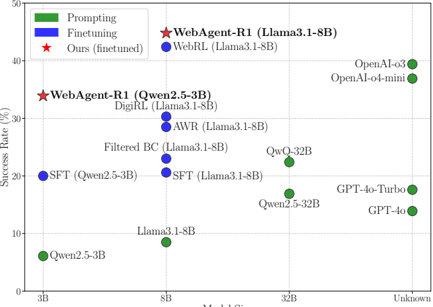

**② 方法 / 架构图**

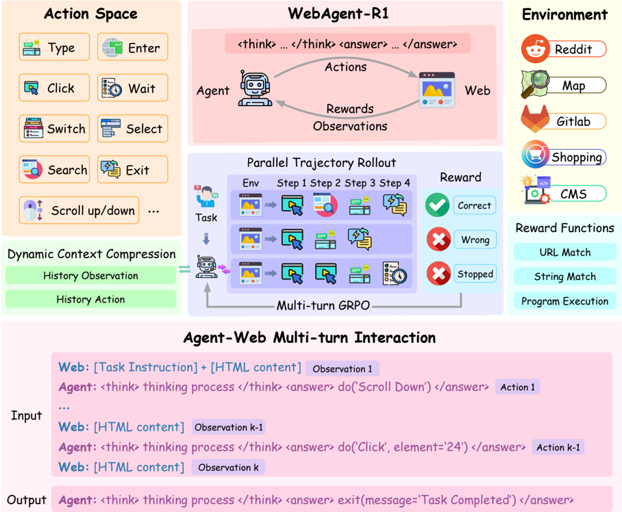

*Figure 2: ( Top ): Overview of the end-to-end multi-turn RL training framework used in WEBAGENT-R1. ( Bottom ): An input/output example of agent-web interaction at the k -th step. The interaction continues until either the maximum number of steps is reached or the agent generates an exit() action to*

### 1. 相关工作与进展
RL 显著提升单轮 LLM（DeepSeek-R1，数学）。早期 web agent 靠 prompting 或行为克隆(BC/SFT)。近期 RL 训 web agent 多为离线/迭代 off-policy（Filtered BC、AWR、DigiRL、WebRL），其中 WebRL 还需额外训 outcome reward model 标 GPT-4 生成的新数据。并发工作 RAGEN、SkyRL 把端到端 on-policy RL 用于模拟游戏/编码，但真实 web 环境仍欠探索。GUI agent 线（含截图多模态）与本文（纯 HTML 文本）正交。

### 2. 现有工作存在的问题

- prompting/BC 缺探索与试错能力，泛化差。
- 离线/off-policy RL 打断 agent 与环境的端到端交互，引入轨迹过滤、outcome reward model 训练、迭代优化等额外复杂度；off-policy 数据来自旧版 agent，在任务相互依赖的动态 web 中学不到关键行为（论文举例：先登出再编辑 profile——登出后失去访问权，旧数据无登出行为则生成无效动作）。
- 每步 HTML observation 可达数千 token，长 horizon 累积上下文带来巨大显存开销甚至 OOM，使多轮 RL 训练不可行。
- 现有 RL 实现（单轮 GRPO）不适配多轮场景。

### 3. Motivation
用端到端 on-policy 多轮 RL 直接从在线交互学习：训练对齐 agent 最新行为、更稳定（Schulman），免 replay buffer/过滤开销，让 agent 据自身过去决策自适应——在"早期决策显著影响后续步"的交互环境中是关键优势。

### 4. 主要灵感 / 核心直觉
把 GRPO 的 group-relative 优势思想搬到多轮：一个任务采 G 条完整轨迹、按 group 内 reward 归一化算优势，逐 token 做 PPO-clip 更新（M-GRPO）。再用工程手段（动态压缩 + 并行 rollout）解决多轮 RL 在 web 上的显存与采样瓶颈。直觉上，"thinking 格式"促使 agent 进行更多轮交互而非更长单轮输出，揭示了 web 任务的 test-time scaling 走"交互深度"而非"单步长度"。

### 5. 主要解决思路(一段话讲清核心)
先用专家演示做 BC warm-up 初始化（acquire 基本 web 操作技能），再在 WebArena 环境做端到端多轮 on-policy RL：用规则化二值 outcome reward 引导，M-GRPO 逐 token 优化（带 group-relative 优势 + KL 正则），并行 rollout G 个独立浏览器实例生成多样轨迹，动态上下文压缩把历史 observation 替换成"Simplified HTML"占位符（保留完整动作历史、相应更新 loss mask），交互直到达最大步数或 agent 输出 exit()。

### 6. 方法详解(通俗、分步骤)

1. **POMDP 形式化**：状态=当前页 HTML 文本，动作∈预定义动作空间（Click/Type/Select/Scroll/Search/Exit…），\(r \in \{0, 1\}\)。
2. **BC warm-up**：在固定专家演示 D={(h_t,a_t)}（h_t=完整交互历史）上 SFT，\(L_{\mathrm{BC}} = -\mathbb{E}\, \log \pi_\theta(a_t \mid h_t)\)。用公开 9,460 条轨迹。
3. **动态上下文压缩**：新 observation 到来时把旧 s_i 替换成短模板 s'_i（"Simplified HTML"），保留完整动作历史，防 OOM；同步更新 loss mask 使损失只算在动作 token 上。
4. **M-GRPO**：每任务采 {τ1..τG}，逐 token 优势 \(\tilde{A}_{i,j,t} = \text{PPO-clip}(\text{ratio} \cdot A_{i,j})\)，组相对优势 \(A_{i,j} = (r_i - \mathrm{mean}(r)) / \mathrm{std}(r)\)，附 βKL 项。
5. **并行轨迹 rollout**：G 个独立浏览器实例（各自 cookie/上下文），同起始页、独立交互 → 多样历史。
6. **奖励**：直接用环境默认规则化二值奖励（String/URL Match、程序执行），**无 outcome reward model**。
7. **三变体研究初始化策略**：R1（标准 BC→RL）、R1-Zero（无 SFT 直接起 RL）、R1-CoT（用 long-CoT BC 数据 SFT 初始化）。

### 7. 实验数据集

- 训练/评测：**WebArena-Lite**（WebArena 的 human-verified 自托管沙箱版，跨 Reddit/GitLab/CMS/Map/Shopping 五站；非线上真实站点）。BC 用公开 **9,460** 条轨迹；RL 用 **647** 个任务训练、**165** 个 verified 任务评测；成功率由内置规则 rubric 判定。
- OOD 评测：**WebVoyager**（5 个域、每域随机 25 任务，域在 WebArena 中未见）。
- 模型：Qwen2.5-3B、Llama3.1-8B（finetune backbone）；对照含 GPT-4o/o3/o4-mini、QwQ-32B 等。

### 8. 实验结果与主要发现

- **主结果（Table 2，WebArena-Lite 平均 SR%）**：Qwen2.5-3B 6.1→33.9；Llama3.1-8B 8.5→44.8。均超同尺寸 SFT/Filtered BC/AWR/DigiRL/WebRL（8B 上 WebRL 42.4 < 本法 44.8）。
- **与专有模型对照**：OpenAI o3=39.4、o4-mini=36.9。**8B 版(44.8) 超 o3；但 3B 版(33.9) 仍低于 o3**——"超 o3"主要由 8B 支撑，非全尺寸成立。逐站表现不均（如 Map 上本法 23.1 弱于 WebRL 36.7）。
- **BC 必要性（Fig.4）**：R1-Zero（无 SFT）初始 6.1%，RL 后**反而略降**（动作残缺/格式错、罕得正奖、探索失败）。
- **long-CoT（Fig.4）**：long-CoT SFT 初值 24.5% > 标准 BC 20%，但 RL 增益更小（R1-CoT 24.5→30.3 vs R1 20→33.9）；作者假设确定性 CoT 模式约束了 RL 探索空间。
- **thinking prompting（Table 3）**：显著提升 SR（o4-mini 15.9→36.9）；单轮长度几乎不变（Qwen 139→142）但交互轮数大增（6→17），指向"交互深度"型 test-time scaling。
- **test-time scaling（Fig.5）**：放宽最大交互轮数，prompting/SFT/RL 三类成功率均单调提升。
- **OOD（Table 4，WebVoyager）**：WebAgent-R1 平均 32% > SFT 12% > prompting 8.8%，各域全面领先。
- **训练动态（Fig.3）**：reward/轨迹长/交互数呈三阶段（初始技能获取→探索精炼→策略稳定），3B/8B 模式相似。

### 9. 结果如何支撑其主张

- "端到端 on-policy 多轮 RL 有效"：Table 2 两 backbone 的大幅提升 + 超 off-policy 基线支撑。
- "BC warm-up 关键"：R1-Zero RL 后退化是强反例支撑。
- "test-time scaling 走交互深度"：Table 3（长度不变、交互↑）+ Fig.5（轮数↑→SR↑）双重支撑，较有说服力。
- "泛化"：Table 4 OOD 领先支撑（但每域仅 25 任务，样本小）。
- "超 SOTA / 超 o3"：成立但需限定——8B 上超 o3、3B 不超；且基线取"复现与文献中较高者"，比较口径需注意。

### 10. 逻辑自洽性(中性评估)

- 论证整体自洽：off-policy 痛点（登出例子）→ on-policy 设计动机 → M-GRPO/工程 → 结果，链条连贯。
- 几处 claim 偏 hypothesize：long-CoT 限制探索、R1-Zero 失败归因，均为假设性解释而非受控证据。
- "超 o3"的标题级主张需谨慎（仅 8B、且 o3 为零样本 prompting 对照，非微调，比较不完全对等）。
- M-GRPO 相对单轮 GRPO 的"多轮"实质主要是把整条多轮轨迹的 token 一并纳入优化 + 二值终态奖励，无中间步奖励塑形（作者列为 future work）。

### 11. 残留问题 / 局限

- 仅文本 HTML 输入，无截图/多模态（作者承认）。
- 依赖规则化可验证 outcome reward，开放式任务（如旅行规划）不适用。
- 固定预定义动作空间，遇需新操作的交互元素受限。
- 仅 WebArena-Lite（沙箱、5 站）；OOD 评测样本小（每域 25）。
- 多处归因为假设，未做消融验证；安全风险（CMS 误删等）需权限/确认机制。

### 12. 开源代码与框架(链接+框架+代码可得性)

- 仓库：https://github.com/weizhepei/WebAgent-R1 （已 clone，约 150MB；含 `WebAgent-R1/{Train, Eval, WebArena-Env-Setup}`）。
- **框架：verifiers**（willccbb/verifiers，"RL with LLMs in Verifiable Environments"，GRPO-based，Accelerate + DeepSpeed ZeRO3）；`Train/` 下实证含 `verifiers/`、`VisualAgentBench`，在其上扩展为 M-GRPO + 并行 rollout。评测/环境为 WebArena（`Eval/browser_env`，WebArena-Lite）。
- 〔已核：原始 shortlist 标 framework=unknown 不准——据仓库实证为 **verifiers（非 veRL）**。〕
- 代码可得性：完整开源（含训练/评测/环境搭建）。

---

