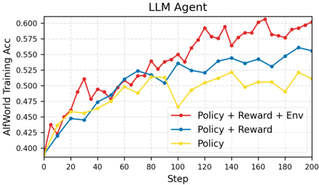
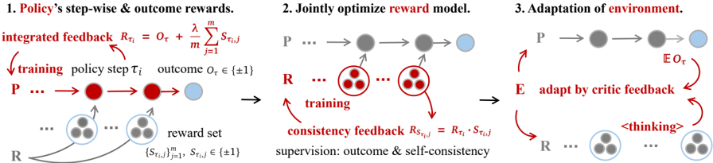

# open_agentrl — RLAnything: Forge Environment, Policy, and Reward Model in Completely Dynamic RL System (Open-AgentRL)

> **一句话重点 (TL;DR)**：一个完全动态的闭环 RL 系统,同时进化"环境、策略、生成式奖励模型"三者——策略用 step-wise+outcome 融合反馈训练,奖励模型经一致性反馈联合优化产出可靠 step-wise 监督,环境据策略当前能力自适应调难度;论证优化后的 step-wise 信号优于人工 outcome 标签。

**元信息**：arXiv 2602.02488（v1, 2026-02-02, cs.LG）｜ Gen-Verse（Yinjie Wang, Tianbao Xie, Ke Shen, Mengdi Wang, Ling Yang 通讯）｜ **ICML 2026**（仓库 README 标注"RLAnything (ICML 2026)";论文 PDF 自身未声明 venue）｜ 主题 T2（agentic RL）;**注:本文无 OPD 内容**,与 mtp_opd 仅间接相关——为"agentic 场景下过程信号优于纯结果"的论据,可与 OPD 的过程级反馈思路互补｜ 代码 github.com/Gen-Verse/Open-AgentRL（已 clone,~38M,同仓库另含 DemyAgent;HF 有 Policy & Reward 模型 collection）｜ 框架 veRL（仓库内置 `verl/`）

## 关键图示

**① Motivation / 对比图**

**② 方法 / 架构图**

*Figure 2 | Motivation and takeaways of our RLAnything framework. First, in complex real-world applications, reinforcement learning benefits from integrating step-wise rewards with outcome rewards. Second, the reward model can be jointly optimized with the policy via outcome supervision and self-cons*

## 1. 相关工作与进展
RLVR 提升 LLM 推理;但长轨迹下二元 outcome 奖励监督不足。step-wise 信号常由生成式奖励模型给出(借语言模型推理能力,优于标量奖励模型),但训练这类模型需高质量任务专属监督。环境质量(任务难度与策略能力匹配)对 RL 扩展同样关键,RLVR 中已证训练时调难度可改善策略。三要素——环境、策略、奖励模型——通常被分开处理。

## 2. 现有工作存在的问题
(1) 长轨迹二元 outcome 奖励信号不足;(2) 奖励模型与策略割裂,且生成式奖励模型难获得可靠 step-wise 监督;(3) 环境任务难度与策略当前能力不匹配,影响策略与奖励模型双方训练动态。

## 3. Motivation
是否存在一个同时优化环境、策略、奖励模型、以放大学习信号并强化整个系统的 RL 框架?构建完全动态、闭环优化的系统,让三者互相提供反馈、协同进化,适配任意 LLM/agentic 场景。

## 4. 主要灵感 / 核心直觉
理论驱动:奖励模型质量不仅取决于单步逻辑正确,还取决于其预测该步未来影响的能力(reward precision A=P(S_τ+>S_τ−|...))。Theorem 1:A→1 当且仅当 μ=p++p−>1;Theorem 2:任务过难/过易会使 p+、p− 的重要性采样极不平衡、违反 μ 目标。故"调节任务难度"既利策略也利奖励模型训练——这是把"环境自适应"纳入闭环的理论动机。

## 5. 主要解决思路(一段话讲清核心)
RLAnything 三组件闭环 forge(Algorithm 1):策略用 integrated feedback 训练;奖励模型把策略轨迹当训练环境、经 consistency feedback 联合优化;环境据策略 rollout 准确率(落在阈值 α_low=0.2 / α_high=0.8 外时)调难度。三者互为反馈、迭代。

## 6. 方法详解(通俗、分步骤)
1. **策略(Integration Feedback,Eq.1)**:对第 i 步 τ_i,奖励模型独立查询 m 次得 S_τi,j∈{−1,1};step reward R_τi = O_τ + (λ/m)Σ_j S_τi,j(默认 λ=1),融合 outcome 与 step-wise;在同一步 index 上跨轨迹标准化得优势,训策略。
2. **奖励模型(Consistency Feedback,Eq.2)**:第 j 次评估的监督信号 RS_τi,j = R_τi · S_τi,j(R_τi 反映该步整体质量,与单次评估的一致性即监督);跨 j 标准化得优势,训奖励模型的评估推理 r_τi,j。Section 2.3 证此目标提升奖励模型预测未来 outcome 的精度。
3. **环境(Critic Feedback,Eq./§2.4)**:把奖励模型对失败步(S_τi,j=−1)的评估摘要喂给一个 LM(Qwen3-4B 做任务改写),据 acc 提议更难/更易任务 q',并质量门控(变难仅当 α_low<acc(q')<acc(q);变易仅当 acc(q)<acc(q')<α_high)后替换。

## 7. 实验数据集
三类场景:① 计算机使用 agent — OSWorld(策略/奖励 Qwen3-VL-8B-Thinking,任务改写 Qwen3-4B,最大交互步 30;230 in-domain + 139 OOD);② 文本交互游戏 — ALFWorld(策略 Qwen2.5-7B-Instruct,官方 3.5k 训练 / 140 in-domain / 134 OOD,最大步 60);③ coding LLM — LiveCodeBench-V2、CodeContests、LiveBench(同 ALFWorld 的模型组合,无交互环境;奖励模型生成 32 个单元测试判正误,每步采 64 任务×32 解)。

## 8. 实验结果与主要发现
RLAnything 跨三场景每加一个动态组件都一致改善整体并提升 OOD。关键数字:Qwen3-VL-8B-Thinking 在 OSWorld **+9.1%**;Qwen2.5-7B-Instruct 在 ALFWorld **+18.7%**、LiveBench **+11.9%**。核心发现:① 联合优化奖励模型+环境反过来抬高策略收敛精度;② 优化后的 step-wise 奖励信号**优于人工标注 outcome 信号**,且 integrated feedback 对长轨迹任务至关重要;③ 新环境任务可线性扩展,奖励模型在"评估当前步正确性"与"预测 outcome 影响"两方面都变强。

## 9. 结果如何支撑其主张
"三组件协同放大信号"由逐组件消融(每加一个动态组件均提升)支撑;"step-wise 优于人工 outcome"由直接对比支撑,且与 Theorem 1/2(平衡难度→更高 reward precision)呼应;环境自适应的有效性由 Fig.3 中 acc 改善样例(如 0.0→0.25)与 λ 消融佐证。理论(两定理)为"为何要调难度"提供了闭环依据,逻辑链较完整。

## 10. 逻辑自洽性(中性评估)
框架自洽:两定理把"奖励精度"与"任务难度平衡"连成因果,支撑环境自适应进入闭环。但 step reward R_τi 直接把 outcome O_τ 加进每步(Eq.1),使 step-wise 与 outcome 部分耦合,"step-wise 优于 outcome"的对比需在此耦合下解读;奖励模型与环境改写均由 LLM 担任,存在自评/自改写的潜在偏置。与 OPD 主线无直接关联,仅作"过程信号价值"的外部论据。

## 11. 残留问题 / 局限
论文未见独立 Limitations 节(待核附录)。环境改写依赖 LLM 质量与阈值/门控设定;reward precision 理论在 m→∞ 渐近,有限 m 下偏差未充分量化;评测集中在 OSWorld/ALFWorld/coding 三域,泛化到其他 agentic 任务未验。

## 12. 开源代码与框架(链接+框架+代码可得性)
github.com/Gen-Verse/Open-AgentRL(已 clone,~38M,同仓库含 DemyAgent;HF Policy & Reward collection)。框架 **veRL**(仓库内置 `verl/` 目录),GRPO 类 group-based RL;含 `recipe/`、`train/`、`reward/`、按任务的 `alfworld_rl.py`/`coding_rl.py`/`osworld_rl.py` 训练入口与对应 `*_eval.py`,以及 `OSWorld-main/`、`alfworld_master/` 环境;`requirements_rlanything.txt`、`requirements_sglang.txt`、`requirements-npu.txt`。代码可得性高(完整训练/评测/环境脚本齐全)。
