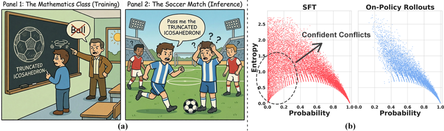
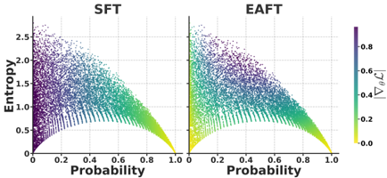

# T3 · GFT 统一 SFT-RL & GRPO-RLVR

> 本主题共 50 篇,完整内容如下(右侧目录可跳转到具体论文)。


<a id="p-amft"></a>

## amft — AMFT: Aligning LLM Reasoners by Meta-Learning the Optimal Imitation-Exploration Balance

> **一句话重点 (TL;DR)**：与其用"SFT→RL"两阶段或靠启发式硬切换，AMFT 把 SFT 和 RL 揉进**单阶段单循环**，并把"模仿(SFT)与探索(RL)的配比 µ"当成一个**可学习参数**，用 meta-gradient 以"最大化最终任务表现"为元目标前瞻式地学这个 µ。值得看的点：它把 SFT 形式化为"优化专家示范里隐含的隐式 reward"的特殊 RL，从而让 SFT/RL 在同一目标下统一——这与 OPD"在线策略蒸馏里如何调度模仿 vs 探索权重"的命题同构。**注意：代码仓库当前 404 不可得，方法细节无法独立核实。**

**元信息**：arXiv 2508.06944v1 ｜ 清华大学电子工程系（Lixuan He, Jie Feng, Yong Li）｜ Preprint, under review, 2025-08-09 ｜ 主题 单阶段统一 SFT+RL 后训练 / 与 OPD **真实相关** ｜ 代码 https://github.com/hlxtsyj/AMFT（**不可得**：该仓库与 TSYJ-He/AMFT 均 404，已二次核验仍 "Repository not found"）｜ 框架 〔待核，仓库不可得〕方法层面建立在 GRPO(RLVR)+SFT 加权损失之上

### 关键图示

**① Motivation / 对比图**


*Figure 2: AMFT learning dynamics vs. sequential baselines on math benchmarks. The left y-axis shows validation accuracy (%), while the right y-axis shows the adaptive weight µ . AMFT (solid blue) achieves a superior learning curve by dynamically adjusting µ (red dash-dotted), avoiding the difficult*

**② 方法 / 架构图**


*Figure 1: Overview of AMFT's motivation and framework.*

### 1. 相关工作与进展(这条线现在做到哪一步)
LLM 推理后训练主流是 **"SFT→RL"两阶段流水线**。近期出现一批**单阶段统一 SFT+RL** 的尝试：SRFT 用 policy entropy 调权；SuperRL/SASR/DyME 分别用 reward density、gradient norm、生成正确性做"硬切换"在 SFT 与 RL 间跳转。AMFT 处在"单阶段统一"这条线，但主张前面这些都是**反应式(reactive)** 启发式，缺一个原则化、前瞻性的配比机制。

### 2. 现有工作存在的问题(本文针对的痛点)

- **两阶段流水线**：SFT 擅长模仿专家轨迹但局限于静态数据集、倾向记忆而非泛化(OOD 差)；RL 探索强、泛化好但样本低效、稀疏奖励下不稳，且 on-policy 受基模能力上界限制。两阶段目标突变易导致**灾难性遗忘**(RL 阶段覆盖 SFT 学到的结构知识)。
- **现有单阶段方法**都是反应式：依赖短期、含噪的启发式信号(熵、reward density、梯度范数等)做被动调整或硬切换，**缺乏前瞻性**——不回答"现在这样调配，对最终性能是否最优"。

### 3. Motivation(为什么做这件事)
作者要的是一个**原则化、动态、前瞻**的模仿-探索平衡机制：模仿/探索的最优配比不该靠启发式被动反应，而应作为**可学习参数**，用"最大化最终任务表现"的元目标直接优化(forward-looking)。

### 4. 主要灵感 / 核心直觉
核心灵感是**"隐式奖励"统一视角**：SFT 不只是分布匹配，可形式化为"优化专家示范中隐含的隐式 reward"的一种特殊 RL。于是 SFT(path-based 隐式 reward)与 RL(outcome-based 显式 reward)是**同一目标下互补的两种 reward 信号**，二者的配比 µ 就成了一个可被元学习优化的量。

### 5. 主要解决思路(一段话把核心机制讲清)
用一个动态权重 µ_t∈[0,1] 把 SFT 损失与 RL 损失线性组合成统一损失；µ 由一个 **meta-gradient 自适应控制器**驱动：长期看，把 µ 当可学习参数，在 validation batch 上估"调 µ 对未来最终性能的影响"做前瞻式全局控制；短期看，用 policy entropy 偏离目标值的程度做快速纠偏。每个 update step 先更新 µ，再用新 µ 算统一损失更新策略。

### 6. 方法详解(通俗、分步骤;关键公式用白话解释,必要时给伪代码)
**统一损失**：\(\mathcal{L}_{\text{total}} = \mu_t \cdot \mathcal{L}_{\text{SFT}} + (1 - \mu_t) \cdot \mathcal{L}_{\text{RL}}\)，RL 部分用 GRPO(RLVR)。

**µ 控制器(双机制)**：

- **长期 meta-gradient**：把 µ 当可学习参数，周期性在 validation batch 上估 \(g_\mu = \nabla_\mu U(\theta_t)\)（U 为长期效用/任务表现）。白话："现在把 µ 往哪个方向挪，能让若干步之后的最终性能更好"——这是前瞻式全局控制。
- **短期 entropy 启发式**：\(g_H = H^{*} - H(\pi_\theta)\)。熵过高(太发散)→增大 µ 收敛到模仿；熵过低/坍塌→减小 µ 鼓励探索。目标熵 H* 由 warm-up 阶段的平均熵初始化。
- **更新**：\(\mu_{t+1} = \mu_t + \eta_\mu \cdot g_\mu + \eta_H \cdot g_H\)。

**单步流程伪代码**：
```
每个 update step:
  1. 取 SFT 数据 + on-policy rollout 的混合 batch
  2. 控制器更新 µ_t  (meta-gradient g_µ + 熵启发式 g_H)
  3. 用新 µ_t 算 L_total = µ·L_SFT + (1−µ)·L_RL(GRPO)
  4. 更新策略 θ
```
〔待核〕η_µ/η_H 取值、meta-gradient 用的 validation batch 如何构造、稳定性细节——因仓库 404 无法核实。

### 7. 实验数据集

- **数学**：训练集 **OpenR1-Math-46k-8192**（论文明确命名，HF: Elliott/Openr1-Math-46k-8192）。ID 评测 **5 个** benchmark：AIME24、AMC、MATH500、Minerva、**OlympiadBench**；OOD 泛化用 **3 个**通用推理 benchmark：ARC-C、GPQA-D、MMLU-Pro。基模 **Qwen2.5-Math-7B**。
- **多模态**：**General Points**(算术推理纸牌)、**V-IRL**(视觉-语言导航)，各设 Rule-Variation 与 Visual-Variation 两类 ID/OOD split。基模 **LLaMA-3.2-Vision-11B**。
- 效率目标指标示例：General Points 60% win-rate、V-IRL 70% success-rate(作为"达标所需步数/样本数"的衡量点)。

### 8. 实验结果与主要发现(关键数字)

- 作者自述在数学、抽象视觉推理(General Points)、视觉导航(V-IRL)三类任务上"建立 new SOTA"，并强调 **OOD 泛化更好**、达标所需训练步数/样本更少(计算与样本效率)。
- **消融(Table 4)** 确认三件套缺一不可：去掉 meta-gradient、去掉熵启发式、去掉 SFT warm-up 均显著掉点；去掉熵启发式还会**训练不稳**。
- 对比基线含 RL-from-SFT(两阶段)、RL-only(GRPO from scratch)、LUFFY、SRFT 等。
- 〔保留意见〕"new SOTA"为 preprint 自述、未经评审；精确数值因仓库 404 与本审计未逐一抄录主表，待核。

### 9. 结果如何支撑其主张(证据链是否到位)
主张是"前瞻式可学习配比 > 反应式启发式"。消融把三个组件逐一拿掉证明各自必要性(尤其熵启发式关乎稳定、meta-gradient 关乎性能)，这条证据链对"三件套都有用"较扎实。但"前瞻式优于反应式"这一**因果归因**主要靠与 SRFT 等基线的端到端对比间接支撑，缺少把 meta-gradient 直接对位某个反应式信号的 head-to-head 控制实验，归因强度中等。

### 10. 逻辑自洽性(中性评估:哪里站得住、哪里牵强)

- **站得住**：把 SFT 视为隐式 reward RL 的统一视角是合理且有文献基础的；单循环混合 batch + 动态 µ 的工程设计自洽；消融支持各组件必要性。
- **牵强/可质疑**：(1) meta-gradient 估 \(\nabla_\mu U\) 通常需要展开多步或近似(隐式微分/有限差分)，论文层面对其方差与计算开销的讨论待核，仓库不可得使其无法验证；(2) "long-term meta-gradient + short-term entropy"两个信号可能冲突，加权 η_µ/η_H 的鲁棒性未知；(3) new SOTA 系自述、未评审。

### 11. 残留问题 / 局限

- **代码 404 不可得**——本分析仅基于 34 页 PDF，方法实现、超参、稳定性均无法独立核实，这是最大局限。
- preprint 未经评审，"new SOTA"待第三方复现。
- meta-gradient 的计算成本/方差、双学习率敏感性、validation batch 构造细节缺失。
- 多模态任务仅两个(General Points / V-IRL)，泛化结论的覆盖面有限。

### 12. 开源代码与框架(链接 + 框架 + 代码可得性)

- 链接：论文声明 https://github.com/hlxtsyj/AMFT （正文首页脚注）。
- **可得性：404 不可得**。`hlxtsyj/AMFT` 与任务清单给出的 `TSYJ-He/AMFT` 经二次 `git ls-remote` 核验均返回 "Repository not found"，api.github.com 同样 404。仓库当前不公开/已下线。
- 框架：〔待核〕无法确认具体 RL 框架(verl/TRL/oat 等)；方法层面建立在 GRPO(RLVR)+SFT 加权损失之上，视觉任务用 GRPO 作 RL 基线。

---


<a id="p-ampo"></a>

## ampo — AMPO: Adaptive Multi-Guidance Policy Optimization for Diverse Exploration

> **一句话重点 (TL;DR)**：当 on-policy RLVR 在某道难题上**整组采样全失败**(稀疏奖励、学不动)时，AMPO 才**按需**从一个**多教师池**里挑入正确解替换失败样本；挑哪条教师路径不看"哪个教师最强"，而看"哪条对学生最容易吸收"(学生在该路径下生成正确答案的概率最高)。值得看的点：用 4 个同量级"同伴"教师 + 仅 8.5k 数据，就媲美了用单一更强教师(DeepSeek-R1)+46k 数据的方法，并全程保持更高 entropy(探索性)。与 TSRD 的"按需脚手架 + 路径恢复"强相关。

**元信息**：arXiv 2510.02227v2 ｜ 同济、香港理工、上海 AI Lab、新加坡国立、电子科技大（Xiaoyang Yuan 等，通讯 Yi Bin）｜ 2025-10-09 (v2) ｜ 主题 多教师 Mixed-Policy RLVR / 与 TSRD **强相关** ｜ 代码 https://github.com/SII-Enigma/AMPO（**完整**，已克隆约 163M，含数据/脚本/checkpoint）｜ 框架 verl(GRPO 的 Mixed-Policy 扩展, FSDP 或 Megatron)
> 标题两版同指一文(arXiv id 一致)：arXiv 版 "More Than One Teacher: Adaptive Multi-Guidance Policy Optimization for Diverse Exploration"；README 版 "Many Small Teachers Beat One Giant: Adaptive Multi-Peer Policy Optimization for LLM Reasoning"。

### 关键图示

**① Motivation / 对比图**


**② 方法 / 架构图**


*Figure 1: The AMPO training framework. It enhances exploration by adaptively replacing on-policy failures with external solutions from a Multi-Guidance Pool only when sparse rewards occur. The selection of external guidance is prioritized based on the Policy Model's comprehension score for each opti*

### 1. 相关工作与进展(这条线现在做到哪一步)
RLVR(可验证奖励 RL)是提升 LLM LongCoT 推理的有效范式，但 on-policy GRPO 的探索被困在模型自身知识边界内，难学到超出初始能力的新策略，并受 "capacity-difficulty mismatch" 困扰(难题持续失败→稀疏奖励→训练不稳)。为突破边界，社区做 **Mixed-Policy RL**：把强教师的 off-policy 轨迹混入 on-policy，或交织 RL 与 SFT(代表如 LUFFY)。AMPO 处在 Mixed-Policy 这条线，主打"多教师 + 按需 + 可理解度选择"。

### 2. 现有工作存在的问题(本文针对的痛点)
现有 Mixed-Policy RL 有两个关键局限：

1. **多依赖单一教师**——限制学习多样性，且把单个教师的固有偏置/风格带进学生。
2. **静态数据整合**——不看模型当前需求与"可理解度"，无差别注入外部解，可能注入学生根本吸收不了的解法，浪费且扰动训练。

### 3. Motivation(为什么做这件事)
借鉴知识蒸馏的**多教师**思想：用多个**同量级"同伴"教师**的集体智慧替代单一更强教师。两条原则：(1) **guidance-on-demand**——只在学生自己解不出时才用外部引导替换失败样本，最大化自探索价值；(2) **按可理解度选路径**——挑学生最容易吸收的那条教师推理，平衡探索与利用。

### 4. 主要灵感 / 核心直觉

- **"多个同伴 > 一个巨人"**：多个 7B-级教师风格各异，集体覆盖的解法多样性比单一强教师更广，且不把单一模型偏置灌给学生。
- **"易吸收 > 最正确"**：一条教师推理即使正确，若离学生当前内部表征太远，学生也学不动；应选学生"差一点就能自己走到"的那条——这正好对应"脚手架"该搭在学生够得着的高度。

### 5. 主要解决思路(一段话把核心机制讲清)
在 GRPO 之上：对每个 query 先由 π_old 采 G 个解；若整组奖励都低于阈值(稀疏奖励、全失败)，就触发**自适应多引导替换**——从多教师正确解池里按"可理解度(Probability Reward)"选 top-k 条，替换掉 k 个错误的 on-policy 解；否则不替换，优先自探索。然后在增广 batch 上统一算 advantage，用**混合目标**(off-policy 序列级聚合 + on-policy token 级聚合)更新策略。N_off=0 时无缝退化为 GRPO。

### 6. 方法详解(通俗、分步骤;关键公式用白话解释,必要时给伪代码)
三部分：

**(1) Adaptive Multi-Guidance Replacement(自适应多引导替换)**：构建 Multi-Guidance Pool `P_G`(多教师的正确 off-policy 解)。π_old 对 query 采 G 个解；若全部奖励 < 阈值 τ(置替换标志 I=True)，随机选 k 个错误 on-policy 解，用 P_G 中按可理解度选出的 top-k off-policy 解替换，\(k = \min(k_0, N_g)\)；否则不替换。保证每步都有正确解可学，但优先自探索。

**(2) Comprehension-based Guidance Selection(基于可理解度的选择)**：定义 **Probability Reward r_p**：把教师推理路径 z_off 与 ground-truth 答案 y* 拼成 o*=(z_off, y*)，r_p = 学生 π_θ 在给定 z_off 下生成正确答案 token 的**几何平均概率**(log-prob 平均后 exp，clip 到 [0,1])。白话：r_p 高 = "顺着这条教师推理，学生自己几乎就能写出正确答案" = 最易吸收。按 r_p 取 top-k，平局取**更短(更简洁)** 路径。

**(3) Policy Optimization with Multi-Guidance**：在增广 batch G_aug 上统一归一化算 advantage(GRPO 式)。\(J_{\text{Mixed}} = J_{\text{off-policy}} + J_{\text{on-policy}}\) 加权和：

- **off-policy 用 sequence-level 聚合**——避免长教师序列主导梯度，保证每条教师解等权(`compute_token_on_seq_off_policy_loss`：对每条教师序列先 masked_mean，再跨序列 `.mean()`)。
- **on-policy 用 token-level 聚合**(DAPO 式)。

**off-policy 重要性采样比的两条实现路径**(已核 `mix_core_alg.py`)：

- **路径(a) 论文正文形式**：传入 `target_probs` 时，\(\text{off\_ratio} = \pi_\theta / \pi_{\text{target}}\)（教师概率显式出现，对应论文 Eq.7 \(\hat{r} = \pi_\theta / \pi_{\varphi_j}\)）。
- **路径(b) 默认发布脚本**：`train_ampo.sh` 用 `off_policy_reshape="p_div_p_0.1"` 走 reshape 分支，\(\text{off\_ratio} = f(\pi_\theta) = \pi_\theta / (\pi_\theta + 0.1)\)——**教师概率不显式出现**，shaping 直接作用于学生概率，与 LUFFY(Yan et al. 2025)实现一致。两者数学上不同：默认实验跑的是(b)，论文公式写的是(a)。\(f(x) = x / (x + 0.1)\) 为沿用 LUFFY 的 shaping 函数。

### 7. 实验数据集

- **教师池(4 个同量级 LongCoT 教师)**：AceReason-Nemotron-1.1-7B、DeepSeek-R1-Distill-Qwen-7B、OpenR1-Qwen-7B、Qwen3-8B(thinking)。
- **训练数据**：基于公开 OpenR1-Math-46k-8192 经多教师 curation 筛出的 **8.5k 高质量样本**。
- **基座**：主 Qwen2.5-7B-Instruct；另用 Qwen2.5-1.5B-Instruct、LLaMA3.2-8B-Instruct 验证。
- **评测**：6 个数学 ID 基准(AIME2024、AIME2025、AMC、Minerva、OlympiadBench、MATH500) + 3 个 OOD(ARC-c、GPQA*、MMLU-Pro)。

### 8. 实验结果与主要发现(关键数字)

- 相比 GRPO：数学基准**平均 +4.3%**、**OOD +12.2%**。
- 提升 **Pass@k**，训练全程保持**更高 entropy**(探索性更强、未坍塌)。
- **数据效率**：用 4 个同量级教师 + 仅 **8.5k** 数据，即可媲美用单一更强教师(DeepSeek-R1) + **46k** 数据的方法。
- 论文另分析引导替换数量 k 与教师池组成的影响。

### 9. 结果如何支撑其主张(证据链是否到位)
三个主张各有证据：(1) "多教师 > 单教师"——与单教师/单一强教师基线对比 + 教师池组成消融；(2) "按需 > 静态"——guidance-on-demand 仅在全失败时触发，对比静态注入；(3) "可理解度选择有效"——r_p 选择 vs 随机/最强教师。"更高 entropy + Pass@k 提升"共同支撑"保留了探索而非塌成单模"。证据链较完整，数据效率对比尤其有说服力。

### 10. 逻辑自洽性(中性评估:哪里站得住、哪里牵强)

- **站得住**：on-demand 替换的逻辑(只在自探索失败时才注入)直接对应"最大化自探索 + 兜底正确解"，自洽；sequence-level 等权聚合避免长 CoT 主导梯度，工程上合理且代码确证。
- **牵强/需注意**：**论文公式(路径 a)与默认实验(路径 b)的重要性采样比不一致**——这是实现与理论之间的真实缺口。路径(b)里教师概率根本不进入 ratio，意味着"off-policy 重要性校正"在默认实验中并未按 Eq.7 执行，而是退化成 LUFFY 式的学生概率 shaping。读者若据论文公式理解机制，会与实际跑的代码错位。

### 11. 残留问题 / 局限

- **公式-实现缺口**(见 §10)：默认脚本未用论文 Eq.7 的 \(\pi_\theta / \pi_{\text{target}}\)，而用 \(\pi_\theta / (\pi_\theta + 0.1)\)，二者数学不等价。
- 教师池需 4 个现成强教师，构建/采样成本不小；"同量级同伴"在更大/更小规模下是否仍优于单一强教师未充分验证。
- 阈值 τ、替换数 k_0 为超参，跨任务自适应性未知。
- 主验证集中在数学推理 + 少量 OOD，覆盖面有限。

### 12. 开源代码与框架(链接 + 框架 + 代码可得性)

- 链接：https://github.com/SII-Enigma/AMPO （已克隆约 163M，**完整**）。核心改动在 `ampo/verl/verl/adaptive_mix_src/`(`mix_core_alg.py` 含两条 off-policy ratio 路径、`compute_token_on_seq_off_policy_loss` 序列级聚合)；含 `data/`、`exp_scripts/`(含 `train_ampo.sh`)、`eval_scripts/`、`examples/`、`figures/`。HF 组织 SII-Enigma 提供 checkpoint。
- 框架：基于 **verl**，实现 GRPO 的 Mixed-Policy 扩展；conda py3.10，支持 FSDP 或 Megatron(vllm/sglang/mcore)。

---


<a id="p-asft"></a>

## asft — ASFT: Anchored Supervised Fine-Tuning

> **一句话重点 (TL;DR)**：DFT(用 token 概率给交叉熵重加权的 SFT 变体)在推理域好用、在知识域(如医疗)不稳，原因是它"界紧但会漂移"(KL 持续增大)。ASFT 只加一项**轻量 KL 锚定**把策略约束在 base 模型附近，就同时保住 DFT 的紧界优势和稳定性。值得看的点：它用 **RWR(reward-weighted regression)框架**统一解释 SFT/DFT，证明 DFT 给出比 SFT 可证更紧的 RL 下界，并指出其缺分布锚定才是不稳定根因——理论诊断 + 一行 KL 修复。

**元信息**：arXiv 2509.23753v3（2026-02-01）｜ 南方科技大学、北京大学、上海 AI Lab（He Zhu、Junyou Su 共一，通讯 Guanhua Chen）｜ ICLR 2026（2026-01-30 接收）｜ 主题 T3 GFT/SFT-RL 统一类，**相关性 High** ｜ 代码 https://github.com/zhuchichi56/ASFT（**完整**，约 54MB；已合入 LLaMA-Factory 主分支）｜ 框架 自定义 HF Trainer + DeepSpeed(ZeRO-2/3) + PEFT/LoRA；新增 veRL(FSDP2) 分支(README 推荐优先)

### 关键图示

**① Motivation / 对比图**


*Figure 1: Training dynamics comparison across fine-tuning methods on medical knowledge tasks. Left : MMLUaccuracy (out-of-domain evaluation); Center : MedMCQA accuracy (in-domain evaluation); Right : KL divergence from base model. DFT exhibits severe distributional drift (high KL divergence) while A*

**② 方法 / 架构图**


*Figure 3: Comparison of model performance across three benchmarks (MedQA, MMLU, MedMCQA) for five models (LLaMA-2-7B, LLaMA-2-70B, Qwen2.5-7B, Qwen2.5-32B, Qwen2.5-72B) using four fine-tuning strategies (Base, SFT, DFT, ASFT). Each subplot shows the scores for a specific benchmark, highlighting the*

### 1. 相关工作与进展(这条线现在做到哪一步)
后训练在 **SFT**(高效模仿但易记忆、泛化弱)与 **RL**(泛化好但贵且不稳)之间存在根本权衡。**DFT**(Dynamic/Discriminative Fine-Tuning)通过 token 概率重加权成为有前景的中间地带，在推理域取得改进。ASFT 处在"用统一理论框架解释 SFT-RL 中间地带、并修复其稳定性"这条线，是 **DFT 的轻量扩展**。

### 2. 现有工作存在的问题(本文针对的痛点)

- **DFT 效果域相关**：推理密集型域好，但在知识密集型任务(如医疗 MedQA 等)**不稳定**，且其启发式重加权设计**缺乏理论依据**。
- 作者用 RWR 框架诊断出根因：DFT 对应一种特定 auxiliary distribution 构造，能给出比 SFT **可证更紧**的 RL 下界；但它**缺乏分布锚定**，导致**渐进式漂移**(KL 持续增大)——下界越来越松、重要性权重方差越来越大，从而训练不稳。

### 3. Motivation(为什么做这件事)
既然 DFT 的问题是"紧但会漂移"，那么只要给它**加一个轻量 KL 锚定项**把策略约束在 reference(base 模型)附近，就能在保留 DFT 紧界优势的同时获得稳定性——兼得 SFT 的效率与 RL 的泛化。

### 4. 主要灵感 / 核心直觉
核心直觉来自 **RWR 视角**：把 SFT/DFT/RL 都看成"用某个 auxiliary distribution 加权的回归"。DFT 选了一个能让 RL 下界更紧的加权(故推理域更好)，但这个加权没有任何力量把策略拉回 reference，于是越训越偏。**紧界 + 锚定 = 既贴近最优又不跑偏**——这正是 RL 里 KL 惩罚的作用，ASFT 把它搬进 SFT。

### 5. 主要解决思路(一段话把核心机制讲清)
ASFT = **DFT 概率重加权 + KL 锚定**。在 DFT 的 token 级重加权交叉熵上，加一项把当前策略 π_θ 拉向 reference(base/原模型，LoRA 时禁用 adapter 即得)的 per-token KL，用一个小权重 kl_weight 平衡。重加权负责"紧"，KL 锚定负责"稳"。

### 6. 方法详解(通俗、分步骤;关键公式用白话解释,必要时给伪代码)
代码(`train_v2.py`, `mode="asft"`)逐行核对(已确认与论文一致)：

- **DFT 重加权**：\(\text{weights} = \mathrm{softmax}(\text{logits}).\text{gather}(\text{label}).\text{detach}()\)；\(\text{dft\_losses} = \text{token\_losses} \cdot \text{weights}\)。白话：模型对正确 token 当前预测概率越高，这个 token 的 loss 权重越大——把学习集中到"模型已经有点会、再推一把就稳"的 token 上。
- **KL 锚定**：\(\text{kl\_div} = \mathrm{KL}\!\left(\log\mathrm{softmax}(\pi_\theta) \,\|\, \mathrm{softmax}(\text{ref})\right)\)(per-token，对 vocab 求和)；ref 为 base/原模型(`disable_adapter()` 取 reference，或单独加载 `original_model` 并冻结)。
- **最终损失**：\(\text{weighted\_losses} = \text{dft\_losses} + \text{kl\_weight} \cdot \text{kl\_div}\)，再按 valid_mask(非 -100 的回复 token)归一。
- **kl_weight**：代码默认 **0.1**(train_v2.py / .sh)，但 README 与示例命令在**混合精度(bf16/fp16)下推荐 0.03**——过大会放大精度噪声致失稳。
- 代码同时实现 `sft / dft / sft+kl / asft` 四种 mode，便于消融对照。
- **理论**：在 RWR 框架下证明 DFT 给出比 SFT 严格更紧的 RL 下界(论文 _txt 确认 "provably tighter bound than SFT")，KL 锚定控制方差/漂移。

### 7. 实验数据集

- 三类域：**数学推理**(100k 训练样本)、**医疗知识 grounding**(MedQA/MMLU/MedMCQA，10k)、**代码生成**。
- 基座：**LLaMA-2-7B 与 Qwen2.5-7B** 两个 7B 模型(论文 §5.1；选 LLaMA-2-7B 是为规避数据污染)。
- 对比：SFT、DFT、iw-SFT、SFT+KL；并验证 ASFT 作为 DAPO/GRPO 的更优初始化。

### 8. 实验结果与主要发现(关键数字)

- **数学(100k)**：较 DFT **+4.85 点(18.6%)**，较基座 **+17.89 点(142%)**。
- **医疗(10k)**：较 SFT **+8.28 点(24.8%)**，较基座 **+10.65 点(33.9%)**。
- **效率**：仅需全 RL 约 **3%** 的训练算力。
- 跨推理/知识两类域均稳定优于 SFT、DFT；泛化接近 RL 而保持 SFT 级效率。
（数值已对照论文 _txt 第 131-134 行核实。）

### 9. 结果如何支撑其主张(证据链是否到位)
证据链完整：理论(RWR 框架证 DFT 更紧界 + KL 锚定控漂移) → 诊断(DFT 在知识域因 KL 漂移失稳) → 修复(加 KL 锚定) → 实验(数学 vs 医疗两类域均稳定超 DFT/SFT)。"医疗域 DFT 不稳而 ASFT 稳"直接对应理论诊断的预测，归因较扎实；"3% 算力达近 RL 泛化"支撑"兼得效率与泛化"的主张。

### 10. 逻辑自洽性(中性评估:哪里站得住、哪里牵强)

- **站得住**：RWR 统一框架 + "紧界但缺锚定→漂移"的诊断逻辑清晰；KL 锚定就是把 RL 的 KL 惩罚搬进 SFT，理论动机干净；代码与公式逐行吻合(DFT 项 + KL 项)。
- **牵强/需注意**：(1) ASFT 本质是"DFT + 已知的 KL 正则"，新颖性更多在**理论解释**而非机制本身(SFT+KL 早已存在，论文也把它列为基线)；(2) kl_weight 在不同精度/域下需手调(0.1 vs 0.03)，说明稳定性对该超参敏感，"轻量锚定"并非完全免调；(3) 仅两个 7B 基座，规模与家族覆盖有限。

### 11. 残留问题 / 局限

- 〔待核〕RWR 框架下"更紧下界"的形式化定理与 kl_weight 在不同域的敏感性曲线需对照正文与附录细读。
- 仅 LLaMA-2-7B / Qwen2.5-7B 两个 7B 模型，未验证更大规模或更多家族。
- kl_weight 需按精度/任务调参(默认 0.1，bf16/fp16 推荐 0.03)，DeepSpeed 下有精度问题(故新增 veRL/FSDP2 分支)。
- 相对 DFT 的增量主要是一项 KL 锚定 + 理论解释，机制创新有限。

### 12. 开源代码与框架(链接 + 框架 + 代码可得性)

- 链接：https://github.com/zhuchichi56/ASFT （已克隆约 54MB，**完整**）。数据 HF: `chichi56/ASFT`。
- 实现：主分支 `train_v2.py`(loss 实现，mode ∈ {sft, dft, sft+kl, asft}) + `scripts/ds_zero*.json`；新增 **veRL 分支**(2026-05-08，FSDP2，数值更稳，README 推荐优先)；已合入 **LLaMA-Factory 主分支**(2026-02-12, commit #10174)。
- 框架：自定义 HF Trainer + DeepSpeed(ZeRO-2/3) + PEFT/LoRA；新增 veRL(FSDP2)；已并入 LLaMA-Factory。（注：repo 与论文均未提及 ms-swift。）
- 推荐配置：full SFT 用 lr=2e-5、3 epoch、kl_weight=0.03；LoRA 推荐 r=8/alpha=16/dropout=0.05/lr=5e-4(医疗任务最优)。

---


<a id="p-bapo"></a>

## bapo — BAPO: Stabilizing Off-Policy Reinforcement Learning for LLMs via Balanced Policy Optimization with Adaptive Clipping

> **一句话重点 (TL;DR)**：异策略（off-policy）RL 训练 LLM 时，数据越陈旧（staleness 越大）越容易梯度爆炸、熵崩溃。BAPO 找到两个根因——负优势样本主导梯度、固定对称裁剪系统性挡掉"增熵更新"——并据此**每个 batch 动态调裁剪上下界**，让"正 token 贡献占比"达到目标 ρ0，从而既防爆炸又保熵。

**元信息**：arXiv:2510.18927v1（2025-10-21，cs.LG）｜ 复旦 FudanNLP / 上海稷迹智锋 / 上海创新研究院（共一 Zhiheng Xi、Xin Guo；通讯 Tao Gui、Qi Zhang）｜ 2025-10 预印本｜ 主题：off-policy RL 稳定化（自适应裁剪 + 熵保持），与 OPD **直接关联弱**，但其 Entropy-Clip Rule 对理解 partial rollout / 经验回放等异策略训练的熵崩溃有参考价值｜ 代码 https://github.com/WooooDyy/BAPO （已 clone 约 5.2MB，基于 veRL，方法在 `recipe/bapo`，真实可用）｜ 框架 veRL（GRPO 为基础算法）。

---

### 关键图示

**① Motivation / 对比图**


*Figure 1 | Performance of BAlanced Policy Optimization with Adaptive Clipping (BAPO).*

**② 方法 / 架构图**


*Figure 2 | Preliminary results with different data staleness. As the staleness increases, the model suffers from unstable optimization, decreasing entropy, and even a sudden collapse in training.*

### 1. 相关工作与进展

- RL 已成对齐/强化 LLM 的核心范式（推理、代码、agentic）。
- **off-policy RL**（rollout 行为策略 ≠ 训练目标策略，使用过期数据）样本效率高、契合现代基础设施（**partial rollout**、经验复用），适合超长/难任务。
- 与之相关的"非对称裁剪"家族已有多项：Clip-Higher（DAPO）、KL-Cov、CE-GPPO、80/20 等，思路都是"放宽对低概率正 token 的裁剪"。

### 2. 现有工作存在的问题
直接套用 off-policy RL 到 LLM：随 staleness 增大（Fig.2），出现**优化不稳、梯度爆炸、甚至崩溃**，同时**策略熵急剧下降**（探索退化、过度利用）。已有非对称裁剪方法**手动固定阈值**，僵硬、缺乏自适应。

### 3. Motivation
作者通过理论+实证锁定两个根因：

- **(i) 优化失衡**：负优势样本在数量与对策略梯度损失贡献上都占主导，过度惩罚会压制有用/中性行为；且低概率负 token（log 项 → −∞）易引发梯度爆炸。难题/训练早期会进一步加剧负样本占比。
- **(ii) Entropy-Clip Rule（理论推导）**：PPO 类目标的**固定对称裁剪**会系统性阻断"增熵更新"——把大量低概率正 token 挡在更新之外，同时过度惩罚低概率负 token，使分布锐化、熵崩溃。
据此目标：平衡正负贡献 + 防梯度爆炸 + 保熵维持探索。验证实验表明非对称裁剪（增大上界 c_high 纳入更多低概率正 token）能提升性能并抑制熵下降，但固定阈值不够灵活——故引出自适应版本。

### 4. 主要灵感 / 核心直觉
既然问题是"正 token 被裁太多、负 token 罚太狠"，那就**用'正优势信号对策略梯度损失的贡献占比'作为可观测的调节目标**，每个 batch 自适应地扩裁剪窗，直到正 token 贡献达到目标占比 ρ0——免去手动调阈值。

### 5. 主要解决思路（一段话讲清核心）
BAPO（Balanced Policy Optimization with Adaptive Clipping）在 GRPO/PPO 代理目标上**动态调整裁剪上下界 (c_high, c_low)**：每个 batch 搜索一对界，使正优势信号对策略梯度损失的贡献占比 ≥ 目标 ρ0；扩 c_high 纳入更多低概率正 token（增熵），扩 c_low 过滤过多低概率负 token（防爆炸），设 ρ0 又能防止熵无控增长。

### 6. 方法详解（通俗、分步骤）

- 代理目标仍是 PPO/GRPO 的 \(\min\!\left(r \cdot A,\; \mathrm{clip}(r, 1-\varepsilon, 1+\varepsilon) \cdot A\right)\)，但裁剪界不再固定。
- **论文 Algorithm 1 的搜索顺序**：从 c_low=a−、c_high=a+ 起，while 循环内**先增 c_high**（步长 δ1，优先纳入更多低概率正 token）至 b+；不够再增 c_low（步长 δ2，过滤低概率负 token）——即"先 c_high 后 c_low"，单 while 内交替。
- **〔code 不一致，已核〕**：开源实现 `recipe/bapo/policy_loss.py::compute_policy_loss_bapo` 顺序与论文**相反**——先 "adjust lower clip range first"（增 c_low 到 ratio_lower_max），不满足再 "increase upper bound"（增 c_high），且为**两段顺序循环**而非论文的单 while 交替。差异不改方法本质（都为满足正 token 贡献占比而扩裁剪窗），但与 Algorithm 1 表述不符，**复现以代码实际行为为准**。
- **〔code 额外细节，已核〕**：代码对负优势样本另含 **dual-clip**（clip_ratio_c 默认 3.0），论文 Eq.8 正文未强调。
- 净效果：增大正 token 贡献、防负 token 主导与梯度爆炸；纳入低概率正 token + 过滤低概率负 token 来保熵；ρ0 防熵失控与尾部退化。免去 DAPO/手动非对称裁剪的繁琐调参。

### 7. 实验数据集

- **RL 训练数据**：SkyWork-OR1-RL-Data。
- **评测**：AIME 2024、AIME 2025（report 16 rollouts 平均）。
- **骨干**：DeepSeek-R1-Distill-Qwen-7B/32B、OctoThinker-Llama3.2-3B-Long-Zero；并自训两个 SFT 模型 BP-Math-7B/32B（由 Qwen2.5-Math 微调而来）。

### 8. 实验结果与主要发现

- **BP-Math-7B(BAPO)**：AIME24/25 = **70.8 / 62.5**，超 SkyWork-OR1-7B（70.2 / 54.6，AIME25 +7.9）。
- **BP-Math-32B(BAPO)**：**87.1 / 80.0**，同规模 SOTA，并超 o3-mini-medium、Gemini-2.5-Flash-Thinking、DeepSeek-R1(671B)。
- **Llama**（GRPO→BAPO）：AIME24 2.5%→5.4%、MATH 58.4%→66.0%。
- partial rollout 与不同 staleness 下均比 GRPO 更稳（Fig.2 复现的崩溃在 BAPO 下消失）。

### 9. 结果如何支撑其主张
主张是"自适应裁剪能稳定 off-policy RL 并保熵"。支撑：(a) staleness 扫描显示 GRPO 崩溃而 BAPO 稳定（直接对应 motivation）；(b) 主基准上超 SkyWork-OR1 与多个专有系统。但支撑链有缺口——见 §10/§11。

### 10. 逻辑自洽性（中性评估）

- 理论贡献 **Entropy-Clip Rule** 较清晰，把"裁剪→挡增熵更新→熵崩溃"链条讲通，且与 motivating 实验一致。
- 但**主结果泛化覆盖窄**：核心评测只在 AIME24/25 两个小测试集，Llama 才补 MATH。
- 与 SkyWork-OR1 的对比部分依赖**自训的强 SFT 起点 BP-Math**；BAPO 相对自家 GRPO 的增益在 32B 上较小（AIME24 84.6→87.1），削弱了"方法本身"的归因强度。
- 仓库默认 config/example 是示例值而非论文实验值，复现需手动改超参（见 §12）——这本身不影响逻辑，但增加复现摩擦。

### 11. 残留问题 / 局限

- 评测基准窄（AIME 为主），泛化性证据不足。
- 自适应搜索的目标占比 ρ0、可移动区间、步长仍是超参（论文称"未精调"），其鲁棒性未系统扫描。
- **代码与论文 Algorithm 1 搜索顺序相反**，方法描述与实现存在不一致（已核，见 §6）。
- 与既有非对称裁剪家族（Clip-Higher/KL-Cov/CE-GPPO/80-20）同源，**创新点集中在"用正 token 贡献占比作自适应目标"+ Entropy-Clip Rule 理论**，算法增量有限。

### 12. 开源代码与框架（链接+框架+代码可得性）

- 代码：https://github.com/WooooDyy/BAPO （resource/repos/bapo，约 5.2MB；含 verl 子目录 + `recipe/bapo`）。依赖 hydra-core、liger-kernel、accelerate 等。
- 框架：**veRL**，以 **GRPO** 为基础算法。`python -m verl.trainer.main_ppo` 主循环。
- 训练设定：预备/验证实验用 R1-Distill-Qwen-7B，max len 8k、lr 2e-6、temp 0.6（staleness 实验用 SkyWork-OR1-RL、max len 32k）；BP-Math 主实验 max len 64k。通过 ppo_epoch 经验复用与 partial rollout 引入 staleness。
- **论文 BAPO 超参（未精调）**：ρ0=0.4，可移动区间 a−=0.6/b−=0.9、a+=1.2/b+=3.0，步长 δ1=0.05/δ2=0.02。
- **〔复现注意，已核〕**：仓库默认 config（`recipe/bapo/config/bapo_trainer.yaml`）与 `run_bapo_example.sh` 给的是**示例值非论文值**——config 默认 adv_ratio_target=1、ratio_lower 0.6→0.8 step0.05、ratio_upper 1.2→2.0 step0.05；example.sh 用 ppo_epochs=2、low_max=0.95、upper_step 0.1。复现论文数字需手动改回上述论文超参。
- 代码可得性：方法实现完整可跑，仅需对齐超参。

---


<a id="p-behavior_priming"></a>

## behavior_priming — Beneficial Reasoning Behaviors in Agentic Search and Effective Post-training to Obtain Them

> **一句话重点 (TL;DR)**：先用 LLM pipeline 找出让"搜索 agent"成功的四种推理行为（验证、权威评估、自适应搜索、纠错），再用 SFT 把这些行为"种"进模型、之后再 RL。关键证据：用"展现这些行为但答案错误"的轨迹做 SFT，效果 ≈ 用答案正确的轨迹——说明**解锁 RL 的关键是推理行为（path）而非 outcome 正确性**。

**元信息**：arXiv:2510.06534v3（2026-01-16，cs.AI）｜ CMU LTI（Jiahe Jin、Abhijay Paladugu、Chenyan Xiong）｜ 2026-01 预印本｜ 主题：SFT-then-RL 的"行为先验"版（agentic search），**与 TSRD 高度相关**——"RL 前先种入特定推理行为/path 比 outcome 正确性更重要"正对应 TSRD 的"teacher-scaffolded→内化→RL"，且其错误轨迹消融为"path 监督 > outcome 监督"提供直接证据；本文**不涉及 MTP**，行为靠 LLM-judge 识别而非 logit 蒸馏｜ 代码 https://github.com/cxcscmu/Behavior-Priming-for-Agentic-Search （旧 KEYS 的 `cxcscmu/Behavior-Priming` 为 404，此为正确仓库名，已验证 200；RL 训练在另一仓库 `cxcscmu/verl-agent-deepresearch`）｜ 框架 SFT 用 LLaMA-Factory、RL 用 GRPO（veRL 系）。

---

### 关键图示

**① Motivation / 对比图**


*Figure 1: Training dynamics and final performance on WebWalkerQA with Qwen3-1.7B. Left (SFT Stage): The improvement of behavior frequencies, Pass@8, and average trajectory length after Behavior Priming SFT. Right (RL Stage): Entropy during RL and final RL performance for the base model (Direct RL) a*

**② 方法 / 架构图**


*Figure 2: Comparison of different LLMs as the underlying agentic search model of our agent framework across three web agent benchmarks. For each benchmark, bars indicate the frequency of four behaviors observed in trajectories (left axis), while dashed horizontal lines indicate the benchmark score (*

### 1. 相关工作与进展

- **Agentic search**：LLM 多步检索解复杂信息需求（分解任务、多步搜索、综合结果）。商用如 ChatGPT Deep Research、Google AI Mode；开源侧 RL 训练 agentic search 进展快（Search-R1、R1-searcher、DeepResearcher）。
- 训练范式分两类：早期靠强模型轨迹**蒸馏/SFT**；近期主流是端到端 **online RL**；不少工作采 **SFT-then-RL** 两段式先初始化工具使用与推理能力。
- 数学/代码领域已有发现：**RL 是否成功高度依赖 base model 是否已具备特定推理模式**（如 verification / backtracking）——但这类研究**几乎只在数学**。

### 2. 现有工作存在的问题

- 对 agentic search，"**哪些具体推理行为有益、如何系统培养**"仍不清楚。
- agentic search 有独特挑战：海量结果中识别有用信息、解决来源冲突、长轨迹中保持目标聚焦。
- 关键观察：non-primed 模型在 RL 过程中**无法内生地**发展出这些行为——所以需要显式行为先验。

### 3. Motivation
先搞清"什么推理行为让搜索 agent 成功"，再可靠地把它们植入模型，为 RL 建立稳健的探索与 test-time scaling 基础。

### 4. 主要灵感 / 核心直觉
把数学领域"RL 成功取决于 base 已有推理模式"的发现迁移到 agentic search：与其指望 RL 自己长出好行为，不如**事先用 SFT 把成功轨迹里反复出现的行为种进去**，让 RL 在此基础上精炼。

### 5. 主要解决思路（一段话讲清核心）
两步：(1) 用 LLM-based 三阶段 pipeline 对比"强模型成功 vs 弱模型失败"的轨迹，提炼出四种普适有益行为；(2) **Behavior Priming** = 先在"同时展现全部四种行为"的轨迹上做 step 级 SFT，再在 primed 模型上跑 GRPO（outcome 二值奖励）。

### 6. 方法详解（通俗、分步骤）
**第一部分：识别有益行为**

- 先建标准 agentic search 框架：每步输出 reasoning + action；action ∈ {search, answer, **summary**}（summary 压缩历史以管理上下文长度）。
- 配对轨迹：Gemini 2.5 Flash（强）成功而 Qwen3-1.7B（弱）失败的 **500 题**。
- 三阶段 LLM pipeline：①轨迹比较 → ②行为抽取（这两步用 Gemini 2.5 Flash）→ ③行为合并去重（Gemini 2.5 Pro），再人工复核。
- 得到**四种行为**：**Information Verification**（跨源验证并引证）、**Authority Evaluation**（识别冲突、评估来源可信度）、**Adaptive Search**（动态调整搜索策略）、**Error Recovery**（识别并纠正先前错误）。跨 Gemini/DeepSeek-R1/Llama/Qwen 多模型测得"行为频率与性能强相关"（Fig.2），证其普适。

**第二部分：Behavior Priming（SFT-then-RL）**

- **SFT**：用 Gemini 2.5 Flash 每题采 10 条轨迹，筛出"同时展现全部四种行为"的轨迹；把每条轨迹的**每一步当独立训练样本**（D_SFT = {(x_k, y_k)}）。
- **RL**：在 behavior-primed 模型上跑 **GRPO**，按 step 聚合更新；**outcome-based 二值奖励**（LLM-judge 判最终答案对/错，1/0），该奖励与 advantage 对轨迹内所有 step 恒定（无 step 级信用分配）。
- **核心消融**：对比"展现目标行为但答案错误 (Behavior Prime Incorrect)" vs "答案正确 (Correct)"两组轨迹做 prime——用**错误轨迹** prime 的模型性能 ≈ 用正确轨迹的（Table 1 显示两组 SFT 数据行为频率均 100%、accuracy 分别 0% / 100%）。结论：**推理行为而非 outcome 正确性才是解锁 RL 潜力的关键**。
- **训练动态**：SFT 后行为频率、pass@8、平均步数同升；RL 中 primed 模型维持更高 policy entropy，而 direct RL 熵骤降、过早收敛。

### 7. 实验数据集

- **backbone**：Qwen3-1.7B、Llama3.2-3B-Instruct。
- **评测**：3 个 web agent benchmark + 7 个 multi-hop QA benchmark。
- **数据来源**：SFT 数据问题/答案取自 Li et al. 2025c；RL 用 Li et al. 2025c 的 web agent RL 集 + Zheng et al. 2025 的 multi-hop QA 集。行为识别的配对轨迹来自上述 500 题。

### 8. 实验结果与主要发现

- 相对 **Direct RL**：web benchmark **+37.2%**、multi-hop QA **+6.2%**（相对提升）；并一致超过两个 SFT-then-RL 基线（Distillation 随机采样 / Outcome-driven 只筛正确轨迹）。
- 增益在 **web 任务上明显**，QA 上较温和（+6.2%）。
- non-primed 模型 RL 中**不会自发**长出四种行为——印证显式先验的必要性。
- §5.3 数据规模消融（5k/10k/20k）、§5.4 单行为 (IV-only) vs 复合四行为对比。

### 9. 结果如何支撑其主张
主张"行为先验 > outcome 正确性"。支撑很直接：错误轨迹 prime ≈ 正确轨迹 prime（控制了行为频率，只变 outcome），且超过 Outcome-driven 基线（专门筛正确轨迹）。训练动态（熵、pass@8、步数）从机制上解释了为何 primed 能解锁 RL。证据链对该主张闭合度较高。

### 10. 逻辑自洽性（中性评估）

- 自洽：识别→培养→验证三段闭合，错误轨迹消融是干净的因果隔离实验。
- 张力点：四种行为由 **LLM-judge 识别与筛选**，整套结论依赖判别 prompt 的质量与 Gemini 的判断一致性，存在循环依赖（用 LLM 定义"好行为"、又用 LLM 评估是否展现）；"行为频率与性能相关"是相关而非因果证据，真正因果靠错误轨迹消融补足。

### 11. 残留问题 / 局限

- **规模偏小**（1.7B / 3B），是否在更大模型上同样需要显式先验未知。
- RL 仍是 **outcome 级 GRPO**，无 step/turn 级信用分配——与 path 监督的主张存在张力（SFT 阶段是 path，RL 阶段又退回 outcome）。
- 行为定义/识别依赖特定 LLM-judge 与 prompt，可迁移性与稳健性未充分检验。
- 不涉及 MTP；对 TSRD 的价值在于"**path 监督 > outcome 监督**"这一可迁移结论的强证据，而非具体机制。

### 12. 开源代码与框架（链接+框架+代码可得性）

- 主仓库：https://github.com/cxcscmu/Behavior-Priming-for-Agentic-Search （含 DeepResearch agent scaffold、行为分析 pipeline `behaviour_analysis/`、SFT recipe、agent 主循环 `main_parallel.py`、评测套件 `evaluation/short/`）。
- **SFT 框架**：**LLaMA-Factory**（`scripts/train.sh` → `llamafactory-cli train train/sft/sft.yaml`，仓库内 vendored LLaMA-Factory）。
- **agent scaffold / rollout / 评测**：vLLM 服务底层模型（Qwen3 开内置 thinking，无内置推理的模型加 `use_explicit_thinking`）。
- **RL 框架**：**GRPO**，实现在**独立仓库** https://github.com/cxcscmu/verl-agent-deepresearch （veRL 系，verl-agent 的 deep-research 变体）；本主仓库**不含 RL 训练代码**。
- 代码可得性：行为分析 + SFT + agent/评测可跑；RL 需到第二仓库。

---


<a id="p-ca_survey"></a>

## ca_survey — From Reasoning to Agentic: Credit Assignment in Reinforcement Learning for Large Language Models

> **一句话重点 (TL;DR)**：一篇 survey + awesome-list，以"信用分配 (credit assignment, CA)"为中心透镜重审 LLM RL。核心产物是把 2024–2026 初的 **47 篇方法**（41 篇 core + 6 篇 adjacent）按**粒度 × 方法学二维分类**，并配 reporting checklist、benchmark 协议与方法选择决策树。判断：reasoning CA 正趋成熟（PRM + critic-free group comparison），agentic CA 催生真正新方法（hindsight counterfactual、privileged asymmetric critic、turn-level MDP）。

**元信息**：arXiv:2604.09459v2（2026-04-13，cs.CL）｜ Chenchen Zhang（独立研究者，**单作者** survey）｜ 2026-04 预印本｜ 主题：LLM RL 的 credit assignment 综述（**非新方法论文**）。与 OPD/TSRD/MTP 不直接相关，但 CA（把稀疏 outcome 奖励分配到 token/step/turn）正是 TSRD 中"path-selection / path-recovery 细粒度信用分配"的上位框架，可用于定位、选 baseline、找相邻工作｜ 代码/列表 https://github.com/xxzcc/Awesome-Credit-Assignment-in-LLM-RL （旧 KEYS 的 `xxzcc/Awesome-Credit-Assignment` 为 404，此为正确仓库名，已验证 200）｜ 框架 不适用（资源整理 + `gen_figures.py` 生成分类图）。

> 说明：按设定，本分析重点放在 §6（分类法）与 §8/§9（覆盖范围 & gaps）。

---

### 关键图示

**① Motivation / 对比图**


*Figure 1: Evolution of RL for LLMs and the corresponding credit assignment challenges. Each phase introduces longer trajectories, more complex environments, and harder credit assignment problems. The shift from reasoning to agentic RL represents a qualitative leap in CA difficulty.*

**② 方法 / 架构图**


*Figure 2: Two-dimensional taxonomy of credit assignment methods for LLM RL, organized by assignment granularity (vertical) and computational methodology (horizontal). Blue: primarily reasoning RL; Red: primarily agentic RL; Purple: multi-agent. The dashed arrow indicates the evolutionary trend from*

### 1. 相关工作与进展

- LLM RL 两波：**reasoning RL**（DeepSeek-R1/o1，单条 CoT 500–30K+ token，纯 outcome 奖励）→ **agentic RL**（多轮环境交互，10–100+ turn，100K–1M token，稀疏 terminal 奖励）。
- 经典 RL CA 工具箱（TD/GAE、return decomposition RUDDER、hindsight HCA、counterfactual/difference reward）是 LLM 方法的基础。
- 现有相邻综述：Pignatelli 2023（经典 RL CA，前 LLM 时代）、Zhang 2025a（agentic RL 100 页综述，把 CA 当子话题）——**无人系统覆盖 reasoning + agentic 两个 regime 的 CA**。

### 2. 现有工作存在的问题（survey 要解决的 gap）

- **Episode 级方法**（GRPO、REINFORCE）给每个 token 同一 advantage，trajectory 一长就失效（turn 3 的错误 tool-call 与后续几十个正确动作受同样惩罚；"echo trap" 现象）。
- agentic 设定使 CA **双层级化**：先判哪个 turn 关键，再判 turn 内哪些 token 重要；并有随机转移、部分可观测、超长 horizon。
- 既有综述要么只覆盖经典 RL，要么把 CA 当 agentic 的子话题，**缺乏专门、跨两 regime 的 CA 综述**。

### 3. Motivation
以 credit assignment 为中心透镜重审 LLM RL，给出 reasoning→agentic 演进叙事（Classical RL → Reasoning RL → Agentic RL → Future Multi-Agent），并产出可复用资源（清单、checklist、benchmark 协议）。

### 4. 主要灵感 / 核心直觉
"PRM 本质就是 CA"——一个给每步打分的 Process Reward Model，其实是在做 step 级的 terminal-reward 分解；PRM 文献与 CA 文献是同一问题的两个视角。把所有方法都拉到"如何把稀疏奖励分配到动作"这一统一问题下。

### 5. 主要解决思路（一段话讲清核心）
做一篇专门的 CA 综述，用"粒度 × 方法学"二维分类组织 47 篇方法，配三类标准化产物（机器可读清单、reporting checklist、benchmark 协议 + 决策树），并明确论证"为何 agentic 比 reasoning 的 CA 更难、催生哪些新技术"。

### 6. 方法详解（= 分类法 taxonomy，本文核心贡献）
覆盖 2024–2026 初 **47 篇方法**（**41 篇 core CA + 6 篇 adjacent enabler**）。**二维分类法**（§2.4，Fig.2）：

- **粒度轴 (granularity)**：Token / Segment / Step-Turn / Multi-Agent。
- **方法学轴 (methodology)**：Monte Carlo（VinePPO）/ Temporal Difference + value baseline（GAE；ArCHer 用 off-policy critic、AgentPRM 用 TD+GAE 学 turn-level value）/ **Model-based / LLM-as-Critic**（〔已核更正〕LLM-as-Critic 是论文 Fig.2 方法学轴**正文已列**的一列、且论文强调它"无经典 RL 对应"，并非 repo 后加；repo 后扩的是 uncertainty-control、verifiable-feedback shaping 等新类）/ Game-theoretic（Shapley、counterfactual）/ Information-theoretic（信息增益、熵）。
- **经典→LLM 映射**：return decomposition → reward redistribution（RED、SPA-RL）；hindsight → retrospective（HCAPO，基于 generative verification）；counterfactual → leave-one-out 与 Shapley（C3、CCPO 做 turn 级 LOO，SCAR 用 Shapley value）；TD/GAE → learned critics（ArCHer、AgentPRM）。
- **LLM-as-Critic 是新轴**：LLM 自身作 critic 给中间状态自然语言评价（CAPO 等），经典 RL 无对应。
- **综合判断**：reasoning CA 正收敛到 **process reward model + critic-free group comparison**（成熟化）；agentic CA 催生真正新方法 —— **hindsight counterfactual、privileged asymmetric critic、turn-level MDP 重构**（无 reasoning RL 先例）。
- **三类可复用产物**：(1) 机器可读的 47 方法清单（taxonomy 标签 / baseline family / evidence level / 主 benchmark，将以 CSV/JSON 发布，§B）；(2) 面向未来 CA 论文的 **reporting checklist**（§C，已对现有文献验证以找系统性 gap）；(3) **benchmark 协议规范**（任务族、元数据要求、controlled bifurcation tasks）+ 方法选择**决策树**（Fig.4 / Table 8，§9）。

### 7. 实验数据集
不适用（无自有实验）。但 §7 做 **systematic comparison**：按计算成本、是否需辅助模型、适用场景、实证性能比较各方法，含 GRPO-family meta-comparison；§9 给 benchmark 协议建议（任务族 + controlled bifurcation tasks）。

### 8. 实验结果与主要发现（= 文献覆盖与组织方式）

- **覆盖范围**：2024-01 至 2026-04 的 LLM RL CA 方法；arXiv/Semantic Scholar/Google Scholar 关键词检索（"credit assignment / process reward / reward decomposition / turn-level reward" × LLM/RL），并从 VinePPO/ArCHer/GRPO/DeepSeek-R1 前后向引用追踪，监控 NeurIPS/ICML/ICLR/ACL 2025 与 HF Daily Papers。
- **分类口径**：**core**（主算法贡献是新的稀疏奖励再分配，如 VinePPO/HCAPO/CARL）vs **adjacent enabler**（基础设施/reward shaping/agent 框架，如 Agent Lightning/RAGEN/PRS）；边界 case 在 §9.4 讨论。
- **章节组织**：§2 背景+形式化（reasoning = token-level MDP；agentic = turn-level POMDP）+ 分类法；§3 reasoning CA；§4 为何 agentic 更难；§5 agentic 专属 CA；§6 multi-agent CA；§7 系统比较；§8 把 CA 放进 agentic RL 训练 pipeline；§9 开放问题（multi-agent credit、超长 horizon、exploration-credit 互作用）+ roadmap；§10 结论。
- **覆盖判断**：reasoning RL 的 CA 已"成熟化"（token/segment/step 方法密集，PRM 主流）；step/turn 级是 LLM agent 自然粒度、聚类最密；multi-agent 与超长 horizon 是最薄弱处。

### 9. 结果如何支撑其主张（= 覆盖范围 & gaps）

- **主张**："reasoning→agentic 的演进复杂化并重塑了 CA 版图。" 支撑方式：分类网格 Fig.2/Fig.3 直观展示方法在 reasoning（左上密集）→ agentic（右下）的迁移；§4 论证 SNR 随 turn 数恶化（T=100 时单动作信噪比约差 100×）；agentic 专属新方法（HCAPO/C3/CCPO/SWEET-RL）无 reasoning 先例。
- **自陈 gaps（§9.4）**：单作者 survey，覆盖可能有缺口；multi-agent CA、超长 horizon、exploration 与 credit 的互作用是开放前沿。
- 作为 survey，其"支撑"靠系统检索协议 + 分类一致性 + checklist 对现有文献的验证，而非实验数据。

### 10. 逻辑自洽性（中性评估）

- 自洽：分类二维轴正交清晰，经典→LLM 映射明确，PRM=CA 的概念澄清有说服力。
- 张力点：(a) **单作者**，覆盖与分类标签难免主观（作者已自陈）；(b) 47 篇含 6 篇 adjacent，"core vs adjacent" 边界（如 RAGEN、Agent Lightning）有判断空间；(c) 部分被引方法（2026 年的 HCAPO/C3/CCPO 等）极新，evidence level 参差，survey 的"成熟化"判断对早期方法可能偏乐观。

### 11. 残留问题 / 局限

- 单作者覆盖缺口（§9.4 自陈）。
- 是**索引 + 分类 + 标准化提案**，无新方法、无新实验；CSV/JSON 清单"将于发表时发布"，截至 snapshot 未必齐全。
- 与 TSRD 关系：可作定位/找 baseline 的索引，但本身不涉及蒸馏/MTP/path-recovery 的具体机制。

### 12. 开源代码与框架（链接+框架+代码可得性）

- 列表：https://github.com/xxzcc/Awesome-Credit-Assignment-in-LLM-RL （MIT，PRs welcome，**living list**：已超出论文 snapshot，2026.05 又加了 agentic/coding-agent/uncertainty-control/multi-agent 等新论文）。
- 内容：`README.md`（带分类表）、`gen_figures.py`（生成 taxonomy 网格图与树图）、`assets/`。
- 框架：**不适用**——仓库是论文清单 + 分类可视化脚本，非训练代码。
- 代码可得性：脚本可跑出分类图；机器可读 CSV/JSON 清单论文称"发表时发布"，需留意是否已上传。

---


<a id="p-cbrl"></a>

## cbrl — Context Bootstrapped Reinforcement Learning (CBRL)

> **一句话重点 (TL;DR)**：把 few-shot 示范当成 RLVR 训练时的"临时脚手架"——早期以高概率把示范前置到 prompt 里帮模型产生成功 rollout（拿到学习信号），再按课程把注入概率线性退火到 0，逼模型把推理模式"内化"而非依赖；只改训练输入分布、不动 RL 目标，因此算法无关、推理零开销。

**元信息**：arXiv 2603.18953（v1，2026-03-19，cs.LG）｜ UC Santa Barbara + Cisco Research（Saaket Agashe、Jayanth Srinivasa、Gaowen Liu、Ramana Kompella、Xin Eric Wang）｜ Preprint ｜ 主题：RLVR 探索效率（与 TSRD"教师脚手架/路径引导后撤除"直觉高度同构，作为 prompt 层面的极简对照）｜ 代码 https://github.com/context-bootstrapped-rl/cbrl （项目页 https://context-bootstrapped-rl.github.io，已 clone，约 1.3MB，研究原型）｜ 框架 verl 0.3.0.post2 + vLLM 0.8.5 + PyTorch 2.6.0，Hydra 配置

### 关键图示

**① Motivation / 对比图**


*Figure 4. Training reward curves for CBRL and baseline across three settings: Q Programming with GRPO (left), Word Sorting with GRPO (center), and Word Sorting with RLOO (right). Shaded regions indicate pi > 0.25 (high injection). CBRL achieves higher early reward by guiding the model toward success*

**② 方法 / 架构图**


*Figure 1. Overview of the Context Bootstrapped Reinforcement Learning (CBRL) framework. (a) The injection probability annealing schedule. At each timestep t , training batches consist of samples without few shots and samples with few shots, with the proportion governed by pi , which decreases linear*

### 1. 相关工作与进展

- **RLVR**（Tülu3/Lambert 2024；DeepSeek-R1 2025）已是推理后训练主流，靠确定性 verifier 给二元奖励，在数学、代码、工具调用上推动显著进展；GRPO（Shao 2024）用组内归一化去掉 value 网络，成事实标准算法。
- **探索低效（exploration inefficiency）的现有解法**：(i) 混合策略训练——RL 中混入/替换 off-policy 轨迹（LUFFY 用正则化重要性采样）；(ii) 部分监督/提示——给 ground-truth 解片段救活失败 rollout（HINT、GHPO、BREAD）；(iii) 课程方法——E2H（易到难）、Absolute Zero（自演化课程）。

### 2. 现有工作存在的问题

- 零样本 RLVR 在"新推理模式 / 领域知识缺失"场景下无法 bootstrap：当一组 rollout 全错时，GRPO 组优势坍缩为 0、没有梯度，模型靠自身探索越不过 reward 平台期（领域欠表示如小众编程语言尤其严重）。
- 持续提供示范又会让模型**依赖**示范、测试时（无示范）无法独立工作。
- 现有解法的代价：mixed-policy 易把更新引向不可泛化的 off-policy 解路径；partial supervision 会在 rollout 中途干预；课程方法需要难度估计或自生成题目等额外基础设施。

### 3. Motivation
利用 LLM 自带的 in-context learning 能力当**临时**脚手架：早期高频注入 few-shot 引导模型产生成功 rollout 从而拿到学习信号；随训练推进把注入概率退火到 0，迫使模型把示范中的推理模式内化、最终在无示范下独立成功。相比 mixed-policy，CBRL 保持完全 on-policy——示范只是"上下文"而非要模仿的轨迹；相比 partial supervision，不在 rollout 中途干预；相比课程方法，在固定分布上用一个简单退火即构成"从被引导到独立"的隐式课程，无需外部基础设施。

### 4. 主要灵感 / 核心直觉

- few-shot 示范提供的不是要照抄的目标，而是"怎么开始尝试"的引导，所以保持 on-policy 探索动力学不被破坏。
- 批内同时存在"带示范"与"不带示范"两种样本：若每条 prompt 都带示范，模型会学成依赖示范才会做题；随机不给，强制它即便早期也尝试独立解题。
- 退火 = 隐式课程：早期弱→多给脚手架，后期强→撤掉，"内化而非依赖"。

### 5. 主要解决思路（一段话讲清核心）
CBRL 三个组件：**(1) Few-Shot Example Bank ℬ**——每条含问题 q、可选推理轨迹 r、答案 a，来源可为专家示范、更强模型解或手工构造；**(2) 随机上下文注入**——每步以概率 p_i 用 Bernoulli 决定每个 prompt 是否前置 k 条示范（作为对话对），reward 只对生成响应计算；**(3) 课程退火**——\(p_i = p_{\text{start}} + \frac{t-1}{T-1} \cdot (p_{\text{end}} - p_{\text{start}})\)，线性从 p_start（典型 0.5~1.0）退火到 p_end（典型 0）。关键设计：只修改训练输入分布，不改 RL 目标 / 损失 / 优化过程，故与任意 policy-gradient 算法兼容（GRPO、RLOO 皆可），推理时不注入、无额外开销（Algorithm 1）。

### 6. 方法详解（通俗、分步骤）
每个训练步 t：

1. 取 mini-batch {q_i}；设当前注入概率 p←p_i。
2. 对每个 q_i：从 ℬ 采 k 条示范 E_i；掷 Bernoulli(p) 得 b_i；按 b_i 决定是否把 E_i 前置组成输入 x_i（带示范的样本把示范当作前面的 user-assistant 对话轮）。
3. 用 π_θ 对 {x_i} rollout，得经验 𝒟_t；做策略更新（GRPO 或 RLOO）。
4. 推理时 p=0，不注入。

实现细节（Appendix）：

- Reasoning Gym：bank 每任务 20 题，程序化求解得 ground-truth，GPT-5.2 生成 step-by-step 推理轨迹；注入时均匀随机采样，k=2，p_start=0.5→p_end=0。
- Q 编程：bank 取 50 条验证过的代码示例（只有代码、无推理标注）；注入时按 tag（Array / Dynamic Programming 等）过滤后再采，k=2。
- 训练超参（Reasoning Gym）：GRPO/RLOO，500 步，lr 1e-6，batch 32，4×A6000，FSDP，温度 1.0；format reward +0.2、答案 +1.0。Q 编程：QQwen-7B-Pretrain，batch 64、group 8，按通过测例比例给分 + 全过 +2 bonus，4×GH200。

### 7. 实验数据集

- **Reasoning Gym** 5 个程序化生成任务（可控 seed、无限数据）：ARC-1D、Manipulate Matrix、Spell Backward、Word Sorting、Puzzle-24。
- **Q Programming**（Hogan 2025，morganstanley/sft-python-q-problems）：时序数据库 DSL，右到左求值、隐式类型、简洁数组语法，偏离主流语言、预训练语料少见；542 训练 / 136 测试。
- **骨干**：Reasoning Gym 用 Qwen2.5-3B-Instruct 与 Llama-3.2-3B-Instruct；Q 用 QQwen-7B-Pretrain。
- 评测：Reasoning Gym 程序化 verifier、100 题/环境、3 次平均；Q 用 5 个单测/题、5 次平均。

### 8. 实验结果与主要发现

- **主结果（Table 1）**：在全部 10 个 model–environment 对上均超 GRPO-only 基线，增益 +1.3%（Spell Backward, Llama）~ +22.3%（Word Sorting, Qwen）。Qwen2.5-3B 最大增益在 Word Sorting（+22.34）与 Puzzle-24（+12.67）；Llama 在 ARC-1D（+8.0）与 Manipulate Matrix（+5.0）。
- **Q 编程（Table 2）**：test-pass 27.3%→43.0%，Pass@1 5.0%→26.3%。注：CBRL 的 Valid Q 率反而略低于 GRPO（80.9% vs 89.1%），但功能正确率大幅更高——说明 GRPO 主要学"写出合法 Q 语法"，CBRL 进一步学"用这些构造真正解题"。
- **算法无关（Table 3，RLOO）**：Word Sorting 20.3%→67.3%、Puzzle-24 23.0%→66.0%、Spell Backward 63.7%→89.7%（RLOO 下增益甚至大于 GRPO，可能因 RLOO 高方差梯度让早期更需引导）；但 ARC-1D（−2.3）与 Manipulate Matrix（−7.0）反而掉了。
- **训练动态（Figure 4）**：CBRL 早期 mean reward 显著更高（探索效率改善），且注入退火到 0 后性能不崩——支撑"内化而非依赖"。
- **注入概率消融（Figure 3）**：ARC-1D 上呈倒 V，p_i=0.5 峰值（0.31），p_i=0（0.26）与 p_i=1.0（0.23）都更低——过高压制自身探索、过低脚手架不足。

### 9. 结果如何支撑其主张

- "缓解探索低效"由训练曲线早期 reward 更高 + 全 10 对增益直接支撑。
- "内化而非依赖"由退火到 0 后性能不崩支撑，逻辑成立。
- "算法无关"由 GRPO 与 RLOO 两套结果支撑——但 RLOO 下 ARC-1D/Manipulate Matrix 退化，说明该主张有条件（依赖示范与任务结构的匹配）。

### 10. 逻辑自洽性（中性评估）
方法极简、主张与证据基本对齐。新意主要在"用 ICL 当临时脚手架 + 退火内化"的组合与系统验证，而非算法创新（本质 = 带退火课程的 few-shot prompt 注入）。"内化"是行为层证据（退火后不崩 + 定性例子显示 CBRL 模型模仿示范的 step-by-step ASCII 推理），未给参数/表征层的内化证明。RLOO 上两个任务的退化诚实地暴露了脚手架与任务结构需匹配。

### 11. 残留问题 / 局限

- **评测面窄**：集中在 Reasoning Gym 合成任务 + 单一 DSL（Q），未在主流数学/代码大基准（AIME/MATH/LiveCodeBench）上验证，泛化与规模化证据有限。
- **增益区间极宽（+1.3%~+22.3%）**：效果强依赖任务，对已能较好探索的任务收益小。
- **示范来源/选择是开放问题**：固定 bank + 均匀或 tag 过滤采样；学习式检索、自适应注入调度（按 reward 趋势调 p_i）、长程/agentic 设置都是 future work。
- 代码为小型研究原型（公开仓、规模小、commit 少）。

### 12. 开源代码与框架（链接 + 框架 + 代码可得性）

- 仓库：https://github.com/context-bootstrapped-rl/cbrl （项目页确有指向此仓的 Code 链接，非 404；已 clone 约 1.3MB）。含 `cbrl/`（trainers、utils）、`config/`（Hydra）、`reasoning_gym/`、`evaluations/`、`data_preprocess/`、`q_reward.py`、`scripts/`。
- 框架：verl 0.3.0.post2 + vLLM 0.8.5 + PyTorch 2.6.0（pyproject 声明 torch==2.6.0、vllm==0.8.5、verl），Hydra 配置，Flash-Attention，自带 `cbrl/trainers`。代码可得性：公开可用，属研究原型，复现脚本与超参（Appendix A/B）齐全。

---


<a id="p-cepo"></a>

## cepo — CEPO: RLVR Self-Distillation using Contrastive Evidence Policy Optimization

> **一句话重点 (TL;DR)**：GRPO 给一条轨迹里所有 token 同一个优势，浪费在 filler 上、低估决定性步。CEPO 在每个 token 问"正确答案偏好它**且**错误答案反对它吗？"——用对比比率 \(P^{+}_T(y_t) / P^{-}_T(y_t)\)（正确/错误答案两个 teacher，错误答案取自组内已有的 rejected rollout）在 stop-gradient 下调制 GRPO 优势幅度，符号仍由 verifier 锚定；由于学生先验 P_S 被消掉，从构造上消除了 RLSD 的 fluency confound，在决定性 token 处锐化、filler 处恰好失效。

**元信息**：arXiv 2605.19436（v1，2026-05-19，cs.LG）｜ MBZUAI + Linköping University + Australian National University（Ahmed Heakl、Abdelrahman M. Shaker、Youssef Mohamed、Rania Elbadry、Omar Fetouh、Fahad Shahbaz Khan、Salman Khan）｜ Preprint，2026-05 ｜ 主题：RLVR self-distillation 的 token 级 credit assignment（多模态数学推理；与本项目 token 级监督/path-selection 相关，但偏 RLVR 而非纯 logit-OPD）｜ 代码 https://github.com/ahmedheakl/CEPO （已 clone，约 16MB）｜ 框架 veRL（经由 EasyR1）+ FSDP + vLLM

### 关键图示

**① Motivation / 对比图**


*Figure 1: Accuracy over 50 training steps. CEPO improves faster than GRPO and RLSD, reaching its largest gap around step 40 before partially converging by the final checkpoint.*

**② 方法 / 架构图**


*Figure 2: CEPO training pipeline and its relationship to GRPO and RLSD. Given a question x , the policy π θ produces G rollouts that are partitioned into correct ( G + ) and wrong ( G -) sets by a verifiable reward. CEPO conditions two frozen teachers on a sampled correct rationale r + ∈ G + and rej*

### 1. 相关工作与进展

- **RLVR / credit assignment**：RLVR 采样 rollout、verifier 打分、更新策略；GRPO 去掉 value 网络但赋予整条轨迹**均匀**的序列级优势。token 级方法要么靠 Monte Carlo 重模拟（VinePPO、SPO），要么训练独立的 PRM——都需昂贵重采样或辅助网络。
- **带特权信息的 on-policy 自蒸馏**：用正确答案 r⁺ 当 teacher 产生 dense token 级信号，无需辅助网络。OPSD（Zhao 2026）最小化 P⁺_T 与 student 的 per-token KL；SDPO（Hübotter 2026）扩成 JSD + EMA teacher；HDPO 专门用于全错的 prompt。
- **RLSD**（Yang 2026，CEPO 的直接前身）：在 stop-gradient 下只在采样 token 上算 evidence ratio \(P^{+}_T(y_t) / P_S(y_t)\)，仅用于调制 GRPO 优势幅度、符号锚定 verifier——做到既用特权信息又"leakage-free"（梯度里无 vocab-wide r-条件求和）。
- Table 1 用 Priv./Leak-free/Contr./No-Aux 四维定位 CEPO 是唯一四项全 ✓ 的方法。

### 2. 现有工作存在的问题

- **GRPO 太钝**：正确轨迹每 token 同正优势、错误轨迹每 token 同负信号；数学推理里单步算错或单个正确推断即可决定整条 CoT 成败，均匀 credit 把梯度浪费在 filler（连接词、格式、样板）上、低估少数决定性 token。
- **"用 r⁺ 当 teacher 做分布匹配"会泄漏**：RLSD 证明任何把 P⁺_T 当分布目标的 divergence 目标，其梯度都含 vocab-wide 的 r-条件求和（式 3），方差 ∝ I(Y_t;R⁺|X)，训练后期主导，逼模型编码 x→r⁺ 的伪相关（information leakage，与实现无关、不可约）。
- **RLSD 虽解决泄漏，但信号质量有三缺陷**：(1) **fluency confound**——分母 P_S 反映 base-rate 流畅度而非语义相关，常见 token 无论 r⁺ 多偏好它都被压低；(2) **asymmetric negative**——对错误轨迹的惩罚缺乏对 r⁻ 的显式 grounding；(3) **one-sided evidence**——P⁺_T/P_S 无法区分"正反答案都同等支持的 filler"与"r⁺ 支持 / r⁻ 反对的决定性步"，两者 ratio 相同时被同等加权。

### 3. Motivation
在每个 token 问更尖锐的问题：不仅"正确答案是否偏好该 token"，而是"正确答案偏好**且**错误答案反对吗"。两者皆满足→真正推理步；皆不满足→filler。且 wrong-answer teacher 可从 batch 中已有的 rejected rollout 构造，无额外采样开销。

### 4. 主要灵感 / 核心直觉

- 把单参照（只看 r⁺）升级为对比双参照（r⁺ vs r⁻）。用对比比率 P⁺_T/P⁻_T 后，**学生先验 P_S 在 stop-gradient 下完全抵消**，fluency confound 从构造上消失。
- 对比证据 delta 有清晰的贝叶斯解释（应用 RLSD Theorem 4 于两个 teacher 相减）：∆^CE_t = [r⁺ 的信念更新] − [r⁻ 的信念更新]，即"token y_t 同时把 r⁺ 后验抬高、把 r⁻ 后验压低多少"。决定性步得大正值，filler 趋近 0。
- filler 处改进恰好消失不是缺陷而是**正确性准则**——在信息中性位置放大梯度只会引入噪声。

### 5. 主要解决思路（一段话讲清核心）
CEPO = Contrastive Evidence Policy Optimization：定义三个共享参数 θ 但条件不同的分布——student P_S(y_t)=π_θ(y_t|x,y<t)、正确 teacher P⁺_T（条件 r⁺）、错误 teacher P⁻_T（条件 r⁻）。r⁻ 取组内最低 reward 的 rejected rollout 的最终答案（无额外采样）。对比证据 delta \(\Delta^{\mathrm{CE}}_t = \mathrm{sg}\!\left(\log P^{+}_T(y_t) - \log P^{-}_T(y_t)\right)\)；对比权重 \(w^{\mathrm{CE}}_t = \exp(\mathrm{sign}(A) \cdot \Delta^{\mathrm{CE}}_t) = (P^{+}_T / P^{-}_T)^{\mathrm{sign}(A)}\)；token 级优势 \(\hat{A}_t = A \cdot \left[(1-\lambda) + \lambda \cdot \mathrm{clip}(w^{\mathrm{CE}}_t, 1-\varepsilon_w, 1+\varepsilon_w)\right]\)，λ 从 λ₀ 线性退火到 0。把 Â_t 代入标准 PPO clipped surrogate 更新。G⁻=∅ 时令 P⁻_T=P_S，精确退回 RLSD。

### 6. 方法详解（通俗、分步骤）
**算法 1**：每次迭代、每个 (x,r⁺)：(1) 采 G 条 rollout，按式(1) 算组归一化序列优势 A，分成正确组 G⁺/错误组 G⁻；(2) r⁻ ← argmin_{j∈G⁻} R 的最终答案，G⁻=∅ 则 P⁻_T←P_S；(3) 对每条轨迹每个位置 t：∆_t ← sg(log P⁺_T(y_t) − log P⁻_T(y_t))，Â_t ← A·[(1−λ)+λ·clip(e^{sign(A)∆_t}, 1−ε_w, 1+ε_w)]；(4) 用 Â_t 做 PPO clipped surrogate 更新。

**理论保证（Theorem 1，证明见 Appendix A）**：(i) 方向锚定 \(\mathrm{sign}(\hat{A}_t) = \mathrm{sign}(A)\)（特权信息不能翻转任何 token 更新方向）；(ii) leakage-free 梯度（无 vocab-wide r-条件求和，r⁺/r⁻ 只作为采样 token 处的 stop-gradient 标量进入）；(iii) RLSD 包含性（P⁻_T=P_S 时精确退回 RLSD）。
**Proposition 1（区分锐度）**：正确轨迹下 w^CE_t > w^RLSD_t 当且仅当 P⁻_T(y_t) < P_S(y_t)（即错误答案相对学生先验更不喜欢该 token，恰是决定性位置）；错误轨迹对称；filler 处三者皆近 1、改进消失。

**成本**：CEPO 比 RLSD 多一次 teacher forward（r⁺/r⁻ 各一次），即比 GRPO 多两次 forward；无额外采样。Geo3k 50 步 wall-clock：GRPO 5h58m、SDPO 6h14m、RLSD 6h15m、CEPO 6h34m（多约 36 分钟）。

### 7. 实验数据集

- **训练**：Geo3K（3,000 道带可验证数值答案的几何题）。
- **评测**：5 个 held-out 多模态数学推理基准——DynaMath、LogicVista、MathVision-mini、MMMU、WeMath（不含 MathVista）。
- **模型**：Qwen3-VL-2B-Instruct、Qwen3-VL-4B-Instruct，LoRA（rank 16 / α 32）微调，50 步。
- **关键超参（Table 6/7，以论文为准）**：AdamW，lr 1e-6（**CEPO 用 5e-6**），cosine decay + 5 步 warmup，batch 32 prompts，group G=8，温度 1.0，max len 2048，PPO clip 0.20/0.28，无 KL/熵正则，rule-based 数值 verifier；CEPO 默认 λ₀=0.5、25 步线性退火到 0、ε_w=0.5。评测用 lmms-eval（温度 1.0、top-p 1.0、top-k 40、presence penalty 2.0、max 32k token）。
- 硬件：NVIDIA RTX6000 Pro Blackwell 100GB。
- 〔已核〕仓库脚本 `geo/cepo.sh`（2B）历史上有 lr 5e-6、cepo_lambda_init=0.5、warmup 25、eps_w 等设置，与论文超参基本一致（个别脚本数值可能与论文表略有出入，以论文 Table 6/7 为准）。

### 8. 实验结果与主要发现

- **主结果（Table 2）**：2B 五基准平均 CEPO 43.43% vs GRPO 41.17%（+2.26pp）、base 39.73%（+3.70pp）、OPSD 34.96%、SDPO 35.70%；4B CEPO 60.56% vs GRPO 57.43%（+3.13pp）、base 58.36%（+2.20pp）、OPSD 56.23%。增益最大在 LogicVista（4B 上 +6.18 over GRPO）与 MathVision-mini（2B 上 +4.94），最小在 MMMU（短链知识检索，2B 上 +1.67）。
- **OPSD/SDPO 跌破未训练 base**（2B 上 34.96/35.70 vs 39.73；4B 同样），实证印证 information leakage 理论预测，且不随规模消失。
- **消融**：teacher source（Table 4）actor-policy teacher 最优 43.43%（fixed reference 42.18、每 25 步同步 42.74）——teacher 新鲜度/on-policy 对齐比拉大师生分布差更重要，且 actor 共享权重省显存。feedback source（Table 5）"ground-truth r⁺ + peer answer-only r⁻"最优 43.43%；用整条 peer rollout 当负参照次之（42.74）；只 prefix/suffix 截断反而 < GRPO。超参（Figure 3）λ=0.5 与 25 步退火都 > GRPO，λ=1.0 反而引入噪声变差；ε_w 在 [0.4,0.5] 峰值，过小退回 GRPO、过大失稳。
- **机理分析**：训练中正 delta 占比上升、负 delta 占比下降（Figure 4）；token 权重热图（Figure 5）显示 CEPO 把 credit 锐化到关键代数推导与最终答案、把 filler 压到近 1，clip 率更低（49.5% vs RLSD 71.3%，即更宽的有效动态范围）。

### 9. 结果如何支撑其主张

- "CEPO > GRPO/RLSD" 由 Table 2 在两个规模、五基准上的一致增益支撑。
- "结构安全是实践前提" 由 OPSD/SDPO 跌破 base 这一反例强支撑——这也是论文最有说服力的实证。
- "在决定性 token 锐化、filler 处失效" 由 Prop.1 + token 热图 + delta 占比演化共同支撑，理论-实证闭环较好。
- "对比比率 ≠ 对比 KL"：脚注证明 \(\nabla\!\left[D_{\mathrm{KL}}(P^{+} \,\|\, P_S) - D_{\mathrm{KL}}(P^{-} \,\|\, P_S)\right]\) 会产生与 OPSD 同构的 vocab-wide leakage，凸显 CEPO 用 ratio + stop-gradient 的必要性。

### 10. 逻辑自洽性（中性评估）
理论（三保证 + Prop.1）与实证（OPSD/SDPO 退化、热图、delta 演化）方向一致，自洽性强。但**增益绝对值偏小**（base→CEPO 仅 +2.2~3.7pp），且训练只跑 50 步、单一数据集（Geo3k）、小模型（2/4B）、LoRA——更像"低预算下的快速收敛优势"（Figure 1 显示 CEPO 早期更快、约 step 40 差距最大、最终部分收敛）。强主张（"结构安全是实践前提"）证据扎实，但泛化主张需更大规模验证。

### 11. 残留问题 / 局限

- 仅在 Qwen3-VL 2/4B + Geo3k + 50 步 + LoRA 上验证；更大模型、纯文本推理、代码生成是 future work（作者自承）。
- 依赖组内同时有正确与错误 rollout 来构造 r⁻；全对/全错的 prompt 上对比信号退化（全错时退回 RLSD）。
- 增益小且部分收敛，长训是否保持优势未知。
- r⁻ 只取"最低 reward rollout 的最终答案"，对负参照的选择策略敏感（feedback source 消融显示 prefix/suffix 反而有害）。

### 12. 开源代码与框架（链接 + 框架 + 代码可得性）

- 仓库：https://github.com/ahmedheakl/CEPO （已 clone，约 16MB）。含 `examples/`、`experiments/`、`scripts/`（含 `geo/cepo.sh` 等复现脚本）、`verl/`（内置 veRL）、`Dockerfile`、`requirements.txt`、`setup.py`。
- 框架：veRL，经由 **EasyR1**（Zheng 2025，基于 verl 的多模态 RLVR 框架）+ FSDP + vLLM 加速 rollout。代码可得性：训练 + 评测脚本齐全，依赖明确，可复现性较好（个别脚本超参与论文表略有出入，以论文为准）。

---


<a id="p-chord"></a>

## chord — On-Policy RL Meets Off-Policy Experts: Harmonizing SFT and RL via Dynamic Weighting (CHORD)

> **一句话重点 (TL;DR)**：别再把 SFT 当 RL 前面的独立阶段（那会经历"漂移—再适应—过拟合"并破坏 on-policy 探索）。CHORD 把 SFT 重构成 on-policy RL 里一个**动态加权的辅助目标**：全局系数 μ（带 warmup 的余弦衰减）控制专家信号占比从"以模仿为主"平滑过渡到"以探索为主"；\(\varphi(p) = p(1-p)\) 对那些已很可能或极不可能的专家 token 下调学习信号，缓解熵坍缩与干扰。

**元信息**：arXiv 2508.11408（v3，2026-03-17；ICLR 2026 会议论文）｜ 阿里巴巴集团（Wenhao Zhang、Yuexiang Xie、Yuchang Sun、Yanxi Chen、Guoyin Wang、Yaliang Li(通讯)、Bolin Ding、Jingren Zhou）｜ ICLR 2026 ｜ 主题：统一 SFT 与 RL 的 off-policy/on-policy 视角，把 SFT 重构为 RL 中动态加权的辅助目标（GFT-class 代表作）｜ 代码 https://github.com/modelscope/Trinity-RFT （示例 `examples/mix_chord/`，损失 `trinity/algorithm/policy_loss_fn/chord_policy_loss.py`；另有 ms-swift 集成）｜ 框架 Trinity-RFT（基于 veRL 后端 + Ray）

### 关键图示

**① Motivation / 对比图**


*Figure 1: We train Qwen2.5-1.5B-Instruct on the Open-R1 dataset and evaluate the performance on a held-out validation set. These results show that the SFT-then-RL training paradigm can yield suboptimal performance compared to pure RL.*

**② 方法 / 架构图**


*Figure 3: An overview of the proposed CHORD framework that unifies SFT and RL, featuring a global coefficient µ and a token-wise weighting function ϕ ( · ) .*

### 1. 相关工作与进展

- 现代后训练用两类数据：on-policy（模型自生成 rollout，RL 用）与 off-policy（专家/其他模型示范，SFT 用）。常规做法是 SFT→RL 两阶段。
- 把 off-policy 专家数据并入 on-policy RL 的现有思路：直接 dataset 混合（SimpleMix）、把专家轨迹混进 rollout 组（LUFFY、SRFT）、用专家数据引导生成（UFT、BREAD）、按预定/自适应调度交错 RL 与 SFT 步（SASR、Ma et al.）。SRFT 提出 sample-level SFT loss 的统一框架。
- 作者强调本文聚焦"已建立自身回答模式的 instruct 模型"，比微调 base 模型更难也更实用。

### 2. 现有工作存在的问题

- 作者实测 SFT-then-RL 的学习曲线呈 **"shift–readapt–overfit"（漂移—再适应—过拟合）**：在 MATH-500 上先因突然的策略漂移掉点（exposure bias 加剧），再重新适应专家模式回升，最终过拟合到有限静态样本、丧失输出多样性与探索能力。
- SFT-then-RL 的 SFT→RL 转换时机高度任务相关（数学上 SFT-best+RL 最好、工具调用上 SFT-light+RL 更好），需大量调参，且两阶段分离本身就可能次优——Figure 1 显示 SFT-then-RL 不一定胜过纯 RL。
- 离线专家数据与当前 on-policy 分布有差异，直接大权重模仿会破坏探索、导致熵坍缩或被极端不可能 token 干扰。

### 3. Motivation
从 off-policy vs on-policy 的统一视角，把 SFT 重构为 RL 过程中**一个动态加权的辅助目标**而非独立阶段。核心原则：稳定地融入 off-policy 专家信号需要对其学习信号做"下调权重"，尤其是对那些已经很可能（避免熵坍缩）或极不可能（避免干扰）的专家 token。

### 4. 主要灵感 / 核心直觉

- SFT-then-RL 的二元开关（μ=1→0）太僵硬；改成可衰减的 μ schedule 可在过拟合前平滑退出专家影响（与 scheduled sampling 缓解 exposure bias 同理）。
- 但全局 μ 缺乏精度：CHORD-µ 会让模型整体照搬专家的冗长风格、覆盖自身简洁性（case study 证实）。所以需要 token 级 φ：把专家信号集中在"模型还不确定"（p≈0.5）的 token 上，对已确定（p→0 或 1）的 token 几乎不学——\(p_t(1-p_t)\)"生成该 token 这一二元事件"的策略不确定性度量，制造"learning sweet spot"。

### 5. 主要解决思路（一段话讲清核心）
CHORD = Controllable Harmonization of On- and Off-Policy RL via Dynamic Weighting。统一损失 \(L = (1 - \mu)\cdot L_{\mathrm{GRPO}} + \mu \cdot L_{\mathrm{SFT}}\)（代码 `MIXCHORDPolicyLossFn` 确认）。数据用 `expert_mask` 区分：非专家（on-policy）走 GRPO 损失（`PPOPolicyLossFn`），专家（off-policy 示范）走 SFT 损失。两层动态加权：(1) 全局 μ 随训练步用带 warmup 的余弦衰减从 mu_peak 降到 mu_valley；(2) \(\varphi(y^*_t) = p_t(1-p_t),\quad p_t = \pi_\theta(y^*_t \mid x, y^*_{<t})\)这条抛物线在 p_t=0.5 取峰、p_t→0/1 衰减到 0，对已很可能或极不可能的专家 token 下调学习信号。论文给两个实例：**CHORD-µ**（只用全局 μ 调度、关闭 φ）与 **CHORD-φ**（启用 token 级 φ、μ 取较小常值）。

### 6. 方法详解（通俗、分步骤）
**损失实现（代码确认）**：

- 全局 μ：`mu_schedule_function(step, mu_warmup_steps, mu_decay_steps, mu_peak, mu_valley)`——warmup 段线性从 0 升到 mu_peak，之后余弦衰减到 mu_valley。
- token 级 SFT：`SFTPhiLossFn` 实现 \(-\log p \cdot \varphi(p).\mathrm{detach}(),\ \varphi = p(1-p)\)，token-mean 聚合，可选 cutoff_prob 截断 logprob）；另提供 `SFTISLossFn`（重要性采样，权重 p.detach()，对应论文式 4 的 IS——把分母假设为 1）与可关闭 φ 的标准 `SFTLossFn`。
- 凸组合：\(\mathrm{loss} = (1-\mu)\cdot \mathrm{grpo\_loss} + \mu \cdot \mathrm{sft\_loss}\)，且非专家/专家两部分各按 batch 内数量与 `train_batch_size_usual/expert` 归一化（`per_micro_batch_weight_*`）。

**为何要 φ 而非纯 IS**：Figure 5 显示无 IS 混入 off-policy 数据→熵暴涨（established pattern 被破坏）；但 IS 又会让熵急剧坍缩（过度强化高概率 token、忽视低概率新 token，过度自信）。φ=p(1−p) 同时下调两端，兼顾"不坍缩 + 不破坏"。

**两个实例的超参（代码 yaml 注释确认）**：CHORD-µ：mu_warmup=0、mu_decay=200、mu_peak≈0.9→mu_valley≈0.05、phi off；CHORD-φ：mu_warmup=0、mu_decay=0、mu_peak=mu_valley≈0.1（常值）、phi on。仓库 `mix_chord.yaml` 默认是 µ+φ 混合示例（warmup 200 / decay 400 / peak 0.5 / valley 0.02 / phi on），`expert_data_ratio=0.20`、`train_batch_size_expert=64`。作者明示不存在跨所有任务/数据/模型都最优的单一 φ，但 p(1−p) 是有效鲁棒的实例。

### 7. 实验数据集

- **数学推理**：OpenR1-Math-220k，采样 5k 做 SFT、20k 做 RL（无重叠）；policy model 为 Qwen2.5-7B-Instruct（回答模式与专家 DeepSeek-R1 差异显著）；in-domain 评测 AIME24/AIME25/AMC，用 MMLU-Pro 监控通用推理变化。
- **工具调用**：ToolACE 单轮实例，5k RL / 500 SFT，专家为 DeepSeek-R1，评测 BFCL（Live/Non-live）；policy model 为 LLaMA3.2-3B-Instruct。
- 仓库示例默认 policy model 为 Qwen2.5-1.5B-Instruct（Figure 1 也在该模型 + Open-R1 上验证 SFT-then-RL 现象）。
- 基线：Original Model、SFT-light、SFT-best、SFT-light+RL、SFT-best+RL、SASR、GRPO(Pure RL)、LUFFY。

### 8. 实验结果与主要发现

- **主表（Table 1）**：CHORD-µ 在数学上超强基线 SFT-best+RL（AMC +2.4、AIME24 +1.0、AIME25 +1.6），工具调用整体也更好；CHORD-φ 进一步在数学 + 工具调用上全面最优（如 MMLU-Pro 56.2 显著高于各基线、BFCL Overall 78.5）。
- **响应长度（Table 2）**：专家 DeepSeek-R1 远长于原模型（数学 6132 vs 659 token）；CHORD-µ 会被拉到专家级冗长（数学 6081），而 CHORD-φ 取得更细致平衡（数学 2444、工具调用 120）——token 级加权使模型按任务选择性吸收专家模式。
- **μ 消融（Figure 7）**：固定 μ 一律差于动态 μ，甚至可能不及纯 RL；小固定 μ（0.02）能减损但提升不显著。衰减 μ 才能平滑化解 on/off-policy 冲突。
- **φ 训练动态（Figure 8/9）**：CHORD-φ（固定 μ=0.1）既防熵过早坍缩、又避免熵暴涨，reward 稳定持续上升、显著优于纯 RL。用了 φ 后不再需要复杂 μ schedule（对 μ 选择鲁棒）。
- **进一步分析**：换专家源（DeepSeek-R1 vs 风格更接近的 Qwen2.5-72B）CHORD 均超基线，且偏模仿的方法（SFT+RL、CHORD-µ）在专家风格相近时增益更大；扩展到非可验证域（RaR-Medicine）CHORD 仍超纯 RL；弱模型（Qwen2.5-3B）上 naive 模仿/SFT+RL 不稳，CHORD-φ 更鲁棒。

### 9. 结果如何支撑其主张

- "SFT-then-RL 次优"由 Figure 1（不胜纯 RL）+ Figure 2（shift-readapt-overfit 曲线）直接支撑。
- "动态 μ > 固定 μ/两阶段"由 Figure 7 + Table 1 支撑。
- "φ 缓解熵坍缩/干扰、选择性吸收"由 Figure 8/9 的熵-reward 曲线 + Table 2 的任务自适应长度 + 代码实现共同支撑，理论（p(1−p) 的不确定性解释）与实现一致。

### 10. 逻辑自洽性（中性评估）
论文-代码高度一致（损失公式、μ schedule、φ、expert_mask 均在 `chord_policy_loss.py` 复现），自洽性强。诚实承认 φ 非唯一最优、配置随 setup 变（也试了 entropy-based/clipping/focal 变体）。核心贡献是"把 SFT 当 RL 动态加权辅助目标"这一统一视角 + 一个简单鲁棒实例，而非全新算法。

### 11. 残留问题 / 局限

- μ、φ 的配置跨任务/数据/模型会变，仍需调参（自适应 reward-aware μ 可行但调参重）；无单一普适最优设计。
- 模式漂移分析主要是经验性的，缺乏对"不同 CoT 模式如何影响学习"的机理理论。
- 主实验规模有限（7B/3B/1.5B policy），更大模型与异构专家混合是 future work。
- 假设专家数据分母 IS 比为 1（把专家当 ground-truth 分布），是常见但近似的处理。

### 12. 开源代码与框架（链接 + 框架 + 代码可得性）

- 仓库：https://github.com/modelscope/Trinity-RFT 。示例 `examples/mix_chord/`（`mix_chord.yaml` 数学、`mix_chord_toolace.yaml` 工具、`get_openr1_data.py`、`README.md`）；损失实现 `trinity/algorithm/policy_loss_fn/chord_policy_loss.py`（`MIXCHORDPolicyLossFn` + `SFTPhiLossFn`/`SFTISLossFn`/`SFTLossFn` + `mu_schedule_function`）。另有 ms-swift 集成。
- 框架：Trinity-RFT（modelscope，基于 veRL 后端 + Ray）。算法注册名 `mix_chord`（`algorithm_type: mix_chord`），policy loss 为 `MIXCHORDPolicyLossFn`，用 `expert_mask` + `expert_data_ratio`（示例 0.20）区分专家/非专家数据。代码可得性：损失实现 + 复现脚本 + 超参齐全，可复现性好。

---


<a id="p-dapo"></a>

## dapo — DAPO: An Open-Source LLM Reinforcement Learning System at Scale

> **一句话重点 (TL;DR)**：DAPO 把朴素 GRPO 拆解出 4 个关键改造（Clip-Higher、动态采样、token 级损失、超长奖励整形），并完整开源算法+数据+代码，在 Qwen2.5-32B base 上把 AIME 2024 从约 0 提到 **50 分**，以约一半训练步数超越 DeepSeek-R1-Zero-Qwen-32B（47 分）。

**元信息**：arXiv 2503.14476（v1 2025-03-17，v2 2025-05-20）｜ ByteDance Seed + 清华 AIR（SIA-Lab）+ 港大；通讯 Hao Zhou、Mingxuan Wang ｜ 主题 T3（RLVR / RL 算法系统），相关性 High ｜ 代码 https://github.com/BytedTsinghua-SIA/DAPO（recipe/eval/数据说明，训练逻辑在 veRL）｜ 框架 veRL（vllm==0.8.3、ray[serve]）

### 关键图示

**① Motivation / 对比图**


*Figure 1 AIME 2024 scores of DAPO on the Qwen2.5-32B base model, outperforming the previous SoTA DeepSeekR1-Zero-Qwen-32B using 50% training steps. The x-axis represents the gradient update steps.*

**② 方法 / 架构图**


*Figure 2 The accuracy on the AIME test set and the entropy of the actor model's generated probabilities during the RL training process, both before and after applying Clip-Higher strategy.*

### 1. 相关工作与进展
o1/R1 引领 test-time scaling，长 CoT + 大规模 RL 成为提升推理能力的核心技术路线。但 SOTA 推理模型（OpenAI o1、DeepSeek R1）的关键训练细节被隐藏，社区难以复现工业级结果。GRPO（源自 DeepSeekMath）成为主流的免 critic RLVR 算法基石。

### 2. 现有工作存在的问题
作者在 Qwen2.5-32B base 上用朴素 GRPO 起步，AIME 2024 仅约 30 分（远低于 DeepSeek 报告的 47 分）。复现中暴露的关键问题：

- **熵坍缩（entropy collapse）**：策略熵迅速下降、探索受限、过早确定化。
- **reward noise** 与训练不稳定。
- **R1 论文省略了构建可复现大规模 RL 系统所需的工程细节**。

### 3. Motivation
完全开源一套达到 SOTA 的大规模 LLM RL 系统（算法 + 代码 + 数据），把"让大规模长 CoT RL 成功"的关键技术公开，democratize 工业级 RL 结果。

### 4. 主要灵感 / 核心直觉
熵坍缩的一个直接诱因是裁剪上界压制了"低概率探索 token"的提升空间；无效梯度（整组全对或全错的 prompt）浪费 batch；长序列在 sample-level 归一下贡献被稀释；超长截断样本引入奖励噪声。逐一对症即可在不加 KL 惩罚、仅用规则二值奖励的极简设定下稳定训练。

### 5. 主要解决思路(一段话讲清核心)
在"去掉 KL 惩罚 + 规则化二值奖励（正确 +1 / 否则 −1）"的极简 GRPO 之上，叠加 4 个解耦改造来分别缓解熵坍缩、无效梯度、长序列梯度失衡和超长奖励噪声，组合成 **DAPO（Decoupled Clip and Dynamic sAmpling Policy Optimization）**。

### 6. 方法详解(通俗、分步骤)

1. **Clip-Higher**：解耦上下裁剪范围 ε_low / ε_high（取 **0.2 / 0.28**）。提高 ε_high 给低概率"探索"token 留出上行空间（实测被上裁剪的 token 概率 <0.2），缓解熵坍缩。
2. **Dynamic Sampling（动态采样）**：过采样并过滤掉准确率为 0 或 1 的 prompt（其组内优势全为 0、无梯度），保证每个 batch 都含有效梯度，稳定训练效率。
3. **Token-Level Policy Gradient Loss**：把 GRPO 的 sample-level 损失改为 token 级聚合（对所有 token 求和后按总 token 数归一），让长序列对梯度有更合理贡献，抑制长样本中的乱码/重复。
4. **Overlong Reward Shaping**：先做 Overlong Filtering（屏蔽超长截断样本的 loss），再用 Soft Overlong Punishment（在长度缓冲区内长度越长惩罚越大），降低 reward 噪声。

### 7. 实验数据集

- 训练：**DAPO-Math-17K**（17K 数学题，答案转为整数便于规则解析；来源网络抓取 + 竞赛官网 + 人工标注）。
- 评测：AIME 2024（重复评测 32 次，报告 **avg@32**）。

### 8. 实验结果与主要发现

- 基座 Qwen2.5-32B base，基线为朴素 GRPO + group reward normalization。
- 优化器 AdamW，常数 lr 1e-6，20 rollout step 线性 warm-up。
- Rollout：prompt batch 512，每 prompt 采 16 个响应；训练 mini-batch 512（每 rollout 做 16 次梯度更新）。
- 长度：期望最大 16384 token + 4096 soft punish 缓冲 → 最大生成 20480 token。
- 评测推理：temperature 1.0、top-p 0.7。
- 结果：AIME 2024 从约 0% → **50 分**，以约 50% 训练步数超越 DeepSeek-R1-Zero-Qwen-32B（47 分）。论文 Table 1 给出 4 项技术逐项消融的累积贡献。

### 9. 结果如何支撑其主张
逐项消融表（Table 1）显示每项技术对 AIME avg@32 的边际贡献，支撑"这 4 项改造是大规模长 CoT RL 成功关键"的主张；熵曲线对比（w/ vs w/o Clip-Higher）支撑熵坍缩缓解；以更少步数超越同基座 R1-Zero 支撑系统级有效性与可复现性。

### 10. 逻辑自洽性(中性评估)
论证链条自洽：每个问题（熵坍缩/无效梯度/长序列/超长噪声）对应一个改造并有消融支撑。需注意主结果集中在单一基座（Qwen2.5-32B）与单一评测（AIME 2024），普适性主要靠社区后续复现而非论文内多任务验证。

### 11. 残留问题 / 局限

- 主评测窄（AIME 2024 + Qwen2.5-32B base），跨基座/跨任务的稳健性论文内验证有限。
- ε_high=0.28 等超参为经验取值，缺少敏感性分析。
- 去 KL + 二值奖励的极简设定在更长/更难任务上的可扩展性需外部验证。
- 训练逻辑不在 DAPO 仓内，需配合 veRL 才能复现。

### 12. 开源代码与框架(链接+框架+代码可得性)

- 仓库：https://github.com/BytedTsinghua-SIA/DAPO （本地已 clone，~4.1MB；含 recipe/eval/数据说明，**训练逻辑实现在 veRL**：https://github.com/volcengine/verl）。
- 框架：veRL（Volcano Engine RL），requirements 含 vllm==0.8.3、ray[serve]；DAPO 作为 verl 的一个 recipe。
- 数据/权重：DAPO-Math-17K（HF: BytedTsinghua-SIA/DAPO-Math-17k）；DAPO-Qwen-32B。代码可得性高（开源系统）。

---


<a id="p-deepseek_r1"></a>

## deepseek_r1 — DeepSeek-R1: Incentivizing Reasoning Capability in LLMs via Reinforcement Learning

> **一句话重点 (TL;DR)**：R1-Zero 证明仅靠纯 GRPO + 规则奖励（不经 SFT）即可在 base 模型上自演化出推理能力（含"aha moment"），R1 再用"cold-start SFT → 推理 RL → 拒绝采样 SFT → 全域 RL"四阶段管线修好可读性与通用性；并把 800k 数据离线 SFT 蒸馏到小模型，得出"大模型 RL→小模型蒸馏 优于 小模型直接 RL"。

**元信息**：arXiv 2501.12948（v2 2026-01-04）｜ DeepSeek-AI ｜ 2025-01 首发 ｜ 主题 T1/T3（High）：纯 RL 激励推理（GRPO）、多阶段 SFT-RL 管线、SFT-on-trajectory 离线蒸馏（可作 OPD 对照基线）｜ 代码 https://github.com/deepseek-ai/DeepSeek-R1（**模型/权重发布仓，不含训练代码**）｜ 框架 自研高性能 RL 框架（附录 B.1）

### 关键图示

**① Motivation / 对比图**


*Figure 1 | DeepSeek-R1-Zero AIME accuracy during training (left) and average length per response during training (right).*

**② 方法 / 架构图**


*Figure 2 | The multi-stage pipeline of DeepSeek-R1. A detailed background on DeepSeek-V3 Base and DeepSeek-V3 is provided in Supplementary A.1. The models DeepSeek-R1 Dev1, Dev2, and Dev3 represent intermediate checkpoints within this pipeline.*

### 1. 相关工作与进展
此前 LLM 推理严重依赖人工标注 CoT 轨迹 + SFT；test-time scaling（o1 等）显示拉长推理可显著提升能力。GRPO（源自 DeepSeekMath）提供免 critic 的高效 RL。R1 在 DeepSeek-V3-Base（660B 级 MoE）上把"用最少人工标注、靠 RL 自演化激励推理"推到极致。

### 2. 现有工作存在的问题

- 依赖人工推理轨迹 → 扩展性差、引入认知偏差、性能被人类示例上限封顶，难探索"非人类式"更优推理路径。
- 传统 SFT-before-RL 范式可能限制模型探索。
- 纯 RL 得到的 R1-Zero 虽强，但**可读性差、中英混杂（language mixing）**，且窄域 RL 导致写作/开放问答等通用能力弱。

### 3. Motivation
用最小人工标注、通过 RL 自演化激励推理；假设人类定义的推理模式会限制探索，无约束 RL 更能激发新能力。故 R1-Zero 跳过 SFT 直接在 base 上 RL，奖励仅基于最终答案正确性（可验证任务），不约束推理过程，以观察自然涌现的自验证、反思、动态策略调整。R1 再用少量 cold-start 数据 + 多阶段管线解决可读性与通用性。

### 4. 主要灵感 / 核心直觉
若只对"答案对不对"给奖励、不规定"怎么想"，模型会在 RL 压力下自行延长并重组推理过程（响应长度自然增长），涌现反思/自检等行为；而可读性/通用性这类"非可验证"问题，再用少量人对齐数据与偏好奖励模型补齐即可。

### 5. 主要解决思路(一段话讲清核心)
两条线：R1-Zero = base 上纯 GRPO + 规则奖励（准确率 + 格式），验证 RL 可单独激励推理；R1 = 在其上叠加四阶段管线（cold-start SFT → 推理向 RL（加语言一致性奖励）→ 拒绝采样扩充 SFT → 混合推理/通用数据的全域 RL），兼顾推理强度、可读性与通用对话能力。

### 6. 方法详解(通俗、分步骤)

- **算法 GRPO**：每问题从旧策略采一组（R1-Zero 用 16 个）输出，用组内 reward 均值/标准差归一得 advantage，无价值网络；带 clip 与 KL 惩罚。
- **R1-Zero**：DeepSeek-V3-Base 纯 GRPO。奖励 = 准确率奖励（数学 box 答案规则校验 / 代码用编译器+测试用例）+ 格式奖励（强制 `<think>…</think><answer>…</answer>`），等权相加。**刻意不用神经/过程奖励模型**（避免 reward hacking、降复杂度）。AIME2024 pass@1 由 15.6% → 77.9%。
- **R1 四阶段管线（图2）**：
  1. **Cold Start**：收集数千条对话式、人类对齐的长 CoT 数据做 SFT。
  2. **推理向 RL**：规则奖励 + **语言一致性（LC）奖励**（缓解语言混杂），得 Dev-2。
  3. **拒绝采样 + SFT**：从第一阶段 RL checkpoint 拒绝采样生成推理轨迹，用 DeepSeek-V3 作生成式裁判扩充，过滤混语/长段/代码块 → 约 600k 推理样本；另用 V3 管线生成约 200k 非推理样本（写作/事实QA/翻译/软工）；共约 **800k** 监督数据做 SFT，得 Dev-3。
  4. **全域 RL**：混合推理与通用数据，推理用规则奖励、通用用 helpful/harmless 偏好奖励 → 最终 R1。AlpacaEval2.0 +25%、ArenaHard +17%。
- **奖励模型（3.1）**：通用数据用偏好奖励模型（helpful 只评最终 summary，harmless 评整段）；推理任务坚持规则奖励。
- **蒸馏（附录 F / B.4.3）**：把 800k 数据直接 SFT 到更小 base 模型（**离线/off-policy 序列级蒸馏，非 on-policy KD**），得 R1-Distill-Qwen-{1.5B,7B,14B,32B}、R1-Distill-Llama-{8B,70B}。结论：蒸馏后小模型超过其原 instruct 版，且"大模型 RL→小模型蒸馏"优于"小模型直接 RL"。

### 7. 实验数据集

- 训练：数学/代码/STEM/逻辑等可验证推理 prompt；cold-start 数千条；800k SFT（600k 推理 + 200k 非推理）。
- 评测：AIME 2024、MATH-500、CodeForces、LiveCodeBench、GPQA Diamond、MMLU、AlpacaEval 2.0、ArenaHard、Aider-Polyglot 等。

### 8. 实验结果与主要发现

- R1-Zero 超参：lr 3e-6，KL 系数 0.001，rollout 温度 1；每题采 16 个输出，最大长度 32768（8.2k 步后增至 65536）；每步 32 题、batch 512；每 400 步更新参考模型；共 10,400 步（约 1.6 epoch）。
- SFT 超参（cold-start 与第二阶段）：2–3 epoch，cosine lr 5e-5→5e-6，ctx 32768，batch 128。
- 蒸馏超参：对应 base 微调 2–3 epoch，cosine lr 衰减到初值 1/10（各模型初值见 Table 6），ctx 32768，batch 64。
- 训练成本：R1-Zero 用 64×8 H800 约 198h；R1 约 80h（4 天）；SFT 数据 5K GPU 时；总计约 147K H800 GPU 时（约 $294K）。
- 关键发现：响应长度随训练自然增长、涌现"aha moment"；helpful 奖励模型出现 reward hacking（reward 升而 CodeForces 性能降）；LC 奖励消融显示其稳定语言一致性，代价是代码基准略降。

### 9. 结果如何支撑其主张
R1-Zero 在不经 SFT 下 AIME pass@1 大幅提升 + 响应长度/反思行为自然增长，支撑"RL 可单独激励推理"；R1 四阶段后通用基准（AlpacaEval/ArenaHard）大涨支撑"管线修好可读性/通用性"；蒸馏小模型超越其 instruct 版、且优于小模型直接 RL，支撑蒸馏结论。

### 10. 逻辑自洽性(中性评估)
主张与证据基本对应。但"无约束 RL 优于人类示例"主要靠 R1-Zero 单点对照支撑；蒸馏"优于直接 RL"的对照规模有限（小模型直接 RL 的算力预算与 R1 不对等）。"aha moment"为观察性叙述，缺乏严格涌现度量。

### 11. 残留问题 / 局限

- R1-Zero 可读性/语言混杂问题需 R1 管线人对齐数据补救，纯 RL 并非"零人工"。
- helpful 奖励模型的 reward hacking 暴露偏好奖励在可验证任务上的风险。
- **训练代码与 RL 框架未开源**（仅模型/权重），GRPO 实现、四阶段管线、拒绝采样脚本均不可得，复现依赖论文公式与超参表。
- 蒸馏为离线序列级，与本项目关注的 on-policy / 在线蒸馏不同。

### 12. 开源代码与框架(链接+框架+代码可得性)

- 仓库：https://github.com/deepseek-ai/DeepSeek-R1 ；权重 https://huggingface.co/deepseek-ai 。
- **该仓为模型发布/权重仓，不含训练代码**（无 GRPO 训练脚本、无四阶段管线实现）。CloneTier=B，仅记录，未 clone。
- 框架：训练基础设施在附录 B.1 描述为自研高性能 RL 框架（不在仓内）。GRPO 算法后被 veRL/TRL/OpenRLHF/ms-swift 等广泛实现。

---


<a id="p-deepseekmath"></a>

## deepseekmath — DeepSeekMath: Pushing the Limits of Mathematical Reasoning in Open Language Models（GRPO 起源）

> **一句话重点 (TL;DR)**：DeepSeekMath 首次提出 **GRPO**——用"同题多输出的组内相对奖励"替代 PPO 的价值网络，省去与策略同规模的 critic、大幅降显存算力，并给出统一梯度范式分析 SFT/RFT/DPO/PPO/GRPO 的异同；DeepSeekMath-RL 7B 在 GSM8K=88.2%、MATH=51.7%。

**元信息**：arXiv 2402.03300 ｜ DeepSeek-AI（Zhihong Shao, Peiyi Wang, Qihao Zhu, Runxin Xu, Junxiao Song, Daya Guo 等）｜ 2024-02 ｜ 主题 T3（RL 算法）：GRPO 是 DeepSeek-R1 及绝大多数 RLVR 工作的算法基石，与本项目 RL/post-training 直接相关 ｜ 代码 https://github.com/deepseek-ai/DeepSeek-Math（**评测/推理脚本 + 模型发布，GRPO 训练代码不在仓内**）｜ 框架 custom/none（DeepSeek 内部实现）

### 关键图示

**① Motivation / 对比图**


*Figure 1 | Top1 accuracy of open-source models on the competition-level MATH benchmark (Hendrycks et al., 2021) without the use of external toolkits and voting techniques.*

**② 方法 / 架构图**


*Figure 4 | Demonstration of PPO and our GRPO. GRPO foregoes the value model, instead estimating the baseline from group scores, significantly reducing training resources.*

### 1. 相关工作与进展
RL 已被证明能在 SFT 之后进一步提升 LLM 数学推理。该阶段广泛使用 PPO（actor-critic）。GRPO 提出后被 veRL/TRL/OpenRLHF/ms-swift 等框架广泛实现，成为后续 R1、DAPO 等工作的算法基石。本文在大规模数学语料预训练 + 指令微调（DeepSeekMath-Base/Instruct 7B）基础上引入新的高效 RL 算法。

### 2. 现有工作存在的问题

- **PPO 价值模型开销大**：需训练一个与策略模型规模相当的 critic，带来巨大显存与算力负担。
- **稀疏奖励下 critic 难训**：LLM 场景通常只在最后一个 token 由奖励模型打分，使训练逐 token 精确的价值函数变得困难。
- 缺乏对各类后训练方法（RFT、DPO、PPO、GRPO 等）的**统一理论理解框架**。

### 3. Motivation

- 用"同一问题采样多个输出的平均奖励"作为 baseline 替代价值模型——这与奖励模型本质上做的"同题多输出相对比较"天然契合，从而省去价值函数、大幅降低训练资源。
- 提供统一范式来分析在线/离线、结果监督 vs 过程监督、单轮 vs 迭代 RL，理解 RL 为何有效并据此设计更优 RL。

### 4. 主要灵感 / 核心直觉
既然奖励模型衡量的是"同题不同答案孰优孰劣"，那么用组内多个采样的平均/标准化奖励就能充当无偏的 advantage baseline，根本不需要再训一个独立的价值网络。

### 5. 主要解决思路(一段话讲清核心)
对每个问题从旧策略采一组 G 个输出，用组内 reward 的均值/标准差归一化得到 advantage（无 critic），KL 正则直接加在损失里（而非奖励里），即为 GRPO；并把它与其它后训练方法纳入同一梯度形式，差异落在"数据来源、奖励函数、梯度系数"三点上。

### 6. 方法详解(通俗、分步骤)

- **从 PPO 到 GRPO**：PPO 目标（式1）逐 token 用重要性比 πθ/πθold 加 clip，优势 A_t 由 GAE + 价值函数 V_ψ 估计，并在奖励里加逐 token KL（式2）。
- **GRPO 目标（式3）**：对每问题 q 采一组 {o_1,…,o_G}：
  \(J_{\mathrm{GRPO}} = \mathbb{E}\!\left[ \frac{1}{G}\sum_i \frac{1}{|o_i|}\sum_t \left\{ \min\!\left( \frac{\pi_\theta}{\pi_{\theta_{\mathrm{old}}}}\hat{A}_{i,t},\ \mathrm{clip}\!\left(\frac{\pi_\theta}{\pi_{\theta_{\mathrm{old}}}}, 1-\varepsilon, 1+\varepsilon\right)\hat{A}_{i,t} \right) - \beta\, D_{\mathrm{KL}}(\pi_\theta \| \pi_{\mathrm{ref}}) \right\} \right]\)

  - **去掉价值模型**，用组内相对奖励估计优势 Â_{i,t}。
  - KL 正则**直接加在损失里**，用无偏估计器（式4，Schulman 2020）：\(D_{\mathrm{KL}} = \pi_{\mathrm{ref}}/\pi_\theta - \log(\pi_{\mathrm{ref}}/\pi_\theta) - 1\)，保证非负，避免复杂化优势计算。
- **两种优势估计**：
  - **结果监督（§4.1.2）**：奖励模型对每个完整输出打分得 {r_i}，\(\tilde{r}_i = (r_i - \mathrm{mean})/\mathrm{std},\quad \hat{A}_{i,t} = \tilde{r}_i\)。
  - **过程监督（§4.1.3）**：过程奖励模型对每个推理步末 token 打分，组内标准化后，\(\hat{A}_{i,t} = \sum_{\mathrm{index}(j) \ge t} \tilde{r}_i^{\,\mathrm{index}(j)}\)。
- **迭代 RL（§4.1.4 / Algorithm 1）**：随训练推进旧奖励模型不足以监督新策略，故用策略采样结果构造奖励模型新训练集，用回放机制（含 10% 历史数据）持续训练奖励模型；同时把参考模型设为当前策略，用新奖励模型继续训练策略。
- **统一范式（§5.2.1）**：把 SFT/RFT/DPO/PPO/GRPO 统一写成同一梯度形式，差异在于 (1) 数据来源（在线采样 vs 离线）、(2) 奖励函数（Rule vs Model）、(3) **梯度系数 GC**（由数据 + 奖励信号决定每个样本/token 的梯度权重）。

### 7. 实验数据集

- RL 训练数据：来自 SFT 数据中 GSM8K、MATH 相关的 CoT 格式题，约 **144K** 题（故意排除其它 SFT 题以观察 RL 对缺数据基准的影响）。
- 评测基准：GSM8K、MATH（in-domain CoT）；MGSM-zh、CMATH（中文，out-of-domain）；以及工具集成推理（Tool-Integrated Reasoning）设置。

### 8. 实验结果与主要发现

- 在 **DeepSeekMath-Instruct 7B** 上做 GRPO RL。
- 奖励模型：基于 DeepSeekMath-Base 7B 训练，lr 2e-5（按 Wang et al. 2023b 构造数据）。
- GRPO 超参：策略 lr 1e-6；KL 系数 β=0.04；每题采 **G=64** 个输出；最大长度 1024；训练 batch size 1024；每个探索阶段后策略仅更新一次。
- 结果：DeepSeekMath-RL 7B GSM8K=88.2%、MATH=51.7%（CoT），超过 7B–70B 全部开源模型及多数闭源模型；仅用 GSM8K/MATH 的 CoT 指令数据训练，却在**所有**基准（含 out-of-domain）上超越 DeepSeekMath-Instruct 7B。
- 讨论（§5.2）：在线采样优于离线；统一范式下不同方法核心区别在梯度系数与数据/奖励来源。

### 9. 结果如何支撑其主张
"仅训 GSM8K/MATH 却全基准（含 OOD）提升"支撑 RL 的泛化有效性；GRPO 与 PPO 相比省 critic 仍达 SOTA，支撑"组内相对奖励可替代价值网络"；统一范式 + GRPO+PS 优于其它方法的对比，支撑"梯度系数差异解释方法优劣"的分析框架。

### 10. 逻辑自洽性(中性评估)
GRPO 的动机（critic 开销 + 稀疏奖励难训）与解法（组内 baseline）对应清晰，统一范式提供了较有解释力的分析视角。局限是消融主要在数学单域、7B 单规模；"在线优于离线""GRPO+PS 更优"等结论的可推广性需后续工作验证（事实上社区后续如 DAPO 也指出朴素 GRPO 的熵坍缩等问题）。

### 11. 残留问题 / 局限

- GRPO 在更大规模/更长 CoT 下暴露熵坍缩等问题（后续 DAPO/Dr.GRPO 等修补）。
- 实验集中在数学单域、7B 单规模，跨域跨规模稳健性论文内未充分覆盖。
- 过程监督与迭代 RL 依赖额外的过程/迭代奖励模型，工程成本与稳定性未深入分析。
- **GRPO 训练代码未开源**，算法仅以论文公式给出，复现依赖第三方框架实现。

### 12. 开源代码与框架(链接+框架+代码可得性)

- 仓库：https://github.com/deepseek-ai/DeepSeek-Math ；模型权重 DeepSeekMath-Base/Instruct/RL 7B（HuggingFace）。
- **仓库主要为评测/推理脚本与模型发布，GRPO 训练代码并不在该仓库**（实际 RL 训练为 DeepSeek 内部代码）。框架 custom/none。
- GRPO 算法本身后被 veRL/TRL/OpenRLHF/ms-swift 等框架广泛实现。

---


<a id="p-denoiserl"></a>

## denoiserl — DenoiseRL: Bootstrapping Reasoning Models to Recover from Noisy Prefixes

> **一句话重点 (TL;DR)**：把弱模型生成的错误推理前缀当作"结构化噪声"注入策略的 rollout，用 RL 训练策略从错误中间状态"去噪并恢复"到正确答案，从而在不引入更强教师、不构造难数据的前提下把"自纠错"从涌现行为变成显式训练目标。

**元信息**：arXiv 2605.28421 (v1, 2026-05-27) ｜ 复旦大学 / 上海创智学院 (Shanghai Innovation Institute)；Caijun Xu, Changyi Xiao, Zhongyuan Peng, Yixin Cao ｜ 2026-05 预印本 ｜ 主题 path-recovery / prefix 注入 / 负样本利用（与本项目高相关）｜ 代码 https://github.com/ALEX-nlp/DenoiseRL（已克隆，VeRL fork + recipe/denoise，含 1.7B/4B/8B 的 GRPO 与 DAPO 启动脚本）｜ 框架 VeRL，RL backbone 用 GRPO / DAPO。

### 关键图示

**① Motivation / 对比图**


*Figure 5 Training collapse when PPO updates are applied to off-policy noisy prefixes. (a) Average validation accuracy across MATH500, AMC23, AIME24, AIME25, and BBEH. (b) Mean response length (25-step moving average).*

**② 方法 / 架构图**


*Figure 1 Schematic illustration of DenoiseRL . A weak model first generates an incorrect solution path. We then condition the policy model on a truncated prefix of this wrong trajectory, guiding it to continue from an erroneous reasoning state rather than imitating the weak model as a teacher. RL tr*

### 1. 相关工作与进展

- **On-policy RL 引导推理**：GRPO、DAPO 等结果/过程驱动 RL 已取代 SFT 成为扩展推理能力的主范式。
- **Weak-to-Strong Generalization (W2SG)**：用弱模型监督更强学生，以期突破能力瓶颈。
- **Prefix 条件 / off-policy 探索**：LUFFY 把 off-policy 推理轨迹混入 on-policy RL；PrefixRL 在**成功**的 off-policy 前缀上条件化并优化其后续续写；更广义地，专家解、oracle 提示、成功轨迹等被用来让稀疏奖励问题更可达。

### 2. 现有工作存在的问题

- **W2SG 受弱教师上限约束**：学生被优化去模仿伪标签，天花板被弱监督者的噪声与有限能力卡住。
- **难数据构造成本高**：难题合成、对抗样本、长轨迹构造依赖复杂流水线、过滤验证与大量人工。
- **标准 on-policy RL 的探索瓶颈**：策略受限于自生成状态分布；一旦饱和，多产出正确 rollout 或狭窄失败模式，信息量大的失败样本太稀缺，难以提供有意义的梯度更新。

### 3. Motivation
当没有足够强的现成教师时，能力提升越来越难——"如何在不依赖更强模型作监督者的前提下获得强模型？"作者想**统一** W2SG 与难度驱动的数据合成：不让弱模型合成难数据或提供学习信号，而是把它当作**结构化扰动的生成器**，在不产生任何新数据的前提下自动抬高训练难度。同时把推理 RL 重述为**去噪问题**（呼应去噪自编码器 / BART 式预训练）。

### 4. 主要灵感 / 核心直觉

- **前缀决定后续轨迹**：前缀对随后的推理状态有不成比例的影响；既然好前缀能把策略导向更有利状态（PrefixRL），那么**反过来注入错误前缀**就能控制起始状态、强迫策略从损坏的中间状态恢复。
- **两个耦合效应**：(i) 噪声前缀跨越的失败模式空间远比正确轨迹宽，极大扩展训练状态多样性，把策略暴露到标准 on-policy RL 很少遇到的 off-policy 语境；(ii) 直接强化一项被低估的能力——**从错误中恢复**，把自纠错从涌现行为提升为直接训练目标。

### 5. 主要解决思路（一段话讲清核心）
离线先用一个弱模型对训练集每题采样若干次，保留 verifier 判错的轨迹构成固定"噪声池"。RL 训练时，每题除标准 on-policy rollout 外，额外采若干 **denoise rollout**：取某条错误轨迹的前缀（固定比例 ρ）作为已写好的 assistant 消息，让策略从这个 off-policy 错误前缀续写到答案；verifier 对"前缀+续写"的完整折叠响应打 0/1 奖励，但**只对策略自己生成的续写部分计算梯度**（前缀被 mask）。两类 rollout 共享同一题内 GRPO advantage baseline，按 N:K 加权进同一目标联合优化。

### 6. 方法详解（通俗、分步骤）

1. **离线噪声采集**：弱模型 πw（Qwen2.5-1.5B-Instruct）对训练集每题采 M 次（实验 M=8），过滤出 verifier 判错的轨迹，构成池 W(q)。这是一次性预处理，训练中固定、**每步零额外成本**。若某题 M 次都没产生格式良好的错误答案，则其 denoise 槽用额外的标准 main rollout 顶替。
2. **每步采样**：每题采 N 个 main rollout（标准 on-policy，y∼πθ(·|q)）+ K 个 denoise rollout。\(p = \max(1, \lceil \rho |w| \rceil),\ \text{prefix } w_{1:p},\quad y_{>p} \sim \pi_\theta(\cdot \mid q, w_{1:p})\)。
3. **预算折叠 (output budget & folding)**：两类 rollout 共享同一响应窗口宽度 R 以保证公平；前缀已占 p token，续写折叠进剩余预算，\(L = \min(T_{y_{>p}}, R - p)\)，超出 R 的尾部 token 丢弃。verifier 对完整折叠响应 ỹ=(前缀, 续写) 打奖励。
4. **只更新 on-policy 续写**：训练只对续写部分 y_{p+1:p+L} 算梯度；off-policy 前缀被 mask，避免 PPO 对重 off-policy token 的不稳定。
5. **token 级 GRPO**：同题 N+K 条轨迹共享同一 advantage baseline（μ_q、σ_q 在 N+K 上统计，Eq.5），用 PPO clip 代理目标（ε_low=ε_high）。\(J = \frac{N}{N+K} J_{\mathrm{main}} + \frac{K}{N+K} J_{\mathrm{denoise}}\)。
6. **两条设计经验**：(i) 噪声不能过强——过长错误前缀会把模型推向 overthinking（更长自纠错循环、更高不确定性）；(ii) 不要更新 off-policy 前缀——否则训练不稳，与"PPO 式目标对重 off-policy token 敏感"的近期观察一致。

### 7. 实验数据集

- **噪声采集 & 训练**：均在 MATH-7.5K。弱模型每题 8 rollout 取错误样本。
- **策略模型**：Qwen3-4B-Base、Qwen3-8B-Base（仓库另含 1.7B 脚本，但论文正文主表只报 4B/8B）。
- **评测**：MATH500、AMC23、AIME2024、AIME2025、BBEH。AMC23/AIME24/AIME25 报 AVG@16，MATH500/BBEH 报 AVG@1。验证解码 temperature=0.6, top-p=0.95。

### 8. 实验结果与主要发现
关键超参：N=12 main + K=4 denoise，response 长度 4096，ρ=0.2，prompt batch 16，lr 1e-6，无 KL/length loss，PPO clip 0.2，训练采样 temperature=1.0, top-p=1.0。主表（Table 1，平均分）：

- **Qwen3-4B-Base**：Base 26.6 → GRPO 39.6 / DAPO 39.8；**DenoiseRL-GRPO 42.0**（最佳平均）、DenoiseRL-DAPO 41.5（AMC23、BBEH 上最佳）。
- **Qwen3-8B-Base**：Base 29.3 → GRPO 43.0 / DAPO 42.8；DenoiseRL-GRPO 43.3、**DenoiseRL-DAPO 44.8**（每个 benchmark 均最佳）。
两个模型尺度、两个 RL backbone 上 DenoiseRL 都一致改进了对应基线，说明它不绑定特定模型大小或优化后端。

### 9. 结果如何支撑其主张

- "复用弱模型作扰动器即可提升"——主表上每个 (模型×backbone) 组合的 DenoiseRL 版本平均分都 ≥ 基线，支撑"无需更强教师即可改进"的核心主张。
- "提供互补训练信号、对更难基准更有效"——增益在 AIME/BBEH 等更难基准上较明显，与"denoise rollout 补充负样本→正样本携带有效学习信号"的论证方向一致。
- "强化自纠错"——论文称恢复能力随训练难度增强，但这一结论主要靠定性观察（图示与行为描述），缺定量的"恢复率"曲线作硬证据。

### 10. 逻辑自洽性（中性评估）
机制叙事自洽且实现干净：把 prefix 注入从"注入好前缀"（LUFFY/PrefixRL）反转为"注入弱模型错误前缀"，并通过"只更新 on-policy 续写 + 共享 baseline + 预算折叠"在工程上回避了重 off-policy 优化的不稳定。GRPO/折叠/联合目标的数学表述前后一致。主要张力在于：把"恢复"建模为价值，但训练只在续写段算梯度，等于把 off-policy 前缀当成"免费的难初始状态"而非真正去优化 off-policy 分布——这绕开了真正的 off-policy 优化难题，因此"去噪/恢复"更多是被**条件化**出来而非被**显式优化**出来。

### 11. 残留问题 / 局限

- **增益偏小**：4B 约 +2.2~+2.4，8B 上 GRPO 仅 +0.3（DAPO +2.0）；提升幅度有限。
- **验证面窄**：仅 MATH-7.5K 单一数据源、仅 2 个策略模型（4B/8B）、仅数学+BBEH，泛化性未充分检验。
- **回避真正 off-policy 优化**：mask 掉前缀只是规避了不稳定，没有正面解决从重 off-policy 数据学习的问题。
- **"恢复能力随难度增强"缺定量证据**：主要靠定性观察，未给出可复核的恢复率/纠错率指标。〔待核〕仓库提供 1.7B 脚本但论文未报其数值。
- 噪声强度（ρ）与 overthinking 的权衡只给了单点 ρ=0.2，缺系统扫描曲线（正文称有此现象但主表未附消融表）。

### 12. 开源代码与框架（链接+框架+代码可得性）

- 仓库 https://github.com/ALEX-nlp/DenoiseRL，本地已克隆。基于 **VeRL** fork（含完整 `verl/` 包）。
- 核心配方在 `recipe/denoise/`：`dapo_ray_trainer.py`（denoise rollout + 折叠 + GRPO/DAPO 联合目标）、`data_prepare.py`、`verifier.py`、`main_dapo.py`，以及 `denoise_qwen3-{1.7b,4b,8b}_v1.0.sh` 和 `dapo_denoise_qwen3-{1.7b,4b,8b}_v1.0.sh` 启动脚本，配置在 `config/`。另含 `data/`、`paper/`。
- 代码可得性：高（配方、脚本、数据预处理、verifier 齐全，可直接复现 4B/8B 实验）。

---


<a id="p-dft_reweight"></a>

## dft_reweight — On the Generalization of SFT: A Reinforcement Learning Perspective with Reward Rectification (DFT / Dynamic Fine-Tuning)

> **一句话重点 (TL;DR)**：把标准 SFT 梯度还原成"策略梯度 + 隐含奖励"形式后发现其奖励被 1/πθ（逆概率）加权而病态；只需把每个 token 的交叉熵损失乘以该 token 的预测概率（detach 阻断梯度），就能把隐含奖励整平为常数 1，得到更稳定、更接近 RL 风格的更新，从而显著改善 SFT 的泛化——核心改动只有一行代码。

**元信息**：arXiv 2508.05629 (v3, 2026-02-27) ｜ 东南大学、UCLA、上海交大、南洋理工、UC Berkeley、武汉大学、UC Merced 等；Yongliang Wu, Yizhou Zhou 等 ｜ ICLR 2026 ｜ 主题 T3（High，"用 RL 视角理解并改进 SFT"的代表性单行改动法，ASFT 的直接前置工作）｜ 代码 https://github.com/yongliang-wu/DFT（已克隆约 66MB，已被 TRL / LLaMA-Factory / ms-swift 收录）｜ 框架 veRL（FSDP SFT 训练器 + Liger），评测沿用 Qwen2.5-Math 仓库。

### 关键图示

**① Motivation / 对比图**


*Figure 1: Accuracy progression for Qwen2.5-Math-1.5B across mathematical benchmarks, illustrating faster convergence and better performance achieved by DFT relative to SFT.*

**② 方法 / 架构图**


*Figure 2: Token probability distributions on the training set before training and after fine-tuning with DFT, SFT, and various RL methods. A logarithmic scale is used on the y-axis for clarity.*

### 1. 相关工作与进展

- **SFT vs RL 的权衡**是 LLM 对齐的核心议题。SFT 模仿专家 demonstration、简单高效（类机器人 behavioral cloning），但"SFT memorizes, RL generalizes"——SFT 易过拟合、泛化弱于 RL。
- **混合范式**：SFT 预训练 + RL 精修（InstructGPT 式）是最常见策略；近期也有交错式方法。
- **偏好/拒绝采样类**：DPO、RFT/RAFT 等可视为缓解稀疏奖励问题。
- 已有少量工作引入基于数据生成策略的重要性加权，但未把它落到"修正 SFT 隐含奖励"这一点上。

### 2. 现有工作存在的问题

- RL 泛化好但算力贵、需显式奖励、调参敏感，且在"只有正样本 demonstration、无负样本/无奖励模型"时不可用——此时 SFT 是唯一可行选项。
- 因此核心未解问题是：**SFT 本身能否被根本性改进？** 作者通过数学分析定位症结：把 SFT 梯度解释为策略梯度时，其隐含奖励是 (i) 稀疏的（只在精确匹配专家 token 时非零），且 (ii) 被一个 1/πθ 的重要性权重缩放——当模型给专家动作的概率很低时，权重爆炸→梯度异常大→优化不稳、过拟合稀有精确匹配样本，限制泛化。

### 3. Motivation
既然 SFT 的隐含奖励因 1/πθ 逆概率加权而病态，那么就用一个"校正性逆比"——即乘以策略概率 πθ——来抵消该畸变，把隐含奖励整平为均匀常数。这样不引入采样、不引入奖励模型、不需要 reference model 或大 batch，就能把 SFT 梯度从有偏不稳定估计变成更接近 RL 风格的稳定更新。

### 4. 主要灵感 / 核心直觉

- **把 SFT 写成 RL**：SFT 的梯度可解释为 on-policy 策略梯度，其奖励是匹配专家轨迹的稀疏指示函数 r(x,y)=1[y=y⋆]，但被重要性权重 1/πθ 偏置（论文 eq.6）。
- **病态来源是 1/πθ**：低概率专家 token → 巨大权重 → 不成比例的大梯度。
- **校正即乘回 πθ**：乘以 sg(πθ(y⋆|x)) 后，隐含奖励对所有专家轨迹均匀变为 1，类似 RLVR 给所有正确样本统一奖励，避免对低概率参考 token 的过度集中。

### 5. 主要解决思路（一段话讲清核心）
在标准 SFT 的逐 token 交叉熵损失上，乘以该 token 的模型预测概率（用 stop-gradient/detach 使该系数在反向传播中视为常数）。这一步把 SFT 隐含奖励里的 1/πθ 因子抵消掉，使每个 token 的有效奖励变为常数 1。整个方法仍以纯 SFT 形式实现（无需采样、无 reference model、无奖励模型），只是 loss 多乘一个 detach 后的概率权重。

### 6. 方法详解（通俗、分步骤）

1. **理论刻画**（eq.6）：\(\mathbb{E}[w(y \mid x) \cdot \nabla \log \pi_\theta(y \mid x) \cdot r(x,y)]\)，\(r(x,y) = \mathbb{1}[y = y^\star],\quad w = 1/\pi_\theta\)；这说明标准 SFT 是带病态奖励的特殊策略梯度。
2. **奖励整流**（eq.7）：\(\mathrm{sg}(1/w) = \mathrm{sg}(\pi_\theta(y^\star \mid x))\)，抵消 1/πθ；sg 保证梯度不流过该缩放项。
3. \(L = \mathbb{E}\big[ -\mathrm{sg}(\pi_\theta(y^\star \mid x)) \cdot \log \pi_\theta(y^\star \mid x) \big]\)。
4. **token 级稳定化**（eq.9，实际使用版本）：因整轨迹重要性权重会数值不稳，仿 PPO 在 **token 级**做重要性采样：\(L = -\sum_t \mathrm{sg}(\pi_\theta(y^\star_t \mid y^\star_{<t}, x)) \cdot \log \pi_\theta(y^\star_t \mid \cdots)\)。
5. **一行代码实现**（README/仓库 `fsdp_dft_trainer.py` 第 369–371 行，已核对）：
   ```python
   probs = torch.softmax(shift_logits, dim=-1)
   prob_coefficients = probs.gather(1, shift_labels.unsqueeze(-1)).squeeze(-1)
   loss = loss * prob_coefficients.detach()
   ```

6. **效果直觉**（Fig.2 分析）：标准 SFT 把所有概率一律推向训练集；DFT 选择性地提高一部分、压低另一部分，弱拟合 token 的比例上升，相当于一种正则化。

### 7. 实验数据集

- **数学 SFT 训练**：从 NuminaMath-CoT 随机采 100k 条。基座 Qwen2.5-Math-1.5B/7B 等多模型多规模。
- **数学评测**：MATH-500、OlympiadBench、AIME 2024、AMC 2023、Minerva Math 等。
- **offline RL 设定**（Qwen2.5-Math-1.5B）：构造 100k 正负偏好对训 DPO；对比 DPO、RFT/RAFT（offline）与 PPO、GRPO（online，n=4 for GRPO）。
- **跨域**：代码生成（Table 3）、多模态推理数学（Table 4）。

### 8. 实验结果与主要发现

- **数学主实验**：在 Qwen2.5-Math 上 DFT 比标准 SFT 增益数倍；标准 SFT 常在 OlympiadBench/AIME/AMC 上**退化**，而 DFT 持续改善并提升泛化；增益跨模型、规模、数据量稳定。示例超参：train_batch=256、max_length=2048、lr=5e-5、1 epoch、use_liger=True、bf16。
- **offline RL（Table 2，Qwen2.5-Math-1.5B）**：DFT 平均 **35.43**，比最佳 RL 基线 GRPO 高 +3.43。逐项：MATH500 64.71（GRPO 62.86、PPO 56.10、RFT 48.23）；AMC23 48.44（比 GRPO +7.19、比 RFT +17.66）；Minerva 25.16（比 GRPO +6.23、PPO +9.75）。即 DFT 同时优于 DPO/RFT（offline）与 PPO/GRPO（online），且不需要 reference model 或大 batch。
- **跨域**：在代码生成与多模态推理上同样改善。
- **局限发现**：DFT 在"非确定性多解轨迹"任务（数学/复杂代码 CoT、信息丰富的多模态 CoT）上强，在"单一确定答案、低熵约束 CoT"任务上偏弱。

### 9. 结果如何支撑其主张

- "1/πθ 是泛化症结" → 校正后（DFT）相对 SFT 在多个困难基准上由退化转为持续提升，且 Fig.2 显示概率分布从"一律拉高"变为"选择性调整"，与理论预测的"整平病态奖励→更好正则化"一致。
- "可与 RL 竞争" → Table 2 上 DFT 平均分超过 PPO/GRPO，且不需奖励模型/reference model，支撑"streamlined alternative"主张。
- 但严格说，eq.6 的"SFT=策略梯度"刻画依赖若干假设（把数据生成策略当成 πθ、指示函数奖励），是一种**理论透镜**而非严格等价；论文也明确承认"RL-style characterization serves solely as a theoretical lens"。

### 10. 逻辑自洽性（中性评估）
推导链条（eq.5→6→7→8→9）清晰且与代码一一对应（detach 概率系数 = sg(πθ)），实现极简、可复核。最大概念张力在于：所谓"隐含奖励"是把 SFT 强行套进策略梯度框架后的产物，其"病态"本质上等价于"加权交叉熵的梯度对低概率 token 敏感"这一已知事实；DFT 的整流可被看作一种**置信度加权 / focal-loss 反向版**（降低对难拟合 token 的权重）。换言之，RL 透镜提供了优雅动机，但方法本身也能在不诉诸 RL 的情况下被理解为"按模型置信度重加权 SFT"。结论与证据自洽，只是机制解释存在多重等价视角。

### 11. 残留问题 / 局限

- **任务依赖**：在低熵/单一确定答案、强约束 CoT 任务上增益弱甚至可能不利（作者自陈）。
- **理论刻画的假设性**：eq.6 的策略梯度等价依赖把专家分布视作 Dirac、奖励视作指示函数等假设，是透镜而非严格证明。
- **置信度加权的双刃**：降低低概率 token 权重虽稳定训练，但也可能弱化对"模型当前不会、恰恰最该学"的 token 的学习；论文未充分讨论这一潜在反作用。
- **offline RL 对比的公平性**：DPO/RFT/PPO/GRPO 各自超参与数据构造不同，跨方法平均分比较的可比性需谨慎看待。〔待核〕Table 2 各基线是否经过同等调参未完全交代。

### 12. 开源代码与框架（链接+框架+代码可得性）

- 仓库 https://github.com/yongliang-wu/DFT（已克隆，约 66MB）。顶层含 `verl/`（训练）与 `math_evaluation/`（评测）。
- 训练器：`verl/verl/trainer/fsdp_dft_trainer.py`（FSDP SFT 训练器，第 369–371 行即 detach 概率重加权，已核对）；FSDP + Liger + bf16。
- 评测沿用 Qwen2.5-Math 仓库（latex 答案匹配）。
- 生态收录：TRL、LLaMA-Factory（`examples/extras/dft`）、ms-swift（`examples/train/full/dft.sh`）均一行启用；模型权重在 HF collection `Liang0223/dft-...`。
- 代码可得性：高（核心改动一行，多框架可直接复现）。

---


<a id="p-dr_grpo"></a>

## dr_grpo — Understanding R1-Zero-Like Training: A Critical Perspective (Dr. GRPO)

> **一句话重点 (TL;DR)**：批判性审视 R1-Zero 范式的两大成分——base 模型与 RL 算法——指出 Qwen2.5 base 已"类 SFT"、"Aha moment"在 base 中早已存在；并发现 \(1/|o_i|\)会人为推高（尤其错误）响应长度；去掉这两项得到无偏的 **Dr. GRPO**，在不损推理性能下大幅缩短错误响应、提升 token 效率，并给出 7B 极简 SOTA 配方（AIME24 43.3%，8×A100/27h）。

**元信息**：arXiv 2503.20783（v1 2025-03-21，v2 2025-10-06）｜ Sea AI Lab、新加坡国立大学(NUS)、新加坡管理大学(SMU)；Zichen Liu, Changyu Chen, Wenjun Li, Penghui Qi 等 ｜ COLM 2025；ICML 2025 AI4Math Workshop Best Paper Honorable Mention ｜ 主题 T3（RLVR / R1-Zero 训练机理 + RL 算法，High）｜ 代码 https://github.com/sail-sg/understand-r1-zero（已克隆约 56MB，基于自研 RL 框架 Oat）。

### 关键图示

**① Motivation / 对比图**


*Figure 2: Model performance comparison. Oat-Zero-7B is RL-tuned with our minimalist recipe described in Sec. 1 (third paragraph). Please see Sec. B for more results.*

**② 方法 / 架构图**


*Figure 1: Left : Dr. GRPO introduces simple yet significant modifications to address the biases in GRPO (Shao et al., 2024), by removing the length and std normalization terms. Right : Our unbiased optimizer effectively prevents the model from generating progressively longer incorrect responses, the*

### 1. 相关工作与进展

- **R1-Zero 范式**：DeepSeek-R1-Zero 证明可不经 SFT、直接对 base 模型大规模 RL 提升推理，并伴随 RL scaling（响应长度持续增长）与 "Aha moment"（自反思涌现）。
- **社区复现**：多用 Qwen2.5 系列 + GRPO（SimpleRL-Zero、ORZ 等）。
- **GRPO**（DeepSeekMath）：组内相对优势 + 长度归一化的 PPO 变体。

### 2. 现有工作存在的问题

- **base 模型的预训练偏置被忽视**：Qwen2.5 base 不用对话模板时性能反而提升约 60%（疑似预训练用了拼接的 question-answer 文本），使其"已类 SFT"；"Aha moment" 在 base 模型（含 DeepSeek-V3-Base）中早已存在，并非纯 RL 涌现。许多"RL 涌现"的归因因此站不住。
- **GRPO 的优化偏置**：目标中 1/|o_i|（响应级长度归一化）和 std(R)（题目级难度归一化）会人为推高响应长度，尤其推高**错误响应**的长度；trl/OpenRLHF/verl/SimpleRL-Zero/ORZ 等多个开源 PPO 实现也存在 length bias。

### 3. Motivation
从 base 模型与 RL 两个核心成分批判性审视 R1-Zero：厘清哪些现象是真涌现、哪些是预训练遗留；去除 GRPO 的优化偏置以提升 token 效率；并给出一个极简（minimalist）的 R1-Zero 配方。

### 4. 主要灵感 / 核心直觉

- **GRPO 的长度增长可能是 bug 不是 feature**：1/|o_i| 让长响应每 token 梯度被稀释、短响应被放大，对负优势样本会**奖励变长**（拖长错误回答以摊薄惩罚）；std(R) 归一化让难/易题权重失衡。去掉它们即恢复无偏 PPO 风格优势（蒙特卡洛回报 + 无偏 baseline）。
- **模板与 base 的匹配至关重要**：模板-模型不匹配会先破坏能力、再由 RL 重建；领域预训练能抬高 RL 上限。

### 5. 主要解决思路（一段话讲清核心）
Dr. GRPO（GRPO Done Right）= 在 GRPO 目标中移除 1/|o_i| 长度归一化项与 std(R) 难度归一化项：把 token 级 loss 的 mask 归一化从"除以本响应长度"改为"除以一个常数（生成预算 MAX_TOKENS）"，并把优势计算改为只减组均值、**不除以组内 std**。其余沿用 PPO 风格。这样在保持推理性能的同时显著抑制响应长度无意义增长、大幅缩短错误响应、缓解 overthinking。

### 6. 方法详解（通俗、分步骤）

1. **移除长度偏置（Modification 1）**：把 masked_mean（除以 mask.sum=本响应长度）换成 masked_sum 除以常数。
   - 代码（`train_zero_math.py` 第 288–290，已核对）：`masked_sum(..., constant_normalizer=args.generate_max_length) if critic_type=="drgrpo" else masked_mean`。
2. **移除难度偏置（Modification 2）**：优势只减组均值、不除以 std。
   - 代码（`compute_monte_carlo_advantages`，第 294–308，已核对）：\(\text{advantages} = \text{rewards} - \text{values}\)；仅当 `critic_type=="grpo"` 时才 `advantages /= (std_grouped_rewards + 1e-8)`，\(\text{advantages} \mathrel{/}= (\mathrm{std\_grouped\_rewards} + 10^{-8})\)。
3. **效果**：响应长度不再失控增长，错误响应长度大幅下降，token 效率更高；两者最终 reward 相近。
4. **配套分析**：模板对 base 作答至关重要；模板-模型不匹配先破坏能力再由 RL 重建；领域（数学）预训练提升 RL 上限（Llama-3.2-3B + FineMath/NuminaQA 续训后 RL 更强）。

### 7. 实验数据集

- **训练**：MATH（Hendrycks）level 3–5（主配方）；分析中另用 ORZ-57k / MATH-12k / GSM-8k / ASDiv-2k 研究"模板 × 题集覆盖度"交互。
- **评测**：AIME 2024、AMC、MATH500、Minerva Math、OlympiadBench。
- **base 模型分析**：Qwen2.5-Math-1.5B/7B、Qwen2.5-7B、Llama-3.1-8B、DeepSeek-Math-7B、DeepSeek-V3-Base-685B。

### 8. 实验结果与主要发现

- **极简 SOTA 配方**：用 Dr. GRPO 对 Qwen2.5-Math-7B 在 MATH lv.3-5 + Qwen-Math 模板上 RL，达 AIME 2024 **43.3%** 的 7B SOTA，仅 8×A100、27 小时。
- **算法对比**（Qwen2.5-1.5B base + R1 模板，奖励 Math-Verify 0/1）：vanilla GRPO 与 Dr. GRPO 的 reward 曲线相近，但 Dr. GRPO **阻止响应长度失控、错误响应长度大幅下降**，token 效率更高。
- **base 发现**：Qwen2.5 base 去模板性能反升约 60%；多个 base（含 DeepSeek-V3-Base）已有 "Aha moment"。
- **模板/领域**：模板-模型不匹配先掉能力再由 RL 恢复；数学领域续训提升 RL 上限。

### 9. 结果如何支撑其主张

- "GRPO 有长度偏置" → 去掉 1/|o_i| 后错误响应长度显著下降而 reward/准确率不降，直接验证"长度增长部分来自优化偏置而非真实推理需要"。
- "Aha 非纯涌现" → 在未 RL 的 base 模型（含 V3-Base）上即观测到自反思 token，削弱"RL 涌现自反思"的强主张。
- "base 已类 SFT" → 去模板性能反升的对照支撑 Qwen2.5 base 预训练已含 QA 拼接的推断（间接证据，非直接数据审计）。

### 10. 逻辑自洽性（中性评估）
两处算法修正有清晰的数学动机（恢复无偏 PPO 优势）且与代码精确对应（masked_sum 常数归一化、优势不除 std），是该工作最扎实的部分。base 分析多为观察性/相关性证据："Qwen2.5 预训练用了 QA 拼接"是从"去模板性能反升"反推的合理猜测而非确证；"Aha moment 早已存在"依赖对 base 生成的定性识别，缺统一的量化指标。因此"批判 R1-Zero 范式"的算法侧结论强、归因侧结论偏推测。整体论证自洽，但部分批判性结论的证据强度低于其修辞强度。

### 11. 残留问题 / 局限

- **base 归因偏推测**：Qwen2.5 预训练数据未公开，"已类 SFT"为间接推断；"Aha moment 早已存在"缺量化判据。
- **去 std 的代价未充分讨论**：std 归一化本意是稳定不同难度题的梯度尺度，移除后在极端难度分布下是否引入新不稳定，论文着墨不多。
- **验证集中于数学**：评测与训练几乎全是数学推理，去偏置结论在代码/通用推理上的迁移性未验证。
- **常数归一化引入新超参**：用 generate_max_length 作常数，其取值对梯度尺度有影响，需配合 lr 调整。

### 12. 开源代码与框架（链接+框架+代码可得性）

- 仓库 https://github.com/sail-sg/understand-r1-zero（已克隆，约 56MB）。训练入口 `train_zero_math.py`（含 Modification 1：masked_sum 常数归一化；Modification 2：MC 优势不除 std，均已核对）；算法包 `understand_r1_zero/`（含 `math_grader.py` 答案判定）；另有 `analysis/`、`datasets/`、`examples/`、`deploy_dpsk/`、`evaluate_model.py`。
- 框架：自研 **Oat**（sail-sg 的模块化 LLM online alignment / RL 框架；底层 vLLM + DeepSpeed），依赖 math-verify、pylatexenc、fire 等；奖励用 Math-Verify。
- 资产：HF `sail/Oat-Zero` collection（Oat-Zero-7B 等）。
- 代码可得性：高（训练入口、算法、判分、评测齐全，可复现极简 7B 配方与 1.5B 对比实验）。

---


<a id="p-eaft"></a>

## eaft — Entropy-Adaptive Fine-Tuning: Resolving Confident Conflicts to Mitigate Forgetting (EAFT)

> **一句话重点 (TL;DR)**：SFT 之所以损害通用能力，主要源于一类"模型很自信、却被强迫去学相悖标签"的 token（Confident Conflicts）；EAFT 用逐 token 的归一化熵作为门控系数去缩放交叉熵——模型自信(低熵)就压低梯度、不确定(高熵)就正常学习，从而在几乎不损失目标任务的同时显著缓解遗忘。

**元信息**：arXiv:2601.02151（2026-01-07，预印本，曾居 HuggingFace Daily Paper #1）｜ 北京邮电大学 PRIS-CV / 中关村学院（Muxi Diao、Lele Yang、Wuxuan Gong 共同一作；通讯 Zhanyu Ma）｜ 主题 T3（SFT 改进 / 缓解遗忘）/ 相关性中-高 ｜ 代码 github.com/PRIS-CV/EAFT（主仓库仅 README+assets，实现已合入 LLaMA-Factory 与 ms-swift；本地两个 submodule 指针未拉取，**无法直接审计损失实现**）｜ 框架 LLaMA-Factory（主）+ ms-swift。

### 关键图示

**① Motivation / 对比图**



*Figure 1: (a) Conceptual illustration. When SFT forces the model to override its strong priors (e.g., labeling a 'ball' as a 'truncated icosahedron'), it creates a Confident Conflict . Fitting these conflicts distorts the model's existing representations, leading to catastrophic forgetting. (b) Toke*

**② 方法 / 架构图**



*Figure 3: Gradient Magnitude Landscape. Left: SFT exerts strong optimization pressure (dark purple) on Confident Conflicts in the bottom-left. Right: EAFT effectively suppresses these gradients (light yellow), protecting the model's existing representations.*

### 1. 相关工作与进展

- **领域适配的主流范式是 SFT**：行为克隆地拟合外部监督数据，简单高效，是把通用模型适配到数学、医学、Agent 等垂直域的标准做法。
- **缓解遗忘的已有思路**：加 KL 正则（SFT-KL，约束新模型不偏离原模型）、对 token 按预测概率重加权（DFT、FLOW、TALR 等，思路是"模型已会的少学、不会的多学"）。
- **RL 与 SFT 的对照观察**：近期工作（Chu et al. 2025 等）发现 on-policy RL 在适配目标任务时对通用能力的损害远小于 SFT，因为 RL 对齐的是模型"自己的信念"，而 SFT 强迫拟合"外部标签"。本文正是从这一对照出发。

### 2. 现有工作存在的问题

- **KL 正则**：粗粒度约束整个分布，既会抑制有害更新也会抑制有益学习，往往得不偿失。
- **基于概率的重加权（DFT 等）**：只看预测概率不足以判断该不该学。低概率 token 有两种截然不同的来源——(a) **epistemic uncertainty**：模型确实不会、应该学的有效知识；(b) **Confident Conflict**：模型其实很有把握(自己想输出别的)，标签却要它输出一个相悖 token。概率重加权在后者上反而**放大**破坏性梯度，加速遗忘。

### 3. Motivation
作者系统统计训练数据的逐 token 概率与熵，刻画出 SFT 与 on-policy rollout 之间的"**分布差异 (distributional gap)**"，并定位出最有害的一类样本：**低概率 + 低熵**的 token——模型对自己的预测高度确信(低熵)，却被 ground truth 强行拉向另一个 token(低概率)。论文称之为 **Confident Conflicts**，并通过 pilot study 验证：单纯**屏蔽**这些 token 就能明显减小通用能力下降，说明遗忘主要来自"在冲突样本上的破坏性梯度"，而非 SFT 流程本身。

### 4. 主要灵感 / 核心直觉
区分"该学"与"该抑制"的信号不是概率、而是**熵**：

- 熵高 = 模型在该位置不确定/在探索 → 这是真该学的新知识，保持高学习权重；
- 熵低 = 模型很笃定 → 若此时标签相悖即为 Confident Conflict，应压低梯度，避免破坏已有的通用表征。
用一个连续的熵门控替代 pilot study 里的硬屏蔽(后者会丢数据、且依赖敏感阈值 τ、δ)，得到一个软的、自调节的学习信号。

### 5. 主要解决思路(一段话讲清核心)
在标准 SFT 的逐 token 交叉熵损失前，乘上一个**由模型当前预测熵算出的归一化门控系数** H̃_t∈[0,1]：模型在该 token 越自信(熵越低)系数越接近 0、梯度被抑制；越不确定(熵越高)系数越接近 1、退化为普通 SFT。整个改动**只替换损失函数**，不引入 RL rollout、不引入额外模型、流程与标准全参微调完全一致。

### 6. 方法详解(通俗、分步骤)
**EAFT 损失(论文 Eq.2)**：

\(\mathcal{L}_{\mathrm{EAFT}}(\theta) = -\sum_{t=1}^{T} \tilde{H}_t \cdot \log P_\theta(y_t \mid x, y_{<t})\)

其中前一项 H̃_t 是"自适应门控信号"，后一项是标准监督项。门控信号(Eq.3)用 **Top-K 熵**近似全词表熵以省算力：

\(\tilde{H}_t = H^{\text{top-}K}_t / \ln(K) \approx H^{\text{top-}20}_t / 3.0\)  (K=20，ln(20)≈3.0 为 K 个结果的最大熵，归一化到 [0,1])

H_top-K_t 是在该 token 的 Top-20 概率分布上算的熵。自调节机制(论文原文)：

- **Conflict Suppression（H̃_t→0）**：模型固执(低熵)时权重趋零，屏蔽冲突标签的破坏性梯度；
- **Knowledge Acquisition（H̃_t→1）**：模型不确定/探索(高熵)时权重接近 1，恢复标准 SFT 目标以学习新模式。

与 DFT/FLOW/TALR 的关键区别：用**熵而非概率**作门控，从而避免在 Confident Conflict 上放大梯度。
〔待核：门控系数是否对其本身停止梯度(detach)——论文正文只说"用熵缩放监督"，未显式写 stop-gradient；实现细节需以 LlamaFactory-EAFT 损失代码为准，本地 submodule 为空无法核对。〕

### 7. 实验数据集

- **训练数据构造**：prompt 取自 NuminaMath 与 Nemotron-CrossThink，用 **Qwen3-235B-A22B-Instruct** 对 prompt 合成回答，随机选取 **19k 条被验证为正确**的实例作为数学域训练集(医学/Agent 域各自另构)。
- **Backbone**：Qwen3 与 GLM-4 系列，4B–32B(如 Qwen3-4B-Instruct、Qwen3-4B-Thinking、GLM-4 系列、32B 级)。
- **目标任务评测**：数学(AIME24/AIME25/GSM8K)、医学(MedMCQA/MedQA/PubMedQA)、Agent(BFCL v3)。
- **通用能力(遗忘)评测**：MMLU、IFEval、CLUEWSC。
- **基线**：SFT、SFT-KL(β=0.5)、FLOW、DFT、TALR。

### 8. 实验结果与主要发现

- 以 Qwen3-4B-Instruct 数学域为例(Table 1)：目标任务上 EAFT 的 Math Avg 与标准 SFT 相当(SFT 把 Math Avg 从 68.3 提到 69.4)；**通用域 General Avg 几乎不掉(EAFT 80.1，仅 -1.0；而 SFT 76.5，掉 -4.6)**——即在不牺牲目标提升的前提下把遗忘量级缩到约 1/4~1/5。
- pilot study(硬屏蔽 Confident Conflict)即可减小通用能力下降，验证了"遗忘主因是冲突样本"的假设；EAFT 的软门控比硬屏蔽更好(不丢数据、无敏感阈值)。
- 跨域(医学、Agent)与跨模型(4B–32B)上趋势一致，支撑方法的通用性主张。

### 9. 结果如何支撑其主张
论文的核心因果链是"Confident Conflict → 破坏性梯度 → 遗忘"。pilot study 的屏蔽实验直接验证了"去掉这些 token 就能减小遗忘"，为因果方向提供了证据；主表则证明软门控版本(EAFT)能同时保住目标任务收益与通用能力——两者结合较好地支撑了主张。增益主要体现在**遗忘量(General Avg 下降幅度)**而非目标任务绝对分(目标分与 SFT 基本持平)。

### 10. 逻辑自洽性(中性评估)
机制清晰且自洽：熵门控的两端行为(低熵抑制、高熵学习)与"区分 epistemic uncertainty vs Confident Conflict"的动机直接对应；用 Top-20 熵近似全词表熵、ln(K) 归一化都合理。一个需注意的内在张力：门控只看模型**自身**的熵，并不直接判断"标签是否真的与模型相悖"——低熵但标签恰好一致的 token 也会被同等压权重，这在理论上可能轻微拖慢部分正确知识的学习；论文用"目标任务不掉分"的实验结果间接回应了这一担忧。

### 11. 残留问题 / 局限

- **实现不可直接审计**：核心贡献(熵门控损失)在两个集成分支里，本地 submodule 为空；detach/数值稳定/Top-K 取法等细节只能据论文+README 推断。
- **熵门控可能抑制部分有益学习**：低熵≠冲突，门控对"低熵且标签一致"的 token 也降权，是否最优未深入消融。
- **超参 K 与归一化**：K=20、ln(K) 归一化为经验选择，未见对 K 的系统敏感性分析(正文只给计算开销分析 Sec 5.2)。
- **评测以中英文通用基准为主**：遗忘的衡量依赖 MMLU/IFEval/CLUEWSC 三项，覆盖面有限。

### 12. 开源代码与框架(链接+框架+代码可得性)

- 主仓库 github.com/PRIS-CV/EAFT(README+assets，无独立训练代码)；项目页 ymxyll.github.io/EAFT/。
- **实现集成**：LLaMA-Factory(已合入官方，经 `use_eaft_loss` 启用；作者分支 github.com/ymxyll/LlamaFactory-EAFT)与 ms-swift(github.com/ymxyll/ms-swift-EAFT，支持 megatron/deepspeed)。
- **框架**：标准全参/SFT 流程(DeepSpeed/Megatron/FSDP2/LoRA)，EAFT 仅替换损失，无 RL、无额外模型。
- **代码可得性**：〔本地 clone 的 `resource/repos/eaft/` 下 `LlamaFactory-EAFT/`、`ms-swift-EAFT/` 两个子目录为空(submodule 指针未拉取)，损失实现需到上述 fork 仓库查看，本地无法审计。〕

---


<a id="p-entropy_mechanism"></a>

## entropy_mechanism — The Entropy Mechanism of Reinforcement Learning for Reasoning Language Models

> **一句话重点 (TL;DR)**：RLVR 训练里策略熵会快速坍缩、把性能死死锁在一个可预测的低上限上；本文给出熵坍缩的经验定律 \(R = -a \cdot \exp(H) + b\) 与其动力学根因(熵变正比于"动作概率与 logit 变化的协方差")，并提出 Clip-Cov / KL-Cov 两个只动"高协方差 token"的简单干预来持续维持探索、突破瓶颈。

**元信息**：arXiv:2505.22617（v1, 2025-05-28，预印本）｜ 上海 AI Lab / 清华 / UIUC / 北大 / 南大 / CUHK（PRIME-RL 团队，Ganqu Cui 等）｜ 主题 T3（RLVR 训练机理 + 算法）/ 相关性高 ｜ 代码 github.com/PRIME-RL/Entropy-Mechanism-of-RL（本地已 clone ~5.9MB，Tier A；已合入官方 veRL PR #1830）｜ 框架 veRL（fork 自 DAPO recipe）。

### 关键图示

**① Motivation / 对比图**


*Figure 1: Left: Entropy collapse and performance saturation. Over 95% entropy drop/performance gains take place at the early stage of RL training. The model then reaches a plateau with little improvement. Right: The predictable relationship between validation performance and policy entropy. Without*

**② 方法 / 架构图**


*Figure 8: Left: The dynamics of policy entropy (step-wise entropy difference) and covariance during on-policy GRPO training. They show similar trends as expected from the theoretical results. Right: Different prompt groups show distinct covariance behaviors. Easier prompts with higher accuracy have*

### 1. 相关工作与进展

- **RLVR(可验证奖励 RL)被视作后训练算力的下一增长极**：在数学、代码等有客观奖励的任务上能持续提升推理能力。
- **探索-利用的经典张力**：RL 要靠探索找到更优策略，策略熵是探索能力的直接度量。
- **已有的熵控制手段**：传统做法是加熵正则项或 KL 正则；但本文证明这些朴素手段在 LLM RLVR 上**无法有效缓解熵坍缩**。

### 2. 现有工作存在的问题

- **缺乏对 LLM 策略熵典型行为的系统刻画**：大家都观察到训练后期模型"变得过度自信、探索枯竭、性能饱和"，但没有定量规律。
- **熵坍缩(entropy collapse)**：无干预时策略熵在训练早期就急剧降到接近 0，性能随之触顶。这意味着即便继续投入算力，边际收益也趋近于零——直接限制了"扩 RL 算力"的价值。
- **朴素熵/KL 正则失效**：实验显示它们要么压不住坍缩，要么过度干扰优化。

### 3. Motivation
既然熵坍缩可预测地锁死性能上限，那就应当(1)给它建立一条可外推的经验定律(像 Scaling Law 那样用早期/小模型预测终态)，(2)从优化动力学层面找到坍缩的根因，(3)据此设计一个能持续注入探索、突破熵瓶颈的可扩展方法。

### 4. 主要灵感 / 核心直觉
熵的变化不是均匀来自所有 token，而是**集中在少数"高协方差" token**上：那些"模型已经高概率、又恰好拿到高 advantage"的动作会被进一步强化、迅速降熵。只要**专门限制这一小撮 token 的更新步长**，就能在不破坏整体优化的前提下稳住策略熵——这比对全局加熵正则精准得多。

### 5. 主要解决思路(一段话讲清核心)
先用经验定律 **\(R = -a \cdot \exp(H) + b\)** 把"验证性能 R"与"策略熵 H"绑定，说明性能是用熵"换"来的、上限(H=0 时 −a+b)完全可预测；再从理论上证明相邻两步的熵变 ≈ 动作 log 概率与其 logit 变化的**协方差**，而在策略梯度类算法下 logit 变化又正比于 advantage——于是高概率×高 advantage 的动作降熵、稀有×高 advantage 的动作升熵，且训练全程协方差为正使熵单调下降。最后提出两个干预——**Clip-Cov**(对一小撮正协方差 token 停梯度)与 **KL-Cov**(对协方差最大的一批 token 加 KL 惩罚)——直接替换 surrogate loss 里的 clip / PPO-KL，从而主动调控熵。

### 6. 方法详解(通俗、分步骤)
**(a) 经验定律**：\(R = -a \cdot \exp(H) + b\)(a、b 为拟合系数)。求导得 \(dR/dH = -a \cdot \exp(H)\)，性能随熵下降而提升、在 H=0 触顶。该定律在多家族模型上都成立，可用早期/小模型外推终态。

**(b) 熵动力学理论**：对 softmax 策略，两步间熵变 ∝ \(\mathrm{Cov}(\log \pi(a), \Delta\mathrm{logit}(a))\)。在 Policy Gradient / Natural PG 下 logit 差 ∝ advantage。实证显示协方差项与实测熵差**精确吻合**，且训练全程协方差为正，解释了熵为何单调坍缩。

**(c) 两个干预**(都只作用于"高协方差" token)：

- **Clip-Cov**：随机选取一小部分**正协方差** token，detach 其梯度(停止更新)。
- **KL-Cov**：对协方差 **Top-k%** token 改用带 KL 惩罚的 loss。
二者分别替换 surrogate loss 里的 clip 与 PPO-KL，通过阈值参数主动把策略熵维持在更高水平，逃离低熵陷阱。

### 7. 实验数据集

- **任务**：数学 + 代码(均可验证奖励)。数学评测集 MATH500、AIME24、AIME25、AMC、OlympiadBench、OMNI-MATH(主表 Table 2 重点报 AIME24/AIME25/AMC)；代码用 Eurus-2-RL-Code 与 KodCode 的测试划分。评测时 AIME/AMC 用温度 0.6 rollout、其余数学题用 greedy(Appendix A)。
- **熵-性能拟合(覆盖广)**：Qwen2.5 家族、Mistral 家族(7B-v0.3/Nemo/Small-3.1-24B)、LLaMA 家族(3.2-3B/3.1-8B)、DeepSeek-Math-7B-Base(附录给出不同模型/数据/Instruct 的拟合)。
- **Clip-Cov/KL-Cov 主实验**：Qwen2.5-7B 与 Qwen2.5-32B(Zero 设置，从 base 起 RL；Table 2、Fig.11)。
- 〔注：先前分析提到"data_source 代码硬编码 aime/aime25/amc"不成立——本地 fork 的 `verl/utils/reward_score/__init__.py` 相关分支为注释，未见硬编码。〕

### 8. 实验结果与主要发现

- **经验定律普适**：\(R = -a \cdot \exp(H) + b\) 在多家族模型上都拟合良好，性能上限可由早期训练预测——意味着"无干预的 RLVR 收益本就有限"。
- **协方差理论被实证支持**：协方差项与熵差精确匹配、且全程为正，定量解释了坍缩。
- **朴素正则失效、Cov 干预有效**：传统熵/KL 正则压不住坍缩；Clip-Cov / KL-Cov 能持续维持探索并提升下游数学推理性能(7B/32B 上均优于无干预与朴素正则)。

### 9. 结果如何支撑其主张
三层证据互相咬合：经验定律说明"熵决定性能上限"(why it matters)，动力学理论给出"为什么熵会坍缩"(协方差为正)，干预实验证明"按理论限制高协方差 token 确实能维持熵并提分"(理论→方法→效果的闭环)。这条链条比单纯报告一个 trick 更有说服力。

### 10. 逻辑自洽性(中性评估)
内部自洽性强：定律、理论、干预三者由同一个"协方差"概念贯穿。需保留的批判点：(1)经验定律 \(R = -a \cdot \exp(H) + b\) 是拟合关系而非严格因果，外推到很大算力/很强模型时是否仍成立未知；(2)协方差理论是对 softmax + 策略梯度的局部一阶分析，对加了大量工程 trick 的实际 RLVR 是近似；(3)Clip-Cov/KL-Cov 引入新阈值超参(选多少比例、KL 系数多大)，等于把"调熵正则"换成"调协方差阈值"，并未消除调参负担。

### 11. 残留问题 / 局限

- **干预带来新超参**：`k_percent`/`ppo_kl_coef`(KL-Cov)、`clip_ratio`/`clip_cov_lb`/`clip_cov_ub`(Clip-Cov)需调，最优值任务相关。
- **维持熵 ≠ 一定更好**：过度维持熵可能反而拖慢收敛；论文给的是"在测试任务上更好"，但何时该停止维持探索缺乏自适应准则。
- **主干预实验集中在 Qwen2.5-7B/32B 的 Zero 设置**，对 Instruct 起点、更大模型、代码任务的干预效果验证相对薄弱。

### 12. 开源代码与框架(链接+框架+代码可得性)

- 仓库 github.com/PRIME-RL/Entropy-Mechanism-of-RL(本地已 clone，Tier A)；方法已合入官方 **veRL**(PR #1830)，可经 `loss_mode=clip_cov`/`kl_cov` 直接使用(上游 `recipe/entropy/`)。
- **框架**：fork 自 veRL，在 **DAPO recipe**(`recipe/dapo/`)上构建；conda env `entropy`(`environment.yaml`)。
- **代码核对(已审计)**：`core_algos.py:compute_policy_loss_clip_cov` 在正协方差(lb~ub 间)token 上随机选 `clip_ratio` 比例，把梯度校正系数 corr 置 0(停更)；`compute_policy_loss_kl_cov` 对协方差 Top-k% token 改用带 KL 惩罚的 loss——与 §6 描述一致。
- **运行**：单节点 `bash recipe/dapo/7b_kl_cov.sh`(KL-Cov 训 Qwen2.5-7B)；多节点 `recipe/dapo/32b_*.sh`(Qwen2.5-32B)。

---


<a id="p-fest"></a>

## fest — FEST: Boosting RLVR via Randomly Selected Few-Shot Guidance

> **一句话重点 (TL;DR)**：只用 **128 条随机**(非精选)抽自 SFT 数据集的示范，就能显著提升 RLVR；关键是 semi-online DPO 的梯度天然同时含"监督 + on-policy + 自带衰减权重"三要素，把少量示范作正样本、agent rollout 作负样本即可。

**元信息**：arXiv:2605.15012（v1, 2026-05-14，标注 Ongoing Work）｜ UIUC（Kai Yan、Alexander G. Schwing、Yu-Xiong Wang）｜ 主题 few-shot demonstration-guided RLVR / 相关性中（与"少量教师示范引导 + 负样本 + SFT/RL 统一"相关）｜ 代码 github.com/KaiYan289/FEST ｜ 框架 VeRL（GRPO 为主，few-shot 用 semi-online DPO）。

### 关键图示

**① Motivation / 对比图**


*Figure 3: Evolution of SFT trajectory ratios and corresponding Pass@1 performance during HPT replication on the full dataset. The ratio of expert trajectories declines to approximately 2% of total rollouts, yet performance metrics consistently trend upward. This observation provides empirical justif*

**② 方法 / 架构图**


*Ongoing Work 31 Appendix E GRAINGER COLLEGE OF ENGINEERING Figure 1: Overview of our work. We introduce a few-shot demonstration-guided RLVR paradigm to address three primary challenges: the lack of on-demand data, limited expert input, and high overfitting risk. To mitigate, FEST incorporates three*

### 1. 相关工作与进展

- **RLVR**(可验证奖励 RL)在数学/编码上很成功，但在难题上**样本效率低**。
- **demonstration-guided RL / unified post-training**(LUFFY、SRFT、HPT、ReLIFT、MIFO、SuperRL、CHORD 等)：在 RL 采样失败(全错、advantage=0、无学习信号)时引入 SFT 提供外部知识。
- 这条线已较成熟，但代价是 **SFT 数据需求大**(数 K~50K)。

### 2. 现有工作存在的问题

- **SFT 数据昂贵**：高质量长链推理示范需精心策划(如 HLE 2500 题动用 1000 名博士)；从已有模型蒸馏又涉及合法性、API 成本、model collapse 风险。相比之下"只有答案、无推理过程"的 RL 数据易得。
- **现有方法不能用随机少量数据**：LUFFY/SRFT 用满 46K、HPT 10K、ReLIFT 8.6K、MIFO 6.4K，且多需精心策划、非随机。
- **few-shot 极少数据的三大挑战**：(i) 无按需数据(专家不能对任意失败题现场补示范)、(ii) 语义覆盖有限、(iii) 反复多 epoch 训练**过拟合风险高**。

### 3. Motivation
能不能把 SFT 数据从数 K 降到只有 **128 条、且随机抽取**，仍显著超过纯 RLVR？为此先拆出"用好极少示范"必须同时满足的三个要素，再找一个天然同时具备三者的损失。

### 4. 主要灵感 / 核心直觉
三个必要要素：(i) **监督信号**(外部知识，RLVR 的二值奖励之外的唯一来源)、(ii) **on-policy 信号**(让模型拿自己的 rollout 与示范对比，缓解 exposure bias、起对抗训练作用、扩大极少题目的学习面)、(iii) **decaying weight**(随训练推进降低对少量数据的权重，防过拟合)。关键观察：**semi-online DPO** 的梯度恰好天然分解出这三项。

### 5. 主要解决思路(一段话讲清核心)
总损失 \(\mathcal{L} = c \cdot \mathcal{L}_E + \mathcal{L}_I\)：在大规模"答案-only"数据 D_I 上跑标准 GRPO(L_I，省 KL 与 std)；在 128 条 few-shot D_E 上跑 **semi-online DPO**(L_E)——把 SFT 示范当 preferred 样本 y+、把 agent 当前 rollout 当 non-preferred y−。该 DPO 损失对参数求梯度后正好得到"监督项 − on-policy 项"再乘以一个 \(\sigma(\beta(r^- - r^+))\) 的自带衰减权重，三要素一次满足。

### 6. 方法详解(通俗、分步骤)
**(a) L_I(答案-only 数据)**：标准 GRPO，按组内相对奖励算 advantage，沿用 HPT/Dr.GRPO 省去 KL 与 std。

**(b) L_E(few-shot semi-online DPO)**：\(\mathcal{L}_E = -\mathbb{E}[\log \sigma(\beta \cdot r^+ - \beta \cdot r^-)]\)，\(r^+ = \log(\pi_\theta(y^+)/\pi_{\mathrm{ref}}(y^+))\)、\(r^- = \log(\pi_\theta(y^-)/\pi_{\mathrm{ref}}(y^-))\)，y+ 为示范、y− 为 rollout。其梯度(Eq.4)\(= -\beta \cdot \mathbb{E}[\sigma(\beta(r^- - r^+)) \cdot (\nabla\log\pi(y^+) - \nabla\log\pi(y^-))]\)，三项依次对应监督学习、on-policy、衰减权重。

**(c) 自适应 β(Eq.5)**：按题目可解性分三档——一组全错用 β1、RLVR-可解但本条错用 β2、本条正确用 β3，细粒度控制不同来源数据的学习强度。β 取 **0.001–0.1**(远小于标准 DPO 的 0.1–0.2，因长链推理序列长、log-ratio 差异大)。

**(d) FEST-GRPO 变体(Sec.3.3，治 gradient mismatch)**：DPO 是 sequence-level、GRPO 是 token-level，二者梯度量级不匹配、需繁琐调 c。论文证明 **semi-online DPO ≈ "REINFORCE(负奖励) + 加权 SFT"**，于是把其中的 REINFORCE 部分换成 GRPO，消除量级失配；这一等价关系也把 DPO 纳入了 HPT 的 unified post-training 框架(Appendix B.3)。

### 7. 实验数据集
训练用 OpenR1-Math-46K-8192，随机抽 128 题作 D_E、其余作答案-only D_I；模型 Qwen2.5-Math-1.5B。评测 6 个数学基准：AIME25、AMC23、AIME24、MATH-500、OlympiadBench、Minerva，报 Avg@8(均值±标准差)与 Pass@8。基线 GRPO、SRFT、LUFFY、CHORD-φ、MIFO、HPT、ReLIFT(及其 -G 变体)。

### 8. 实验结果与主要发现

- **128-shot 下 FEST 最优**：FEST-DPO 平均 **41.98**、FEST-GRPO **42.36**，均超 vanilla RL(39.79)及所有 128-shot 基线，甚至匹配用**全量数据**的 SRFT(35.05)/MIFO；是该稀疏数据条件下**唯一**显著超过纯 RL 的方法。
- **朴素把 RL 也加到 gold few-shot 上(HPT-G、ReLIFT-G)会显著掉点**(如 HPT-G 仅 32.02)：训练曲线显示中途骤降——说明在极少 gold 数据上做 RL 不稳定。
- 增益相对 RL 基线约 +2.2~+2.6 分(绝对值)，主要卖点是"数据从数 K 降到 128"。

### 9. 结果如何支撑其主张
主张是"128 条随机示范足以提升 RLVR"。Table 2 在同一 128-shot 约束下与多个强基线对比、并显示 FEST 匹配全量数据方法，直接支撑数据效率主张；梯度分解(Eq.4)与 REINFORCE 等价关系(Sec.3.3)从理论上解释了"为什么 semi-online DPO 恰好够用"，让结果不只是经验巧合。但绝对性能增益不大、卖点在数据量而非分数。

### 10. 逻辑自洽性(中性评估)
形式化清晰、自洽：把"用好 few-shot"拆成三要素，再证明 semi-online DPO 的梯度天然含这三项、并与"REINFORCE 负奖励 + 加权 SFT"等价，把 DPO 纳入 HPT 框架——这一分解是论文最扎实的部分。可质疑处：(1)自适应 β 三档划分是启发式，β 取值范围(0.001–0.1)依赖经验调参;(2)Remark 3.1 对"DPO 难翻转偏好/拒答主导"的辩护(称在本场景无害)偏定性。

### 11. 残留问题 / 局限

- **验证面窄**：仅单模型 Qwen2.5-Math-1.5B、单一数据源(OpenR1-Math)、纯数学；规模小(论文自标 Ongoing Work)。
- **超参敏感**：自适应 β 三档 + 系数 c(FEST-DPO 仍需调，FEST-GRPO 才缓解)依赖经验。
- **128 这一数字的来源**是沿用前作 batch size(一个 epoch 恰好一步)，并非对"最少需多少示范"的系统搜索(Sec.4.2 有 shots 缩放但仍有限)。
- **txt 仅捕获到前 6 页**，附录(B/C/D 的理论与超参分析)未在本地全文核对〔待核：附录细节〕。

### 12. 开源代码与框架(链接+框架+代码可得性)

- 代码 github.com/KaiYan289/FEST。核心 `ternary_dpo/`(基于 VeRL，含 verl、setup.py)、`examples/math-1.5b-v3`、`dataset/`、`utils/`、`eval_by_question_results/`。
- **框架**：VeRL；GRPO 为主 RL 框架，few-shot 用 semi-online DPO。
- **训练配置**：2×NVIDIA GH200(96GB)，600 步；n=8 rollout/题，温度 1.0，max len 8192；AdamW，cosine lr 1e-5→5e-6；global batch 128 题、mini-batch 512 rollouts。报告取第 600 步结果(沿用 ReLIFT)。

---


<a id="p-gmpo"></a>

## gmpo — Geometric-Mean Policy Optimization (GMPO)

> **一句话重点 (TL;DR)**：GRPO 优化 token 级奖励的**算术平均**，对离群重要性比敏感、易引发激进更新与不稳定。GMPO 即插即用地换成**几何平均**（在 log 空间做乘积与裁剪），天然抗离群、重要性比方差更低，从而能用**更大的裁剪窗口**鼓励探索而仍保持稳定。

**元信息**：arXiv 2507.20673（v3, 2025-10-18）｜ UCAS / CUHK / HKUST / Microsoft Research（部分作者 MSR 实习完成）｜ ICLR 2026 接收 ｜ 主题 T3（RLVR 稳定性），相关性 High（对本课题 RL 阶段稳定性与更大裁剪窗口下探索设计有直接参考）｜ 代码 https://github.com/callsys/GMPO（已 clone ~57MB，Tier A）｜ 框架 专用仓基于 **Oat + vLLM 0.8.4**（构建于 understand-r1-zero / Dr.GRPO 之上）；另集成入 **veRL**（`examples/gmpo_trainer`）。

### 关键图示

**① Motivation / 对比图**


*Figure 6: Sequence-level importance sampling ratios from trajectories that yield positive rewards during GRPO training. Without normalization, these ratios can become highly unstable, especially as the response length increases.*

**② 方法 / 架构图**


*Figure 1: Comparison between GRPO and our GMPO. GRPO optimizes the arithmetic mean of token-level rewards while GMPO the geometric mean (left). When training with GRPO, the important sample ratio ( ρ t ( θ ) = π θ ( o t | q,o <t ) π θ old ( o t | q,o <t ) ) frequently reaches extreme values, leading*

### 1. 相关工作与进展

- **GRPO（Shao 2024）**：组内相对优势，免 value 模型，数学/代码/QA 上强。
- 大量 GRPO 变体（论文 §2.1 罗列）：DAPO（动态采样 + clip-higher）、Dr.GRPO（去长度偏置）、GPG（去 surrogate/critic/KL）、OPO（最优 baseline 降方差）、80/20 规则（高熵少数 token 主导）、entropy-based advantage 等。
- 多数变体聚焦采样/优势/奖励塑形；**RL 训练稳定性本身仍欠探索**。

### 2. 现有工作存在的问题

- GRPO 目标是 token 级奖励的**算术平均**，对离群值敏感：当某些 token 的重要性比 \(\rho_t(\theta) = \pi_\theta/\pi_{\theta_{\mathrm{old}}}\) 达到极值时，importance-weighted reward ρt·Â 出现离群，驱动**激进策略更新**并进一步放大 ρt 方差，导致不稳定甚至退化。
- GRPO 用 clip 限制 ρt 偏离，但过窄的 clip **压制探索、过早收敛到确定性策略**，熵快速塌缩、性能 plateau。

### 3. Motivation
用对离群值天然更鲁棒、重要性比分布方差更低的**几何平均**替换算术平均；在维持稳定的同时**放开裁剪范围**以促进探索，兼得稳定与探索。

### 4. 主要灵感 / 核心直觉

- 几何平均 = log 空间的算术平均；单个极端 ρt 在乘积/对数和里被"摊薄"，不会单点主导梯度。
- 更稳的目标 → 可用更宽 clip（如 e^±0.4，远宽于 GRPO 的 0.8/1.2、DAPO 的 0.8/1.28）→ 更高熵、更强探索 → 更好性能。

### 5. 主要解决思路(一段话讲清核心)
把 GRPO 目标里 token 级奖励的算术平均（式 2）换成几何平均（式 3）：对每条 rollout，取 token 重要性比乘积的 1/|o| 次方（含 sgn(Â) 保证优化方向），等价于在 **log 空间**求 token 对数比的均值再 exp，乘积与裁剪都在 log 空间执行（Algorithm 1）。理论上 GMPO 目标值域更窄（训练方差更小）、梯度对 ρt 离群更鲁棒；实测训练中保持更小的对 ref 模型 KL 与更高 token 熵。裁剪采用 **token 级**（而非序列级）。

### 6. 方法详解(通俗、分步骤)

1. 与 GRPO 同样采样 G 个 rollout、组内标准化得优势 Âi。
2. **几何平均目标（式 3/4）**：\(\text{loss} = -\hat{A} \cdot \exp\left(\sum_t \mathrm{clip}(\mathrm{sgn}(\hat{A}) \cdot (\log\pi_\theta - \log\pi_{\theta_{\mathrm{old}}}), -\varepsilon, \varepsilon) \cdot \mathrm{sgn}(\hat{A}) / |o|\right)\)（伪代码见 Algorithm 1，全程 log 空间）。
3. **token 级裁剪（关键设计 i）**：对每个 token 的对数比做 clip，而非对整条序列乘积做 clip。理由：(1) token 级 clip 的重要性比范围更小、更稳（Fig.3）；(2) 序列级 clip 一旦触发会把整条序列所有 token 梯度清零，过于激进、丢弃有用信号。
4. **放宽裁剪窗口（关键设计 ii）**：设 \((\varepsilon_{\mathrm{low}}, \varepsilon_{\mathrm{high}}) = (e^{-0.4}, e^{0.4})\)，显著宽于 GRPO/DAPO，兼顾稳定与探索；过宽（如 −∞,+∞）反而不稳。
5. 沿用 Dr.GRPO 设置，忽略显式 KL 正则项以省显存。

### 7. 实验数据集

- **语言侧（沿用 Dr.GRPO）**：训练用 MATH Level 3-5（8523 题，<7B 模型）、MoE 用 DeepScaleR + CountDown；评测五个数学基准 AIME24(30)、AMC(83)、MATH500(500)、Minerva(272)、OlympiadBench(675)。
- **多模态侧（沿用 EasyR1）**：训练/评测 Geometry3K(601)。
- **模型**：Qwen2.5-Math-1.5B/7B、DeepSeek-R1-Distill-Qwen-7B、Qwen3-32B(MoE)；多模态 Qwen2.5-VL-Instruct-7B。8×A800。

### 8. 实验结果与主要发现

- **主结果（Table 1）**：GMPO-7B(R1-Distill) 五数学基准均值 **63.4% vs GRPO 59.3%（+4.1%）**；Qwen2.5-Math-7B +1.5%、1.5B +1.4%。MoE Qwen3-32B 上 MATH500 **96.7% vs 94.6%（+2.1%）**。多模态 Geometry3K **54.7% vs 53.3%（+1.4%）**。
- **消融（Table 4）**：GRPO 51.2% → GMPO 52.7%（+1.5%）；去归一化项 1/|o| 掉 0.7%；去 clip（−∞,+∞）掉 0.4%；seq-clip 与 token-clip 性能相近但前者重要性比范围更大，故选 token-clip。
- **裁剪阈值（Table 5）**：(e^−0.4,e^0.4) 最优（52.7%）。
- **训练动态（Fig.4/5）**：GMPO 全程更高熵、更稳梯度、更小 KL；CountDown 上 GRPO 约 250 步后崩溃，GMPO 稳定。

### 9. 结果如何支撑其主张

- "更稳"由更小 KL、更稳梯度、MoE/CountDown 不崩溃支撑；"更强探索"由更高熵 + 更宽可用 clip 支撑；理论侧给出目标值域更窄（不等式）与梯度鲁棒性推导（Appendix A）。证据链较完整。

### 10. 逻辑自洽性(中性评估)

- 理论与实现一致（log 空间几何平均 = 对数比均值），梯度推导（Lemmas 1-3）严谨。
- 自洽点：把"几何平均抗离群"→"可放宽 clip"→"更高熵/更好性能"串成闭环，并用熵/KL/梯度曲线佐证。
- 注意：增益幅度任务相关（消融里 +1.5%，主表 R1-Distill 上 +4.1%），4.1% 这一最大增益来自特定基座，不宜泛化为普遍幅度。

### 11. 残留问题 / 局限

- 评测局限于数学/几何推理，未覆盖代码、通用对话、长 CoT agentic 等；与 GRPO 对比共享 Dr.GRPO 设置但 clip 范围本就不同，公平性部分依赖调参。
- 几何平均隐含"序列内 token 同等重要"的假设，对极端长序列或含大量格式 token 的响应是否最优未深究。
- 与 GSPO（序列级长度归一化重要性比）思想高度相通，论文未与之直接对照。

### 12. 开源代码与框架(链接+框架+代码可得性)

- 规范仓：https://github.com/callsys/GMPO（本地已 clone ~57MB，Tier A）。
- 专用实现：**Oat**(`oat-llm==0.1.3.post1`) + **vLLM 0.8.4**，构建于 `understand_r1_zero_main/`（Dr.GRPO）；入口 `bash scripts/qwen2.5-math-7b-gmpo.sh`（另含 hmpo 与 ablation 脚本）。
- 另已集成入官方 **veRL** `examples/gmpo_trainer`。〔核对：专用实现框架确为 Oat/Dr.GRPO，veRL 仅作额外集成入口。〕

---


<a id="p-gspo"></a>

## gspo — Group Sequence Policy Optimization (GSPO)

> **一句话重点 (TL;DR)**：GRPO 在 **token 级**做重要性采样校正是"病态"的——单样本权重无法完成分布校正，反而注入随序列累积、被 clip 放大的高方差噪声，导致大模型（尤其 MoE）不可逆崩溃。GSPO 改在 **序列级**定义（长度归一化的）重要性比并做序列级裁剪/优化，使优化单位与奖励单位（整条序列）对齐，训练更稳更高效，已用于 Qwen3。

**元信息**：arXiv 2507.18071（v2, 2025-07-28）｜ Qwen Team, Alibaba（通讯 Chujie Zheng / Bowen Yu）｜ 2025-07 预印本 ｜ 主题 T3（RL 算法），相关性 High（影响本课题 RL 阶段稳定性与算法选型）｜ 代码 无独立官方仓（集成于 veRL/TRL/ms-swift/ROLL）｜ 框架 Qwen 内部 RL（训练 Megatron + 推理 SGLang/vLLM）。

### 关键图示

**① Motivation / 对比图**


*Figure 1: Training curves of a cold-start model fine-tuned from Qwen3-30B-A3B-Base. GSPO possesses remarkably higher training efficiency than GRPO.*

**② 方法 / 架构图**


*Figure 2: Average fractions of clipped tokens over the RL training of GSPO and GRPO.*

### 1. 相关工作与进展

- **PPO**：依赖与策略同规模的 value 模型，显存/计算重，且 value 估计可靠性与长序列扩展性是难点。
- **GRPO（DeepSeekMath, Shao 2024）**：用组内相对优势替代 value 模型，token 级重要性比 + 裁剪，成为竞赛数学/代码 RL 的 SOTA 基线，但在超大模型上不稳。
- **背景**：RL 已是扩展 LLM 深度长链推理的关键范式（o1、DeepSeek-R1、Qwen3）；继续 scale 的前提是训练动态稳定。

### 2. 现有工作存在的问题
作者诊断 GRPO 目标"病态(ill-posed)"，根因是**重要性采样权重的误用**：

- 重要性采样要在行为分布上对**多样本(N≫1)** 取平均，权重 \(\pi_{\mathrm{tar}}/\pi_{\mathrm{beh}}\) 才能完成分布校正（式 4）。
- GRPO 在**每个 token 位置**用单一样本 yi,t 算比值 \(\pi_\theta/\pi_{\theta_{\mathrm{old}}}\)，无法完成校正，反而注入**高方差噪声**；噪声随序列变长累积、被 clip 放大，最终引发**常不可逆的模型崩溃**（回滚 checkpoint、调 clip、改 query 均无效）。
- **MoE 雪上加霜**：一次梯度更新后同一响应约 10% 激活专家变化（越深越显著），使 token 级比值剧烈抖动、进一步失效。
- 核心原则：**优化目标的单位应与奖励的单位匹配**——奖励授予整条序列，却在 token 级做 off-policy 校正，是问题所在。

### 3. Motivation
token 级重要性权重既病态又与序列级奖励错配；而序列级重要性比 πθ(y|x)/πθold(y|x) 有清晰理论含义（反映采样响应偏离当前策略的程度），与序列级奖励天然对齐，也能作为 clip 的有意义指标。故放弃 token 级目标，直接在序列级做加权、裁剪与优化。

### 4. 主要灵感 / 核心直觉

- "奖励是整条序列给的，优化和裁剪也应以整条序列为单位。"
- 对序列似然比做**长度归一化（几何平均）**，把 si 控制在统一数值范围、降低方差，避免少数 token 似然变化造成序列比剧烈波动，也省去为不同长度响应设不同 clip 范围。

### 5. 主要解决思路(一段话讲清核心)
对一个 query 的一组 G 个响应，逐响应计算**序列级重要性比** \(s_i(\theta) = (\pi_\theta(y_i \mid x)/\pi_{\theta_{\mathrm{old}}}(y_i \mid x))^{1/|y_i|}\)（即 token 对数比均值的 exp）；优势 Âi 用组内标准化（与 GRPO 同）；目标对整条响应做 min/clip（式 5）。本质区别（梯度分析 §4.2）：GRPO 用各 token 各自不等的重要性权重加权 log 似然梯度，累积致不稳；GSPO 对一条响应内**所有 token 等权**，消除该不稳定因素。

### 6. 方法详解(通俗、分步骤)

1. 对 query x 从 πθold 采样 G 个响应；verifier 给每条 [0,1] 奖励。
2. 组内标准化得优势 \(\hat{A}_i = (r_i - \mathrm{mean}\{r\})/\mathrm{std}\{r\}\)（式 6，组内所有 token 共享同一优势）。
3. 算序列级比 si(θ)（式 7，含 1/|yi| 长度归一化）。
4. 按式 5 做 `\(\min(s_i \cdot \hat{A}_i, \mathrm{clip}(s_i, 1-\varepsilon, 1+\varepsilon) \cdot \hat{A}_i)\)`，对**整条响应**裁剪以排除过度 off-policy 样本。注意 clip 范围与 GRPO 差一个数量级（实验左右取 3e-4/4e-4，GRPO 为 0.2/0.27）。
5. **GSPO-token 变体（§4.3，式 13-14）**：用于多轮 RL 等需逐 token 调优势的场景，`\(s_{i,t} = \mathrm{sg}[s_i] \cdot \pi_\theta(y_{i,t})/\mathrm{sg}[\pi_\theta(y_{i,t})]\)`。当所有 token 优势相同时，与 GSPO 在目标、clip 条件、理论梯度上**数值完全等价**，但允许逐 token 自定义优势。

### 7. 实验数据集

- 评测：AIME'24（32 采样 avg Pass@1）、LiveCodeBench（2024-10~2025-02，8 采样 avg Pass@1）、CodeForces（Elo）。
- 训练基座：Qwen3-30B-A3B-Base 冷启动微调模型；每批 rollout 切 4 个 mini-batch 做梯度更新。
- 实战：GSPO 已用于最新 Qwen3 系列的 RL 训练。

### 8. 实验结果与主要发现

- **稳定+高效（Fig.1）**：GSPO 全程稳定；同算力/同消耗 query 下训练精度与基准表现优于精调的 GRPO；可靠地随增算力/更新 query/延长生成长度持续提升。
- **MoE（§5.3）**：GRPO 须依赖 **Routing Replay**（缓存并重放 πθold 的激活专家）才能收敛，带来额外显存/通信开销并限制 MoE 容量；GSPO 只看序列似然、对单 token 似然不敏感，**无需 Routing Replay** 即可稳定收敛。
- **裁剪悖论（§5.2）**：GSPO 被裁 token 比例约 0.15，比 GRPO（≈0.0013）高两个数量级，但训练效率反而更高——反证 GRPO token 级梯度估计噪声大、样本利用低效。
- **基础设施（§5.4）**：仅用序列级似然，对训练/推理引擎精度差异更鲁棒，可直接用推理引擎(SGLang/vLLM)返回的似然优化，省去用训练引擎(Megatron)重算 πθold，利好 partial rollout、多轮 RL、训推分离框架。

### 9. 结果如何支撑其主张

- "token 级病态"由崩溃现象 + 梯度分析 + 裁剪悖论三方面支撑；"序列级更稳"由 MoE 免 Routing Replay 与稳定训练曲线支撑。论证既有理论（重要性采样原理、梯度推导）又有大规模实证（Qwen3）。

### 10. 逻辑自洽性(中性评估)

- 推理链清晰：从重要性采样基本原理 → token 级误用 → 序列级修正，理论自洽。
- GSPO 与 GSPO-token 的数值等价性给出严格推导。
- 隐患：论文给的训练曲线横轴是抽象"Training Compute"、纵轴含归一化，缺绝对数值与方差带；"崩溃不可逆"为定性描述，未给可复现的崩溃判据。

### 11. 残留问题 / 局限

- 实验主要在 Qwen3-30B-A3B-Base 一个基座族；与 GRPO 的对比依赖各自精调的 clip 范围，公平性依赖调参。
- 序列级长度归一化对极端长/短响应、混合长度分布的鲁棒性未深入。
- 无公开代码与脚本随论文发布，复现需到第三方框架对照实现，细节（如奖励、数据筛选）披露有限。

### 12. 开源代码与框架(链接+框架+代码可得性)

- **无独立官方仓**；论文为纯算法贡献。
- 已被多个开源 RL 框架集成：veRL、TRL、ms-swift、ROLL（代码实现需到这些框架查阅）。原始实验在 Qwen 内部基础设施（Megatron 训练 + SGLang/vLLM 推理）。

---


<a id="p-hapo"></a>

## hapo — Heterogeneous Adaptive Policy Optimization: Tailoring Optimization to Every Token's Nature

> **一句话重点 (TL;DR)**：现有 RLVR 对所有 token 一视同仁，违背语言生成的异质本质。HAPO 把 **token 熵当作贯穿采样/优势/裁剪全流程的连续优化驱动量**（而非离散过滤或事后正则），用四个组件对每个 token 做细粒度差异化处理，在多模型规模上一致优于 DAPO。

**元信息**：arXiv 2509.16591（v2, 2026-04-29）｜ 北京大学 / 上海 AI Lab / 北航（共一 Zheng Liu、Mengjie Liu；通讯 Wentao Zhang，README 另标 Lijun Wu）｜ Preprint ｜ 主题 token 异质性驱动的 RLVR（on-policy RL，对标 DAPO），与 OPD 关联**间接**（"token 级熵信号做细粒度加权"思路可迁移到蒸馏的 token 级加权，但本身非蒸馏）｜ 代码 https://github.com/starriver030515/HAPO（已 clone ~8.6MB）｜ 框架 **verl + vLLM**。

### 关键图示

**① Motivation / 对比图**


*Figure 2: Dual-Entropy Token Frequency-Entropy Landscape*

**② 方法 / 架构图**


*Figure 1: HAPO's overall framework. HAPO integrates Adaptive Temperature Sampling, Token-Level Group Average Advantage Estimation, Differential Advantage Redistribution and Asymmetric Adaptive Clipping, leveraging entropy as a core optimization driver to achieve fine-grained, token-level optimizatio*

### 1. 相关工作与进展

- RLHF/RLVR 是提升 LLM 推理的核心（o1、DeepSeek-R1、Qwen3）。
- 用熵区分 token 角色的近期工作：DAPO-with-forking-tokens（少数高熵 token 引导优化）、Archer（高/低熵两组，对高熵放宽 clip）、Entropy-Adv / EDGE-GRPO（用熵调优势）、80/20 规则（高熵少数 token 驱动 RL）。

### 2. 现有工作存在的问题
现有算法对所有 token **统一优化**，无法区分关键推理路径 token 与常规模式 token；已有用熵的方法只把熵当**离散过滤器或事后 bonus**，核心优化机制本身未变。三处具体痛点：

- **采样**：温度困境——低温保精度但压制关键(高熵)token，高温增其出现却引入噪声；高熵关键 token 本就稀少。
- **优势**：序列级优势忽略序列内 token 异质；DAPO token-mean loss 下长负样本主导梯度。
- **裁剪**：低熵 token（多为格式符）易撞左界、阻止其降概率；高熵 token（关键推理）易撞右界、限制探索——统一裁剪"保护噪声、约束探索"。

### 3. Motivation
把 entropy 从"辅助调节器"提升为"核心优化驱动量"：将采样/优势/裁剪的优化参数表达为 **token 熵的连续函数**，在每一阶段嵌入 token 级细粒度处理，实现连续（而非离散分组）的异质优化。

### 4. 主要灵感 / 核心直觉

- 语言生成本质异质：少数高熵 token 是"决策分叉点"（关键推理），多数低熵 token 是"既定模式"（格式/连接词）。
- 二者应被反向对待：高熵处放开探索、低熵处允许激进降噪——统一优化恰好做反了。

### 5. 主要解决思路(一段话讲清核心)
以 token 熵为连续信号，在 RLVR 全流程嵌入四个组件：(1) 采样时按熵实时调温；(2) 优势用 token 级组平均（全局均值/方差归一）；(3) 用熵+重要性比对优势做差分重分配；(4) 反向非对称自适应裁剪（低熵扩左界、高熵扩右界）。先做系统实证（熵-频率 landscape、熵与训练动态、温度-精度曲线）论证三痛点，再逐阶段嵌入。

### 6. 方法详解(通俗、分步骤)

1. **Adaptive Temperature Sampling**：按 token 熵实时调采样温度（高熵升温促探索、低熵降温保连贯），解采样阶段精度-探索权衡。〔code: `rollout.adaptive_temperature=True`, `temperature_tau=0.05`〕
2. **Token-Level Group Average Advantage**：组内按 token 级估优势 \(A_{i,t} = (a_{i,t} - \mu_{\mathrm{glob}})/\sigma_{\mathrm{glob}}\)，兼顾序列长度（保留 token-mean 对长序列的好处）且对正负样本无偏。〔code: `adaptive_advantage=True`〕
3. **Differential Advantage Redistribution**：用熵+重要性比调制优势——对高熵且比值极端的 token 放大优势、对低熵接近 1 的抑制，做细粒度信号归因。
4. **Asymmetric Adaptive Clipping**：反向非对称裁剪界——低熵 token 扩左界（允许激进降噪声概率），高熵 token 扩右界（关键决策点放开探索）。〔code: `adaptive_clip=True`, `clip_alpha=1.0`, `entropy_pivot=0.8`〕

### 7. 实验数据集

- **任务**：数学、代码、逻辑三类，跨多模型规模。
- **数学基准（Table 1/3）**：AIME24(30)、AIME25(30)、AMC(83)、Math(500)、OlympiadBench(675)、Minerva(272)，六基准均值；模型 Qwen2.5-Math-1.5B/7B、Qwen3-8B（recipe 另含 qwen3_14b、llama3.1-8B-Instruct、llama3.2-3B-Instruct）。
- **代码/逻辑**：Logic RL(4–7 ppl 子集)、LiveCodeBench(V5: 24/8-25/2; V6: 25/2-25/5)，模型 Qwen2.5-7B-Instruct-1M。训练数据 dapo-math-17k。
- **基线**：Vanilla GRPO/DAPO、DAPO w/ Forking Tokens、Archer、Entropy Env、EDGE-GRPO；主对照 DAPO 系。

### 8. 实验结果与主要发现

- **主结果（均值）**：Qwen2.5-Math-7B HAPO **50.04 vs DAPO 46.97**；Qwen2.5-Math-1.5B **40.62 vs 38.34**；Qwen3-8B 亦优于各基线，跨规模一致优于 DAPO。
- **逐组件消融（Table 4，A=自适应温度采样 / B=token 级组平均 / C=差分优势重分配 / D=非对称裁剪）**：单加 A 增益最大（46.97→48.85），B/C/D 单加各达 48.56/48.28/48.02，四件齐备 50.04；作者称 A 最关键（主导 token 分布与熵）。

### 9. 结果如何支撑其主张

- "异质优化优于统一优化"由跨规模一致超 DAPO 支撑；"熵作核心驱动量"由消融中四组件各有正贡献、且自适应温度采样(A)主导支撑；三处痛点先有实证 landscape 再被对应组件解决，论证结构清晰。

### 10. 逻辑自洽性(中性评估)

- 四组件都以 token 熵为统一信号，主线自洽；代码 recipe 与论文四组件一一对应（adaptive_temperature / adaptive_advantage / adaptive_clip / entropy_pivot）。
- 保留意见：(1) 四组件叠加相对 A+B+C(49.42) 再增约 0.6，单组件间差异不大，需注意是否含调参收益；(2) "连续 entropy 函数"相比 Archer 离散分组的本质增益、迁移到非 DAPO 基线的稳健性，论文未单独验证；(3) token 级超参遵循 80/20，熵分位 ρ=80%（entropy_pivot=0.8，取 top-20% 高熵 token）。

### 11. 残留问题 / 局限

- 仅在 DAPO 基线上验证四组件协同；对其他 RL 基线（GRPO/GSPO 等）的可迁移性未测。
- 引入多个 token 级超参（温度 τ、clip_alpha、entropy_pivot 等），调参面变大，部分增益可能来自调参而非机制本身。
- 与 OPD/蒸馏仅间接相关——其 token 级熵加权思想可借鉴，但本文是 on-policy RLVR，不涉及 teacher 监督。
- **工程瑕疵**：README 的 arXiv badge/链接仍是占位符 `1234.12345`，badge 文字写 2507.21848，但 README 内 BibTeX 与 HF collection 均指向真实 ID **2509.16591**（与本标头一致）。〔已核〕

### 12. 开源代码与框架(链接+框架+代码可得性)

- https://github.com/starriver030515/HAPO（已 clone ~8.6MB；含 `verl/`、`recipe/`、`vllm/`、`pyproject.toml`）。
- 框架 **verl + vLLM**；四组件作为 verl 训练流程的配置项接入（见 `recipe/qwen2.5_math_7b.sh` 等）。HF 有对应模型 collection。

---


<a id="p-holderpo"></a>

## holderpo — Hölder Policy Optimisation

> **一句话重点 (TL;DR)**：把 GRPO 系 RLVR 里"token 级重要性比如何聚合成序列级标量"统一为 Hölder p-mean（p=1→GRPO、p→0→GMPO/GSPO），并沿训练时间退火 p，以单参数平衡"梯度集中放大稀疏信号"与"梯度方差受控"这一无法被任何固定算子同时兼得的 trade-off。

**元信息**：arXiv 2605.12058v2（2026-05-21）｜ UCL / 上海交大 / 港科大(广州)，通讯 Jun Wang (UCL)｜ Preprint（未评审）｜ 主题 token 级聚合算子的统一框架，与 OPD/MTP 关联较弱（纯 RL 聚合层面，可借鉴 token 加权视角）｜ 代码 https://github.com/YihangChen9/HolderPO （已 clone，约 8.8MB，与论文一致）｜ 框架 oat (sail-sg/oat, oat-llm 0.1.3.post1) + vLLM 0.8.4。

### 关键图示

**① Motivation / 对比图**


*Figure 1: HölderPO unifies token-level aggregation under a single parameter p . The objective at the top generalises GRPO by replacing its arithmetic mean over token-level importance ratios with the Hölder mean of order p ∈ R , recovering GRPO ( p = 1 ) and GMPO/GSPO ( p → 0 ) as special cases. The*

**② 方法 / 架构图**


*Figure 2: Token-level importance ratio log ρ t ( θ ) during training. Left and Right track the per-step upper and lower envelopes respectively. As p decreases, the upper envelope drops and the lower envelope rises, tightening the gap monotonically. Our decaying schedule p : 2 →-2 (solid green) thus*

### 1. 相关工作与进展
GRPO（Shao et al. 2024）用组内采样轨迹估优势、无需 critic，推动了 DeepSeek-R1 等推理模型。把轨迹级优势映射到策略更新时，需将序列内 token 级重要性比 `\(r_{i,t} = \pi_\theta/\pi_{\theta_{\mathrm{old}}}\)` 聚合成序列级标量：GRPO 用算术均值（p=1）、GMPO/GSPO（Zhao et al. 2025）用几何均值（p→0）。并发工作 PMPO（Zhao et al. 2026）也在调聚合算子。

### 2. 现有工作存在的问题
固定聚合算子施加静态优化 landscape，出现临界 trade-off：稠密信号任务（监督分散在大量 token，如 MATH）下 GRPO（p=1）过度放大微小 token 误差→高方差梯度→训练坍塌；稀疏信号任务（正确性集中在罕见高幅 token，如 AIME）下 GSPO（p→0）过度平滑、压制罕见"aha moment"。无单一静态 p 兼得两端——实测 AIME24 在 p=3 峰值、MATH500 在 p=−1 峰值。

### 3. Motivation
最优聚合是"任务信号密度 × 训练进程"的函数，因此需要一个能连续调控、并可随训练动态变化的聚合算子，而非在 GRPO 与 GSPO 间二选一。

### 4. 主要灵感 / 核心直觉
用 Hölder mean（p-范数）把所有均值型聚合统一为单参数 p∈ℝ 的连续谱，并把 p 扩到全实轴——发现 p<0 是一个先前未探索的"逆向集中 (inverse-concentration)"相位（把梯度权重集中到最小比 token，即模型"犹豫"处）。早期用高正 p 激进放大稀疏信号、后期退到负 p 收紧方差，即可在训练生命周期内动态走完 trade-off 两端。与 PMPO 的区别：(i) p 扩到全实轴含 p<0；(ii) 沿训练时间轴（跨 step）而非按轨迹自适应 p。

### 5. 主要解决思路(一段话讲清核心)
把 GRPO 目标中对 token 级重要性比的算术均值替换为 Hölder p-mean `\(\rho_{i,p} = \left((1/|y_i|)\sum_t r_{i,t}^p\right)^{1/p}\)`，套上 PPO 式序列级 clip 形成目标；p 是连续旋钮，p→0 取几何均值（极限）恢复 GSPO，p=1 恢复 GRPO。理论上证明大 p 集中梯度权重以放大稀疏信号（代价方差界变松）、小/负 p 严格收紧梯度方差（代价削弱稀疏响应）。再用一个沿训练从高正值退火到负值的调度，无额外计算开销地兼顾两端。

### 6. 方法详解(通俗、分步骤)

- **Hölder 聚合**：\(\rho_{i,p}(\theta) = \left((1/|y_i|) \cdot \sum_t r_{i,t}^p\right)^{1/p}\)（p≠0），p=0 取几何均值。目标用序列级 clip：\(J = \mathbb{E}[\min(\rho_{i,p} \cdot \hat{A}_i, \mathrm{clip}(\rho_{i,p}, 1-\varepsilon, 1+\varepsilon) \cdot \hat{A}_i)]\)，以控梯度方差。
- **梯度集中（Thm 1）**：per-token 梯度权重 \(W_{i,t}(p) = r_{i,t}^p / \sum_k r_{i,k}^p\) 构成概率分布；其 Shannon 熵在 p=0 取全局最大（均匀），|p| 增大严格下降；p→+∞ 集中到最大比 token（上向集中），p→−∞ 集中到最小比 token（下向集中，放大模型犹豫处的非常规有效决策点→促进多样性）。
- **方差界（Thm 2）**：给出 \(\|\mathrm{Var}(\nabla J)\|\) 上界，刻画"集中度↑→方差↑"的风险。
- **动态退火**：p 从高正值（早期激进信号放大）线性/分段调度到负值（后期方差受控收敛）。

### 7. 实验数据集

- 数学（基模 **Qwen2.5-Math-7B**，另覆盖 1.5B–8B 多基模）：AIME、AMC、MATH500、Minerva、OlympiadBench 五基准；亦报 R1-Distill-Qwen-7B。
- 智能体：**ALFWorld**（开放世界 agentic，基模 Qwen2.5-Instruct-1.5B，agentic 分支）。

### 8. 实验结果与主要发现

- 五数学基准平均 **54.9%**（Qwen2.5-Math-7B，linear 2→−2 schedule），对 GRPO 51.2 相对 +7.2%，超并发 PMPO 54.2、超 GMPO 52.7；R1-Distill-Qwen-7B 上同 schedule 达 66.4 avg。
- 固定 p=3 即把 AIME 记录从 43.3% 推到 46.7%（先验证 p 的任务敏感性，再用退火统一两端）。
- ALFWorld 用 **1→−1** schedule 取得 **93.8%** 成功率，对 GRPO 72.8% 相对 **+28.8%**；而数学用的 2→−2 schedule 在此仅 87.5%——印证"退火端点须按基模成熟度/任务信号密度标定"（Qwen2.5-Instruct-1.5B 缺域内预训练故偏好保守上限）。

### 9. 结果如何支撑其主张
"无银弹"主张由 p 扫描曲线（AIME24 峰在 p=3、MATH500 峰在 p=−1）直接支撑；"动态优于静态"由退火达 54.9（超任何单一固定 p 的横向对照）支撑；ALFWorld 上换 schedule 才达最优、错配 schedule 掉点，反向印证"端点需标定"。理论 Thm 1/2 给出集中-方差 trade-off 的形式刻画，与经验现象自洽。

### 10. 逻辑自洽性(中性评估)
框架自洽：单参数 p 把已有算子作为特例统一，理论（熵单调、方差界）与经验（p 扫描、退火）相互印证，代码实现与公式一致。但"动态优于静态"的因果归因部分被超参选择稀释——见 §11。

### 11. 残留问题 / 局限

- 主结论建立在单一基模 Qwen2.5-Math-7B，跨架构/规模泛化未充分验证（虽宣称覆盖 1.5B–8B，核心对照集中在 7B）。
- "p<0 逆向集中促进多样性"理论叙事直观，但其经验收益与退火日程（起止值、schedule 形状）强耦合——数学用 2→−2、ALFWorld 用 1→−1，本质是需调的额外超参；论文将其包装为"无额外开销"略乐观。
- Preprint（2026-05），未经评审。
- 〔已核-代码〕`train_zero_math_holder.py` 含 `holder_p_schedule`(constant/linear/quad)、`holder_p_min/max`、`_get_current_holder_p`，loss 为 `ρ=((1/|y|)Σr_t^p)^{1/p}`、p→0 取几何均值、序列级 PPO clip，与 §6 一致。

### 12. 开源代码与框架(链接+框架+代码可得性)

- 链接：https://github.com/YihangChen9/HolderPO （已 clone，约 8.8MB；README 标题/作者/摘要与论文一致；另有 `agentic` 分支跑 ALFWorld）。
- 框架：oat (sail-sg/oat) + vLLM 0.8.4，内含 `understand_r1_zero_main`（Understanding-R1-Zero / Dr.GRPO 系）子包。
- 入口：`train_zero_math_holder.py`，启动脚本 `scripts/qwen2.5-math-7b-holder.sh`，p 调度经环境变量旋钮配置。代码可得、可复现性良好。

---


<a id="p-hpt_upge"></a>

## hpt_upge — Towards a Unified View of Large Language Model Post-Training (UPGE / HPT)

> **一句话重点 (TL;DR)**：提出 Unified Policy Gradient Estimator (UPGE)，把 SFT 与各类 RL 后训练的策略梯度分解为四个可互换组件，论证 SFT 与 RL 是同一优化过程在不同数据分布假设/bias-variance 权衡下的实例；据此提出 Hybrid Post-Training (HPT)——按 on-policy rollout 准确率在实例级二值切换"纯 RL"与"纯 SFT"信号。

**元信息**：arXiv 2509.04419（2025-09-05）｜ 清华大学 C3I (TsinghuaC3I)｜ arXiv 预印本，2025-09｜ 主题 T3：统一 SFT-RL 视角的理论 + 算法（GFT-class 代表作）｜ 代码 https://github.com/TsinghuaC3I/Unify-Post-Training （含 `hpt/verl/verl/mix_src` 核心实现，约 11MB）｜ 框架 veRL + LUFFY 的 mix_src 扩展（FSDP + vLLM rollout）。

### 关键图示

**① Motivation / 对比图**


*Figure 3: GRPO training dynamics of SFT → GRPO on Qwen2.5-Math-1.5B across 50 training epochs. We visualize the model's per-question sampling accuracy throughout the training process.*

**② 方法 / 架构图**


*Figure 1: Illustration of the Unified Policy Gradient Estimator. The ' ∇ ' in the background of the Likelihood Gradient part refers to the calculation of the gradient with respect to the πθ .*

### 1. 相关工作与进展
现代 LLM 后训练有两类数据来源：on-policy（模型自生成 rollout）与 off-policy（人类/其他模型示范）。RL 善探索、SFT 善高效利用示范，二者通常被视为对立范式，常以 SFT→RL 两阶段串联使用。LUFFY 提供了 on/off-policy 混合 rollout（prefix_mask 区分）的工程基础，本工作在其 mix_src 上扩展。

### 2. 现有工作存在的问题
长期缺乏把 SFT 与 RL 统一理解的理论框架；SFT→RL 两阶段范式存在遗忘与效率问题，且无法按模型能力/数据难度自适应地选择训练信号。

### 3. Motivation
若能把各类后训练算法的梯度统一表达，就能在理论上厘清 SFT 与 RL 的关系，并导出一个按模型当前表现自适应混合两种信号的算法，避免两阶段范式的遗忘与僵化。

### 4. 主要灵感 / 核心直觉
核心论断：**SFT 与 RL 并非对立，而是同一优化过程在不同数据分布假设与不同 bias-variance 权衡下的实例**。SFT 可看作优势估计 Â 退化、且 off-policy 算法常令参考策略分母 \(\pi_{\text{ref}}(\tau) = 1\) 的特例。既然同源，就能按"模型在某问题上是否已能自解"动态决定该用 RL（能自解→探索）还是 SFT（解不出→示范）。

### 5. 主要解决思路(一段话讲清核心)
把广泛后训练算法的策略梯度写成 \(\nabla_{\mathrm{Uni}} = \mathbb{1}_{\text{stable}} \cdot \frac{1}{\pi_{\text{ref}}} \cdot \hat{A} \cdot \nabla \pi_\theta\) 四组件（稳定化掩码、参考策略分母、优势估计、似然梯度），不同算法对应不同取值；据此设计 HPT：对每个 question 采 n=8 条 on-policy rollout，用 rule-based verifier 得准确率 P，P>γ 走纯 on-policy RL（Dr. GRPO）、P≤γ 在外部 supervising trajectory 上走纯 SFT，混合损失 \(L = \alpha L_{\mathrm{RL}} + \beta L_{\mathrm{SFT}}\)（α,β 为二值开关）。

### 6. 方法详解(通俗、分步骤)
**UPGE 四组件**：(1) Stabilization mask 𝟙_stable（如 PPO clip）；(2) Reference-Policy denominator 1/π_ref（off-policy SFT 类常令 \(\pi_{\text{ref}}(\tau) = 1\)）；(3) Advantage estimate Â（SFT 为 Â 退化特例）；(4) Likelihood gradient ∇π_θ。
**HPT 二值开关（Algorithm 1, Eq.10-13）**：每 question 采 n=8 rollout 得 P；\(P > \gamma \to (\alpha,\beta) = (1,0)\) 纯 RL；\(P \le \gamma \to (\alpha,\beta) = (0,1)\) 在 τ⋆ 上纯 SFT。gate γ：Qwen 系固定 **γ=0**（仅 8 条全错才转 SFT），LLaMA 系 **γ=2/8**。RL 原语论文正文明确为 **Dr. GRPO**（不除组内 std、去 token-mean 长度偏置）。
〔已核-代码〕工程实现 `select_on_off_ada_balance` 按每 prompt 正确 rollout 数 `on_solve_num`：`≤switch_gate`(默认0)→移除 on-policy、注入示范走 SFT；`switch_gate<…≤switch_gate_off`→过渡；更高→纯 on-policy RL。actor 端（`mix_actor.py`）对 off-policy 部分用 `compute_sft_pure_loss`，以 `sft_loss_coef`（默认1.0，Qwen2.5-Math-1.5B 用0.3）与 pg_loss 相加：\(\text{loss} = \text{sft\_loss} \cdot \text{sft\_loss\_coef} + \text{pg\_loss}\)。仓库另含 `off_policy`/`off_sft`/`switch_off_sft`/`srft`(\(\text{sft\_coef} = 0.5 \cdot \exp(-H_{\text{coef}})\)) 等变体。仓库 `adv_estimator` 默认写 `grpo`，与正文 Dr. GRPO 通过 `loss_remove_token_mean`/`loss_remove_clip` 旋钮区分。

### 7. 实验数据集

- 训练：遵循 LUFFY，使用 OpenR1-Math 数据（脚本默认 `openr1.parquet`）；Qwen2.5-Math-7B 需 rope_theta 重设 40000、max_position_embeddings 设 16384。
- Backbone：Qwen 与 LLaMA 多规模（主结果 Qwen2.5-Math-7B，另含较小/较弱模型）。
- 评测：In-Distribution（AIME24/AIME25/AMC/MATH-500/Minerva/Olympiad）+ Out-of-Distribution（ARC-c、GPQA）。
- 基线：SFT、GRPO、SFT→GRPO、LUFFY、SRFT 等。

### 8. 实验结果与主要发现

- HPT 在 Qwen2.5-Math-7B 上超过 SFT→GRPO 与 LUFFY，相对最强基线在整体上提升约 **7 个点**（论文摘要 "a 7-point gain over our strongest baseline"）。
- gate 消融（Qwen2.5-Math-7B）：γ=0 → 平均 **41.9**，优于 γ=1/8 的 38.7 与 γ=2/8 的 39.0——即 Qwen 上"仅在全错时才转 SFT"最优。
- 在较小/较弱模型上也有显著提升。

### 9. 结果如何支撑其主张
"SFT/RL 同源"由 UPGE 的梯度分解（把已有算法表为四组件特例）从理论支撑；"自适应混合优于两阶段"由 HPT 超过 SFT→GRPO/LUFFY 支撑；gate 消融显示切换阈值确实影响结果且存在最优值，间接印证"按模型表现选信号"的有效性。

### 10. 逻辑自洽性(中性评估)
理论与算法衔接自洽，代码与 Algorithm 1 一致（二值开关 + sft_loss_coef 加权）。需注意：论文正文 HPT 是二值开关而非连续混合，"hybrid"更多体现在实例级在两种信号间切换，而非单样本上加权融合；UPGE 四组件框架与既有统一视角工作（如本批 hpd 的 reweighted log-likelihood）思路相近，新颖性主要在四组件的明确分解 + 基于准确率的自适应 gate。

### 11. 残留问题 / 局限

- gate γ 需按模型族手调（Qwen 0、LLaMA 2/8），`sft_loss_coef` 亦随模型变（1.0 vs 0.3），自适应性仍含人工先验。
- n=8 rollout 估准确率带来额外采样开销；γ 离散且粒度粗（0/1/8/2/8）。
- 主结果集中在数学推理 + Qwen2.5-Math-7B，跨域泛化以 ARC-c/GPQA 两个 OOD 点为主。
- arXiv 预印本（2025-09），未见正式接收。

### 12. 开源代码与框架(链接+框架+代码可得性)

- 链接：https://github.com/TsinghuaC3I/Unify-Post-Training （约 11MB）。核心在 `hpt/verl/verl/mix_src/`（`mix_actor.py`、`mix_core_alg.py`、`mix_trainer.py`），训练入口 `verl.mix_src.main_mix_ppo`。
- 框架：veRL + LUFFY mix_src 扩展，FSDP + vLLM rollout，prefix_mask 区分 on/off-policy。
- 复现：提供 `train.sh`、`train_luffy.sh`、`train_srft.sh`、`train_llama.sh` 及数据准备脚本 `data/prepare_train_sft_rl.py`、`hpt/scripts/data/prepare_openr1_data*.py`。代码可得、可对照。

---


<a id="p-limit_rlvr"></a>

## limit_rlvr — Does Reinforcement Learning Really Incentivize Reasoning Capacity in LLMs Beyond the Base Model?

> **一句话重点 (TL;DR)**：用大 k 的 pass@k 系统度量 base vs RLVR 模型的推理"能力边界"，发现 RLVR 只在小 k 占优、大 k 被 base 反超，且边界随训练收窄——结论是当前 RLVR 主要提升采样效率、并未引入超越 base 的新推理能力，而蒸馏可以。

**元信息**：arXiv 2504.13837 ｜ 清华大学 LeapLab、上海交通大学(Yang Yue 乐洋/Zhiqi Chen 共一，Gao Huang 黄高通讯) ｜ 2025-04-21 v1，2025-11-24 v5(新增 DAPO/DeepScaler、熵/温度分析) ｜ 主题 T3 RLVR 能力边界批判性分析(相关性 High) ｜ 代码 https://github.com/LeapLabTHU/limit-of-RLVR (已克隆 ~83MB，评测/分析为主) ｜ 框架 pass@k 评测(vLLM 多采样)，被评模型来自 SimpleRL-Zoo/Oat-Zero/DAPO/Code-R1，VeRL

### 关键图示

**① Motivation / 对比图**


*Figure 1: (Left) The effect of current RLVR on LLM's reasoning ability. Search trees are generated by repeated sampling from the base and RLVR-trained models for a given problem. Grey indicates paths that are unlikely to be sampled by the model, while black indicates paths that are likely to be samp*

**② 方法 / 架构图**


*Figure 8: (Top) Different RL algorithms. (Bottom) Different RL training steps. The detailed values for each point at pass@1 and pass@256 are provided in Table 3 and Table 4.*

### 1. 相关工作与进展
o1、DeepSeek-R1、Kimi-1.5 等推理模型核心驱动是大规模 RLVR(可验证奖励：数学答案正确 / 代码通过单测)。业界类比 Atari/Go 中 RL 能自主发现超越人类的新策略，普遍相信 RLVR 同样能让 LLM 自主发展出超越 base 的新推理模式(枚举、自反思、迭代精炼)，被视为持续自进化路径。

### 2. 现有工作存在的问题
RLVR 的根本有效性尚未被充分检验。传统 greedy/nucleus 的平均分(pass@1)只反映平均情形、会低估模型潜力，无法刻画推理能力**边界**。核心追问：**当前 RLVR 是让 LLM 获得了 base 没有的新推理能力，还是只是更高效地利用了 base 已有的推理模式？**

### 3. Motivation
用 pass@k(尤其大 k)严格度量 base 与 RLVR 模型的推理能力边界，判断 RLVR 是否带来"超越性"能力；并把 base 当作上界，量化现有 RLVR 算法距最优有多远，以及 RLVR 与蒸馏的本质差异。

### 4. 主要灵感 / 核心直觉
pass@k(k 个采样中任一正确即解出)在大 k 时逼近"模型潜在可解题集合"，因此是推理边界的代理。若 RLVR 真扩展能力，其 pass@k 曲线应在所有 k 上不低于 base；若只是把概率质量集中到 base 已能解的路径上，则会在小 k 占优、大 k 被 base 反超——这正是作者用来证伪"RLVR 引入新能力"的判别工具。

### 5. 主要解决思路(一段话讲清核心)
不提出新训练方法，而是把 base 当上界，系统比较 base 与其多种 RLVR 后版本在多家族/多尺寸/多算法/多 benchmark 上的 pass@k 曲线；辅以覆盖度与 perplexity 分析验证 RLVR 路径是否已在 base 采样分布内；定义采样效率差距 ΔSE 量化各算法逼近最优的程度；并对比蒸馏以区分二者本质。

### 6. 方法详解(通俗、分步骤)

- **评测指标**：pass@k(无偏低方差估计器)；主张 pass@k(而非 Best-of-N / 多数投票)才反映"边界"。数学对 guessing 风险题人工核查 CoT 正确性，代码用编译器+单测。
- **量化指标 ΔSE**：sampling efficiency gap = RL 模型 pass@1 与 base 模型 pass@k(k=256 作上界代理)之差，衡量算法逼近最优程度(§Fig.8 top)。
- **覆盖度 + perplexity 分析**：验证 RLVR 生成的推理路径是否已存在于 base 的采样分布中。
- **算法对比**：六种主流 RLVR 算法 = **PPO、GRPO、Reinforce++、RLOO、ReMax、DAPO**(均在 VeRL 上、以 Qwen2.5-Math-7B 为 base、Omni-Math-Rule 训练，依 DAPO/Oat-Zero 去掉 KL；§4.3)。〔已核-Table 1/§4.3〕

### 7. 实验数据集

- 数学(zero-RL，base 起点)：LLaMA-3.1-8B、Qwen2.5-7B/14B/32B-Base、Qwen2.5-Math-7B;benchmark GSM8K、MATH500、Minerva、Olympiad、AIME24、AMC23。
- 代码(instruct 起点)：Qwen2.5-7B-Instruct、DeepSeek-R1-Distill-Qwen-14B，用 Code-R1。
- 视觉推理：另有设置。
- v5 新增：评测 Oat-Zero-7B、DAPO-32B(Fig.11)、DeepScaleR，及熵/温度匹配分析。

### 8. 实验结果与主要发现

1. **小 k 时 RLVR 优于 base，但大 k 时 base 持续反超**——所有 benchmark 与家族无例外，说明当前 RLVR 不扩展、甚至缩小可解题目范围(推理边界变窄)；随训练进行 pass@256 覆盖度下降(Fig 中 GRPO-step150/300/450 递减)。
2. RLVR 生成的推理路径已存在于 base 输出分布(perplexity 分析佐证)——RLVR 只是更高效采样 base 已能解的题，能力受 base 上界约束。
3. 六种 RLVR 算法 ΔSE 一致偏大(in-domain 从 GRPO 43.9 到 RLOO 最优 42.6，差异小)，均远未最优;DAPO 在 k=256 处显著下滑。
4. **RLVR 与蒸馏本质不同**：蒸馏能从更强 teacher 引入新推理模式、真正扩展边界；RLVR 不能。
5. v5：提高 RLVR 模型生成温度至匹配 base 熵后，pass@k 差距缩小但 base 仍占优——熵下降是边界收窄的部分(非全部)原因。

### 9. 结果如何支撑其主张
跨多家族×尺寸×算法×benchmark 的 pass@k 反超现象高度一致，强力支撑"RLVR 不扩展边界"的核心主张;perplexity/覆盖度分析对"路径已在 base 分布内"提供机制证据;蒸馏对照实验支撑"蒸馏≠RLVR"。论据系统、可重复，是该批判的最强支撑。

### 10. 逻辑自洽性(中性评估)
论证自洽：pass@k 作为边界代理的合理性、k=256 上界代理的选择、无偏估计器、人工核查 guessing 题，环环相扣。潜在张力在于"大 k 反超"对采样预算敏感(k=256 是工程代理而非真上界)，作者已用熵匹配等鲁棒性检查回应，结论稳健。

### 11. 残留问题 / 局限

- pass@k 边界以有限 k(≤256)代理"真实潜力"，极大 k 或更优解码下结论是否变化存开放性。
- 结论针对"当前 RLVR 算法/数据规模"；论文自身呼吁更好探索机制、更大数据 curation、细粒度 process signal、多轮 agent 交互——即不排除未来 RLVR 范式突破边界。
- 蒸馏"扩展边界"的对照较简略，蒸馏引入的新能力是否只是 teacher 能力转移(而非 RL 式自主发现)未深究。

### 12. 开源代码与框架(链接+框架+代码可得性)

- 链接：https://github.com/LeapLabTHU/limit-of-RLVR (已克隆 ~83MB;项目页 https://limit-of-RLVR.github.io)。含 `code/`(DeepCoder)、`math/`(eval_math_nodes.sh、pass@k.py、examples、install.sh、requirements.txt)。
- 框架：评测/分析为主，核心是 vLLM 多次采样的 pass@k 评测;被评 RLVR 模型来自 SimpleRL-Zoo、Oat-Zero、DAPO(数学)、Code-R1(代码)，训练侧统一在 VeRL，并非自研新训练框架。
- 可得性：评测脚本完整、可复现;不含新方法实现(本就无新方法)。

---


<a id="p-lite_ppo"></a>

## lite_ppo — Part I: Tricks or Traps? A Deep Dive into RL for LLM Reasoning (Lite PPO)

> **一句话重点 (TL;DR)**：在同一框架(ROLL)/同一模型/同一数据下逐一隔离评估 RL4LLM 常用 trick，发现只需"优势归一化(group 均值 + batch 标准差) + token-level loss 聚合"两项极简组合(Lite PPO)即可稳定超过堆砌组件的 DAPO/GRPO——"简单胜过复杂"。

**元信息**：arXiv 2508.08221 (v3, 2025-10-27) ｜ Alibaba(ROLL/Future Life Lab) 联合 北交大、HKUST、南大、北大、Mila 等(Weixun Wang 通讯) ｜ 2025-08(v3 2025-10) ｜ 主题 T3 RL 算法/技巧实证(对选 RL 配方/规避无效组件有直接参考) ｜ 代码 **recipe in alibaba/ROLL**(论文为基于 ROLL 的系统复现，无独立方法仓库) ｜ 框架 ROLL，统一 baseline = PPO loss + REINFORCE 优势(critic-free)

### 关键图示

**① Motivation / 对比图**


*Figure 1: Left : The proliferation of RL optimization techniques, coupled with diverse initialized models and data, has raised barriers to practical adoption. Right : We establish detailed application guidelines via dissecting internal mechanisms of widely-used tricks, and introduce Lite PPO, a mini*

**② 方法 / 架构图**


*Figure 3: (Top 2 rows): Test accuracy and response length of four model variants: Qwen3-4B-Base , Qwen3-8B-Base , Qwen3-4B , and Qwen3-8B across different data difficulty. Middle 2 rows : Accuracy over training iterations of Base models. The first row presents results of Qwen3-4B-Base . The second r*

### 1. 相关工作与进展
2025 年 RL4LLM 爆发，数学/代码任务上 RL 把 LLM 推到预训练之上。但各路工作对同一问题给出**互相矛盾**结论：GRPO 主张 group-level 归一化、REINFORCE++ 主张 batch-level;GRPO 含方差归一化、Dr.GRPO 主张去掉方差;GRPO 用 response-level loss、DAPO 用 token-level loss。trick(Normalization/Clip/Overlong Filtering 等)看似正交、数量繁多。

### 2. 现有工作存在的问题

- 各类 trick 数量多、看似正交，从业者难在特定场景挑出有效组合。
- 实验设置(训练数据/初始化/规模)不一致导致结论冲突，难判断每个 trick 的真实贡献与适用范围。
- 缺乏标准化使用指南、机制理解碎片化。

### 3. Motivation
核心追问：现有技巧分别适用什么场景？是否存在简单且可泛化的组合来增强策略优化？遵循经典 RL 机制分析方法论，在**同一开源框架(ROLL)、同一策略模型、同一数据**下复现并隔离评估每个 trick，覆盖不同难度数据、不同模型规模与类型，给出明确选型指南；并验证"简单胜过复杂"。

### 4. 主要灵感 / 核心直觉
矛盾结论多源于实验条件不可比；只要控制变量、逐一消融，trick 的真实效用会显现，且大概率只有少数核心 trick(归一化、loss 聚合)真正起作用——其余多为针对特定设置的局部修补。

### 5. 主要解决思路(一段话讲清核心)
以 vanilla PPO loss + 无 critic(REINFORCE 优势)为统一 baseline，在三档难度数据、两种规模(4B/8B)、Base 与 aligned 两类模型上逐一隔离评估 Normalization/Clip/Loss 聚合/Overlong filtering;据此提炼选型指南，并把最稳健的两项(group 均值 + batch 标准差归一化、token-level loss 聚合)整合为 Lite PPO，验证其优于 GRPO/DAPO。

### 6. 方法详解(通俗、分步骤) —— Lite PPO(两技巧极简组合)
在 **vanilla PPO loss + 无 critic** 基础上仅组合两项：

1. **优势归一化：group-level 均值 + batch-level 标准差(§4.1.2)**。优势减去 group 内均值、再除以整个 batch 的标准差("混合归一化")，比纯 group-std 或纯 batch-std 都更稳健。〔已核-Takeaway②〕
2. **token-level loss 聚合(§4.3.1)**。对 base/非对齐模型尤为有效。
主要实证 Takeaways：①Group-level 归一化在各奖励设置下稳健;②group 均值 + batch 标准差最稳健、batch-std 在大规模奖励下更稳;Clip-Higher 对已对齐模型促进高质量探索，小模型上 clip 上界与性能存在"scaling law"(§4.2);token-level 聚合对 **base** 有效、对已对齐模型提升有限;Overlong filtering 对短-中长推理提升准确/清晰但对长尾收益有限、且限制小模型生成复杂长尾输出(故 Lite PPO 取消它)。

### 7. 实验数据集

- **训练数据(仅开源)**：SimpleRL-Zoo-Data、DeepMath(-103k)。按 GPT-4o 评估难度分三档各 5,000 条——Easy(SimpleRL-Zoo-Data-Easy，GSM8K/MATH-500-level1)、Medium(DeepMath-103k 最易 5000)、Hard(DeepMath-103k 按难度概率采样)。去除过多 True/False 样本以避免"假阳性"(错误推理链却得对答案)噪声。
- **评测(6 个数学集)**：MATH-500、OlympiadBench、MinervaMath、AIME24、AIME25、AMC23。
- **基座**：Qwen3-4B、Qwen3-8B，各含 Base(非对齐)与 aligned。

### 8. 实验结果与主要发现

- 统一超参：global batch 1024(rollout batch 128 × 每 prompt 8 响应)，max 响应长度 8192，lr 1e-6;生成 top_p=0.99、top_k=100、temperature=0.99。〔已核-§实验设置〕
- 训练动态：对齐模型初始准确率高、响应更长但后续仅约 +2% 提升。
- 逐一隔离评估 Normalization/Clip/Loss 聚合/Overlong filtering，分别在 Base/aligned、4B/8B 上观察。
- 最终结果：Lite PPO 在六个数学基准上稳定**超越组件繁多的 DAPO**(含 group 归一化、Clip-Higher、Overlong Reward Shaping、token-level loss、Dynamic Sampling)以及广泛使用的 **GRPO**;其他策略常在峰值后崩溃，Lite PPO 持续上升。

### 9. 结果如何支撑其主张
"简单胜过复杂"由 Lite PPO(2 项) vs DAPO(5 项)/GRPO 的稳定超越直接支撑;各 Takeaway 由对应消融图表支撑，且区分了 Base/aligned 与规模，选型指南有据。统一框架/模型/数据使 trick 归因可信，是该工作的实证强项。

### 10. 逻辑自洽性(中性评估)
方法论自洽：控制变量消融 + 统一 baseline，结论与消融一致。但"普适选型指南"的外推性受限于单一 LLM family(见局限)，"两项即够"是在 Qwen3+这些数据档位下的结论，非绝对定律——论文表述基本克制。

### 11. 残留问题 / 局限

- 为公平统一仅用 **Qwen3 系列**初始化，结论可能因 LLM family(预训练/架构差异)而变化——作者自陈。
- 训练数据仅用开源数学集、规模(每档 5000)有限，奖励均为可验证数学奖励;对代码/通用/更大规模是否成立未验证。
- Lite PPO 无独立方法仓库，只作 ROLL recipe;部分 trick 结论(如 Clip 的 scaling law)依赖小模型观察，样本面较窄。

### 12. 开源代码与框架(链接+框架+代码可得性)

- 链接：recipe in https://github.com/alibaba/ROLL。Lite PPO 作为 ROLL 框架内的 recipe 提供;论文本身是基于 ROLL 的系统性复现与实证研究，**无独立方法仓库**。〔注：lite_ppo = recipe in ROLL，paper-only〕
- 框架：所有实验在开源 RL 框架 ROLL(Alibaba LLM RL 平台)上完成;统一 baseline 采用 PPO loss + REINFORCE 优势(critic-free)。
- 可得性：方法以 recipe 形式可得，无单独 release;复现需在 ROLL 内按论文超参配置。

---


<a id="p-lp_reg"></a>

## lp_reg — Low-probability Tokens Sustain Exploration in Reinforcement Learning with Verifiable Reward (Lp-Reg)

> **一句话重点 (TL;DR)**：把低概率探索 token 称为"Reasoning Sparks"(如 wait/however/perhaps)，通过构造去噪代理分布 + 前向 KL 的三重门控正则，定向保护这些 spark 不被 GRPO 过度惩罚消除，从而对抗熵崩溃、在长训练区间持续 scaling 不崩;五数学基准均值 60.17%、较此前 +2.66%。

**元信息**：arXiv 2510.03222 (v2, 2025-11-07) ｜ 腾讯 LLM Department(Guanhua Huang、Tingqiang Xu 共一;含清华/北大/港中文实习生，Bo Zhou 通讯) ｜ 2025-10 arXiv，cs.LG ｜ 主题 RLVR 熵崩溃/探索保持(与 OPD 间接相关) ｜ 代码 主仓 https://github.com/CarlanLark/Lp-Reg(占位/README-only)；实现在 dev 仓 https://github.com/CarlanLark/Lp-Reg-dev(已克隆 ~4.6MB，verl 底座，含 recipe/lp_reg 与 recipe/dapo) ｜ 框架 verl，GRPO 基础

### 关键图示

**① Motivation / 对比图**


*Figure 4: Training dynamics on the Qwen3-14B-Base model. On-policy training exhibits better training stability and testing performance compared to off-policy training.*

**② 方法 / 架构图**


*Figure 3: Continuous scaling over 3, 000 training steps, totaling 81, 204 GPU-hours , for Lp-Reg (on-policy) on the Qwen2.5-32B-Base model.*

### 1. 相关工作与进展
RLVR 推动 LLM 复杂推理，但训练常在性能平台期崩溃，伴随策略熵快速衰减、探索丧失。已有方法多通过"维持高整体熵"应对：自适应熵正则、高熵变化阻断(Cui et al. 2025)、选择性 token 更新(Wang et al. 2025)。

### 2. 现有工作存在的问题
依赖"整体熵"是间接且不精确的工具：无差别最大化随机性会放大噪声、加速崩溃(GRPO+Entropy Loss 比 baseline 崩得更快)。真正问题在于有价值的低概率探索 token 被系统性消除——这一根因未被现有熵方法精准命中。

### 3. Motivation
作者将低概率探索 token 称为 **Reasoning Sparks**(如 "wait"、"however"、"perhaps"，常作逻辑连接/不确定性表达，开启多样推理路径)。预训练模型中这类 token 丰富，但 GRPO 因过度惩罚把它们系统性"扼杀"。目标：保护 reasoning sparks 而不放大无关噪声。

### 4. 主要灵感 / 核心直觉
关键统计观察：在低概率区间内，有意义的探索 token 的平均概率**一贯高于**无关噪声 token(例：spark "Wait" p=0.03 vs noise "cost" 更低)。这一可分性使得"先用概率阈值滤掉噪声、再保护剩余低概率 token"成为可行——区分 spark 与 noise 而非无差别提熵。

### 5. 主要解决思路(一段话讲清核心)
构造一个"去噪代理分布 π_proxy"：丢弃概率低于阈值的 token(presumed noise)、把质量重归一化到剩余 token 上，从而放大 reasoning sparks 的相对概率;再在 GRPO 目标上加一个前向 KL 正则项 \(D_{\mathrm{KL}}(\pi_{\text{proxy}} \| \pi_\theta)\)，仅对"低概率 ∩ 非噪声 ∩ 负优势"的 token 触发，定向阻止这些 spark 被消除，又不强制策略完全匹配 proxy。

### 6. 方法详解(通俗、分步骤)
Low-probability Regularization(Lp-Reg)，集成进 GRPO：

- **代理分布 π_proxy**：(1)过滤噪声——丢弃概率 < 阈值 τ 的 token(τ 可用固定值如 0.02，或 **min-p**：\(\tau = \kappa \cdot \max \pi\)，主实验用 min-p、κ=0.02，自适应分布锐度);(2)概率重归一化——把丢弃 token 的质量重分配到剩余 token，得放大 spark 相对概率的"去噪"参考分布。
- **目标函数**：第一项为 GRPO 策略梯度，但**去掉裁剪下界**(避免裁掉低概率探索动作)、加一个大上界 U(数值稳定);第二项为 Lp-Reg 惩罚——仅对**同时满足三条件**的 token 触发：①π_θ 低于批内最低 ρ 分位阈值 δ_B^ρ(低概率)、②在 π_proxy 中概率>0(非噪声)、③优势 A<0(负样本)，施加**前向 KL** \(D_{\mathrm{KL}}(\pi_{\text{proxy}} \| \pi_\theta)\)。前向 KL 在 π_θ→0 而 proxy 非零时给大惩罚，定向防 token 被消除，又不强制完全匹配 proxy。〔实现以 Lp-Reg-dev 为准〕

### 7. 实验数据集

- RL 训练：Dapo-Math-17K，max 响应长度 8,192，global batch 256。
- 评测(5 个数学基准)：AIME24、AIME25、MATH-500、OlympiadBench、Minerva Math。AIME24/25 采样 16 次(temp 0.6)、其余 greedy。
- 骨干：Qwen3-14B-Base(主)、Qwen2.5-32B-Base。

### 8. 实验结果与主要发现

- verl 上 GRPO，lr=1e-6 常数无 warmup，group=8，IS 比率上界 U=10。off-policy mini-batch 32(每 rollout 8 次梯度更新)。Lp-Reg：ρ=0.5%(32B)/1%(14B)，β=1.0，min-p κ=0.02。
- 算力：14B 训约 1000 步(8000 GPU·h/32×H20)，32B 约 800 步(16000 GPU·h/64×H20);崩溃(准确率掉>10%)则早停。稳定性测试：Qwen2.5-32B 训 3000 步、81,204 GPU·h。
- 基线：GRPO、GRPO+Entropy Loss、Clip-Higher、80/20 高熵训练、KL-Cov、GSPO。
- 结果：Lp-Reg 在 Qwen3-14B-Base 五基准均值 **60.17%**，较此前方法 **+2.66%**;能在基线崩溃的长训练区间(3000 步)持续 scaling 不崩。

### 9. 结果如何支撑其主张
"保护 spark 维持探索"由长训练(3000 步)不崩 + 持续 scaling 直接支撑;"整体熵不如定向保护"由 GRPO+Entropy Loss 崩得更快的对照支撑;spark vs noise 可分性由概率统计分析支撑。论证链(观察→机制→对照)较完整。但绝对分数主张较弱——见局限。

### 10. 逻辑自洽性(中性评估)
自洽：从"整体熵"下沉到"低概率 token 的语义筛选(spark vs noise)"，用前向 KL + 三重门控做定向保护，比无差别熵 bonus 更有针对性，机制叙事与消融一致。前向 KL 的方向选择(proxy‖π_θ)与"防 token 消除"目标匹配，数学上合理。

### 11. 残留问题 / 局限

- 核心增益 **+2.66%** 属中等增量，且大量算力(8 万 GPU·h)主要用于证明"长训练不崩"而非绝对分数跃升。
- 引入多个阈值超参(τ/κ、ρ、β、U)，调参负担不小且对 14B/32B 取值不同，泛化稳健性需更多骨干验证。
- "spark vs noise"以平均概率统计区分，个例上二者可能重叠，门控误判的代价未量化;仅在数学域验证。
- 主仓为占位、需用 dev 仓复现，是工程可得性上的不便。

### 12. 开源代码与框架(链接+框架+代码可得性)

- 链接：主仓 https://github.com/CarlanLark/Lp-Reg 当前仅含 README(占位，称正整合进最新 veRL);复现代码在开发仓 https://github.com/CarlanLark/Lp-Reg-dev(已 clone ~4.6MB，verl 底座，含 `recipe/lp_reg` 与 `recipe/dapo`)。〔实际实现以 Lp-Reg-dev 为准〕
- 框架：verl(Sheng et al. 2024)，GRPO 基础。
- 可得性：dev 仓代码真实可用、可复现;主仓为占位，需自行切到 dev 仓。

---


<a id="p-luffy"></a>

## luffy — Learning to Reason under Off-Policy Guidance (LUFFY)

> **一句话重点 (TL;DR)**：把更强策略(DeepSeek-R1)的 off-policy 推理轨迹与 on-policy rollout 混进同一 GRPO group 做组内归一化(Mixed-Policy GRPO)，再用 \(f(x) = \frac{x}{x + 0.1}\) 放大低概率关键动作的梯度、抑制熵坍塌;在弱模型/难数据上突破基座上界，六数学基准均值较此前 +6.4、三 OOD +6.2。

**元信息**：arXiv 2504.14945 (v5, 2025-06-22) ｜ 上海 AI 实验室、西湖大学、南京大学、香港中文大学(Yafu Li 等;Project Lead Yafu Li，实习期间完成) ｜ NeurIPS 2025(2025-09-19 接收) ｜ 主题 T3/T4 统一 SFT-RL / off-policy 指导的代表作(相关性 High;SRFT、Prefix-RFT 均建立其上、沿用 mix_src) ｜ 代码 https://github.com/ElliottYan/LUFFY(已克隆 ~36MB) ｜ 框架 veRL，rollout 用 vLLM

### 关键图示

**① Motivation / 对比图**


*Figure 5: Training dynamics of LUFFY compared with on-policy RL. Left : outcome training rewards; Middle : generation length; Right : generation entropy.*

**② 方法 / 架构图**


*Figure 1: Overview: LUFFY integrates off-policy reasoning traces into reinforcement learning by combining them with on-policy rollouts. Policy shaping emphasizes low-probability but crucial actions, enabling a balance between imitation and exploration for more generalizable reasoning.*

### 1. 相关工作与进展
RLVR(DeepSeek-R1、o1、Kimi-1.5)能让大推理模型涌现多步推理与自我反思("aha moment")。但 RLVR 本质 **on-policy**——只能从模型自身采样中学习，性能受基座自身能力上界约束(与 limit-of-RLVR 观察一致)。纯模仿(SFT/蒸馏)能注入外部知识但属 behavior cloning，泛化差、易过拟合、致熵坍塌。

### 2. 现有工作存在的问题

- on-policy RL 只能放大已有行为，无法引入真正新的认知能力;弱模型(如 LLaMA3.1-8B)在 RL 下很快进入平台期，因缺乏必要的基础认知行为。
- 纯模仿(SFT)是 behavior cloning，泛化差、易过拟合、熵坍塌。
- 二者之间缺乏在 imitation 与 exploration 间动态平衡的机制。

### 3. Motivation
引入来自更强策略(如 DeepSeek-R1)的 off-policy 推理轨迹作为"认知脚手架"，让模型在自身 rollout 失败时选择性模仿高质量轨迹、成功时保留自我探索，从而突破基座能力上界。

### 4. 主要灵感 / 核心直觉
把"外部强 teacher 轨迹"与"自身 rollout"放进同一 group 一起做组内 advantage 归一化——这样当自身全错(advantage 退化)时，恒为正奖励的 teacher 轨迹自然主导学习信号;当自身能解时则保留探索。再观察到 off-policy IS 比率会让"低概率但关键"动作梯度被压制、引发过快收敛/熵坍塌，故用 shaping 函数放大这些动作权重。

### 5. 主要解决思路(一段话讲清核心)
Mixed-Policy GRPO：在 GRPO 的 advantage 计算中，把 off-policy 教师轨迹(恒为正奖励)与 on-policy rollout 混入同一 group 一起做组内归一化;off-policy 项用重要性采样比、on-policy 项用标准策略梯度;并对 off-policy IS 比率施加 policy shaping f(x)=x/(x+γ)(γ=0.1)放大低概率关键动作梯度、抑制熵坍塌。

### 6. 方法详解(通俗、分步骤)

- **Mixed-Policy GRPO**：off-policy 教师 prefix 与 on-policy rollout 同 group 组内归一化。off-policy 项 IS 比率，代码 `compute_token_on_off_policy_loss`，off_ratio 仅作用于 prefix_mask;on-policy 项按 advantage 正负标准处理。
- **Policy Shaping via Regularized Importance Sampling**：论文 Eq.6/7 显式给出 \(f(x) = \frac{x}{x + \gamma},\ \gamma = 0.1\)(代码 `off_policy_reshape="p_div_p_0.1"` → `off_ratio/(off_ratio+0.1)`，train.sh 默认即此)，作用于 off-policy IS 比率，放大"低概率但关键"动作的梯度权重(\(f'(x) \propto \frac{1}{(x+\gamma)^2}\))。注：论文为计算效率取 **π_old=1**，故 off_ratio=exp(log_prob)(`mix_core_alg.py` L165/186)。〔已核-Eq.6-8 + 代码〕
- **SFT loss 项**：代码 `compute_sft_pure_loss` 实为 **-log_prob 的 masked mean**(对 prefix 的纯 NLL，`mix_core_alg.py` L7-9)，经 `sft_loss_coef` 与 off_pg_loss、可选 KL loss 组合(`mix_actor.py`)。〔已核-代码确为纯 -log_prob〕
- **off-policy IS 默认不裁剪**：train.sh 仅设 `use_off_policy_loss=True` 与 `off_policy_reshape="p_div_p_0.1"`，未设 off_max_clip/off_min_clip(默认 None，与论文"对 off-policy rollout 省略 clip"一致)。〔已核〕

### 7. 实验数据集

- 训练：OpenR1-Math-220k 子集(约 64k，off-policy 教师轨迹来自 DeepSeek-R1);扩展版用 110k;NuminaMath-CoT。
- 数学评测(6 个竞赛级基准)：AIME 2024/2025、AMC、MATH-500、Minerva、OlympiadBench。
- OOD：ARC-c、GPQA-diamond、MMLU-Pro。
- 基座：Qwen2.5-Math-7B、Qwen2.5-Math-1.5B、Qwen2.5-7B-Instruct、LLaMA3.1-8B。

### 8. 实验结果与主要发现

- 基于 veRL GRPO 训练器扩展为 mixed-policy：每个 prompt 同时准备教师 off-policy 轨迹(带 prefix_mask)和模型 on-policy rollout，一起算组内 advantage;actor 更新对 on/off token 分别用上述 loss 组合并施加 policy shaping。Qwen2.5-Math-7B-Zero 设置：temperature=1.0、max_response_length=8192、vLLM rollout;rollout batch 128、update batch 64。
- 结果(Qwen2.5-Math-7B，Table 1)：6 数学基准平均 **50.1**，较此前 RLVR(如 Oat-Zero 数学均值 43.7)**+6.4**;3 OOD 基准(ARC-c/GPQA-diamond/MMLU-Pro)平均 **57.8**，较此前最佳 **+6.2**;在 on-policy RL 完全失败的弱模型/难数据场景仍可训练成功。〔已核-Table 1〕

### 9. 结果如何支撑其主张
"突破基座上界"由弱模型/难数据上 on-policy 失败而 LUFFY 成功直接支撑;"imitation+exploration 平衡优于纯 SFT/纯 RL"由 +6.4 数学/+6.2 OOD 的对照支撑;OOD 增益佐证非过拟合模仿。policy shaping 的抑熵坍塌作用有 Fig.2 与方差分析支撑。证据与主张吻合。

### 10. 逻辑自洽性(中性评估)
自洽：混入同 group 归一化使 teacher 轨迹在自身失败时主导信号、成功时退居次位，机制与"动态平衡"叙事一致;f(x)=x/(x+0.1) 的 \(f' \propto \frac{1}{(x+\gamma)^2}\) 确实在 x→0 处放大梯度，与"保护低概率关键动作"目标一致;代码(off_ratio、SFT=-log_prob、不裁剪)与论文公式逐一对应。论文 Theorem 1 给出 importance-weighted 梯度的收敛/方差分析，理论自洽性较强。

### 11. 残留问题 / 局限

- 依赖高质量外部 teacher(DeepSeek-R1)轨迹，能力上界实质由 teacher 决定——这是"突破基座"的代价，与"RL 自主发现新能力"不同(更接近引导式蒸馏+RL 混合)。
- off-policy 取 π_old=1 是计算简化，可能引入偏差;γ=0.1 等超参的敏感性见 Appendix E.4，跨基座稳健性主要在数学域验证。
- 主要在数学+少数 OOD 验证;teacher 轨迹质量/覆盖对结果的影响未做系统消融。

### 12. 开源代码与框架(链接+框架+代码可得性)

- 链接：https://github.com/ElliottYan/LUFFY(CloneTier=A，已克隆 ~36MB)。核心改动在 `luffy/verl/verl/mix_src`(mix_actor.py / mix_core_alg.py / mix_trainer.py / mix_vllm_rollout.py 等);仓库还内含后续工作 `ExGRPO`(ICLR 2026，用模型自身 off-policy 经验回放，无需外部指导)。模型权重 HF `Elliott/LUFFY-Qwen-Math-7B-Zero` 等。
- 框架：veRL(volcengine/verl)为底座，rollout 用 vLLM;数据/脚本沿用 deepscaler(rllm);其他 off-policy baseline 的 SFT 走 OpenRLHF;评测用 Math-Verify。
- 可得性：完整、真实、可复现，方法实现与论文公式逐项可核。

---


<a id="p-magistral"></a>

## magistral — Magistral（Mistral 首个推理模型与自建可扩展 RLVR 流水线）

> **一句话重点 (TL;DR)**：Mistral 自底向上、不依赖任何蒸馏轨迹，纯 RL(改造版 GRPO + 四维奖励整形)把 Mistral Medium 3 训成推理模型 Magistral Medium(AIME-24 pass@1 +近 50%)；并给出强制推理语言一致、纯文本 RL 不损甚至提升多模态/指令/函数调用的实证与失败实验。

**元信息**：arXiv 2506.10910 (v1, 2025-06-12) ｜ Mistral AI ｜ 2025-06 技术报告 ｜ 主题 T3/T4(RL 算法+推理) ｜ 代码 仅开源 Magistral Small (24B, Apache 2.0) 权重，无训练代码（weights-only，paper-only）｜ 框架 custom(自研异步在线 RL 系统)

### 关键图示

**① Motivation / 对比图**


*Figure 1: Performance of Magistral Medium on common reasoning benchmarks. We highlight the strength of our proposed RLVR framework, which yields a 50% increase in AIME-24 (pass@1) over the initial Mistral Medium 3 checkpoint, without any cold-start reasoning traces . We compare against analogous res*

**② 方法 / 架构图**


*Figure 3: Online training pipeline. 1) Generators continuously output completions to prompts from input data sources. 2) Whenever a completion is finished, it is sent to the appropriate verifier. 3) Each sequence is sent to a different data parallel group using a pre-set permutation until every data*

### 1. 相关工作与进展
提升 LLM 推理是前沿方向；o1 等推理模型靠更长 CoT 提升复杂任务表现。DeepSeek-R1 给出了 RLVR(可验证奖励 RL)大规模造推理模型的关键配方。Magistral 建立在 GRPO(Shao et al. 2024，去 critic、用组内平均奖励作 baseline)之上，并吸收 DAPO/Dr.GRPO 等近期对 GRPO 的改造(Clip-Higher、loss/advantage 归一)。分布式在线 RL 架构借鉴 IMPALA 与近期 trainer-generator-verifier 三角系统(OpenRLHF、verl 等)。

### 2. 现有工作存在的问题

- 多数推理模型依赖从已有推理模型蒸馏的 RL 轨迹/冷启动；缺乏完全自底向上、仅靠自有模型与基础设施的纯 RL 实践记录。
- 标准 GRPO 在长程推理 RL 中存在 KL 开销(需维护参考模型)、组内长度偏置、熵坍缩、无效(全对/全错)组等问题。
- 数学/代码 RL 常导致响应语言混杂(英/中/俄混用)，体验差。
- "小模型上 RL 能否超过蒸馏 SFT 基线""文本 RL 是否损害多模态/指令/函数调用能力"等问题文献结论不一(DeepSeek-R1 称小模型纯 RL 不及蒸馏)。

### 3. Motivation
自底向上构建可扩展 RL 栈，探索 LLM 纯 RL(无蒸馏冷启动)的极限；提出简单方法强制模型推理语言与用户一致；验证仅用文本数据 RL 能保持(甚至提升)多模态理解、指令遵循、函数调用；并诚实分享失败实验。两个核心问题：(i) 大 base 上纯 RL 能走多远？(ii) 给定强教师，如何训出最强轻量学生？

### 4. 主要灵感 / 核心直觉
在线策略本就大幅偏离参考，维护参考模型算 KL 不值 → 直接移除 KL。Clip-Higher 给低概率 token 增长空间以抗熵坍缩、促探索。强制 (problem, thoughts, answer) 三段语言一致即可消 code-switching。系统层面：generator 是在线 RL 独有且最重的负载，异步、不打断地频繁更新 generator(NCCL GPU→GPU 广播，单次更新 <5s)可在效率与 on-policy 性间取平衡(in-flight 序列不刷新 KV-cache，靠 loss 的 off-policy 修正容忍轻微过时)。

### 5. 主要解决思路(一段话讲清核心)
以 GRPO 为基座做多项稳定性改造(去 KL、按组总长归一 loss、\(r - \mu\) 再做 minibatch 归一、Clip-Higher 调高 ε_high=0.26–0.28、过滤零优势组)，配四维奖励整形(格式/正确性/长度惩罚/语言一致)，在自研异步在线 RL 系统(trainer/generator/verifier 三类 worker)上大规模训练；数据经两阶段难度过滤取"goldilocks"难度。Magistral Medium 在 Mistral Medium 3 上纯 RL；Magistral Small 用 Medium 生成的 traces 做 SFT 冷启动后再 RL。

### 6. 方法详解(通俗、分步骤)

- **算法(改造 GRPO，最终式见论文红字)**：(1) 去 KL 惩罚；(2) loss 归一——组内所有 token/生成累加后\(\sum |o_i|\)，消长度偏置；(3) \(\hat{A} = r - \mu\)，再在 minibatch 内按序列归一 \(\hat{A}^{\text{norm}} = \frac{\hat{A} - \hat{A}_{\text{mean}}}{\hat{A}_{\text{std}}}\)；(4) Clip-Higher——用 \(\mathrm{clip}(\cdot, 1-\varepsilon_{\text{low}}, 1+\varepsilon_{\text{high}})\)，调高 ε_high 给低概率 token 空间(训练中 0.26–0.28 细调稳组熵；Small RL 用 0.3)；(5) 剔除全对/全错(零优势)组(约束 \(\exists\, r_m \ne r_n\))。
- **奖励整形(四维)**：格式——须恰含一对 <think></think>，数学答案放 \boxed{}、代码须带语言标注 markdown 块；不满足→reward=0 不评分，满足→0.1 进评分。正确性——数学用多 parser+SymPy 归一对比，正确 +0.9(总 1.0)；代码(C++ 用 C++20、预编译 bits/stdc++.h、10s 编译、随机 20 测试、每测 4s/300MB)全通过 +0.9。长度惩罚——软惩罚(式 1，l_max/l_cache 两阈值，最多 −0.1)。语言一致——译 10% 英文题为法/西/意/德/中/俄，用 fastText 判 (problem,thoughts,answer) 三段(去 LaTeX/代码后)是否同语言，一致 +0.1。System prompt 指定格式与语言("Be as casual and as long as you want"提熵促探索)。
- **基础设施**：三类 worker；异步生成不打断、NCCL 广播权重；batch 按完成数(非 token 数)定义；贪心拼包减 19% padding。
- **数据(§4)**：数学 700k→格式过滤 501k→两阶段难度过滤 38k(先 Mistral Large 2 每题采 16 解去过易/不可解，训一个 24B RL 打分模型，再用它重判全量、并剔除"多数样本一致但与 ground-truth 不符"的疑似错标)；代码多源汇集，执行所有解过滤一致性不足/修正/生成测试，按需复制 Python/C++ 两版，得 35k。
- **训练分阶段**：Medium 纯 RL 多阶段(逐步加难、l_max−l_cache 16k→24k→32k、batch 8k→4k→2k 控 KV-cache)；Small 先 SFT 冷启动(Medium traces + OpenThoughts/OpenR1 提示，含 10% 通用指令保非推理能力，Mistral Small 3 训 4 epoch 按 AIME24 选 ckpt)，再 RL(batch 2048、l_max−l_cache 32k、temp 1.0、ε_high 0.3)。

### 7. 实验数据集

- **训练**：数学 38k(过滤后)，代码 35k(均可验证)。
- **评测**：数学 AIME'24/'25、MATH-500；代码 LiveCodeBench v5/v6、Aider Polyglot；STEM GPQA；Humanity's Last Exam(文本子集 2500 题)；多语言 AIME'24(法/西/德/意/俄/中)；多模态 MathVista/MMMU/MMMU-Pro；函数调用(内部 bench)、指令遵循(内部 IFEval)。评测 temp=0.7，数学/GPQA top-p=1.0、代码 0.95，max len AIME/LCB 40k 其余 32k。

### 8. 实验结果与主要发现

- **Magistral Medium 纯 RL**(表 2)：AIME'24 pass@1 26.8→73.6(maj@64 90.0)，AIME'25 21.2→64.9，MATH-500 91.0→94.3，GPQA 59.6→70.8，LiveCodeBench v5 29.1→59.4，v6 30.0→50.3，HLE 4.4→9.0。即 AIME'24 pass@1 提升近 50%。
- **小模型纯 RL 可超蒸馏**(§6.2，与 DeepSeek-R1 结论相反)：Mistral Small 3 纯 RL 在 AIME'24 ≈ 蒸馏版，MATH/GPQA 还更高，仅代码略低；SFT+RL(=Magistral Small) 最佳(表 3：AIME'24 pass@1 SFT 65.4 / RL-only 65.8 / SFT+RL 70.7)。
- **跨域泛化**(§6.1)：math-only RL 也提 LCB(+15.6)，code-only RL 也提 AIME(+17.5)。
- **多模态免费午餐**(§7.2)：纯文本 RL 不损反提多模态推理(MMMU +5%→70%、MMMU-Pro-Std +4.4%、MMMU-Pro-Vision +12%)。
- **其他能力**(§7.3)：函数调用 87.2→87.4、IFEval 86.8→87.4，基本不降甚至小升。
- **多语言**(表 4)：多语言 AIME'24 比英文低 4.3–9.9%(约 1–3 题)，与 base 退化相当。
- **权重轨迹**(§7.1)：RL 在低维空间移动权重，存在明显"length 方向"，raw reward 随输出长度对数 scaling。
- **失败实验**(§7.4)：代码按测试通过率给比例奖励→训练更快但 LCB 终值低 2%、长度增长慢；entropy bonus 不稳(math-only 熵降、math+code 熵爆)，改用调 ε_high 更稳；KL 项主要妨碍训练。
- **§8**：先在 OSS 推理 traces(OpenThoughts+OpenR1，约 1.3M 生成，含 R1 traces)SFT 再 RL，可达与 R1 相当(但 Magistral Medium 未走此路线)。

### 9. 结果如何支撑其主张
表 2 与 DeepSeek RL-from-scratch 数据对齐比较，直接支撑"自建 RL 栈纯 RL 有效"；表 3/图 5 三范式(SFT/RL-only/SFT+RL)对照支撑"小模型纯 RL 可比蒸馏、且 RL 叠加蒸馏更好"这一与 R1 相反的主张；跨域(表 5)、多模态(图 10)、函数/指令(表 6)分别支撑泛化与"文本 RL 不损其他能力"；多语言(表 4)支撑语言一致奖励有效；PCA(§7.1)与失败实验(§7.4)增强透明度与因果解释(length 是主要增益资源、ε_high 优于 entropy bonus)。

### 10. 逻辑自洽性(中性评估)
报告型论文，工程细节充分、消融到位、罕见地公开失败实验，自洽性较强。需注意：(1) 多项关键评测(函数调用 internal bench、IFEval internal 版)为内部基准，"分数与公开不可比"，外部不可复现；(2) 与 DeepSeek-R1 的对照是引用其论文数据点而非同条件复跑，base 模型/数据不同，"小模型纯 RL 超蒸馏"的对比并非严格 apples-to-apples；(3) 无训练代码与数据开源，所有结论仅能 paper-only 信任；(4) "AIME'24 +50%"是相对初始 checkpoint 的相对提升表述，绝对值见表 2。

### 11. 残留问题 / 局限

- **不可复现**：自建 RLVR 流水线完全未开源，仅放 Magistral Small 权重(Apache 2.0)，Medium 不开源；数据(38k 数学/35k 代码)也未公开。
- **内部基准**：函数调用/指令遵循用内部 bench，无法横向对比。
- **多语言推理有代价**：约束推理语言使多语言 AIME 低 4.3–9.9%，作者归因于语言约束。
- **GPQA 在 RL 后回退**(§8 OSS-traces 实验)：72.9%→71.0%，提示 RL 对某些能力可能小幅负迁移。
- **方法依赖经验调参**：ε_high 需在 0.26–0.30 间细调稳熵；entropy bonus 在不同数据集行为相反、不稳；这些"靠手调"的稳定性手段泛化性存疑。
- **范围**：限于可验证(数学数值/代码测试)任务，未及开放式/agentic；length 作为主要增益资源也意味着推理成本随之上升。

### 12. 开源代码与框架(链接+框架+代码可得性)

- **仅开源权重**：Magistral Small (24B, Apache 2.0) https://huggingface.co/mistralai/Magistral-Small-2506 ；Magistral Medium 不开源。
- **无训练代码仓库**：自建可扩展 RLVR 流水线(改造 GRPO + 四维奖励 + 异步在线 RL 系统：trainer/generator/verifier 三类 worker，NCCL 权重广播)完全未开源。
- **框架 = custom**：不依赖现成 RL 实现或前人蒸馏轨迹，完全基于自有模型与基础设施。**weights-only / paper-only**——本分析基于论文(2506.10910)，无仓库可核码。

〔核实结论〕原分析与论文一致，本轮按论文补全：表 2/表 3 具体数值、§6.1 跨域、§6.2 小模型纯 RL vs 蒸馏、§7 PCA/多模态/函数调用、§7.4 两项失败实验、§8 OSS-traces+RL 达 R1 水平且 GPQA 回退、数据过滤 700k→501k→38k 与代码 35k、多语言退化幅度。无新事实出入(weights-only，无代码可核)。

---


<a id="p-minimax_m1"></a>

## minimax_m1 — MiniMax-M1: Scaling Test-Time Compute Efficiently with Lightning Attention

> **一句话重点 (TL;DR)**：首个开源权重的大规模混合注意力(MoE+lightning attention)推理模型，原生支持 1M 上下文、长生成 FLOPs 仅 DeepSeek-R1 的约 25%；核心算法创新 CISPO——裁剪重要性采样权重而非裁剪 token 更新，保留全部 token(尤其反思类低概率 token)的梯度，对 DAPO 实现 2× 加速。

**元信息**：arXiv 2506.13585 (v1, 2025-06-16) ｜ MiniMax (MiniMax-AI) ｜ 2025-06 技术报告 ｜ 主题 T3/T4(reasoning-RL 算法 CISPO + 长上下文推理后训练)/High ｜ 代码 https://github.com/MiniMax-AI/MiniMax-M1（model-release/权重仓，**CISPO 训练代码不在仓内**，本地未 clone，Tier B paper-only）｜ 框架 自研 RL(借 lightning attention 高效 rollout)，推理支持 vLLM/Transformers

### 关键图示

**① Motivation / 对比图**


*Figure 1 | Left : Benchmark performance comparison of leading commercial and open-weight models across competition-level mathematics, coding, software engineering, agentic tool use, and longcontext understanding tasks. We use the MiniMax-M1-80k model here for MiniMax-M1. Right : Theoretical inferenc*

**② 方法 / 架构图**


*Figure 2 | Comparison of GRPO, DAPO, and our proposed CISPO on AIME 2024, based on Qwen2.532B-base. CISPO outperforms both GRPO and DAPO in terms of performance at the same number of training steps, and achieves comparable performance to DAPO using 50% of the training steps.*

### 1. 相关工作与进展
大推理模型(o1、DeepSeek-R1)靠大规模 RL 延长推理链取得成功，test-time compute 成为新 scaling 维度。但传统 softmax 注意力二次复杂度限制了推理链持续延长。学界提出稀疏注意力、线性注意力、状态空间模型、线性 RNN 等高效替代，但几乎未在大规模推理模型上充分验证(例外 Hunyuan-T1 用 Mamba，但未开源、细节少)。RL 算法侧 PPO→GRPO(去 critic、组相对 advantage)→DAPO(提高上裁剪界、dynamic sampling、length penalty)是主线。

### 2. 现有工作存在的问题

- 大规模 RL 训练中 PPO/GRPO/DAPO 的**裁剪丢弃大更新 token 的梯度**：反思类 token(However/Recheck/Wait/Aha，常是推理"分叉点")在 base 模型下概率低，更新时 r_{i,t} 高，首次 on-policy 更新后即被裁掉，无法参与后续 off-policy 梯度；在 16 轮 off-policy 更新/批 的设置下尤甚，而这些 token 对稳熵/可扩展 RL 关键。DAPO 的提高上界做法在此设置下不够有效。
- 混合注意力架构下 RL scaling 出现**训练/推理 kernel 精度不匹配**，导致 reward 无法增长。
- 长生成 RL 中负样本长度增长快于正样本，序列后段累积过大负梯度→pattern collapse(后段退化为乱码)。

### 3. Motivation
构建并开源一个能高效 scale test-time compute、与 SOTA 推理模型竞争的大推理模型；提出不丢弃 token(即便大更新)同时维持合理熵的 RL 算法(CISPO)，并利用 lightning attention 天然高效 rollout 高效 scale RL；统一连续预训练→SFT cold-start→大规模 RL 的推理后训练管线。

### 4. 主要灵感 / 核心直觉
PPO 的 IS 权重本是为 off-policy 修正，裁掉 token 更新会连带丢掉该 token 的梯度贡献；改为**只裁 IS 权重、保留 log π 梯度项**即可既稳训练又不丢任何 token(尤其长响应中的低概率反思 token)。训练-推理概率本应相同，偏差源于 LM head 高幅激活 → 提升其精度到 FP32 即可对齐。

### 5. 主要解决思路(一段话讲清核心)
从带 offline 修正的 REINFORCE 目标出发，CISPO(Clipped IS-weight Policy Optimization)沿用 GRPO 的组相对 advantage 与 token-level loss，但对 IS 权重 \(\hat{r}_{i,t} = \mathrm{clip}(r_{i,t}, 1-\varepsilon^{\text{IS}}_{\text{low}}, 1+\varepsilon^{\text{IS}}_{\text{high}})\) 做裁剪(实验中不设下界、只调 ε^IS_high)，无 KL 项；梯度因权重裁剪略有偏差但保留全部 token 梯度。再给统一公式(引入 token-wise mask M_{i,t}，可表示 PPO 信任域隐式 mask 等不同裁剪策略)。配合连续预训练(7.5T)、SFT cold-start、curriculum RL(先规则可验证、渐混入模型奖励通用任务)，并解决混合架构特有工程问题(FP32 LM head、AdamW 超参、重复检测早停)。

### 6. 方法详解(通俗、分步骤)

1. **连续预训练**(§2.1)：在 MiniMax-Text-01(456B 总参、单 token 激活 45.9B、32 experts；每 7 个 lightning-attention transnormer 块后跟 1 个 softmax 块)上续训 7.5T tokens(STEM/code/book/reasoning 占 70%，避合成数据、语义去重)；lr 8e-5 训 2.5T 再衰减到 8e-6 over 5T；长上下文分四阶段从 32K 扩到 1M(避免梯度爆炸)。
2. **SFT cold-start**(§2.2)：注入反思式长 CoT，math+code 约 60%。
3. **CISPO**(§3.1，式 4–5)：裁 IS 权重而非 token 更新；用 dynamic sampling + length penalty；无 KL。
4. **混合架构工程**(§3.2)：(a) 训练/推理精度失配 → LM head 提到 FP32，相关性约 0.9→0.987(后续训练稳定在 0.997)；(b) AdamW 用 β1=0.9, β2=0.95, eps=1e-15(梯度幅度跨 1e-18~1e-5、多数 <1e-14，相邻迭代相关弱)；(c) 重复检测早停：连续 3000 token 概率 >0.99 即截断。
5. **数据/奖励**(§4)：规则可验证——数学 pass@10∈(0,0.9) 筛得近 50K(与 SFT 严格不重叠、n-gram+embedding 去污染)、逻辑 SynLogic 合成 41 类约 53K、竞赛编程 30K、SE 基于 SWE-bench 沙箱执行型奖励数千；模型奖励通用任务 25K(有 GT 的用 GenRM 五级打分；无 GT 的用 pairwise −1/0/1 比对参考答案)。
6. **GenRM 长度偏置**(§4.2.2)：GenRM 偏好长输出诱发 reward hacking；离线手段不足 → 在线监控长度偏置、触发即重校准 GenRM，配 reward shaping/value clipping/normalization。
7. **curriculum**(§4.3)：先规则可验证任务、渐混入通用任务，防灾难性遗忘。
8. **延长思考**(§5)：40K→48K→56K→64K→72K→80K 分阶段扩窗(看 perplexity 收敛与 99 分位长度判定);后期 pattern collapse 根因是负样本更快触顶累积大负梯度，三招解决——重复检测早停、sample-level + token-level 归一缓解正负失衡、降梯度裁剪阈值与 ε^IS_high。
9. **资源**：完整 RL run 512×H800、约 3 周、约 $0.53M。

### 7. 实验数据集

- **训练**：连续预训练 7.5T；RL 数据近 50K 数学 + 53K 逻辑 + 30K 竞赛编程 + 数千 SE + 25K 通用(curriculum 组织)。
- **评测**(temp 1.0, top-p 0.95)：数学 MATH-500/AIME 2024/2025(AIME 采 32 取均)；编程 LiveCodeBench/FullStackBench(16 采均)；推理知识 GPQA-Diamond(32 采)/MMLU-Pro/HLE(无工具)；SWE-bench Verified；agentic TAU-Bench；长上下文 MRCR 等。

### 8. 实验结果与主要发现

- **CISPO 受控对比**(图 2，Qwen2.5-32B-base zero-RL，AIME 2024)：同步数显著超 DAPO/GRPO，用 50% 步数即达 DAPO 水平(对 DAPO 2× 加速)。
- **核心基准**(表 2，M1-80k)：AIME 2024 86.0、AIME 2025 76.9、MATH-500 96.8、LiveCodeBench 65.0、FullStackBench 68.3、GPQA-Diamond 70.0。
- **定位**：整体超原 DeepSeek-R1 与 Qwen3-235B；对最新 DeepSeek-R1-0528，数学/编程竞赛落后，但工具使用/长上下文相当或更优；TAU-Bench 超 Gemini 2.5 Pro，长上下文超 o3 与 Claude 4 Opus。
- **test-time scaling**：M1-80k > M1-40k(数学/代码)，验证延长思考收益。
- **效率**：100K 生成长度 FLOPs 仅 DeepSeek-R1 约 25%；原生 1M 上下文(R1 的 8 倍)。
- **工程发现**：FP32 LM head 使训练-推理概率相关性 0.9→0.987(关键，否则 reward 不增长)。

### 9. 结果如何支撑其主张
图 2 的 zero-RL 受控对比(同 backbone/数据/步数)直接支撑"CISPO 比 DAPO/GRPO 更高效"这一算法主张(2× 加速、用全 token 梯度);表 2 横向对标多个开/闭权模型支撑"开源权重 SOTA 推理"主张,且在 agentic/长上下文上的相对优势与"lightning attention 高效长生成"的架构卖点一致;图 3 训练-推理概率相关性前后对比支撑 FP32 修复的因果性;M1-80k vs 40k 支撑 test-time scaling。

### 10. 逻辑自洽性(中性评估)
算法动机(token clipping 丢反思 token)→CISPO(裁 IS 权重)→统一 mask 公式→受控验证,逻辑链清晰;工程问题(精度失配/优化器/重复/pattern collapse)均给出根因+解法,自洽性较强。需注意:(1) CISPO 的核心比较(图 2)在 Qwen2.5-32B 而非 M1 本体上做,M1 全量训练并无 CISPO-vs-DAPO 的同条件消融,"2× 加速"结论的外推到 456B 混合架构属间接证据;(2) GenRM/通用任务奖励高度依赖内部 GenRM 与人标基准,长度偏置靠"在线监控+重校准"这类经验闭环处理,难以复现/量化;(3) 多个核心创新(CISPO 代码、GenRM、沙箱、数据)均未开源,paper-only 信任;(4) 部分基准(HLE 等)带 ∗ 标注(自测/口径差异),横向比较需谨慎。

### 11. 残留问题 / 局限

- **核心算法不可复现**:CISPO 训练实现、GenRM、SE 沙箱、RL 数据均未开源;公开仓为权重/推理仓。
- **CISPO 的 M1 本体证据间接**:主算法对比在 32B dense 上,缺 M1(456B 混合)上的同条件消融。
- **数学/编程竞赛落后最新 R1**:相对 DeepSeek-R1-0528 在 AIME/LiveCodeBench 上落后,优势集中在工具/长上下文。
- **CISPO 梯度有偏**:权重裁剪引入偏差(作者承认),长期/不同设置下的影响未充分刻画。
- **混合架构脆弱性**:精度失配、优化器超参、长生成 pattern collapse 等问题需大量针对性补丁,泛化到其他架构/规模未知;合成推理数据会破坏长上下文 RL 稳定性(被下采样)。
- **GenRM 长度偏置/reward hacking** 是反复出现的隐患,靠在线监控缓解而非根治。
- **成本高**:512×H800×3 周(~$0.53M),门槛极高。

### 12. 开源代码与框架(链接+框架+代码可得性)

- 仓库 https://github.com/MiniMax-AI/MiniMax-M1 ;权重在 HuggingFace。支持 vLLM / Transformers 推理,有部署指南;另有商用 API(minimax.io)。
- **该仓为模型发布/权重仓;CISPO 训练代码、GenRM、SE 沙箱、RL 数据均不在仓内**。本地未 clone(CloneTier=B,仅记录)。
- **框架 = 自研 RL**(借 lightning attention 高效 rollout);注:论文提到 VeRL 默认 AdamW 配置会导致不收敛(故改 β2=0.95, eps=1e-15),说明其设置与 verl 相关但训练实现未公开。**model-release / paper-only**——CISPO 不在 repo,本分析基于论文(2506.13585)。

〔核实结论〕原分析与论文一致(CISPO 裁 IS 权重、无 KL、统一 mask 公式、FP32 LM head 0.9→0.987、数据规模近 50K/53K/30K/25K、512×H800×3 周×$0.53M、2× DAPO 加速 均核对无误);本轮按论文补全:表 2 核心基准数值、§4.2.2 GenRM 长度偏置在线监控、§5 长思考分阶段扩窗与 pattern collapse 三招、AdamW/重复检测早停细节、与 R1-0528 的相对定位。无新事实出入(CISPO 不在 repo,无代码可核)。

---


<a id="p-negative_reinforce"></a>

## negative_reinforce — The Surprising Effectiveness of Negative Reinforcement in LLM Reasoning

> **一句话重点 (TL;DR)**：把 RLVR 的二元学习信号拆成"奖励正确(PSR)/惩罚错误(NSR)"两条独立范式，发现仅惩罚错误的 NSR 在整个 Pass@k 谱(k 到 256)上一致超过 base、常追平甚至超过 PPO/GRPO；据此提出把正奖励下调权重 λ=0.1 的 W-REINFORCE。结论高度依赖强先验 backbone(Qwen)。

**元信息**：arXiv 2506.01347 (v2, 2025-10-25) ｜ University of Virginia / Princeton Language and Intelligence (PLI)；Xinyu Zhu、Mengzhou Xia、Zhepei Wei、Wei-Lin Chen、Danqi Chen、Yu Meng ｜ NeurIPS 2025 ｜ 主题 T3(RLVR 机理+算法变体)/相关性 High ｜ 代码 https://github.com/TianHongZXY/RLVR-Decomposed（本地已 clone，~15MB，Tier A）｜ 框架 veRL(vendored)

### 关键图示

**① Motivation / 对比图**


*Figure 1: Decomposing learning signals in RLVR into positive and negative reward components. Positive Sample Reinforcement (PSR) increases the likelihood of correct responses and improves Pass@1, but reduces output diversity and hurts Pass@ k for large k . Negative Sample Reinforcement (NSR) discour*

**② 方法 / 架构图**


*Figure 2: Pass@ k curves of Qwen2.5-Math-7B trained with PPO, GRPO, PSR, and NSR. NSR is comparable to other methods across different k values and outperforms them at k = 256 .*

### 1. 相关工作与进展
RLVR(可验证奖励强化学习)已成为提升 LLM 推理的关键技术：用确定性验证函数给二元奖励(+1/−1)，既缓解 reward hacking 又免去人工标注与奖励模型；DeepSeek-R1、Kimi K1.5 证明其可诱发长 CoT 与自反思等涌现推理行为。inference-time scaling 方向另起一支：通过多候选采样或更长推理 trace 提升命中率，并用 Pass@k 而非 Pass@1/贪心衡量模型能力边界。近期工作(如 Yue et al. [72])质疑"RL 训练模型是否真比 base 更强"，发现 RLVR 主要把分布推向高奖励响应而非引入新能力，在大 k 处反不如 base。

### 2. 现有工作存在的问题
RLVR 同时用正确与错误样本经 policy gradient 更新，但其精确机理(尤其如何分别利用正确/错误样本)被低估、研究不足；多数工作只看 Pass@1 或贪心解码，忽视模型行为(inference-scaling/Pass@k 多样性)层面的变化。正负信号在标准 RLVR 中纠缠在一起，难以解释模型到底从成功还是失败中学到什么。

### 3. Motivation
把 RLVR 学习信号拆成两条独立、可隔离分析的范式——只奖励正确样本(PSR)与只惩罚错误样本(NSR)，回答"PSR/NSR 各自如何塑造模型行为与泛化"，并据此设计更好平衡精度与多样性的目标。

### 4. 主要灵感 / 核心直觉
RLVR 的二元奖励使奖励符号天然绑定到序列正确性(同一序列所有 token 同奖励，batch 均值始终落在 [−1,1]，归一化后保号)，因此可干净地按符号拆成 PSR/NSR(§C 论证这点是 RLVR 区别于带奖励模型 RL 的关键)。直觉：惩罚错误时按"其他 token 当前概率"成比例地把概率质量重分配回去，等于按模型先验做软重排，既纠错又保留探索性。

### 5. 主要解决思路(一段话讲清核心)
\(L = L_{\mathrm{PSR}} + L_{\mathrm{NSR}}\)(式 2–4)：PSR 像 SFT，提升正确响应似然；NSR 像 likelihood minimization，压低错误响应概率。分别独立训练后用全 Pass@k 谱评测，发现 NSR 单独训练异常有效；再用 token 级梯度分析解释机理；最后提出 W-REINFORCE——在 REINFORCE 目标上把正奖励贡献按 λ 缩小(λ=1 即 REINFORCE，推荐 λ=0.1)，在 PSR 的高 Pass@1 与 NSR 的高多样性之间取得平衡。

### 6. 方法详解(通俗、分步骤)

- **分解**：\(L_{\mathrm{PSR}}\)(增大正确似然)，\(L_{\mathrm{NSR}}\)(减小错误似然)；二者均 on-policy(响应采自当前模型)。
- **梯度分析(式 7/8)**：对 token logit 求导。PSR 抬高被采样(正确)token logit、压低其余 → 持续 sharpening，熵下降、过拟合。NSR 压低被采样(错误)token、\(\pi_v\)；\((1-\pi_{y_t})\) → 对高置信 token 更新很小，从而(1)保护高置信先验、(2)按先验做概率重分配促探索、(3)一旦不再犯错即自动停止更新(隐式正则)。
- **与熵正则/unlikelihood 对比(§B)**：熵正则会无差别压高概率 token、抬低概率 token，可能违背先验；\(-\log(1-\pi)\)，缺少 (1−π_v) 阻尼会侵蚀先验；NSR 因阻尼项更温和。
- \(L = \lambda\cdot L_{\mathrm{PSR}} + L_{\mathrm{NSR}},\ \lambda=0.1\)

### 7. 实验数据集

- **训练**：MATH(7,500 题)。
- **评测**：MATH、AIME 2025、AMC23 的测试集，报告完整 Pass@k 谱(用 [5] 的无偏估计量)。Qwen2.5-Math-7B/Llama 采 256 样本(temp 0.6, top-p 0.95)，Qwen3-4B 采 64 样本(temp 0.7, top-p 0.8, top-k 20)。
- **模型**：Qwen2.5-Math-7B、Qwen3-4B(非思考模式训练/推理)、Llama-3.1-8B-Instruct。

### 8. 实验结果与主要发现

- **NSR 单独训练出人意料地有效**：全 Pass@k 谱一致优于 base；在 Qwen2.5-Math-7B 上 k=256 处超过 PPO/GRPO/PSR。表 1(MATH)：base Pass@1=63.2，NSR=75.7，PPO=76.6，GRPO=76.3；但 k=256 处 NSR=96.9(=base)、PPO=96.3、GRPO=95.5。AIME2025 k=256：NSR=53.3 vs PPO 43.3/GRPO 50.0；W-REINFORCE=56.7(最佳)。
- **PSR 提精度损多样性**：Pass@1 上升快但 k>8 后跌破 base，熵急剧下降、过拟合。
- **Qwen3-4B 非思考模式**：PSR 无法激活潜在(思考模式)能力甚至损 MATH/AMC23；NSR/GRPO 能逼近思考模式(NSR Pass@1=94.0/Pass@64=98.0 ≈ 思考模式 94.5/97.8)。
- **Llama 上 RL 普遍损 inference-scaling**：所有方法 Pass@256 都跌破 base，NSR 损失最小 → backbone 先验强弱决定 RL 能否获益。
- **训练动态(图 5)**：NSR 全程维持接近 base 的高熵；PSR 熵骤降；PPO/GRPO 居中。
- **W-REINFORCE** 在多数 k 上稳超 PPO/GRPO；vanilla REINFORCE 反而欠佳。λ 消融(§E)：λ≤0.2 稳定，λ=1 时 Pass@256 大跌。

### 9. 结果如何支撑其主张
全 Pass@k 谱 + 训练熵/正确样本比/全解比等多维动态，直接支撑"NSR 保多样性、PSR 损多样性"的主张；token 级梯度推导(式 7/8 含完整 §A 推导)给出机理解释并能外推到 PPO/GRPO(§4.3 论证 clip 只限幅不改方向、KL 系数通常极小或移除、GRPO advantage 只是保号重标定)，逻辑链较完整。W-REINFORCE 在三基准多 k 上的稳定增益支撑"简单下调正奖励即可平衡"。

### 10. 逻辑自洽性(中性评估)
内部自洽性强：分解—独立实验—梯度推导—外推—简单变体，环环相扣。需注意：(1) §4.3 把分析外推到 PPO/GRPO 属"定性不变"论证，未对 PPO critic 的细粒度 credit assignment 做严格分析(论文自己也观察到 PPO 后期熵回弹这一 GRPO 没有的现象)；(2) NSR/PSR 因只用半数样本，每 batch 有效样本少于 PPO/GRPO，比较并非等样本量(论文如实指出)；(3) 强先验依赖是反复出现的前提(Qwen 有效、Llama 普遍退化)，把结论限定在"模型先验强"时。

### 11. 残留问题 / 局限

- **NSR 长训不稳**(§F)：上百步后性能明显下滑，提示其隐式护先验机制不足以长期稳定；W-REINFORCE 无此问题，但作者也承认这与 GRPO 等的长训崩溃同类，可能需引入一定 PSR。
- **仅限稀疏二元奖励**：未验证 dense/连续/过程奖励或主观任务下 PSR/NSR/W-REINFORCE 的表现。
- **backbone 依赖**：Llama 系列上 RL 普遍损 inference-scaling，方法增益主要在强先验模型上成立，泛化性受限。
- **数据/任务窄**：训练仅 MATH 7.5K，评测均为数学竞赛类，未及代码/agentic 等。

### 12. 开源代码与框架(链接+框架+代码可得性)

- 仓库 https://github.com/TianHongZXY/RLVR-Decomposed（本地已 clone，~15MB，Tier A）；模型集合 HuggingFace `TianHongZXY/rlvr-decomposed`。
- **框架 = veRL**：仓库内 vendoring `verl/`(advantage/clip 逻辑在 `verl/trainer/ppo/core_algos.py`、`ray_trainer.py`)；推荐用 verl 官方 docker，Qwen3 需 vllm 0.8.5 + transformers 4.52.2。
- 训练入口 `run_qwen2.5-math-7b_psr_nsr.sh` / `run_qwen3-4b_psr_nsr.sh`(脚本内指定 advantage 为 PSR/NSR/W-REINFORCE，W-REINFORCE 设 `positive_advantage_weight`=λ=0.1)；另有 `_ppo.sh`/`_grpo.sh`。评测 `eval.sh` + `calculate_metrics.py`(算 Pass@k)、`grader.py`。
- 超参(§D.1)：prompt batch=1024，每 prompt 8 rollout，temp 1.0，mini-batch=256，lr=1e-6，clip ε=0.2，PPO/GRPO KL 系数 1e-3、PSR/NSR 不用 KL；熵 bonus 1e-4；8×H200 单节点。max ctx：Qwen2.5-Math-7B/Llama 4096，Qwen3-4B 32768。注：PSR/NSR 因不用 KL，advantage 即原始奖励，故禁用 veRL 的 advantage 归一化(否则归一后为 0、失去信号)。

〔核实结论〕原分析与论文/仓库一致，无新出入；本轮补全限制(§F 长训不稳、仅稀疏二元奖励)、Pass@k 具体数值、§4.3 外推论证与等样本量/backbone 依赖等中性评注。

---


<a id="p-nft"></a>

## nft — NFT: Bridging Supervised Learning and Reinforcement Learning in Math Reasoning

> **一句话重点 (TL;DR)**：通过 Bayes 规则把生成策略拆为正/负策略，并用同一目标网络隐式参数化负策略，NFT 让纯监督学习也能从负样本中"自我反思"；理论上证明 on-policy 时 NFT 与 GRPO 梯度完全等价，实证上 7B 略超 DAPO、32B 与 DAPO 基本持平。

**元信息**：arXiv 2505.18116 (v3, 2026-03-01) ｜ Tsinghua / NVIDIA / UIUC / Stanford（Huayu Chen, Kaiwen Zheng, Qinsheng Zhang, Ganqu Cui, Lifan Yuan, Yin Cui, Haotian Ye, Tsung-Yi Lin, Ming-Yu Liu, Jun Zhu*, Haoxiang Wang）｜ ICLR 2026 会议论文 ｜ 主题 T?/中等相关（RLVR 数学推理 + 负样本利用，非蒸馏）｜ 代码 https://github.com/NVlabs/NFT（已开源，含 7B/32B 训练与评测脚本，权重 HF nvidia/NFT-7B、NFT-32B）｜ 框架 VeRL（fork 自官方 DAPO 环境）+ FSDP + Ray

### 关键图示

**① Motivation / 对比图**


*Figure 1: A spectrum of online algorithms for LLM fine-tuning. NFT bridges reinforcement learning and supervised learning methods through the leverage of negative feedback via supervision.*

**② 方法 / 架构图**


*Figure 2: Illustration of the NFT algorithm. Data Collection: An LLM π generates answers to a set of math questions. Generation results are split into two sub-datasets based on their answer correctness. Policy Optimization: By constructing an implicit policy for modeling negative data, NFT enables d*

### 1. 相关工作与进展
RLVR（PPO、GRPO、DAPO 等）以 ground-truth verifier 的二元信号驱动 LLM 数学推理自我改进，相比依赖奖励模型模拟人类反馈的传统 RLHF 更可靠、相比 DPO 等偏好学习更省内存（无需成对偏好数据）。监督学习一侧，RFT（拒绝采样微调，Dong et al. 2023）已证明在正样本上微调有效，但被普遍认为只能"记忆正样本"。本文方法上与 DPO 的"用策略网络隐式参数化奖励模型"以及视觉生成中"用生成网络隐式定义条件/残差模型"在思想上同源——都强调通过隐式定义的模型做直接优化。

### 2. 现有工作存在的问题

- RFT 类 SL 方法完全丢弃负样本，被普遍视为其落后于 RL 的根因；
- "自我反思是 RL 专属、SL 天生无法从错误中学习"这一论断缺乏理论澄清；
- SL 与 RL（尤其 GRPO）之间究竟是何种关系并不清楚。

### 3. Motivation
质疑"verification-driven 自我改进是 RL 专属"的论断：能否在纯 SL 范式内同样实现从负样本中改进？若能，则 SL 与 RL 的差距主要源于负样本利用能力，而非 RL 本身的优越性。

### 4. 主要灵感 / 核心直觉
由 Bayes 规则，生成策略 π 可分解为正策略 π+ 与负策略 π−，\(r_q\cdot \pi_+ + (1-r_q)\cdot \pi_- = \pi_{\mathrm{old}}\)。因此只要 π 与 rq 已知，从负样本学 π− 等价于在塑造目标正策略 π+——负样本里同样蕴含可监督的信息。

### 5. 主要解决思路(一段话讲清核心)
\(\pi_{-,\theta} = \frac{\pi_{\mathrm{old}} - r_q\cdot \pi_{+,\theta}}{1-r_q}\)。于是在负样本上做最大似然训练就直接优化了 π+_θ（Theorem 3.1：\(\pi_{+,\theta}^* = \pi_+\)）。结合正样本的常规 MLE，得到统一的 token 级损失（Eq.9/10）：正样本走似然比对数，负样本走隐式负似然比，并用 straight-through max 算子裁剪保证对数参数为正、梯度可回传。全程只维护单一模型，内存开销极小。

### 6. 方法详解(通俗、分步骤)
在线迭代（Algorithm 1）：

1. **数据收集**：当前 LLM π 对每个 prompt q 采 K 个答案，verifier 判二元正误 r₁:K，估计正确率 r̂q=mean{r₁:K} 并记录 token 级 πold 似然。
2. **prompt 过滤**：只保留 0<rq<1 的 prompt（全对/全错无梯度信息）。
3. **构造似然比**：\(R_{t,\theta} = \pi_{+,\theta}/\pi_{\mathrm{old}}\)；\(R_{t,\theta} = \frac{1 - \hat{r}_q\cdot R_{t,\theta}}{1-\hat{r}_q}\)，再经 straight-through max 裁剪下界 ϵ。
4. **最大似然更新**：\(\theta \leftarrow \theta + \lambda \nabla \sum_t \log R_{t,\theta}\)；prompt 加权 ω(q) 侧重难题。
5. π ← π+_θ，进入下一轮。

理论分析（Sec.4）：(a) 仅二元奖励下 GRPO 的损失梯度可改写；(b) GRPO 的 group normalization（advantage 标准化）已隐含在 NFT 损失中；(c) Theorem——令 ϵ≤1，\(\nabla L_{\mathrm{NFT}} = \nabla L_{\mathrm{GRPO}}\)；二者唯一差异在 off-policy 的梯度裁剪策略（GRPO 硬置零，NFT 软衰减）。

### 7. 实验数据集

- 训练：DAPO-Math-17k（仅含整数答案的数学题）。
- 模型：Qwen2.5-Math-7B、Qwen2.5-32B（base）。
- 评测：6 个数学基准——AIME24、AIME25、AMC23（报 avg@32）、MATH500、OlympiadBench、Minerva（报 avg@1），取平均。
- 训练规模：约 5,000 梯度步、batch 512、生成温度 1.0。

### 8. 实验结果与主要发现
Table 1（均值）：

- **7B**：base 31.6 → NFT 51.7，超过 GRPO(49.5)、Dr.GRPO(49.8)、DAPO(51.2)，远超 RFT(48.3)、DPO(48.9)。
- **32B**：base 29.6 → NFT 59.2，与 DAPO(59.9)基本持平（略低 0.7），远超 RFT(52.8)。
主要发现：(1) 纯 SL（NFT）无需外部教师即可显著提升数学推理，匹配甚至超过 SOTA RL；(2) RFT 与 RL 在线训练的差距主要源于 SL 过去无法利用负样本，而非 RL 固有优越——NFT 通过负样本利用大幅弥合该差距；(3) on-policy 下 NFT 与 GRPO 实证一致，印证理论等价。

### 9. 结果如何支撑其主张
所有算法用相同训练数据、基础设施与通用超参对比，使"SL 能否匹敌 RL"的结论归因清晰。7B 上 NFT 超 DAPO、32B 持平，支撑"SL 可达 RL 水平"；NFT 显著超 RFT 支撑"负样本利用是关键差距来源"；理论等价 + on-policy 实证一致互相印证，构成自洽的"SL-RL 桥接"叙事。

### 10. 逻辑自洽性(中性评估)
理论链条（Bayes 分解 → 隐式重参数化 → Theorem 3.1 → on-policy 等价）清晰且有解释力，是本文最强部分。实验受控对比严谨。需注意：所谓"等价"严格成立仅限 on-policy；off-policy 行为仍依赖经验性的软衰减裁剪，缺乏对其最优性的理论保证。"自我反思"一词用得偏宣传——本质是"在负样本上做带符号的似然更新"，与人们直觉的"反思"语义不完全对应。

### 11. 残留问题 / 局限

- 实证增益有限：32B 仅与 DAPO 持平（甚至略低 0.7 点），核心价值是"统一视角"而非性能突破。
- 隐式负似然比需裁剪下界 ϵ 保数值稳定，off-policy 收敛性无理论保证。
- 仅在数学推理 + 整数答案可验证场景验证，对开放式/非二元奖励任务是否成立未知。
- 等价性证明依赖"无限数据与模型容量"理想假设。

### 12. 开源代码与框架(链接+框架+代码可得性)

- 代码：https://github.com/NVlabs/NFT （完整开源）。核心文件 `main_nft.py`、`ray_nft_trainer.py`、`experience_maker.py`、`verifier.py`；脚本 `train_7B.sh`/`train_32B.sh`、`eval_local_7B.sh`/`eval_local_32B.sh`；数据下载 `download_data.sh`。
- 框架：VeRL（volcengine/verl，fork 自官方 DAPO 环境，固定 commit），FSDP + Ray 分布式；NFT 继承 DAPO 绝大多数超参与设计。
- 关键超参（README/脚本）：`neg_weight`（1.0=NFT，0.0=RFT，-1.0=DAPO；32B 建议试 0.5）、`normalize`（1=Dr.GRPO 对齐、2=标准 GRPO 对齐）、`ratio_type`（token/sequence）、`clamp_negative`/`clamp_positive`（隐式负/正似然比的 straight-through 裁剪下界，默认 1.0/0.0）。
- 权重：HF nvidia/NFT-7B、nvidia/NFT-32B；验证集 HF ChenDRAG/VeRL_math_validation。7B 用 4×8 H100，32B 用 16×8 H100。

---


<a id="p-on_policy_sft"></a>

## on_policy_sft — On-Policy Supervised Fine-Tuning for Efficient Reasoning

> **一句话重点 (TL;DR)**：把"高效推理"的带长度惩罚 RL 目标做原理性化简——去掉 KL 正则、去掉组内归一化、用最简的截断式长度惩罚——可证明 GRPO 目标退化为对"按正确性与简洁性过滤的自生成数据"做交叉熵 SFT；该极简 on-policy SFT 在五个数学基准上定义了 accuracy–efficiency Pareto 前沿。

**元信息**：arXiv 2602.13407 (v1, 标注 2026-02-13；脚注 Preprint Feb 17, 2026) ｜ 东方理工(EIT, 宁波) + 香港理工 / Paris Dauphine-PSL / 上海交大 / 腾讯混元AI Lab / LMU 慕尼黑（Anhao Zhao, Ziyang Chen, Junlong Tong, Yingqi Fan, Fanghua Ye, Shuhao Li, Yunpu Ma, Wenjie Li, Xiaoyu Shen*）｜ 预印本 2026-02 ｜ 主题 T?/相关（统一 SFT-RL 视角下的高效推理，含 on-policy 自蒸馏味道）｜ 代码 https://github.com/EIT-NLP/On-Policy-SFT（已开源，`opsft/` 子目录）｜ 框架 veRL + FSDP + vLLM

### 关键图示

**① Motivation / 对比图**


*Figure 1. On-Policy SFT achieves a state-of-the-art accuracy-length trade-off on DeepSeek-R1-1.5B, reducing CoT length by approximately 80% while slightly improving accuracy.*

**② 方法 / 架构图**


*Figure 2. Performance-efficiency trade-offs of on-policy SFT and baseline methods under varying generation token budgets.*

### 1. 相关工作与进展
LRM 多用 RL（GRPO 系）训练并产生很长 CoT，带来显著推理开销。为缓解，"高效推理"方向涌现大量工作，在奖励中叠加长度惩罚/简洁性奖励（ThinkPrune、O1-Pruner、L1、LASER 等），且 RLen 与权重 γ(o|q) 的设计日趋复杂（按正确性/难度条件激活、用组内 mean/median/max 长度统计）。\(R_{\mathrm{Eff}} = R_{\mathrm{Acc}} + \gamma(o \mid q)\cdot R_{\mathrm{Len}}\)

### 2. 现有工作存在的问题

- RL-based 高效推理虽大幅缩短 CoT，但常伴随随任务复杂度变化的精度下降，得到次优的精度–效率权衡；
- 叠加多奖励（正确性 + 简洁性）联合优化使训练不稳定；
- 复杂的奖励塑形被不加甄别地沿用，与高效推理问题的内在结构未必对齐。

### 3. Motivation
重新审视：把 GRPO 等复杂目标直接套用于高效推理是否合理？作者通过原理分析指出该范式存在两处根本性错配（KL 冗余、组内归一化失配），并据此推导出能否用更简单、有原理依据的方案达到同样甚至更好的 Pareto 前沿。

### 4. 主要灵感 / 核心直觉
高效推理有两条与 RLHF 不同的关键性质：正确性与长度都**直接可验证**（无需学习奖励模型），且本质是**多奖励**问题。基于此：(1) KL 正则在 RLHF 中用于防止 reward over-optimization，但此处奖励可靠、无分布漂移之忧，故冗余；(2) 组内奖励归一化在多奖励下会放大无信息样本的梯度、并混淆不同奖励组成（\((0,1)/(0,0)\)），引入歧义。去掉这两项 + 采用最简截断奖励（超长响应给零奖励），策略梯度目标即退化为 reward-free 的最大似然 SFT。

### 5. 主要解决思路(一段话讲清核心)
在带长度相关奖励 γ(o|q) 的 RL 目标下，移除 KL 正则、移除组内归一化、把长度惩罚简化为"截断"（超过固定长度的响应奖励为零），原始策略梯度目标就**等价于在自生成数据上做监督微调**，而该数据天然按"正确性 + 简洁性"过滤（正确且未被截断者得正奖励）。由此得极简 recipe——on-policy SFT：用当前策略自采样、过滤、对保留轨迹做交叉熵，无需 PPO/GRPO 机制与奖励塑形。

### 6. 方法详解(通俗、分步骤)

1. **Rollout**：用当前策略对每个 prompt 采 N=32 条回答（温度 1.0）。
2. **评分与过滤**：reward_fn(verifier) 判正误；截断式奖励使超长响应得零奖励。代码 `_data_filter` 按 uid 分组，**丢弃错误回答、保留全部正确回答（score>0）**；query 全错则整条丢弃；保留数对 dp_size 取整。注意"简洁性过滤"在 as-shipped 仓库中**并非由 `_data_filter` 显式按长度筛选**（length 字段被提取但代码注释明确"not used"），而是通过截断奖励——超 `max_response_length` 的响应被截断/得零奖励从而落入"错误"被丢弃——间接实现〔原 〔待核〕 已解决〕。
3. **训练**：把 verl PPO actor 的 PG 损失替换为交叉熵——\(\mathrm{cross\_entropy\_loss} = \mathrm{agg\_loss}(\mathrm{loss\_mat}=-\log p,\ \mathrm{loss\_mask}=\mathrm{response\_mask},\ \mathrm{loss\_agg\_mode}=\text{token-mean})\)，即对 response token 的 NLL，无 advantage、无 clip、`use_kl_loss=False`。
4. **同分布训练–评测**：训练与评测用相同 prompt 模板，避免分布漂移混淆增益归因。
5. 实践指南：rollout 温度、每输入 rollout 数、length bias correction、最大输出长度等，附机制解释以稳定优化。

### 7. 实验数据集

- 训练：DeepScaleR(DSR) 为主；仓库另含 OpenThoughts3-1.2M(math-only)、GSM8K 训练集。
- Backbone：DeepSeek-R1-Distill-Qwen-1.5B 与 -7B（脚本默认 1.5B，LR=1e-6，max_gen=3500，batch=32，rollout_n=32，total_epochs=2）。
- 评测：五个数学基准 GSM8K、MATH-500、AMC23、AIME24、AIME25，报 Acc、Pass@N、平均 token 数(Tok)、压缩率(CR) 与综合效率分 Eff。
- 对比 10 个 baseline，跨 training-free / SFT-based / RL-based。

### 8. 实验结果与主要发现

- **1.5B**：整体 Acc 59.9%、Pass@N 73.6%，略超原模型(59.0%/73.5%)；平均生成长度从 10,178 → 2,186 token（约 80% 缩短）；Eff=2.74%，超最强 RL baseline(2.55%)。
- **7B**：Eff=2.97%（最高），长度较原模型缩短约 70%。
- 在不同生成长度预算下持续位于 accuracy–efficiency Pareto 前沿，优于 ThinkPrune、O1-Pruner、L1、LASER 等。
- 训练侧：每步显存与墙钟约降 50%，收敛较 RL 加速约 70%；长度控制更稳（多次生成的长度方差更低）。
- 机制分析：增益主要来自**使用 on-policy 数据**这一点本身（而非奖励设计）。

### 9. 结果如何支撑其主张
"GRPO 退化为过滤式 SFT"的理论推导 + 实证 Pareto 前沿构成主张闭环：既然去掉 KL/归一化后目标等价于过滤式 SFT，那么直接做该 SFT 应不劣于复杂 RL——实验在五基准上证实其定义 Pareto 前沿且训练更省。同分布训练–评测设计排除了 prompt 不匹配的混淆。消融"on-policy 数据是增益主因"进一步把功劳归于 on-policy 性而非奖励塑形。

### 10. 逻辑自洽性(中性评估)
"两处错配"的论证清晰且有举例支撑，化简逻辑成立。但需注意：所谓"等价于 SFT"依赖一系列简化前提（去 KL、去归一化、截断奖励），并非对任意长度奖励普适——它本质是"在某一特定的简化奖励族下成立"。"conciseness 过滤"在论文叙述与仓库实现间存在表述落差：仓库靠截断奖励间接实现，而非显式长度筛选，读者易误以为有专门的长度过滤器。Eff 等综合指标的定义对结论敏感，跨方法可比性需谨慎。

### 11. 残留问题 / 局限

- 仅在数学推理、可验证正确性场景验证；对开放式/不可验证任务不适用。
- "截断奖励"的最大长度是关键超参，过紧会牺牲难题精度——论文也承认精度随任务复杂度有边际下降风险。
- 等价性结论绑定特定简化奖励族，非对一般高效推理目标的普适证明。
- 仓库 as-shipped 与论文描述的简洁性过滤实现方式不一致（已核实为靠截断奖励间接实现）。

### 12. 开源代码与框架(链接+框架+代码可得性)

- 代码：https://github.com/EIT-NLP/On-Policy-SFT （`opsft/` 子目录，已开源）。
- 框架：veRL（基于 verl 改造），FSDP + vLLM rollout。recipe 位于 `opsft/recipe/On_Policy_SFT/`：`dp_actor.py`（PG 损失换成交叉熵）、`on_policy_sft_trainer.py`（on-policy 训练流程 + `_data_filter` 数据过滤）、`main_on_policy_sft.py`、`fsdp_workers.py`、`config/on_policy_sft_trainer.yaml`。
- 入口：`bash examples/On_Policy_SFT.sh`。关键超参（脚本确认）：LR=1e-6、MAX_GEN_LENGTH=3500、ROLLOUT_N=32、temperature=1、train_batch_size=32、use_kl_loss=False、loss_agg_mode=token-mean、total_epochs=2、2×GPU。
- 数据：仓库内置 DeepScaleR/GSM8K/OpenThoughts3 train.parquet 与八个评测 benchmark parquet。

---


<a id="p-one_shot_rlvr"></a>

## one_shot_rlvr — Reinforcement Learning for Reasoning in Large Language Models with One Training Example

> **一句话重点 (TL;DR)**：仅用一条（甚至一条以内）训练样本做 RLVR(GRPO/PPO)，就能把 Qwen2.5-Math-1.5B 在 MATH500 从 36.0% 拉到 73.6%、六基准均值从 17.6% 升到 35.7%，基本匹配含该样本的 1.2k 子集；揭示 post-saturation generalization、跨类泛化、自反思增多等现象，支持"RLVR 主要是激发而非注入推理能力"。

**元信息**：arXiv 2504.20571 (v3, 2025-10-24) ｜ UW / USC / Microsoft / UC Santa Cruz / Georgia Tech（Yiping Wang*, Qing Yang, Zhiyuan Zeng, Liliang Ren, Liyuan Liu, … Jianfeng Gao, Weizhu Chen, Shuohang Wang*, Simon Shaolei Du*, Yelong Shen*；Yiping 于 MSR 实习完成）｜ NeurIPS 2025 ｜ 主题 T?/High（RLVR 数据效率与机理）｜ 代码 https://github.com/ypwang61/One-Shot-RLVR（已开源，本地已克隆 Tier A）｜ 框架 veRL(GRPO/PPO) + vLLM 0.6.3 + Qwen2.5-Math 评测 pipeline

### 关键图示

**① Motivation / 对比图**


*Figure 1: RLVR with 1 example (green) can perform as well as using datasets with thousands of examples (blue). Left/Right corresponds to MATH500/Average performance on 6 mathematical reasoning benchmarks (MATH500, AIME24, AMC23, Minerva Math, OlympiadBench, and AIME25). Base model is Qwen2.5-Math-1.*

**② 方法 / 架构图**


*Figure 2: Post-saturation generalization in 1-shot RLVR. The training accuracy of RLVR with π 1 (Left) and π 13 (Middle) saturates before step 100, but their test performance continues improving. On the other hand, the training accuracy for RLVR with 1.2k DSR-sub dataset (Right) still has not satura*

### 1. 相关工作与进展
RLVR（以规则化二元 outcome reward 做 RL）已大幅推进 LLM 数学推理（o1、DeepSeek-R1、Kimi-1.5）。但研究多聚焦算法侧（PPO/GRPO/DAPO），数据侧（需要多少、什么数据最有效）相对被忽视。最相关前作 LIMR 用 LIM 分数把训练数据减少约 6 倍仍保持性能。

### 2. 现有工作存在的问题

- RLVR 训练集究竟能压缩到何种极限尚未探明；
- 数据质量/数量如何关联 self-reflection、跨任务泛化等经验现象不清楚。

### 3. Motivation
回答一个极限问题：在保持与全量数据相当性能的前提下，RLVR 训练集最少能减到多少？并借此考察 RLVR 增益究竟来自"注入新能力"还是"激发已有潜能"。

### 4. 主要灵感 / 核心直觉
若单条样本即可激发出接近全量训练的推理能力，则强烈暗示 base model 已蕴含大量推理潜能，RLVR 的作用更偏"激发/对齐"而非"灌输知识"。这把研究重心从算法复杂度转向数据效率与机理。

### 5. 主要解决思路(一段话讲清核心)
提出 **1-shot RLVR**：仅用单条（或两条）数学样本，按标准 verl GRPO（也验证 PPO）流程在线训练。配套**历史方差分数(Historical Variance Score)**做数据选择——先用全集 RLVR 训 E 个 epoch，记录每条样本逐 epoch 训练准确率列表，按其方差降序排名，高方差样本（如 π₁、π₁₃）在 1-shot 下表现好；但作者强调该准则非最优，许多中低方差样本单独训练也能涨分，说明这是普遍现象。

### 6. 方法详解(通俗、分步骤)

1. 用全集 RLVR 训 E epoch，逐样本记录逐 epoch 训练准确率 → 算方差 → 排名（Eqn.1/2）。
2. 取排名靠前样本（如 π₁、π₁₃）作 1-shot/2-shot 训练集。
3. 按 verl pipeline 做 GRPO：binary 0-1 outcome reward；KL 系数 β=0.001、entropy 系数 α=−0.001；rollout 温度 0.6（vLLM）；batch=mini-batch=128，每 prompt 采 8 条 → 每 rollout 步 8 次梯度更新；max prompt 1024 / response 3072（上下文 4096）。
4. 评测用 Qwen2.5-Math 官方脚本；AIME/AMC 因题量小重复测试集 8 次、温度 0.6 报 avg@8，其余 3 基准温度 0。

### 7. 实验数据集

- 训练实例池：DeepScaleR-Preview 的 1209 条子集（DSR-sub）；对比用 MATH 训练集(7500 条)。
- 评测：6 数学基准（MATH-500、AIME24、AMC23、Minerva、OlympiadBench、AIME25）；非数学泛化 ARC-Easy/Challenge。
- 模型：Qwen2.5-Math-1.5B/7B、Llama-3.2-3B-Instruct、DeepSeek-R1-Distill-Qwen-1.5B（附录另含 Qwen2.5-1.5B 等）。

### 8. 实验结果与主要发现

- **1-shot（Qwen2.5-Math-1.5B）**：MATH500 36.0→73.6%（超 format-correction 增益 +8.6%），6 基准均值 17.6→35.7%（非格式增益 +7.0%），基本匹配含该样本的 1.2k DSR-sub（73.6/35.9）。
- **2-shot（π₁+π₁₃）**：均值 36.6%、MATH500 74.8%，略超 1.2k 子集、与 7.5k MATH 全集相当。
- 现象：(1) **post-saturation generalization**——训练准确率快速逼近 100% 后测试准确率仍持续上升，过拟合到约 1.4k 步才出现，且过拟合后训练样本输出退化为多语言乱码，但测试输出仍可读、性能仍强；(2) 跨类泛化（单类样本提升其他类）；(3) 自反思词频与响应长度上升；(4) 增益主要源自 policy gradient loss，区别于依赖 weight decay 的 grokking；(5) 适当系数 entropy loss 促进探索可进一步提升；(6) 仅用 entropy loss、无 outcome reward 也有（弱于 format-reward 的）提升。
- 跨模型/算法(GRPO、PPO)/不同样本均观察到类似大幅提升。

### 9. 结果如何支撑其主张
"单样本≈1.2k 子集≈全集"的并列对比直接支撑"RLVR 训练集可极限压缩"；跨模型、跨算法、跨样本的一致性排除了偶然性；post-saturation、跨类泛化、自反思增多等现象共同支撑"激发而非注入"的机理解读。消融（policy gradient loss 为主因、entropy 单独亦有效）把功劳定位到具体损失成分而非数据量。

### 10. 逻辑自洽性(中性评估)
实证非常扎实、现象丰富，多角度交叉验证使核心结论可信。但有边界需注意：(1) 现象集中在 Qwen2.5-Math 系，其 base 已在数学语料上充分预训练，"激发"叙事对预训练较弱的模型未必成立（Llama-3.2-3B 增益相对有限）；(2) 历史方差分数需先跑全集训练才能算，故"数据选择"本身并不省算力，1-shot 的省是指 RL 阶段；(3) 过拟合后训练样本输出退化为乱码却仍泛化，这一现象机理论文给出观察但未给出完整理论解释。

### 11. 残留问题 / 局限

- 主要局限于数学、可验证奖励、Qwen-Math 系 base，泛化到其他领域/弱 base 待验。
- 历史方差分数非最优选择准则，且依赖全集预训练，选择阶段不省算力。
- post-saturation 下训练输出退化为多语言乱码的机理未充分解释。
- 单样本训练对超参（entropy 系数、训练步数）较敏感，过训会过拟合。

### 12. 开源代码与框架(链接+框架+代码可得性)

- 代码：https://github.com/ypwang61/One-Shot-RLVR （已开源，本地已克隆，Tier A，约 70MB）。
- 框架：veRL（改编自 verl + rllm/DeepScaleR，仓库内含完整 `verl/` 目录），算法 GRPO（也验证 PPO）；推理 vLLM 0.6.3；评测复用 Qwen2.5-Math 官方 pipeline（`Qwen2.5-Eval/`，latex2sympy）。
- 模型/数据：HF 集合 ypwang61/one-shot-rlvr；数据集 ypwang61/One-Shot-RLVR-Datasets。
- 关键超参：β=0.001、α=−0.001、rollout 温度 0.6、batch=mini-batch=128、每 prompt 8 rollout、max prompt 1024 / response 3072。

---


<a id="p-orz"></a>

## orz — Open-Reasoner-Zero: An Open Source Approach to Scaling Up Reinforcement Learning on the Base Model

> **一句话重点 (TL;DR)**：用最朴素的 vanilla PPO + GAE(λ=γ=1) + 二值规则奖励、完全不带 KL，就能在 base 模型上稳定地大规模 scale up reasoning RL；首个把代码/数据/各尺寸权重乃至 critic 权重全部开源的 "Reasoner-Zero" 实现。

**元信息**：arXiv 2503.24290（v2 2025-07-05）｜ StepFun + 清华（Jingcheng Hu 等，沈向洋）｜ 2025-03 预印本 ｜ 主题 T3（RLVR/zero-RL 系统），相关性 High ｜ 代码 github.com/Open-Reasoner-Zero/Open-Reasoner-Zero（全开源，本地已克隆约 92MB）｜ 框架 OpenRLHF + vLLM + DeepSpeed + Ray。

### 关键图示

**① Motivation / 对比图**


*Figure 1: Evaluation of Open-Reasoner-Zero-{7B, 32B} on benchmarks (averaged on 16 responses) during training. Using the same base model, Qwen2.5-32B base, as DeepSeek-R1-Zero-Qwen32B, Open-Reasoner-Zero-32B achieves superior performance on AIME2024, MATH500, and GPQA Diamond-requiring only a tenth*

**② 方法 / 架构图**


*Figure 2: Train-time Scale up on Train Reward and Response Length of Open-Reasoner-Zero (ORZ) - {0.5B, 1.5B, 7B, 32B}. Train Reward and Response Length increase steadily, demonstrating consistent scalability across model sizes. Interestingly, the ORZ-32B Response Length exhibits fluctuations without*

### 1. 相关工作与进展
o1、DeepSeek-R1-Zero 展示了大规模 RL 的 "训练时间 scaling"：随算力增大，benchmark 性能与响应长度同步持续增长、无饱和迹象，并伴随 "Aha moment"。R1-Zero 还证明可直接在 base 模型上启动 RL（跳过 SFT/蒸馏）。但 DeepSeek 仅简述其训练 pipeline，关键细节（数据、超参、value/advantage 估计、稳定化技巧）不公开。

### 2. 现有工作存在的问题
社区缺乏一个直接在 base 模型上做大规模 reasoning RL 的、全开源且稳定可扩展的实现；对 value/advantage 估计与训练不稳定（尤其 GRPO 因无 value network 易在重复模式上误判、坍缩）缺乏系统分析与可复现配方。

### 3. Motivation
提供首个鲁棒、可扩展、易跟随的大规模 reasoning-oriented RL on base model 实现，并 democratize 相关技术——完整释放代码、数据、各尺寸权重乃至 critic 权重，降低社区复现门槛。

### 4. 主要灵感 / 核心直觉
"少即是多"：大规模数据天然降低方差，使无偏配置（GAE λ=γ=1）可行；学习到的 critic 比无 value 的 GRPO 能更准地做 token 级 credit assignment、识别并 devalue 重复等劣化模式；去掉 KL 与 reference model 反而鼓励探索、省显存省调参。

### 5. 主要解决思路(一段话讲清核心)
直接在 Qwen2.5 base 上用 R1-Zero 风格 prompt 启动 RL，\(\mathrm{GAE}\ (\lambda=1,\ \gamma=1)\) + 仅检查 `<answer>` 与参考答案精确匹配的二值奖励，完全不加任何 KL 正则，并配合大规模、多样化数据，即可稳定 scale up 性能与响应长度。

### 6. 方法详解(通俗、分步骤)

- **选 PPO 而非 GRPO**：学习到的 critic 给出更准的 token 级 value 与 credit assignment；分析显示 PPO 对重复 token 赋更负的 advantage，能抑制坍缩。
- **GAE λ=1, γ=1**：无偏配置充分捕捉长程依赖；\(\hat{A} = R - V_\varphi(s_t),\quad (V_\varphi(s_t) - R)^2\)。
- **去掉 KL**：免去 reference model 的显存/计算与调参，鼓励探索。
- **极简 reward**：二值（1/0）精确匹配，无 format reward，reward hacking 空间最小；base 模型也能很快学会正确格式。
- **scale up data**：数据规模与多样性对持续提升至关重要。
- **采样/训练细节**：每步 128 prompt × 每 prompt 64 response，temperature/top-p=1.0；严格 on-policy；batch-level advantage 归一化。32B 末段加 100 步 annealing（13k 难题）。〔已核 repo playground/orz_32b_ppo.py：\(\gamma = \lambda = 1.0,\ \mathrm{init\_kl\_coef}=0,\ \mathrm{kl\_loss\_coef}=0.0\)（use_kl_loss=True 但系数为 0，即 KL 实际关闭）、n_samples_per_prompt=64〕

### 7. 实验数据集

- 训练：ORZ 精选数据（正文表述 "tens of thousands of curated QA pairs"；开源含 orz_math_57k / orz_math_72k_extended / orz_math_13k_hard；来源 AIME(≤2023)、MATH、Numina-Math、Tulu3 MATH、OpenR1-Math-220k、AoPS 论坛 + 程序合成的逻辑/多步/反事实题）；排除证明题等难评测题，并用 LLM 过滤极端 pass rate。对照实验用 ORZ-57k vs MATH-train-7.5k。
- 评测：AIME2024、AIME2025、MATH500、GPQA Diamond（均 avg@16）；泛化 MMLU、MMLU_PRO。

### 8. 实验结果与主要发现

- 基座 Qwen2.5-{0.5,1.5,7,32}B base，直接大规模 RL、跳过 SFT。
- 主结果：ORZ-32B 在 AIME2024(48.1)、MATH500(92.2)、GPQA Dia.(55.5) 上超越或持平 DeepSeek-R1-Zero-Qwen-32B(47.0/91.6/55.0)，且**仅用约 1/10 训练步数**；MMLU/MMLU_PRO 超 Qwen2.5-Instruct-32B。〔已核 PDF Table，行 318-321/968-971〕
- 消融：GAE λ=1.0 优于 0.95；去 KL 优于 KL Loss/KL Penalty；ORZ-57k 优于 MATH-7.5k（后者早早 plateau）。
- 扩展：对蒸馏模型续做 ORZ（两阶段，类 R1）得 ORZ-R1-Distill-Qwen-14B，超过更大的 R1-Distill-Qwen-32B。

### 9. 结果如何支撑其主张
主张"极简配方即可稳定 scale up"由两类证据支撑：(a) 训练曲线显示性能与响应长度随步数同步增长无饱和；(b) 跨尺寸（0.5→32B）一致受益，且 32B 以 ~1/10 步数追平 R1-Zero。逐项消融（GAE/KL/数据规模）直接对应配方中每个设计选择，因果链较完整。

### 10. 逻辑自洽性(中性评估)
配方主张与消融基本一一对应，可信度较高。需注意：PPO 优于 GRPO 的论证主要依赖作者自身曲线与 "advantage on repeated token" 的定性分析，并非对所有任务/尺度的普适结论；"1/10 步数" 的对比依赖与 DeepSeek 复现条件的可比性（数据、prompt 不同），属同向但非严格控制比较。

### 11. 残留问题 / 局限

- 与 R1-Zero 的步数对比跨实现/跨数据，严格可比性有限。
- 仅评测数学+少量通用基准；对代码、agentic 等域的可迁移性未充分验证。
- "去 KL 总更好" 的结论在 base 模型起点成立，迁移到已对齐/已蒸馏起点时不一定（参见 ProRL 反向主张保留 KL）。
- 二值奖励对证明题、开放式任务不适用。

### 12. 开源代码与框架(链接+框架+代码可得性)

- 仓库：https://github.com/Open-Reasoner-Zero/Open-Reasoner-Zero（本地已克隆约 92MB，含 orz/ 包、playground/ 各尺寸训练脚本、docker/）。
- 模型/数据：HuggingFace Open-Reasoner-Zero（ORZ-{0.5,1.5,7,32}B、ORZ-R1-Distill-Qwen-14B、critic 权重、ORZ 数据）。
- 框架：OpenRLHF（+ vLLM + DeepSpeed + Ray），实现 vanilla PPO + GAE 的大规模分布式训练。代码可得性：完整（含 critic 权重，开放程度在同类工作中最高）。

---


<a id="p-prefix_rft"></a>

## prefix_rft — Prefix-RFT: Blending Supervised and Reinforcement Fine-Tuning with Prefix Sampling

> **一句话重点 (TL;DR)**：从 demonstration 采一段前缀作为 off-policy 引导、让当前策略续写作为 on-policy 探索，整条混合轨迹一起进 RFT；用前缀感知 advantage、熵约束裁剪与余弦衰减的前缀长度调度，把 SFT 的过程监督与 RFT 的目标导向优化在单阶段内融合。

**元信息**：arXiv 2507.01679（v3 2026-05-15）｜ 爱丁堡 ILCC + 复旦 + 阿里 Qwen + StepFun + UvA ILLC ｜ ICML 2026 ｜ 主题 T3/T4（SFT-RL 统一），相关性 High（前缀=教师脚手架、续写=自主路径，对应路径选择/恢复）｜ 代码 github.com/ZeroYuHuang/prefix_rft（已克隆约 9.1MB，完整）｜ 框架 veRL（recipe/prefix_rft）。

### 关键图示

**① Motivation / 对比图**


*(a) Training trajectories on the Train 2 k . The figure highlights the distinct learning objectives and paradigms of SFT and RFT, and indicates that Prefix-RFT effectively blends both methods regarding training objectives.*

**② 方法 / 架构图**


*Figure 1. Given a problem and a demonstration, a prefix is sampled to guide the online continuation. The concatenated sequence y n is mixed with other online rollouts to perform RFT-style training.*

### 1. 相关工作与进展
LLM 后训练两大范式：SFT（模仿 demonstration，简单、注入知识）与 RFT（奖励驱动，提升能力但依赖初始策略）。近期出现并行融合方法 ReLIFT、UFT、LUFFY（LUFFY 把整条 demonstration 混入 on-policy RFT），以及 SimpleRL-Zero、Oat-Zero 等 Zero-RL。

### 2. 现有工作存在的问题

- SFT 是 behavior cloning，泛化/鲁棒性差。
- RFT 奖励稀疏、难做 token 级 credit assignment（易致 language mixing 等异常），效果强依赖初始策略，被质疑只是 "打磨已有能力" 而非提升上界。
- 二者通常被当作两个独立串行阶段，缺乏形式化统一框架；LUFFY 等混入整条 demo 又会限制自主探索、难突破性能上界。

### 3. Motivation
提出 SFT 与 RFT 的统一视角：二者核心更新动力学一致（SFT 相当于把 advantage 隐式置 1 的策略梯度；PG 用 advantage 加权；PPO 再加 per-token clip）。核心问题：如何把 SFT 的过程监督与 RFT 的目标导向优化形式化融合，既起步可靠又保留探索？

### 4. 主要灵感 / 核心直觉
(1) 高质量 prefix 是比纯 RFT 更强的探索引导——若混合轨迹得高奖励，则该 prefix 被强化；(2) 相比给整条 demo 的 SFT，只给前缀保留了 RFT 的解题目标与 "受约束的自主性"：沿可靠路径起步、但仍可探索更优续写。

### 5. 主要解决思路(一段话讲清核心)
从 demonstration 采样一段 prefix，让当前策略续写得到 continuation；组合序列 = off-policy prefix + on-policy continuation，作为一条 trajectory 与标准 on-policy rollout 一起参与 RFT advantage 估计与 PPO 更新。

### 6. 方法详解(通俗、分步骤)

- **前缀感知 advantage**：`compute_grpo_prefix_outcome_advantage` / `compute_dr_grpo_prefix_outcome_advantage`——prefix token 与 continuation token 分别按 prefix 分组归一化，prefix advantage 经 `/num_rollouts_per_prefix` 缩放后用 `prefix_mask` 写回。〔已核 recipe/prefix_rft/core_algos.py:162-215, 262-307〕
- **策略损失**：on-policy 部分用 PPO dual-clip（clip_ratio_low/high，clip_ratio_c=3.0），off-policy(prefix) 部分用独立的 `cliprange_low_off/high_off` 裁剪（`enable_clip` 控制），按 prefix_mask 合并。
- **熵约束裁剪（核心组件）**：因 π_off 可能远离当前策略、prefix token 的 π_θ 概率普遍偏低，其梯度易压制 RFT 梯度；故只对 **top-k% 高熵 prefix token** 计入梯度，其余 prefix token advantage 置零（保守 off-policy 滤波：低熵 token 要么已被匹配信号小，要么是会引发尖锐覆写的 "自信错配"）。代码以 dp_actor.py 的 entropy "reshaper"（off_adv_reshaper：entropy/entropy_low/random masking）实现。〔已核 recipe/prefix_rft/dp_actor.py:64-86〕
- **前缀长度余弦衰减调度**：\(L=\lfloor l\cdot|y^\*|\rfloor,\quad l\sim U(\mathrm{low},\mathrm{high})\)；high 为常数，low 全程从 high 余弦衰减到近零——既缓解 "只学开头 token" 的位置偏置，又内置课程学习（由 "几乎给全 demo" 过渡到 "几乎纯 RFT"，对应 SFT→RFT 配方）。代码 scheduler/global_step.py 的 `cosine_decay` controller；avg_score.py 另可按平均分调度。〔已核〕
- **默认超参（config/prefix_rft_trainer.yaml，已核）**：clip_ratio_low=high=0.2、clip_ratio_c=3.0、entropy_coeff=0.001；yaml 中 adv_estimator=gae 为上游模板残留，prefix recipe 运行时改用 prefix-aware GRPO/Dr.GRPO。

### 7. 实验数据集

- 训练（已核 PDF §4）：OpenR1-Math-220K 的长度过滤子集（沿用 LUFFY/Yan et al.）约 **46k 题**，每题配一条 **DeepSeek-R1 生成的 demonstration**（即 prefix 来源）。
- 主基座：**Qwen2.5-Math-7B**（Table 1 主实验）；另在 Qwen2.5-Math-1.5B、LLaMA-3.1-8B、Qwen3-1.7B-base 上验证（Tab.6）。
- 评测：6 个数学基准（AIME24、AIME25、AMC、MATH-500、Minerva、OlympiadBench）+ 3 个通用域（ARC-c、GPQA*、MMLU-Pro）；另用 **AIME pass@2024**（大 k 采样）评估推理能力边界扩展。
- 基线：Zero-RL（SimpleRL-Zero、Oat-Zero）、同基座同数据的 RFT/SFT/RFT w/ SFT-Loss/SFT+RFT，及并行混合方法 ReLIFT、UFT、LUFFY。

### 8. 实验结果与主要发现

- veRL recipe：每 prompt N 条序列中 N−1 条纯 on-policy rollout、第 N 条为 "prefix(off-policy)+continuation(on-policy)" 混合轨迹（**非额外增加一条，rollout 预算与标准 RFT 一致**），全部共同估计 prefix-aware advantage，actor 用带 off-policy 分支的 dual-clip PPO 更新。〔已核〕
- 主结论：Prefix-RFT 超越纯 SFT、纯 RFT、SFT→RFT 两阶段，以及并行 mixed-policy 方法（LUFFY 等）；对 demonstration 质量/数量鲁棒；能扩展推理能力边界（AIME pass@2024 提升），而 LUFFY 未能显著推高上界。
- 消融：熵约束裁剪、前缀长度调度均被验证为有效组件。

### 9. 结果如何支撑其主张
"统一且更优" 由与 SFT/RFT/两阶段/并行混合四类基线的全面对比支撑；"扩展能力上界" 由 pass@2024（大 k）相对 LUFFY 的提升支撑；"鲁棒" 由 demonstration 数量/质量消融支撑。证据与主张对应较紧密。

### 10. 逻辑自洽性(中性评估)
统一视角（SFT=advantage≡1 的 PG 特例）推导清晰，方法是该视角的自然实例化。熵约束裁剪与长度调度有合理直觉且有消融背书。需注意：yaml 默认 adv_estimator=gae 与正文 GRPO/Dr.GRPO 不一致，属模板残留（运行时覆盖），易误读但不影响结论。

### 11. 残留问题 / 局限

- 实验集中于数学推理 + 单一 DeepSeek-R1 demonstration 来源；跨域（代码、通用 agent）泛化未充分展开。
- top-k% 高熵阈值、前缀长度 (low,high) 区间为关键超参，对其敏感性的系统分析有限。
- num_rollouts_per_prefix 缩放的默认取值随 run 脚本设定，正文未给统一最优值。
- 依赖高质量 demonstration 可得；无 demo 场景退化为纯 RFT。

### 12. 开源代码与框架(链接+框架+代码可得性)

- 仓库：https://github.com/ZeroYuHuang/prefix_rft（CloneTier=A，本地约 9.1MB，完整）。核心：recipe/prefix_rft/（core_algos.py 多种 prefix advantage、dp_actor.py 熵 reshaper、ray_trainer.py、rl_dataset.py、templates.py、scheduler/）。
- 框架：veRL（全部 prefix-rft 代码集中在 recipe/prefix_rft）。
- 代码可得性：完整开源，关键算法（前缀 advantage、熵裁剪、余弦调度）均可逐行核验。

---


<a id="p-prorl"></a>

## prorl — ProRL: Prolonged Reinforcement Learning Expands Reasoning Boundaries in LLMs

> **一句话重点 (TL;DR)**：用 KL 正则 + 周期性参考策略硬重置 + DAPO 解耦 clip/动态采样稳定住长程 RL，让 GRPO 训练能跑 2k+ 步而不熵坍缩，从而在 base 模型即使大量采样也无法触及的任务上发现新推理策略——主张 RL 确能扩展（而非仅放大）推理边界。

**元信息**：arXiv 2505.24864（v1 2025-05-30）｜ NVIDIA（Mingjie Liu 等，含 Yejin Choi、Jan Kautz）｜ 2025-05 预印本（under review）｜ 主题 T3（RL 算法/训练），与长程 RL、探索-稳定性直接相关 ｜ 代码 **仅发布模型权重**（无训练代码仓库）｜ 框架 veRL。

### 关键图示

**① Motivation / 对比图**


*Figure 1: Benefits of prolonged reinforcement learning (ProRL). Left : Pass@1 and Pass@16 scales with ProRL training. Middle : ProRL leads to more novel solutions reflected by higher Creativity Index [12]. Right : Our model greatly surpass base model across diverse tasks.*

**② 方法 / 架构图**


*Figure 2: ProRL training dynamics.*

### 1. 相关工作与进展
o1、DeepSeek-R1 等推理模型通过 test-time scaling（长 CoT、探索/验证/回溯）在数学、代码等任务上大幅提升，RL（针对可验证奖励 RLVR）是核心驱动并能缓解 reward hacking。

### 2. 现有工作存在的问题

- 流行观点认为 RL 不带来超越 base 的新能力（base 即使大量采样也做不出的题，RL 后仍不行），只是放大已潜在的高奖励输出。
- 长程 RL 面临**熵坍缩**与不稳定：输出分布过早变尖、熵骤降、探索受限；GRPO 依赖多样采样估相对优势，熵坍缩使更新偏置、训练停滞。
- 单纯提高采样温度只能延缓而非阻止熵坍缩。

### 3. Motivation
挑战 "RL 不扩展能力" 的假设：主张通过**延长 RL（ProRL）**配合恰当稳定化，能发现 base 即使大量采样也触及不到的**新推理策略**，并验证推理边界提升与 base 任务能力、训练时长强相关——说明 RL 能随时间探索并填充新解空间。

### 4. 主要灵感 / 核心直觉
"边界扩展需要持续的探索预算"：只要能压住熵坍缩、让训练长期保持探索且不偏离稳定参考太远，RL 就能在 2k+ 步内持续涌现新颖（与预训练语料重叠低、Creativity Index 高）的解法，而非早早收敛到 base 分布内的高奖励 mode。

### 5. 主要解决思路(一段话讲清核心)
以 GRPO 为基座（去 critic、组内标准化优势），叠加 DAPO 的解耦 clip + 动态采样、KL 正则、以及**周期性把参考策略硬重置为近期在线快照**，从而维持熵、防偏离、避免 KL 项随训练主导损失而停滞，支撑 "prolonged" 训练。

### 6. 方法详解(通俗、分步骤)
基座 **GRPO**：\(A(\tau)=(R-\mathrm{mean})/\mathrm{std}\)。叠加：

1. **DAPO 两组件**：
   - **Decoupled Clip（clip-higher）**：把 PPO 上下 clip 界拆成独立 ε_low/ε_high，调高 ε_high 提升低概率 token、鼓励探索、保留熵、减少过早 mode collapse。
   - **Dynamic Sampling**：过滤一贯全对(acc=1)/全错(acc=0) 的 prompt，聚焦中等难度、维持学习信号。
2. **KL 正则 + 参考策略重置（关键创新）**：
   - \(L = L_{\mathrm{GRPO}} - \beta\cdot D_{\mathrm{KL}}(\pi_\theta\|\pi_{\mathrm{ref}})\)，维持熵并防偏离稳定参考、抑制对 spurious reward 过拟合。
   - 反 "去 KL" 主流观点：因本工作从已能产生连贯 CoT 的良好起点（DeepSeek-R1-Distill-Qwen-1.5B）出发，保留 KL 有益于稳定与持续熵。
   - **Reference Policy Reset**：训练推进后 KL 项渐主导、更新变小；故周期性把 π_ref **硬重置**为近期在线快照并重置优化器状态，在保留 KL 收益的同时持续提升、避免过早收敛。

### 7. 实验数据集

- 训练：自构 **136K** 可验证问题，覆盖数学、代码、STEM、逻辑谜题（Reasoning Gym）、指令遵循，每类配清晰奖励（二值或连续）。
- 评测：跨域 pass@k；与 DeepSeek-R1-Distill-Qwen-1.5B 及领域专用基线对比；用 **Creativity Index** 衡量推理轨迹与预训练语料的重叠（越低越新颖）。

### 8. 实验结果与主要发现

- 框架 veRL；基座 DeepSeek-R1-Distill-Qwen-1.5B；产出 **Nemotron-Research-Reasoning-Qwen-1.5B**（号称当时最强 1.5B 推理模型）。
- 超参（已核 §3）：GRPO+DAPO 解耦 clip ε_low=0.2、ε_high=0.4；动态采样过滤 acc=0/1；每 prompt n=16；高采样温度 **1.2**；batch 256、mini-batch 64（每 rollout 步 4 次更新）；AdamW 常数 lr 2×10⁻⁶；约 16k GPU·小时（4×8 H100）；多数训练 response 上限 8k，末段约 200 步提至 16k。
- 主结果（相对 base，已核 §3 行 201-202/305-308）：数学 **+15.7%**、代码 **+14.4%**、STEM **+25.9%**、指令遵循 **+22.0%**、逻辑谜题 **+54.8%**；并超领域专用基线（数学 +4.6%、代码 +6.5%）。
- 延长训练得到更高 Creativity Index（新颖模式涌现）；RL 模型在 base 完全失败（任意尝试次数）的场景仍优于 base，支撑 "RL 能扩展推理边界、无需额外数据"。
- 〔NEW 待核〕**论文内部数值不一致**：摘要（行 104-105）报数学 +14.7%、代码 +13.9%、STEM +25.1%、指令 +18.1%、逻辑 +54.8%；而 §3/详细结果（行 201-202、305-308）报 +15.7%/+14.4%/+25.9%/+22.0%/+54.8%。本分析采用 §3/结果节一致的后一组（与 Table 数值对应），但摘要存在不同口径，原因（不同采样/口径）论文未说明。

### 9. 结果如何支撑其主张
"RL 扩展边界" 由两点支撑：(a) base 任意采样次数仍失败的题上 RL 模型有正确解；(b) Creativity Index 随训练上升（与预训练语料重叠下降）。"延长有效" 由 2k+ 步持续提升曲线支撑。稳定化各组件由消融/曲线说明对熵的维持作用。

### 10. 逻辑自洽性(中性评估)
内在逻辑自洽且与 ORZ "去 KL" 的对立主张可调和——ProRL 明确把适用前提限定在 "良好初始化（已蒸馏）起点"。但 "扩展边界" 的核心证据（pass@k 在大 k 下 base 仍 0）对 k 的取值与采样温度敏感，结论强度依赖该测度的稳健性。摘要与正文数值不一致削弱了表面严谨性（虽不改变定性结论）。

### 11. 残留问题 / 局限

- 仅 1.5B 单一规模、单一 base（R1-Distill）；更大模型/不同起点的可迁移性未验证。
- "扩展边界 vs 放大分布" 的判定依赖 Creativity Index 与大 k pass@k，两者皆有测度争议。
- 摘要 vs 正文增益数值不一致（见 §8 NEW）。
- 无独立训练代码，复现依赖对 veRL + 描述超参的自行拼装。

### 12. 开源代码与框架(链接+框架+代码可得性)

- 仅发布**模型权重**：https://huggingface.co/nvidia/Nemotron-Research-Reasoning-Qwen-1.5B 。无独立训练代码仓库。
- 框架：veRL（verl-based）；算法 = GRPO + DAPO（解耦 clip + 动态采样）+ KL 正则 + 参考策略重置。
- 代码可得性：paper-only（weights-only，无训练代码，需依论文超参在 veRL 上复现）。

---


<a id="p-psft"></a>

## psft — Proximal Supervised Fine-Tuning (PSFT)

> **一句话重点 (TL;DR)**：把 SFT 视为 "advantage 恒为正(A=1)、采样自固定离线数据集" 的策略梯度特例，给它套上 PPO/TRPO 式信任域裁剪约束策略漂移；代价是 in-domain 略低于普通 SFT，换来更强 OOD 泛化、不熵坍缩、以及作为后续 RL 起点更优。

**元信息**：arXiv 2508.17784（v2 2026-04-12）｜ 上海交大 + 上海创智学院 + 腾讯大模型部 + 澳门大学 ｜ ICLR 2026 ｜ 主题 T3（SFT-RL 统一视角下的 "改进版 SFT"），相关性 High ｜ 代码 github.com/zwhong714/PSFT（CloneTier=A，已克隆约 23MB，完整）｜ 框架 veRL（recipe/psft）。

### 关键图示

**① Motivation / 对比图**


*Figure 2: Training dynamics of in-domain/out-of-domain performance in SFT experiments. In each subfigure, Qwen2.5-7B-Instruct is shown on the left, and Llama3.1-8B-Instruct on the right.*

**② 方法 / 架构图**


*Figure 1: Training dynamics of entropy. Each epoch contains 178 steps.*

### 1. 相关工作与进展
社区大量利用强推理模型产出的高质量轨迹，通过 SFT（一种蒸馏）注入推理能力，因其相比 RL 简单高效。SFT-RL 统一视角（如 Prefix-RFT 等）逐渐兴起。

### 2. 现有工作存在的问题

- SFT 本质是 behavior cloning，泛化差：数据次优或与预训练分布失配时会引发过大的策略更新，损害原有能力。
- SFT 易致**熵坍缩**（作者图示约 150 step 后熵骤降至近零），削弱探索，约束后续 RL。
- 挑战：如何同时改善 SFT 模型的泛化与探索能力。

### 3. Motivation
建立 SFT 与 RL 的理论联系：SFT 是 **advantage 恒为正(A=1)、采样自固定离线数据集**的策略梯度特例。借鉴 TRPO/PPO 的信任域思想，给 SFT 加 PPO 式 clipped surrogate，约束策略漂移，避免死记硬背并防熵坍缩。

### 4. 主要灵感 / 核心直觉
"SFT 之所以伤泛化、垮探索，是因为它对每个 demo token 都施加无界的最大似然推力"；若把这股推力用重要性比裁剪封顶（信任域），既保留模仿、又把更新限制在策略附近，就能在不引入显式 KL/reference 的情况下保住熵与原有能力。

### 5. 主要解决思路(一段话讲清核心)
把 demonstration 当作 "trajectory"、advantage 设为常数正值(A=1)，用 \(r_t=\pi_\theta/\pi_{\mathrm{old}}\) 的重要性比 + PPO 式非对称 clip\((1-\varepsilon_{\mathrm{low}},\,1+\varepsilon_{\mathrm{high}})\) 构造信任域约束的代理目标，替代普通 SFT 的最大似然，靠 trust-region（非显式 KL）约束漂移。

### 6. 方法详解(通俗、分步骤)

- 将 SFT 改写为带重要性比裁剪的代理目标；advantage 恒正(A=1)。
- 非对称 clip：run 脚本 clip_ratio_low=0.2、clip_ratio_high=0.28（high>low，与 DAPO clip-higher 同思路，鼓励探索）；use_kl_in_reward=False、use_kl_loss=False、kl_coef=0（靠 trust-region 而非显式 KL）。〔已核 verl/recipe/psft/run_psft.sh:8-16,80（clip_ratio_c=10.0）〕
- **adv_estimator=psft 的实现**：并非独立 `@register_adv_est` 函数，而是在 ray_trainer.py 的 `compute_advantage` 中内联分支——当 adv_estimator==PSFT 时直接令 \(\mathrm{advantages}=\mathrm{returns}=\mathbf{1}(\mathrm{response\_mask})\cdot \mathrm{response\_mask}\)，即每个 response token 赋恒定 advantage=1（被 response_mask 掩到回复 token）。随后 actor 用 PPO 非对称 clip surrogate 更新。〔已核 verl/verl/trainer/ppo/ray_trainer.py:274-276、core_algos.py:104 枚举 PSFT="psft"〕
- π_θold 动态更新（每 4/8/16 步刷新一次，过快或不更新都损害效果，论文取 update.8）；可选 warm-up SFT 先对齐 π_θold。
- 效果：训练全程不熵坍缩，保持生成多样性。

### 7. 实验数据集

- 数学推理（主实验，SFT 阶段）：训练用 **OpenR1-Math-8192** long-CoT 数据集（HF Open-R1，§4.1.1 明示）；RL 阶段用 **DAPO-MATH-17k**（§4.2，clip-higher 0.28）。〔注：开源 run_psft.sh 默认 TRAIN_FILE 指向 `wh-zhu/train_openr1_4k`（4k 变体），与正文主实验 8192 版略有出入，属仓库默认脚本配置差异，已核〕
- 基座：Qwen2.5-7B-Instruct、Llama3.1-8B-Instruct。
- 评测：in-domain 数学 = AIME-24/25、AMC（avg@32）、MATH-500、OlympiadBench、Minerva（avg@8）；OOD = GPQA、ARC-C、TruthfulQA、IFEval（avg@8）、MMLU-Pro、SuperGPQA、HeadQA（pass@1）。推理长度 10,240 token（IFEval 4,096），top-p 0.95，temperature 0.7。
- 普适性另覆盖：human-value alignment（Qwen3-4B-Base + UltraFeedback，后接 DPO）与多模态（Qwen2.5-7B-VL-Instruct，文本 OpenR1-Math-4096、几何 Geometry-3k，后接 GRPO）。

### 8. 实验结果与主要发现
（Table 1，Qwen2.5-7B-Instruct，全部已核对 PDF 行号）：

- **in-domain：PSFT 略低于标准 SFT**，并非更高。AIME-24 SFT 22.08 / PSFT 19.38 / PSFT-warm-up 22.92（行 261-265）；in-domain 6 项均值 SFT 47.99 / PSFT 46.98 / warm-up 48.17（行 328-331）。即 "持平、warm-up 后可反超"，绝非凭空领先。
- **OOD 泛化 PSFT 明显更优**：OOD 7 项均值 SFT 57.90 / PSFT 61.26（行 417-420）；GPQA 32.89 / 33.21；TruthfulQA SFT 63.14 / PSFT 67.16（行 362-365）；IFEval SFT 54.42 / PSFT 73.03（行 406-409，SFT 严重损伤指令遵循，PSFT 基本保住）。
- Llama3.1-8B-Instruct 同向：OOD 均值 SFT 50.49 / PSFT 59.25（行 422-425）。
- **作为 RL 起点更优（Table 2）**：PSFT→GRPO 在 in-domain 与 OOD 均超 SFT→GRPO——Qwen in-domain 均值 53.31 vs 52.40、OOD 均值 64.06 vs 59.90（行 535-538、608-611）；PSFT 起步虽慢但因保留更高熵、探索空间大，RL 后反超。
- 普适性：human-value alignment（PSFT→DPO 在 AlpacaEval2/Arena-Hard/MT-Bench 优于 SFT→DPO 并降 alignment tax）与多模态（PSFT→GRPO 在 MMMU/MMMU-Pro 等保持泛化而 SFT 显著退化）。

### 9. 结果如何支撑其主张
主张是 "牺牲少量 in-domain 拟合换取泛化+探索+更好 RL 起点"，证据链与之**完全对齐且不夸大**：(a) in-domain 略降被如实报告；(b) OOD 全面提升（IFEval/TruthfulQA 提升尤显）；(c) 熵曲线不坍缩；(d) Table 2 下游 RL 反超。证据方向一致、内部统一。

### 10. 逻辑自洽性(中性评估)
理论联系（SFT=A≡1 的 PG）清晰，方法是该视角的直接实例化，代码实现与正文 "A=1" 严格一致（已逐行核）。关键优点：论文坦诚 in-domain 略逊，不做选择性汇报——这与上一轮被修正的 "凭空领先" 表述相反，本次复核确认现有 §8 数字与论文 Table 1/2 **逐项吻合，无新捏造**。clip_ratio_high>low 与 DAPO 同思路，自洽。

### 11. 残留问题 / 局限

- in-domain 拟合略逊普通 SFT，对追求纯 in-domain 峰值的场景不利。
- 依赖 π_θold 更新频率（4/8/16）这一敏感超参，论文经验性取 8。
- 〔注〕Table 2 表头标 SFT→GRPO/PSFT→GRPO，而 §4.2 RL setup 文字用 "DAPO(clip-higher 0.28)+DAPO-MATH-17k"；论文 GRPO/DAPO 表述并存（DAPO 即带 clip-higher 的 GRPO 变体），本文 §7 用 DAPO、§8 沿用 Table 2 标签 GRPO，均忠实原文。
- 仓库默认脚本数据（4k）与正文主实验（8192）不一致，可能影响直接复现峰值。

### 12. 开源代码与框架(链接+框架+代码可得性)

- 仓库：https://github.com/zwhong714/PSFT（CloneTier=A，本地约 23MB，完整）。实现：verl/recipe/psft/（main_psft.py、psft_ray_trainer.py、config/psft_trainer.yaml、run_psft.sh / run_sft.sh）；adv_estimator=psft 内联于 ray_trainer.py。模型权重：HF collection `wh-zhu/psft-...`。
- 框架：veRL（recipe 内实现）；torch2.6.0+cu124+vllm0.8.5。
- 代码可得性：完整开源，PSFT 的核心（A=1 内联分支 + 非对称 clip）可逐行核验。

---


<a id="p-raft_reinforce_rej"></a>

## raft_reinforce_rej — A Minimalist Approach to LLM Reasoning: from Rejection Sampling to Reinforce (RAFT / RAFT++ / Reinforce-rej)

- **arXiv/链接**: arXiv:2504.11343 (v2, 2025-06-12); https://arxiv.org/abs/2504.11343
- **机构/作者**: Salesforce AI Research + UIUC。Wei Xiong, Jiarui Yao, Yuhui Xu, Bo Pang, Lei Wang, Doyen Sahoo, Junnan Li, Nan Jiang, Tong Zhang, Caiming Xiong, Hanze Dong(共同通讯)。
- **发表/时间**: arXiv 预印本,2025-04(v2 2025-06)。
- **主题/相关性**: T3。从拒绝采样(RAFT,本质是在自生成正例上的 SFT)到 Reinforce/GRPO 的统一最小化视角,剖析当前 RL 实践成功的关键因子。属 GFT-class / SFT-RL 统一谱系的关键分析性工作。

### 关键图示

**① Motivation / 对比图**


*Figure 1: The learning dynamics of RAFT and RAFT++, initialized from Qwen2.5-Math-7B-base (left) and LLaMA-3.2-3B-instruct (right). The y-axis is the average@16 accuracy, that is further averaged on MATH500, Minerva Math, and Olympiad Bench. We also plot the best model of GRPO, PPO, and Iterative DP*

**② 方法 / 架构图**


*Figure 4: Ablation study on the components of GRPO and Reinforce-type algorithms with LLaMA-3.2-3Binstruct. We compare GRPO with other Reinforce-based variants to isolate the effects of removing incorrect samples, correct samples, and applying normalization. Removing incorrect samples ('Remove all w*

### 1. 开源代码链接
https://github.com/RLHFlow/Minimal-RL 。

### 2. 使用框架
veRL(仓库内置 verl 源码,入口 `verl.trainer.main_ppo`)。FSDP + vLLM。提供脚本 `scripts/run_raft.sh`、`run_raftpp.sh`、`run_reinforce_rej.sh`、`run_grpo.sh`、`run_ppo.sh`(无独立 vanilla `run_reinforce.sh`;vanilla RAFT/Reinforce 通过 `policy_loss=vanilla` 切换,RAFT++ 用 `policy_loss=plusplus`)。〔已核-脚本目录〕

### 3. 研究背景
RLVR(可验证奖励的 RL)已成为提升 LLM 数学推理的主流。GRPO 因 DeepSeek-R1 的成功被广泛采用,但其算法细节缺乏文档,且不清楚其优势究竟来自算法本身还是延续性惯例。作者系统重审一组算法以找出当前 RL 实践成功的关键因子。

### 4. 当前存在的问题

- GRPO 相对 vanilla Reinforce 的增益来源不明(奖励归一化 vs 隐式过滤)。
- 仅用正例训练(RAFT/拒绝采样)虽收敛快但会过早熵坍缩、性能停滞。
- 对所有采样回答全错的 prompt 训练会显著损害 on-policy 方法性能。

### 5. Motivation
以"从拒绝采样到 Reinforce"的连续谱系作为最小化基线,逐项消融,搞清楚:正/负样本各自的作用、prompt 过滤的作用、奖励归一化的作用,从而提出一个简洁却接近 GRPO 的新变体。

### 6. 主要方法
重审并实现三类算法 + 一个新变体(advantage 估计在 `verl/trainer/ppo/core_algos.py` 中确认):

1. **RAFT(拒绝采样 = 在正例上的 SFT)** —— `compute_raft_outcome_advantage`:对每条回答取 outcome reward 之和,**将 <0 的分数截断为 0**(\(\mathrm{scores}[\mathrm{scores}<0]=0\)),即只对正确/正奖励样本产生梯度。配 `policy_loss='vanilla'`(`compute_policy_loss_vanilla`),其 \(\mathrm{pg\_losses1} = -\,\mathrm{advantages}\cdot\log\mathrm{prob}\),**无重要性采样比、无 clip**,本质是对正例的加权对数似然(SFT)。

2. **RAFT++** —— 在 vanilla RAFT 基础上加入 **重要性采样 + clipping**(`policy_loss='plusplus'` → `compute_policy_loss`,PPO 风格 \(\mathrm{ratio} = \pi_\theta/\pi_{\theta_{\mathrm{old}}}\),带 dual-clip)。损失:\(L_{\mathrm{Reinforce}}(\theta) = \frac{1}{|D|}\sum \min\!\big(\mathrm{ratio}\cdot\hat{A},\ \mathrm{clip}(\mathrm{ratio})\cdot\hat{A}\big)\)。

3. **Vanilla Reinforce / GRPO** —— Reinforce 为去掉 critic 的 PPO 简化版;GRPO(`compute_grpo_outcome_advantage`)对每 prompt 采 n 条回答,用组内 mean/std 归一化得相对优势。

4. **新变体 Reinforce-rej** —— `compute_reinforce_rej_outcome_advantage`:对每个 prompt(按 `index` 分组)计算组内分数标准差,**若 std>0 保留该组的优势信号,若 std==0(即全对或全错)则把优势置 0**(`scores[i]-scores[i]`),即选择性过滤掉"全对或全错"的 prompt。

### 7. 实验数据集

- 训练:NuminaMath / MATH(脚本默认 `data=numina_math`,也支持 `math`;数据预处理脚本在 `scripts/` 下:`math_dataset.py`、`numina_math.py`、`gsm8k.py`)。
- Backbone:Qwen2.5-Math-7B-base 与 LLaMA-3.2-3B-instruct(用各自默认 chat template;脚本示例 Qwen2.5-Math-1.5B,n=4,lr=1e-6,use_kl_loss=True)。
- 评测:MATH500、Minerva Math、Olympiad Bench(报告 average pass@16 等;不含 AIME2024,因仅 30 题趋势不稳)。
- 结果(Qwen2.5-Math-7B-base):Base 23.6 → RAFT 52.3 → RAFT++ 56.1(三基准均值);RAFT++ 早期收敛更快、接近 GRPO/PPO;Reinforce-rej 终态性能与 GRPO 相当且 KL 效率更优。

### 8. 怎么做的(训练/数据/流程)

1. 对每个 prompt 用当前策略采样 n 条回答,verifier 给可验证奖励。
2. 按所选 `adv_estimator` 计算优势:RAFT 截断负值→只学正例;Reinforce-rej 过滤全对/全错 prompt;GRPO 组内归一化。
3. actor 用对应 `policy_loss`:`vanilla`(无 IS/clip,等价正例 SFT)或 `plusplus`(PPO 式 IS+clip)更新;可选 KL loss。
4. 通过消融对比得出主要结论:GRPO 优于 Reinforce 主要来自对"全错 prompt"的隐式过滤,而非 mean/std 奖励归一化;仅正例训练加速收敛但致熵坍缩,负样本对维持探索/防分布坍缩至关重要;由此 Reinforce-rej 兼顾性能与 KL 效率。

---


<a id="p-revisit_entropy"></a>

## revisit_entropy — Revisiting Entropy in Reinforcement Learning for Large Reasoning Models

- **arXiv/链接**: https://arxiv.org/abs/2511.05993 (v3, 2026-04-19；v1 2025-11-08)
- **机构/作者**: Renren Jin、Pengzhi Gao、Yuqi Ren 等；天津大学 TJUNLP Lab、天津师范大学、独立研究者。通讯：Deyi Xiong（熊德意）
- **发表/时间**: 2025-11（arXiv），cs.CL
- **主题/相关性**: RLVR 中熵动态的系统性实证研究 + 一个轻量熵调控方法。属于"熵机制/熵崩溃"研究线，对理解 RL 阶段探索-利用权衡有参考意义；与 OPD 关联间接。

### 关键图示

**① Motivation / 对比图**


*Figure 1: Evolution of LLM entropy and Avg@64 performance on AIME 2024 during RLVR training. 'AdaEnt-Reg' denotes adaptive entropy regularization.*

**② 方法 / 架构图**


*Figure 5: Evolution of the entropy of LLMs during RLVR training under different methods. 'Ada-Ent-Reg' denotes Adaptive Entropy Regularization.*

### 1. 开源代码链接
https://github.com/cordercorder/EntropyRL （已 clone，约 7.8MB；以 verl 为底，`train_scripts/` 提供 ada_ent_reg.sh、clip_cov.sh、kl_cov.sh、entropy_adv.sh、pos_adv_reweight.sh、rand_pos_clip.sh 及 reward 脚本）。代码真实可用；README 说明 Clip-Higher、Adv≤0/≥0 等基线只需对 veRL 做小改、未单独提供脚本。

### 2. 使用框架
veRL（Sheng et al. 2025），GRPO 训练。

### 3. 研究背景
RLVR 是提升 LLM 推理能力的主流范式，但训练中策略熵常崩溃，导致过早收敛到次优局部最优、阻碍进一步提升。已有缓解方法（熵正则、Clip-Higher、Clip-Cov/KL-Cov、CE-GPPO、80/20 等）众多，但对 RLVR 中熵本身缺乏系统研究。

### 4. 当前存在的问题
三个未被充分探讨的问题：(1) RLVR 训练中 LLM 熵与性能如何关联？(2) 什么因素从理论与实证上支配熵动态？(3) 如何有效调控熵以提升性能？

### 5. Motivation
通过大规模实证回答上述三问，并基于"正优势 token 是熵崩溃主因"这一理论+实证结论，设计可精确调控熵的轻量方法。

### 6. 主要方法
核心实证发现：

- 熵与响应多样性强正相关；训练中 in-domain prompt 熵下降快于 out-of-domain；prompt 熵与准确率仅弱相关。
- 性能可在熵不被牺牲的情况下持续提升（自适应熵正则把熵维持在训练前水平时，AIME24 准确率反而更高）。
- 熵与性能相关性高度依赖任务与指标（如仅用数学数据训练时，LiveCodeBench 的 Avg@64 与熵强负相关，其他基准弱相关）。
- 熵崩溃伴随 miscalibration（过度自信）；崩溃越重、校准越差。
- 三个影响熵动态的因素：裁剪阈值、off-policy 更新次数、训练数据多样性（约 600 条样本可达约 17k 样本的性能）。
- 理论+实证证明：正优势 token 是熵崩溃主驱动。
方法 Positive-Advantage Reweighting（Pos-Adv-Reweight）：用超参 λ 动态调节正优势 token 的损失权重，三个变体——(a) Stage-based：前半段 λ=0（只用非正优势 token），后半段 λ 从 0 线性升到 1；(b) Epoch-wise：λ 按 epoch 线性 (e−1)/(E−1)；(c) Entropy-guided：当熵>阈值 δ 时 λ+Δ（抑熵）、否则 λ−Δ（增熵），把熵稳在 δ 附近（δ=0.2、Δ=0.05、λ0=0）。

### 7. 实验数据集

- 训练：DAPO-Math-17K，Qwen2.5-Math-7B + GRPO。
- in-domain 评测：AIME24/25、MATH500、AMC2023、Minerva Math；out-of-domain：LiveCodeBench（代码）、IF-Eval（指令遵循）。指标 Avg@64 / Pass@64。

### 8. 怎么做的(训练/数据/流程)
veRL 上用 GRPO 训 Qwen2.5-Math-7B（DAPO-Math-17K，主实验）。对比 GRPO、Clip-Lower、Clip-Free、Ada-Ent-Reg(δ=0.2/0.3657)、Adv≤0、Rand-Pos-Clip 及三个 Pos-Adv-Reweight 变体。**另在 Llama-3.1-8B-Instruct 上做泛化验证（同样 DAPO-Math-17K，附录 F）**：熵崩溃/校准/正优势 token 主导等核心发现与 Pos-Adv-Reweight(Entropy-guided) 的有效性在该骨干上同样成立〔已核-论文附录 F〕。
结果：仅在 Adv≤0 上训练虽能抑制熵崩溃但平均 Avg@64 偏低；Stage-based 与 Epoch-wise 在 7 基准中的 5 个（AIME24/25、MATH500、Minerva、IF-Eval）超 GRPO，平均与其他熵正则方法相当；三个变体平均 Avg@64 均超 Clip-Higher，其中 Entropy-guided 在 7 个中的 6 个上超 Clip-Higher 且能精确把熵控在目标值。
**批判性评价**：本文最大价值在系统性实证与 ablation，方法本身（按优势符号重加权损失）是渐进式改良，与 Clip-Cov/KL-Cov、80/20 等"针对高协方差/正优势 token 限更新"思路同源，性能增益有限（多与现有熵正则"相当"，而非显著超越），且训练集单一（仅 DAPO-Math-17K）、骨干覆盖也有限（主验 Qwen2.5-Math-7B，附录补充 Llama-3.1-8B-Instruct 泛化）。"熵不一定是性能可靠代理"的结论（相关性任务依赖）是有用的负面/澄清性结论。

---


<a id="p-rl_plus"></a>

## rl_plus — RL-PLUS: Countering Capability Boundary Collapse of LLMs in Reinforcement Learning with Hybrid-policy Optimization

> **一句话重点 (TL;DR)**：针对"纯 on-policy RLVR 反而收窄基座可解问题集（capability boundary collapse）"现象，RL-PLUS 用 Multiple Importance Sampling 稳定吸收外部 off-policy 数据 + focal-style 探索优势放大低概率正确路径，并去掉 clip，使 Pass@k 突破基座天花板。

**元信息**：arXiv 2508.00222（v5, 2026-04-15；标注 Preprint July 2025）｜ 北京大学 / 阿里通义实验室 / University of Alberta（Yihong Dong、Xue Jiang、Ge Li、Zhi Jin、Yongbin Li 等，一作实习于通义）｜ Preprint ｜ 主题 混合策略 RLVR / 相关性较高（外部+教师轨迹引导、低概率正确路径利用，与 TSRD 的 path-recovery 同源）｜ 代码 https://github.com/YihongDong/RL-PLUS（已克隆，含 `rl_plus/`{deepscaler,verl,scripts,setup.py}、`exp_scripts/`、`eval_scripts/`、`data/`）｜ 框架 VeRL + DeepScaleR

### 关键图示

**① Motivation / 对比图**


*(a) Collapse problem of capability boundaries in LLMs after RLVR training. (b) Benefits of our RL-PLUS.*

**② 方法 / 架构图**


*Figure 2: Training dynamics of RL-PLUS and other baselines.*

### 1. 相关工作与进展
RLVR（OpenAI o1、DeepSeek-R1、Kimi 等）通过可验证奖励（数学答案正确、代码单测通过）驱动 LLM 延展 CoT、自发出现反思与探索行为，被视为通向更强 AI 的有希望路径。论文从两条线定位自身：(1) on-policy RLVR（GRPO 及其改进，如 PRIME-Zero 用隐式过程奖励）；(2) 引入外部知识以突破纯 RL 的知识上限的方法（SFT→RL、GRPO w/ SFT Loss，以及并发工作 LUFFY、ReLIFT）。

### 2. 现有工作存在的问题

- 多篇工作（Havrilla 2024、Shao 2024、Yue 2025a）指出现行 RLVR 不能让模型获得**新**推理能力，只是复用基座已有模式：Pass@1 升、Pass@128 反而低于基座，说明可解问题集被收窄（capability boundary collapse）。
- 根因：解空间巨大 + 奖励稀疏，长链推理中单步出错即清零整条轨迹奖励，模型被迫做"向内利用（inward exploitation）"而非"向外探索（outward exploration）"。
- 混合 SFT-RL 方案各有缺陷：顺序 SFT→RL 易遗忘；"GRPO w/ SFT Loss"简单相加反而掉点。
- 用 IS 吸收外部数据存在两难：on-policy 代理（分母用 πθold）有系统偏差（Lemma A.5）；理论正确的 off-policy 权重 πθ/πω 有支撑失配（A.6）与策略发散时的高方差（A.7），且 πω 通常未知不可直接算。

### 3. Motivation
以"学而不思则罔，思而不学则殆"作隐喻：当前 RLVR 是"思而不学"（只想不学外部知识），SFT 是"学而不思"（只模仿不内化、遇新题脆弱）。需要一种既能稳定从外部 off-policy 数据"学"、又能显式激励"思"出低概率但正确推理路径的混合策略方法，从而真正扩展能力边界。

### 4. 主要灵感 / 核心直觉

- **混合策略视角**：把外部样本看作来自 πθold 与外部策略 πω 的**混合**，用 Multiple Importance Sampling 而非单一 IS，使分母中的 πθold 充当"方差护栏"——即使 πω 很差，比值也有界（Theorem 3.1：只要行为池中存在一个≈πθ 的策略，方差就低）。
- **focal loss 直觉**：新知识藏在模型自认低概率的正确 token 上；借 focal loss 思想，对低概率正确 token 加大优势权重，迫使模型关注被忽视区域。
- **去 clip**：clip 会压制高信息量、低概率事件的梯度，正是要吸收的新知识，故移除。

### 5. 主要解决思路(一段话讲清核心)
在 RLVR 训练中同时混入内部 on-policy rollout（Do，用标准 PG）与静态外部数据（De）。对 De，用 token 级 MIS 比 \(r^m = 2\pi_\theta / (\pi_\omega + \pi_{\theta_{\mathrm{old}}})\) 校正分布失配，其中未知 πω 用 Bayes 最优估计 \(\tfrac{1}{2}\pi_{\theta_{\mathrm{old}}} + \tfrac{1}{2}U\)（U 为均匀分布，Theorem 3.2）；再乘以 focal-style 探索优势 \(C = (1-\mathrm{detach}(\pi_\theta(e_t)))^{\gamma}\) 放大低概率正确 token 的信号。复合目标（Eq.7）= 内部利用项（标准 PG）+ 外部探索项（MIS·探索优势），且全程**不做 clip**。

### 6. 方法详解(通俗、分步骤)

1. **MIS 比（Eq.4）**：\(r^m_{i,t} = 2\pi_\theta(e_{i,t}) / [\pi_\omega(e_{i,t}) + \pi_{\theta_{\mathrm{old}}}(e_{i,t})]\)。把外部 token 当作混合策略产物，分母的 πθold（被刻意保持接近 πθ）使比值有界，把"坏代理/支撑失配"的爆炸性偏差换成有界的可控失真（Remarks A.8/A.9）。
2. **估计 πω（Theorem 3.2）**：在"具体代理 πθold"与"非信息均匀策略 U=1/V"之间按无差别原则各赋 ½ 先验，最小化 Bayes 风险得贝叶斯模型平均 \(\hat{\pi}_\omega = \tfrac{1}{2}\pi_{\theta_{\mathrm{old}}} + \tfrac{1}{2}U\)。
3. **探索优势（Eq.5–6）**：\(A^c_{i,t} = (R_i - \mathrm{mean})/\mathrm{std}\,\cdot C_{i,t}\)，其中 \(C_{i,t} = (1-\mathrm{detach}(\pi_\theta(e_{i,t})))^{\gamma}\)。正确 token 概率越低权重越大；detach 阻断梯度回传以稳训练；γ 为超参。
4. **复合目标（Eq.7）+ 去 clip**：内部项用标准 PG（稳定+精炼已有能力），外部项用 MIS×探索优势（驱动外部探索），移除 clip 让模型在遇到外部高价值信息时迈更大优化步。

### 7. 实验数据集

- 主基座 **Qwen2.5-Math-7B**（Table 1 全部方法同一基座）；额外报 Qwen2.5-Math-7B-Instruct、LLaMA-3.1-8B 验证跨模型族（Table 3 类）。
- **6 个数学推理 benchmark**：AIME 24、AIME 25、AMC、MATH-500、Minerva、OlympiadBench（SOTA 比较）。
- **6 个 OOD 任务**：编程 HumanEval / LiveCodeBench / LeetCode + 科学 QA ARC-c / GPQA-diamond / MMLU-Pro（Table 2）。
- 基线：SFT、GRPO、SFT+GRPO、GRPO w/ SFT Loss、LUFFY、ReLIFT。

### 8. 实验结果与主要发现

- Table 1：RL-PLUS 在 6 个数学 benchmark 全面 SOTA；较 "SFT+GRPO" 平均 **+5.2 分**；优于并发的 LUFFY、ReLIFT。
- 跨模型族：在 Qwen2.5-Math-7B 等多基座一致提升，GRPO 平均相对提升最高 **69.2%**；在 LLaMA-3.1-8B（GRPO 等基线表现差）上亦稳定改进。
- Table 2（OOD）：在编程与科学 QA 上一致超过 GRPO 与 SFT+GRPO；论文称 SFT 在 OOD 上常劣于 RL 类，而 RL-PLUS 同时在 in-domain 与 OOD 占优。
- Pass@k 曲线（Fig.3）：RL-PLUS 的 Pass@k 高于基座，**解决了能力边界坍塌**。
- 消融：去掉探索优势→Pass@k 上界明显下降；去掉 MIS→吸收外部数据不稳。

### 9. 结果如何支撑其主张
"突破边界坍塌"的主张直接由 Pass@k 曲线（RL-PLUS > Base，而 GRPO < Base）支撑，这是 capability boundary 的标准度量，逻辑闭合。"稳定吸收外部数据"由 MIS 消融 + 理论方差界（Thm 3.1）双重支撑。"探索低概率路径"由 focal-style 权重消融支撑。跨模型族与 OOD 结果支撑泛化性主张。

### 10. 逻辑自洽性(中性评估)
组件动机—理论—消融三者基本对齐：MIS 的方差护栏与 Bayes 估计有清晰推导（Thm 3.1/3.2 + 附录引理），探索权重有 focal loss 类比。去 clip 与"吸收低概率新知识"动机一致，且其稳定性显式依赖 MIS 分母约束，论证自洽。

### 11. 残留问题 / 局限

- πω ≈ \(\tfrac{1}{2}\pi_{\theta_{\mathrm{old}}} + \tfrac{1}{2}U\) 的估计较粗糙；Thm 3.1 的"低方差"依赖"行为池中存在 ≈πθ 的策略"这一假设，外部数据质量差时是否仍成立缺乏针对性实证。
- 去 clip 的稳定性完全寄托于 MIS 分母，未给出 MIS 失效时的兜底分析。
- "泛化"证据主要在数学相邻的 OOD 推理任务（编程/科学 QA），未涉及真正异构域（对话、长文本生成等）。
- 外部数据 De 的来源/规模/质量对结果的敏感性〔待核：附录是否给出 De 构造细节〕。

### 12. 开源代码与框架(链接+框架+代码可得性)

- 链接：https://github.com/YihongDong/RL-PLUS（已克隆，含 README.md）。
- 框架：基于 **VeRL + DeepScaleR**；目录 `rl_plus/`（deepscaler、verl、scripts、setup.py）、`exp_scripts/`（训练）、`eval_scripts/`（评测）、`data/`。
- 可得性：训练/评测脚本与数据齐备，可复现性较好（核心改动在 advantage/IS 比与目标函数，落在 verl 训练 loop 内）。

---


<a id="p-rl_survey_lrm"></a>

## rl_survey_lrm — A Survey of Reinforcement Learning for Large Reasoning Models

> **一句话重点 (TL;DR)**：系统综述 DeepSeek-R1 以来"RL for 大型推理模型(LRM)"的范式，提出"基础组件 / 五对开放争议 / 训练资源 / 下游应用 / 未来方向"的分类体系，明确 RLVR 是区别于 RLHF/DPO 的新 scaling 轴，并把 RL 推向 LRM/ASI 的可扩展性列为核心开放问题。

**元信息**：arXiv 2509.08827（v3, 2025-10-09/10）｜ 清华 / 上海AI Lab / 上海交大 / 北大 / 中科大 / 哈工大 / 华盛顿大学 / 华科 / UCL（40+ 作者；负责人 Kaiyan Zhang、Yuxin Zuo；通讯 Biqing Qi、Ning Ding、Bowen Zhou）｜ 2025-09（v3 2025-10）｜ 主题 T3 RL for LRM 综述 / 为本项目 RL/post-training 的全局定位与文献坐标系提供权威综述 ｜ 代码 https://github.com/TsinghuaC3I/Awesome-RL-for-LRMs（awesome-list，仅论文/资源清单，**无方法实现代码**）｜ 框架 综述仓，无独立训练框架（梳理 OpenRLHF/veRL/AReaL/slime/TRL）

> 注：本条为综述（非方法论文，paper-only），下列 12 节按"综述视角"映射填写（如"实验数据集/结果"对应综述梳理的训练资源与核心论断）。

### 关键图示

**① Motivation / 对比图**


*Figure 2 | RLHF and DPO have been the two predominant RL methodologies for human alignment in recent years. In contrast, RLVR represents an emerging trend in RL for LRMs, significantly enhancing their capacity for complex task solving. The next stage of scaling RL for LLMs remains an open question,*

**② 方法 / 架构图**


*Figure 1 | Overview of the survey. We introduce the foundational components of RL for LRMs, along with open problems, training resources, and applications. Central to this survey is a focus on large-scale interactions between language agents and environments throughout long-term evolution.*

### 1. 相关工作与进展
RL 在 AlphaGo/AlphaZero 时代已证窄而明确的奖励可驱动超人表现。LLM 时代 RL 先以 RLHF/DPO 做人类对齐（3H：helpful/honest/harmless）。近期出现新趋势 **RL for LRMs**——不止对齐行为，而是直接激励推理本身。OpenAI o1 与 DeepSeek-R1 两个里程碑证明：用**可验证奖励的 RL（RLVR）**（数学答案正确、代码单测通过）可让模型产生长链推理（规划、反思、自我纠错），且性能随训练与推理时算力平滑提升，开辟预训练之外的新 scaling 轴。DeepSeek-R1 用 GRPO + 规则奖励，证明大规模 RL 甚至能在 base 模型上诱导复杂推理。综述 §2.3 梳理了相关已有综述以定位自身。

### 2. 现有工作存在的问题
综述把进一步扩展 RL for LRM 的基础性约束（算力、算法设计、训练数据、基础设施）归为五对开放/争议问题（§4）：

- **§4.1 RL's Role: Sharpening or Discovery**——RL 仅锐化 base 已有分布，还是发现新能力。
- **§4.2 RL vs SFT: Generalize or Memorize**——RL 泛化 vs SFT 记忆。
- **§4.3 Model Prior: Weak and Strong**——弱/强 base 先验对 RL 的影响。
- **§4.4 Training Recipes: Tricks or Traps**——各类 trick 有效还是陷阱。
- **§4.5 Reward Type: Process or Outcome**——过程奖励 vs 结果奖励。

### 3. Motivation
随领域（尤其 DeepSeek-R1 后）爆发式发展，亟需重访其轨迹、重估方法论、探索把 RL 推向 ASI 的可扩展策略。综述以"语言智能体与环境在长期演化中的大规模交互"为核心视角，系统化整理基础组件、开放问题、训练资源与应用，识别未来机会。

### 4. 主要灵感 / 核心直觉

- 把 RLVR 明确区分于 RLHF/DPO（Figure 2）：前者激励推理能力本身，后者对齐人类偏好，是不同范式。
- 以"组件—争议—资源—应用—未来"五层结构组织一个快速演进、文献海量的领域，便于读者建立坐标系并追踪。

### 5. 主要解决思路(一段话讲清核心)
全文围绕一张总图（Figure 1）展开：先给 RL 在 LRM 语境下的预备定义（§2.1）、o1 以来前沿模型脉络（§2.2）与相关综述（§2.3）；再分别综述基础组件（§3）、五对开放争议（§4）、训练资源（§5）、下游应用（§6），最后给未来方向（§7）与结论（§8）。配套 GitHub Awesome-list 维护论文/资源清单。

### 6. 方法详解(综述分类体系 / Taxonomy)

- **§3 基础组件**：
  - §3.1 奖励设计：可验证(Verifiable)、生成式(Generative)、稠密(Dense)、无监督(Unsupervised)、奖励整形(Reward Shaping)。
  - §3.2 策略优化：策略梯度目标、基于 critic（如 PPO）、无 critic（Critic-Free，如 GRPO/RLOO）、off-policy 优化、正则化目标。
  - §3.3 采样策略：动态/结构化采样、采样超参。
- **§4 五对争议**（见 §2）。
- **§5 训练资源**：§5.1 静态语料（Math/Code/STEM/Agent/Mixture）、§5.2 动态环境（Rule/Code/Game/Ensemble）、§5.3 RL 基础设施（OpenRLHF / veRL / AReaL / slime / TRL）。
- **§6 应用**：§6.1 编码、§6.2 智能体(Agentic)、§6.3 多模态、§6.4 多智能体、§6.5 机器人、§6.6 医疗。
- **§7 未来方向**：持续 RL（Continual）、记忆型 RL（Memory-based）、模型型 RL（Model-based）、高效推理、潜空间推理（Latent Space Reasoning）、RL 用于预训练、RL 用于扩散式 LLM、科学发现、架构-算法协同设计。

### 7. 实验数据集（综述梳理的训练资源，§5）
综述本身不做实验。§5.1/§5.2 梳理 RL 训练资源：静态语料（数学/代码/STEM/Agent/混合）与动态环境（规则、代码、游戏、ensemble 等），并讨论其复用性；§5.3 比较主流基础设施 OpenRLHF / veRL / AReaL / slime / TRL。

### 8. 实验结果与主要发现（综述的核心论断）

- RLVR 是区别于 RLHF/DPO（人类对齐）的新范式（Figure 2），显著提升复杂任务求解能力。
- 五对争议尚无定论（如 §4.1 sharpening vs discovery、§4.5 process vs outcome），是当前活跃前沿。
- 下一阶段 scaling（含 open-ended RL）仍开放，是迈向 ASI 的关键且具挑战的方向。
- §6 显示 RL for LRM 已外溢到编码、智能体、多模态、多智能体、机器人、医疗等多领域。

### 9. 结果如何支撑其主张（综述覆盖范围与组织如何支撑论点）
聚焦 o1 / DeepSeek-R1 发布以来的工作，覆盖范围明确；用 Figure 1 总图 + 五层分类把海量文献结构化，支撑"RLVR 为新范式、scaling 为核心开放问题"的论点。Awesome-list 提供可追踪的论文/资源清单，支撑其作为领域坐标系的实用价值。

### 10. 逻辑自洽性(中性评估)
分类体系（组件/争议/资源/应用/未来）层次清晰、互不重叠；五对争议以"X or Y"对立式提炼便于读者把握分歧。作为综述其论断为对现有文献的归纳而非新实证，自洽性体现在分类的完备性与一致性上，整体组织连贯。

### 11. 残留问题 / 局限

- 综述无原创实验/方法，结论依赖所引文献质量；领域演进极快，v3（2025-10）后的工作必然遗漏。
- 五对争议虽提炼清晰，但综述多呈现分歧而较少给出定论性裁决，读者仍需自行判断。
- "RL 通向 ASI"为前瞻性论断，缺乏可证伪的具体路径。
- §6 应用覆盖广但每域深度有限；基础设施比较（§5.3）随框架快速迭代易过时。
- 〔注〕本任务模板曾设想 §6/§8 为 taxonomy，本综述实际把分类体系放在 §3–§6、§8 为结论，已按实际结构记录。

### 12. 开源代码与框架(链接+框架+代码可得性)

- 链接：https://github.com/TsinghuaC3I/Awesome-RL-for-LRMs（awesome-list，配套论文/资源清单）。
- 框架：综述本身无独立训练框架；§5.3 梳理并比较主流 RL 基础设施 **OpenRLHF / veRL / AReaL / slime / TRL**。
- 可得性：**无方法实现代码**，仅维护精选清单，便于追踪快速演进的文献；不可"运行复现"。

---


<a id="p-scaf_grpo"></a>

## scaf_grpo — Scaf-GRPO: Scaffolded Group Relative Policy Optimization for Enhancing LLM Reasoning

> **一句话重点 (TL;DR)**：针对 RLVR 的"学习悬崖"(难题持续零奖励→GRPO advantage 坍缩→梯度消失),只在学习停滞时按"知识→规划→解答"三层、增量注入 in-prompt 提示,让**当前策略自己**采样出成功轨迹来替换失败轨迹,从而在保持 on-policy 一致性、不破坏探索自主性的前提下攻克长尾难题。

**元信息**：arXiv 2510.19807 (v2, 2026-02-28) ｜ HKUST / CUHK / HKU(Xichen Zhang*、Sitong Wu*、Yinghao Zhu、Haoru Tan、Shaozuo Yu、Ziyi He、Jiaya Jia 通讯;*共同一作) ｜ ICLR 2026 接收 ｜ 主题 T3(RLVR 算法/引导式探索),与 T1 教师引导相关,Relevance=High(其"教师按需提供分层最小提示、保 on-policy、保探索"与本项目 TSRD 路径选择思路高度契合) ｜ 代码 github.com/JIA-Lab-research/Scaf-GRPO(已克隆 ~7.2MB,Tier A,origin 已核) ｜ 框架 veRL 0.4.1.dev(vLLM rollout)

### 关键图示

**① Motivation / 对比图**


*Figure 1: Scaf-GRPO overcomes the learning cliff with minimal guidance, outperforming vanilla GRPO (Shao et al., 2024) and the prefix-based LUFFY (Yan et al., 2025) across challenging math benchmarks on Qwen2.5-Math-7B. By injecting strategic, hierarchical hints, our method unlocks the model's poten*

**② 方法 / 架构图**


*Figure 3: Overview of the Scaf-GRPO framework. For a given query, the model generates multiple solutions. (Left) If any solution is correct, standard GRPO proceeds. (Right) If all solutions fail (the learning cliff), Scaf-GRPO initiates hierarchical hint-guided exploration. It injects progressively*

### 1. 相关工作与进展
RLVR(DeepSeek-R1 范式)用稀疏 binary 结果奖励即可让模型自主习得推理策略,免去逐步人工标注。后续工作沿两条线推进:(a) 算法稳定性/去偏(Dr.GRPO、DAPO 等);(b) 更稠密/更有信息量的奖励(长度惩罚抑制 overthinking、token 级稠密反馈)。针对"学习悬崖",已有一类 **off-policy 教师引导**工作:LUFFY(整条专家轨迹与多条 rollout 混批)、cosine-decay 前缀长度调度(Huang et al.)、多级不同长度 hint(Zhang et al.)等,主流形式是"golden 解前缀续写"。

### 2. 现有工作存在的问题

- **学习悬崖(learning cliff)**:面对远超当前能力的题目,所有探索尝试持续失败 → 持续零奖励 → GRPO 中 advantage 坍缩为 0 → 梯度消失,这些难题对策略更新"不可见",形成训练停滞的长尾瓶颈(论文 Figure 2 实证 Qwen2.5-Math-1.5B 上 vanilla GRPO 在零奖励题上停滞)。
- 现有"前缀续写"应对带来两弊:(1) 教师前缀与学生后缀**分布失配**,需 policy shaping / 混合 SFT-RL 等补丁,引入偏置与不稳定;(2) **"on-rails"**把模型逼上预定路径,扼杀对替代/更优策略的探索。

### 3. Motivation
借鉴教育学**脚手架(Scaffolding, Berk & Winsler 1995)**理论:仅在学习停滞时提供"会随能力提升而撤除"的临时、最小、分层引导,以"路标(signpost)"而非"铁轨(railroad)"方式引导。两条设计目标:(a) **policy consistency**——同一统一策略同时处理"题目+提示",避免前缀法的分布失配;(b) **保留探索灵活性**——提示只指方向不定路径。

### 4. 主要灵感 / 核心直觉
"最小有效引导"原则:奖励模型**用尽可能抽象的提示**解出问题,促其内化推理技能而非记忆解法。提示分三层(抽象→具体)、增量给出而非一次性给全,既精确诊断学生缺口,又最大化技能迁移。

### 5. 主要解决思路(一段话讲清核心)
两阶段:先用"豁免期"区分真难题与伪难题,只对**真难题**触发引导;引导时按"知识→规划→解答"三层、由抽象到具体增量注入 in-prompt 提示,直到当前策略 π_θ **自己**采样出正确解 o*_h,用该成功轨迹替换 rollout buffer 中某条失败轨迹。因为成功轨迹仍是当前策略在 hint-augmented prompt 上采样所得、重要性比率也对该 prompt 计算,所以整个过程仍是 **on-policy**(而非教师 off-policy 续写),既给出有意义学习信号又指向模型可达的最高效推理路径。

### 6. 方法详解(通俗、分步骤)

1. **Phase 1 — 诊断 true-hard 问题(guidance exemption period)**:训练前 **15% 步数**纯 on-policy 探索。监控"零奖励 query 被解决的速率",一旦该速率停滞,仍持续失败的题判为 **true-hard**(区别于因格式/早期技能不熟而"多训即可解"的 pseudo-hard),才成为引导候选。
2. **Phase 2 — 分层 hint 引导**:预定义三层提示 H = {H_knowledge(知识)、H_planning(规划)、H_solution(解答)},抽象→具体。框架做确定性搜索:从最抽象层起、层内增量给提示,一旦模型生成正确解即终止,得到**最小有效引导**。提示为 in-prompt 注入(不破坏 on-policy)。
3. **训练机制**:在 veRL 上保持 GRPO on-policy 性质,仅在停滞时**策略性扩充 rollout buffer**(用 π_θ 自采样的 o*_h 替换一条失败轨迹)。KL penalty=0 以最大化探索;hint-guided 探索仅对 17.4% 样本触发(Qwen2.5-Math-7B)。

### 7. 实验数据集

- **训练**:派生自 DeepScaleR-Preview-Dataset,按每模型初始能力动态过滤(Too Easy 丢弃 / Too Hard 保留 / Potentially Solvable 50% 子采样);三层 hint 由 prompt DeepSeek-R1 基于 ground-truth 解题步骤生成。
- **评测**(7 基准,pass@1 greedy decoding):AIME24、AIME25、AMC、Minerva、MATH-500、OlympiadBench、GaoKao2023en;OOD 泛化用 **GPQA-Diamond**(Table 6)。
- **模型**(Table 1,5 个):Qwen2.5-Math-7B、Qwen2.5-Math-1.5B、Qwen2.5-7B、Llama-3.2-3B-Instruct(非 Qwen 架构)、DeepSeek-R1-Distill-Qwen-1.5B(长 CoT)。跨架构/规模(1.5B–7B)/专长验证。

### 8. 实验结果与主要发现

- **主结果**(Qwen2.5-Math-7B):整体相对 vanilla GRPO **+12.6%**、相对 LUFFY **+9.2%**;AIME24 pass@1 较 vanilla GRPO 相对 **+44.3%**;均值 0.509,较 Simple-RL +19.5%、较 Oat-Zero +9.5%(Figure 1 / Table 1)。
- **OOD(GPQA-Diamond, Table 6)**:Qwen2.5-Math-7B 较 vanilla GRPO **+15.5%**(且与 LUFFY 持平);Qwen2.5-7B-Base **+7.5%**(且超 LUFFY)。
- **消融**:去 Solution 层掉 5.7%(三层中最严重),证三层 KPS 互补;增量给提示优于一次性 "Full Hint"(后者掉 6.3%)。
- **效率**:Scaf-GRPO 约 12h 达最佳 checkpoint(50.9% avg.),vanilla GRPO 需 13h 才达更低峰值;计算开销小(仅 17.4% 样本触发引导)。

### 9. 结果如何支撑其主张
"攻克学习悬崖"由 Figure 2 训练动态(持续解掉零奖励题)与 7 基准一致增益共同支撑;"跨架构/规模/专长普适"由 5 个模型(含 Llama、长 CoT 1.5B)的一致提升支撑;"内化而非记忆"由"去 Solution 层降幅最大 + 增量优于 Full Hint"两个消融支撑;"保 on-policy 优于前缀法"由相对 LUFFY +9.2% 与 GPQA OOD 增益支撑。逻辑链较完整。

### 10. 逻辑自洽性(中性评估)
方法叙事与实验对齐,核心机制(自采样替换→保 on-policy)在概念上成立。但有几点需中性看待:(1) true-hard/pseudo-hard 的判定靠"零奖励解决速率停滞",阈值与窗口是经验设定,论文未给敏感性分析;(2) "最小有效引导促内化"是合理叙事,但缺直接证据排除"学生在 hint 下记住了该题"——消融只在层级粒度,未做"训练题 vs 持出题"的记忆探针;(3) 主结果多基于 best checkpoint 报告,存在 checkpoint 挑选偏差风险(基线同口径,影响相对可比)。

### 11. 残留问题 / 局限

- 引导依赖一个更强教师(DeepSeek-R1)生成分层 hint,真"零外部知识"并不成立;hint 质量上限受教师约束。
- 仅在数学域验证;代码/通用推理是否同样有效未测(GPQA 仅作 OOD 评测,非训练域)。
- 15% 豁免期、KL=0、温度等超参的鲁棒性未系统消融;〔待核〕组大小、lr 等完整超参在附录(正文未全列)。
- 报告 best checkpoint 而非固定步数,跨方法早停策略一致性需信任作者实现。

### 12. 开源代码与框架(链接+框架+代码可得性)

- 仓库:https://github.com/JIA-Lab-research/Scaf-GRPO(本地已克隆 ~7.2MB,Tier A;origin 已核为该地址)。
- 框架:**veRL 0.4.1.dev**(仓库含 `verl/` 与 `hint_mix_grpo/{main_ppo.py, trainer/, dataset/, config/}`);rollout 用 vLLM。README 安装步骤列出 SGLang、Megatron-Core,但**明确注明本实现禁用、不需要**(原分析称其为"核心依赖"略夸大,已更正)。conda env `scaf-grpo`(python 3.10)。
- 入口:`train.sh`(conda activate `scaf-grpo` → `bash sh/hint_mix_grpo/bs256_6k_mix.sh`);提示混合逻辑在 `hint_mix_grpo/`,baseline/评测脚本在 `sh/{baseline,generation_eval}`。
- 数据集:HuggingFace `hkuzxc/scaf-grpo-dataset`。

---


<a id="p-sed_sft"></a>

## sed_sft — SED-SFT: Selectively Encouraging Diversity in Supervised Fine-Tuning

> **一句话重点 (TL;DR)**：在 SFT 的交叉熵之上，对"探索空间大"的 token 选择性加一个把 ground-truth 概率往 0.5 推的二次惩罚（被 Top-k 累积概率掩码门控），以保留生成多样性、为后续 RL 留探索空间；RL 后相对 CE 基线平均仅 +1.2~+2.06 点，增量有限且证据面窄。

**元信息**：arXiv 2602.07464v1 ｜ 腾讯 WeChat AI（Yijie Chen*、Yijin Liu*、Fandong Meng） ｜ 2026-02-07 预印本（cs.CL） ｜ 主题 SFT 损失正则 / 为 RL 保探索（与 OPD/蒸馏"SFT 不损害后续可塑性"相关，但本文不涉 teacher distillation） ｜ 代码 https://github.com/pppa2019/SED-SFT （真实可用，含自带 trainer + verl 子目录 + Triton 核） ｜ 框架 自带 torch/transformers/DeepSpeed ZeRO-2 SFT trainer + verl GRPO（RL）

### 关键图示

**① Motivation / 对比图**


*Figure 1: The comparison of Cross-Entropy, pure diversity-encouraging, and SED-SFT. The dashed line token boxes indicate the tokens will be masked in SED-SFT, i.e. , the tokens with low exploration space. SED-SFT achieves a balance between accuracy and diversity by avoiding encouraging the masked to*

**② 方法 / 架构图**


*Figure 2: The heatmap for the probability of the labels on each position. The case is a simple math problem and evaluated on Qwen-0.5B*

### 1. 相关工作与进展
后训练主流范式为 SFT→RL。围绕"SFT 阶段如何不抑制多样性"已有三条线：(1) RL Policy Integration——DFT（Wu 2025）把 RL 策略更新思想引入 SFT，用置信度重加权抑制过大梯度，ASFT（Zhu 2025a）在 DFT 上修偏移但需引入 reference model、成本高；(2) Diversity Modeling——GEM（Li 2024）在目标中显式加 reverse-KL + 熵以鼓励多样生成；(3) Selective Gradient Updating——CTF（Ruan 2025）等需预先确定重要更新位置，依赖先验或高成本算法。另有大量工作（Wang 2025 的 80/20 高熵少数 token、Cui 2025 熵机制）在 RL 阶段做基于熵的探索控制，不直接适用于 SFT。

### 2. 现有工作存在的问题

- RL 阶段的熵控制方法不适用于 SFT（SFT 的 mode collapse 由 token 级 CE 拟合诱发）。
- DFT 在 SFT 阶段精度高但压缩探索空间，后续 RL 难再提升；GEM 鼓励整体多样性却忽视 token 间差异，在高精度任务（数学）上反而掉点。
- 盲目鼓励多样性有害：作者 case study（Appendix A heatmap）发现固定连接词、结构 token、特定词汇这类 token 探索空间本就很小、置信度远高于均值，对其鼓励多样性既无必要又损精度。

### 3. Motivation
多样性鼓励应"选择性"施加于探索空间大的 token，跳过探索空间小的 token，从而在多样性与精度间取得平衡。

### 4. 主要灵感 / 核心直觉
把 SFT 视为策略更新、把 y* 的选择视为二值事件，则 ground-truth 概率决定更新幅度。用累积 Top-k 概率作为量化"token 探索空间"的可观测代理：对 100 道数学题统计发现 k=1 最具区分度但信息不足（看不到替代路径），k 增大趋于均匀失去区分力，故取 k=2 或 3。

### 5. 主要解决思路(一段话讲清核心)
在标准 CE 损失上叠加一个受二值掩码门控的"多样性鼓励项"：掩码用 Top-k 累积概率判定 token 是否落在"探索空间大"区域；鼓励项是一个把 ground-truth token 概率往 0.5（最大熵点）推的二次惩罚。其余 SFT/RL 设置全部保持一致，仅替换 SFT 目标。

### 6. 方法详解(通俗、分步骤)

- **Top-k 掩码 Mt**：\(P_{\text{Top-}k}(t) = \sum_{j \in K_t} \pi(y_j \mid \cdot)\)（前 k 个最高概率之和），\(M_t = \mathbb{1}[P_{\text{Top-}k}(t) < \tau]\)。阈值 τ 取该批训练样本累积概率集合 P={P_Top-k(t)} 的 (1−r) 分位数（r 为掩码比例）。
- **多样性鼓励函数** \(L_{\mathrm{DE}}(p) = \left(p - \tfrac{1}{2}\right)^2\)（受 CHORD 启发的二次惩罚，p=π(y*t|·) 为 ground-truth token 概率），p=0.5 处最小、p=1 或 0 处最大，把概率往 0.5 推。
- **总损失** \(L = \sum_t \left[ -\log \pi(y^{*}_t \mid \cdot) + \lambda \cdot M_t \cdot L_{\mathrm{DE}}(\pi(y^{*}_t \mid \cdot)) \right]\)，论文所有实验 λ=1。
- 超参：k=2 或 3；r>0.5 时稳定优于 CE，最佳 r=0.7（敏感性见 Table 3：r=0.2 时 34.18 反低于 CE 35.65，r=0.7/k=2 最高 37.71）。计算开销相对 CE 几乎可忽略。

### 7. 实验数据集

- SFT：Micomind 数据集采样 20,000 条；lr=2e-5、DeepSpeed stage-2（沿用 GEM 设置）。
- RL：MATH（Level 1）训练切分（DigitalLearningGmbH/MATH-lighteval），每 prompt 用 Qwen2.5-Math-7B-Instruct 采 8 次、过滤全对/全错（类离线 DAPO），从 5,000 得 2,069 条；verl GRPO，batch 256，其余默认。
- 评测（8 个数学基准，遵循 Qwen2.5-Math 框架）：AIME24、AIME25、AMC23、GSM8K、MATH500、GAOKAO-en、OlympiadBench、College-MATH。AIME24/25/AMC23 报 Avg@8（temp 0.7），其余采样 1 次（temp 1.0）。
- 骨干：Qwen2.5-Math-7B-Instruct、Llama-3.2-3B-Instruct。全程 8×H20。

### 8. 实验结果与主要发现

- **RL 后**（八基准均值，Table 1）：Qwen2.5-Math-7B CE 56.00 → SED-SFT 57.20（+1.20）；Llama-3.2-3B CE 35.65 → SED-SFT 37.71（+2.06）。SED-SFT w/o mask 在 Qwen 上 56.60、Llama 上 35.10，介于两者间，验证掩码的增量贡献。
- **SFT 阶段自身**：SED-SFT 几乎不优于甚至略低于 CE（Qwen SFT 均值 SED 42.29 vs CE 43.33；Llama SED 22.04 vs CE 22.25），而 DFT 在 SFT 阶段大幅领先（Qwen 54.24、Llama 25.43）但 RL 后反而垫底（Qwen 55.36、Llama 30.95）。
- **多样性**（Self-BLEU↓，Llama/AIME，Table 2）：SED-SFT 35.57 < GEM 38.53 < CE 43.12 < DFT 51.26，SED-SFT 多样性最高。

### 9. 结果如何支撑其主张
核心主张"SFT 多样性→RL 收益"由两点支撑：SED-SFT 在 SFT 阶段 Self-BLEU 最低（多样性最高）且 SFT 精度不掉，RL 后又取得最高均值；DFT 的反例（SFT 强、RL 弱）反向印证"SFT 阶段压缩探索空间会限制 RL 上限"。掩码消融（w/o mask 介于 CE 与 SED 之间）支撑"选择性"的必要性。逻辑链成立，但绝对增量仅 1~2 点。

### 10. 逻辑自洽性(中性评估)
方法-动机-实验自洽：动机（选择性鼓励）→ Top-k 掩码机制 → 消融验证掩码有效。L_DE 把概率推向 0.5 而非更高熵点，是工程化简化（二值事件下 0.5=最大熵），与"鼓励多样性"一致。主要张力在于卖点完全押在"SFT 多样性传导到 RL 收益"这一间接链路上，而 SFT 阶段自身几乎无收益。

### 11. 残留问题 / 局限

- 增量有限：RL 后绝对提升仅 1~2 点；SFT 阶段 SED-SFT 不如 CE。
- 证据面窄：仅两个骨干、RL 仅 MATH-L1 单数据集、未报多 seed 方差，结论稳健性存疑。
- 新意有限：本质是 GEM/CHORD 思路加 Top-k 累积概率掩码的工程化变体，核心新意在"选择性掩码"这一机制。
- 〔待核/新发现〕**代码与论文的实现差异**：仓库 `utils/sed_triton_loss.py` 中 SEDLoss 默认 `entropy_penalty_scale=0.2`（即 λ=0.2，非论文所述 λ=1），且掩码用固定 `cumsum_threshold=0.95` 而非论文的 (1−r) 分位数自适应阈值 τ；分位数/动态掩码等分支（use_low_topk_cumsum_ratio 等）在类中声明但 forward 默认走固定阈值路径。复现论文配置需自行对齐 λ 与阈值策略。

### 12. 开源代码与框架(链接+框架+代码可得性)

- 仓库 https://github.com/pppa2019/SED-SFT （已 clone，约 15MB；最新 commit 6a89ea3 "Update README"）。
- 核心损失：`utils/sed_triton_loss.py`（SEDLoss，Triton 实现 CE + (p−0.5)² 惩罚 + Top-k 累积掩码），另含 `ce_triton_loss.py`、`gem_triton_loss.py` 作对照；trainer 为 `sft_trainer_v2.py` + `train.py`，脚本在 `train_scripts/`（grpo_math-cumsum.sh、train_cumsum_numina.sh、tokenize_data.sh）。
- RL 阶段：仓库内打包的 `verl/` 子目录上跑 GRPO。
- 代码核心算法可定位、可复现，但默认超参与论文不完全一致（见 §11）。

---


<a id="p-simplerl_zoo"></a>

## simplerl_zoo — SimpleRL-Zoo: Investigating and Taming Zero RL for Open Base Models in the Wild

> **一句话重点 (TL;DR)**：在 10 个跨家族/尺寸的 base 模型上做透明的 zero RL（仅正确性二值奖励、不用 format reward），系统拆解成败关键因素，并首次在 Qwen 家族外的小模型上观察到 verification 等认知行为涌现；核心是经验研究与配方/工具开源，而非新算法。

**元信息**：arXiv 2503.18892v3（v1 2025-03-24，v3 2025-08-06 cs.LG） ｜ HKUST + TikTok + 美团（Weihao Zeng*、Yuzhen Huang*、Qian Liu*、Junxian He 等） ｜ 预印本 + Notion 博客 ｜ 主题 T3 RLVR / zero RL 经验研究，相关性 High ｜ 代码 https://github.com/hkust-nlp/simpleRL-reason （已克隆约 66MB，当前版即 v1；HF hkust-nlp/simplerl-zoo collection 10 个模型） ｜ 框架 veRL（仓内自带 verl/，GRPO），旧 v0 用 OpenRLHF+PPO（README 注明）

### 关键图示

**① Motivation / 对比图**


*Figure 1: Accuracy and response length across training iterations for different models, averaged on GSM8K, MATH500, Minerva Math, OlympiadBench, AIME24, and AMC23. Per-benchmark results are in Figure 11 (Appendix D). All training starts from base models.*

**② 方法 / 架构图**


*Figure 5: The change in reasoning behavior over the training iterations across all models. As described in §2.2, we use GPT-4o to extract and track shifts in reasoning behaviors on OlympiadBench. We focus on four reasoning-related behaviors: 'Backtracking', 'Verification', 'Subgoal Setting', and 'En*

### 1. 相关工作与进展
DeepSeek-R1 表明从 base 模型直接做规则奖励的纯 RL（"zero RL training"）可自发涌现长 CoT 与自反思（"aha moment"）。但该成功最初在 671B 的 DeepSeek-V3 上演示，社区复现（Zeng 2025a、Yeo 2025、Xie 2025、Hu 2025、Yu/DAPO 2025）主要集中在 Qwen2.5 系列。

### 2. 现有工作存在的问题

- Qwen2.5 base 因预训练含大量合成数据，本身已具较强指令跟随与 backtracking/verification 行为，**不能代表"in the wild"的多样 base 模型**；
- 现有分析多停留在响应长度、准确率等表层指标，无法判断推理行为是否真正改变，也未澄清推理涌现机制；
- 缺乏对"哪些关键因素决定 zero RL 成败"的系统研究。

### 3. Motivation
在 10 个不同家族/尺寸 base 模型上做透明 zero RL，回答三问：(1) 不同模型推理能力如何演化；(2) 初始缺乏指令跟随/自验证能力的 base 是否仍现 "aha moment"；(3) 跨多样 base 成功 zero RL 的关键因素是什么。

### 4. 主要灵感 / 核心直觉
表层指标（长度、准确率）不足以刻画"推理是否真改变"，需引入认知行为级监控：用 GPT-4o 识别 Backtracking / Verification / Subgoal Setting / Enumeration 四类行为的频率（Reasoning Behavior Ratio），并辅以 Clip Ratio（截断比例）、Average Stopped Length（正常停止响应平均长度），把"长度增长"与"认知行为涌现"解耦观察。

### 5. 主要解决思路(一段话讲清核心)
用最简配方——GRPO + 仅正确性二值奖励（+1/0，**不加 format reward**）+ 全部模型相同超参——在 10 个 base 模型上从零起训，配合两项关键设计（避免刚性格式约束、按模型内在探索能力匹配数据难度），并用认知行为指标透明监控训练动态，归纳成败因素。

### 6. 方法详解(通俗、分步骤)

- **算法**：GRPO；奖励仅判正确性（二值），不用 format reward（避免强格式约束惩罚探索）。
- **数据难度控制**：按难度分 Easy（GSM8K + MATH lv.1）/ Medium（lv.1–4）/ Hard（lv.3–5），各约 8K 题；难度须匹配模型内在探索能力。
- **统一超参**：所有模型同一组超参，弱指令跟随模型用更简单 prompt；均从 base 直接 RL（无 SFT cold start）。
- **监控指标**：Reasoning Behavior Ratio（GPT-4o 标四类认知行为）、Clip Ratio、Average Stopped Length、pass@k。

### 7. 实验数据集

- 训练：仅 GSM8K + MATH 训练集（规则奖励），三档难度各约 8K。
- 模型（10 个）：Mistral-7B-v0.1、Mistral-Small-24B、Llama-3.1-8B、DeepSeek-Math-7B、Qwen2.5-{0.5,1.5,7,14,32}B、Qwen2.5-Math-7B。
- 评测：GSM8K、MATH500、Minerva Math、OlympiadBench、AIME24（Pass@1 与 Avg@32）、AMC23；泛化 IFEVAL、MMLU、GPQA-Diamond。

### 8. 实验结果与主要发现

1. 响应长度增长并不总对应 "aha moment"——多数 Qwen2.5 模型长度涨但认知行为（自反思）频率未升。
2. 首次在 Qwen 家族外的小模型（Llama3-8B、DeepSeek-Math-7B）观察到 verification 等认知行为显著增长。
3. 刚性 format reward（如强制 \boxed{}）会惩罚探索、压低性能上限、诱发 overthinking；许多 base 初期跟不上格式约束，format reward 反而惩罚正确探索（Fig.6 对比）。
4. 训练数据难度须与 base 探索能力匹配，否则 zero RL 失败（如 Mistral-7B 在 Hard 数据上崩溃）。
5. zero RL 提升 pass@k 达 10–30 个绝对点，且 base 与 RL 后模型的 pass@k 差距随 k 增大反而**扩大**（pass@1 与 pass@8 gap 随训练加宽，Fig.3）→ 证明不仅是重排，而是真正增强（与 Shao 2024 观察相反）。
6. 传统短 CoT SFT 作为 cold start 会限制后续 RL 探索，SFT 步数越多对 enumeration/verification 等行为损害越大。
- 总体：仅 8K 样本即对全部模型显著提升（DeepSeek-Math-7B 约三倍增长，长度约 300→1200+ token）；Mistral-Small-24B + SimpleRL-Zoo 平均 27.6→49.6。

### 9. 结果如何支撑其主张
三问均有对应证据：Q1/Q2 由 Reasoning Behavior Ratio 跨模型曲线 + Llama3/DeepSeek-Math 的认知行为涌现支撑；Q3 由 format reward 消融（Fig.6）、难度匹配实验（Mistral 崩溃）、pass@k 扩大（Fig.3）共同支撑"format、难度、是否 SFT cold start"为关键因素。"真正增强而非重排"的主张由 pass@k gap 随 k 扩大这一反直觉证据较强地支撑。

### 10. 逻辑自洽性(中性评估)
作为经验研究自洽性较好：用统一超参 + 多样模型隔离"模型族"变量，用认知行为指标把"长度"与"推理质量"解耦。一个需注意点：Reasoning Behavior Ratio 依赖 GPT-4o 作行为分类器，分类一致性/偏差未深入校验；"aha moment 涌现"部分结论建立在该自动标注之上。

### 11. 残留问题 / 局限

- 无新算法：贡献是配方、模型、分析工具与系统经验，方法学新意有限。
- 仅数学域（GSM8K+MATH）训练，认知行为分类器依赖 GPT-4o，存在标注偏差风险。
- "难度须匹配探索能力"为定性结论，缺乏可操作的难度-能力量化判据。
- 部分结论（如 SFT cold start 损害探索）与具体 SFT 数据/步数强相关，外推到长 CoT SFT 需谨慎。

### 12. 开源代码与框架(链接+框架+代码可得性)

- 仓库 https://github.com/hkust-nlp/simpleRL-reason （已克隆约 66MB，最新 commit cf1c785；当前版即论文 v1 配方）。
- 框架：veRL（仓内自带 `verl/` 目录，pyproject name="verl"），RL 算法 GRPO。核心脚本 `train_grpo_math_tune_ray.sh`（Ray 启动）、`eval_math_nodes.sh`、`install.sh`、`launch_gradio.sh`。README 注明旧版（v0）用 OpenRLHF + PPO。
- 模型：HF hkust-nlp/simplerl-zoo collection（10 个）。代码与配方可得、可复现。

---


<a id="p-skywork_or1"></a>

## skywork_or1 — Skywork Open Reasoner 1 Technical Report

> **一句话重点 (TL;DR)**：面向"已蒸馏的长 CoT 模型"的高效可扩展 RL 配方（基于改造版 GRPO，命名 MAGIC），系统消融各组件并深入研究过早熵坍缩，论证"缓解过早熵坍缩对提升测试性能至关重要"；32B/7B 在 AIME+LiveCodeBench 平均分别 +15.0/+13.9，全开源。

**元信息**：arXiv 2505.22312v2（2025-05-29 cs.LG） ｜ Skywork AI（昆仑万维 Kunlun Inc），Jujie He*、Jiacai Liu* 等，通讯 Jujie He ｜ 技术报告 + Notion 博客 ｜ 主题 T3 RLVR / 长 CoT 模型 RL，相关性 High ｜ 代码 https://github.com/SkyworkAI/Skywork-OR1 （已克隆约 11MB；数据 HF Skywork/Skywork-OR1-RL-Data；权重 OR1-{Math-7B,7B,32B} 及 Preview） ｜ 框架 veRL 定制 fork（仓内自带 verl/ + or1_scripts/ + or1_data/，含 Math/Code 验证器）

### 关键图示

**① Motivation / 对比图**


*Figure 1: The performance curve of Skywork-OR1-32B during RL training for AIME 2024 and AIME 2025. The red stars indicate the selected final checkpoints.*

**② 方法 / 架构图**


*Figure 5: Left: Comparison of From-Scratch vs. Multi-Stage training. Top left: Response length during RL training. Bottom left: AIME24 avg@8 performance at temperature 1 (left y-axis) and cumulative training hours (right y-axis). Multi-stage training achieves the same final accuracy with significant*

### 1. 相关工作与进展
DeepSeek-R1 证明 online RL + 简单规则奖励即可大幅提升 base 模型推理。R1-Distill 系列生成的 CoT 在 AIME24 上平均超 10K token，远长于 Qwen2.5/Llama3.1。已有复现（Logic-RL、ORZ、DAPO、VAPO）多聚焦对 base 模型 RL；DeepScaleR、Light-R1、DeepCoder 等开始探索对长 CoT 模型 RL，但未系统拆解组件贡献。

### 2. 现有工作存在的问题

- 如何高效、可扩展地用 RL 提升**已做过 SFT 的长 CoT 模型**仍不清楚；
- DeepScaleR、Light-R1、DeepCoder 等虽有初步进展，但未系统拆解各算法组件在 RL 训练中的独立贡献；
- 训练中普遍出现 premature entropy collapse（过早熵坍缩、过度 exploitation），其成因与缓解缺乏系统研究。

### 3. Motivation
提出针对长 CoT 模型的高效可扩展 RL 配方，系统消融各组件；深入研究熵坍缩现象，证明缓解过早熵坍缩对提升测试性能至关重要；全开源代码、数据、权重。

### 4. 主要灵感 / 核心直觉
把"维持探索能力"操作化为"用 target-entropy 给策略熵托一个动态下界"：当熵被自适应机制下界托住时，模型保持探索能力与高学习可塑性，测试性能稳步提升；过早熵坍缩则普遍对应更差性能（§4.2）。

### 5. 主要解决思路(一段话讲清核心)
在改造版 GRPO（命名 **MAGIC = Multi-stage Adaptive entropy scheduling for GRPO In Convergence**）上，从 数据收集 / 训练策略 / 损失函数 三方面组合多项设计，并通过逐组件消融验证；其中以"自适应熵控制 + 多阶段长度调度 + on-policy + 高温采样 + 去 KL"为核心。

### 6. 方法详解(通俗、分步骤)

- **数据收集**：严格预处理 + 更准验证器；离线+在线过滤（去掉 base 正确率为 0/1 的题、每阶段开始丢弃上阶段已全对的题）；Rejection Sampling（batch 仅保留含非零 advantage 的组）；model-aware 难度估计。
- **训练策略**：(1) Multi-Stage Training——逐阶段增大 context 长度 T（借鉴 DeepScaleR），先短后长省算力又保 scaling；(2) **不采用 advantage mask**——实验（§3.2.3）证明对截断响应赋负 advantage 反而提升 token 效率且不损后期 scaling，故最终不用任何 advantage mask；(3) High-Temperature Sampling（τ=1）保探索；(4) On-Policy Training（7B/32B 严格 on-policy，显著减缓熵坍缩；Math-7B 用两步梯度更新，非严格 on-policy）。
- **损失函数**：去掉 1/|y_ij| 长度归一项 → token 级 policy loss（全 batch token 平均，缓解长度偏置）；(1) Adaptive Entropy Control——引入 target-entropy 超参，按当前熵与目标熵之差动态调 entropy loss 系数，使熵被 target 下界托住；(2) No KL Loss（KL 项在多阶段后期反而妨碍提升）。

### 7. 实验数据集

- 训练：自建数据 mixture（严格难度过滤 + 质量控制，含从 NuminaMath-1.5 过滤的 hard 题），对照 DeepScaleR mixture（AIME/AMC/Omni-MATH/STILL）；含数学与代码题，配 Math Verifiers + Code Sandboxes。
- 评测：AIME24、AIME25、LiveCodeBench（2024-08~2025-02）；主指标用 Avg@K 而非 Pass@1。
- 基座：DeepSeek-R1-Distill 系列（7B/32B 等已蒸馏长 CoT 模型）。

### 8. 实验结果与主要发现

- Skywork-OR1-32B：AIME24/AIME25/LiveCodeBench 平均 57.8%→72.8%（+15.0），AIME 上超 DeepSeek-R1 与 Qwen3-32B、LiveCodeBench 持平；7B 43.6%→57.5%（+13.9）。
- 多阶段效率：Stage I T=8K → Stage II T=16K（step 540 切换）→ Stage III；同样最终精度但省约 100 训练小时/1000 步，token 效率显著更高（平均长度约 12.5K→5.4K）。
- 熵动态关键发现：熵坍缩越快测试性能越差；增大 batch/group 对熵动态影响小，而提高采样温度影响显著；off-policy 更新（增大 mini-batch / 数据复用 N_SGD）加速熵坍缩并劣化性能；通过自适应 entropy 系数或 clip-higher 可减缓熵坍缩。

### 9. 结果如何支撑其主张
"配方高效可扩展"由 32B/7B 的 +15/+13.9 与多阶段省算力（100 小时/1000 步、12.5K→5.4K token）支撑；"组件各有贡献"由逐组件消融（§3.2.1–3.2.6）支撑；"缓解过早熵坍缩至关重要"由 §4 一系列对照（熵坍缩速度 vs 性能、N_SGD/off-policy 影响、自适应熵/clip-higher 缓解效果）支撑，证据较充分。

### 10. 逻辑自洽性(中性评估)
作为技术报告自洽性好：MAGIC 各组件均有独立消融，熵坍缩论证有多角度对照。需注意：诸多结论（如"高温影响大、batch/group 影响小"）建立在自建数据 mixture + DeepSeek-R1-Distill 基座这一特定设置上；advantage mask 的"反而提升 token 效率"结论与部分截断惩罚直觉相反，依赖其多阶段长度调度场景，外推到非多阶段设置需谨慎。

### 11. 残留问题 / 局限

- 强工程报告属性：贡献是配方组合 + 系统消融 + 开源，单个组件多借鉴已有工作（DeepScaleR 多阶段、clip-higher 等）。
- target-entropy 等关键超参的设定缺乏跨基座/任务的可迁移性论证。
- 评测面集中在 AIME + LiveCodeBench，泛化基准较窄。
- Math-7B 采用非严格 on-policy（两步梯度更新），与 7B/32B 的严格 on-policy 不一致，削弱了"on-policy 减缓熵坍缩"结论在 Math-7B 上的纯净性。

### 12. 开源代码与框架(链接+框架+代码可得性)

- 仓库 https://github.com/SkyworkAI/Skywork-OR1 （已克隆约 11MB，最新 commit 64e96af）。
- 框架：veRL 定制 fork（仓内自带 `verl/` + `or1_scripts/` + `or1_data/`，含 Math/Code 验证器与 code sandbox）；RL 算法为改造版 GRPO（MAGIC）。
- 数据：HF Skywork/Skywork-OR1-RL-Data；权重：Skywork-OR1-{Math-7B,7B,32B}（及 Preview 版）。代码、数据、权重全开源，可复现性高。

---


<a id="p-spurious_rewards"></a>

## spurious_rewards — Spurious Rewards: Rethinking Training Signals in RLVR

> **一句话重点 (TL;DR)**：在 Qwen2.5-Math 上，即使用随机/格式/错误标签等"虚假奖励"做 RLVR 也能大幅涨分（随机奖励 MATH-500 +21.4%，接近真值的 +29.1%），原因是 GRPO 的裁剪偏置放大了 base model 已有的高先验行为（如 code reasoning），而非注入新能力；该效应在 Llama3/OLMo2 等模型族上几乎消失。

**元信息**：arXiv 2506.10947（v2, 2026-02-25）｜ University of Washington / AI2 / UC Berkeley（Rulin Shao\*、Shuyue Stella Li\*、Rui Xin\*、Scott Geng\* 等，… Nathan Lambert、Sewon Min、Pang Wei Koh、Luke Zettlemoyer）｜ Preprint（RLVR 训练信号机理分析）｜ 主题 T3（RLVR / Zero-RL 机理）/ 相关性 High（直击"RL 是否注入新能力 vs. 仅放大先验"，与本项目教师脚手架蒸馏的核心追问对齐）｜ 代码 https://github.com/ruixin31/Rethink_RLVR （本地已克隆 ~259MB，Tier A）｜ 框架 **OpenRLHF**（经 PRIME-RL 的 TTRL 改编；论文正文亦自述"沿用流行 RL 框架 OpenRLHF 的默认评测设置"）

### 关键图示

**① Motivation / 对比图**


*Figure 1. MATH-500 accuracy after 300 steps of RLVR on various training signals. We show that even 'spurious rewards' (e.g., rewarding incorrect labels or with completely random rewards) can yield strong MATH-500 gains on Qwen models. Notably, these reward signals do not work for other models like L*

**② 方法 / 架构图**


*Figure 2. Model performance on MATH and AMC with varied training rewards smoothed over window size of 10 (dotted lines are unsmoothed values). We report pass@1 for MATH and average@8 for AMC. Both Qwen2.5-Math-7B and Qwen2.5-Math-1.5B significantly improve after RLVR on a range of reward signals fro*

### 1. 相关工作与进展
RLVR（可验证奖励强化学习）已成为提升 LLM 数学推理的主流后训练范式，开源社区高度依赖 Qwen2.5-Math 系列作为事实标准 base model，大量"zero-RL"结论均基于该单一模型族。相关探索包括：TTRL（用多数投票估计伪标签做无监督 RL）、各类弱监督/自监督奖励设计。本文把这些"奖励信号是否必须准确"的隐含假设系统化地推到极端来检验。

### 2. 现有工作存在的问题
多数 RLVR 方法仅在 Qwen 上验证、缺乏跨模型族确认；社区默认把"Qwen 上的增益"等同于"真实推理能力提升"，忽视预训练先验对 RL 动力学的塑造作用，从而可能高估了 RL 算法本身的贡献。

### 3. Motivation
用一组从弱到虚假递进的奖励作诊断探针，检验 RLVR 究竟需要多少有效监督信号，并解释为何 Qwen 上即使无信息奖励也能涨分。

### 4. 主要灵感 / 核心直觉
若涨分主要来自"放大 base model 已有高先验行为"，那么奖励是否携带正确信号就不再是必要条件——只要更新方向系统性偏向高先验 token 即可。GRPO 的 clip 机制恰好提供了这种与奖励无关的偏置来源。

### 5. 主要解决思路(一段话讲清核心)
设计奖励梯度链（Ground Truth → Majority Vote → Format → Random → Incorrect Label），只替换奖励函数、固定其余超参，在多模型族上跑 GRPO，观测增益差异；再用裁剪偏置的理论推导 + code reasoning 行为分析解释"为何无信息奖励在 Qwen 上仍涨分"，并用 prompt-based / RL-based 干预验证机理。

### 6. 方法详解(通俗、分步骤)

- **奖励梯度链**：Ground Truth → Majority Vote（64 rollout 多数投票伪标签）→ Format（含非空 `\boxed{}` 即给 1）→ Random（概率 γ 随机给 1，主实验 γ=0.5）→ Incorrect Label（只奖励多数投票得到的错误答案）。
- **主结果（Qwen2.5-Math-7B, MATH-500 绝对涨幅）**：GT +29.1、Majority +27.1、Format +13.8/+15.5、Incorrect Label +24.1、Random +21.4，仅个别（如某弱奖励变体）为 −6.4。即随机奖励涨幅已接近真值。
- **跨族对比**：上述效应在 Llama3.1/3.2、OLMo2、Qwen2.5（非 Math）上几乎无效甚至掉点——说明依赖 base 先验。
- **机理（GRPO 裁剪偏置 clipping bias）**：clip 项使更新系统性放大 base model 中高先验概率的 token/行为，即使奖励无信息也会强化"高先验行为"；附录给出完整推导（随机奖励诱导的梯度正比于策略相对行为策略的概率偏离）。
- **关键案例行为 code reasoning**：Qwen2.5-Math-7B 含 Python 代码（无执行器，纯文本推理）的回答正确率 60.9% vs 无代码 28.0%；虚假奖励下 code 频率 15 步内升至 ~90%、随机奖励最高 95.6%，紧跟准确率上升。模型按 No-Code / Bad-Code / 有效 code 分类，解释跨族差异。
- **验证**：用 prompt-based 与 RL-based 干预显式提升 code reasoning 与词汇重复，均显著抬升 Qwen 表现，反向印证机理。

### 7. 实验数据集

- 训练：DeepScaleR；及其多数投票伪标注 / 错误标注派生集（如 `DeepScaleR_mv_labeled_llama3.2_3b_instruct_incorrect`）。
- 评测：MATH-500（pass@1）、AMC（avg@8）、AIME 2024/2025。
- 模型：Qwen2.5-Math-7B/1.5B、Qwen2.5-7B/1.5B、Llama3.1-8B(-Instruct)、Llama3.2-3B(-Instruct)、OLMo2-7B 及 OLMo2-7B-SFT。

### 8. 实验结果与主要发现

- 随机奖励即可使 Qwen2.5-Math-7B MATH-500 +21.4%（vs GT +29.1%）；错误标签奖励 +24.1%。
- 同样的虚假奖励在 Llama3/OLMo2 等族上失效，强力支持"先验依赖"假说。
- code reasoning 频率与准确率高度耦合（升至 90%+，随机奖励 95.6%），是 Qwen 涨分的主要可观测中介行为。

### 9. 结果如何支撑其主张
跨族对照（Qwen 涨 / 他族不涨）+ 机理推导（裁剪偏置）+ 干预验证（显式抬升 code reasoning 即涨分）三条证据互相印证，较有说服力地支撑"RLVR 在开源算力规模下主要是激发/放大已有潜在能力，而非教会新能力"。

### 10. 逻辑自洽性(中性评估)
论证链条自洽：诊断探针—跨族对照—理论解释—干预复现闭环。裁剪偏置推导与 code reasoning 行为分析互为佐证。需注意：结论的适用范围被作者自限于"当前开源后训练算力规模"，并非否定 RLVR 在更大规模下的能力增益。

### 11. 残留问题 / 局限

- 结论强绑定 Qwen2.5-Math 这一特殊（预训练即含大量含代码数学解）base model，外推到通用模型/更大算力需谨慎。
- "虚假奖励涨分"仅是分析工具，不构成可用训练方案（作者明确不推荐）。
- 裁剪偏置推导基于若干简化假设；code reasoning 作为中介行为是相关性证据，未必穷尽全部机理。
- README 文末示例把 R1-style 奖励后缀写作 `_r1_only`，与实际代码/脚本一致使用的 `_r1_style` 不符（README 笔误，不影响复现，以代码为准）。

### 12. 开源代码与框架(链接+框架+代码可得性)

- 规范仓库：https://github.com/ruixin31/Rethink_RLVR （本地已克隆 ~259MB，Tier A，代码完整可跑）。模型集合：HuggingFace `stellalisy/spurious-rewards`；复现页见 Notion / W&B。
- **框架：OpenRLHF**（README 自述代码库改编自 PRIME-RL 的 TTRL，TTRL 本身为 OpenRLHF 衍生；`code/ttrl/` 多处引用 OpenRLHF issue，训练脚本用 OpenRLHF 风格参数 `micro_train_batch_size`/`n_samples_per_prompt`/`--advantage_estimator group_norm`/`--normalize_reward`）。算法主体 **GRPO**（advantage 用 `group_norm`，见 `ttrl/trainer/experience_maker.py`）。环境：python 3.10 + flash_attn 2.7.0.post2，`pip install -e .`。〔原稿曾误记 veRL，现据 README、`ttrl/` 代码与论文正文确认为 OpenRLHF。〕
- 关键超参（`scripts/rlvr_deepscaler_grpo_qwen_*.sh`）：训练 300 步、binary 0-1 奖励、`train_batch_size=128`、`n_samples_per_prompt=16`、`micro_train_batch_size=4`、`gamma=1.0`；仅改 `TASK`/`REWARD`。奖励函数实现见 `ttrl/verifier/qwen/qwen_eval.py` 与 `ttrl/verifier/auto_verify.py`（`random_reward_fn(rate=0.5)`、`inverse_qwen_reward_fn`、`box_only_format_reward_fn` 等）。无 chat template 模型加 `_r1_style` 后缀（脚本 `--verify_task "${REWARD}_r1_style"` 已确认）。

---


<a id="p-srft"></a>

## srft — SRFT: A Single-Stage Method with Supervised and Reinforcement Fine-Tuning for Reasoning

> **一句话重点 (TL;DR)**：用熵感知（entropy-aware）的自适应权重，在单阶段内同时对同一模型施加 SFT（demonstration）与 RL（自探索 rollout），按当前策略熵动态平衡模仿与探索；建立在 LUFFY 之上，平均 59.1%、较 zero-RL 在 5 个数学基准 +9.0%、3 个 OOD 基准 +10.9%。

**元信息**：arXiv 2506.19767（v1, 2025-06-24，OpenReview n6E0r6kQWQ）｜ 中科院自动化所 / 国科大 / 美团 / 上海交大（Yuqian Fu, Tinghong Chen, Jiajun Chai 等，通讯 Dongbin Zhao 团队）｜ ICLR 2026 ｜ 主题 T3/T4（High，GFT 类 / SFT-RL 单阶段统一）｜ 代码 https://github.com/fyqqyf/SRFT （Tier A，已克隆 ~2.4MB，可跑）｜ 框架 veRL + vLLM（底座沿用 LUFFY 的 mix_src 结构与 deepscaler 奖励）

### 关键图示

**① Motivation / 对比图**


*Figure 3: Learning dynamics during different fine-tuning paradigms in three-dimensional probability space. The number denotes the final performance of each training process.*

**② 方法 / 架构图**


### 1. 相关工作与进展
SFT 与 RL 的结合是后训练的核心问题。传统做法两阶段串行（SFT 做 instruction-following → RL 做 alignment/reasoning），二者被视为独立阶段。近期 GFT/统一后训练方向（如 LUFFY 的 off-policy RL、混合策略训练）尝试把 demonstration 与 rollout 信号融合。本文直接建立在 LUFFY 之上（README 致谢，代码沿用 `mix_src`），创新点是熵感知的 SFT/RL 自适应加权。

### 2. 现有工作存在的问题

- 两阶段串行：SFT 易记忆模式而非习得真实推理、易过拟合；RL 样本效率低、探索困难、易 mode collapse。
- 集成不足导致误差传播、限制 RL 提升；过度依赖 demonstration 又过拟合、约束探索。如何在 SFT 的知识蒸馏与 RL 的策略优化之间定权重，是核心痛点。

### 3. Motivation
从熵视角对 SFT/RL 做机理分析，据此在两个范式间做"按需平衡"的权重调度，使单阶段统一训练既不过拟合 demonstration 又保持探索。

### 4. 主要灵感 / 核心直觉
作者三条关键发现：(1) SFT 对策略分布做"粗粒度全局"改变，RL 做"细粒度选择性"修改；(2) 单阶段集成优于串行；(3) 熵动态是训练有效性的关键指标，可据此在两范式间平衡加权——熵高时减弱模仿、保持探索，熵低时加强模仿。

### 5. 主要解决思路(一段话讲清核心)
单阶段同时对同一模型施加 SFT（demonstration）与 RL（on-policy rollout），用 entropy-aware weighting 把两者合成为单一 loss 反向：以当前策略熵自适应调节 demonstration 模仿强度与 RL 探索强度。

### 6. 方法详解(通俗、分步骤)
**SRFT（Supervised Reinforcement Fine-Tuning）**：

- 论文（Sec.4）两个熵感知权重解析式：SFT 权重 `\(w_{\mathrm{SFT}} = 0.5 \cdot \mathrm{stop\_grad}\!\left(\exp(-H(\pi_\theta))\right)\)`（论文叙述：熵高时减弱模仿、熵低时加强）；RL 正样本目标权重 `\(w_{\mathrm{RL}} = 0.1 \cdot \mathrm{stop\_grad}\!\left(\exp(H(\pi_\theta))\right)\)`（熵高时维持探索）。
- 代码层面（`mix_src/mix_core_alg.py` 的 `compute_token_on_off_policy_loss`）：
  - 正 advantage 项乘 `pos_entropy_exp_coeff = 0.1 * (entropy).exp().detach()`（L134，与论文 w_RL 一致 ✓）。
  - `entropy_exp_coeff = entropy.exp().detach()`（L162），`sft_loss = -entropy_exp_coeff * log_prob`（L163）；再在 `mix_actor.py` 中以 `policy_loss = policy_loss - sft_loss·sft_loss_coef`、训练脚本 `sft_loss_coef=-0.5`（train.sh L63）合成，即等效 `+0.5·exp(H)·(−log_prob)`。
  - ⚠️ **paper-code 符号差异（保留 flagged）**：论文写 SFT 权重 `exp(−H)`，代码实际用 `exp(+H)`，**符号相反**——以代码为准时 SFT 权重随熵升高而增大（与论文叙述方向相反）；0.5 系数则一致。RL 侧 `exp(+H)` 则 paper-code 一致。该差异已在论文与代码间双向核对确认。
- `mix_actor.py` 同时含 `policy_loss = pg_loss - entropy_loss·entropy_coeff`（`entropy_coeff=0.001`，train.sh L59）。
- **adaptive temperature**（可学习 `log_alpha` 对齐 target entropy，类 SAC 温度自适应）是代码中的**可选项、默认关闭**：config `use_adaptive_temperature: False`、`adaptive_temperature_target_entropy: 1.0`（`mix_ppo_trainer.yaml` L78/L81），主训练脚本未启用——非核心方法必备组件。

### 7. 实验数据集

- 训练：OpenR1-Math-46k-8192（openr1.parquet；OpenR1-Math-220k 的 46k 子集，源自 NuminaMath 1.5，带高质量推理 demonstration）+ on-policy rollout。
- 评测：5 个数学推理基准 + 3 个 OOD 基准（AIME24/AMC 用 avg@32；推理 temperature=0.6、max_gen=8192）。基座 Qwen2.5-Math-7B(-16k-think)。训练 64×A100（脚本 n_gpus_per_node=8、nnodes=4）。

### 8. 实验结果与主要发现
平均准确率 59.1%，较 zero-RL 方法在 5 个数学基准 +9.0%、3 个 OOD 基准 +10.9%（三项与 arXiv v1 摘要一致，已核）。熵感知调度使单阶段统一训练在数学与 OOD 上均稳定优于两阶段及纯 SFT/RL 基线。

### 9. 结果如何支撑其主张
跨数学 + OOD 双类基准的一致增益，配合熵动态分析（SFT 全局/RL 选择性、单阶段优于串行），支撑"用熵调度统一 SFT-RL"的主张。但增益相对 LUFFY 等强基线的具体边际、以及熵权重的消融贡献需看正文逐表（见局限）。

### 10. 逻辑自洽性(中性评估)
方法叙事自洽：熵机理分析 → 熵感知权重 → 单阶段统一。最大隐患是上述 paper-code 符号差异——论文用 `exp(−H)` 论证"熵高减弱模仿"，而开源代码实为 `exp(+H)`（熵高加强模仿），二者机制方向相反。若以代码为准，则论文对 w_SFT 的直觉解释不成立；这是使用方必须注意的自洽性裂缝（可能是论文笔误或代码 bug，作者未澄清）。

### 11. 残留问题 / 局限

- **paper-code 符号矛盾未解释**（见 §6/§10），影响对"熵如何调度模仿"的理解。
- adaptive temperature 默认关闭，论文若将其计入贡献叙事需谨慎。
- 仅 Qwen2.5-Math-7B 单基座、单训练集（OpenR1-46k），跨模型族/跨数据泛化未验证。
- 〔待核〕anonymous 项目页与 OpenReview 版本的逐表数字、以及熵权重各项的消融未逐一交叉核对。

### 12. 开源代码与框架(链接+框架+代码可得性)

- https://github.com/fyqqyf/SRFT （Tier A，已克隆 ~2.4MB，代码完整）。核心实现：`srft/verl/verl/mix_src/`（`mix_core_alg.py` 的 `compute_token_on_off_policy_loss`、`mix_actor.py` 的 loss 组装、`mix_trainer.py`）。模型权重：HuggingFace `Yuqian-Fu/SRFT`。
- 框架 **veRL + vLLM**（rollout/评测），底座沿用 LUFFY 的 mix_src 与 deepscaler 奖励。
- 关键超参（exp_scripts/train.sh）：train_batch_size=128、ppo_mini_batch=64、max_prompt=1024 / max_response=8192、actor lr=1e-6、temperature=1.0、val_temperature=0.6、kl_loss_coef=0、kl_loss_type=low_var_kl、entropy_coeff=0.001、sft_loss_coef=-0.5、tp=2、use_dynamic_bsz；adaptive temperature 默认关闭。

---


<a id="p-superrl"></a>

## superrl — SuperRL: Reinforcement Learning with Supervision to Boost Language Model Reasoning

> **一句话重点 (TL;DR)**：在 RLVR 流程内做实例级自适应回退——某 prompt 的所有 rollout 都拿到零奖励（无 PG 梯度信号）时，就在该 prompt 上回退到高质量离线示范（tagged_answer）做 SFT，否则走标准 GRPO/PPO；二选一、不做损失融合，专治稀疏奖励下 rollout 全失败的"无梯度"困境。

**元信息**：arXiv 2506.01096（v2, 2025-08-08）｜ 北京大学 / UIUC / 微软（Yihao Liu, Shuocheng Li, Lang Cao, Yuhang Xie 共同一作，通讯 Mengyu Zhou）｜ Preprint, under review, 2025 ｜ 主题 T3（统一 SFT-RL，GFT 类）/ 相关性 中高（按 reward 信号在 RL 与 SFT 间切换，与本项目"信号不足时回退教师监督"思路一致）｜ 代码 https://github.com/microsoft/SuperRL （仅核心组件，需集成进官方 verl v0.5.0+）｜ 框架 veRL（volcengine，v0.5.0）+ FSDP + 梯度检查点

### 关键图示

**① Motivation / 对比图**


*Figure 2: Analysis of SFT Activation Patterns and Efficiency. Left: The histogram shows the count of supervised fine-tuning (SFT) activations per 100 training steps for two datasets: Metamath and LIMO . Most SFT activations in both cases occur in the early phase of training (0-100 steps), with LIMO*

**② 方法 / 架构图**


*Figure 1: Overview of SuperRL . SuperRL is a unified training framework that adaptively combines RL and SFT based on reward signal. During training, for each input, the model samples multiple rollouts and computes their rewards. If at least one trajectory receives a nonzero reward, standard RL updat*

### 1. 相关工作与进展
LLM 推理任务常有大量高质量离线数据（专家标注 / 蒸馏轨迹）。在线 RL（PPO/GRPO）是 on-policy，只能从当前策略采样轨迹学习，难利用分布外离线数据；传统两阶段 SFT→RL（RLHF 范式）则在 RL 阶段易灾难性遗忘 SFT 知识。SuperRL 属"在 RL 流程内细粒度统一 SFT/RL"的方向。

### 2. 现有工作存在的问题

- 纯 SFT 只记忆正例，缺乏从错误/负例学习的机制。
- 纯在线 RL 在稀疏奖励下因 rollout 全失败而拿不到梯度信号。
- 两阶段 SFT→RL 在 RL 阶段灾难性遗忘 SFT 知识，样本/算力效率低；过拟合离线轨迹与狭窄 RL 目标又损泛化。

### 3. Motivation
将 SFT 与 RL 在更紧粒度（实例级 interleave/unify）统一，让模型在在线信号不足时回退到高质量离线监督，从而在稠密与稀疏奖励两种 regime 下都稳定有效学习。

### 4. 主要灵感 / 核心直觉
稀疏奖励下"全 rollout 失败"恰是 SFT 最该介入的时刻——此时 RL 无任何梯度，而离线示范能提供确定的学习信号。把"是否有有效 PG 信号"作为实例级的自动开关，无需手工阶段切换。

### 5. 主要解决思路(一段话讲清核心)
对每个 prompt 采样多条 rollout 算 reward：只要存在非零 reward（有 PG 信号）就走标准 policy gradient；若该 prompt 所有 rollout reward 全为 0（无梯度）则回退到在该 prompt 上对离线示范做交叉熵 SFT。二选一，不融合。

### 6. 方法详解(通俗、分步骤)
**核心方法（主推，`SuperRLActor`）：实例级自适应回退（adaptive switching / fallback）。**

- `SuperRLActor.update_policy`：用 `advantages*response_mask` 与 `token_level_rewards*response_mask` 的**绝对均值是否 > eps** 双重判定信号有效性（`pg_signal_eps=1e-8`、`reward_eps=1e-8`）；
- 有有效信号 → `_ppo_update`（复用父类 GRPO/PPO）；两者皆 ~0（无梯度）→ `_sft_update`：对 `extra_info["tagged_answer"]` 做 `F.cross_entropy(..., reduction="mean")`。

论文给出两个变体（代码也提供）：

- **Hybrid-Adv-Gated**（`HybridAdvGatedActor`）：有效 PG 信号→PPO，否则→SFT，同样不融合（比 SuperRLActor 少一层 reward 检查，仅判 advantage）。
- **Hybrid-Log-Sigma**（`HybridLogSigmaActor`）：用学习到的不确定性权重软融合：\(L = \exp(-2 \cdot \sigma_{\mathrm{pg}}) \cdot L_{\mathrm{ppo}} + \exp(-2 \cdot \sigma_{\mathrm{sft}}) \cdot L_{\mathrm{sft}} + (\sigma_{\mathrm{pg}} + \sigma_{\mathrm{sft}})\)，`log_sigma_pg/sft` 为可学习参数加入优化器（init 0 / 1）；并带 σ 随步衰减（`sigma_decay_rate=0.99`、`min_log_sigma=−2.0`）。论文指出变体虽有改进但需额外调参/开销，主推简洁的实例级回退。

### 7. 实验数据集
覆盖稠密奖励任务（GSM8K、MetaMathQA）与稀疏奖励任务（OpenR1-Math-220k、PRM12K/MixChain-Z-PRM12K），另含 LIMO、AIME24/AIME25、HiTab（层级表格 QA）。Backbone 跨三族：Qwen2.5（0.5B/1.5B/3B/7B）、LLaMA 3.x（3.2 1B/3B、3.1 8B）、DeepSeek-R1-Distilled。SFT/SFT+RL 基线用相同数据/学习率/上下文长度；actor 与 critic 默认从同一预训练 checkpoint 初始化。

### 8. 实验结果与主要发现
SuperRL 在 GSM8K/Metamath/PRM12K/LIMO/OpenR1/AIME 上全面优于 RL、SFT、SFT+RL 基线（如 GSM8K 78.86 vs RL 72.29；已核实表中数字）。在稀疏奖励任务上的相对优势尤为关键，印证"无梯度时回退 SFT"的设计。

### 9. 结果如何支撑其主张
跨稠密/稀疏两类任务、三模型族的一致优于基线，支撑"实例级回退在两种 regime 下都稳健"的核心主张。但增益幅度（如 GSM8K +6.6pp）属稳健改进而非数量级。

### 10. 逻辑自洽性(中性评估)
方法逻辑清晰自洽：判信号→二选一更新。代码与论文描述一致（双 eps 判定、cross_entropy 回退、Log-Sigma 软融合公式）。需注意：阈值 eps=1e-8 极小，意味着"几乎任何非零 advantage"都判为有效信号、回退仅在严格全零时触发——回退频率高度依赖奖励稀疏度，论文未给出回退触发率的统计。

### 11. 残留问题 / 局限

- 仓库仅核心组件（actor/dataset/reward/预处理），**非完整训练框架**，需拷入并集成进官方 verl v0.5.0+ 对应目录（改 `fsdp_workers.py`、`main_ppo.py`、`ray_trainer.py`）才能运行——复现门槛较高。
- 回退依赖每个 prompt 都备有高质量 `tagged_answer`（离线示范），真实稀疏场景未必都有。
- 主方法是硬切换，对"部分有信号"的中间情形无细粒度调节；软融合变体则需额外调参。
- 回退触发率、SFT 与 RL 更新步占比等关键运行时统计未充分报告。

### 12. 开源代码与框架(链接+框架+代码可得性)

- https://github.com/microsoft/SuperRL 。仓库提供 `actor/`（`SuperRLActor.py`、`HybridAdvGatedActor.py`、`HybridLogSigmaActor.py`）、`dataset/`（`HybridDataset`）、`reward/`（`superrl.py` 统一数学奖励）、`data_preprocess/`；需集成进官方 verl。
- 框架：veRL（v0.5.0）；三 actor 均继承 `verl.workers.actor.dp_actor.DataParallelPPOActor`，通过 `actor_type`（`superrl`/`hybrid_adv_gated`/`hybrid_log_sigma`/`default`）在 `fsdp_workers.py` 选用；adv_estimator 用 grpo。FSDP + 梯度检查点。
- 流程：`HybridDataset` 加载 prompt + `tagged_answer`（预处理脚本将 GSM8K/MetaMath/OpenR1/PRM12K/LIMO/HiTab 转 parquet）→ verl GRPO 流程采样 rollout → `reward/superrl.py` 打分 → 自定义 actor 的 `update_policy` 按信号有效性实例级切换（主方法）或软融合（Log-Sigma 变体）。集成方式见 README。

---


<a id="p-trapo"></a>

## trapo — TRAPO: Trust-Region Adaptive Policy Optimization

> **一句话重点 (TL;DR)**：在每个训练实例内细粒度交织 SFT 与 RL——只对专家轨迹**前缀**做 SFT、其后由目标策略自行 rollout 补全做 RL；用 Trust-Region SFT（把 SFT 权重 1/p_θ 改为 1/max(p_θ,α)）把 forward-KL 的 mode-covering 转成 reverse-KL 式 mode-seeking、稳住 RL 起点，再用 micro-group 采样按累计回报自适应分配前缀长度。

**元信息**：arXiv 2512.17636v1（2025-12-19，cs.LG）｜ 清华大学 CoAI 组 + Ant Group（Mingyu Su、Jian Guan、Yuxian Gu、Minlie Huang、Hongning Wang；通讯黄民烈、王宏宁）｜ README/OpenReview 标注 ICLR 2026 ｜ 主题 SFT+RL 实例级统一后训练，与 TSRD 高度相关（专家前缀脚手架 + 自探索补全 = path-selection/recovery 的一种实现；与 mtp_opd 的 MTP foresight 无直接关系，但前缀-脚手架是可借鉴的对照基线）｜ 代码 https://github.com/Su-my/TRAPO （已 clone ~6MB，基于 LUFFY/verl）｜ 框架 verl 的 GRPO（去 KL penalty）+ 自定义 TrSFT

### 关键图示

**① Motivation / 对比图**


*Figure 3: An illustrative experiment showing the training dynamics during SFT. Panel (a) shows snapshots of learnt target policy at four consecutive training phases, corresponding to training steps of 0, 50, 100, and 1000, respectively. Panel (b) presents the KL divergence curve along with the chang*

**② 方法 / 架构图**


*Figure 1: An overview of our TRAPO framework, which synergistically combines two key components: Trust-Region SFT (TrSFT) and Adaptive Expert Guidance. Left: By clipping the gradient weight with a trust-region parameter α , TrSFT prevents exploding gradients on low-probability tokens, ensuring a sta*

### 1. 相关工作与进展

- **RL for LLM reasoning**：o1/R1/Kimi-1.5 等里程碑；后续从经验分析（Yue 2025a：RL 精炼既有解轨迹而非扩展能力）、数据中心（R3 反向课程、ADARFT/Logic-R1 动态难度）、优化方法（PPO/GRPO/DAPO/Dr.GRPO/VAPO）三向推进。
- **SFT 与 RL 结合**：直接加权两 loss（SRFT 按 token 熵动态调权；AMFT 用 meta-gradient 学权重；HPT 按 rollout 表现二值选 SFT/RL）；或在 RL 流水线内插 SFT（ReLIFT 收集 RL 中差样本入 buffer 后做 SFT；LUFFY 把 1 条专家轨迹当 offline 数据混进 7 条 online、用重要性比校准分布漂移）。**最相近 Prefix-RFT**（Huang 2025）采样前缀作引导、用熵选专家 token 做 SFT。TRAPO 自称首个**理论**研究 SFT+RL 目标结合挑战并给解。

### 2. 现有工作存在的问题
两阶段 SFT→RL 范式根本不一致：(1) SFT 把模型锁进刻板模仿、抑制 RL 所需探索；(2) SFT 易致灾难性遗忘，使 RL 难用预训练知识。更低 SFT loss 并不意味更好 RL 起点，过度 SFT 反把模型推出适合 RL 的区域且无即时信号。论文实证：**朴素地把 SFT loss 与 RL loss 直接相加导致灾难性崩溃**（较纯 RL 低 18 分以上，Table 2 验证）。根因：标准 SFT(最小 forward KL) 的 mode-covering 特性给专家无支撑的"空洞区"分配概率，引发重复/退化解码——在 SFT/RL 逐实例交织时立即毒化探索。

### 3. Motivation
把 SFT 与 RL 在**每个训练实例内细粒度交织**：只对专家轨迹前缀做 SFT，其后目标策略自行 rollout 补全做 RL，既吸收专家蒸馏收益、又不损探索与预训练知识。需解决两挑战：(1) 如何有效内化前缀知识（学习目标）；(2) 如何为每 prompt 选最优前缀长度（引导选择）。

### 4. 主要灵感 / 核心直觉
GMM pilot 实验揭示 SFT 的 distribution-blending：标准 SFT 梯度里 \(1 / p_\theta\)(yn|·) 在专家 token 落在远离当前策略模式时会爆炸，先把策略推进"空洞区"再慢慢修正。在交织设定下任何分到空洞区的概率质量都会立即产出退化 rollout。直觉：建立一个"信赖域"，区域内信任标准 SFT 梯度、激进模仿；区域外用常数权重 1/α 抑制梯度，只追专家主模式——即把 mode-covering 转成 mode-seeking。另一直觉（Fig.2 pilot）：越长的专家前缀稳步提升准确率并激发 backtracking / backward chaining 等高级推理行为，故"按需给最小前缀"是合理脚手架。

### 5. 主要解决思路(一段话讲清核心)
对每 prompt：先无引导自探索 rollout→若回报不足则按递增阈值注入越来越长的专家前缀→目标策略补全→对补全部分用标准 GRPO、对专家前缀部分用 TrSFT loss，全轨迹联合优化。TrSFT 把 SFT 梯度权重从 1/p_θ 改为 1/max(p_θ,α)（α 信赖域边界）；micro-group 采样按前面微组的平均回报与阈值决定本微组的前缀长度比。

### 6. 方法详解(通俗、分步骤)

- **Trust-Region SFT (TrSFT)**：标准 SFT 梯度 ∇L_SFT 含权重 1/p_θ(yn|·)；TrSFT \(1 / \max(p_\theta(y_n \mid \cdot),\, \alpha)\)（α∈[0,1]）。p_θ≥α 时用标准 SFT 激进模仿；p_θ<α 时用常数 1/α 抑制梯度。**Prop.1**（已核对论文 §A.2 KKT 推导）：其最优解 \(p^{*}_T(c) = p_E(c) / \lambda\)（若 p_E(c)>αλ）否则 0，其中 \(\lambda = \sum_{c \in S(\lambda)} p_E(c)\)——即**剪掉专家低概率区、对主模式重标定，把目标从 forward-KL 的 mode-covering 转向 reverse-KL 的 mode-seeking**，给 RL 稳定起点。
- **Micro-group Sampling（自适应前缀选择）**：每 prompt 顺序建 N 个微组，各组由 (前缀长度比 L_i、回报阈值 t_i、采样预算 n_i) 决定。先做无引导自探索（L_1=0、t_1=−1 保证恒触发）；若前面微组平均回报 < t_i，则给长度比 L_i 的专家前缀再采 n_i 个补全；\(0 = L_1 < L_2 < \ldots < L_N = 1\)（L_N=1 可给完整专家路径）。"仅在需要时给最小引导"。
- **联合更新**：补全用标准 GRPO 目标、专家前缀用 TrSFT loss，全轨迹统一优化（完整流程 Appendix B Algorithm 1）。

### 7. 实验数据集

- 训练：OpenR1-Math-46k-8192（DeepSeek-R1 生成、已验证的数学推理轨迹），并额外为每题配一条来自 OpenR1-Math-200k 的轨迹增多样性。
- 基座：Qwen2.5-Math-7B（主）；另在 Qwen2.5-7B-Instruct 验证通用性。pilot 用 Qwen2.5-3B-Instruct + DeepSeek-R1 前缀（MATH-500）。
- 评测：**5 个数学** benchmark = AIME2024、AMC、MATH-500、Minerva、OlympiadBench（AIME/AMC 样本少故报 avg@32，其余 pass@1）；**2 个通用** = ARC-c、MMLU-Pro（pass@1）。

### 8. 实验结果与主要发现

- 主结果（Table 1，Qwen2.5-Math-7B 基座）：5 数学 benchmark 均值 **TRAPO 56.6**，较 standalone SFT(50.3) **+6.3**、纯 GRPO(50.4) **+6.2**、强基线 SFT-then-RL(54.3) **+2.3**，也超 ReLIFT(53.4)/LUFFY(55.5)。通用域均值 68.3 居首。注意单 benchmark 上 TRAPO 不一定最高（如 AIME2024 TRAPO 28.3 < Oat-Zero 33.4、SFT-then-RL 33.5），优势在综合均值。
- 消融（Table 2）：micro-group 单独已超 GRPO（52.7 vs 50.4）；+ 标准 SFT loss 崩溃（32.3）；+ LUFFY loss 仅小增（53.6）；**+ TrSFT 达 56.6**——证 TrSFT 是稳定结合的关键。
- 训练动态（Fig.4）：TRAPO 全程更高 reward、早期快速增长生成长度（快速内化专家长推理）、长期稳在较高 policy entropy（保留探索）。
- Test-time scaling（Fig.6 pass@k on AIME2024）：纯 GRPO 在大 k 下被 base 反超（RL 只筛选既有解空间），TRAPO 与 SFT 类一样随 k 强 scaling（扩展了底层解空间）。
- 通用模型（Fig.5，Qwen2.5-7B-Instruct）：TRAPO 5 数学均值 45.20 > GRPO 40.60 > Base 39.72 > SFT 32.98。

### 9. 结果如何支撑其主张

- "朴素相加会崩"：Table 2 中 micro-group+标准 SFT loss 掉到 32.3（较纯 RL 低 18+ 分）直接验证。
- "TrSFT 是关键"：同一 micro-group 骨架下，换 TrSFT(56.6) vs LUFFY loss(53.6) vs 标准 SFT(32.3) 的对比，把增益归因到 TrSFT。
- "扩展解空间而非筛选"：pass@k（Fig.6）TRAPO 不被 base 反超，支撑 test-time scaling 主张。
- "保留探索/不灾难遗忘"：Fig.4 较高稳态 entropy + 通用域不退化（68.3）佐证。

### 10. 逻辑自洽性(中性评估)
理论-方法链条自洽：诊断（mode-covering 致空洞区）→TrSFT（信赖域裁剪→Prop.1 等价 mode-seeking）→micro-group（按需最小引导）→联合优化。Prop.1 的 KKT 推导完整、forward→reverse KL 的转变有理论支撑。一处需留意的张力：正文 GRPO"without KL penalty"，但仓库默认 `use_kl_loss: True, kl_loss_coef: 0.001`，需脚本覆盖才与论文一致。另：单 benchmark 上 TRAPO 常非最优（综合均值才赢），"strong new paradigm" 的措辞需结合此细节看。

### 11. 残留问题 / 局限

- **代码核对（已读 trapo_src 核心）：仓库存在专用 `luffy/verl/verl/trapo_src/` 目录，但其 SFT-前缀 loss 由 `mix_core_alg.py::compute_sft_pure_loss` 实现，即 \(\text{sft\_losses} = -\log\text{\_prob}\)（标准 NLL/forward-KL SFT），再以 `sft_loss_coef` 加权与 GRPO 相加（`mix_actor.py` L118-148 `use_sft_multitask_loss` 分支）；另有 LUFFY 式 off-policy 重要性比 \(\text{off\_ratio} = \exp(\text{log\_prob}) / \text{target\_probs}\)（`use_off_policy_loss` 分支）。未在已读文件中找到 TrSFT 的 `1/max(p_θ,α)` 信赖域裁剪的独立实现；前缀窗口提供 random/linear/fix 三种（`mix_vllm_rollout.py`），但按累计回报递增前缀的 micro-group 阈值 t_i 逻辑未见清晰落地。结论：仓库偏向 LUFFY 基座 + 标准 SFT 加权，TRAPO 的**签名 TrSFT 与完整 micro-group 阈值机制在所见已提交代码中缺失/不完整**（可能在未读分支或脚本参数中）。〔TrSFT/micro-group-t_i 的确切代码落点待核〕**
- 仅在数学推理（+少量通用 QA）验证；训练数据全来自 DeepSeek-R1 蒸馏轨迹，多样性受限。
- α、各微组 (L_i,t_i,n_i) 为手调超参（默认 α=0.1，组大小 8 划 4 微组 {4,2,1,1}，L=(0,0.2,0.5,1.0)，t=(−1,0.5,0.7,0.9)）。

### 12. 开源代码与框架(链接+框架+代码可得性)

- 仓库 https://github.com/Su-my/TRAPO （已 clone，README 确认 ICLR 2026）。结构：`luffy/`（含 verl + `luffy_src/` 与 `trapo_src/` 两套）、`data/`、`exp_scripts/{train_on_policy.sh, train_trapo.sh}`、`eval_scripts/`、`eval.sh`、`figures/`。
- 框架：基于 LUFFY 改造的 verl GRPO（正文"without KL penalty"；但 `trapo_src/config/mix_ppo_trainer.yaml` 默认 `use_kl_loss:True, kl_loss_coef:0.001, low_var_kl`，需脚本覆盖）；batch 128、恒定 lr 5e-6。
- 代码可得性：框架级骨架（前缀 rollout、SFT+GRPO 联合、off-policy 比）齐全且可运行，但 TRAPO 相对 LUFFY 的两项核心新增（TrSFT 信赖域裁剪、micro-group 回报阈值调度）在已读代码中未见完整对应——方法实现完整性存疑，复现需谨慎。

---


<a id="p-trl_v1"></a>

## trl_v1 — TRL v1.0: 统一后训练栈（SFT, RM, DPO, GRPO, GKD, MiniLLM 等）

> **一句话重点 (TL;DR)**：TRL v1.0 是 HuggingFace 的统一 LLM 后训练库，用"稳定/实验分级 + 低抽象"哲学把 SFT/RM/偏好优化/RLVR/蒸馏 75+ 方法收进一个库；其 on-policy distillation trainer（GKD/GOLD/MiniLLM/SDFT/SDPO，位于 `trl.experimental.*`）是本调研多篇 OPD 论文（OPSD、AVSD、distillm 等）的底层基础设施。

**元信息**：无 arXiv PDF（基于 release blog + 仓库核对）｜ Hugging Face（blog 署 Quentin Gallouédec、Steven Liu、Pedro Cuenca、Sergio Paniego 等 47+ 贡献者）｜ TRL v1.0 release 2026-03-31（blog published date）｜ 主题 T1,T3 统一后训练栈（含 on-policy distillation trainer），相关性 Med（OPD 生态基础设施基准）｜ 代码 https://github.com/huggingface/trl （已 clone ~11MB，本地 VERSION=**1.6.0.dev0**，已超 v1.0 里程碑）｜ 框架 TRL 本身即框架（基于 Transformers/Accelerate/PEFT，可选 vLLM/DeepSpeed）

### 1. 相关工作与进展
TRL 处于 LLM 后训练方法爆发的生态位：SFT、偏好优化（DPO/KTO/ORPO/CPO/IPO）、RLVR（PPO/GRPO/RLOO/GSPO）、on-policy 蒸馏（GKD/GOLD/MiniLLM）、self-distillation（SDFT/SDPO）等。本调研中 OPSD、AVSD、distillm/distillm2、aligndistil 等多篇均直接或间接构建于 TRL 之上，TRL 是这些工作的底座框架与对照实现来源。

### 2. 现有工作存在的问题
方法繁多导致两难：抽象膨胀与破坏性变更风险 vs 生产系统需要稳定 API、研究需要快速迭代。单库内若用大量共享基类/泛化层级，会让研究者难以读懂与改造单个方法。

### 3. Motivation
提供"统一后训练栈"：在单一库内覆盖 SFT、RM、偏好优化、RL、蒸馏全流程，单 GPU/标准栈即可运行，深度集成 HF Hub，并逐步让训练"对 agent 可读"（结构化诊断信号）。TRL 月下载约 300 万次，社区需要可维护、稳定且 agent 友好的栈。

### 4. 主要灵感 / 核心直觉
设计哲学："显式有限抽象、偏好重复而非泛化层级、独立实现而非共享基类"（more explicit, more adaptable）——让每个方法尽量自包含、易读易改。配合**稳定/实验分级**：稳定 trainer（`from trl import SFTTrainer`）遵循语义化版本（semver）；实验性方法置于 `trl.experimental.*`（`from trl.experimental.orpo import ORPOTrainer`），允许快速迭代 API 而不破坏生产。

### 5. 主要解决思路(一段话讲清核心)
用 v1.0 的"稳定核心 + 实验隔离"双层结构解决稳定性与迭代速度的矛盾：稳定核心（SFT/DPO/Reward Modeling/RLOO/GRPO）遵循 semver 给生产用；实验方法（含全部蒸馏 trainer）隔离在 `trl.experimental/` 下快速演进，成熟后再"转正"。每方法一子包、独立实现，便于读改。

### 6. 方法详解(通俗、分步骤)

- **稳定核心**：SFTTrainer、DPO、Reward Modeling、RLOO、GRPO（顶层导入）。
- **实验性方法**（已核对本地 `trl/experimental/` 目录，确含）：`gkd`（GKD，Generalized Knowledge Distillation，on-policy distillation）、`gold`、`minillm`、`sdft`、`sdpo`、`distillation`、`ssd`、`async_grpo`、`gspo_token`、`gfpo`、`papo`、`dppo`、`ppo`、`prm`、`bco`、`cpo`、`kto`、`orpo`、`nash_md`、`online_dpo`、`xpo`、`tpo`、`openenv`、`openreward`、`grpo_with_replay_buffer`、`bema_for_ref_model` 等——即 shortlist 标题中的 GKD/MiniLLM 确实存在（experimental 子模块）。
- **on-policy distillation 实现路径**：经 GKD/GOLD/MiniLLM trainer（student 自生成轨迹 + teacher token-level 监督）。
- **其它特性**：VLM 支持（SFT/DPO/GRPO）、GRPO 的 `environment_factory` 接口（工具使用 + verification-based reward，面向 agent）。路线图：异步 GRPO、KTO 与蒸馏 trainer 转正、增强 MoE/专家并行、训练对 agent 可读。

### 7. 实验数据集
N/A——TRL 是库/框架而非单篇实验论文，release blog 未指定特定 benchmark/数据集，重点在方法实现而非评测。

### 8. 实验结果与主要发现
N/A（非实验论文）。可观测事实：本地 clone VERSION=1.6.0.dev0（开发快照，已越过 v1.0 tag）；`trl/experimental/` 目录确含上述蒸馏与 RL 方法子包，印证"75+ 方法 + 稳定/实验分级"的结构性主张。

### 9. 结果如何支撑其主张
"统一栈"主张由仓库结构直接支撑：`trl/trainer/`（稳定 trainer）+ `trl/experimental/<method>/`（实验方法各一子包）的双层布局与 blog 描述一致；蒸馏 trainer（gkd/gold/minillm/sdft/sdpo/distillation/ssd）齐备，支撑"覆盖 on-policy distillation 全家族"的主张。

### 10. 逻辑自洽性(中性评估)
作为基础设施，"低抽象 + 稳定/实验分级"哲学与其目标（生产稳定 + 研究迭代）自洽，且仓库实际目录布局与文档一致。无实验主张需检验。唯一需谨慎的是版本号：blog 称 v1.0，本地是 1.6.0.dev0 开发快照，精确特性清单应以官方 blog/CHANGELOG 为准。

### 11. 残留问题 / 局限

- 蒸馏 trainer 全在 `experimental`，API 不受 semver 保护、可能变动。
- 〔待核〕blog 给出的 release 日期 2026-03-31 与"75+ 方法"数为 WebFetch 小模型摘要，未逐字核对原 blog；本地 clone 版本为 1.6.0.dev0（非恰好 v1.0 tag），v1.0 精确特性清单以官方 blog/CHANGELOG 为准。
- 作为框架本身不产出新方法/新发现，对 mtp_opd 的价值是"可复用的 OPD 基线实现与训练栈"。

### 12. 开源代码与框架(链接+框架+代码可得性)

- 仓库 https://github.com/huggingface/trl （已 clone 到 resource/repos/trl_v1，~11MB，<500MB 故保留；含 `trl/`、`trl/experimental/`、`examples/`、`docs/`、`tests/`、VERSION=1.6.0.dev0）。
- 框架：TRL 本身即框架，基于 HuggingFace Transformers / Accelerate / PEFT，可选 vLLM（GRPO rollout）、DeepSpeed（多卡）。
- 用法：`pip install trl`，稳定方法从 `trl` 顶层导入、实验方法从 `trl.experimental.<method>` 导入；配 `accelerate`/DeepSpeed 多卡；GRPO 类可选 vLLM rollout 与 `environment_factory` 做工具/验证奖励。on-policy distillation 经 GKD/GOLD/MiniLLM trainer 实现。代码可得性满分（活跃维护的大型开源库）。

---

