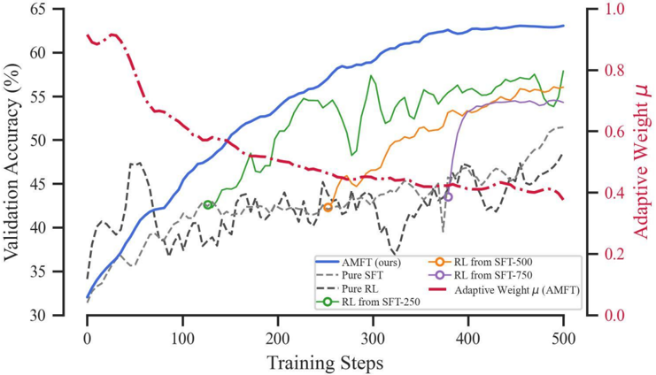
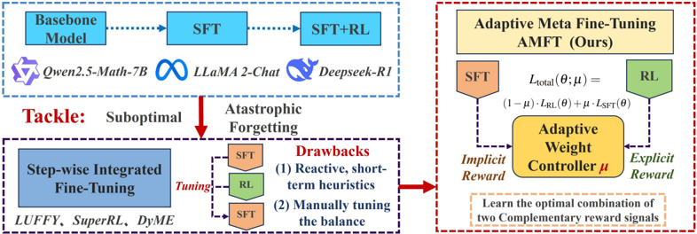

# amft — AMFT: Aligning LLM Reasoners by Meta-Learning the Optimal Imitation-Exploration Balance

> **一句话重点 (TL;DR)**：与其用"SFT→RL"两阶段或靠启发式硬切换，AMFT 把 SFT 和 RL 揉进**单阶段单循环**，并把"模仿(SFT)与探索(RL)的配比 µ"当成一个**可学习参数**，用 meta-gradient 以"最大化最终任务表现"为元目标前瞻式地学这个 µ。值得看的点：它把 SFT 形式化为"优化专家示范里隐含的隐式 reward"的特殊 RL，从而让 SFT/RL 在同一目标下统一——这与 OPD"在线策略蒸馏里如何调度模仿 vs 探索权重"的命题同构。**注意：代码仓库当前 404 不可得，方法细节无法独立核实。**

**元信息**：arXiv 2508.06944v1 ｜ 清华大学电子工程系（Lixuan He, Jie Feng, Yong Li）｜ Preprint, under review, 2025-08-09 ｜ 主题 单阶段统一 SFT+RL 后训练 / 与 OPD **真实相关** ｜ 代码 https://github.com/hlxtsyj/AMFT（**不可得**：该仓库与 TSYJ-He/AMFT 均 404，已二次核验仍 "Repository not found"）｜ 框架 〔待核，仓库不可得〕方法层面建立在 GRPO(RLVR)+SFT 加权损失之上

## 关键图示

**① Motivation / 对比图**



*Figure 2: AMFT learning dynamics vs. sequential baselines on math benchmarks. The left y-axis shows validation accuracy (%), while the right y-axis shows the adaptive weight µ . AMFT (solid blue) achieves a superior learning curve by dynamically adjusting µ (red dash-dotted), avoiding the difficult*

**② 方法 / 架构图**



*Figure 1: Overview of AMFT's motivation and framework.*

## 1. 相关工作与进展(这条线现在做到哪一步)
LLM 推理后训练主流是 **"SFT→RL"两阶段流水线**。近期出现一批**单阶段统一 SFT+RL** 的尝试：SRFT 用 policy entropy 调权；SuperRL/SASR/DyME 分别用 reward density、gradient norm、生成正确性做"硬切换"在 SFT 与 RL 间跳转。AMFT 处在"单阶段统一"这条线，但主张前面这些都是**反应式(reactive)** 启发式，缺一个原则化、前瞻性的配比机制。

## 2. 现有工作存在的问题(本文针对的痛点)

- **两阶段流水线**：SFT 擅长模仿专家轨迹但局限于静态数据集、倾向记忆而非泛化(OOD 差)；RL 探索强、泛化好但样本低效、稀疏奖励下不稳，且 on-policy 受基模能力上界限制。两阶段目标突变易导致**灾难性遗忘**(RL 阶段覆盖 SFT 学到的结构知识)。
- **现有单阶段方法**都是反应式：依赖短期、含噪的启发式信号(熵、reward density、梯度范数等)做被动调整或硬切换，**缺乏前瞻性**——不回答"现在这样调配，对最终性能是否最优"。

## 3. Motivation(为什么做这件事)
作者要的是一个**原则化、动态、前瞻**的模仿-探索平衡机制：模仿/探索的最优配比不该靠启发式被动反应，而应作为**可学习参数**，用"最大化最终任务表现"的元目标直接优化(forward-looking)。

## 4. 主要灵感 / 核心直觉
核心灵感是**"隐式奖励"统一视角**：SFT 不只是分布匹配，可形式化为"优化专家示范中隐含的隐式 reward"的一种特殊 RL。于是 SFT(path-based 隐式 reward)与 RL(outcome-based 显式 reward)是**同一目标下互补的两种 reward 信号**，二者的配比 µ 就成了一个可被元学习优化的量。

## 5. 主要解决思路(一段话把核心机制讲清)
用一个动态权重 µ_t∈[0,1] 把 SFT 损失与 RL 损失线性组合成统一损失；µ 由一个 **meta-gradient 自适应控制器**驱动：长期看，把 µ 当可学习参数，在 validation batch 上估"调 µ 对未来最终性能的影响"做前瞻式全局控制；短期看，用 policy entropy 偏离目标值的程度做快速纠偏。每个 update step 先更新 µ，再用新 µ 算统一损失更新策略。

## 6. 方法详解(通俗、分步骤;关键公式用白话解释,必要时给伪代码)
**统一损失**：\(\mathcal{L}_{\text{total}} = \mu_t \cdot \mathcal{L}_{\text{SFT}} + (1 - \mu_t) \cdot \mathcal{L}_{\text{RL}}\)，RL 部分用 GRPO(RLVR)。

**µ 控制器(双机制)**：

- **长期 meta-gradient**：把 µ 当可学习参数，周期性在 validation batch 上估 \(g_\mu = \nabla_\mu U(\theta_t)\)（U 为长期效用/任务表现）。白话："现在把 µ 往哪个方向挪，能让若干步之后的最终性能更好"——这是前瞻式全局控制。
- **短期 entropy 启发式**：\(g_H = H^{*} - H(\pi_\theta)\)。熵过高(太发散)→增大 µ 收敛到模仿；熵过低/坍塌→减小 µ 鼓励探索。目标熵 H* 由 warm-up 阶段的平均熵初始化。
- **更新**：\(\mu_{t+1} = \mu_t + \eta_\mu \cdot g_\mu + \eta_H \cdot g_H\)。

**单步流程伪代码**：
```
每个 update step:
  1. 取 SFT 数据 + on-policy rollout 的混合 batch
  2. 控制器更新 µ_t  (meta-gradient g_µ + 熵启发式 g_H)
  3. 用新 µ_t 算 L_total = µ·L_SFT + (1−µ)·L_RL(GRPO)
  4. 更新策略 θ
```
〔待核〕η_µ/η_H 取值、meta-gradient 用的 validation batch 如何构造、稳定性细节——因仓库 404 无法核实。

## 7. 实验数据集

- **数学**：训练集 **OpenR1-Math-46k-8192**（论文明确命名，HF: Elliott/Openr1-Math-46k-8192）。ID 评测 **5 个** benchmark：AIME24、AMC、MATH500、Minerva、**OlympiadBench**；OOD 泛化用 **3 个**通用推理 benchmark：ARC-C、GPQA-D、MMLU-Pro。基模 **Qwen2.5-Math-7B**。
- **多模态**：**General Points**(算术推理纸牌)、**V-IRL**(视觉-语言导航)，各设 Rule-Variation 与 Visual-Variation 两类 ID/OOD split。基模 **LLaMA-3.2-Vision-11B**。
- 效率目标指标示例：General Points 60% win-rate、V-IRL 70% success-rate(作为"达标所需步数/样本数"的衡量点)。

## 8. 实验结果与主要发现(关键数字)

- 作者自述在数学、抽象视觉推理(General Points)、视觉导航(V-IRL)三类任务上"建立 new SOTA"，并强调 **OOD 泛化更好**、达标所需训练步数/样本更少(计算与样本效率)。
- **消融(Table 4)** 确认三件套缺一不可：去掉 meta-gradient、去掉熵启发式、去掉 SFT warm-up 均显著掉点；去掉熵启发式还会**训练不稳**。
- 对比基线含 RL-from-SFT(两阶段)、RL-only(GRPO from scratch)、LUFFY、SRFT 等。
- 〔保留意见〕"new SOTA"为 preprint 自述、未经评审；精确数值因仓库 404 与本审计未逐一抄录主表，待核。

## 9. 结果如何支撑其主张(证据链是否到位)
主张是"前瞻式可学习配比 > 反应式启发式"。消融把三个组件逐一拿掉证明各自必要性(尤其熵启发式关乎稳定、meta-gradient 关乎性能)，这条证据链对"三件套都有用"较扎实。但"前瞻式优于反应式"这一**因果归因**主要靠与 SRFT 等基线的端到端对比间接支撑，缺少把 meta-gradient 直接对位某个反应式信号的 head-to-head 控制实验，归因强度中等。

## 10. 逻辑自洽性(中性评估:哪里站得住、哪里牵强)

- **站得住**：把 SFT 视为隐式 reward RL 的统一视角是合理且有文献基础的；单循环混合 batch + 动态 µ 的工程设计自洽；消融支持各组件必要性。
- **牵强/可质疑**：(1) meta-gradient 估 \(\nabla_\mu U\) 通常需要展开多步或近似(隐式微分/有限差分)，论文层面对其方差与计算开销的讨论待核，仓库不可得使其无法验证；(2) "long-term meta-gradient + short-term entropy"两个信号可能冲突，加权 η_µ/η_H 的鲁棒性未知；(3) new SOTA 系自述、未评审。

## 11. 残留问题 / 局限

- **代码 404 不可得**——本分析仅基于 34 页 PDF，方法实现、超参、稳定性均无法独立核实，这是最大局限。
- preprint 未经评审，"new SOTA"待第三方复现。
- meta-gradient 的计算成本/方差、双学习率敏感性、validation batch 构造细节缺失。
- 多模态任务仅两个(General Points / V-IRL)，泛化结论的覆盖面有限。

## 12. 开源代码与框架(链接 + 框架 + 代码可得性)

- 链接：论文声明 https://github.com/hlxtsyj/AMFT （正文首页脚注）。
- **可得性：404 不可得**。`hlxtsyj/AMFT` 与任务清单给出的 `TSYJ-He/AMFT` 经二次 `git ls-remote` 核验均返回 "Repository not found"，api.github.com 同样 404。仓库当前不公开/已下线。
- 框架：〔待核〕无法确认具体 RL 框架(verl/TRL/oat 等)；方法层面建立在 GRPO(RLVR)+SFT 加权损失之上，视觉任务用 GRPO 作 RL 基线。
