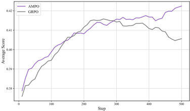
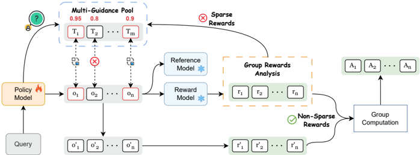

# ampo — AMPO: Adaptive Multi-Guidance Policy Optimization for Diverse Exploration

> **一句话重点 (TL;DR)**：当 on-policy RLVR 在某道难题上**整组采样全失败**(稀疏奖励、学不动)时，AMPO 才**按需**从一个**多教师池**里挑入正确解替换失败样本；挑哪条教师路径不看"哪个教师最强"，而看"哪条对学生最容易吸收"(学生在该路径下生成正确答案的概率最高)。值得看的点：用 4 个同量级"同伴"教师 + 仅 8.5k 数据，就媲美了用单一更强教师(DeepSeek-R1)+46k 数据的方法，并全程保持更高 entropy(探索性)。与 TSRD 的"按需脚手架 + 路径恢复"强相关。

**元信息**：arXiv 2510.02227v2 ｜ 同济、香港理工、上海 AI Lab、新加坡国立、电子科技大（Xiaoyang Yuan 等，通讯 Yi Bin）｜ 2025-10-09 (v2) ｜ 主题 多教师 Mixed-Policy RLVR / 与 TSRD **强相关** ｜ 代码 https://github.com/SII-Enigma/AMPO（**完整**，已克隆约 163M，含数据/脚本/checkpoint）｜ 框架 verl(GRPO 的 Mixed-Policy 扩展, FSDP 或 Megatron)
> 标题两版同指一文(arXiv id 一致)：arXiv 版 "More Than One Teacher: Adaptive Multi-Guidance Policy Optimization for Diverse Exploration"；README 版 "Many Small Teachers Beat One Giant: Adaptive Multi-Peer Policy Optimization for LLM Reasoning"。

## 关键图示

**① Motivation / 对比图**

**② 方法 / 架构图**

*Figure 1: The AMPO training framework. It enhances exploration by adaptively replacing on-policy failures with external solutions from a Multi-Guidance Pool only when sparse rewards occur. The selection of external guidance is prioritized based on the Policy Model's comprehension score for each opti*

## 1. 相关工作与进展(这条线现在做到哪一步)
RLVR(可验证奖励 RL)是提升 LLM LongCoT 推理的有效范式，但 on-policy GRPO 的探索被困在模型自身知识边界内，难学到超出初始能力的新策略，并受 "capacity-difficulty mismatch" 困扰(难题持续失败→稀疏奖励→训练不稳)。为突破边界，社区做 **Mixed-Policy RL**：把强教师的 off-policy 轨迹混入 on-policy，或交织 RL 与 SFT(代表如 LUFFY)。AMPO 处在 Mixed-Policy 这条线，主打"多教师 + 按需 + 可理解度选择"。

## 2. 现有工作存在的问题(本文针对的痛点)
现有 Mixed-Policy RL 有两个关键局限：

1. **多依赖单一教师**——限制学习多样性，且把单个教师的固有偏置/风格带进学生。
2. **静态数据整合**——不看模型当前需求与"可理解度"，无差别注入外部解，可能注入学生根本吸收不了的解法，浪费且扰动训练。

## 3. Motivation(为什么做这件事)
借鉴知识蒸馏的**多教师**思想：用多个**同量级"同伴"教师**的集体智慧替代单一更强教师。两条原则：(1) **guidance-on-demand**——只在学生自己解不出时才用外部引导替换失败样本，最大化自探索价值；(2) **按可理解度选路径**——挑学生最容易吸收的那条教师推理，平衡探索与利用。

## 4. 主要灵感 / 核心直觉

- **"多个同伴 > 一个巨人"**：多个 7B-级教师风格各异，集体覆盖的解法多样性比单一强教师更广，且不把单一模型偏置灌给学生。
- **"易吸收 > 最正确"**：一条教师推理即使正确，若离学生当前内部表征太远，学生也学不动；应选学生"差一点就能自己走到"的那条——这正好对应"脚手架"该搭在学生够得着的高度。

## 5. 主要解决思路(一段话把核心机制讲清)
在 GRPO 之上：对每个 query 先由 π_old 采 G 个解；若整组奖励都低于阈值(稀疏奖励、全失败)，就触发**自适应多引导替换**——从多教师正确解池里按"可理解度(Probability Reward)"选 top-k 条，替换掉 k 个错误的 on-policy 解；否则不替换，优先自探索。然后在增广 batch 上统一算 advantage，用**混合目标**(off-policy 序列级聚合 + on-policy token 级聚合)更新策略。N_off=0 时无缝退化为 GRPO。

## 6. 方法详解(通俗、分步骤;关键公式用白话解释,必要时给伪代码)
三部分：

**(1) Adaptive Multi-Guidance Replacement(自适应多引导替换)**：构建 Multi-Guidance Pool `P_G`(多教师的正确 off-policy 解)。π_old 对 query 采 G 个解；若全部奖励 < 阈值 τ(置替换标志 I=True)，随机选 k 个错误 on-policy 解，用 P_G 中按可理解度选出的 top-k off-policy 解替换，\(k = \min(k_0, N_g)\)；否则不替换。保证每步都有正确解可学，但优先自探索。

**(2) Comprehension-based Guidance Selection(基于可理解度的选择)**：定义 **Probability Reward r_p**：把教师推理路径 z_off 与 ground-truth 答案 y* 拼成 o*=(z_off, y*)，r_p = 学生 π_θ 在给定 z_off 下生成正确答案 token 的**几何平均概率**(log-prob 平均后 exp，clip 到 [0,1])。白话：r_p 高 = "顺着这条教师推理，学生自己几乎就能写出正确答案" = 最易吸收。按 r_p 取 top-k，平局取**更短(更简洁)** 路径。

**(3) Policy Optimization with Multi-Guidance**：在增广 batch G_aug 上统一归一化算 advantage(GRPO 式)。\(J_{\text{Mixed}} = J_{\text{off-policy}} + J_{\text{on-policy}}\) 加权和：

- **off-policy 用 sequence-level 聚合**——避免长教师序列主导梯度，保证每条教师解等权(`compute_token_on_seq_off_policy_loss`：对每条教师序列先 masked_mean，再跨序列 `.mean()`)。
- **on-policy 用 token-level 聚合**(DAPO 式)。

**off-policy 重要性采样比的两条实现路径**(已核 `mix_core_alg.py`)：

- **路径(a) 论文正文形式**：传入 `target_probs` 时，\(\text{off\_ratio} = \pi_\theta / \pi_{\text{target}}\)（教师概率显式出现，对应论文 Eq.7 \(\hat{r} = \pi_\theta / \pi_{\varphi_j}\)）。
- **路径(b) 默认发布脚本**：`train_ampo.sh` 用 `off_policy_reshape="p_div_p_0.1"` 走 reshape 分支，\(\text{off\_ratio} = f(\pi_\theta) = \pi_\theta / (\pi_\theta + 0.1)\)——**教师概率不显式出现**，shaping 直接作用于学生概率，与 LUFFY(Yan et al. 2025)实现一致。两者数学上不同：默认实验跑的是(b)，论文公式写的是(a)。\(f(x) = x / (x + 0.1)\) 为沿用 LUFFY 的 shaping 函数。

## 7. 实验数据集

- **教师池(4 个同量级 LongCoT 教师)**：AceReason-Nemotron-1.1-7B、DeepSeek-R1-Distill-Qwen-7B、OpenR1-Qwen-7B、Qwen3-8B(thinking)。
- **训练数据**：基于公开 OpenR1-Math-46k-8192 经多教师 curation 筛出的 **8.5k 高质量样本**。
- **基座**：主 Qwen2.5-7B-Instruct；另用 Qwen2.5-1.5B-Instruct、LLaMA3.2-8B-Instruct 验证。
- **评测**：6 个数学 ID 基准(AIME2024、AIME2025、AMC、Minerva、OlympiadBench、MATH500) + 3 个 OOD(ARC-c、GPQA*、MMLU-Pro)。

## 8. 实验结果与主要发现(关键数字)

- 相比 GRPO：数学基准**平均 +4.3%**、**OOD +12.2%**。
- 提升 **Pass@k**，训练全程保持**更高 entropy**(探索性更强、未坍塌)。
- **数据效率**：用 4 个同量级教师 + 仅 **8.5k** 数据，即可媲美用单一更强教师(DeepSeek-R1) + **46k** 数据的方法。
- 论文另分析引导替换数量 k 与教师池组成的影响。

## 9. 结果如何支撑其主张(证据链是否到位)
三个主张各有证据：(1) "多教师 > 单教师"——与单教师/单一强教师基线对比 + 教师池组成消融；(2) "按需 > 静态"——guidance-on-demand 仅在全失败时触发，对比静态注入；(3) "可理解度选择有效"——r_p 选择 vs 随机/最强教师。"更高 entropy + Pass@k 提升"共同支撑"保留了探索而非塌成单模"。证据链较完整，数据效率对比尤其有说服力。

## 10. 逻辑自洽性(中性评估:哪里站得住、哪里牵强)

- **站得住**：on-demand 替换的逻辑(只在自探索失败时才注入)直接对应"最大化自探索 + 兜底正确解"，自洽；sequence-level 等权聚合避免长 CoT 主导梯度，工程上合理且代码确证。
- **牵强/需注意**：**论文公式(路径 a)与默认实验(路径 b)的重要性采样比不一致**——这是实现与理论之间的真实缺口。路径(b)里教师概率根本不进入 ratio，意味着"off-policy 重要性校正"在默认实验中并未按 Eq.7 执行，而是退化成 LUFFY 式的学生概率 shaping。读者若据论文公式理解机制，会与实际跑的代码错位。

## 11. 残留问题 / 局限

- **公式-实现缺口**(见 §10)：默认脚本未用论文 Eq.7 的 \(\pi_\theta / \pi_{\text{target}}\)，而用 \(\pi_\theta / (\pi_\theta + 0.1)\)，二者数学不等价。
- 教师池需 4 个现成强教师，构建/采样成本不小；"同量级同伴"在更大/更小规模下是否仍优于单一强教师未充分验证。
- 阈值 τ、替换数 k_0 为超参，跨任务自适应性未知。
- 主验证集中在数学推理 + 少量 OOD，覆盖面有限。

## 12. 开源代码与框架(链接 + 框架 + 代码可得性)

- 链接：https://github.com/SII-Enigma/AMPO （已克隆约 163M，**完整**）。核心改动在 `ampo/verl/verl/adaptive_mix_src/`(`mix_core_alg.py` 含两条 off-policy ratio 路径、`compute_token_on_seq_off_policy_loss` 序列级聚合)；含 `data/`、`exp_scripts/`(含 `train_ampo.sh`)、`eval_scripts/`、`examples/`、`figures/`。HF 组织 SII-Enigma 提供 checkpoint。
- 框架：基于 **verl**，实现 GRPO 的 Mixed-Policy 扩展；conda py3.10，支持 FSDP 或 Megatron(vllm/sglang/mcore)。
