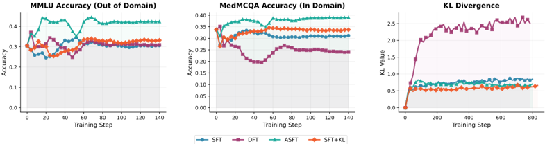
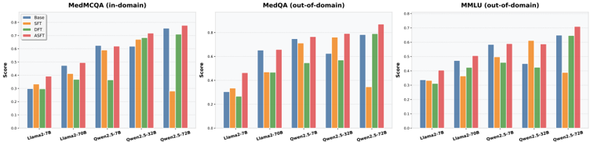

# asft — ASFT: Anchored Supervised Fine-Tuning

> **一句话重点 (TL;DR)**：DFT(用 token 概率给交叉熵重加权的 SFT 变体)在推理域好用、在知识域(如医疗)不稳，原因是它"界紧但会漂移"(KL 持续增大)。ASFT 只加一项**轻量 KL 锚定**把策略约束在 base 模型附近，就同时保住 DFT 的紧界优势和稳定性。值得看的点：它用 **RWR(reward-weighted regression)框架**统一解释 SFT/DFT，证明 DFT 给出比 SFT 可证更紧的 RL 下界，并指出其缺分布锚定才是不稳定根因——理论诊断 + 一行 KL 修复。

**元信息**：arXiv 2509.23753v3（2026-02-01）｜ 南方科技大学、北京大学、上海 AI Lab（He Zhu、Junyou Su 共一，通讯 Guanhua Chen）｜ ICLR 2026（2026-01-30 接收）｜ 主题 T3 GFT/SFT-RL 统一类，**相关性 High** ｜ 代码 https://github.com/zhuchichi56/ASFT（**完整**，约 54MB；已合入 LLaMA-Factory 主分支）｜ 框架 自定义 HF Trainer + DeepSpeed(ZeRO-2/3) + PEFT/LoRA；新增 veRL(FSDP2) 分支(README 推荐优先)

## 关键图示

**① Motivation / 对比图**

*Figure 1: Training dynamics comparison across fine-tuning methods on medical knowledge tasks. Left : MMLUaccuracy (out-of-domain evaluation); Center : MedMCQA accuracy (in-domain evaluation); Right : KL divergence from base model. DFT exhibits severe distributional drift (high KL divergence) while A*

**② 方法 / 架构图**

*Figure 3: Comparison of model performance across three benchmarks (MedQA, MMLU, MedMCQA) for five models (LLaMA-2-7B, LLaMA-2-70B, Qwen2.5-7B, Qwen2.5-32B, Qwen2.5-72B) using four fine-tuning strategies (Base, SFT, DFT, ASFT). Each subplot shows the scores for a specific benchmark, highlighting the*

## 1. 相关工作与进展(这条线现在做到哪一步)
后训练在 **SFT**(高效模仿但易记忆、泛化弱)与 **RL**(泛化好但贵且不稳)之间存在根本权衡。**DFT**(Dynamic/Discriminative Fine-Tuning)通过 token 概率重加权成为有前景的中间地带，在推理域取得改进。ASFT 处在"用统一理论框架解释 SFT-RL 中间地带、并修复其稳定性"这条线，是 **DFT 的轻量扩展**。

## 2. 现有工作存在的问题(本文针对的痛点)

- **DFT 效果域相关**：推理密集型域好，但在知识密集型任务(如医疗 MedQA 等)**不稳定**，且其启发式重加权设计**缺乏理论依据**。
- 作者用 RWR 框架诊断出根因：DFT 对应一种特定 auxiliary distribution 构造，能给出比 SFT **可证更紧**的 RL 下界；但它**缺乏分布锚定**，导致**渐进式漂移**(KL 持续增大)——下界越来越松、重要性权重方差越来越大，从而训练不稳。

## 3. Motivation(为什么做这件事)
既然 DFT 的问题是"紧但会漂移"，那么只要给它**加一个轻量 KL 锚定项**把策略约束在 reference(base 模型)附近，就能在保留 DFT 紧界优势的同时获得稳定性——兼得 SFT 的效率与 RL 的泛化。

## 4. 主要灵感 / 核心直觉
核心直觉来自 **RWR 视角**：把 SFT/DFT/RL 都看成"用某个 auxiliary distribution 加权的回归"。DFT 选了一个能让 RL 下界更紧的加权(故推理域更好)，但这个加权没有任何力量把策略拉回 reference，于是越训越偏。**紧界 + 锚定 = 既贴近最优又不跑偏**——这正是 RL 里 KL 惩罚的作用，ASFT 把它搬进 SFT。

## 5. 主要解决思路(一段话把核心机制讲清)
ASFT = **DFT 概率重加权 + KL 锚定**。在 DFT 的 token 级重加权交叉熵上，加一项把当前策略 π_θ 拉向 reference(base/原模型，LoRA 时禁用 adapter 即得)的 per-token KL，用一个小权重 kl_weight 平衡。重加权负责"紧"，KL 锚定负责"稳"。

## 6. 方法详解(通俗、分步骤;关键公式用白话解释,必要时给伪代码)
代码(`train_v2.py`, `mode="asft"`)逐行核对(已确认与论文一致)：

- **DFT 重加权**：`weights = softmax(logits).gather(label).detach()`；`dft_losses = token_losses · weights`。白话：模型对正确 token 当前预测概率越高，这个 token 的 loss 权重越大——把学习集中到"模型已经有点会、再推一把就稳"的 token 上。
- **KL 锚定**：`kl_div = KL( log_softmax(π_θ) ‖ softmax(ref) )`(per-token，对 vocab 求和)；ref 为 base/原模型(`disable_adapter()` 取 reference，或单独加载 `original_model` 并冻结)。
- **最终损失**：`weighted_losses = dft_losses + kl_weight · kl_div`，再按 valid_mask(非 -100 的回复 token)归一。
- **kl_weight**：代码默认 **0.1**(train_v2.py / .sh)，但 README 与示例命令在**混合精度(bf16/fp16)下推荐 0.03**——过大会放大精度噪声致失稳。
- 代码同时实现 `sft / dft / sft+kl / asft` 四种 mode，便于消融对照。
- **理论**：在 RWR 框架下证明 DFT 给出比 SFT 严格更紧的 RL 下界(论文 _txt 确认 "provably tighter bound than SFT")，KL 锚定控制方差/漂移。

## 7. 实验数据集

- 三类域：**数学推理**(100k 训练样本)、**医疗知识 grounding**(MedQA/MMLU/MedMCQA，10k)、**代码生成**。
- 基座：**LLaMA-2-7B 与 Qwen2.5-7B** 两个 7B 模型(论文 §5.1；选 LLaMA-2-7B 是为规避数据污染)。
- 对比：SFT、DFT、iw-SFT、SFT+KL；并验证 ASFT 作为 DAPO/GRPO 的更优初始化。

## 8. 实验结果与主要发现(关键数字)

- **数学(100k)**：较 DFT **+4.85 点(18.6%)**，较基座 **+17.89 点(142%)**。
- **医疗(10k)**：较 SFT **+8.28 点(24.8%)**，较基座 **+10.65 点(33.9%)**。
- **效率**：仅需全 RL 约 **3%** 的训练算力。
- 跨推理/知识两类域均稳定优于 SFT、DFT；泛化接近 RL 而保持 SFT 级效率。
（数值已对照论文 _txt 第 131-134 行核实。）

## 9. 结果如何支撑其主张(证据链是否到位)
证据链完整：理论(RWR 框架证 DFT 更紧界 + KL 锚定控漂移) → 诊断(DFT 在知识域因 KL 漂移失稳) → 修复(加 KL 锚定) → 实验(数学 vs 医疗两类域均稳定超 DFT/SFT)。"医疗域 DFT 不稳而 ASFT 稳"直接对应理论诊断的预测，归因较扎实；"3% 算力达近 RL 泛化"支撑"兼得效率与泛化"的主张。

## 10. 逻辑自洽性(中性评估:哪里站得住、哪里牵强)

- **站得住**：RWR 统一框架 + "紧界但缺锚定→漂移"的诊断逻辑清晰；KL 锚定就是把 RL 的 KL 惩罚搬进 SFT，理论动机干净；代码与公式逐行吻合(DFT 项 + KL 项)。
- **牵强/需注意**：(1) ASFT 本质是"DFT + 已知的 KL 正则"，新颖性更多在**理论解释**而非机制本身(SFT+KL 早已存在，论文也把它列为基线)；(2) kl_weight 在不同精度/域下需手调(0.1 vs 0.03)，说明稳定性对该超参敏感，"轻量锚定"并非完全免调；(3) 仅两个 7B 基座，规模与家族覆盖有限。

## 11. 残留问题 / 局限

- 〔待核〕RWR 框架下"更紧下界"的形式化定理与 kl_weight 在不同域的敏感性曲线需对照正文与附录细读。
- 仅 LLaMA-2-7B / Qwen2.5-7B 两个 7B 模型，未验证更大规模或更多家族。
- kl_weight 需按精度/任务调参(默认 0.1，bf16/fp16 推荐 0.03)，DeepSpeed 下有精度问题(故新增 veRL/FSDP2 分支)。
- 相对 DFT 的增量主要是一项 KL 锚定 + 理论解释，机制创新有限。

## 12. 开源代码与框架(链接 + 框架 + 代码可得性)

- 链接：https://github.com/zhuchichi56/ASFT （已克隆约 54MB，**完整**）。数据 HF: `chichi56/ASFT`。
- 实现：主分支 `train_v2.py`(loss 实现，mode ∈ {sft, dft, sft+kl, asft}) + `scripts/ds_zero*.json`；新增 **veRL 分支**(2026-05-08，FSDP2，数值更稳，README 推荐优先)；已合入 **LLaMA-Factory 主分支**(2026-02-12, commit #10174)。
- 框架：自定义 HF Trainer + DeepSpeed(ZeRO-2/3) + PEFT/LoRA；新增 veRL(FSDP2)；已并入 LLaMA-Factory。（注：repo 与论文均未提及 ms-swift。）
- 推荐配置：full SFT 用 lr=2e-5、3 epoch、kl_weight=0.03；LoRA 推荐 r=8/alpha=16/dropout=0.05/lr=5e-4(医疗任务最优)。
