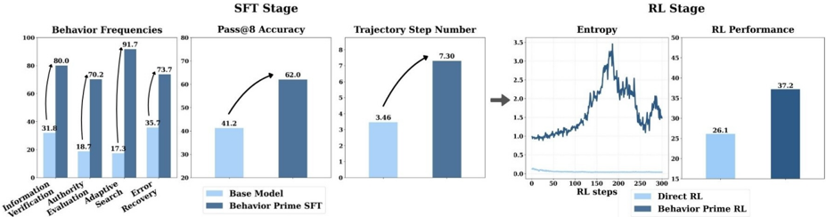
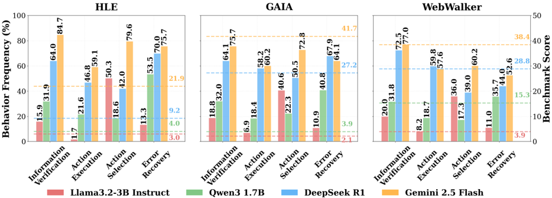

# behavior_priming — Beneficial Reasoning Behaviors in Agentic Search and Effective Post-training to Obtain Them

> **一句话重点 (TL;DR)**：先用 LLM pipeline 找出让"搜索 agent"成功的四种推理行为（验证、权威评估、自适应搜索、纠错），再用 SFT 把这些行为"种"进模型、之后再 RL。关键证据：用"展现这些行为但答案错误"的轨迹做 SFT，效果 ≈ 用答案正确的轨迹——说明**解锁 RL 的关键是推理行为（path）而非 outcome 正确性**。

**元信息**：arXiv:2510.06534v3（2026-01-16，cs.AI）｜ CMU LTI（Jiahe Jin、Abhijay Paladugu、Chenyan Xiong）｜ 2026-01 预印本｜ 主题：SFT-then-RL 的"行为先验"版（agentic search），**与 TSRD 高度相关**——"RL 前先种入特定推理行为/path 比 outcome 正确性更重要"正对应 TSRD 的"teacher-scaffolded→内化→RL"，且其错误轨迹消融为"path 监督 > outcome 监督"提供直接证据；本文**不涉及 MTP**，行为靠 LLM-judge 识别而非 logit 蒸馏｜ 代码 https://github.com/cxcscmu/Behavior-Priming-for-Agentic-Search （旧 KEYS 的 `cxcscmu/Behavior-Priming` 为 404，此为正确仓库名，已验证 200；RL 训练在另一仓库 `cxcscmu/verl-agent-deepresearch`）｜ 框架 SFT 用 LLaMA-Factory、RL 用 GRPO（veRL 系）。

---

## 关键图示

**① Motivation / 对比图**

*Figure 1: Training dynamics and final performance on WebWalkerQA with Qwen3-1.7B. Left (SFT Stage): The improvement of behavior frequencies, Pass@8, and average trajectory length after Behavior Priming SFT. Right (RL Stage): Entropy during RL and final RL performance for the base model (Direct RL) a*

**② 方法 / 架构图**

*Figure 2: Comparison of different LLMs as the underlying agentic search model of our agent framework across three web agent benchmarks. For each benchmark, bars indicate the frequency of four behaviors observed in trajectories (left axis), while dashed horizontal lines indicate the benchmark score (*

## 1. 相关工作与进展
- **Agentic search**：LLM 多步检索解复杂信息需求（分解任务、多步搜索、综合结果）。商用如 ChatGPT Deep Research、Google AI Mode；开源侧 RL 训练 agentic search 进展快（Search-R1、R1-searcher、DeepResearcher）。
- 训练范式分两类：早期靠强模型轨迹**蒸馏/SFT**；近期主流是端到端 **online RL**；不少工作采 **SFT-then-RL** 两段式先初始化工具使用与推理能力。
- 数学/代码领域已有发现：**RL 是否成功高度依赖 base model 是否已具备特定推理模式**（如 verification / backtracking）——但这类研究**几乎只在数学**。

## 2. 现有工作存在的问题
- 对 agentic search，"**哪些具体推理行为有益、如何系统培养**"仍不清楚。
- agentic search 有独特挑战：海量结果中识别有用信息、解决来源冲突、长轨迹中保持目标聚焦。
- 关键观察：non-primed 模型在 RL 过程中**无法内生地**发展出这些行为——所以需要显式行为先验。

## 3. Motivation
先搞清"什么推理行为让搜索 agent 成功"，再可靠地把它们植入模型，为 RL 建立稳健的探索与 test-time scaling 基础。

## 4. 主要灵感 / 核心直觉
把数学领域"RL 成功取决于 base 已有推理模式"的发现迁移到 agentic search：与其指望 RL 自己长出好行为，不如**事先用 SFT 把成功轨迹里反复出现的行为种进去**，让 RL 在此基础上精炼。

## 5. 主要解决思路（一段话讲清核心）
两步：(1) 用 LLM-based 三阶段 pipeline 对比"强模型成功 vs 弱模型失败"的轨迹，提炼出四种普适有益行为；(2) **Behavior Priming** = 先在"同时展现全部四种行为"的轨迹上做 step 级 SFT，再在 primed 模型上跑 GRPO（outcome 二值奖励）。

## 6. 方法详解（通俗、分步骤）
**第一部分：识别有益行为**
- 先建标准 agentic search 框架：每步输出 reasoning + action；action ∈ {search, answer, **summary**}（summary 压缩历史以管理上下文长度）。
- 配对轨迹：Gemini 2.5 Flash（强）成功而 Qwen3-1.7B（弱）失败的 **500 题**。
- 三阶段 LLM pipeline：①轨迹比较 → ②行为抽取（这两步用 Gemini 2.5 Flash）→ ③行为合并去重（Gemini 2.5 Pro），再人工复核。
- 得到**四种行为**：**Information Verification**（跨源验证并引证）、**Authority Evaluation**（识别冲突、评估来源可信度）、**Adaptive Search**（动态调整搜索策略）、**Error Recovery**（识别并纠正先前错误）。跨 Gemini/DeepSeek-R1/Llama/Qwen 多模型测得"行为频率与性能强相关"（Fig.2），证其普适。

**第二部分：Behavior Priming（SFT-then-RL）**
- **SFT**：用 Gemini 2.5 Flash 每题采 10 条轨迹，筛出"同时展现全部四种行为"的轨迹；把每条轨迹的**每一步当独立训练样本**（D_SFT = {(x_k, y_k)}）。
- **RL**：在 behavior-primed 模型上跑 **GRPO**，按 step 聚合更新；**outcome-based 二值奖励**（LLM-judge 判最终答案对/错，1/0），该奖励与 advantage 对轨迹内所有 step 恒定（无 step 级信用分配）。
- **核心消融**：对比"展现目标行为但答案错误 (Behavior Prime Incorrect)" vs "答案正确 (Correct)"两组轨迹做 prime——用**错误轨迹** prime 的模型性能 ≈ 用正确轨迹的（Table 1 显示两组 SFT 数据行为频率均 100%、accuracy 分别 0% / 100%）。结论：**推理行为而非 outcome 正确性才是解锁 RL 潜力的关键**。
- **训练动态**：SFT 后行为频率、pass@8、平均步数同升；RL 中 primed 模型维持更高 policy entropy，而 direct RL 熵骤降、过早收敛。

## 7. 实验数据集
- **backbone**：Qwen3-1.7B、Llama3.2-3B-Instruct。
- **评测**：3 个 web agent benchmark + 7 个 multi-hop QA benchmark。
- **数据来源**：SFT 数据问题/答案取自 Li et al. 2025c；RL 用 Li et al. 2025c 的 web agent RL 集 + Zheng et al. 2025 的 multi-hop QA 集。行为识别的配对轨迹来自上述 500 题。

## 8. 实验结果与主要发现
- 相对 **Direct RL**：web benchmark **+37.2%**、multi-hop QA **+6.2%**（相对提升）；并一致超过两个 SFT-then-RL 基线（Distillation 随机采样 / Outcome-driven 只筛正确轨迹）。
- 增益在 **web 任务上明显**，QA 上较温和（+6.2%）。
- non-primed 模型 RL 中**不会自发**长出四种行为——印证显式先验的必要性。
- §5.3 数据规模消融（5k/10k/20k）、§5.4 单行为 (IV-only) vs 复合四行为对比。

## 9. 结果如何支撑其主张
主张"行为先验 > outcome 正确性"。支撑很直接：错误轨迹 prime ≈ 正确轨迹 prime（控制了行为频率，只变 outcome），且超过 Outcome-driven 基线（专门筛正确轨迹）。训练动态（熵、pass@8、步数）从机制上解释了为何 primed 能解锁 RL。证据链对该主张闭合度较高。

## 10. 逻辑自洽性（中性评估）
- 自洽：识别→培养→验证三段闭合，错误轨迹消融是干净的因果隔离实验。
- 张力点：四种行为由 **LLM-judge 识别与筛选**，整套结论依赖判别 prompt 的质量与 Gemini 的判断一致性，存在循环依赖（用 LLM 定义"好行为"、又用 LLM 评估是否展现）；"行为频率与性能相关"是相关而非因果证据，真正因果靠错误轨迹消融补足。

## 11. 残留问题 / 局限
- **规模偏小**（1.7B / 3B），是否在更大模型上同样需要显式先验未知。
- RL 仍是 **outcome 级 GRPO**，无 step/turn 级信用分配——与 path 监督的主张存在张力（SFT 阶段是 path，RL 阶段又退回 outcome）。
- 行为定义/识别依赖特定 LLM-judge 与 prompt，可迁移性与稳健性未充分检验。
- 不涉及 MTP；对 TSRD 的价值在于"**path 监督 > outcome 监督**"这一可迁移结论的强证据，而非具体机制。

## 12. 开源代码与框架（链接+框架+代码可得性）
- 主仓库：https://github.com/cxcscmu/Behavior-Priming-for-Agentic-Search （含 DeepResearch agent scaffold、行为分析 pipeline `behaviour_analysis/`、SFT recipe、agent 主循环 `main_parallel.py`、评测套件 `evaluation/short/`）。
- **SFT 框架**：**LLaMA-Factory**（`scripts/train.sh` → `llamafactory-cli train train/sft/sft.yaml`，仓库内 vendored LLaMA-Factory）。
- **agent scaffold / rollout / 评测**：vLLM 服务底层模型（Qwen3 开内置 thinking，无内置推理的模型加 `use_explicit_thinking`）。
- **RL 框架**：**GRPO**，实现在**独立仓库** https://github.com/cxcscmu/verl-agent-deepresearch （veRL 系，verl-agent 的 deep-research 变体）；本主仓库**不含 RL 训练代码**。
- 代码可得性：行为分析 + SFT + agent/评测可跑；RL 需到第二仓库。
