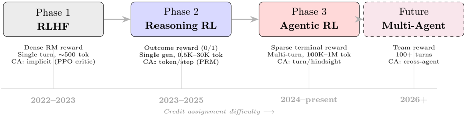
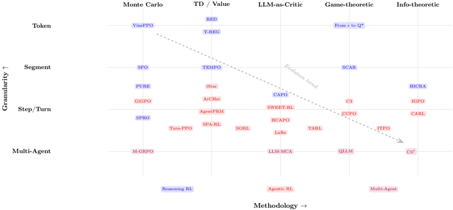

# ca_survey — From Reasoning to Agentic: Credit Assignment in Reinforcement Learning for Large Language Models

> **一句话重点 (TL;DR)**：一篇 survey + awesome-list，以"信用分配 (credit assignment, CA)"为中心透镜重审 LLM RL。核心产物是把 2024–2026 初的 **47 篇方法**（41 篇 core + 6 篇 adjacent）按**粒度 × 方法学二维分类**，并配 reporting checklist、benchmark 协议与方法选择决策树。判断：reasoning CA 正趋成熟（PRM + critic-free group comparison），agentic CA 催生真正新方法（hindsight counterfactual、privileged asymmetric critic、turn-level MDP）。

**元信息**：arXiv:2604.09459v2（2026-04-13，cs.CL）｜ Chenchen Zhang（独立研究者，**单作者** survey）｜ 2026-04 预印本｜ 主题：LLM RL 的 credit assignment 综述（**非新方法论文**）。与 OPD/TSRD/MTP 不直接相关，但 CA（把稀疏 outcome 奖励分配到 token/step/turn）正是 TSRD 中"path-selection / path-recovery 细粒度信用分配"的上位框架，可用于定位、选 baseline、找相邻工作｜ 代码/列表 https://github.com/xxzcc/Awesome-Credit-Assignment-in-LLM-RL （旧 KEYS 的 `xxzcc/Awesome-Credit-Assignment` 为 404，此为正确仓库名，已验证 200）｜ 框架 不适用（资源整理 + `gen_figures.py` 生成分类图）。

> 说明：按设定，本分析重点放在 §6（分类法）与 §8/§9（覆盖范围 & gaps）。

---

## 关键图示

**① Motivation / 对比图**

*Figure 1: Evolution of RL for LLMs and the corresponding credit assignment challenges. Each phase introduces longer trajectories, more complex environments, and harder credit assignment problems. The shift from reasoning to agentic RL represents a qualitative leap in CA difficulty.*

**② 方法 / 架构图**

*Figure 2: Two-dimensional taxonomy of credit assignment methods for LLM RL, organized by assignment granularity (vertical) and computational methodology (horizontal). Blue: primarily reasoning RL; Red: primarily agentic RL; Purple: multi-agent. The dashed arrow indicates the evolutionary trend from*

## 1. 相关工作与进展
- LLM RL 两波：**reasoning RL**（DeepSeek-R1/o1，单条 CoT 500–30K+ token，纯 outcome 奖励）→ **agentic RL**（多轮环境交互，10–100+ turn，100K–1M token，稀疏 terminal 奖励）。
- 经典 RL CA 工具箱（TD/GAE、return decomposition RUDDER、hindsight HCA、counterfactual/difference reward）是 LLM 方法的基础。
- 现有相邻综述：Pignatelli 2023（经典 RL CA，前 LLM 时代）、Zhang 2025a（agentic RL 100 页综述，把 CA 当子话题）——**无人系统覆盖 reasoning + agentic 两个 regime 的 CA**。

## 2. 现有工作存在的问题（survey 要解决的 gap）
- **Episode 级方法**（GRPO、REINFORCE）给每个 token 同一 advantage，trajectory 一长就失效（turn 3 的错误 tool-call 与后续几十个正确动作受同样惩罚；"echo trap" 现象）。
- agentic 设定使 CA **双层级化**：先判哪个 turn 关键，再判 turn 内哪些 token 重要；并有随机转移、部分可观测、超长 horizon。
- 既有综述要么只覆盖经典 RL，要么把 CA 当 agentic 的子话题，**缺乏专门、跨两 regime 的 CA 综述**。

## 3. Motivation
以 credit assignment 为中心透镜重审 LLM RL，给出 reasoning→agentic 演进叙事（Classical RL → Reasoning RL → Agentic RL → Future Multi-Agent），并产出可复用资源（清单、checklist、benchmark 协议）。

## 4. 主要灵感 / 核心直觉
"PRM 本质就是 CA"——一个给每步打分的 Process Reward Model，其实是在做 step 级的 terminal-reward 分解；PRM 文献与 CA 文献是同一问题的两个视角。把所有方法都拉到"如何把稀疏奖励分配到动作"这一统一问题下。

## 5. 主要解决思路（一段话讲清核心）
做一篇专门的 CA 综述，用"粒度 × 方法学"二维分类组织 47 篇方法，配三类标准化产物（机器可读清单、reporting checklist、benchmark 协议 + 决策树），并明确论证"为何 agentic 比 reasoning 的 CA 更难、催生哪些新技术"。

## 6. 方法详解（= 分类法 taxonomy，本文核心贡献）
覆盖 2024–2026 初 **47 篇方法**（**41 篇 core CA + 6 篇 adjacent enabler**）。**二维分类法**（§2.4，Fig.2）：
- **粒度轴 (granularity)**：Token / Segment / Step-Turn / Multi-Agent。
- **方法学轴 (methodology)**：Monte Carlo（VinePPO）/ Temporal Difference + value baseline（GAE；ArCHer 用 off-policy critic、AgentPRM 用 TD+GAE 学 turn-level value）/ **Model-based / LLM-as-Critic**（〔已核更正〕LLM-as-Critic 是论文 Fig.2 方法学轴**正文已列**的一列、且论文强调它"无经典 RL 对应"，并非 repo 后加；repo 后扩的是 uncertainty-control、verifiable-feedback shaping 等新类）/ Game-theoretic（Shapley、counterfactual）/ Information-theoretic（信息增益、熵）。
- **经典→LLM 映射**：return decomposition → reward redistribution（RED、SPA-RL）；hindsight → retrospective（HCAPO，基于 generative verification）；counterfactual → leave-one-out 与 Shapley（C3、CCPO 做 turn 级 LOO，SCAR 用 Shapley value）；TD/GAE → learned critics（ArCHer、AgentPRM）。
- **LLM-as-Critic 是新轴**：LLM 自身作 critic 给中间状态自然语言评价（CAPO 等），经典 RL 无对应。
- **综合判断**：reasoning CA 正收敛到 **process reward model + critic-free group comparison**（成熟化）；agentic CA 催生真正新方法 —— **hindsight counterfactual、privileged asymmetric critic、turn-level MDP 重构**（无 reasoning RL 先例）。
- **三类可复用产物**：(1) 机器可读的 47 方法清单（taxonomy 标签 / baseline family / evidence level / 主 benchmark，将以 CSV/JSON 发布，§B）；(2) 面向未来 CA 论文的 **reporting checklist**（§C，已对现有文献验证以找系统性 gap）；(3) **benchmark 协议规范**（任务族、元数据要求、controlled bifurcation tasks）+ 方法选择**决策树**（Fig.4 / Table 8，§9）。

## 7. 实验数据集
不适用（无自有实验）。但 §7 做 **systematic comparison**：按计算成本、是否需辅助模型、适用场景、实证性能比较各方法，含 GRPO-family meta-comparison；§9 给 benchmark 协议建议（任务族 + controlled bifurcation tasks）。

## 8. 实验结果与主要发现（= 文献覆盖与组织方式）
- **覆盖范围**：2024-01 至 2026-04 的 LLM RL CA 方法；arXiv/Semantic Scholar/Google Scholar 关键词检索（"credit assignment / process reward / reward decomposition / turn-level reward" × LLM/RL），并从 VinePPO/ArCHer/GRPO/DeepSeek-R1 前后向引用追踪，监控 NeurIPS/ICML/ICLR/ACL 2025 与 HF Daily Papers。
- **分类口径**：**core**（主算法贡献是新的稀疏奖励再分配，如 VinePPO/HCAPO/CARL）vs **adjacent enabler**（基础设施/reward shaping/agent 框架，如 Agent Lightning/RAGEN/PRS）；边界 case 在 §9.4 讨论。
- **章节组织**：§2 背景+形式化（reasoning = token-level MDP；agentic = turn-level POMDP）+ 分类法；§3 reasoning CA；§4 为何 agentic 更难；§5 agentic 专属 CA；§6 multi-agent CA；§7 系统比较；§8 把 CA 放进 agentic RL 训练 pipeline；§9 开放问题（multi-agent credit、超长 horizon、exploration-credit 互作用）+ roadmap；§10 结论。
- **覆盖判断**：reasoning RL 的 CA 已"成熟化"（token/segment/step 方法密集，PRM 主流）；step/turn 级是 LLM agent 自然粒度、聚类最密；multi-agent 与超长 horizon 是最薄弱处。

## 9. 结果如何支撑其主张（= 覆盖范围 & gaps）
- **主张**："reasoning→agentic 的演进复杂化并重塑了 CA 版图。" 支撑方式：分类网格 Fig.2/Fig.3 直观展示方法在 reasoning（左上密集）→ agentic（右下）的迁移；§4 论证 SNR 随 turn 数恶化（T=100 时单动作信噪比约差 100×）；agentic 专属新方法（HCAPO/C3/CCPO/SWEET-RL）无 reasoning 先例。
- **自陈 gaps（§9.4）**：单作者 survey，覆盖可能有缺口；multi-agent CA、超长 horizon、exploration 与 credit 的互作用是开放前沿。
- 作为 survey，其"支撑"靠系统检索协议 + 分类一致性 + checklist 对现有文献的验证，而非实验数据。

## 10. 逻辑自洽性（中性评估）
- 自洽：分类二维轴正交清晰，经典→LLM 映射明确，PRM=CA 的概念澄清有说服力。
- 张力点：(a) **单作者**，覆盖与分类标签难免主观（作者已自陈）；(b) 47 篇含 6 篇 adjacent，"core vs adjacent" 边界（如 RAGEN、Agent Lightning）有判断空间；(c) 部分被引方法（2026 年的 HCAPO/C3/CCPO 等）极新，evidence level 参差，survey 的"成熟化"判断对早期方法可能偏乐观。

## 11. 残留问题 / 局限
- 单作者覆盖缺口（§9.4 自陈）。
- 是**索引 + 分类 + 标准化提案**，无新方法、无新实验；CSV/JSON 清单"将于发表时发布"，截至 snapshot 未必齐全。
- 与 TSRD 关系：可作定位/找 baseline 的索引，但本身不涉及蒸馏/MTP/path-recovery 的具体机制。

## 12. 开源代码与框架（链接+框架+代码可得性）
- 列表：https://github.com/xxzcc/Awesome-Credit-Assignment-in-LLM-RL （MIT，PRs welcome，**living list**：已超出论文 snapshot，2026.05 又加了 agentic/coding-agent/uncertainty-control/multi-agent 等新论文）。
- 内容：`README.md`（带分类表）、`gen_figures.py`（生成 taxonomy 网格图与树图）、`assets/`。
- 框架：**不适用**——仓库是论文清单 + 分类可视化脚本，非训练代码。
- 代码可得性：脚本可跑出分类图；机器可读 CSV/JSON 清单论文称"发表时发布"，需留意是否已上传。
