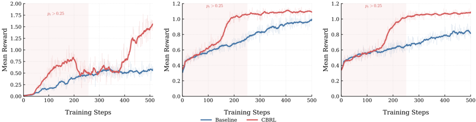
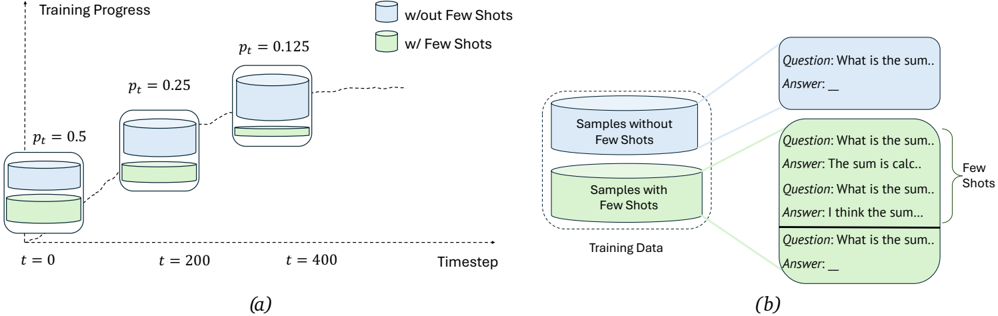

# cbrl — Context Bootstrapped Reinforcement Learning (CBRL)

> **一句话重点 (TL;DR)**：把 few-shot 示范当成 RLVR 训练时的"临时脚手架"——早期以高概率把示范前置到 prompt 里帮模型产生成功 rollout（拿到学习信号），再按课程把注入概率线性退火到 0，逼模型把推理模式"内化"而非依赖；只改训练输入分布、不动 RL 目标，因此算法无关、推理零开销。

**元信息**：arXiv 2603.18953（v1，2026-03-19，cs.LG）｜ UC Santa Barbara + Cisco Research（Saaket Agashe、Jayanth Srinivasa、Gaowen Liu、Ramana Kompella、Xin Eric Wang）｜ Preprint ｜ 主题：RLVR 探索效率（与 TSRD"教师脚手架/路径引导后撤除"直觉高度同构，作为 prompt 层面的极简对照）｜ 代码 https://github.com/context-bootstrapped-rl/cbrl （项目页 https://context-bootstrapped-rl.github.io，已 clone，约 1.3MB，研究原型）｜ 框架 verl 0.3.0.post2 + vLLM 0.8.5 + PyTorch 2.6.0，Hydra 配置

## 关键图示

**① Motivation / 对比图**

*Figure 4. Training reward curves for CBRL and baseline across three settings: Q Programming with GRPO (left), Word Sorting with GRPO (center), and Word Sorting with RLOO (right). Shaded regions indicate pi > 0.25 (high injection). CBRL achieves higher early reward by guiding the model toward success*

**② 方法 / 架构图**

*Figure 1. Overview of the Context Bootstrapped Reinforcement Learning (CBRL) framework. (a) The injection probability annealing schedule. At each timestep t , training batches consist of samples without few shots and samples with few shots, with the proportion governed by pi , which decreases linear*

## 1. 相关工作与进展
- **RLVR**（Tülu3/Lambert 2024；DeepSeek-R1 2025）已是推理后训练主流，靠确定性 verifier 给二元奖励，在数学、代码、工具调用上推动显著进展；GRPO（Shao 2024）用组内归一化去掉 value 网络，成事实标准算法。
- **探索低效（exploration inefficiency）的现有解法**：(i) 混合策略训练——RL 中混入/替换 off-policy 轨迹（LUFFY 用正则化重要性采样）；(ii) 部分监督/提示——给 ground-truth 解片段救活失败 rollout（HINT、GHPO、BREAD）；(iii) 课程方法——E2H（易到难）、Absolute Zero（自演化课程）。

## 2. 现有工作存在的问题
- 零样本 RLVR 在"新推理模式 / 领域知识缺失"场景下无法 bootstrap：当一组 rollout 全错时，GRPO 组优势坍缩为 0、没有梯度，模型靠自身探索越不过 reward 平台期（领域欠表示如小众编程语言尤其严重）。
- 持续提供示范又会让模型**依赖**示范、测试时（无示范）无法独立工作。
- 现有解法的代价：mixed-policy 易把更新引向不可泛化的 off-policy 解路径；partial supervision 会在 rollout 中途干预；课程方法需要难度估计或自生成题目等额外基础设施。

## 3. Motivation
利用 LLM 自带的 in-context learning 能力当**临时**脚手架：早期高频注入 few-shot 引导模型产生成功 rollout 从而拿到学习信号；随训练推进把注入概率退火到 0，迫使模型把示范中的推理模式内化、最终在无示范下独立成功。相比 mixed-policy，CBRL 保持完全 on-policy——示范只是"上下文"而非要模仿的轨迹；相比 partial supervision，不在 rollout 中途干预；相比课程方法，在固定分布上用一个简单退火即构成"从被引导到独立"的隐式课程，无需外部基础设施。

## 4. 主要灵感 / 核心直觉
- few-shot 示范提供的不是要照抄的目标，而是"怎么开始尝试"的引导，所以保持 on-policy 探索动力学不被破坏。
- 批内同时存在"带示范"与"不带示范"两种样本：若每条 prompt 都带示范，模型会学成依赖示范才会做题；随机不给，强制它即便早期也尝试独立解题。
- 退火 = 隐式课程：早期弱→多给脚手架，后期强→撤掉，"内化而非依赖"。

## 5. 主要解决思路（一段话讲清核心）
CBRL 三个组件：**(1) Few-Shot Example Bank ℬ**——每条含问题 q、可选推理轨迹 r、答案 a，来源可为专家示范、更强模型解或手工构造；**(2) 随机上下文注入**——每步以概率 p_i 用 Bernoulli 决定每个 prompt 是否前置 k 条示范（作为对话对），reward 只对生成响应计算；**(3) 课程退火**——p_i = p_start + (t−1)/(T−1)·(p_end − p_start)，线性从 p_start（典型 0.5~1.0）退火到 p_end（典型 0）。关键设计：只修改训练输入分布，不改 RL 目标 / 损失 / 优化过程，故与任意 policy-gradient 算法兼容（GRPO、RLOO 皆可），推理时不注入、无额外开销（Algorithm 1）。

## 6. 方法详解（通俗、分步骤）
每个训练步 t：
1. 取 mini-batch {q_i}；设当前注入概率 p←p_i。
2. 对每个 q_i：从 ℬ 采 k 条示范 E_i；掷 Bernoulli(p) 得 b_i；按 b_i 决定是否把 E_i 前置组成输入 x_i（带示范的样本把示范当作前面的 user-assistant 对话轮）。
3. 用 π_θ 对 {x_i} rollout，得经验 𝒟_t；做策略更新（GRPO 或 RLOO）。
4. 推理时 p=0，不注入。

实现细节（Appendix）：
- Reasoning Gym：bank 每任务 20 题，程序化求解得 ground-truth，GPT-5.2 生成 step-by-step 推理轨迹；注入时均匀随机采样，k=2，p_start=0.5→p_end=0。
- Q 编程：bank 取 50 条验证过的代码示例（只有代码、无推理标注）；注入时按 tag（Array / Dynamic Programming 等）过滤后再采，k=2。
- 训练超参（Reasoning Gym）：GRPO/RLOO，500 步，lr 1e-6，batch 32，4×A6000，FSDP，温度 1.0；format reward +0.2、答案 +1.0。Q 编程：QQwen-7B-Pretrain，batch 64、group 8，按通过测例比例给分 + 全过 +2 bonus，4×GH200。

## 7. 实验数据集
- **Reasoning Gym** 5 个程序化生成任务（可控 seed、无限数据）：ARC-1D、Manipulate Matrix、Spell Backward、Word Sorting、Puzzle-24。
- **Q Programming**（Hogan 2025，morganstanley/sft-python-q-problems）：时序数据库 DSL，右到左求值、隐式类型、简洁数组语法，偏离主流语言、预训练语料少见；542 训练 / 136 测试。
- **骨干**：Reasoning Gym 用 Qwen2.5-3B-Instruct 与 Llama-3.2-3B-Instruct；Q 用 QQwen-7B-Pretrain。
- 评测：Reasoning Gym 程序化 verifier、100 题/环境、3 次平均；Q 用 5 个单测/题、5 次平均。

## 8. 实验结果与主要发现
- **主结果（Table 1）**：在全部 10 个 model–environment 对上均超 GRPO-only 基线，增益 +1.3%（Spell Backward, Llama）~ +22.3%（Word Sorting, Qwen）。Qwen2.5-3B 最大增益在 Word Sorting（+22.34）与 Puzzle-24（+12.67）；Llama 在 ARC-1D（+8.0）与 Manipulate Matrix（+5.0）。
- **Q 编程（Table 2）**：test-pass 27.3%→43.0%，Pass@1 5.0%→26.3%。注：CBRL 的 Valid Q 率反而略低于 GRPO（80.9% vs 89.1%），但功能正确率大幅更高——说明 GRPO 主要学"写出合法 Q 语法"，CBRL 进一步学"用这些构造真正解题"。
- **算法无关（Table 3，RLOO）**：Word Sorting 20.3%→67.3%、Puzzle-24 23.0%→66.0%、Spell Backward 63.7%→89.7%（RLOO 下增益甚至大于 GRPO，可能因 RLOO 高方差梯度让早期更需引导）；但 ARC-1D（−2.3）与 Manipulate Matrix（−7.0）反而掉了。
- **训练动态（Figure 4）**：CBRL 早期 mean reward 显著更高（探索效率改善），且注入退火到 0 后性能不崩——支撑"内化而非依赖"。
- **注入概率消融（Figure 3）**：ARC-1D 上呈倒 V，p_i=0.5 峰值（0.31），p_i=0（0.26）与 p_i=1.0（0.23）都更低——过高压制自身探索、过低脚手架不足。

## 9. 结果如何支撑其主张
- "缓解探索低效"由训练曲线早期 reward 更高 + 全 10 对增益直接支撑。
- "内化而非依赖"由退火到 0 后性能不崩支撑，逻辑成立。
- "算法无关"由 GRPO 与 RLOO 两套结果支撑——但 RLOO 下 ARC-1D/Manipulate Matrix 退化，说明该主张有条件（依赖示范与任务结构的匹配）。

## 10. 逻辑自洽性（中性评估）
方法极简、主张与证据基本对齐。新意主要在"用 ICL 当临时脚手架 + 退火内化"的组合与系统验证，而非算法创新（本质 = 带退火课程的 few-shot prompt 注入）。"内化"是行为层证据（退火后不崩 + 定性例子显示 CBRL 模型模仿示范的 step-by-step ASCII 推理），未给参数/表征层的内化证明。RLOO 上两个任务的退化诚实地暴露了脚手架与任务结构需匹配。

## 11. 残留问题 / 局限
- **评测面窄**：集中在 Reasoning Gym 合成任务 + 单一 DSL（Q），未在主流数学/代码大基准（AIME/MATH/LiveCodeBench）上验证，泛化与规模化证据有限。
- **增益区间极宽（+1.3%~+22.3%）**：效果强依赖任务，对已能较好探索的任务收益小。
- **示范来源/选择是开放问题**：固定 bank + 均匀或 tag 过滤采样；学习式检索、自适应注入调度（按 reward 趋势调 p_i）、长程/agentic 设置都是 future work。
- 代码为小型研究原型（公开仓、规模小、commit 少）。

## 12. 开源代码与框架（链接 + 框架 + 代码可得性）
- 仓库：https://github.com/context-bootstrapped-rl/cbrl （项目页确有指向此仓的 Code 链接，非 404；已 clone 约 1.3MB）。含 `cbrl/`（trainers、utils）、`config/`（Hydra）、`reasoning_gym/`、`evaluations/`、`data_preprocess/`、`q_reward.py`、`scripts/`。
- 框架：verl 0.3.0.post2 + vLLM 0.8.5 + PyTorch 2.6.0（pyproject 声明 torch==2.6.0、vllm==0.8.5、verl），Hydra 配置，Flash-Attention，自带 `cbrl/trainers`。代码可得性：公开可用，属研究原型，复现脚本与超参（Appendix A/B）齐全。
