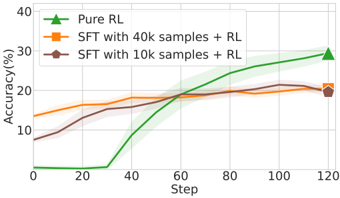
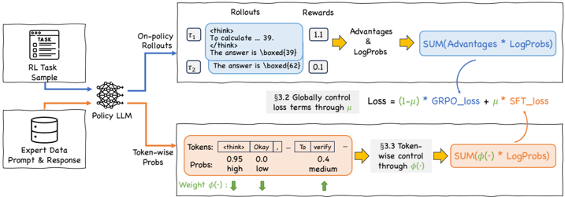

# chord — On-Policy RL Meets Off-Policy Experts: Harmonizing SFT and RL via Dynamic Weighting (CHORD)

> **一句话重点 (TL;DR)**：别再把 SFT 当 RL 前面的独立阶段（那会经历"漂移—再适应—过拟合"并破坏 on-policy 探索）。CHORD 把 SFT 重构成 on-policy RL 里一个**动态加权的辅助目标**：全局系数 μ（带 warmup 的余弦衰减）控制专家信号占比从"以模仿为主"平滑过渡到"以探索为主"；\(\varphi(p) = p(1-p)\) 对那些已很可能或极不可能的专家 token 下调学习信号，缓解熵坍缩与干扰。

**元信息**：arXiv 2508.11408（v3，2026-03-17；ICLR 2026 会议论文）｜ 阿里巴巴集团（Wenhao Zhang、Yuexiang Xie、Yuchang Sun、Yanxi Chen、Guoyin Wang、Yaliang Li(通讯)、Bolin Ding、Jingren Zhou）｜ ICLR 2026 ｜ 主题：统一 SFT 与 RL 的 off-policy/on-policy 视角，把 SFT 重构为 RL 中动态加权的辅助目标（GFT-class 代表作）｜ 代码 https://github.com/modelscope/Trinity-RFT （示例 `examples/mix_chord/`，损失 `trinity/algorithm/policy_loss_fn/chord_policy_loss.py`；另有 ms-swift 集成）｜ 框架 Trinity-RFT（基于 veRL 后端 + Ray）

## 关键图示

**① Motivation / 对比图**

*Figure 1: We train Qwen2.5-1.5B-Instruct on the Open-R1 dataset and evaluate the performance on a held-out validation set. These results show that the SFT-then-RL training paradigm can yield suboptimal performance compared to pure RL.*

**② 方法 / 架构图**

*Figure 3: An overview of the proposed CHORD framework that unifies SFT and RL, featuring a global coefficient µ and a token-wise weighting function ϕ ( · ) .*

## 1. 相关工作与进展

- 现代后训练用两类数据：on-policy（模型自生成 rollout，RL 用）与 off-policy（专家/其他模型示范，SFT 用）。常规做法是 SFT→RL 两阶段。
- 把 off-policy 专家数据并入 on-policy RL 的现有思路：直接 dataset 混合（SimpleMix）、把专家轨迹混进 rollout 组（LUFFY、SRFT）、用专家数据引导生成（UFT、BREAD）、按预定/自适应调度交错 RL 与 SFT 步（SASR、Ma et al.）。SRFT 提出 sample-level SFT loss 的统一框架。
- 作者强调本文聚焦"已建立自身回答模式的 instruct 模型"，比微调 base 模型更难也更实用。

## 2. 现有工作存在的问题

- 作者实测 SFT-then-RL 的学习曲线呈 **"shift–readapt–overfit"（漂移—再适应—过拟合）**：在 MATH-500 上先因突然的策略漂移掉点（exposure bias 加剧），再重新适应专家模式回升，最终过拟合到有限静态样本、丧失输出多样性与探索能力。
- SFT-then-RL 的 SFT→RL 转换时机高度任务相关（数学上 SFT-best+RL 最好、工具调用上 SFT-light+RL 更好），需大量调参，且两阶段分离本身就可能次优——Figure 1 显示 SFT-then-RL 不一定胜过纯 RL。
- 离线专家数据与当前 on-policy 分布有差异，直接大权重模仿会破坏探索、导致熵坍缩或被极端不可能 token 干扰。

## 3. Motivation
从 off-policy vs on-policy 的统一视角，把 SFT 重构为 RL 过程中**一个动态加权的辅助目标**而非独立阶段。核心原则：稳定地融入 off-policy 专家信号需要对其学习信号做"下调权重"，尤其是对那些已经很可能（避免熵坍缩）或极不可能（避免干扰）的专家 token。

## 4. 主要灵感 / 核心直觉

- SFT-then-RL 的二元开关（μ=1→0）太僵硬；改成可衰减的 μ schedule 可在过拟合前平滑退出专家影响（与 scheduled sampling 缓解 exposure bias 同理）。
- 但全局 μ 缺乏精度：CHORD-µ 会让模型整体照搬专家的冗长风格、覆盖自身简洁性（case study 证实）。所以需要 token 级 φ：把专家信号集中在"模型还不确定"（p≈0.5）的 token 上，对已确定（p→0 或 1）的 token 几乎不学——\(p_t(1-p_t)\)"生成该 token 这一二元事件"的策略不确定性度量，制造"learning sweet spot"。

## 5. 主要解决思路（一段话讲清核心）
CHORD = Controllable Harmonization of On- and Off-Policy RL via Dynamic Weighting。统一损失 \(L = (1 - \mu)\cdot L_{\mathrm{GRPO}} + \mu \cdot L_{\mathrm{SFT}}\)（代码 `MIXCHORDPolicyLossFn` 确认）。数据用 `expert_mask` 区分：非专家（on-policy）走 GRPO 损失（`PPOPolicyLossFn`），专家（off-policy 示范）走 SFT 损失。两层动态加权：(1) 全局 μ 随训练步用带 warmup 的余弦衰减从 mu_peak 降到 mu_valley；(2) \(\varphi(y^*_t) = p_t(1-p_t),\quad p_t = \pi_\theta(y^*_t \mid x, y^*_{<t})\)这条抛物线在 p_t=0.5 取峰、p_t→0/1 衰减到 0，对已很可能或极不可能的专家 token 下调学习信号。论文给两个实例：**CHORD-µ**（只用全局 μ 调度、关闭 φ）与 **CHORD-φ**（启用 token 级 φ、μ 取较小常值）。

## 6. 方法详解（通俗、分步骤）
**损失实现（代码确认）**：

- 全局 μ：`mu_schedule_function(step, mu_warmup_steps, mu_decay_steps, mu_peak, mu_valley)`——warmup 段线性从 0 升到 mu_peak，之后余弦衰减到 mu_valley。
- token 级 SFT：`SFTPhiLossFn` 实现 \(-\log p \cdot \varphi(p).\mathrm{detach}(),\ \varphi = p(1-p)\)，token-mean 聚合，可选 cutoff_prob 截断 logprob）；另提供 `SFTISLossFn`（重要性采样，权重 p.detach()，对应论文式 4 的 IS——把分母假设为 1）与可关闭 φ 的标准 `SFTLossFn`。
- 凸组合：\(\mathrm{loss} = (1-\mu)\cdot \mathrm{grpo\_loss} + \mu \cdot \mathrm{sft\_loss}\)，且非专家/专家两部分各按 batch 内数量与 `train_batch_size_usual/expert` 归一化（`per_micro_batch_weight_*`）。

**为何要 φ 而非纯 IS**：Figure 5 显示无 IS 混入 off-policy 数据→熵暴涨（established pattern 被破坏）；但 IS 又会让熵急剧坍缩（过度强化高概率 token、忽视低概率新 token，过度自信）。φ=p(1−p) 同时下调两端，兼顾"不坍缩 + 不破坏"。

**两个实例的超参（代码 yaml 注释确认）**：CHORD-µ：mu_warmup=0、mu_decay=200、mu_peak≈0.9→mu_valley≈0.05、phi off；CHORD-φ：mu_warmup=0、mu_decay=0、mu_peak=mu_valley≈0.1（常值）、phi on。仓库 `mix_chord.yaml` 默认是 µ+φ 混合示例（warmup 200 / decay 400 / peak 0.5 / valley 0.02 / phi on），`expert_data_ratio=0.20`、`train_batch_size_expert=64`。作者明示不存在跨所有任务/数据/模型都最优的单一 φ，但 p(1−p) 是有效鲁棒的实例。

## 7. 实验数据集

- **数学推理**：OpenR1-Math-220k，采样 5k 做 SFT、20k 做 RL（无重叠）；policy model 为 Qwen2.5-7B-Instruct（回答模式与专家 DeepSeek-R1 差异显著）；in-domain 评测 AIME24/AIME25/AMC，用 MMLU-Pro 监控通用推理变化。
- **工具调用**：ToolACE 单轮实例，5k RL / 500 SFT，专家为 DeepSeek-R1，评测 BFCL（Live/Non-live）；policy model 为 LLaMA3.2-3B-Instruct。
- 仓库示例默认 policy model 为 Qwen2.5-1.5B-Instruct（Figure 1 也在该模型 + Open-R1 上验证 SFT-then-RL 现象）。
- 基线：Original Model、SFT-light、SFT-best、SFT-light+RL、SFT-best+RL、SASR、GRPO(Pure RL)、LUFFY。

## 8. 实验结果与主要发现

- **主表（Table 1）**：CHORD-µ 在数学上超强基线 SFT-best+RL（AMC +2.4、AIME24 +1.0、AIME25 +1.6），工具调用整体也更好；CHORD-φ 进一步在数学 + 工具调用上全面最优（如 MMLU-Pro 56.2 显著高于各基线、BFCL Overall 78.5）。
- **响应长度（Table 2）**：专家 DeepSeek-R1 远长于原模型（数学 6132 vs 659 token）；CHORD-µ 会被拉到专家级冗长（数学 6081），而 CHORD-φ 取得更细致平衡（数学 2444、工具调用 120）——token 级加权使模型按任务选择性吸收专家模式。
- **μ 消融（Figure 7）**：固定 μ 一律差于动态 μ，甚至可能不及纯 RL；小固定 μ（0.02）能减损但提升不显著。衰减 μ 才能平滑化解 on/off-policy 冲突。
- **φ 训练动态（Figure 8/9）**：CHORD-φ（固定 μ=0.1）既防熵过早坍缩、又避免熵暴涨，reward 稳定持续上升、显著优于纯 RL。用了 φ 后不再需要复杂 μ schedule（对 μ 选择鲁棒）。
- **进一步分析**：换专家源（DeepSeek-R1 vs 风格更接近的 Qwen2.5-72B）CHORD 均超基线，且偏模仿的方法（SFT+RL、CHORD-µ）在专家风格相近时增益更大；扩展到非可验证域（RaR-Medicine）CHORD 仍超纯 RL；弱模型（Qwen2.5-3B）上 naive 模仿/SFT+RL 不稳，CHORD-φ 更鲁棒。

## 9. 结果如何支撑其主张

- "SFT-then-RL 次优"由 Figure 1（不胜纯 RL）+ Figure 2（shift-readapt-overfit 曲线）直接支撑。
- "动态 μ > 固定 μ/两阶段"由 Figure 7 + Table 1 支撑。
- "φ 缓解熵坍缩/干扰、选择性吸收"由 Figure 8/9 的熵-reward 曲线 + Table 2 的任务自适应长度 + 代码实现共同支撑，理论（p(1−p) 的不确定性解释）与实现一致。

## 10. 逻辑自洽性（中性评估）
论文-代码高度一致（损失公式、μ schedule、φ、expert_mask 均在 `chord_policy_loss.py` 复现），自洽性强。诚实承认 φ 非唯一最优、配置随 setup 变（也试了 entropy-based/clipping/focal 变体）。核心贡献是"把 SFT 当 RL 动态加权辅助目标"这一统一视角 + 一个简单鲁棒实例，而非全新算法。

## 11. 残留问题 / 局限

- μ、φ 的配置跨任务/数据/模型会变，仍需调参（自适应 reward-aware μ 可行但调参重）；无单一普适最优设计。
- 模式漂移分析主要是经验性的，缺乏对"不同 CoT 模式如何影响学习"的机理理论。
- 主实验规模有限（7B/3B/1.5B policy），更大模型与异构专家混合是 future work。
- 假设专家数据分母 IS 比为 1（把专家当 ground-truth 分布），是常见但近似的处理。

## 12. 开源代码与框架（链接 + 框架 + 代码可得性）

- 仓库：https://github.com/modelscope/Trinity-RFT 。示例 `examples/mix_chord/`（`mix_chord.yaml` 数学、`mix_chord_toolace.yaml` 工具、`get_openr1_data.py`、`README.md`）；损失实现 `trinity/algorithm/policy_loss_fn/chord_policy_loss.py`（`MIXCHORDPolicyLossFn` + `SFTPhiLossFn`/`SFTISLossFn`/`SFTLossFn` + `mu_schedule_function`）。另有 ms-swift 集成。
- 框架：Trinity-RFT（modelscope，基于 veRL 后端 + Ray）。算法注册名 `mix_chord`（`algorithm_type: mix_chord`），policy loss 为 `MIXCHORDPolicyLossFn`，用 `expert_mask` + `expert_data_ratio`（示例 0.20）区分专家/非专家数据。代码可得性：损失实现 + 复现脚本 + 超参齐全，可复现性好。
