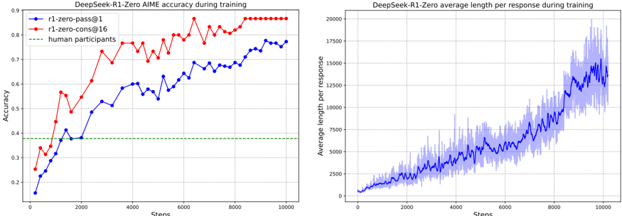
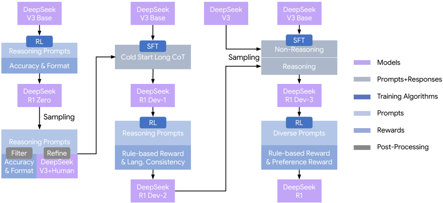

# deepseek_r1 — DeepSeek-R1: Incentivizing Reasoning Capability in LLMs via Reinforcement Learning

> **一句话重点 (TL;DR)**：R1-Zero 证明仅靠纯 GRPO + 规则奖励（不经 SFT）即可在 base 模型上自演化出推理能力（含"aha moment"），R1 再用"cold-start SFT → 推理 RL → 拒绝采样 SFT → 全域 RL"四阶段管线修好可读性与通用性；并把 800k 数据离线 SFT 蒸馏到小模型，得出"大模型 RL→小模型蒸馏 优于 小模型直接 RL"。

**元信息**：arXiv 2501.12948（v2 2026-01-04）｜ DeepSeek-AI ｜ 2025-01 首发 ｜ 主题 T1/T3（High）：纯 RL 激励推理（GRPO）、多阶段 SFT-RL 管线、SFT-on-trajectory 离线蒸馏（可作 OPD 对照基线）｜ 代码 https://github.com/deepseek-ai/DeepSeek-R1（**模型/权重发布仓，不含训练代码**）｜ 框架 自研高性能 RL 框架（附录 B.1）

## 关键图示

**① Motivation / 对比图**

*Figure 1 | DeepSeek-R1-Zero AIME accuracy during training (left) and average length per response during training (right).*

**② 方法 / 架构图**

*Figure 2 | The multi-stage pipeline of DeepSeek-R1. A detailed background on DeepSeek-V3 Base and DeepSeek-V3 is provided in Supplementary A.1. The models DeepSeek-R1 Dev1, Dev2, and Dev3 represent intermediate checkpoints within this pipeline.*

## 1. 相关工作与进展
此前 LLM 推理严重依赖人工标注 CoT 轨迹 + SFT；test-time scaling（o1 等）显示拉长推理可显著提升能力。GRPO（源自 DeepSeekMath）提供免 critic 的高效 RL。R1 在 DeepSeek-V3-Base（660B 级 MoE）上把"用最少人工标注、靠 RL 自演化激励推理"推到极致。

## 2. 现有工作存在的问题
- 依赖人工推理轨迹 → 扩展性差、引入认知偏差、性能被人类示例上限封顶，难探索"非人类式"更优推理路径。
- 传统 SFT-before-RL 范式可能限制模型探索。
- 纯 RL 得到的 R1-Zero 虽强，但**可读性差、中英混杂（language mixing）**，且窄域 RL 导致写作/开放问答等通用能力弱。

## 3. Motivation
用最小人工标注、通过 RL 自演化激励推理；假设人类定义的推理模式会限制探索，无约束 RL 更能激发新能力。故 R1-Zero 跳过 SFT 直接在 base 上 RL，奖励仅基于最终答案正确性（可验证任务），不约束推理过程，以观察自然涌现的自验证、反思、动态策略调整。R1 再用少量 cold-start 数据 + 多阶段管线解决可读性与通用性。

## 4. 主要灵感 / 核心直觉
若只对"答案对不对"给奖励、不规定"怎么想"，模型会在 RL 压力下自行延长并重组推理过程（响应长度自然增长），涌现反思/自检等行为；而可读性/通用性这类"非可验证"问题，再用少量人对齐数据与偏好奖励模型补齐即可。

## 5. 主要解决思路(一段话讲清核心)
两条线：R1-Zero = base 上纯 GRPO + 规则奖励（准确率 + 格式），验证 RL 可单独激励推理；R1 = 在其上叠加四阶段管线（cold-start SFT → 推理向 RL（加语言一致性奖励）→ 拒绝采样扩充 SFT → 混合推理/通用数据的全域 RL），兼顾推理强度、可读性与通用对话能力。

## 6. 方法详解(通俗、分步骤)
- **算法 GRPO**：每问题从旧策略采一组（R1-Zero 用 16 个）输出，用组内 reward 均值/标准差归一得 advantage，无价值网络；带 clip 与 KL 惩罚。
- **R1-Zero**：DeepSeek-V3-Base 纯 GRPO。奖励 = 准确率奖励（数学 box 答案规则校验 / 代码用编译器+测试用例）+ 格式奖励（强制 `<think>…</think><answer>…</answer>`），等权相加。**刻意不用神经/过程奖励模型**（避免 reward hacking、降复杂度）。AIME2024 pass@1 由 15.6% → 77.9%。
- **R1 四阶段管线（图2）**：
  1. **Cold Start**：收集数千条对话式、人类对齐的长 CoT 数据做 SFT。
  2. **推理向 RL**：规则奖励 + **语言一致性（LC）奖励**（缓解语言混杂），得 Dev-2。
  3. **拒绝采样 + SFT**：从第一阶段 RL checkpoint 拒绝采样生成推理轨迹，用 DeepSeek-V3 作生成式裁判扩充，过滤混语/长段/代码块 → 约 600k 推理样本；另用 V3 管线生成约 200k 非推理样本（写作/事实QA/翻译/软工）；共约 **800k** 监督数据做 SFT，得 Dev-3。
  4. **全域 RL**：混合推理与通用数据，推理用规则奖励、通用用 helpful/harmless 偏好奖励 → 最终 R1。AlpacaEval2.0 +25%、ArenaHard +17%。
- **奖励模型（3.1）**：通用数据用偏好奖励模型（helpful 只评最终 summary，harmless 评整段）；推理任务坚持规则奖励。
- **蒸馏（附录 F / B.4.3）**：把 800k 数据直接 SFT 到更小 base 模型（**离线/off-policy 序列级蒸馏，非 on-policy KD**），得 R1-Distill-Qwen-{1.5B,7B,14B,32B}、R1-Distill-Llama-{8B,70B}。结论：蒸馏后小模型超过其原 instruct 版，且"大模型 RL→小模型蒸馏"优于"小模型直接 RL"。

## 7. 实验数据集
- 训练：数学/代码/STEM/逻辑等可验证推理 prompt；cold-start 数千条；800k SFT（600k 推理 + 200k 非推理）。
- 评测：AIME 2024、MATH-500、CodeForces、LiveCodeBench、GPQA Diamond、MMLU、AlpacaEval 2.0、ArenaHard、Aider-Polyglot 等。

## 8. 实验结果与主要发现
- R1-Zero 超参：lr 3e-6，KL 系数 0.001，rollout 温度 1；每题采 16 个输出，最大长度 32768（8.2k 步后增至 65536）；每步 32 题、batch 512；每 400 步更新参考模型；共 10,400 步（约 1.6 epoch）。
- SFT 超参（cold-start 与第二阶段）：2–3 epoch，cosine lr 5e-5→5e-6，ctx 32768，batch 128。
- 蒸馏超参：对应 base 微调 2–3 epoch，cosine lr 衰减到初值 1/10（各模型初值见 Table 6），ctx 32768，batch 64。
- 训练成本：R1-Zero 用 64×8 H800 约 198h；R1 约 80h（4 天）；SFT 数据 5K GPU 时；总计约 147K H800 GPU 时（约 $294K）。
- 关键发现：响应长度随训练自然增长、涌现"aha moment"；helpful 奖励模型出现 reward hacking（reward 升而 CodeForces 性能降）；LC 奖励消融显示其稳定语言一致性，代价是代码基准略降。

## 9. 结果如何支撑其主张
R1-Zero 在不经 SFT 下 AIME pass@1 大幅提升 + 响应长度/反思行为自然增长，支撑"RL 可单独激励推理"；R1 四阶段后通用基准（AlpacaEval/ArenaHard）大涨支撑"管线修好可读性/通用性"；蒸馏小模型超越其 instruct 版、且优于小模型直接 RL，支撑蒸馏结论。

## 10. 逻辑自洽性(中性评估)
主张与证据基本对应。但"无约束 RL 优于人类示例"主要靠 R1-Zero 单点对照支撑；蒸馏"优于直接 RL"的对照规模有限（小模型直接 RL 的算力预算与 R1 不对等）。"aha moment"为观察性叙述，缺乏严格涌现度量。

## 11. 残留问题 / 局限
- R1-Zero 可读性/语言混杂问题需 R1 管线人对齐数据补救，纯 RL 并非"零人工"。
- helpful 奖励模型的 reward hacking 暴露偏好奖励在可验证任务上的风险。
- **训练代码与 RL 框架未开源**（仅模型/权重），GRPO 实现、四阶段管线、拒绝采样脚本均不可得，复现依赖论文公式与超参表。
- 蒸馏为离线序列级，与本项目关注的 on-policy / 在线蒸馏不同。

## 12. 开源代码与框架(链接+框架+代码可得性)
- 仓库：https://github.com/deepseek-ai/DeepSeek-R1 ；权重 https://huggingface.co/deepseek-ai 。
- **该仓为模型发布/权重仓，不含训练代码**（无 GRPO 训练脚本、无四阶段管线实现）。CloneTier=B，仅记录，未 clone。
- 框架：训练基础设施在附录 B.1 描述为自研高性能 RL 框架（不在仓内）。GRPO 算法后被 veRL/TRL/OpenRLHF/ms-swift 等广泛实现。
