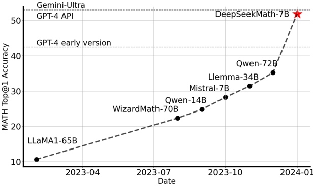
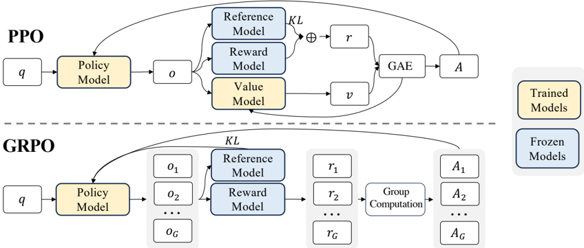

# deepseekmath — DeepSeekMath: Pushing the Limits of Mathematical Reasoning in Open Language Models（GRPO 起源）

> **一句话重点 (TL;DR)**：DeepSeekMath 首次提出 **GRPO**——用"同题多输出的组内相对奖励"替代 PPO 的价值网络，省去与策略同规模的 critic、大幅降显存算力，并给出统一梯度范式分析 SFT/RFT/DPO/PPO/GRPO 的异同；DeepSeekMath-RL 7B 在 GSM8K=88.2%、MATH=51.7%。

**元信息**：arXiv 2402.03300 ｜ DeepSeek-AI（Zhihong Shao, Peiyi Wang, Qihao Zhu, Runxin Xu, Junxiao Song, Daya Guo 等）｜ 2024-02 ｜ 主题 T3（RL 算法）：GRPO 是 DeepSeek-R1 及绝大多数 RLVR 工作的算法基石，与本项目 RL/post-training 直接相关 ｜ 代码 https://github.com/deepseek-ai/DeepSeek-Math（**评测/推理脚本 + 模型发布，GRPO 训练代码不在仓内**）｜ 框架 custom/none（DeepSeek 内部实现）

## 关键图示

**① Motivation / 对比图**

*Figure 1 | Top1 accuracy of open-source models on the competition-level MATH benchmark (Hendrycks et al., 2021) without the use of external toolkits and voting techniques.*

**② 方法 / 架构图**

*Figure 4 | Demonstration of PPO and our GRPO. GRPO foregoes the value model, instead estimating the baseline from group scores, significantly reducing training resources.*

## 1. 相关工作与进展
RL 已被证明能在 SFT 之后进一步提升 LLM 数学推理。该阶段广泛使用 PPO（actor-critic）。GRPO 提出后被 veRL/TRL/OpenRLHF/ms-swift 等框架广泛实现，成为后续 R1、DAPO 等工作的算法基石。本文在大规模数学语料预训练 + 指令微调（DeepSeekMath-Base/Instruct 7B）基础上引入新的高效 RL 算法。

## 2. 现有工作存在的问题

- **PPO 价值模型开销大**：需训练一个与策略模型规模相当的 critic，带来巨大显存与算力负担。
- **稀疏奖励下 critic 难训**：LLM 场景通常只在最后一个 token 由奖励模型打分，使训练逐 token 精确的价值函数变得困难。
- 缺乏对各类后训练方法（RFT、DPO、PPO、GRPO 等）的**统一理论理解框架**。

## 3. Motivation

- 用"同一问题采样多个输出的平均奖励"作为 baseline 替代价值模型——这与奖励模型本质上做的"同题多输出相对比较"天然契合，从而省去价值函数、大幅降低训练资源。
- 提供统一范式来分析在线/离线、结果监督 vs 过程监督、单轮 vs 迭代 RL，理解 RL 为何有效并据此设计更优 RL。

## 4. 主要灵感 / 核心直觉
既然奖励模型衡量的是"同题不同答案孰优孰劣"，那么用组内多个采样的平均/标准化奖励就能充当无偏的 advantage baseline，根本不需要再训一个独立的价值网络。

## 5. 主要解决思路(一段话讲清核心)
对每个问题从旧策略采一组 G 个输出，用组内 reward 的均值/标准差归一化得到 advantage（无 critic），KL 正则直接加在损失里（而非奖励里），即为 GRPO；并把它与其它后训练方法纳入同一梯度形式，差异落在"数据来源、奖励函数、梯度系数"三点上。

## 6. 方法详解(通俗、分步骤)

- **从 PPO 到 GRPO**：PPO 目标（式1）逐 token 用重要性比 πθ/πθold 加 clip，优势 A_t 由 GAE + 价值函数 V_ψ 估计，并在奖励里加逐 token KL（式2）。
- **GRPO 目标（式3）**：对每问题 q 采一组 {o_1,…,o_G}：
  J_GRPO = E[ (1/G)Σ_i (1/|o_i|)Σ_t { min( (πθ/πθold)·Â_{i,t}, clip(πθ/πθold,1−ε,1+ε)·Â_{i,t} ) − β·D_KL(πθ‖π_ref) } ]

  - **去掉价值模型**，用组内相对奖励估计优势 Â_{i,t}。
  - KL 正则**直接加在损失里**，用无偏估计器（式4，Schulman 2020）：D_KL = π_ref/πθ − log(π_ref/πθ) − 1，保证非负，避免复杂化优势计算。
- **两种优势估计**：
  - **结果监督（§4.1.2）**：奖励模型对每个完整输出打分得 {r_i}，组内标准化 r̃_i=(r_i−mean)/std，输出内所有 token 优势 Â_{i,t}=r̃_i。
  - **过程监督（§4.1.3）**：过程奖励模型对每个推理步末 token 打分，组内标准化后，每 token 优势为其后续各步标准化奖励之和 Â_{i,t}=Σ_{index(j)≥t} r̃_i^{index(j)}。
- **迭代 RL（§4.1.4 / Algorithm 1）**：随训练推进旧奖励模型不足以监督新策略，故用策略采样结果构造奖励模型新训练集，用回放机制（含 10% 历史数据）持续训练奖励模型；同时把参考模型设为当前策略，用新奖励模型继续训练策略。
- **统一范式（§5.2.1）**：把 SFT/RFT/DPO/PPO/GRPO 统一写成同一梯度形式，差异在于 (1) 数据来源（在线采样 vs 离线）、(2) 奖励函数（Rule vs Model）、(3) **梯度系数 GC**（由数据 + 奖励信号决定每个样本/token 的梯度权重）。

## 7. 实验数据集

- RL 训练数据：来自 SFT 数据中 GSM8K、MATH 相关的 CoT 格式题，约 **144K** 题（故意排除其它 SFT 题以观察 RL 对缺数据基准的影响）。
- 评测基准：GSM8K、MATH（in-domain CoT）；MGSM-zh、CMATH（中文，out-of-domain）；以及工具集成推理（Tool-Integrated Reasoning）设置。

## 8. 实验结果与主要发现

- 在 **DeepSeekMath-Instruct 7B** 上做 GRPO RL。
- 奖励模型：基于 DeepSeekMath-Base 7B 训练，lr 2e-5（按 Wang et al. 2023b 构造数据）。
- GRPO 超参：策略 lr 1e-6；KL 系数 β=0.04；每题采 **G=64** 个输出；最大长度 1024；训练 batch size 1024；每个探索阶段后策略仅更新一次。
- 结果：DeepSeekMath-RL 7B GSM8K=88.2%、MATH=51.7%（CoT），超过 7B–70B 全部开源模型及多数闭源模型；仅用 GSM8K/MATH 的 CoT 指令数据训练，却在**所有**基准（含 out-of-domain）上超越 DeepSeekMath-Instruct 7B。
- 讨论（§5.2）：在线采样优于离线；统一范式下不同方法核心区别在梯度系数与数据/奖励来源。

## 9. 结果如何支撑其主张
"仅训 GSM8K/MATH 却全基准（含 OOD）提升"支撑 RL 的泛化有效性；GRPO 与 PPO 相比省 critic 仍达 SOTA，支撑"组内相对奖励可替代价值网络"；统一范式 + GRPO+PS 优于其它方法的对比，支撑"梯度系数差异解释方法优劣"的分析框架。

## 10. 逻辑自洽性(中性评估)
GRPO 的动机（critic 开销 + 稀疏奖励难训）与解法（组内 baseline）对应清晰，统一范式提供了较有解释力的分析视角。局限是消融主要在数学单域、7B 单规模；"在线优于离线""GRPO+PS 更优"等结论的可推广性需后续工作验证（事实上社区后续如 DAPO 也指出朴素 GRPO 的熵坍缩等问题）。

## 11. 残留问题 / 局限

- GRPO 在更大规模/更长 CoT 下暴露熵坍缩等问题（后续 DAPO/Dr.GRPO 等修补）。
- 实验集中在数学单域、7B 单规模，跨域跨规模稳健性论文内未充分覆盖。
- 过程监督与迭代 RL 依赖额外的过程/迭代奖励模型，工程成本与稳定性未深入分析。
- **GRPO 训练代码未开源**，算法仅以论文公式给出，复现依赖第三方框架实现。

## 12. 开源代码与框架(链接+框架+代码可得性)

- 仓库：https://github.com/deepseek-ai/DeepSeek-Math ；模型权重 DeepSeekMath-Base/Instruct/RL 7B（HuggingFace）。
- **仓库主要为评测/推理脚本与模型发布，GRPO 训练代码并不在该仓库**（实际 RL 训练为 DeepSeek 内部代码）。框架 custom/none。
- GRPO 算法本身后被 veRL/TRL/OpenRLHF/ms-swift 等框架广泛实现。
