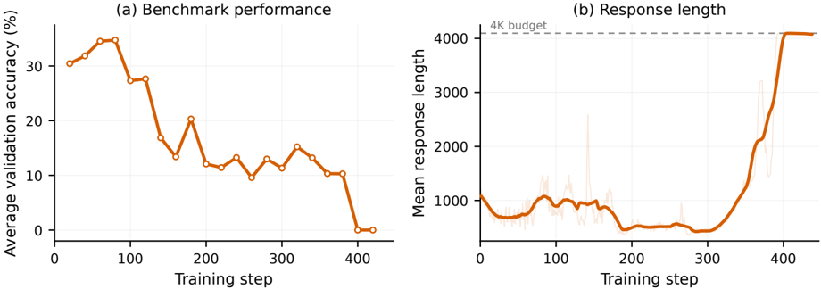
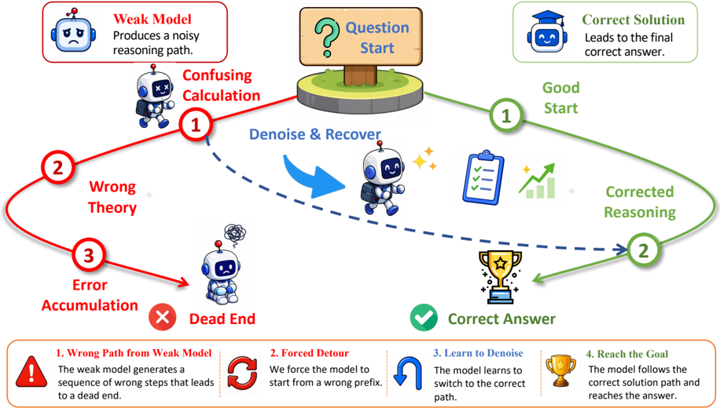

# denoiserl — DenoiseRL: Bootstrapping Reasoning Models to Recover from Noisy Prefixes

> **一句话重点 (TL;DR)**：把弱模型生成的错误推理前缀当作"结构化噪声"注入策略的 rollout，用 RL 训练策略从错误中间状态"去噪并恢复"到正确答案，从而在不引入更强教师、不构造难数据的前提下把"自纠错"从涌现行为变成显式训练目标。

**元信息**：arXiv 2605.28421 (v1, 2026-05-27) ｜ 复旦大学 / 上海创智学院 (Shanghai Innovation Institute)；Caijun Xu, Changyi Xiao, Zhongyuan Peng, Yixin Cao ｜ 2026-05 预印本 ｜ 主题 path-recovery / prefix 注入 / 负样本利用（与本项目高相关）｜ 代码 https://github.com/ALEX-nlp/DenoiseRL（已克隆，VeRL fork + recipe/denoise，含 1.7B/4B/8B 的 GRPO 与 DAPO 启动脚本）｜ 框架 VeRL，RL backbone 用 GRPO / DAPO。

## 关键图示

**① Motivation / 对比图**

*Figure 5 Training collapse when PPO updates are applied to off-policy noisy prefixes. (a) Average validation accuracy across MATH500, AMC23, AIME24, AIME25, and BBEH. (b) Mean response length (25-step moving average).*

**② 方法 / 架构图**

*Figure 1 Schematic illustration of DenoiseRL . A weak model first generates an incorrect solution path. We then condition the policy model on a truncated prefix of this wrong trajectory, guiding it to continue from an erroneous reasoning state rather than imitating the weak model as a teacher. RL tr*

## 1. 相关工作与进展

- **On-policy RL 引导推理**：GRPO、DAPO 等结果/过程驱动 RL 已取代 SFT 成为扩展推理能力的主范式。
- **Weak-to-Strong Generalization (W2SG)**：用弱模型监督更强学生，以期突破能力瓶颈。
- **Prefix 条件 / off-policy 探索**：LUFFY 把 off-policy 推理轨迹混入 on-policy RL；PrefixRL 在**成功**的 off-policy 前缀上条件化并优化其后续续写；更广义地，专家解、oracle 提示、成功轨迹等被用来让稀疏奖励问题更可达。

## 2. 现有工作存在的问题

- **W2SG 受弱教师上限约束**：学生被优化去模仿伪标签，天花板被弱监督者的噪声与有限能力卡住。
- **难数据构造成本高**：难题合成、对抗样本、长轨迹构造依赖复杂流水线、过滤验证与大量人工。
- **标准 on-policy RL 的探索瓶颈**：策略受限于自生成状态分布；一旦饱和，多产出正确 rollout 或狭窄失败模式，信息量大的失败样本太稀缺，难以提供有意义的梯度更新。

## 3. Motivation
当没有足够强的现成教师时，能力提升越来越难——"如何在不依赖更强模型作监督者的前提下获得强模型？"作者想**统一** W2SG 与难度驱动的数据合成：不让弱模型合成难数据或提供学习信号，而是把它当作**结构化扰动的生成器**，在不产生任何新数据的前提下自动抬高训练难度。同时把推理 RL 重述为**去噪问题**（呼应去噪自编码器 / BART 式预训练）。

## 4. 主要灵感 / 核心直觉

- **前缀决定后续轨迹**：前缀对随后的推理状态有不成比例的影响；既然好前缀能把策略导向更有利状态（PrefixRL），那么**反过来注入错误前缀**就能控制起始状态、强迫策略从损坏的中间状态恢复。
- **两个耦合效应**：(i) 噪声前缀跨越的失败模式空间远比正确轨迹宽，极大扩展训练状态多样性，把策略暴露到标准 on-policy RL 很少遇到的 off-policy 语境；(ii) 直接强化一项被低估的能力——**从错误中恢复**，把自纠错从涌现行为提升为直接训练目标。

## 5. 主要解决思路（一段话讲清核心）
离线先用一个弱模型对训练集每题采样若干次，保留 verifier 判错的轨迹构成固定"噪声池"。RL 训练时，每题除标准 on-policy rollout 外，额外采若干 **denoise rollout**：取某条错误轨迹的前缀（固定比例 ρ）作为已写好的 assistant 消息，让策略从这个 off-policy 错误前缀续写到答案；verifier 对"前缀+续写"的完整折叠响应打 0/1 奖励，但**只对策略自己生成的续写部分计算梯度**（前缀被 mask）。两类 rollout 共享同一题内 GRPO advantage baseline，按 N:K 加权进同一目标联合优化。

## 6. 方法详解（通俗、分步骤）

1. **离线噪声采集**：弱模型 πw（Qwen2.5-1.5B-Instruct）对训练集每题采 M 次（实验 M=8），过滤出 verifier 判错的轨迹，构成池 W(q)。这是一次性预处理，训练中固定、**每步零额外成本**。若某题 M 次都没产生格式良好的错误答案，则其 denoise 槽用额外的标准 main rollout 顶替。
2. **每步采样**：每题采 N 个 main rollout（标准 on-policy，y∼πθ(·|q)）+ K 个 denoise rollout。\(p = \max(1, \lceil \rho |w| \rceil),\ \text{prefix } w_{1:p},\quad y_{>p} \sim \pi_\theta(\cdot \mid q, w_{1:p})\)。
3. **预算折叠 (output budget & folding)**：两类 rollout 共享同一响应窗口宽度 R 以保证公平；前缀已占 p token，续写折叠进剩余预算，\(L = \min(T_{y_{>p}}, R - p)\)，超出 R 的尾部 token 丢弃。verifier 对完整折叠响应 ỹ=(前缀, 续写) 打奖励。
4. **只更新 on-policy 续写**：训练只对续写部分 y_{p+1:p+L} 算梯度；off-policy 前缀被 mask，避免 PPO 对重 off-policy token 的不稳定。
5. **token 级 GRPO**：同题 N+K 条轨迹共享同一 advantage baseline（μ_q、σ_q 在 N+K 上统计，Eq.5），用 PPO clip 代理目标（ε_low=ε_high）。\(J = \frac{N}{N+K} J_{\mathrm{main}} + \frac{K}{N+K} J_{\mathrm{denoise}}\)。
6. **两条设计经验**：(i) 噪声不能过强——过长错误前缀会把模型推向 overthinking（更长自纠错循环、更高不确定性）；(ii) 不要更新 off-policy 前缀——否则训练不稳，与"PPO 式目标对重 off-policy token 敏感"的近期观察一致。

## 7. 实验数据集

- **噪声采集 & 训练**：均在 MATH-7.5K。弱模型每题 8 rollout 取错误样本。
- **策略模型**：Qwen3-4B-Base、Qwen3-8B-Base（仓库另含 1.7B 脚本，但论文正文主表只报 4B/8B）。
- **评测**：MATH500、AMC23、AIME2024、AIME2025、BBEH。AMC23/AIME24/AIME25 报 AVG@16，MATH500/BBEH 报 AVG@1。验证解码 temperature=0.6, top-p=0.95。

## 8. 实验结果与主要发现
关键超参：N=12 main + K=4 denoise，response 长度 4096，ρ=0.2，prompt batch 16，lr 1e-6，无 KL/length loss，PPO clip 0.2，训练采样 temperature=1.0, top-p=1.0。主表（Table 1，平均分）：

- **Qwen3-4B-Base**：Base 26.6 → GRPO 39.6 / DAPO 39.8；**DenoiseRL-GRPO 42.0**（最佳平均）、DenoiseRL-DAPO 41.5（AMC23、BBEH 上最佳）。
- **Qwen3-8B-Base**：Base 29.3 → GRPO 43.0 / DAPO 42.8；DenoiseRL-GRPO 43.3、**DenoiseRL-DAPO 44.8**（每个 benchmark 均最佳）。
两个模型尺度、两个 RL backbone 上 DenoiseRL 都一致改进了对应基线，说明它不绑定特定模型大小或优化后端。

## 9. 结果如何支撑其主张

- "复用弱模型作扰动器即可提升"——主表上每个 (模型×backbone) 组合的 DenoiseRL 版本平均分都 ≥ 基线，支撑"无需更强教师即可改进"的核心主张。
- "提供互补训练信号、对更难基准更有效"——增益在 AIME/BBEH 等更难基准上较明显，与"denoise rollout 补充负样本→正样本携带有效学习信号"的论证方向一致。
- "强化自纠错"——论文称恢复能力随训练难度增强，但这一结论主要靠定性观察（图示与行为描述），缺定量的"恢复率"曲线作硬证据。

## 10. 逻辑自洽性（中性评估）
机制叙事自洽且实现干净：把 prefix 注入从"注入好前缀"（LUFFY/PrefixRL）反转为"注入弱模型错误前缀"，并通过"只更新 on-policy 续写 + 共享 baseline + 预算折叠"在工程上回避了重 off-policy 优化的不稳定。GRPO/折叠/联合目标的数学表述前后一致。主要张力在于：把"恢复"建模为价值，但训练只在续写段算梯度，等于把 off-policy 前缀当成"免费的难初始状态"而非真正去优化 off-policy 分布——这绕开了真正的 off-policy 优化难题，因此"去噪/恢复"更多是被**条件化**出来而非被**显式优化**出来。

## 11. 残留问题 / 局限

- **增益偏小**：4B 约 +2.2~+2.4，8B 上 GRPO 仅 +0.3（DAPO +2.0）；提升幅度有限。
- **验证面窄**：仅 MATH-7.5K 单一数据源、仅 2 个策略模型（4B/8B）、仅数学+BBEH，泛化性未充分检验。
- **回避真正 off-policy 优化**：mask 掉前缀只是规避了不稳定，没有正面解决从重 off-policy 数据学习的问题。
- **"恢复能力随难度增强"缺定量证据**：主要靠定性观察，未给出可复核的恢复率/纠错率指标。〔待核〕仓库提供 1.7B 脚本但论文未报其数值。
- 噪声强度（ρ）与 overthinking 的权衡只给了单点 ρ=0.2，缺系统扫描曲线（正文称有此现象但主表未附消融表）。

## 12. 开源代码与框架（链接+框架+代码可得性）

- 仓库 https://github.com/ALEX-nlp/DenoiseRL，本地已克隆。基于 **VeRL** fork（含完整 `verl/` 包）。
- 核心配方在 `recipe/denoise/`：`dapo_ray_trainer.py`（denoise rollout + 折叠 + GRPO/DAPO 联合目标）、`data_prepare.py`、`verifier.py`、`main_dapo.py`，以及 `denoise_qwen3-{1.7b,4b,8b}_v1.0.sh` 和 `dapo_denoise_qwen3-{1.7b,4b,8b}_v1.0.sh` 启动脚本，配置在 `config/`。另含 `data/`、`paper/`。
- 代码可得性：高（配方、脚本、数据预处理、verifier 齐全，可直接复现 4B/8B 实验）。
