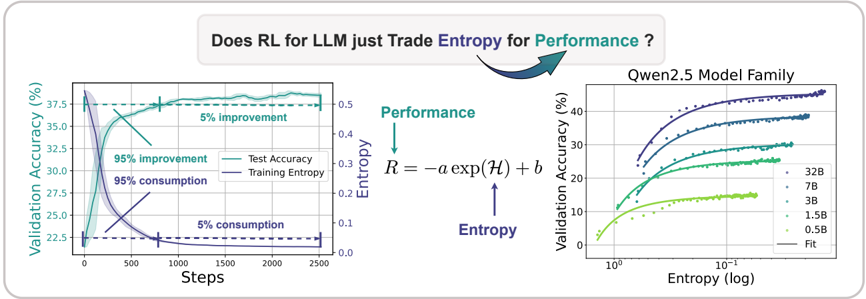
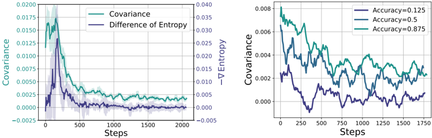

# entropy_mechanism — The Entropy Mechanism of Reinforcement Learning for Reasoning Language Models

> **一句话重点 (TL;DR)**：RLVR 训练里策略熵会快速坍缩、把性能死死锁在一个可预测的低上限上；本文给出熵坍缩的经验定律 R=−a·exp(H)+b 与其动力学根因(熵变正比于"动作概率与 logit 变化的协方差")，并提出 Clip-Cov / KL-Cov 两个只动"高协方差 token"的简单干预来持续维持探索、突破瓶颈。

**元信息**：arXiv:2505.22617（v1, 2025-05-28，预印本）｜ 上海 AI Lab / 清华 / UIUC / 北大 / 南大 / CUHK（PRIME-RL 团队，Ganqu Cui 等）｜ 主题 T3（RLVR 训练机理 + 算法）/ 相关性高 ｜ 代码 github.com/PRIME-RL/Entropy-Mechanism-of-RL（本地已 clone ~5.9MB，Tier A；已合入官方 veRL PR #1830）｜ 框架 veRL（fork 自 DAPO recipe）。

## 关键图示

**① Motivation / 对比图**

*Figure 1: Left: Entropy collapse and performance saturation. Over 95% entropy drop/performance gains take place at the early stage of RL training. The model then reaches a plateau with little improvement. Right: The predictable relationship between validation performance and policy entropy. Without*

**② 方法 / 架构图**

*Figure 8: Left: The dynamics of policy entropy (step-wise entropy difference) and covariance during on-policy GRPO training. They show similar trends as expected from the theoretical results. Right: Different prompt groups show distinct covariance behaviors. Easier prompts with higher accuracy have*

## 1. 相关工作与进展

- **RLVR(可验证奖励 RL)被视作后训练算力的下一增长极**：在数学、代码等有客观奖励的任务上能持续提升推理能力。
- **探索-利用的经典张力**：RL 要靠探索找到更优策略，策略熵是探索能力的直接度量。
- **已有的熵控制手段**：传统做法是加熵正则项或 KL 正则；但本文证明这些朴素手段在 LLM RLVR 上**无法有效缓解熵坍缩**。

## 2. 现有工作存在的问题

- **缺乏对 LLM 策略熵典型行为的系统刻画**：大家都观察到训练后期模型"变得过度自信、探索枯竭、性能饱和"，但没有定量规律。
- **熵坍缩(entropy collapse)**：无干预时策略熵在训练早期就急剧降到接近 0，性能随之触顶。这意味着即便继续投入算力，边际收益也趋近于零——直接限制了"扩 RL 算力"的价值。
- **朴素熵/KL 正则失效**：实验显示它们要么压不住坍缩，要么过度干扰优化。

## 3. Motivation
既然熵坍缩可预测地锁死性能上限，那就应当(1)给它建立一条可外推的经验定律(像 Scaling Law 那样用早期/小模型预测终态)，(2)从优化动力学层面找到坍缩的根因，(3)据此设计一个能持续注入探索、突破熵瓶颈的可扩展方法。

## 4. 主要灵感 / 核心直觉
熵的变化不是均匀来自所有 token，而是**集中在少数"高协方差" token**上：那些"模型已经高概率、又恰好拿到高 advantage"的动作会被进一步强化、迅速降熵。只要**专门限制这一小撮 token 的更新步长**，就能在不破坏整体优化的前提下稳住策略熵——这比对全局加熵正则精准得多。

## 5. 主要解决思路(一段话讲清核心)
先用经验定律 **R = −a·exp(H) + b** 把"验证性能 R"与"策略熵 H"绑定，说明性能是用熵"换"来的、上限(H=0 时 −a+b)完全可预测；再从理论上证明相邻两步的熵变 ≈ 动作 log 概率与其 logit 变化的**协方差**，而在策略梯度类算法下 logit 变化又正比于 advantage——于是高概率×高 advantage 的动作降熵、稀有×高 advantage 的动作升熵，且训练全程协方差为正使熵单调下降。最后提出两个干预——**Clip-Cov**(对一小撮正协方差 token 停梯度)与 **KL-Cov**(对协方差最大的一批 token 加 KL 惩罚)——直接替换 surrogate loss 里的 clip / PPO-KL，从而主动调控熵。

## 6. 方法详解(通俗、分步骤)
**(a) 经验定律**：R = −a·exp(H) + b(a、b 为拟合系数)。求导得 dR/dH = −a·exp(H)，性能随熵下降而提升、在 H=0 触顶。该定律在多家族模型上都成立，可用早期/小模型外推终态。

**(b) 熵动力学理论**：对 softmax 策略，两步间熵变 ∝ Cov(log π(a), Δlogit(a))。在 Policy Gradient / Natural PG 下 logit 差 ∝ advantage。实证显示协方差项与实测熵差**精确吻合**，且训练全程协方差为正，解释了熵为何单调坍缩。

**(c) 两个干预**(都只作用于"高协方差" token)：

- **Clip-Cov**：随机选取一小部分**正协方差** token，detach 其梯度(停止更新)。
- **KL-Cov**：对协方差 **Top-k%** token 改用带 KL 惩罚的 loss。
二者分别替换 surrogate loss 里的 clip 与 PPO-KL，通过阈值参数主动把策略熵维持在更高水平，逃离低熵陷阱。

## 7. 实验数据集

- **任务**：数学 + 代码(均可验证奖励)。数学评测集 MATH500、AIME24、AIME25、AMC、OlympiadBench、OMNI-MATH(主表 Table 2 重点报 AIME24/AIME25/AMC)；代码用 Eurus-2-RL-Code 与 KodCode 的测试划分。评测时 AIME/AMC 用温度 0.6 rollout、其余数学题用 greedy(Appendix A)。
- **熵-性能拟合(覆盖广)**：Qwen2.5 家族、Mistral 家族(7B-v0.3/Nemo/Small-3.1-24B)、LLaMA 家族(3.2-3B/3.1-8B)、DeepSeek-Math-7B-Base(附录给出不同模型/数据/Instruct 的拟合)。
- **Clip-Cov/KL-Cov 主实验**：Qwen2.5-7B 与 Qwen2.5-32B(Zero 设置，从 base 起 RL；Table 2、Fig.11)。
- 〔注：先前分析提到"data_source 代码硬编码 aime/aime25/amc"不成立——本地 fork 的 `verl/utils/reward_score/__init__.py` 相关分支为注释，未见硬编码。〕

## 8. 实验结果与主要发现

- **经验定律普适**：R=−a·exp(H)+b 在多家族模型上都拟合良好，性能上限可由早期训练预测——意味着"无干预的 RLVR 收益本就有限"。
- **协方差理论被实证支持**：协方差项与熵差精确匹配、且全程为正，定量解释了坍缩。
- **朴素正则失效、Cov 干预有效**：传统熵/KL 正则压不住坍缩；Clip-Cov / KL-Cov 能持续维持探索并提升下游数学推理性能(7B/32B 上均优于无干预与朴素正则)。

## 9. 结果如何支撑其主张
三层证据互相咬合：经验定律说明"熵决定性能上限"(why it matters)，动力学理论给出"为什么熵会坍缩"(协方差为正)，干预实验证明"按理论限制高协方差 token 确实能维持熵并提分"(理论→方法→效果的闭环)。这条链条比单纯报告一个 trick 更有说服力。

## 10. 逻辑自洽性(中性评估)
内部自洽性强：定律、理论、干预三者由同一个"协方差"概念贯穿。需保留的批判点：(1)经验定律 R=−a·exp(H)+b 是拟合关系而非严格因果，外推到很大算力/很强模型时是否仍成立未知；(2)协方差理论是对 softmax + 策略梯度的局部一阶分析，对加了大量工程 trick 的实际 RLVR 是近似；(3)Clip-Cov/KL-Cov 引入新阈值超参(选多少比例、KL 系数多大)，等于把"调熵正则"换成"调协方差阈值"，并未消除调参负担。

## 11. 残留问题 / 局限

- **干预带来新超参**：`k_percent`/`ppo_kl_coef`(KL-Cov)、`clip_ratio`/`clip_cov_lb`/`clip_cov_ub`(Clip-Cov)需调，最优值任务相关。
- **维持熵 ≠ 一定更好**：过度维持熵可能反而拖慢收敛；论文给的是"在测试任务上更好"，但何时该停止维持探索缺乏自适应准则。
- **主干预实验集中在 Qwen2.5-7B/32B 的 Zero 设置**，对 Instruct 起点、更大模型、代码任务的干预效果验证相对薄弱。

## 12. 开源代码与框架(链接+框架+代码可得性)

- 仓库 github.com/PRIME-RL/Entropy-Mechanism-of-RL(本地已 clone，Tier A)；方法已合入官方 **veRL**(PR #1830)，可经 `loss_mode=clip_cov`/`kl_cov` 直接使用(上游 `recipe/entropy/`)。
- **框架**：fork 自 veRL，在 **DAPO recipe**(`recipe/dapo/`)上构建；conda env `entropy`(`environment.yaml`)。
- **代码核对(已审计)**：`core_algos.py:compute_policy_loss_clip_cov` 在正协方差(lb~ub 间)token 上随机选 `clip_ratio` 比例，把梯度校正系数 corr 置 0(停更)；`compute_policy_loss_kl_cov` 对协方差 Top-k% token 改用带 KL 惩罚的 loss——与 §6 描述一致。
- **运行**：单节点 `bash recipe/dapo/7b_kl_cov.sh`(KL-Cov 训 Qwen2.5-7B)；多节点 `recipe/dapo/32b_*.sh`(Qwen2.5-32B)。
