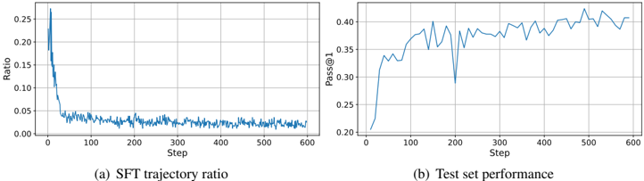
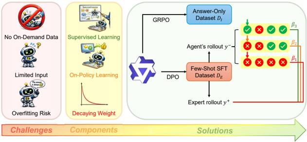

# fest — FEST: Boosting RLVR via Randomly Selected Few-Shot Guidance

> **一句话重点 (TL;DR)**：只用 **128 条随机**(非精选)抽自 SFT 数据集的示范，就能显著提升 RLVR；关键是 semi-online DPO 的梯度天然同时含"监督 + on-policy + 自带衰减权重"三要素，把少量示范作正样本、agent rollout 作负样本即可。

**元信息**：arXiv:2605.15012（v1, 2026-05-14，标注 Ongoing Work）｜ UIUC（Kai Yan、Alexander G. Schwing、Yu-Xiong Wang）｜ 主题 few-shot demonstration-guided RLVR / 相关性中（与"少量教师示范引导 + 负样本 + SFT/RL 统一"相关）｜ 代码 github.com/KaiYan289/FEST ｜ 框架 VeRL（GRPO 为主，few-shot 用 semi-online DPO）。

## 关键图示

**① Motivation / 对比图**

*Figure 3: Evolution of SFT trajectory ratios and corresponding Pass@1 performance during HPT replication on the full dataset. The ratio of expert trajectories declines to approximately 2% of total rollouts, yet performance metrics consistently trend upward. This observation provides empirical justif*

**② 方法 / 架构图**

*Ongoing Work 31 Appendix E GRAINGER COLLEGE OF ENGINEERING Figure 1: Overview of our work. We introduce a few-shot demonstration-guided RLVR paradigm to address three primary challenges: the lack of on-demand data, limited expert input, and high overfitting risk. To mitigate, FEST incorporates three*

## 1. 相关工作与进展

- **RLVR**(可验证奖励 RL)在数学/编码上很成功，但在难题上**样本效率低**。
- **demonstration-guided RL / unified post-training**(LUFFY、SRFT、HPT、ReLIFT、MIFO、SuperRL、CHORD 等)：在 RL 采样失败(全错、advantage=0、无学习信号)时引入 SFT 提供外部知识。
- 这条线已较成熟，但代价是 **SFT 数据需求大**(数 K~50K)。

## 2. 现有工作存在的问题

- **SFT 数据昂贵**：高质量长链推理示范需精心策划(如 HLE 2500 题动用 1000 名博士)；从已有模型蒸馏又涉及合法性、API 成本、model collapse 风险。相比之下"只有答案、无推理过程"的 RL 数据易得。
- **现有方法不能用随机少量数据**：LUFFY/SRFT 用满 46K、HPT 10K、ReLIFT 8.6K、MIFO 6.4K，且多需精心策划、非随机。
- **few-shot 极少数据的三大挑战**：(i) 无按需数据(专家不能对任意失败题现场补示范)、(ii) 语义覆盖有限、(iii) 反复多 epoch 训练**过拟合风险高**。

## 3. Motivation
能不能把 SFT 数据从数 K 降到只有 **128 条、且随机抽取**，仍显著超过纯 RLVR？为此先拆出"用好极少示范"必须同时满足的三个要素，再找一个天然同时具备三者的损失。

## 4. 主要灵感 / 核心直觉
三个必要要素：(i) **监督信号**(外部知识，RLVR 的二值奖励之外的唯一来源)、(ii) **on-policy 信号**(让模型拿自己的 rollout 与示范对比，缓解 exposure bias、起对抗训练作用、扩大极少题目的学习面)、(iii) **decaying weight**(随训练推进降低对少量数据的权重，防过拟合)。关键观察：**semi-online DPO** 的梯度恰好天然分解出这三项。

## 5. 主要解决思路(一段话讲清核心)
总损失 L = c·L_E + L_I：在大规模"答案-only"数据 D_I 上跑标准 GRPO(L_I，省 KL 与 std)；在 128 条 few-shot D_E 上跑 **semi-online DPO**(L_E)——把 SFT 示范当 preferred 样本 y+、把 agent 当前 rollout 当 non-preferred y−。该 DPO 损失对参数求梯度后正好得到"监督项 − on-policy 项"再乘以一个 σ(β(r−−r+)) 的自带衰减权重，三要素一次满足。

## 6. 方法详解(通俗、分步骤)
**(a) L_I(答案-only 数据)**：标准 GRPO，按组内相对奖励算 advantage，沿用 HPT/Dr.GRPO 省去 KL 与 std。

**(b) L_E(few-shot semi-online DPO)**：L_E = −E[ log σ(β·r+ − β·r−) ]，r+=log(π_θ(y+)/π_ref(y+))、r−=log(π_θ(y−)/π_ref(y−))，y+ 为示范、y− 为 rollout。其梯度(Eq.4)= −β·E[ σ(β(r−−r+))·(∇log π(y+) − ∇log π(y−)) ]，三项依次对应监督学习、on-policy、衰减权重。

**(c) 自适应 β(Eq.5)**：按题目可解性分三档——一组全错用 β1、RLVR-可解但本条错用 β2、本条正确用 β3，细粒度控制不同来源数据的学习强度。β 取 **0.001–0.1**(远小于标准 DPO 的 0.1–0.2，因长链推理序列长、log-ratio 差异大)。

**(d) FEST-GRPO 变体(Sec.3.3，治 gradient mismatch)**：DPO 是 sequence-level、GRPO 是 token-level，二者梯度量级不匹配、需繁琐调 c。论文证明 **semi-online DPO ≈ "REINFORCE(负奖励) + 加权 SFT"**，于是把其中的 REINFORCE 部分换成 GRPO，消除量级失配；这一等价关系也把 DPO 纳入了 HPT 的 unified post-training 框架(Appendix B.3)。

## 7. 实验数据集
训练用 OpenR1-Math-46K-8192，随机抽 128 题作 D_E、其余作答案-only D_I；模型 Qwen2.5-Math-1.5B。评测 6 个数学基准：AIME25、AMC23、AIME24、MATH-500、OlympiadBench、Minerva，报 Avg@8(均值±标准差)与 Pass@8。基线 GRPO、SRFT、LUFFY、CHORD-φ、MIFO、HPT、ReLIFT(及其 -G 变体)。

## 8. 实验结果与主要发现

- **128-shot 下 FEST 最优**：FEST-DPO 平均 **41.98**、FEST-GRPO **42.36**，均超 vanilla RL(39.79)及所有 128-shot 基线，甚至匹配用**全量数据**的 SRFT(35.05)/MIFO；是该稀疏数据条件下**唯一**显著超过纯 RL 的方法。
- **朴素把 RL 也加到 gold few-shot 上(HPT-G、ReLIFT-G)会显著掉点**(如 HPT-G 仅 32.02)：训练曲线显示中途骤降——说明在极少 gold 数据上做 RL 不稳定。
- 增益相对 RL 基线约 +2.2~+2.6 分(绝对值)，主要卖点是"数据从数 K 降到 128"。

## 9. 结果如何支撑其主张
主张是"128 条随机示范足以提升 RLVR"。Table 2 在同一 128-shot 约束下与多个强基线对比、并显示 FEST 匹配全量数据方法，直接支撑数据效率主张；梯度分解(Eq.4)与 REINFORCE 等价关系(Sec.3.3)从理论上解释了"为什么 semi-online DPO 恰好够用"，让结果不只是经验巧合。但绝对性能增益不大、卖点在数据量而非分数。

## 10. 逻辑自洽性(中性评估)
形式化清晰、自洽：把"用好 few-shot"拆成三要素，再证明 semi-online DPO 的梯度天然含这三项、并与"REINFORCE 负奖励 + 加权 SFT"等价，把 DPO 纳入 HPT 框架——这一分解是论文最扎实的部分。可质疑处：(1)自适应 β 三档划分是启发式，β 取值范围(0.001–0.1)依赖经验调参;(2)Remark 3.1 对"DPO 难翻转偏好/拒答主导"的辩护(称在本场景无害)偏定性。

## 11. 残留问题 / 局限

- **验证面窄**：仅单模型 Qwen2.5-Math-1.5B、单一数据源(OpenR1-Math)、纯数学；规模小(论文自标 Ongoing Work)。
- **超参敏感**：自适应 β 三档 + 系数 c(FEST-DPO 仍需调，FEST-GRPO 才缓解)依赖经验。
- **128 这一数字的来源**是沿用前作 batch size(一个 epoch 恰好一步)，并非对"最少需多少示范"的系统搜索(Sec.4.2 有 shots 缩放但仍有限)。
- **txt 仅捕获到前 6 页**，附录(B/C/D 的理论与超参分析)未在本地全文核对〔待核：附录细节〕。

## 12. 开源代码与框架(链接+框架+代码可得性)

- 代码 github.com/KaiYan289/FEST。核心 `ternary_dpo/`(基于 VeRL，含 verl、setup.py)、`examples/math-1.5b-v3`、`dataset/`、`utils/`、`eval_by_question_results/`。
- **框架**：VeRL；GRPO 为主 RL 框架，few-shot 用 semi-online DPO。
- **训练配置**：2×NVIDIA GH200(96GB)，600 步；n=8 rollout/题，温度 1.0，max len 8192；AdamW，cosine lr 1e-5→5e-6；global batch 128 题、mini-batch 512 rollouts。报告取第 600 步结果(沿用 ReLIFT)。
