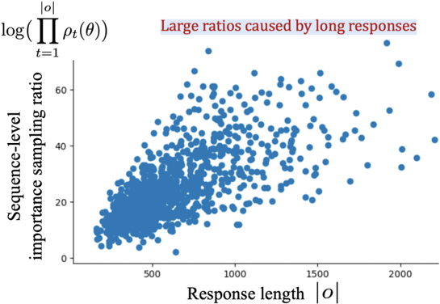
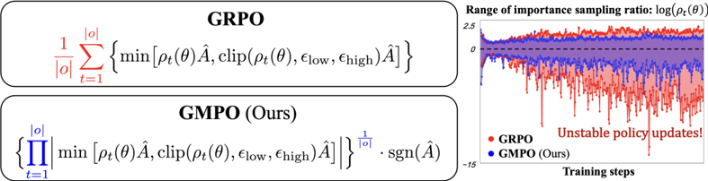

# gmpo — Geometric-Mean Policy Optimization (GMPO)

> **一句话重点 (TL;DR)**：GRPO 优化 token 级奖励的**算术平均**，对离群重要性比敏感、易引发激进更新与不稳定。GMPO 即插即用地换成**几何平均**（在 log 空间做乘积与裁剪），天然抗离群、重要性比方差更低，从而能用**更大的裁剪窗口**鼓励探索而仍保持稳定。

**元信息**：arXiv 2507.20673（v3, 2025-10-18）｜ UCAS / CUHK / HKUST / Microsoft Research（部分作者 MSR 实习完成）｜ ICLR 2026 接收 ｜ 主题 T3（RLVR 稳定性），相关性 High（对本课题 RL 阶段稳定性与更大裁剪窗口下探索设计有直接参考）｜ 代码 https://github.com/callsys/GMPO（已 clone ~57MB，Tier A）｜ 框架 专用仓基于 **Oat + vLLM 0.8.4**（构建于 understand-r1-zero / Dr.GRPO 之上）；另集成入 **veRL**（`examples/gmpo_trainer`）。

## 关键图示

**① Motivation / 对比图**

*Figure 6: Sequence-level importance sampling ratios from trajectories that yield positive rewards during GRPO training. Without normalization, these ratios can become highly unstable, especially as the response length increases.*

**② 方法 / 架构图**

*Figure 1: Comparison between GRPO and our GMPO. GRPO optimizes the arithmetic mean of token-level rewards while GMPO the geometric mean (left). When training with GRPO, the important sample ratio ( ρ t ( θ ) = π θ ( o t | q,o <t ) π θ old ( o t | q,o <t ) ) frequently reaches extreme values, leading*

## 1. 相关工作与进展

- **GRPO（Shao 2024）**：组内相对优势，免 value 模型，数学/代码/QA 上强。
- 大量 GRPO 变体（论文 §2.1 罗列）：DAPO（动态采样 + clip-higher）、Dr.GRPO（去长度偏置）、GPG（去 surrogate/critic/KL）、OPO（最优 baseline 降方差）、80/20 规则（高熵少数 token 主导）、entropy-based advantage 等。
- 多数变体聚焦采样/优势/奖励塑形；**RL 训练稳定性本身仍欠探索**。

## 2. 现有工作存在的问题

- GRPO 目标是 token 级奖励的**算术平均**，对离群值敏感：当某些 token 的重要性比 ρt(θ)=πθ/πθold 达到极值时，importance-weighted reward ρt·Â 出现离群，驱动**激进策略更新**并进一步放大 ρt 方差，导致不稳定甚至退化。
- GRPO 用 clip 限制 ρt 偏离，但过窄的 clip **压制探索、过早收敛到确定性策略**，熵快速塌缩、性能 plateau。

## 3. Motivation
用对离群值天然更鲁棒、重要性比分布方差更低的**几何平均**替换算术平均；在维持稳定的同时**放开裁剪范围**以促进探索，兼得稳定与探索。

## 4. 主要灵感 / 核心直觉

- 几何平均 = log 空间的算术平均；单个极端 ρt 在乘积/对数和里被"摊薄"，不会单点主导梯度。
- 更稳的目标 → 可用更宽 clip（如 e^±0.4，远宽于 GRPO 的 0.8/1.2、DAPO 的 0.8/1.28）→ 更高熵、更强探索 → 更好性能。

## 5. 主要解决思路(一段话讲清核心)
把 GRPO 目标里 token 级奖励的算术平均（式 2）换成几何平均（式 3）：对每条 rollout，取 token 重要性比乘积的 1/|o| 次方（含 sgn(Â) 保证优化方向），等价于在 **log 空间**求 token 对数比的均值再 exp，乘积与裁剪都在 log 空间执行（Algorithm 1）。理论上 GMPO 目标值域更窄（训练方差更小）、梯度对 ρt 离群更鲁棒；实测训练中保持更小的对 ref 模型 KL 与更高 token 熵。裁剪采用 **token 级**（而非序列级）。

## 6. 方法详解(通俗、分步骤)

1. 与 GRPO 同样采样 G 个 rollout、组内标准化得优势 Âi。
2. **几何平均目标（式 3/4）**：loss = −Â · exp( Σ_t clip(sgn(Â)·(logπθ−logπθold), −ε, ε)·sgn(Â) / |o| )（伪代码见 Algorithm 1，全程 log 空间）。
3. **token 级裁剪（关键设计 i）**：对每个 token 的对数比做 clip，而非对整条序列乘积做 clip。理由：(1) token 级 clip 的重要性比范围更小、更稳（Fig.3）；(2) 序列级 clip 一旦触发会把整条序列所有 token 梯度清零，过于激进、丢弃有用信号。
4. **放宽裁剪窗口（关键设计 ii）**：设 (ε_low, ε_high)=(e^−0.4, e^0.4)，显著宽于 GRPO/DAPO，兼顾稳定与探索；过宽（如 −∞,+∞）反而不稳。
5. 沿用 Dr.GRPO 设置，忽略显式 KL 正则项以省显存。

## 7. 实验数据集

- **语言侧（沿用 Dr.GRPO）**：训练用 MATH Level 3-5（8523 题，<7B 模型）、MoE 用 DeepScaleR + CountDown；评测五个数学基准 AIME24(30)、AMC(83)、MATH500(500)、Minerva(272)、OlympiadBench(675)。
- **多模态侧（沿用 EasyR1）**：训练/评测 Geometry3K(601)。
- **模型**：Qwen2.5-Math-1.5B/7B、DeepSeek-R1-Distill-Qwen-7B、Qwen3-32B(MoE)；多模态 Qwen2.5-VL-Instruct-7B。8×A800。

## 8. 实验结果与主要发现

- **主结果（Table 1）**：GMPO-7B(R1-Distill) 五数学基准均值 **63.4% vs GRPO 59.3%（+4.1%）**；Qwen2.5-Math-7B +1.5%、1.5B +1.4%。MoE Qwen3-32B 上 MATH500 **96.7% vs 94.6%（+2.1%）**。多模态 Geometry3K **54.7% vs 53.3%（+1.4%）**。
- **消融（Table 4）**：GRPO 51.2% → GMPO 52.7%（+1.5%）；去归一化项 1/|o| 掉 0.7%；去 clip（−∞,+∞）掉 0.4%；seq-clip 与 token-clip 性能相近但前者重要性比范围更大，故选 token-clip。
- **裁剪阈值（Table 5）**：(e^−0.4,e^0.4) 最优（52.7%）。
- **训练动态（Fig.4/5）**：GMPO 全程更高熵、更稳梯度、更小 KL；CountDown 上 GRPO 约 250 步后崩溃，GMPO 稳定。

## 9. 结果如何支撑其主张

- "更稳"由更小 KL、更稳梯度、MoE/CountDown 不崩溃支撑；"更强探索"由更高熵 + 更宽可用 clip 支撑；理论侧给出目标值域更窄（不等式）与梯度鲁棒性推导（Appendix A）。证据链较完整。

## 10. 逻辑自洽性(中性评估)

- 理论与实现一致（log 空间几何平均 = 对数比均值），梯度推导（Lemmas 1-3）严谨。
- 自洽点：把"几何平均抗离群"→"可放宽 clip"→"更高熵/更好性能"串成闭环，并用熵/KL/梯度曲线佐证。
- 注意：增益幅度任务相关（消融里 +1.5%，主表 R1-Distill 上 +4.1%），4.1% 这一最大增益来自特定基座，不宜泛化为普遍幅度。

## 11. 残留问题 / 局限

- 评测局限于数学/几何推理，未覆盖代码、通用对话、长 CoT agentic 等；与 GRPO 对比共享 Dr.GRPO 设置但 clip 范围本就不同，公平性部分依赖调参。
- 几何平均隐含"序列内 token 同等重要"的假设，对极端长序列或含大量格式 token 的响应是否最优未深究。
- 与 GSPO（序列级长度归一化重要性比）思想高度相通，论文未与之直接对照。

## 12. 开源代码与框架(链接+框架+代码可得性)

- 规范仓：https://github.com/callsys/GMPO（本地已 clone ~57MB，Tier A）。
- 专用实现：**Oat**(`oat-llm==0.1.3.post1`) + **vLLM 0.8.4**，构建于 `understand_r1_zero_main/`（Dr.GRPO）；入口 `bash scripts/qwen2.5-math-7b-gmpo.sh`（另含 hmpo 与 ablation 脚本）。
- 另已集成入官方 **veRL** `examples/gmpo_trainer`。〔核对：专用实现框架确为 Oat/Dr.GRPO，veRL 仅作额外集成入口。〕
