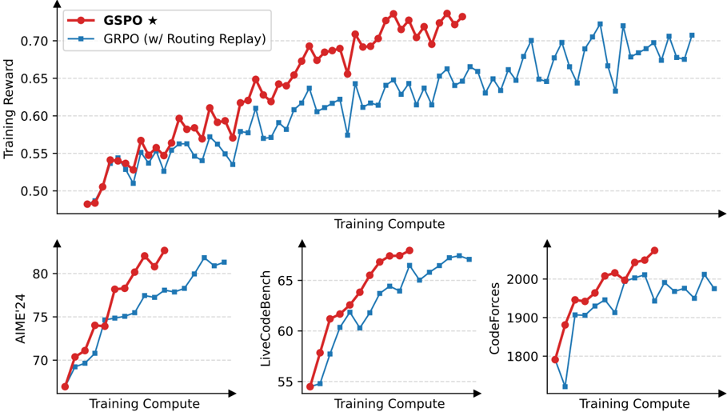
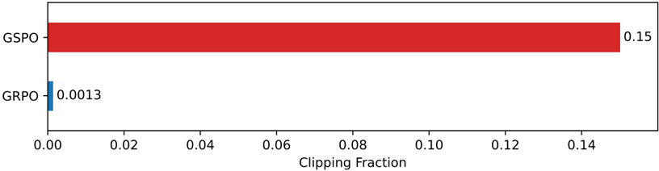

# gspo — Group Sequence Policy Optimization (GSPO)

> **一句话重点 (TL;DR)**：GRPO 在 **token 级**做重要性采样校正是"病态"的——单样本权重无法完成分布校正，反而注入随序列累积、被 clip 放大的高方差噪声，导致大模型（尤其 MoE）不可逆崩溃。GSPO 改在 **序列级**定义（长度归一化的）重要性比并做序列级裁剪/优化，使优化单位与奖励单位（整条序列）对齐，训练更稳更高效，已用于 Qwen3。

**元信息**：arXiv 2507.18071（v2, 2025-07-28）｜ Qwen Team, Alibaba（通讯 Chujie Zheng / Bowen Yu）｜ 2025-07 预印本 ｜ 主题 T3（RL 算法），相关性 High（影响本课题 RL 阶段稳定性与算法选型）｜ 代码 无独立官方仓（集成于 veRL/TRL/ms-swift/ROLL）｜ 框架 Qwen 内部 RL（训练 Megatron + 推理 SGLang/vLLM）。

## 关键图示

**① Motivation / 对比图**

*Figure 1: Training curves of a cold-start model fine-tuned from Qwen3-30B-A3B-Base. GSPO possesses remarkably higher training efficiency than GRPO.*

**② 方法 / 架构图**

*Figure 2: Average fractions of clipped tokens over the RL training of GSPO and GRPO.*

## 1. 相关工作与进展

- **PPO**：依赖与策略同规模的 value 模型，显存/计算重，且 value 估计可靠性与长序列扩展性是难点。
- **GRPO（DeepSeekMath, Shao 2024）**：用组内相对优势替代 value 模型，token 级重要性比 + 裁剪，成为竞赛数学/代码 RL 的 SOTA 基线，但在超大模型上不稳。
- **背景**：RL 已是扩展 LLM 深度长链推理的关键范式（o1、DeepSeek-R1、Qwen3）；继续 scale 的前提是训练动态稳定。

## 2. 现有工作存在的问题
作者诊断 GRPO 目标"病态(ill-posed)"，根因是**重要性采样权重的误用**：

- 重要性采样要在行为分布上对**多样本(N≫1)** 取平均，权重 \(\pi_{\mathrm{tar}}/\pi_{\mathrm{beh}}\) 才能完成分布校正（式 4）。
- GRPO 在**每个 token 位置**用单一样本 yi,t 算比值 \(\pi_\theta/\pi_{\theta_{\mathrm{old}}}\)，无法完成校正，反而注入**高方差噪声**；噪声随序列变长累积、被 clip 放大，最终引发**常不可逆的模型崩溃**（回滚 checkpoint、调 clip、改 query 均无效）。
- **MoE 雪上加霜**：一次梯度更新后同一响应约 10% 激活专家变化（越深越显著），使 token 级比值剧烈抖动、进一步失效。
- 核心原则：**优化目标的单位应与奖励的单位匹配**——奖励授予整条序列，却在 token 级做 off-policy 校正，是问题所在。

## 3. Motivation
token 级重要性权重既病态又与序列级奖励错配；而序列级重要性比 πθ(y|x)/πθold(y|x) 有清晰理论含义（反映采样响应偏离当前策略的程度），与序列级奖励天然对齐，也能作为 clip 的有意义指标。故放弃 token 级目标，直接在序列级做加权、裁剪与优化。

## 4. 主要灵感 / 核心直觉

- "奖励是整条序列给的，优化和裁剪也应以整条序列为单位。"
- 对序列似然比做**长度归一化（几何平均）**，把 si 控制在统一数值范围、降低方差，避免少数 token 似然变化造成序列比剧烈波动，也省去为不同长度响应设不同 clip 范围。

## 5. 主要解决思路(一段话讲清核心)
对一个 query 的一组 G 个响应，逐响应计算**序列级重要性比** \(s_i(\theta) = (\pi_\theta(y_i \mid x)/\pi_{\theta_{\mathrm{old}}}(y_i \mid x))^{1/|y_i|}\)（即 token 对数比均值的 exp）；优势 Âi 用组内标准化（与 GRPO 同）；目标对整条响应做 min/clip（式 5）。本质区别（梯度分析 §4.2）：GRPO 用各 token 各自不等的重要性权重加权 log 似然梯度，累积致不稳；GSPO 对一条响应内**所有 token 等权**，消除该不稳定因素。

## 6. 方法详解(通俗、分步骤)

1. 对 query x 从 πθold 采样 G 个响应；verifier 给每条 [0,1] 奖励。
2. 组内标准化得优势 \(\hat{A}_i = (r_i - \mathrm{mean}\{r\})/\mathrm{std}\{r\}\)（式 6，组内所有 token 共享同一优势）。
3. 算序列级比 si(θ)（式 7，含 1/|yi| 长度归一化）。
4. 按式 5 做 `\(\min(s_i \cdot \hat{A}_i, \mathrm{clip}(s_i, 1-\varepsilon, 1+\varepsilon) \cdot \hat{A}_i)\)`，对**整条响应**裁剪以排除过度 off-policy 样本。注意 clip 范围与 GRPO 差一个数量级（实验左右取 3e-4/4e-4，GRPO 为 0.2/0.27）。
5. **GSPO-token 变体（§4.3，式 13-14）**：用于多轮 RL 等需逐 token 调优势的场景，`\(s_{i,t} = \mathrm{sg}[s_i] \cdot \pi_\theta(y_{i,t})/\mathrm{sg}[\pi_\theta(y_{i,t})]\)`。当所有 token 优势相同时，与 GSPO 在目标、clip 条件、理论梯度上**数值完全等价**，但允许逐 token 自定义优势。

## 7. 实验数据集

- 评测：AIME'24（32 采样 avg Pass@1）、LiveCodeBench（2024-10~2025-02，8 采样 avg Pass@1）、CodeForces（Elo）。
- 训练基座：Qwen3-30B-A3B-Base 冷启动微调模型；每批 rollout 切 4 个 mini-batch 做梯度更新。
- 实战：GSPO 已用于最新 Qwen3 系列的 RL 训练。

## 8. 实验结果与主要发现

- **稳定+高效（Fig.1）**：GSPO 全程稳定；同算力/同消耗 query 下训练精度与基准表现优于精调的 GRPO；可靠地随增算力/更新 query/延长生成长度持续提升。
- **MoE（§5.3）**：GRPO 须依赖 **Routing Replay**（缓存并重放 πθold 的激活专家）才能收敛，带来额外显存/通信开销并限制 MoE 容量；GSPO 只看序列似然、对单 token 似然不敏感，**无需 Routing Replay** 即可稳定收敛。
- **裁剪悖论（§5.2）**：GSPO 被裁 token 比例约 0.15，比 GRPO（≈0.0013）高两个数量级，但训练效率反而更高——反证 GRPO token 级梯度估计噪声大、样本利用低效。
- **基础设施（§5.4）**：仅用序列级似然，对训练/推理引擎精度差异更鲁棒，可直接用推理引擎(SGLang/vLLM)返回的似然优化，省去用训练引擎(Megatron)重算 πθold，利好 partial rollout、多轮 RL、训推分离框架。

## 9. 结果如何支撑其主张

- "token 级病态"由崩溃现象 + 梯度分析 + 裁剪悖论三方面支撑；"序列级更稳"由 MoE 免 Routing Replay 与稳定训练曲线支撑。论证既有理论（重要性采样原理、梯度推导）又有大规模实证（Qwen3）。

## 10. 逻辑自洽性(中性评估)

- 推理链清晰：从重要性采样基本原理 → token 级误用 → 序列级修正，理论自洽。
- GSPO 与 GSPO-token 的数值等价性给出严格推导。
- 隐患：论文给的训练曲线横轴是抽象"Training Compute"、纵轴含归一化，缺绝对数值与方差带；"崩溃不可逆"为定性描述，未给可复现的崩溃判据。

## 11. 残留问题 / 局限

- 实验主要在 Qwen3-30B-A3B-Base 一个基座族；与 GRPO 的对比依赖各自精调的 clip 范围，公平性依赖调参。
- 序列级长度归一化对极端长/短响应、混合长度分布的鲁棒性未深入。
- 无公开代码与脚本随论文发布，复现需到第三方框架对照实现，细节（如奖励、数据筛选）披露有限。

## 12. 开源代码与框架(链接+框架+代码可得性)

- **无独立官方仓**；论文为纯算法贡献。
- 已被多个开源 RL 框架集成：veRL、TRL、ms-swift、ROLL（代码实现需到这些框架查阅）。原始实验在 Qwen 内部基础设施（Megatron 训练 + SGLang/vLLM 推理）。
