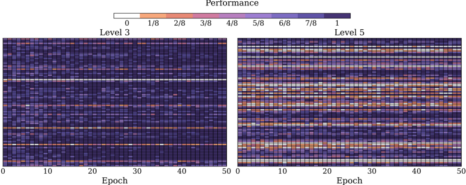
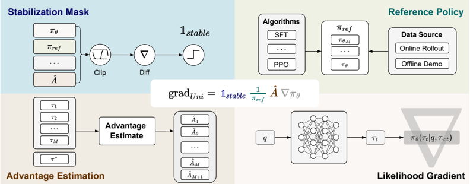

# hpt_upge — Towards a Unified View of Large Language Model Post-Training (UPGE / HPT)

> **一句话重点 (TL;DR)**：提出 Unified Policy Gradient Estimator (UPGE)，把 SFT 与各类 RL 后训练的策略梯度分解为四个可互换组件，论证 SFT 与 RL 是同一优化过程在不同数据分布假设/bias-variance 权衡下的实例；据此提出 Hybrid Post-Training (HPT)——按 on-policy rollout 准确率在实例级二值切换"纯 RL"与"纯 SFT"信号。

**元信息**：arXiv 2509.04419（2025-09-05）｜ 清华大学 C3I (TsinghuaC3I)｜ arXiv 预印本，2025-09｜ 主题 T3：统一 SFT-RL 视角的理论 + 算法（GFT-class 代表作）｜ 代码 https://github.com/TsinghuaC3I/Unify-Post-Training （含 `hpt/verl/verl/mix_src` 核心实现，约 11MB）｜ 框架 veRL + LUFFY 的 mix_src 扩展（FSDP + vLLM rollout）。

## 关键图示

**① Motivation / 对比图**

*Figure 3: GRPO training dynamics of SFT → GRPO on Qwen2.5-Math-1.5B across 50 training epochs. We visualize the model's per-question sampling accuracy throughout the training process.*

**② 方法 / 架构图**

*Figure 1: Illustration of the Unified Policy Gradient Estimator. The ' ∇ ' in the background of the Likelihood Gradient part refers to the calculation of the gradient with respect to the πθ .*

## 1. 相关工作与进展
现代 LLM 后训练有两类数据来源：on-policy（模型自生成 rollout）与 off-policy（人类/其他模型示范）。RL 善探索、SFT 善高效利用示范，二者通常被视为对立范式，常以 SFT→RL 两阶段串联使用。LUFFY 提供了 on/off-policy 混合 rollout（prefix_mask 区分）的工程基础，本工作在其 mix_src 上扩展。

## 2. 现有工作存在的问题
长期缺乏把 SFT 与 RL 统一理解的理论框架；SFT→RL 两阶段范式存在遗忘与效率问题，且无法按模型能力/数据难度自适应地选择训练信号。

## 3. Motivation
若能把各类后训练算法的梯度统一表达，就能在理论上厘清 SFT 与 RL 的关系，并导出一个按模型当前表现自适应混合两种信号的算法，避免两阶段范式的遗忘与僵化。

## 4. 主要灵感 / 核心直觉
核心论断：**SFT 与 RL 并非对立，而是同一优化过程在不同数据分布假设与不同 bias-variance 权衡下的实例**。SFT 可看作优势估计 Â 退化、且 off-policy 算法常令参考策略分母 \(\pi_{\text{ref}}(\tau) = 1\) 的特例。既然同源，就能按"模型在某问题上是否已能自解"动态决定该用 RL（能自解→探索）还是 SFT（解不出→示范）。

## 5. 主要解决思路(一段话讲清核心)
把广泛后训练算法的策略梯度写成 \(\nabla_{\mathrm{Uni}} = \mathbb{1}_{\text{stable}} \cdot \frac{1}{\pi_{\text{ref}}} \cdot \hat{A} \cdot \nabla \pi_\theta\) 四组件（稳定化掩码、参考策略分母、优势估计、似然梯度），不同算法对应不同取值；据此设计 HPT：对每个 question 采 n=8 条 on-policy rollout，用 rule-based verifier 得准确率 P，P>γ 走纯 on-policy RL（Dr. GRPO）、P≤γ 在外部 supervising trajectory 上走纯 SFT，混合损失 \(L = \alpha L_{\mathrm{RL}} + \beta L_{\mathrm{SFT}}\)（α,β 为二值开关）。

## 6. 方法详解(通俗、分步骤)
**UPGE 四组件**：(1) Stabilization mask 𝟙_stable（如 PPO clip）；(2) Reference-Policy denominator 1/π_ref（off-policy SFT 类常令 \(\pi_{\text{ref}}(\tau) = 1\)）；(3) Advantage estimate Â（SFT 为 Â 退化特例）；(4) Likelihood gradient ∇π_θ。
**HPT 二值开关（Algorithm 1, Eq.10-13）**：每 question 采 n=8 rollout 得 P；\(P > \gamma \to (\alpha,\beta) = (1,0)\) 纯 RL；\(P \le \gamma \to (\alpha,\beta) = (0,1)\) 在 τ⋆ 上纯 SFT。gate γ：Qwen 系固定 **γ=0**（仅 8 条全错才转 SFT），LLaMA 系 **γ=2/8**。RL 原语论文正文明确为 **Dr. GRPO**（不除组内 std、去 token-mean 长度偏置）。
〔已核-代码〕工程实现 `select_on_off_ada_balance` 按每 prompt 正确 rollout 数 `on_solve_num`：`≤switch_gate`(默认0)→移除 on-policy、注入示范走 SFT；`switch_gate<…≤switch_gate_off`→过渡；更高→纯 on-policy RL。actor 端（`mix_actor.py`）对 off-policy 部分用 `compute_sft_pure_loss`，以 `sft_loss_coef`（默认1.0，Qwen2.5-Math-1.5B 用0.3）与 pg_loss 相加：\(\text{loss} = \text{sft\_loss} \cdot \text{sft\_loss\_coef} + \text{pg\_loss}\)。仓库另含 `off_policy`/`off_sft`/`switch_off_sft`/`srft`(\(\text{sft\_coef} = 0.5 \cdot \exp(-H_{\text{coef}})\)) 等变体。仓库 `adv_estimator` 默认写 `grpo`，与正文 Dr. GRPO 通过 `loss_remove_token_mean`/`loss_remove_clip` 旋钮区分。

## 7. 实验数据集

- 训练：遵循 LUFFY，使用 OpenR1-Math 数据（脚本默认 `openr1.parquet`）；Qwen2.5-Math-7B 需 rope_theta 重设 40000、max_position_embeddings 设 16384。
- Backbone：Qwen 与 LLaMA 多规模（主结果 Qwen2.5-Math-7B，另含较小/较弱模型）。
- 评测：In-Distribution（AIME24/AIME25/AMC/MATH-500/Minerva/Olympiad）+ Out-of-Distribution（ARC-c、GPQA）。
- 基线：SFT、GRPO、SFT→GRPO、LUFFY、SRFT 等。

## 8. 实验结果与主要发现

- HPT 在 Qwen2.5-Math-7B 上超过 SFT→GRPO 与 LUFFY，相对最强基线在整体上提升约 **7 个点**（论文摘要 "a 7-point gain over our strongest baseline"）。
- gate 消融（Qwen2.5-Math-7B）：γ=0 → 平均 **41.9**，优于 γ=1/8 的 38.7 与 γ=2/8 的 39.0——即 Qwen 上"仅在全错时才转 SFT"最优。
- 在较小/较弱模型上也有显著提升。

## 9. 结果如何支撑其主张
"SFT/RL 同源"由 UPGE 的梯度分解（把已有算法表为四组件特例）从理论支撑；"自适应混合优于两阶段"由 HPT 超过 SFT→GRPO/LUFFY 支撑；gate 消融显示切换阈值确实影响结果且存在最优值，间接印证"按模型表现选信号"的有效性。

## 10. 逻辑自洽性(中性评估)
理论与算法衔接自洽，代码与 Algorithm 1 一致（二值开关 + sft_loss_coef 加权）。需注意：论文正文 HPT 是二值开关而非连续混合，"hybrid"更多体现在实例级在两种信号间切换，而非单样本上加权融合；UPGE 四组件框架与既有统一视角工作（如本批 hpd 的 reweighted log-likelihood）思路相近，新颖性主要在四组件的明确分解 + 基于准确率的自适应 gate。

## 11. 残留问题 / 局限

- gate γ 需按模型族手调（Qwen 0、LLaMA 2/8），`sft_loss_coef` 亦随模型变（1.0 vs 0.3），自适应性仍含人工先验。
- n=8 rollout 估准确率带来额外采样开销；γ 离散且粒度粗（0/1/8/2/8）。
- 主结果集中在数学推理 + Qwen2.5-Math-7B，跨域泛化以 ARC-c/GPQA 两个 OOD 点为主。
- arXiv 预印本（2025-09），未见正式接收。

## 12. 开源代码与框架(链接+框架+代码可得性)

- 链接：https://github.com/TsinghuaC3I/Unify-Post-Training （约 11MB）。核心在 `hpt/verl/verl/mix_src/`（`mix_actor.py`、`mix_core_alg.py`、`mix_trainer.py`），训练入口 `verl.mix_src.main_mix_ppo`。
- 框架：veRL + LUFFY mix_src 扩展，FSDP + vLLM rollout，prefix_mask 区分 on/off-policy。
- 复现：提供 `train.sh`、`train_luffy.sh`、`train_srft.sh`、`train_llama.sh` 及数据准备脚本 `data/prepare_train_sft_rl.py`、`hpt/scripts/data/prepare_openr1_data*.py`。代码可得、可对照。
