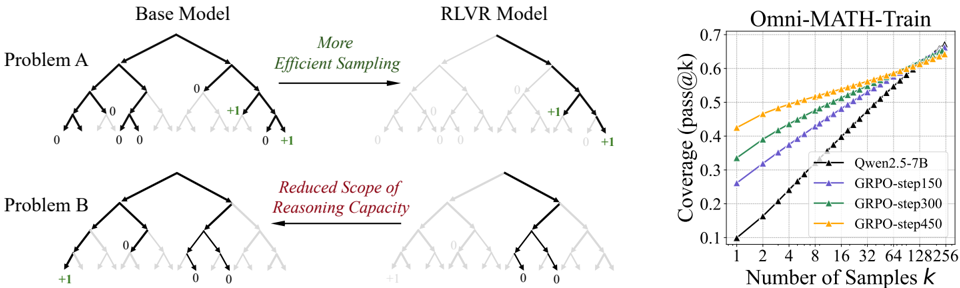
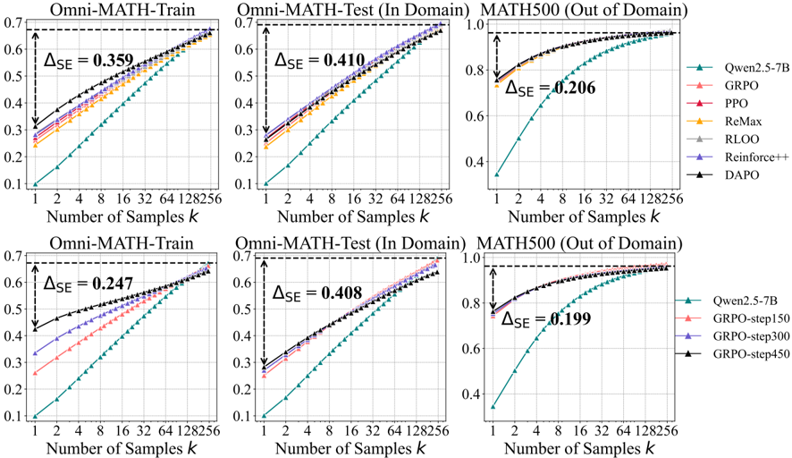

# limit_rlvr — Does Reinforcement Learning Really Incentivize Reasoning Capacity in LLMs Beyond the Base Model?

> **一句话重点 (TL;DR)**：用大 k 的 pass@k 系统度量 base vs RLVR 模型的推理"能力边界"，发现 RLVR 只在小 k 占优、大 k 被 base 反超，且边界随训练收窄——结论是当前 RLVR 主要提升采样效率、并未引入超越 base 的新推理能力，而蒸馏可以。

**元信息**：arXiv 2504.13837 ｜ 清华大学 LeapLab、上海交通大学(Yang Yue 乐洋/Zhiqi Chen 共一，Gao Huang 黄高通讯) ｜ 2025-04-21 v1，2025-11-24 v5(新增 DAPO/DeepScaler、熵/温度分析) ｜ 主题 T3 RLVR 能力边界批判性分析(相关性 High) ｜ 代码 https://github.com/LeapLabTHU/limit-of-RLVR (已克隆 ~83MB，评测/分析为主) ｜ 框架 pass@k 评测(vLLM 多采样)，被评模型来自 SimpleRL-Zoo/Oat-Zero/DAPO/Code-R1，VeRL

## 关键图示

**① Motivation / 对比图**

*Figure 1: (Left) The effect of current RLVR on LLM's reasoning ability. Search trees are generated by repeated sampling from the base and RLVR-trained models for a given problem. Grey indicates paths that are unlikely to be sampled by the model, while black indicates paths that are likely to be samp*

**② 方法 / 架构图**

*Figure 8: (Top) Different RL algorithms. (Bottom) Different RL training steps. The detailed values for each point at pass@1 and pass@256 are provided in Table 3 and Table 4.*

## 1. 相关工作与进展
o1、DeepSeek-R1、Kimi-1.5 等推理模型核心驱动是大规模 RLVR(可验证奖励：数学答案正确 / 代码通过单测)。业界类比 Atari/Go 中 RL 能自主发现超越人类的新策略，普遍相信 RLVR 同样能让 LLM 自主发展出超越 base 的新推理模式(枚举、自反思、迭代精炼)，被视为持续自进化路径。

## 2. 现有工作存在的问题
RLVR 的根本有效性尚未被充分检验。传统 greedy/nucleus 的平均分(pass@1)只反映平均情形、会低估模型潜力，无法刻画推理能力**边界**。核心追问：**当前 RLVR 是让 LLM 获得了 base 没有的新推理能力，还是只是更高效地利用了 base 已有的推理模式？**

## 3. Motivation
用 pass@k(尤其大 k)严格度量 base 与 RLVR 模型的推理能力边界，判断 RLVR 是否带来"超越性"能力；并把 base 当作上界，量化现有 RLVR 算法距最优有多远，以及 RLVR 与蒸馏的本质差异。

## 4. 主要灵感 / 核心直觉
pass@k(k 个采样中任一正确即解出)在大 k 时逼近"模型潜在可解题集合"，因此是推理边界的代理。若 RLVR 真扩展能力，其 pass@k 曲线应在所有 k 上不低于 base；若只是把概率质量集中到 base 已能解的路径上，则会在小 k 占优、大 k 被 base 反超——这正是作者用来证伪"RLVR 引入新能力"的判别工具。

## 5. 主要解决思路(一段话讲清核心)
不提出新训练方法，而是把 base 当上界，系统比较 base 与其多种 RLVR 后版本在多家族/多尺寸/多算法/多 benchmark 上的 pass@k 曲线；辅以覆盖度与 perplexity 分析验证 RLVR 路径是否已在 base 采样分布内；定义采样效率差距 ΔSE 量化各算法逼近最优的程度；并对比蒸馏以区分二者本质。

## 6. 方法详解(通俗、分步骤)

- **评测指标**：pass@k(无偏低方差估计器)；主张 pass@k(而非 Best-of-N / 多数投票)才反映"边界"。数学对 guessing 风险题人工核查 CoT 正确性，代码用编译器+单测。
- **量化指标 ΔSE**：sampling efficiency gap = RL 模型 pass@1 与 base 模型 pass@k(k=256 作上界代理)之差，衡量算法逼近最优程度(§Fig.8 top)。
- **覆盖度 + perplexity 分析**：验证 RLVR 生成的推理路径是否已存在于 base 的采样分布中。
- **算法对比**：六种主流 RLVR 算法 = **PPO、GRPO、Reinforce++、RLOO、ReMax、DAPO**(均在 VeRL 上、以 Qwen2.5-Math-7B 为 base、Omni-Math-Rule 训练，依 DAPO/Oat-Zero 去掉 KL；§4.3)。〔已核-Table 1/§4.3〕

## 7. 实验数据集

- 数学(zero-RL，base 起点)：LLaMA-3.1-8B、Qwen2.5-7B/14B/32B-Base、Qwen2.5-Math-7B;benchmark GSM8K、MATH500、Minerva、Olympiad、AIME24、AMC23。
- 代码(instruct 起点)：Qwen2.5-7B-Instruct、DeepSeek-R1-Distill-Qwen-14B，用 Code-R1。
- 视觉推理：另有设置。
- v5 新增：评测 Oat-Zero-7B、DAPO-32B(Fig.11)、DeepScaleR，及熵/温度匹配分析。

## 8. 实验结果与主要发现

1. **小 k 时 RLVR 优于 base，但大 k 时 base 持续反超**——所有 benchmark 与家族无例外，说明当前 RLVR 不扩展、甚至缩小可解题目范围(推理边界变窄)；随训练进行 pass@256 覆盖度下降(Fig 中 GRPO-step150/300/450 递减)。
2. RLVR 生成的推理路径已存在于 base 输出分布(perplexity 分析佐证)——RLVR 只是更高效采样 base 已能解的题，能力受 base 上界约束。
3. 六种 RLVR 算法 ΔSE 一致偏大(in-domain 从 GRPO 43.9 到 RLOO 最优 42.6，差异小)，均远未最优;DAPO 在 k=256 处显著下滑。
4. **RLVR 与蒸馏本质不同**：蒸馏能从更强 teacher 引入新推理模式、真正扩展边界；RLVR 不能。
5. v5：提高 RLVR 模型生成温度至匹配 base 熵后，pass@k 差距缩小但 base 仍占优——熵下降是边界收窄的部分(非全部)原因。

## 9. 结果如何支撑其主张
跨多家族×尺寸×算法×benchmark 的 pass@k 反超现象高度一致，强力支撑"RLVR 不扩展边界"的核心主张;perplexity/覆盖度分析对"路径已在 base 分布内"提供机制证据;蒸馏对照实验支撑"蒸馏≠RLVR"。论据系统、可重复，是该批判的最强支撑。

## 10. 逻辑自洽性(中性评估)
论证自洽：pass@k 作为边界代理的合理性、k=256 上界代理的选择、无偏估计器、人工核查 guessing 题，环环相扣。潜在张力在于"大 k 反超"对采样预算敏感(k=256 是工程代理而非真上界)，作者已用熵匹配等鲁棒性检查回应，结论稳健。

## 11. 残留问题 / 局限

- pass@k 边界以有限 k(≤256)代理"真实潜力"，极大 k 或更优解码下结论是否变化存开放性。
- 结论针对"当前 RLVR 算法/数据规模"；论文自身呼吁更好探索机制、更大数据 curation、细粒度 process signal、多轮 agent 交互——即不排除未来 RLVR 范式突破边界。
- 蒸馏"扩展边界"的对照较简略，蒸馏引入的新能力是否只是 teacher 能力转移(而非 RL 式自主发现)未深究。

## 12. 开源代码与框架(链接+框架+代码可得性)

- 链接：https://github.com/LeapLabTHU/limit-of-RLVR (已克隆 ~83MB;项目页 https://limit-of-RLVR.github.io)。含 `code/`(DeepCoder)、`math/`(eval_math_nodes.sh、pass@k.py、examples、install.sh、requirements.txt)。
- 框架：评测/分析为主，核心是 vLLM 多次采样的 pass@k 评测;被评 RLVR 模型来自 SimpleRL-Zoo、Oat-Zero、DAPO(数学)、Code-R1(代码)，训练侧统一在 VeRL，并非自研新训练框架。
- 可得性：评测脚本完整、可复现;不含新方法实现(本就无新方法)。
