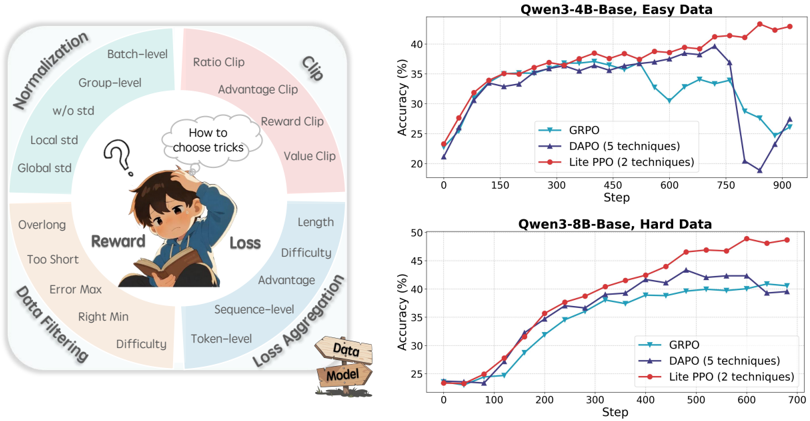
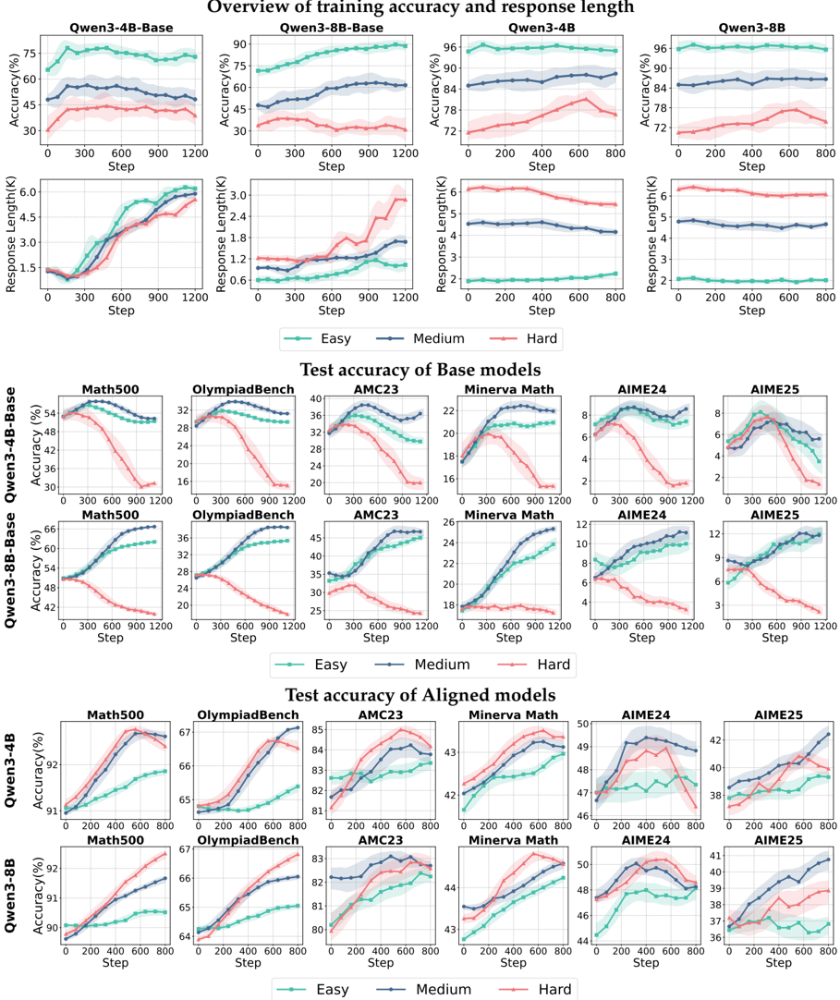

# lite_ppo — Part I: Tricks or Traps? A Deep Dive into RL for LLM Reasoning (Lite PPO)

> **一句话重点 (TL;DR)**：在同一框架(ROLL)/同一模型/同一数据下逐一隔离评估 RL4LLM 常用 trick，发现只需"优势归一化(group 均值 + batch 标准差) + token-level loss 聚合"两项极简组合(Lite PPO)即可稳定超过堆砌组件的 DAPO/GRPO——"简单胜过复杂"。

**元信息**：arXiv 2508.08221 (v3, 2025-10-27) ｜ Alibaba(ROLL/Future Life Lab) 联合 北交大、HKUST、南大、北大、Mila 等(Weixun Wang 通讯) ｜ 2025-08(v3 2025-10) ｜ 主题 T3 RL 算法/技巧实证(对选 RL 配方/规避无效组件有直接参考) ｜ 代码 **recipe in alibaba/ROLL**(论文为基于 ROLL 的系统复现，无独立方法仓库) ｜ 框架 ROLL，统一 baseline = PPO loss + REINFORCE 优势(critic-free)

## 关键图示

**① Motivation / 对比图**

*Figure 1: Left : The proliferation of RL optimization techniques, coupled with diverse initialized models and data, has raised barriers to practical adoption. Right : We establish detailed application guidelines via dissecting internal mechanisms of widely-used tricks, and introduce Lite PPO, a mini*

**② 方法 / 架构图**

*Figure 3: (Top 2 rows): Test accuracy and response length of four model variants: Qwen3-4B-Base , Qwen3-8B-Base , Qwen3-4B , and Qwen3-8B across different data difficulty. Middle 2 rows : Accuracy over training iterations of Base models. The first row presents results of Qwen3-4B-Base . The second r*

## 1. 相关工作与进展
2025 年 RL4LLM 爆发，数学/代码任务上 RL 把 LLM 推到预训练之上。但各路工作对同一问题给出**互相矛盾**结论：GRPO 主张 group-level 归一化、REINFORCE++ 主张 batch-level;GRPO 含方差归一化、Dr.GRPO 主张去掉方差;GRPO 用 response-level loss、DAPO 用 token-level loss。trick(Normalization/Clip/Overlong Filtering 等)看似正交、数量繁多。

## 2. 现有工作存在的问题

- 各类 trick 数量多、看似正交，从业者难在特定场景挑出有效组合。
- 实验设置(训练数据/初始化/规模)不一致导致结论冲突，难判断每个 trick 的真实贡献与适用范围。
- 缺乏标准化使用指南、机制理解碎片化。

## 3. Motivation
核心追问：现有技巧分别适用什么场景？是否存在简单且可泛化的组合来增强策略优化？遵循经典 RL 机制分析方法论，在**同一开源框架(ROLL)、同一策略模型、同一数据**下复现并隔离评估每个 trick，覆盖不同难度数据、不同模型规模与类型，给出明确选型指南；并验证"简单胜过复杂"。

## 4. 主要灵感 / 核心直觉
矛盾结论多源于实验条件不可比；只要控制变量、逐一消融，trick 的真实效用会显现，且大概率只有少数核心 trick(归一化、loss 聚合)真正起作用——其余多为针对特定设置的局部修补。

## 5. 主要解决思路(一段话讲清核心)
以 vanilla PPO loss + 无 critic(REINFORCE 优势)为统一 baseline，在三档难度数据、两种规模(4B/8B)、Base 与 aligned 两类模型上逐一隔离评估 Normalization/Clip/Loss 聚合/Overlong filtering;据此提炼选型指南，并把最稳健的两项(group 均值 + batch 标准差归一化、token-level loss 聚合)整合为 Lite PPO，验证其优于 GRPO/DAPO。

## 6. 方法详解(通俗、分步骤) —— Lite PPO(两技巧极简组合)
在 **vanilla PPO loss + 无 critic** 基础上仅组合两项：

1. **优势归一化：group-level 均值 + batch-level 标准差(§4.1.2)**。优势减去 group 内均值、再除以整个 batch 的标准差("混合归一化")，比纯 group-std 或纯 batch-std 都更稳健。〔已核-Takeaway②〕
2. **token-level loss 聚合(§4.3.1)**。对 base/非对齐模型尤为有效。
主要实证 Takeaways：①Group-level 归一化在各奖励设置下稳健;②group 均值 + batch 标准差最稳健、batch-std 在大规模奖励下更稳;Clip-Higher 对已对齐模型促进高质量探索，小模型上 clip 上界与性能存在"scaling law"(§4.2);token-level 聚合对 **base** 有效、对已对齐模型提升有限;Overlong filtering 对短-中长推理提升准确/清晰但对长尾收益有限、且限制小模型生成复杂长尾输出(故 Lite PPO 取消它)。

## 7. 实验数据集

- **训练数据(仅开源)**：SimpleRL-Zoo-Data、DeepMath(-103k)。按 GPT-4o 评估难度分三档各 5,000 条——Easy(SimpleRL-Zoo-Data-Easy，GSM8K/MATH-500-level1)、Medium(DeepMath-103k 最易 5000)、Hard(DeepMath-103k 按难度概率采样)。去除过多 True/False 样本以避免"假阳性"(错误推理链却得对答案)噪声。
- **评测(6 个数学集)**：MATH-500、OlympiadBench、MinervaMath、AIME24、AIME25、AMC23。
- **基座**：Qwen3-4B、Qwen3-8B，各含 Base(非对齐)与 aligned。

## 8. 实验结果与主要发现

- 统一超参：global batch 1024(rollout batch 128 × 每 prompt 8 响应)，max 响应长度 8192，lr 1e-6;生成 top_p=0.99、top_k=100、temperature=0.99。〔已核-§实验设置〕
- 训练动态：对齐模型初始准确率高、响应更长但后续仅约 +2% 提升。
- 逐一隔离评估 Normalization/Clip/Loss 聚合/Overlong filtering，分别在 Base/aligned、4B/8B 上观察。
- 最终结果：Lite PPO 在六个数学基准上稳定**超越组件繁多的 DAPO**(含 group 归一化、Clip-Higher、Overlong Reward Shaping、token-level loss、Dynamic Sampling)以及广泛使用的 **GRPO**;其他策略常在峰值后崩溃，Lite PPO 持续上升。

## 9. 结果如何支撑其主张
"简单胜过复杂"由 Lite PPO(2 项) vs DAPO(5 项)/GRPO 的稳定超越直接支撑;各 Takeaway 由对应消融图表支撑，且区分了 Base/aligned 与规模，选型指南有据。统一框架/模型/数据使 trick 归因可信，是该工作的实证强项。

## 10. 逻辑自洽性(中性评估)
方法论自洽：控制变量消融 + 统一 baseline，结论与消融一致。但"普适选型指南"的外推性受限于单一 LLM family(见局限)，"两项即够"是在 Qwen3+这些数据档位下的结论，非绝对定律——论文表述基本克制。

## 11. 残留问题 / 局限

- 为公平统一仅用 **Qwen3 系列**初始化，结论可能因 LLM family(预训练/架构差异)而变化——作者自陈。
- 训练数据仅用开源数学集、规模(每档 5000)有限，奖励均为可验证数学奖励;对代码/通用/更大规模是否成立未验证。
- Lite PPO 无独立方法仓库，只作 ROLL recipe;部分 trick 结论(如 Clip 的 scaling law)依赖小模型观察，样本面较窄。

## 12. 开源代码与框架(链接+框架+代码可得性)

- 链接：recipe in https://github.com/alibaba/ROLL。Lite PPO 作为 ROLL 框架内的 recipe 提供;论文本身是基于 ROLL 的系统性复现与实证研究，**无独立方法仓库**。〔注：lite_ppo = recipe in ROLL，paper-only〕
- 框架：所有实验在开源 RL 框架 ROLL(Alibaba LLM RL 平台)上完成;统一 baseline 采用 PPO loss + REINFORCE 优势(critic-free)。
- 可得性：方法以 recipe 形式可得，无单独 release;复现需在 ROLL 内按论文超参配置。
