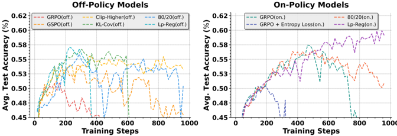
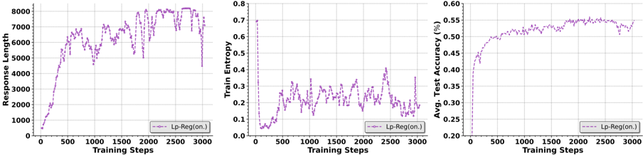

# lp_reg — Low-probability Tokens Sustain Exploration in Reinforcement Learning with Verifiable Reward (Lp-Reg)

> **一句话重点 (TL;DR)**：把低概率探索 token 称为"Reasoning Sparks"(如 wait/however/perhaps)，通过构造去噪代理分布 + 前向 KL 的三重门控正则，定向保护这些 spark 不被 GRPO 过度惩罚消除，从而对抗熵崩溃、在长训练区间持续 scaling 不崩;五数学基准均值 60.17%、较此前 +2.66%。

**元信息**：arXiv 2510.03222 (v2, 2025-11-07) ｜ 腾讯 LLM Department(Guanhua Huang、Tingqiang Xu 共一;含清华/北大/港中文实习生，Bo Zhou 通讯) ｜ 2025-10 arXiv，cs.LG ｜ 主题 RLVR 熵崩溃/探索保持(与 OPD 间接相关) ｜ 代码 主仓 https://github.com/CarlanLark/Lp-Reg(占位/README-only)；实现在 dev 仓 https://github.com/CarlanLark/Lp-Reg-dev(已克隆 ~4.6MB，verl 底座，含 recipe/lp_reg 与 recipe/dapo) ｜ 框架 verl，GRPO 基础

## 关键图示

**① Motivation / 对比图**

*Figure 4: Training dynamics on the Qwen3-14B-Base model. On-policy training exhibits better training stability and testing performance compared to off-policy training.*

**② 方法 / 架构图**

*Figure 3: Continuous scaling over 3, 000 training steps, totaling 81, 204 GPU-hours , for Lp-Reg (on-policy) on the Qwen2.5-32B-Base model.*

## 1. 相关工作与进展
RLVR 推动 LLM 复杂推理，但训练常在性能平台期崩溃，伴随策略熵快速衰减、探索丧失。已有方法多通过"维持高整体熵"应对：自适应熵正则、高熵变化阻断(Cui et al. 2025)、选择性 token 更新(Wang et al. 2025)。

## 2. 现有工作存在的问题
依赖"整体熵"是间接且不精确的工具：无差别最大化随机性会放大噪声、加速崩溃(GRPO+Entropy Loss 比 baseline 崩得更快)。真正问题在于有价值的低概率探索 token 被系统性消除——这一根因未被现有熵方法精准命中。

## 3. Motivation
作者将低概率探索 token 称为 **Reasoning Sparks**(如 "wait"、"however"、"perhaps"，常作逻辑连接/不确定性表达，开启多样推理路径)。预训练模型中这类 token 丰富，但 GRPO 因过度惩罚把它们系统性"扼杀"。目标：保护 reasoning sparks 而不放大无关噪声。

## 4. 主要灵感 / 核心直觉
关键统计观察：在低概率区间内，有意义的探索 token 的平均概率**一贯高于**无关噪声 token(例：spark "Wait" p=0.03 vs noise "cost" 更低)。这一可分性使得"先用概率阈值滤掉噪声、再保护剩余低概率 token"成为可行——区分 spark 与 noise 而非无差别提熵。

## 5. 主要解决思路(一段话讲清核心)
构造一个"去噪代理分布 π_proxy"：丢弃概率低于阈值的 token(presumed noise)、把质量重归一化到剩余 token 上，从而放大 reasoning sparks 的相对概率;再在 GRPO 目标上加一个前向 KL 正则项 D_KL(π_proxy‖π_θ)，仅对"低概率 ∩ 非噪声 ∩ 负优势"的 token 触发，定向阻止这些 spark 被消除，又不强制策略完全匹配 proxy。

## 6. 方法详解(通俗、分步骤)
Low-probability Regularization(Lp-Reg)，集成进 GRPO：

- **代理分布 π_proxy**：(1)过滤噪声——丢弃概率 < 阈值 τ 的 token(τ 可用固定值如 0.02，或 **min-p**：τ=κ·max π，主实验用 min-p、κ=0.02，自适应分布锐度);(2)概率重归一化——把丢弃 token 的质量重分配到剩余 token，得放大 spark 相对概率的"去噪"参考分布。
- **目标函数**：第一项为 GRPO 策略梯度，但**去掉裁剪下界**(避免裁掉低概率探索动作)、加一个大上界 U(数值稳定);第二项为 Lp-Reg 惩罚——仅对**同时满足三条件**的 token 触发：①π_θ 低于批内最低 ρ 分位阈值 δ_B^ρ(低概率)、②在 π_proxy 中概率>0(非噪声)、③优势 A<0(负样本)，施加**前向 KL** D_KL(π_proxy‖π_θ)。前向 KL 在 π_θ→0 而 proxy 非零时给大惩罚，定向防 token 被消除，又不强制完全匹配 proxy。〔实现以 Lp-Reg-dev 为准〕

## 7. 实验数据集

- RL 训练：Dapo-Math-17K，max 响应长度 8,192，global batch 256。
- 评测(5 个数学基准)：AIME24、AIME25、MATH-500、OlympiadBench、Minerva Math。AIME24/25 采样 16 次(temp 0.6)、其余 greedy。
- 骨干：Qwen3-14B-Base(主)、Qwen2.5-32B-Base。

## 8. 实验结果与主要发现

- verl 上 GRPO，lr=1e-6 常数无 warmup，group=8，IS 比率上界 U=10。off-policy mini-batch 32(每 rollout 8 次梯度更新)。Lp-Reg：ρ=0.5%(32B)/1%(14B)，β=1.0，min-p κ=0.02。
- 算力：14B 训约 1000 步(8000 GPU·h/32×H20)，32B 约 800 步(16000 GPU·h/64×H20);崩溃(准确率掉>10%)则早停。稳定性测试：Qwen2.5-32B 训 3000 步、81,204 GPU·h。
- 基线：GRPO、GRPO+Entropy Loss、Clip-Higher、80/20 高熵训练、KL-Cov、GSPO。
- 结果：Lp-Reg 在 Qwen3-14B-Base 五基准均值 **60.17%**，较此前方法 **+2.66%**;能在基线崩溃的长训练区间(3000 步)持续 scaling 不崩。

## 9. 结果如何支撑其主张
"保护 spark 维持探索"由长训练(3000 步)不崩 + 持续 scaling 直接支撑;"整体熵不如定向保护"由 GRPO+Entropy Loss 崩得更快的对照支撑;spark vs noise 可分性由概率统计分析支撑。论证链(观察→机制→对照)较完整。但绝对分数主张较弱——见局限。

## 10. 逻辑自洽性(中性评估)
自洽：从"整体熵"下沉到"低概率 token 的语义筛选(spark vs noise)"，用前向 KL + 三重门控做定向保护，比无差别熵 bonus 更有针对性，机制叙事与消融一致。前向 KL 的方向选择(proxy‖π_θ)与"防 token 消除"目标匹配，数学上合理。

## 11. 残留问题 / 局限

- 核心增益 **+2.66%** 属中等增量，且大量算力(8 万 GPU·h)主要用于证明"长训练不崩"而非绝对分数跃升。
- 引入多个阈值超参(τ/κ、ρ、β、U)，调参负担不小且对 14B/32B 取值不同，泛化稳健性需更多骨干验证。
- "spark vs noise"以平均概率统计区分，个例上二者可能重叠，门控误判的代价未量化;仅在数学域验证。
- 主仓为占位、需用 dev 仓复现，是工程可得性上的不便。

## 12. 开源代码与框架(链接+框架+代码可得性)

- 链接：主仓 https://github.com/CarlanLark/Lp-Reg 当前仅含 README(占位，称正整合进最新 veRL);复现代码在开发仓 https://github.com/CarlanLark/Lp-Reg-dev(已 clone ~4.6MB，verl 底座，含 `recipe/lp_reg` 与 `recipe/dapo`)。〔实际实现以 Lp-Reg-dev 为准〕
- 框架：verl(Sheng et al. 2024)，GRPO 基础。
- 可得性：dev 仓代码真实可用、可复现;主仓为占位，需自行切到 dev 仓。
