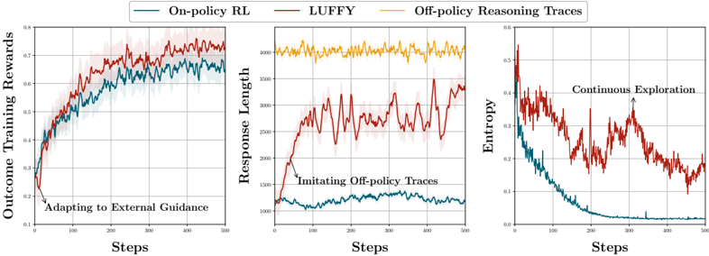
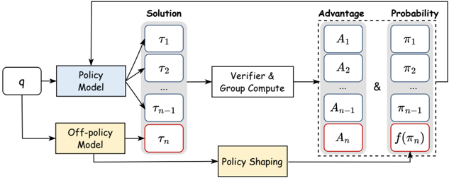

# luffy — Learning to Reason under Off-Policy Guidance (LUFFY)

> **一句话重点 (TL;DR)**：把更强策略(DeepSeek-R1)的 off-policy 推理轨迹与 on-policy rollout 混进同一 GRPO group 做组内归一化(Mixed-Policy GRPO)，再用 policy shaping f(x)=x/(x+0.1) 放大低概率关键动作的梯度、抑制熵坍塌;在弱模型/难数据上突破基座上界，六数学基准均值较此前 +6.4、三 OOD +6.2。

**元信息**：arXiv 2504.14945 (v5, 2025-06-22) ｜ 上海 AI 实验室、西湖大学、南京大学、香港中文大学(Yafu Li 等;Project Lead Yafu Li，实习期间完成) ｜ NeurIPS 2025(2025-09-19 接收) ｜ 主题 T3/T4 统一 SFT-RL / off-policy 指导的代表作(相关性 High;SRFT、Prefix-RFT 均建立其上、沿用 mix_src) ｜ 代码 https://github.com/ElliottYan/LUFFY(已克隆 ~36MB) ｜ 框架 veRL，rollout 用 vLLM

## 关键图示

**① Motivation / 对比图**

*Figure 5: Training dynamics of LUFFY compared with on-policy RL. Left : outcome training rewards; Middle : generation length; Right : generation entropy.*

**② 方法 / 架构图**

*Figure 1: Overview: LUFFY integrates off-policy reasoning traces into reinforcement learning by combining them with on-policy rollouts. Policy shaping emphasizes low-probability but crucial actions, enabling a balance between imitation and exploration for more generalizable reasoning.*

## 1. 相关工作与进展
RLVR(DeepSeek-R1、o1、Kimi-1.5)能让大推理模型涌现多步推理与自我反思("aha moment")。但 RLVR 本质 **on-policy**——只能从模型自身采样中学习，性能受基座自身能力上界约束(与 limit-of-RLVR 观察一致)。纯模仿(SFT/蒸馏)能注入外部知识但属 behavior cloning，泛化差、易过拟合、致熵坍塌。

## 2. 现有工作存在的问题
- on-policy RL 只能放大已有行为，无法引入真正新的认知能力;弱模型(如 LLaMA3.1-8B)在 RL 下很快进入平台期，因缺乏必要的基础认知行为。
- 纯模仿(SFT)是 behavior cloning，泛化差、易过拟合、熵坍塌。
- 二者之间缺乏在 imitation 与 exploration 间动态平衡的机制。

## 3. Motivation
引入来自更强策略(如 DeepSeek-R1)的 off-policy 推理轨迹作为"认知脚手架"，让模型在自身 rollout 失败时选择性模仿高质量轨迹、成功时保留自我探索，从而突破基座能力上界。

## 4. 主要灵感 / 核心直觉
把"外部强 teacher 轨迹"与"自身 rollout"放进同一 group 一起做组内 advantage 归一化——这样当自身全错(advantage 退化)时，恒为正奖励的 teacher 轨迹自然主导学习信号;当自身能解时则保留探索。再观察到 off-policy IS 比率会让"低概率但关键"动作梯度被压制、引发过快收敛/熵坍塌，故用 shaping 函数放大这些动作权重。

## 5. 主要解决思路(一段话讲清核心)
Mixed-Policy GRPO：在 GRPO 的 advantage 计算中，把 off-policy 教师轨迹(恒为正奖励)与 on-policy rollout 混入同一 group 一起做组内归一化;off-policy 项用重要性采样比、on-policy 项用标准策略梯度;并对 off-policy IS 比率施加 policy shaping f(x)=x/(x+γ)(γ=0.1)放大低概率关键动作梯度、抑制熵坍塌。

## 6. 方法详解(通俗、分步骤)
- **Mixed-Policy GRPO**：off-policy 教师 prefix 与 on-policy rollout 同 group 组内归一化。off-policy 项 IS 比率，代码 `compute_token_on_off_policy_loss`，off_ratio 仅作用于 prefix_mask;on-policy 项按 advantage 正负标准处理。
- **Policy Shaping via Regularized Importance Sampling**：论文 Eq.6/7 显式给出 **f(x)=x/(x+γ)，γ=0.1**(代码 `off_policy_reshape="p_div_p_0.1"` → `off_ratio/(off_ratio+0.1)`，train.sh 默认即此)，作用于 off-policy IS 比率，放大"低概率但关键"动作的梯度权重(f′(x)∝1/(x+γ)²)。注：论文为计算效率取 **π_old=1**，故 off_ratio=exp(log_prob)(`mix_core_alg.py` L165/186)。〔已核-Eq.6-8 + 代码〕
- **SFT loss 项**：代码 `compute_sft_pure_loss` 实为 **-log_prob 的 masked mean**(对 prefix 的纯 NLL，`mix_core_alg.py` L7-9)，经 `sft_loss_coef` 与 off_pg_loss、可选 KL loss 组合(`mix_actor.py`)。〔已核-代码确为纯 -log_prob〕
- **off-policy IS 默认不裁剪**：train.sh 仅设 `use_off_policy_loss=True` 与 `off_policy_reshape="p_div_p_0.1"`，未设 off_max_clip/off_min_clip(默认 None，与论文"对 off-policy rollout 省略 clip"一致)。〔已核〕

## 7. 实验数据集
- 训练：OpenR1-Math-220k 子集(约 64k，off-policy 教师轨迹来自 DeepSeek-R1);扩展版用 110k;NuminaMath-CoT。
- 数学评测(6 个竞赛级基准)：AIME 2024/2025、AMC、MATH-500、Minerva、OlympiadBench。
- OOD：ARC-c、GPQA-diamond、MMLU-Pro。
- 基座：Qwen2.5-Math-7B、Qwen2.5-Math-1.5B、Qwen2.5-7B-Instruct、LLaMA3.1-8B。

## 8. 实验结果与主要发现
- 基于 veRL GRPO 训练器扩展为 mixed-policy：每个 prompt 同时准备教师 off-policy 轨迹(带 prefix_mask)和模型 on-policy rollout，一起算组内 advantage;actor 更新对 on/off token 分别用上述 loss 组合并施加 policy shaping。Qwen2.5-Math-7B-Zero 设置：temperature=1.0、max_response_length=8192、vLLM rollout;rollout batch 128、update batch 64。
- 结果(Qwen2.5-Math-7B，Table 1)：6 数学基准平均 **50.1**，较此前 RLVR(如 Oat-Zero 数学均值 43.7)**+6.4**;3 OOD 基准(ARC-c/GPQA-diamond/MMLU-Pro)平均 **57.8**，较此前最佳 **+6.2**;在 on-policy RL 完全失败的弱模型/难数据场景仍可训练成功。〔已核-Table 1〕

## 9. 结果如何支撑其主张
"突破基座上界"由弱模型/难数据上 on-policy 失败而 LUFFY 成功直接支撑;"imitation+exploration 平衡优于纯 SFT/纯 RL"由 +6.4 数学/+6.2 OOD 的对照支撑;OOD 增益佐证非过拟合模仿。policy shaping 的抑熵坍塌作用有 Fig.2 与方差分析支撑。证据与主张吻合。

## 10. 逻辑自洽性(中性评估)
自洽：混入同 group 归一化使 teacher 轨迹在自身失败时主导信号、成功时退居次位，机制与"动态平衡"叙事一致;f(x)=x/(x+0.1) 的 f′∝1/(x+γ)² 确实在 x→0 处放大梯度，与"保护低概率关键动作"目标一致;代码(off_ratio、SFT=-log_prob、不裁剪)与论文公式逐一对应。论文 Theorem 1 给出 importance-weighted 梯度的收敛/方差分析，理论自洽性较强。

## 11. 残留问题 / 局限
- 依赖高质量外部 teacher(DeepSeek-R1)轨迹，能力上界实质由 teacher 决定——这是"突破基座"的代价，与"RL 自主发现新能力"不同(更接近引导式蒸馏+RL 混合)。
- off-policy 取 π_old=1 是计算简化，可能引入偏差;γ=0.1 等超参的敏感性见 Appendix E.4，跨基座稳健性主要在数学域验证。
- 主要在数学+少数 OOD 验证;teacher 轨迹质量/覆盖对结果的影响未做系统消融。

## 12. 开源代码与框架(链接+框架+代码可得性)
- 链接：https://github.com/ElliottYan/LUFFY(CloneTier=A，已克隆 ~36MB)。核心改动在 `luffy/verl/verl/mix_src`(mix_actor.py / mix_core_alg.py / mix_trainer.py / mix_vllm_rollout.py 等);仓库还内含后续工作 `ExGRPO`(ICLR 2026，用模型自身 off-policy 经验回放，无需外部指导)。模型权重 HF `Elliott/LUFFY-Qwen-Math-7B-Zero` 等。
- 框架：veRL(volcengine/verl)为底座，rollout 用 vLLM;数据/脚本沿用 deepscaler(rllm);其他 off-policy baseline 的 SFT 走 OpenRLHF;评测用 Math-Verify。
- 可得性：完整、真实、可复现，方法实现与论文公式逐项可核。
