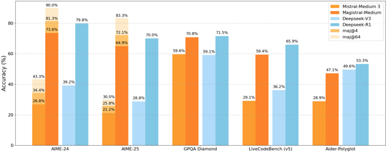
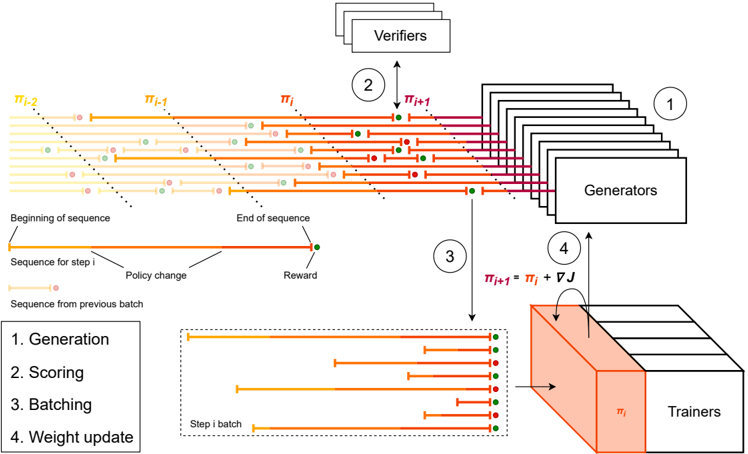

# magistral — Magistral（Mistral 首个推理模型与自建可扩展 RLVR 流水线）

> **一句话重点 (TL;DR)**：Mistral 自底向上、不依赖任何蒸馏轨迹，纯 RL(改造版 GRPO + 四维奖励整形)把 Mistral Medium 3 训成推理模型 Magistral Medium(AIME-24 pass@1 +近 50%)；并给出强制推理语言一致、纯文本 RL 不损甚至提升多模态/指令/函数调用的实证与失败实验。

**元信息**：arXiv 2506.10910 (v1, 2025-06-12) ｜ Mistral AI ｜ 2025-06 技术报告 ｜ 主题 T3/T4(RL 算法+推理) ｜ 代码 仅开源 Magistral Small (24B, Apache 2.0) 权重，无训练代码（weights-only，paper-only）｜ 框架 custom(自研异步在线 RL 系统)

## 关键图示

**① Motivation / 对比图**

*Figure 1: Performance of Magistral Medium on common reasoning benchmarks. We highlight the strength of our proposed RLVR framework, which yields a 50% increase in AIME-24 (pass@1) over the initial Mistral Medium 3 checkpoint, without any cold-start reasoning traces . We compare against analogous res*

**② 方法 / 架构图**

*Figure 3: Online training pipeline. 1) Generators continuously output completions to prompts from input data sources. 2) Whenever a completion is finished, it is sent to the appropriate verifier. 3) Each sequence is sent to a different data parallel group using a pre-set permutation until every data*

## 1. 相关工作与进展
提升 LLM 推理是前沿方向；o1 等推理模型靠更长 CoT 提升复杂任务表现。DeepSeek-R1 给出了 RLVR(可验证奖励 RL)大规模造推理模型的关键配方。Magistral 建立在 GRPO(Shao et al. 2024，去 critic、用组内平均奖励作 baseline)之上，并吸收 DAPO/Dr.GRPO 等近期对 GRPO 的改造(Clip-Higher、loss/advantage 归一)。分布式在线 RL 架构借鉴 IMPALA 与近期 trainer-generator-verifier 三角系统(OpenRLHF、verl 等)。

## 2. 现有工作存在的问题

- 多数推理模型依赖从已有推理模型蒸馏的 RL 轨迹/冷启动；缺乏完全自底向上、仅靠自有模型与基础设施的纯 RL 实践记录。
- 标准 GRPO 在长程推理 RL 中存在 KL 开销(需维护参考模型)、组内长度偏置、熵坍缩、无效(全对/全错)组等问题。
- 数学/代码 RL 常导致响应语言混杂(英/中/俄混用)，体验差。
- "小模型上 RL 能否超过蒸馏 SFT 基线""文本 RL 是否损害多模态/指令/函数调用能力"等问题文献结论不一(DeepSeek-R1 称小模型纯 RL 不及蒸馏)。

## 3. Motivation
自底向上构建可扩展 RL 栈，探索 LLM 纯 RL(无蒸馏冷启动)的极限；提出简单方法强制模型推理语言与用户一致；验证仅用文本数据 RL 能保持(甚至提升)多模态理解、指令遵循、函数调用；并诚实分享失败实验。两个核心问题：(i) 大 base 上纯 RL 能走多远？(ii) 给定强教师，如何训出最强轻量学生？

## 4. 主要灵感 / 核心直觉
在线策略本就大幅偏离参考，维护参考模型算 KL 不值 → 直接移除 KL。Clip-Higher 给低概率 token 增长空间以抗熵坍缩、促探索。强制 (problem, thoughts, answer) 三段语言一致即可消 code-switching。系统层面：generator 是在线 RL 独有且最重的负载，异步、不打断地频繁更新 generator(NCCL GPU→GPU 广播，单次更新 <5s)可在效率与 on-policy 性间取平衡(in-flight 序列不刷新 KV-cache，靠 loss 的 off-policy 修正容忍轻微过时)。

## 5. 主要解决思路(一段话讲清核心)
以 GRPO 为基座做多项稳定性改造(去 KL、按组总长归一 loss、advantage = r−μ 再做 minibatch 归一、Clip-Higher 调高 ε_high=0.26–0.28、过滤零优势组)，配四维奖励整形(格式/正确性/长度惩罚/语言一致)，在自研异步在线 RL 系统(trainer/generator/verifier 三类 worker)上大规模训练；数据经两阶段难度过滤取"goldilocks"难度。Magistral Medium 在 Mistral Medium 3 上纯 RL；Magistral Small 用 Medium 生成的 traces 做 SFT 冷启动后再 RL。

## 6. 方法详解(通俗、分步骤)

- **算法(改造 GRPO，最终式见论文红字)**：(1) 去 KL 惩罚；(2) loss 归一——组内所有 token/生成累加后除以组内总长 Σ|o_i|，消长度偏置；(3) advantage Â=r−μ，再在 minibatch 内按序列归一 Â^norm=(Â−Â_mean)/Â_std；(4) Clip-Higher——用 clip(·,1−ε_low,1+ε_high)，调高 ε_high 给低概率 token 空间(训练中 0.26–0.28 细调稳组熵；Small RL 用 0.3)；(5) 剔除全对/全错(零优势)组(约束 ∃ r_m≠r_n)。
- **奖励整形(四维)**：格式——须恰含一对 <think></think>，数学答案放 \boxed{}、代码须带语言标注 markdown 块；不满足→reward=0 不评分，满足→0.1 进评分。正确性——数学用多 parser+SymPy 归一对比，正确 +0.9(总 1.0)；代码(C++ 用 C++20、预编译 bits/stdc++.h、10s 编译、随机 20 测试、每测 4s/300MB)全通过 +0.9。长度惩罚——软惩罚(式 1，l_max/l_cache 两阈值，最多 −0.1)。语言一致——译 10% 英文题为法/西/意/德/中/俄，用 fastText 判 (problem,thoughts,answer) 三段(去 LaTeX/代码后)是否同语言，一致 +0.1。System prompt 指定格式与语言("Be as casual and as long as you want"提熵促探索)。
- **基础设施**：三类 worker；异步生成不打断、NCCL 广播权重；batch 按完成数(非 token 数)定义；贪心拼包减 19% padding。
- **数据(§4)**：数学 700k→格式过滤 501k→两阶段难度过滤 38k(先 Mistral Large 2 每题采 16 解去过易/不可解，训一个 24B RL 打分模型，再用它重判全量、并剔除"多数样本一致但与 ground-truth 不符"的疑似错标)；代码多源汇集，执行所有解过滤一致性不足/修正/生成测试，按需复制 Python/C++ 两版，得 35k。
- **训练分阶段**：Medium 纯 RL 多阶段(逐步加难、l_max−l_cache 16k→24k→32k、batch 8k→4k→2k 控 KV-cache)；Small 先 SFT 冷启动(Medium traces + OpenThoughts/OpenR1 提示，含 10% 通用指令保非推理能力，Mistral Small 3 训 4 epoch 按 AIME24 选 ckpt)，再 RL(batch 2048、l_max−l_cache 32k、temp 1.0、ε_high 0.3)。

## 7. 实验数据集

- **训练**：数学 38k(过滤后)，代码 35k(均可验证)。
- **评测**：数学 AIME'24/'25、MATH-500；代码 LiveCodeBench v5/v6、Aider Polyglot；STEM GPQA；Humanity's Last Exam(文本子集 2500 题)；多语言 AIME'24(法/西/德/意/俄/中)；多模态 MathVista/MMMU/MMMU-Pro；函数调用(内部 bench)、指令遵循(内部 IFEval)。评测 temp=0.7，数学/GPQA top-p=1.0、代码 0.95，max len AIME/LCB 40k 其余 32k。

## 8. 实验结果与主要发现

- **Magistral Medium 纯 RL**(表 2)：AIME'24 pass@1 26.8→73.6(maj@64 90.0)，AIME'25 21.2→64.9，MATH-500 91.0→94.3，GPQA 59.6→70.8，LiveCodeBench v5 29.1→59.4，v6 30.0→50.3，HLE 4.4→9.0。即 AIME'24 pass@1 提升近 50%。
- **小模型纯 RL 可超蒸馏**(§6.2，与 DeepSeek-R1 结论相反)：Mistral Small 3 纯 RL 在 AIME'24 ≈ 蒸馏版，MATH/GPQA 还更高，仅代码略低；SFT+RL(=Magistral Small) 最佳(表 3：AIME'24 pass@1 SFT 65.4 / RL-only 65.8 / SFT+RL 70.7)。
- **跨域泛化**(§6.1)：math-only RL 也提 LCB(+15.6)，code-only RL 也提 AIME(+17.5)。
- **多模态免费午餐**(§7.2)：纯文本 RL 不损反提多模态推理(MMMU +5%→70%、MMMU-Pro-Std +4.4%、MMMU-Pro-Vision +12%)。
- **其他能力**(§7.3)：函数调用 87.2→87.4、IFEval 86.8→87.4，基本不降甚至小升。
- **多语言**(表 4)：多语言 AIME'24 比英文低 4.3–9.9%(约 1–3 题)，与 base 退化相当。
- **权重轨迹**(§7.1)：RL 在低维空间移动权重，存在明显"length 方向"，raw reward 随输出长度对数 scaling。
- **失败实验**(§7.4)：代码按测试通过率给比例奖励→训练更快但 LCB 终值低 2%、长度增长慢；entropy bonus 不稳(math-only 熵降、math+code 熵爆)，改用调 ε_high 更稳；KL 项主要妨碍训练。
- **§8**：先在 OSS 推理 traces(OpenThoughts+OpenR1，约 1.3M 生成，含 R1 traces)SFT 再 RL，可达与 R1 相当(但 Magistral Medium 未走此路线)。

## 9. 结果如何支撑其主张
表 2 与 DeepSeek RL-from-scratch 数据对齐比较，直接支撑"自建 RL 栈纯 RL 有效"；表 3/图 5 三范式(SFT/RL-only/SFT+RL)对照支撑"小模型纯 RL 可比蒸馏、且 RL 叠加蒸馏更好"这一与 R1 相反的主张；跨域(表 5)、多模态(图 10)、函数/指令(表 6)分别支撑泛化与"文本 RL 不损其他能力"；多语言(表 4)支撑语言一致奖励有效；PCA(§7.1)与失败实验(§7.4)增强透明度与因果解释(length 是主要增益资源、ε_high 优于 entropy bonus)。

## 10. 逻辑自洽性(中性评估)
报告型论文，工程细节充分、消融到位、罕见地公开失败实验，自洽性较强。需注意：(1) 多项关键评测(函数调用 internal bench、IFEval internal 版)为内部基准，"分数与公开不可比"，外部不可复现；(2) 与 DeepSeek-R1 的对照是引用其论文数据点而非同条件复跑，base 模型/数据不同，"小模型纯 RL 超蒸馏"的对比并非严格 apples-to-apples；(3) 无训练代码与数据开源，所有结论仅能 paper-only 信任；(4) "AIME'24 +50%"是相对初始 checkpoint 的相对提升表述，绝对值见表 2。

## 11. 残留问题 / 局限

- **不可复现**：自建 RLVR 流水线完全未开源，仅放 Magistral Small 权重(Apache 2.0)，Medium 不开源；数据(38k 数学/35k 代码)也未公开。
- **内部基准**：函数调用/指令遵循用内部 bench，无法横向对比。
- **多语言推理有代价**：约束推理语言使多语言 AIME 低 4.3–9.9%，作者归因于语言约束。
- **GPQA 在 RL 后回退**(§8 OSS-traces 实验)：72.9%→71.0%，提示 RL 对某些能力可能小幅负迁移。
- **方法依赖经验调参**：ε_high 需在 0.26–0.30 间细调稳熵；entropy bonus 在不同数据集行为相反、不稳；这些"靠手调"的稳定性手段泛化性存疑。
- **范围**：限于可验证(数学数值/代码测试)任务，未及开放式/agentic；length 作为主要增益资源也意味着推理成本随之上升。

## 12. 开源代码与框架(链接+框架+代码可得性)

- **仅开源权重**：Magistral Small (24B, Apache 2.0) https://huggingface.co/mistralai/Magistral-Small-2506 ；Magistral Medium 不开源。
- **无训练代码仓库**：自建可扩展 RLVR 流水线(改造 GRPO + 四维奖励 + 异步在线 RL 系统：trainer/generator/verifier 三类 worker，NCCL 权重广播)完全未开源。
- **框架 = custom**：不依赖现成 RL 实现或前人蒸馏轨迹，完全基于自有模型与基础设施。**weights-only / paper-only**——本分析基于论文(2506.10910)，无仓库可核码。

〔核实结论〕原分析与论文一致，本轮按论文补全：表 2/表 3 具体数值、§6.1 跨域、§6.2 小模型纯 RL vs 蒸馏、§7 PCA/多模态/函数调用、§7.4 两项失败实验、§8 OSS-traces+RL 达 R1 水平且 GPQA 回退、数据过滤 700k→501k→38k 与代码 35k、多语言退化幅度。无新事实出入(weights-only，无代码可核)。
