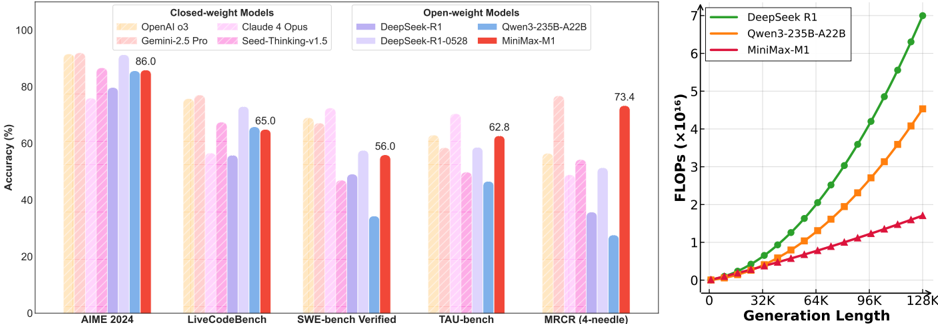
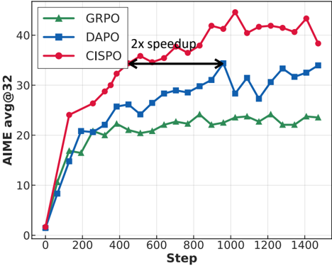

# minimax_m1 — MiniMax-M1: Scaling Test-Time Compute Efficiently with Lightning Attention

> **一句话重点 (TL;DR)**：首个开源权重的大规模混合注意力(MoE+lightning attention)推理模型，原生支持 1M 上下文、长生成 FLOPs 仅 DeepSeek-R1 的约 25%；核心算法创新 CISPO——裁剪重要性采样权重而非裁剪 token 更新，保留全部 token(尤其反思类低概率 token)的梯度，对 DAPO 实现 2× 加速。

**元信息**：arXiv 2506.13585 (v1, 2025-06-16) ｜ MiniMax (MiniMax-AI) ｜ 2025-06 技术报告 ｜ 主题 T3/T4(reasoning-RL 算法 CISPO + 长上下文推理后训练)/High ｜ 代码 https://github.com/MiniMax-AI/MiniMax-M1（model-release/权重仓，**CISPO 训练代码不在仓内**，本地未 clone，Tier B paper-only）｜ 框架 自研 RL(借 lightning attention 高效 rollout)，推理支持 vLLM/Transformers

## 关键图示

**① Motivation / 对比图**

*Figure 1 | Left : Benchmark performance comparison of leading commercial and open-weight models across competition-level mathematics, coding, software engineering, agentic tool use, and longcontext understanding tasks. We use the MiniMax-M1-80k model here for MiniMax-M1. Right : Theoretical inferenc*

**② 方法 / 架构图**

*Figure 2 | Comparison of GRPO, DAPO, and our proposed CISPO on AIME 2024, based on Qwen2.532B-base. CISPO outperforms both GRPO and DAPO in terms of performance at the same number of training steps, and achieves comparable performance to DAPO using 50% of the training steps.*

## 1. 相关工作与进展
大推理模型(o1、DeepSeek-R1)靠大规模 RL 延长推理链取得成功，test-time compute 成为新 scaling 维度。但传统 softmax 注意力二次复杂度限制了推理链持续延长。学界提出稀疏注意力、线性注意力、状态空间模型、线性 RNN 等高效替代，但几乎未在大规模推理模型上充分验证(例外 Hunyuan-T1 用 Mamba，但未开源、细节少)。RL 算法侧 PPO→GRPO(去 critic、组相对 advantage)→DAPO(提高上裁剪界、dynamic sampling、length penalty)是主线。

## 2. 现有工作存在的问题
- 大规模 RL 训练中 PPO/GRPO/DAPO 的**裁剪丢弃大更新 token 的梯度**：反思类 token(However/Recheck/Wait/Aha，常是推理"分叉点")在 base 模型下概率低，更新时 r_{i,t} 高，首次 on-policy 更新后即被裁掉，无法参与后续 off-policy 梯度；在 16 轮 off-policy 更新/批 的设置下尤甚，而这些 token 对稳熵/可扩展 RL 关键。DAPO 的提高上界做法在此设置下不够有效。
- 混合注意力架构下 RL scaling 出现**训练/推理 kernel 精度不匹配**，导致 reward 无法增长。
- 长生成 RL 中负样本长度增长快于正样本，序列后段累积过大负梯度→pattern collapse(后段退化为乱码)。

## 3. Motivation
构建并开源一个能高效 scale test-time compute、与 SOTA 推理模型竞争的大推理模型；提出不丢弃 token(即便大更新)同时维持合理熵的 RL 算法(CISPO)，并利用 lightning attention 天然高效 rollout 高效 scale RL；统一连续预训练→SFT cold-start→大规模 RL 的推理后训练管线。

## 4. 主要灵感 / 核心直觉
PPO 的 IS 权重本是为 off-policy 修正，裁掉 token 更新会连带丢掉该 token 的梯度贡献；改为**只裁 IS 权重、保留 log π 梯度项**即可既稳训练又不丢任何 token(尤其长响应中的低概率反思 token)。训练-推理概率本应相同，偏差源于 LM head 高幅激活 → 提升其精度到 FP32 即可对齐。

## 5. 主要解决思路(一段话讲清核心)
从带 offline 修正的 REINFORCE 目标出发，CISPO(Clipped IS-weight Policy Optimization)沿用 GRPO 的组相对 advantage 与 token-level loss，但对 IS 权重 r̂_{i,t}=clip(r_{i,t},1−ε^IS_low,1+ε^IS_high) 做裁剪(实验中不设下界、只调 ε^IS_high)，无 KL 项；梯度因权重裁剪略有偏差但保留全部 token 梯度。再给统一公式(引入 token-wise mask M_{i,t}，可表示 PPO 信任域隐式 mask 等不同裁剪策略)。配合连续预训练(7.5T)、SFT cold-start、curriculum RL(先规则可验证、渐混入模型奖励通用任务)，并解决混合架构特有工程问题(FP32 LM head、AdamW 超参、重复检测早停)。

## 6. 方法详解(通俗、分步骤)
1. **连续预训练**(§2.1)：在 MiniMax-Text-01(456B 总参、单 token 激活 45.9B、32 experts；每 7 个 lightning-attention transnormer 块后跟 1 个 softmax 块)上续训 7.5T tokens(STEM/code/book/reasoning 占 70%，避合成数据、语义去重)；lr 8e-5 训 2.5T 再衰减到 8e-6 over 5T；长上下文分四阶段从 32K 扩到 1M(避免梯度爆炸)。
2. **SFT cold-start**(§2.2)：注入反思式长 CoT，math+code 约 60%。
3. **CISPO**(§3.1，式 4–5)：裁 IS 权重而非 token 更新；用 dynamic sampling + length penalty；无 KL。
4. **混合架构工程**(§3.2)：(a) 训练/推理精度失配 → LM head 提到 FP32，相关性约 0.9→0.987(后续训练稳定在 0.997)；(b) AdamW 用 β1=0.9, β2=0.95, eps=1e-15(梯度幅度跨 1e-18~1e-5、多数 <1e-14，相邻迭代相关弱)；(c) 重复检测早停：连续 3000 token 概率 >0.99 即截断。
5. **数据/奖励**(§4)：规则可验证——数学 pass@10∈(0,0.9) 筛得近 50K(与 SFT 严格不重叠、n-gram+embedding 去污染)、逻辑 SynLogic 合成 41 类约 53K、竞赛编程 30K、SE 基于 SWE-bench 沙箱执行型奖励数千；模型奖励通用任务 25K(有 GT 的用 GenRM 五级打分；无 GT 的用 pairwise −1/0/1 比对参考答案)。
6. **GenRM 长度偏置**(§4.2.2)：GenRM 偏好长输出诱发 reward hacking；离线手段不足 → 在线监控长度偏置、触发即重校准 GenRM，配 reward shaping/value clipping/normalization。
7. **curriculum**(§4.3)：先规则可验证任务、渐混入通用任务，防灾难性遗忘。
8. **延长思考**(§5)：40K→48K→56K→64K→72K→80K 分阶段扩窗(看 perplexity 收敛与 99 分位长度判定);后期 pattern collapse 根因是负样本更快触顶累积大负梯度，三招解决——重复检测早停、sample-level + token-level 归一缓解正负失衡、降梯度裁剪阈值与 ε^IS_high。
9. **资源**：完整 RL run 512×H800、约 3 周、约 $0.53M。

## 7. 实验数据集
- **训练**：连续预训练 7.5T；RL 数据近 50K 数学 + 53K 逻辑 + 30K 竞赛编程 + 数千 SE + 25K 通用(curriculum 组织)。
- **评测**(temp 1.0, top-p 0.95)：数学 MATH-500/AIME 2024/2025(AIME 采 32 取均)；编程 LiveCodeBench/FullStackBench(16 采均)；推理知识 GPQA-Diamond(32 采)/MMLU-Pro/HLE(无工具)；SWE-bench Verified；agentic TAU-Bench；长上下文 MRCR 等。

## 8. 实验结果与主要发现
- **CISPO 受控对比**(图 2，Qwen2.5-32B-base zero-RL，AIME 2024)：同步数显著超 DAPO/GRPO，用 50% 步数即达 DAPO 水平(对 DAPO 2× 加速)。
- **核心基准**(表 2，M1-80k)：AIME 2024 86.0、AIME 2025 76.9、MATH-500 96.8、LiveCodeBench 65.0、FullStackBench 68.3、GPQA-Diamond 70.0。
- **定位**：整体超原 DeepSeek-R1 与 Qwen3-235B；对最新 DeepSeek-R1-0528，数学/编程竞赛落后，但工具使用/长上下文相当或更优；TAU-Bench 超 Gemini 2.5 Pro，长上下文超 o3 与 Claude 4 Opus。
- **test-time scaling**：M1-80k > M1-40k(数学/代码)，验证延长思考收益。
- **效率**：100K 生成长度 FLOPs 仅 DeepSeek-R1 约 25%；原生 1M 上下文(R1 的 8 倍)。
- **工程发现**：FP32 LM head 使训练-推理概率相关性 0.9→0.987(关键，否则 reward 不增长)。

## 9. 结果如何支撑其主张
图 2 的 zero-RL 受控对比(同 backbone/数据/步数)直接支撑"CISPO 比 DAPO/GRPO 更高效"这一算法主张(2× 加速、用全 token 梯度);表 2 横向对标多个开/闭权模型支撑"开源权重 SOTA 推理"主张,且在 agentic/长上下文上的相对优势与"lightning attention 高效长生成"的架构卖点一致;图 3 训练-推理概率相关性前后对比支撑 FP32 修复的因果性;M1-80k vs 40k 支撑 test-time scaling。

## 10. 逻辑自洽性(中性评估)
算法动机(token clipping 丢反思 token)→CISPO(裁 IS 权重)→统一 mask 公式→受控验证,逻辑链清晰;工程问题(精度失配/优化器/重复/pattern collapse)均给出根因+解法,自洽性较强。需注意:(1) CISPO 的核心比较(图 2)在 Qwen2.5-32B 而非 M1 本体上做,M1 全量训练并无 CISPO-vs-DAPO 的同条件消融,"2× 加速"结论的外推到 456B 混合架构属间接证据;(2) GenRM/通用任务奖励高度依赖内部 GenRM 与人标基准,长度偏置靠"在线监控+重校准"这类经验闭环处理,难以复现/量化;(3) 多个核心创新(CISPO 代码、GenRM、沙箱、数据)均未开源,paper-only 信任;(4) 部分基准(HLE 等)带 ∗ 标注(自测/口径差异),横向比较需谨慎。

## 11. 残留问题 / 局限
- **核心算法不可复现**:CISPO 训练实现、GenRM、SE 沙箱、RL 数据均未开源;公开仓为权重/推理仓。
- **CISPO 的 M1 本体证据间接**:主算法对比在 32B dense 上,缺 M1(456B 混合)上的同条件消融。
- **数学/编程竞赛落后最新 R1**:相对 DeepSeek-R1-0528 在 AIME/LiveCodeBench 上落后,优势集中在工具/长上下文。
- **CISPO 梯度有偏**:权重裁剪引入偏差(作者承认),长期/不同设置下的影响未充分刻画。
- **混合架构脆弱性**:精度失配、优化器超参、长生成 pattern collapse 等问题需大量针对性补丁,泛化到其他架构/规模未知;合成推理数据会破坏长上下文 RL 稳定性(被下采样)。
- **GenRM 长度偏置/reward hacking** 是反复出现的隐患,靠在线监控缓解而非根治。
- **成本高**:512×H800×3 周(~$0.53M),门槛极高。

## 12. 开源代码与框架(链接+框架+代码可得性)
- 仓库 https://github.com/MiniMax-AI/MiniMax-M1 ;权重在 HuggingFace。支持 vLLM / Transformers 推理,有部署指南;另有商用 API(minimax.io)。
- **该仓为模型发布/权重仓;CISPO 训练代码、GenRM、SE 沙箱、RL 数据均不在仓内**。本地未 clone(CloneTier=B,仅记录)。
- **框架 = 自研 RL**(借 lightning attention 高效 rollout);注:论文提到 VeRL 默认 AdamW 配置会导致不收敛(故改 β2=0.95, eps=1e-15),说明其设置与 verl 相关但训练实现未公开。**model-release / paper-only**——CISPO 不在 repo,本分析基于论文(2506.13585)。

〔核实结论〕原分析与论文一致(CISPO 裁 IS 权重、无 KL、统一 mask 公式、FP32 LM head 0.9→0.987、数据规模近 50K/53K/30K/25K、512×H800×3 周×$0.53M、2× DAPO 加速 均核对无误);本轮按论文补全:表 2 核心基准数值、§4.2.2 GenRM 长度偏置在线监控、§5 长思考分阶段扩窗与 pattern collapse 三招、AdamW/重复检测早停细节、与 R1-0528 的相对定位。无新事实出入(CISPO 不在 repo,无代码可核)。
