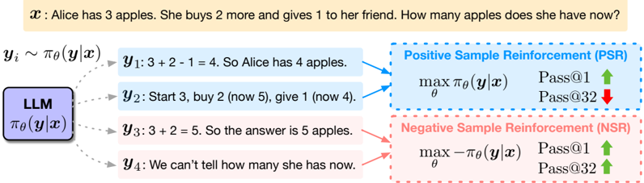
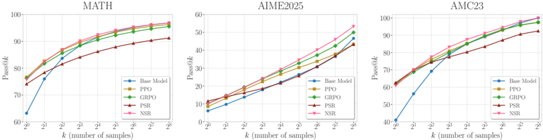

# negative_reinforce — The Surprising Effectiveness of Negative Reinforcement in LLM Reasoning

> **一句话重点 (TL;DR)**：把 RLVR 的二元学习信号拆成"奖励正确(PSR)/惩罚错误(NSR)"两条独立范式，发现仅惩罚错误的 NSR 在整个 Pass@k 谱(k 到 256)上一致超过 base、常追平甚至超过 PPO/GRPO；据此提出把正奖励下调权重 λ=0.1 的 W-REINFORCE。结论高度依赖强先验 backbone(Qwen)。

**元信息**：arXiv 2506.01347 (v2, 2025-10-25) ｜ University of Virginia / Princeton Language and Intelligence (PLI)；Xinyu Zhu、Mengzhou Xia、Zhepei Wei、Wei-Lin Chen、Danqi Chen、Yu Meng ｜ NeurIPS 2025 ｜ 主题 T3(RLVR 机理+算法变体)/相关性 High ｜ 代码 https://github.com/TianHongZXY/RLVR-Decomposed（本地已 clone，~15MB，Tier A）｜ 框架 veRL(vendored)

## 关键图示

**① Motivation / 对比图**

*Figure 1: Decomposing learning signals in RLVR into positive and negative reward components. Positive Sample Reinforcement (PSR) increases the likelihood of correct responses and improves Pass@1, but reduces output diversity and hurts Pass@ k for large k . Negative Sample Reinforcement (NSR) discour*

**② 方法 / 架构图**

*Figure 2: Pass@ k curves of Qwen2.5-Math-7B trained with PPO, GRPO, PSR, and NSR. NSR is comparable to other methods across different k values and outperforms them at k = 256 .*

## 1. 相关工作与进展
RLVR(可验证奖励强化学习)已成为提升 LLM 推理的关键技术：用确定性验证函数给二元奖励(+1/−1)，既缓解 reward hacking 又免去人工标注与奖励模型；DeepSeek-R1、Kimi K1.5 证明其可诱发长 CoT 与自反思等涌现推理行为。inference-time scaling 方向另起一支：通过多候选采样或更长推理 trace 提升命中率，并用 Pass@k 而非 Pass@1/贪心衡量模型能力边界。近期工作(如 Yue et al. [72])质疑"RL 训练模型是否真比 base 更强"，发现 RLVR 主要把分布推向高奖励响应而非引入新能力，在大 k 处反不如 base。

## 2. 现有工作存在的问题
RLVR 同时用正确与错误样本经 policy gradient 更新，但其精确机理(尤其如何分别利用正确/错误样本)被低估、研究不足；多数工作只看 Pass@1 或贪心解码，忽视模型行为(inference-scaling/Pass@k 多样性)层面的变化。正负信号在标准 RLVR 中纠缠在一起，难以解释模型到底从成功还是失败中学到什么。

## 3. Motivation
把 RLVR 学习信号拆成两条独立、可隔离分析的范式——只奖励正确样本(PSR)与只惩罚错误样本(NSR)，回答"PSR/NSR 各自如何塑造模型行为与泛化"，并据此设计更好平衡精度与多样性的目标。

## 4. 主要灵感 / 核心直觉
RLVR 的二元奖励使奖励符号天然绑定到序列正确性(同一序列所有 token 同奖励，batch 均值始终落在 [−1,1]，归一化后保号)，因此可干净地按符号拆成 PSR/NSR(§C 论证这点是 RLVR 区别于带奖励模型 RL 的关键)。直觉：惩罚错误时按"其他 token 当前概率"成比例地把概率质量重分配回去，等于按模型先验做软重排，既纠错又保留探索性。

## 5. 主要解决思路(一段话讲清核心)
将 RLVR 目标 L = L_PSR + L_NSR 形式化分解(式 2–4)：PSR 像 SFT，提升正确响应似然；NSR 像 likelihood minimization，压低错误响应概率。分别独立训练后用全 Pass@k 谱评测，发现 NSR 单独训练异常有效；再用 token 级梯度分析解释机理；最后提出 W-REINFORCE——在 REINFORCE 目标上把正奖励贡献按 λ 缩小(λ=1 即 REINFORCE，推荐 λ=0.1)，在 PSR 的高 Pass@1 与 NSR 的高多样性之间取得平衡。

## 6. 方法详解(通俗、分步骤)

- **分解**：L_PSR 只在 r=+1 样本上更新(增大正确似然)，L_NSR 只在 r=−1 样本上更新(减小错误似然)；二者均 on-policy(响应采自当前模型)。
- **梯度分析(式 7/8)**：对 token logit 求导。PSR 抬高被采样(正确)token logit、压低其余 → 持续 sharpening，熵下降、过拟合。NSR 压低被采样(错误)token、按其余 token 当前概率 π_v 成比例抬高它们的 logit；且被采样 token 的负梯度被 (1−π_yt) 缩放 → 对高置信 token 更新很小，从而(1)保护高置信先验、(2)按先验做概率重分配促探索、(3)一旦不再犯错即自动停止更新(隐式正则)。
- **与熵正则/unlikelihood 对比(§B)**：熵正则会无差别压高概率 token、抬低概率 token，可能违背先验；unlikelihood 用 −log(1−π) 惩罚，缺少 (1−π_v) 阻尼会侵蚀先验；NSR 因阻尼项更温和。
- **W-REINFORCE(式 9)**：L = λ·L_PSR + L_NSR，λ=0.1。

## 7. 实验数据集

- **训练**：MATH(7,500 题)。
- **评测**：MATH、AIME 2025、AMC23 的测试集，报告完整 Pass@k 谱(用 [5] 的无偏估计量)。Qwen2.5-Math-7B/Llama 采 256 样本(temp 0.6, top-p 0.95)，Qwen3-4B 采 64 样本(temp 0.7, top-p 0.8, top-k 20)。
- **模型**：Qwen2.5-Math-7B、Qwen3-4B(非思考模式训练/推理)、Llama-3.1-8B-Instruct。

## 8. 实验结果与主要发现

- **NSR 单独训练出人意料地有效**：全 Pass@k 谱一致优于 base；在 Qwen2.5-Math-7B 上 k=256 处超过 PPO/GRPO/PSR。表 1(MATH)：base Pass@1=63.2，NSR=75.7，PPO=76.6，GRPO=76.3；但 k=256 处 NSR=96.9(=base)、PPO=96.3、GRPO=95.5。AIME2025 k=256：NSR=53.3 vs PPO 43.3/GRPO 50.0；W-REINFORCE=56.7(最佳)。
- **PSR 提精度损多样性**：Pass@1 上升快但 k>8 后跌破 base，熵急剧下降、过拟合。
- **Qwen3-4B 非思考模式**：PSR 无法激活潜在(思考模式)能力甚至损 MATH/AMC23；NSR/GRPO 能逼近思考模式(NSR Pass@1=94.0/Pass@64=98.0 ≈ 思考模式 94.5/97.8)。
- **Llama 上 RL 普遍损 inference-scaling**：所有方法 Pass@256 都跌破 base，NSR 损失最小 → backbone 先验强弱决定 RL 能否获益。
- **训练动态(图 5)**：NSR 全程维持接近 base 的高熵；PSR 熵骤降；PPO/GRPO 居中。
- **W-REINFORCE** 在多数 k 上稳超 PPO/GRPO；vanilla REINFORCE 反而欠佳。λ 消融(§E)：λ≤0.2 稳定，λ=1 时 Pass@256 大跌。

## 9. 结果如何支撑其主张
全 Pass@k 谱 + 训练熵/正确样本比/全解比等多维动态，直接支撑"NSR 保多样性、PSR 损多样性"的主张；token 级梯度推导(式 7/8 含完整 §A 推导)给出机理解释并能外推到 PPO/GRPO(§4.3 论证 clip 只限幅不改方向、KL 系数通常极小或移除、GRPO advantage 只是保号重标定)，逻辑链较完整。W-REINFORCE 在三基准多 k 上的稳定增益支撑"简单下调正奖励即可平衡"。

## 10. 逻辑自洽性(中性评估)
内部自洽性强：分解—独立实验—梯度推导—外推—简单变体，环环相扣。需注意：(1) §4.3 把分析外推到 PPO/GRPO 属"定性不变"论证，未对 PPO critic 的细粒度 credit assignment 做严格分析(论文自己也观察到 PPO 后期熵回弹这一 GRPO 没有的现象)；(2) NSR/PSR 因只用半数样本，每 batch 有效样本少于 PPO/GRPO，比较并非等样本量(论文如实指出)；(3) 强先验依赖是反复出现的前提(Qwen 有效、Llama 普遍退化)，把结论限定在"模型先验强"时。

## 11. 残留问题 / 局限

- **NSR 长训不稳**(§F)：上百步后性能明显下滑，提示其隐式护先验机制不足以长期稳定；W-REINFORCE 无此问题，但作者也承认这与 GRPO 等的长训崩溃同类，可能需引入一定 PSR。
- **仅限稀疏二元奖励**：未验证 dense/连续/过程奖励或主观任务下 PSR/NSR/W-REINFORCE 的表现。
- **backbone 依赖**：Llama 系列上 RL 普遍损 inference-scaling，方法增益主要在强先验模型上成立，泛化性受限。
- **数据/任务窄**：训练仅 MATH 7.5K，评测均为数学竞赛类，未及代码/agentic 等。

## 12. 开源代码与框架(链接+框架+代码可得性)

- 仓库 https://github.com/TianHongZXY/RLVR-Decomposed（本地已 clone，~15MB，Tier A）；模型集合 HuggingFace `TianHongZXY/rlvr-decomposed`。
- **框架 = veRL**：仓库内 vendoring `verl/`(advantage/clip 逻辑在 `verl/trainer/ppo/core_algos.py`、`ray_trainer.py`)；推荐用 verl 官方 docker，Qwen3 需 vllm 0.8.5 + transformers 4.52.2。
- 训练入口 `run_qwen2.5-math-7b_psr_nsr.sh` / `run_qwen3-4b_psr_nsr.sh`(脚本内指定 advantage 为 PSR/NSR/W-REINFORCE，W-REINFORCE 设 `positive_advantage_weight`=λ=0.1)；另有 `_ppo.sh`/`_grpo.sh`。评测 `eval.sh` + `calculate_metrics.py`(算 Pass@k)、`grader.py`。
- 超参(§D.1)：prompt batch=1024，每 prompt 8 rollout，temp 1.0，mini-batch=256，lr=1e-6，clip ε=0.2，PPO/GRPO KL 系数 1e-3、PSR/NSR 不用 KL；熵 bonus 1e-4；8×H200 单节点。max ctx：Qwen2.5-Math-7B/Llama 4096，Qwen3-4B 32768。注：PSR/NSR 因不用 KL，advantage 即原始奖励，故禁用 veRL 的 advantage 归一化(否则归一后为 0、失去信号)。

〔核实结论〕原分析与论文/仓库一致，无新出入；本轮补全限制(§F 长训不稳、仅稀疏二元奖励)、Pass@k 具体数值、§4.3 外推论证与等样本量/backbone 依赖等中性评注。
