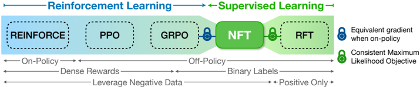
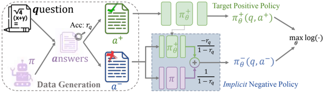

# nft — NFT: Bridging Supervised Learning and Reinforcement Learning in Math Reasoning

> **一句话重点 (TL;DR)**：通过 Bayes 规则把生成策略拆为正/负策略，并用同一目标网络隐式参数化负策略，NFT 让纯监督学习也能从负样本中"自我反思"；理论上证明 on-policy 时 NFT 与 GRPO 梯度完全等价，实证上 7B 略超 DAPO、32B 与 DAPO 基本持平。

**元信息**：arXiv 2505.18116 (v3, 2026-03-01) ｜ Tsinghua / NVIDIA / UIUC / Stanford（Huayu Chen, Kaiwen Zheng, Qinsheng Zhang, Ganqu Cui, Lifan Yuan, Yin Cui, Haotian Ye, Tsung-Yi Lin, Ming-Yu Liu, Jun Zhu*, Haoxiang Wang）｜ ICLR 2026 会议论文 ｜ 主题 T?/中等相关（RLVR 数学推理 + 负样本利用，非蒸馏）｜ 代码 https://github.com/NVlabs/NFT（已开源，含 7B/32B 训练与评测脚本，权重 HF nvidia/NFT-7B、NFT-32B）｜ 框架 VeRL（fork 自官方 DAPO 环境）+ FSDP + Ray

## 关键图示

**① Motivation / 对比图**

*Figure 1: A spectrum of online algorithms for LLM fine-tuning. NFT bridges reinforcement learning and supervised learning methods through the leverage of negative feedback via supervision.*

**② 方法 / 架构图**

*Figure 2: Illustration of the NFT algorithm. Data Collection: An LLM π generates answers to a set of math questions. Generation results are split into two sub-datasets based on their answer correctness. Policy Optimization: By constructing an implicit policy for modeling negative data, NFT enables d*

## 1. 相关工作与进展
RLVR（PPO、GRPO、DAPO 等）以 ground-truth verifier 的二元信号驱动 LLM 数学推理自我改进，相比依赖奖励模型模拟人类反馈的传统 RLHF 更可靠、相比 DPO 等偏好学习更省内存（无需成对偏好数据）。监督学习一侧，RFT（拒绝采样微调，Dong et al. 2023）已证明在正样本上微调有效，但被普遍认为只能"记忆正样本"。本文方法上与 DPO 的"用策略网络隐式参数化奖励模型"以及视觉生成中"用生成网络隐式定义条件/残差模型"在思想上同源——都强调通过隐式定义的模型做直接优化。

## 2. 现有工作存在的问题

- RFT 类 SL 方法完全丢弃负样本，被普遍视为其落后于 RL 的根因；
- "自我反思是 RL 专属、SL 天生无法从错误中学习"这一论断缺乏理论澄清；
- SL 与 RL（尤其 GRPO）之间究竟是何种关系并不清楚。

## 3. Motivation
质疑"verification-driven 自我改进是 RL 专属"的论断：能否在纯 SL 范式内同样实现从负样本中改进？若能，则 SL 与 RL 的差距主要源于负样本利用能力，而非 RL 本身的优越性。

## 4. 主要灵感 / 核心直觉
由 Bayes 规则，生成策略 π 可分解为正策略 π+ 与负策略 π−，\(r_q\cdot \pi_+ + (1-r_q)\cdot \pi_- = \pi_{\mathrm{old}}\)。因此只要 π 与 rq 已知，从负样本学 π− 等价于在塑造目标正策略 π+——负样本里同样蕴含可监督的信息。

## 5. 主要解决思路(一段话讲清核心)
\(\pi_{-,\theta} = \frac{\pi_{\mathrm{old}} - r_q\cdot \pi_{+,\theta}}{1-r_q}\)。于是在负样本上做最大似然训练就直接优化了 π+_θ（Theorem 3.1：\(\pi_{+,\theta}^* = \pi_+\)）。结合正样本的常规 MLE，得到统一的 token 级损失（Eq.9/10）：正样本走似然比对数，负样本走隐式负似然比，并用 straight-through max 算子裁剪保证对数参数为正、梯度可回传。全程只维护单一模型，内存开销极小。

## 6. 方法详解(通俗、分步骤)
在线迭代（Algorithm 1）：

1. **数据收集**：当前 LLM π 对每个 prompt q 采 K 个答案，verifier 判二元正误 r₁:K，估计正确率 r̂q=mean{r₁:K} 并记录 token 级 πold 似然。
2. **prompt 过滤**：只保留 0<rq<1 的 prompt（全对/全错无梯度信息）。
3. **构造似然比**：\(R_{t,\theta} = \pi_{+,\theta}/\pi_{\mathrm{old}}\)；\(R_{t,\theta} = \frac{1 - \hat{r}_q\cdot R_{t,\theta}}{1-\hat{r}_q}\)，再经 straight-through max 裁剪下界 ϵ。
4. **最大似然更新**：\(\theta \leftarrow \theta + \lambda \nabla \sum_t \log R_{t,\theta}\)；prompt 加权 ω(q) 侧重难题。
5. π ← π+_θ，进入下一轮。

理论分析（Sec.4）：(a) 仅二元奖励下 GRPO 的损失梯度可改写；(b) GRPO 的 group normalization（advantage 标准化）已隐含在 NFT 损失中；(c) Theorem——令 ϵ≤1，\(\nabla L_{\mathrm{NFT}} = \nabla L_{\mathrm{GRPO}}\)；二者唯一差异在 off-policy 的梯度裁剪策略（GRPO 硬置零，NFT 软衰减）。

## 7. 实验数据集

- 训练：DAPO-Math-17k（仅含整数答案的数学题）。
- 模型：Qwen2.5-Math-7B、Qwen2.5-32B（base）。
- 评测：6 个数学基准——AIME24、AIME25、AMC23（报 avg@32）、MATH500、OlympiadBench、Minerva（报 avg@1），取平均。
- 训练规模：约 5,000 梯度步、batch 512、生成温度 1.0。

## 8. 实验结果与主要发现
Table 1（均值）：

- **7B**：base 31.6 → NFT 51.7，超过 GRPO(49.5)、Dr.GRPO(49.8)、DAPO(51.2)，远超 RFT(48.3)、DPO(48.9)。
- **32B**：base 29.6 → NFT 59.2，与 DAPO(59.9)基本持平（略低 0.7），远超 RFT(52.8)。
主要发现：(1) 纯 SL（NFT）无需外部教师即可显著提升数学推理，匹配甚至超过 SOTA RL；(2) RFT 与 RL 在线训练的差距主要源于 SL 过去无法利用负样本，而非 RL 固有优越——NFT 通过负样本利用大幅弥合该差距；(3) on-policy 下 NFT 与 GRPO 实证一致，印证理论等价。

## 9. 结果如何支撑其主张
所有算法用相同训练数据、基础设施与通用超参对比，使"SL 能否匹敌 RL"的结论归因清晰。7B 上 NFT 超 DAPO、32B 持平，支撑"SL 可达 RL 水平"；NFT 显著超 RFT 支撑"负样本利用是关键差距来源"；理论等价 + on-policy 实证一致互相印证，构成自洽的"SL-RL 桥接"叙事。

## 10. 逻辑自洽性(中性评估)
理论链条（Bayes 分解 → 隐式重参数化 → Theorem 3.1 → on-policy 等价）清晰且有解释力，是本文最强部分。实验受控对比严谨。需注意：所谓"等价"严格成立仅限 on-policy；off-policy 行为仍依赖经验性的软衰减裁剪，缺乏对其最优性的理论保证。"自我反思"一词用得偏宣传——本质是"在负样本上做带符号的似然更新"，与人们直觉的"反思"语义不完全对应。

## 11. 残留问题 / 局限

- 实证增益有限：32B 仅与 DAPO 持平（甚至略低 0.7 点），核心价值是"统一视角"而非性能突破。
- 隐式负似然比需裁剪下界 ϵ 保数值稳定，off-policy 收敛性无理论保证。
- 仅在数学推理 + 整数答案可验证场景验证，对开放式/非二元奖励任务是否成立未知。
- 等价性证明依赖"无限数据与模型容量"理想假设。

## 12. 开源代码与框架(链接+框架+代码可得性)

- 代码：https://github.com/NVlabs/NFT （完整开源）。核心文件 `main_nft.py`、`ray_nft_trainer.py`、`experience_maker.py`、`verifier.py`；脚本 `train_7B.sh`/`train_32B.sh`、`eval_local_7B.sh`/`eval_local_32B.sh`；数据下载 `download_data.sh`。
- 框架：VeRL（volcengine/verl，fork 自官方 DAPO 环境，固定 commit），FSDP + Ray 分布式；NFT 继承 DAPO 绝大多数超参与设计。
- 关键超参（README/脚本）：`neg_weight`（1.0=NFT，0.0=RFT，-1.0=DAPO；32B 建议试 0.5）、`normalize`（1=Dr.GRPO 对齐、2=标准 GRPO 对齐）、`ratio_type`（token/sequence）、`clamp_negative`/`clamp_positive`（隐式负/正似然比的 straight-through 裁剪下界，默认 1.0/0.0）。
- 权重：HF nvidia/NFT-7B、nvidia/NFT-32B；验证集 HF ChenDRAG/VeRL_math_validation。7B 用 4×8 H100，32B 用 16×8 H100。
