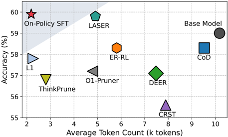
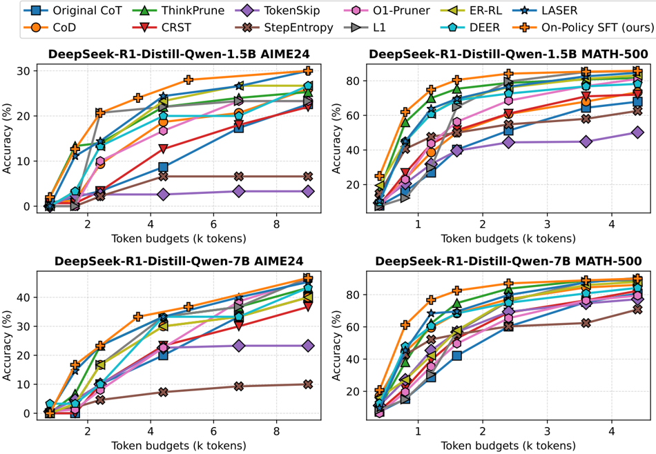

# on_policy_sft — On-Policy Supervised Fine-Tuning for Efficient Reasoning

> **一句话重点 (TL;DR)**：把"高效推理"的带长度惩罚 RL 目标做原理性化简——去掉 KL 正则、去掉组内归一化、用最简的截断式长度惩罚——可证明 GRPO 目标退化为对"按正确性与简洁性过滤的自生成数据"做交叉熵 SFT；该极简 on-policy SFT 在五个数学基准上定义了 accuracy–efficiency Pareto 前沿。

**元信息**：arXiv 2602.13407 (v1, 标注 2026-02-13；脚注 Preprint Feb 17, 2026) ｜ 东方理工(EIT, 宁波) + 香港理工 / Paris Dauphine-PSL / 上海交大 / 腾讯混元AI Lab / LMU 慕尼黑（Anhao Zhao, Ziyang Chen, Junlong Tong, Yingqi Fan, Fanghua Ye, Shuhao Li, Yunpu Ma, Wenjie Li, Xiaoyu Shen*）｜ 预印本 2026-02 ｜ 主题 T?/相关（统一 SFT-RL 视角下的高效推理，含 on-policy 自蒸馏味道）｜ 代码 https://github.com/EIT-NLP/On-Policy-SFT（已开源，`opsft/` 子目录）｜ 框架 veRL + FSDP + vLLM

## 关键图示

**① Motivation / 对比图**

*Figure 1. On-Policy SFT achieves a state-of-the-art accuracy-length trade-off on DeepSeek-R1-1.5B, reducing CoT length by approximately 80% while slightly improving accuracy.*

**② 方法 / 架构图**

*Figure 2. Performance-efficiency trade-offs of on-policy SFT and baseline methods under varying generation token budgets.*

## 1. 相关工作与进展
LRM 多用 RL（GRPO 系）训练并产生很长 CoT，带来显著推理开销。为缓解，"高效推理"方向涌现大量工作，在奖励中叠加长度惩罚/简洁性奖励（ThinkPrune、O1-Pruner、L1、LASER 等），且 RLen 与权重 γ(o|q) 的设计日趋复杂（按正确性/难度条件激活、用组内 mean/median/max 长度统计）。这些方法可统一写为 REff = RAcc + γ(o|q)·RLen。

## 2. 现有工作存在的问题

- RL-based 高效推理虽大幅缩短 CoT，但常伴随随任务复杂度变化的精度下降，得到次优的精度–效率权衡；
- 叠加多奖励（正确性 + 简洁性）联合优化使训练不稳定；
- 复杂的奖励塑形被不加甄别地沿用，与高效推理问题的内在结构未必对齐。

## 3. Motivation
重新审视：把 GRPO 等复杂目标直接套用于高效推理是否合理？作者通过原理分析指出该范式存在两处根本性错配（KL 冗余、组内归一化失配），并据此推导出能否用更简单、有原理依据的方案达到同样甚至更好的 Pareto 前沿。

## 4. 主要灵感 / 核心直觉
高效推理有两条与 RLHF 不同的关键性质：正确性与长度都**直接可验证**（无需学习奖励模型），且本质是**多奖励**问题。基于此：(1) KL 正则在 RLHF 中用于防止 reward over-optimization，但此处奖励可靠、无分布漂移之忧，故冗余；(2) 组内奖励归一化在多奖励下会放大无信息样本的梯度、并混淆不同奖励组成（举例：奖励向量 (0,1)/(0,0) 与 (1,1)/(0,0) 归一化后得到相同 advantage），引入歧义。去掉这两项 + 采用最简截断奖励（超长响应给零奖励），策略梯度目标即退化为 reward-free 的最大似然 SFT。

## 5. 主要解决思路(一段话讲清核心)
在带长度相关奖励 γ(o|q) 的 RL 目标下，移除 KL 正则、移除组内归一化、把长度惩罚简化为"截断"（超过固定长度的响应奖励为零），原始策略梯度目标就**等价于在自生成数据上做监督微调**，而该数据天然按"正确性 + 简洁性"过滤（正确且未被截断者得正奖励）。由此得极简 recipe——on-policy SFT：用当前策略自采样、过滤、对保留轨迹做交叉熵，无需 PPO/GRPO 机制与奖励塑形。

## 6. 方法详解(通俗、分步骤)

1. **Rollout**：用当前策略对每个 prompt 采 N=32 条回答（温度 1.0）。
2. **评分与过滤**：reward_fn(verifier) 判正误；截断式奖励使超长响应得零奖励。代码 `_data_filter` 按 uid 分组，**丢弃错误回答、保留全部正确回答（score>0）**；query 全错则整条丢弃；保留数对 dp_size 取整。注意"简洁性过滤"在 as-shipped 仓库中**并非由 `_data_filter` 显式按长度筛选**（length 字段被提取但代码注释明确"not used"），而是通过截断奖励——超 `max_response_length` 的响应被截断/得零奖励从而落入"错误"被丢弃——间接实现〔原 〔待核〕 已解决〕。
3. **训练**：把 verl PPO actor 的 PG 损失替换为交叉熵——`cross_entropy_loss = agg_loss(loss_mat=-log_prob, loss_mask=response_mask, loss_agg_mode="token-mean")`，即对 response token 的 NLL，无 advantage、无 clip、`use_kl_loss=False`。
4. **同分布训练–评测**：训练与评测用相同 prompt 模板，避免分布漂移混淆增益归因。
5. 实践指南：rollout 温度、每输入 rollout 数、length bias correction、最大输出长度等，附机制解释以稳定优化。

## 7. 实验数据集

- 训练：DeepScaleR(DSR) 为主；仓库另含 OpenThoughts3-1.2M(math-only)、GSM8K 训练集。
- Backbone：DeepSeek-R1-Distill-Qwen-1.5B 与 -7B（脚本默认 1.5B，LR=1e-6，max_gen=3500，batch=32，rollout_n=32，total_epochs=2）。
- 评测：五个数学基准 GSM8K、MATH-500、AMC23、AIME24、AIME25，报 Acc、Pass@N、平均 token 数(Tok)、压缩率(CR) 与综合效率分 Eff。
- 对比 10 个 baseline，跨 training-free / SFT-based / RL-based。

## 8. 实验结果与主要发现

- **1.5B**：整体 Acc 59.9%、Pass@N 73.6%，略超原模型(59.0%/73.5%)；平均生成长度从 10,178 → 2,186 token（约 80% 缩短）；Eff=2.74%，超最强 RL baseline(2.55%)。
- **7B**：Eff=2.97%（最高），长度较原模型缩短约 70%。
- 在不同生成长度预算下持续位于 accuracy–efficiency Pareto 前沿，优于 ThinkPrune、O1-Pruner、L1、LASER 等。
- 训练侧：每步显存与墙钟约降 50%，收敛较 RL 加速约 70%；长度控制更稳（多次生成的长度方差更低）。
- 机制分析：增益主要来自**使用 on-policy 数据**这一点本身（而非奖励设计）。

## 9. 结果如何支撑其主张
"GRPO 退化为过滤式 SFT"的理论推导 + 实证 Pareto 前沿构成主张闭环：既然去掉 KL/归一化后目标等价于过滤式 SFT，那么直接做该 SFT 应不劣于复杂 RL——实验在五基准上证实其定义 Pareto 前沿且训练更省。同分布训练–评测设计排除了 prompt 不匹配的混淆。消融"on-policy 数据是增益主因"进一步把功劳归于 on-policy 性而非奖励塑形。

## 10. 逻辑自洽性(中性评估)
"两处错配"的论证清晰且有举例支撑，化简逻辑成立。但需注意：所谓"等价于 SFT"依赖一系列简化前提（去 KL、去归一化、截断奖励），并非对任意长度奖励普适——它本质是"在某一特定的简化奖励族下成立"。"conciseness 过滤"在论文叙述与仓库实现间存在表述落差：仓库靠截断奖励间接实现，而非显式长度筛选，读者易误以为有专门的长度过滤器。Eff 等综合指标的定义对结论敏感，跨方法可比性需谨慎。

## 11. 残留问题 / 局限

- 仅在数学推理、可验证正确性场景验证；对开放式/不可验证任务不适用。
- "截断奖励"的最大长度是关键超参，过紧会牺牲难题精度——论文也承认精度随任务复杂度有边际下降风险。
- 等价性结论绑定特定简化奖励族，非对一般高效推理目标的普适证明。
- 仓库 as-shipped 与论文描述的简洁性过滤实现方式不一致（已核实为靠截断奖励间接实现）。

## 12. 开源代码与框架(链接+框架+代码可得性)

- 代码：https://github.com/EIT-NLP/On-Policy-SFT （`opsft/` 子目录，已开源）。
- 框架：veRL（基于 verl 改造），FSDP + vLLM rollout。recipe 位于 `opsft/recipe/On_Policy_SFT/`：`dp_actor.py`（PG 损失换成交叉熵）、`on_policy_sft_trainer.py`（on-policy 训练流程 + `_data_filter` 数据过滤）、`main_on_policy_sft.py`、`fsdp_workers.py`、`config/on_policy_sft_trainer.yaml`。
- 入口：`bash examples/On_Policy_SFT.sh`。关键超参（脚本确认）：LR=1e-6、MAX_GEN_LENGTH=3500、ROLLOUT_N=32、temperature=1、train_batch_size=32、use_kl_loss=False、loss_agg_mode=token-mean、total_epochs=2、2×GPU。
- 数据：仓库内置 DeepScaleR/GSM8K/OpenThoughts3 train.parquet 与八个评测 benchmark parquet。
