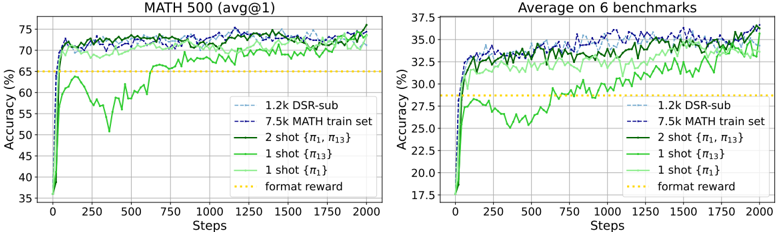
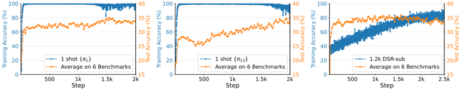

# one_shot_rlvr — Reinforcement Learning for Reasoning in Large Language Models with One Training Example

> **一句话重点 (TL;DR)**：仅用一条（甚至一条以内）训练样本做 RLVR(GRPO/PPO)，就能把 Qwen2.5-Math-1.5B 在 MATH500 从 36.0% 拉到 73.6%、六基准均值从 17.6% 升到 35.7%，基本匹配含该样本的 1.2k 子集；揭示 post-saturation generalization、跨类泛化、自反思增多等现象，支持"RLVR 主要是激发而非注入推理能力"。

**元信息**：arXiv 2504.20571 (v3, 2025-10-24) ｜ UW / USC / Microsoft / UC Santa Cruz / Georgia Tech（Yiping Wang*, Qing Yang, Zhiyuan Zeng, Liliang Ren, Liyuan Liu, … Jianfeng Gao, Weizhu Chen, Shuohang Wang*, Simon Shaolei Du*, Yelong Shen*；Yiping 于 MSR 实习完成）｜ NeurIPS 2025 ｜ 主题 T?/High（RLVR 数据效率与机理）｜ 代码 https://github.com/ypwang61/One-Shot-RLVR（已开源，本地已克隆 Tier A）｜ 框架 veRL(GRPO/PPO) + vLLM 0.6.3 + Qwen2.5-Math 评测 pipeline

## 关键图示

**① Motivation / 对比图**

*Figure 1: RLVR with 1 example (green) can perform as well as using datasets with thousands of examples (blue). Left/Right corresponds to MATH500/Average performance on 6 mathematical reasoning benchmarks (MATH500, AIME24, AMC23, Minerva Math, OlympiadBench, and AIME25). Base model is Qwen2.5-Math-1.*

**② 方法 / 架构图**

*Figure 2: Post-saturation generalization in 1-shot RLVR. The training accuracy of RLVR with π 1 (Left) and π 13 (Middle) saturates before step 100, but their test performance continues improving. On the other hand, the training accuracy for RLVR with 1.2k DSR-sub dataset (Right) still has not satura*

## 1. 相关工作与进展
RLVR（以规则化二元 outcome reward 做 RL）已大幅推进 LLM 数学推理（o1、DeepSeek-R1、Kimi-1.5）。但研究多聚焦算法侧（PPO/GRPO/DAPO），数据侧（需要多少、什么数据最有效）相对被忽视。最相关前作 LIMR 用 LIM 分数把训练数据减少约 6 倍仍保持性能。

## 2. 现有工作存在的问题

- RLVR 训练集究竟能压缩到何种极限尚未探明；
- 数据质量/数量如何关联 self-reflection、跨任务泛化等经验现象不清楚。

## 3. Motivation
回答一个极限问题：在保持与全量数据相当性能的前提下，RLVR 训练集最少能减到多少？并借此考察 RLVR 增益究竟来自"注入新能力"还是"激发已有潜能"。

## 4. 主要灵感 / 核心直觉
若单条样本即可激发出接近全量训练的推理能力，则强烈暗示 base model 已蕴含大量推理潜能，RLVR 的作用更偏"激发/对齐"而非"灌输知识"。这把研究重心从算法复杂度转向数据效率与机理。

## 5. 主要解决思路(一段话讲清核心)
提出 **1-shot RLVR**：仅用单条（或两条）数学样本，按标准 verl GRPO（也验证 PPO）流程在线训练。配套**历史方差分数(Historical Variance Score)**做数据选择——先用全集 RLVR 训 E 个 epoch，记录每条样本逐 epoch 训练准确率列表，按其方差降序排名，高方差样本（如 π₁、π₁₃）在 1-shot 下表现好；但作者强调该准则非最优，许多中低方差样本单独训练也能涨分，说明这是普遍现象。

## 6. 方法详解(通俗、分步骤)

1. 用全集 RLVR 训 E epoch，逐样本记录逐 epoch 训练准确率 → 算方差 → 排名（Eqn.1/2）。
2. 取排名靠前样本（如 π₁、π₁₃）作 1-shot/2-shot 训练集。
3. 按 verl pipeline 做 GRPO：binary 0-1 outcome reward；KL 系数 β=0.001、entropy 系数 α=−0.001；rollout 温度 0.6（vLLM）；batch=mini-batch=128，每 prompt 采 8 条 → 每 rollout 步 8 次梯度更新；max prompt 1024 / response 3072（上下文 4096）。
4. 评测用 Qwen2.5-Math 官方脚本；AIME/AMC 因题量小重复测试集 8 次、温度 0.6 报 avg@8，其余 3 基准温度 0。

## 7. 实验数据集

- 训练实例池：DeepScaleR-Preview 的 1209 条子集（DSR-sub）；对比用 MATH 训练集(7500 条)。
- 评测：6 数学基准（MATH-500、AIME24、AMC23、Minerva、OlympiadBench、AIME25）；非数学泛化 ARC-Easy/Challenge。
- 模型：Qwen2.5-Math-1.5B/7B、Llama-3.2-3B-Instruct、DeepSeek-R1-Distill-Qwen-1.5B（附录另含 Qwen2.5-1.5B 等）。

## 8. 实验结果与主要发现

- **1-shot（Qwen2.5-Math-1.5B）**：MATH500 36.0→73.6%（超 format-correction 增益 +8.6%），6 基准均值 17.6→35.7%（非格式增益 +7.0%），基本匹配含该样本的 1.2k DSR-sub（73.6/35.9）。
- **2-shot（π₁+π₁₃）**：均值 36.6%、MATH500 74.8%，略超 1.2k 子集、与 7.5k MATH 全集相当。
- 现象：(1) **post-saturation generalization**——训练准确率快速逼近 100% 后测试准确率仍持续上升，过拟合到约 1.4k 步才出现，且过拟合后训练样本输出退化为多语言乱码，但测试输出仍可读、性能仍强；(2) 跨类泛化（单类样本提升其他类）；(3) 自反思词频与响应长度上升；(4) 增益主要源自 policy gradient loss，区别于依赖 weight decay 的 grokking；(5) 适当系数 entropy loss 促进探索可进一步提升；(6) 仅用 entropy loss、无 outcome reward 也有（弱于 format-reward 的）提升。
- 跨模型/算法(GRPO、PPO)/不同样本均观察到类似大幅提升。

## 9. 结果如何支撑其主张
"单样本≈1.2k 子集≈全集"的并列对比直接支撑"RLVR 训练集可极限压缩"；跨模型、跨算法、跨样本的一致性排除了偶然性；post-saturation、跨类泛化、自反思增多等现象共同支撑"激发而非注入"的机理解读。消融（policy gradient loss 为主因、entropy 单独亦有效）把功劳定位到具体损失成分而非数据量。

## 10. 逻辑自洽性(中性评估)
实证非常扎实、现象丰富，多角度交叉验证使核心结论可信。但有边界需注意：(1) 现象集中在 Qwen2.5-Math 系，其 base 已在数学语料上充分预训练，"激发"叙事对预训练较弱的模型未必成立（Llama-3.2-3B 增益相对有限）；(2) 历史方差分数需先跑全集训练才能算，故"数据选择"本身并不省算力，1-shot 的省是指 RL 阶段；(3) 过拟合后训练样本输出退化为乱码却仍泛化，这一现象机理论文给出观察但未给出完整理论解释。

## 11. 残留问题 / 局限

- 主要局限于数学、可验证奖励、Qwen-Math 系 base，泛化到其他领域/弱 base 待验。
- 历史方差分数非最优选择准则，且依赖全集预训练，选择阶段不省算力。
- post-saturation 下训练输出退化为多语言乱码的机理未充分解释。
- 单样本训练对超参（entropy 系数、训练步数）较敏感，过训会过拟合。

## 12. 开源代码与框架(链接+框架+代码可得性)

- 代码：https://github.com/ypwang61/One-Shot-RLVR （已开源，本地已克隆，Tier A，约 70MB）。
- 框架：veRL（改编自 verl + rllm/DeepScaleR，仓库内含完整 `verl/` 目录），算法 GRPO（也验证 PPO）；推理 vLLM 0.6.3；评测复用 Qwen2.5-Math 官方 pipeline（`Qwen2.5-Eval/`，latex2sympy）。
- 模型/数据：HF 集合 ypwang61/one-shot-rlvr；数据集 ypwang61/One-Shot-RLVR-Datasets。
- 关键超参：β=0.001、α=−0.001、rollout 温度 0.6、batch=mini-batch=128、每 prompt 8 rollout、max prompt 1024 / response 3072。
