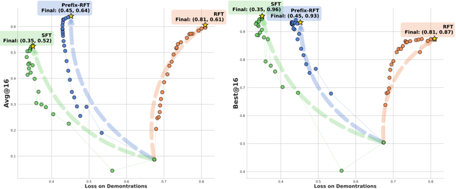
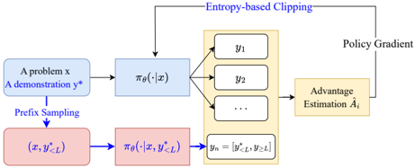

# prefix_rft — Prefix-RFT: Blending Supervised and Reinforcement Fine-Tuning with Prefix Sampling

> **一句话重点 (TL;DR)**：从 demonstration 采一段前缀作为 off-policy 引导、让当前策略续写作为 on-policy 探索，整条混合轨迹一起进 RFT；用前缀感知 advantage、熵约束裁剪与余弦衰减的前缀长度调度，把 SFT 的过程监督与 RFT 的目标导向优化在单阶段内融合。

**元信息**：arXiv 2507.01679（v3 2026-05-15）｜ 爱丁堡 ILCC + 复旦 + 阿里 Qwen + StepFun + UvA ILLC ｜ ICML 2026 ｜ 主题 T3/T4（SFT-RL 统一），相关性 High（前缀=教师脚手架、续写=自主路径，对应路径选择/恢复）｜ 代码 github.com/ZeroYuHuang/prefix_rft（已克隆约 9.1MB，完整）｜ 框架 veRL（recipe/prefix_rft）。

## 关键图示

**① Motivation / 对比图**

*(a) Training trajectories on the Train 2 k . The figure highlights the distinct learning objectives and paradigms of SFT and RFT, and indicates that Prefix-RFT effectively blends both methods regarding training objectives.*

**② 方法 / 架构图**

*Figure 1. Given a problem and a demonstration, a prefix is sampled to guide the online continuation. The concatenated sequence y n is mixed with other online rollouts to perform RFT-style training.*

## 1. 相关工作与进展
LLM 后训练两大范式：SFT（模仿 demonstration，简单、注入知识）与 RFT（奖励驱动，提升能力但依赖初始策略）。近期出现并行融合方法 ReLIFT、UFT、LUFFY（LUFFY 把整条 demonstration 混入 on-policy RFT），以及 SimpleRL-Zero、Oat-Zero 等 Zero-RL。

## 2. 现有工作存在的问题

- SFT 是 behavior cloning，泛化/鲁棒性差。
- RFT 奖励稀疏、难做 token 级 credit assignment（易致 language mixing 等异常），效果强依赖初始策略，被质疑只是 "打磨已有能力" 而非提升上界。
- 二者通常被当作两个独立串行阶段，缺乏形式化统一框架；LUFFY 等混入整条 demo 又会限制自主探索、难突破性能上界。

## 3. Motivation
提出 SFT 与 RFT 的统一视角：二者核心更新动力学一致（SFT 相当于把 advantage 隐式置 1 的策略梯度；PG 用 advantage 加权；PPO 再加 per-token clip）。核心问题：如何把 SFT 的过程监督与 RFT 的目标导向优化形式化融合，既起步可靠又保留探索？

## 4. 主要灵感 / 核心直觉
(1) 高质量 prefix 是比纯 RFT 更强的探索引导——若混合轨迹得高奖励，则该 prefix 被强化；(2) 相比给整条 demo 的 SFT，只给前缀保留了 RFT 的解题目标与 "受约束的自主性"：沿可靠路径起步、但仍可探索更优续写。

## 5. 主要解决思路(一段话讲清核心)
从 demonstration 采样一段 prefix，让当前策略续写得到 continuation；组合序列 = off-policy prefix + on-policy continuation，作为一条 trajectory 与标准 on-policy rollout 一起参与 RFT advantage 估计与 PPO 更新。

## 6. 方法详解(通俗、分步骤)

- **前缀感知 advantage**：`compute_grpo_prefix_outcome_advantage` / `compute_dr_grpo_prefix_outcome_advantage`——prefix token 与 continuation token 分别按 prefix 分组归一化，prefix advantage 经 `/num_rollouts_per_prefix` 缩放后用 `prefix_mask` 写回。〔已核 recipe/prefix_rft/core_algos.py:162-215, 262-307〕
- **策略损失**：on-policy 部分用 PPO dual-clip（clip_ratio_low/high，clip_ratio_c=3.0），off-policy(prefix) 部分用独立的 `cliprange_low_off/high_off` 裁剪（`enable_clip` 控制），按 prefix_mask 合并。
- **熵约束裁剪（核心组件）**：因 π_off 可能远离当前策略、prefix token 的 π_θ 概率普遍偏低，其梯度易压制 RFT 梯度；故只对 **top-k% 高熵 prefix token** 计入梯度，其余 prefix token advantage 置零（保守 off-policy 滤波：低熵 token 要么已被匹配信号小，要么是会引发尖锐覆写的 "自信错配"）。代码以 dp_actor.py 的 entropy "reshaper"（off_adv_reshaper：entropy/entropy_low/random masking）实现。〔已核 recipe/prefix_rft/dp_actor.py:64-86〕
- **前缀长度余弦衰减调度**：L=⌊l·|y\*|⌋，l~U(low, high)；high 为常数，low 全程从 high 余弦衰减到近零——既缓解 "只学开头 token" 的位置偏置，又内置课程学习（由 "几乎给全 demo" 过渡到 "几乎纯 RFT"，对应 SFT→RFT 配方）。代码 scheduler/global_step.py 的 `cosine_decay` controller；avg_score.py 另可按平均分调度。〔已核〕
- **默认超参（config/prefix_rft_trainer.yaml，已核）**：clip_ratio_low=high=0.2、clip_ratio_c=3.0、entropy_coeff=0.001；yaml 中 adv_estimator=gae 为上游模板残留，prefix recipe 运行时改用 prefix-aware GRPO/Dr.GRPO。

## 7. 实验数据集

- 训练（已核 PDF §4）：OpenR1-Math-220K 的长度过滤子集（沿用 LUFFY/Yan et al.）约 **46k 题**，每题配一条 **DeepSeek-R1 生成的 demonstration**（即 prefix 来源）。
- 主基座：**Qwen2.5-Math-7B**（Table 1 主实验）；另在 Qwen2.5-Math-1.5B、LLaMA-3.1-8B、Qwen3-1.7B-base 上验证（Tab.6）。
- 评测：6 个数学基准（AIME24、AIME25、AMC、MATH-500、Minerva、OlympiadBench）+ 3 个通用域（ARC-c、GPQA*、MMLU-Pro）；另用 **AIME pass@2024**（大 k 采样）评估推理能力边界扩展。
- 基线：Zero-RL（SimpleRL-Zero、Oat-Zero）、同基座同数据的 RFT/SFT/RFT w/ SFT-Loss/SFT+RFT，及并行混合方法 ReLIFT、UFT、LUFFY。

## 8. 实验结果与主要发现

- veRL recipe：每 prompt N 条序列中 N−1 条纯 on-policy rollout、第 N 条为 "prefix(off-policy)+continuation(on-policy)" 混合轨迹（**非额外增加一条，rollout 预算与标准 RFT 一致**），全部共同估计 prefix-aware advantage，actor 用带 off-policy 分支的 dual-clip PPO 更新。〔已核〕
- 主结论：Prefix-RFT 超越纯 SFT、纯 RFT、SFT→RFT 两阶段，以及并行 mixed-policy 方法（LUFFY 等）；对 demonstration 质量/数量鲁棒；能扩展推理能力边界（AIME pass@2024 提升），而 LUFFY 未能显著推高上界。
- 消融：熵约束裁剪、前缀长度调度均被验证为有效组件。

## 9. 结果如何支撑其主张
"统一且更优" 由与 SFT/RFT/两阶段/并行混合四类基线的全面对比支撑；"扩展能力上界" 由 pass@2024（大 k）相对 LUFFY 的提升支撑；"鲁棒" 由 demonstration 数量/质量消融支撑。证据与主张对应较紧密。

## 10. 逻辑自洽性(中性评估)
统一视角（SFT=advantage≡1 的 PG 特例）推导清晰，方法是该视角的自然实例化。熵约束裁剪与长度调度有合理直觉且有消融背书。需注意：yaml 默认 adv_estimator=gae 与正文 GRPO/Dr.GRPO 不一致，属模板残留（运行时覆盖），易误读但不影响结论。

## 11. 残留问题 / 局限

- 实验集中于数学推理 + 单一 DeepSeek-R1 demonstration 来源；跨域（代码、通用 agent）泛化未充分展开。
- top-k% 高熵阈值、前缀长度 (low,high) 区间为关键超参，对其敏感性的系统分析有限。
- num_rollouts_per_prefix 缩放的默认取值随 run 脚本设定，正文未给统一最优值。
- 依赖高质量 demonstration 可得；无 demo 场景退化为纯 RFT。

## 12. 开源代码与框架(链接+框架+代码可得性)

- 仓库：https://github.com/ZeroYuHuang/prefix_rft（CloneTier=A，本地约 9.1MB，完整）。核心：recipe/prefix_rft/（core_algos.py 多种 prefix advantage、dp_actor.py 熵 reshaper、ray_trainer.py、rl_dataset.py、templates.py、scheduler/）。
- 框架：veRL（全部 prefix-rft 代码集中在 recipe/prefix_rft）。
- 代码可得性：完整开源，关键算法（前缀 advantage、熵裁剪、余弦调度）均可逐行核验。
