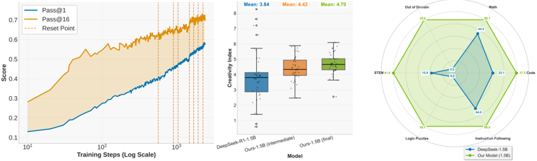
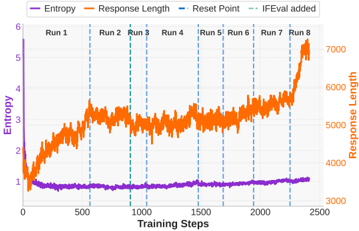

# prorl — ProRL: Prolonged Reinforcement Learning Expands Reasoning Boundaries in LLMs

> **一句话重点 (TL;DR)**：用 KL 正则 + 周期性参考策略硬重置 + DAPO 解耦 clip/动态采样稳定住长程 RL，让 GRPO 训练能跑 2k+ 步而不熵坍缩，从而在 base 模型即使大量采样也无法触及的任务上发现新推理策略——主张 RL 确能扩展（而非仅放大）推理边界。

**元信息**：arXiv 2505.24864（v1 2025-05-30）｜ NVIDIA（Mingjie Liu 等，含 Yejin Choi、Jan Kautz）｜ 2025-05 预印本（under review）｜ 主题 T3（RL 算法/训练），与长程 RL、探索-稳定性直接相关 ｜ 代码 **仅发布模型权重**（无训练代码仓库）｜ 框架 veRL。

## 关键图示

**① Motivation / 对比图**

*Figure 1: Benefits of prolonged reinforcement learning (ProRL). Left : Pass@1 and Pass@16 scales with ProRL training. Middle : ProRL leads to more novel solutions reflected by higher Creativity Index [12]. Right : Our model greatly surpass base model across diverse tasks.*

**② 方法 / 架构图**

*Figure 2: ProRL training dynamics.*

## 1. 相关工作与进展
o1、DeepSeek-R1 等推理模型通过 test-time scaling（长 CoT、探索/验证/回溯）在数学、代码等任务上大幅提升，RL（针对可验证奖励 RLVR）是核心驱动并能缓解 reward hacking。

## 2. 现有工作存在的问题
- 流行观点认为 RL 不带来超越 base 的新能力（base 即使大量采样也做不出的题，RL 后仍不行），只是放大已潜在的高奖励输出。
- 长程 RL 面临**熵坍缩**与不稳定：输出分布过早变尖、熵骤降、探索受限；GRPO 依赖多样采样估相对优势，熵坍缩使更新偏置、训练停滞。
- 单纯提高采样温度只能延缓而非阻止熵坍缩。

## 3. Motivation
挑战 "RL 不扩展能力" 的假设：主张通过**延长 RL（ProRL）**配合恰当稳定化，能发现 base 即使大量采样也触及不到的**新推理策略**，并验证推理边界提升与 base 任务能力、训练时长强相关——说明 RL 能随时间探索并填充新解空间。

## 4. 主要灵感 / 核心直觉
"边界扩展需要持续的探索预算"：只要能压住熵坍缩、让训练长期保持探索且不偏离稳定参考太远，RL 就能在 2k+ 步内持续涌现新颖（与预训练语料重叠低、Creativity Index 高）的解法，而非早早收敛到 base 分布内的高奖励 mode。

## 5. 主要解决思路(一段话讲清核心)
以 GRPO 为基座（去 critic、组内标准化优势），叠加 DAPO 的解耦 clip + 动态采样、KL 正则、以及**周期性把参考策略硬重置为近期在线快照**，从而维持熵、防偏离、避免 KL 项随训练主导损失而停滞，支撑 "prolonged" 训练。

## 6. 方法详解(通俗、分步骤)
基座 **GRPO**：A(τ)=(R−mean)/std。叠加：
1. **DAPO 两组件**：
   - **Decoupled Clip（clip-higher）**：把 PPO 上下 clip 界拆成独立 ε_low/ε_high，调高 ε_high 提升低概率 token、鼓励探索、保留熵、减少过早 mode collapse。
   - **Dynamic Sampling**：过滤一贯全对(acc=1)/全错(acc=0) 的 prompt，聚焦中等难度、维持学习信号。
2. **KL 正则 + 参考策略重置（关键创新）**：
   - L = L_GRPO − β·D_KL(πθ‖π_ref)，维持熵并防偏离稳定参考、抑制对 spurious reward 过拟合。
   - 反 "去 KL" 主流观点：因本工作从已能产生连贯 CoT 的良好起点（DeepSeek-R1-Distill-Qwen-1.5B）出发，保留 KL 有益于稳定与持续熵。
   - **Reference Policy Reset**：训练推进后 KL 项渐主导、更新变小；故周期性把 π_ref **硬重置**为近期在线快照并重置优化器状态，在保留 KL 收益的同时持续提升、避免过早收敛。

## 7. 实验数据集
- 训练：自构 **136K** 可验证问题，覆盖数学、代码、STEM、逻辑谜题（Reasoning Gym）、指令遵循，每类配清晰奖励（二值或连续）。
- 评测：跨域 pass@k；与 DeepSeek-R1-Distill-Qwen-1.5B 及领域专用基线对比；用 **Creativity Index** 衡量推理轨迹与预训练语料的重叠（越低越新颖）。

## 8. 实验结果与主要发现
- 框架 veRL；基座 DeepSeek-R1-Distill-Qwen-1.5B；产出 **Nemotron-Research-Reasoning-Qwen-1.5B**（号称当时最强 1.5B 推理模型）。
- 超参（已核 §3）：GRPO+DAPO 解耦 clip ε_low=0.2、ε_high=0.4；动态采样过滤 acc=0/1；每 prompt n=16；高采样温度 **1.2**；batch 256、mini-batch 64（每 rollout 步 4 次更新）；AdamW 常数 lr 2×10⁻⁶；约 16k GPU·小时（4×8 H100）；多数训练 response 上限 8k，末段约 200 步提至 16k。
- 主结果（相对 base，已核 §3 行 201-202/305-308）：数学 **+15.7%**、代码 **+14.4%**、STEM **+25.9%**、指令遵循 **+22.0%**、逻辑谜题 **+54.8%**；并超领域专用基线（数学 +4.6%、代码 +6.5%）。
- 延长训练得到更高 Creativity Index（新颖模式涌现）；RL 模型在 base 完全失败（任意尝试次数）的场景仍优于 base，支撑 "RL 能扩展推理边界、无需额外数据"。
- 〔NEW 待核〕**论文内部数值不一致**：摘要（行 104-105）报数学 +14.7%、代码 +13.9%、STEM +25.1%、指令 +18.1%、逻辑 +54.8%；而 §3/详细结果（行 201-202、305-308）报 +15.7%/+14.4%/+25.9%/+22.0%/+54.8%。本分析采用 §3/结果节一致的后一组（与 Table 数值对应），但摘要存在不同口径，原因（不同采样/口径）论文未说明。

## 9. 结果如何支撑其主张
"RL 扩展边界" 由两点支撑：(a) base 任意采样次数仍失败的题上 RL 模型有正确解；(b) Creativity Index 随训练上升（与预训练语料重叠下降）。"延长有效" 由 2k+ 步持续提升曲线支撑。稳定化各组件由消融/曲线说明对熵的维持作用。

## 10. 逻辑自洽性(中性评估)
内在逻辑自洽且与 ORZ "去 KL" 的对立主张可调和——ProRL 明确把适用前提限定在 "良好初始化（已蒸馏）起点"。但 "扩展边界" 的核心证据（pass@k 在大 k 下 base 仍 0）对 k 的取值与采样温度敏感，结论强度依赖该测度的稳健性。摘要与正文数值不一致削弱了表面严谨性（虽不改变定性结论）。

## 11. 残留问题 / 局限
- 仅 1.5B 单一规模、单一 base（R1-Distill）；更大模型/不同起点的可迁移性未验证。
- "扩展边界 vs 放大分布" 的判定依赖 Creativity Index 与大 k pass@k，两者皆有测度争议。
- 摘要 vs 正文增益数值不一致（见 §8 NEW）。
- 无独立训练代码，复现依赖对 veRL + 描述超参的自行拼装。

## 12. 开源代码与框架(链接+框架+代码可得性)
- 仅发布**模型权重**：https://huggingface.co/nvidia/Nemotron-Research-Reasoning-Qwen-1.5B 。无独立训练代码仓库。
- 框架：veRL（verl-based）；算法 = GRPO + DAPO（解耦 clip + 动态采样）+ KL 正则 + 参考策略重置。
- 代码可得性：paper-only（weights-only，无训练代码，需依论文超参在 veRL 上复现）。
